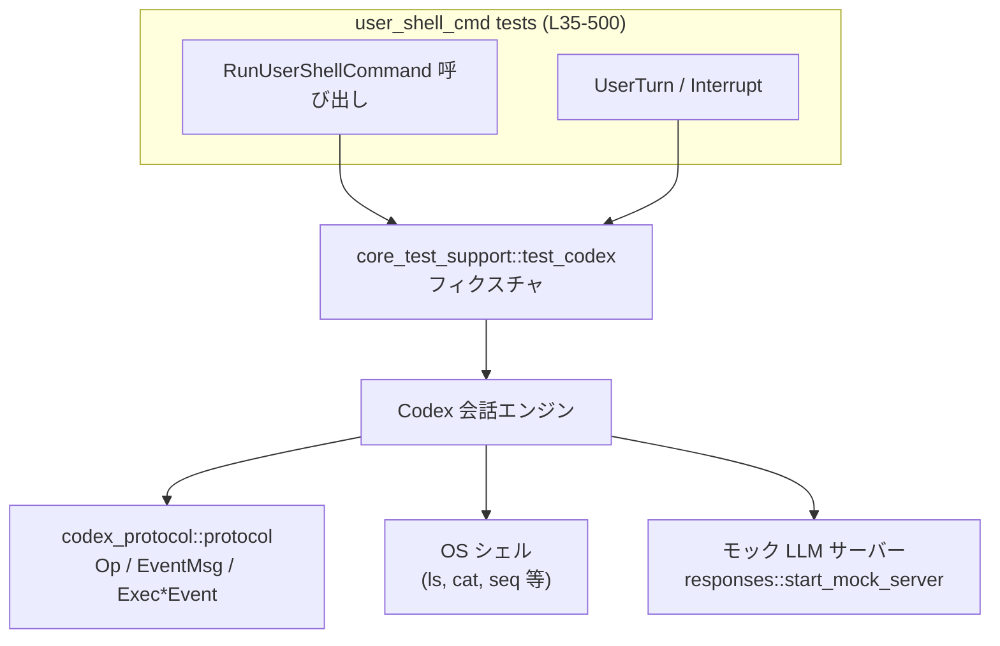

# core\tests\suite\user_shell_cmd.rs コード解説

## 0. ざっくり一言

`Op::RunUserShellCommand` まわりの挙動をエンドツーエンドで検証するテスト群です。  
ワーキングディレクトリ、割り込み、同時進行中のターンとの関係、履歴フォーマット、ネットワークサンドボックス環境変数、出力トランケーション（切り詰め）などを確認しています。

---

## 1. このモジュールの役割

### 1.1 概要

このテストモジュールは、**ユーザーが直接実行するシェルコマンド**機能が次の点を満たしているかを検証します。

- コマンドが指定したカレントディレクトリで実行され、`stdout` と `exit_code` が期待通りに得られること  
  （例: `ls` / `cat` の動作確認, `core/tests/suite/user_shell_cmd.rs:L35-98`）
- 長時間実行コマンドが `Op::Interrupt` により中断され、`TurnAbortReason::Interrupted` が届くこと  
  （`L100-139`）
- モデル実行中のアクティブターンを **置き換えずに** ユーザーシェルコマンドが並行して完了すること  
  （`L141-250`）
- 実行したコマンドと結果が履歴として保存され、モデルに特定のテキストフォーマットで共有されること  
  （`L252-333`）
- ネットワークサンドボックス関連の環境変数がユーザーシェルには設定されないこと  
  （`L335-371`）
- 長大な出力が履歴に保存される際、一度だけ適切にトランケーションされること  
  （`L373-434`, `L436-500`）

### 1.2 アーキテクチャ内での位置づけ

テストは以下のコンポーネントを経由してシステム全体を検証します。

- `core_test_support::test_codex::test_codex` で Codex 本体のテスト用フィクスチャを作成  
  （`L24`, `L104-109`, `L145-146` など）
- `Op::RunUserShellCommand`, `Op::UserTurn`, `Op::Interrupt` により Codex に操作指示  
  （`L61`, `L80`, `L114`, `L172`, `L205`, `L270`, `L350`, `L392`, `L482`）
- Codex から `EventMsg::*`（`ExecCommandBegin/End`, `ExecCommandOutputDelta`, `TurnComplete`, `TurnAborted` 等）がストリームで返る  
  （`L64-67`, `L119-123`, `L191-196`, `L275-287`, `L289-297`, `L299-305`, `L307`, `L353-361`, `L396-400`）
- `core_test_support::responses::*` と `start_mock_server` により LLM サーバーを HTTP + SSE でモック  
  （`L15-23`, `L143`, `L254`, `L337`, `L376`, `L440`, `L459-478`）
- 長い出力を history に埋め込み、モデルに送られる HTTP リクエストボディを検査  
  （`L309-330`, `L405-431`, `L487-493`）



### 1.3 設計上のポイント

- **イベント駆動の検証**  
  すべてのテストが `EventMsg` を待ち受けて挙動を確認します。  
  例: `wait_for_event_match` で `ExecCommandBegin` や `TurnAborted` を待つ（`L119-125`, `L191-197`, `L275-279`, `L289-293`, `L299-303`, `L353-361`, `L396-400`）。
- **非同期・並行性の確認**  
  `#[tokio::test]` や `#[tokio::test(flavor = "multi_thread", worker_threads = 2)]` を用い、  
  マルチスレッドランタイム上で、モデルのシェルコマンドとユーザーシェルコマンドの並行実行を検証しています（`L141-142`, `L252-253`, `L373-374`, `L436-437`）。
- **明示的なエラー／タイムアウト処理**  
  - テスト本体は `anyhow::Result<()>` を返して `?` 演算子を利用し、失敗時は即座にテストを落とします（`L142`, `L253`, `L336`, `L375`, `L437`）。
  - 長時間待ちにならないよう `wait_for_event_with_timeout` や `tokio::time::timeout` で上限時間を決めています（`L129-133`, `L214-217`）。
- **環境依存の吸収**  
  - Windows と Unix でコマンドや改行コードを切り替えています（`L93-96`, `L148-158`, `L264-267`, `L343-347`, `L385-388`, `L450-459`）。
- **出力トランケーションの仕様テスト**  
  - ツール出力のトークン上限設定（`config.tool_output_token_limit`）に応じた履歴整形を、期待される文字列パターンで検証しています（`L379-381`, `L424-431`, `L442-446`, `L492-497`）。

---

## 2. 主要な機能一覧

このモジュールの「機能」は、それぞれ 1 つのテストケースとして実装されています。

- `user_shell_cmd_ls_and_cat_in_temp_dir`  
  : 一時ディレクトリ内で `ls` と `cat` を実行し、ユーザーシェルコマンドの基本動作と cwd 設定が正しいことを検証（`L35-98`）。
- `user_shell_cmd_can_be_interrupted`  
  : 長時間実行コマンドを `Op::Interrupt` で中断でき、`TurnAbortReason::Interrupted` が通知されることを検証（`L100-139`）。
- `user_shell_command_does_not_replace_active_turn`  
  : モデルのシェルコマンド実行中にユーザーシェルコマンドを走らせても、アクティブターンが `Replaced` として中断されないことを検証（`L141-250`）。
- `user_shell_command_history_is_persisted_and_shared_with_model`  
  : 実行したユーザーシェルコマンドと結果が履歴に追加され、LLM に `<user_shell_command>` タグ付きのテキストとして渡されることを検証（`L252-333`）。
- `user_shell_command_does_not_set_network_sandbox_env_var`  
  : `NetworkSandboxPolicy::Restricted` 設定時でも、ユーザーシェルでは `CODEX_SANDBOX_NETWORK_DISABLED` 環境変数が設定されないことを検証（`L335-371`）。
- `user_shell_command_output_is_truncated_in_history`  
  : 大量出力（1〜400行）のユーザーシェル結果が履歴へ保存される際、先頭・末尾・トランケーション概要のみ残る特定フォーマットで保存されることを検証（`L373-434`）。
- `user_shell_command_is_truncated_only_once`  
  : ユーザーシェル出力が一度トランケートされた後、再利用されてもトランケーションヘッダが二重に付かないことを検証（`L436-500`）。

---

## 3. 公開 API と詳細解説

### 3.1 型一覧（構造体・列挙体など）

このファイル内で重要な役割を持つ型の一覧です（定義自体は他モジュールにあります）。

| 名前 | 種別 | 役割 / 用途 | 根拠 |
|------|------|-------------|------|
| `Op` | enum | Codex に対する操作。`RunUserShellCommand`, `UserTurn`, `Interrupt` などを含む（操作種別の基礎）。 | `core/tests/suite/user_shell_cmd.rs:L9,L61,L80,L114,L172,L205,L270,L350,L392,L482` |
| `EventMsg` | enum | Codex から流れてくるイベント。`ExecCommandBegin`, `ExecCommandEnd`, `ExecCommandOutputDelta`, `TurnComplete`, `TurnAborted` 等を表す。 | `L5,L64,L119,L191,L275,L289,L299,L307,L353,L396` |
| `ExecCommandEndEvent` | 構造体 | シェルコマンド終了時のイベントペイロード。`stdout`, `stderr`, `exit_code`, `source` 等を含む。 | `L6,L65-67,L84-87,L353-357` |
| `ExecCommandSource` | enum | コマンドの発行元を区別する。`UserShell` と `Agent` が使われる。 | `L7,L120,L192,L280,L222` |
| `ExecOutputStream` | enum | 出力ストリーム種別（`Stdout`/`Stderr` 等）。ここでは `Stdout` を検証。 | `L8,L294` |
| `SandboxPolicy` | enum | サンドボックス権限ポリシー。ユーザーターン実行時に指定される。 | `L10,L181,L483` |
| `NetworkSandboxPolicy` | enum | ネットワーク制限のポリシー。`Restricted` を設定してテスト。 | `L3,L339` |
| `TurnAbortReason` | enum | ターン中断理由。`Interrupted` と `Replaced` を検証。 | `L11,L138,L219` |
| `UserInput` | enum/構造体群 | ユーザーからの入力。ここでは `UserInput::Text` が使われる。 | `L12,L173-176` |
| `Feature` | enum | 機能フラグ。ここでは `ShellSnapshot` を無効化して履歴マッチングを容易にする。 | `L2,L259` |
| `TempDir` | 構造体 | 一時ディレクトリを作成するテスト用の作業ディレクトリ。 | `L31,L38` |
| `Duration` | 構造体 | タイムアウト値など時間指定に利用。 | `L32,L132,L214` |

#### 関数・テスト一覧（コンポーネントインベントリー）

| 関数名 | 種別 | 役割 / 用途 | 行範囲 |
|--------|------|------------|--------|
| `user_shell_cmd_ls_and_cat_in_temp_dir` | `#[tokio::test] async fn` | ユーザーシェルの基本的な cwd・stdout・exit code の挙動を検証。 | `core/tests/suite/user_shell_cmd.rs:L35-98` |
| `user_shell_cmd_can_be_interrupted` | `#[tokio::test] async fn` | `RunUserShellCommand` を `Interrupt` で中断できることを検証。 | `L100-139` |
| `user_shell_command_does_not_replace_active_turn` | `#[tokio::test(flavor="multi_thread")] async fn` | モデルのツール実行中にユーザーシェルコマンドを実行してもアクティブターンが置き換わらないことを検証。 | `L141-250` |
| `user_shell_command_history_is_persisted_and_shared_with_model` | 同上 | コマンドと結果が履歴に保存され、モデルへの入力に `<user_shell_command>` ブロックとして含まれることをテスト。 | `L252-333` |
| `user_shell_command_does_not_set_network_sandbox_env_var` | `#[tokio::test] async fn` | ネットワークサンドボックス用環境変数がユーザーシェルには設定されないことを検証。 | `L335-371` |
| `user_shell_command_output_is_truncated_in_history` | `#[tokio::test(flavor="multi_thread")] async fn` | 大量出力の履歴トランケーションとフォーマットを検証（非 Windows）。 | `L373-434` |
| `user_shell_command_is_truncated_only_once` | 同上 | 大量出力が再利用される際にトランケーションヘッダが二重に付かないことを検証。 | `L436-500` |

### 3.2 関数詳細

#### `async fn user_shell_cmd_ls_and_cat_in_temp_dir()`  

**概要**

一時ディレクトリを作成し、そこにファイルを書き込んだ上で `ls` と `cat` をユーザーシェル経由で実行し、  
`RunUserShellCommand` が cwd と標準出力を正しく扱うことを検証するテストです（`L35-98`）。

**引数**

- なし（テスト関数のため）。

**戻り値**

- `()`（失敗時は `assert!` / `unwrap()` によりテストがパニック）。

**内部処理の流れ**

1. `TempDir::new()` で一時ディレクトリを作成し、`hello.txt` に既知の内容を書き込みます（`L38-44`）。
2. `test_codex().with_config(...)` で Codex の `config.cwd` を一時ディレクトリに設定し、フィクスチャを構築します（`L47-56`）。
3. `Op::RunUserShellCommand { command: "ls".to_string() }` を送信し（`L59-63`）、`ExecCommandEnd` イベントを待機して `exit_code` と `stdout` を検証します（`L64-75`）。
4. 続けて `cat hello.txt` を実行し（`L78-82`）、再度 `ExecCommandEnd` を待ち、`exit_code` と `stdout` がファイル内容と一致することを確認します（`L83-92`）。
5. Windows の場合、改行コードの違いを吸収するため `\r\n` を `\n` に正規化してから比較します（`L93-96`）。

**Examples（使用例）**

`RunUserShellCommand` の基本的な使い方の例として、このテストの最小形は以下のようになります。

```rust
// 一時ディレクトリを cwd に設定して Codex を準備
let cwd = TempDir::new().unwrap();                                        // L38
let cwd_path = cwd.path().to_path_buf();                                  // L48
let mut builder = test_codex().with_config(move |config| {                // L49
    config.cwd = cwd_path.abs();                                          // L50
});
let codex = builder.build(&server).await?.codex;                          // L52-56

// ユーザーシェルコマンドを実行
codex
    .submit(Op::RunUserShellCommand { command: "ls".to_string() })        // L59-63
    .await
    .unwrap();

// 終了イベントを待って結果を確認
let end = wait_for_event(&codex, |ev| matches!(ev, EventMsg::ExecCommandEnd(_))).await; // L64
let EventMsg::ExecCommandEnd(ExecCommandEndEvent { stdout, exit_code, .. }) = end else { unreachable!() }; // L65-70
assert_eq!(exit_code, 0);
println!("ls output: {stdout}");
```

**Errors / Panics**

- 一時ファイル書き込みに失敗した場合、`expect("write temp file")` でパニックします（`L42-44`）。
- Codex のビルドや `submit` が `Err` を返した場合、`unwrap()` によりパニックします（`L52-56`, `L60-63`, `L79-82`）。
- `ExecCommandEnd` イベントが取れない場合は `wait_for_event` 側でテストがブロックまたは失敗する設計です（実装は別モジュール）。

**Edge cases（エッジケース）**

- Windows 環境では `cat` の出力が CRLF になるため、LF に変換した上で比較しています（`L93-96`）。
- `ls` の出力はファイル順が実装依存ですが、このテストでは「行にファイル名が含まれるか」のみを確認して順序依存を避けています（`L72-75`）。

**使用上の注意点**

- テストとしては `unwrap()` が妥当ですが、本番コードでは `Result` を適切に扱う必要があります。
- cwd を意図したディレクトリに固定するため、`config.cwd` に絶対パスを設定している点に注意してください（`L49-51`）。

---

#### `async fn user_shell_cmd_can_be_interrupted()`

**概要**

ユーザーシェルコマンド実行中に `Op::Interrupt` を送ると、`TurnAborted` イベントが `reason=Interrupted` で届くことを検証します（`L100-139`）。

**戻り値**

- `()`（失敗時はパニック）。

**内部処理の流れ**

1. モックサーバーと Codex フィクスチャを準備します（`L103-109`）。
2. `sleep 5` のような長時間実行コマンドを `RunUserShellCommand` で送ります（`L112-116`）。
3. `ExecCommandBegin` で `source == ExecCommandSource::UserShell` なイベントが届くまで待機します（`L119-125`）。
4. `Op::Interrupt` を送信します（`L126`）。
5. `wait_for_event_with_timeout` で `TurnAborted` イベントを 60 秒のタイムアウト付きで待ち受け、`reason == Interrupted` を確認します（`L129-138`）。

**Errors / Panics**

- Codex ビルドや `submit` の失敗は `unwrap()` でパニックします（`L105-108`, `L114-116`, `L126`）。
- 指定時間内に `TurnAborted` が来ない場合、`wait_for_event_with_timeout` が `Err` を返し、テストが失敗することが想定されます（`L129-134`）。

**Edge cases**

- コマンドが即座に終了してしまうと `ExecCommandBegin` が観測できず、テストの前提が崩れます。このため意図的に `sleep 5` を用いています（`L112`）。
- 過度に負荷が高い環境では 60 秒タイムアウトに達する可能性があり、テスト時間の長さに影響します（`L132`）。

**使用上の注意点**

- 実運用で同様の割り込みを行う場合も、「開始イベントを確認してから interrupt を送る」というパターンが安全であることを示しています（`L119-126`）。

---

#### `async fn user_shell_command_does_not_replace_active_turn() -> anyhow::Result<()>`

**概要**

モデル（Agent）が `shell_command` ツールを実行中のアクティブターンが存在しても、  
ユーザーによる `RunUserShellCommand` がそのターンを `Replaced` として中断しないこと、  
かつアクティブターンが最後まで完了することを検証します（`L141-250`）。

**戻り値**

- `anyhow::Result<()>` — 中で HTTP 通信やビルドの `Result` を `?` で伝播します。

**内部処理の流れ**

1. モックサーバーと Codex フィクスチャ（モデル `"gpt-5.1"`）を準備します（`L143-146`）。
2. モデルが `shell_command` を呼び出すような SSE シナリオ（`ev_function_call("shell_command", args)`）と、その後の応答シナリオをモックサーバーに登録します（`L147-168`）。
3. `Op::UserTurn` を送信してモデルのターンを開始します（`L170-189`）。
4. `ExecCommandBegin` イベントのうち、`source == ExecCommandSource::Agent` なものが来るまで待機し、モデルのシェルコマンドが走り始めたことを確認します（`L191-197`）。
5. その間に、ユーザーシェルコマンド（`printf user-shell` など）を `RunUserShellCommand` で送信します（`L199-208`）。
6. 以降、最大 200 個のイベントを `next_event()` で読み取り、以下のフラグを更新します（`L210-231`）。
   - `saw_replaced_abort`：`TurnAborted` で `reason == Replaced` が観測されたか（`L219-221`）
   - `saw_user_shell_end`：`ExecCommandEnd` で `source == UserShell` が観測されたか（`L222-224`）
   - `saw_turn_complete`：`TurnComplete` が観測されたか（`L225-227`）
7. 最後に、ターン完了・ユーザーシェル終了が発生していること、`Replaced` が発生していないこと、  
   そしてモックサーバーへのリクエスト回数が 2 回（フォローアップまで実行）であることを `assert!` / `assert_eq!` で確認します（`L233-247`）。

**Errors / Panics**

- SSE モックのセットアップや Codex ビルドが失敗した場合、`?` で `Err` を返しテスト失敗となります（`L145-146`, `L168`, `L189`）。
- イベントストリームが終了した場合やタイムアウトした場合は `context` 付きで `Err` が返されます（`L214-217`）。
- 期待されるフラグが立たなかった場合は `assert!` でテストが失敗します（`L233-247`）。

**Edge cases**

- イベント順序が変則的でも、ループ内でフラグを更新することで順序依存を弱めています（`L218-231`）。
- 最悪 1 つ目の `timeout` で失敗するため、ループ回数 200 は実際には長時間ブロックを意味しません（`L214-217`）。

**使用上の注意点（並行性）**

- このテストは「ユーザー起点のシェルコマンドは、モデル起点のターンを置き換えるべきではない」という並行性の契約を表しています。
- 同様の要件を本番で満たすには、`RunUserShellCommand` の実装で「独立したサブタスク」として扱う必要があることを示唆しています。

---

#### `async fn user_shell_command_history_is_persisted_and_shared_with_model() -> anyhow::Result<()>`

**概要**

ユーザーシェルコマンドの実行履歴が、  
後続のモデル呼び出し時に `<user_shell_command>` ブロックとしてユーザーメッセージに含まれることを検証します（`L252-333`）。

**内部処理の流れ（要点）**

1. `Feature::ShellSnapshot` を無効化した Codex フィクスチャを作成（`L256-262`）。
2. 環境変数 `CODEX_SANDBOX` を参照し、未設定時は `not-set` を出力するコマンドを実行（`L264-273`）。
3. `ExecCommandBegin`、`ExecCommandOutputDelta`（`Stdout`）、`ExecCommandEnd`、`TurnComplete` の順にイベントを待機し、それぞれの内容を検証（`L275-307`）。
4. 別の簡単な応答を返す SSE シナリオをセットし（`L309-314`）、`test.submit_turn("follow-up after shell command")` を実行（`L316`）。
5. モデルへのリクエストから `"user"` ロールのメッセージを抽出し、`<user_shell_command>` ブロックを含むテキストを取得（`L318-325`）。
6. 実行した `command` と `Exit code: 0`, `Output: not-set` などの情報が、正規表現で指定したフォーマット通りに含まれているかを検証（`L326-330`）。

**Errors / Panics / Safety**

- 正規表現で `^...$` を指定しているため、フォーマットが少しでも変わるとテストが失敗します（`L327-330`）。
- 出力チャンクを `String::from_utf8` で変換しており、UTF-8 でない場合は `expect` によりパニックします（`L295-297`）。

**契約・前提条件**

- ユーザーシェルの出力が UTF-8 であることを前提にしています（`L295-297`）。
- 履歴フォーマット（タグ名や行順、`Duration: <秒>` 形式など）は他コードと厳密に合致している必要があります（`L327-329`）。

---

#### その他のテスト関数

残りの 3 関数については、中心となる契約のみ列挙します。

1. **`user_shell_command_does_not_set_network_sandbox_env_var`（`L335-371`）**  
   - `config.permissions.network_sandbox_policy = NetworkSandboxPolicy::Restricted` としても（`L338-340`）、  
     ユーザーシェル環境に `CODEX_SANDBOX_NETWORK_DISABLED` が設定されないことを検証します（`L343-347`, `L364-368`）。
   - セキュリティ観点として、「ユーザーシェルとネットワークサンドボックスの境界」が明示されていることを保証します。

2. **`user_shell_command_output_is_truncated_in_history`（非 Windows, `L373-434`）**  
   - `config.tool_output_token_limit = Some(100)` を設定し（`L379-381`）、`seq 1 400` のような 400 行出力コマンドを実行（`L386-388`）。
   - 履歴に保存される `<user_shell_command>` ブロック内 `Output:` が、  
     `Total output lines: 400` ヘッダ＋先頭 69 行＋トランケーション概要＋末尾行の構造になることを検証します（`L422-431`）。

3. **`user_shell_command_is_truncated_only_once`（`L436-500`）**  
   - 同じく `tool_output_token_limit = Some(100)` 下で、モデルが `shell_command` ツールを使って 2000 行出力を生成するようモック（`L442-459`, `L462-478`, `L480-485`）。
   - モデルに返される関数呼び出し結果のテキスト内で、`"Total output lines:"` が 1 回だけ現れることを確認し、二重トランケーションが起きないことを保証します（`L487-497`）。

---

### 3.3 このファイルから見える補助関数・マクロ

定義は別モジュールですが、重要なテスト用ヘルパーです。

| 関数 / マクロ名 | 役割（1 行） | 根拠 |
|----------------|-------------|------|
| `start_mock_server` | Codex が接続するモック HTTP サーバー（LLM サーバー）を起動する。 | `L22,L47,L103,L143,L254,L337,L376,L440` |
| `test_codex` | Codex テストフィクスチャのビルダを返す。 | `L24,L49,L104,L144,L256,L338,L378,L442` |
| `wait_for_event` | 条件にマッチする最初のイベントが現れるまで待機する。 | `L25,L64,L83,L307,L403` |
| `wait_for_event_match` | クロージャが `Some` を返すまでイベントを読み進め、その値を返す。 | `L26,L119,L191,L275,L289,L299,L353,L396` |
| `wait_for_event_with_timeout` | タイムアウト付きでイベントを待機する。 | `L27,L129-133` |
| `responses::mount_sse_sequence` / `mount_sse_once` | モックサーバーに対して SSE レスポンスシーケンスを登録する。 | `L15,L168,L309-L314,L462-L478` |
| `assert_regex_match` | 正規表現に対する文字列のマッチをアサートする。 | `L14,L330,L431` |
| `skip_if_no_network!` | ネットワーク未利用環境で該当テストをスキップするマクロ。 | `L23,L438` |

---

## 4. データフロー

### 4.1 代表シナリオ：履歴共有のフロー

`user_shell_command_history_is_persisted_and_shared_with_model`（`L252-333`）を例に、  
ユーザーシェルコマンド実行からモデルへの履歴共有までの流れを示します。

1. テストが `Op::RunUserShellCommand { command }` を Codex に送信（`L269-273`）。
2. Codex が OS シェルを起動し、`ExecCommandBegin` → `ExecCommandOutputDelta` → `ExecCommandEnd` とイベントをストリームに流す（`L275-297`,`L299-305`）。
3. Codex がターン終了を表す `TurnComplete` を送出（`L307`）。
4. テストが `submit_turn("follow-up after shell command")` を呼び、後続のユーザーターンを開始（`L316`）。
5. Codex がモック LLM サーバーに HTTP リクエストを送り、その中の `"user"` メッセージに `<user_shell_command>` ブロックを埋め込む（`L318-325`）。

```mermaid
sequenceDiagram
    participant Test as Test (L252-333)
    participant Codex as Codex エンジン
    participant Shell as OS Shell
    participant Events as Event Stream
    participant Model as モック LLM

    Test->>Codex: Op::RunUserShellCommand { command } (L269-273)
    Codex->>Shell: コマンド実行
    Shell-->>Codex: stdout, exit_code
    Codex-->>Events: ExecCommandBegin(UserShell) (L275-279)
    Codex-->>Events: ExecCommandOutputDelta(Stdout,"not-set") (L289-297)
    Codex-->>Events: ExecCommandEnd(exit_code=0,stdout="not-set") (L299-305)
    Codex-->>Events: TurnComplete (L307)

    Test->>Codex: submit_turn("follow-up ...") (L316)
    Codex->>Model: HTTP リクエスト (messages[user] に<br/> &lt;user_shell_command&gt; ブロック含む) (L318-329)
    Model-->>Codex: SSE 応答 (mock)
```

### 4.2 並行シナリオ：アクティブターンとユーザーシェル

`user_shell_command_does_not_replace_active_turn`（`L141-250`）では、  
モデルのシェルコマンドとユーザーシェルコマンドが並行して存在するケースを検証しています。

- モデル起点: `UserTurn` → モデル → `shell_command` ツール呼び出し → Codex によるシェル実行（`ExecCommandBegin(Agent)`）。
- ユーザー起点: その途中で `RunUserShellCommand` を実行し、別の `ExecCommandEnd(UserShell)` を観測。
- 結果: アクティブターンが `TurnComplete` で完了し、`TurnAborted(Replaced)` が発生しないことを確認（`L219-227,L233-241`）。

### 4.3 潜在的なバグ / セキュリティ観点

**バグ・テスト安定性**

- ネットワーク依存  
  - `user_shell_command_is_truncated_only_once` は `skip_if_no_network!` に依存しており、ネットワーク環境によってはスキップされます（`L438`）。
- フォーマット依存テスト  
  - 履歴テキストの正規表現が厳密なため、仕様変更（タグ名や改行位置）があるとテストがすぐに壊れる設計です（`L327-330`, `L428-431`）。

**セキュリティ・契約**

- `user_shell_command_does_not_set_network_sandbox_env_var` により、ユーザーシェルは特定のネットワーク制限環境変数を見ない想定であることが示されます（`L338-340`, `L343-368`）。  
  これは「ネットワーク制限は別レイヤーで実施される」前提を反映していると解釈できますが、このファイルからは実装詳細は分かりません。
- 履歴共有では、実行コマンドと結果がそのままモデルに渡るため、機密情報を含むコマンドを実行した場合の扱いは別途考慮が必要です（テストはあくまでフォーマットのみ検証、`L320-330`）。

---

## 5. 使い方（How to Use）

※ このファイル自体はテストですが、`RunUserShellCommand` とイベントストリームの代表的な利用方法を示しています。

### 5.1 基本的な使用方法

ユーザーシェルコマンドを実行し、終了イベントで `stdout` と `exit_code` を読む基本パターンです。

```rust
// モックサーバーと Codex フィクスチャを準備
let server = start_mock_server().await;                       // L47, L103
let mut builder = test_codex();
let fixture = builder.build(&server).await?;                  // L105-108
let codex = &fixture.codex;                                   // L109

// ユーザーシェルコマンドを送信
codex.submit(Op::RunUserShellCommand {
    command: "ls".to_string(),
}).await?;                                                    // L114-116

// ExecCommandEnd イベントを待つ
let end_event = wait_for_event_match(codex, |ev| match ev {
    EventMsg::ExecCommandEnd(event) => Some(event.clone()),   // L353-361 など
    _ => None,
}).await;

// 結果を利用
println!(
    "exit_code={} stdout={}",
    end_event.exit_code, end_event.stdout
);
```

### 5.2 よくある使用パターン

- **長時間コマンドの割り込み**  
  - パターン: `RunUserShellCommand` → `ExecCommandBegin(UserShell)` を待つ → `Op::Interrupt` → `TurnAborted(Interrupted)` を確認（`L112-138`）。
- **履歴をモデルに伝える**  
  - パターン: ユーザーシェルコマンド実行 → `TurnComplete` → 次の `UserTurn` で `<user_shell_command>` ブロックが user メッセージに付与される（`L269-273`,`L307`,`L316-330`）。
- **大量出力の扱い**  
  - `config.tool_output_token_limit` を設定することで、履歴に保存される出力量を抑制し、先頭／末尾＋トランケーション概要のみを残す（`L379-381`,`L422-431`,`L442-446`,`L492-497`）。

### 5.3 よくある間違い（このテストから推測されるもの）

```rust
// 誤り例: コマンド開始前に割り込みを送る
codex.submit(Op::RunUserShellCommand { command: "sleep 5".into() }).await?;
codex.submit(Op::Interrupt).await?; // ExecCommandBegin を待たずに送る

// 正しい例: 開始イベントを確認してから割り込み
codex.submit(Op::RunUserShellCommand { command: "sleep 5".into() }).await?;
let _ = wait_for_event_match(codex, |ev| match ev {           // L119-125
    EventMsg::ExecCommandBegin(event) if event.source == ExecCommandSource::UserShell =>
        Some(event.clone()),
    _ => None,
}).await;
codex.submit(Op::Interrupt).await?;
```

その他、次のような誤解を避けるべきです（テストから逆読みした注意点）:

- 「ユーザーシェルコマンドはモデルのアクティブターンを中断する」  
  → 実際にはそうではなく、両者は並行して完了する契約です（`L219-241`）。
- 「ネットワークサンドボックス設定はユーザーシェル環境変数にも反映される」  
  → `CODEX_SANDBOX_NETWORK_DISABLED` はユーザーシェルには設定されないことが前提です（`L338-340`,`L343-368`）。
- 「トランケーションされた出力は再度トランケートされる可能性がある」  
  → 実際にはヘッダ `"Total output lines:"` が一度しか付かないことを保証しています（`L492-497`）。

### 5.4 使用上の注意点（まとめ）

- **非同期・並行性**  
  - イベントは非同期に流れてくるため、`wait_for_event_match` や `next_event` で逐次処理する設計になっています（`L214-231`）。
- **エラー処理**  
  - テストでは `unwrap` や `expect` が多用されていますが、運用コードでは `Result` を適切に処理し、タイムアウトも考慮する必要があります（`L42-44`,`L60-63` など）。
- **履歴とプライバシ**  
  - `<user_shell_command>` ブロックにはコマンド文字列と出力がそのまま残るため、機密情報を含むコマンドには注意が必要です（`L320-329`）。
- **環境依存**  
  - Windows/Unix でコマンドと改行の扱いが異なるため、クロスプラットフォームの挙動を意識したテスト・実装が必要です（`L93-96`,`L148-158`,`L264-267`,`L343-347`,`L385-388`,`L450-459`）。

---

## 6. 変更の仕方（How to Modify）

### 6.1 新しい機能（テストケース）を追加する場合

1. **シナリオの定義**
   - 追加したい挙動（例: 特定の exit code の扱い、stderr の扱いなど）を決める。
2. **フィクスチャの構築**
   - `test_codex().with_config(...)` で必要な設定（cwd, `tool_output_token_limit`, `features` 等）を行う（`L49-51`,`L256-261`,`L379-381`,`L442-446`）。
3. **操作の送信**
   - `Op::RunUserShellCommand` や `Op::UserTurn` を用いて Codex に操作を送る（`L61`,`L80`,`L114`,`L172`,`L205`）。
4. **イベント検証**
   - `wait_for_event_match` / `wait_for_event` / `next_event` と `match` 式で、期待する `EventMsg` のシーケンスと内容を検証する（`L64-75`,`L119-125`,`L191-197`,`L275-305`,`L353-368`）。
5. **（必要に応じて）モデルへのリクエスト検査**
   - `responses::mount_sse_sequence` / `mock.single_request()` で LLM に送られる HTTP 内容を検査する（`L168`,`L309-315`,`L405-411`,`L462-478`）。

### 6.2 既存の機能を変更する場合

- **履歴フォーマットを変えたい場合**
  - `<user_shell_command>` ブロックのタグ名やレイアウトを変更すると、  
    `user_shell_command_history_is_persisted_and_shared_with_model` と  
    `user_shell_command_output_is_truncated_in_history` の正規表現（`L327-329`,`L428-430`）を更新する必要があります。
- **ネットワークサンドボックスの挙動を変えたい場合**
  - ユーザーシェルに環境変数を渡す仕様を変更する場合、`user_shell_command_does_not_set_network_sandbox_env_var`（`L335-371`）の前提が変わるので、テストを調整するか新しいテストを追加する必要があります。
- **トランケーションロジックの変更**
  - トークン上限やトランケーションメッセージの形式を変える場合、  
    `user_shell_command_output_is_truncated_in_history` と `user_shell_command_is_truncated_only_once` の期待値（`L422-431`,`L492-497`）が直接影響を受けます。
- **並行性モデルの変更**
  - ユーザーシェルコマンドがアクティブターンを置き換える設計に変える場合、  
    `user_shell_command_does_not_replace_active_turn`（`L141-250`）は仕様に反するようになるため、テストと実装のどちらが正かを検討する必要があります。

---

## 7. 関連ファイル

このモジュールと強く関連するコンポーネント（モジュールパスベース）です。  
実際のファイルパスはこのチャンクには現れないため、モジュール名で記載します。

| パス / モジュール | 役割 / 関係 |
|-------------------|------------|
| `core_test_support::test_codex` | Codex 本体のテストフィクスチャを構築するビルダ。会話セッションや cwd、設定値をまとめて用意します（`L24,L49-51,L104-109,L144-146,L256-262,L338-342,L378-383,L442-448`）。 |
| `core_test_support::responses` | モック LLM サーバーと SSE シナリオを構築するユーティリティ群。`start_mock_server`, `mount_sse_sequence`, `sse`, `ev_*` などを提供します（`L15-23,L159-168,L309-315,L405-411,L462-478`）。 |
| `core_test_support::{wait_for_event, wait_for_event_match, wait_for_event_with_timeout}` | Codex からの `EventMsg` ストリームを扱うヘルパーで、条件に合うイベントを待機するラッパです（`L25-27,L64,L83,L119,L191,L275,L289,L299,L307,L353,L396`）。 |
| `codex_protocol::protocol` | `Op`, `EventMsg`, `ExecCommandEndEvent`, `ExecCommandSource`, `ExecOutputStream`, `SandboxPolicy`, `TurnAbortReason`, `AskForApproval` などコアプロトコル型を定義するモジュールです（`L4-11`）。 |
| `codex_protocol::permissions::NetworkSandboxPolicy` | ネットワークサンドボックスのポリシーを表す型。`Restricted` を用いてユーザーシェル環境変数の非設定を検証します（`L3,L339`）。 |
| `core_test_support::skip_if_no_network` | ネットワーク接続がない環境で特定テストをスキップするためのマクロです（`L23,L438`）。 |
| `core_test_support::assert_regex_match` | 期待する正規表現と実際の文字列のマッチを検証するテスト用アサートです（`L14,L330,L431`）。 |

このファイルは、Codex の「ユーザーシェルコマンド」機能に対する **仕様テスト集** という位置づけになっており、  
並行性・履歴・環境変数・出力トランケーションといった観点を包括的にカバーしています。
