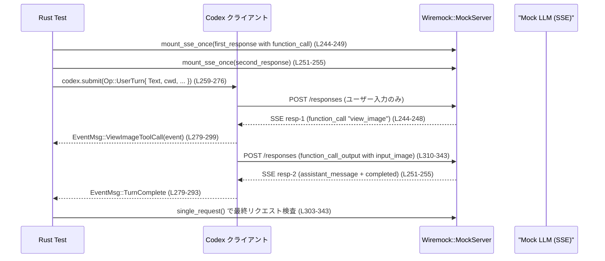

# core/tests/suite/view_image.rs コード解説

## 0. ざっくり一言

このファイルは、`view_image` ツールおよびユーザーのローカル画像入力が、Codex コアからリモート LLM（MockServer）に対してどのように **data URL 付きの `input_image` コンテンツ**として送信されるか、また異常系でどう振る舞うかを統合テストするモジュールです（`cfg(not(target_os = "windows"))` なので Windows では実行されません、view_image.rs:L1）。

---

## 1. このモジュールの役割

### 1.1 概要

- このモジュールは **画像入力の取り扱いと `view_image` ツールの挙動** を検証するための非 Windows 向け統合テスト群です。
- 主に以下を確認します（根拠は後述の各テスト）:
  - ユーザーの `LocalImage` 入力や `view_image` ツール結果が PNG data URL (`data:image/png;base64,...`) として正しく添付されること（例: view_image.rs:L120-211, L213-346）。
  - 画像の自動リサイズと、`detail: "original"` 指定時の解像度保持（L348-455, L649-755, L757-863）。
  - JS REPL (`Feature::JsRepl`) 経由での `view_image` 利用と `emitImage` の有無による挙動差（L865-982, L984-1086）。
  - ディレクトリ/非画像/存在しないファイル/画像入力非対応モデル/無効な画像データ等のエラー時の挙動（L1088-1525）。

### 1.2 アーキテクチャ内での位置づけ

テストは主に次のコンポーネントに依存しています。

- `TestCodex`（`core_test_support::test_codex::TestCodex`）: Codex 本体・設定・一時ワークスペースをまとめたテスト用ラッパ（例: L126-133, L219-225）。
- `start_mock_server` / `MockServer`: Wiremock を用いた擬似 OpenAI API サーバ（L124, L217, L869, L989, L1092, L1167, L1249）。
- `codex.submit(Op::UserTurn { ... })`: ユーザーターンを送信し、バックエンドが LLM とやり取りする（L151-167, L259-276 など）。
- `EventMsg::*`: コアからテスト側へ送られるイベント（`TurnComplete`, `ViewImageToolCall` など）（L170-176, L279-299, L931-948, L1051-1068）。

依存関係を簡略化した図です。

```mermaid
graph TD
    %% view_image.rs 全体 (L1-1525)
    A[core/tests/suite/view_image.rs<br/>テスト群] --> B[TestCodex<br/>(core_test_support::test_codex)]
    A --> C[responses / wait_for_event<br/>(core_test_support)]
    A --> D[MockServer / start_mock_server<br/>(wiremock)]
    A --> E[CodexAuth / ModelInfo など<br/>(codex_* クレート)]
    A --> F[image クレート<br/>PNG生成・読み込み]
    B --> D
    B --> E
    B --> F
    C --> D
```

### 1.3 設計上のポイント

- **テスト専用モジュール**  
  - すべて `#[tokio::test(flavor = "multi_thread", worker_threads = 2)]` 付きの非同期テストであり、公開 API は定義していません（例: L120, L213, L348, ...）。
- **共通ヘルパー関数による重複排除**
  - JSON 本文から画像メッセージを抽出する `image_messages` / `find_image_message`（L53-78）。
  - PNG バッファ生成 `png_bytes` とワークスペースへの書き込み `write_workspace_file` / `write_workspace_png`（L80-118）。
- **エラーハンドリング**
  - テスト本体は `anyhow::Result<()>` を返し、`?` 演算子でエラーを伝播させる構造です（すべてのテスト関数定義行を参照）。
  - 想定が崩れた場合は `assert!` / `assert_eq!` / `expect` / `panic!` で明示的にテスト失敗にします（例: L178-208, L315-343, L450-452 など）。
- **並行性**
  - `tokio` multi-thread ランタイム上で動きますが、テスト内では明示的なスレッド生成はなく、`wait_for_event(_with_timeout)` によるイベント待機が主です（L170-176, L279-294, L931-944 など）。
- **安全性**
  - 画像ファイルに対する操作はすべて一時ワークスペース配下で行われ、ディレクトリ/非画像/存在しないパスに対しては `view_image` がエラーを返すことを確認するテストが用意されています（L1088-1321）。

---

## 2. 主要な機能一覧（コンポーネントインベントリー）

### 2.1 関数・テスト一覧

| 名称 | 種別 | 行範囲 | 役割 / 用途 |
|------|------|--------|-------------|
| `image_messages` | ヘルパー関数 | view_image.rs:L53-74 | OpenAI 風リクエスト JSON から、`input` 配列内の「`input_image` を含む message」要素だけを抽出します。 |
| `find_image_message` | ヘルパー関数 | L76-78 | 上記 `image_messages` の先頭要素を返すショートカットです。 |
| `png_bytes` | ヘルパー関数 | L80-85 | 指定サイズ・指定色の RGBA PNG を `Vec<u8>` として生成します。 |
| `create_workspace_directory` | ヘルパー関数 | L87-93 | テスト用ワークスペース配下にディレクトリを（再帰的に）作成します。 |
| `write_workspace_file` | ヘルパー関数 | L95-108 | ワークスペースに任意のバイト列をファイルとして書き出します。 |
| `write_workspace_png` | ヘルパー関数 | L110-118 | `png_bytes` で生成した PNG をワークスペースに保存します。 |
| `user_turn_with_local_image_attaches_image` | tokio テスト | L120-211 | ユーザーの `LocalImage` 入力が自動リサイズされ、`input_image` としてリクエストに含まれることを検証します。 |
| `view_image_tool_attaches_local_image` | tokio テスト | L213-346 | `view_image` ツール呼び出しが `ViewImageToolCall` イベントと、ツール出力内の `input_image` 1件のみを生成することを検証します。 |
| `view_image_tool_can_preserve_original_resolution_when_requested_on_gpt5_3_codex` | tokio テスト | L348-455 | gpt-5.3-codex + `detail: "original"` + 対応 feature で、画像がリサイズされずに送信されることを検証します。 |
| `view_image_tool_errors_clearly_for_unsupported_detail_values` | tokio テスト | L457-545 | `detail: "low"` など未対応値を指定したとき、明確なエラーメッセージを返し画像を送信しないことを検証します。 |
| `view_image_tool_treats_null_detail_as_omitted` | tokio テスト | L547-647 | `detail: null` を「未指定」と同等に扱い、通常のリサイズ付き挙動になることを検証します。 |
| `view_image_tool_resizes_when_model_lacks_original_detail_support` | tokio テスト | L649-755 | モデル自体が original detail をサポートしない場合、feature があってもリサイズ付き挙動になることを検証します。 |
| `view_image_tool_does_not_force_original_resolution_with_capability_feature_only` | tokio テスト | L757-863 | gpt-5.3-codex + capability feature だけで `detail` 未指定の場合、デフォルトはリサイズであることを検証します。 |
| `js_repl_emit_image_attaches_local_image` | tokio テスト | L865-982 | JS REPL から `view_image` + `emitImage` を呼んだ際の画像添付挙動を検証します。 |
| `js_repl_view_image_requires_explicit_emit` | tokio テスト | L984-1086 | JS REPL 内で `view_image` を呼んでも `emitImage` しない限り、ツール出力に `input_image` が自動挿入されないことを検証します。 |
| `view_image_tool_errors_when_path_is_directory` | tokio テスト | L1088-1161 | パスがディレクトリの場合にエラーメッセージを返し、画像を送信しないことを検証します。 |
| `view_image_tool_errors_for_non_image_files` | tokio テスト | L1163-1243 | JSON ファイルなど非画像 MIME タイプに対してエラーを返すことを検証します。 |
| `view_image_tool_errors_when_file_missing` | tokio テスト | L1245-1321 | 存在しないファイルへのパスに対して「見つからない」エラーを返し、画像を送信しないことを検証します。 |
| `view_image_tool_returns_unsupported_message_for_text_only_model` | tokio テスト | L1323-1445 | 入力モダリティが Text のみのモデルでは `view_image` 自体が許可されないことを検証します。 |
| `replaces_invalid_local_image_after_bad_request` | tokio テスト（release のみ） | L1447-1525 | リモートから「無効な画像」と 400 が返ったとき、2回目のリクエストでは画像を除外し「Invalid image」というテキストだけ送ることを検証します。 |

---

## 3. 公開 API と詳細解説

このファイルはテストモジュールであり、外部から呼び出される公開 API はありません。ただし、テストやヘルパーは他のテストを記述する際の良い参考となるため、主要なものを詳細に解説します。

### 3.1 型一覧（構造体・列挙体など）

このファイル内で **新たに定義される型はありません**（構造体・ enum 等はなし）。  
よく使われる外部型とその役割だけ整理します。

| 名前 | 種別 | 出典 / 行範囲 | 役割 / 用途 |
|------|------|---------------|-------------|
| `TestCodex` | 構造体 | `use core_test_support::test_codex::TestCodex;`（L32） | テスト向けに Codex 本体、設定（`config`）、ファイルシステム（`fs()`）、作業ディレクトリ（`cwd`）をまとめたラッパ的オブジェクトとして使われています（例: L128-133, L219-225）。 |
| `EventMsg` | enum | `use codex_protocol::protocol::EventMsg;`（L18） | Codex から UI/テストに送られるイベント。ここでは `TurnComplete` と `ViewImageToolCall` を主に利用しています（L170-173, L279-299, L931-948, L1051-1068）。 |
| `UserInput` | enum | `use codex_protocol::user_input::UserInput;`（L21） | ユーザー入力の種別（テキスト `Text` やローカル画像 `LocalImage`）。テストでは両方を利用します（L151-155, L259-264 など）。 |
| `Op::UserTurn` | enum バリアント | L19, L151-167 など | Codex にユーザーターンを送るオペレーション。`items`, `cwd`, `model`, `sandbox_policy` などを含んだ 1 回分の対話入力です。 |
| `Feature` | enum | `use codex_features::Feature;`（L6） | 特定の機能（`ImageDetailOriginal`, `JsRepl` など）の ON/OFF を切り替えるために使われています（例: L357-360, L467-468, L871-874）。 |

### 3.2 関数詳細（7件）

#### `image_messages(body: &Value) -> Vec<&Value>`（view_image.rs:L53-74）

**概要**

- OpenAI 風のリクエスト JSON から、`"input"` 配列内のうち **`type: "message"` で、かつ content のどこかに `type: "input_image"` span を含む要素**だけを抽出します。

**引数**

| 引数名 | 型 | 説明 |
|--------|----|------|
| `body` | `&Value` | JSON 本文。`body["input"]` が配列であることを前提に走査します。 |

**戻り値**

- `Vec<&Value>`: 条件を満たす message 要素のスライス（参照）のベクタ。該当がなければ空ベクタを返します（`unwrap_or_default()`、L72-73）。

**内部処理の流れ**

1. `body.get("input").and_then(Value::as_array)` で `input` が配列かどうかを確認（L54-55）。
2. 配列が存在する場合のみ `.map(|items| { ... }).unwrap_or_default()` により走査。なければ空ベクタ（L56-57, L72-73）。
3. 各 `item` について:
   - `item["type"] == "message"` であるか（L60-61）。
   - `item["content"]` が配列で、その中に `span["type"] == "input_image"` が少なくとも 1 つあるか（L62-68）。
4. 条件を満たす `item` の参照を `collect()` して返却（L71）。

**Examples（使用例）**

この関数はテスト内でのみ使われています。例えば「ユーザー画像メッセージが存在すること」を検証する場面（L178-180, L1509-1512）:

```rust
let body = mock.single_request().body_json();                     // モックへのリクエスト JSON を取得
let image_message = find_image_message(&body)                     // image_messages のラッパ
    .expect("pending input image message not included in request");
```

**Errors / Panics**

- 本関数自体はパニックを起こさず、エラー型も返しません。
- `body` の構造が想定外でも、`get` + `as_array` + `unwrap_or_default` により単に空ベクタを返します。

**Edge cases（エッジケース）**

- `input` フィールドが存在しない/配列でない → 空ベクタ（L54-55, L72-73）。
- `input` 内に `type: "message"` 以外の要素が混ざる → 無視されます（L60）。
- `message.content` が配列でない/`input_image` を含まない → 無視されます（L63-69）。

**使用上の注意点**

- 戻り値が空であっても、それ自体はエラーではありません。呼び出し側で `expect` などにより「本来あるべき画像メッセージがない」というテスト失敗に変換しています（例: L180-181, L1510-1513）。

---

#### `png_bytes(width: u32, height: u32, rgba: [u8; 4]) -> anyhow::Result<Vec<u8>>`（L80-85）

**概要**

- 指定された幅・高さ・RGBA 色で塗りつぶした PNG 画像をメモリ上に生成し、そのバイト列を返します。テスト用の画像生成ユーティリティです。

**引数**

| 引数名 | 型 | 説明 |
|--------|----|------|
| `width` | `u32` | 画像の幅（ピクセル）。 |
| `height` | `u32` | 画像の高さ（ピクセル）。 |
| `rgba` | `[u8; 4]` | 各ピクセルの RGBA 値。 |

**戻り値**

- `anyhow::Result<Vec<u8>>`: 成功時は PNG エンコード済みのバイト列。失敗時は `image::ImageError` などを内包した `anyhow::Error`。

**内部処理の流れ**

1. `ImageBuffer::from_pixel(width, height, Rgba(rgba))` で単色の RGBA 画像バッファを生成（L81）。
2. `Cursor::new(Vec::new())` で書き込み先バッファを用意（L82）。
3. `DynamicImage::ImageRgba8(image).write_to(&mut cursor, image::ImageFormat::Png)?` で PNG にエンコード（L83）。
4. `cursor.into_inner()` で内部 `Vec<u8>` を取り出して返す（L84）。

**Examples（使用例）**

直接の呼び出しは `write_workspace_png` からのみです（L117-118）。

```rust
let bytes = png_bytes(2304, 864, [255u8, 0, 0, 255])?;   // 赤一色の大きな PNG を生成（view_image.rs:L372-379 の利用イメージ）
```

**Errors / Panics**

- `write_to` が失敗した場合、`?` により `Err` が返ります。テスト関数側で `?` を使っているため、そのままテスト失敗になります（L117, L232-239 など）。
- パニックを起こすコードは含まれていません。

**Edge cases**

- このファイル内では `width`/`height` に 0 は渡されていません。0 の扱いは `image` クレートの挙動に依存します（コードからは詳細不明）。

**使用上の注意点**

- 生成する画像はすべて単色です。ピクセル単位の内容を検証するテストには向いていませんが、ここでは「サイズ」さえ合っていればよい前提で利用されています（例: L204-208, L450-452）。

---

#### `write_workspace_png(test: &TestCodex, rel_path: &str, width: u32, height: u32, rgba: [u8; 4]) -> anyhow::Result<PathBuf>`（L110-118）

**概要**

- `TestCodex` のワークスペース直下の `rel_path` に、指定したサイズと色の PNG ファイルを作成するヘルパーです。多くのテストで画像 fixture の生成に使われています。

**引数**

| 引数名 | 型 | 説明 |
|--------|----|------|
| `test` | `&TestCodex` | ワークスペースの `cwd` やファイルシステムへアクセスするためのハンドル（L111）。 |
| `rel_path` | `&str` | ワークスペースからの相対パス（例: `"assets/example.png"`、L228-229, L370）。 |
| `width` | `u32` | 画像幅。 |
| `height` | `u32` | 画像高さ。 |
| `rgba` | `[u8; 4]` | 単色画像の RGBA 値。 |

**戻り値**

- `anyhow::Result<PathBuf>`: 成功時は生成されたファイルの絶対パス。失敗時は `png_bytes` またはファイル書き込みのエラーが `anyhow::Error` 化されて返ります。

**内部処理の流れ**

1. `png_bytes(width, height, rgba)?` で PNG バイト列を生成（L117）。
2. `write_workspace_file(test, rel_path, ...)` でワークスペースにファイルを書き出し（L117）。
3. その `PathBuf` を返して終了（L117）。

**Examples（使用例）**

多くのテストで利用されています。例: `view_image_tool_attaches_local_image`（L232-239）:

```rust
let rel_path = "assets/example.png";
let original_width = 2304;
let original_height = 864;

write_workspace_png(
    &test,
    rel_path,
    original_width,
    original_height,
    [255u8, 0, 0, 255],
)
.await?;
```

**Errors / Panics**

- `png_bytes` のエラーと `write_workspace_file` のエラーをそのまま `?` で伝播します（L117）。
- パニックを起こすコードは含まれていません。

**Edge cases**

- 親ディレクトリが存在しない場合でも、`write_workspace_file` 内で `CreateDirectoryOptions { recursive: true }` を使ってディレクトリが作られるため、上位ディレクトリの有無を気にせず利用できます（L100-105）。

**使用上の注意点**

- `rel_path` は後続の `view_image` ツール呼び出しの `path` 引数としてそのまま使われることが多いため（例: L241-242, L382-383）、**ワークスペース外を指すような相対パスを渡すべきではない**と考えられます（コード上は制約を見えませんが、テストはすべてワークスペース配下を使っています）。

---

#### `user_turn_with_local_image_attaches_image() -> anyhow::Result<()>`（L120-211）

**概要**

- ユーザーが `UserInput::LocalImage { path }` を渡したとき、Codex が画像を自動でリサイズ・base64 エンコードし、OpenAI 風リクエストに `input_image` を含む message として送信することを検証する統合テストです。

**引数 / 戻り値**

- 引数なしの tokio テスト。
- 戻り値は `anyhow::Result<()>`。内部で `?` を多用し、失敗時はテストがエラー終了します。

**内部処理の流れ**

1. ネットワーク環境がなければ `skip_if_no_network!` でテストスキップ（L122）。
2. モックサーバを起動（`start_mock_server().await`、L124）。
3. `test_codex()` から `TestCodex` を構築（L126-133）。
4. 一時ディレクトリに 2304x864 の RGBA 画像を生成・保存（L135-141）。
5. モックサーバに SSE レスポンス（`response_created` → `assistant_message` → `completed`）を 1 回分マウント（L142-147）。
6. `codex.submit(Op::UserTurn { items: [LocalImage { path }] , ... })` を送信（L151-167）。
7. `wait_for_event_with_timeout` で `TurnComplete` イベントまで待機（最大 10 秒、L170-176）。
8. モックに届いた HTTP リクエストの JSON 本文から画像メッセージを取得し（`find_image_message`、L178-180）、`image_url` を取り出す（L181-193）。
9. `image_url` が `"data:image/png;base64"` で始まり、かつ decode できることを確認（L195-203）。
10. decode した PNG のサイズをチェックし、縦横ともに上限（2048x768）以下かつ元画像より小さいことを検証（L204-208）。

**Examples（使用例）**

テストエントリポイントなので直接再利用されませんが、同様のテストを書く場合の最小パターン:

```rust
let server = start_mock_server().await;
let mut builder = test_codex();
let test = builder.build_remote_aware(&server).await?;
let TestCodex { codex, config, session_configured, .. } = &test;

// ローカル画像を用意
let local_image_dir = tempfile::tempdir()?;
let abs_path = local_image_dir.path().join("example.png");
let image = ImageBuffer::from_pixel(1024, 512, Rgba([20u8, 40, 60, 255]));
image.save(&abs_path)?;

// ユーザーターン送信
codex.submit(Op::UserTurn {
    items: vec![UserInput::LocalImage { path: abs_path }],
    cwd: config.cwd.to_path_buf(),
    // ...その他はテストに準拠
    .. /* 省略 */
}).await?;
```

**Errors / Panics**

- `image.save`, `build_remote_aware`, `submit` などが失敗すると `?` でテストがエラー終了します。
- `find_image_message(...).expect("...")`（L178-180）、`decode(...).expect("...")`（L200-202）など、「画像が付いていない」「base64 が壊れている」場合はパニックとしてテスト失敗になります。

**Edge cases**

- 画像が一切添付されない場合 → `find_image_message` が `None` を返し、`expect` で失敗（L178-180）。
- 画像が添付されるが、サイズが上限を超える場合 → `assert!` で失敗（L204-208）。
- `image_url` が `data:image/png;base64` 以外のスキームの場合 → `assert_eq!(prefix, "data:image/png;base64")` で失敗（L195-199）。

**使用上の注意点**

- このテストが前提としているのは、「ユーザーのローカル画像は自動的に **リサイズされる**」という仕様です。後述の `view_image` ツールとの違い（`detail: "original"` を指定したときはリサイズしない）と合わせて設計意図を把握する必要があります（L348-455）。

---

#### `view_image_tool_attaches_local_image() -> anyhow::Result<()>`（L213-346）

**概要**

- モデルからの `view_image` 関数呼び出しに対して:
  - Codex が `EventMsg::ViewImageToolCall` を発行し、パス解決が正しいこと。
  - 実際の HTTP リクエストでは、`view_image` の **関数出力 (`function_call_output`) 内の `input_image` のみ**が送信され、独立した「ペンディング画像メッセージ」は追加されないこと。
  - 画像はデフォルトでリサイズされること。
  
  を検証します。

**引数 / 戻り値**

- tokio テスト、`anyhow::Result<()>`。

**内部処理の流れ（要約）**

1. モックサーバと `TestCodex` 構築（L217-225）。
2. ワークスペースに PNG を生成（`write_workspace_png`、L232-239）。
3. `view_image` 関数呼び出しを含む SSE レスポンス（`ev_function_call(call_id, "view_image", &arguments)`）をモックにマウント（L241-249）。
4. 2 回目の SSE として通常の応答（assistant message + completed）をマウント（L251-255）。
5. `codex.submit(Op::UserTurn { items: Text(...) })` を送信（L259-276）。
6. `wait_for_event_with_timeout` で `ViewImageToolCall` イベントを捕捉しつつ `TurnComplete` まで待機（L279-294）。
7. キャプチャした `ViewImageToolCall` イベントの `call_id` と `path` が期待値通りか確認（L296-301）。
8. モックに届いた HTTP リクエストを取得し、`find_image_message` で「独立した画像メッセージ」が存在しないことを確認（L303-308）。
9. `function_call_output(call_id)` の `output` 配列内容を検査し、`type: "input_image"` を 1 件だけ含むこと、`image_url` が PNG data URL であることを検証（L310-343）。

**Examples（使用例）**

`view_image` ツールをテストしたい場合の標準パターンとして利用できます。

```rust
// モデルが view_image を呼ぶような SSE を設定
let first_response = sse(vec![
    ev_response_created("resp-1"),
    ev_function_call(call_id, "view_image", &arguments),
    ev_completed("resp-1"),
]);
responses::mount_sse_once(&server, first_response).await;

// ユーザーターンを送信して Codex に view_image を実行させる
codex.submit(Op::UserTurn {
    items: vec![UserInput::Text { text: "...".into(), text_elements: Vec::new() }],
    cwd: cwd.to_path_buf(),
    // ...
}).await?;
```

**Errors / Panics**

- `tool_event.expect("view image tool event emitted")`（L296）が発火しない場合、テストは失敗します。
- `find_image_message(&body).is_none()` の `assert!` が失敗した場合、「view_image ツールが別の画像メッセージを注入してしまっている」ことを示します（L305-308）。

**Edge cases**

- `function_call_output` の `output` 配列が空、または複数要素を含む場合 → `assert_eq!(output_items.len(), 1)` で失敗（L315-317）。
- `output[0]["type"] != "input_image"` の場合 → `assert_eq!` で失敗（L320-323）。
- 画像サイズについては最後に上限チェックを行います（L339-343）。

**使用上の注意点**

- テストは「view_image が **ツール出力として画像を返す**」ことを前提としており、ユーザーターンの `items` に直接画像を追加しない仕様を確認しています（L303-308）。  
  view_image の仕様を変更する際には、この前提が妥当かを再確認する必要があります。

---

#### `js_repl_emit_image_attaches_local_image() -> anyhow::Result<()>`（L865-982）

**概要**

- `Feature::JsRepl` を有効化した環境で、JS REPL から:
  1. Node の `fs`/`path` モジュールで PNG ファイルを作成し、
  2. `codex.tool("view_image", { path })` を呼んでツール結果を得て、
  3. `codex.emitImage(out)` を呼ぶ
- という一連の流れが動作し、最終的に:
  - `ViewImageToolCall` イベントに期待どおりのパスが現れること（L931-953）。
  - HTTP リクエストには独立の画像メッセージがなく、カスタムツール出力に `input_image` アイテムが含まれること（L955-979）。
  
を検証します。

**引数 / 戻り値**

- tokio テスト、`anyhow::Result<()>`。

**内部処理（要約）**

1. `Feature::JsRepl` を有効にした状態で `TestCodex` を構築（L869-881）。
2. JS スクリプト `js_input` を文字列リテラルとして定義（L883-895）。
3. モックサーバに `js_repl` カスタムツール呼び出しを含む SSE をマウント（L897-902）。
4. 2 回目の SSE レスポンスをマウント（L904-908）。
5. `Op::UserTurn { Text: "use js_repl ..." }` を送信（L910-928）。
6. `wait_for_event_with_timeout` で `ViewImageToolCall` イベントを捕捉（L931-948）。
7. `tool_event.path` が `js-repl-view-image.png` で終わることを確認（L949-953）。
8. モックリクエストの JSON 本文から `image_messages(&body)` を呼び、画像メッセージが 0 件であることを確認（L955-961）。
9. `custom_tool_call_output(call_id)` から `output` 配列を取得し、その中に `type == "input_image"` かつ `image_url` が PNG data URL であるアイテムがあることを検証（L963-979）。

**Errors / Panics**

- JS コードの実行は `js_repl` ツールに委譲されており、ここでは戻り値のみ検証します。`custom_tool_call_output` が期待するデータ構造でない場合に `expect` がパニックします（L963-967）。
- `tool_event` が捕捉できない場合は `panic!`（L945-947）。

**Edge cases**

- `emitImage` を呼び忘れた場合の挙動は、別テスト `js_repl_view_image_requires_explicit_emit` で検証されています（L984-1086）。

**使用上の注意点**

- このテストは「JS REPL からの `view_image` 呼び出しは **自動ではメッセージに画像を添付せず**、`emitImage` を呼ぶことで初めてユーザー側に画像が出る」という契約を補強しています。
- JS から渡される `imagePath` は `codex.tmpDir` 配下に作成されており、ワークスペースと異なる一時ディレクトリパスである点に注意が必要です（`js_input` 内、L887-893）。

---

#### `view_image_tool_returns_unsupported_message_for_text_only_model() -> anyhow::Result<()>`（L1323-1445）

**概要**

- 入力モダリティが Text のみのリモートモデルに対して `view_image` が呼ばれた場合、Codex が:
  - モデル情報（`input_modalities: [Text]`）を見て、画像入力をサポートしていないと判断し（L1335-1369）。
  - 実際の画像処理を行わず、`"view_image is not allowed because you do not support image inputs"` というメッセージを返す。
  
ことを検証します。

**内部処理（要約）**

1. `MockServer::builder()` による Wiremock サーバを直接構築（`start_mock_server` は使わない、L1331-1334）。
2. `ModelInfo` を手動で構築し、`input_modalities: vec![InputModality::Text]`, `supports_image_detail_original: false` 等を設定（L1335-1369）。
3. `mount_models_once` で `/models` エンドポイントに上記モデルを返すよう設定（L1371-1377）。
4. `test_codex()` ビルダーに対してダミー認証と model slug を設定し、`build_remote_aware(&server)` で Codex を構築（L1379-1385）。
5. ワークスペースに小さな PNG を生成（L1387-1395）。
6. `view_image` 関数呼び出しを含む SSE をマウント（L1397-1404）、2 回目の SSE もマウント（L1406-1410）。
7. `Op::UserTurn` でユーザーターンを送信（L1412-1429）。
8. `wait_for_event` で `TurnComplete` を待機（L1432）。
9. `function_call_output_content_and_success(call_id)` でツールの出力テキストを取得し、エラーメッセージが `"view_image is not allowed because you do not support image inputs"` であることを検証（L1434-1442）。

**Errors / Panics**

- モデル情報の設定や SSE マウントが期待通りでない場合、後続の `expect` / `assert_eq!` が失敗します。

**Edge cases**

- ここでは「Text-only モデル」のみを検証しています。  
  画像入力対応モデルで `input_modalities` が Text+Image などになっている場合の挙動は、他のテスト（`view_image_tool_*` 群）で検証されています。

**使用上の注意点**

- モデルの capabilities を判定するロジックはこのファイル外ですが、このテストにより「`input_modalities` を軽視して無条件に view_image を許可してはいけない」という契約が暗黙に定義されています。

---

### 3.3 その他の関数

ヘルパー・テスト関数の残りを簡潔にまとめます。

| 関数名 | 行範囲 | 役割（1 行） |
|--------|--------|--------------|
| `find_image_message` | L76-78 | `image_messages` の先頭要素を返すショートカットで、画像メッセージが 1 つはある前提の検証に使われます。 |
| `create_workspace_directory` | L87-93 | ワークスペース内にディレクトリ（例: `"assets"`）を作り、その絶対パスを返します。 |
| `write_workspace_file` | L95-108 | 任意のバイト列をファイルに書き出し（例: JSON ファイル）、非画像ファイルテストに利用されます。 |
| `view_image_tool_errors_clearly_for_unsupported_detail_values` | L457-545 | `detail: "low"` など未対応の detail を指定した場合のエラーメッセージと、画像非生成を検証します。 |
| `view_image_tool_treats_null_detail_as_omitted` | L547-647 | `detail: null` が未指定扱いになることと、リサイズされることを検証します。 |
| `view_image_tool_resizes_when_model_lacks_original_detail_support` | L649-755 | モデル側で original detail をサポートしていない場合にリサイズされる挙動を検証します。 |
| `view_image_tool_does_not_force_original_resolution_with_capability_feature_only` | L757-863 | feature だけ有効でも、detail 未指定では original 解像度にならないことを検証します。 |
| `js_repl_view_image_requires_explicit_emit` | L984-1086 | JS REPL で `view_image` をネスト呼び出ししても、`emitImage` しない限り外側の出力に画像が混ざらないことを検証します。 |
| `view_image_tool_errors_when_path_is_directory` | L1088-1161 | ディレクトリパスを渡したときのエラーと、画像非生成を検証します。 |
| `view_image_tool_errors_for_non_image_files` | L1163-1243 | `application/json` など非画像 MIME タイプのファイルに対するエラーを検証します。 |
| `view_image_tool_errors_when_file_missing` | L1245-1321 | 存在しないパスの扱い（エラーメッセージ先頭と画像非生成）を検証します。 |
| `replaces_invalid_local_image_after_bad_request` | L1447-1525 | リモートから 400 + プレーンテキストエラーが返った際、2 回目のリクエストで画像を外しテキスト「Invalid image」に差し替える挙動を検証します。 |

---

## 4. データフロー

ここでは典型的なシナリオとして、`view_image_tool_attaches_local_image` の処理フローを示します（view_image.rs:L213-346）。

### 4.1 処理の要点

- モデルは最初の SSE で `view_image` 関数呼び出しを要求します（L244-248）。
- Codex はローカルファイルを読み込み・処理したうえで `ViewImageToolCall` イベントを発行し（L279-299）、ツール出力を含む 2 回目の HTTP リクエストを送ります（L303-343）。
- サーバからの 2 回目の SSE で会話が完了し（L251-255）、テストはリクエスト内容を検証します。

### 4.2 シーケンス図



この図から分かる通り、画像は:

1. ユーザーターンの `items` ではなく、
2. `view_image` の **ツール出力** (`function_call_output`) 内に `input_image` として含まれる

という二段階フローになっています（L310-323）。

---

## 5. 使い方（How to Use）

このファイル自体はテスト専用ですが、**新しい統合テストを書く際のパターン**として有用です。

### 5.1 基本的な使用方法（テストを書くときの流れ）

以下は `view_image` 関連のテストを書くときの典型的なフローです（各ステップは既存テストの行を根拠とします）。

```rust
#[tokio::test(flavor = "multi_thread", worker_threads = 2)]
async fn example_view_image_test() -> anyhow::Result<()> {
    skip_if_no_network!(Ok(()));                                   // ネットワークがなければスキップ (L122 など)

    let server = start_mock_server().await;                        // Wiremock サーバ起動 (L124, L217)

    // TestCodex を構築
    let mut builder = test_codex();                                // ビルダー作成 (L126, L218)
    let test = builder.build_remote_aware(&server).await?;         // リモート対応 Codex を構築 (L127, L220)
    let TestCodex { codex, config, session_configured, .. } = &test;

    // ワークスペースに PNG を用意
    let rel_path = "assets/example.png";
    write_workspace_png(&test, rel_path, 512, 256, [255, 0, 0, 255]).await?; // (L232-239)

    // モデルからの view_image 関数呼び出しを模した SSE をセットアップ
    let call_id = "example-call";
    let arguments = serde_json::json!({ "path": rel_path }).to_string();
    let first_response = sse(vec![
        ev_response_created("resp-1"),
        ev_function_call(call_id, "view_image", &arguments),
        ev_completed("resp-1"),
    ]);
    responses::mount_sse_once(&server, first_response).await;

    let second_response = sse(vec![
        ev_assistant_message("msg-1", "done"),
        ev_completed("resp-2"),
    ]);
    let mock = responses::mount_sse_once(&server, second_response).await;

    let session_model = session_configured.model.clone();

    // ユーザーターン送信
    codex.submit(Op::UserTurn {
        items: vec![UserInput::Text { text: "please view".into(), text_elements: Vec::new() }],
        cwd: config.cwd.to_path_buf(),                              // (L265-266)
        approval_policy: AskForApproval::Never,
        approvals_reviewer: None,
        sandbox_policy: SandboxPolicy::DangerFullAccess,
        model: session_model,
        effort: None,
        summary: None,
        service_tier: None,
        collaboration_mode: None,
        personality: None,
    }).await?;

    // 実行完了を待つ
    wait_for_event_with_timeout(
        codex,
        |event| matches!(event, EventMsg::TurnComplete(_)),
        Duration::from_secs(10),
    ).await;                                                        // (L170-176, L421-425)

    // 最終リクエストを検証
    let req = mock.single_request();
    let function_output = req.function_call_output(call_id);
    // ...出力を検証
    Ok(())
}
```

### 5.2 よくある使用パターン

- **original 解像度を要求するテスト**  
  - モデル: `"gpt-5.3-codex"` に変更（L355-356）。
  - config の feature: `Feature::ImageDetailOriginal` を有効化（L357-360）。
  - `view_image` の引数に `"detail": "original"` を追加（L382-383）。
  - 期待: `output_items[0]["detail"] == "original"` かつ元画像と同じサイズ（L433-452）。

- **detail 未指定 or null のデフォルト挙動テスト**
  - 引数に `detail` を含めない、または `detail: null` を渡す（L580-581）。
  - 期待: `detail` キーが存在しない (`get("detail") == None`) かつリサイズされている（L626-644）。

- **JS REPL との連携テスト**
  - config.feature で `Feature::JsRepl` を有効化（L869-875, L989-995）。
  - `ev_custom_tool_call(call_id, "js_repl", js_input)` で JS コードを実行（L897-901, L1017-1021）。
  - `codex.emitImage(out)` の有無で、外側の出力に `input_image` が現れるかどうかを比較（L893-895 vs L1013-1014, L962-979 vs L1075-1083）。

### 5.3 よくある間違い（想定される誤用）

このファイルのテストから推測できる、ありがちな誤用とその正しい例です。

```rust
// 誤り例: view_image の結果をそのまま JS REPL の出力として返すだけ
// （画像がユーザーに「添付」されない）
const out = await codex.tool("view_image", { path: imagePath });
console.log(out.type);  // js_repl_view_image_requires_explicit_emit (L1003-1014)

// 正しい例: emitImage を呼ぶことで、Codex 側が画像をユーザーに配送する
const out = await codex.tool("view_image", { path: imagePath });
await codex.emitImage(out);  // js_repl_emit_image_attaches_local_image (L893-895)
```

```rust
// 誤り例: view_image の path にディレクトリを渡してしまう
let rel_path = "assets";  // L1103
let arguments = serde_json::json!({ "path": rel_path }).to_string();

// 正しい例: 実際の画像ファイルパス（workspace 内）を渡す
let rel_path = "assets/example.png";  // L228, L370 など
```

### 5.4 使用上の注意点（まとめ・安全性/エラー観点）

- **ファイルパスの安全性**
  - `view_image` の `path` は基本的に `cwd`（`config.cwd`）からの相対パスとして扱われます（L259-267, L401-407, L508-513 など）。
  - ディレクトリパス・非画像ファイル・存在しないファイルの場合は、画像を送信せず明示的なエラーメッセージを返すことがテストで保証されています（L1088-1321）。  
    これは意図しないファイル内容の送信や、ディレクトリ traversal による情報漏洩リスクを抑える方向の挙動と解釈できます。

- **モデル能力のチェック**
  - `input_modalities` が Text のみのモデルでは、`view_image` がそもそも許可されないべきであり、その旨のメッセージを返すことがテストで確認されています（L1323-1442）。

- **無効な画像データへの対応**
  - リモートから「画像が無効」と 400 エラーが返った場合、2 回目のリクエストでは画像を削除し「Invalid image」というテキストだけを送る挙動が検証されています（L1447-1473, L1509-1522）。  
    これにより、同じ無効画像を繰り返し送信してしまうループを避けることができます。

- **並行性・タイムアウト**
  - すべてのテストは tokio の multi-thread ランタイム上で動作しますが、永遠に待ち続けないよう `wait_for_event_with_timeout(..., Duration::from_secs(10))` を用いています（L170-176, L279-294, L421-425, L718-723, L829-834, L931-944, L1051-1063）。  
    実装側でイベントが発火しない場合、テストはタイムアウトで失敗します。

---

## 6. 変更の仕方（How to Modify）

### 6.1 新しいテストケースを追加する場合

1. **前提の確認**
   - 新規テストが検証したいのは「画像の解像度」「detail パラメータ」「モデル capabilities」「ファイル種別」「JS REPL の挙動」のどれか、または組み合わせかを整理します。
2. **テストの骨格をコピー**
   - 最も近いシナリオのテスト（例えば JS REPL なら L865-982, detail 関連なら L348-647）をコピーし、関数名・引数・期待値だけ変更します。
3. **ワークスペースセットアップ**
   - 必要に応じて `write_workspace_png` または `write_workspace_file` でフィクスチャファイルを作成します（L110-118, L95-108）。
4. **SSE モックレスポンスの構成**
   - `sse` + `ev_*` ヘルパーを利用して、モデルが出すべき `ev_function_call`/`ev_custom_tool_call` を定義します（L241-248, L897-901, L1017-1021）。
5. **Codex 呼び出しと待機**
   - `codex.submit(Op::UserTurn { ... })` → `wait_for_event(_with_timeout)` という流れを追加します（L151-176, L259-294 など）。
6. **期待するリクエストの検証**
   - `mock.single_request()` から JSON を取得し、`find_image_message`、`function_call_output`、`custom_tool_call_output` などから検証対象を取り出します（L178-193, L303-343, L955-979）。

### 6.2 既存のテスト・ヘルパーを変更する場合の注意点

- **エラーメッセージ文字列の変更**
  - 多くのテストはエラー文言を **文字列一致** で検証しているため（例: L534-537, L1149-1153, L1233-1239, L1309-1312, L1434-1442）、実装側でメッセージを変更した場合はここも合わせて更新する必要があります。
- **パス表示の変更**
  - エラー文言には `abs_path.display()` の結果が埋め込まれています（L1152, L1234-1236, L1309）。  
    パスの表記方法（絶対/相対、セパレータ文字など）を変更すると、テストが落ちる可能性があります。
- **detail の仕様変更**
  - `view_image.detail` は現状 `"original"` のみサポートし、それ以外はエラーという契約になっています（L488-537）。仕様を変える場合は複数のテスト（L348-455, L457-545, L547-647, L649-755, L757-863）への影響を考慮する必要があります。
- **Windows 対応**
  - このテストファイルは `cfg(not(target_os = "windows"))` で Windows ではビルドされません（L1）。Windows 対応を行いたい場合は、この cfg 条件の見直しと、パス表記のプラットフォーム差異への対応が必要になります。

---

## 7. 関連ファイル・モジュール

このモジュールと密接に関連するモジュール（コードから読み取れる範囲）を整理します。

| パス / モジュール | 役割 / 関係 |
|-------------------|------------|
| `core_test_support::test_codex` | `TestCodex` や `test_codex()` ビルダを提供し、Codex 本体・設定・ワークスペース操作をまとめています（L32-33, L126-133 など）。 |
| `core_test_support::responses` | `sse`, `ev_response_created`, `ev_function_call`, `ev_custom_tool_call`, `mount_sse_once`, `mount_response_once_match` など、Wiremock に対してモックレスポンスを設定するヘルパー群です（L22-31, L142-147, L244-249, L897-902, L1457-1472）。 |
| `core_test_support::{wait_for_event, wait_for_event_with_timeout}` | Codex からの `EventMsg` ストリームを待ち受けるユーティリティで、ターン完了やツールイベントを捕捉するのに使われています（L34-35, L170-176, L279-294, L421-425, L718-723, L829-834, L931-944, L1051-1063, L1507-1507）。 |
| `codex_protocol::protocol` | `Op::UserTurn`, `EventMsg`, `AskForApproval`, `SandboxPolicy` など、Codex と LLM の対話プロトコル型を定義しているモジュールです（L17-20, L151-167 など）。 |
| `codex_features::Feature` | `ImageDetailOriginal`, `JsRepl` など、挙動を切り替える feature フラグの定義元です（L6, L357-360, L467-468, L555-558, L657-658, L767-769, L871-874, L993-994）。 |
| `codex_protocol::openai_models` | `ModelInfo`, `ModelsResponse`, `InputModality`, `TruncationPolicyConfig` など、モデルメタデータ構造を提供します（L9-16, L1335-1370）。 |
| `image` クレート (`image::ImageBuffer`, `DynamicImage`, `load_from_memory` 等) | PNG 画像の生成・読み込みを行い、サイズチェックのために使われています（L36-40, L80-85, L200-204, L335-343, L446-452, L637-644, L744-752, L852-860）。 |
| `wiremock` | `MockServer`, `BodyPrintLimit`, `ResponseTemplate`, `matchers::body_string_contains` を提供し、テスト用の HTTP サーバとして利用されています（L46-51, L1331-1334, L1457-1463）。 |

このモジュールはあくまでテストであり、実際の `view_image` ツールの実装本体は別モジュール（このチャンクには現れない）に存在します。その実装を変更する際には、本ファイルのテスト群が期待している契約（特にエラーメッセージと画像添付の有無・位置）を一緒に確認する必要があります。
