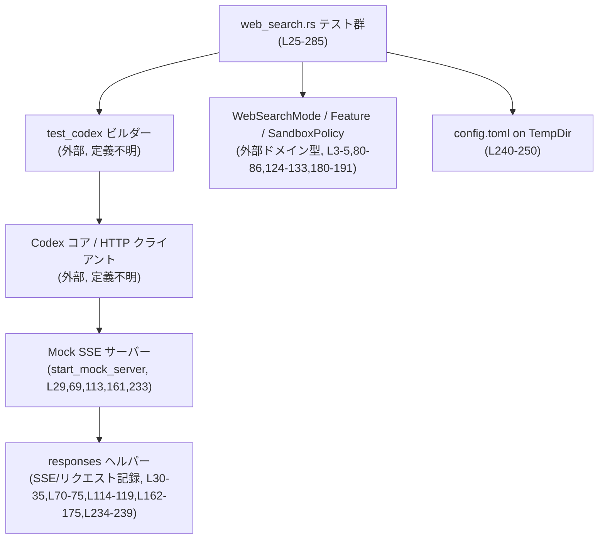
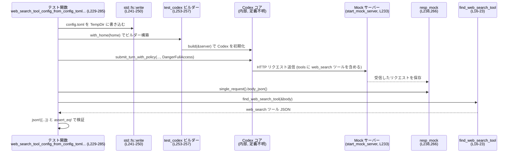

# core/tests/suite/web_search.rs コード解説

## 0. ざっくり一言

Codex の **Web 検索ツール (`web_search`) の設定が、HTTP リクエストのツール定義にどう反映されるか** を、モックサーバーに送信される JSON を検査することで確認する非公開テスト群です（`core/tests/suite/web_search.rs`）。

---

## 1. このモジュールの役割

### 1.1 概要

このモジュールは **Web 検索機能のモードや構成が、実際のツールリクエストに正しく反映されるか** を検証します（`core/tests/suite/web_search.rs:L25-285`）。

具体的には、以下を確認します。

- `WebSearchMode` と `external_web_access` フラグの関係  
- レガシーの Feature フラグ（`WebSearchRequest` / `WebSearchCached`）と `WebSearchMode` の優先関係  
- サンドボックスポリシー（`SandboxPolicy`）による Web 検索モードのデフォルト  
- `config.toml` の `tools.web_search` 設定が HTTP リクエストの `tools` 配列に反映されること  

### 1.2 アーキテクチャ内での位置づけ

このテストファイルは、以下のコンポーネントに依存する **統合テスト** の役割を持ちます。

- `core_test_support::test_codex::test_codex`: Codex のテスト用ビルダー（外部定義、詳細不明）
- `core_test_support::responses` / `start_mock_server`: HTTP モックサーバーと SSE レスポンスのセットアップ
- `codex_protocol::config_types::WebSearchMode`, `codex_features::Feature`, `codex_protocol::protocol::SandboxPolicy`  
  → 設定・機能フラグ・サンドボックスのドメイン型
- `serde_json::Value` / `json!` マクロ → 送出される HTTP リクエストボディの解析に使用

依存関係の概略図は次の通りです。



> `B` や `C` の内部実装はこのチャンクには現れないため、詳細は不明です。

### 1.3 設計上のポイント

- **テストヘルパー関数の共有**  
  - `find_web_search_tool` でリクエストボディから `type == "web_search"` のツール定義だけを抜き出すことで、各テストの重複コードを削減しています（`core/tests/suite/web_search.rs:L15-23`）。
- **ビルダー＋設定クロージャによる初期化**  
  - `test_codex().with_model(...).with_config(|config| { ... })` というビルダー構造で、テストごとに異なる設定を明示的に構築しています（例: `L36-43`, `L76-87` など）。
- **エラーハンドリングの方針（テストなので panic 前提）**  
  - `expect` や `assert_eq!` を積極的に使用し、前提が満たされない場合はテストを即座に失敗させます（例: `L19,22,42,86,126` など）。
- **非同期・並行実行**  
  - すべてのテストは `#[tokio::test(flavor = "multi_thread", worker_threads = 2)]` でマルチスレッド Tokio ランタイム上で動作します（`L25,L65,L109,L157,L229`）。
  - コード内で明示的な並列タスクは生成していませんが、内部の HTTP クライアントやモックサーバーは非同期実行されます。
- **ネットワーク前提のテストを環境でスキップ**  
  - 全テストの先頭で `skip_if_no_network!();` を呼び、ネットワークが利用できない環境では実行をスキップするようになっています（`L27,L67,L111,L159,L231`）。

---

## 2. 主要な機能一覧

このファイルに含まれる主な機能は次の通りです。

- `find_web_search_tool`: HTTP リクエストボディ（JSON）から `type: "web_search"` のツール定義を取得するテスト用ヘルパー。
- `web_search_mode_cached_sets_external_web_access_false`: `web_search_mode = Cached` の場合に `external_web_access` が `false` になることの検証。
- `web_search_mode_takes_precedence_over_legacy_flags`: レガシー Feature フラグ `WebSearchRequest` よりも `WebSearchMode::Cached` が優先されることの検証。
- `web_search_mode_defaults_to_cached_when_features_disabled`: Web 検索関連 Feature が無効化されている場合に、デフォルトでキャッシュモードになることの検証。
- `web_search_mode_updates_between_turns_with_sandbox_policy`: サンドボックスポリシーに応じて、ターンごとに Web 検索モード（cached / live）が切り替わることの検証。
- `web_search_tool_config_from_config_toml_is_forwarded_to_request`: `config.toml` の Web 検索ツール設定がリクエストのツール定義にそのまま反映されることの検証。

### 2.1 関数・コンポーネント一覧（インベントリ）

| 名前 | 種別 | 役割 / 説明 | 定義位置 |
|------|------|-------------|----------|
| `find_web_search_tool` | 関数 | JSON ボディから `type == "web_search"` のツール定義を 1 件取得するヘルパー。見つからない場合は panic。 | `core/tests/suite/web_search.rs:L15-23` |
| `web_search_mode_cached_sets_external_web_access_false` | 非同期テスト関数 | `WebSearchMode::Cached` で構成した場合に、`external_web_access` が `false` となることを検証。 | `core/tests/suite/web_search.rs:L25-63` |
| `web_search_mode_takes_precedence_over_legacy_flags` | 非同期テスト関数 | `Feature::WebSearchRequest` を有効にしていても、`WebSearchMode::Cached` が優先され `external_web_access` が `false` になることを検証。 | `core/tests/suite/web_search.rs:L65-107` |
| `web_search_mode_defaults_to_cached_when_features_disabled` | 非同期テスト関数 | Web 検索関連 Feature を無効にした場合でも、`WebSearchMode::Cached` が適用され、`external_web_access` が `false` でリクエストされることを検証。 | `core/tests/suite/web_search.rs:L109-155` |
| `web_search_mode_updates_between_turns_with_sandbox_policy` | 非同期テスト関数 | 同じ会話で 2 つのターンを送り、サンドボックスポリシー（read-only / DangerFullAccess）ごとに `external_web_access` が `false / true` に切り替わることを検証。 | `core/tests/suite/web_search.rs:L157-227` |
| `web_search_tool_config_from_config_toml_is_forwarded_to_request` | 非同期テスト関数 | `config.toml` の `web_search` および `tools.web_search` 設定が、ツール定義 JSON に期待通り転送されることを検証。 | `core/tests/suite/web_search.rs:L229-285` |

---

## 3. 公開 API と詳細解説

このファイルはテスト専用であり、外部クレートから呼び出される公開 API は定義していません。以下では、テストファイル内の関数と、テストから見える主な外部型を整理します。

### 3.1 型一覧（構造体・列挙体など）

このファイル内に新しい型定義はありませんが、テストで重要な外部型・マクロは次の通りです。

| 名前 | 種別 | 役割 / 用途 | 使用位置 |
|------|------|-------------|----------|
| `codex_features::Feature` | 列挙体（推定） | Web 検索関連などの機能フラグを表現。`WebSearchRequest`, `WebSearchCached` などを使用。 | `L3,80-82,128-133,185-191` |
| `codex_protocol::config_types::WebSearchMode` | 列挙体（推定） | `"Cached"` や `"live"` など Web 検索モードを指定。 | `L4,41,85,125,182` |
| `codex_protocol::protocol::SandboxPolicy` | 構造体または列挙体（推定） | サンドボックスの権限レベル（`new_read_only_policy`, `DangerFullAccess`）を表現。 | `L5,51,95,143,198,201,261` |
| `serde_json::Value` | 構造体 | JSON の汎用ツリー表現。HTTP リクエストボディの解析に使用。 | `L11,16-22,56-62,100-106,148-154,208-216,218-226,266-283` |
| `serde_json::json!` | マクロ | JSON リテラルを容易に構築するためのマクロ。期待値との比較に使用。 | `L12,270-283` |
| `core_test_support::responses` | モジュール | SSE レスポンスの作成 / マウント、および送信されたリクエストの取得を行うヘルパー。 | `L6,30-35,70-75,114-119,162-175,234-239,205-207,266` |
| `core_test_support::responses::start_mock_server` | 関数 | モック HTTP サーバーを起動。 | `L7,29,69,113,161,233` |
| `core_test_support::skip_if_no_network!` | マクロ | ネットワークが利用できない環境でテストをスキップ。 | `L8,27,67,111,159,231` |
| `core_test_support::test_codex::test_codex` | 関数 | Codex のテスト用ビルダーを作成。 | `L9,36,76,120,177,253` |
| `std::sync::Arc` | スマートポインタ | `TempDir` を共有可能な所有権で保持。ここでは単一スレッドでのみ使用。 | `L13,240` |
| `tempfile::TempDir` | 構造体（外部クレート） | 一時ディレクトリを生成・削除。Codex の home ディレクトリに利用。 | `L240` |

> 外部型の内部構造や全 enum バリアントは、このチャンクには現れないため不明です。

### 3.2 関数詳細

#### `find_web_search_tool(body: &Value) -> &Value`

**概要**

- HTTP リクエストの JSON ボディから `tools` 配列を取り出し、その中で `type == "web_search"` である要素を 1 件探して返します（`core/tests/suite/web_search.rs:L16-22`）。
- `tools` 配列が存在しない、または `web_search` ツールが含まれていない場合は `expect` により panic します。

**引数**

| 引数名 | 型 | 説明 |
|--------|----|------|
| `body` | `&Value` | HTTP リクエストボディの JSON 全体。`tools` 配列を含むことが前提。 |

**戻り値**

- `&Value`  
  - `tools` 配列から見つかった `type == "web_search"` の要素（JSON オブジェクト）への参照。

**内部処理の流れ**

1. `body["tools"]` で `tools` フィールドを取り出す（存在しない場合は `Value::Null`）（`L17`）。
2. `as_array()` で `tools` が配列かチェックし、配列でなければ `expect` で panic（`L18-19`）。
3. 配列を `iter()` で反復し、各要素に対して `tool.get("type").and_then(Value::as_str)` で `"type"` が `"web_search"` かどうか判定する（`L20-21`）。
4. 最初にマッチした要素を返し、見つからなければ `expect` で panic（`L21-22`）。

**Examples（使用例）**

テスト内での典型的な使用方法です。

```rust
// body_json() は HTTP リクエストボディを serde_json::Value として返す（外部実装）
let body = resp_mock.single_request().body_json();      // リクエスト 1 件を取得（L56,100,148,266）
let tool = find_web_search_tool(&body);                 // web_search ツールを抽出（L57,101,149,209,219,267）
```

**Errors / Panics**

- `tools` フィールドが存在しない、または配列でない場合：  
  → `"request body should include tools array"` というメッセージで panic（`L19`）。
- `tools` の中に `type == "web_search"` の要素が 1 つもない場合：  
  → `"tools should include a web_search tool"` というメッセージで panic（`L22`）。

**Edge cases（エッジケース）**

- `tools` が空配列 `[]` の場合：  
  - `find` で要素が見つからず、`expect` が panic します（`L21-22`）。
- `tools` の中に `type` フィールドがない/文字列でない要素がある場合：  
  - その要素はスキップされます（`tool.get("type").and_then(Value::as_str)` の結果が `None` になるため）（`L21`）。
- `web_search` ツールが複数ある場合：  
  - 最初に見つかった 1 件だけが返されます（`find` の仕様より）（`L21`）。

**使用上の注意点**

- これは **テスト専用のヘルパー** であり、入力の妥当性を前提として `expect` / panic に依存しています。
- 本番コードで利用する場合は、`Result` を返してエラーを呼び出し元に伝播する実装に差し替える必要があります。
- 参照を返すため、呼び出し側で `body` を生存させておく必要があります（所有権・ライフタイムの観点）。

**根拠**

- 実装全体: `core/tests/suite/web_search.rs:L15-23`

---

以下、テスト関数は動作パターンが類似しているため、説明の重点を「設定」「期待する挙動」「非同期/安全性の観点」に置きます。

#### `web_search_mode_cached_sets_external_web_access_false()`

**概要**

- `WebSearchMode::Cached` で Codex を構成したとき、送信される `web_search` ツールの `external_web_access` が `false` になることを検証します（`L25-63`）。

**引数 / 戻り値**

- テスト関数のため、引数・戻り値はありません（`async fn` で `()` を返します）。

**内部処理の流れ**

1. `skip_if_no_network!();` でネットワーク不可環境ではテストをスキップ（`L27`）。
2. `start_mock_server().await` でモックサーバーを起動（`L29`）。
3. SSE ストリーム（レスポンス作成 → 完了）を作り、`responses::mount_sse_once` でモックサーバーにマウントし、`resp_mock` を取得（`L30-35`）。
4. `test_codex().with_model("gpt-5-codex").with_config(|config| { ... })` でビルダーを作成し、`config.web_search_mode.set(WebSearchMode::Cached)` によりモードをキャッシュに設定（`L36-43`）。
5. `builder.build(&server).await` で Codex テスト会話インスタンス `test` を構築（`L44-47`）。
6. `test.submit_turn_with_policy("hello cached web search", SandboxPolicy::new_read_only_policy())` で 1 ターン送信（`L49-54`）。
7. モックが記録したリクエストから JSON ボディを取り出し、`find_web_search_tool` で `web_search` ツールを取得（`L56-57`）。
8. `tool.get("external_web_access").and_then(Value::as_bool)` が `Some(false)` であることを `assert_eq!` で検証（`L58-62`）。

**Errors / Panics**

- モックサーバーの起動/ビルド/送信が失敗した場合：  
  - `expect("...")` により panic し、テスト失敗（`L43,47,54`）。
- `web_search` ツールが存在しない場合：  
  - `find_web_search_tool` 内の `expect` で panic（`L57` から `L16-22` を参照）。
- `external_web_access` が JSON 中に存在しない/ブールでない場合：  
  - `and_then(Value::as_bool)` は `None` を返し、`assert_eq!(None, Some(false))` が失敗してテスト失敗（`L58-62`）。

**並行性・安全性**

- `#[tokio::test(flavor = "multi_thread", worker_threads = 2)]` により、テストは 2 ワーカースレッドの Tokio ランタイム上で非同期実行されます（`L25`）。
- 関数内で共有状態を手動で扱っておらず、主な非同期処理はモックサーバーと HTTP クライアントに委ねられているため、テストコード自身の並行性バグの可能性は低い構造です。

**根拠**

- テスト本体: `core/tests/suite/web_search.rs:L25-63`

---

#### `web_search_mode_takes_precedence_over_legacy_flags()`

**概要**

- レガシー Feature フラグ `Feature::WebSearchRequest` を有効化しつつ `WebSearchMode::Cached` を指定しても、結果として `external_web_access` が `false` になることを検証します（`L65-107`）。
- 意図としては「新しい `web_search_mode` の設定が古い Feature フラグよりも優先される」ことを確認しています。

**内部処理のポイント**

- 構成部分（`with_config` 内）（`L76-87`）:
  - `config.features.enable(Feature::WebSearchRequest)` で Web 検索リクエストのレガシーフラグを有効化（`L80-82`）。
  - その後で `config.web_search_mode.set(WebSearchMode::Cached)` を呼んでいます（`L84-86`）。
- 残りのフロー（モックサーバー起動、ビルド、ターン送信、`external_web_access` チェック）は前テストと同型です（`L69-75,L88-99,L100-106`）。

**検証内容**

- 期待値は `Some(false)`（`L102-105`）。  
  → `WebSearchRequest`（おそらく「ライブ検索許可」）が有効でも、モード `Cached` が勝つ契約になっていることを前提にしています。

**根拠**

- テスト本体と設定: `core/tests/suite/web_search.rs:L65-107`

---

#### `web_search_mode_defaults_to_cached_when_features_disabled()`

**概要**

- `web_search_mode` を `Cached` に設定した上で、Web 検索関連 Feature をすべて無効化した場合でも、リクエスト上の `external_web_access` が `false` になり続けることを確認するテストです（`L109-155`）。

**内部処理のポイント**

- 構成部分（`L120-135`）:
  - `config.web_search_mode.set(WebSearchMode::Cached)` でモードを `Cached` に設定（`L123-126`）。
  - `config.features.disable(Feature::WebSearchCached)` と `disable(Feature::WebSearchRequest)` で関連 Feature を両方無効化（`L128-134`）。
- それ以外の流れ（モックサーバー起動・ターン送信・`external_web_access` チェック）は前テストと同様です（`L113-119,L136-147,L148-154`）。

**検証内容**

- `external_web_access` が `Some(false)` であることを期待（`L150-153`）。
- コメント `"default web_search should be cached when unset"` から、Feature が無効でも「デフォルトはキャッシュ」という契約が想定されていると読み取れます（`L153`）。

**根拠**

- テスト本体と設定: `core/tests/suite/web_search.rs:L109-155`

---

#### `web_search_mode_updates_between_turns_with_sandbox_policy()`

**概要**

- 1 つのテスト会話で **2 ターン** のメッセージを送り、サンドボックスポリシーに応じて `external_web_access` が `false`（read-only）と `true`（DangerFullAccess）に変化することを検証するテストです（`L157-227`）。

**内部処理の流れ**

1. ネットワークチェック：`skip_if_no_network!();`（`L159`）。
2. モックサーバー＋ SSE シーケンス設定（`L161-175`）:
   - `responses::mount_sse_sequence` で 2 つの SSE ストリームを登録  
     → 1 回目のリクエストに `resp-1`、2 回目に `resp-2` を返す構成。
3. `with_config` で `web_search_mode = Cached` に設定し、Feature を無効化（`L177-192`）。
4. `test.submit_turn_with_policy("hello cached", SandboxPolicy::new_read_only_policy())`（`L198-200`）。
5. `test.submit_turn_with_policy("hello live", SandboxPolicy::DangerFullAccess)`（`L201-203`）。
6. `resp_mock.requests()` で 2 件のリクエストを取得し、長さが `2` であることを確認（`L205-206`）。
7. 1 件目のリクエストから `web_search` ツールを取得し、`external_web_access == Some(false)` を確認（`L208-216`）。
8. 2 件目のリクエストから `web_search` ツールを取得し、`external_web_access == Some(true)` を確認（`L218-225`）。

**検証内容**

- 読み取り専用ポリシー (`new_read_only_policy`) の場合：  
  → Web 検索はキャッシュモード (`external_web_access = false`) がデフォルト（`L210-215`）。
- フルアクセス (`DangerFullAccess`) の場合：  
  → Web 検索はライブモード (`external_web_access = true`) がデフォルト（`L221-225`）。

**並行性・順序**

- 2 回の `submit_turn_with_policy` は `await` により順に実行され、リクエスト 0 / 1 の順番が保証されます（`L198-203,205`）。
- モック側も `mount_sse_sequence` で登録順に SSE をアタッチしていることがコメントから読み取れます（`L162-173`）。

**根拠**

- テスト本体と検証部分: `core/tests/suite/web_search.rs:L157-227`

---

#### `web_search_tool_config_from_config_toml_is_forwarded_to_request()`

**概要**

- 実ファイル `config.toml` に定義した Web 検索関連設定（モード・コンテキストサイズ・許可ドメイン・ユーザー位置情報）が、リクエストの `web_search` ツール定義 JSON に **そのまま転送される** ことを検証します（`L229-285`）。

**内部処理の流れ**

1. ネットワークチェック：`skip_if_no_network!();`（`L231`）。
2. モックサーバー起動と SSE 登録（`L233-239`）。
3. 一時ディレクトリ `home` を作成し `Arc` でラップ（`L240`）。
4. `home/path/config.toml` に次の内容を書き込む（`L241-250`）:

   ```toml
   web_search = "live"

   [tools.web_search]
   context_size = "high"
   allowed_domains = ["example.com"]
   location = { country = "US", city = "New York", timezone = "America/New_York" }
   ```

5. `test_codex().with_model("gpt-5-codex").with_home(home)` で、この `home` を使うテストインスタンスを構成（`L253-257`）。
6. `submit_turn_with_policy("hello configured web search", SandboxPolicy::DangerFullAccess)` で 1 ターン送信（`L259-264`）。
7. `resp_mock.single_request().body_json()` からボディを取り出し、`find_web_search_tool` で `web_search` ツールを取得（`L266-267`）。
8. `json!({...})` で構築した期待値 JSON と `assert_eq!` で厳密比較（`L268-284`）。

**検証される JSON の形**

期待されるツール定義は以下の通りです（`L270-283`）:

```json
{
  "type": "web_search",
  "external_web_access": true,
  "search_context_size": "high",
  "filters": {
    "allowed_domains": ["example.com"]
  },
  "user_location": {
    "type": "approximate",
    "country": "US",
    "city": "New York",
    "timezone": "America/New_York"
  }
}
```

- `web_search = "live"` → `external_web_access: true` として解釈されていると読み取れます。
- `[tools.web_search].context_size = "high"` → `search_context_size: "high"` に変換されています。
- `allowed_domains` / `location` → それぞれ `filters.allowed_domains` と `user_location` にマッピングされています。

**所有権・安全性**

- `TempDir` は `Arc` で保持され、`with_home(home)` に渡されます（`L240,253`）。
  - テスト中は `home` のライフタイムが保たれ、テスト終了時に `TempDir` の Drop によりディレクトリが削除されると推測できます（`TempDir` の一般的仕様による推測であり、このチャンク内ではコードとしては確認できません）。

**根拠**

- テスト本体と期待値: `core/tests/suite/web_search.rs:L229-285`

---

### 3.3 その他の関数

- このファイルには上記以外のユーザー定義関数はありません。

---

## 4. データフロー

ここでは、`config.toml` 設定がリクエストに反映されるケース（`web_search_tool_config_from_config_toml_is_forwarded_to_request`）を例に、データフローを整理します。

1. テスト関数が `TempDir` 上に `config.toml` を書き込む（`L240-250`）。
2. `with_home(home)` で Codex テストインスタンスに `home` を渡す（`L253`）。
3. `build(&server)` により、Codex が起動時に `config.toml` を読み込む（内部実装はこのチャンクには現れません）。
4. `submit_turn_with_policy` でターンを送信するとき、Codex は内部の設定（`web_search` と `tools.web_search`）を基にツール定義を構築し、HTTP リクエストボディの `tools` 配列に `web_search` ツールを含めてモックサーバーに送信します（`L259-264`）。
5. `responses::mount_sse_once` によって、モックサーバーが受信したリクエストは `resp_mock` に記録されます（`L234-239`）。
6. テストは `resp_mock.single_request().body_json()` で JSON を取得し、`find_web_search_tool` を用いて `web_search` ツールだけを抽出して検証します（`L266-284`）。

この流れをシーケンス図で表すと次のようになります。



> Codex コア (`C`) が `config.toml` をどのようにパースして内部状態に反映しているかは、このチャンクには現れていません。

---

## 5. 使い方（How to Use）

このファイルはテスト専用ですが、**他の Web 検索関連テストを追加する際のパターン** として参照できます。

### 5.1 基本的な使用方法

Web 検索ツールの設定がリクエストにどう出るかをテストする基本フローは、どのテスト関数もほぼ同じです。

```rust
#[tokio::test(flavor = "multi_thread", worker_threads = 2)]    // マルチスレッド Tokio ランタイム（L25 等）
async fn example_web_search_test() {
    skip_if_no_network!();                                     // ネットワーク不可ならスキップ（L27）

    let server = start_mock_server().await;                    // モックサーバー起動（L29）
    let sse = responses::sse(vec![
        responses::ev_response_created("resp-1"),              // SSE レスポンス定義（L31,71,115,166,170,235）
        responses::ev_completed("resp-1"),
    ]);
    let resp_mock = responses::mount_sse_once(&server, sse).await; // サーバーに SSE をマウント（L34）

    let mut builder = test_codex()
        .with_model("gpt-5-codex")                             // 使用モデルを指定（L36）
        .with_config(|config| {
            // ここで config.web_search_mode や config.features を調整
            // config.web_search_mode.set(WebSearchMode::Cached).unwrap();
        });
    let test = builder.build(&server).await                     // Codex テスト会話を構築（L44-47）
        .expect("create test Codex conversation");

    test.submit_turn_with_policy(
        "hello web search",                                    // プロンプト（L49,94,142,198,201,259）
        SandboxPolicy::new_read_only_policy(),                 // ポリシー（例）（L51）
    ).await.expect("submit turn");

    let body = resp_mock.single_request().body_json();         // リクエスト JSON を取得（L56,100,148,266）
    let tool = find_web_search_tool(&body);                    // web_search ツールだけ抜き出す（L57 等）

    // 必要なフィールドを検証
    assert_eq!(
        tool.get("external_web_access").and_then(Value::as_bool),
        Some(false),
    );
}
```

### 5.2 よくある使用パターン

- **モードの違いを検証するパターン**  
  - `web_search_mode` を `Cached` / `live` などに変え、`external_web_access` やコンテキストサイズがどう変わるかを検証する（`L36-43,L76-87,L120-135`）。
- **Feature フラグとの組み合わせを検証するパターン**  
  - `features.enable/disable` と `WebSearchMode` を組み合わせて、「どちらが優先されるか」「デフォルトがどうなるか」を検証（`L80-82,L128-134,L185-191`）。
- **サンドボックスポリシーごとの違いを 1 テスト内で比較するパターン**  
  - 1 つのテストで複数ターンを送信し、`new_read_only_policy` と `DangerFullAccess` の違いを同時に確認（`L198-203,L205-226`）。
- **config.toml を使った end-to-end 検証パターン**  
  - 実際の `config.toml` を一時ディレクトリに書き、`with_home(home)` で読み込ませることで設定→リクエストのフローを通しで検証（`L240-257`）。

### 5.3 よくある間違い

このファイルの構造から推測できる「やりがちな誤用例」と「正しいパターン」です。

```rust
// 誤り例: モックサーバーをセットアップせずに build/submit する
// let server = start_mock_server().await;
// let test = test_codex().with_model("...").build(&server).await.unwrap();
// test.submit_turn_with_policy("...", SandboxPolicy::new_read_only_policy()).await.unwrap();
// let body = resp_mock.single_request().body_json(); // resp_mock が存在しない

// 正しい例: 先に responses::mount_sse_once / mount_sse_sequence でモックを用意する（L30-35,162-175,234-239）
let server = start_mock_server().await;
let sse = responses::sse(vec![ /* ... */ ]);
let resp_mock = responses::mount_sse_once(&server, sse).await;

// その後で Codex を build して turn を送信する
let mut builder = test_codex().with_model("gpt-5-codex");
let test = builder.build(&server).await.expect("create test Codex conversation");
```

```rust
// 誤り例: tools に web_search ツールが無い場合にも find_web_search_tool を呼ぶ
// let body = Value::Null;
// let tool = find_web_search_tool(&body); // panic: tools 配列がなく expect に失敗

// 正しい例: Web 検索ツールが含まれるリクエストを送るテストでのみ使用する（L49,94,142,198,201,259）
let body = resp_mock.single_request().body_json();
let tool = find_web_search_tool(&body); // tools 配列と web_search ツールが存在する前提
```

### 5.4 使用上の注意点（まとめ）

- **前提条件（Contracts）**
  - `find_web_search_tool` を呼ぶ前提として:
    - JSON ボディに `tools` フィールドがあり、配列であること（`L17-19`）。
    - その配列に `type == "web_search"` の要素が少なくとも 1 つ存在すること（`L21-22`）。
- **panic の扱い**
  - テストコードなので `expect` による panic を前提にしており、本番コードにこの関数を流用するのは推奨されません。
- **非同期実行**
  - すべてのテストは Tokio マルチスレッドランタイムで実行されます（`L25,65,109,157,229`）。
  - 非同期関数を `.await` し忘れるとテストがコンパイルエラーになるため、`await` の付け漏れに注意が必要です（例: `start_mock_server().await`, `build(&server).await`, `submit_turn_with_policy(...).await`）。
- **一時ディレクトリのライフタイム**
  - `TempDir` は `Arc` に包んで `with_home` に渡し、テストのスコープ内で保持されます（`L240,253`）。テスト終了時に削除されることを前提にしているため、ライフタイム管理を崩さないようにする必要があります。

---

## 6. 変更の仕方（How to Modify）

### 6.1 新しい機能を追加する場合（新しいテストを追加する場合）

Web 検索の挙動に関する新しいシナリオをテストしたい場合、代表的なステップは次の通りです。

1. **新しいテスト関数を追加**
   - `#[tokio::test(flavor = "multi_thread", worker_threads = 2)]` 属性を付けて `async fn` として定義します。
2. **モックサーバーと SSE を用意**
   - `start_mock_server().await` と `responses::sse` / `responses::mount_sse_once` または `mount_sse_sequence` を使用し、期待するレスポンスシーケンスを定義します（`L29-35,L161-175`）。
3. **`test_codex` ビルダーで設定を構成**
   - `with_model`, `with_config`, 必要なら `with_home` を用いて、検証したい設定（`WebSearchMode`, `Feature`, `SandboxPolicy`、config.toml）を指定します（`L36-43,L76-87,L120-135,L177-192,L253-257`）。
4. **ターンを送信**
   - `submit_turn_with_policy` を利用し、必要なポリシー・回数だけメッセージを送信します（`L49-54,L93-98,L141-146,L198-203,L259-264`）。
5. **リクエストボディを検査**
   - `resp_mock.single_request()` または `resp_mock.requests()` から `body_json()` を取得し、`find_web_search_tool` や `Value` の API で期待する JSON 構造を検証します（`L56-62,L100-106,L148-154,L205-226,L266-284`）。

### 6.2 既存の機能を変更する場合

- **期待する JSON 形式を変更する場合**
  - `assert_eq!` で比較している期待値 JSON（特に `json!({...})` ブロック）と、チェックしているフィールド名 (`external_web_access`, `search_context_size`, `filters`, `user_location` など) を更新する必要があります（`L58-62,L102-106,L150-154,L210-216,L221-225,L270-283`）。
  - 変更が他のテストに影響しないか、各テストで参照しているフィールドを確認します。
- **`find_web_search_tool` を汎用的にする場合**
  - panic を避けたい場合は `Option<&Value>` もしくは `Result<&Value, Error>` を返すようにシグネチャと実装を変更し、既存テスト側で `unwrap` / `expect` を行うように切り分けることが考えられます（ただし、このレポートは改善提案ではなく理解のための説明です）。
- **サンドボックスポリシーの追加・変更**
  - `SandboxPolicy` の新しいバリエーションを導入した場合、そのポリシーで `external_web_access` がどうなるべきかを新たなテストとして追加し、既存テストの前提（read-only は cached、DangerFullAccess は live）が変わっていないかを確認する必要があります（`L215-216,L225-226`）。

---

## 7. 関連ファイル

このテストモジュールと密接に関係するファイル・ディレクトリの一覧です。これらの実装はこのチャンクには含まれておらず、詳細は不明です。

| パス / モジュール | 役割 / 関係 |
|-------------------|------------|
| `core_test_support::test_codex` | Codex のテスト用ビルダーを提供し、`test_codex()` 関数から利用されます（`L9,36,76,120,177,253`）。構築されたオブジェクトが `submit_turn_with_policy` を通じて HTTP リクエストを送信します。 |
| `core_test_support::responses` | SSE レスポンスの生成（`sse`, `ev_response_created`, `ev_completed`）、モックサーバーへのマウント（`mount_sse_once`, `mount_sse_sequence`）、および送信されたリクエストの検査（`single_request`, `requests`）を提供します（`L6-7,30-35,70-75,114-119,162-175,234-239,205-207,266`）。 |
| `codex_protocol::config_types::WebSearchMode` | Web 検索モード（`Cached` 等）の定義を提供し、テスト内で `config.web_search_mode.set(...)` に使用されています（`L4,41,85,125,182`）。 |
| `codex_features::Feature` | 様々な Feature フラグ（`WebSearchRequest`, `WebSearchCached`）を定義し、テスト内で `config.features.enable/disable` に利用されています（`L3,80-82,128-133,185-191`）。 |
| `codex_protocol::protocol::SandboxPolicy` | サンドボックス権限を定義する型で、`new_read_only_policy` や `DangerFullAccess` としてテストから利用されています（`L5,51,95,143,198,201,261`）。 |
| `core_test_support::skip_if_no_network` | `skip_if_no_network!` マクロを通じて、ネットワーク環境が無い場合にテストをスキップする仕組みを提供します（`L8,27,67,111,159,231`）。 |
| `tempfile::TempDir` | 一時ディレクトリの生成とクリーンアップを行い、`config.toml` の書き込み先として使用されています（`L240`）。 |

以上が、このテストファイルに関する構造・データフロー・エッジケース・使用上の注意点の整理です。
