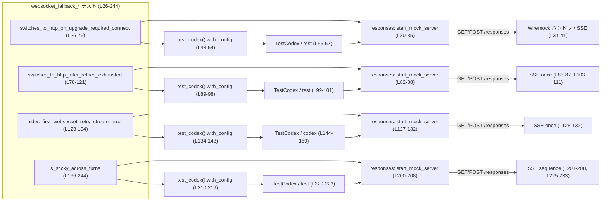
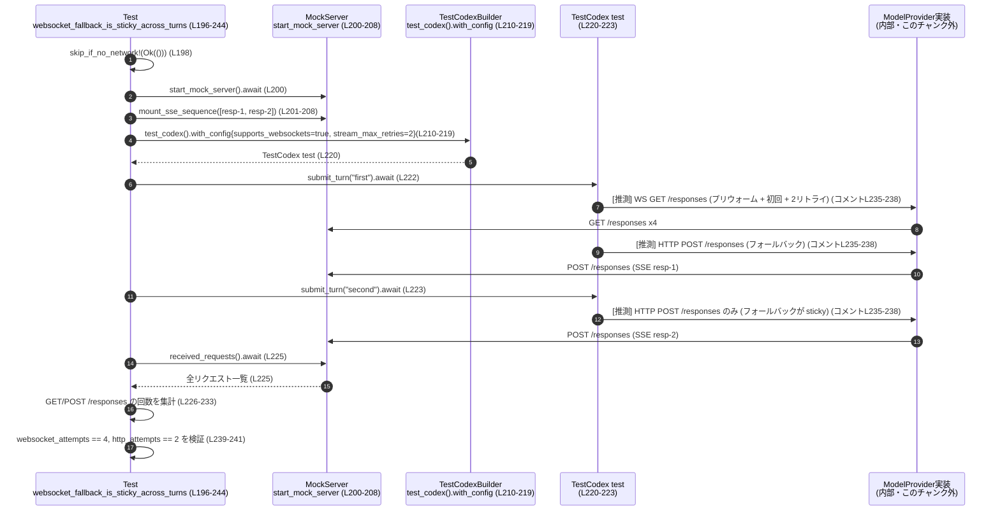

# core/tests/suite/websocket_fallback.rs

## 0. ざっくり一言

WebSocket が使えない／失敗する状況で、Codex のモデルプロバイダが HTTP ストリーミング（SSE）にフォールバックする挙動を検証する統合テスト群です（`tokio` のマルチスレッドランタイム上で実行）。（core/tests/suite/websocket_fallback.rs:L26-L244）

---

## 1. このモジュールの役割

### 1.1 概要

- このモジュールは、Codex クライアントが **WebSocket ストリーミングから HTTP(S) ベースの SSE ストリーミングに安全に切り替わる** かどうかを検証するためのテストを提供します。（L26-L244）
- 特に以下の 4 点を確認します。
  - WebSocket 接続で `426 Upgrade Required` が返ったときに即座に HTTP フォールバックに切り替えること（L26-L76）。
  - WebSocket のリトライが上限に達したあとで HTTP にフォールバックすること（L78-L121）。
  - WebSocket リトライ時のエラーメッセージ表示ポリシー（最初のリトライメッセージを隠す）を守ること（L123-L194）。
  - 一度 HTTP フォールバックに入ったら、そのセッション中はその状態が「粘着的（sticky）」に維持されること（L196-L244）。

### 1.2 アーキテクチャ内での位置づけ

このファイル自体はテストですが、背後にある実装（このチャンクには現れない）について、挙動の仕様を間接的に示しています。

主な関係は次の通りです。

- `test_codex().with_config(...)` で **Codex クライアント（`TestCodex` / `codex`）** を作成し、その中で
  - モデルプロバイダの base URL（モックサーバ）、
  - WebSocket 対応フラグ、
  - WebSocket ストリームのリトライ上限 `stream_max_retries`,
  - HTTP リトライ上限 `request_max_retries`
  を設定します。（L43-L54, L89-L98, L134-L143, L210-L219）
- `responses::start_mock_server()` と `wiremock::Mock` により、**Wiremock ベースのモック HTTP サーバ**を起動し、`/responses` への GET/POST の挙動と SSE ストリームを制御します。（L30-L41, L31-L35, L82-L88, L127-L132, L200-L208）
- Codex クライアントは WebSocket 接続の試行や HTTP POST によるフォールバックを内部で行い、そのリクエストが上記モックサーバに到達します。（リクエスト数を `received_requests()` で検証）（L59-L67, L103-L111, L225-L233）
- イベントストリームは `codex.next_event()` で `EventMsg` として受け取り、`StreamError` や `TurnComplete` を検証します。（L171-L183）

依存関係を簡略化すると次のようになります。



### 1.3 設計上のポイント

- **WebSocket フォールバック仕様のテスト駆動**  
  各テストが異なる条件でのフォールバック動作を仕様レベルで明示しています（コメントを含む）。（L49-L52, L69-L71, L113-L115, L235-L238）
- **構成の一貫性**  
  4 つのテストすべてで、ほぼ同じ構成（`supports_websockets = true`, `stream_max_retries = Some(2)`, `request_max_retries = Some(0)`, `WireApi::Responses`）を用い、条件だけを変えています。（L46-L52, L92-L97, L137-L142, L213-L218）
- **非同期・並行性**  
  すべて `#[tokio::test(flavor = "multi_thread", worker_threads = 2)]` でマルチスレッドランタイム上にテストタスクを載せ、内部の Codex クライアントも非同期に動作します。（L26, L78, L123, L196）
- **ネットワーク依存テストの保護**  
  冒頭で `skip_if_no_network!(Ok(()));` を呼ぶことで、ネットワークが使えない環境ではテストをスキップできるようになっています（実装詳細はこのチャンクにはありません）。（L28, L80, L125, L198）
- **観測指標の明示**  
  - HTTP/WS のフォールバックは **サーバー側で受けた HTTP メソッド別のリクエスト回数** で検証（GET と POST のカウント）。（L59-L67, L103-L111, L225-L233）
  - リトライ表示ポリシーは **イベントストリーム上の `EventMsg::StreamError` メッセージ内容** で検証。（L171-L183, L185-L190）

---

## 2. 主要な機能一覧（コンポーネントインベントリー）

### 2.1 テスト関数一覧

| 名前 | 種別 | 役割 / シナリオ | 行範囲 |
|------|------|-----------------|--------|
| `websocket_fallback_switches_to_http_on_upgrade_required_connect` | 非同期テスト関数 | WebSocket 接続プリウォームが 426 を受けたとき、追加の WS 再接続なしに即座に HTTP フォールバックへ切り替えるかを検証 | core/tests/suite/websocket_fallback.rs:L26-L76 |
| `websocket_fallback_switches_to_http_after_retries_exhausted` | 非同期テスト関数 | WebSocket ストリームリトライが上限に達した後、同じターンが HTTP で再送されるかを検証 | L78-L121 |
| `websocket_fallback_hides_first_websocket_retry_stream_error` | 非同期テスト関数 | WebSocket リトライ時の `StreamError` メッセージ表示ポリシー（1 回目を隠す／デバッグビルドのみ表示）を検証 | L123-L194 |
| `websocket_fallback_is_sticky_across_turns` | 非同期テスト関数 | 一度 HTTP フォールバックに入ったセッションが、以降のターンでも HTTP のまま（sticky）であることを検証 | L196-L244 |

### 2.2 テストが利用する主要コンポーネント

| 名前 | 種別 | 役割 / 用途 | 出現箇所 |
|------|------|-------------|----------|
| `TestCodex` | 構造体（テスト用） | Codex クライアントとその周辺情報をまとめたテストヘルパー（名前と使用箇所からの推測）。`build` の戻り値として使用される。 | L15, L144-L149, L220 |
| `test_codex` | 関数 | `TestCodex` ビルダーを返すテストヘルパー（名前からの推測）。`with_config` による設定変更の起点。 | L16, L43, L89, L134, L210 |
| `WireApi` | 列挙体 | モデルプロバイダで使用するワイヤ API 種別。ここでは `WireApi::Responses` を指定。 | L2, L47, L93, L138, L214 |
| `EventMsg` | 列挙体 | Codex イベントストリームで流れるメッセージ種別。ここでは `StreamError` と `TurnComplete` を扱う。 | L4, L178-L181 |
| `Op` | 列挙体 | Codex へ送る操作。ここでは `Op::UserTurn` で単一ターンのユーザ入力を送信。 | L5, L151-L168 |
| `UserInput` | 列挙体 | ユーザ入力の表現。ここでは `UserInput::Text` でテキスト入力を構成。 | L7, L153-L156 |
| `AskForApproval` | 列挙体 | 実行前承認ポリシー。ここでは `AskForApproval::Never` を指定。 | L3, L159 |
| `SandboxPolicy` | 列挙体 | サンドボックス実行ポリシー。ここでは `SandboxPolicy::DangerFullAccess` を指定（詳細はこのチャンクにはないが、名前から危険な完全アクセスを許可するポリシーと推測できる）。 | L6, L161 |
| `responses` モジュール | モジュール | モックサーバ起動と SSE 関連ヘルパー（`start_mock_server`, `mount_sse_once`, `mount_sse_sequence`, `sse`, `ev_response_created`, `ev_completed`）を提供。 | L8-L13, L30-L41, L82-L88, L127-L132, L200-L208 |
| `skip_if_no_network!` | マクロ | ネットワーク不可環境ではテストをスキップするためのマクロ（名前からの推測）。 | L14, L28, L80, L125, L198 |
| `Mock`, `ResponseTemplate`, `method`, `path_regex`, `Method` | 型・ヘルパー | Wiremock による HTTP リクエストマッチングとレスポンステンプレート設定。GET `/responses` に対して 426 を返す設定などに使用。 | L20-L24, L31-L35, L59-L67, L103-L111, L225-L233 |

---

## 3. 公開 API と詳細解説

このファイル自体にはライブラリ用の公開 API はありませんが、テストを通して **Codex のフォールバック挙動の契約** を確認しています。その意味で、以下のテストは「仕様の一部」を表現しています。

### 3.1 型一覧（補足）

すでに 2.2 で列挙したため、ここでは Rust 特有の概念との関係に絞って補足します。

- すべてのテストは `anyhow::Result<()>` を返します（L1, L27, L79, L124, L197）。  
  - 目的: `?` 演算子を使ってエラー伝播させ、テスト失敗を簡潔に表現するためです。
- `tokio::time::timeout` と `Duration` により、非同期イベント取得にタイムリミットを設けています（L18-L19, L171-L177）。  
  - これは「イベントが永遠に来ない」という並行バグがあった場合でも、テストがハングせずに失敗するようにするためです。

### 3.2 関数詳細

#### `websocket_fallback_switches_to_http_on_upgrade_required_connect() -> Result<()>`

**概要**

- WebSocket の「プリウォーム」接続（おそらく起動時の初回接続）が `426 Upgrade Required` を受け取ったとき、即座に HTTP ベースのストリーミングに切り替わることを、リクエスト回数を通して検証します。（L26-L76, コメント L69-L71）

**引数**

| 引数名 | 型 | 説明 |
|--------|----|------|
| なし | - | テスト関数のため、引数はありません。 |

**戻り値**

- `anyhow::Result<()>`  
  - 途中の `?` でエラーが発生した場合はテスト失敗となり、成功時は `Ok(())` を返します。（L27, L75）

**内部処理の流れ**

1. ネットワーク利用可能性をチェックし、必要ならテストをスキップします。（`skip_if_no_network!(Ok(()));`）（L28）
2. `responses::start_mock_server().await` で Wiremock ベースと思われるモックサーバを起動します。（L30）
3. `Mock::given(method("GET")).and(path_regex(".*/responses$"))` で `/responses` へ向けた GET リクエストにマッチするモックを作成し、`ResponseTemplate::new(426)` を返すようにし、サーバへマウントします。（L31-L35）  
   → これにより、WebSocket ハンドシェイクリクエスト（GET `/responses`）が常に 426 を受け取る環境を構築しています。
4. `mount_sse_once` で `/responses` の SSE エンドポイントに単一レスポンス（`resp-1` の created + completed）を仕込みます。（L37-L41）
5. `test_codex().with_config({ ... })` で Codex の設定を変更し、`base_url`, `wire_api`, `supports_websockets`, `stream_max_retries=Some(2)`, `request_max_retries=Some(0)` をセットします。（L43-L53）
6. `builder.build(&server).await?` で `TestCodex` インスタンス `test` を生成します。（L55）
7. `test.submit_turn("hello").await?` で 1 回のユーザターンを実行します。（L57）  
   コメントによると、起動時プリウォームで 426 を検知して即座に HTTP フォールバックに切り替えるため、このターンは WebSocket ではなく HTTP で行われることが期待されています。（L69-L71）
8. `server.received_requests().await.unwrap_or_default()` でモックサーバが受けた全リクエストを取得し、GET `/responses` の回数（`websocket_attempts`）と POST `/responses` の回数（`http_attempts`）をカウントします。（L59-L67）
9. 期待値として `websocket_attempts == 1`, `http_attempts == 1`, `response_mock.requests().len() == 1` を `assert_eq!` で検証します。（L71-L73）

**Examples（使用例）**

この関数自体はテストとして `cargo test websocket_fallback_switches_to_http_on_upgrade_required_connect` のように実行されます。  
同様のテストを追加する際は、`mount_sse_once` と `received_requests` を使ったリクエスト回数の検証パターンを流用できます。（L37-L41, L59-L67）

**Errors / Panics**

- `builder.build(&server).await?` や `test.submit_turn("hello").await?` が `Err` を返すと、そのまま `?` により `Err` が伝播してテスト失敗となります。（L55, L57）
- `server.received_requests().await.unwrap_or_default()` は `unwrap_or_default` を使っているため、`Err` の場合は空配列として扱われます（ここではパニックしません）。（L59）
- アサーション（`assert_eq!`）が失敗するとテストはパニックします。（L71-L73）

**Edge cases（エッジケース）**

- WebSocket GET `/responses` が全く行われない場合（`websocket_attempts == 0`）や、HTTP フォールバックが起動しない場合（`http_attempts == 0`）はテストが失敗し、フォールバック実装の欠陥を検出できます。（L59-L67, L71-L73）
- `stream_max_retries` や `request_max_retries` の設定値を変更した場合、期待されるリクエスト回数も変わる可能性があります（このテストは現在値 2/0 を前提にしています）。（L51-L52）

**使用上の注意点**

- このパターンを流用して別シナリオのテストを書く場合、「プリウォームによる 1 回の WebSocket 試行」が暗黙に含まれている点（コメント L69-L71）を意識する必要があります。  
- 設定変更と期待値（GET/POST の回数）は必ず整合させる必要があります。

---

#### `websocket_fallback_switches_to_http_after_retries_exhausted() -> Result<()>`

**概要**

- WebSocket ストリーミングのリトライ回数（`stream_max_retries = 2`）が尽きたあとに、同じターンが HTTP で再送されることを検証するテストです。（L78-L121, コメント L113-L115）

**引数**

- なし

**戻り値**

- `anyhow::Result<()>`（L79, L120）

**内部処理の流れ**

1. ネットワークチェック（L80）。
2. モックサーバを起動し（L82）、`mount_sse_once` で HTTP `/responses` に対する SSE を 1 回分だけ設定します（`resp-1` created/completed）。（L83-L87）
3. `test_codex().with_config({ ... })` で前テストと同様の設定を行います（base_url, `WireApi::Responses`, WebSocket 有効、`stream_max_retries = 2`, `request_max_retries = 0`）。（L89-L97）
4. `builder.build(&server).await?` で `test` を生成（L99）、`test.submit_turn("hello").await?` で 1 回のターンを実行します（L101）。
5. モックサーバに届いたリクエストを取得し、GET `/responses`（WebSocket 試行）と POST `/responses`（HTTP リクエスト）の回数を集計します（L103-L111）。
6. コメントにあるシナリオ（L113-L115）に基づき、期待値として `websocket_attempts == 4`, `http_attempts == 1` を検証します（L116-L118）。  
   - コメントによれば、  
     - 起動時に遅延プリウォームが 1 回 WebSocket を試行。  
     - 最初のターンで WebSocket ストリームを 3 回試行（初回 + 2 リトライ）。  
     - その後フォールバックが起動し、HTTP による再送が 1 回行われる。  
     という合計 4 回の GET と 1 回の POST を期待しています。

**Errors / Panics**

- `build` や `submit_turn` の `?` によるエラー伝播、`assert_eq!` 失敗時のパニックは前テストと同様です。（L99-L101, L116-L118）
- `response_mock.requests().len()` が 1 以外の場合（HTTP SSE が 1 回だけ消費されなかった場合）もアサーション失敗となります。（L118）

**Edge cases**

- 実装側でリトライアルゴリズムを変更（たとえば「初回 + 1 リトライ」）した場合、このテストの期待値（4 回の GET）も変更が必要になります（コメント L113-L115 は仕様として重要です）。
- `request_max_retries` を 0 に設定しているため、HTTP 側のリトライは考慮せず、WebSocket 側のリトライのみを検証していることに注意が必要です。（L96）

**使用上の注意点**

- WebSocket の接続失敗の具体的な原因（タイムアウト・接続拒否など）はこのファイルには現れませんが、テストは「内部で何らかの失敗が起こり、リトライが行われる」という前提を持っているため、モックサーバ側で WebSocket エンドポイントを未定義にしておくなど、実装側との整合性が重要です（このファイルから直接は確認できません）。

---

#### `websocket_fallback_hides_first_websocket_retry_stream_error() -> Result<()>`

**概要**

- WebSocket ストリームのリトライ時に発生する `EventMsg::StreamError` のメッセージ表示ポリシーを検証し、  
  - デバッグビルド（`cfg!(debug_assertions)` true）の場合は「1/2」「2/2」の 2 つのメッセージが出る。  
  - リリースビルドでは「2/2」だけがユーザに見える。  
 ことを確認します。（L185-L190）

**引数**

- なし

**戻り値**

- `anyhow::Result<()>`（L124, L193）

**内部処理の流れ**

1. ネットワークチェック（L125）。
2. モックサーバ起動と `mount_sse_once` による SSE 設定（L127-L132）は前テストと同様です。
3. `test_codex().with_config` により Codex を WebSocket 有効・`stream_max_retries = 2` などで構成し（L134-L142）、`builder.build(&server).await?` から `TestCodex` を分解代入で取り出します（`TestCodex { codex, session_configured, cwd, .. }`）（L144-L149）。
4. `codex.submit(Op::UserTurn { ... }).await?` で 1 ターンを開始します（L151-L169）。
   - 入力は `UserInput::Text { text: "hello".into(), text_elements: Vec::new() }`（L153-L156）。
   - `cwd`, `approval_policy`, `sandbox_policy`, `model` などセッションに必要な情報を活用しています（L158-L163）。
5. その後、`stream_error_messages` ベクタを用意し、`loop` 内で `codex.next_event()` を 10 秒タイムアウト付きで待機し続けます（L171-L177）。
   - `timeout(Duration::from_secs(10), codex.next_event())` によって、イベントが来ない場合は `"timeout waiting for event"` で `expect` によりパニックします（L173-L176）。
   - `codex.next_event()` が `None` を返した場合も `"event stream ended unexpectedly"` でパニックします（L176）。
6. 受け取ったイベントの `msg` フィールドを `EventMsg` としてマッチし、  
   - `EventMsg::StreamError(e)` の場合は `e.message` を `stream_error_messages` に push、  
   - `EventMsg::TurnComplete(_)` が来たらループを抜ける、  
   それ以外は無視します。（L178-L182）
7. ループ終了後、`expected_stream_errors` を `cfg!(debug_assertions)` に応じて構成し、  
   - デバッグビルド: `["Reconnecting... 1/2", "Reconnecting... 2/2"]`  
   - リリースビルド: `["Reconnecting... 2/2"]`  
   として `stream_error_messages` との一致を検証します。（L185-L190）

**Errors / Panics**

- `submit` の `?` によるエラー伝播（L151-L169）。
- `timeout` の結果に対する 2 つの `expect` は、イベントが時間内に来ない／ストリームが早期終了した場合にパニックします（L173-L176）。
- `assert_eq!(stream_error_messages, expected_stream_errors)` が失敗するとテストはパニックします（L190）。

**Edge cases**

- `cfg!(debug_assertions)` の値はコンパイル時に決まるため、  
  - `cargo test`（デフォルト）では通常 true（デバッグビルド）で 2 つのメッセージを期待。  
  - `--release` でのテスト実行時には 1 つのメッセージを期待。  
  という差が生じます（L185-L189）。  
  → テストをどのビルドモードで走らせるかに注意が必要です。
- `stream_max_retries = 2` であることから、`"Reconnecting... 2/2"` のメッセージは 2 回目のリトライを意味していると解釈できますが、このファイルには `StreamError` の生成ロジックは現れません（仕様はコメントと期待値から読み取れます）。（L140-L141, L185-L189）

**使用上の注意点**

- `timeout` の値（10 秒）はイベント頻度やテスト環境によっては長すぎ・短すぎになる可能性があります。ハング検出用のセーフティではありますが、実際のパフォーマンスに合わせて調整が必要な場合があります。（L171-L177）
- イベントストリームの順序に依存しているため、実装変更で `StreamError` と `TurnComplete` の順序が変わるとテストが失敗する可能性があります。

---

#### `websocket_fallback_is_sticky_across_turns() -> Result<()>`

**概要**

- 一度 WebSocket から HTTP へフォールバックしたセッションが、その後のターンでも WebSocket に戻らず、HTTP のまま維持される（sticky）ことを検証するテストです。（L196-L244, コメント L235-L238）

**引数**

- なし

**戻り値**

- `anyhow::Result<()>`（L197, L243）

**内部処理の流れ**

1. ネットワークチェック（L198）。
2. モックサーバを起動し、`mount_sse_sequence` で 2 つの SSE ストリーム（`resp-1`, `resp-2` の created/completed）を順番に返すよう設定します（L200-L208）。
3. `test_codex().with_config` で前テスト同様の設定を行い（L210-L218）、`builder.build(&server).await?` で `test` を取得します（L220）。
4. `test.submit_turn("first").await?` と `test.submit_turn("second").await?` を順番に実行し、2 ターンを同じセッションで処理します（L222-L223）。
5. モックサーバに届いたリクエストを取得し（L225）、GET `/responses` と POST `/responses` の回数をカウントします（L226-L233）。
6. コメントには次のような期待シナリオが記述されています（L235-L238）。  
   - すべての WebSocket 試行は最初のターン中に発生：  
     - 遅延プリウォーム: GET 1 回  
     - ストリーム試行: 初回 + 2 リトライ = GET 計 3 回  
   - フォールバックは sticky なので、2 つ目のターンでは WebSocket 試行は行われず、HTTP POST のみが行われる。  
7. 以上に基づき、`websocket_attempts == 4`, `http_attempts == 2`（2 ターン分の HTTP）、`response_mock.requests().len() == 2`（2 回 SSE 消費）を `assert_eq!` で検証します（L239-L241）。

**Errors / Panics**

- `build`, `submit_turn` の `?` 経由のエラー伝播および `assert_eq!` のパニックは前テストと同様です（L220-L223, L239-L241）。

**Edge cases**

- sticky フォールバックの仕様が変更され（例えば「ターンごとに毎回 WebSocket を再試行する」など）、2 回目のターンでも WebSocket 試行が行われた場合、GET 回数が 4 より増え、このテストは失敗します（L226-L233, L239）。
- `mount_sse_sequence` が 2 回以上の SSE リクエストを許容しない実装（名前から 2 回で終わることが想定される）であれば、HTTP フォールバックが正しく働かない場合に `response_mock.requests().len() == 2` のアサーションが失敗します（L201-L208, L241）。

**使用上の注意点**

- sticky なフォールバックはセッション状態に依存するため、`TestCodex` や Codex 本体のセッション管理を変更する際には、このテストに影響が及ばないか確認する必要があります（このファイルにはセッション状態の内部構造は現れませんが、`session_configured` などが存在することからも状態管理があることが示唆されます：L146-L147）。

---

### 3.3 その他の関数・ヘルパー

このファイルで呼び出しているが、ここでは実装が見えない補助関数／マクロをまとめます。

| 関数/マクロ名 | 概要（1 行） | 出現箇所 | 備考 |
|---------------|--------------|----------|------|
| `responses::start_mock_server` | モック HTTP サーバを起動し、`uri()` や `received_requests()` を提供する | L30, L82, L127, L200 | `wiremock::Mock` の `mount` に渡されているため、Wiremock サーバまたはそのラッパーと推測されます。 |
| `responses::mount_sse_once` | 指定した SSE ストリームを 1 回だけ返すエンドポイントをサーバにマウントする | L37-L41, L83-L87, L128-L132 | 戻り値 `response_mock` は `.requests()` を持ち、実際のリクエスト回数の確認に使用されます。 |
| `responses::mount_sse_sequence` | SSE ストリームのベクタを順番に返すエンドポイントをマウントする | L201-L208 | sticky フォールバック検証に利用。 |
| `responses::sse` | `ev_response_created` や `ev_completed` を束ねて SSE ストリームを構成する | L39, L85, L130, L204-L205 | |
| `responses::ev_response_created` / `ev_completed` | モデルレスポンスの開始／完了を表す SSE イベントを構成する | L9-L12, L39, L85, L130, L204-L205 | |
| `test_codex` | `TestCodex` ビルダーを返すヘルパー | L16, L43, L89, L134, L210 | `with_config` で `config` をクロージャで調整可能。 |
| `skip_if_no_network!` | ネットワーク不可環境でテストをスキップする | L14, L28, L80, L125, L198 | 実装はこのチャンクにはありません。 |

---

## 4. データフロー

ここでは、最も複雑なシナリオである `websocket_fallback_is_sticky_across_turns`（L196-L244）のデータフローを例に、リクエスト・イベントの流れを整理します。

### 4.1 処理の要点（テキストによる説明）

1. テストコードがモックサーバを起動し、`mount_sse_sequence` により 2 回分の SSE レスポンス（`resp-1`, `resp-2`）を `/responses` エンドポイントに登録します。（L200-L208）
2. `test_codex().with_config(...)` で WebSocket 有効・`stream_max_retries=2` な Codex クライアントを構成し、`test` を構築します。（L210-L220）
3. `test.submit_turn("first")` により、最初のターンが開始されます。このターン中に：
   - 起動時の遅延プリウォーム（WebSocket GET `/responses` 1 回）。  
   - WebSocket ストリーム試行（初回 + 2 リトライ = GET `/responses` 3 回）。  
   - WebSocket 失敗後、HTTP POST `/responses` で SSE ストリーム `resp-1` を消費。  
   という流れが起きることがコメントから読み取れます（L235-L238）。
4. `test.submit_turn("second")` により 2 番目のターンが開始されます。このターンでは、sticky なフォールバックにより WebSocket は再試行せず、HTTP POST `/responses` のみが行われ、SSE ストリーム `resp-2` を消費します。（L223-L241）
5. 最後に、モックサーバから `received_requests()` を取得し、実際に行われた GET/POST `/responses` の回数が上記期待どおりであるかを検証します。（L225-L241）

### 4.2 シーケンス図

以下のシーケンス図は `websocket_fallback_is_sticky_across_turns (L196-244)` における大まかなやり取りを表します。  
WebSocket 内部挙動はコメントと期待値からの推測を含みますが、図中にその旨を明示します。



> 注: WebSocket の内部接続回数やフォールバック発火タイミングは、このファイルではコメントと期待値（アサーション）にのみ現れます（L113-L115, L235-L238）。実装コードはこのチャンクには含まれていません。

---

## 5. 使い方（How to Use）

このファイルはテスト用ですが、`TestCodex` とモックサーバを使った統合テストの書き方としても参考になります。

### 5.1 基本的な使用方法（テストパターンとして）

以下は、このファイルで用いられているパターンを抽象化したサンプルです。

```rust
use core_test_support::responses;
use core_test_support::test_codex::test_codex;
use codex_model_provider_info::WireApi;
use wiremock::Mock;
use wiremock::ResponseTemplate;
use wiremock::matchers::{method, path_regex};
use anyhow::Result;

#[tokio::test(flavor = "multi_thread", worker_threads = 2)]
async fn example_websocket_fallback_test() -> Result<()> {
    // ネットワークが使えない環境ではテストをスキップする              // core/tests/suite/websocket_fallback.rs:L28
    skip_if_no_network!(Ok(()));

    // モックサーバを起動する                                             // L30
    let server = responses::start_mock_server().await;

    // WebSocket ハンドシェイク用の GET /responses に 426 を返すモックを設定 // L31-L35
    Mock::given(method("GET"))
        .and(path_regex(".*/responses$"))
        .respond_with(ResponseTemplate::new(426))
        .mount(&server)
        .await;

    // HTTP SSE のレスポンスを 1 回だけ返すエンドポイントを用意する         // L37-L41
    let _response_mock = responses::mount_sse_once(
        &server,
        responses::sse(vec![
            responses::ev_response_created("resp-1"),
            responses::ev_completed("resp-1"),
        ]),
    )
    .await;

    // Codex クライアントを WebSocket 有効＋リトライ回数指定で構成する      // L43-L53
    let base_url = format!("{}/v1", server.uri());
    let mut builder = test_codex().with_config(move |config| {
        config.model_provider.base_url = Some(base_url.clone());
        config.model_provider.wire_api = WireApi::Responses;
        config.model_provider.supports_websockets = true;
        config.model_provider.stream_max_retries = Some(2);
        config.model_provider.request_max_retries = Some(0);
    });

    // テスト用 Codex インスタンスを構築し、1 ターンを実行する             // L55-L57
    let test = builder.build(&server).await?;
    test.submit_turn("hello").await?;

    // 以降、server.received_requests() 等を用いて検証する                  // L59-L67 など

    Ok(())
}
```

このように、モックサーバと `TestCodex` を組み合わせることで、ネットワーク越しの挙動を含めた統合テストを書くことができます。

### 5.2 よくある使用パターン

このファイルから見える典型的なテストパターンは次の 2 種類です。

1. **リクエスト回数による挙動検証**（L59-L67, L103-L111, L225-L233）  
   - GET と POST の回数をカウントし、WebSocket 試行回数・HTTP フォールバック回数を推定します。
   - sticky なフォールバックなど、状態遷移もこの方法で推測できます（L235-L240）。

2. **イベントストリームによるユーザ向けメッセージ検証**（L171-L183, L185-L190）  
   - `codex.next_event()` をループで読み、`EventMsg::StreamError` や `EventMsg::TurnComplete` の順序・内容を検証します。
   - ユーザに見えるエラーメッセージポリシー（リトライ時の表示抑制など）もここでテストできます。

### 5.3 よくある間違い（想定されるもの）

このファイルから推測できる「やりがちな誤り」と、その対策例です。

```rust
// 誤り例: WebSocket を有効にしていないため、フォールバック動作を検証できない
let mut builder = test_codex().with_config(move |config| {
    config.model_provider.base_url = Some(base_url.clone());
    // config.model_provider.supports_websockets = true; // ← 抜けている
});

// 正しい例: supports_websockets を true に設定してからフォールバックを検証する
let mut builder = test_codex().with_config(move |config| {
    config.model_provider.base_url = Some(base_url.clone());
    config.model_provider.wire_api = WireApi::Responses;
    config.model_provider.supports_websockets = true;      // L48, L94, L139, L215
    config.model_provider.stream_max_retries = Some(2);
    config.model_provider.request_max_retries = Some(0);
});
```

```rust
// 誤り例: stream_max_retries を変えたのに、期待する WebSocket 回数を更新していない
config.model_provider.stream_max_retries = Some(3);
// ...
assert_eq!(websocket_attempts, 4); // L116, L239 と同じ値を使ってしまっている

// 正しい例: リトライ回数の変更に合わせて、期待する WebSocket 回数も見直す
config.model_provider.stream_max_retries = Some(3);
// ...
// コメントで仕様を明示しつつ、新しい期待値に合わせる（例: 5 など）
assert_eq!(websocket_attempts, 5);
```

### 5.4 使用上の注意点（まとめ）

- **ビルドモード依存**  
  `cfg!(debug_assertions)` によりデバッグビルドとリリースビルドで期待するエラーメッセージが異なるため、テスト実行モードに注意する必要があります。（L185-L189）
- **非同期・並行性**  
  - `#[tokio::test(flavor = "multi_thread")]` でテスト自身が並行実行される前提があるため、テスト内で共有状態を持つ場合はスレッド安全性に注意する必要があります（このファイルでは共有状態を扱っていませんが、`TestCodex` の内部はマルチスレッド環境で動作します）。（L26, L78, L123, L196）
  - イベント待ちには `timeout` を使い、ハングを防いでいますが、タイムアウト値がテスト環境に適切かどうかは検討が必要です。（L171-L177）
- **ネットワーク依存**  
  - `skip_if_no_network!` によりテストをスキップできますが、CI などでネットワーク条件が変わる場合、テストが実行されないことで不具合検出が遅れる可能性があります。（L28, L80, L125, L198）

---

## 6. 変更の仕方（How to Modify）

### 6.1 新しいフォールバックシナリオを追加する場合

新しいテスト（たとえば「WebSocket が特定の HTTP ステータスで失敗したときの挙動」など）を追加する手順の一例です。

1. **このファイルに新しい `#[tokio::test]` 関数を追加**  
   - 既存の 4 テストを参考に、`skip_if_no_network!`, `responses::start_mock_server`, `test_codex().with_config` のパターンを踏襲します。（L26-L28, L30, L43-L54 など）
2. **モックサーバの挙動を設定**  
   - `wiremock::Mock` と `ResponseTemplate` を用いて、特定のステータスコードやレスポンスを返すようにします（例: 500 エラーなど）。（L31-L35）
3. **Codex の設定を調整**  
   - `stream_max_retries`, `request_max_retries`, `supports_websockets` などをシナリオに合わせて調整します。（L46-L52, L92-L97, L137-L142, L213-L218）
4. **検証指標を決める**  
   - リクエスト回数（GET/POST）、イベント内容（`EventMsg`）、あるいは両方を用いて期待動作を明文化します。（L59-L67, L171-L183）

### 6.2 既存のフォールバック仕様を変更する場合

実装側（このチャンクには現れない Codex 本体など）の仕様変更に伴い、このテストを調整する際の注意点です。

- **リトライ回数やアルゴリズムの変更**  
  - `stream_max_retries` の解釈（「総試行回数」か「リトライ回数」か）や、プリウォームの有無が変わると、GET 回数の期待値（L71, L116, L239）も変わります。
  - コメント（L113-L115, L235-L238）は実質的に仕様書となっているため、仕様変更時はコメントも合わせて更新することが望ましいです。
- **ユーザ向けエラーメッセージの変更**  
  - `StreamError` メッセージ文言を変更する場合、`expected_stream_errors`（L185-L189）も更新する必要があります。
  - デバッグビルドとリリースビルドでの表示ポリシーを変更する場合、`cfg!(debug_assertions)` ベースの分岐も見直されます。
- **イベント順序やセッション管理の変更**  
  - `TurnComplete` イベントがどのタイミングで発行されるかを変更すると、`websocket_fallback_hides_first_websocket_retry_stream_error` のループ条件（L171-L183）に影響します。
  - sticky フォールバックの仕様が変わると、2 回目以降のターンで WebSocket を再試行するかどうかが変わり、`websocket_fallback_is_sticky_across_turns` の期待値に影響します（L235-L240）。

---

## 7. 関連ファイル

このファイルと密接に関係するモジュール・ライブラリをまとめます（パスはモジュールパス／クレート名ベースで表記）。

| パス / クレート | 役割 / 関係 |
|-----------------|------------|
| `core_test_support::responses` | モックサーバの起動と SSE 関連ヘルパー（`start_mock_server`, `mount_sse_once`, `mount_sse_sequence`, `sse`, `ev_response_created`, `ev_completed`）を提供します。WebSocket フォールバック動作を HTTP レベルで観測するための基盤となっています。（L8-L13, L30-L41, L82-L88, L127-L132, L200-L208） |
| `core_test_support::test_codex` | `TestCodex` と `test_codex` を提供するテストサポートモジュールです。Codex クライアントの構築と、テスト用の補助メソッド（`submit_turn`, `next_event` 等）をまとめていると推測されます。（L15-L16, L55, L99, L144-L149, L220） |
| `codex_model_provider_info::WireApi` | モデルプロバイダの API 種別を表す型です。ここではレスポンスストリーミング API (`WireApi::Responses`) を指定しています。（L2, L47, L93, L138, L214） |
| `codex_protocol::protocol::{Op, EventMsg, AskForApproval, SandboxPolicy}` | Codex のプロトコル定義であり、操作（`Op::UserTurn`）、イベント（`EventMsg`）、承認ポリシー、サンドボックスポリシーを表す列挙体を提供します。（L3-L6, L151-L168, L178-L181） |
| `codex_protocol::user_input::UserInput` | ユーザ入力の表現型。ここでは `UserInput::Text` として単純なテキスト入力を構成しています。（L7, L153-L156） |
| `wiremock` クレート | HTTP モックサーバとマッチャー（`Mock`, `ResponseTemplate`, `method`, `path_regex`, `Method`）を提供します。テストで HTTP リクエストパターンとステータスコードを制御するのに使用されています。（L20-L24, L31-L35, L59-L67, L103-L111, L225-L233） |
| `tokio` クレート | 非同期ランタイムと `#[tokio::test]`, `time::timeout`, `time::Duration` を提供します。このファイルのすべてのテストはマルチスレッド tokio ランタイム上で動きます。（L18-L19, L26, L78, L123, L171-L177, L196） |
| `anyhow` クレート | テスト関数の戻り値型 `Result<()>` に用いられる総称的なエラー型を提供します。（L1, L27, L79, L124, L197） |

このファイルは、これらのコンポーネントを組み合わせることで、WebSocket フォールバックの仕様をエンドツーエンドで検証するテストスイートとして機能しています。
