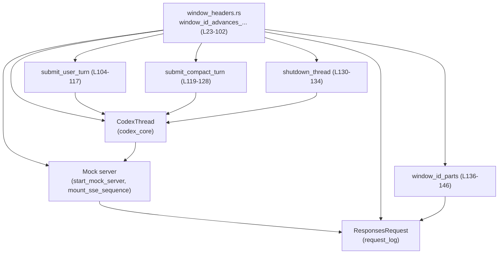
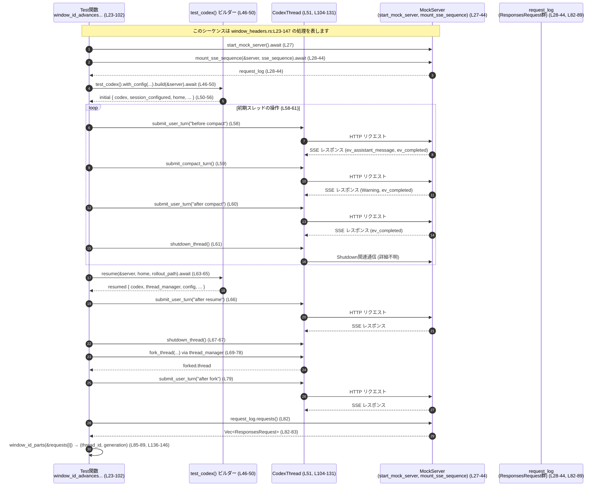

# core/tests/suite/window_headers.rs

## 0. ざっくり一言

Codex の対話スレッドが送るモデルリクエストの `x-codex-window-id` ヘッダが、**コンパクト処理 → 再開 (resume) → フォーク (fork)** を経る中で、期待どおりの thread_id / generation を維持・更新することを検証する統合テストです（`window_headers.rs:L23-102, L136-146`）。

---

## 1. このモジュールの役割

### 1.1 概要

- このモジュールは、Codex のスレッド (`CodexThread`) が発行する HTTP リクエストに含まれる `x-codex-window-id` ヘッダの **形式と状態遷移** を検証します（`window_headers.rs:L82-99, L136-146`）。
- 具体的には、以下の 5 回のモデルリクエストについて、ヘッダの thread_id と generation がどのような値になるかを確認しています（`window_headers.rs:L31-42, L58-61, L63-80, L82-99`）。
  1. コンパクト前のユーザーターン
  2. コンパクト (Op::Compact) 実行時
  3. コンパクト後のユーザーターン
  4. セッション再開 (resume) 後のユーザーターン
  5. スレッドフォーク (fork_thread) 後のユーザーターン
- 併せて、コンパクト実行時に Warning イベントが発生し、そのメッセージが `COMPACT_WARNING_MESSAGE` と一致することも検証しています（`window_headers.rs:L119-128`）。

### 1.2 アーキテクチャ内での位置づけ

このテストモジュールは、Codex のコアスレッドとモックサーバをつなぐ「外側」の統合テストレイヤとして位置づけられます。

- `CodexThread` をテスト用ビルダー (`test_codex`) から構築し、`Op` を送信することで振る舞いを駆動します（`window_headers.rs:L46-51, L58-61, L63-80, L104-131`）。
- モックサーバ (`start_mock_server`, `mount_sse_sequence`) がモデル API を模倣し、SSE レスポンスを返します（`window_headers.rs:L27-44`）。
- モックサーバは、受信した各リクエストを `ResponsesRequest` としてログに保持し、後で `x-codex-window-id` ヘッダを検査できるようにします（`window_headers.rs:L11, L82-89, L136-146`）。
- ウィンドウ ID の整合性は、このテスト内の `window_id_parts` 関数で検査されます（`window_headers.rs:L136-146`）。

#### 依存関係図（簡略）

以下は、本チャンク（`window_headers.rs:L23-147`）における主な依存関係の概略です。



- テスト関数がヘルパー関数を呼び、ヘルパーが `CodexThread` に `Op` を送信します（`window_headers.rs:L58-61, L63-80, L104-131`）。
- `CodexThread` はモックサーバに HTTP リクエストを送り、そのログから `ResponsesRequest` を取得してヘッダを検査します（`window_headers.rs:L27-44, L82-89, L136-146`）。

### 1.3 設計上のポイント

- **操作シナリオの一元化**  
  1 つのテスト関数 `window_id_advances_after_compact_persists_on_resume_and_resets_on_fork` が、コンパクト → 再開 → フォークまでを一気に通すシナリオを構成しています（`window_headers.rs:L23-102`）。
- **共通処理のヘルパー化**  
  ユーザーターン送信、コンパクト送信、シャットダウンの 3 つの処理は、それぞれ `submit_user_turn` / `submit_compact_turn` / `shutdown_thread` に切り出され、テスト本体は高レベルのフローだけに集中しています（`window_headers.rs:L58-61, L63-80, L104-134`）。
- **ウィンドウ ID のフォーマットを強制**  
  `window_id_parts` で `x-codex-window-id` ヘッダを `"thread_id:generation"` 形式としてパースし、欠落や不正フォーマット時には `panic!` することで、ヘッダ契約を厳密に検証しています（`window_headers.rs:L136-145`）。
- **言語固有の安全性とエラー処理**  
  - すべての非同期処理は `anyhow::Result<()>` を返し、`?` 演算子で上位（テスト関数）にエラーを伝播します（`window_headers.rs:L4, L24, L50, L58-61, L63-80, L104-105, L119-120, L130-131`）。
  - ヘッダ検証や Warning 検証は `assert_eq!` と `panic!` を使い、テスト失敗として扱います（`window_headers.rs:L83, L91-99, L122-125, L139, L142, L145`）。
- **並行性の扱い**  
  - テストは `#[tokio::test(flavor = "multi_thread", worker_threads = 2)]` によりマルチスレッドランタイム上で動きますが、`await` により操作は順次実行されています（`window_headers.rs:L23-24, L27, L44, L50, L58-61, L63-80, L104-120, L131`）。
  - `CodexThread` は `Arc` で共有されており、スレッドセーフな共有が前提になっています（`window_headers.rs:L5, L21, L51, L104, L119, L130`）。

---

## 2. 主要な機能一覧（コンポーネントインベントリー・概要）

- **ウィンドウ ID 世代管理テスト**  
  `window_id_advances_after_compact_persists_on_resume_and_resets_on_fork`  
  コンパクト処理・セッション再開・スレッドフォークを含む一連の操作で、`x-codex-window-id` ヘッダの thread_id と generation が期待どおりに変化することを検証します（`window_headers.rs:L23-102`）。

- **ユーザーターン送信ヘルパー**  
  `submit_user_turn`  
  指定したテキストを `Op::UserInput` として `CodexThread` に送信し、`EventMsg::TurnComplete` が届くまで待機します（`window_headers.rs:L104-117`）。

- **コンパクトターン送信ヘルパー**  
  `submit_compact_turn`  
  `Op::Compact` を送信し、Warning イベントのメッセージが `COMPACT_WARNING_MESSAGE` と一致することを確認した後、`EventMsg::TurnComplete` を待ちます（`window_headers.rs:L119-128`）。

- **シャットダウンヘルパー**  
  `shutdown_thread`  
  `Op::Shutdown` を送信し、`EventMsg::ShutdownComplete` が届くまで待機します（`window_headers.rs:L130-134`）。

- **ウィンドウ ID ヘッダ解析ヘルパー**  
  `window_id_parts`  
  `ResponsesRequest` から `x-codex-window-id` ヘッダを取得し、`(thread_id: String, generation: u64)` に分解します（`window_headers.rs:L136-146`）。

---

## 3. 公開 API と詳細解説

このファイル自体はテストモジュールであり、外部クレートに公開される `pub` API は定義していません（すべての関数はデフォルトのモジュール内可視性です）。  
ここでは **テスト内で再利用されるヘルパー関数・外部型** を「API」とみなして整理します。

### 3.1 型一覧（主に外部型）

| 名前 | 種別 | 役割 / 用途 | 定義位置（利用箇所） |
|------|------|-------------|----------------------|
| `CodexThread` | 外部構造体 | Codex の対話スレッドを表す型。`submit(Op)` で操作を受け取り、`EventMsg` を発行します。具体的な実装はこのチャンクには現れません。 | 利用: `window_headers.rs:L5, L51, L58-61, L63-80, L104, L119, L130` |
| `ResponsesRequest` | 外部構造体 | モックサーバに送信された 1 件のモデルリクエストを表し、HTTP ヘッダの取得に使われます。 | 利用: `window_headers.rs:L11, L82-89, L136-146` |
| `Op` | 外部列挙体 | `CodexThread` への操作種別を表す。ここでは `UserInput`, `Compact`, `Shutdown` を使用しています。 | 利用: `window_headers.rs:L8, L104-113, L119-120, L130-131` |
| `EventMsg` | 外部列挙体 | Codex からのイベントを表す。ここでは `TurnComplete`, `Warning`, `ShutdownComplete` を利用しています（パターンマッチより推測可能）（`window_headers.rs:L115, L121-123, L132`）。 |
| `WarningEvent` | 外部構造体 | `EventMsg::Warning` に含まれるペイロード。ここでは `message` フィールドを検証対象とします。 | 利用: `window_headers.rs:L9, L122-125` |
| `UserInput` | 外部列挙体 | ユーザー入力を表す。ここでは `UserInput::Text { text, text_elements }` を使用しています。 | 利用: `window_headers.rs:L10, L104-113` |

> ※ これらの型のフィールドやメソッドの詳細な定義は、このチャンクには現れません。ここで記述している役割は、使用箇所から読み取れる範囲に限定しています。

---

### 3.2 関数詳細（5 件）

#### `window_id_advances_after_compact_persists_on_resume_and_resets_on_fork() -> Result<()>`

**定義位置**: `window_headers.rs:L23-102`

**概要**

- コンパクト → 再開 → フォークを含む 1 つのシナリオを実行し、その間に発生する 5 件のモデルリクエストの `x-codex-window-id` ヘッダを検査するテスト関数です（`window_headers.rs:L24, L27-44, L58-61, L63-80, L82-99`）。
- generation がコンパクト後にインクリメントされ、再開後も維持される一方で、フォーク後は thread_id が変わり generation が 0 に戻ることを確認します（`window_headers.rs:L85-99`）。

**属性**

- `#[tokio::test(flavor = "multi_thread", worker_threads = 2)]` により、Tokio のマルチスレッドランタイムで非同期テストとして実行されます（`window_headers.rs:L23`）。

**引数**

- なし

**戻り値**

- `Result<()>` (`anyhow::Result`)  
  - テスト内で発生した I/O エラーや Codex 側のエラーは `?` 演算子を通じてここに伝播し、テスト失敗として扱われます（`window_headers.rs:L24, L50, L58-61, L63-80`）。

**内部処理の流れ（アルゴリズム）**

1. **テスト実行条件の確認**  
   `skip_if_no_network!(Ok(()));` を呼び出し、ネットワーク条件等に応じてテスト実行を抑制するためのマクロを適用しています（`window_headers.rs:L25`）。  
   マクロの具体的な挙動はこのチャンクには現れませんが、名前からはネットワーク不在時にテストをスキップする目的であると推測されます。

2. **モックサーバと SSE シーケンスの準備**  
   - `start_mock_server().await` でモックサーバを起動します（`window_headers.rs:L27`）。
   - `mount_sse_sequence(&server, vec![ ... ]).await` で、5 つの SSE レスポンスシーケンスを登録し、そのリクエストログ (`request_log`) を取得します（`window_headers.rs:L28-44`）。
     - 1 つ目: assistant メッセージ + `resp-1` 完了
     - 2 つ目: assistant メッセージ (summary) + `resp-2` 完了
     - 3〜5 つ目: `resp-3`〜`resp-5` の完了のみ

3. **Codex インスタンスの構築**  
   - `test_codex().with_config(|config| { ... })` でテスト用 Codex ビルダーを生成し（`window_headers.rs:L46-49`）、
     - `config.model_provider.name` を `"Non-OpenAI Model provider"` に設定（`window_headers.rs:L47`）。
     - `config.compact_prompt` に `SUMMARIZATION_PROMPT` を設定（`window_headers.rs:L48`）。
   - `builder.build(&server).await?` で Codex を構築し、`initial` を得ます（`window_headers.rs:L50`）。
   - `Arc::clone(&initial.codex)` で `CodexThread` を参照する `Arc` を取得（`window_headers.rs:L51`）。
   - `initial.session_configured.rollout_path.clone().expect("rollout path")` でロールアウトパスを取得します（`window_headers.rs:L52-56`）。

4. **初期スレッド上での操作**  
   `initial_thread` に対して以下を順に実行します（`window_headers.rs:L58-61`）。
   - `submit_user_turn("before compact")`（リクエスト #0）
   - `submit_compact_turn()`（リクエスト #1）
   - `submit_user_turn("after compact")`（リクエスト #2）
   - `shutdown_thread()`（スレッドを終了）

5. **セッションの再開と操作**  
   - `builder.resume(&server, initial.home.clone(), rollout_path.clone()).await?` でセッションを再開し、`resumed` を取得します（`window_headers.rs:L63-65`）。
   - `submit_user_turn(&resumed.codex, "after resume")` を実行（リクエスト #3）、続いて `shutdown_thread`（`window_headers.rs:L66-67`）。

6. **スレッドのフォークと操作**  
   - `resumed.thread_manager.fork_thread(0usize, resumed.config.clone(), rollout_path, false, None).await?` でスナップショット 0 から新しいスレッドをフォークし、`forked.thread` を取得します（`window_headers.rs:L69-78`）。
   - `submit_user_turn(&forked.thread, "after fork")` を実行（リクエスト #4）、続いて `shutdown_thread`（`window_headers.rs:L79-80`）。

7. **リクエストログの検証**  
   - `let requests = request_log.requests();` で 5 件のリクエストを取得し、`assert_eq!(requests.len(), 5, ...)` で件数を検証します（`window_headers.rs:L82-83`）。
   - 各リクエストに対して `window_id_parts` を呼び出し、`(thread_id, generation)` を取得します（`window_headers.rs:L85-89`）。
   - その上で、以下の不変条件を検証します（`window_headers.rs:L91-99`）。
     - 最初のリクエスト: `generation == 0`
     - コンパクト時: `thread_id` は初回と同じ、`generation == 0`
     - コンパクト後ユーザーターン: `thread_id` は同じ、`generation == 1`
     - 再開後ユーザーターン: `thread_id` は同じ、`generation == 1`
     - フォーク後ユーザーターン: `thread_id` は **異なる**、`generation == 0`

8. **テスト成功として終了**  
   - `Ok(())` を返してテストを終了します（`window_headers.rs:L101`）。

**Examples（使用例）**

この関数自体はテストエントリーポイントなので、直接呼び出す例は通常ありません。  
同様のパターンで別のヘッダや状態を検証したい場合のテンプレート例を示します。

```rust
// 別のウィンドウ関連のヘッダを検証するテストの一例
#[tokio::test(flavor = "multi_thread", worker_threads = 2)] // Tokio のマルチスレッドランタイムで実行
async fn my_window_header_test() -> Result<()> {             // anyhow::Result<()> を返すテスト
    let server = start_mock_server().await;                  // モックサーバを起動（L27 と同様）
    let request_log = mount_sse_sequence(&server, vec![])    // 必要な SSE シーケンスを登録
        .await;

    let mut builder = test_codex().with_config(|config| {    // Codex ビルダーを構成（L46-49 と同様）
        // 必要な設定を行う
    });
    let initial = builder.build(&server).await?;             // Codex を構築（L50）
    let thread = Arc::clone(&initial.codex);                 // CodexThread への Arc を取得（L51）

    submit_user_turn(&thread, "hello").await?;               // ユーザーターンを送信（L58）
    shutdown_thread(&thread).await?;                         // シャットダウン（L61）

    let requests = request_log.requests();                   // リクエストログを取得（L82）
    let (thread_id, generation) = window_id_parts(&requests[0]); // ヘッダを解析（L85）
    assert_eq!(generation, 0);                               // generation の期待値を検証

    Ok(())                                                   // テスト成功
}
```

**Errors / Panics**

- `build`, `resume`, `fork_thread`, 各 `submit_*` ヘルパー内の `submit` が `Err` を返した場合、`?` によりテスト関数は `Err` を返して失敗します（`window_headers.rs:L50, L63-65, L69-78, L58-61, L66-67, L79-80`）。
- 件数検証 `assert_eq!(requests.len(), 5, ...)` に失敗すると `panic!` してテスト失敗になります（`window_headers.rs:L83`）。
- `window_id_parts` 内での `expect`/`unwrap_or_else` が失敗した場合も `panic!` します（`window_headers.rs:L136-145`）。
- `assert_eq!` / `assert_ne!` による ID / generation の検証に失敗すると `panic!` します（`window_headers.rs:L91-99`）。

**Edge cases（エッジケース）**

- モックサーバ側の SSE シーケンスと Codex の振る舞いに不整合があり、5 件より少ない/多い HTTP リクエストが発生した場合、`requests.len()` の検証で失敗します（`window_headers.rs:L82-83`）。
- `request_log.requests()` が操作順と異なる順序でリクエストを返す実装だった場合、このテストが前提としている「requests[0] が最初のユーザーターン」という対応関係が崩れます（`window_headers.rs:L31-42, L58-61, L82-89`）。順序はこのチャンクからは断定できませんが、インデックス指定の仕方から、順序が重要という前提があると解釈できます。
- `CodexThread` が Warning イベントを発行しない、または順序が違う場合、`submit_compact_turn` 内の Warning 取得部分で期待と異なり、パニックやテスト失敗につながります（`window_headers.rs:L119-125`）。

**使用上の注意点**

- テストはマルチスレッドランタイムで動作しますが、この関数内では操作を逐次 `await` しており、**同一の `CodexThread` に対する `submit` を並列に実行しているわけではありません**（`window_headers.rs:L58-61, L63-80`）。  
  複数タスクから同時に `submit` するかどうかは、`CodexThread` の仕様と別途検討が必要です（このチャンクには現れません）。
- Warning メッセージの文言や `COMPACT_WARNING_MESSAGE` の値はこのファイルからは分かりませんが、**完全一致** を要求しているため、メッセージ変更はこのテストの更新を伴います（`window_headers.rs:L3, L119-125`）。

---

#### `submit_user_turn(codex: &Arc<CodexThread>, text: &str) -> Result<()>`

**定義位置**: `window_headers.rs:L104-117`

**概要**

- Codex スレッドに 1 つのユーザー発話を送信し、そのターンの処理完了 (`EventMsg::TurnComplete`) を待機するヘルパー関数です（`window_headers.rs:L104-115`）。

**引数**

| 引数名 | 型 | 説明 |
|--------|----|------|
| `codex` | `&Arc<CodexThread>` | 操作対象の Codex スレッド。スレッド安全に共有するために `Arc` でラップされており、ここでは参照として受け取ります（`window_headers.rs:L51, L104`）。 |
| `text` | `&str` | 送信するユーザーテキスト。`String` に変換されて `UserInput::Text` に格納されます（`window_headers.rs:L104, L108`）。 |

**戻り値**

- `Result<()>` (`anyhow::Result`)  
  - `CodexThread::submit` や `wait_for_event` からのエラーをそのまま伝播します（`window_headers.rs:L104-105, L114-115`）。

**内部処理の流れ**

1. `Op::UserInput` の構築  
   - `Op::UserInput { ... }` を作成し、`items` に `UserInput::Text { text: text.to_string(), text_elements: Vec::new() }` を 1 要素持つベクタを設定します（`window_headers.rs:L106-110`）。
   - `final_output_json_schema` と `responsesapi_client_metadata` は `None` に設定しています（`window_headers.rs:L111-113`）。

2. Codex への送信  
   - `codex.submit(Op::UserInput { ... }).await?;` で非同期に送信し、エラーがあれば `Err` として呼び出し元に返します（`window_headers.rs:L104-105, L114`）。

3. ターン完了イベントの待機  
   - `wait_for_event(codex, |event| matches!(event, EventMsg::TurnComplete(_))).await;` を呼び、`EventMsg::TurnComplete(_)` が観測されるまで待機します（`window_headers.rs:L115`）。
   - `wait_for_event` の詳細実装はこのチャンクには現れませんが、引数のクロージャはターン完了イベントだけを受理する意図であることが分かります。

4. 正常終了  
   - `Ok(())` を返します（`window_headers.rs:L116`）。

**Examples（使用例）**

```rust
// 既存の CodexThread に 1 回だけユーザー入力を送り、完了を待つ例
async fn simple_user_turn(codex: &Arc<CodexThread>) -> Result<()> {
    submit_user_turn(codex, "hello world").await?; // "hello world" を送信して TurnComplete を待つ
    Ok(())
}
```

**Errors / Panics**

- `codex.submit` がエラーを返した場合、本関数も `Err` を返します（`window_headers.rs:L104-105`）。
- `wait_for_event` 内部でのエラーやパニックについては、このチャンクでは分かりません。ここではその戻り値を `await` するだけです（`window_headers.rs:L115`）。
- 本関数自身は明示的な `panic!` や `assert!` を含みません。

**Edge cases（エッジケース）**

- Codex が `EventMsg::TurnComplete` を発行しない場合の挙動は `wait_for_event` に依存します。このファイルからは、タイムアウトやキャンセルの有無は読み取れません（`window_headers.rs:L115`）。
- `text` が空文字列であっても、コード上はそのまま `String` に変換して送信します（`window_headers.rs:L108`）。

**使用上の注意点**

- `&Arc<CodexThread>` を取るため、**同じ CodexThread を複数タスクから同時に使うこと自体は禁止されていません**。このテストでは逐次的に呼び出しているため、並列呼び出しの可否は `CodexThread` の仕様に依存します（`window_headers.rs:L51, L58-61, L63-80, L104`）。
- このヘルパーを使わずに `submit` のみを呼んだ場合、**ターン完了まで待たずに次の操作や検証を行ってしまう**可能性があります。`wait_for_event` を必ず呼ぶという構造から、作者が「ターンごとに完了イベントを待つ」ことを契約として想定していると解釈できます（`window_headers.rs:L104-115`）。

---

#### `submit_compact_turn(codex: &Arc<CodexThread>) -> Result<()>`

**定義位置**: `window_headers.rs:L119-128`

**概要**

- Codex に `Op::Compact` を送信し、  
  1. Warning イベントを 1 回受信してメッセージが `COMPACT_WARNING_MESSAGE` と一致すること  
  2. その後 `EventMsg::TurnComplete` が発生すること  
  を確認するヘルパー関数です（`window_headers.rs:L119-127`）。

**引数**

| 引数名 | 型 | 説明 |
|--------|----|------|
| `codex` | `&Arc<CodexThread>` | コンパクト処理を実行する対象の Codex スレッド（`window_headers.rs:L119`）。 |

**戻り値**

- `Result<()>`  
  - `submit` のエラーや、`wait_for_event` の失敗を `?` により伝播します（`window_headers.rs:L119-121`）。

**内部処理の流れ**

1. **コンパクト操作の送信**  
   - `codex.submit(Op::Compact).await?;` でコンパクト操作を送信します（`window_headers.rs:L120`）。

2. **Warning イベントの受信**  
   - `wait_for_event(codex, |event| matches!(event, EventMsg::Warning(_))).await;` で Warning イベントを 1 件待機し、`warning_event` に格納します（`window_headers.rs:L121`）。

3. **Warning イベントの内容検証**  
   - `let EventMsg::Warning(WarningEvent { message }) = warning_event else { panic!(...) };` により、受信したイベントが Warning であることを再度検証しつつ、`message` を取り出します（`window_headers.rs:L122-123`）。
   - `assert_eq!(message, COMPACT_WARNING_MESSAGE);` でメッセージ文字列の完全一致を確認します（`window_headers.rs:L125`）。

4. **ターン完了イベントの待機**  
   - `wait_for_event(codex, |event| matches!(event, EventMsg::TurnComplete(_))).await;` でコンパクト処理の完了を待ちます（`window_headers.rs:L126`）。

5. **正常終了**  
   - `Ok(())` を返します（`window_headers.rs:L127`）。

**Examples（使用例）**

```rust
// コンパクト操作を単体でテストする例
async fn test_compact_only(codex: &Arc<CodexThread>) -> Result<()> {
    submit_compact_turn(codex).await?; // Compact を実行し Warning と TurnComplete を検証
    Ok(())
}
```

**Errors / Panics**

- `codex.submit(Op::Compact)` が失敗すれば `Err` を返します（`window_headers.rs:L120`）。
- `wait_for_event` が Warning の代わりに他のイベントを返しても、`matches!` クロージャに合致するまで待ち続ける設計であると考えられますが、その詳細はこのチャンクには現れません（`window_headers.rs:L121`）。
- `warning_event` が `EventMsg::Warning(_)` でなかった場合、`else` 節の `panic!("expected warning event after compact")` が実行されます（`window_headers.rs:L122-123`）。
- `message != COMPACT_WARNING_MESSAGE` の場合、`assert_eq!` により `panic!` します（`window_headers.rs:L125`）。

**Edge cases（エッジケース）**

- コンパクト操作で Warning イベントが複数発行される実装だった場合、このヘルパーは「最初に観測された Warning イベント」だけを検証します（`window_headers.rs:L121-122`）。複数発行されるかどうかはこのチャンクには現れません。
- Warning イベントが発行されない実装になった場合、このヘルパーは `wait_for_event` によって待ち続けるか、タイムアウトなどでエラーになると考えられますが、`wait_for_event` の仕様は不明です（`window_headers.rs:L121`）。

**使用上の注意点**

- このヘルパーは「コンパクト後には必ず Warning を 1 回出し、そのメッセージは固定」という契約を前提にしているため、**設計変更（Warning メッセージの変更や Warning 自体を出さない仕様変更）を行うと、必ずテスト失敗になります**（`window_headers.rs:L3, L122-125`）。
- 並行性の観点では、コンパクト処理中に別の `submit` を並列に投げるような状況はこのヘルパーでは想定されていません。ここでは compact → Warning → TurnComplete の順でシリアルに進むことを期待しています（`window_headers.rs:L119-127`）。

---

#### `shutdown_thread(codex: &Arc<CodexThread>) -> Result<()>`

**定義位置**: `window_headers.rs:L130-134`

**概要**

- Codex スレッドに対して `Op::Shutdown` を送信し、`EventMsg::ShutdownComplete` が届くまで待ってから終了するヘルパーです（`window_headers.rs:L130-133`）。

**引数**

| 引数名 | 型 | 説明 |
|--------|----|------|
| `codex` | `&Arc<CodexThread>` | シャットダウン対象のスレッド（`window_headers.rs:L130`）。 |

**戻り値**

- `Result<()>`  
  - `submit` や `wait_for_event` の失敗を伝播します（`window_headers.rs:L130-132`）。

**内部処理の流れ**

1. `codex.submit(Op::Shutdown).await?;` でシャットダウン命令を送信（`window_headers.rs:L131`）。
2. `wait_for_event(codex, |event| matches!(event, EventMsg::ShutdownComplete)).await;` で ShutdownComplete イベントを待機（`window_headers.rs:L132`）。
3. `Ok(())` を返して終了（`window_headers.rs:L133`）。

**Examples（使用例）**

```rust
// テストの最後に必ずスレッドをクリーンに終了させる例
async fn cleanup_thread(codex: &Arc<CodexThread>) -> Result<()> {
    shutdown_thread(codex).await?; // Shutdown を送信し ShutdownComplete を待つ
    Ok(())
}
```

**Errors / Panics**

- `submit` が失敗した場合、本関数も `Err` を返します（`window_headers.rs:L131`）。
- `wait_for_event` の実装に依存しますが、`ShutdownComplete` が決して発行されない場合の扱い（ハング、タイムアウトなど）はこのチャンクでは分かりません（`window_headers.rs:L132`）。
- 本関数自体は `panic!` を含みません。

**Edge cases（エッジケース）**

- 既にシャットダウン済みのスレッドに対して再度 `Op::Shutdown` を送る場合の挙動は、`CodexThread` の仕様次第です。このテストでは 1 スレッドにつき 1 回のシャットダウンだけを行っています（`window_headers.rs:L61, L67, L80`）。

**使用上の注意点**

- テストやユーティリティコードにおいて、`CodexThread` を使い終わったらこのヘルパーを呼び出すことで、**リソースリークやバックグラウンドタスクの残存を防ぐ意図**が読み取れます（`window_headers.rs:L61, L67, L80`）。
- 並行性の観点では、`Shutdown` を送った後に他の `submit` を行わないことが前提とされています（`window_headers.rs:L130-133`）。

---

#### `window_id_parts(request: &ResponsesRequest) -> (String, u64)`

**定義位置**: `window_headers.rs:L136-146`

**概要**

- モデルリクエスト (`ResponsesRequest`) から `x-codex-window-id` ヘッダを取得し、`(thread_id, generation)` のペアとして返すヘルパーです（`window_headers.rs:L136-146`）。
- ヘッダは `"thread_id:generation"` 形式であることを前提とし、  
  - ヘッダ欠落  
  - `:` を含まない  
  - `generation` が `u64` としてパースできない  
  といった場合には `panic!` します（`window_headers.rs:L137-145`）。

**引数**

| 引数名 | 型 | 説明 |
|--------|----|------|
| `request` | `&ResponsesRequest` | モデルリクエストの記録。ここから `x-codex-window-id` ヘッダを取得します（`window_headers.rs:L136-139`）。 |

**戻り値**

- `(String, u64)`  
  - `0` 番目: `thread_id`（ヘッダの `:` より前の部分を `String` に変換したもの）（`window_headers.rs:L140-141, L146`）。  
  - `1` 番目: `generation`（`:` より後ろの部分を `u64` にパースしたもの）（`window_headers.rs:L143-145`）。

**内部処理の流れ**

1. ヘッダ取得  
   - `request.header("x-codex-window-id")` を呼び、`Option<&str>` から `expect("missing x-codex-window-id header")` で `&str` を取り出します（`window_headers.rs:L137-139`）。
   - ここでヘッダがなければ `panic!("missing x-codex-window-id header")` となります。

2. `thread_id` と `generation` 文字列への分割  
   - `window_id.rsplit_once(':')` により、文字列を最後の `:` の位置で 2 分割します（`window_headers.rs:L140-142`）。
   - `None` が返る（`:` が含まれない）場合は `panic!("invalid window id header: {window_id}")` を発生させます（`window_headers.rs:L142`）。

3. `generation` の数値パース  
   - `generation.parse::<u64>()` を行い、パース失敗時には `panic!("invalid window generation in {window_id}: {err}")` となります（`window_headers.rs:L143-145`）。

4. 戻り値の構築  
   - `thread_id.to_string()` で `String` に変換し、`(thread_id.to_string(), generation)` を返します（`window_headers.rs:L146`）。

**Examples（使用例）**

```rust
// ResponsesRequest からスレッド ID と世代を取り出す例
fn check_window_id(req: &ResponsesRequest) {
    let (thread_id, generation) = window_id_parts(req); // "thread_id:generation" を分解

    println!("thread_id = {}, generation = {}", thread_id, generation);
}
```

**Errors / Panics**

- ヘッダ欠落:  
  `"x-codex-window-id"` が存在しない場合、`expect("missing x-codex-window-id header")` によりパニックします（`window_headers.rs:L137-139`）。
- フォーマット不正:  
  `:` を 1 つも含まない場合、`rsplit_once` が `None` を返し、`unwrap_or_else` 内の `panic!("invalid window id header: {window_id}")` が実行されます（`window_headers.rs:L140-142`）。
- 数値パース失敗:  
  `generation` 部分が `u64` として解釈できない場合、`panic!("invalid window generation in {window_id}: {err}")` が実行されます（`window_headers.rs:L143-145`）。

**Edge cases（エッジケース）**

- `window_id` に `:` が複数含まれる場合、`rsplit_once` は最後の `:` で分割するため、**thread_id の側に `:` が含まれることは許容されます**（`window_headers.rs:L140-142`）。  
  このテストでは `thread_id` の具体的な形式には制約をかけていません。
- `generation` が非常に大きな数値であっても、`u64` の範囲に収まる限りは受理されます（`window_headers.rs:L143-145`）。

**使用上の注意点**

- 本関数は **「テストでヘッダ形式を厳密にチェックする」ことを目的としたもの**であり、`panic!` を多用しています。  
  同様のロジックを本番コードで使用する場合は、`Result` を返す形に変更するなど、エラーハンドリング戦略を見直す必要があります。
- `thread_id` の中身に特定のフォーマット（UUID など）を期待しているかどうかは、このチャンクからは読み取れません。ここでは「`:` を除いた任意の文字列」として扱っています（`window_headers.rs:L140-146`）。

---

### 3.3 その他の関数

- すべての関数（テスト関数 + 3 つの非同期ヘルパー + 1 つの同期ヘルパー）について 3.2 で解説しました。  
  追加の補助関数はありません。

---

## 4. データフロー

このセクションでは、`window_id_advances_after_compact_persists_on_resume_and_resets_on_fork` を中心としたデータの流れを示します。

### 4.1 処理の要点

- テスト関数は、`test_codex` ビルダーを用いて `CodexThread` を構築し、`submit_*` ヘルパーで `Op` を送信します（`window_headers.rs:L46-51, L58-61, L63-80, L104-131`）。
- `CodexThread` はモックサーバに HTTP リクエストを送り、`mount_sse_sequence` で登録した SSE シーケンスに基づきレスポンスを受け取ります（`window_headers.rs:L27-44`）。
- モックサーバは各リクエストを `ResponsesRequest` としてログに保存し、テストの最後で `request_log.requests()` によって取得されます（`window_headers.rs:L28-44, L82-89`）。
- テストは `window_id_parts` を使って `x-codex-window-id` ヘッダを解析し、thread_id / generation の変化を検証します（`window_headers.rs:L85-99, L136-146`）。

### 4.2 シーケンス図

以下は、このチャンク（`window_headers.rs:L23-147`）における主要なデータフローです。



> ※ `CodexThread` 内部の実際の HTTP 実装や SSE の詳細なハンドリングは、このチャンクには現れません。上記は、`submit_*` と `mount_sse_sequence`/`request_log` の使い方から推測した抽象的な流れです。

---

## 5. 使い方（How to Use）

このファイルはテストモジュールですが、同様のテストを追加したり、ヘルパー関数を再利用したりする観点での「使い方」を整理します。

### 5.1 基本的な使用方法（新しいテストを追加する場合）

`submit_user_turn` や `shutdown_thread`, `window_id_parts` を用いて、簡単なウィンドウ ID の検証テストを書く例です。

```rust
use anyhow::Result;
use core_test_support::responses::{mount_sse_sequence, start_mock_server, sse};
use core_test_support::test_codex::test_codex;
use std::sync::Arc;

// window_headers.rs にあるヘルパー関数を再利用する想定
// use super::{submit_user_turn, shutdown_thread, window_id_parts};

#[tokio::test(flavor = "multi_thread", worker_threads = 2)] // Tokio マルチスレッドランタイムで非同期テスト
async fn simple_window_id_test() -> Result<()> {             // anyhow::Result<()> でエラーをテスト失敗として扱う
    let server = start_mock_server().await;                  // モックサーバを起動（L27 と同様）
    let request_log = mount_sse_sequence(                    // SSE シーケンスを 1 件だけ登録
        &server,
        vec![sse(vec![])],                                   // レスポンス内容は省略（実際は適切に設定）
    )
    .await;

    let builder = test_codex();                              // テスト用 Codex ビルダーを作成（L46 と同様）
    let initial = builder.build(&server).await?;             // Codex を構築（L50）
    let thread = Arc::clone(&initial.codex);                 // CodexThread への Arc を取得（L51）

    submit_user_turn(&thread, "hello").await?;               // ユーザーターンを 1 回送信（L58, L104-117）
    shutdown_thread(&thread).await?;                         // シャットダウンしてクリーンアップ（L61, L130-134）

    let requests = request_log.requests();                   // 発行されたリクエストを取得（L82）
    let (_thread_id, generation) = window_id_parts(&requests[0]); // ヘッダから世代を取得（L85, L136-146）
    assert_eq!(generation, 0);                               // 初回リクエストなので世代 0 を期待

    Ok(())                                                   // テスト成功
}
```

### 5.2 よくある使用パターン

- **1 ターンの会話 → シャットダウン**  
  - `submit_user_turn` → `shutdown_thread` の組み合わせで、1 回のユーザー入力を処理した後にスレッドを終了するパターンです（`window_headers.rs:L58-61, L79-80`）。
- **コンパクト処理の検証**  
  - `submit_compact_turn` を使い、Warning メッセージとターン完了を検証するパターンです（`window_headers.rs:L59, L119-128`）。
- **セッション再開やフォーク後の動作検証**  
  - `builder.resume` や `thread_manager.fork_thread` で新しいスレッドコンテキストを得て、そのスレッドに対して `submit_user_turn` を行い、ウィンドウ ID の振る舞いを比較するパターンです（`window_headers.rs:L63-80, L85-99`）。

### 5.3 よくある間違い（起こり得る誤用）

コードから推測される「誤用しやすいポイント」を挙げます。

```rust
// 誤用例: submit だけ呼んでイベント待ちをしない
async fn wrong_usage(codex: &Arc<CodexThread>) -> Result<()> {
    codex.submit(Op::UserInput { /* ... */ }).await?; // TurnComplete を待たない
    // すぐに request_log.requests() で検証を始めてしまうと、
    // リクエスト送信前に検証に入る可能性がある（ヘルパ関数は必ず wait_for_event を呼んでいる点に注意：L104-115）
    Ok(())
}

// 正しい例: ヘルパー経由で完了イベントを待つ
async fn correct_usage(codex: &Arc<CodexThread>) -> Result<()> {
    submit_user_turn(codex, "hello").await?;         // TurnComplete を待つ（L104-117）
    Ok(())
}
```

- ヘルパーがすべて `wait_for_event` を呼び出していることから、**「操作ごとに関連するイベントを必ず待つ」** ことが重要な契約であると解釈できます（`window_headers.rs:L104-115, L119-121, L126, L130-132`）。
- ウィンドウ ID の検証を行う際に、ヘッダの形式チェックを省略して単に文字列比較だけをすると、フォーマットの破壊（`":"` の欠落や数値でない generation など）を見逃します。`window_id_parts` のようにフォーマットチェックを伴うパースを利用することが望ましいです（`window_headers.rs:L136-145`）。

### 5.4 使用上の注意点（まとめ）

- **エラー処理**  
  - テストコードであっても、`submit` や `build`, `resume` などの失敗を `Result` として伝播させています（`window_headers.rs:L24, L50, L58-61, L63-80, L104-105, L119-120, L130-131`）。  
    本番コードでも同様に、非同期 I/O の失敗を `Result` 経由で扱うのが Rust の慣例です。
- **panic の扱い**  
  - このテストでは、契約違反（ヘッダ形式不正、Warning メッセージ不一致など）を `panic!` / `assert!` で検出する設計になっています（`window_headers.rs:L83, L91-99, L122-125, L139, L142, L145`）。  
    テストコードでの `panic!` は許容されますが、同じロジックをランタイムに組み込む際には `Result` ベースのエラーに変換することが推奨されます。
- **並行性・スレッド安全性**  
  - `CodexThread` は `Arc` で共有されており、`#[tokio::test(flavor = "multi_thread")]` で複数ワーカースレッド上で実行されますが、このテストでは操作をシーケンシャルに `await` しています（`window_headers.rs:L23, L51, L58-61, L63-80, L104-131`）。  
    複数タスクから同時に `submit` を呼び出す場合の挙動や安全性は、`CodexThread` の設計に依存し、このチャンクからは分かりません。
- **セキュリティ的観点**  
  - `window_id_parts` はヘッダの内容を `panic!` ベースで検証するため、悪意ある入力を与えるとプロセスが強制終了し得ますが、このコードはテスト用であり、外部から任意のヘッダを注入される環境ではない前提です（`window_headers.rs:L136-145`）。  
    類似ロジックを外部入力に対して用いる場合は、サービス拒否（DoS）を避けるため `Result` ベースのエラー処理に変更することが重要です。

---

## 6. 変更の仕方（How to Modify）

### 6.1 新しい機能（ウィンドウ ID 関連テスト）を追加する場合

このテストパターンをベースに、別のウィンドウ関連機能を検証するテストを追加する場合のおおまかなステップを示します。

1. **新しいテスト関数を定義**
   - `#[tokio::test(flavor = "multi_thread", worker_threads = 2)]` を付与し、`anyhow::Result<()>` を返す非同期関数として定義します（`window_headers.rs:L23-24` を参照）。

2. **モックサーバと SSE シーケンスの準備**
   - `start_mock_server` と `mount_sse_sequence` を使って、テストシナリオに必要な SSE 応答を準備します（`window_headers.rs:L27-44`）。

3. **Codex の構築・コンフィグレーション**
   - `test_codex()` からビルダーを取得し、必要な設定（モデル名、コンパクトプロンプトなど）を行います（`window_headers.rs:L46-49`）。
   - `build` や `resume`, `fork_thread` を使って、必要なスレッド状態を準備します（`window_headers.rs:L50-56, L63-78`）。

4. **ヘルパー関数で操作を実行**
   - `submit_user_turn`, `submit_compact_turn`, `shutdown_thread` を組み合わせてシナリオを構成します（`window_headers.rs:L58-61, L66-67, L79-80`）。

5. **リクエストログの検証**
   - `request_log.requests()` でリクエスト配列を取得し、`window_id_parts` でヘッダをパースして、thread_id / generation に対する新しい期待値を `assert_eq!` などで検証します（`window_headers.rs:L82-99, L136-146`）。

### 6.2 既存の機能を変更する場合

#### ウィンドウ ID フォーマット仕様を変更する場合

- 変更内容例: `x-codex-window-id` を `"thread_id:generation:extra"` のような 3 要素構成にする場合など。
- 必要な作業:
  - `window_id_parts` の実装を新フォーマットに合わせて変更し、`panic!` メッセージも更新します（`window_headers.rs:L136-146`）。
  - 本テスト内のアサーション（generation や thread_id の比較）が、新しい意味に合うように見直されているか確認します（`window_headers.rs:L91-99`）。
- 影響範囲:
  - `window_id_parts` を再利用している他のテスト（このチャンクには現れませんが、存在する可能性があります）。
  - モデルサーバ側やログ解析ツールなど、`x-codex-window-id` を解釈するすべてのコンポーネント。

#### コンパクト時の Warning 仕様を変更する場合

- Warning メッセージの文言変更、Warning を出さない設計変更など。
- 必要な作業:
  - `COMPACT_WARNING_MESSAGE` の定義元（`super::compact` モジュール）を更新する（`window_headers.rs:L3, L125`）。
  - このテストでのメッセージ比較が、必要に応じて「部分一致」や別の検証方法になるよう変更する（`window_headers.rs:L119-125`）。

#### イベント駆動の契約を変更する場合

- `EventMsg::TurnComplete` や `EventMsg::ShutdownComplete` の名称や発行タイミングを変更した場合、`wait_for_event` に渡しているパターンマッチクロージャを合わせて修正する必要があります（`window_headers.rs:L115, L121, L126, L132`）。

---

## 7. 関連ファイル・モジュール

| パス / モジュール | 役割 / 関係 |
|------------------|------------|
| `super::compact` | `COMPACT_WARNING_MESSAGE` 定数を提供します。コンパクト時 Warning メッセージの期待値としてこのテストから参照されています（`window_headers.rs:L3, L125`）。ファイルパスはコードからは分かりませんが、テストスイート内の同名モジュールであると考えられます。 |
| `codex_core::CodexThread` | Codex の対話スレッドを表すコアコンポーネントで、`submit(Op)` による操作と `EventMsg` によるイベント発行を担います（`window_headers.rs:L5, L51, L104-105, L119-120, L130-131`）。 |
| `codex_core::compact::SUMMARIZATION_PROMPT` | コンパクト時に使用されるサマリプロンプト。ここでは `config.compact_prompt` に設定されています（`window_headers.rs:L6, L48`）。 |
| `codex_protocol::protocol::{EventMsg, Op, WarningEvent}` | Codex とモデル/クライアント間のプロトコルを定義する型群。`Op` は操作、`EventMsg` はイベント、`WarningEvent` は Warning ペイロードを表します（`window_headers.rs:L7-9, L104-107, L119-123, L132`）。 |
| `codex_protocol::user_input::UserInput` | ユーザー入力を表す型。ここでは `UserInput::Text` でプレーンテキスト入力を構築しています（`window_headers.rs:L10, L107-110`）。 |
| `core_test_support::responses` モジュール | モックサーバ (`start_mock_server`)、SSE シーケンス (`mount_sse_sequence`, `sse`)、リクエストログ (`ResponsesRequest`) など、テスト支援機能を提供します（`window_headers.rs:L11-16, L27-44, L82-89, L136-139`）。 |
| `core_test_support::test_codex::test_codex` | テスト用の Codex ビルダーを生成するユーティリティ。`with_config` や `build`, `resume` などを通じて Codex インスタンスを構築します（`window_headers.rs:L18, L46-50, L63-65`）。 |
| `core_test_support::wait_for_event` | `CodexThread` からの `EventMsg` を待機し、指定した条件を満たすイベントを返すユーティリティ。ここでは TurnComplete / Warning / ShutdownComplete を待つために使用されています（`window_headers.rs:L19, L115, L121, L126, L132`）。 |
| `core_test_support::skip_if_no_network` | ネットワーク環境に応じてテストをスキップするためのマクロと推測されます。`skip_if_no_network!(Ok(()));` という形で使用されています（`window_headers.rs:L17, L25`）。 |
| `pretty_assertions::assert_eq` | 通常の `assert_eq!` と同様に比較を行いますが、失敗時に見やすい diff を表示するテスト支援マクロです（`window_headers.rs:L20, L83, L91-97, L125`）。 |

> これらの関連モジュールの具体的な実装や詳細な仕様は、このチャンクには現れません。ここでは、`use` と呼び出し箇所から分かる範囲だけを記述しています。
