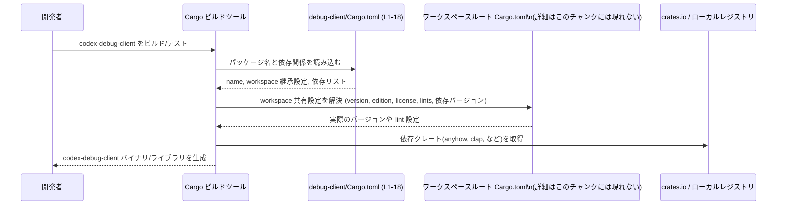

# debug-client/Cargo.toml コード解説

## 0. ざっくり一言

`debug-client/Cargo.toml` は、`codex-debug-client` クレートの Cargo マニフェストであり、パッケージ名・ワークスペース共有設定・依存クレート・開発用依存クレートを宣言するファイルです（`debug-client/Cargo.toml:L1-18`）。

---

## 1. このモジュールの役割

### 1.1 概要

- このファイルは Rust クレート `codex-debug-client` の **ビルド設定** を行うために存在し、  
  - パッケージ名の定義（`name`）  
  - バージョン・edition・ライセンス・lint 設定のワークスペース継承  
  - 本番用依存クレート（`anyhow`, `clap`, `codex-app-server-protocol`, `serde`, `serde_json`）  
  - 開発用依存クレート（`pretty_assertions`）  
  を宣言します（`debug-client/Cargo.toml:L1-5,L7-8,L10-15,L17-18`）。
- 実際の公開 API やコアロジック（関数・構造体など）はこのファイルには含まれておらず、Rust ソースファイル（例: `src/main.rs` や `src/lib.rs`）側にあると考えられますが、このチャンクには現れません。

### 1.2 アーキテクチャ内での位置づけ

このマニフェストが示す範囲での、`codex-debug-client` クレートと依存クレートとの関係を簡略図として表します。

```mermaid
graph LR
  subgraph "Workspace（詳細不明／workspace = true から存在が推測される）"
    Root["ワークスペースルート Cargo.toml\n(詳細はこのチャンクには現れない)"]
    Client["codex-debug-client クレート\n(debug-client/Cargo.toml:L1-5)"]
  end

  subgraph "依存クレート（本番）\n(debug-client/Cargo.toml:L10-15)"
    Anyhow["anyhow"]
    Clap["clap\nfeatures = [\"derive\"]"]
    Protocol["codex-app-server-protocol"]
    Serde["serde"]
    SerdeJson["serde_json"]
  end

  subgraph "開発用依存クレート\n(debug-client/Cargo.toml:L17-18)"
    Pretty["pretty_assertions"]
  end

  Root --> Client
  Client --> Anyhow
  Client --> Clap
  Client --> Protocol
  Client --> Serde
  Client --> SerdeJson
  Client -.dev.-> Pretty
```

- `Root → Client` は `version.workspace = true` などの指定により、バージョンや edition などをワークスペースルートから継承していることを示します（`debug-client/Cargo.toml:L3-5,L7,L11-15,L18`）。
- 実際に `codex-debug-client` がこれらのクレートをどう利用するか（API 呼び出しやデータフロー）は、このファイルからは分かりません。

### 1.3 設計上のポイント（このファイルから読み取れる範囲）

- **ワークスペース単位での一元管理**  
  - `version.workspace = true`, `edition.workspace = true`, `license.workspace = true` により、バージョン・edition・ライセンスをワークスペース共通設定から継承しています（`debug-client/Cargo.toml:L3-5`）。
  - `lints.workspace = true` により lint 設定もワークスペース側に一元化されています（`debug-client/Cargo.toml:L7-8`）。
- **依存関係のバージョンもワークスペース側で統一**  
  - 各依存クレートが `.workspace = true` で指定されており、バージョンなどの詳細はワークスペースルートに集約されています（`debug-client/Cargo.toml:L11-15,L18`）。
- **機能フラグの利用**  
  - `clap` は `features = ["derive"]` を有効化しており、派生マクロ（`derive`）機能を使う前提であることが示されています（`debug-client/Cargo.toml:L12`）。
- **状態やエラーハンドリング・並行性に関するコードは存在しない**  
  - このファイルはマニフェストのみであり、所有権・スレッド安全性・エラーハンドリングの実装そのものは含まれていません（`debug-client/Cargo.toml:L1-18`）。

---

## 2. 主要な機能一覧（このファイルが果たす役割）

このファイル自体は実行時のロジックを持たないため、「機能」はビルド設定上の役割として整理します。

- パッケージ定義: `codex-debug-client` というクレート名を定義します（`debug-client/Cargo.toml:L1-2`）。
- 共通メタ情報の継承: バージョン・edition・ライセンス・lint 設定をワークスペースから継承します（`debug-client/Cargo.toml:L3-5,L7-8`）。
- 本番用依存関係の宣言: `anyhow`, `clap`（`derive` 機能付き）, `codex-app-server-protocol`, `serde`, `serde_json` を依存として登録します（`debug-client/Cargo.toml:L10-15`）。
- 開発用依存関係の宣言: テストなどで使用すると考えられる `pretty_assertions` を dev-dependency として登録します（`debug-client/Cargo.toml:L17-18`）。

---

## 3. 公開 API と詳細解説

### 3.1 型一覧（構造体・列挙体など）

- このファイルは Rust ソースコードではなく Cargo マニフェストであり、構造体・列挙体などの **型定義は一切含まれていません**（`debug-client/Cargo.toml:L1-18`）。

| 名前 | 種別 | 役割 / 用途 | 根拠 |
|------|------|-------------|------|
| （なし） | - | このファイルには Rust の型定義は存在しません | `debug-client/Cargo.toml:L1-18` |

#### 補足: コンポーネントインベントリー（クレート・依存パッケージ）

このファイルに現れる「コンポーネント」を、クレート単位で整理します。

| コンポーネント名 | 種別 | 役割 / 用途（このファイルから分かる範囲） | 根拠 |
|------------------|------|--------------------------------------------|------|
| `codex-debug-client` | クレート（パッケージ） | 本マニフェストが定義するクレート名。実行形式かライブラリかは、このファイルからは分かりません。 | `debug-client/Cargo.toml:L1-2` |
| `anyhow` | 依存クレート | 本番用依存。バージョンなどはワークスペース側に委ねられています。用途（エラー処理用など）は、このプロジェクト内での実際の使い方はこのチャンクには現れません。 | `debug-client/Cargo.toml:L10-11` |
| `clap`（`features = ["derive"]`） | 依存クレート | 本番用依存。`derive` 機能を有効化していることのみが明示されています。具体的な CLI 定義などの内容はソースコード側にありますが、このチャンクには現れません。 | `debug-client/Cargo.toml:L10,L12` |
| `codex-app-server-protocol` | 依存クレート | 本番用依存。クレート名から「app server のプロトコル関連」と推測できますが、具体的な API 内容や用途はこのチャンクからは分かりません。 | `debug-client/Cargo.toml:L10,L13` |
| `serde` | 依存クレート | 本番用依存。シリアライズ/デシリアライズ関連と推測されますが、このプロジェクトでの使い方はこのチャンクには現れません。 | `debug-client/Cargo.toml:L10,L14` |
| `serde_json` | 依存クレート | 本番用依存。JSON 形式との変換に用いられると推測されますが、実コードはこのチャンクには現れません。 | `debug-client/Cargo.toml:L10,L15` |
| `pretty_assertions` | 開発用依存クレート | dev-dependency。テストでのアサーションに用いる可能性がありますが、このファイルからテストコードの内容は分かりません。 | `debug-client/Cargo.toml:L17-18` |

> 註: 各クレートの一般的な用途はクレートの公開ドキュメントに基づく一般知識であり、このプロジェクト内で実際にどう使われているかは、このチャンクからは判断できません。

### 3.2 関数詳細（最大 7 件）

- このファイルには Rust の関数定義が存在しないため、関数に対する詳細解説は **該当しません**（`debug-client/Cargo.toml:L1-18`）。

### 3.3 その他の関数

- 同様に、補助的な関数やラッパー関数もこのファイル内には存在しません（`debug-client/Cargo.toml:L1-18`）。

---

## 4. データフロー

このファイルは実行時ロジックではなくビルド設定ですので、ここでは **ビルド時** におけるデータ（設定情報）の流れを示します。

### 4.1 ビルド時の設定データフロー



- `Manifest` が提供する情報は、主に「どのクレートに依存するか」「どの設定をワークスペースから継承するか」です（`debug-client/Cargo.toml:L1-5,L7-8,L10-15,L17-18`）。
- 実行時のデータフロー（例えばプロトコルメッセージの送受信や JSON のパース）は、ソースコード側の実装に依存し、このチャンクには現れません。

---

## 5. 使い方（How to Use）

### 5.1 基本的な使用方法

このファイル自体は直接「呼び出す」対象ではなく、Cargo によって読み取られます。一般的な利用フローは次のようになります。

```bash
# ワークスペースルート（このチャンクには定義されていないが、workspace = true から存在が推測される場所）で:
cargo build -p codex-debug-client
```

- `-p codex-debug-client` は、`name = "codex-debug-client"` で定義されたパッケージ名を指定しています（`debug-client/Cargo.toml:L2`）。
- 実行可能バイナリが存在するかどうか（例: `cargo run -p codex-debug-client` が動くか）は、`src/main.rs` 等の有無に依存し、このチャンクには現れません。

### 5.2 よくある使用パターン（このファイルの編集観点）

1. **依存クレートを追加する**

   新たなクレートに依存したい場合、`[dependencies]` セクションに行を追加します。

   ```toml
   [dependencies]                                     # 既存: debug-client/Cargo.toml:L10
   anyhow.workspace = true                            # 既存: debug-client/Cargo.toml:L11
   clap = { workspace = true, features = ["derive"] } # 既存: debug-client/Cargo.toml:L12
   codex-app-server-protocol.workspace = true         # 既存: debug-client/Cargo.toml:L13
   serde.workspace = true                             # 既存: debug-client/Cargo.toml:L14
   serde_json.workspace = true                        # 既存: debug-client/Cargo.toml:L15

   # 追加例（一般的な書き方、実際に必要かはコード側次第）
   # some-crate = "1.2"
   ```

   - 既存の依存はすべて `*.workspace = true` 形式で統一されています（`debug-client/Cargo.toml:L11-15`）。  
     新しい依存もワークスペース共通バージョンで管理したい場合は、ワークスペースルートでの設定が必要になります。  

2. **開発用依存を追加する**

   テスト専用のクレートを追加する場合は `[dev-dependencies]` を編集します。

   ```toml
   [dev-dependencies]                 # debug-client/Cargo.toml:L17
   pretty_assertions.workspace = true # debug-client/Cargo.toml:L18

   # 追加例
   # test-helper = "0.3"
   ```

### 5.3 よくある間違い（この構成から想定されるもの）

Cargo とワークスペースに関する典型的な注意点を、このファイルの書式から推測できる範囲で挙げます。

```toml
# 間違い例: ワークスペース側に定義されていないのに workspace = true を指定
some-crate.workspace = true  # ルート Cargo.toml に some-crate の設定がない場合、ビルド時にエラーになります
```

```toml
# 正しい例: ワークスペース側に設定を追加したうえで workspace = true を使用
[workspace.dependencies]
some-crate = "1.2"

# メンバー側 (本ファイル)
[dependencies]
some-crate.workspace = true
```

- このファイルではすべての依存が `.workspace = true` になっているため、**ワークスペースルート側に対応する設定が存在しないとビルドが失敗する**点に注意が必要です（`debug-client/Cargo.toml:L3-5,L7-8,L11-15,L18`）。

### 5.4 使用上の注意点（まとめ）

- **ワークスペース依存**  
  - `*.workspace = true` を多用しているため、ワークスペースルート `Cargo.toml` の設定が正しくないと、このクレート単体ではビルドできません（`debug-client/Cargo.toml:L3-5,L7-8,L11-15,L18`）。
- **バージョンの見えにくさ**  
  - このファイル単体では依存クレートのバージョンを確認できません。バージョンを知るにはワークスペースルートを確認する必要があります。
- **安全性・エラー・並行性について**  
  - このファイルはマニフェストのみであり、Rust の所有権やメモリ安全性、エラーハンドリング、並行性に関する実装コードは含まれていません。  
    それらに関する分析は、Rust ソースファイル側のコードを読む必要があります。

---

## 6. 変更の仕方（How to Modify）

### 6.1 新しい機能を追加する場合（依存クレート観点）

このファイルに関する「新しい機能追加」とは、多くの場合、**新しい依存クレートの追加**や**既存クレートの機能フラグ変更**になります。

- 手順の一例:
  1. 追加したい機能に対応するクレートを選定する（このチャンクにはその判断材料はありません）。
  2. そのクレートをワークスペース全体で共有したいかどうかを決める。
     - 共有したい場合: ルート `Cargo.toml` の `[workspace.dependencies]` などにバージョンを追加する（このファイルには現れません）。
     - このクレート限定で使う場合: 本ファイルの `[dependencies]` にバージョン指定で直接追加する。
  3. 必要に応じて `features` を設定する（`clap` のように `features = ["derive"]` を使うパターンがすでにあります。`debug-client/Cargo.toml:L12`）。

### 6.2 既存の機能を変更する場合

- 依存クレートの差し替え・削除
  - 例: JSON ではなく別フォーマットを使うように設計を変える場合、`serde_json` 依存の削除や差し替えを検討することになりますが、
    その影響範囲（どのソースコードが `serde_json` に依存しているか）は、このチャンクからは分かりません（`debug-client/Cargo.toml:L15`）。
- workspace 継承設定の解除
  - 例えば、このクレートだけ edition を変えたい場合、`edition.workspace = true` を `edition = "2021"` のような直接指定に変更します（`debug-client/Cargo.toml:L4`）。
  - その場合、ワークスペース内の他クレートとの整合性に注意が必要ですが、他クレートの情報はこのチャンクには現れません。

---

## 7. 関連ファイル

このファイルと密接に関係しそうなファイル・ディレクトリを、**このチャンクから推測できる範囲**で整理します。

| パス | 役割 / 関係 |
|------|------------|
| `../Cargo.toml`（ワークスペースルート、存在は workspace = true から推測） | `version.workspace = true` や各依存の `.workspace = true` の実体（バージョン・features・lint 設定など）が定義されているはずのファイルです。ただし、このチャンクにはその内容は現れません（`debug-client/Cargo.toml:L3-5,L7-8,L11-15,L18`）。 |
| `debug-client/src/main.rs` または `debug-client/src/lib.rs`（推測） | `codex-debug-client` クレートの公開 API やコアロジック（関数・構造体など）が実装されているであろうソースコードですが、このチャンクには存在しません。 |
| （テストコード: 例として `debug-client/tests/` 以下など） | `pretty_assertions` dev-dependency を実際に利用するテストコードはこのチャンクには現れませんが、一般的には `tests/` や `src` 内の `#[cfg(test)]` セクションに置かれます。 |

---

### バグ / セキュリティ / エッジケース（このファイルから読み取れる範囲のまとめ）

- **構文上の問題**  
  - Cargo の TOML として特に不自然な点はなく、明らかな構文エラーや重複定義は見られません（`debug-client/Cargo.toml:L1-18`）。
- **セキュリティ**  
  - このファイル単体から、セキュリティ上の脆弱性（例えば危険な設定やハードコードされたシークレット等）は読み取れません。
  - 依存クレートに関する既知の脆弱性（CVE 等）は、このファイルだけでは評価できず、バージョン情報を含むワークスペースルートや外部情報が必要です。
- **エッジケース / 契約**  
  - ワークスペース側に対応する設定が存在しないのに `.workspace = true` を指定すると、Cargo の依存解決やビルド時にエラーになります（一般的な Cargo の挙動）。  
    このファイルではすべての共有項目が `.workspace = true` のため、ワークスペース設定との整合性が前提条件になっています（`debug-client/Cargo.toml:L3-5,L7-8,L11-15,L18`）。
- **並行性・パフォーマンス・観測性**  
  - これらに関する情報（例: マルチスレッド動作、ログ出力、メトリクス）はソースコード側の実装に依存しており、このマニフェストからは判断できません。
