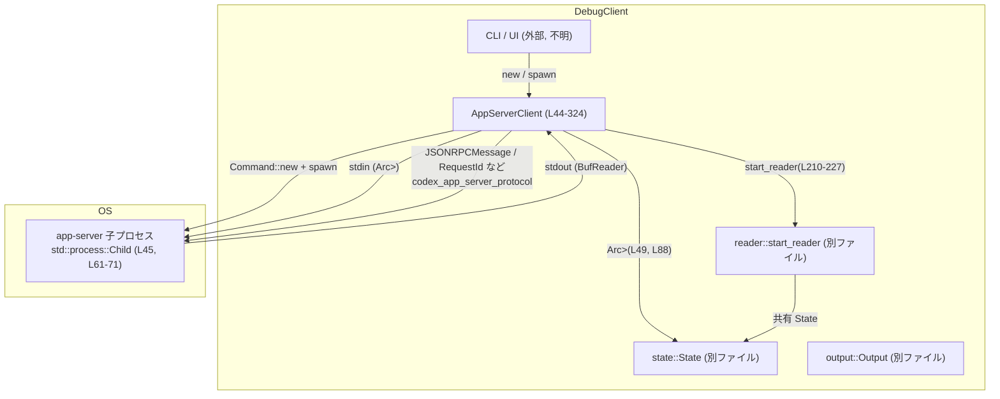
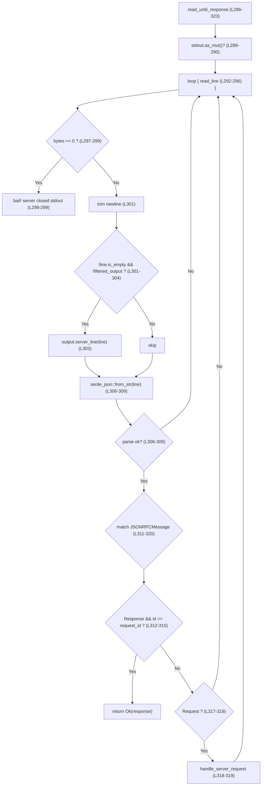
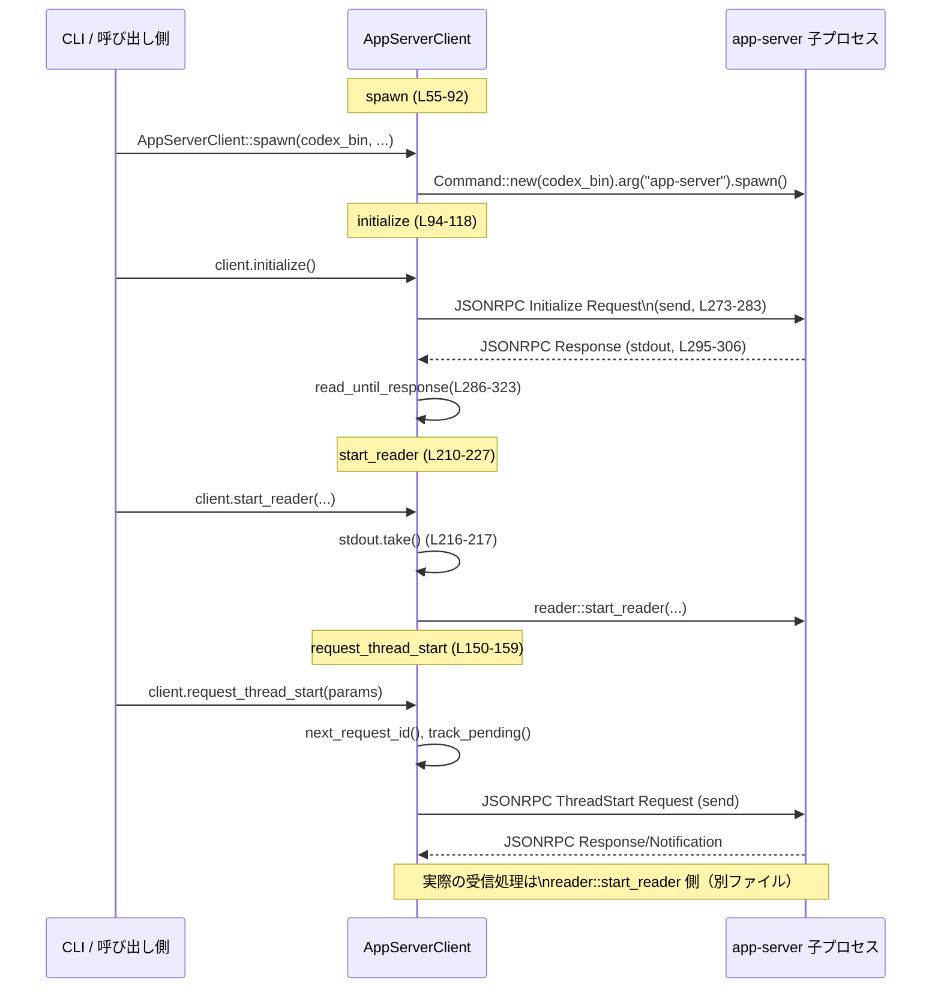

# debug-client/src/client.rs

## 0. ざっくり一言

`AppServerClient` 構造体を中心に、Codex の `app-server` 子プロセスと JSON-RPC ベースで通信するクライアント実装です。  
プロセス生成・リクエスト送信・応答待ち・スレッド開始/再開・ユーザー入力送信・ストリームリーダー起動などをまとめて扱います（`client.rs:L44-413`）。

※ 行番号は、このチャンク内で 1 から振り直したものです。

---

## 1. このモジュールの役割

### 1.1 概要

- このモジュールは Codex の `app-server` バイナリを子プロセスとして起動し、JSON-RPC 経由で各種リクエスト/レスポンスをやり取りするためのクライアントを提供します（`client.rs:L55-92`）。
- スレッドの開始・再開・一覧取得・ターン送信などの高レベル操作をメソッドとしてまとめ、内部で JSON-RPC メッセージを構築して送受信します（`client.rs:L94-208`）。
- さらに、標準出力を読み続ける専用リーダースレッドを起動し、非同期にサーバーイベントを処理するエントリポイントも提供します（`client.rs:L210-227`）。

### 1.2 アーキテクチャ内での位置づけ

このモジュールは「`debug-client` CLI ⇔ Codex app-server」の間の通信レイヤーに位置します。  
主要な依存関係を簡略化した図を示します。



- `AppServerClient` は `std::process::Child` を保持し、`stdin`/`stdout` をパイプとして扱います（`client.rs:L44-51, L61-81`）。
- JSON-RPC の型 (`JSONRPCMessage`, `ClientRequest`, `JSONRPCResponse`, `RequestId` etc.) は `codex_app_server_protocol` クレートに依存しています（`client.rs:L18-35, L96-109, L122-127, L137-142`）。
- 状態 (`State`, `PendingRequest`) とイベント (`ReaderEvent`)、出力 (`Output`) は同 crate 内の別モジュールに定義されており、このチャンクには定義がありません（`client.rs:L38-42`）。

### 1.3 設計上のポイント

- **プロセス管理と通信**
  - `Command::new(...).spawn()` で `app-server` を起動し、`Child` とその stdin/stdout を `AppServerClient` が保持します（`client.rs:L55-81`）。
  - 子プロセスへの書き込みは `Arc<Mutex<Option<ChildStdin>>>` を通して行い、複数スレッドから安全に共有できるようにしています（`client.rs:L46, L85, L210-225, L287-288`）。

- **スレッド安全性**
  - 共有状態 `State` と stdin はどちらも `Arc<Mutex<...>>` で保護されており、ロック獲得失敗時は `expect("... lock poisoned")` で panic する方針です（`client.rs:L46, L49, L230, L235, L241, L256-257, L277-278, L373`）。
  - リクエスト ID は `AtomicI64` で生成し、並行アクセス時も一意になるようにしています（`client.rs:L48, L87, L268-270`）。

- **同期 vs 非同期 API**
  - `start_thread` / `resume_thread` / `initialize` は内部で `read_until_response` を用いて同期的にレスポンスを待ちます（`client.rs:L94-118, L120-148, L286-323`）。
  - `request_thread_*` 系および `send_turn` はレスポンスを待たずリクエストのみ送信し、`State::pending` にペンディング操作を登録する非同期スタイルです（`client.rs:L150-190, L192-208, L255-258`）。

- **エラーハンドリング**
  - ほぼすべての I/O とシリアライズ処理は `anyhow::Result` でラップされ、`context(...)` を付与して原因を追いやすくしています（`client.rs:L72, L77, L81, L274, L281-282, L295-296, L298, L361-362, L370, L377-378`）。
  - JSON パース失敗時はログ出力を行わず、その行を読み飛ばしてループ継続という挙動になっています（`client.rs:L306-309`）。

---

## 2. 主要な機能一覧

- 子プロセス起動: Codex `app-server` を `Command` で起動し、stdin/stdout をパイプとして準備する（`spawn`, `client.rs:L55-92`）。
- クライアント初期化: JSON-RPC `Initialize` リクエスト送信とレスポンス検証 + `Initialized` 通知送信（`initialize`, `client.rs:L94-118`）。
- スレッド開始・再開（同期版）: `ThreadStart` / `ThreadResume` リクエストを送り、レスポンスを待って thread_id を返す（`client.rs:L120-148`）。
- スレッド開始・再開・一覧取得（非同期版）: リクエストを送り、`RequestId` を返すとともにペンディング状態を `State` に記録する（`client.rs:L150-190, L255-258`）。
- ターン送信: 既存スレッドに対してユーザー入力 (`UserInput::Text`) を送る JSON-RPC ターン開始リクエスト（`send_turn`, `client.rs:L192-208`）。
- ストリームリーダー起動: stdout を別スレッドの reader に移譲し、通知やレスポンスを非同期で処理する起点（`start_reader`, `client.rs:L210-227`）。
- スレッド ID 管理: 現在の thread_id の取得・設定・既知スレッドの記録と選択（`thread_id`, `set_thread_id`, `use_thread`, `remember_thread_locked`, `client.rs:L229-245, L260-265`）。
- JSON-RPC 機械処理: リクエスト ID の採番、メッセージ送信、応答待ち、サーバー側からの Approval 要求への応答など（`client.rs:L268-323, L326-380`）。
- Thread パラメータビルダー: `ThreadStartParams` / `ThreadResumeParams` を構築する補助関数（`client.rs:L382-413`）。

---

## 3. 公開 API と詳細解説

### 3.1 型一覧（構造体・列挙体など）

| 名前 | 種別 | 公開 | 役割 / 用途 | 根拠 |
|------|------|------|------------|------|
| `AppServerClient` | 構造体 | `pub` | Codex `app-server` と通信するクライアント本体。子プロセス、stdin/stdout、リクエスト ID、共有状態、出力ハンドラを保持します。 | `client.rs:L44-52` |
| `State` | 構造体（推定） | 不明（別モジュール） | スレッド ID、既知スレッド、ペンディングリクエストなどのクライアント状態を保持していると推定されますが、このチャンクには定義がありません。 | 使用箇所 `client.rs:L49, L229-245, L255-265` |
| `PendingRequest` | 列挙体（推定） | 不明（別モジュール） | `Start`/`Resume`/`List` など、保留中リクエストの種類を表す列挙と推定されますが、定義はこのチャンクにはありません。 | 使用箇所 `client.rs:L40, L152, L163, L174` |

> `State` と `PendingRequest` の具体的なフィールド・バリアントはこのファイルには現れないため「不明」です。

さらに、このモジュールから **公開されている関数**:

| 名前 | 種別 | 公開 | 役割 / 用途 | 根拠 |
|------|------|------|------------|------|
| `AppServerClient::spawn` | 関連関数 | `pub` | `app-server` 子プロセスを起動し、`AppServerClient` を構築するファクトリです。 | `client.rs:L55-92` |
| `AppServerClient::initialize` | メソッド | `pub` | Initialize リクエスト/レスポンスを扱い、サーバーとのセッションを初期化します。 | `client.rs:L94-118` |
| `AppServerClient::start_thread` | メソッド | `pub` | スレッド開始を同期的に行い、thread_id を返します。 | `client.rs:L120-133` |
| `AppServerClient::resume_thread` | メソッド | `pub` | スレッド再開を同期的に行い、thread_id を返します。 | `client.rs:L135-148` |
| `AppServerClient::request_thread_start` | メソッド | `pub` | スレッド開始リクエストを送るがレスポンスは待たず、`RequestId` を返します。 | `client.rs:L150-159` |
| `AppServerClient::request_thread_resume` | メソッド | `pub` | スレッド再開リクエストの非同期送信。 | `client.rs:L161-170` |
| `AppServerClient::request_thread_list` | メソッド | `pub` | スレッド一覧取得リクエストの非同期送信。 | `client.rs:L172-190` |
| `AppServerClient::send_turn` | メソッド | `pub` | ターン開始リクエストを送信してユーザー入力をサーバーへ渡します。 | `client.rs:L192-208` |
| `AppServerClient::start_reader` | メソッド | `pub` | stdout を reader に移譲し、イベント駆動の処理を開始します。 | `client.rs:L210-227` |
| `AppServerClient::thread_id` | メソッド | `pub` | 現在アクティブな thread_id を返します。 | `client.rs:L229-232` |
| `AppServerClient::set_thread_id` | メソッド | `pub` | thread_id を設定し、既知スレッドリストへ登録します。 | `client.rs:L234-238` |
| `AppServerClient::use_thread` | メソッド | `pub` | 指定 thread_id を現在のスレッドとして選択し、その ID が既知かどうかを返します。 | `client.rs:L240-245` |
| `AppServerClient::shutdown` | メソッド | `pub` | stdin を閉じ、子プロセスの終了を待ちます。 | `client.rs:L248-253` |
| `build_thread_start_params` | 関数 | `pub` | `ThreadStartParams` を構築するヘルパー。 | `client.rs:L382-396` |
| `build_thread_resume_params` | 関数 | `pub` | `ThreadResumeParams` を構築するヘルパー。 | `client.rs:L398-413` |

### 3.2 関数詳細（主要 7 件）

#### `AppServerClient::spawn(codex_bin: &str, config_overrides: &[String], output: Output, filtered_output: bool) -> Result<Self>`

**概要**

- Codex の `codex_bin` 実行ファイルから `app-server` サブコマンドを子プロセスとして起動し、標準入力/標準出力パイプを確保した `AppServerClient` を生成します（`client.rs:L55-92`）。

**引数**

| 引数名 | 型 | 説明 |
|--------|----|------|
| `codex_bin` | `&str` | Codex バイナリのパス。`Command::new(codex_bin)` に渡されます（`client.rs:L61`）。 |
| `config_overrides` | `&[String]` | `--config key=value` 形式のオーバーライド群。すべて `cmd.arg("--config").arg(override_kv)` で渡されます（`client.rs:L61-64`）。 |
| `output` | `Output` | サーバーからの文字列出力を処理するオブジェクト。`read_until_response` や `start_reader` で利用されます（`client.rs:L50, L288, L221-223`）。 |
| `filtered_output` | `bool` | true の場合、`read_until_response` 内でサーバーの生の行を `output` に出さないフラグです（`client.rs:L51, L301-304`）。 |

**戻り値**

- 成功時: `Ok(AppServerClient)` – 起動した子プロセスと I/O ハンドル、状態を持つクライアント。
- 失敗時: `Err(anyhow::Error)` – プロセス生成や stdin/stdout 取得時のエラーに context が付与されます（`client.rs:L72, L77, L81`）。

**内部処理の流れ**

1. `Command::new(codex_bin)` を生成し、`config_overrides` を `--config` 引数として付与します（`client.rs:L61-64`）。
2. `cmd.arg("app-server")` と stdin/stdout/stderr の設定（パイプ/継承）を行い、`spawn()` で子プロセスを起動します（`client.rs:L66-71`）。
3. `child.stdin.take()` と `child.stdout.take()` でパイプのハンドルを取り出し、取得できなければエラーにします（`client.rs:L74-81`）。
4. `AppServerClient` 構造体を以下の値で構築し返します（`client.rs:L83-91`）:
   - `stdin`: `Arc<Mutex<Option<ChildStdin>>>` としてラップ。
   - `stdout`: `Some(BufReader::new(stdout))`。
   - `next_request_id`: `AtomicI64::new(1)`。
   - `state`: `Arc::new(Mutex::new(State::default()))`。

**Errors / Panics**

- `spawn()` 失敗、`stdin`/`stdout` 未設定の場合は `Err(anyhow::Error)` が返ります（`client.rs:L72, L77, L81`）。
- `State::default()` の呼び出しが panic する可能性はコードからは読み取れません。このチャンクには定義がないため不明です。

**Edge cases**

- `config_overrides` が空でも問題なく動作し、追加引数なしで `app-server` を実行します（`client.rs:L61-64`）。
- `codex_bin` が存在しない/実行不可の場合は `spawn()` でエラーになります（OS 依存ですが、Rust 的には `Err` になります）。

**使用上の注意点**

- このメソッドは子プロセスの生成を行うため、呼び出し頻度が多いとリソース消費が大きくなります。
- 生成後、`shutdown` を呼び出すまで子プロセスは生き続けます（`client.rs:L248-253`）。

---

#### `AppServerClient::initialize(&mut self) -> Result<()>`

**概要**

- Codex app-server に対して `Initialize` リクエストを送り、レスポンスを JSON で検証した上で `Initialized` 通知を送信する初期化処理です（`client.rs:L94-118`）。

**引数**

- なし（`&mut self` のみ）。

**戻り値**

- 成功時: `Ok(())`
- 失敗時: シリアライズ/送信エラー、レスポンス読み取りエラー、レスポンス JSON パースエラーなどを含む `Err(anyhow::Error)`。

**内部処理の流れ**

1. `next_request_id()` でユニークな `RequestId` を取得（`client.rs:L95, L268-270`）。
2. `ClientRequest::Initialize { ... }` を構築し、`self.send(&request)` で送信（`client.rs:L96-111, L273-283`）。
3. `read_until_response(&request_id)` で同じ ID のレスポンスを待ちます（`client.rs:L112, L286-323`）。
4. `response.result` を `InitializeResponse` にデシリアライズし、失敗時は `"decode initialize response"` コンテキスト付きでエラー（`client.rs:L113-114`）。
5. `ClientNotification::Initialized` を構築し、再度 `send` で送信（`client.rs:L115-116`）。

**Errors / Panics**

- `send` でのシリアライズ・書き込み・flush 失敗（`client.rs:L273-283`）。
- `read_until_response` 内での `stdout` 欠如、読み取りエラー、サーバー側 stdout クローズなど（`client.rs:L289-290, L295-299`）。
- `serde_json::from_value` 失敗時に `Err(anyhow::Error)`（`client.rs:L113-114`）。
- `self.stdout` が `None` の場合（すでに `start_reader` によって奪われた場合など）、`"stdout missing"` でエラーになる点に注意（`client.rs:L289-290`）。

**Edge cases**

- サーバーがレスポンスを返さない場合、`read_until_response` は EOF かエラーになるまでループし続けます（`client.rs:L292-323`）。結果としてこのメソッドはハングしうることになります。
- サーバーが不正な JSON 行を出力した場合、その行は無視され、次の行の読み取りが続きます（`client.rs:L306-309`）。

**使用上の注意点**

- `start_reader` 呼び出し前に実行する前提の設計です。`start_reader` により `self.stdout` が奪われた後に呼ぶと `"stdout missing"` エラーとなります（`client.rs:L216-217, L289-290`）。
- 初期化は通常アプリ起動時に 1 回だけ行う想定と考えられますが、このチャンクからは明示されていません。

---

#### `AppServerClient::request_thread_start(&self, params: ThreadStartParams) -> Result<RequestId>`

**概要**

- スレッド開始リクエストを非同期に送信し、レスポンスを待たずに `RequestId` を返します（`client.rs:L150-159`）。
- 送信したリクエストは `State::pending` に `PendingRequest::Start` として登録されます（`client.rs:L152-153, L255-258`）。

**引数**

| 引数名 | 型 | 説明 |
|--------|----|------|
| `params` | `ThreadStartParams` | サーバースレッド開始に必要なパラメータ。`build_thread_start_params` で構築することを想定したデータです（`client.rs:L382-396`）。 |

**戻り値**

- 成功時: `Ok(RequestId)` – このリクエストに対応する ID。後続のレスポンスやイベントと紐付けるために使用可能です。
- 失敗時: `Err(anyhow::Error)` – `send` の失敗など。

**内部処理の流れ**

1. `next_request_id()` で ID を生成（`client.rs:L151, L268-270`）。
2. `track_pending(request_id.clone(), PendingRequest::Start)` で `State::pending` に登録（`client.rs:L152, L255-258`）。
3. `ClientRequest::ThreadStart { request_id: request_id.clone(), params }` を構築（`client.rs:L153-156`）。
4. `send(&request)` で JSON シリアライズと送信を行う（`client.rs:L157, L273-283`）。
5. `Ok(request_id)` を返す（`client.rs:L158-159`）。

**Errors / Panics**

- `send` 内でのシリアライズ・書き込み失敗で `Err`（`client.rs:L273-283`）。
- `track_pending` 内での `state.lock().expect("state lock poisoned")` による panic の可能性（過去の panic によるロック汚染時）（`client.rs:L255-257`）。

**Edge cases**

- `params` に不正な値が含まれている場合のサーバー側の挙動は、このチャンクからは分かりません。
- `State::pending` がどのように消費/クリアされるかは reader 側実装に依存しており、このファイルには現れません。

**使用上の注意点**

- 返された `RequestId` は、後続のイベント (`ReaderEvent` など) と関連付けるために保持する必要があります。
- 同期に thread_id を取得したい場合は `start_thread` を使用します（`client.rs:L120-133`）。

---

#### `AppServerClient::request_thread_resume(&self, params: ThreadResumeParams) -> Result<RequestId>`

**概要**

- `request_thread_start` と同様に、スレッド再開リクエストを非同期送信し、`RequestId` を返すメソッドです（`client.rs:L161-170`）。

**引数 / 戻り値**

- `params`: `ThreadResumeParams` – 再開対象 thread_id などを含む（`client.rs:L399-407`）。
- 戻り値: `Result<RequestId>`。

**内部処理の流れ**

`request_thread_start` とほぼ同様で、`PendingRequest::Resume` を登録する点のみ異なります。

1. `next_request_id()` で ID 生成（`client.rs:L162`）。
2. `track_pending(..., PendingRequest::Resume)`（`client.rs:L163`）。
3. `ClientRequest::ThreadResume { ... }` を構築（`client.rs:L164-167`）。
4. `send` で送信（`client.rs:L168`）。

**Errors / Edge cases / 使用上の注意点**

- `request_thread_start` と同様です。
- `ThreadResumeParams` は `build_thread_resume_params` の利用が想定されます（`client.rs:L398-413`）。

---

#### `AppServerClient::request_thread_list(&self, cursor: Option<String>) -> Result<RequestId>`

**概要**

- スレッド一覧を取得する `ThreadList` リクエストを非同期送信し、`RequestId` を返します（`client.rs:L172-190`）。

**引数**

| 引数名 | 型 | 説明 |
|--------|----|------|
| `cursor` | `Option<String>` | ページング用カーソル。`None` の場合は最初のページと解釈されると考えられますが、プロトコル仕様はこのチャンクにはありません。 |

**戻り値**

- `Result<RequestId>` – 送信したリクエストを識別する ID。

**内部処理の流れ**

1. `next_request_id()` で ID 生成（`client.rs:L173`）。
2. `track_pending(..., PendingRequest::List)` で pending 登録（`client.rs:L174`）。
3. `ThreadListParams` を構築し、ほとんどのフィールドを `None` に設定（`client.rs:L176-186`）。
4. `ClientRequest::ThreadList { ... }` を `send` で送信（`client.rs:L175-188`）。
5. `Ok(request_id)` を返す（`client.rs:L189-190`）。

**Errors / Edge cases / 使用上の注意点**

- `send`/`track_pending` に関する挙動は前述と同様です。
- `limit`, `sort_key` などをカスタマイズしたい場合は、このメソッドを変更する必要があります（現状はすべて `None`）（`client.rs:L179-185`）。

---

#### `AppServerClient::send_turn(&self, thread_id: &str, text: String) -> Result<RequestId>`

**概要**

- 指定スレッドに対してユーザーのテキスト入力を送信する、ターン開始リクエストです（`client.rs:L192-208`）。

**引数**

| 引数名 | 型 | 説明 |
|--------|----|------|
| `thread_id` | `&str` | 入力を送る対象スレッドの ID。`String` にコピーされてリクエストへ入ります（`client.rs:L197`）。 |
| `text` | `String` | 送信するユーザーのプレーンテキスト（UI マークアップなし）（`client.rs:L198-201`）。 |

**戻り値**

- `Result<RequestId>` – ターン開始リクエストの ID。

**内部処理の流れ**

1. `next_request_id()` を呼び ID を生成（`client.rs:L193`）。
2. `ClientRequest::TurnStart { request_id, params: TurnStartParams { ... } }` を構築（`client.rs:L194-205`）。
   - `UserInput::Text { text, text_elements: Vec::new() }` を 1 要素だけ含むベクタを `input` に設定（`client.rs:L198-202`）。
   - その他のフィールドは `Default::default()` から補われます（`client.rs:L203-204`）。
3. `send(&request)` で送信（`client.rs:L206`）。
4. `Ok(request_id)` を返す（`client.rs:L207-208`）。

**Errors / Edge cases / 使用上の注意点**

- `text` が非常に長い場合、送信バッファやサーバー側の制限に注意が必要ですが、このチャンクから具体的な制約は読み取れません。
- `thread_id` が存在しない場合のサーバー側挙動は不明です。

---

#### `AppServerClient::start_reader(&mut self, events: Sender<ReaderEvent>, auto_approve: bool, filtered_output: bool) -> Result<()>`

**概要**

- 子プロセス stdout を `reader::start_reader` に渡し、別スレッドによる継続的な読み取りを開始します（`client.rs:L210-227`）。
- `AppServerClient` 内からは stdout を取り上げるため、その後 `read_until_response` は使用できなくなります。

**引数**

| 引数名 | 型 | 説明 |
|--------|----|------|
| `events` | `Sender<ReaderEvent>` | リーダースレッドからメインスレッドへイベントを送るための mpsc 送信側（`client.rs:L212`）。 |
| `auto_approve` | `bool` | リーダーが approval リクエストを自動許可するかどうかのフラグと推定されますが、実際の挙動は `reader::start_reader` の実装次第です。 |
| `filtered_output` | `bool` | リーダー側で出力フィルタリングを行うかどうかのフラグ（`client.rs:L214, L223-224`）。 |

**戻り値**

- `Result<()>` – `stdout` の取得に失敗した場合にエラーになります。

**内部処理の流れ**

1. `self.stdout.take()` で stdout を取り出しつつ `None` にし、すでに `None` なら `"reader already started"` コンテキスト付きでエラー（`client.rs:L216-217`）。
2. `start_reader(stdout, Arc::clone(&self.stdin), Arc::clone(&self.state), events, self.output.clone(), auto_approve, filtered_output)` を呼び出す（`client.rs:L217-225`）。
3. `Ok(())` を返す（`client.rs:L226-227`）。

**Errors / Panics**

- 2 重に `start_reader` を呼び出した場合、`self.stdout.take()` が `None` を返し `"reader already started"` エラーとなります。
- `Arc::clone(&self.stdin)` や `Arc::clone(&self.state)` は panic しません。

**Edge cases / 使用上の注意点**

- `start_reader` 呼び出し後に `initialize` や `start_thread` など `read_until_response` を使用するメソッドを呼ぶと、`"stdout missing"` でエラーになります（`client.rs:L216-217, L289-290`）。
- `auto_approve` の具体的効果は `reader` モジュールの実装がこのチャンクにないため不明です。

---

#### `fn read_until_response(&mut self, request_id: &RequestId) -> Result<JSONRPCResponse>`

（プライベート関数ですが、プロトコル処理の中核なので取り上げます。）

**概要**

- 子プロセス stdout を 1 行ずつ読みながら JSON をパースし、指定した `request_id` の JSON-RPC `Response` が来るまで待機する関数です（`client.rs:L286-323`）。
- 途中で `Request` を受信した場合は `handle_server_request` で処理します（`client.rs:L317-319`）。

**引数**

| 引数名 | 型 | 説明 |
|--------|----|------|
| `request_id` | `&RequestId` | 待ちたいレスポンスの ID。`ClientRequest` の `request_id` に対応します（`client.rs:L95, L121, L136`）。 |

**戻り値**

- 成功時: `Ok(JSONRPCResponse)` – マッチしたレスポンスメッセージ。
- 失敗時: `Err(anyhow::Error)` – `stdout` 欠如、読み取り失敗、EOF など。

**内部処理の流れ**



**Errors / Edge cases**

- `self.stdout` が `None` の場合は `"stdout missing"` でエラー（`client.rs:L289-290`）。
- EOF（`bytes == 0`）に到達した場合 `"server closed stdout while awaiting response ..."` でエラー（`client.rs:L297-299`）。
- 不正な JSON 行は無視され、読み取りを継続します（`client.rs:L306-309`）。
- 対象 ID のレスポンスが永遠に来ない場合、EOF またはエラーが発生するまでループし続けるため、呼び出し元から見るとハングしたように見える可能性があります。

**使用上の注意点**

- `start_reader` と併用しない（あるいは呼ぶ前にだけ使う）ことが前提の設計です。
- `handle_server_request` は一部の要求（Command/FileChange approval）に対してデフォルトで Decline を返すため、この関数を経由して approval リクエストが飛んでくると、自動で拒否されます（`client.rs:L326-353`）。

---

### 3.3 その他の関数

| 関数名 | 役割（1 行） | 根拠 |
|--------|--------------|------|
| `AppServerClient::start_thread` | スレッド開設を同期的に行い、`ThreadStartResponse` から thread_id を取り出して返す（かつ `State` に保存） | `client.rs:L120-133` |
| `AppServerClient::resume_thread` | スレッド再開を同期的に行い、`ThreadResumeResponse` から thread_id を返す（かつ `State` に保存） | `client.rs:L135-148` |
| `AppServerClient::thread_id` | `State` から現在の thread_id をクローンして返す simple getter | `client.rs:L229-232` |
| `AppServerClient::set_thread_id` | thread_id を設定し、必要なら `known_threads` に追加する | `client.rs:L234-238, L260-265` |
| `AppServerClient::use_thread` | 指定 thread_id を現在のスレッドにしつつ、その ID が既知かどうかを返す | `client.rs:L240-245` |
| `AppServerClient::shutdown` | stdin を閉じてから `child.wait()` し、プロセス終了を待つ | `client.rs:L248-253` |
| `AppServerClient::track_pending` | `State::pending` に `(RequestId, PendingRequest)` を登録する内部ヘルパー | `client.rs:L255-258` |
| `AppServerClient::remember_thread_locked` | `State` の `thread_id` を `known_threads` へ追加する内部ヘルパー | `client.rs:L260-265` |
| `AppServerClient::next_request_id` | `AtomicI64` から ID をインクリメントし、`RequestId::Integer` として返す | `client.rs:L268-270` |
| `AppServerClient::send` | `self.stdin` を使って JSON 文字列を 1 行で書き込み/flush する内部送信ヘルパー | `client.rs:L273-283` |
| `handle_server_request` | サーバーからの JSON-RPC `Request` を `ServerRequest` に変換し、Command/FileChange approval を Decline で返す | `client.rs:L326-353` |
| `send_jsonrpc_response` | 任意のレスポンス値 `T` を `JSONRPCMessage::Response` に包んで送信するヘルパー | `client.rs:L356-367` |
| `send_with_stdin` | `Arc<Mutex<Option<ChildStdin>>>` に対して JSON を 1 行書き込む送信ヘルパー | `client.rs:L369-379` |
| `build_thread_start_params` | `AskForApproval` などを受け取り `ThreadStartParams` を生成するユーティリティ | `client.rs:L382-396` |
| `build_thread_resume_params` | `thread_id` と `AskForApproval` などから `ThreadResumeParams` を生成するユーティリティ | `client.rs:L398-413` |

---

## 4. データフロー

典型的なシナリオとして、「クライアント起動 → 初期化 → リーダー起動 → スレッド開始リクエスト送信」をシーケンス図で表します。



要点:

- 初期化 (`initialize`) は `read_until_response` を通じて同期的にレスポンスを待ちますが、リーダー起動後は標準出力の読み取りをリーダースレッドに委譲する設計です（`client.rs:L94-118, L210-227, L286-323`）。
- `request_thread_start` 以降の非同期リクエストは、`State::pending` に登録され、リーダー側がレスポンスと突き合わせる想定と考えられます（`client.rs:L152, L255-258`）。この紐付けロジックは別ファイルにあり、このチャンクには現れません。

---

## 5. 使い方（How to Use）

### 5.1 基本的な使用方法

初期化 → リーダー起動 → スレッド開始 → ターン送信という流れの例です。

```rust
use std::sync::mpsc::channel;                     // ReaderEvent 受信用のチャネル
use debug_client::client::{                       // 仮のモジュールパス
    AppServerClient,
    build_thread_start_params,
};
use codex_app_server_protocol::AskForApproval;

// メイン関数の一部の例
fn main() -> anyhow::Result<()> {
    // Output 実装や ReaderEvent 型は別モジュールにあります（このチャンクには定義なし）
    let output = Output::default();               // 仮のコンストラクタ
    let filtered_output = false;

    // 1. 子プロセス起動
    let mut client = AppServerClient::spawn(
        "codex",                                  // codex バイナリのパス
        &[],                                      // config_overrides なし
        output.clone(),                           // 出力ハンドラ
        filtered_output,                          // initialize 中はサーバー行を表示する
    )?;

    // 2. Initialize
    client.initialize()?;                         // サーバーとセッションを確立

    // 3. Reader 起動
    let (tx, rx) = channel();                     // ReaderEvent 受信用
    client.start_reader(tx, /*auto_approve*/ false, filtered_output)?;

    // 4. スレッド開始リクエストを送信（非同期）
    let params = build_thread_start_params(
        AskForApproval::default(),                // 承認ポリシー
        None,                                     // model
        None,                                     // model_provider
        None,                                     // cwd
    );
    let request_id = client.request_thread_start(params)?;
    println!("ThreadStart request sent: {:?}", request_id);

    // 5. （別スレッドの reader からのイベントを rx で受信して処理）

    Ok(())
}
```

> `Output`, `ReaderEvent` などの具体的な実装はこのチャンクには現れないため、「仮のコード」となっています。

### 5.2 よくある使用パターン

1. **同期的に thread_id が欲しい場合**

   ```rust
   let params = build_thread_start_params(AskForApproval::default(), None, None, None);
   let thread_id = client.start_thread(params)?;  // レスポンスを待って thread_id を取得
   println!("Started thread: {}", thread_id);
   ```

   - `read_until_response` を内部で呼ぶため、`start_reader` より前に呼ぶ必要があります（`client.rs:L120-133, L286-323`）。

2. **既存スレッドを選択してターンを送る**

   ```rust
   let known = client.use_thread("existing-thread-id".to_string()); // 既知かどうかを確認
   if !known {
       eprintln!("警告: 未知の thread_id を選択しました");
   }

   let _request_id = client.send_turn("existing-thread-id", "こんにちは".to_string())?;
   ```

   - `use_thread` の戻り値が `false` の場合でも、`thread_id` は現在スレッドとして設定されます（`client.rs:L240-245`）。

### 5.3 よくある間違い

```rust
// 間違い例: start_reader の後に start_thread (同期版) を呼んでいる
client.start_reader(tx, false, false)?;
// ここで stdout は reader に奪われている（client.rs:L216-217）
let thread_id = client.start_thread(params)?;     // read_until_response が "stdout missing" でエラー

// 正しい例: 同期 API は reader 開始前に呼び出す
client.initialize()?;
let thread_id = client.start_thread(params)?;     // ここで thread_id を取得
client.start_reader(tx, false, false)?;          // 以降は非同期 API (request_* / send_turn) を使う
```

### 5.4 使用上の注意点（まとめ）

- **同期 API と非同期 API の混在**
  - `initialize` / `start_thread` / `resume_thread` は `read_until_response` を使用する同期 API であり、`start_reader` 前に呼ぶ必要があります（`client.rs:L94-118, L120-148, L210-227, L286-323`）。
- **ロックポイズニング**
  - `State` や stdin のロック取得には `expect("... lock poisoned")` が使われており、以前の panic によるロック汚染があると即座に panic します（`client.rs:L230, L235, L241, L256-257, L277-278, L373`）。
- **ハングの可能性**
  - サーバーがレスポンスを返さない場合、`read_until_response` は EOF になるまでループし続けます（`client.rs:L292-323`）。タイムアウト処理はありません。
- **Approval リクエストの扱い**
  - `read_until_response` 内で受け取った `CommandExecutionRequestApproval` / `FileChangeRequestApproval` はデフォルトで Decline を返します（`client.rs:L334-351`）。これを変えたい場合は `handle_server_request` の修正が必要です。
- **子プロセスの終了**
  - `shutdown` は stdin を閉じた後 `child.wait()` を呼びますが、戻り値 (`ExitStatus`) は無視されています（`client.rs:L248-253`）。終了コードに応じた処理が必要なら呼び出し側で別途実装が必要です。

---

## 6. 変更の仕方（How to Modify）

### 6.1 新しい機能を追加する場合

例: 新しい JSON-RPC メソッド `ThreadDelete` を追加したい場合。

1. **プロトコル型の確認**
   - `codex_app_server_protocol` クレートに `ClientRequest::ThreadDelete` や対応する Params/Response 型があるか確認（このチャンクには情報なし、外部クレート側で確認が必要）。
2. **非同期 API を追加**
   - `AppServerClient` の `impl` ブロック内に `request_thread_delete(&self, params: ThreadDeleteParams) -> Result<RequestId>` のようなメソッドを追加（`client.rs:L150-190` のパターンを踏襲）。
   - `track_pending(request_id.clone(), PendingRequest::Delete)` のように `PendingRequest` に新 variant を追加（`state` モジュール側の修正が必要）。
3. **同期 API が必要なら**
   - `start_thread` / `resume_thread` と同じく、`read_until_response` を使うメソッドを追加（`client.rs:L120-148, L286-323` を参考）。
4. **reader 側でのレスポンス処理**
   - `ReaderEvent` や `State` を使ったレスポンス処理ロジックは `reader` モジュール側で拡張する必要があります（このチャンクには現れません）。

### 6.2 既存の機能を変更する場合

- **レスポンス待ちロジックを変更する**
  - タイムアウトを追加したい場合、`read_until_response` の `loop` 内に経過時間チェックを入れ、一定時間経過で `Err` を返すように変更します（`client.rs:L292-323`）。
- **Approval 方針を変更する**
  - `handle_server_request` で現在はすべて Decline にしていますが、これを Accept にする・ユーザーに問い合わせる場合は、この関数を変更し、必要に応じて `Output` や `ReaderEvent` への通知を追加します（`client.rs:L334-351`）。
- **スレッド一覧取得の条件を追加する**
  - `ThreadListParams` の各フィールド（`limit`, `sort_key`, `model_providers` など）を引数として `request_thread_list` に渡すように変更します（`client.rs:L176-186`）。

変更時の注意:

- `State::pending` に新たな `PendingRequest` バリアントを追加する場合、その後処理を行う reader 側コードも必ず更新する必要があります（`client.rs:L255-258`）。
- メソッドの戻り値やエラーの意味を変える場合は、それを呼び出している箇所（このファイルの他、上位の CLI コード）をすべて確認する必要があります。

---

## 7. 関連ファイル

このモジュールと密接に関係するファイル・ディレクトリは次のとおりです（パスは推定です）。

| パス | 役割 / 関係 |
|------|------------|
| `debug-client/src/reader.rs` | `start_reader` 関数を提供し、`ChildStdout` を読み続けて JSON-RPC メッセージをパースし、`ReaderEvent` を `Sender` で送る役割と推定されます（`client.rs:L39, L210-225`）。 |
| `debug-client/src/state.rs` | `State`, `PendingRequest`, `ReaderEvent` を定義し、スレッド ID やペンディングリクエスト管理を担います（`client.rs:L40-42, L49, L229-245, L255-265`）。 |
| `debug-client/src/output.rs` | `Output` 型を定義し、`output.server_line(...)` などを通じてサーバーからの文字列出力を整形/表示する役割と考えられます（`client.rs:L38, L50, L288, L221-223, L301-304`）。 |
| `codex_app_server_protocol` クレート | JSON-RPC メッセージの型 (`ClientRequest`, `JSONRPCMessage`, `ThreadStartParams` など) を定義する外部クレート。通信プロトコル仕様の中心です（`client.rs:L18-35, L96-109, L122-129, L137-144, L175-188, L194-205, L326-351, L356-366, L382-413`）。 |

> これらのファイルの具体的な実装はこのチャンクには現れないため、詳細な挙動はそれぞれのファイルを参照する必要があります。
