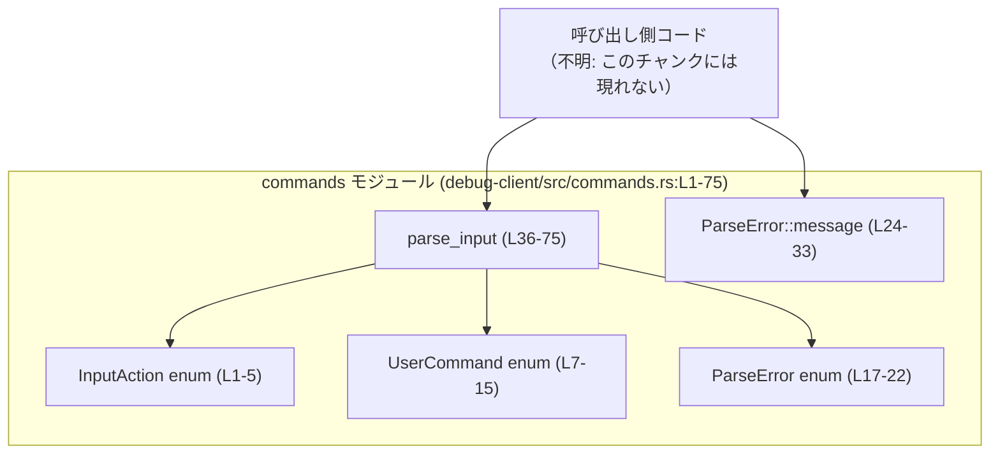
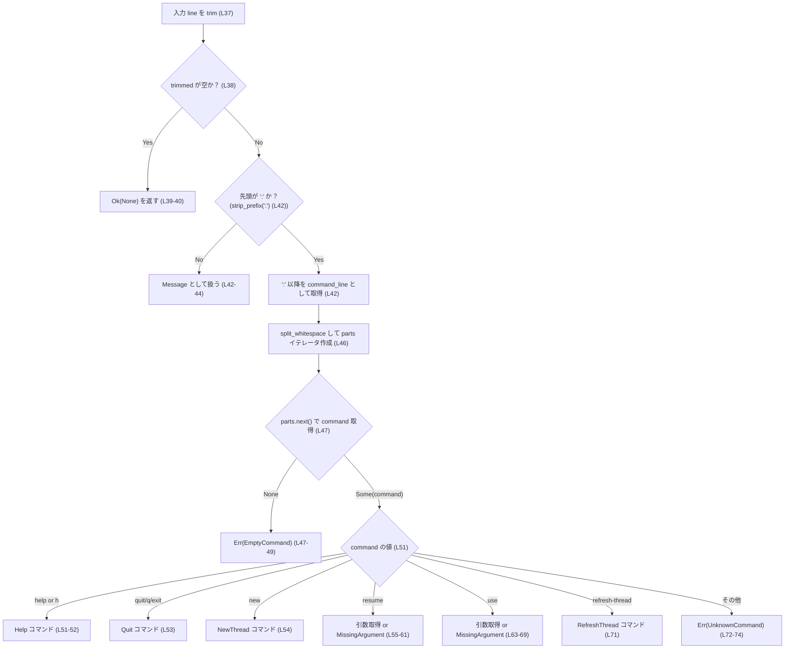
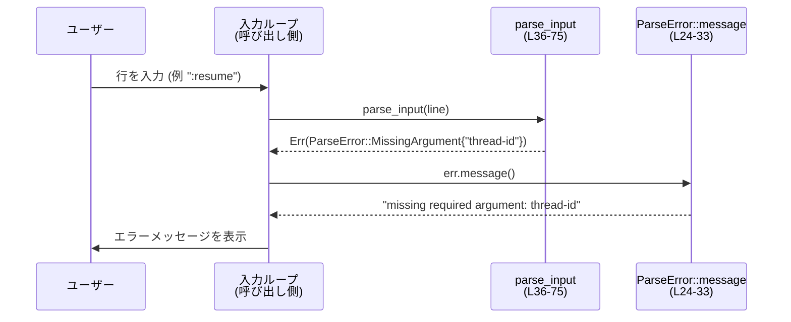

# debug-client/src/commands.rs コード解説

## 0. ざっくり一言

このモジュールは、ユーザーからの 1 行入力を **通常メッセージ** か **内部コマンド**（`:help` など）にパースし、列挙体で表現されたアクションに変換するための小さなコマンドパーサです（`debug-client/src/commands.rs:L1-75`）。

---

## 1. このモジュールの役割

### 1.1 概要

- プレーンな行（先頭に `:` がない）は **メッセージ** として扱い、そのまま文字列として `InputAction::Message` に包みます（`L1-5`, `L36-44`）。
- `:` から始まる行は **ユーザーコマンド** として解釈し、`UserCommand` 列挙体に対応するバリアントを生成します（`L7-15`, `L51-71`）。
- パースに失敗した場合やコマンドのフォーマットが不正な場合は、`ParseError` 列挙体でエラー原因を表現します（`L17-22`, `L51-75`）。
- 空行は「入力なし」として `Ok(None)` を返し、呼び出し側が「何もしない」選択をできるようにしています（`L36-40`）。

### 1.2 アーキテクチャ内での位置づけ

このチャンク内には他モジュールからの呼び出し情報はありませんが、コードから以下のような内部関係が読み取れます。



- 呼び出し側は `parse_input` に行文字列を渡し、結果として `Result<Option<InputAction>, ParseError>` を受け取ります（`L36`）。
- エラーになった場合は、`ParseError::message` を用いてユーザー向けのメッセージ文字列を生成できます（`L24-33`）。

### 1.3 設計上のポイント

コードから読み取れる設計上の特徴は次のとおりです。

- **責務の分割**  
  - 入力の分類とパースロジックは `parse_input` に集約（`L36-75`）。  
  - エラー表現とそのメッセージ生成は `ParseError` とそのメソッドに集約（`L17-33`）。
- **状態を持たない純粋関数的設計**  
  - グローバル状態や内部ミューテーションはなく、`parse_input` は引数にのみ依存する純粋な関数になっています（`L36-75`）。
- **エラーハンドリング方針**  
  - パース結果を `Result<Option<InputAction>, ParseError>` で表現し、「入力なし」「正常なアクション」「パースエラー」を区別します（`L36`）。  
  - エラーの種類は列挙体 `ParseError` で型安全に管理します（`L17-22`）。
- **並行性**  
  - `parse_input` は引数の `&str` から新規に `String` を生成するだけで、共有状態を持たないため、複数スレッドから同時に安全に呼び出せる構造です（`L36-75`）。
- **安全性（Rust の観点）**  
  - `unsafe` ブロックはなく、標準ライブラリの安全な API（`trim`, `strip_prefix`, `split_whitespace`, `to_string` など）のみを使用しています（`L36-44`, `L46-47`, `L56-61`, `L64-69`）。

---

## 2. 主要な機能一覧（＋コンポーネントインベントリー）

### 2.1 機能一覧

- 入力行のパース: `parse_input` — 1 行の入力を `InputAction` または `ParseError` に変換（`L36-75`）。
- コマンドアクションの表現: `InputAction`, `UserCommand` — メッセージと内部コマンドの種類を列挙体で表現（`L1-5`, `L7-15`）。
- パースエラーの表現とメッセージ生成: `ParseError`, `ParseError::message` — エラー原因の分類とユーザー向けメッセージの生成（`L17-33`）。
- 単体テスト: `tests` モジュール — 代表的な入力パターンに対するパーサの挙動を確認（`L78-155`）。

### 2.2 コンポーネント一覧（型・関数・テスト）

| 名称 | 種別 | 公開性 | 役割 / 用途 | 定義位置 |
|------|------|--------|-------------|----------|
| `InputAction` | enum | `pub` | ユーザー入力を「メッセージ」か「コマンド」に分類して表現する | `debug-client/src/commands.rs:L1-5` |
| `InputAction::Message(String)` | enumバリアント | - | 通常メッセージ行の内容を保持する | `L2-3` |
| `InputAction::Command(UserCommand)` | enumバリアント | - | パースされたコマンドを保持する | `L2-4` |
| `UserCommand` | enum | `pub` | サポートしている内部コマンドの種類を表現する | `L7-15` |
| `UserCommand::Help` | enumバリアント | - | `:help` / `:h` コマンド | `L9` |
| `UserCommand::Quit` | enumバリアント | - | `:quit` / `:q` / `:exit` コマンド | `L10`, `L53` |
| `UserCommand::NewThread` | enumバリアント | - | `:new` コマンド | `L11`, `L54` |
| `UserCommand::Resume(String)` | enumバリアント | - | `:resume <thread-id>` コマンド | `L12`, `L55-61` |
| `UserCommand::Use(String)` | enumバリアント | - | `:use <thread-id>` コマンド | `L13`, `L63-69` |
| `UserCommand::RefreshThread` | enumバリアント | - | `:refresh-thread` コマンド | `L14`, `L71` |
| `ParseError` | enum | `pub` | パースエラーの種類を表現する | `L17-22` |
| `ParseError::EmptyCommand` | enumバリアント | - | `:` 以降にコマンドがない場合のエラー | `L19`, `L47-49` |
| `ParseError::MissingArgument { name: &'static str }` | enumバリアント | - | 必須引数が欠けている場合のエラー | `L20`, `L56-58`, `L64-66` |
| `ParseError::UnknownCommand { command: String }` | enumバリアント | - | 未知のコマンド文字列が指定された場合のエラー | `L21`, `L72-74` |
| `ParseError::message(&self) -> String` | メソッド | `pub` | エラーを人間向けの説明文に変換する | `L24-33` |
| `parse_input(line: &str)` | 関数 | `pub` | 1 行の入力をパースし、`InputAction` または `ParseError` に変換 | `L36-75` |
| `tests` | モジュール | `#[cfg(test)]` | パーサの振る舞いを検証する単体テスト群 | `L78-155` |
| `parses_message` | テスト関数 | `#[test]` | メッセージ行のパースを検証 | `L87-94` |
| `parses_help_command` | テスト関数 | `#[test]` | `:help` のパースを検証 | `L96-100` |
| `parses_new_thread` | テスト関数 | `#[test]` | `:new` のパースを検証 | `L102-106` |
| `parses_resume` | テスト関数 | `#[test]` | `:resume <id>` のパースを検証 | `L108-117` |
| `parses_use` | テスト関数 | `#[test]` | `:use <id>` のパースを検証 | `L119-127` |
| `parses_refresh_thread` | テスト関数 | `#[test]` | `:refresh-thread` のパースを検証 | `L130-137` |
| `rejects_missing_resume_arg` | テスト関数 | `#[test]` | `:resume` の引数欠如をエラーにすることを検証 | `L139-146` |
| `rejects_missing_use_arg` | テスト関数 | `#[test]` | `:use` の引数欠如をエラーにすることを検証 | `L148-155` |

---

## 3. 公開 API と詳細解説

### 3.1 型一覧（構造体・列挙体など）

| 名前 | 種別 | 役割 / 用途 | 定義位置 |
|------|------|-------------|----------|
| `InputAction` | enum | 入力が通常メッセージかコマンドかを区別し、それぞれの内容を保持する | `L1-5` |
| `UserCommand` | enum | サポートするユーザーコマンド（help, quit, new, resume, use, refresh-thread）を表現する | `L7-15` |
| `ParseError` | enum | パース時のエラー要因（空コマンド、引数欠如、未知コマンド）を分類する | `L17-22` |

---

### 3.2 関数詳細

#### `ParseError::message(&self) -> String`

**概要**

`ParseError` の内容に応じて、人間が読める英語のエラーメッセージ文字列を生成するメソッドです（`L24-33`）。

**引数**

| 引数名 | 型 | 説明 |
|--------|----|------|
| `&self` | `&ParseError` | メッセージ化したいエラー値 |

**戻り値**

- `String`  
  エラー内容を説明するメッセージ。例: `"missing required argument: thread-id"`（`L28-30`）。

**内部処理の流れ**

`match` 式でバリアントごとに固定文言を返します（`L26-32`）。

1. `EmptyCommand` の場合: 固定文字列 `"empty command after ':'"` を `String` にして返す（`L27`）。
2. `MissingArgument { name }` の場合: `"missing required argument: {name}"` の形式でフォーマットして返す（`L28-30`）。
3. `UnknownCommand { command }` の場合: `"unknown command: {command}"` の形式でフォーマットして返す（`L31`）。

**Examples（使用例）**

```rust
use crate::commands::ParseError; // モジュールパスは例示です。このチャンクからは確定できません。

fn render_error(err: ParseError) {
    // ParseError からユーザー向けメッセージを生成する
    let msg = err.message();
    eprintln!("Error: {msg}");
}

// 例: 未知コマンドの場合
let err = ParseError::UnknownCommand { command: "foobar".to_string() };
assert_eq!(err.message(), "unknown command: foobar".to_string());
```

**Errors / Panics**

- このメソッド自体は `Result` を返さず、パニックを起こすコードもありません（`L26-32`）。  
  そのため **常に成功しパニックしません**。

**Edge cases（エッジケース）**

- `MissingArgument { name }` の `name` が空文字列になることは、このモジュール内の呼び出しからはありません（`"thread-id"` 固定、`L58`, `L66`）。  
  他の場所から `ParseError::MissingArgument { name: "" }` を構築した場合の挙動も通常どおり `"missing required argument: "` となります。

**使用上の注意点**

- メッセージは英語の固定文言であり、ローカライズ（多言語対応）は考慮されていません（`L27-31`）。
- ユーザー向けにメッセージを見せる場合、必要に応じて上位層で翻訳や整形を行う必要があります。

---

#### `parse_input(line: &str) -> Result<Option<InputAction>, ParseError>`

**概要**

1 行の文字列入力を解析し、以下の 3 通りの結果のいずれかを返す関数です（`L36-75`）。

- `Ok(None)` — 空行（空白のみを含む行）で、何もしないべきケース（`L36-40`）。
- `Ok(Some(InputAction))` — 有効なメッセージまたはコマンドとして解釈できたケース（`L42-44`, `L51-71`）。
- `Err(ParseError)` — コマンドとして解釈しようとしたが形式が不正・未知コマンドだったケース（`L47-49`, `L56-58`, `L64-66`, `L72-74`）。

**引数**

| 引数名 | 型 | 説明 |
|--------|----|------|
| `line` | `&str` | 改行を含まない 1 行分のユーザー入力 |

**戻り値**

- `Result<Option<InputAction>, ParseError>`  
  - `Ok(None)`: 空行。呼び出し側は何もせず次の入力を待つことが想定されます（`L36-40`）。  
  - `Ok(Some(InputAction))`: 正常なメッセージまたはコマンド。  
  - `Err(ParseError)`: パース不可能なコマンド（空コマンド、引数不足、未知コマンド）。

**内部処理の流れ（アルゴリズム）**



処理の詳細:

1. `line.trim()` で前後の空白を除去し、`trimmed` を得る（`L37`）。
2. `trimmed` が空なら `Ok(None)` を返し、この行は無視される（`L38-40`）。
3. `trimmed.strip_prefix(':')` により、行が `:` で始まっていればその後ろの部分を `command_line` として取得し、そうでなければ `Message` として返す（`L42-44`）。
4. `command_line.split_whitespace()` で空白区切りにし、最初のトークンをコマンド名として `command` に取り出す（`L46-47`）。
   - 1 つもトークンがない場合（例: `":"` や `":   "`）は `ParseError::EmptyCommand` を返す（`L47-49`）。
5. `command` の値に応じて `match` で分岐する（`L51-75`）。
   - `"help"` または `"h"` → `UserCommand::Help`（`L51-52`）。
   - `"quit"`, `"q"`, `"exit"` → `UserCommand::Quit`（`L53`）。
   - `"new"` → `UserCommand::NewThread`（`L54`）。
   - `"resume"` → 引数を 1 つ取得し `UserCommand::Resume(thread_id)`（`L55-61`）。
   - `"use"` → 引数を 1 つ取得し `UserCommand::Use(thread_id)`（`L63-69`）。
   - `"refresh-thread"` → `UserCommand::RefreshThread`（`L71`）。
   - その他 → `ParseError::UnknownCommand { command: command.to_string() }`（`L72-74`）。

`resume` と `use` の引数取得部分（`L55-61`, `L63-69`）では、`parts.next().ok_or(ParseError::MissingArgument { name: "thread-id" })?` により、引数がない場合は即座に `Err(MissingArgument)` を返し、ある場合は `thread_id.to_string()` で `String` に変換してバリアントに格納します。

**Examples（使用例）**

1. **メッセージ行の処理**

```rust
use crate::commands::{parse_input, InputAction};

// "hello there" はメッセージとして扱われる
let result = parse_input("hello there").unwrap(); // Result が Ok(...) の想定（L87-94 のテストと同等）
match result {
    Some(InputAction::Message(msg)) => {
        assert_eq!(msg, "hello there".to_string());
    }
    _ => unreachable!("この入力で他の結果になることは tests によって想定されていません"),
}
```

この挙動は `parses_message` テストによって確認されています（`L87-94`）。

1. **コマンド行の処理とエラーハンドリング**

```rust
use crate::commands::{parse_input, InputAction, UserCommand, ParseError};

fn handle_line(line: &str) {
    match parse_input(line) {
        Ok(None) => {
            // 空行: 何もしない
        }
        Ok(Some(InputAction::Message(msg))) => {
            println!("User message: {msg}");
        }
        Ok(Some(InputAction::Command(cmd))) => match cmd {
            UserCommand::Help => println!("Show help..."),
            UserCommand::Quit => println!("Quit requested"),
            UserCommand::NewThread => println!("Create new thread"),
            UserCommand::Resume(id) => println!("Resume thread {id}"),
            UserCommand::Use(id) => println!("Use thread {id}"),
            UserCommand::RefreshThread => println!("Refresh thread"),
        },
        Err(e) => {
            // ParseError::message を使ってユーザー向け表示に変換
            eprintln!("Command error: {}", e.message());
        }
    }
}

// 例: 引数のない :resume はエラーになる（L139-146 のテスト）
assert!(matches!(
    parse_input(":resume"),
    Err(ParseError::MissingArgument { name }) if name == "thread-id"
));
```

**Errors / Panics**

- `parse_input` 自体はパニックしない構造になっています。  
  - `?` 演算子は `ok_or` が返す `Err(ParseError::MissingArgument { .. })` をそのまま呼び出し元に伝播するだけで、`unwrap` のようなパニック要因は使用していません（`L56-58`, `L64-66`）。
- エラー条件:
  - `:` の後にコマンド名がない → `Err(ParseError::EmptyCommand)`（`L47-49`）。
  - `:resume` または `:use` に引数がない → `Err(ParseError::MissingArgument { name: "thread-id" })`（`L56-58`, `L64-66`）。
  - 未知のコマンド名（例: `:foobar`） → `Err(ParseError::UnknownCommand { command })`（`L72-74`）。

**Edge cases（エッジケース）**

- **空行・空白のみの行**  
  - 例: `""`, `"   "`, `"\t  \n"` → `trim()` の結果が空になり `Ok(None)` になります（`L37-40`）。
- **メッセージ行（先頭に `:` がない）**  
  - 全体を `trim()` 後の文字列として `InputAction::Message` に格納します（`L42-44`）。
  - 先頭・末尾の空白は除去された状態の文字列が保持されます。
- **コマンド行の余分な空白**  
  - 例: `"  :resume   thr_123   "` → `trim()` と `split_whitespace()` により、`command` は `"resume"`, 引数は `"thr_123"` として正しくパースされます（`L37`, `L46-47`, `L56`）。
- **`:` の後に何もない / 空白のみ**  
  - 例: `":"`, `":    "` → `split_whitespace()` がトークンを返さないため、`EmptyCommand` エラーになります（`L46-49`）。
- **追加引数がある場合**  
  - 例: `":resume thr_123 extra"` → 最初の引数 `"thr_123"` のみ取得し、残りは無視します（`L56-61`）。この挙動はコードから読み取れますが、テストでは明示的に検証されていません。
- **スレッド ID に空白を含めたい場合**  
  - `split_whitespace()` を使用しているため、ID に空白を含めることはできません（`L46-47`）。  
  - コードからは「ID は空白を含まない 1 トークン」という前提で設計されていると解釈できます。

**使用上の注意点**

- `Result<Option<InputAction>, ParseError>` という戻り値の意味:
  - `Ok(None)` → 「入力はあったが意味のあるアクションではない（空行）」  
  - `Ok(Some(...))` → 「意味のあるメッセージまたはコマンド」  
  - `Err(ParseError)` → 「入力はコマンドとして解釈しようとしたが、形式が不正」
- 呼び出し側は上記 3 ケースを明確に区別して扱う必要があります。特に空行を無視したい場合は `Ok(None)` を確認する必要があります（`L36-40`）。
- コマンドとして扱うのは **先頭が `:` の行のみ** です。`"hello:world"` のような行はメッセージ扱いになります（`L42-44`）。
- この関数は I/O を行わず、計算量は入力長に線形 (`O(n)`) です。高頻度に呼び出してもパフォーマンス上の大きな問題は生じにくい構造です。

**Bugs / Security 観点**

- このチャンクから見える範囲では、明確なバグやパニック要因は確認できません。
- セキュリティ上の懸念:
  - 本関数は文字列をトークナイズするだけで、副作用や外部システムへのアクセスはありません（`L36-75`）。
  - `thread_id` は文字列としてそのまま外部に渡される想定ですが、その利用方法はこのチャンクには現れないため、セキュリティへの影響はここからは判断できません。

---

### 3.3 その他の関数（テスト）

| 関数名 | 役割（1 行） | 定義位置 |
|--------|--------------|----------|
| `parses_message` | `"hello there"` をメッセージとしてパースできることを検証 | `L87-94` |
| `parses_help_command` | `:help` が `UserCommand::Help` にパースされることを検証 | `L96-100` |
| `parses_new_thread` | `:new` が `UserCommand::NewThread` にパースされることを検証 | `L102-106` |
| `parses_resume` | `:resume thr_123` が `UserCommand::Resume("thr_123")` になることを検証 | `L108-117` |
| `parses_use` | `:use thr_456` が `UserCommand::Use("thr_456")` になることを検証 | `L119-127` |
| `parses_refresh_thread` | `:refresh-thread` が `UserCommand::RefreshThread` になることを検証 | `L130-137` |
| `rejects_missing_resume_arg` | `:resume` で `MissingArgument("thread-id")` エラーになることを検証 | `L139-146` |
| `rejects_missing_use_arg` | `:use` で `MissingArgument("thread-id")` エラーになることを検証 | `L148-155` |

テストはすべて `parse_input` の振る舞いを直接検証しており、現在サポートしている全コマンドの正常系と `resume` / `use` の一部エラー系をカバーしています（`L87-155`）。  
空行や未知コマンド、`EmptyCommand` のケースはテストされていません。

---

## 4. データフロー

### 4.1 代表的な処理シナリオ

ユーザーが 1 行入力し、それを `parse_input` と `ParseError::message` を用いて処理するまでの流れを示します。



- 成功パスでは、`P` は `Ok(Some(InputAction::Command(...)))` または `Ok(Some(InputAction::Message(...)))` を返し、呼び出し側はそれに応じて処理を行います（`L51-71`）。
- エラーパスでは、`ParseError` を受け取った呼び出し側が `message()` を呼び出し、ユーザーにエラー内容を伝達します（`L24-33`, `L56-58`, `L64-66`, `L72-74`）。

---

## 5. 使い方（How to Use）

### 5.1 基本的な使用方法

標準入力からの行を読み込み、このモジュールのパーサを使って処理する典型的な例です。  
モジュールパスは例示であり、このチャンクからは確定できないことに注意してください。

```rust
use crate::commands::{parse_input, InputAction, UserCommand, ParseError}; // パスは例

fn main_loop() -> Result<(), Box<dyn std::error::Error>> {
    use std::io::{self, BufRead};

    let stdin = io::stdin();
    for line_result in stdin.lock().lines() {
        let line = line_result?; // I/O エラーはここで処理

        match parse_input(&line) {
            Ok(None) => {
                // 空行: 何もしない
            }
            Ok(Some(InputAction::Message(msg))) => {
                println!("Message: {msg}");
            }
            Ok(Some(InputAction::Command(cmd))) => match cmd {
                UserCommand::Help => println!("Help..."),
                UserCommand::Quit => {
                    println!("Bye");
                    break;
                }
                UserCommand::NewThread => println!("Create new thread"),
                UserCommand::Resume(id) => println!("Resume thread {id}"),
                UserCommand::Use(id) => println!("Use thread {id}"),
                UserCommand::RefreshThread => println!("Refresh thread"),
            },
            Err(e) => {
                // ParseError をユーザーに分かりやすく表示
                eprintln!("Error: {}", e.message());
            }
        }
    }

    Ok(())
}
```

### 5.2 よくある使用パターン

1. **コマンドだけを受け付けたい場合**

```rust
use crate::commands::{parse_input, InputAction};

fn read_command_only(line: &str) {
    match parse_input(line) {
        Ok(Some(InputAction::Command(cmd))) => {
            // cmd を処理
        }
        Ok(Some(InputAction::Message(_))) => {
            // メッセージは無視する
        }
        Ok(None) => {
            // 空行は無視
        }
        Err(e) => {
            eprintln!("Error: {}", e.message());
        }
    }
}
```

1. **空行を完全に無視する簡略化パターン**

```rust
use crate::commands::{parse_input, InputAction};

fn handle_non_empty(line: &str) {
    if let Ok(Some(action)) = parse_input(line) {
        match action {
            InputAction::Message(msg) => println!("Message: {msg}"),
            InputAction::Command(cmd) => println!("Command: {cmd:?}"), // Debug 出力 (L1, L7 の derive)
        }
    }
}
```

`InputAction` と `UserCommand` は `Debug` を derive しているため（`L1`, `L7`）、`{:?}` でデバッグ出力が可能です。

### 5.3 よくある間違い

```rust
use crate::commands::{parse_input, InputAction};

// 間違い例: Err を無視してしまう
fn bad_example(line: &str) {
    if let Ok(Some(InputAction::Command(cmd))) = parse_input(line) {
        // エラーも空行も同じように「何もしない」扱いになり、
// ユーザーにフィードバックが返らない
        println!("Command: {cmd:?}");
    }
}

// 正しい例: Err と Ok(None) を区別し、エラーはユーザーに伝える
fn good_example(line: &str) {
    match parse_input(line) {
        Ok(Some(InputAction::Command(cmd))) => println!("Command: {cmd:?}"),
        Ok(Some(InputAction::Message(msg))) => println!("Message: {msg}"),
        Ok(None) => { /* 空行: 何もしない */ }
        Err(e) => eprintln!("Error: {}", e.message()),
    }
}
```

### 5.4 使用上の注意点（まとめ）

- `parse_input` の戻り値の 3 状態（`Ok(None)`, `Ok(Some(_))`, `Err(_)`）を区別して扱うことが前提になっています（`L36-40`, `L47-49`, `L51-75`）。
- `:resume` / `:use` の引数は空白を含まない 1 トークンである必要があります（`L46-47`, `L56`, `L64`）。
- 追加の引数（`":resume thr extra"` の `extra`）は無視されるので、複数引数が必要な仕様に拡張する場合はパーサの変更が必要です（`L46-47`, `L56-61`, `L64-69`）。
- 並行性: 共有状態を持たず、`&str` から新しい `String` を生成しているだけなので、複数スレッドから同時に呼び出してもスレッド安全と考えられる設計です（`L36-75`）。

---

## 6. 変更の仕方（How to Modify）

### 6.1 新しい機能を追加する場合（新コマンドの追加）

新しいユーザーコマンド `:foo` を導入したいときの一般的な手順です。

1. **`UserCommand` にバリアントを追加**  
   - 例: `Foo` または `Foo(String)` などを `UserCommand` に追加します（`L7-15` 付近）。
2. **`parse_input` の `match command` に分岐を追加**  
   - `"foo"`（必要なら `"f"` などの別名も）に対応する `match` アームを追加し、新しい `UserCommand` バリアントを生成します（`L51-75`）。
3. **必要に応じて引数処理を実装**  
   - 引数が必要なら、`resume` / `use` と同様に `parts.next().ok_or(...)?` パターンを流用できます（`L55-61`, `L63-69`）。
4. **テストの追加**  
   - `tests` モジュール内に、正常系とエラー系（引数不足など）を検証するテストを追加します（`L87-155` を参考）。

### 6.2 既存の機能を変更する場合（仕様変更）

変更時に注意すべき点:

- **コマンド名の変更・別名の追加**  
  - `match command` のリテラル文字列を変更します（`L51-54`, `L71-72`）。  
  - 既存の入力との互換性や、既存のテスト（`L96-106`, `L130-137` など）への影響を確認する必要があります。
- **引数仕様の変更**  
  - 現在は `split_whitespace()` ベースで 1 トークンのみ取得します（`L46-47`, `L56`, `L64`）。  
  - 複数引数やクオート付きの引数をサポートする場合は、トークナイズのロジックを変更し、それに応じて `MissingArgument` の扱いも見直す必要があります。
- **エラー型の契約**  
  - `ParseError` のバリアントは直接 `Result` の `Err` として返されているため、バリアントの削除や意味変更は呼び出し側のエラーハンドリングに影響します（`L17-22`, `L47-49`, `L56-58`, `L64-66`, `L72-74`）。
  - 外部コードが `match ParseError` を行っている場合、そのパターンを壊さないよう注意が必要です。
- **テスト**  
  - 仕様変更後は、既存テスト（`L87-155`）の期待値が変更される可能性があります。テストの更新と追加により、新仕様が正しく反映されていることを確認するのが望ましいです。

---

## 7. 関連ファイル

このチャンクには他ファイルへの参照は登場しません。そのため、外部モジュールとの関係は不明です。

このファイル内で密接に関係する要素は以下です。

| パス | 役割 / 関係 |
|------|------------|
| `debug-client/src/commands.rs`（tests モジュール内） | 本モジュールの公開関数 `parse_input` と `ParseError` の振る舞いを直接検証する単体テストを提供します（`L78-155`）。 |

他のファイル（たとえば CLI のメインループやスレッド管理ロジック）からの `parse_input` の利用状況については、このチャンクには現れないため「不明」です。
