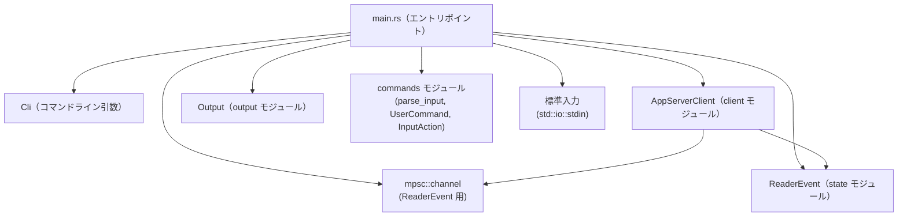

# debug-client/src/main.rs コード解説

## 0. ざっくり一言

- `debug-client/src/main.rs` は、Codex の app-server に接続する**対話型の最小クライアント CLI**のエントリポイントです。  
- コマンドライン引数を解析し、app-server とのスレッド開始/再開、メッセージ送信、スレッド一覧取得などを対話的に行います（`debug-client/src/main.rs:L26-149, L151-237`）。

---

## 1. このモジュールの役割

### 1.1 概要

- このモジュールは、**app-server と対話するデバッグ用クライアント**を提供します。
- 役割は大きく次の 3 つです（`debug-client/src/main.rs:L26-149`）:
  - `clap` を使ったコマンドライン引数の定義とパース（`Cli` 構造体）。
  - `AppServerClient` を起動・初期化し、スレッドの開始/再開・切り替えなどを行う。
  - 標準入力と mpsc チャネルを使った**イベントループ**で、ユーザ入力とサーバ側イベントを処理する。

### 1.2 アーキテクチャ内での位置づけ

`main.rs` はバイナリクレートのエントリポイントであり、他モジュールに依存して UI を構成します。

- 依存関係の事実（すべて本ファイル内から確認可能）:
  - `client` モジュールの `AppServerClient` とパラメータ生成関数を利用（`debug-client/src/main.rs:L1, L17-19, L71-93, L102, L147, L165-191, L205-207, L222`）。
  - `commands` モジュールの `parse_input`, `InputAction`, `UserCommand` を利用（`debug-client/src/main.rs:L2, L20-22, L121-140, L151-163`）。
  - `output` モジュールの `Output` を利用（`debug-client/src/main.rs:L3, L23, L66-69, L96-99, L101, L104, L110, L114, L125-133, L141-143, L172-179, L193-200, L207-217, L224-231, L255-277, L284-292`）。
  - `state` モジュールの `ReaderEvent` を利用（`debug-client/src/main.rs:L5, L24, L251-280`）。
  - 標準入力と mpsc チャネルを用いて、ユーザ入力（`std::io::stdin`）とバックグラウンドの Reader イベントを仲介（`debug-client/src/main.rs:L7-9, L101-102, L106-107, L110, L251-252`）。

依存関係イメージ（主要コンポーネントのみ）:



実際の `client` / `commands` / `output` / `state` / `reader` モジュールの中身は、このチャンクには現れません。

### 1.3 設計上のポイント

コードから読み取れる設計上の特徴は次の通りです。

- **エントリポイント一本化**
  - `fn main() -> Result<()>` を中心に、処理の流れが完結しています（`debug-client/src/main.rs:L66-149`）。
- **CLI パラメータ → クライアント初期化 → イベントループ**というシンプルな三段構成
  - `Cli::parse()` → `AppServerClient::spawn` → 標準入力ループ（`debug-client/src/main.rs:L66-107`）。
- **エラー処理**
  - バイナリ全体の戻り値に `anyhow::Result<()>` を利用し、`?` 演算子でエラーを伝播（`debug-client/src/main.rs:L66, L69, L71-77, L80-87, L88-93, L102, L119`）。
  - ユーザ入力のパースエラーなど、「致命的でないエラー」は標準出力に文言を出して継続（`debug-client/src/main.rs:L121-143`）。
- **並行性**
  - `std::sync::mpsc::channel` を用いて、`AppServerClient::start_reader` 側から `ReaderEvent` を非同期に受信（`debug-client/src/main.rs:L9, L101-102, L251-252`）。
  - メインスレッドは `try_recv` で非ブロッキングにイベントをポーリングし、対話的な応答性を確保（`debug-client/src/main.rs:L251-252`）。
- **I/O の分離**
  - 表示用ロジックは `Output` 型経由に統一され、直接 `println!` は使っていません（`debug-client/src/main.rs:L68, L96-99, L104, L114, L125-133, L141-143, L172-179, L193-200, L207-217, L224-231, L255-277, L284-292`）。

### 1.4 コンポーネント一覧（本ファイルで定義）

| 名前 | 種別 | 役割 / 用途 | 根拠 |
|------|------|-------------|------|
| `Cli` | 構造体 | `clap` で定義されたコマンドライン引数セット。app-server の接続や挙動のオプションを保持する。 | `debug-client/src/main.rs:L26-64` |
| `main` | 関数 | バイナリのエントリポイント。CLI をパースし、`AppServerClient` を初期化して、対話的なメインループを回す。 | `debug-client/src/main.rs:L66-149` |
| `handle_command` | 関数 | `:help`, `:new`, `:resume`, `:use`, `:refresh-thread`, `:quit` などのユーザコマンドを処理し、アプリを続行するか終了するかを決める。 | `debug-client/src/main.rs:L151-237` |
| `parse_approval_policy` | 関数 | 文字列から `AskForApproval` 列挙体への変換を行う。未知の値はエラーとする。 | `debug-client/src/main.rs:L239-249` |
| `drain_events` | 関数 | `mpsc::Receiver<ReaderEvent>` から受信済みイベントをすべて取り出し、`Output` に反映する。 | `debug-client/src/main.rs:L251-282` |
| `print_help` | 関数 | 利用可能なコマンド一覧を `Output` に表示する。 | `debug-client/src/main.rs:L284-293` |

関連モジュール（定義は別ファイル）の一覧:

| 名前 | 種別 | 役割 / 用途 | 根拠 |
|------|------|-------------|------|
| `client` | モジュール | `AppServerClient`, `build_thread_start_params`, `build_thread_resume_params` を提供する。スレッド開始/再開やイベントリーダー起動を行うと解釈できるが、実装はこのチャンクには現れません。 | `debug-client/src/main.rs:L1, L17-19, L71-93, L102, L147, L165-191, L205-207, L222` |
| `commands` | モジュール | ユーザ入力のパース関数 `parse_input` と、`InputAction`, `UserCommand` 列挙体を提供する。具体的な実装は不明。 | `debug-client/src/main.rs:L2, L20-22, L121-140, L151-163` |
| `output` | モジュール | 画面出力を抽象化する `Output` 型を提供する。`client_line`, `prompt`, `set_prompt`, `clone` などのメソッドを持つ。 | `debug-client/src/main.rs:L3, L23, L68-69, L96-99, L101, L104, L110, L114, L125-133, L141-143, L172-179, L193-200, L207-217, L224-231, L255-277, L284-292` |
| `reader` | モジュール | 直接は参照していませんが、`client.start_reader(...)` と `ReaderEvent` から、app-server からのイベント読取処理に関係すると推測されます。実装はこのチャンクには現れません。 | `debug-client/src/main.rs:L4, L101-102` |
| `state` | モジュール | `ReaderEvent` 列挙体を提供し、スレッド準備やスレッド一覧などの状態変化を表現する。 | `debug-client/src/main.rs:L5, L24, L251-280` |

---

## 2. 主要な機能一覧

本ファイルが提供する主要機能は次の通りです。

- CLI パラメータ定義とパース: `Cli` 構造体と `clap::Parser` で実装（`debug-client/src/main.rs:L26-64`）。
- app-server クライアントの起動と初期化: `AppServerClient::spawn` と `initialize` の呼び出し（`debug-client/src/main.rs:L71-77`）。
- スレッドの開始または既存スレッドへの接続: `start_thread` / `resume_thread` の呼び出しとスレッド ID の取得（`debug-client/src/main.rs:L79-94`）。
- Reader イベントの非同期受信: `mpsc::channel` と `client.start_reader` の設定（`debug-client/src/main.rs:L101-102`）。
- メイン対話ループ:
  - `drain_events` による Reader イベント処理（`debug-client/src/main.rs:L109-115, L251-282`）。
  - 標準入力からの 1 行読み取りと `parse_input` による解釈（`debug-client/src/main.rs:L106-107, L116-121`）。
  - メッセージ送信 (`send_turn`) とコマンド処理 (`handle_command`)（`debug-client/src/main.rs:L123-140, L151-237`）。
- コマンド処理:
  - `:help`, `:new`, `:resume`, `:use`, `:refresh-thread`, `:quit` の実装（`debug-client/src/main.rs:L158-235, L284-292`）。
- 承認ポリシーのパース: 文字列を `AskForApproval` に変換するロジック（`debug-client/src/main.rs:L239-249`）。
- Reader イベントの描画: スレッド準備・スレッド一覧の表示とプロンプト設定（`debug-client/src/main.rs:L251-280`）。

---

## 3. 公開 API と詳細解説

### 3.1 型一覧（構造体・列挙体など）

本ファイル内で定義されている主要な型は `Cli` のみです。

| 名前 | 種別 | 役割 / 用途 | 主なフィールド | 根拠 |
|------|------|-------------|----------------|------|
| `Cli` | 構造体 | `clap` によりコマンドライン引数を定義・パースするための型。app-server クライアントの設定を保持する。 | `codex_bin`, `config_overrides`, `thread_id`, `approval_policy`, `auto_approve`, `final_only`, `model`, `model_provider`, `cwd` | `debug-client/src/main.rs:L26-64` |

`Cli` フィールドの概要:

| フィールド名 | 型 | 説明 | CLI オプション | 根拠 |
|-------------|----|------|----------------|------|
| `codex_bin` | `String` | 実行する `codex` CLI バイナリのパス。 | `--codex-bin`（デフォルト `"codex"`） | `debug-client/src/main.rs:L29-31` |
| `config_overrides` | `Vec<String>` | `codex` CLI に `--config key=value` として渡す設定の上書き一覧。複数指定可。 | `-c, --config <key=value>`（繰り返し可） | `debug-client/src/main.rs:L33-35` |
| `thread_id` | `Option<String>` | 既存スレッドを再開する場合のスレッド ID。指定がない場合は新規スレッド。 | `--thread-id <THREAD_ID>` | `debug-client/src/main.rs:L37-39` |
| `approval_policy` | `String` | スレッドの承認ポリシー文字列（後で `AskForApproval` に変換）。 | `--approval-policy <POLICY>`（デフォルト `"on-request"`） | `debug-client/src/main.rs:L41-43` |
| `auto_approve` | `bool` | コマンドやファイル変更の承認を自動化するフラグ。挙動詳細は Reader 側実装に依存。 | `--auto-approve` | `debug-client/src/main.rs:L45-47` |
| `final_only` | `bool` | 最終メッセージやツール呼び出しのみを表示するフラグ。 | `--final-only` | `debug-client/src/main.rs:L49-51` |
| `model` | `Option<String>` | スレッド開始/再開時のモデル名上書き。 | `--model <MODEL>` | `debug-client/src/main.rs:L53-55` |
| `model_provider` | `Option<String>` | スレッド開始/再開時のモデルプロバイダ上書き。 | `--model-provider <PROVIDER>` | `debug-client/src/main.rs:L57-59` |
| `cwd` | `Option<String>` | スレッド開始/再開時の作業ディレクトリ上書き。 | `--cwd <DIR>` | `debug-client/src/main.rs:L61-63` |

### 3.2 関数詳細

以下の 5 関数が、このファイルのコアロジックです。

---

#### `main() -> Result<()>`（エントリポイント）

**位置**: `debug-client/src/main.rs:L66-149`

**概要**

- コマンドライン引数をパースし、`AppServerClient` を起動・初期化します。
- 新規スレッドまたは指定されたスレッドに接続し、Reader のイベントループと標準入力ループを開始します。
- 対話ループを抜けたらクライアントをシャットダウンして終了します。

**引数**

- なし（OS から呼び出される標準的な `main` 関数です）。

**戻り値**

- `Result<()>` (`anyhow::Result<()>`):
  - `Ok(())`: 正常終了。
  - `Err(anyhow::Error)`: 初期化や I/O 等の途中でエラーが発生した場合（後述の「Errors」参照）。

**内部処理の流れ（アルゴリズム）**

1. **CLI と出力、承認ポリシーの初期化**  
   - `Cli::parse()` で CLI 引数をパース（`debug-client/src/main.rs:L67`）。  
   - `Output::new()` で出力ハンドラを生成（`debug-client/src/main.rs:L68`）。  
   - `parse_approval_policy(&cli.approval_policy)?` で文字列から `AskForApproval` への変換（`debug-client/src/main.rs:L69`）。

2. **app-server クライアントの起動と初期化**  
   - `AppServerClient::spawn(&cli.codex_bin, &cli.config_overrides, output.clone(), cli.final_only)?` でクライアントを生成（`debug-client/src/main.rs:L71-76`）。  
   - `client.initialize()?` で初期化処理を実行（`debug-client/src/main.rs:L77`）。  
     - `spawn` / `initialize` の内部実装はこのチャンクには現れません。

3. **接続スレッド ID の決定**  
   - `cli.thread_id` が `Some` の場合: `build_thread_resume_params(...)` を渡して `client.resume_thread(...)` し、既存スレッドに接続（`debug-client/src/main.rs:L79-87`）。  
   - `cli.thread_id` が `None` の場合: `build_thread_start_params(...)` を渡して `client.start_thread(...)` し、新規スレッドを開始（`debug-client/src/main.rs:L88-93`）。  
   - いずれも `thread_id` を返していることが呼び出し方から分かります（`debug-client/src/main.rs:L79-94`）。

4. **接続完了メッセージとプロンプト設定**  
   - `connected to thread {thread_id}` というメッセージを `output.client_line` で表示（`debug-client/src/main.rs:L96-98`）。  
   - `output.set_prompt(&thread_id)` でプロンプトにスレッド ID を表示するよう設定（`debug-client/src/main.rs:L99`）。

5. **Reader イベントチャネルのセットアップ**  
   - `let (event_tx, event_rx) = mpsc::channel();` で `ReaderEvent` を受け取るチャネルを作成（`debug-client/src/main.rs:L101`）。  
   - `client.start_reader(event_tx, cli.auto_approve, cli.final_only)?` で Reader 側の非同期処理を開始（`debug-client/src/main.rs:L102`）。  
     - `start_reader` の内部でスレッド/タスクを起動しているかどうかは、このチャンクからは分かりませんが、`mpsc::Sender` を渡している点から非同期にイベントが飛んでくる設計と解釈できます。

6. **ヘルプの表示**  
   - `print_help(&output);` で利用可能なコマンド一覧を表示（`debug-client/src/main.rs:L104`）。

7. **標準入力の準備**  
   - `let stdin = io::stdin();` と `stdin.lock().lines()` で行単位のイテレータを取得（`debug-client/src/main.rs:L106-107`）。

8. **メイン対話ループ**（`loop { ... }`）  
   - `drain_events(&event_rx, &output);` で Reader 側から届いている `ReaderEvent` をすべて処理（`debug-client/src/main.rs:L109-110`）。  
   - `client.thread_id().unwrap_or_else(|| "no-thread".to_string())` でプロンプトに表示するスレッド ID を決定（`debug-client/src/main.rs:L111-113`）。  
   - `output.prompt(&prompt_thread).ok();` でプロンプトを表示（`debug-client/src/main.rs:L114`）。  
   - `lines.next()` で 1 行読み取り、`None`（EOF）の場合はループを抜ける（`debug-client/src/main.rs:L116-118`）。  
   - 取得した行に対して `line.context("read stdin")?` を適用し、読み取りエラーにラベルを付与（`debug-client/src/main.rs:L119`）。  
   - `parse_input(&line)` の結果に応じて分岐（`debug-client/src/main.rs:L121-144`）:
     - `Ok(None)`: 空行やコメントなど、何もしない入力として扱い `continue`（`debug-client/src/main.rs:L122`）。
     - `Ok(Some(InputAction::Message(message)))`:  
       - `client.thread_id()` でアクティブスレッドの有無を確認し、なければ `"no active thread; use :new or :resume <id>"` を表示（`debug-client/src/main.rs:L123-129`）。  
       - あれば `client.send_turn(&active_thread, message)` を呼び出し、エラー時は `"failed to send turn: {err}"` を表示（`debug-client/src/main.rs:L130-134`）。
     - `Ok(Some(InputAction::Command(command)))`:  
       - `handle_command(command, &client, &output, approval_policy, &cli)` を実行し、`false` が返ってきたらループを `break`（`debug-client/src/main.rs:L136-140`）。
     - `Err(err)`:  
       - `err.message()` を `output.client_line` で表示し、ループ継続（`debug-client/src/main.rs:L141-143`）。

9. **終了処理**  
   - ループを抜けた後、`client.shutdown();` を呼び出し（`debug-client/src/main.rs:L147`）。  
   - `Ok(())` を返して終了（`debug-client/src/main.rs:L148`）。

**Examples（使用例）**

この関数はバイナリのエントリポイントなので、通常は `cargo run` などで実行されます。

```bash
# 新規スレッドを on-request ポリシーで開始し、対話する
cargo run -p debug-client -- --codex-bin codex --config api_key=XXX

# 既存スレッドを再開
cargo run -p debug-client -- --thread-id THREAD123

# 自動承認かつ最終出力のみ表示
cargo run -p debug-client -- --auto-approve --final-only
```

※ コマンド名やパッケージ名は、実際の Cargo プロジェクト構成に依存します。このチャンクには `Cargo.toml` がないため、正確なバイナリ名は分かりません。

**Errors / Panics**

`main` から `Err` が返る条件（コードから読み取れる範囲）は次の通りです。

- `parse_approval_policy` が未知の文字列でエラーを返した場合（`debug-client/src/main.rs:L69, L239-247`）。
- `AppServerClient::spawn`, `initialize`, `start_thread`, `resume_thread`, `start_reader` がエラーを返した場合（`debug-client/src/main.rs:L71-77, L79-94, L102`）。
- 標準入力から行を取得した後の `line.context("read stdin")?` で、I/O エラーが発生した場合（`debug-client/src/main.rs:L119`）。

`main` 内には `unwrap` や `expect` は使われておらず、明示的な `panic!` 呼び出しもありません。  
ただし、呼び出し先で `panic!` している可能性については、このチャンクからは分かりません。

**Edge cases（エッジケース）**

- 標準入力が EOF の場合: `lines.next()` が `None` を返し、ループを抜けてクライアントをシャットダウンします（`debug-client/src/main.rs:L116-118, L147-148`）。
- アクティブスレッドがない状態でメッセージを送ろうとした場合:  
  `"no active thread; use :new or :resume <id>"` を表示して送信しません（`debug-client/src/main.rs:L123-129`）。
- `parse_input` がエラーを返した場合:  
  `err.message()` を出力し、ループは継続します（`debug-client/src/main.rs:L141-143`）。
- Reader イベントが大量に溜まっている場合:  
  `drain_events` 内で `try_recv` ループにより、ループ 1 回ごとに受信済みイベントをすべて処理します（`debug-client/src/main.rs:L251-252`）。

**使用上の注意点**

- 外部バイナリである `codex` CLI を `AppServerClient::spawn` 経由で起動します。そのため、`--codex-bin` で指定するコマンドは安全で信頼できるものに限定する前提です（`debug-client/src/main.rs:L29-31, L71-73`）。
- 対話ループは標準入力にブロッキングで依存しているため、パイプやファイルから入力した場合、EOF に達するまで終了しません（`debug-client/src/main.rs:L106-107, L116-118`）。
- 出力処理 (`Output`) のエラーは多くの場合 `.ok()` や `let _ =` で無視されています。そのため、出力先の障害（例: TTY 切断）があっても、プロセスが即座に落ちることはありませんが、画面表示が欠落する可能性があります（`debug-client/src/main.rs:L96-98, L114, L125-133, L141-143, L172-179, L193-200, L207-217, L224-231, L255-277, L284-292`）。

---

#### `handle_command(...) -> bool`

**位置**: `debug-client/src/main.rs:L151-237`

```rust
fn handle_command(
    command: UserCommand,
    client: &AppServerClient,
    output: &Output,
    approval_policy: AskForApproval,
    cli: &Cli,
) -> bool
```

**概要**

- `parse_input` により解釈された `UserCommand` を受け取り、対応する操作を `AppServerClient` 経由で要求します。
- `true` を返すとメインループ継続、`false` を返すとアプリケーション終了（`:quit`）を意味します。

**引数**

| 引数名 | 型 | 説明 | 根拠 |
|--------|----|------|------|
| `command` | `UserCommand` | ユーザが入力したコマンド (`:help`, `:new` など)。 | `debug-client/src/main.rs:L151-152, L158-235` |
| `client` | `&AppServerClient` | app-server との通信を行うクライアント。スレッド開始/再開/一覧取得などを行う。 | `debug-client/src/main.rs:L153, L165-191, L205-207, L222` |
| `output` | `&Output` | メッセージやフィードバックを表示するための出力ハンドラ。 | `debug-client/src/main.rs:L154, L172-179, L193-200, L207-217, L224-231` |
| `approval_policy` | `AskForApproval` | 新規/再開スレッドに適用する承認ポリシー。 | `debug-client/src/main.rs:L155, L165-167, L185-188` |
| `cli` | `&Cli` | モデルや CWD など、スレッド起動時に使用する追加オプションを保持する。 | `debug-client/src/main.rs:L156, L167-170, L188-191` |

**戻り値**

- `bool`:
  - `true`: メインループを継続すべき（すべてのコマンド except `Quit`）。
  - `false`: `UserCommand::Quit` が指定された場合のみ、アプリケーションを終了するシグナル。

**内部処理の流れ**

`match command` による分岐（`debug-client/src/main.rs:L158-235`）:

1. `UserCommand::Help`  
   - `print_help(output)` を呼び出してコマンド一覧を表示（`debug-client/src/main.rs:L159-160`）。  
   - `true` を返す。

2. `UserCommand::Quit`  
   - 何もせず、`false` を返す（`debug-client/src/main.rs:L163`）。

3. `UserCommand::NewThread`  
   - `build_thread_start_params(approval_policy, cli.model.clone(), cli.model_provider.clone(), cli.cwd.clone())` を作成し（`debug-client/src/main.rs:L165-170`）、`client.request_thread_start(...)` を呼び出す。  
   - 成功 (`Ok(request_id)`) 時: `"requested new thread ({request_id:?})"` を出力（`debug-client/src/main.rs:L171-174`）。  
   - 失敗 (`Err(err)`) 時: `"failed to start thread: {err}"` を出力（`debug-client/src/main.rs:L176-179`）。  
   - いずれの場合も `true` を返す（`debug-client/src/main.rs:L182`）。

4. `UserCommand::Resume(thread_id)`  
   - `build_thread_resume_params(thread_id, approval_policy, cli.model.clone(), cli.model_provider.clone(), cli.cwd.clone())` を作成し（`debug-client/src/main.rs:L185-191`）、`client.request_thread_resume(...)` を呼び出す。  
   - 成功時: `"requested thread resume ({request_id:?})"` を出力（`debug-client/src/main.rs:L192-195`）。  
   - 失敗時: `"failed to resume thread: {err}"` を出力（`debug-client/src/main.rs:L197-200`）。  
   - `true` を返す（`debug-client/src/main.rs:L203`）。

5. `UserCommand::Use(thread_id)`  
   - `let known = client.use_thread(thread_id.clone());` でクライアント側のスレッド管理状態を更新（`debug-client/src/main.rs:L205-207`）。  
   - `output.set_prompt(&thread_id);` でプロンプトの表示スレッドを切り替え（`debug-client/src/main.rs:L207`）。  
   - `known` が `true` の場合: `"switched active thread to {thread_id}"` を表示（`debug-client/src/main.rs:L208-211`）。  
   - `known` が `false` の場合: `"switched active thread to {thread_id} (unknown; use :resume to load)"` を表示（`debug-client/src/main.rs:L213-216`）。  
   - `true` を返す（`debug-client/src/main.rs:L219`）。

6. `UserCommand::RefreshThread`  
   - `client.request_thread_list(/*cursor*/ None)` を呼び出し（`debug-client/src/main.rs:L222`）。  
   - 成功時: `"requested thread list ({request_id:?})"` を表示（`debug-client/src/main.rs:L223-226`）。  
   - 失敗時: `"failed to list threads: {err}"` を表示（`debug-client/src/main.rs:L228-231`）。  
   - `true` を返す（`debug-client/src/main.rs:L234`）。

**Examples（使用例）**

メインループ内での利用例（簡略化）:

```rust
// メインループ側（debug-client/src/main.rs:L136-140 より）
if let Ok(Some(InputAction::Command(command))) = parse_input(&line) {
    // handle_command が false を返したらループ終了
    if !handle_command(command, &client, &output, approval_policy, &cli) {
        break;
    }
}
```

コマンドの具体例（ユーザの入力）:

```text
:help            # Help コマンド -> print_help
:new             # NewThread コマンド -> request_thread_start
:resume abc123   # Resume コマンド -> request_thread_resume("abc123", ...)
:use abc123      # Use コマンド -> use_thread("abc123")
:refresh-thread  # RefreshThread コマンド -> request_thread_list(None)
:quit            # Quit コマンド -> false を返し、メインループ終了
```

**Errors / Panics**

- この関数は戻り値としてエラーを返しません。  
- `client.request_thread_start`, `client.request_thread_resume`, `client.request_thread_list` が `Err` を返す場合でも、メッセージを出力して `true` を返します（`debug-client/src/main.rs:L171-181, L192-201, L223-232`）。
- `print_help`, `output.client_line`, `output.set_prompt` のエラーは（戻り値があれば）無視されています（`let _ =` / `.ok()`）。

**Edge cases**

- `UserCommand::Use` で `known == false` の場合、クライアントはそのスレッドをまだ知らない状態であり、ユーザに「`:resume` でロードする必要がある」ことを示すメッセージが出力されます（`debug-client/src/main.rs:L205-217`）。
- `UserCommand::RefreshThread` で `request_thread_list` が失敗した場合でも、アプリケーションは終了せず、他の操作を続けられます（`debug-client/src/main.rs:L228-235`）。

**使用上の注意点**

- `approval_policy` と `cli` は `main` から受け取り、`handle_command` 中で消費されるだけで、`handle_command` 自体は副作用を持ちません（返り値を除く）。  
- `Quit` 以外のコマンドで `false` を返す分岐はありません。そのため、アプリを終了させたい場合は `:quit` の `UserCommand::Quit` が生成される必要があります（`debug-client/src/main.rs:L163`）。
- セキュリティ的には、スレッドの開始/再開/一覧取得はすべて `AppServerClient` 経由で行われ、`handle_command` は単にそのラッパーです。外部との通信パラメータチェックなどは `client` 側の実装に依存します（このチャンクには現れません）。

---

#### `parse_approval_policy(value: &str) -> Result<AskForApproval>`

**位置**: `debug-client/src/main.rs:L239-249`

**概要**

- CLI から受け取った承認ポリシー文字列を、`codex_app_server_protocol::AskForApproval` 列挙体に変換します。
- いくつかの同義表現（例えば `"on-request"` と `"onRequest"`）を許容します。

**引数**

| 引数名 | 型 | 説明 | 根拠 |
|--------|----|------|------|
| `value` | `&str` | CLI から渡された承認ポリシー文字列（例: `"on-request"`）。 | `debug-client/src/main.rs:L239-247` |

**戻り値**

- `Result<AskForApproval>`:
  - `Ok(AskForApproval::...)`: 認識された文字列の場合。
  - `Err(anyhow::Error)`: 不明な文字列の場合（`anyhow::bail!` による）。

**内部処理の流れ**

1. `match value` で文字列に応じて分岐（`debug-client/src/main.rs:L240-247`）。
2. 対応マッピング:
   - `"untrusted"`, `"unless-trusted"`, `"unlessTrusted"` → `AskForApproval::UnlessTrusted`（`debug-client/src/main.rs:L241`）。
   - `"on-failure"`, `"onFailure"` → `AskForApproval::OnFailure`（`debug-client/src/main.rs:L242`）。
   - `"on-request"`, `"onRequest"` → `AskForApproval::OnRequest`（`debug-client/src/main.rs:L243`）。
   - `"never"` → `AskForApproval::Never`（`debug-client/src/main.rs:L244`）。
3. どれにも当てはまらない場合:
   - `anyhow::bail!` で `"unknown approval policy: {value}. Expected one of: untrusted, on-failure, on-request, never"` というメッセージ付きのエラーを返す（`debug-client/src/main.rs:L245-247`）。

**Examples（使用例）**

```rust
use anyhow::Result;
use codex_app_server_protocol::AskForApproval;

// CLI の文字列引数から承認ポリシーを取得する例
fn get_policy_from_cli(s: &str) -> Result<AskForApproval> {
    parse_approval_policy(s)
}

fn main() -> Result<()> {
    let p1 = get_policy_from_cli("on-request")?;   // Ok(AskForApproval::OnRequest)
    let p2 = get_policy_from_cli("onFailure")?;    // Ok(AskForApproval::OnFailure)

    // 不正な文字列 -> エラー
    let p3 = get_policy_from_cli("invalid")?;      // Err(...) になり、ここには到達しない
    Ok(())
}
```

**Errors / Panics**

- `value` が既知の文字列以外の場合に `Err(anyhow::Error)` を返します。  
- `panic!` を起こすコードは含まれていません。

**Edge cases**

- 大文字小文字は区別されます。例えば `"On-Request"` や `"ON-REQUEST"` はエラーです（`debug-client/src/main.rs:L240-244`）。  
- 前後に空白が含まれる場合も、マッチしないためエラーになります。この関数内でトリミングは行っていません（`debug-client/src/main.rs:L239-247`）。
- CLI 側のデフォルト値は `"on-request"` に設定されているため、オプション未指定時にこの関数がエラーを返すことはありません（`debug-client/src/main.rs:L41-43, L69`）。

**使用上の注意点**

- CLI から受け取った生の文字列に対し、そのままこの関数を適用しています。ユーザに対しては、許容される値（ヘルプメッセージなど）を明示しておく必要があります。
- 新しい承認ポリシーを追加したい場合、この `match` に分岐を追加し、CLI の説明やヘルプにも反映する必要があります。

---

#### `drain_events(event_rx: &mpsc::Receiver<ReaderEvent>, output: &Output)`

**位置**: `debug-client/src/main.rs:L251-282`

**概要**

- `mpsc::Receiver<ReaderEvent>` から受信済みのイベントを**非ブロッキングで可能な限りすべて取り出し**、状態に応じて `Output` に表示・プロンプト更新を行います。
- メインループ側から定期的に呼ばれ、Reader 側の非同期処理と UI を橋渡しします。

**引数**

| 引数名 | 型 | 説明 | 根拠 |
|--------|----|------|------|
| `event_rx` | `&mpsc::Receiver<ReaderEvent>` | Reader から送られてくる `ReaderEvent` の受信側。`try_recv` で非ブロッキングにポーリングします。 | `debug-client/src/main.rs:L251-252` |
| `output` | `&Output` | イベント内容をユーザに表示する出力ハンドラ。 | `debug-client/src/main.rs:L251, L255-277` |

**戻り値**

- なし（`()`）。

**内部処理の流れ**

1. `while let Ok(event) = event_rx.try_recv()` ループで、チャネルが空になるまで `ReaderEvent` を取り出す（`debug-client/src/main.rs:L251-252`）。
2. イベントに応じた処理（`debug-client/src/main.rs:L253-280`）:
   - `ReaderEvent::ThreadReady { thread_id }`:
     - `"active thread is now {thread_id}"` を出力（`debug-client/src/main.rs:L254-257`）。
     - `output.set_prompt(&thread_id)` でプロンプトを更新（`debug-client/src/main.rs:L258-259`）。
   - `ReaderEvent::ThreadList { thread_ids, next_cursor }`:
     - `thread_ids` が空なら `"threads: (none)"` を出力（`debug-client/src/main.rs:L264-266`）。
     - 非空なら `"threads:"` の後に各 ID を `"  {thread_id}"` 形式で出力（`debug-client/src/main.rs:L267-270`）。
     - `next_cursor` が `Some` の場合は、`"more threads available, next cursor: {next_cursor}"` を出力（`debug-client/src/main.rs:L272-277`）。

**Examples（使用例）**

メインループ側での利用例:

```rust
let (event_tx, event_rx) = mpsc::channel::<ReaderEvent>();
client.start_reader(event_tx, cli.auto_approve, cli.final_only)?;

// メインループ内
loop {
    // Reader 側から届いているイベントを一括処理
    drain_events(&event_rx, &output);

    // その後でプロンプト表示や標準入力読み取りを行う …（debug-client/src/main.rs:L109-119）
}
```

**Errors / Panics**

- `mpsc::Receiver::try_recv` が `Err` を返した場合（チャネルが空または切断）は、`while let Ok(...)` の条件が偽になりループを抜けるだけで、エラーは表面化しません（`debug-client/src/main.rs:L251-252`）。
- `Output` への書き込みは `.ok()` を通じてエラーを無視しています（`debug-client/src/main.rs:L255-277`）。

**Edge cases**

- チャネルが空 (`TryRecvError::Empty`) の場合: 何もせず即座に戻ります。
- チャネルが切断 (`TryRecvError::Disconnected`) の場合: 最初の `try_recv` でループに入れず、そのまま戻ります。Reader 側の異常終了を UI には反映しません（このチャンクからはその検知ロジックは見えません）。
- `thread_ids` が空の場合: `"threads: (none)"` と表示されます（`debug-client/src/main.rs:L264-266`）。

**使用上の注意点**

- `try_recv` を使ったポーリングのため、この関数の呼び出し頻度が低いと、Reader イベントの表示が遅延します。現状ではメインループの先頭で毎回呼び出しているため、ユーザ入力ごとにイベントが反映される設計です（`debug-client/src/main.rs:L109-111`）。
- Reader 側が何らかの理由で終了しチャネルが閉じられても、この関数は静かに何もしない状態になるため、その検出や復旧ロジックは別途必要になります（このファイルには存在しません）。

---

#### `print_help(output: &Output)`

**位置**: `debug-client/src/main.rs:L284-293`

**概要**

- サポートされているコマンド一覧と、メッセージ送信の基本的な使い方を `Output` に表示します。

**引数**

| 引数名 | 型 | 説明 | 根拠 |
|--------|----|------|------|
| `output` | `&Output` | メッセージを表示するための出力ハンドラ。 | `debug-client/src/main.rs:L284-292` |

**戻り値**

- なし（`()`）。

**内部処理の流れ**

1. `"commands:"` の見出しを表示（`debug-client/src/main.rs:L285`）。
2. 各コマンド説明を 1 行ずつ表示（`debug-client/src/main.rs:L286-291`）:
   - `:help` – show this help
   - `:new` – start a new thread
   - `:resume <thread-id>` – resume an existing thread
   - `:use <thread-id>` – switch the active thread
   - `:refresh-thread` – list available threads
   - `:quit` – exit
3. `"type a message to send it as a new turn"` というメッセージ送信の説明を表示（`debug-client/src/main.rs:L292`）。
4. すべて `let _ = output.client_line("...");` で、戻り値は無視されます。

**Examples（使用例）**

メイン関数内の初期表示、および `:help` コマンドから呼び出されます。

```rust
// 起動直後のヘルプ表示
print_help(&output);  // debug-client/src/main.rs:L104

// :help コマンドからの呼び出し
match command {
    UserCommand::Help => {
        print_help(output);
        true
    }
    // ...
}
```

**Errors / Panics**

- `client_line` の戻り値は無視しているため、エラーはここでは表面化しません（`debug-client/src/main.rs:L285-292`）。
- `panic!` を起こすコードは含まれていません。

**Edge cases**

- 出力先（ターミナルなど）が閉じている場合でも、戻り値を無視しているため、ここからはエラーを観測できません。

**使用上の注意点**

- 新しいコマンドを追加した場合は、`handle_command` のマッチ分岐だけでなく、この `print_help` の表示内容も更新する必要があります。

---

### 3.3 その他の関数

- 本ファイルには上記 4 関数以外に `Cli` 定義を除く追加の補助関数はありません（`debug-client/src/main.rs:L26-64, L66-293`）。

---

## 4. データフロー

### 4.1 代表的シナリオ: ユーザがメッセージを送信し、スレッド一覧を取得する

このシナリオでは、ユーザが:

1. クライアントを起動。
2. メッセージを送信。
3. `:refresh-thread` を実行してスレッド一覧を取得。

という一連の流れを考えます。

処理の要点:

- 起動時に `AppServerClient` と Reader のイベントチャネルがセットアップされる（`debug-client/src/main.rs:L71-77, L101-102`）。
- メインループで標準入力 → `parse_input` → `InputAction` の変換が行われる（`debug-client/src/main.rs:L106-107, L121-140`）。
- メッセージは `client.send_turn` により app-server 側へ送信される（`debug-client/src/main.rs:L130-134`）。
- `:refresh-thread` は `client.request_thread_list` を呼び出し、結果は後から `ReaderEvent::ThreadList` としてチャネル経由で返ってくる（`debug-client/src/main.rs:L222-231, L251-280`）。

シーケンス図:

```mermaid
sequenceDiagram
    %% main ループと Reader イベントの流れ
    %% 対象範囲: debug-client/src/main.rs:L66-149, L151-237, L251-282

    participant User as ユーザ
    participant Stdin as 標準入力
    participant Main as main ループ
    participant Client as AppServerClient
    participant Reader as Reader(実装不明)
    participant Chan as mpsc::channel<ReaderEvent>
    participant Out as Output

    User->>Main: プロセス起動
    Main->>Cli: Cli::parse()
    Main->>Client: spawn(...), initialize()
    Main->>Client: start_thread / resume_thread
    Client-->>Main: thread_id
    Main->>Out: connected to thread...
    Main->>Chan: start_reader(event_tx, auto_approve, final_only)

    loop メイン対話ループ
        Main->>Chan: drain_events(event_rx)
        Chan-->>Main: 0個以上の ReaderEvent
        Main->>Out: prompt(active_thread)

        User->>Stdin: 入力（メッセージ or コマンド）
        Stdin-->>Main: 行読み取り
        Main->>Commands: parse_input(line)
        alt InputAction::Message
            Main->>Client: thread_id()
            Client-->>Main: Some(active_thread) or None
            alt Some(active_thread)
                Main->>Client: send_turn(active_thread, message)
                Client-->>Main: Result<(), Err>
                Main->>Out: エラー時のみ "failed to send turn"
            else None
                Main->>Out: "no active thread; use :new or :resume <id>"
            end
        else InputAction::Command(UserCommand)
            Main->>Main: handle_command(...)
            alt :refresh-thread
                Main->>Client: request_thread_list(None)
                Client-->>Main: Result<request_id, Err>
                Main->>Out: "requested thread list (...)" or エラー表示
                Client->>Reader: スレッド一覧問い合わせ結果
                Reader->>Chan: ReaderEvent::ThreadList{...}
            else その他のコマンド
                ...（同様に Client 経由で処理）
            end
        else parse_input Err
            Main->>Out: エラーメッセージ
        end
    end
```

※ `Reader` の具体的な実装は別モジュールにあり、このチャンクには現れません。`ReaderEvent` の利用箇所から、app-server からの通知を `mpsc::channel` 経由で送信していると解釈できます（`debug-client/src/main.rs:L251-280`）。

---

## 5. 使い方（How to Use）

### 5.1 基本的な使用方法

このバイナリは、`AppServerClient` を介して app-server に接続し、対話的に利用します。典型的なフロー:

1. CLI 引数を指定して起動（`Cli` が処理）。
2. 起動直後にヘルプが表示される（`print_help`）。
3. プロンプトに対してメッセージまたはコマンド（`:` から始まる）を入力する。

擬似的な使用イメージ:

```text
$ debug-client --codex-bin codex --config api_key=XXX

commands:
  :help                 show this help
  :new                  start a new thread
  :resume <thread-id>   resume an existing thread
  :use <thread-id>      switch the active thread
  :refresh-thread       list available threads
  :quit                 exit
type a message to send it as a new turn
[THREAD123] >
```

- メッセージを入力すると、現在アクティブなスレッドに対して `client.send_turn` で送信されます（`debug-client/src/main.rs:L123-135`）。
- `:new` で新規スレッド要求、`:resume` で既存スレッドの再開要求を送信できます（`debug-client/src/main.rs:L164-203`）。

### 5.2 よくある使用パターン

1. **新規スレッドでの対話**

```text
[no-thread] > :new
requested new thread (RequestId("..."))
# （ReaderEvent::ThreadReady により）
active thread is now THREAD123
[THREAD123] > こんにちは
# app-server 側で処理され、結果メッセージが表示される（実装は別モジュール）
```

1. **既存スレッドの再開**

```text
[no-thread] > :resume THREAD123
requested thread resume (RequestId("..."))
# ReaderEvent::ThreadReady が来ればプロンプトが THREAD123 に切り替わる
```

1. **スレッド一覧の確認**

```text
[THREAD123] > :refresh-thread
requested thread list (RequestId("..."))
# 後から ReaderEvent::ThreadList が届くと:
threads:
  THREAD123
  THREAD456
more threads available, next cursor: CURSOR_TOKEN
```

### 5.3 よくある間違い

**例 1: スレッド未接続でメッセージ送信**

```text
[no-thread] > こんにちは
no active thread; use :new or :resume <id>
```

- アクティブなスレッドがない場合、`client.thread_id()` が `None` を返し、メッセージは送信されません（`debug-client/src/main.rs:L123-129`）。

**例 2: 不正な承認ポリシー**

```bash
$ debug-client --approval-policy invalid
Error: unknown approval policy: invalid. Expected one of: untrusted, on-failure, on-request, never
```

- `parse_approval_policy` が `Err` を返し、`main` がそのままエラーとして終了します（`debug-client/src/main.rs:L69, L239-247`）。

### 5.4 使用上の注意点（まとめ）

- **外部プロセス起動**:
  - `AppServerClient::spawn` を通じて、`Cli::codex_bin` で指定された外部バイナリを実行します（`debug-client/src/main.rs:L29-31, L71-73`）。信頼できるバイナリのみを指定する前提です。
- **標準入力依存**:
  - 対話ループは `stdin.lock().lines()` に依存し、EOF または `:quit` まで継続します（`debug-client/src/main.rs:L106-107, L116-118, L163`）。
- **出力エラーの無視**:
  - `Output` のエラーは `.ok()` や `let _ =` で無視しているため、画面出力が失敗しても終了しません（`debug-client/src/main.rs:L96-98, L114, L125-133, L141-143, L172-179, L193-200, L207-217, L224-231, L255-277, L284-292`）。
- **Reader イベントの検出**:
  - `drain_events` はチャネル切断時も静かに終了するため、Reader 側が落ちたことはこの関数からは分かりません（`debug-client/src/main.rs:L251-252`）。

---

## 6. 変更の仕方（How to Modify）

### 6.1 新しい機能を追加する場合

1. **新しいコマンドの追加**

   1. `commands` モジュールに新しい `UserCommand` バリアントと、その入力に対応するパースロジックを追加します（`UserCommand` / `parse_input` の定義はこのチャンクには現れませんが、利用箇所は `debug-client/src/main.rs:L151-163` にあります）。
   2. `handle_command` の `match command` に新しいバリアントを追加し、`AppServerClient` もしくは他のモジュールへの呼び出しを実装します（`debug-client/src/main.rs:L158-235`）。
   3. `print_help` に対応するヘルプ行を追加します（`debug-client/src/main.rs:L284-292`）。

2. **新しい承認ポリシーの追加**

   1. `codex_app_server_protocol::AskForApproval` に新しいバリアントが追加されていることを確認（このチャンクには定義がありません）。
   2. `parse_approval_policy` の `match value` に対応する文字列の分岐を追加（`debug-client/src/main.rs:L239-247`）。
   3. CLI ヘルプやドキュメントに新しいポリシーを追記します。

3. **ReaderEvent の新バリアント追加**

   1. `state::ReaderEvent` に新しいバリアントを追加。
   2. `drain_events` の `match event` に新バリアントの処理を追加します（`debug-client/src/main.rs:L253-280`）。

### 6.2 既存の機能を変更する場合

- **影響範囲の確認**
  - スレッド関連のコマンド（`:new`, `:resume`, `:use`, `:refresh-thread`）を変更する場合、`handle_command` と `drain_events` の両方で挙動が決まるため、どちらも確認する必要があります（`debug-client/src/main.rs:L151-237, L251-280`）。
- **契約の維持**
  - `handle_command` は `Quit` 以外のコマンドでは常に `true` を返す、という契約に依存してメインループが組まれています（`debug-client/src/main.rs:L136-140, L158-235`）。別のコマンドで `false` を返す場合は、その影響を明確にする必要があります。
  - `parse_approval_policy` のエラーメッセージは CLI ユーザが直接見るメッセージであるため、互換性を考えるなら文言の変更には注意が必要です（`debug-client/src/main.rs:L245-247`）。
- **テスト**
  - このファイルにはテストコード（`#[cfg(test)]` モジュールなど）は存在しません（`debug-client/src/main.rs:L1-293`）。  
    どこにテストがあるかはこのチャンクからは分からないため、プロジェクト全体のテストディレクトリ（例: `tests/`）や他のモジュールを併せて確認する必要があります。

---

## 7. 関連ファイル

本ファイルと密接に関係するモジュール・ファイル（内容はこのチャンクには現れません）:

| パス / モジュール | 役割 / 関係 | 根拠 |
|-------------------|------------|------|
| `debug-client/src/client.rs`（推定） | `AppServerClient`, `build_thread_start_params`, `build_thread_resume_params` を提供し、app-server プロセスの起動・スレッド管理・Reader 起動などを担当していると解釈できます。実際のファイル名は `mod client;` から推測されますが、このチャンクにはパス情報はありません。 | `debug-client/src/main.rs:L1, L17-19, L71-93, L102, L147, L165-191, L205-207, L222` |
| `debug-client/src/commands.rs`（推定） | ユーザ入力文字列から `InputAction` / `UserCommand` を生成するパーサを提供します。`parse_input` や `UserCommand` の利用から推測されます。 | `debug-client/src/main.rs:L2, L20-22, L121-140, L151-163` |
| `debug-client/src/output.rs`（推定） | `Output` 型を定義し、`client_line`, `prompt`, `set_prompt`, `clone` などのメソッドを通じて UI 出力をカプセル化します。 | `debug-client/src/main.rs:L3, L23, L66-69, L96-99, L101, L104, L110, L114, L125-133, L141-143, L172-179, L193-200, L207-217, L224-231, L255-277, L284-292` |
| `debug-client/src/reader.rs`（推定） | `start_reader` で利用される Reader 実装が存在すると推測されます。app-server からのイベントを受け取り、`mpsc::Sender<ReaderEvent>` に送信する役割と考えられますが、このチャンクには実装はありません。 | `debug-client/src/main.rs:L4, L101-102` |
| `debug-client/src/state.rs`（推定） | `ReaderEvent` 列挙体を定義し、`ThreadReady` や `ThreadList` などの状態通知を表現します。 | `debug-client/src/main.rs:L5, L24, L251-280` |

※ これらのファイル名は `mod client;` などのモジュール宣言から推測されるものであり、実際のパスはプロジェクトの構成に依存します。このチャンクからは正確なディレクトリ構造は分かりません。
