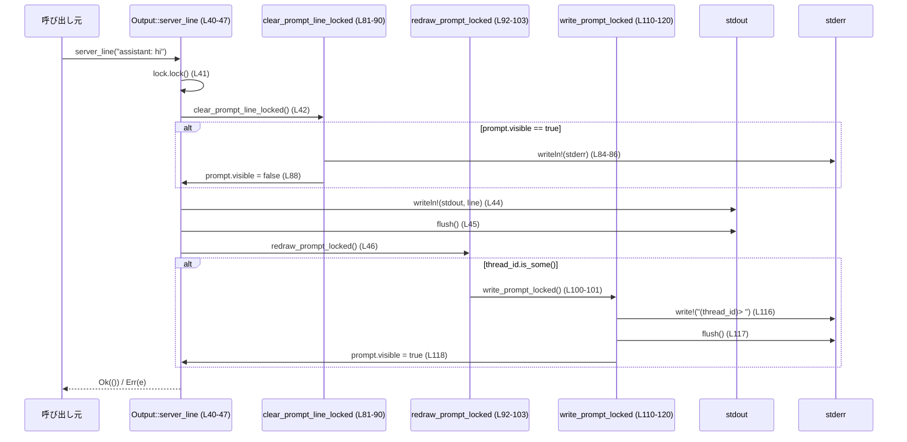

debug-client/src/output.rs

---

## 0. ざっくり一言

標準出力・標準エラーへの行出力と、「スレッドID付きプロンプト」の表示・状態管理、および色付きラベル文字列の生成を行う、スレッドセーフな出力管理モジュールです（`debug-client/src/output.rs:L22-27, L29-120`）。

---

## 1. このモジュールの役割

### 1.1 概要

- このモジュールは **端末向けの出力を一元管理するため** に存在し、以下の機能を提供します。
  - サーバー側メッセージを標準出力に 1 行ずつ出力（`server_line`）（L40-47）
  - クライアント側メッセージを標準エラーに 1 行ずつ出力（`client_line`）（L49-55）
  - 「(thread_id)> 」形式のプロンプト表示と、その表示状態管理（`prompt`, 内部状態）（L17-20, L57-61, L81-90, L110-120）
  - ラベル文字列に ANSI カラーコードを付加する補助機能（`format_label`）（L68-79）

### 1.2 アーキテクチャ内での位置づけ

このファイル単体からは呼び出し元モジュールはわかりませんが、`Output` が **上位の CLI / クライアントロジックから呼ばれ、標準出力・標準エラーと環境変数に依存** する構造になっています（L22-27, L30-38, L40-55）。

```mermaid
graph TD
    Caller["呼び出し元（不明）"]
    Output["Output 構造体 (L22-27)"]
    LabelColor["LabelColor 列挙体 (L8-14)"]
    PromptState["PromptState 構造体 (L16-20, 非公開)"]
    Stdout["std::io::stdout (L32, L43-45)"]
    Stderr["std::io::stderr (L32, L52-54, L85-87, L115-117)"]
    Env["std::env::var_os(\"NO_COLOR\") (L31)"]

    Caller -->|行出力/プロンプト操作| Output
    Output -->|プロンプト状態| PromptState
    Output -->|ラベル色指定| LabelColor
    Output -->|行出力| Stdout
    Output -->|行出力 & プロンプト| Stderr
    Output -->|色出力可否判定| Env
```

※ 他の自作モジュールやファイルへの `use` はこのチャンクには出現しないため、不明です。

### 1.3 設計上のポイント

コードから読み取れる設計上の特徴は次のとおりです。

- **責務の分割**
  - 列挙体 `LabelColor`: ラベルの論理的な「色種別」のみを表現（L8-14）。
  - 構造体 `PromptState`: 現在のスレッドIDとプロンプト表示状態のみを保持する内部状態（L16-20）。
  - 構造体 `Output`: ロック、プロンプト状態、カラー可否フラグをまとめ、外部 API を一手に提供（L22-27, L29-120）。

- **スレッドセーフな出力制御**
  - 出力全体を直列化するための `lock: Arc<Mutex<()>>`（L24）。  
    これにより `server_line`, `client_line`, `prompt`, `set_prompt` の呼び出しは排他的に実行され、行の混在を防ぎます（L40-66）。
  - プロンプト状態用に別の `prompt: Arc<Mutex<PromptState>>` を利用（L25, L81-90, L110-120）。
  - いずれの Mutex 取得も `expect("… lock poisoned")` で処理され、**ポイズン発生時には panic** する方針です（L41, L50, L58, L64, L82, L95, L106, L111）。

- **色出力の判定**
  - `NO_COLOR` 環境変数が設定されている場合は強制的に無色（L31）。
  - さらに `stdout` と `stderr` の両方が端末（TTY）かどうかを `IsTerminal` で確認し、端末でない場合も無色（L32）。
  - 上記条件を満たすときだけ `color: true` となり、`format_label` が ANSI カラーコードを付与します（L26, L68-79）。

- **エラーハンドリング**
  - 出力系の公開メソッド `server_line`, `client_line`, `prompt` は `io::Result<()>` を返し、I/O エラーを呼び出し元に伝播します（L40, L49, L57）。
  - `format_label` や `set_prompt` は I/O を行わず、エラーを返しません（L63-66, L68-79）。

- **潜在的なバグ・セキュリティ・制約に関する事実**
  - Mutex ポイズン時に `expect` で即座に panic するため、一度パニックが発生しロックがポイズンされると、それ以降の出力呼び出しはクラッシュします（L41, L50, L58, L64, L82, L95, L106, L111）。
  - 行出力は都度 `flush()` するため、対話性は高い一方で高頻度出力ではオーバーヘッドが増えます（L45, L54, L87, L117）。
  - ユーザーが渡す `line` や `thread_id` に含まれるエスケープシーケンスはそのまま端末に出力されるため、「制御シーケンス注入」を防ぐ検証は行いません。これはログ表示用途では通常の挙動ですが、セキュリティ要件によっては注意が必要です（L40, L49, L57, L110-117）。

---

## 2. 主要な機能一覧

- サーバー行出力: `server_line` で標準出力に 1 行出力し、その後プロンプトを再描画します（L40-47）。
- クライアント行出力: `client_line` で標準エラーに 1 行出力します（L49-55）。
- プロンプト表示: `prompt` で `thread_id` を設定し、「(thread_id)> 」というプロンプトを標準エラーに表示します（L57-61, L110-120）。
- プロンプト状態の更新のみ: `set_prompt` で `thread_id` だけ変更し、表示は行わずに次回のプロンプトに備えます（L63-66, L105-107）。
- カラーラベル整形: `format_label` で `LabelColor` に応じた ANSI カラーコードを付与します（L68-79）。
- プロンプト行の「消去」: `clear_prompt_line_locked` で、プロンプトが表示中なら改行を出力し、visible フラグを下げます（L81-90）。
- プロンプト再描画: `redraw_prompt_locked` で `thread_id` が設定されている場合のみプロンプトを再度表示します（L92-103）。

### 2.1 コンポーネントインベントリー（型・関数一覧）

| 名前 | 種別 | 公開 | 定義位置 | 役割（概要） |
|------|------|------|----------|--------------|
| `LabelColor` | enum | `pub` | `output.rs:L8-14` | ラベル表示に使う論理的な色種別 |
| `PromptState` | struct | 非公開 | `output.rs:L16-20` | 現在の `thread_id` とプロンプト表示状態を保持 |
| `Output` | struct | `pub` | `output.rs:L22-27` | 出力ロック・プロンプト状態・カラー設定をまとめたフロントエンド |

メソッド・関数の一覧:

| メソッド名 | 所属型 | 公開 | 定義位置 | 役割（1 行） |
|------------|--------|------|----------|--------------|
| `new()` | `Output` | `pub` | `output.rs:L30-38` | `Output` の初期化と色出力可否の判定 |
| `server_line(&self, &str)` | `Output` | `pub` | `output.rs:L40-47` | サーバー行を stdout に出力し、プロンプトを再描画 |
| `client_line(&self, &str)` | `Output` | `pub` | `output.rs:L49-55` | クライアント行を stderr に出力 |
| `prompt(&self, &str)` | `Output` | `pub` | `output.rs:L57-61` | `thread_id` を設定してプロンプトを表示 |
| `set_prompt(&self, &str)` | `Output` | `Output` | `output.rs:L63-66` | `thread_id` だけ更新し、表示は行わない |
| `format_label(&self, &str, LabelColor)` | `Output` | `pub` | `output.rs:L68-79` | ラベル文字列に ANSI カラーコードを付加 |
| `clear_prompt_line_locked(&self)` | `Output` | 非公開 | `output.rs:L81-90` | visible なプロンプト行を 1 行改行して見かけ上消す |
| `redraw_prompt_locked(&self)` | `Output` | 非公開 | `output.rs:L92-103` | `thread_id` があればプロンプトを再描画 |
| `set_prompt_locked(&self, &str)` | `Output` | 非公開 | `output.rs:L105-108` | `PromptState.thread_id` を更新 |
| `write_prompt_locked(&self)` | `Output` | 非公開 | `output.rs:L110-120` | プロンプトを stderr に表示し、visible を更新 |

---

## 3. 公開 API と詳細解説

### 3.1 型一覧（構造体・列挙体など）

| 名前 | 種別 | 公開 | 定義位置 | 役割 / 用途 |
|------|------|------|----------|-------------|
| `LabelColor` | 列挙体 | `pub` | `output.rs:L8-14` | ラベルの種別（Assistant, Tool, ToolMeta, Thread）を表現し、`format_label` でカラーコードに変換する際に使います。 |
| `PromptState` | 構造体 | 非公開 | `output.rs:L16-20` | `thread_id: Option<String>` と `visible: bool` を持ち、現在のプロンプトの「対象スレッド」と「表示有無」を表現します。 |
| `Output` | 構造体 | `pub` | `output.rs:L22-27` | 出力ロック・プロンプト状態・カラー有効フラグを保持し、クライアントが利用する出力関連のメソッドを提供します。`#[derive(Clone, Debug)]` のためクローンおよびデバッグ出力が可能です。 |

### 3.2 関数詳細（7 件）

#### `Output::new() -> Self`  （L30-38）

**概要**

- `Output` のインスタンスを初期化します。  
  環境変数 `NO_COLOR` と標準出力/標準エラーが端末かどうかをチェックし、色出力を有効にするかどうかを決定します（L31-32）。

**引数**

- なし

**戻り値**

- `Output`（構造体）
  - `lock`: 新しい `Arc<Mutex<()>>`（L34）
  - `prompt`: `PromptState::default()` を内包する `Arc<Mutex<PromptState>>`（L35）
  - `color`: 色出力の有効/無効（L31-32, L36）

**内部処理の流れ**

1. `std::env::var_os("NO_COLOR")` を取得し、存在するかどうかを判定して `no_color` に格納します（L31）。
2. `io::stdout().is_terminal()` および `io::stderr().is_terminal()` で両方が端末かどうかを判定します（L32）。
3. `color` は「NO_COLOR が *未* 設定」かつ「stdout と stderr が端末」のときだけ `true` になります（L31-32）。
4. `lock` と `prompt` に新しい `Arc<Mutex<...>>` を作成し、上記 `color` とともに `Self { ... }` で返します（L33-37）。

**Examples（使用例）**

```rust
// 実際のクレートパスはこのチャンクからは不明なため仮のものです。
use debug_client::output::Output; // 仮のパス

fn main() {
    // Output を初期化する
    let out = Output::new(); // 環境と端末情報から color フラグが決まる
    // 以降、out.server_line(...) などを呼び出せる
}
```

**Errors / Panics**

- `Result` を返さないため、I/O エラーは発生しません。
- この関数内では Mutex をロックしていないため、`expect` 起因の panic もありません。
- メモリ確保に失敗した場合など、Rust ランタイムレベルの panic 可能性は一般論として存在しますが、コードから直接は確認できません。

**Edge cases（エッジケース）**

- `NO_COLOR` が設定されている場合: `color` は必ず `false` になります（L31-32）。
- `stdout` か `stderr` のどちらか一方でも端末でない場合: `color` は `false` になります（L32）。
- 環境変数や端末状態の変化は **インスタンス生成後には反映されません**。`color` は `new` 呼び出し時に固定されます（L30-37）。

**使用上の注意点**

- 色設定を変更したい場合は、新しい `Output` を作り直す必要があります。
- 非対話環境（ログファイルなど）では `color` は `false` になるため、`format_label` の戻り値はプレーンテキストになります。

---

#### `Output::server_line(&self, line: &str) -> io::Result<()>`  （L40-47）

**概要**

- サーバーからのメッセージ行を標準出力に出力します（L43-45）。  
  出力前にプロンプト行を「消去」し、出力後に必要ならプロンプトを再描画します（L42, L46）。

**引数**

| 引数名 | 型 | 説明 |
|--------|----|------|
| `self` | `&Output` | 共有参照。内部の Mutex 経由で排他的に操作します。 |
| `line` | `&str` | 出力したい 1 行分の文字列（改行は関数内部で付与されます）。 |

**戻り値**

- `io::Result<()>`  
  - `Ok(())`: すべての I/O 操作が成功した場合。
  - `Err(e)`: いずれかの `writeln!` / `flush` / `clear_prompt_line_locked` / `redraw_prompt_locked` でエラーが発生した場合。

**内部処理の流れ**

1. `self.lock.lock()` で出力全体の Mutex を取得し、`_guard` に保持します（L41）。  
   - これにより、このスコープの間は他スレッドから `server_line` / `client_line` / `prompt` / `set_prompt` が並行実行されません。
2. `self.clear_prompt_line_locked()?` を呼び、プロンプトが表示されていれば 1 行改行して `visible` を `false` にします（L42, L81-90）。
3. `io::stdout()` を取得し（L43）、`writeln!(stdout, "{line}")?` で `line` を 1 行出力します（L44）。
4. `stdout.flush()?` で標準出力をフラッシュします（L45）。
5. `self.redraw_prompt_locked()` を呼び、`thread_id` が設定されていればプロンプトを再描画します（L46, L92-103）。
6. 最終的な `io::Result<()>` は `self.redraw_prompt_locked()` が返したものです（L46）。

**Examples（使用例）**

```rust
use std::io;
use debug_client::output::Output; // 仮のパス

fn main() -> io::Result<()> {
    let out = Output::new();

    // スレッドIDを設定してプロンプトを表示
    out.prompt("thread-1")?;

    // サーバーからの応答を出力
    out.server_line("assistant: hello")?; // プロンプトを一度消し、行を表示後に再度プロンプトを表示

    Ok(())
}
```

**Errors / Panics**

- `Err(io::Error)` が返り得る箇所:
  - `clear_prompt_line_locked()` 内の `writeln!` または `flush` が失敗した場合（L84-87）。
  - `writeln!(stdout, "{line}")`（L44）。
  - `stdout.flush()`（L45）。
  - `write_prompt_locked()` 内の `write!` または `flush` が失敗した場合（L115-117）。
- Panic 条件:
  - `self.lock.lock()` が `PoisonError` を返した場合、`expect("output lock poisoned")` により panic します（L41）。
  - `clear_prompt_line_locked`, `redraw_prompt_locked`, `write_prompt_locked` 内での `prompt` のロックでも同様に panic します（L82, L95, L106, L111）。

**Edge cases（エッジケース）**

- まだ一度も `prompt` / `set_prompt` が呼ばれておらず `thread_id` が `None` の場合:
  - `clear_prompt_line_locked` は単に `visible == false` のため何もしません（L83-89）。
  - `redraw_prompt_locked` の `thread_id.is_some()` 判定が `false` となり、プロンプトは描画されません（L93-100）。
- `line` が空文字列の場合でも、空行として出力されます（`writeln!` の仕様, L44）。
- 非 TTY 環境でも行出力は行われます（TTY 判定は `new` の `color` 判定にのみ利用, L30-38）。

**使用上の注意点**

- `io::Result<()>` を無視すると I/O エラーが握りつぶされます。呼び出し側で `?` または `match` によるハンドリングが必要です。
- 高頻度で呼び出すと、毎回 `flush()` されるため性能に影響が出る可能性があります（L45）。
- 出力順序を守りたい場合は、すべて同一の `Output` インスタンス（またはそのクローン）を共有し、新しい `Output::new()` をスレッドごとに作成しないことが望ましいです。`new` は新しい `lock` / `prompt` を作るため、インスタンス間では同期されません（L30-37）。

---

#### `Output::client_line(&self, line: &str) -> io::Result<()>`  （L49-55）

**概要**

- クライアント側のメッセージ行を標準エラーに出力します（L52-54）。  
  `server_line` 同様、出力前に現在のプロンプトを「消去」しますが、出力後にプロンプト再描画は行いません（L51）。

**引数**

| 引数名 | 型 | 説明 |
|--------|----|------|
| `self` | `&Output` | 出力制御オブジェクトの共有参照。 |
| `line` | `&str` | 出力する 1 行分の文字列。 |

**戻り値**

- `io::Result<()>`  
  - `Ok(())`: 書き込みおよびフラッシュが成功した場合。
  - `Err(e)`: `clear_prompt_line_locked` または `writeln!` / `flush` でエラーが発生した場合。

**内部処理の流れ**

1. `self.lock.lock()` で排他ロックを取得します（L50）。
2. `self.clear_prompt_line_locked()?` を呼び、必要ならプロンプト行を改行で押し下げます（L51, L81-90）。
3. `io::stderr()` を取得し（L52）、`writeln!(stderr, "{line}")?` で 1 行出力します（L53）。
4. `stderr.flush()` を呼び、結果の `io::Result<()>` をそのまま返します（L54-55）。

**Examples（使用例）**

```rust
use std::io;
use debug_client::output::Output; // 仮のパス

fn main() -> io::Result<()> {
    let out = Output::new();

    out.prompt("thread-1")?;
    out.client_line("you: hello")?; // 入力エコーなどに利用できる

    Ok(())
}
```

**Errors / Panics**

- `Err(io::Error)`:
  - `clear_prompt_line_locked` 内の書き込み・フラッシュが失敗した場合（L84-87）。
  - `writeln!(stderr, "{line}")`（L53）。
  - `stderr.flush()`（L54）。
- Panic 条件:
  - `self.lock.lock()` のポイズン（L50）。
  - `clear_prompt_line_locked` 内の `prompt` ロックのポイズン（L82）。

**Edge cases（エッジケース）**

- `prompt` が表示されていない場合（`PromptState.visible == false`）は、`clear_prompt_line_locked` は何も出力しません（L83-89）。
- 連続して `client_line` を呼んだ場合、各行は改行付きで stderr に積み上がります（L53）。
- `server_line` と違い、プロンプトを自動で再描画しないため、対話的なプロンプト表示が必要な場合は別途 `prompt` や `server_line` を呼ぶ必要があります。

**使用上の注意点**

- 標準エラーに出力する設計になっているため、ログの取り方やリダイレクト設定に注意が必要です（L52-54）。
- `server_line` と同様、`Output` インスタンスを共有しないと行の混在防止機能（`lock`）が効きません（L24, L30-37）。

---

#### `Output::prompt(&self, thread_id: &str) -> io::Result<()>`  （L57-61）

**概要**

- 指定された `thread_id` を現在のプロンプト対象として設定し、「(thread_id)> 」形式のプロンプトを標準エラーに表示します（L59-60, L110-120）。

**引数**

| 引数名 | 型 | 説明 |
|--------|----|------|
| `self` | `&Output` | 出力制御オブジェクト。 |
| `thread_id` | `&str` | プロンプトに表示するスレッド ID。 |

**戻り値**

- `io::Result<()>`  
  - `Ok(())`: `set_prompt_locked` と `write_prompt_locked` の両方が成功した場合。
  - `Err(e)`: `write_prompt_locked` 内の I/O でエラーが発生した場合。

**内部処理の流れ**

1. `self.lock.lock()` で排他ロックを取得します（L58）。
2. `self.set_prompt_locked(thread_id)` で `PromptState.thread_id` に `Some(thread_id.to_string())` を格納します（L59, L105-107）。
3. `self.write_prompt_locked()` を呼び、プロンプトを実際に stderr に出力します（L60, L110-120）。
4. `write_prompt_locked` の戻り値（`io::Result<()>`）をそのまま返します（L60）。

**Examples（使用例）**

```rust
use std::io;
use debug_client::output::Output; // 仮のパス

fn main() -> io::Result<()> {
    let out = Output::new();

    // スレッドID "t-42" 用のプロンプトを表示
    out.prompt("t-42")?; // -> "(t-42)> " が stderr に表示される

    Ok(())
}
```

**Errors / Panics**

- `Err(io::Error)`:
  - `write_prompt_locked()` 内の `write!` または `flush` が失敗した場合（L115-117）。
- Panic:
  - `self.lock.lock()` ポイズン（L58）。
  - `set_prompt_locked` / `write_prompt_locked` 内での `prompt` ロックポイズン（L106, L111）。

**Edge cases（エッジケース）**

- `thread_id` が空文字列 `""` の場合: プロンプトは `"()> "` となります（L112-117）。
- すでに他の `thread_id` が設定済みの場合: `thread_id` が上書きされ、新しい ID のプロンプトが表示されます（L105-107）。
- `write_prompt_locked` は `thread_id` が `None` のとき `Ok(())` を返すだけですが、`prompt` の直前で必ず `Some` に設定しているため、この経路は通常通りません（L112-115）。

**使用上の注意点**

- スレッド切り替え時にプロンプト ID を変更する用途が想定されますが、実際の呼び出し方はこのチャンクからは不明です。
- プロンプトを表示した後でサーバー・クライアント行を出力すると、`server_line` / `client_line` がプロンプトを一旦消してから再度描画します（L42, L51, L92-103, L110-120）。

---

#### `Output::set_prompt(&self, thread_id: &str)`  （L63-66）

**概要**

- `prompt` と同様に `thread_id` を設定しますが、プロンプトを表示しません（L63-66）。  
  「次回プロンプト表示時に使う ID だけ更新したい」場合に使われます。

**引数**

| 引数名 | 型 | 説明 |
|--------|----|------|
| `self` | `&Output` | 出力制御オブジェクト。 |
| `thread_id` | `&str` | 新しいスレッド ID。 |

**戻り値**

- なし（`()`）

**内部処理の流れ**

1. `self.lock.lock()` で排他ロックを取得します（L64）。
2. `self.set_prompt_locked(thread_id)` を呼び、`PromptState.thread_id` を更新します（L65, L105-107）。
3. 何も出力せずに関数を終了します（L63-66）。

**Examples（使用例）**

```rust
use std::io;
use debug_client::output::Output; // 仮のパス

fn run() -> io::Result<()> {
    let out = Output::new();

    // まずは thread-1 を表示
    out.prompt("thread-1")?;

    // 内部的なスレッドIDだけ切り替え、表示は次の server_line 時に任せる
    out.set_prompt("thread-2");

    // 次の server_line で thread-2 のプロンプトが再描画される
    out.server_line("assistant: switched thread")?;

    Ok(())
}
```

**Errors / Panics**

- I/O を行わないため `io::Error` は発生しません。
- Panic:
  - `self.lock.lock()` がポイズンされていると panic（L64）。
  - `set_prompt_locked` 内の `prompt` ロックがポイズンされた場合も panic（L106）。

**Edge cases（エッジケース）**

- まだ一度もプロンプトが表示されていなくても `thread_id` が設定されます（L105-107）。  
  この状態で `server_line` などが呼ばれ、`redraw_prompt_locked` がプロンプトを描画します（L92-103）。

**使用上の注意点**

- 見た目には何も起こらないため、デバッグ時には「いつ `thread_id` が変わったか」が分かりにくい可能性があります。
- マルチスレッドで異なる `Output` インスタンスを使っている場合、他インスタンスのプロンプトには影響しません（L30-37）。

---

#### `Output::format_label(&self, label: &str, color: LabelColor) -> String`  （L68-79）

**概要**

- `label` に対して、`Output` の `color` フラグと `color` 引数(`LabelColor`)に応じて ANSI カラーコードを付加した文字列を返します（L68-79）。
- 色出力が無効な場合は元の文字列をそのまま返します（L69-71）。

**引数**

| 引数名 | 型 | 説明 |
|--------|----|------|
| `self` | `&Output` | カラー出力可否フラグを参照します。 |
| `label` | `&str` | 装飾したいラベル文字列。 |
| `color` | `LabelColor` | ラベルの論理的な色種別。 |

**戻り値**

- `String`  
  - 色出力が有効 (`self.color == true`) かつ端末の場合: ANSI エスケープシーケンス付きの文字列（例: `"\x1b[32massistant\x1b[0m"`）。
  - 無効の場合: `label.to_string()`。

**内部処理の流れ**

1. `if !self.color { return label.to_string(); }` で色出力が無効な場合の早期リターンを行います（L68-71）。
2. `match color` で `LabelColor` を `"32"`, `"36"`, `"33"`, `"34"` のいずれかのカラーコード文字列に変換します（L73-77）。
3. `format!("\x1b[{code}m{label}\x1b[0m")` で前後に ANSI エスケープシーケンスを付与して返します（L78）。

**Examples（使用例）**

```rust
use debug_client::output::{Output, LabelColor}; // 仮のパス

fn main() {
    let out = Output::new();

    let assistant = out.format_label("assistant", LabelColor::Assistant);
    let tool = out.format_label("tool", LabelColor::Tool);

    // 端末かつ NO_COLOR が未設定なら色付き、それ以外はプレーン
    eprintln!("{assistant}: hello");
    eprintln!("{tool}: some tool output");
}
```

**Errors / Panics**

- I/O を行わないため `io::Error` は返しません。
- パニックを起こす可能性のある操作（`unwrap` など）は内部にありません。

**Edge cases（エッジケース）**

- `label` が空の場合: ANSI コードだけが付加された空文字列が返ります（L73-78）。
- `label` 自体に ANSI コードや制御文字が含まれていても、そのまま中に埋め込まれます（L78）。二重にエスケープされることはありません。
- `Output::new` の条件により `self.color == false` のときは一切エスケープシーケンスを付与しません（L30-37, L68-71）。

**使用上の注意点**

- `LabelColor` に含まれない色を使いたい場合は、列挙体を拡張する必要があります（L8-14, L73-77）。
- 端末以外の出力（ファイル・ログ収集システムなど）でも `NO_COLOR` が未設定なら `color == false` にはならない点に注意が必要です。色を完全禁止したい場合は `NO_COLOR` を設定する運用が前提とされています（L31-32, L68-71）。

---

#### `Output::write_prompt_locked(&self) -> io::Result<()>`  （L110-120）

※ 非公開メソッドですが、プロンプト描画のコア処理のため詳細を記載します。

**概要**

- `PromptState.thread_id` が `Some` の場合に、「(thread_id)> 」形式のプロンプトを標準エラーに書き込み、`visible` を `true` にします（L110-120）。

**引数**

| 引数名 | 型 | 説明 |
|--------|----|------|
| `self` | `&Output` | 内部の `PromptState` にアクセスします。 |

**戻り値**

- `io::Result<()>`  
  - `Ok(())`: プロンプトの書き込みとフラッシュ成功。
  - `Err(e)`: `write!` または `flush` で I/O エラーが発生した場合。

**内部処理の流れ**

1. `self.prompt.lock()` で `PromptState` 用の Mutex を取得し、`prompt` 変数に束縛します（L111）。
2. `let Some(thread_id) = prompt.thread_id.as_ref() else { return Ok(()); };` で `thread_id` が `None` の場合は何もせずに `Ok(())` を返します（L112-115）。
3. `io::stderr()` を取得し（L115）、`write!(stderr, "({thread_id})> ")?` でプロンプトを出力します（L116）。
4. `stderr.flush()?` でフラッシュします（L117）。
5. `prompt.visible = true;` としてプロンプトが表示中であることを記録し、`Ok(())` を返します（L118-120）。

**Examples（使用例）**

※ 非公開メソッドのため直接呼び出すことはできません。  
`prompt` や `server_line` から内部的に利用されます（L46, L60, L92-103）。

**Errors / Panics**

- `Err(io::Error)`:
  - `write!` または `flush` の失敗（L116-117）。
- Panic:
  - `self.prompt.lock()` がポイズンされている場合、`expect("prompt lock poisoned")` で panic（L111）。  
    呼び出し側の公開メソッド（`prompt` / `server_line` など）から伝播します（L41, L50, L58, L64, L82, L95, L106, L111）。

**Edge cases（エッジケース）**

- まだ一度も `thread_id` が設定されていない場合（`PromptState::default()` のまま）: `thread_id` は `None` であり、何も表示せずに `Ok(())` を返します（L112-115）。
- 直前に `clear_prompt_line_locked` で `visible` が `false` にされていても、この関数で再度 `true` になります（L81-90, L118）。

**使用上の注意点**

- 呼び出す前に必ず `thread_id` を設定しておく必要があります。公開 API では `prompt` と `set_prompt` がその役割を担います（L57-61, L63-66, L105-107）。
- 出力先が標準エラーに固定されているため、プロンプトを標準出力に出したい要件には合致しません。

---

### 3.3 その他の関数

公開 API から間接的に利用される補助メソッドです。

| 関数名 | 所属 | 定義位置 | 役割（1 行） |
|--------|------|----------|--------------|
| `clear_prompt_line_locked(&self) -> io::Result<()>` | `Output` | `output.rs:L81-90` | `PromptState.visible` が `true` のときに改行を出力して visible を `false` にし、プロンプト行を1行下に押し下げる。 |
| `redraw_prompt_locked(&self) -> io::Result<()>` | `Output` | `output.rs:L92-103` | `PromptState.thread_id` が `Some` の場合に `write_prompt_locked` を呼んでプロンプトを再描画する。 |
| `set_prompt_locked(&self, thread_id: &str)` | `Output` | `output.rs:L105-108` | `PromptState.thread_id` に `Some(thread_id.to_string())` をセットする。 |

---

## 4. データフロー

### 4.1 代表的シナリオ: プロンプト付きサーバー行出力

`prompt` でプロンプトを表示した後、`server_line` を呼び出してサーバー行を出力し、プロンプトを再描画する一連の流れを示します。



**要点**

- `lock` により `server_line` 全体が排他制御されるため、他スレッドの `client_line` / `prompt` などと行が混ざることを防いでいます（L24, L41-46）。
- プロンプトは一度改行で押し下げられた後、サーバー行が出力され、その後同じ `thread_id` を用いて再描画されます（L81-90, L92-103, L110-120）。
- エラーは途中の任意の I/O 操作から `io::Result<()>` として呼び出し元に伝播します（L40-47）。

---

## 5. 使い方（How to Use）

### 5.1 基本的な使用方法

このファイル単体からは正確なクレートパスは分かりませんが、`Output` を用いた典型的な利用フローは次のようになります（例は仮のモジュールパスです）。

```rust
use std::io;
// 仮のパス: 実際のクレート構成はこのチャンクからは不明です
use debug_client::output::{Output, LabelColor};

fn main() -> io::Result<()> {
    // 出力管理オブジェクトを作成
    let out = Output::new(); // output.rs:L30-38

    // スレッドIDを設定してプロンプトを表示
    out.prompt("thread-1")?; // "(thread-1)> " が stderr に表示 (L57-61, L110-120)

    // クライアント入力をエコーする
    out.client_line("you: hello")?; // stderr に行出力 (L49-55)

    // サーバー応答を出力し、プロンプトを再描画
    out.server_line("assistant: hi")?; // stdout 出力 + プロンプト再描画 (L40-47)

    // ラベルを色付きで整形
    let label = out.format_label("assistant", LabelColor::Assistant); // L68-79
    eprintln!("{label}: another message");

    Ok(())
}
```

### 5.2 よくある使用パターン

1. **単一スレッドの対話的クライアント**

   - `Output::new()` で 1 つのインスタンスを作成（L30-38）。
   - 入力待ちの前に `prompt(thread_id)` を呼び、ユーザー入力後に `client_line` / `server_line` を交互に呼ぶ。

2. **マルチスレッドでの共有**

   `Output` は `#[derive(Clone)]` であり、内部に `Arc<Mutex<...>>` を持つため、クローンを複数スレッドで共有する設計になっています（L22-27）。

```rust
use std::{io, thread};
use debug_client::output::Output; // 仮のパス

fn main() -> io::Result<()> {
    let out = Output::new();
    let out1 = out.clone(); // lock / prompt を共有 (L22-27)
    let out2 = out.clone();

    let t1 = thread::spawn(move || {
        out1.server_line("thread1: hello").unwrap();
    });

    let t2 = thread::spawn(move || {
        out2.server_line("thread2: world").unwrap();
    });

    t1.join().unwrap();
    t2.join().unwrap();
    Ok(())
}
```

- どちらのスレッドも同じ `lock` を共有するため、行出力は直列化されます（L24, L41-46）。

### 5.3 よくある間違い

**例 1: スレッドごとに `Output::new()` してしまう**

```rust
// 誤りの可能性が高い例
use std::{io, thread};
use debug_client::output::Output; // 仮のパス

fn main() -> io::Result<()> {
    let t1 = thread::spawn(|| {
        let out = Output::new();              // lock がスレッド専用 (L30-37)
        out.server_line("thread1").unwrap();
    });

    let t2 = thread::spawn(|| {
        let out = Output::new();              // 別の lock を持つ別インスタンス
        out.server_line("thread2").unwrap();
    });

    t1.join().unwrap();
    t2.join().unwrap();
    Ok(())
}
```

- この場合、`lock` が共有されないため、行出力が混ざる可能性があります（L24, L30-37）。

**正しいパターン（共有する）**

```rust
// 望ましいパターンの一例
let out = Output::new();
let out1 = out.clone();
let out2 = out.clone();
// 上記 5.2 の例と同様
```

**例 2: `io::Result` を無視する**

```rust
// 誤りの例: エラーが無視される
let out = Output::new();
out.server_line("msg"); // Result を無視

// 正しい例: ? で伝播する
fn run(out: &Output) -> std::io::Result<()> {
    out.server_line("msg")?;
    Ok(())
}
```

### 5.4 使用上の注意点（まとめ）

- **エラー処理**
  - `server_line`, `client_line`, `prompt` は `io::Result<()>` を返すため、`?` や `match` で必ず処理する必要があります（L40, L49, L57）。
- **スレッドセーフ性**
  - `Output` インスタンス間では `lock` / `prompt` が共有されないため、行出力の直列化を期待する場合は *同じインスタンスのクローン* を共有する必要があります（L22-27, L30-37）。
- **パフォーマンス**
  - すべての行出力で `flush()` を呼んでいるため、高頻度なログ用途ではオーバーヘッドとなり得ます（L45, L54, L87, L117）。
- **プロンプト管理**
  - `PromptState.thread_id` を `None` に戻すメソッドは存在せず、一度設定した ID は上書きされるだけです（L16-20, L57-61, L63-66, L105-107）。
- **観測性（ログ・トレース）**
  - ログフレームワークやトレース出力は使っておらず、すべて裸の `stdout` / `stderr` への書き込みです（L43-45, L52-54, L85-87, L115-117）。

---

## 6. 変更の仕方（How to Modify）

### 6.1 新しい機能を追加する場合

1. **ラベル種別を増やしたい場合**
   - `LabelColor` に新しいバリアントを追加します（L8-14）。
   - `format_label` 内の `match color` に対応する `"XX"` コードを追加します（L73-77）。
   - 追加した色を使う呼び出し側コードを実装します（このチャンクには出現しません）。

2. **プロンプト形式を変えたい場合**
   - `write_prompt_locked` の `write!(stderr, "({thread_id})> ")` 部分を変更します（L116）。
   - たとえば `"[{thread_id}] "` のような形式に変更可能です。
   - `clear_prompt_line_locked` と連携して `visible` フラグの扱いが変わらないよう注意します（L81-90, L118）。

3. **プロンプトの非表示機能を追加したい場合**
   - `PromptState` に「無効化フラグ」などのフィールドを追加し（L16-20）、`redraw_prompt_locked` や `write_prompt_locked` で考慮するように変更します（L92-103, L110-120）。
   - 新しい公開メソッド `hide_prompt` などを `impl Output` に追加し、そのフラグを操作します（L29-120）。

### 6.2 既存の機能を変更する場合の注意点

- **影響範囲の確認**
  - 出力ロジックを変更する際は、`server_line`, `client_line`, `prompt`, `set_prompt` のすべてで `lock` と `prompt` の一貫した利用が保たれているか確認します（L40-66, L81-90, L92-103, L105-120）。
  - `PromptState.visible` の更新箇所は `clear_prompt_line_locked` と `write_prompt_locked` の 2 か所のみであることに注意します（L88, L118）。

- **契約（前提条件・返り値）の維持**
  - 公開メソッドの戻り値型 (`io::Result<()>` / `String`) を変えると、呼び出し側のコンパイルエラーになります。インターフェース変更は慎重に行う必要があります（L40, L49, L57, L68）。
  - `server_line` が「プロンプトを再描画する」契約を暗黙に持っているため、この挙動を変える場合は上位レイヤーの UI 仕様も含めて見直す必要があります（L46, L92-103, L110-120）。

- **テストと使用箇所の確認**
  - このファイルにはテストコードが存在しないため（`output.rs:L1-120` に `#[cfg(test)]` 等は見当たりません）、変更後は別ファイルのテストや手動検証が必要です。

---

## 7. 関連ファイル

このチャンクには他の自作モジュールやファイルを示す `use` が存在しないため、直接の関連ファイルは特定できません。

| パス | 役割 / 関係 |
|------|------------|
| 不明 | このファイルからは、`Output` がどのモジュールから呼ばれているか、どのような CLI/クライアント構成に組み込まれているかは分かりません。 |

標準ライブラリとの関係（参考）:

- `std::io`, `std::io::Write`, `std::io::IsTerminal`: 出力ストリーム操作と端末判定に利用（L2-4, L32, L43-45, L52-54, L84-87, L115-117）。
- `std::sync::Arc`, `std::sync::Mutex`: スレッドセーフな共有状態管理に利用（L5-6, L22-27, L81-82, L95-96, L106, L111）。
- `std::env::var_os`: `NO_COLOR` 環境変数の取得に利用（L31）。
