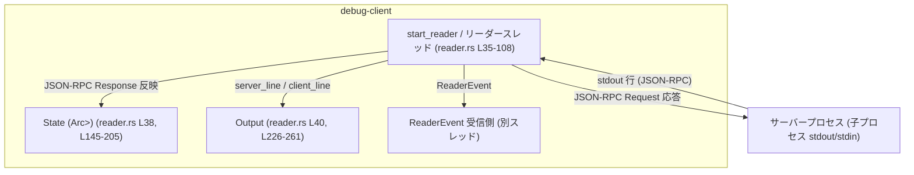
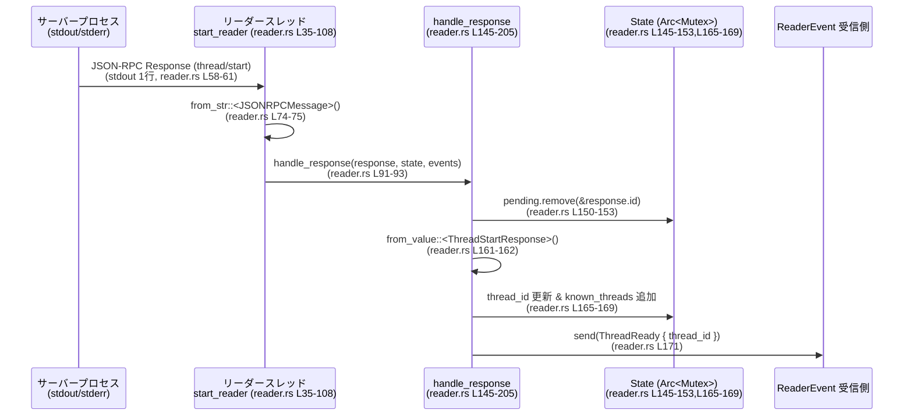

# debug-client/src/reader.rs コード解説

## 0. ざっくり一言

このモジュールは、**サーバープロセスの標準出力から JSON-RPC メッセージを読み取り、クライアント内部状態を更新したり、必要に応じてサーバーへ応答を書き戻す「リーダースレッド」**を実装しています（`reader.rs:L35-108`）。  
また、フィルタ付き表示モードでは、サーバーからのスレッド項目通知を見やすいテキストに整形して出力します（`reader.rs:L210-302`）。

---

## 1. このモジュールの役割

### 1.1 概要

- サーバープロセス（子プロセス）の **stdout を 1 行ごとに読み取り**、JSON としてパースします（`reader.rs:L35-75`）。
- メッセージ種別（Request / Response / Notification）に応じて:
  - 自動承認レスポンスをサーバー stdin に返す（`handle_server_request` / `send_response`、`reader.rs:L110-143,L317-337`）。
  - クライアント内部の `State` を更新し、`ReaderEvent` をイベントチャネルへ送信する（`handle_response`、`reader.rs:L145-205`）。
  - `filtered_output` モード時にスレッド項目を整形して出力する（`handle_filtered_notification` / `emit_filtered_item`、`reader.rs:L210-224,L226-302`）。

### 1.2 アーキテクチャ内での位置づけ

このモジュールは、**子プロセスで動作するアプリケーションサーバー**と、クライアント内部の状態管理・UI（標準出力）との間の橋渡しをします。



- `start_reader` が専用スレッドを生成し、子プロセスの stdout を監視します（`reader.rs:L35-44`）。
- `State` は `Arc<Mutex<State>>` として共有され、レスポンスに応じてスレッド ID や既知スレッド一覧を更新します（`reader.rs:L145-205`）。
- `ReaderEvent` は `Sender<ReaderEvent>` 経由で他スレッドに通知されます（`reader.rs:L39,L145-148,L171,L184,L199-203`）。
- `Output` はクライアント向けのログ／メッセージ表示の抽象化です（`reader.rs:L40,L64-72,L87-88,L93-94,L100-101,L226-302,L304-313`）。

### 1.3 設計上のポイント

- **専用スレッドによる非同期 I/O**
  - `thread::spawn` でリーダースレッドを起動し、子プロセス stdout のブロッキング読み取りをメインスレッドから切り離しています（`reader.rs:L35-44`）。
- **共有状態の排他制御**
  - `State` と `stdin` はどちらも `Arc<Mutex<...>>` で共有され、アクセス時にロックを取得します（`reader.rs:L37-38,L145-153,L165-169,L178-183,L191-196,L317-333`）。
- **エラーハンドリング方針**
  - I/O やパース等のエラーは `anyhow::Result` でラップし、リーダースレッド側では `Result` を受け取ってメッセージを `Output` に出力した上でループ継続または終了します（`reader.rs:L64-66,L80-89,L91-95,L97-103`）。
  - `Mutex` が poison された場合は `expect("... lock poisoned")` により panic します（`reader.rs:L151,L165,L178,L191,L331`）。
- **JSON-RPC プロトコルとの結合**
  - `codex_app_server_protocol` の `JSONRPCMessage` / `ServerRequest` / 各種レスポンス型を使い、プロトコルに沿ったメッセージ処理を行っています（`reader.rs:L12-25,L110-143,L145-205,L210-224,L226-302,L317-326`）。
- **フィルタリング表示モード**
  - `filtered_output` フラグにより、「サーバーから来た生の JSON 行をそのまま出すモード」と「ThreadItem ベースで整形した行だけを出すモード」を切り替えます（`reader.rs:L41-42,L69-72,L96-103`）。

---

## 2. 主要な機能一覧

- リーダースレッド起動: 子プロセス stdout 監視とメッセージ分配（`start_reader`、`reader.rs:L35-108`）
- サーバーからの承認リクエストの自動応答: コマンド実行／ファイル変更承認を Accept/Decline で返す（`handle_server_request`、`reader.rs:L110-143`）
- JSON-RPC Response の処理と内部状態更新: `PendingRequest` の種類に応じて `State` と `ReaderEvent` を更新（`handle_response`、`reader.rs:L145-205`）
- 通知のフィルタ処理: `ItemCompleted` 通知を `ThreadItem` ごとに整形表示（`handle_filtered_notification`/`emit_filtered_item`、`reader.rs:L210-224,L226-302`）
- 複数行テキストの整形出力: スレッドラベル付きで行ごとに出力（`write_multiline`、`reader.rs:L304-315`）
- JSON-RPC レスポンスの送信: 任意のレスポンスペイロードを JSON 化し、子プロセス stdin に書き込む（`send_response`、`reader.rs:L317-337`）

---

## 3. 公開 API と詳細解説

### 3.1 型一覧（構造体・列挙体など）

このファイル内で **定義** されている新しい型（構造体・列挙体）はありません。  
ただし、他モジュールで定義された重要な型を参照しています。

| 名前 | 種別 | 定義場所（推定） | 役割 / 用途 | 根拠 |
|------|------|------------------|-------------|------|
| `State` | 構造体 | `crate::state` | ペンディングリクエストやスレッド ID・既知スレッド一覧を保持する状態オブジェクト。`Arc<Mutex<State>>` で共有される。 | `reader.rs:L31-33,L38,L145-153,L165-169,L178-183,L191-196` |
| `PendingRequest` | 列挙体 | `crate::state` | サーバーへ送信したリクエストの種類（Start/Resume/List）を識別するために `State::pending` に保存される。 | `reader.rs:L31,L145-153,L159-205` |
| `ReaderEvent` | 列挙体 | `crate::state` | リーダースレッドから他スレッドへ通知するイベント（ThreadReady, ThreadList）を表す。 | `reader.rs:L32,L39,L171,L184,L199-203` |
| `Output` | 構造体 | `crate::output` | `server_line` / `client_line` などのメソッドで、クライアント側にメッセージを表示する。 | `reader.rs:L29-30,L40,L64-72,L87-88,L93-94,L100-101,L226-302,L304-313` |
| `LabelColor` | 列挙体 | `crate::output` | ラベルの色分け種別（Thread / Assistant / Tool / ToolMeta） | `reader.rs:L29,L227,L230,L234,L245,L250,L254,L266,L272,L281,L286,L290,L294` |
| `ThreadItem` | 列挙体 | `codex_app_server_protocol` | スレッド内のアイテム（AgentMessage, Plan, CommandExecution, FileChange, McpToolCall 等） | `reader.rs:L22,L226-302` |

### 3.2 関数詳細

#### `pub fn start_reader(stdout, stdin, state, events, output, auto_approve, filtered_output) -> JoinHandle<()>`

```rust
pub fn start_reader(
    mut stdout: BufReader<ChildStdout>,
    stdin: Arc<Mutex<Option<std::process::ChildStdin>>>,
    state: Arc<Mutex<State>>,
    events: Sender<ReaderEvent>,
    output: Output,
    auto_approve: bool,
    filtered_output: bool,
) -> JoinHandle<()>  // reader.rs:L35-43
```

**概要**

- サーバープロセスの `stdout` を監視する **専用スレッド** を起動し、受信した JSON-RPC メッセージを処理します（`reader.rs:L35-44,L58-106`）。
- `auto_approve` に応じて、コマンド実行／ファイル変更承認リクエストに自動で Accept/Decline を返します（`reader.rs:L45-54,L110-143`）。
- `filtered_output` に応じて、通知の生出力と整形出力を切り替えます（`reader.rs:L41-42,L69-72,L96-103`）。

**引数**

| 引数名 | 型 | 説明 |
|--------|----|------|
| `stdout` | `BufReader<ChildStdout>` | サーバー子プロセスの stdout をラップしたバッファ付きリーダー。行単位で読み取る（`reader.rs:L35-37,L58-61`）。 |
| `stdin` | `Arc<Mutex<Option<std::process::ChildStdin>>>` | サーバー子プロセスの stdin。JSON-RPC レスポンスなどを書き込むために利用（`reader.rs:L37,L80-85,L317-337`）。 |
| `state` | `Arc<Mutex<State>>` | クライアント内部状態。レスポンスに応じてスレッド ID 等が更新される（`reader.rs:L38,L145-153,L165-183,L191-196`）。 |
| `events` | `Sender<ReaderEvent>` | リーダースレッドから他スレッドへ通知を送るチャネル送信側（`reader.rs:L39,L145-149,L171,L184,L199-203`）。 |
| `output` | `Output` | ログやサーバーメッセージを表示するための出力インターフェース（`reader.rs:L40,L64-72,L87-88,L93-94,L100-101,L226-302,L304-313`）。 |
| `auto_approve` | `bool` | `true` の場合、サーバーからの承認リクエストに自動で Accept を返すフラグ（`reader.rs:L41-42,L45-54,L110-143`）。 |
| `filtered_output` | `bool` | `true` の場合は ThreadItem ベースの整形表示のみ行い、生の JSON 行は出力しない（`reader.rs:L41-42,L69-72,L96-103`）。 |

**戻り値**

- `JoinHandle<()>`  
  起動したリーダースレッドを表すハンドルです。呼び出し側で `join` したり、放置したりできます（`reader.rs:L35-44,L107-108`）。

**内部処理の流れ**

1. `auto_approve` に応じて `command_decision` と `file_decision` を Accept/Decline に設定（`reader.rs:L45-54`）。
2. `buffer: String` を用意し、無限ループで `stdout.read_line(&mut buffer)` を繰り返す（`reader.rs:L56-61`）。
3. 読み取り結果に応じて:
   - `Ok(0)`: EOF とみなしてループ終了（`reader.rs:L60-61`）。
   - `Err(err)`: エラーメッセージを `output.client_line` に出力し、ループ終了（`reader.rs:L63-66`）。
4. 行末の `\n` / `\r` を取り除き、空行でなく `filtered_output == false` の場合にそのまま `output.server_line` に出力（`reader.rs:L69-72`）。
5. `serde_json::from_str::<JSONRPCMessage>(line)` で JSON-RPC メッセージにパースできなければ、その行は無視して次のループへ（`reader.rs:L74-75`）。
6. `JSONRPCMessage` のバリアントに応じて分配（`reader.rs:L78-105`）:
   - `Request`: `handle_server_request` を呼ぶ。エラー時は `client_line` にログ（`reader.rs:L79-89`）。
   - `Response`: `handle_response` を呼ぶ。エラー時は `client_line` にログ（`reader.rs:L91-95`）。
   - `Notification`: `filtered_output == true` の場合のみ `handle_filtered_notification` を呼び、エラー時は `client_line` にログ（`reader.rs:L96-103`）。
   - その他: 何もしない（`reader.rs:L104-105`）。

**Examples（使用例）**

サーバープロセスを `std::process::Command` で起動し、その stdout/stdin を使って `start_reader` を呼び出す想定例です。

```rust
use std::process::{Command, Stdio};
use std::io::BufReader;
use std::sync::{Arc, Mutex};
use std::sync::mpsc::channel;

use debug_client::state::{State, ReaderEvent};
use debug_client::output::Output;
use debug_client::reader::start_reader;

fn main() -> anyhow::Result<()> {
    // 子プロセスを起動し、stdin/stdout をパイプにする
    let mut child = Command::new("codex-app-server")
        .stdin(Stdio::piped())
        .stdout(Stdio::piped())
        .spawn()?;

    let stdout = child.stdout.take().expect("stdout is piped");
    let stdin = child.stdin.take().expect("stdin is piped");

    let stdout = BufReader::new(stdout);                       // reader.rs:L35-37 に対応
    let stdin = Arc::new(Mutex::new(Some(stdin)));             // reader.rs:L37, L317-333 に対応

    let state = Arc::new(Mutex::new(State::default()));
    let (tx, rx) = channel::<ReaderEvent>();
    let output = Output::new(std::io::stdout());

    // auto_approve = true で自動承認、filtered_output = true で整形出力モード
    let handle = start_reader(stdout, stdin.clone(), state.clone(), tx, output, true, true);

    // 別スレッドで rx を処理する、など…
    // handle.join().unwrap(); // 必要であれば join

    Ok(())
}
```

**Errors / Panics**

- `stdout.read_line` がエラーを返した場合  
  - エラー内容を `client_line` に出力し、リーダースレッドのループを終了します（`reader.rs:L63-66`）。
- `handle_server_request` / `handle_response` / `handle_filtered_notification` が `Err` を返した場合  
  - それぞれのエラー内容を `client_line` に出力しますが、リーダースレッドのループ自体は継続します（`reader.rs:L80-89,L91-95,L97-103`）。
- Panic の可能性
  - `Output` のメソッドや `State` アクセス自体はこの関数内では直接ロックしませんが、渡される `Arc<Mutex<...>>` が他箇所で poison されると、ロック取得箇所で panic する可能性があります（`reader.rs:L151,L165,L178,L191,L331`）。

**Edge cases（エッジケース）**

- 子プロセスが何も出力しないまま終了した場合  
  - `read_line` が `Ok(0)` を返し、静かにリーダースレッドが終了します（`reader.rs:L60-61`）。
- JSON でない行 / JSON-RPC 仕様に合わない行  
  - `from_str::<JSONRPCMessage>` が失敗し、その行は無視されます（`reader.rs:L74-75`）。  
    `filtered_output == false` の場合は、その行がすでに生出力されている可能性があります（`reader.rs:L69-72`）。
- `filtered_output == true` の場合  
  - 生の JSON 行は出力されず（`reader.rs:L69-72`）、`JSONRPCMessage::Notification` のうち `ItemCompleted` に対応するものだけが整形表示されます（`reader.rs:L96-103,L210-224,L226-302`）。

**使用上の注意点**

- `stdout` / `stdin` は **パイプ** である必要があります（`BufReader<ChildStdout>` / `ChildStdin` を前提とするため）。
- `State` / `stdin` を含む `Arc<Mutex<...>>` を他スレッドで扱う際、panic によるロック poison が起こると、このモジュールの `expect("... lock poisoned")` に到達し panic につながります（`reader.rs:L151,L165,L178,L191,L331`）。
- `start_reader` は無限ループで stdout を読み続けるため、子プロセスの終了条件と整合を取る必要があります（`reader.rs:L58-61`）。

---

#### `fn handle_server_request(request, command_decision, file_decision, stdin, output) -> anyhow::Result<()>`

**概要**

- サーバーからの JSON-RPC Request を `ServerRequest` にデコードし、  
  **コマンド実行／ファイル変更の承認要求** に対して自動応答を返します（`reader.rs:L110-143`）。

**引数**

| 引数名 | 型 | 説明 |
|--------|----|------|
| `request` | `JSONRPCRequest` | 生の JSON-RPC Request メッセージ（`reader.rs:L110-111`）。 |
| `command_decision` | `&CommandExecutionApprovalDecision` | コマンド実行承認の決定（Accept / Decline）（`reader.rs:L112,L45-49`）。 |
| `file_decision` | `&FileChangeApprovalDecision` | ファイル変更承認の決定（Accept / Decline）（`reader.rs:L113,L50-54`）。 |
| `stdin` | `&Arc<Mutex<Option<ChildStdin>>>` | レスポンスを書き込む子プロセス stdin（`reader.rs:L114`）。 |
| `output` | `&Output` | 自動応答内容をクライアントに表示するための出力（`reader.rs:L115,L127-129,L136-138`）。 |

**戻り値**

- `anyhow::Result<()>`  
  `ServerRequest` への変換、レスポンスシリアライズ／送信、ログ出力などの途中で発生しうるエラーをラップします。

**内部処理の流れ**

1. `ServerRequest::try_from(request)` でプロトコル固有のリクエスト型に変換。失敗した場合は何もせず `Ok(())` を返す（`reader.rs:L117-120`）。
2. `match server_request` でバリアントごとに処理（`reader.rs:L122-141`）:
   - `CommandExecutionRequestApproval { request_id, params }`
     - `CommandExecutionRequestApprovalResponse { decision: command_decision.clone() }` を作成（`reader.rs:L123-126`）。
     - 自動応答内容を `output.client_line` で表示（`reader.rs:L127-129`）。
     - `send_response(stdin, request_id, response)` で JSON-RPC Response をサーバーに返す（`reader.rs:L130`）。
   - `FileChangeRequestApproval { request_id, params }`
     - `FileChangeRequestApprovalResponse { decision: file_decision.clone() }` を作成（`reader.rs:L132-135`）。
     - 自動応答内容を表示（`reader.rs:L136-138`）。
     - `send_response(stdin, request_id, response)` を呼ぶ（`reader.rs:L139`）。
   - その他のリクエストは無視（`reader.rs:L141`）。

**Errors / Panics**

- `ServerRequest::try_from` 失敗  
  - 例外ではなく、そのまま `Ok(())` を返します（`reader.rs:L117-120`）。
- `output.client_line` が `Err` を返した場合、または `send_response` 内部でエラーが発生した場合  
  - それぞれ `anyhow::Error` として呼び出し元（`start_reader`）に伝播します（`reader.rs:L127-130,L136-139`）。
- `send_response` 内のロック取得で panic する可能性は別途記載（`reader.rs:L331`）。

**Edge cases**

- サーバー側からこの関数が扱わない種類のリクエストが来た場合  
  - `ServerRequest::_` 分岐で `Ok(())` を返し、何もしません（`reader.rs:L141`）。
- `stdin` がすでに `None`（閉じられている）場合  
  - `send_response` 側で `"stdin already closed"` エラーとなり、結果として `Err` が返ります（`reader.rs:L331-334`）。

**使用上の注意点**

- `command_decision` / `file_decision` は、`start_reader` の `auto_approve` に応じて決定され、ここではそれを単に利用しています（`reader.rs:L45-54,L112-113`）。
- 新しい種類のサーバーリクエストを自動処理したい場合は、この関数の `match server_request` にケースを追加することになります（`reader.rs:L122-141`）。

---

#### `fn handle_response(response, state, events) -> anyhow::Result<()>`

**概要**

- JSON-RPC Response を `State` 内の `pending` マップから照合し、  
  `PendingRequest` の種類に応じて `State` と `ReaderEvent` を更新します（`reader.rs:L145-205`）。

**引数**

| 引数名 | 型 | 説明 |
|--------|----|------|
| `response` | `JSONRPCResponse` | サーバーから返ってきた JSON-RPC Response（`reader.rs:L145-146`）。 |
| `state` | `&Arc<Mutex<State>>` | ペンディングリクエストとスレッド情報を管理する状態（`reader.rs:L147`）。 |
| `events` | `&Sender<ReaderEvent>` | 状態更新に基づくイベント通知先（`reader.rs:L148`）。 |

**戻り値**

- `anyhow::Result<()>`  
  JSON デコードやロック取得などで発生しうるエラーをラップします。

**内部処理の流れ**

1. `state.pending.remove(&response.id)` で対応する `PendingRequest` を取り出し、同時に `pending` から削除（`reader.rs:L150-153`）。
   - ロックは一時的なブロックに閉じ込めて早期に解放しています（`reader.rs:L150-153`）。
2. 対応する `PendingRequest` が存在しない場合は、そのレスポンスは無視して `Ok(())` を返す（`reader.rs:L155-157`）。
3. `match pending` で種類ごとに処理（`reader.rs:L159-205`）:
   - `PendingRequest::Start`
     - `response.result` を `ThreadStartResponse` にデコード（`reader.rs:L161-162`）。
     - `thread_id = parsed.thread.id` を取得（`reader.rs:L163`）。
     - 再度 `state` をロックし、`state.thread_id` を設定し、`known_threads` に存在しなければ追加（`reader.rs:L165-169`）。
     - `ReaderEvent::ThreadReady { thread_id }` を送信（`reader.rs:L171`）。
   - `PendingRequest::Resume`
     - `ThreadResumeResponse` としてデコード、それ以降は Start と同様（`reader.rs:L174-185`）。
   - `PendingRequest::List`
     - `ThreadListResponse` としてデコード（`reader.rs:L187-188`）。
     - `parsed.data` から `thread_ids: Vec<String>` を生成（`reader.rs:L189`）。
     - `state.known_threads` に新しい ID を追加（`reader.rs:L191-196`）。
     - `ReaderEvent::ThreadList { thread_ids, next_cursor }` を送信（`reader.rs:L198-203`）。

**Errors / Panics**

- JSON デコード失敗
  - `serde_json::from_value::<...>(response.result)` が失敗すると `anyhow::Error` を返します（`reader.rs:L161-162,L174-175,L187-188`）。
- `state.lock().expect("state lock poisoned")` の `expect` により、ロックが poison されていると panic します（`reader.rs:L151,L165,L178,L191`）。
- `events.send(...)` の結果は `.ok()` で無視されており、受信側がクローズしていてもエラーを表面化させません（`reader.rs:L171,L184,L199-203`）。

**Edge cases**

- 予期しない `response.id`（`pending` に存在しない ID）  
  - そのレスポンスは単に無視されます（`reader.rs:L155-157`）。
- 同じ `thread_id` がすでに `known_threads` に存在する場合  
  - 重複チェックを行っており、追加されません（`reader.rs:L167-169,L192-196`）。

**使用上の注意点**

- `state.pending` 側でリクエストの種類を正しく登録しておくことが前提です。このファイル単体からは登録側のコードは見えません（「このチャンクには現れない」）。
- 新しい種類のペンディングリクエストを追加する場合は、`PendingRequest` のバリアントと、この `match` にケースを追加する必要があります（`reader.rs:L159-205`）。

---

#### `fn handle_filtered_notification(notification, output) -> anyhow::Result<()>`

**概要**

- JSON-RPC Notification を `ServerNotification` に変換し、  
  `ItemCompleted` 通知に対して `emit_filtered_item` を呼び出して整形表示します（`reader.rs:L210-224`）。

**引数**

| 引数名 | 型 | 説明 |
|--------|----|------|
| `notification` | `JSONRPCNotification` | サーバーからの通知メッセージ（`reader.rs:L211`）。 |
| `output` | `&Output` | 整形されたメッセージを表示するための出力（`reader.rs:L212`）。 |

**戻り値**

- `anyhow::Result<()>`

**内部処理の流れ**

1. `ServerNotification::try_from(notification)` を試みる。失敗時は何もせず `Ok(())` を返す（`reader.rs:L214-216`）。
2. `match server_notification`:
   - `ServerNotification::ItemCompleted(payload)` の場合  
     `emit_filtered_item(payload.item, &payload.thread_id, output)` を呼び出す（`reader.rs:L219-221`）。
   - その他の通知は無視（`reader.rs:L222-223`）。

**使用上の注意点**

- 実際には `start_reader` 側で `filtered_output == true` のときにのみ呼び出されます（`reader.rs:L96-103`）。
- `ItemCompleted` 以外の通知は、このモジュールではフィルタ表示を提供しません（`reader.rs:L218-223`）。

---

#### `fn emit_filtered_item(item: ThreadItem, thread_id: &str, output: &Output) -> anyhow::Result<()>`

**概要**

- `ThreadItem` の内容に応じて、**スレッドラベル付きの人間向けメッセージ**を `Output` に出力します（`reader.rs:L226-302`）。
- Plan やコマンド実行結果など、一部の項目については複数行の詳細出力を行います。

**引数**

| 引数名 | 型 | 説明 |
|--------|----|------|
| `item` | `ThreadItem` | スレッド内の 1 つの項目（メッセージやツール実行など）（`reader.rs:L226-227,L229-299`）。 |
| `thread_id` | `&str` | この項目が属するスレッドの ID（`reader.rs:L226-227`）。 |
| `output` | `&Output` | 行を出力するためのインターフェース（`reader.rs:L226-227,L231-236,L246-252,L254-261,L267-270,L282-295,L304-313`）。 |

**戻り値**

- `anyhow::Result<()>`

**内部処理の流れ**

1. `thread_label = output.format_label(thread_id, LabelColor::Thread)` でスレッドラベルを作成（`reader.rs:L227`）。
2. `match item` でバリアントごとに処理（`reader.rs:L228-299`）:
   - `AgentMessage { text, .. }`
     - `"assistant"` ラベルを付けて 1 行表示（`reader.rs:L229-232`）。
   - `Plan { text, .. }`
     - `"plan"` で 1 行目を表示（`reader.rs:L233-235`）。
     - `write_multiline` で Plan の本文を複数行表示（`reader.rs:L236-237`）。
   - `CommandExecution { command, status, exit_code, aggregated_output, .. }`
     - コマンドとステータスを 1 行表示（`reader.rs:L238-248`）。
     - `exit_code` があれば `"tool exit"` ラベルで表示（`reader.rs:L249-252`）。
     - `aggregated_output` があれば `"tool output"` ラベルで複数行表示（`reader.rs:L253-261`）。
   - `FileChange { changes, status, .. }`
     - ステータスとファイル数を 1 行表示（`reader.rs:L263-270`）。
   - `McpToolCall { server, tool, status, arguments, result, error, .. }`
     - `server.tool (status)` を 1 行表示（`reader.rs:L272-284`）。
     - `arguments` が非 `null` なら `"tool args"` ラベルで出力（`reader.rs:L285-288`）。
     - `result` が `Some` なら `"tool result"` ラベルで出力（`reader.rs:L289-292`）。
     - `error` が `Some` なら `"tool error"` ラベルで出力（`reader.rs:L293-296`）。
   - その他のバリアントは無視（`reader.rs:L298-299`）。

**使用上の注意点**

- 各バリアントで `Output::server_line` が複数回呼ばれるため、出力先が遅い場合は全体のレスポンスに影響する可能性があります（`reader.rs:L231-236,L246-252,L254-261,L267-270,L287-295,L304-313`）。
- ここで扱っていない `ThreadItem` のバリアントは、表示されません（`reader.rs:L298-299`）。

---

#### `fn write_multiline(output, thread_label, header, text) -> anyhow::Result<()>`

**概要**

- 指定した `header` 行と、その後に `text` の各行をインデント付きで出力します（`reader.rs:L304-315`）。
- Plan やツール出力の複数行表示に使われます（`reader.rs:L236-237,L254-261`）。

**引数**

| 引数名 | 型 | 説明 |
|--------|----|------|
| `output` | `&Output` | 出力インターフェース。`server_line` を呼び出します（`reader.rs:L305,L310-312`）。 |
| `thread_label` | `&str` | 先頭に付与するスレッドラベル文字列（`reader.rs:L306,L310-312`）。 |
| `header` | `&str` | 最初の行で表示するヘッダ（例: `"assistant:"`, `"tool output:"`）（`reader.rs:L307,L310`）。 |
| `text` | `&str` | `lines()` で分割して出力する複数行テキスト（`reader.rs:L308,L311-312`）。 |

**内部処理の流れ**

1. `"{thread_label} {header}"` を 1 行出力（`reader.rs:L310`）。
2. `for line in text.lines()` で各行を `"   "` インデント付きで出力（`reader.rs:L311-312`）。

---

#### `fn send_response<T: Serialize>(stdin, request_id, response) -> anyhow::Result<()>`

**概要**

- 任意のレスポンスペイロードを JSON にシリアライズし、  
  `JSONRPCResponse` として子プロセスの stdin に 1 行書き込みます（`reader.rs:L317-337`）。

**引数**

| 引数名 | 型 | 説明 |
|--------|----|------|
| `stdin` | `&Arc<Mutex<Option<ChildStdin>>>` | 書き込み先となる子プロセス stdin（`reader.rs:L318,L331-333`）。 |
| `request_id` | `codex_app_server_protocol::RequestId` | 対応するリクエスト ID（`reader.rs:L319,L323-325`）。 |
| `response` | `T: Serialize` | `serde::Serialize` トレイトを実装したレスポンスボディ（`reader.rs:L320,L322`）。 |

**戻り値**

- `anyhow::Result<()>`

**内部処理の流れ**

1. `serde_json::to_value(response)` で `serde_json::Value` に変換（`reader.rs:L322`）。
2. `JSONRPCResponse { id: request_id, result }` を構築（`reader.rs:L323-326`）。
3. `serde_json::to_string(&message)` で JSON 文字列にシリアライズし、末尾に `'\n'` を追加（`reader.rs:L327-329`）。
4. `stdin.lock().expect("stdin lock poisoned")` でロックし、`Option` から `ChildStdin` を取り出す（`reader.rs:L331-333`）。
   - `None` の場合は `"stdin already closed"` で `bail!`（`reader.rs:L333-334`）。
5. `write_all` と `flush` で書き込みとフラッシュを行う（`reader.rs:L335-336`）。

**Errors / Panics**

- シリアライズエラー: `to_value` / `to_string` でエラーが発生すると、それぞれ `"serialize response"` / `"serialize response message"` というコンテキスト付きの `anyhow::Error` になります（`reader.rs:L322,L327`）。
- I/O エラー: `write_all` / `flush` が失敗すると `"write response"` / `"flush response"` として `anyhow::Error` を返します（`reader.rs:L335-336`）。
- `stdin` ロックの `expect("stdin lock poisoned")` により、ロックが poison されていると panic（`reader.rs:L331`）。
- `stdin` が `None` の場合: `"stdin already closed"` で `anyhow::bail!` が呼ばれ `Err` が返ります（`reader.rs:L333-334`）。

**使用上の注意点**

- `stdin` の所有権は `Arc<Mutex<Option<ChildStdin>>>` で共有されています。どこかで `take()` して `None` にすると、以降の `send_response` はエラーになります（`reader.rs:L331-334`）。
- 一度に送るメッセージは 1 行の JSON 文字列であり、サーバー側は行単位でパースする前提です（`reader.rs:L327-329`）。

---

### 3.3 その他の関数一覧

上記以外に、補助的な関数はありません。このファイルの全関数は上で説明済みです。

---

## 4. データフロー

### 4.1 代表的な処理シナリオ：thread/start レスポンス処理

ここでは、サーバーが `thread/start` のレスポンスを返したときに、  
**リーダースレッドから `State` 更新と `ReaderEvent::ThreadReady` 通知が行われる流れ**を示します。



要点:

- `start_reader` のループで Response が検出されると `handle_response` に委譲されます（`reader.rs:L91-93`）。
- `handle_response` は `state.pending` をキーにレスポンスの種類を特定し、対応する `*Response` 型へデコードします（`reader.rs:L150-153,L159-175`）。
- `State` の更新後に、対応する `ReaderEvent` がイベントチャネル経由で送信されます（`reader.rs:L171,L184,L199-203`）。

---

## 5. 使い方（How to Use）

### 5.1 基本的な使用方法

典型的には、**子プロセス（サーバー）起動 → `start_reader` でリーダースレッド起動 → `ReaderEvent` を別スレッドで処理**という構成になります。

```rust
use std::process::{Command, Stdio};
use std::io::BufReader;
use std::sync::{Arc, Mutex};
use std::sync::mpsc::channel;

use debug_client::reader::start_reader;
use debug_client::state::{State, ReaderEvent};
use debug_client::output::Output;

fn main() -> anyhow::Result<()> {
    // サーバー子プロセスを起動
    let mut child = Command::new("codex-app-server")
        .stdin(Stdio::piped())
        .stdout(Stdio::piped())
        .spawn()?;

    // stdout/stdin を取り出してラップ
    let stdout = child.stdout.take().expect("stdout piped");
    let stdin = child.stdin.take().expect("stdin piped");

    let stdout = BufReader::new(stdout);                        // reader.rs:L35-37
    let stdin = Arc::new(Mutex::new(Some(stdin)));              // reader.rs:L37,L318-333

    // 状態とイベントチャネル
    let state = Arc::new(Mutex::new(State::default()));
    let (tx, rx) = channel::<ReaderEvent>();

    let output = Output::new(std::io::stdout());

    // リーダースレッド起動
    let reader_handle = start_reader(
        stdout,
        stdin.clone(),
        state.clone(),
        tx,
        output,
        /*auto_approve=*/ true,
        /*filtered_output=*/ true,
    );

    // 別スレッドなどで rx を処理
    std::thread::spawn(move || {
        while let Ok(event) = rx.recv() {
            match event {
                ReaderEvent::ThreadReady { thread_id } => {
                    println!("thread ready: {thread_id}");
                }
                ReaderEvent::ThreadList { thread_ids, next_cursor } => {
                    println!("threads: {:?}, cursor: {:?}", thread_ids, next_cursor);
                }
                // 他のイベントバリアントもここで処理…
            }
        }
    });

    // 必要であれば join
    // reader_handle.join().unwrap();
    Ok(())
}
```

### 5.2 よくある使用パターン

1. **開発時に自動承認したい場合**

   - `auto_approve = true` にすると、コマンド実行／ファイル変更の承認ダイアログを挟まずに自動承認します（`reader.rs:L45-54,L110-143`）。
   - セキュリティ上の理由で本番では `false` にする、という運用も考えられます（運用ポリシーで判断）。

2. **ログ量を抑えたい場合**

   - `filtered_output = true` にすると、サーバーからの生の JSON-RPC 行は表示せず、  
     `ThreadItem` ベースの整形された出力だけが表示されます（`reader.rs:L69-72,L96-103,L210-224,L226-302`）。
   - 問題解析時には `false` にして、すべての JSON 行をそのまま見えるようにすることもできます。

### 5.3 よくある間違い

```rust
// 間違い例: stdin を先に drop してしまう
let stdin = Arc::new(Mutex::new(Some(child.stdin.take().unwrap())));
// ...
drop(stdin); // どこかで早期に drop してしまう
// その後、サーバーから承認リクエストが来ると send_response が "stdin already closed" エラーに

// 正しい例: stdin を必要なスコープ全体で保持する
let stdin = Arc::new(Mutex::new(Some(child.stdin.take().unwrap())));
let reader_handle = start_reader(
    stdout,
    stdin.clone(),  // Arc を clone して共有
    state.clone(),
    tx,
    output,
    true,
    true,
);
// stdin は Arc 経由で必要な限り保持される
```

```rust
// 間違い例: State を Arc<Mutex> で渡していない
let state = State::default();
let reader_handle = start_reader(
    stdout,
    stdin,
    state, // 型が合わない
    tx,
    output,
    true,
    true,
);

// 正しい例
let state = Arc::new(Mutex::new(State::default()));
let reader_handle = start_reader(
    stdout,
    stdin,
    state.clone(),
    tx,
    output,
    true,
    true,
);
```

### 5.4 使用上の注意点（まとめ）

- **スレッド安全性**
  - `State` と `stdin` は `Arc<Mutex<...>>` で共有されます。  
    Rust の所有権システムによりコンパイル時に競合アクセスは防がれますが、  
    **ロック中に panic** すると他スレッドからのロック取得が `PoisonError` となり、`expect("... lock poisoned")` により panic します（`reader.rs:L151,L165,L178,L191,L331`）。
- **エラー伝播**
  - リーダースレッド内部で `handle_*` 関数のエラーを検知した場合は、`Output::client_line` でログを出力するのみで、原則ループは継続します（`reader.rs:L80-89,L91-95,L97-103`）。
- **イベントロス**
  - `ReaderEvent` の送信失敗（受信側がクローズしているなど）は `.ok()` により無視されるため、  
    呼び出し側でイベントが届かなかった理由を知ることはできません（`reader.rs:L171,L184,L199-203`）。
- **プロトコルの前提**
  - JSON-RPC メッセージの構造や `ServerRequest` / `ServerNotification` の具体的な内容は  
    `codex_app_server_protocol` クレートに依存しており、このファイルではその前提のもとでデコード・処理を行います（`reader.rs:L12-25,L110-143,L145-205,L210-224,L226-302,L317-326`）。

---

## 6. 変更の仕方（How to Modify）

### 6.1 新しい機能を追加する場合

1. **新しいサーバーリクエストの自動処理をしたい場合**
   - `codex_app_server_protocol::ServerRequest` に新バリアントが追加されていることを前提に、  
     `handle_server_request` の `match server_request` に対応する分岐を追加します（`reader.rs:L122-141`）。
   - 必要に応じて `send_response` で返すレスポンス型を定義し、`serde::Serialize` を実装します（`reader.rs:L317-326`）。

2. **新しいペンディングレスポンス種別への対応**
   - `crate::state::PendingRequest` に新バリアントを追加（定義はこのチャンクには現れません）。
   - `handle_response` の `match pending` に新ケースを追加し、`response.result` を適切な型へデコードしたうえで `State` と `ReaderEvent` を更新します（`reader.rs:L159-205`）。

3. **新しい ThreadItem 表示形式の追加**
   - `codex_app_server_protocol::ThreadItem` に新バリアントが追加された場合、  
     `emit_filtered_item` の `match item` に新しい分岐を追加し、`Output` を使って出力レイアウトを定義します（`reader.rs:L228-299`）。

### 6.2 既存の機能を変更する場合

- **影響範囲の確認**
  - `start_reader` のインターフェースを変更する場合は、呼び出し箇所（`main` など）と、この関数が渡している引数を受け取る内部関数との整合を確認します（`reader.rs:L35-44,L79-85,L91-93,L96-99`）。
  - `State` や `ReaderEvent` の構造を変更する場合は、`handle_response` 内の更新箇所・イベント送信箇所のすべてが影響を受けます（`reader.rs:L145-205`）。

- **契約（前提条件・返り値）に関する注意**
  - `handle_server_request` は「未知のリクエストは無視して `Ok(())`」という契約になっているため、  
    全てのリクエストを必ず処理したい場合は、この契約自体を変更する必要があります（`reader.rs:L117-120,L141`）。
  - `handle_response` は `state.pending` に存在しない `response.id` を無視しますが、  
    これをエラーとして扱いたい場合にはロギングなどを追加することになります（`reader.rs:L155-157`）。

- **テストや使用箇所の確認**
  - このファイル内にテストコードは存在しないため（`reader.rs` 内に `#[cfg(test)]` は見当たりません）、  
    変更時には別ファイルのテスト（このチャンクには現れない）や実際の実行パスでの動作確認が必要です。

---

## 7. 関連ファイル

| パス | 役割 / 関係 |
|------|------------|
| `crate::state` | `State`, `PendingRequest`, `ReaderEvent` を定義し、本モジュールの `handle_response` 等から利用されます（`reader.rs:L31-33,L145-205`）。 |
| `crate::output` | `Output` と `LabelColor` を定義し、ログ出力やラベル装飾に利用されます（`reader.rs:L29-30,L40,L64-72,L226-302,L304-313`）。 |
| `codex_app_server_protocol` | JSON-RPC プロトコルメッセージ（`JSONRPCMessage`, `ServerRequest`, `ServerNotification`, `ThreadItem` など）とレスポンス型を提供し、本モジュールの I/O 形式を規定します（`reader.rs:L12-25,L110-143,L145-205,L210-224,L226-302,L317-326`）。 |

---

## Bugs / Security・契約・パフォーマンスの補足（このファイルから読み取れる範囲）

※ 専用の見出しは避けつつ、ポイントのみ整理します。

- **潜在的な panic 条件**
  - `State` / `stdin` の `Mutex` が poison されると、`expect("... lock poisoned")` により panic します（`reader.rs:L151,L165,L178,L191,L331`）。
- **セキュリティ上の前提**
  - `auto_approve = true` の場合、サーバーからのコマンド実行・ファイル変更リクエストを無条件で Accept します（`reader.rs:L45-54,L110-143`）。  
    これは開発用途向けの挙動であり、本番環境で安全かどうかは運用ポリシーに依存します。
- **メッセージロスに関する契約**
  - 未知の `ServerRequest` / `ServerNotification` / `PendingRequest` は静かに無視されます（`reader.rs:L117-120,L141,L218-223,L298-299,L155-157`）。
- **パフォーマンス上の注意**
  - リーダースレッドは 1 行ごとに `serde_json::from_str` を実行するため、サーバーからの出力量が非常に多い場合には CPU 負荷になります（`reader.rs:L74-75`）。
  - `emit_filtered_item` / `write_multiline` は複数行の出力を行うため、大きな `aggregated_output` や `Plan` をそのまま表示するとログが大量になります（`reader.rs:L236-237,L254-261,L304-313`）。

この範囲で、このファイル単体から確認できる情報を整理しました。
