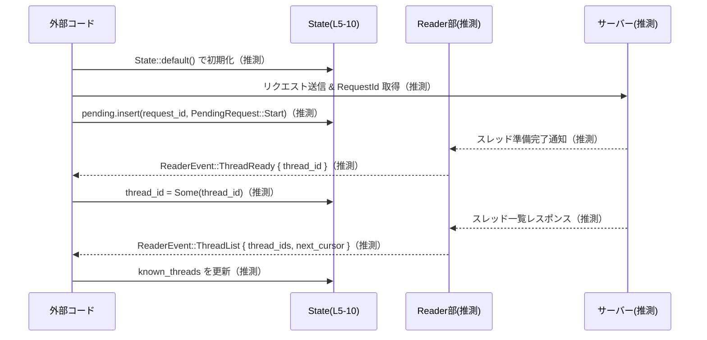

# debug-client/src/state.rs

## 0. ざっくり一言

このファイルは、デバッグクライアント側で使用する「状態」と「イベント」を表すシンプルなデータ型（構造体・列挙体）を定義しています。主にサーバーとの未完了リクエストやスレッド情報を追跡するための土台となる型です（根拠: `debug-client/src/state.rs:L5-10,12-17,19-27`）。

---

## 1. このモジュールの役割

### 1.1 概要

- このモジュールは、サーバーとのやり取りにおける **保留中リクエスト** と **スレッド情報** を管理するための状態表現を提供します（根拠: `State` フィールド定義 `L6-9`）。
- また、スレッドが利用可能になった・スレッド一覧が得られた、といったイベントを表現するための **ReaderEvent** 型を提供します（根拠: `ReaderEvent` のバリアント `L20-27`）。

### 1.2 アーキテクチャ内での位置づけ

このファイル内の依存関係を簡単に図示します。外部との境界として `RequestId` 型（外部クレート）を利用しています。

```mermaid
graph TD
  subgraph "debug-client/src/state.rs (L5-27)"
    State --> PendingRequest
    State --> RequestId
    State --> "String / Vec<String>"
    ReaderEvent --> "String / Vec<String>"
  end

  RequestId["RequestId<br/>(codex_app_server_protocol)"] -.外部型.-> State
```

- `State` は内部状態をまとめる中心的な構造体です（根拠: `L5-10`）。
- `PendingRequest` は `State.pending` の値として利用される列挙体です（根拠: `L7,12-17`）。
- `ReaderEvent` は別系統の情報（読み取り側のイベント）を表す列挙体で、`State` とは直接には参照関係を持ちません（根拠: `L19-27`）。
- `RequestId` は外部クレート `codex_app_server_protocol` からインポートされるリクエスト識別子です（根拠: `L3`）。

### 1.3 設計上のポイント

- **シンプルなデータコンテナ**  
  このファイルにはメソッドや関数がなく、すべて「データを保持するための型」として設計されています（根拠: 型定義のみで関数宣言がないこと `L5-27`）。
- **フィールドがすべて `pub`**  
  `State` のフィールドはすべて `pub` で、外部コードから直接読み書きされる前提になっています（根拠: `L7-9`）。
- **デフォルト値の提供**  
  `State` は `Default` を derive しており、`State::default()` により、空の状態（保留なし・スレッド未選択・既知スレッドなし）を簡単に生成できます（根拠: `#[derive(Debug, Default)] L5`）。
- **コピー可能な軽量フラグ**  
  `PendingRequest` は `Copy` と `Clone` を derive しており、スタック上で軽量にコピー可能なフラグとして扱えるようになっています（根拠: `#[derive(Debug, Clone, Copy, PartialEq, Eq)] L12`）。
- **ログやデバッグ出力を意識**  
  すべての型に `Debug` が derive されているため、`{:?}` で容易にログ出力・デバッグ表示が可能です（根拠: `L5,12,19`）。
- **所有権ベースの安全なデータ保持**  
  `String`, `Vec<String>`, `HashMap` といった標準ライブラリの所有型を使っており、unsafe コードは存在しません。メモリ管理は Rust の所有権システムにより安全に行われます（根拠: `HashMap` の利用 `L1,7` と構造体フィールド `L7-9,21-26`）。

---

## 2. 主要な機能一覧

このファイルはロジックではなくデータ定義のみですが、型ごとの役割を「機能」として整理すると次のようになります。

- 状態保持: `State` により、保留中リクエスト・現在のスレッド ID・既知スレッド一覧を保持する。
- 保留リクエスト種別フラグ: `PendingRequest` により、どの種別の操作が保留されているかを表現する。
- リーダー側イベント表現: `ReaderEvent` により、スレッドの準備完了やスレッド一覧取得などのイベントを表す。

（根拠: `State` `L5-10`, `PendingRequest` `L12-17`, `ReaderEvent` `L19-27`）

---

## 3. 公開 API と詳細解説

### 3.1 型一覧（構造体・列挙体など）

#### コンポーネントインベントリ

| 名前            | 種別       | 主なフィールド / バリアント                                       | 役割 / 用途                                                                 | 根拠 |
|-----------------|------------|--------------------------------------------------------------------|------------------------------------------------------------------------------|------|
| `State`         | 構造体     | `pending: HashMap<RequestId, PendingRequest>`<br>`thread_id: Option<String>`<br>`known_threads: Vec<String>` | 保留中リクエスト・現在のスレッド ID・既知スレッド一覧をまとめて保持する状態オブジェクト | `debug-client/src/state.rs:L5-10` |
| `PendingRequest` | 列挙体    | `Start` / `Resume` / `List`                                       | 保留中リクエストがどの種別の操作か（開始・再開・一覧取得）を表すフラグ     | `debug-client/src/state.rs:L12-17` |
| `ReaderEvent`   | 列挙体     | `ThreadReady { thread_id: String }`<br>`ThreadList { thread_ids: Vec<String>, next_cursor: Option<String> }` | リーダー側で発生するスレッド関連のイベント（準備完了・一覧取得）を表現     | `debug-client/src/state.rs:L19-27` |

#### 各フィールド・バリアントの詳細

- `State.pending: HashMap<RequestId, PendingRequest>`  
  - キー: `RequestId`（外部プロトコルで定義されたリクエスト識別子）（根拠: `L3,7`）。  
  - 値: `PendingRequest`（どの種別のリクエストか）（根拠: `L7,12-17`）。  
  - 想定される用途: 外部コードで、リクエスト送信時に登録し、レスポンス受信時に削除・確認することで、「どのリクエストがまだ完了していないか」を追跡する。
- `State.thread_id: Option<String>`  
  - 現在フォーカスしているスレッド ID など、「現在のスレッド」を表す任意の文字列 ID と思われます（名称からの推測であり、このファイル単体では用途は断定できません）（根拠: `L8`）。
- `State.known_threads: Vec<String>`  
  - 既に把握しているスレッド ID のリストです（根拠: `L9`）。  
  - `ReaderEvent::ThreadList` の `thread_ids` と組み合わせて使われる可能性があります（名称からの推測）（根拠: `L24-25`）。
- `PendingRequest` 各バリアント（根拠: `L12-17`）  
  - `Start`: 新しいスレッド（もしくはセッション）開始を要求中であることを表すフラグ。  
  - `Resume`: 中断したスレッドの再開を要求中であることを表す。  
  - `List`: スレッド一覧取得を要求中であることを表す。  
  ※ 上記の用途は名前からの解釈であり、実際の意味付けはこのファイル外のロジックに依存します。
- `ReaderEvent::ThreadReady { thread_id }`（根拠: `L20-22`）  
  - 指定された `thread_id` のスレッドが「利用可能になった」「接続が準備できた」といったイベントを表していると解釈できます。
- `ReaderEvent::ThreadList { thread_ids, next_cursor }`（根拠: `L24-26`）  
  - スレッド ID のリスト `thread_ids` と、ページングなどに使うと思われる `next_cursor` を含むイベントです。  
  - `next_cursor` が `None` の場合は「続きがない」ことを表す可能性がありますが、これは命名からの推測です。

### 3.2 関数詳細

このファイルには、自由関数・`impl` ブロック・メソッドなどの「関数」は一切定義されていません（根拠: `debug-client/src/state.rs:L1-27` 全体に `fn` 定義がないこと）。

したがって、このセクションで説明すべき公開関数はありません。

### 3.3 その他の関数

- 補助関数やラッパー関数も、このファイル内には存在しません（根拠: `L1-27`）。

---

## 4. データフロー

このファイル単体では処理ロジックが定義されていないため、実際の関数呼び出しフローは不明です。ただし、型の構造から想定される典型的な利用フローを、**推測であることを明示した上で** 図示します。

### 想定される典型的なデータフロー

- 外部コードが `State` を保持し、リクエスト送信時に `State.pending` にエントリを追加する。
- 別スレッドや非同期タスクがサーバーからのレスポンスや通知を読み取り、`ReaderEvent` を生成する。
- 外部コードが `ReaderEvent` を受け取り、`State.thread_id` や `State.known_threads` を更新する。



> 上記のシーケンス図は、型名とフィールド名から推測した利用イメージであり、**実際の実装や呼び出し関係はこのファイルには現れていません**。

---

## 5. 使い方（How to Use）

### 5.1 基本的な使用方法

以下は、`State` と `ReaderEvent` を利用するもっとも基本的なパターンの例です。`RequestId` の具体的な型は外部クレート依存のため、ここでは関数の引数として受け取る形にしています。

```rust
use std::collections::HashMap;                                         // HashMap を使用する
use codex_app_server_protocol::RequestId;                              // 外部クレートの RequestId 型
use debug_client::state::{State, PendingRequest, ReaderEvent};         // このファイルの型をインポート

// State を初期化し、保留中リクエストを登録する例
fn start_request(state: &mut State, request_id: RequestId) {           // State を可変参照で受け取る
    // 新しいリクエストを保留中として登録する
    state.pending.insert(request_id, PendingRequest::Start);           // HashMap に追加（すでに同じIDがあれば上書き）
}

// ReaderEvent を処理して State を更新する例
fn handle_reader_event(state: &mut State, event: ReaderEvent) {        // ReaderEvent を所有権ごと受け取る
    match event {                                                      // パターンマッチでバリアントごとに処理
        ReaderEvent::ThreadReady { thread_id } => {
            // 現在のスレッド ID を更新する
            state.thread_id = Some(thread_id);                         // Option<String> に Some を代入
        }
        ReaderEvent::ThreadList { thread_ids, next_cursor: _ } => {
            // 既知スレッド一覧を置き換える（マージする設計もありうる）
            state.known_threads = thread_ids;                          // Vec<String> をそのまま代入
        }
    }
}
```

このコードは、`State` を中心に「保留中リクエストの登録」と「イベントに応じた状態更新」を行う典型的な使い方の例です。`State` 自体はスレッドセーフなラッパーを含まないため、実際には `Arc<Mutex<State>>` のような形で共有される可能性がありますが、その点はこのファイルからは分かりません。

### 5.2 よくある使用パターン

1. **デフォルト状態からの開始**

```rust
use debug_client::state::State;                                        // State 型をインポート

fn create_initial_state() -> State {                                   // 初期状態を生成する関数
    State::default()                                                   // pending 空, thread_id None, known_threads 空
}
```

- `Default` が derive されているため、`State::default()` で安全に初期化できます（根拠: `L5`）。

1. **保留種別の分岐処理**

```rust
use debug_client::state::PendingRequest;                               // PendingRequest をインポート

fn describe_pending(req: PendingRequest) -> &'static str {             // 保留種別に応じて文字列を返す
    match req {                                                        // コピー可能なので所有権移動の心配なくパターンマッチ可能
        PendingRequest::Start => "start request",
        PendingRequest::Resume => "resume request",
        PendingRequest::List => "list request",
    }
}
```

- `PendingRequest` は `Copy` なので、関数引数やローカル変数として気軽に扱えます（根拠: `L12`）。

1. **スレッド一覧イベントのログ出力**

```rust
use debug_client::state::ReaderEvent;                                  // ReaderEvent をインポート

fn log_reader_event(event: &ReaderEvent) {                             // &ReaderEvent で借用して受け取る
    println!("reader event = {:?}", event);                            // Debug トレイトでデバッグ出力
}
```

- すべての型に `Debug` が derive されているため、`println!("{:?}", ...)` で内容を簡単に観察できます（根拠: `L5,12,19`）。

### 5.3 よくある間違い（推測）

このファイルだけから実際のバグ事例は分かりませんが、型の構造から起こりやすいと考えられる誤用例を挙げます。

```rust
use debug_client::state::{State, PendingRequest};

// 誤りの例（推測）: RequestId ごとの保留状態を上書きしてしまう
fn wrong_usage(state: &mut State, request_id: RequestId) {
    state.pending.insert(request_id, PendingRequest::Start);
    // 途中の条件で別の種類の保留に書き換えてしまう
    state.pending.insert(request_id, PendingRequest::List); // 以前の状態が失われる
}
```

- `HashMap::insert` はすでにキーが存在する場合に上書きするため、「複数の PendingRequest を同時に保持したい」場合には別の構造（例えば `Vec<PendingRequest>` など）が必要になります。  
  これは `HashMap` の一般的な性質に基づく説明で、このファイル内には具体的な誤用例はありません（根拠: `pending` フィールドの型 `L7`）。

### 5.4 使用上の注意点（まとめ）

- **スレッド安全性**  
  - `State` 自体は `Sync` / `Send` を明示しておらず、内部に `HashMap` や `Vec` を持っているため、マルチスレッドで共有する際は `Arc<Mutex<State>>` などの同期原語を用いる必要がある可能性があります。  
  - 実際に `State` が `Send` / `Sync` かどうかは `RequestId` 型の性質にも依存し、このファイルだけでは断定できません（根拠: `RequestId` が外部型 `L3`）。
- **所有権とクローンコスト**  
  - `ReaderEvent` は `Clone` を derive しており、複数箇所に配布したい場合にクローンが可能ですが、`String` や `Vec<String>` のクローンはデータのコピーを伴うため、スレッド一覧が大きい場合はコストに注意が必要です（根拠: `ReaderEvent` 定義 `L19-27`）。
- **`Option` / `Vec` / `HashMap` のエッジケース**  
  - `thread_id` が `None` のケースを呼び出し側で必ず考慮する必要があります（根拠: `L8`）。  
  - `known_threads` や `pending` が空の場合の扱い（UI に何も表示しない等）はこのファイルからは分からないため、利用側で意図した挙動になるよう注意が必要です（根拠: `L7,9`）。

---

## 6. 変更の仕方（How to Modify）

### 6.1 新しい機能を追加する場合

1. **新しい保留種別の追加**

   - 例: 「スレッド削除」リクエストを表す `Delete` を追加する場合。  
   - 手順:
     - `PendingRequest` 列挙体に新しいバリアントを追加します（根拠: 既存バリアント定義位置 `L12-17`）。

       ```rust
       #[derive(Debug, Clone, Copy, PartialEq, Eq)]
       pub enum PendingRequest {
           Start,
           Resume,
           List,
           // 新しい種別
           // Delete, など
       }
       ```

     - それに応じて、`PendingRequest` を使っている他ファイルの `match` 式にパターンを追加する必要があります（このチャンクには使用箇所は現れません）。

2. **新しい ReaderEvent の追加**

   - 例: 「スレッド削除完了」を示すイベントを追加する場合。
   - 手順:
     - `ReaderEvent` 列挙体に新しいバリアントを追加します（根拠: 既存バリアント定義 `L20-27`）。
     - 追加したイベントを処理するハンドラ関数（このファイルの外）で、新バリアントを `match` で扱うよう修正します。

3. **状態フィールドの追加**

   - 追加したい情報が `State` に属する状態であれば、`State` 構造体に新しいフィールドを追加します（根拠: 既存フィールド定義 `L6-9`）。
   - その場合、`Default` の derive により自動的にデフォルト値が付与されます。ただし、非 `Default` 型を追加する場合、`State` の `Default` を手動実装に切り替える必要が生じる点に注意が必要です。

### 6.2 既存の機能を変更する場合

- **影響範囲の確認**
  - `State`・`PendingRequest`・`ReaderEvent` はすべて `pub` であるため、モジュール外からも直接参照されている可能性があります（根拠: `L6,12,19`）。
  - これらの型を変更する際は、プロジェクト全体での利用箇所（`grep` や IDE のリファレンス検索）を確認することが重要です。

- **前提条件・契約の維持**
  - `PendingRequest` のバリアント名や意味を変更すると、既存コードのロジック（例えば、「Start のときだけ UI ボタンを有効にする」など）が壊れる可能性があります。
  - `ReaderEvent::ThreadList` の `next_cursor` の意味（ページングかどうかなど）を変更する場合は、API 契約の変更になるため、呼び出し側との整合性を確認する必要があります（根拠: `L24-26`）。

- **テストと使用箇所の再確認**
  - このファイル自身にはテストコードが含まれていません（根拠: `L1-27` に `#[cfg(test)]` やテスト関数がない）。  
  - 型の変更後は、関連するモジュールのテスト（存在する場合）を再実行し、コンパイルエラーや意図しない挙動がないことを確認する必要があります。

---

## 7. 関連ファイル

このチャンクに直接現れる関連ファイル・外部コンポーネントは次の通りです。

| パス / クレート                          | 役割 / 関係 |
|-----------------------------------------|-------------|
| `codex_app_server_protocol::RequestId`  | サーバープロトコル側で定義されたリクエスト識別子型。`State.pending` のキーとして利用される（根拠: `L3,7`）。 |
| `std::collections::HashMap`            | 保留中リクエストを `RequestId` → `PendingRequest` へマップするために利用される標準ライブラリのハッシュマップ（根拠: `L1,7`）。 |

プロジェクト内で `State` / `PendingRequest` / `ReaderEvent` を利用する他のファイル（例えばネットワーク I/O、UI、コマンドラインインターフェイスなど）は、このチャンクには現れません。そのため、具体的な相互作用や責務分割の詳細は本ファイルからは読み取れません。
