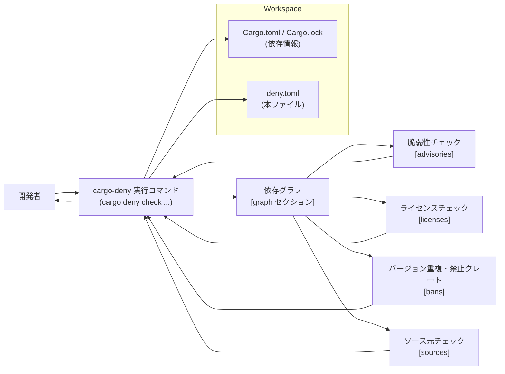
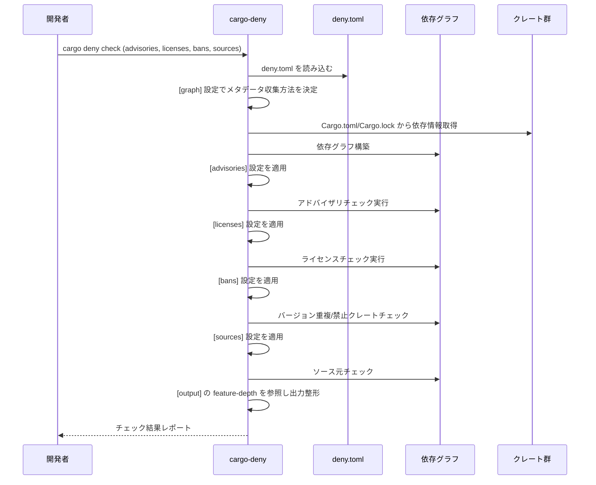

# deny.toml コード解説

## 0. ざっくり一言

`deny.toml` は、ツール `cargo-deny` の設定ファイルで、**依存クレートの脆弱性（advisories）、ライセンス、バージョン重複・禁止クレート（bans）、配布元（sources）** に関するポリシーを定義しています（コメント全体より、特に `[advisories]`, `[licenses]`, `[bans]`, `[sources]` の説明から判読可能 / `deny.toml` 冒頭〜末尾）。

> ※行番号はこのチャットでは提供されていないため、「Lxx-yy」は付与していません。根拠は必ずファイル中のコメントや項目から引用し、行番号は省略します。

---

## 1. このモジュール（設定ファイル）の役割

### 1.1 概要

- この設定ファイルは、**Rust ワークスペースの依存クレートが、セキュリティ・ライセンス・レジストリ／Git の利用ポリシーを満たしているか** を `cargo deny check` で検査するために存在します（各セクションの「This section is considered when running `cargo deny check ...`」というコメントより）。
- `[graph]` で「どのターゲット・feature を対象とするか」、`[advisories]` で「どの RUSTSEC ID を無視するか」、`[licenses]` で「許可ライセンス」、`[bans]` で「バージョン重複や禁止クレートの扱い」、`[sources]` で「許可レジストリ／Git ソース」を定めています。

### 1.2 アーキテクチャ内での位置づけ

このファイルは **実行ロジックではなく設定** であり、`cargo-deny` バイナリから読み込まれて、依存グラフとチェック結果に影響します。



### 1.3 設計上のポイント

ファイル内コメントと値から読み取れる設計上の特徴は次のとおりです。

- **セクションごとに責務を分割**
  - `[graph]` は依存グラフ構築と feature 収集方法のみを扱う。
  - `[advisories]`, `[licenses]`, `[bans]`, `[sources]` は、それぞれ専用の `cargo deny check ...` サブコマンドで参照される、とコメントに明記されています。
- **デフォルトを活かしつつ、最小限の上書き**
  - 冒頭コメントに「このテンプレートの値は、設定されていないときに使われるデフォルト」と書かれており、多くの項目がコメントアウトされたままです。  
    → 実際に必要なポリシーだけが明示的に上書きされている構造です。
- **セキュリティと実務のバランス**
  - `[advisories].ignore` に複数の RUSTSEC ID と理由が明示されており、既知の脆弱性を把握したうえで「一時的に許容」する運用方針が読み取れます（`ignore = [...]` と `# TODO: remove these exceptions ...` コメントなど）。
- **ライセンスポリシーの明示**
  - `[licenses].allow` に SPDX ID ベースの許可ライセンス一覧が明示されています。
- **チェック結果の厳しさの調整**
  - `[bans].multiple-versions = "warn"`, `[sources].unknown-registry = "warn"`, `[sources].unknown-git = "warn"` など、「警告までは出すがチェック失敗まではしない」項目が選ばれています。

---

## 2. 主要な機能一覧（コンポーネントインベントリー）

この設定ファイルが提供する主な「機能」（設定ブロック）を列挙します。

- `[graph]`  
  依存グラフの構築方法と、メタデータ収集時の features の扱いを制御します（`targets`, `all-features`, `no-default-features` など）。
- `[output]`  
  診断出力に含まれる inclusion graph の feature edge の深さ（`feature-depth`）を制御します。
- `[advisories]`  
  RustSec アドバイザリ DB による脆弱性チェック時の挙動と、無視する RUSTSEC ID の一覧（`ignore`）を定義します。
- `[licenses]` / `[licenses.private]`  
  許可ライセンス（`allow`）、ライセンス検出の信頼度閾値（`confidence-threshold`）、プライベートクレートの扱い（`ignore`, `registries`）を定義します。
- `[[licenses.clarify]]`（コメントアウト）  
  機械可読なライセンス情報がないクレートに対して、手動でライセンス式を与えるためのテンプレートです。
- `[bans]`  
  重複バージョン、ワイルドカードバージョン指定、禁止クレート、skip/skip-tree など「依存バージョン／クレートポリシー」を定義します。
- `[sources]` / `[sources.allow-org]`  
  許可する crates.io インデックスおよび Git リポジトリ／組織を指定し、未知のレジストリ・Git ソースをどう扱うかを定義します。

---

## 3. 公開「API」と詳細解説

このファイルには関数や構造体は存在しないため、**`cargo-deny` から見た公開設定ブロック** を「API」に相当するものとして扱い、整理します。

### 3.1 セクション（設定ブロック）一覧

| セクション名 | 種別 | 主なキー | 役割 / 用途 |
|--------------|------|----------|-------------|
| `[graph]` | テーブル | `targets`, `all-features`, `no-default-features` など | 依存グラフの構築条件と、メタデータ収集時にどの features を有効にするかを制御します。 |
| `[output]` | テーブル | `feature-depth` | 診断メッセージ中の inclusion graph に、どの深さまで feature edge を表示するかを制御します。 |
| `[advisories]` | テーブル | `ignore`, `db-path`, `db-urls`, `git-fetch-with-cli`（うち一部はコメントアウト） | `cargo deny check advisories` 実行時の脆弱性 DB の取得方法と、「無視するアドバイザリ ID」を定義します。 |
| `[licenses]` | テーブル | `allow`, `confidence-threshold`, `exceptions` | 許可ライセンス一覧とライセンス検出の閾値、クレート単位の例外設定を定義します。 |
| `[licenses.private]` | テーブル | `ignore`, `registries` | 未公開／プライベートレジストリ向けクレートをライセンスチェック対象に含めるかどうかを指定します。 |
| `[[licenses.clarify]]` | 配列テーブル（コメントアウト） | `crate`, `expression`, `license-files` | ライセンス情報が曖昧なクレートに対する手動ライセンス指定のテンプレートです。 |
| `[bans]` | テーブル | `multiple-versions`, `wildcards`, `highlight`, `allow`, `deny`, `skip`, `skip-tree` | 重複バージョン検出や禁止クレート、skip/skip-tree の挙動などを制御します。 |
| `[[bans.features]]` | 配列テーブル（コメントアウト） | `crate`, `deny`, `allow`, `exact` | 特定クレートの feature セットをホワイト／ブラックリストで制御するテンプレートです。 |
| `[sources]` | テーブル | `unknown-registry`, `unknown-git`, `allow-registry`, `allow-git` | 許可するレジストリ/Git URL と、未知のソースをどう扱うかを定義します。 |
| `[sources.allow-org]` | テーブル | `github`, `gitlab`, `bitbucket` | Git ホスティングサービスごとに、依存クレートとして許可する組織名を指定します。 |

### 3.2 重要な設定ブロックの詳細

以下では、特に実務影響が大きい 4 つのブロックを「関数詳細テンプレート」に相当する形で説明します。

---

#### `[advisories]`

**概要**

- `cargo deny check advisories` 実行時に参照される設定です（セクション冒頭コメントより）。
- RustSec アドバイザリ DB の取得方法（`db-path`, `db-urls`, `git-fetch-with-cli`）と、**検出してもチェック失敗にしないアドバイザリ ID の一覧**（`ignore`）を定義します。

**主要キー（引数に相当）**

| キー名 | 型 | 説明 |
|--------|----|------|
| `ignore` | 配列（オブジェクト） | 無視するアドバイザリの ID と理由を列挙します。各要素は `{ id = "...", reason = "..." }` 形式です。コメントに「ignored advisories will still output a note」とあり、無視してもノートは残ることが明記されています。 |
| `db-path` | 文字列（コメントアウト） | アドバイザリ DB を clone/fetch するローカルパス。デフォルト利用時はコメントアウトされたままです。 |
| `db-urls` | 配列（コメントアウト） | 利用するアドバイザリ DB の URL 群。デフォルトは `https://github.com/rustsec/advisory-db` とコメントに記載されています。 |
| `git-fetch-with-cli` | 真偽値（コメントアウト） | `true` にすると外部 `git` コマンドを使って DB を取得する、とコメントに記載されています。 |

**挙動（戻り値に相当）**

- `ignore` に列挙された RUSTSEC ID の脆弱性は、**チェック自体は行われるが、失敗扱いにはならずノートとして扱われる**、という挙動がコメントから読み取れます。
- それ以外のアドバイザリは、cargo-deny のデフォルトポリシーに従い、警告またはエラーとしてレポートされます（デフォルトの lint レベルはこのファイルからは読み取れません）。

**内部処理イメージ**

コメントと一般的な cargo-deny の動作から、概ね次の流れになります。

1. `cargo deny check advisories` が実行される。
2. `advisories` セクションの設定を読み込む。
3. `db-path` / `db-urls` / `git-fetch-with-cli` に従ってアドバイザリ DB を取得する（コメントに記載）。
4. 依存グラフ上の各クレートに対してアドバイザリを照合する。
5. ヒットしたアドバイザリのうち、`ignore` に ID が含まれるものは「note」、それ以外はデフォルトの lint レベルに従って報告される。

**使用例**

特定の RUSTSEC を一時的に無視する最小例を示します。

```toml
[advisories]                              # 脆弱性チェック設定ブロック
ignore = [                                # 無視するアドバイザリ ID の一覧
    { id = "RUSTSEC-2024-0000",           # 無視したいアドバイザリ ID
      reason = "一時的に依存を外せないため" },  # 無視する理由（運用上のメモ）
]
```

**セキュリティ上の注意点 / Bugs 的な観点**

- `ignore` で無視したアドバイザリは、**実際には依然として脆弱性が存在している可能性が高い** ことに注意が必要です。
  - 理由フィールドに「no fixed release yet」「upgrade will be handled separately」などと書かれていることからも、あくまで **一時的な例外** として扱う意図が読み取れます。
- TODO コメントで「依存が更新されたら削除する」と書かれているため、**長期的に ignore 項目が残り続けないようにすること** が前提となっています。

**エッジケース**

- 同じ ID を `ignore` に重複して書いた場合の扱いは、このファイルからは分かりません（cargo-deny 実装に依存）。
- 無効な ID 文字列を指定した場合の挙動も、このチャンクからは読み取れません。

**使用上の注意点**

- **常に理由（`reason`）を明記する** ことで、後から「なぜ許容したのか」が分かるように運用されています。
- TODO コメントがある項目は、依存更新作業の際に優先的に見直す必要があります。

---

#### `[licenses]` / `[licenses.private]`

**概要**

- `cargo deny check licenses` 実行時に参照される設定です（セクション冒頭のコメントより）。
- 組織として許可するライセンス一覧と、ライセンス検出の信頼度、プライベートクレートをどう扱うかを定義します。

**主要キー**

`[licenses]`:

| キー名 | 型 | 説明 |
|--------|----|------|
| `allow` | 配列（文字列） | 許可するライセンスを SPDX ID で列挙しています。Apache-2.0, MIT, BSD-3-Clause, MPL-2.0 などの代表的な OSS ライセンスが含まれています（それぞれのコメントに URL と「Used by: ...」が記載）。 |
| `confidence-threshold` | 浮動小数 | ライセンステキストから SPDX ライセンスを推定する際の信頼度しきい値です。コメントに「0.0〜1.0 の間で設定」とあり、このファイルでは `0.8` に設定されています。 |
| `exceptions` | 配列（オブジェクト） | 特定クレートに対して、グローバルの `allow` とは異なるライセンス許可を行うための仕組みです。テンプレートコメントのみで、実際の例外は定義されていません。 |
| `[[licenses.clarify]]` | 配列テーブル（コメントアウト） | 機械可読なライセンス情報が無いクレートに対し、`expression` でライセンス式を手動指定するテンプレートです。 |

`[licenses.private]`:

| キー名 | 型 | 説明 |
|--------|----|------|
| `ignore` | 真偽値 | `true` にすると、未公開またはプライベートレジストリのみ公開のワークスペースクレートをライセンスチェック対象から外すことがコメントで説明されています。このファイルでは `false` になっており、プライベートクレートもチェック対象です。 |
| `registries` | 配列（文字列） | プライベートレジストリの URL を列挙します。ここにのみ公開されている場合、`ignore = true` ならチェック対象外になるとコメントに書かれています。サンプル URL はコメントアウトされており、実際には空の配列です。 |

**挙動**

- 依存クレートの LICENSE ファイル等から推定されたライセンスが `allow` に含まれていればポリシー上「許可」となります。
- ライセンス検出の信頼度が `confidence-threshold` を下回るときの扱い（警告かエラーか）は、このファイルのみからは特定できません。
- `[licenses.private]` の `ignore = false` により、**プライベートクレートも通常のクレートと同様にライセンスチェック対象** になります。

**使用例**

MIT ライセンスのみを許可し、他を不許可にする最小構成例：

```toml
[licenses]                        # ライセンスチェック設定
allow = [                         # 許可するライセンス一覧
    "MIT",                        # MIT ライセンスのみ許可
]
confidence-threshold = 0.8        # ライセンス検出の信頼度しきい値
```

**エッジケース / 契約**

- OSS ライセンスが `allow` に列挙されていない場合、そのライセンスを持つクレートは「ポリシー違反」とみなされます（ただし実際の lint レベルは cargo-deny のデフォルト設定に依存し、このファイルからは分かりません）。
- `allow` を空配列にすると、ほぼすべてのクレートがライセンス違反になる可能性があります。

**使用上の注意点**

- ライセンス一覧コメントに「Used by: ...」として実際に利用しているクレートが列挙されているため、**既存利用状況を踏まえてポリシーを作っている** ことが読み取れます。
- 例外を追加する際は、`exceptions` ではなく `allow` にライセンスを追加すべきかどうかを検討する必要があります（例外が増えすぎると管理が複雑になるため）。

---

#### `[bans]`

**概要**

- `cargo deny check bans` 実行時に参照される設定です（セクション冒頭コメントより）。
- 重複バージョン、ワイルドカードバージョン指定、禁止クレート、skip/skip-tree 等を制御します。

**主要キー**

| キー名 | 型 | 説明 |
|--------|----|------|
| `multiple-versions` | 文字列 | 同じクレートの複数バージョンが検出されたときの lint レベルです。このファイルでは `"warn"` です。 |
| `wildcards` | 文字列 | バージョン指定が `*` の場合の lint レベルです。このファイルでは `"allow"` です。 |
| `highlight` | 文字列 | 重複バージョンを可視化する dotgraph のハイライト方法です（`"all"` に設定され、コメントに `lowest-version`, `simplest-path` などの選択肢が説明されています）。 |
| `workspace-default-features` | 文字列 | ワークスペースクレートの `default` features に対する lint レベルです。このファイルでは `"allow"`。 |
| `external-default-features` | 文字列 | 外部クレートの `default` features に対する lint レベルです。このファイルでは `"allow"`。 |
| `allow` | 配列 | 例外的に許可するクレートの一覧です。テンプレートコメントのみで実際の項目はありません。 |
| `deny` | 配列 | 禁止するクレートの一覧です。テンプレートコメントのみです。 |
| `skip` | 配列 | 重複バージョン検出からスキップするクレート一覧です。実際には空で、テンプレートコメントのみです。 |
| `skip-tree` | 配列 | 特定クレートとその依存ツリー全体を重複検出から除外するための設定です。実際には空です。 |
| `[[bans.features]]` | 配列テーブル（コメントアウト） | 特定クレートの features セットを厳密に制御するためのテンプレです。 |

**挙動と注意点**

- `multiple-versions = "warn"` により、**同じクレートの複数バージョンがあってもチェックは失敗せず、警告にとどまります。**
- `wildcards = "allow"` のため、`version = "*"` のようなゆるいバージョン指定もエラーとはなりません（警告も出ません）。
- 禁止クレート（`deny`）や skip 設定は未使用なので、現時点では **明示的に禁止されているクレートはありません**（このファイルから読み取れる範囲）。

**エッジケース**

- 禁止したいクレートを `allow` と `deny` の両方に書いた場合の優先順位は、このファイルでは分かりません。
- `skip-tree` が大きなツリーを含むと、重複検出のカバー範囲が広く欠ける可能性があります。

---

#### `[sources]` / `[sources.allow-org]`

**概要**

- `cargo deny check sources` 実行時に参照される設定です（セクション冒頭コメントより）。
- どのレジストリ／Git リポジトリからのクレートを許可するか、未知のソースをどの lint レベルで扱うかを定義します。

**主要キー**

`[sources]`:

| キー名 | 型 | 説明 |
|--------|----|------|
| `unknown-registry` | 文字列 | `allow-registry` に含まれない crate registry からのクレートが見つかった場合の lint レベルです。このファイルでは `"warn"`。 |
| `unknown-git` | 文字列 | `allow-git` および `sources.allow-org` に含まれない Git リポジトリからのクレートが見つかった場合の lint レベルです。このファイルでは `"warn"`。 |
| `allow-registry` | 配列（文字列） | 許可するレジストリの URL 一覧です。このファイルでは `["https://github.com/rust-lang/crates.io-index"]` のみが指定されており、コメントに「指定されていない場合は crates.io index デフォルト」と説明されています。 |
| `allow-git` | 配列（文字列） | 許可する Git リポジトリ URL の一覧です。ここでは空配列です。 |

`[sources.allow-org]`:

| キー名 | 型 | 説明 |
|--------|----|------|
| `github` | 配列（文字列） | GitHub の組織名のうち、依存クレートの Git ソースとして許可するものです。このファイルでは `"nornagon"` が指定されており、コメントに「ratatui and crossterm forks」と説明があります。 |
| `gitlab` | 配列 | GitLab の許可組織ですが、空配列です。 |
| `bitbucket` | 配列 | Bitbucket の許可組織ですが、空配列です。 |

**挙動・セキュリティ上の意味**

- `allow-registry` に crates.io のインデックスのみが指定されているため、**通常の crates.io からのクレートのみが「許可されたレジストリ」として扱われます**。
- それ以外のレジストリ／Git ソースからのクレートも使うことはできますが、`unknown-registry` / `unknown-git` が `"warn"` なので、**チェックは失敗させずに警告を出す** 形になっています。
- GitHub で `"nornagon"` 組織のみが明示的に許可されており、それ以外の GitHub 組織や GitLab/Bitbucket のリポジトリは、「警告付きで利用」という扱いになります。

**使用上の注意点**

- 本当に使用禁止にしたいレジストリ／Git ソースがある場合は、`unknown-registry` / `unknown-git` を `"deny"` に変更する必要があります。
- `"nornagon"` のような特定組織を許可しているのは、フォーク版 ratatui/crossterm を使うためとコメントに記載されています。  
  → 別の組織の Git クレートを追加する場合は、ここに追記する必要があります。

---

### 3.3 その他の設定ブロック（補助的なもの）

明示的に値を設定しておらず、テンプレートとしてコメントのみ置かれているブロックは次のとおりです。

| ブロック名 | 役割（1 行） |
|-----------|--------------|
| `[[licenses.clarify]]` | ライセンス情報が曖昧なクレートに対し、手動でライセンス式とライセンスファイルのハッシュを紐づけるためのテンプレートです。 |
| `[[bans.features]]` | 特定クレートに対し、許可する/禁止する features を詳細に指定するためのテンプレートです。 |

これらはコメントアウトされているため、**現状の設定では動作していません**。

---

## 4. データフロー

このファイルが実際のチェックにどう関わるかを、`cargo deny check` 実行時の 1 シナリオで整理します。

### 4.1 代表的なフロー：`cargo deny check all`

1. 開発者がワークスペースルートで `cargo deny check`（または `cargo deny check all`）を実行する。
2. `cargo-deny` が `deny.toml` を読み込み、各セクションの設定を内部状態に反映する。
3. `[graph]` の設定に基づき、ターゲットや features を解決しつつ依存グラフを構築する。
4. そのグラフを入力にして、`advisories` / `licenses` / `bans` / `sources` の各チェックを順に実行する。
5. `[output]` の `feature-depth` に従い、レポートに出力する inclusion graph の詳細度を調整して、結果を開発者に出力する。



---

## 5. 使い方（How to Use）

### 5.1 基本的な使用方法

`deny.toml` をワークスペースルートに置いた状態で、`cargo-deny` を実行する典型的なフローです。

```bash
# 依存全体の脆弱性・ライセンス・bans・sources をまとめてチェックする
cargo deny check

# セクションごとに絞り込んでチェックすることも可能（コメントは説明用）
cargo deny check advisories   # [advisories] セクションを使った脆弱性チェック
cargo deny check licenses     # [licenses] / [licenses.private] によるライセンスチェック
cargo deny check bans         # [bans] セクションによるバージョン等チェック
cargo deny check sources      # [sources] セクションによるソース元チェック
```

### 5.2 よくある使用パターン

1. **特定の脆弱性を一時的に無視する**

```toml
[advisories]
ignore = [
    { id = "RUSTSEC-2024-0388",
      reason = "依存が starlark v0.13.0 から移行できておらず、一時的に許容" },
]
```

- 依存更新が完了したら、この項目を削除する、という TODO コメントとセットで運用するのが前提になっています。

1. **新しい許可ライセンスを追加する**

```toml
[licenses]
allow = [
    "Apache-2.0",
    "MIT",
    "BSD-3-Clause",
    "MPL-2.0",
    # 追加: 新たに許可したいライセンス
    "Zlib",
]
```

- コメントには、各ライセンスがどのクレートに使われているかも併記されているため、実際に必要なライセンスのみを追加できます。

1. **特定 GitHub 組織のクレートを許可する**

```toml
[sources.allow-org]
github = [
    "nornagon",        # 既存: ratatui / crossterm フォーク
    "my-org",          # 追加: 自前の GitHub 組織
]
```

- ここに記載した組織のリポジトリから取得したクレートは、「未知の Git ソース」とはみなされません。

### 5.3 よくある間違い

```toml
# 間違い例: RUSTSEC ID のみで ignore し、理由を書いていない
[advisories]
ignore = [
    { id = "RUSTSEC-2024-0388" },    # reason フィールドが無く、後から意図が分かりにくい
]

# 正しい例: 理由を明記する
[advisories]
ignore = [
    { id = "RUSTSEC-2024-0388",
      reason = "依存元ライブラリがまだ修正バージョンを出しておらず、一時的に許容" },
]
```

```toml
# 間違い例: allow-registry を空にしてしまう
[sources]
allow-registry = []                # コメントにあるとおり、空だと「全レジストリ禁止」に近い意味になる

# このファイルのように、少なくとも crates.io index は残すのが一般的
[sources]
allow-registry = ["https://github.com/rust-lang/crates.io-index"]
```

### 5.4 使用上の注意点（まとめ）

- **無視したアドバイザリ（[advisories].ignore）は必ず定期的に見直すこと**  
  TODO コメントにあるとおり、依存アップデート後は削除する運用が前提です。
- **ライセンスポリシーの更新は影響範囲を確認しながら行うこと**  
  コメントに列挙された「Used by: ...」を見て、既存依存への影響を確認する必要があります。
- **`unknown-registry` / `unknown-git` を `"warn"` にしているため、実際には禁止されていないことに留意すること**  
  本当に禁止したい場合は `"deny"` に変更する、または `allow-registry` / `allow-git` / `sources.allow-org` を厳密に管理する必要があります。

---

## 6. 変更の仕方（How to Modify）

### 6.1 新しいポリシーを追加する場合

1. **対象となるチェックを決める**
   - 脆弱性なら `[advisories]`、ライセンスなら `[licenses]`、ソース元なら `[sources]` のように、対応するセクションを選びます（各セクションの「This section is considered when running `cargo deny check ...`」というコメントが根拠）。
2. **既存コメントを参考にする**
   - ファイル内にはテンプレートコメントが豊富に含まれており、`[[licenses.clarify]]` や `[[bans.features]]` などの「記入例」がコメントアウトされています。
3. **値を追加・修正する**
   - `allow` や `ignore` などの配列に要素を追加する。
   - lint レベル（`"warn"`, `"deny"`, `"allow"`）を変更する。
4. **`cargo deny check` を実行して挙動を確認する**
   - 新しいポリシーが意図通りに機能しているかを確認します。

### 6.2 既存設定を変更する場合の注意点

- **影響範囲の確認**
  - ライセンス追加/削除 → コメントの「Used by: ...」を見て、どのクレートが影響を受けるか把握する。
  - アドバイザリ ignore の削除 → 実際に依存が修正済みかどうかを確認する。
- **契約（前提条件）の維持**
  - 例えば `[licenses.private].ignore = false` によって「プライベートクレートもチェックする」という契約が成り立っています。これを `true` に変えると、「社内配布のみだからライセンス不問」という運用に変わるため、組織のポリシーと整合するか確認が必要です。
- **CI 等での利用を考慮**
  - `multiple-versions = "warn"` のような lint レベルを `"deny"` に引き上げると、CI 上でビルドが落ちるようになる可能性があります。CI 設定側の期待と合わせて変更する必要があります（CI 設定ファイル自体はこのチャンクには現れません）。

---

## 7. 関連ファイル

この設定ファイル自体から直接参照されているわけではありませんが、`cargo-deny` の動作上、次のファイルが密接に関係します（一般的な Rust プロジェクトにおける関係であり、このリポジトリ固有の構成はこのチャンクからは分かりません）。

| パス | 役割 / 関係 |
|------|------------|
| `Cargo.toml` | プロジェクト／ワークスペースの依存クレートや features を定義するファイルで、`[graph]` セクションの設定と組み合わさって依存グラフが構築されます。 |
| `Cargo.lock` | 実際に利用しているクレートのバージョンが固定されているファイルで、`[advisories]`, `[licenses]`, `[bans]`, `[sources]` の各チェック対象となるクレート一覧のソースになります。 |
| `.github/workflows/*.yml` 等の CI 設定 | CI 上で `cargo deny check` を自動実行している場合、この `deny.toml` の変更は CI 成否に直接影響します（このリポジトリでそうなっているかどうかは、このチャンクには現れません）。 |

---

以上が、この `deny.toml` の構造と挙動の整理です。  
このファイルは実行コードではなく設定ですが、**依存の安全性・法的リスク・ソース管理ポリシーをまとめて制御する中核的コンポーネント** になっています。
