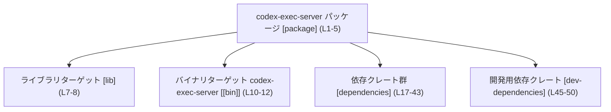
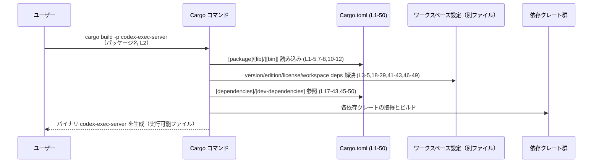

# exec-server/Cargo.toml コード解説

## 0. ざっくり一言

`exec-server/Cargo.toml` は、Rust パッケージ `codex-exec-server` の **パッケージ情報・ターゲット（lib/bin）・依存クレート・テスト用依存クレート** を定義する Cargo マニフェストです（`exec-server/Cargo.toml:L1-5,7-8,10-12,17-50`）。

---

## 1. このモジュールの役割

### 1.1 概要

- このファイルは Rust パッケージ `codex-exec-server` の **ビルド設定** を記述します（`L1-5`）。
- ライブラリターゲット `[lib]` と、バイナリターゲット `[[bin]] codex-exec-server` を定義します（`L7-8,10-12`）。
- 非同期実行・プロセス起動・ネットワーク I/O などを行うことが可能な依存クレート群を指定しています（`L17-43`）。
- テスト時にのみ利用される開発用依存クレートを指定しています（`L45-50`）。

このファイルには **Rust の関数や構造体の定義は一切含まれていません**。公開 API やコアロジックは別ファイル（例: `src/lib.rs`, `src/bin/codex-exec-server.rs`）にあります。

### 1.2 アーキテクチャ内での位置づけ

この Cargo.toml はワークスペース内の一パッケージとして、`codex-exec-server` のターゲットと依存関係を宣言します。

- ワークスペース共有の `version` / `edition` / `license` を参照（`L3-5`）。
- ワークスペース共有の lint 設定を使用（`L14-15`）。
- 依存クレートもすべて `workspace = true`（`L18-29,41-43,46-49`）で、バージョンや一部設定はワークスペースルート側で管理されています。

主要コンポーネントの関係を簡略図で示します。



※ 上図は **ビルド構成レベルの関係** を示したものであり、実行時の関数呼び出しやデータフローは、このファイルからは分かりません。

### 1.3 設計上のポイント

コード（マニフェスト）から読み取れる設計上の特徴は次のとおりです。

- **ワークスペース集中管理**
  - `version.workspace = true`, `edition.workspace = true`, `license.workspace = true` により、パッケージのバージョンやエディション、ライセンスはワークスペースルートで一括管理されています（`L3-5`）。
  - 依存クレートも `workspace = true` 指定で、バージョンや基本設定はワークスペース側に集約されています（`L18-29,41-43,46-49`）。
- **ライブラリ + バイナリ構成**
  - `[lib]` と `[[bin]]` が定義されており、共通ロジックをライブラリ化しつつ、`codex-exec-server` というバイナリを提供する構成になっています（`L7-8,10-12`）。
- **ライブラリの doctest 無効化**
  - `[lib]` セクションで `doctest = false` が指定されており、ドキュメントコメントに埋め込むテスト（doctest）は実行されない設定です（`L7-8`）。
- **lint のワークスペース共有**
  - `[lints] workspace = true` により、コンパイラや Clippy の lint 設定はワークスペース共通のポリシーに従います（`L14-15`）。
- **非同期・並行実行基盤の利用**
  - `tokio` に対して `fs`, `io-std`, `io-util`, `macros`, `net`, `process`, `rt-multi-thread`, `sync`, `time` など多くの feature が有効になっており（`L30-40`）、一般的にはマルチスレッドな非同期 I/O・プロセス実行・ネットワーク通信などをサポートする構成です。
  - ただし、これらの機能が **実際にコード中でどのように使われているかは、このファイルからは分かりません**。
- **WebSocket・プロトコル系ユーティリティの依存**
  - `tokio-tungstenite`, `codex-app-server-protocol`, `codex-protocol`, `codex-utils-*` に依存しています（`L22-25,41`）。名称から用途は推測可能ですが、詳細な役割はこのチャンクには現れないため不明です。

---

## 2. 主要な機能一覧（マニフェストとしての機能）

このファイル自体は実行ロジックを持ちませんが、「ビルド構成」という観点での主要な機能を整理します。

- パッケージメタデータ定義  
  - `name`, `version.workspace`, `edition.workspace`, `license.workspace` を通じてパッケージの基本情報を定義（`L1-5`）。
- ライブラリターゲット定義  
  - `[lib]` セクションと `doctest = false` により、ライブラリクレートを定義しつつ doctest を無効化（`L7-8`）。
- バイナリターゲット `codex-exec-server` の定義  
  - `[[bin]]` セクションで、`name = "codex-exec-server"` とエントリポイント `path = "src/bin/codex-exec-server.rs"` を指定（`L10-12`）。
- lint 設定のワークスペース共有  
  - `[lints] workspace = true` により、ワークスペース共通の lint ポリシーを適用（`L14-15`）。
- 実行時依存クレートの宣言  
  - `arc-swap`, `async-trait`, `base64`, `clap`, `serde`, `serde_json`, `thiserror`, `tokio`, `tokio-tungstenite`, `tracing`, `uuid` など多数のクレートを依存として宣言（`L18-21,27-30,41-43`）。
  - ワークスペース内独自クレート `codex-app-server-protocol`, `codex-protocol`, `codex-utils-absolute-path`, `codex-utils-pty` への依存を宣言（`L22-25`）。
- テスト・開発支援用依存クレートの宣言  
  - `anyhow`, `codex-utils-cargo-bin`, `pretty_assertions`, `tempfile`, `test-case` を `dev-dependencies` として宣言（`L45-50`）。  

---

## 3. 公開 API と詳細解説

このファイルには Rust の **型定義・関数定義は一つも含まれていません**。したがって、以下のセクションでは **ターゲットと依存クレートを「コンポーネント」として整理**し、公開 API そのものについては「このチャンクには現れない」ことを明示します。

### 3.1 型一覧（構造体・列挙体など）

- `exec-server/Cargo.toml` 内には構造体・列挙体・トレイトなどの型定義はありません（`L1-50`）。
- 公開 API は、対応する Rust ソースファイル（例: `src/lib.rs`, `src/bin/codex-exec-server.rs`）側に定義されているはずですが、このチャンクには現れないため詳細不明です。

#### 3.1.1 コンポーネントインベントリー（ターゲット）

| 名前                      | 種別          | 役割 / 用途（このファイルから読み取れる範囲）                                      | 根拠                             |
|---------------------------|---------------|--------------------------------------------------------------------------------------|----------------------------------|
| `codex-exec-server`       | パッケージ名  | ワークスペース内の Rust パッケージ名                                               | `exec-server/Cargo.toml:L1-2`   |
| （名前未指定 lib）        | lib ターゲット | ライブラリクレート。`doctest` が無効。path は明示されておらず、Cargo のデフォルトに従う | `exec-server/Cargo.toml:L7-8`   |
| `codex-exec-server`       | bin ターゲット | エントリポイント `src/bin/codex-exec-server.rs` を持つバイナリターゲット            | `exec-server/Cargo.toml:L10-12` |

> 備考: `[lib]` に `path` がないため、実際にどのファイルがライブラリターゲットかは **このファイル単体では明示されていません**。Cargo の一般仕様では `src/lib.rs` がデフォルトになりますが、それは一般知識であり、このチャンクにはパス文字列としては現れていません。

#### 3.1.2 コンポーネントインベントリー（依存クレート）

用途は、**このファイルから確実に読み取れる内容（＝依存として指定されていること）**に限定します。

| 名前                         | 種別             | 用途（このファイルから読み取れる範囲）                 | 根拠                                   |
|------------------------------|------------------|--------------------------------------------------------|----------------------------------------|
| `arc-swap`                   | 依存クレート     | ワークスペースでバージョン管理される実行時依存        | `L18`                                  |
| `async-trait`                | 依存クレート     | 同上                                                  | `L19`                                  |
| `base64`                     | 依存クレート     | 同上                                                  | `L20`                                  |
| `clap` (+ `derive`)          | 依存クレート     | CLI 引数パーサ（一般論）。本パッケージでは依存として宣言のみ確認できる | `L21`                    |
| `codex-app-server-protocol`  | 依存クレート     | ワークスペース内のクレート。具体的用途はファイルからは不明 | `L22`                             |
| `codex-protocol`             | 依存クレート     | 同上                                                  | `L23`                                  |
| `codex-utils-absolute-path`  | 依存クレート     | 同上                                                  | `L24`                                  |
| `codex-utils-pty`            | 依存クレート     | 同上                                                  | `L25`                                  |
| `futures`                    | 依存クレート     | 実行時依存。非同期関連ユーティリティ（一般論）        | `L26`                                  |
| `serde` (+ `derive`)         | 依存クレート     | シリアライズ/デシリアライズ用（一般論）。依存宣言のみ確認可 | `L27`                             |
| `serde_json`                 | 依存クレート     | 同上                                                  | `L28`                                  |
| `thiserror`                  | 依存クレート     | エラー型定義支援クレート（一般論）。依存として宣言     | `L29`                                  |
| `tokio` (+ 複数 feature)     | 依存クレート     | 非同期ランタイム（一般論）。`fs`, `net`, `process` 等の feature を有効にして依存 | `L30-40`  |
| `tokio-tungstenite`          | 依存クレート     | tokio ベースの WebSocket サポート（一般論）。依存宣言のみ確認可 | `L41`                        |
| `tracing`                    | 依存クレート     | 構造化ロギング/トレーシング基盤（一般論）。依存宣言のみ確認可 | `L42`                         |
| `uuid` (+ `v4`)              | 依存クレート     | UUID v4 生成サポート（一般論）。依存宣言のみ確認可   | `L43`                                  |
| `anyhow`                     | dev 依存クレート | テスト/開発用依存。ランタイムでは通常利用されない     | `L46`                                  |
| `codex-utils-cargo-bin`      | dev 依存クレート | ワークスペース内のテスト/開発用ユーティリティ。用途はファイルからは不明 | `L47`          |
| `pretty_assertions`          | dev 依存クレート | テスト時の見やすい差分表示に利用されるクレート（一般論）。宣言のみ確認可 | `L48` |
| `tempfile`                   | dev 依存クレート | 一時ファイル利用（一般論）。テスト/開発用依存        | `L49`                                  |
| `test-case`                  | dev 依存クレート | パラメタライズドテスト用クレート（一般論）。明示バージョン `3.3.1` | `L50`         |

### 3.2 関数詳細（最大 7 件）

- このファイルには **関数・メソッドの定義が存在しないため、関数詳細テンプレートを適用できる対象はありません**。
- 公開 API の関数・メソッドは、対応する Rust ソースコード（このチャンクには現れない）を参照する必要があります。

### 3.3 その他の関数

- 該当なし（このチャンクには関数定義が一切現れません）。

---

## 4. データフロー（Cargo によるビルド時の流れ）

実行時の処理フローはこのファイルからは読み取れないため、ここでは **Cargo がこのマニフェストを用いてビルドする際のデータフロー** を示します。

1. ユーザーが `cargo build -p codex-exec-server` や `cargo run -p codex-exec-server --bin codex-exec-server` のようなコマンドを実行します（パッケージ名・バイナリ名は `L1-2,11` に基づく一般的な利用例）。
2. Cargo は `exec-server/Cargo.toml` を読み込み、パッケージメタデータ（`[package]`）とターゲット（`[lib]`, `[[bin]]`）を解釈します（`L1-5,7-8,10-12`）。
3. Cargo は `[dependencies]` と `[dev-dependencies]` を読み取り、必要なクレートと feature を解決します（`L17-43,45-50`）。
4. ビルドプロファイル（通常ビルド / テスト）に応じて、実行時依存と dev 依存を使い分けてクレートグラフを構築します。
5. その後、各ターゲット（lib / bin）ごとにコンパイルが行われます。

この流れを sequence diagram で表すと次のようになります。



> 注: `Workspace` ノードは `workspace = true` 指定から存在が推測されるものですが、このチャンクにはワークスペースルートのファイルは現れません。パスや詳細な設定内容は不明です。

---

## 5. 使い方（How to Use）

このセクションでは、「`exec-server/Cargo.toml` が定義するパッケージをどう扱うか」という観点で説明します。実際の API 利用例（Rust コード）は、このファイルからは導けないため扱いません。

### 5.1 基本的な使用方法

#### ビルド・実行

パッケージ名とバイナリ名に基づく代表的なコマンド例です。

```bash
# パッケージ codex-exec-server をビルドする
cargo build -p codex-exec-server   # パッケージ名: L2

# バイナリターゲット codex-exec-server を実行する
cargo run -p codex-exec-server --bin codex-exec-server   # バイナリ名: L11

# テストを実行する（dev-dependencies を含めてビルド）
cargo test -p codex-exec-server
```

#### マニフェスト編集（依存クレート追加の例）

`[dependencies]` に新しいクレートを追加する基本パターンは次のようになります。

```toml
[dependencies]
arc-swap = { workspace = true }             # 既存: L18
# 新規追加例（ワークスペース側でバージョンを管理する場合）
my-new-crate = { workspace = true }         # この行を追加
```

> 実際に `workspace = true` が使えるかどうかは、ワークスペースルートの `Cargo.toml` に `my-new-crate` が定義されているかに依存します。このチャンクにはその情報はありません。

### 5.2 よくある使用パターン

このマニフェストの構成から考えられる、一般的な利用パターンをいくつか挙げます。

1. **ライブラリ＋バイナリの共存**
   - ビジネスロジックをライブラリ側（`[lib]` のターゲット）に置き、`[[bin]]` は CLI / サーバープロセスのエントリポイントだけを提供する構成が一般的です。
   - このファイルからは、ライブラリとバイナリの具体的な責務分担は分かりませんが、そのような利用が可能な構成になっています（`L7-8,10-12`）。

2. **非同期・並行処理ベースの実装**
   - `tokio` の `rt-multi-thread`, `net`, `process` などの feature が有効なため（`L30-40`）、実装側では
     - マルチスレッドな非同期 I/O
     - 外部プロセスの起動（`process`）
     - ソケット通信（`net`）
     などを行うことが可能です。
   - ただし **実際にどの API がどのように使われているかは、このファイルからは分かりません**。

3. **WebSocket / プロトコルベース通信**
   - `tokio-tungstenite` と `codex-*-protocol` 系クレートが依存に含まれるため（`L22-23,41`）、WebSocket を用いたプロトコル通信を行う構成が取れるようになっています。
   - 具体的なプロトコル内容やデータ形式は、このチャンクには現れません。

### 5.3 よくある間違い

以下は、**この種の Cargo.toml で一般的に起こりがちな誤り**であり、このリポジトリ固有の問題を指しているわけではありません。

```toml
# 間違い例: 実行時にも必要なクレートを dev-dependencies に入れてしまう
[dev-dependencies]
serde_json = "1.0"   # 実行時にも使うならここではなく [dependencies] に置くべき

# 正しい例: 実行時に利用するクレートは [dependencies] に置く
[dependencies]
serde_json = "1.0"
```

```toml
# 間違い例: workspace = true なのにワークスペースルートで依存を定義していない
[dependencies]
my-new-crate = { workspace = true }   # ルートに my-new-crate がないと解決エラーになる

# 正しい例（一般的なパターン）
# ルート Cargo.toml（このチャンクには現れない）で依存を定義した上で、
# 個々のパッケージ側では workspace = true を使う
```

### 5.4 使用上の注意点（まとめ）

- **ワークスペース設定への依存**
  - 多くのフィールドが `workspace = true` となっているため（`L3-5,18-29,41-43,46-49`）、  
    - バージョン変更
    - 共通 feature 設定
    - ライセンス・エディション
    はワークスペースルートの設定に依存します。
  - そのため、このファイルだけを編集しても反映されない設定がある点に注意が必要です。
- **ターゲット定義とファイル構成の整合性**
  - `[[bin]]` の `path = "src/bin/codex-exec-server.rs"` に対応するファイルが存在しない場合、ビルド時にエラーになります（`L10-12`）。
  - `[lib]` の path が明示されていないため、Cargo のデフォルト (`src/lib.rs`) に依存する構成になっていると推測できますが、実ファイルの有無はこのチャンクからは分かりません。
- **非同期・並行処理に関する注意**
  - `tokio` の `rt-multi-thread` や `sync` feature により、マルチスレッド・並列処理が可能な構成です（`L30-40`）。
  - 実装側でこれらの機能を使う際には、`Arc` の共有・`Send`/`Sync` 制約・スレッド安全なデータ構造など Rust 本来の安全性ルールを守る必要がありますが、その具体的なコードはこのチャンクには現れません。
- **セキュリティ上の観点（一般論）**
  - `tokio` の `process` feature による外部プロセス起動 (`L36`) や `net` feature によるネットワーク I/O (`L35`) は、一般にセキュリティ上の影響が大きい領域です。
  - このファイルからは具体的な利用方法が分からないため、「どのような入力をどのプロセスに渡しているか」「どのポートを開けているか」などは不明ですが、実装を変更する際には入力の検証や権限分離に注意する必要があります。

---

## 6. 変更の仕方（How to Modify）

### 6.1 新しい機能を追加する場合（マニフェスト観点）

新機能の追加に伴い、以下のような変更が考えられます。

1. **新しい依存クレートを追加する**
   - 例: WebSocket 周辺機能強化のため、追加ユーティリティクレートを依存に加える。
   - 手順（一般的な例）:
     1. ワークスペースルートの `Cargo.toml` に新依存を追加（このファイルには現れません）。
     2. `exec-server/Cargo.toml` の `[dependencies]` に `workspace = true` で追加（`L17-43` の形式を踏襲）。

2. **新しいバイナリターゲットを追加する**
   - 別の CLI / サービスプロセスを追加したい場合:

     ```toml
     [[bin]]
     name = "codex-exec-server"                    # 既存: L11
     path = "src/bin/codex-exec-server.rs"         # 既存: L12

     [[bin]]
     name = "codex-exec-worker"                    # 新規バイナリ名の例
     path = "src/bin/codex-exec-worker.rs"         # 対応するファイルを作成する必要がある
     ```

   - 新しい `[[bin]]` を追加した場合、その `path` に対応する Rust ソースファイルを作成する必要があります。

3. **非同期処理機能の拡張**
   - `tokio` の feature を追加・削除する場合は `features = [ ... ]` を編集します（`L30-40`）。
   - ただし、feature を変更するとワークスペース全体のビルドオプションに影響する可能性があり、このファイルだけで完結しない点に注意が必要です。

### 6.2 既存の機能を変更する場合

1. **パッケージ名・バイナリ名の変更**
   - `name = "codex-exec-server"` を変更すると（`L2,11`）、他パッケージからの依存指定や `cargo run -p ...` の指定に影響します。
   - 変更時には、ワークスペース内の参照箇所をすべて確認する必要があります（このチャンクには参照箇所は現れません）。

2. **依存クレートの整理（追加・削除・切替）**
   - あるクレートを `dependencies` から削除する場合、そのクレートを利用しているソースコードも併せて修正する必要があります。
   - `dev-dependencies` からの削除はテストコードへの影響に留まりますが、どのテストが影響を受けるかはこのチャンクからは分かりません。

3. **並行性に関わる設定変更**
   - `tokio` の `rt-multi-thread` feature を無効化する・別の runtime 構成にするなどの変更は（`L37`）、実装側で `#[tokio::main]` の attribute やスレッドプールの前提に影響します。
   - こうした変更は、実装コード側（このチャンクには現れない）とセットで検討する必要があります。

---

## 7. 関連ファイル

この Cargo.toml から、密接に関係すると分かるファイル・設定を整理します。

| パス / 名称                                 | 役割 / 関係                                                                                               | 根拠                               |
|---------------------------------------------|------------------------------------------------------------------------------------------------------------|------------------------------------|
| `exec-server/src/bin/codex-exec-server.rs`  | バイナリターゲット `codex-exec-server` のエントリポイントとなる Rust ソースファイル                       | `path = "src/bin/codex-exec-server.rs"`（`L12`） |
| （おそらく）`exec-server/src/lib.rs`        | `[lib]` ターゲットに対応すると考えられるライブラリファイル。path は明示されておらず、このチャンクからは不明 | `[lib]` に path がないこと（`L7-8`）。実ファイルの存在は未確認 |
| ワークスペースルートの `Cargo.toml` 等      | `workspace = true` で参照されるバージョン・依存設定・lint 設定などを保持するファイル                     | `version.workspace`, `edition.workspace`, `license.workspace`, `workspace = true` 指定（`L3-5,18-29,41-43,46-49`） |

> ワークスペースルート `Cargo.toml` の具体的なパス（`../Cargo.toml` など）は、このチャンクには現れません。したがって、表には一般名のみ記載しています。

---

### 補足: このチャンクで分からないこと

- `codex-exec-server` ライブラリ / バイナリの **公開 API（関数・構造体・トレイト）** の詳細
- `tokio` や `tokio-tungstenite` などの **具体的な API 利用箇所**
- `codex-*-protocol` や `codex-utils-*` といったワークスペース内クレートの **内部構造やデータフロー**
- 並行性・エラー処理の **実装上のパターン**（`Result` の返し方、`?` 演算子の使い方など）

これらを把握するには、対応する Rust ソースコード（`src/lib.rs`, `src/bin/codex-exec-server.rs` など）およびワークスペースルートの設定ファイルを合わせて参照する必要があります。
