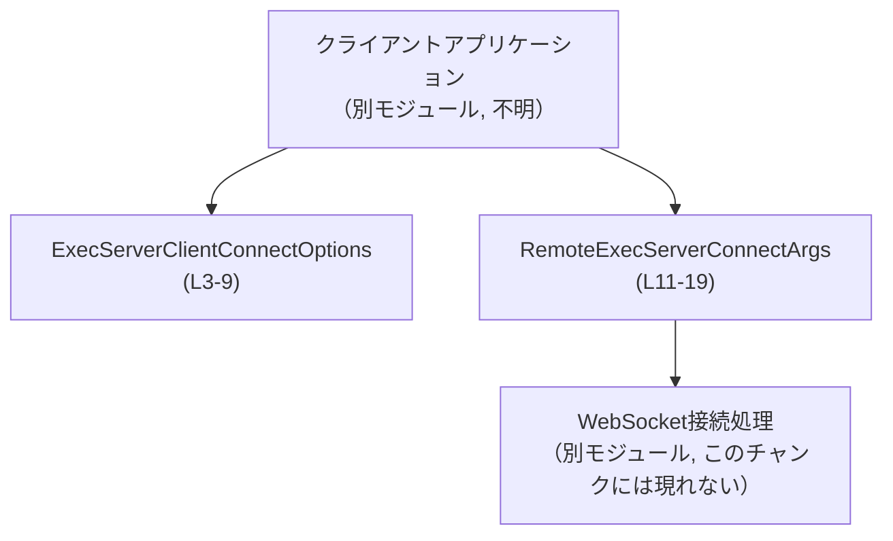

# exec-server/src/client_api.rs

## 0. ざっくり一言

exec-server クライアントがサーバーへ接続する際の「接続オプション」と「WebSocket 接続引数」を表す、2 つの公開構造体を定義しているモジュールです（`client_api.rs:L3-9`, `client_api.rs:L11-19`）。

---

## 1. このモジュールの役割

### 1.1 概要

- このモジュールは、exec-server クライアントの接続設定を表現するための **データ型** を提供します。
- 1 つは任意のトランスポート（通信方式）で共通に使える接続オプション（`ExecServerClientConnectOptions`）、もう 1 つは WebSocket 用の接続引数（`RemoteExecServerConnectArgs`）です（コメントより, `client_api.rs:L3`, `client_api.rs:L11`）。
- どちらも単なるデータキャリア（フィールドを持つだけの構造体）であり、このファイルにはロジック（関数）は定義されていません。

### 1.2 アーキテクチャ内での位置づけ

コードからわかる事実:

- このモジュールは標準ライブラリの `std::time::Duration` に依存しています（`client_api.rs:L1`）。
- 2 つの構造体はどちらも `pub` であり、crate の外からも利用される公開 API です（`client_api.rs:L5`, `client_api.rs:L13`）。
- 2 つの構造体間には **直接の参照関係や変換ロジックはありません**（このファイル内には存在しません）。

コメントとフィールド構成から読み取れる「概念的な」位置づけを図示します（関係はコメントからの解釈であり、コード上の依存ではありません）。



- `ExecServerClientConnectOptions (L3-9)` は「どのトランスポートでも共通の接続オプション」（コメントより, `client_api.rs:L3`）。
- `RemoteExecServerConnectArgs (L11-19)` は「リモート exec-server への WebSocket 接続引数」（コメントより, `client_api.rs:L11`）。
- 実際にどのモジュールがこれらを利用しているかは、このチャンクには現れません（不明）。

### 1.3 設計上のポイント

- **データのみを保持する構造体**
  - どちらもメソッドを持たない、フィールドだけの構造体です（`client_api.rs:L5-9`, `client_api.rs:L13-19`）。
- **派生トレイト**
  - `#[derive(Debug, Clone, PartialEq, Eq)]` が付いており（`client_api.rs:L4`, `client_api.rs:L12`）、
    - `Debug`: デバッグ表示が可能
    - `Clone`: 値の複製が可能
    - `PartialEq`, `Eq`: 等値比較が可能
- **オプションのセッション再開**
  - 両方の構造体に `resume_session_id: Option<String>` があり（`client_api.rs:L8`, `client_api.rs:L18`）、
    セッション再開 ID が **ある場合だけ Some(String)** で渡す設計になっています。
- **タイムアウトの明示**
  - 両方とも `Duration` 型のタイムアウトを持ち（`client_api.rs:L7`, `client_api.rs:L16-17`）、
    初期化タイムアウト・接続タイムアウトを明示的に指定できるようになっています。

---

## 2. 主要な機能一覧

このファイルは関数ではなく「設定オブジェクト」を提供します。

- `ExecServerClientConnectOptions`: 任意のクライアントトランスポートで共通に使う接続オプション（`client_api.rs:L3-9`）。
- `RemoteExecServerConnectArgs`: リモート exec-server へ WebSocket で接続するための詳細な引数（`client_api.rs:L11-19`）。

---

## 3. 公開 API と詳細解説

### 3.1 型一覧（構造体・列挙体など）

| 名前 | 種別 | 役割 / 用途 | 主なフィールド | 定義位置 |
|------|------|-------------|----------------|----------|
| `ExecServerClientConnectOptions` | 構造体 | 任意の exec-server クライアントトランスポートのための共通接続オプションを保持する | `client_name: String`, `initialize_timeout: Duration`, `resume_session_id: Option<String>` | `client_api.rs:L3-9` |
| `RemoteExecServerConnectArgs` | 構造体 | リモート exec-server への WebSocket 接続に必要な引数をまとめる | `websocket_url: String`, `client_name: String`, `connect_timeout: Duration`, `initialize_timeout: Duration`, `resume_session_id: Option<String>` | `client_api.rs:L11-19` |

#### `ExecServerClientConnectOptions` のフィールド（詳細）

- `client_name: String`（`client_api.rs:L6`）  
  クライアントを識別するための名前です。サーバー側のログやモニタリングで使用される可能性があります。
- `initialize_timeout: Duration`（`client_api.rs:L7`）  
  接続の初期化に許容する最大時間を表します。
- `resume_session_id: Option<String>`（`client_api.rs:L8`）  
  以前のセッションを再開したい場合のセッション ID。再開しない場合は `None`。

#### `RemoteExecServerConnectArgs` のフィールド（詳細）

- `websocket_url: String`（`client_api.rs:L14`）  
  exec-server に接続する WebSocket URL。
- `client_name: String`（`client_api.rs:L15`）  
  クライアント名。`ExecServerClientConnectOptions` と同じ意味合いと解釈できます。
- `connect_timeout: Duration`（`client_api.rs:L16`）  
  WebSocket 接続の確立に許容する最大時間。
- `initialize_timeout: Duration`（`client_api.rs:L17`）  
  接続後の初期化処理に許容する最大時間。
- `resume_session_id: Option<String>`（`client_api.rs:L18`）  
  セッション再開用 ID。`None` の場合は新規セッションとして扱われることが想定されます。

### 3.2 関数詳細（最大 7 件）

このファイルには関数・メソッドの定義はありません（`fn` が一切登場しません）。

### 3.3 その他の関数

- 該当なし（このファイルには補助的な関数も定義されていません）。

---

## 4. データフロー

このモジュール単体では処理ロジックがないため、**典型的な利用イメージ** に基づくデータフローを示します。  
実際の呼び出し元・接続処理の実装はこのチャンクには現れないため、図中の「クライアントアプリ」「WebSocket 接続処理」は抽象的なコンポーネントとして表現します。

```mermaid
sequenceDiagram
    participant App as クライアントアプリ
    participant Opt as ExecServerClientConnectOptions (L3-9)
    participant WsArgs as RemoteExecServerConnectArgs (L11-19)
    participant Ws as WebSocket接続処理（別モジュール）

    App->>Opt: 接続オプションを構築\n(client_name, initialize_timeout, resume_session_id)
    App->>WsArgs: WebSocket接続引数を構築\n(websocket_url, client_name, timeouts, resume_session_id)
    App->>Ws: WsArgsを渡して接続開始
    Ws-->>App: 接続成功／失敗を返却
```

要点:

- アプリケーションコードが `ExecServerClientConnectOptions` と `RemoteExecServerConnectArgs` を組み立ててから、別モジュールの WebSocket 接続処理に渡す、という流れが想定されます（コメントとフィールド名からの推測）。
- どのようなエラー型や戻り値で結果が返るかは、このファイルからは分かりません（不明）。

---

## 5. 使い方（How to Use）

### 5.1 基本的な使用方法

典型的な利用として、クライアントコード内で 2 つの構造体を構築し、接続処理に渡す例を示します。

```rust
use std::time::Duration;

// 同一 crate 内から使う場合の例（パスはファイル構成からの推測）
use crate::client_api::{
    ExecServerClientConnectOptions,
    RemoteExecServerConnectArgs,
};

fn main() {
    // 共通の接続オプションを構築する
    let common_opts = ExecServerClientConnectOptions {
        client_name: "my-client".to_string(),                 // クライアント名
        initialize_timeout: Duration::from_secs(30),          // 初期化タイムアウト
        resume_session_id: None,                              // 新規セッションとして開始
    };

    // WebSocket 用の接続引数を構築する
    let ws_args = RemoteExecServerConnectArgs {
        websocket_url: "wss://example.com/exec".to_string(),  // WebSocket URL
        client_name: common_opts.client_name.clone(),         // 名前を再利用するので clone
        connect_timeout: Duration::from_secs(10),             // 接続確立のタイムアウト
        initialize_timeout: common_opts.initialize_timeout,   // 共通設定を流用
        resume_session_id: common_opts.resume_session_id.clone(), // セッション再開 ID（今回は None）
    };

    // ここで ws_args を WebSocket 接続処理（別モジュール）に渡す想定
    // connect_to_exec_server(ws_args).await?;  // この関数はこのチャンクには現れません
}
```

このコードでは所有権に注意しています。

- `client_name` は `String` なので、`common_opts` から `ws_args` にコピーする際は `clone()` で複製しています。
- `initialize_timeout` は `Duration`（`Copy` な値型）なので、そのまま代入できます。
- `resume_session_id` は `Option<String>` なので、`clone()` で `Some`/`None` を含めた値を複製しています。

### 5.2 よくある使用パターン

1. **新規セッション vs セッション再開**

```rust
// 新規セッション
let opts_new = ExecServerClientConnectOptions {
    client_name: "client-new".into(),
    initialize_timeout: Duration::from_secs(30),
    resume_session_id: None, // セッション再開は行わない
};

// セッション再開
let opts_resume = ExecServerClientConnectOptions {
    client_name: "client-resume".into(),
    initialize_timeout: Duration::from_secs(30),
    resume_session_id: Some("session-1234".into()), // 再開したいセッション ID
};
```

1. **開発環境／本番環境でタイムアウトを変える**

```rust
fn connect_timeout_for_env(is_production: bool) -> Duration {
    if is_production {
        Duration::from_secs(10) // 本番では少し長め
    } else {
        Duration::from_secs(2)  // 開発では短め
    }
}
```

このように `Duration` を使うことで、タイムアウト値の意味が明確になります（`client_api.rs:L1`, `client_api.rs:L7`, `client_api.rs:L16-17`）。

### 5.3 よくある間違い

このファイルから推測できる、起こり得る誤用例とその修正例を挙げます。

```rust
use std::time::Duration;

// ❌ 間違い例: 秒とミリ秒を取り違える
let args_wrong = RemoteExecServerConnectArgs {
    websocket_url: "wss://example.com/exec".to_string(),
    client_name: "client".to_string(),
    connect_timeout: Duration::from_millis(5), // 実質ほぼ即タイムアウト
    initialize_timeout: Duration::from_millis(10),
    resume_session_id: None,
};

// ✅ 正しい例: 意図した単位で Duration を指定する
let args_ok = RemoteExecServerConnectArgs {
    websocket_url: "wss://example.com/exec".to_string(),
    client_name: "client".to_string(),
    connect_timeout: Duration::from_secs(5),   // 5秒
    initialize_timeout: Duration::from_secs(10),
    resume_session_id: None,
};
```

```rust
// ❌ 間違い例: Option<String> に直接 String を代入しようとする
/*
let opts_wrong = ExecServerClientConnectOptions {
    client_name: "client".into(),
    initialize_timeout: Duration::from_secs(30),
    resume_session_id: "session-123".into(), // コンパイルエラー: Option<String> ではない
};
*/

// ✅ 正しい例: Some(...) で包む
let opts_ok = ExecServerClientConnectOptions {
    client_name: "client".into(),
    initialize_timeout: Duration::from_secs(30),
    resume_session_id: Some("session-123".into()),
};
```

### 5.4 使用上の注意点（まとめ）

- **前提条件**
  - `websocket_url` は WebSocket URL として妥当な形式である必要がありますが、フォーマットチェックはこの構造体では行われません（単なる `String` フィールドです, `client_api.rs:L14`）。
  - `client_name` の内容や長さに関する制約はこのファイルからは分かりません（不明）。
- **並行性**
  - フィールド型から、これらの構造体は `Send` / `Sync` を自動実装すると考えられます（`String`, `Duration`, `Option<String>` はいずれも `Send`/`Sync` を満たす標準型）。
  - `Clone` が derive されているため、スレッド間で共有したい場合は `Arc<...>` と組み合わせたり、必要に応じて `clone()` して利用できます（`client_api.rs:L4`, `client_api.rs:L12`）。
- **エラー・バリデーション**
  - 構造体自体にはバリデーションロジックがないため、異常値（極端に短いタイムアウトや空文字の URL 等）をどこで検証するかは別モジュール側の責務になります。
- **セキュリティ上の注意**
  - `resume_session_id` に機密性の高い情報（セッショントークンなど）を入れる場合、ログ出力（`Debug` 表示など）にそのまま出る可能性があります（`Debug` が derive 済み, `client_api.rs:L4`, `client_api.rs:L12`）。
    - セッション ID をログに出すかどうかは、利用側で制御する必要があります。

---

## 6. 変更の仕方（How to Modify）

### 6.1 新しい機能を追加する場合

ここでの「機能追加」は、新しい接続設定項目の追加を指します。

- **共通の接続設定を追加したい場合**
  - `ExecServerClientConnectOptions` にフィールドを追加するのが自然です（`client_api.rs:L5-9`）。
  - 例: 全トランスポート共通のリトライ回数など。
- **WebSocket 特有の設定を追加したい場合**
  - `RemoteExecServerConnectArgs` にフィールドを追加します（`client_api.rs:L13-19`）。
  - 例: サブプロトコル名、追加ヘッダなど。
- **追加時の注意点**
  - 両構造体は `pub` かつフィールドも `pub` なので、フィールド追加は **公開 API の変更** となります。
    - 新規フィールドを追加するだけなら多くの場合は後方互換ですが、初期化コードに `..Default::default()` などを使っていない場合、既存コードのコンパイルエラーにつながる可能性があります。
  - `Option<T>` でラップすることで、既存の呼び出し側に影響を与えずに新しい設定項目を追加しやすくなります。

### 6.2 既存の機能を変更する場合

- **フィールド名・型の変更**
  - `client_name` の型を変える、`Duration` を別の型に変えるなどは、すべて利用側に影響する破壊的変更になります。
- **契約（意味）の変更**
  - 例: `initialize_timeout` の意味を「全体のタイムアウト」から「最初のパケット受信までのタイムアウト」に変更する、といった意味的変更は、利用側の期待を壊す可能性があります。
  - コメント（`///`）を更新するだけでなく、利用箇所のロジックを確認する必要があります。この情報は他ファイルにあるため、このチャンクからは確認できません（不明）。
- **影響範囲の確認**
  - 構造体が `pub` であるため、crate 内外のどこからでも参照されている可能性があります。
  - Rust では `cargo grep` や IDE の「参照を検索」を使って、`ExecServerClientConnectOptions` / `RemoteExecServerConnectArgs` の利用箇所を洗い出すことが推奨されます。

---

## 7. 関連ファイル

このチャンクには他ファイルへの明示的な参照や `mod` 宣言がないため、具体的な関連ファイルは特定できません。

| パス | 役割 / 関係 |
|------|------------|
| `exec-server/src/client_api.rs` | 本ドキュメントの対象。クライアント接続用の公開構造体を定義するモジュール。 |
| （不明） | WebSocket 接続処理を実装するモジュール。`RemoteExecServerConnectArgs` を利用することが想定されるが、このチャンクには現れない。 |

---

### 付録: バグ / セキュリティ / テスト / パフォーマンス 観点（このファイルに限定）

- **バグの可能性**
  - このファイル自体はデータ定義のみであり、ロジック起因のバグは含まれていません。
  - バグは主に「これらの構造体をどう使うか」に依存します（例: 不適切なタイムアウト値）。
- **セキュリティ**
  - 構造体自体は安全な標準型のみをフィールドに持っており、メモリ安全性の問題は見当たりません。
  - ログ出力（`Debug`）やシリアライズ時に機密情報を扱うかどうかは利用側の設計次第です。
- **テスト**
  - このファイル内にはテストコード（`#[cfg(test)]` など）は存在しません。
  - これらの型を利用する接続ロジックのテストは、別モジュールで行うことになります（このチャンクには現れない）。
- **パフォーマンス / スケーラビリティ**
  - `String` や `Duration`、`Option<String>` といった軽量なデータ型のみで構成されているため、この構造体自体がパフォーマンスやスケーラビリティのボトルネックになることは通常想定されません。
  - `Clone` を多用する場合は、`String` / `Option<String>` の複製コストを考慮しつつ、必要なら `Arc<str>` などの共有型への変更を検討する余地があります（ただし、そのような変更はこのファイルには含まれていません）。
