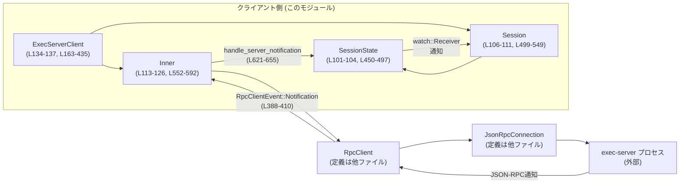
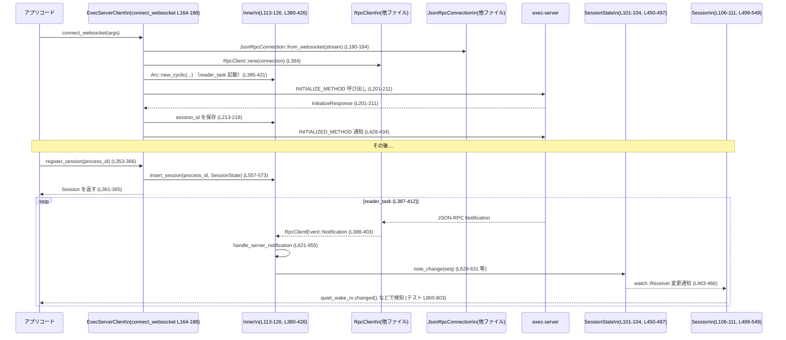

# exec-server/src/client.rs コード解説

※ 行番号は、このチャンク内を 1 行目から通しで数えたものです。実ファイルと完全には一致しない可能性があります。表記は `exec-server/src/client.rs:L開始-終了` 形式で示します。

---

## 0. ざっくり一言

このモジュールは、JSON-RPC over WebSocket/stdio を使って外部の「exec-server」と通信する非同期クライアントです。  
プロセス実行と標準入出力のストリーミング、リモートファイルシステム操作、および各プロセス単位の通知処理・エラー管理を行います。

---

## 1. このモジュールの役割

### 1.1 概要

- このモジュールは **リモート実行サーバー（exec-server）との JSON-RPC 通信** を扱うクライアントを提供します。
- 主な責務は次のとおりです。
  - WebSocket/stdio 経由でサーバーへ接続し、`initialize` ハンドシェイクを実行すること（`ExecServerClient::connect_websocket`, `initialize`）。  
    （`connect_websocket`: L164-188, `initialize`: L190-227）
  - `exec`, `read`, `write`, `terminate` などの **プロセス実行 API** と、`fs_*` 系の **ファイルシステム API** をラップして提供すること（L229-351）。
  - サーバーからの JSON-RPC **通知ストリームを 1 本受け取り、プロセス ID ごとのセッションに振り分けること**（`Inner`, `SessionState`, `handle_server_notification`: L113-126, L450-497, L621-655）。

### 1.2 アーキテクチャ内での位置づけ

このモジュールに登場する主要コンポーネントの関係を簡略化すると、次のようになります。



- `ExecServerClient` は外部から使うメイン API です（L134-137, L163-435）。
- `Inner` は、`RpcClient`・セッションレジストリ・通知読み取りタスクなどの **共有内部状態** をまとめた構造体です（L113-126）。
- `Session` と `SessionState` は **1 プロセスごとのローカル状態** と **通知用 watch チャネル** を表現します（L101-111, L450-497, L499-549）。

`RpcClient`, `JsonRpcConnection`, 各種 `*Params` / `*Response` 型はこのチャンク外で定義されており、ここでは詳細は分かりません。

### 1.3 設計上のポイント

コードから読み取れる特徴を列挙します。

- **JSON-RPC ベースの抽象化**
  - すべての RPC 呼び出しは `RpcClient::call` / `notify` を通じて行われ、メソッド名は `crate::protocol` の定数で指定されます（例: `EXEC_METHOD`, `FS_READ_FILE_METHOD` など: L21, L35）。
- **エラーの集約**
  - 通信/プロトコル/JSON エラーを `ExecServerError` に集約しています（L139-161）。
  - `impl From<RpcCallError> for ExecServerError` により、RPC 呼び出し系はすべてこの 1 つのエラー型で扱えます（L437-447）。
- **非同期・並行処理**
  - `tokio` の `spawn` で JSON-RPC イベント読み取りタスクを走らせ、`RpcClientEvent` を処理します（L387-412）。
  - 各プロセスの通知は `watch::Sender<u64>` / `watch::Receiver<u64>` で表現されます（`SessionState`: L101-104, L450-497）。
  - セッションレジストリには `ArcSwap<HashMap<ProcessId, Arc<SessionState>>>` を使い、**読み取りパスをロックフリーに近づけつつ、書き込み側のみ Mutex で直列化**しています（L113-123, L552-592）。
- **接続ライフサイクル**
  - `Inner` の `Drop` 実装で通知読み取りタスクを abort し、クライアント破棄時にバックグラウンドタスクを確実に止めます（L128-132）。
  - 接続断や通知処理エラー時には `fail_all_sessions` で全セッション状態を「失敗」に更新します（L613-618）。
- **タイムアウト管理**
  - WebSocket 接続と initialize ハンドシェイクは `tokio::time::timeout` で明示的なタイムアウトがかかります（L66-67, L164-188, L190-227）。

---

## 2. 主要な機能一覧

このモジュールが提供する主な機能です。

- exec-server への WebSocket 接続確立と initialize ハンドシェイク  
  （`ExecServerClient::connect_websocket`, `initialize`: L164-188, L190-227）
- リモートプロセスの起動・制御  
  （`exec`, `read`, `write`, `terminate`: L229-277）
- リモートファイルシステム操作  
  （`fs_read_file`, `fs_write_file`, `fs_create_directory`, `fs_get_metadata`, `fs_read_directory`, `fs_remove`, `fs_copy`: L279-351）
- プロセスごとのセッション登録・解除と通知購読  
  （`register_session`, `unregister_session`, `Session`/`SessionState`: L353-370, L499-549）
- exec-server からの通知（出力, 終了, クローズ）をセッションに振り分けて wake する  
  （`handle_server_notification`, `Inner::get_session/remove_session`, `SessionState::note_change`: L552-592, L621-655, L463-466）
- 接続断や通知処理失敗時の全セッションへのエラー伝播  
  （`fail_all_sessions`, `SessionState::set_failure`, `Session::read`: L613-618, L468-476, L508-536）

---

## 3. 公開 API と詳細解説

### 3.1 コンポーネントインベントリー（型一覧）

| 名前 | 種別 | 行範囲 | 役割 / 用途 |
|------|------|--------|-------------|
| `ExecServerClientConnectOptions` | 構造体（他ファイル定義） | impl: `exec-server/src/client.rs:L69-87` | クライアントの initialize 時のオプション（`client_name`, `initialize_timeout`, `resume_session_id`）の設定。ここでは `Default` と `From<RemoteExecServerConnectArgs>` が実装されています。 |
| `RemoteExecServerConnectArgs` | 構造体（他ファイル定義） | impl: `exec-server/src/client.rs:L79-99` | WebSocket 接続時の引数（URL, タイムアウト等）。ここでは `new` と `From` 変換が定義されています。 |
| `SessionState` | 構造体 | `exec-server/src/client.rs:L101-104, L450-497` | 各プロセスセッションの内部状態。wake 通知用 `watch::Sender<u64>` と、接続断などの失敗メッセージ（`Mutex<Option<String>>`）を保持。 |
| `Session` | 構造体 | `exec-server/src/client.rs:L106-111, L499-549` | 1 プロセスに対応するハンドル。`ExecServerClient` と `ProcessId`, `Arc<SessionState>` を持ち、read/write/terminate/unregister を提供。 |
| `Inner` | 構造体 | `exec-server/src/client.rs:L113-126, L552-592` | `ExecServerClient` の内部共有状態。`RpcClient`, セッションレジストリ、`session_id`、JSON-RPC イベント読み取りタスクを保持。 |
| `ExecServerClient` | 構造体 | `exec-server/src/client.rs:L134-137, L163-435` | 外部に公開される exec-server クライアント。RPC 呼び出しやセッション登録 API を提供。 |
| `ExecServerError` | 列挙体 | `exec-server/src/client.rs:L139-161, L437-447` | exec-server クライアント全体で使うエラー型。接続失敗、タイムアウト、JSON エラー、サーバーエラーなどを表現。 |

### 3.2 重要な関数の詳細

（最大 7 件）

#### `ExecServerClient::connect_websocket(args: RemoteExecServerConnectArgs) -> Result<Self, ExecServerError>`

**概要**  
WebSocket URL やタイムアウトを含む `RemoteExecServerConnectArgs` から exec-server に接続し、JSON-RPC 接続を作成した上で `initialize` ハンドシェイクまで完了した `ExecServerClient` を返します（L164-188）。

**引数**

| 引数名 | 型 | 説明 |
|--------|----|------|
| `args` | `RemoteExecServerConnectArgs` | WebSocket URL・接続タイムアウト・initialize タイムアウト・クライアント名など（定義は他ファイル）。ここでは `websocket_url` と `connect_timeout` を利用（L167-168）。 |

**戻り値**

- `Ok(ExecServerClient)` : 接続と initialize が成功し、通知読み取りタスクも起動済みのクライアント。
- `Err(ExecServerError)` : 接続タイムアウト (`WebSocketConnectTimeout`)、接続エラー (`WebSocketConnect`)、または initialize 失敗など。

**内部処理の流れ**

1. `websocket_url` と `connect_timeout` を `args` から取得（L167-168）。
2. `tokio::time::timeout` で `connect_async` をラップし、WebSocket 接続を試みる（L169-178）。
   - タイムアウト → `ExecServerError::WebSocketConnectTimeout`（L171-174）。
   - 接続エラー → `ExecServerError::WebSocketConnect`（L175-178）。
3. 成功した `stream` から `JsonRpcConnection::from_websocket` を作成（L180-184）。
4. `Self::connect(connection, args.into())` を呼び出し、内部状態の構築と initialize を行う（L180-187）。

**Examples（使用例）**

```rust
use crate::client_api::RemoteExecServerConnectArgs;
use crate::client::ExecServerClient; // 実際のパスは仮

#[tokio::main]
async fn main() -> Result<(), Box<dyn std::error::Error>> {
    // 引数を作成（L90-98 の new を使用）
    let args = RemoteExecServerConnectArgs::new(
        "ws://localhost:12345/exec".to_string(),
        "my-client".to_string(),
    );

    // WebSocket 接続と initialize をまとめて実行
    let client = ExecServerClient::connect_websocket(args).await?;
    println!("session_id = {:?}", client.session_id()); // L372-378

    Ok(())
}
```

**Errors / Panics**

- 接続が `connect_timeout` を超過した場合:
  - `ExecServerError::WebSocketConnectTimeout { url, timeout }`（L171-174）。
- WebSocket 接続が何らかの理由で失敗した場合:
  - `ExecServerError::WebSocketConnect { url, source }`（L175-178）。
- `Self::connect` からのエラーとして、`InitializeTimedOut` や `Server` などが返される可能性があります（L380-426, L190-227, L437-447）。
- この関数内でパニックするコードは見当たりません。

**Edge cases（エッジケース）**

- 引数 `args.websocket_url` が不正な形式の場合、`connect_async` のエラーとして `WebSocketConnect` に包まれます（L175-178）。
- `args.connect_timeout` が極端に短いと、接続前にタイムアウトする可能性があります（L169-174）。

**使用上の注意点**

- 接続後にセッション ID を取得したい場合は、`connect_websocket` の戻り値から `session_id()` を参照します（L372-378）。
- `ExecServerClient::connect_websocket` は `initialize` まで内部で実行するため、呼び出し側で追加の `initialize` を行う必要はありません（L380-426）。
- この関数は `async` であり、Tokio ランタイム上で呼び出す必要があります。

---

#### `ExecServerClient::initialize(&self, options: ExecServerClientConnectOptions) -> Result<InitializeResponse, ExecServerError>`

**概要**  
既存の JSON-RPC 接続を使って exec-server に `INITIALIZE_METHOD` を呼び出し、セッション ID を取得し、`INITIALIZED_METHOD` 通知を送るまでを行います（L190-227）。`connect_websocket` から内部的に使われます。

**引数**

| 引数名 | 型 | 説明 |
|--------|----|------|
| `options` | `ExecServerClientConnectOptions` | クライアント名、initialize タイムアウト、resume セッション ID など（L194-198で分解）。 |

**戻り値**

- `Ok(InitializeResponse)` : サーバーから返された initialize レスポンス。`response.session_id` が含まれます（L201-211）。
- `Err(ExecServerError)` : タイムアウト (`InitializeTimedOut`)、JSON エラー、サーバーエラーなど。

**内部処理の流れ**

1. `options` から `client_name`, `initialize_timeout`, `resume_session_id` を取り出す（L194-198）。
2. `initialize_timeout` で `timeout` をかけた非同期ブロックを実行（L200-223）。
3. ブロック内で:
   - `RpcClient::call` により `INITIALIZE_METHOD` を呼び、`InitializeParams` を送信（L201-211）。
   - 成功した `response.session_id` を `inner.session_id` の `RwLock<Option<String>>` に保存（L213-219）。
   - `notify_initialized()` を呼んで、`INITIALIZED_METHOD` 通知を送信（L220, L428-434）。
4. `timeout` の外側で:
   - タイムアウトした場合は `ExecServerError::InitializeTimedOut { timeout }` を返す（L224-226）。
   - それ以外の RPC エラーは `ExecServerError` に変換されてそのまま戻ります（`?` / L211, L437-447）。

**Examples（使用例）**

`connect_websocket` が内部で呼ぶため、通常は直接呼び出す必要はありませんが、低レベル API として使う場合の例です。

```rust
// 既に JsonRpcConnection から ExecServerClient を構築済みと仮定
let client: ExecServerClient = /*...*/;

// デフォルトオプションで initialize を再実行する例
let options = ExecServerClientConnectOptions::default(); // L69-77
let resp = client.initialize(options).await?;
println!("session_id = {}", resp.session_id);
```

**Errors / Panics**

- タイムアウト → `ExecServerError::InitializeTimedOut`（L224-226）。
- RPC 呼び出し失敗 → `ExecServerError`（`From<RpcCallError>`: L437-447）。
- JSON シリアライズ/デシリアライズ失敗 → `ExecServerError::Json`（L155-156, L428-434）。
- `session_id` の `RwLock` が poisoned の場合でも、`unwrap_or_else(PoisonError::into_inner)` で中身を取り出し、パニックを避けています（L213-219）。

**Edge cases**

- `resume_session_id` が `Some` 場合の挙動はサーバー側の実装に依存し、このチャンクからは分かりません。
- `initialize_timeout` に `Duration::from_secs(0)` 相当を渡すと、ほぼ即座にタイムアウトする可能性があります（L200-223）。

**使用上の注意点**

- `connect_websocket` を使う場合は、明示的に呼び出す必要は通常ありません。
- 一度 initialize 済みのクライアントに対して再度呼ぶことが妥当かどうかは、サーバープロトコル仕様に依存し、このチャンクからは判断できません。

---

#### `ExecServerClient::exec(&self, params: ExecParams) -> Result<ExecResponse, ExecServerError>`

**概要**  
exec-server に対して新しいプロセスの起動を要求する JSON-RPC メソッド `EXEC_METHOD` を呼び出します（L229-235）。

**引数**

| 引数名 | 型 | 説明 |
|--------|----|------|
| `params` | `ExecParams` | 起動するコマンド、引数、環境変数など（定義は他ファイル。このチャンクでは中身は不明）。 |

**戻り値**

- `Ok(ExecResponse)` : プロセス ID などの情報を含む開始レスポンス（詳細は他ファイル）。
- `Err(ExecServerError)` : RPC エラー。

**内部処理の流れ**

1. `self.inner.client.call(EXEC_METHOD, &params)` を実行（L230-233）。
2. `RpcCallError` を `Into<ExecServerError>` で変換し (`map_err(Into::into)`)、結果を返却（L234-235）。

**Examples（使用例）**

```rust
let exec_resp = client
    .exec(ExecParams {
        // 実際のフィールドは crate::protocol 内で定義
        // ここでは擬似的な例
        // cmd: "ls".into(),
        // args: vec!["-la".into()],
    })
    .await?;

// 返された process_id を使って Session を登録
let process_id = exec_resp.process_id.clone(); // 実際のフィールド名は不明
let session = client.register_session(&process_id).await?;
```

**Errors / Panics**

- `RpcClient::call` の結果に応じて `ExecServerError::Closed`, `Json`, `Server` などが返り得ます（L437-447）。
- この関数自体にはパニックを起こすコードはありません。

**Edge cases**

- exec-server 側で拒否された場合（例: 不正なコマンド）、`ExecServerError::Server { code, message }` が返る可能性があります（L159-160, L437-447）。
- `ExecParams` の中身が不適切（未定義のフィールドなど）な場合の挙動は、このチャンクからは分かりません。

**使用上の注意点**

- `exec` を呼んだだけでは `Session` は作成されないため、通知を受け取りたい場合は別途 `register_session` を呼ぶ必要があります（L353-366）。
- プロセス ID の取り出し方法は `ExecResponse` の定義に依存します（このチャンクには現れません）。

---

#### `ExecServerClient::read(&self, params: ReadParams) -> Result<ReadResponse, ExecServerError>`

**概要**  
リモートプロセスの出力（標準出力/標準エラーなど）を読み取るために、`EXEC_READ_METHOD` を直接呼び出す低レベル API です（L237-243）。`Session::read` が高レベルラッパーとしてこれを利用しています（L518-526）。

**引数**

| 引数名 | 型 | 説明 |
|--------|----|------|
| `params` | `ReadParams` | `process_id`, `after_seq`, `max_bytes`, `wait_ms` などを含む読み取り条件（L520-525）。 |

**戻り値**

- `Ok(ReadResponse)` : 出力チャンクと次のシーケンス番号などを含むレスポンス（L486-495 参照）。
- `Err(ExecServerError)` : RPC エラー。

**内部処理の流れ**

1. `self.inner.client.call(EXEC_READ_METHOD, &params)` を実行（L238-241）。
2. エラーを `ExecServerError` に変換（L242-243）。

**Examples（使用例）**

通常は `Session::read` 経由で使うため、直接使用する例は次のようになります。

```rust
let resp = client
    .read(ReadParams {
        process_id: some_process_id.clone(),
        after_seq: None,
        max_bytes: Some(1024),
        wait_ms: Some(500),
    })
    .await?;
for chunk in resp.chunks {
    // chunk の内容を利用
}
```

**Errors / Panics**

- `RpcClient::call` の結果に応じて `ExecServerError` が返ります（L437-447）。
- この関数内でのパニックはありません。

**Edge cases**

- `wait_ms` によるサーバー側のブロッキングやタイムアウトの仕様は、このチャンクには現れません。
- `process_id` が未登録の場合のサーバー側挙動も、このチャンクからは分かりません。

**使用上の注意点**

- 接続断時のエラー処理やセッション状態の管理は `Session::read` で行われるため、通常は `Session::read` を優先して利用するのが安全です（L508-536）。

---

#### `Session::read(&self, after_seq: Option<u64>, max_bytes: Option<usize>, wait_ms: Option<u64>) -> Result<ReadResponse, ExecServerError>`

**概要**  
特定のプロセスセッションに対する高レベルな read API です。内部で `ExecServerClient::read` を呼びつつ、接続断などの「全セッション失敗」を検知して合成レスポンスを返します（L508-536）。

**引数**

| 引数名 | 型 | 説明 |
|--------|----|------|
| `after_seq` | `Option<u64>` | どのシーケンス番号以降の出力を取得するか。 |
| `max_bytes` | `Option<usize>` | 一度に取得する最大バイト数。 |
| `wait_ms` | `Option<u64>` | 出力が来るまでサーバー側で待つ最大時間 (ミリ秒)。 |

**戻り値**

- `Ok(ReadResponse)` : 通常の read レスポンス、または接続断時の合成失敗レスポンス。

**内部処理の流れ**

1. まず `self.state.failed_response().await` を確認し、すでにセッションが「失敗」状態なら、即座に合成失敗レスポンスを返す（L514-516, L478-484）。
2. そうでなければ、`self.client.read(ReadParams { ... })` を呼び出す（L518-526）。
3. 結果に応じて分岐（L528-535）:
   - `Ok(response)` → そのまま返却（L528）。
   - `Err(err)` かつ `is_transport_closed_error(&err)` → 接続断とみなす（L529-533）。
     - `disconnected_message(None)` でメッセージ生成（L530, L595-599）。
     - `self.state.set_failure(message.clone()).await` でセッション状態を「失敗」に更新（L531, L468-476）。
     - `self.state.synthesized_failure(message)` を返却（L532, L486-495）。
   - 上記以外のエラー → そのまま `Err(err)` を返す（L534-535）。

**Examples（使用例）**

```rust
// 事前に Session を取得しているとする
let session: Session = client.register_session(&process_id).await?;

// 出力をポーリングする例
let mut after_seq = None;
loop {
    let resp = session.read(after_seq, Some(4096), Some(1000)).await?;
    for chunk in &resp.chunks {
        // チャンクを処理
    }
    if resp.exited && resp.closed {
        // プロセス終了
        break;
    }
    after_seq = Some(resp.next_seq);
}
```

**Errors / Panics**

- 接続断以外の RPC エラーは、そのまま `Err(ExecServerError)` として返ります（L534-535）。
- チャネルやミューテックスが poisoned しても、`Mutex` / `watch` はパニックを起こさない API を使用しているため、明示的なパニックは見当たりません。

**Edge cases**

- `fail_all_sessions` により `SessionState::set_failure` が呼ばれた場合（L613-618, L468-476）、次回以降の `Session::read` 呼び出しは RPC を行わずに合成失敗レスポンスを返します（L514-516, L478-484）。
- `is_transport_closed_error` は `ExecServerError::Closed` と、`Server { code: -32000, message == "JSON-RPC transport closed" }` の 2 パターンのみを「接続断」とみなします（L602-611）。
- `after_seq`, `max_bytes`, `wait_ms` がすべて `None` の場合のサーバー側挙動は、このチャンクには現れません。

**使用上の注意点**

- 接続断後にも `Session::read` を呼ぶと、**毎回合成失敗レスポンスが返り続ける** 想定の実装です（L478-495）。そのため、呼び出し側で `failure` フィールドや `exited/closed` を見てループを終了させる必要があります。
- `Session::read` は `register_session` 済みのセッション前提です。未登録プロセス ID に対する挙動はサーバー側依存で、このチャンクからは分かりません。

---

#### `Inner::insert_session(&self, process_id: &ProcessId, session: Arc<SessionState>) -> Result<(), ExecServerError>`

**概要**  
セッションレジストリに新しい `process_id -> SessionState` の対応を追加します。既に同じ `process_id` のセッションがある場合はプロトコルエラーを返します（L557-573）。

**引数**

| 引数名 | 型 | 説明 |
|--------|----|------|
| `process_id` | `&ProcessId` | セッションに結びつけるプロセス ID。 |
| `session` | `Arc<SessionState>` | 登録するセッション状態。 |

**戻り値**

- `Ok(())` : 正常に登録できた場合。
- `Err(ExecServerError::Protocol)` : 同じ `process_id` のセッションが既に存在していた場合（L562-567）。

**内部処理の流れ**

1. `sessions_write_lock` を `lock().await` し、登録処理の同時実行を制限（L562）。
2. 現在の `sessions` マップを `self.sessions.load()` で取得（L563）。
3. `contains_key(process_id)` で重複をチェックし、存在していれば `ExecServerError::Protocol` を返す（L564-567）。
4. `sessions.as_ref().clone()` でマップをコピーし、新しい `process_id` と `session` を挿入（L569-570）。
5. `self.sessions.store(Arc::new(next_sessions))` で新しいマップを公開（L571）。

**Examples（使用例）**

通常は `ExecServerClient::register_session` 経由で呼び出されます（L353-366）。

```rust
let session_state = Arc::new(SessionState::new());
inner.insert_session(&process_id, session_state.clone()).await?;
```

**Errors / Panics**

- 重複登録時には `ExecServerError::Protocol("session already registered for process {process_id}")` を返します（L565-567）。
- `ArcSwap::load` / `store` まわりにパニックを起こすコードは見当たりません。

**Edge cases**

- `ProcessId` の等価性（`Eq`/`Hash` 実装）に依存しているため、ID の区別がどのように行われるかは `ProcessId` の定義によります（このチャンクには現れません）。
- 連続して大量に `insert_session` が呼ばれると、マップのコピーコストが発生します（L569-571）。

**使用上の注意点**

- プロセスごとに **必ず 1 回だけ** 登録する前提の契約になっています。再登録が必要な場合は、`remove_session` を先に呼ぶ設計にする必要があります（L575-583）。

---

#### `handle_server_notification(inner: &Arc<Inner>, notification: JSONRPCNotification) -> Result<(), ExecServerError>`

**概要**  
exec-server からの JSON-RPC 通知を解釈し、該当プロセスの `SessionState` に wake 通知を送る役割を持っています（L621-655）。  
以下の通知を扱います。

- `EXEC_OUTPUT_DELTA_METHOD`
- `EXEC_EXITED_METHOD`
- `EXEC_CLOSED_METHOD`

**引数**

| 引数名 | 型 | 説明 |
|--------|----|------|
| `inner` | `&Arc<Inner>` | セッションレジストリを含む内部状態への共有ポインタ。 |
| `notification` | `JSONRPCNotification` | メソッド名と params を持つ JSON-RPC 通知オブジェクト。 |

**戻り値**

- `Ok(())` : 通知を正常に処理した場合。
- `Err(ExecServerError::Json)` : `params` のデシリアライズに失敗した場合など。

**内部処理の流れ**

1. `notification.method.as_str()` でメソッド名を取り出し、`match` で分岐（L625）。
2. 各ケースで `serde_json::from_value` を用いて適切な通知構造体にデシリアライズする（L627-628, L634-635, L641-642）。
3. `inner.get_session(&params.process_id)` または `inner.remove_session(&params.process_id)` で該当セッションを取り出す（L629, L636, L645）。
4. セッションが存在すれば `session.note_change(params.seq)` を呼ぶ（L630, L637, L646-647）。
   - `SessionState::note_change` は `watch::Sender` に新しい seq を送信します（L463-466）。
5. 未知のメソッドは `tracing::debug!` でログを出し、何もせずに `Ok(())`（L650-652）。

**Examples（使用例）**

通常は `Inner` 内の reader タスクから呼ばれます（L388-403）。

```rust
// RpcClientEvent::Notification(notification) を受け取った際の処理
if let Err(err) = handle_server_notification(&inner, notification).await {
    fail_all_sessions(&inner, format!("exec-server notification handling failed: {err}")).await;
}
```

**Errors / Panics**

- `serde_json::from_value` でデシリアライズに失敗すると `serde_json::Error` が返り、それが `ExecServerError::Json` に変換されます（L627-628 など）。
- そのエラーは reader タスク側で検知され、`fail_all_sessions` が呼ばれる設計になっています（L391-399, L613-618）。
- この関数自身はパニックを起こすコードを持っていません。

**Edge cases**

- 通知に `params` が含まれない場合 (`notification.params` が `None`) は、`Value::Null` を `from_value` しようとしてデシリアライズエラーになります（L627-628 など）。
- `EXEC_CLOSED_METHOD` では、最初にセッションをレジストリから外してから wake を飛ばすため、以降の通知では wake されなくなります（L643-647）。
- 未知の通知メソッドは無視されますが、`debug!` ログが出るため、デバッグ時には確認できます（L650-652）。

**使用上の注意点**

- 通知処理に失敗すると `fail_all_sessions` が呼ばれ、**全セッションが一斉に失敗状態** になります（L391-401, L613-618）。不正な通知が 1 つでも来ると影響範囲は大きい点に注意が必要です。

---

### 3.3 その他の関数一覧

| 関数名 | 行範囲 | 役割（1 行） |
|--------|--------|--------------|
| `ExecServerClient::write` | `exec-server/src/client.rs:L245-261` | 指定プロセスにバイト列チャンクを書き込む RPC (`EXEC_WRITE_METHOD`)。 |
| `ExecServerClient::terminate` | L263-277 | 指定プロセスに終了要求を送る RPC (`EXEC_TERMINATE_METHOD`)。 |
| `ExecServerClient::fs_read_file` | L279-288 | リモートファイル読み込み RPC (`FS_READ_FILE_METHOD`)。 |
| `ExecServerClient::fs_write_file` | L290-299 | リモートファイル書き込み RPC (`FS_WRITE_FILE_METHOD`)。 |
| `ExecServerClient::fs_create_directory` | L301-310 | ディレクトリ作成 RPC (`FS_CREATE_DIRECTORY_METHOD`)。 |
| `ExecServerClient::fs_get_metadata` | L312-321 | ファイルメタデータ取得 RPC (`FS_GET_METADATA_METHOD`)。 |
| `ExecServerClient::fs_read_directory` | L323-332 | ディレクトリエントリ一覧取得 RPC (`FS_READ_DIRECTORY_METHOD`)。 |
| `ExecServerClient::fs_remove` | L334-343 | ファイル/ディレクトリ削除 RPC (`FS_REMOVE_METHOD`)。 |
| `ExecServerClient::fs_copy` | L345-351 | ファイル/ディレクトリコピー RPC (`FS_COPY_METHOD`)。 |
| `ExecServerClient::register_session` | L353-366 | 新しい `Session` を作成し、セッションレジストリに登録する。 |
| `ExecServerClient::unregister_session` | L368-370 | セッションレジストリから指定プロセス ID を削除する。 |
| `ExecServerClient::session_id` | L372-378 | initialize で取得したセッション ID を返す。 |
| `ExecServerClient::connect` | L380-426 | 汎用 `JsonRpcConnection` から `ExecServerClient` を構築し initialize する内部関数。 |
| `ExecServerClient::notify_initialized` | L428-434 | `INITIALIZED_METHOD` 通知を送る内部関数。 |
| `RemoteExecServerConnectArgs::new` | L89-99 | WebSocket 用の標準的な接続引数を構築するコンストラクタ。 |
| `SessionState::new` | L451-457 | wake チャネルを初期化し、失敗状態なしで `SessionState` を作成する。 |
| `SessionState::subscribe` | L459-461 | watch チャネルの Receiver を返す。 |
| `SessionState::note_change` | L463-466 | wake チャネルに seq を送信する（最大値で上書き）。 |
| `SessionState::set_failure` | L468-476 | 失敗メッセージを保存し、wake チャネルをインクリメントして通知する。 |
| `SessionState::failed_response` | L478-484 | 失敗メッセージがあれば合成失敗レスポンスを返す。 |
| `SessionState::synthesized_failure` | L486-495 | 失敗状態を表す `ReadResponse` を合成する。 |
| `Session::process_id` | L500-502 | セッションに紐づく `ProcessId` の参照を返す。 |
| `Session::subscribe_wake` | L504-506 | セッションの wake チャネル Receiver を返す。 |
| `Session::write` | L538-540 | セッションに対する write 操作（`ExecServerClient::write` への委譲）。 |
| `Session::terminate` | L542-545 | セッションに対する terminate 操作。 |
| `Session::unregister` | L547-549 | セッションレジストリから自分自身を削除する。 |
| `Inner::get_session` | L553-555 | `process_id` に対応する `SessionState` を取得する。 |
| `Inner::remove_session` | L575-583 | セッションレジストリから `process_id` を削除し、対応する `SessionState` を返す。 |
| `Inner::take_all_sessions` | L586-592 | 全セッションを取り出し、レジストリを空にする。 |
| `disconnected_message` | L595-599 | 接続断理由を含む/含まないメッセージ文字列を生成する。 |
| `is_transport_closed_error` | L602-611 | `ExecServerError` が「JSON-RPC 送受信の終了」を示すか判定する。 |
| `fail_all_sessions` | L613-618 | 全セッションに失敗メッセージを設定する。 |

---

## 4. データフロー

### 4.1 代表的なシナリオ：接続〜通知処理〜セッション wake

ここでは、`connect_websocket` で接続し、通知がセッションに届けられるまでのデータフローを示します。



要点:

- **通知は 1 本のストリーム**として `RpcClientEvent::Notification` で届きますが、`process_id` によって `SessionState` に振り分けられます（L390-403, L621-655）。
- `Session` 側では `subscribe_wake` で `watch::Receiver` を受け取り、`changed().await` で wake を待てます（L504-506, テスト L765-803）。
- 接続断や通知処理エラーが起きた場合、reader タスクは `fail_all_sessions` を呼んで終了し、以降の `Session::read` は合成失敗レスポンスを返すようになります（L391-401, L613-618, L508-536）。

---

## 5. 使い方（How to Use）

### 5.1 基本的な使用方法

典型的なフローは以下です。

1. `RemoteExecServerConnectArgs::new` で接続設定を用意（L89-99）。
2. `ExecServerClient::connect_websocket` で接続 + initialize（L164-188, L190-227）。
3. `exec` でプロセスを起動し、`register_session` でセッションを作成（L229-235, L353-366）。
4. `Session::read` / `Session::write` / `Session::terminate` を利用してプロセスとやり取り（L508-545）。

```rust
use crate::client_api::RemoteExecServerConnectArgs;
use crate::client::ExecServerClient;
use crate::protocol::{ExecParams, ReadParams};

#[tokio::main]
async fn main() -> Result<(), Box<dyn std::error::Error>> {
    // 1. 接続設定
    let args = RemoteExecServerConnectArgs::new(
        "ws://localhost:12345/exec".to_string(),
        "my-client".to_string(),
    );

    // 2. 接続 + initialize
    let client = ExecServerClient::connect_websocket(args).await?;

    // 3. プロセス起動
    let exec_resp = client.exec(ExecParams {
        // 実際のフィールドは crate::protocol を参照（このチャンクには現れません）
    }).await?;

    // プロセス ID から Session を登録
    let process_id = exec_resp.process_id.clone(); // 仮のフィールド名
    let session = client.register_session(&process_id).await?;

    // 4. 出力読み取り
    let resp = session.read(None, Some(4096), Some(1000)).await?;
    for chunk in resp.chunks {
        // 出力を利用
    }

    // プロセス終了要求
    session.terminate().await?;
    session.unregister().await; // レジストリから削除

    Ok(())
}
```

### 5.2 よくある使用パターン

1. **プロセスの出力をイベント駆動で待つ**

   `Session::subscribe_wake` + `watch::Receiver.changed()` を使い、通知を待ってから `Session::read` を呼ぶパターンです（L504-506, テスト L765-803）。

   ```rust
   let session = client.register_session(&process_id).await?;
   let mut wake_rx = session.subscribe_wake();

   loop {
       // 通知が来るまで待つ
       wake_rx.changed().await?;
       let resp = session.read(Some(*wake_rx.borrow()), Some(4096), Some(0)).await?;
       // resp.chunks を処理し、終了条件をチェック
       if resp.exited && resp.closed {
           break;
       }
   }
   ```

2. **ファイルシステム操作のみを行う**

   exec-server を「リモート FS クライアント」として使う場合、`fs_read_file` などのメソッドだけを利用できます（L279-351）。

   ```rust
   let content = client.fs_read_file(FsReadFileParams {
       // パスなどを指定（定義は crate::protocol）
   }).await?;

   println!("file content length = {}", content.data.len());
   ```

### 5.3 よくある間違い

```rust
// 間違い例: exec だけ呼び、セッションを登録しないまま出力を待とうとする
let exec_resp = client.exec(params).await?;
// let session = ...; // register_session を呼んでいない
// let resp = session.read(None, None, None).await?; // session が存在しない

// 正しい例: exec のあとに register_session を呼び、Session API を使う
let exec_resp = client.exec(params).await?;
let process_id = exec_resp.process_id.clone(); // 仮
let session = client.register_session(&process_id).await?;
let resp = session.read(None, None, None).await?;
```

```rust
// 間違い例: 接続断後もエラーを無視して read を呼び続ける
loop {
    let resp = session.read(None, None, None).await?; // failure を見ずにループ継続
}

// 正しい例: failure や exited/closed をチェックしてループ終了
loop {
    let resp = session.read(None, None, None).await?;
    if resp.failure.is_some() || (resp.exited && resp.closed) {
        break;
    }
}
```

### 5.4 使用上の注意点（まとめ）

- **セッション登録の契約**
  - 各 `ProcessId` につき 1 回だけ `register_session` する前提です。重複すると `ExecServerError::Protocol("session already registered...")` になります（L564-567）。
- **接続断時の挙動**
  - 接続断や通知処理エラー時には `fail_all_sessions` が呼ばれ、全セッションが失敗状態になります（L613-618）。  
    その後の `Session::read` は合成失敗レスポンスを返すため、呼び出し側で終了判定を行う必要があります（L478-495, L508-536）。
- **非同期コンテキスト**
  - すべてのメソッドは `async fn` であり、Tokio ランタイム内で呼び出す必要があります（`#[tokio::test]` でも確認されています: L708-809）。
- **スレッド・タスク安全性**
  - `Arc`, `ArcSwap`, `Mutex`, `RwLock` を用いて共有状態を安全に扱っています。通知処理は専用タスク（reader_task）で直列に処理されるため、`handle_server_notification` 内部は 1 通知ずつ順番に実行されます（L387-412）。

---

## 6. 変更の仕方（How to Modify）

### 6.1 新しい RPC 機能を追加する場合

新しい exec-server のメソッド（例: `FS_MOVE_METHOD` のようなもの）を追加するケースを想定します。

1. **プロトコル定数と型の定義**
   - `crate::protocol` にメソッド名定数と `*Params` / `*Response` 型を追加します。  
     （このチャンクには `FS_*` 系が既に定義されている参照があります: L31-51）

2. **`ExecServerClient` にメソッド追加**
   - 既存の `fs_*` メソッド（L279-351）を参考に、次のようなメソッドを追加します。

   ```rust
   pub async fn fs_move(
       &self,
       params: FsMoveParams,
   ) -> Result<FsMoveResponse, ExecServerError> {
       self.inner
           .client
           .call(FS_MOVE_METHOD, &params)
           .await
           .map_err(Into::into)
   }
   ```

3. **通知が必要な場合**
   - 新しい通知種別がある場合は、`handle_server_notification` に `match` 分岐を追加します（L625-653）。
   - 必要に応じて `SessionState::note_change` や `set_failure` を呼び、wake 通知のポリシーを決めます（L463-476）。

4. **テスト追加**
   - `tests` モジュールを参考に、JSON-RPC レベルでの通知/レスポンスをエミュレートするテストを追加します（L657-809）。

### 6.2 既存の機能を変更する場合の注意点

- **セッション管理 (`Inner.sessions`)**
  - `ArcSwap<HashMap<...>>` によるコピーオンライトな更新を行っているため、変更時は `insert_session` / `remove_session` / `take_all_sessions` の **三者の整合性** を維持する必要があります（L557-592）。
- **エラー契約**
  - `is_transport_closed_error` が接続断パターンを定義しており、`Session::read` の挙動に直接影響します（L602-611, L529-533）。  
    ここを変更すると、接続断時の失敗レスポンス生成タイミングが変わる点に注意が必要です。
- **テストとの整合**
  - `wake_notifications_do_not_block_other_sessions` テストは、通知が大量に来るプロセスと静かなプロセスで wake がブロックされないことを検証しています（L708-809）。  
    セッションレジストリや `SessionState::note_change` の実装を変更する際は、この前提を崩さないよう注意が必要です。

---

## 7. 関連ファイル

このモジュールから参照されている外部ファイル・ディレクトリと役割です（中身はこのチャンクには現れません）。

| パス | 役割 / 関係 |
|------|------------|
| `crate::client_api` | `ExecServerClientConnectOptions`, `RemoteExecServerConnectArgs` を定義（L16-17, L69-99）。接続設定・オプションを提供。 |
| `crate::connection::JsonRpcConnection` | JSON-RPC トランスポートの抽象化。WebSocket や stdio からの接続をラップし、`RpcClient` に渡されます（L18, L180-184, テスト L675-751）。 |
| `crate::protocol` | JSON-RPC メソッド名定数（`EXEC_METHOD`, `FS_*_METHOD` など）と、各種 `*Params` / `*Response` / 通知型（`ExecOutputDeltaNotification` など）を提供（L19-61, L26-31, テスト L676-683）。 |
| `crate::rpc` | `RpcClient`, `RpcClientEvent`, `RpcCallError` を定義。JSON-RPC の呼び出しと通知の受信を抽象化します（L62-64, L384-412, L437-447）。 |
| `tokio`, `tokio_tungstenite`, `arc_swap`, `tracing`, `serde_json` | 非同期ランタイム、WebSocket クライアント、ロックフリーな共有状態、ログ、JSON シリアライズ/デシリアライズ等の基盤ライブラリ。 |
| `codex_app_server_protocol` | `JSONRPCNotification`, `JSONRPCMessage`, `JSONRPCResponse` など、JSON-RPC のメッセージ型定義（L6, テスト L659-662）。 |

---

### 付記: テストコードの役割

- `wake_notifications_do_not_block_other_sessions`（L708-809）は、以下を検証しています。
  - 1 つのプロセスに対して大量の `EXEC_OUTPUT_DELTA_METHOD` 通知を送っても、別プロセスの `EXEC_EXITED_METHOD` 通知が **遅延なく処理される** こと。
  - 具体的には、`quiet` プロセスの `watch::Receiver` が `EXEC_EXITED` の seq=1 を 1 秒以内に受け取ることを `timeout` で検証しています（L785-803）。
- これにより、`ArcSwap` ベースのセッションレジストリおよび `SessionState::note_change` が通知のスループットを阻害していないことが確認されています。
