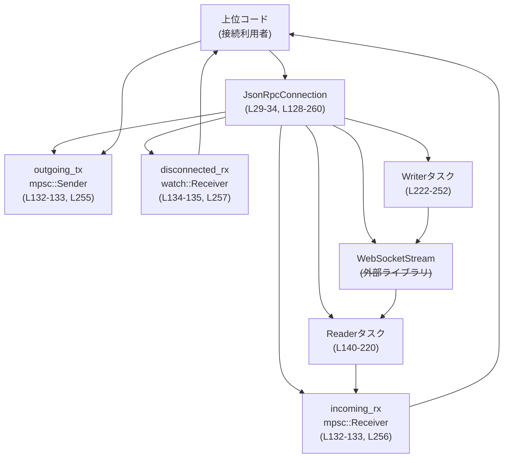
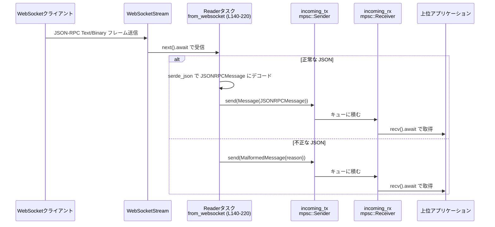
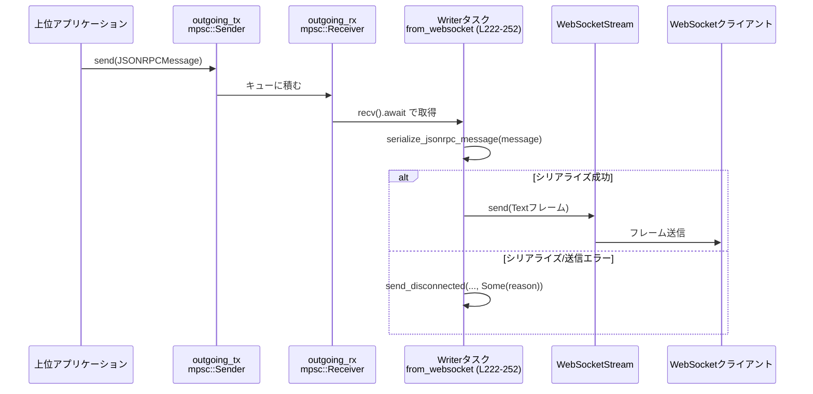

# exec-server\src\connection.rs コード解説

---

## 0. ざっくり一言

- このモジュールは、JSON-RPC メッセージ（`JSONRPCMessage`）と実際の I/O（WebSocket / テスト用 stdio）との間を仲介する **非同期コネクション層**です。
- 入出力は Tokio のタスクとチャネルで分離され、上位コードは `mpsc` と `watch` チャネル越しに JSON-RPC メッセージと接続イベントを扱います。

---

## 1. このモジュールの役割

### 1.1 概要

- このモジュールは **JSON-RPC メッセージをやり取りする接続（コネクション）を抽象化**し、上位のアプリケーションロジックから具体的な I/O 実装を隠しています。
- WebSocket ストリーム（本番）と stdio（テスト用）から JSON を読み書きし、`JSONRPCMessage` 型のメッセージと `JsonRpcConnectionEvent` 型のイベントとしてやり取りできるようにします（`JsonRpcConnection` 構造体、`from_websocket` / `from_stdio` コンストラクタ、`exec-server\src\connection.rs:L22-27,L29-34,L36-126,L128-260`）。
- 切断検知については、`watch::Receiver<bool>` を通じて通知することで、上位コードが待ち受けやクリーンアップをしやすい形になっています（`exec-server\src\connection.rs:L29-34,L279-288`）。

### 1.2 アーキテクチャ内での位置づけ

以下は WebSocket 経由の典型的な構成です（行番号は `from_websocket` 関連部分を示します）。



- 上位コードは `JsonRpcConnection::from_websocket` で接続を初期化し、`into_parts` で `outgoing_tx` / `incoming_rx` / `disconnected_rx` / タスクハンドルを受け取ります（`exec-server\src\connection.rs:L128-260,L262-276`）。
- Reader タスクは WebSocket から JSON を読み、`JsonRpcConnectionEvent::Message` / `MalformedMessage` / `Disconnected` を `incoming_rx` 側に流します（`exec-server\src\connection.rs:L140-220,L290-298`）。
- Writer タスクは `outgoing_tx` からメッセージを受け取り、JSON にシリアライズして WebSocket に書き込みます（`exec-server\src\connection.rs:L222-252,L316-318`）。
- 切断や I/O エラーは `send_disconnected` によって `watch` チャネルと `incoming_rx` 双方に通知されます（`exec-server\src\connection.rs:L187-217,L199-207,L210-216,L279-288`）。

### 1.3 設計上のポイント

- **責務分割**
  - I/O（WebSocket / stdio）を行う処理は、Tokio タスク (`tokio::spawn`) に閉じ込められています（`exec-server\src\connection.rs:L50-101,L103-118,L140-220,L222-252`）。
  - 上位コードは `JsonRpcConnection` のフィールドであるチャネル（`outgoing_tx`, `incoming_rx`, `disconnected_rx`）のみを扱う構造になっています（`exec-server\src\connection.rs:L29-34,L262-276`）。
- **状態管理**
  - 内部状態として持つのはチャネルと `JoinHandle` のみで、接続ごとの明示的なステートマシンは持っていません（状態はイベント種別 `JsonRpcConnectionEvent` と `disconnected_rx` の値で表現されます；`exec-server\src\connection.rs:L22-27,L29-34,L279-288`）。
- **エラーハンドリング方針**
  - JSON パースエラー→`JsonRpcConnectionEvent::MalformedMessage` として通知（接続は継続）（`exec-server\src\connection.rs:L58-76,L144-163,L166-185,L290-298`）。
  - I/O エラーや切断→`JsonRpcConnectionEvent::Disconnected` と `disconnected_rx` への通知の両方を行い、Reader/Writer タスクはループを抜けて終了します（`exec-server\src\connection.rs:L79-87,L88-98,L187-195,L198-207,L209-217,L279-288`）。
- **並行性**
  - 各接続は 2 本の Tokio タスク（Reader / Writer）で処理されます（`exec-server\src\connection.rs:L50-101,L103-118,L140-220,L222-252`）。
  - メッセージのキューイングは `mpsc::channel(CHANNEL_CAPACITY)`（バッファ 128）で行われます（`exec-server\src\connection.rs:L20,L43-45,L132-135`）。
  - 切断通知は `watch::channel<bool>` を使い、「一度でも切断したかどうか」を共有します（`exec-server\src\connection.rs:L45,L134,L279-288`）。
- **安全性（Rust 言語レベル）**
  - すべての非同期タスクは `Send + 'static` 制約のある I/O 型 (`R`, `W`, `S`) を持ち回るため、Tokio のスレッドプール上で安全に並列実行されます（`exec-server\src\connection.rs:L40-41,L129-131`）。
  - `unwrap` / `expect` は使用されておらず、エラーは `Result` による分岐か、チャネル送信の失敗を無視する形で扱われます（`exec-server\src\connection.rs:L50-101,L103-118,L140-220,L222-252,L279-298,L301-314,L316-318`）。

---

## 2. 主要な機能一覧（コンポーネントインベントリー）

このチャンクに含まれる主なコンポーネントと行範囲です。

| 名前 | 種別 | 定義位置 | 概要 |
|------|------|----------|------|
| `CHANNEL_CAPACITY` | 定数 `usize` | `exec-server\src\connection.rs:L20` | 内部 `mpsc` チャネルのバッファサイズ（128）を定義します。 |
| `JsonRpcConnectionEvent` | enum | `exec-server\src\connection.rs:L22-27` | コネクションから上位へ送られるイベント種別（メッセージ / 不正メッセージ / 切断）です。 |
| `JsonRpcConnection` | struct | `exec-server\src\connection.rs:L29-34` | JSON-RPC コネクションのハンドル。内部にチャネルと Reader/Writer タスクの `JoinHandle` を持ちます。 |
| `JsonRpcConnection::from_stdio` | 関数（テストのみ） | `exec-server\src\connection.rs:L37-126` | stdio ベースの JSON-RPC 接続（テスト用）を構築し、Reader/Writer タスクを起動します。 |
| `JsonRpcConnection::from_websocket` | 関数 | `exec-server\src\connection.rs:L128-260` | WebSocket ベースの JSON-RPC 接続を構築し、Reader/Writer タスクを起動します。 |
| `JsonRpcConnection::into_parts` | 関数 | `exec-server\src\connection.rs:L262-276` | 内部の `mpsc` / `watch` チャネルとタスクハンドルをタプルとして取り出します。 |
| `send_disconnected` | 関数 | `exec-server\src\connection.rs:L279-288` | 切断イベントと `watch` 通知を送るヘルパー関数です。 |
| `send_malformed_message` | 関数 | `exec-server\src\connection.rs:L290-298` | 不正な JSON メッセージを表すイベントを送るヘルパー関数です。 |
| `write_jsonrpc_line_message` | 関数（テストのみ） | `exec-server\src\connection.rs:L301-314` | `JSONRPCMessage` を 1 行 JSON として書き出す stdio 用ユーティリティです。 |
| `serialize_jsonrpc_message` | 関数 | `exec-server\src\connection.rs:L316-318` | `JSONRPCMessage` を JSON 文字列にシリアライズします。 |

---

## 3. 公開 API と詳細解説

### 3.1 型一覧（構造体・列挙体など）

| 名前 | 種別 | 定義位置 | 役割 / 用途 |
|------|------|----------|-------------|
| `JsonRpcConnectionEvent` | 列挙体 | `exec-server\src\connection.rs:L22-27` | コネクションから上位へ通知されるイベント。`Message(JSONRPCMessage)` / `MalformedMessage { reason }` / `Disconnected { reason }` の 3 種です。 |
| `JsonRpcConnection` | 構造体 | `exec-server\src\connection.rs:L29-34` | JSON-RPC 接続のハンドル。送信用 `mpsc::Sender<JSONRPCMessage>`、受信用 `mpsc::Receiver<JsonRpcConnectionEvent>`、切断検知用 `watch::Receiver<bool>`、Reader/Writer タスクの `JoinHandle` をまとめて管理します。 |

> `JSONRPCMessage` 自体の定義は外部クレート `codex_app_server_protocol` 内にあり、このチャンクからは内容は分かりません（`exec-server\src\connection.rs:L1`）。

### 3.2 関数詳細

7 件すべてを詳細に扱います（テスト専用も含む）。

---

#### `JsonRpcConnection::from_stdio<R, W>(reader: R, writer: W, connection_label: String) -> Self`（テスト専用）

**定義位置**

- `exec-server\src\connection.rs:L37-126`（`#[cfg(test)]` 付き）

**概要**

- 非同期に行単位で読み書きする stdio ベースの JSON-RPC 接続を構築します。
- `reader` から 1 行ごとに JSON を読み取り、`JSONRPCMessage` にデコードして `incoming_rx` に流します。
- `outgoing_tx` から受け取った `JSONRPCMessage` を JSON 文字列＋改行として `writer` に書き出します。

**引数**

| 引数名 | 型 | 説明 |
|--------|----|------|
| `reader` | `R` | 非同期読み取り可能な入力（`AsyncRead + Unpin + Send + 'static`）。テスト環境では標準入力やモックに相当します。 |
| `writer` | `W` | 非同期書き込み可能な出力（`AsyncWrite + Unpin + Send + 'static`）。テスト環境では標準出力やモックに相当します。 |
| `connection_label` | `String` | ログメッセージ用のラベル。エラーメッセージ内に埋め込まれます（`exec-server\src\connection.rs:L71-73,L93-94,L111-112`）。 |

**戻り値**

- `JsonRpcConnection`  
  - `outgoing_tx` / `incoming_rx` / `disconnected_rx` / Reader/Writer タスクの `JoinHandle` を内部に保持したハンドルです（`exec-server\src\connection.rs:L120-125`）。

**内部処理の流れ（アルゴリズム）**

1. `mpsc::channel(CHANNEL_CAPACITY)` で送信用 (`outgoing_tx`) と受信用 (`incoming_tx`) のチャネルを用意し、`watch::channel(false)` で切断フラグ用チャネルを作成します（`exec-server\src\connection.rs:L43-45`）。
2. Reader タスクを `tokio::spawn` で起動し、`BufReader::new(reader).lines()` を使って 1 行ずつ読み取ります（`exec-server\src\connection.rs:L50-52`）。
3. 各行について：
   - 空行なら無視して次へ（`exec-server\src\connection.rs:L55-57`）。
   - `serde_json::from_str::<JSONRPCMessage>(&line)` でパースし、成功時は `JsonRpcConnectionEvent::Message(message)` を `incoming_tx_for_reader` に送信します（`exec-server\src\connection.rs:L58-67`）。
   - 送信に失敗（受信側クローズ）した場合は Reader タスクを終了します（`exec-server\src\connection.rs:L60-66`）。
   - パース失敗時は `send_malformed_message` を呼び出し、`MalformedMessage` イベントを送信します（`exec-server\src\connection.rs:L68-76,L290-298`）。
4. 入力の EOF (`Ok(None)`) を検知した場合は `send_disconnected` を呼び出し、`Disconnected` イベントと `watch` 通知を送信してから Reader タスクを終了します（`exec-server\src\connection.rs:L79-87,L279-288`）。
5. 読み取りエラー (`Err(err)`) の場合も同様に、エラーメッセージ付きで `send_disconnected` を呼んで終了します（`exec-server\src\connection.rs:L88-98`）。
6. Writer タスクを `tokio::spawn` で起動し、`outgoing_rx.recv().await` で送信メッセージを待ちます（`exec-server\src\connection.rs:L103-105`）。
7. 受け取った各メッセージについて `write_jsonrpc_line_message` で JSON 文字列＋改行として出力し、エラーがあれば `send_disconnected` を呼んで Writer タスクを終了します（`exec-server\src\connection.rs:L106-117,L301-314,L279-288`）。

**Examples（使用例）**

テストコードから stdio を模した接続を作り、メッセージを 1 往復させるイメージです。

```rust
// テスト用の例（実際のテストでは AsyncRead/AsyncWrite 実装を使う）
use tokio::io::duplex;
use crate::connection::{JsonRpcConnection, JsonRpcConnectionEvent, CHANNEL_CAPACITY};
use codex_app_server_protocol::JSONRPCMessage;

#[tokio::test]
async fn test_stdio_connection_roundtrip() {
    // duplex で in-memory の双方向ストリームを作る
    let (client_side, server_side) = duplex(1024);

    // サーバ側の接続（ここでは from_stdio を使用）
    let conn = JsonRpcConnection::from_stdio(
        server_side,          // reader + writer として使える
        client_side,          // 実際には分離したい場合は工夫が必要
        "test-conn".into(),
    );

    let (mut outgoing, mut incoming, mut disconnected, _tasks) = conn.into_parts();

    // 送信
    let msg = JSONRPCMessage::default(); // 実際の型定義に応じて作成
    outgoing.send(msg).await.unwrap();

    // 受信
    if let Some(JsonRpcConnectionEvent::Message(_m)) = incoming.recv().await {
        // メッセージを受信
    }
}
```

> これは概念的な例です。`JSONRPCMessage` の生成方法や `duplex` の使い方は実際のコードベースに合わせる必要があります。

**Errors / Panics**

- `from_stdio` 自体は `Result` を返さず、内部ですべてのエラーを Reader/Writer タスク内で処理します。
- 想定されるエラーとその扱い：
  - JSON パースエラー → `JsonRpcConnectionEvent::MalformedMessage` を送信し、接続は継続（`exec-server\src\connection.rs:L58-76,L290-298`）。
  - 読み取り EOF / エラー → `JsonRpcConnectionEvent::Disconnected { reason }` と `disconnected_tx.send(true)` を送信し、Reader タスク終了（`exec-server\src\connection.rs:L79-98,L279-288`）。
  - 書き込みエラー → 同様に切断イベントを送り、Writer タスク終了（`exec-server\src\connection.rs:L106-117,L279-288`）。
- 明示的な `panic!` や `unwrap` は使用されていません。

**Edge cases（エッジケース）**

- 空行：`line.trim().is_empty()` の場合は完全に無視され、イベントも発生しません（`exec-server\src\connection.rs:L55-57`）。
- `incoming_tx_for_reader.send(...)` がエラー（受信側クローズ） → Reader タスクは `break` して終了しますが、`watch` への通知は行いません（`exec-server\src\connection.rs:L60-66`）。切断通知を確実に得るには、`send_disconnected` を呼ぶ経路（EOF / I/O エラー）を利用する必要があります。
- `serde_json::from_str` がエラーを返し続ける入力が大量に来た場合、`MalformedMessage` イベントが多数生成されますが、接続は維持されます（`exec-server\src\connection.rs:L68-76,L290-298`）。

**使用上の注意点**

- この関数は `#[cfg(test)]` 付きで **テストビルドでのみコンパイル**されるため、本番コードからは利用できません（`exec-server\src\connection.rs:L37`）。
- 行ベースのプロトコルを前提としているため、JSON 内に改行が含まれる場合は適切にエスケープされている必要があります。
- 上位コードは `incoming_rx` と `disconnected_rx` の両方を監視しないと、チャネルバッファが埋まり、`send` がブロックする可能性があります（`exec-server\src\connection.rs:L20,L43-45,L60-63`）。

---

#### `JsonRpcConnection::from_websocket<S>(stream: WebSocketStream<S>, connection_label: String) -> Self`

**定義位置**

- `exec-server\src\connection.rs:L128-260`

**概要**

- WebSocket ベースの JSON-RPC 接続を構築するメインのコンストラクタです。
- 与えられた `WebSocketStream<S>` を Reader / Writer に分割し、それぞれを非同期タスクで駆動します。
- Text / Binary フレームから JSON をデコードして `JSONRPCMessage` として上位へ渡し、逆に送信メッセージを JSON 文字列として Text フレームで送信します。

**引数**

| 引数名 | 型 | 説明 |
|--------|----|------|
| `stream` | `WebSocketStream<S>` | 既に確立された WebSocket 接続。`S: AsyncRead + AsyncWrite + Unpin + Send + 'static` で、Tokio 上で非同期 I/O 可能なストリームです（`exec-server\src\connection.rs:L128-131`）。 |
| `connection_label` | `String` | ログ用の接続ラベル。エラー理由文字列に含められます（`exec-server\src\connection.rs:L137-138,L158-159,L180-181,L203-204,L232-233,L244-245`）。 |

**戻り値**

- `JsonRpcConnection`  
  - `outgoing_tx`: WebSocket 送信用 `mpsc::Sender<JSONRPCMessage>`（`exec-server\src\connection.rs:L132,L255`）
  - `incoming_rx`: 受信イベント用 `mpsc::Receiver<JsonRpcConnectionEvent>`（`exec-server\src\connection.rs:L133,L256`）
  - `disconnected_rx`: 切断通知用 `watch::Receiver<bool>`（`exec-server\src\connection.rs:L134,L257`）
  - `task_handles`: Reader / Writer の 2 本の `JoinHandle<()>`（`exec-server\src\connection.rs:L140-220,L222-252,L258-259`）

**内部処理の流れ（アルゴリズム）**

1. `mpsc::channel(CHANNEL_CAPACITY)` で送受信用チャネルを作成し、`watch::channel(false)` で切断フラグ用チャネルを作成します（`exec-server\src\connection.rs:L132-135`）。
2. `stream.split()` によって WebSocket を書き込み側 (`websocket_writer`) と読み取り側 (`websocket_reader`) に分割します（`exec-server\src\connection.rs:L135`）。
3. Reader タスクを `tokio::spawn` で起動し、`websocket_reader.next().await` でフレームを順次取得します（`exec-server\src\connection.rs:L140-143`）。
4. 受信したフレームに応じた処理：
   - `Message::Text(text)`：`serde_json::from_str::<JSONRPCMessage>(text.as_ref())` でパースし、成功時は `JsonRpcConnectionEvent::Message` を `incoming_tx_for_reader` に送信、送信失敗で `break`（`exec-server\src\connection.rs:L143-153`）。
   - `Message::Binary(bytes)`：`serde_json::from_slice::<JSONRPCMessage>(bytes.as_ref())` でパースし、同様に `Message` イベントを送信（`exec-server\src\connection.rs:L165-175`）。
   - `Message::Close(_)`：`send_disconnected(..., None)` を呼んで切断通知し、ループ終了（`exec-server\src\connection.rs:L187-195`）。
   - `Message::Ping(_)` / `Message::Pong(_)`：何もせず無視（`exec-server\src\connection.rs:L196`）。
   - その他の `Ok(_)`：無視（`exec-server\src\connection.rs:L197`）。
   - `Some(Err(err))`：`send_disconnected(..., Some(format!(..)))` を呼び、エラー理由付きで切断通知し、ループ終了（`exec-server\src\connection.rs:L198-207`）。
   - `None`（ストリーム終了）：`send_disconnected(..., None)` を呼び、ループ終了（`exec-server\src\connection.rs:L209-217`）。
   - JSON パースエラー時は `send_malformed_message` を呼んで `MalformedMessage` イベントを送信し、接続は継続します（`exec-server\src\connection.rs:L154-162,L176-184,L290-298`）。
5. Writer タスクを起動し、`outgoing_rx.recv().await` で送信メッセージを待ちます（`exec-server\src\connection.rs:L222-223`）。
6. 各メッセージについて `serialize_jsonrpc_message` で JSON 文字列化し、`websocket_writer.send(Message::Text(encoded.into())).await` で WebSocket Text フレームとして送信します（`exec-server\src\connection.rs:L224-227,L316-318`）。
7. シリアライズエラーまたは send エラーが起きた場合は `send_disconnected` を呼び、Writer タスクはループを抜けます（`exec-server\src\connection.rs:L228-249,L279-288`）。

**Examples（使用例）**

WebSocket 接続確立後に `JsonRpcConnection` を使ってメッセージをやり取りする例です。

```rust
use tokio::net::TcpListener;
use tokio_tungstenite::accept_async;
use codex_app_server_protocol::JSONRPCMessage;
use crate::connection::{JsonRpcConnection, JsonRpcConnectionEvent};

#[tokio::main]
async fn main() -> anyhow::Result<()> {
    let listener = TcpListener::bind("127.0.0.1:9000").await?;

    loop {
        let (stream, addr) = listener.accept().await?;
        tokio::spawn(async move {
            // WebSocket ハンドシェイク
            let ws_stream = accept_async(stream).await.expect("handshake failed");

            // JsonRpcConnection を構築
            let conn = JsonRpcConnection::from_websocket(
                ws_stream,
                format!("client:{addr}"),
            );

            let (mut outgoing, mut incoming, mut disconnected, _tasks) = conn.into_parts();

            // 受信ループ
            loop {
                tokio::select! {
                    maybe_event = incoming.recv() => {
                        match maybe_event {
                            Some(JsonRpcConnectionEvent::Message(msg)) => {
                                // JSONRPCMessage を処理する
                                println!("received: {:?}", msg);
                            }
                            Some(JsonRpcConnectionEvent::MalformedMessage { reason }) => {
                                eprintln!("malformed message: {reason}");
                            }
                            Some(JsonRpcConnectionEvent::Disconnected { reason }) | None => {
                                eprintln!("disconnected: {:?}", reason);
                                break;
                            }
                        }
                    }
                    changed = disconnected.changed() => {
                        if changed.is_ok() && *disconnected.borrow() {
                            // 切断フラグを検知
                            break;
                        }
                    }
                }
            }
        });
    }
}
```

**Errors / Panics**

- `from_websocket` 自体は失敗しません（`Result` を返さず、ただちにタスクを起動して `JsonRpcConnection` を返します）。
- 主なエラー経路と挙動：
  - JSON パース失敗（Text / Binary 両方）  
    → `JsonRpcConnectionEvent::MalformedMessage { reason: String }` が `incoming_rx` に送られます（`exec-server\src\connection.rs:L154-162,L176-184,L290-298`）。接続は維持されます。
  - WebSocket 読み取りエラー・ストリーム終了 (`Some(Err(err))` / `None`) / Close フレーム  
    → `send_disconnected` により `disconnected_tx.send(true)` と `JsonRpcConnectionEvent::Disconnected { reason }` が送られ、Reader タスクは終了します（`exec-server\src\connection.rs:L187-217,L279-288`）。
  - WebSocket 書き込みエラー  
    → `send_disconnected` により切断通知を送り、Writer タスクは終了します（`exec-server\src\connection.rs:L226-237,L279-288`）。
  - シリアライズエラー（`serialize_jsonrpc_message` が `Err`）  
    → 切断として扱い、`send_disconnected` を呼んで接続を閉じます（`exec-server\src\connection.rs:L239-249,L316-318,L279-288`）。

- パニック要因：
  - この関数および関連ヘルパー内には `unwrap` / `expect` / 明示的 `panic!` はありません。  
    パニックが起きる可能性があるのは、外部ライブラリ内部に限られますが、このチャンクからは確認できません。

**Edge cases（エッジケース）**

- Ping / Pong フレーム：Reader タスクでは無視しています（`exec-server\src\connection.rs:L196`）。  
  （実際に Pong を返すなどの処理がどこで行われるかは、このチャンクには現れません。）
- Text / Binary 以外のフレーム：`Some(Ok(_))` で明示的に無視されます（`exec-server\src\connection.rs:L197`）。
- `incoming_tx_for_reader.send(...)` が失敗（受信側クローズ）した場合：Reader タスクは `break` で終了しますが、`send_disconnected` は呼ばれません（`exec-server\src\connection.rs:L146-152,L168-174`）。  
  → 上位コードが `incoming_rx` を早期にドロップすると、Reader タスクだけが静かに止まる可能性があります。
- `watch::Sender<bool>::send(true)` が失敗するのは、送信側が唯一の Sender でかつ Receiver が存在しない場合ですが、その `Result` は破棄されています（`exec-server\src\connection.rs:L284`）。  
  → 切断フラグを誰も見ていない状況では、失敗しても問題は顕在化しませんが、通知保証はありません。

**使用上の注意点**

- `JsonRpcConnection` を受け取ったら、**必ず `incoming_rx` と `disconnected_rx` をポーリング**し、`outgoing_tx` に対してはクローズ条件 (`Disconnected`) を考慮して送信する必要があります。
- `CHANNEL_CAPACITY` が 128 のため、上位コードが `incoming_rx` を読まずに放置すると、Reader タスク側の `send` がブロックする可能性があります（`exec-server\src\connection.rs:L20,L132-133,L146-152,L168-174`）。
- `JSONRPCMessage` のシリアライズ / デシリアライズに依存しているため、`JSONRPCMessage` が `serde::Serialize` / `serde::Deserialize` を適切に実装していることが前提になります（`exec-server\src\connection.rs:L144-145,L166-167,L224-225,L316-318`）。

---

#### `JsonRpcConnection::into_parts(self) -> (mpsc::Sender<JSONRPCMessage>, mpsc::Receiver<JsonRpcConnectionEvent>, watch::Receiver<bool>, Vec<JoinHandle<()>>)`

**定義位置**

- `exec-server\src\connection.rs:L262-276`

**概要**

- `JsonRpcConnection` が保持している内部コンポーネントを分解して取り出すメソッドです。
- 上位コードがこれを使うことで、構造体に依存せずチャネルとタスクハンドルのみを直接管理できます。

**引数**

- `self`: 所有権付きの `JsonRpcConnection` インスタンス。呼び出し後はこのハンドル自体は使用できません。

**戻り値**

タプル `(outgoing_tx, incoming_rx, disconnected_rx, task_handles)`：

| 要素 | 型 | 説明 |
|------|----|------|
| 1 | `mpsc::Sender<JSONRPCMessage>` | JSON-RPC メッセージ送信用のチャネル。Writer タスクがこれを購読します（`exec-server\src\connection.rs:L29-31,L132,L255,L265`）。 |
| 2 | `mpsc::Receiver<JsonRpcConnectionEvent>` | 受信メッセージ・不正メッセージ・切断イベントを受け取るチャネル（`exec-server\src\connection.rs:L29-32,L133,L256,L266`）。 |
| 3 | `watch::Receiver<bool>` | 接続が切断されたかどうかを通知するフラグ用 Receiver（`exec-server\src\connection.rs:L29-33,L134,L257,L267`）。 |
| 4 | `Vec<tokio::task::JoinHandle<()>>` | Reader / Writer の 2 本のタスクハンドル（`exec-server\src\connection.rs:L29-34,L50-101,L103-118,L140-220,L222-252,L258-259,L268`）。 |

**内部処理の流れ**

- フィールドをそのままタプルにして返すだけの単純な実装です（`exec-server\src\connection.rs:L270-275`）。

**Examples（使用例）**

```rust
use crate::connection::{JsonRpcConnection, JsonRpcConnectionEvent};
use codex_app_server_protocol::JSONRPCMessage;

async fn handle_connection(conn: JsonRpcConnection) {
    let (mut outgoing, mut incoming, mut disconnected, tasks) = conn.into_parts();

    // 別タスクで incoming を監視
    let reader_handle = tokio::spawn(async move {
        while let Some(event) = incoming.recv().await {
            match event {
                JsonRpcConnectionEvent::Message(msg) => {
                    // メッセージ処理
                    println!("received: {:?}", msg);
                }
                JsonRpcConnectionEvent::MalformedMessage { reason } => {
                    eprintln!("malformed: {reason}");
                }
                JsonRpcConnectionEvent::Disconnected { reason } => {
                    eprintln!("disconnected: {:?}", reason);
                    break;
                }
            }
        }
    });

    // 送信例
    let msg = JSONRPCMessage::default();
    outgoing.send(msg).await.unwrap();

    // 切断を待つ
    let _ = disconnected.changed().await;
    // tasks や reader_handle を join するかどうかは上位コードの設計次第です
}
```

**Errors / Panics**

- `into_parts` 自体にエラー経路はありません。
- 所有権をムーブするだけであり、`panic` を起こしうる操作も含まれていません。

**Edge cases**

- `self` をムーブするため、`into_parts` 呼び出し後に `JsonRpcConnection` を再利用することはできません（Rust の所有権システムによってコンパイル時に防がれます）。
- `task_handles` をどう扱うか（join するか、放置するか）は呼び出し側に委ねられています。このチャンクからは推奨パターンは分かりません。

**使用上の注意点**

- `incoming_rx` を早期にドロップすると、Reader タスク内での `send` が `Err` になり、Reader タスクが静かに終了することがあります（`exec-server\src\connection.rs:L146-152,L168-174`）。  
  切断フラグが更新されない経路もあるため、ドロップタイミングには注意が必要です。
- `task_handles` を未 join のままにしても動作上は問題ない場合が多いですが、テストやシャットダウン時にタスクリークを検出したい場合は明示的に `JoinHandle::await` する必要があります。

---

#### `async fn send_disconnected(incoming_tx: &mpsc::Sender<JsonRpcConnectionEvent>, disconnected_tx: &watch::Sender<bool>, reason: Option<String>)`

**定義位置**

- `exec-server\src\connection.rs:L279-288`

**概要**

- 接続切断（または I/O エラー）を上位に通知する共通ヘルパーです。
- `watch` チャネルに切断フラグ `true` を送信し、あわせて `JsonRpcConnectionEvent::Disconnected { reason }` を `incoming_tx` に送信します。

**引数**

| 引数名 | 型 | 説明 |
|--------|----|------|
| `incoming_tx` | `&mpsc::Sender<JsonRpcConnectionEvent>` | イベント送信用チャネル。`Disconnected` イベントを送る先です。 |
| `disconnected_tx` | `&watch::Sender<bool>` | 切断フラグ送信用チャネル。`true` を送信します。 |
| `reason` | `Option<String>` | 切断理由（ログ用メッセージを含む任意の文字列）。`None` なら理由なし切断として扱われます。 |

**戻り値**

- `()`（`async fn` ですが、戻り値型はユニット。エラー情報は返しません。）

**内部処理の流れ**

1. `disconnected_tx.send(true)` を実行し、結果は無視します（`exec-server\src\connection.rs:L284`）。
2. `incoming_tx.send(JsonRpcConnectionEvent::Disconnected { reason }).await` を実行し、結果も無視します（`exec-server\src\connection.rs:L285-287`）。

**Examples（使用例）**

この関数は Reader / Writer タスクから呼ばれています。

```rust
// WebSocket Close フレームの処理（from_websocket 内）
Some(Ok(Message::Close(_))) => {
    send_disconnected(
        &incoming_tx_for_reader,
        &disconnected_tx_for_reader,
        /*reason*/ None,
    )
    .await;
    break;
}
```

**Errors / Panics**

- `watch::Sender<bool>::send(true)` が `Err` を返しても `_ = ...` により無視されます（`exec-server\src\connection.rs:L284`）。
- `mpsc::Sender<JsonRpcConnectionEvent>::send(...).await` も `Result` を返しますが、同様に無視されます（`exec-server\src\connection.rs:L285-287`）。
- これにより、「通知しようとしても受信側が既にドロップされている」状況でもパニックやエラー伝播は発生しません。

**Edge cases**

- 受信側が存在しない状態で呼ばれても、単に通知がドロップされるだけです。
- `reason` に長い文字列を渡した場合でも、そのままイベントに格納されるだけで、この関数内ではサイズ制限などは行っていません。

**使用上の注意点**

- この関数は「通知ベストエフォート」であり、通知の成功が保証されていないことに注意が必要です。  
  上位コードが確実な通知を要求する場合は、`send` の戻り値チェックを追加する必要があります（そのような変更はこのチャンクにはありません）。

---

#### `async fn send_malformed_message(incoming_tx: &mpsc::Sender<JsonRpcConnectionEvent>, reason: Option<String>)`

**定義位置**

- `exec-server\src\connection.rs:L290-298`

**概要**

- JSON のパースに失敗した場合に、不正メッセージイベント `JsonRpcConnectionEvent::MalformedMessage` を送信するヘルパー関数です。

**引数**

| 引数名 | 型 | 説明 |
|--------|----|------|
| `incoming_tx` | `&mpsc::Sender<JsonRpcConnectionEvent>` | イベント送信用チャネル。`MalformedMessage` を送る先です。 |
| `reason` | `Option<String>` | エラーの詳細メッセージ。`None` の場合は既定メッセージ `"malformed JSON-RPC message"` を使用します。 |

**戻り値**

- `()`（`async fn`。エラー情報は返しません。）

**内部処理の流れ**

1. `reason.unwrap_or_else(|| "malformed JSON-RPC message".to_string())` で理由文字列を決定します（`exec-server\src\connection.rs:L296-297`）。
2. それを `JsonRpcConnectionEvent::MalformedMessage { reason: ... }` に包み、`incoming_tx.send(...).await` で送信します（`exec-server\src\connection.rs:L294-297`）。
3. 送信結果は破棄されます（`let _ = ...`、`exec-server\src\connection.rs:L294`）。

**Examples（使用例）**

```rust
// from_websocket 内の JSON パースエラー処理
Err(err) => {
    send_malformed_message(
        &incoming_tx_for_reader,
        Some(format!(
            "failed to parse websocket JSON-RPC message from {reader_label}: {err}"
        )),
    )
    .await;
}
```

**Errors / Panics**

- `mpsc::Sender::send` の失敗は無視されます。
- 既定メッセージ生成には `to_string()` を使っており、ここでパニックする可能性は実質ありません。

**Edge cases**

- `reason` に空文字列 `Some("".to_string())` を渡せば、そのまま空の理由が使われます。特別扱いはしていません。
- `incoming_tx` の受信者がいない場合、イベントは送信されずに消失します。

**使用上の注意点**

- この関数は「不正な入力があったことを上位に知らせるだけ」であり、接続のクローズは行いません。  
  したがって、上位コード側で `MalformedMessage` をどう扱うか（ログのみ、切断、警告カウントなど）を決める必要があります。

---

#### `#[cfg(test)] async fn write_jsonrpc_line_message<W>(writer: &mut BufWriter<W>, message: &JSONRPCMessage) -> std::io::Result<()>`

**定義位置**

- `exec-server\src\connection.rs:L301-314`（`#[cfg(test)]` 付き）

**概要**

- `JSONRPCMessage` を JSON 文字列にシリアライズし、改行 `\n` を付けて `writer` に書き込むヘルパーです。
- 1 行 1 メッセージ形式の stdio プロトコルをテストで扱うために使用されます。

**引数**

| 引数名 | 型 | 説明 |
|--------|----|------|
| `writer` | `&mut BufWriter<W>` | 非同期書き込みバッファ。`W: AsyncWrite + Unpin` をラップしたものです。 |
| `message` | `&JSONRPCMessage` | シリアライズ対象のメッセージです。 |

**戻り値**

- `std::io::Result<()>`  
  - 成功時は `Ok(())`。  
  - シリアライズエラーや書き込みエラーがあれば `Err(std::io::Error)`。

**内部処理の流れ**

1. `serialize_jsonrpc_message(message)` を呼び、`Result<String, serde_json::Error>` を得ます（`exec-server\src\connection.rs:L309-310,L316-318`）。
2. 失敗時には `std::io::Error::other(err.to_string())` に変換して `Err` を返します（`exec-server\src\connection.rs:L309-310`）。
3. 成功時には `writer.write_all(encoded.as_bytes()).await?` で JSON 本体を書き、続いて `writer.write_all(b"\n").await?` で改行を付加します（`exec-server\src\connection.rs:L311-312`）。
4. `writer.flush().await` でバッファをフラッシュし、その結果を返します（`exec-server\src\connection.rs:L313`）。

**Examples（使用例）**

`from_stdio` の Writer タスク内で使用されています。

```rust
let writer_task = tokio::spawn(async move {
    let mut writer = BufWriter::new(writer);
    while let Some(message) = outgoing_rx.recv().await {
        if let Err(err) = write_jsonrpc_line_message(&mut writer, &message).await {
            // エラー時は切断として扱う
            send_disconnected(
                &incoming_tx,
                &disconnected_tx,
                Some(format!(
                    "failed to write JSON-RPC message to {connection_label}: {err}"
                )),
            )
            .await;
            break;
        }
    }
});
```

**Errors / Panics**

- シリアライズエラー → `std::io::ErrorKind::Other` でラップされます（`exec-server\src\connection.rs:L309-310`）。
- 書き込み / フラッシュエラー → そのまま `io::Error` として呼び出し元に伝播します（`?` 演算子、`exec-server\src\connection.rs:L311-313`）。
- `panic!` の可能性はありません。

**Edge cases**

- 改行を 1 つだけ追加するため、すでに JSON 文字列に改行が含まれている場合も 1 行に収まらない可能性があります（行ベースプロトコルとしての前提は上位に依存します）。
- 非 UTF-8 な内容は `JSONRPCMessage` の段階で存在しない（`serde_json` で UTF-8 を扱う）ため、この関数内では考慮していません。

**使用上の注意点**

- `#[cfg(test)]` のため、本番コードからは利用されません。
- `BufWriter` に包むかどうかは呼び出し側で制御し、この関数は常にフラッシュまで行う点に注意が必要です（頻繁な flush はパフォーマンスに影響する場合があります）。

---

#### `fn serialize_jsonrpc_message(message: &JSONRPCMessage) -> Result<String, serde_json::Error>`

**定義位置**

- `exec-server\src\connection.rs:L316-318`

**概要**

- `JSONRPCMessage` を JSON 文字列へシリアライズするだけの薄いラッパー関数です。
- WebSocket / stdio の両方で共通利用されます。

**引数**

| 引数名 | 型 | 説明 |
|--------|----|------|
| `message` | `&JSONRPCMessage` | シリアライズ対象のメッセージです。 |

**戻り値**

- `Result<String, serde_json::Error>`  
  - 成功時：`Ok(json_string)`  
  - 失敗時：`Err(serde_json::Error)`（`serde_json::to_string` のエラーをそのまま返します）。

**内部処理の流れ**

- 単に `serde_json::to_string(message)` を呼び出しているだけです（`exec-server\src\connection.rs:L317`）。

**Examples（使用例）**

```rust
match serialize_jsonrpc_message(&message) {
    Ok(encoded) => {
        websocket_writer
            .send(Message::Text(encoded.into()))
            .await?;
    }
    Err(err) => {
        // シリアライズに失敗したら接続を切断
        send_disconnected(
            &incoming_tx,
            &disconnected_tx,
            Some(format!(
                "failed to serialize JSON-RPC message for {connection_label}: {err}"
            )),
        )
        .await;
    }
}
```

**Errors / Panics**

- `serde_json::to_string` は `Result` を返す API であり、この関数内でパニックは発生しません。
- `JSONRPCMessage` が `serde::Serialize` を実装していない場合、コンパイルエラーとなります（このチャンクでは型定義は不明ですが、少なくともコンパイルが通っている前提です）。

**Edge cases**

- 循環参照など `serde_json` が扱えない構造が `JSONRPCMessage` に含まれている場合は、ここで `Err` になります（`serde_json` の仕様によります。詳細はこのチャンクからは分かりません）。

**使用上の注意点**

- 失敗した場合、その上位（`from_websocket` / `write_jsonrpc_line_message`）で「接続を切断する」という判断がなされているため、**シリアライズ不能なメッセージは致命的扱い**になります（`exec-server\src\connection.rs:L239-249,L309-310`）。

---

### 3.3 その他の関数

- このファイルに定義されている関数は、すべて 3.2 で詳細に解説した 7 件のみです。それ以外の補助的関数やラッパー関数は存在しません。

---

## 4. データフロー

ここでは `from_websocket` を利用した典型的なデータフローを示します。

### 4.1 受信側（WebSocket → JSONRPCMessage）

1. WebSocket クライアントが JSON-RPC メッセージを Text または Binary フレームで送信します。
2. `websocket_reader` を持つ Reader タスク（`from_websocket (L140-220)` 内）がフレームを受信します。
3. フレームのペイロードを `serde_json::from_str` / `from_slice` で `JSONRPCMessage` にデコードします。
4. 成功時は `JsonRpcConnectionEvent::Message(JSONRPCMessage)` として `incoming_tx` に送信され、上位コードは `incoming_rx` から受信します。
5. パース失敗時は `JsonRpcConnectionEvent::MalformedMessage` として通知されます。



### 4.2 送信側（JSONRPCMessage → WebSocket）

1. 上位アプリケーションが `JSONRPCMessage` を生成し、`outgoing_tx.send(message).await` で送信します。
2. Writer タスク（`from_websocket (L222-252)` 内）が `outgoing_rx.recv().await` でメッセージを受信します。
3. `serialize_jsonrpc_message` で JSON 文字列を作り、`websocket_writer.send(Message::Text(encoded.into())).await` で WebSocket に送信します。
4. エラー発生時は `send_disconnected` により切断通知が行われます。



---

## 5. 使い方（How to Use）

### 5.1 基本的な使用方法

最も基本的なフローは次のとおりです。

1. WebSocket 接続を確立し、`WebSocketStream<S>` を得る。
2. `JsonRpcConnection::from_websocket(stream, label)` でコネクションを構築。
3. `into_parts` で `outgoing_tx` / `incoming_rx` / `disconnected_rx` / `task_handles` を受け取り、アプリケーション側でそれぞれをポーリング / 監視する。

```rust
use tokio::net::TcpListener;
use tokio_tungstenite::accept_async;
use codex_app_server_protocol::JSONRPCMessage;
use crate::connection::{JsonRpcConnection, JsonRpcConnectionEvent};

#[tokio::main]
async fn main() -> anyhow::Result<()> {
    let listener = TcpListener::bind("127.0.0.1:9000").await?;

    loop {
        let (stream, addr) = listener.accept().await?;
        tokio::spawn(async move {
            let ws_stream = accept_async(stream).await.expect("handshake failed");

            // 1) コネクションの構築
            let conn = JsonRpcConnection::from_websocket(ws_stream, format!("client:{addr}"));

            // 2) パーツに分解
            let (mut outgoing, mut incoming, mut disconnected, _tasks) = conn.into_parts();

            // 3) 受信ループと送信処理
            loop {
                tokio::select! {
                    maybe_event = incoming.recv() => {
                        match maybe_event {
                            Some(JsonRpcConnectionEvent::Message(msg)) => {
                                // メイン処理
                                handle_request(msg, &mut outgoing).await;
                            }
                            Some(JsonRpcConnectionEvent::MalformedMessage { reason }) => {
                                eprintln!("malformed: {reason}");
                            }
                            Some(JsonRpcConnectionEvent::Disconnected { reason }) | None => {
                                eprintln!("disconnected: {:?}", reason);
                                break;
                            }
                        }
                    }
                    Ok(()) = disconnected.changed() => {
                        if *disconnected.borrow() {
                            // 切断フラグ検知
                            break;
                        }
                    }
                }
            }
        });
    }
}

// 送信例
async fn handle_request(
    _msg: JSONRPCMessage,
    outgoing: &mut tokio::sync::mpsc::Sender<JSONRPCMessage>,
) {
    let response = JSONRPCMessage::default(); // 実際のレスポンス生成
    let _ = outgoing.send(response).await;
}
```

### 5.2 よくある使用パターン

1. **複数タスクからの送信**

   - `mpsc::Sender` は `Clone` 可能なので、上位コードが複数のタスクから同じ接続にメッセージを送ることができます（このチャンクでは `clone()` は呼ばれていませんが、`mpsc::Sender` の標準的な利用方法です）。

   ```rust
   let (outgoing, incoming, disconnected, _tasks) = conn.into_parts();
   let outgoing_clone = outgoing.clone();

   // タスクA
   tokio::spawn(async move {
       let msg = JSONRPCMessage::default();
       let _ = outgoing.send(msg).await;
   });

   // タスクB
   tokio::spawn(async move {
       let msg = JSONRPCMessage::default();
       let _ = outgoing_clone.send(msg).await;
   });
   ```

2. **切断フラグでのシャットダウン制御**

   - `disconnected_rx` の `changed().await` を待つことで、I/O タスク内部のエラーまで含めた「接続終了」を検知できます（`exec-server\src\connection.rs:L279-288`）。

   ```rust
   tokio::select! {
       _ = disconnected.changed() => {
           if *disconnected.borrow() {
               // 安全にクリーンアップ
           }
       }
       // 他のイベント分岐...
   }
   ```

### 5.3 よくある間違い

```rust
// 間違い例: incoming_rx をすぐにドロップしてしまう
let (outgoing, _incoming, disconnected, _tasks) = conn.into_parts();
// _incoming を無視しているため、Reader タスクの send が失敗し、
// Reader タスクが静かに終了してしまう可能性がある

// 正しい例: incoming_rx をポーリングしてイベントを消費する
let (mut outgoing, mut incoming, mut disconnected, _tasks) = conn.into_parts();
tokio::spawn(async move {
    while let Some(event) = incoming.recv().await {
        // イベント処理...
        if matches!(event, JsonRpcConnectionEvent::Disconnected { .. }) {
            break;
        }
    }
});
```

```rust
// 間違い例: 切断後も無制限に send し続ける
let _ = outgoing.send(msg).await; // Disconnected のチェックをしていない

// 正しい例: Disconnected イベントを見て送信を止める
if *disconnected.borrow() {
    // 既に切断されているので send しない
} else {
    let _ = outgoing.send(msg).await;
}
```

### 5.4 使用上の注意点（まとめ）

- **チャネルの監視**
  - `incoming_rx` を読み続けるタスクを必ず用意し、`CHANNEL_CAPACITY`（128）を超えるバックログを溜めないようにすることが重要です（`exec-server\src\connection.rs:L20,L132-133,L146-152`）。
- **切断検知**
  - `Disconnected` イベントと `disconnected_rx` の両方が存在します。どちらか一方だけに依存すると、一部のケースで検知漏れとなる可能性があります（特に `incoming_rx` 側を早期にドロップした場合）。
- **JSON バリデーション**
  - このモジュールは JSON の構文パースのみを行い、プロトコルレベルの妥当性検証（メソッド名 / パラメータチェックなど）は行いません。`MalformedMessage` は「JSON 構文上の不正」を表すだけです。
- **テスト専用 API**
  - `from_stdio` と `write_jsonrpc_line_message` は `#[cfg(test)]` 付きであり、本番バイナリには含まれません。

---

## 6. 変更の仕方（How to Modify）

### 6.1 新しい機能を追加する場合

**例：別のトランスポート（例: Unix ドメインソケット上の自作プロトコル）から JSON-RPC を扱いたい場合**

コード上、WebSocket 用 `from_websocket` とテスト用 `from_stdio` が似た構造で実装されているため（`exec-server\src\connection.rs:L37-126,L128-260`）、同様のパターンを踏襲する形で新しいコンストラクタを追加することが考えられます（ただし、このチャンクだけでは設計方針として確定しているとは言い切れません）。

一般的なステップ:

1. 新しいコンストラクタ（例: `from_unix_stream`）を `impl JsonRpcConnection` 内に追加する。
   - `mpsc::channel(CHANNEL_CAPACITY)` と `watch::channel(false)` を同様に作成（`exec-server\src\connection.rs:L43-45,L132-135`）。
2. Reader タスク:
   - 入力ストリームからメッセージ単位で読み出し、`serde_json` で `JSONRPCMessage` にパース。
   - パース成功時は `JsonRpcConnectionEvent::Message` を送信、失敗時は `send_malformed_message` を利用（`exec-server\src\connection.rs:L58-76,L154-162,L176-184,L290-298`）。
   - EOF / I/O エラー時は `send_disconnected` を利用（`exec-server\src\connection.rs:L79-98,L187-217,L279-288`）。
3. Writer タスク:
   - `outgoing_rx.recv().await` でメッセージを待ち、`serialize_jsonrpc_message` で文字列化。
   - 送信エラー / シリアライズエラー時は `send_disconnected` で切断扱い（`exec-server\src\connection.rs:L222-252,L309-310,L316-318,L279-288`）。

### 6.2 既存の機能を変更する場合

- **エラー通知ポリシーの変更**
  - 現状、`send_disconnected` / `send_malformed_message` は送信失敗を無視しています（`exec-server\src\connection.rs:L284-287,L294-297`）。  
    これを変更する場合、呼び出し元（Reader / Writer タスク）でエラーをどう扱うか（リトライ、ログ出力、即時 `panic!` など）を明示的に決める必要があります。
- **バックプレッシャ制御**
  - `CHANNEL_CAPACITY` の値を変更する場合、接続数や想定トラフィックに応じて調整が必要です（`exec-server\src\connection.rs:L20`）。  
    大きくしすぎるとメモリ使用量が増え、小さすぎると送信側がブロックしやすくなります。
- **JSON パース戦略**
  - 現在はパース失敗時も接続を維持し続ける設計です（`MalformedMessage` を送るのみ）。  
    これを「不正な JSON を受け取ったら接続を切断する」ポリシーに変えたい場合は、`send_malformed_message` 呼び出し箇所に `send_disconnected` を追加するなどの変更が必要です（`exec-server\src\connection.rs:L68-76,L154-162,L176-184`）。
- **影響範囲の確認**
  - `JsonRpcConnectionEvent` のバリアントを増減する場合は、それをパターンマッチしているすべての箇所を更新する必要があります。  
    このチャンクには `JsonRpcConnectionEvent` を受信しているコードは含まれないため、リポジトリ全体での検索が必要です。

---

## 7. 関連ファイル

このチャンクから直接分かる関連コンポーネントは次のとおりです。

| パス / クレート | 役割 / 関係 |
|----------------|------------|
| `codex_app_server_protocol::JSONRPCMessage` | JSON-RPC メッセージの型定義。`JsonRpcConnectionEvent::Message` のペイロードであり、入出力の中心となる型です（`exec-server\src\connection.rs:L1,L24`）。具体的なフィールドや仕様はこのチャンクには現れません。 |
| `tokio_tungstenite::WebSocketStream` | WebSocket I/O の実装。`from_websocket` で利用されます（`exec-server\src\connection.rs:L8,L128-135`）。 |
| `tokio::sync::mpsc` | 非同期メッセージキュー。送受信メッセージおよびイベントのバッファリングに利用されます（`exec-server\src\connection.rs:L6,L29-33,L43-45,L132-135,L262-276,L279-288,L290-298`）。 |
| `tokio::sync::watch` | 共有フラグの通知用チャネル。接続の切断状態を伝播するために使用されます（`exec-server\src\connection.rs:L7,L29-33,L45,L134,L262-276,L279-288`）。 |

同一リポジトリ内で `JsonRpcConnection` / `JsonRpcConnectionEvent` を利用しているファイルについては、このチャンクだけからは特定できません。
