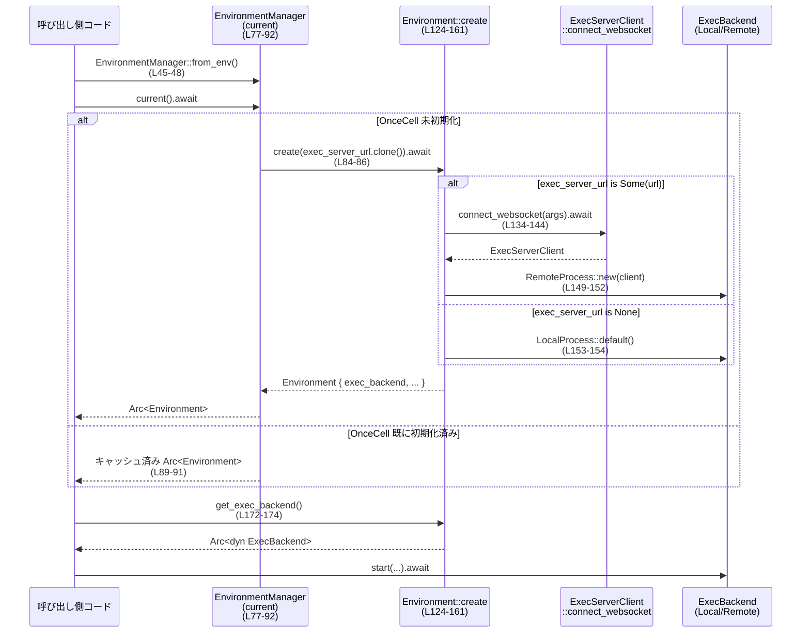

# exec-server/src/environment.rs コード解説

## 0. ざっくり一言

このモジュールは、「ローカル実行」か「リモート exec-server 経由の実行」かを選択し、その選択をセッション中に安定して保持する環境 (`Environment` / `EnvironmentManager`) を提供するモジュールです。実行バックエンドとファイルシステムの実装をまとめて隠蔽します。

---

## 1. このモジュールの役割

### 1.1 概要

- このモジュールは **ローカル実行とリモート exec-server 実行の切り替え** を行い、選択された環境をセッション中にキャッシュする責務を持ちます。
- `EnvironmentManager` が環境の作成とキャッシュ・無効化状態の保持を担当し、`Environment` が実際の **プロセス実行バックエンド** と **ファイルシステム実装** をまとめたコンテナとして機能します（`environment.rs:L21-26`, `environment.rs:L95-104`）。
- `CODEX_EXEC_SERVER_URL_ENV_VAR` 環境変数値（または外部から渡された URL）を正規化して、「ローカル」「リモート」「明示的な無効化（disabled）」の 3 モードを区別します（`environment.rs:L184-189`）。

### 1.2 アーキテクチャ内での位置づけ

このモジュール内の主要コンポーネントと、他モジュールとの依存関係を示します。

```mermaid
graph TD
    subgraph "このファイル (environment.rs)"
        EM["EnvironmentManager<br/>(環境の選択とキャッシュ)"]
        Env["Environment<br/>(実行/FS環境コンテナ)"]
    end

    subgraph "他モジュール"
        ESC["ExecServerClient"]
        EB["ExecBackend<br/>(trait)"]
        LP["LocalProcess"]
        RP["RemoteProcess"]
        EFS["ExecutorFileSystem<br/>(trait)"]
        LFS["LocalFileSystem"]
        RFS["RemoteFileSystem"]
    end

    EM -->|current() で生成| Env
    EM -->|"CODEX_EXEC_SERVER_URL_ENV_VAR"<br/>環境変数| Env

    Env -->|exec_backend: Arc<dyn ExecBackend>| EB
    EB --> LP
    EB --> RP
    Env -->|remote_exec_server_client| ESC
    Env -->|get_filesystem()| EFS
    EFS --> LFS
    EFS --> RFS
    Env -->|"exec_server_url: Option<String>"| ESC
```

- `EnvironmentManager.current()` が初回アクセス時に `Environment::create` を呼び、以後は `OnceCell` にキャッシュされた `Environment` を返します（`environment.rs:L77-92`）。
- `Environment` は内部で `ExecBackend`（`LocalProcess` または `RemoteProcess`）と、`ExecutorFileSystem` 実装を組み立てます（`environment.rs:L149-181`）。

### 1.3 設計上のポイント

- **遅延初期化 + キャッシュ**  
  - `EnvironmentManager.current` は `tokio::sync::OnceCell` を用いて、一度だけ `Environment` を非同期に生成し、それを `Arc` で共有します（`environment.rs:L77-92`）。
  - エラーが発生した場合は `OnceCell` は埋まらないため、次回呼び出しで再試行されます（`get_or_try_init` の仕様に基づく）。

- **モードの正規化**  
  - `normalize_exec_server_url` によって、  
    - `None` / 空文字列: 「ローカルモード」  
    - `"none"`（大文字小文字無視）: 「明示的な disabled モード」  
    - それ以外: 与えられた URL を使う「リモートモード」  
    に分類されます（`environment.rs:L184-189`）。

- **ローカル/リモートの抽象化**  
  - 実行バックエンドは `Arc<dyn ExecBackend>` によって抽象化され、`LocalProcess` / `RemoteProcess` のどちらかが選択されます（`environment.rs:L101-104`, `environment.rs:L149-154`）。
  - ファイルシステムも `ExecutorFileSystem` trait の実装（`LocalFileSystem` / `RemoteFileSystem`）として隠蔽されます（`environment.rs:L176-181`）。

- **Rust の安全性・並行性**  
  - `Arc` により、`Environment` や `ExecBackend` が複数タスク間で安全に共有される設計です（`environment.rs:L1`, `environment.rs:L25`, `environment.rs:L103`）。
  - `OnceCell` は非同期タスク間での **一度きりの初期化** を保証し、競合状態を防ぎます（`environment.rs:L79-88`）。

---

## 2. 主要な機能一覧（コンポーネントインベントリー）

### 2.1 型・定数・関数一覧

| 名前 | 種別 | 公開 | 行範囲 | 役割 |
|------|------|------|--------|------|
| `CODEX_EXEC_SERVER_URL_ENV_VAR` | 定数 | `pub` | `environment.rs:L15` | exec-server の URL を指す環境変数名 `"CODEX_EXEC_SERVER_URL"` |
| `EnvironmentManager` | 構造体 | `pub` | `environment.rs:L21-26` | セッションごとの環境設定（ローカル/リモート/disabled）を管理し、`Environment` をキャッシュ |
| `EnvironmentManager::new` | 関数 | `pub` | `environment.rs:L35-43` | URL 文字列を正規化し、manager を構築 |
| `EnvironmentManager::from_env` | 関数 | `pub` | `environment.rs:L45-48` | 環境変数 `CODEX_EXEC_SERVER_URL_ENV_VAR` から manager を構築 |
| `EnvironmentManager::from_environment` | 関数 | `pub` | `environment.rs:L50-65` | 既存 `Environment` または disabled 状態から manager を構築 |
| `EnvironmentManager::exec_server_url` | 関数 | `pub` | `environment.rs:L67-70` | manager が保持する exec-server URL を返す |
| `EnvironmentManager::is_remote` | 関数 | `pub` | `environment.rs:L72-75` | リモート環境かどうかを判定 |
| `EnvironmentManager::current` | 関数 | `pub async` | `environment.rs:L77-92` | `Environment` を遅延生成・キャッシュして返す |
| `Environment` | 構造体 | `pub` | `environment.rs:L99-104` | 実行バックエンドとファイルシステムを束ねた環境 |
| `Environment::default` | 関数 | `pub`(impl Default) | `environment.rs:L106-113` | ローカル実行用のデフォルト環境を構築 |
| `Environment::create` | 関数 | `pub async` | `environment.rs:L124-161` | URL に基づきローカル/リモート環境を構築 |
| `Environment::is_remote` | 関数 | `pub` | `environment.rs:L163-165` | 環境がリモートかどうかを判定 |
| `Environment::exec_server_url` | 関数 | `pub` | `environment.rs:L167-170` | この環境の exec-server URL を返す |
| `Environment::get_exec_backend` | 関数 | `pub` | `environment.rs:L172-174` | `Arc<dyn ExecBackend>` を返す |
| `Environment::get_filesystem` | 関数 | `pub` | `environment.rs:L176-181` | `Arc<dyn ExecutorFileSystem>` を返す（ローカル/リモートを選択） |
| `normalize_exec_server_url` | 関数 | `fn`(private) | `environment.rs:L184-189` | URL 文字列をローカル/リモート/disabled に分類 |

### 2.2 テスト関数一覧（参考）

| 名前 | 種別 | 行範囲 | 役割 |
|------|------|--------|------|
| `create_local_environment_does_not_connect` | `#[tokio::test]` | `environment.rs:L200-208` | ローカル環境作成時にリモート接続しないことを検証 |
| `environment_manager_normalizes_empty_url` | `#[test]` | `environment.rs:L210-217` | 空文字 URL がローカルモードになることを検証 |
| `environment_manager_treats_none_value_as_disabled` | `#[test]` | `environment.rs:L219-226` | `"none"` が disabled モードになることを検証 |
| `environment_manager_reports_remote_url` | `#[test]` | `environment.rs:L228-234` | 通常 URL がリモートとして扱われることを検証 |
| `environment_manager_current_caches_environment` | `#[tokio::test]` | `environment.rs:L236-247` | `current()` の OnceCell キャッシュ動作を検証 |
| `disabled_environment_manager_has_no_current_environment` | `#[tokio::test]` | `environment.rs:L249-259` | disabled manager では `current()` が `None` を返すことを検証 |
| `default_environment_has_ready_local_executor` | `#[tokio::test]` | `environment.rs:L262-279` | `Environment::default` がすぐ実行可能なローカル executor を持つことを検証 |

---

## 3. 公開 API と詳細解説

### 3.1 型一覧（構造体・列挙体など）

| 名前 | 種別 | 主要フィールド | 役割 / 用途 |
|------|------|----------------|-------------|
| `EnvironmentManager` | 構造体 | `exec_server_url: Option<String>` / `disabled: bool` / `current_environment: OnceCell<Option<Arc<Environment>>>` | exec-server URL の正規化結果と disabled 状態を保持し、`Environment` を遅延生成・キャッシュする |
| `Environment` | 構造体 | `exec_server_url: Option<String>` / `remote_exec_server_client: Option<ExecServerClient>` / `exec_backend: Arc<dyn ExecBackend>` | 選択された exec-server URL と、対応するリモート client（ある場合）と実行バックエンドをまとめた環境 |

---

### 3.2 関数詳細（重点 7 件）

#### `EnvironmentManager::new(exec_server_url: Option<String>) -> EnvironmentManager`

**概要**

- `CODEX_EXEC_SERVER_URL` 相当の文字列を正規化し、`EnvironmentManager` を構築します（`environment.rs:L35-43`）。
- 空文字や `None`、`"none"` を適切に解釈して `exec_server_url` と `disabled` を設定します。

**引数**

| 引数名 | 型 | 説明 |
|--------|----|------|
| `exec_server_url` | `Option<String>` | 生の exec-server URL。`None` なら値なし、`Some("none")` なら disabled を意味します（`environment.rs:L184-189`）。 |

**戻り値**

- `EnvironmentManager` インスタンス。`current_environment` は空の `OnceCell` として初期化されます（`environment.rs:L38-42`）。

**内部処理の流れ**

1. `normalize_exec_server_url(exec_server_url)` を呼び出し、正規化された `(exec_server_url, disabled)` を得る（`environment.rs:L37`）。
2. それらをフィールドに格納し、`current_environment` には新しい `OnceCell` をセットして返します（`environment.rs:L38-42`）。

**エッジケース**

- 入力が `None` または空文字列: `exec_server_url` は `None`、`disabled` は `false` になります（ローカルモード）（`environment.rs:L184-187`）。
- 入力が `"none"`（空白除去後、大文字小文字無視）: `exec_server_url` は `None`、`disabled` は `true` になります（`environment.rs:L187`）。

**使用上の注意点**

- `"none"` という文字列は特別扱いで **明示的な disabled モード** になる点に注意が必要です。単に「URL 未設定」とは意味が異なります。
- `exec_server_url` に前後の空白が含まれていても `trim` により除去されます（`environment.rs:L185`）。

---

#### `EnvironmentManager::current(&self) -> Result<Option<Arc<Environment>>, ExecServerError>`

**概要**

- 初回アクセス時に `Environment` を非同期に生成し、`OnceCell` にキャッシュして返します（`environment.rs:L77-92`）。
- manager が disabled の場合、`Ok(None)` を返し、`Environment` は生成されません。

**引数**

| 引数名 | 型 | 説明 |
|--------|----|------|
| `&self` | `&EnvironmentManager` | 共有参照。`OnceCell` 内部状態の変更は内部可変性によって行われます。 |

**戻り値**

- `Ok(Some(Arc<Environment>))` : ローカルまたはリモート環境が利用可能な場合。
- `Ok(None)` : manager が disabled モード (`self.disabled == true`) の場合。
- `Err(ExecServerError)` : `Environment::create` の呼び出しが失敗した場合（接続エラーなど）。

**内部処理の流れ**

1. `self.current_environment.get_or_try_init(...)` を呼び、非同期クロージャで初期化処理を定義する（`environment.rs:L79-88`）。
2. クロージャの中で `self.disabled` をチェックし、`true` なら `Ok(None)` を返す（`environment.rs:L81-82`）。
3. disabled でない場合は `Environment::create(self.exec_server_url.clone()).await?` を呼び、結果を `Arc` で包んで `Some(...)` として返す（`environment.rs:L84-86`）。
4. `get_or_try_init` の戻り値 `&Option<Arc<Environment>>` を `Option<&Arc<Environment>>` に変換し、`cloned()` により `Option<Arc<Environment>>` を返す（`environment.rs:L89-91`）。

**並行性・安全性の観点**

- `tokio::sync::OnceCell` により、複数タスクから同時に `current()` が呼ばれても、初期化クロージャは一度しか実行されません（`environment.rs:L79-88`）。
- `Arc<Environment>` によって複数タスクが同一 `Environment` を安全に共有できます。
- `get_or_try_init` がエラーを返した場合、`OnceCell` は未初期化のままなので、次回 `current()` 呼び出しで再度初期化を試みます（Tokio OnceCell の仕様）。

**エッジケース**

- manager が disabled (`self.disabled == true`): `current()` は常に `Ok(None)` を返し、`Environment::create` は呼ばれません（`environment.rs:L81-83`）。
- `Environment::create` が `"none"` などにより `Err` を返すケースは、`EnvironmentManager::new` では `"none"` を disabled モードに変換しているため、本来到達しない設計です（`environment.rs:L37`, `environment.rs:L184-189`）。

**使用上の注意点**

- 呼び出し側は `Result<Option<Arc<Environment>>>` を二段階で扱う必要があります。  
  - `Err`: 環境構築自体の失敗（ネットワークなど）。  
  - `Ok(None)`: 意図された disabled 状態。
- 非同期関数なので、Tokio などの非同期ランタイム内で `.await` する必要があります。

---

#### `Environment::create(exec_server_url: Option<String>) -> Result<Environment, ExecServerError>`

**概要**

- 生の exec-server URL を正規化して、ローカルまたはリモートの `Environment` を構築する非同期関数です（`environment.rs:L124-161`）。
- リモート URL が設定されていれば `ExecServerClient` を WebSocket で接続し、その client を `RemoteProcess` と `RemoteFileSystem` 用に保持します。

**引数**

| 引数名 | 型 | 説明 |
|--------|----|------|
| `exec_server_url` | `Option<String>` | 生の URL。`None` ならローカル環境、`Some("none")` なら disabled（エラー）として扱われます。 |

**戻り値**

- `Ok(Environment)` : 正常に環境を構築できた場合。
- `Err(ExecServerError)` : disabled モードの指定 (`"none"`) か、`ExecServerClient::connect_websocket` の内部エラーなど。

**内部処理の流れ**

1. `normalize_exec_server_url(exec_server_url)` を呼び出して `(exec_server_url, disabled)` を得る（`environment.rs:L127`）。
2. `disabled` が `true` の場合は **protocol エラー** として `ExecServerError::Protocol("disabled mode does not create an Environment".to_string())` を返す（`environment.rs:L128-131`）。
3. `exec_server_url` が `Some(url)` の場合:
   - `ExecServerClient::connect_websocket(RemoteExecServerConnectArgs { ... }).await?` を実行し、リモート exec-server に WebSocket 接続する（`environment.rs:L134-144`）。
   - `connect_timeout` と `initialize_timeout` は 5 秒に設定されます（`environment.rs:L139-140`）。
4. `exec_server_url` が `None` の場合は `remote_exec_server_client` を `None` に設定（`environment.rs:L145-147`）。
5. `remote_exec_server_client` が `Some(client)` なら `RemoteProcess::new(client)` を、`None` なら `LocalProcess::default()` を選択し、`Arc<dyn ExecBackend>` として格納する（`environment.rs:L149-154`）。
6. フィールド `exec_server_url`, `remote_exec_server_client`, `exec_backend` を設定した `Environment` を返す（`environment.rs:L156-160`）。

**Errors**

- `disabled == true` となる入力（例: `"none"`）では、`ExecServerError::Protocol` を返します（`environment.rs:L128-131`）。
- `ExecServerClient::connect_websocket` が `Err` を返した場合、そのエラーを `?` 演算子でそのまま上位に伝播します（`environment.rs:L136-144`）。

**エッジケース**

- `exec_server_url` が `None` / 空文字列: ローカル環境になります。`remote_exec_server_client: None`, `exec_backend: LocalProcess::default()`（`environment.rs:L145-147`, `environment.rs:L153-154`）。
- `"none"`（大文字小文字無視）: disabled とみなされ、protocol エラーになります（`environment.rs:L127-131`, `environment.rs:L187`）。
- URL 文字列に前後の空白が含まれている場合も `trim` により除去されます（`environment.rs:L185`）。

**使用上の注意点**

- `EnvironmentManager` を介して使う限り、`"none"` のような disabled 入力は `EnvironmentManager::new` の時点で処理されるため、直接 `Environment::create` に `"none"` を渡さない設計が想定されます。
- デフォルトのタイムアウト（5 秒）で接続/初期化を試みるため、大きな遅延のある環境ではタイムアウトエラーが発生する可能性があります（`environment.rs:L139-140`）。

---

#### `Environment::get_exec_backend(&self) -> Arc<dyn ExecBackend>`

**概要**

- この環境が選択した実行バックエンド（ローカルまたはリモート）を `Arc` で返します（`environment.rs:L172-174`）。

**引数**

| 引数名 | 型 | 説明 |
|--------|----|------|
| `&self` | `&Environment` | 環境への参照。 |

**戻り値**

- `Arc<dyn ExecBackend>`  
  - リモート環境: `Arc<RemoteProcess>` を trait オブジェクトとして返す。  
  - ローカル環境: `Arc<LocalProcess>` を返す。

**内部処理の流れ**

1. `Arc::clone(&self.exec_backend)` を返すだけの薄いラッパーです（`environment.rs:L173`）。

**エッジケース**

- リモート/ローカルに関わらず同じインターフェースで利用できます。  
- `Environment` を `Clone` しても `exec_backend` は `Arc` 共有されるため、複数の `Environment` コピーが同じバックエンドを使います（`environment.rs:L99`, `environment.rs:L101-103`）。

**使用上の注意点**

- `ExecBackend` の具体型に依存した処理をしたい場合は、通常は trait メソッドのみを利用する設計になります。ダウンキャストはモジュール外では想定されていません。
- `Arc` の clone なので軽量ですが、高頻度で大量に clone する場合は若干のオーバーヘッドはあります。

---

#### `Environment::get_filesystem(&self) -> Arc<dyn ExecutorFileSystem>`

**概要**

- 現在の環境に対応するファイルシステムの実装（ローカル/リモート）を `Arc` で返します（`environment.rs:L176-181`）。

**引数**

| 引数名 | 型 | 説明 |
|--------|----|------|
| `&self` | `&Environment` | 環境への参照。 |

**戻り値**

- `Arc<dyn ExecutorFileSystem>`  
  - リモート環境: `Arc<RemoteFileSystem>` を返す。  
  - ローカル環境: `Arc<LocalFileSystem>` を返す。

**内部処理の流れ**

1. `self.remote_exec_server_client.clone()` を実行し、client の `Option<ExecServerClient>` を取得する（`environment.rs:L177`）。
2. `Some(client)` の場合は `RemoteFileSystem::new(client)` を `Arc` 包みで返す（`environment.rs:L178`）。
3. `None` の場合は `Arc::new(LocalFileSystem)` を返す（`environment.rs:L179-180`）。

**エッジケース**

- `Environment::create` でリモートクライアントが確実に生成されているので、`Some(client)` の場合には `client` が有効であることが前提です（`environment.rs:L134-147`）。
- disabled モードではそもそも `Environment` 自体が作成されないため、`get_filesystem` が呼ばれることは想定されていません。

**使用上の注意点**

- 呼び出しの度に `Arc<RemoteFileSystem>` / `Arc<LocalFileSystem>` の新しいインスタンスを作成していますが、`RemoteFileSystem::new(client)` が cheap であることが前提と考えられます。高頻度で使う場合は、上位コード側で `Arc` をキャッシュする設計も検討できます。
- `remote_exec_server_client` は `Environment` 内で `Option` になっているため、`get_filesystem` の戻り値だけからは「もともと disabled だったのか / URL が `None` なのか」は区別できません。

---

#### `normalize_exec_server_url(exec_server_url: Option<String>) -> (Option<String>, bool)`

**概要**

- exec-server URL の文字列を正規化し、実際に使う URL と disabled フラグを返します（`environment.rs:L184-189`）。

**引数**

| 引数名 | 型 | 説明 |
|--------|----|------|
| `exec_server_url` | `Option<String>` | 生の URL 値。`None` または空文字列は「URL 未設定」を意味します。 |

**戻り値**

- `(Option<String>, bool)`  
  - 第 1 要素: 実際に使う URL。ローカルモードや disabled モードでは `None`。  
  - 第 2 要素: disabled フラグ。`true` なら、明示的な disabled モード。

**内部処理の流れ**

1. `exec_server_url.as_deref().map(str::trim)` で `Option<&str>` に変換しつつ前後の空白を除去（`environment.rs:L185`）。
2. マッチング:
   - `None` または `Some("")`: `(None, false)` を返す（`environment.rs:L186`）。
   - `Some(url) if url.eq_ignore_ascii_case("none")`: `(None, true)` を返す（`environment.rs:L187`）。
   - その他の `Some(url)`: `(Some(url.to_string()), false)` を返す（`environment.rs:L188`）。

**エッジケース**

- `"  "`（空白だけ）のような文字列は `trim` により空文字扱いになり、ローカルモード（`(None, false)`）になります。
- `"None"`, `"NONE"`, `"nOnE"` はすべて disabled モードとして扱われます（`eq_ignore_ascii_case` 使用）。

**使用上の注意点**

- `"none"` という文字列は単に「URL 未設定」ではなく、**明示的にリモート exec-server を無効化する意思表示** として扱われます。
- URL の妥当性（スキームが `ws://` か、ポート番号が正しいかなど）のチェックは行っていません。この関数はあくまでプレーンな文字レベルの正規化のみを行います。

---

#### `Environment::default() -> Environment`（`impl Default`）

**概要**

- ローカル実行専用の `Environment` を構築するデフォルト実装です（`environment.rs:L106-113`）。

**戻り値**

- `Environment`  
  - `exec_server_url: None`  
  - `remote_exec_server_client: None`  
  - `exec_backend: Arc::new(LocalProcess::default())`

**内部処理の流れ**

1. `LocalProcess::default()` を呼び出し、`Arc` でラップしたものを `exec_backend` に設定（`environment.rs:L111-112`）。
2. その他のフィールドは `None` に設定して返します（`environment.rs:L109-110`）。

**テストによる保証**

- `default_environment_has_ready_local_executor` テストで、`Environment::default()` の `get_exec_backend().start(...)` が正常にプロセスを開始できることが確認されています（`environment.rs:L262-279`）。

---

### 3.3 その他の関数・メソッド

| 関数名 | 行範囲 | 役割（1 行） |
|--------|--------|--------------|
| `EnvironmentManager::from_env` | `environment.rs:L45-48` | 環境変数 `CODEX_EXEC_SERVER_URL_ENV_VAR` から manager を構築するラッパー |
| `EnvironmentManager::from_environment` | `environment.rs:L50-65` | 既存 `Environment`（または未設定）から manager を構築し、disabled モードを保持 |
| `EnvironmentManager::exec_server_url` | `environment.rs:L67-70` | manager が保持する URL を `Option<&str>` として返す |
| `EnvironmentManager::is_remote` | `environment.rs:L72-75` | URL が設定されているかどうかでリモートモード判定 |
| `Environment::is_remote` | `environment.rs:L163-165` | `exec_server_url.is_some()` によるリモート判定 |
| `Environment::exec_server_url` | `environment.rs:L167-170` | 環境に紐づく URL を `Option<&str>` として返す |

---

## 4. データフロー

### 4.1 代表的なフロー: `EnvironmentManager.current()` から実行バックエンド取得まで

環境変数から manager を構築し、`current()` で `Environment` を取得してから `ExecBackend` でプロセスを実行するまでの流れを示します。



**要点**

- `EnvironmentManager.current()` は一度だけ `Environment::create` を呼び、以後は `OnceCell` から同じ `Arc<Environment>` を返します（`environment.rs:L79-91`）。
- `exec_server_url` の有無によって、`ExecBackend` が `LocalProcess` か `RemoteProcess` に切り替わります（`environment.rs:L149-154`）。
- リモートモードでは `ExecServerClient::connect_websocket` を使用して WebSocket 接続を行います（`environment.rs:L134-144`）。

---

## 5. 使い方（How to Use）

### 5.1 基本的な使用方法

代表的なフロー（環境変数からリモート/ローカルを自動選択し、プロセスを実行する）を示します。

```rust
use std::sync::Arc;
use exec_server::environment::EnvironmentManager;
use exec_server::{ExecParams, ProcessId}; // 実際のパスは crate 構成に依存します

#[tokio::main]
async fn main() -> Result<(), exec_server::ExecServerError> {
    // 1. 環境変数 CODEX_EXEC_SERVER_URL_ENV_VAR から manager を構築する
    //    None / 空文字 => ローカル, "none" => disabled, それ以外 => リモート
    let manager = EnvironmentManager::from_env(); // environment.rs:L45-48

    // 2. 現在の Environment を取得する
    let env_opt = manager.current().await?; // Result<Option<Arc<Environment>>>

    // 3. disabled の場合は何もしない（あるいは別処理）
    let env = match env_opt {
        Some(env) => env,
        None => {
            eprintln!("exec-server is disabled");
            return Ok(());
        }
    };

    // 4. 実行バックエンドを取得してコマンドを実行する
    let backend = env.get_exec_backend(); // environment.rs:L172-174

    let response = backend
        .start(ExecParams {
            process_id: ProcessId::from("example-proc"),
            argv: vec!["echo".to_string(), "hello".to_string()],
            cwd: std::env::current_dir()?,
            env: Default::default(),
            tty: false,
            arg0: None,
        })
        .await?;

    println!("started process id: {}", response.process.process_id().as_str());
    Ok(())
}
```

### 5.2 よくある使用パターン

1. **ローカル環境を強制したい場合**

```rust
use exec_server::environment::EnvironmentManager;

// exec_server_url に None を渡すとローカルモードになる（disabled ではない）
let manager = EnvironmentManager::new(None); // environment.rs:L35-43
let env = manager.current().await?.expect("local env");
let backend = env.get_exec_backend();
// backend は LocalProcess ベース
```

1. **既に構築済みの Environment から manager を作る**

```rust
use exec_server::environment::{Environment, EnvironmentManager};

let env = Environment::default(); // ローカル環境（environment.rs:L106-113）
let manager = EnvironmentManager::from_environment(Some(&env)); // environment.rs:L50-58

// manager は exec_server_url と「disabled=false」を引き継ぐ
assert!(!manager.is_remote());
```

1. **disabled モードを明示する**

```rust
use exec_server::environment::EnvironmentManager;

// "none" 指定により disabled manager になる
let manager = EnvironmentManager::new(Some("none".to_string())); // environment.rs:L37, L187

let env = manager.current().await?;
assert!(env.is_none()); // environment.rs:L81-83
```

### 5.3 よくある間違いと正しい例

```rust
use exec_server::environment::Environment;

// 間違い例: "none" を直接 Environment::create に渡す
// これは Protocol エラーになる（environment.rs:L128-131）
let result = Environment::create(Some("none".to_string())).await;
// result は Err(ExecServerError::Protocol(...))

// 正しい例: disabled を扱いたい場合は EnvironmentManager::new を経由する
use exec_server::environment::EnvironmentManager;

let manager = EnvironmentManager::new(Some("none".to_string()));
let env = manager.current().await?;
assert!(env.is_none()); // disabled として扱える
```

### 5.4 使用上の注意点（まとめ）

- disabled を指定する際は `"none"`（大文字小文字無視）を使い、`EnvironmentManager` を経由すると分岐処理が単純になります（`environment.rs:L184-187`）。
- `EnvironmentManager.current()` の戻り値は `Result<Option<Arc<Environment>>>` であり、**エラー**と**disabled**を区別して扱う必要があります。
- `Environment` を `Clone` しても内部の `exec_backend` と `remote_exec_server_client` は `Arc` 共有される設計です（`environment.rs:L99-104`）。同一セッション内で状態を共有したい場合に有用ですが、バックエンドがスレッドセーフである（`Send`/`Sync`）前提が crate 全体の設計として必要です（このファイルからは trait bound は分かりません）。

---

## 6. 変更の仕方（How to Modify）

### 6.1 新しい機能を追加する場合

1. **新しい実行バックエンドを追加する**

   - 例: コンテナ内での実行用 `ContainerProcess` を追加したい場合。
   - 追加先:
     - `crate::process` に `ExecBackend` の新実装を追加（このファイルからは実装詳細は不明）。
   - `Environment::create` の `exec_backend` 分岐に新しい条件を追加します（`environment.rs:L149-154`）。
     - 例えば、特定の URL プレフィックス（`"container://"`）を見て `ContainerProcess` を選択するなど。
   - その場合、`normalize_exec_server_url` で URL の正規化ルールを必要に応じて拡張します（`environment.rs:L184-189`）。

2. **ファイルシステムのバリエーションを増やす**

   - `ExecutorFileSystem` の新実装を追加し、`Environment::get_filesystem` のマッチ分岐を拡張します（`environment.rs:L176-181`）。
   - 例えば、「ローカルだけど chroot する」ような実装など。

### 6.2 既存の機能を変更する場合の注意点

- **環境の選択ロジックを変える場合**

  - `normalize_exec_server_url` の振る舞いを変えると、`EnvironmentManager::new` と `Environment::create` の両方に影響します（`environment.rs:L37`, `environment.rs:L127`）。
  - `"none"` の扱いを変える場合は、テスト `environment_manager_treats_none_value_as_disabled` や `disabled_environment_manager_has_no_current_environment` を更新する必要があります（`environment.rs:L219-226`, `environment.rs:L249-259`）。

- **キャッシュ戦略を変える場合**

  - `EnvironmentManager.current` の `OnceCell<Option<Arc<Environment>>>` を別のキャッシュ機構に変えると、`environment_manager_current_caches_environment` テストに影響します（`environment.rs:L236-247`）。
  - 「環境変数の変更を反映させたい」場合などは、`OnceCell` をクリアする API を設ける、あるいは `EnvironmentManager` インスタンス自体を再構築する設計変更が必要です。

- **契約（前提条件）の確認**

  - `Environment::create` は disabled モード (`"none"`) を使用すると protocol エラーを返す契約になっているため、この仕様を変更すると、モジュール利用側のエラーハンドリングコードに影響します（`environment.rs:L128-131`）。
  - `Environment::default` は「すぐにプロセスを実行可能なローカル環境」を提供する前提でテストされています（`environment.rs:L262-279`）。

---

## 7. 関連ファイル

このモジュールと密接に関係するファイル・型（インポートから推測できる範囲）を示します。

| パス / 型 | 役割 / 関係（このチャンクから読み取れる範囲） |
|----------|----------------------------------------------|
| `crate::ExecServerClient` | リモート exec-server への WebSocket クライアント。`Environment::create` 内で接続され、`RemoteProcess` と `RemoteFileSystem` に渡される（`environment.rs:L134-144`, `environment.rs:L102`, `environment.rs:L177-178`）。 |
| `crate::ExecServerError` | このモジュールの主要エラー型。disabled モードでの `Protocol` エラーや接続エラーを表現（`environment.rs:L6`, `environment.rs:L78`, `environment.rs:L124-131`）。 |
| `crate::RemoteExecServerConnectArgs` | `ExecServerClient::connect_websocket` に渡す接続パラメータを保持する構造体（`environment.rs:L7`, `environment.rs:L136-142`）。 |
| `crate::process::ExecBackend` | 実行バックエンドの trait。`Environment` が `Arc<dyn ExecBackend>` として保持し、ローカル/リモート実行を隠蔽（`environment.rs:L11`, `environment.rs:L103`, `environment.rs:L149-154`）。 |
| `crate::local_process::LocalProcess` | ローカル環境用の `ExecBackend` 実装。`Environment::default` および `Environment::create` のローカル分岐で使用（`environment.rs:L10`, `environment.rs:L111-112`, `environment.rs:L153-154`）。 |
| `crate::remote_process::RemoteProcess` | リモート環境用の `ExecBackend` 実装。`Environment::create` のリモート分岐で使用（`environment.rs:L13`, `environment.rs:L149-152`）。 |
| `crate::file_system::ExecutorFileSystem` | 実行環境が利用するファイルシステムの trait。`Environment::get_filesystem` の戻り値型（`environment.rs:L8`, `environment.rs:L176-181`）。 |
| `crate::local_file_system::LocalFileSystem` | ローカルファイルシステム実装。`Environment::get_filesystem` のローカル分岐で使用（`environment.rs:L9`, `environment.rs:L179-180`）。 |
| `crate::remote_file_system::RemoteFileSystem` | リモートファイルシステム実装。`Environment::get_filesystem` のリモート分岐で使用（`environment.rs:L12`, `environment.rs:L178`）。 |
| `crate::ProcessId`, `crate::ExecParams` | テストで使用されるプロセス識別子と実行パラメータ型。`ExecBackend::start` のパラメータとして利用（`environment.rs:L197`, `environment.rs:L268-275`）。 |

---

## 補足: バグ・セキュリティ・テスト・性能の観点（このチャンクから読み取れる範囲）

### バグの可能性・セキュリティ上の注意

- **URL の検証不足**  
  - `normalize_exec_server_url` は `"none"` 特別扱いと空白除去しか行わず、URL スキームやホスト名の妥当性の検証は行っていません（`environment.rs:L184-189`）。  
  - これは設計上の責務分割の可能性もありますが、「内部ネットワークへの任意接続を許すか」といったセキュリティ方針は、このファイルからは不明です。

- **disabled モードとの整合性**  
  - `Environment::create` は disabled 入力に対してエラーを返す一方、`EnvironmentManager` は disabled の場合 `current()` を `Ok(None)` として扱います（`environment.rs:L81-83`, `environment.rs:L128-131`）。  
  - 設計としては「Environment は disabled にはならない」「disabled は manager レベルの概念」で一貫していますが、`Environment::create` を直接使う呼び出し側がこの前提を知らないと混乱の可能性があります。

### 契約・エッジケース（まとめ）

- `EnvironmentManager::current`  
  - disabled のときは `Ok(None)` を返す契約。呼び出し側は `None` を許容するロジックが必要。
  - エラーは `ExecServerError`。どのバリアントが返るか（`Protocol` 以外）はこのファイルからは分かりません。

- `Environment::create`  
  - `"none"` は `Err(Protocol(...))` を返す契約。
  - その他の文字列は URL として扱われ、接続試行が行われる。

- `Environment::default`  
  - すぐにプロセス実行が可能であることがテストで期待されています（`environment.rs:L262-279`）。

### テストから読み取れる保証

- ローカル環境作成時にリモート接続を行わないこと（`create_local_environment_does_not_connect`, `environment.rs:L200-208`）。
- URL 正規化の仕様（空文字/`"none"`/URL）がテストで固定されています（`environment.rs:L210-234`）。
- `EnvironmentManager.current()` のキャッシュ動作（同一 `Arc`）が保証されています（`environment.rs:L236-247`）。
- disabled manager で `current()` が `None` を返すこと（`environment.rs:L249-259`）。
- デフォルト環境から `ExecBackend::start` が正常動作すること（`environment.rs:L262-279`）。

### 性能・スケーラビリティ上の注意（読み取れる範囲）

- `EnvironmentManager` は `OnceCell` によって環境構築を一度だけ行うため、重い接続初期化処理を繰り返さない設計になっています（`environment.rs:L77-92`）。
- `Environment::get_filesystem` は呼び出しのたびに新しい `Arc<RemoteFileSystem>` / `Arc<LocalFileSystem>` を生成しますが、ここでのコストは主に `Arc` の割り当てと `RemoteFileSystem::new` の実装に依存します（`environment.rs:L176-181`）。頻繁に呼び出す場合は、呼び出し側で一度キャッシュするのが安全です。

以上が、このチャンク（`exec-server/src/environment.rs` 全体）から読み取れる公開 API とコアロジック、および安全性・エラー・並行性・データフローに関する整理です。
