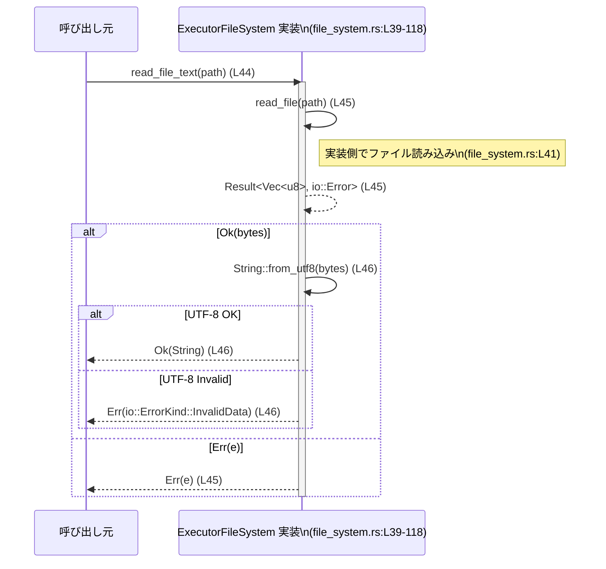

# exec-server/src/file_system.rs コード解説

## 0. ざっくり一言

`ExecutorFileSystem` という非同期ファイルシステム抽象トレイトと、そのためのオプション・メタデータ型、共通の戻り値型を定義するモジュールです（`file_system.rs:L6-37, L39-118`）。  
実行環境（executor）がサンドボックスポリシー付きでファイル操作を行うための共通インターフェースになっています。

---

## 1. このモジュールの役割

### 1.1 概要

- このモジュールは **実行系からのファイル操作を統一的に扱う** ために存在し、非同期の読み書き・ディレクトリ操作・コピー・メタデータ取得といった機能を提供します（`file_system.rs:L39-118`）。
- 全ての操作は `tokio::io::Result` をベースにした `FileSystemResult<T>` で結果を返します（`file_system.rs:L37`）。
- 多くの操作には `SandboxPolicy` を渡すバリアントが用意されており、**サンドボックス制御付きのファイルアクセス** を実装できるようになっています（`file_system.rs:L49-53, L57-62, L70-75, L79-83, L90-94, L98-103, L112-118`）。

### 1.2 アーキテクチャ内での位置づけ

このモジュールは「実行環境」から見たファイルシステムの抽象化層として機能し、実際のファイルアクセスやサンドボックス判定の詳細は、このトレイトを実装する別モジュールに委ねられます。

```mermaid
graph TD
    Caller["Executor / 呼び出し側コンポーネント\n(このチャンク外: 不明)"]
    FS["ExecutorFileSystem トレイト\n(file_system.rs:L39-118)"]
    AbsPath["AbsolutePathBuf\n(codex_utils_absolute_path)\n(file_system.rs:L3)"]
    Policy["SandboxPolicy\n(codex_protocol::protocol)\n(file_system.rs:L2)"]
    Meta["FileMetadata\n(file_system.rs:L22-28)"]
    DirEntry["ReadDirectoryEntry\n(file_system.rs:L30-35)"]
    TokioIO["tokio::io::Result\n(file_system.rs:L4, L37)"]
    Impl["ExecutorFileSystem の実装\n(このチャンクには現れない)"]

    Caller --> FS
    FS --> AbsPath
    FS --> Policy
    FS --> Meta
    FS --> DirEntry
    FS --> TokioIO
    FS -. 実装 -. Impl
    Caller --> Impl
```

- `ExecutorFileSystem` 自体は抽象トレイトであり、実際の I/O は `ExecutorFileSystem` を実装した型（図中 `Impl`）が担います。この実装はこのチャンクには現れません。
- 絶対パスは `AbsolutePathBuf` 型で表現されます（`file_system.rs:L3, L41-118`）。
- サンドボックス制御には `SandboxPolicy` 型が使われます（`file_system.rs:L2, L49-53, L57-62, L70-75, L79-83, L90-94, L98-103, L112-118`）。

### 1.3 設計上のポイント

- **責務の分割**
  - ファイル操作の種類ごとに明確なメソッドを用意（read / write / metadata / directory / remove / copy）し、オプションは専用の構造体で渡す設計です（`CreateDirectoryOptions`, `RemoveOptions`, `CopyOptions`; `file_system.rs:L6-20, L64-68, L96-102, L105-110`）。
- **非同期・並行性**
  - すべての操作が `async fn` として定義され、`async_trait` を利用してトレイト内で非同期メソッドを定義しています（`file_system.rs:L1, L39-118`）。
  - `ExecutorFileSystem: Send + Sync` により、実装型はスレッド間共有が可能でスレッドセーフであることがコンパイル時に要求されます（`file_system.rs:L39-40`）。
- **エラーハンドリング**
  - 戻り値型は `tokio::io::Result<T>` のエイリアス `FileSystemResult<T>` に統一されています（`file_system.rs:L4, L37`）。
  - `read_file_text` はバイト列を UTF-8 にデコードし、失敗時に `io::ErrorKind::InvalidData` でエラーを返します（`file_system.rs:L44-47`）。
- **サンドボックス対応**
  - 各操作に対して「通常版」と「sandbox_policy 付き版」のペアを用意し、ポリシーによるアクセス制御を実装側で行えるようにしています（`file_system.rs:L49-53, L57-62, L70-75, L79-83, L90-94, L98-103, L112-118`）。
- **値オブジェクトのシンプルな設計**
  - オプション構造体およびメタデータ構造体はプレーンなフィールドのみを持ち、`Clone` / `Copy` / `Debug` / `Eq` / `PartialEq` を derive しています（`file_system.rs:L6-35`）。

---

## 2. 主要な機能一覧（コンポーネントインベントリー概説）

このモジュールが提供する主な機能と、その定義位置です。

- ファイル読み込み（バイト列／テキスト）:  
  - `read_file` / `read_file_with_sandbox_policy`（`file_system.rs:L41, L49-53`）  
  - `read_file_text`（UTF-8 デコード付き、デフォルト実装あり `file_system.rs:L44-47`）
- ファイル書き込み:  
  - `write_file` / `write_file_with_sandbox_policy`（`file_system.rs:L55, L57-62`）
- ディレクトリ作成:  
  - `create_directory` / `create_directory_with_sandbox_policy`（`file_system.rs:L64-68, L70-75`）
- メタデータ取得:  
  - `get_metadata` / `get_metadata_with_sandbox_policy`（`file_system.rs:L77, L79-83`）
- ディレクトリ一覧取得:  
  - `read_directory` / `read_directory_with_sandbox_policy`（`file_system.rs:L85-88, L90-94`）
- 削除（ファイル／ディレクトリ）:  
  - `remove` / `remove_with_sandbox_policy`（`file_system.rs:L96, L98-103`）
- コピー（ファイル／ディレクトリ）:  
  - `copy` / `copy_with_sandbox_policy`（`file_system.rs:L105-110, L112-118`）
- オプション・メタデータ型:  
  - `CreateDirectoryOptions`, `RemoveOptions`, `CopyOptions`（`file_system.rs:L6-20`）  
  - `FileMetadata`, `ReadDirectoryEntry`（`file_system.rs:L22-35`）
- 共通結果型:  
  - `FileSystemResult<T> = io::Result<T>`（`file_system.rs:L37`）

---

## 3. 公開 API と詳細解説

### 3.1 型一覧（構造体・型エイリアス）

主要な公開型の一覧です。

| 名前 | 種別 | 役割 / 用途 | 定義位置 |
|------|------|-------------|----------|
| `CreateDirectoryOptions` | 構造体 | ディレクトリ作成時のオプション（再帰的作成かどうか）を表します。`Copy` 可能です。 | `file_system.rs:L6-9` |
| `RemoveOptions` | 構造体 | 削除時のオプション（再帰削除・強制削除）を表します。`Copy` 可能です。 | `file_system.rs:L11-15` |
| `CopyOptions` | 構造体 | コピー時のオプション（再帰的コピーかどうか）を表します。`Copy` 可能です。 | `file_system.rs:L17-20` |
| `FileMetadata` | 構造体 | パスのメタデータ（ディレクトリか、ファイルか、作成・更新時刻）を保持します。 | `file_system.rs:L22-28` |
| `ReadDirectoryEntry` | 構造体 | ディレクトリエントリの 1 件分を表し、ファイル名と種別（ディレクトリ／ファイル）を含みます。 | `file_system.rs:L30-35` |
| `FileSystemResult<T>` | 型エイリアス | すべてのファイル操作の結果型。`tokio::io::Result<T>` の別名です。 | `file_system.rs:L4, L37` |
| `ExecutorFileSystem` | トレイト | 非同期ファイルシステムの抽象インターフェース。Send + Sync 要件付きです。 | `file_system.rs:L39-118` |

#### 各構造体のフィールド概要

- `CreateDirectoryOptions`（`file_system.rs:L6-9`）
  - `recursive: bool` — 親ディレクトリも含めて再帰的に作成するかどうか。

- `RemoveOptions`（`file_system.rs:L11-15`）
  - `recursive: bool` — ディレクトリの場合に中身ごと再帰削除するかどうか。
  - `force: bool` — エラーを無視するなどの強制削除を意味することが推測されますが、具体的な挙動は実装側に依存し、このチャンクからは断定できません。

- `CopyOptions`（`file_system.rs:L17-20`）
  - `recursive: bool` — ディレクトリの中身を再帰的にコピーするかどうか。

- `FileMetadata`（`file_system.rs:L22-28`）
  - `is_directory: bool` — 対象がディレクトリかどうか。
  - `is_file: bool` — 対象が通常ファイルかどうか。
  - `created_at_ms: i64` — 作成時刻をミリ秒単位で表すと解釈できますが、エポックなどの基準はこのチャンクからは分かりません。
  - `modified_at_ms: i64` — 更新時刻をミリ秒単位で表すと解釈できますが、基準は不明です。

- `ReadDirectoryEntry`（`file_system.rs:L30-35`）
  - `file_name: String` — エントリの名称（パスではなく、ディレクトリ内での名前）。
  - `is_directory: bool` — ディレクトリかどうか。
  - `is_file: bool` — ファイルかどうか。

### 3.2 関数詳細（重要メソッド 7 件）

以下では `ExecutorFileSystem` トレイトの中でも代表的なメソッド 7 件について、詳細に説明します。

---

#### `read_file(&self, path: &AbsolutePathBuf) -> FileSystemResult<Vec<u8>>`（async）

**概要**

- 指定された絶対パスのファイルを読み込み、内容をバイト列として返すための抽象メソッドです（`file_system.rs:L41`）。
- 具体的な I/O 手順は、`ExecutorFileSystem` を実装する型に委ねられ、このファイルには実装は含まれていません。

**引数**

| 引数名 | 型 | 説明 |
|--------|----|------|
| `self` | `&self` | `ExecutorFileSystem` 実装インスタンスへの参照です。`Send + Sync` 制約付きです（`file_system.rs:L39-40`）。|
| `path` | `&AbsolutePathBuf` | 読み込むファイルの絶対パスを示す値です（`file_system.rs:L3, L41`）。この型の詳細はこのチャンクには現れません。 |

**戻り値**

- `FileSystemResult<Vec<u8>>` — 成功時はファイルの内容を格納した `Vec<u8>`、失敗時は `tokio::io::Error` を内包した `Err` になります（`file_system.rs:L37, L41`）。

**内部処理の流れ（アルゴリズム）**

- 本ファイルには実装がないため、具体的な処理フローは不明です。
- 名前とシグネチャから、一般的なパターンとしては以下のような流れが考えられますが、これは推測であり、このチャンクからは確認できません。
  - パスの存在確認
  - ファイルを開く
  - 非同期で全内容を読み込む
  - バイト列として返却

**Examples（使用例）**

`ExecutorFileSystem` を実装した型 `Fs` があると仮定し、汎用関数として利用する例です。

```rust
use tokio::io; // tokio::io::Result などを使うためにインポートする              // I/O 関連型の導入
use codex_utils_absolute_path::AbsolutePathBuf;                                  // AbsolutePathBuf 型の導入
use exec_server::file_system::{ExecutorFileSystem, FileSystemResult};           // トレイトと結果型をインポート（パスは例）

// 汎用的な補助関数: 任意の ExecutorFileSystem 実装からファイルを読む        // ジェネリック関数の定義
async fn load_bytes<Fs>(fs: &Fs, path: &AbsolutePathBuf)                         // 非同期関数として定義
    -> FileSystemResult<Vec<u8>>                                                 // FileSystemResult で結果を返す
where
    Fs: ExecutorFileSystem,                                                      // Fs は ExecutorFileSystem を実装している必要がある
{
    fs.read_file(path).await                                                     // read_file を呼び出し、そのまま結果を返す
}
```

※ `exec_server::file_system` というモジュールパスは仮の例です。実際のクレート構成はこのチャンクには現れません。

**Errors / Panics**

- 戻り値が `FileSystemResult`（`io::Result`）であることから、**何らかの I/O エラー** が `Err` として返ることが想定されますが、どの状況でどのエラーコードが返るかは実装次第で、このチャンクからは分かりません。
- パニックする条件はインターフェース上は示されていません。

**Edge cases（エッジケース）**

このファイルには実装がないため、具体的挙動は不明ですが、典型的に問題となるケースを列挙します（挙動は実装依存であり、このチャンクからは確認できません）。

- 存在しないパスが指定された場合
- ディレクトリが指定された場合
- 権限がないファイルの読み込みを試みた場合
- 非常に大きなファイルを指定した場合

**使用上の注意点**

- 非同期メソッドなので、呼び出し元は Tokio 等の非同期ランタイム上で `.await` する必要があります（`file_system.rs:L41`）。
- `&self` であり `ExecutorFileSystem: Send + Sync` なので、複数タスクから同一インスタンスを共有してもよい設計ですが、実装が内部でどのように同期を行うかはこのチャンクからは分かりません（`file_system.rs:L39-40`）。

---

#### `read_file_text(&self, path: &AbsolutePathBuf) -> FileSystemResult<String>`（async）

**概要**

- ファイルを読み込んで UTF-8 テキストとして返す **デフォルト実装付きメソッド** です（`file_system.rs:L44-47`）。
- 内部で `read_file` を呼び出し、そのバイト列を `String::from_utf8` でデコードします。

**引数**

| 引数名 | 型 | 説明 |
|--------|----|------|
| `self` | `&self` | `ExecutorFileSystem` 実装インスタンスへの参照です。 |
| `path` | `&AbsolutePathBuf` | 読み込むファイルの絶対パスです（`file_system.rs:L44`）。 |

**戻り値**

- `FileSystemResult<String>` — 成功時は UTF-8 デコード済みの `String`、失敗時は `io::Error` を返します（`file_system.rs:L37, L44-47`）。

**内部処理の流れ（アルゴリズム）**

`file_system.rs:L44-47` のコードに基づき、以下のように動作します。

1. `self.read_file(path).await?` で同じパスに対して `read_file` を呼び出します（`file_system.rs:L45`）。
   - `?` により、ここで `Err` が返された場合はそのまま呼び出し元にエラーを伝播します。
2. 成功した場合、その結果の `Vec<u8>` を `bytes` という変数に束縛します（`file_system.rs:L45`）。
3. `String::from_utf8(bytes)` を呼び出し、UTF-8 デコードを行います（`file_system.rs:L46`）。
4. デコードに失敗した場合、`io::Error::new(io::ErrorKind::InvalidData, err)` により `io::ErrorKind::InvalidData` 種別のエラーに変換し、`Err` を返します（`file_system.rs:L46`）。
5. デコードに成功した場合は、その `String` を `Ok` で返します（`file_system.rs:L46`）。

**Examples（使用例）**

`read_file_text` を使ってファイル内容を標準出力する例です。

```rust
use tokio::io;                                                            // io::Result や io::Error を利用する
use codex_utils_absolute_path::AbsolutePathBuf;                           // パス型
use exec_server::file_system::{ExecutorFileSystem, FileSystemResult};     // トレイトと結果型（パスは例）

// 任意の ExecutorFileSystem 実装からテキストファイルを読み、表示する関数        // 汎用関数の定義
async fn print_text_file<Fs>(fs: &Fs, path: &AbsolutePathBuf)             // 非同期関数
    -> FileSystemResult<()>                                               // I/O エラーをそのまま返す
where
    Fs: ExecutorFileSystem,                                               // Fs は ExecutorFileSystem を実装
{
    let text = fs.read_file_text(path).await?;                            // UTF-8 として読み込む
    println!("{text}");                                                   // 読み込んだ内容を表示
    Ok(())                                                                // 正常終了
}
```

**Errors / Panics**

- `read_file` 呼び出しが返すあらゆる `io::Error` が、`?` によってそのまま呼び出し元に伝播します（`file_system.rs:L45`）。
- 読み込んだバイト列が **有効な UTF-8 でない場合**、`io::ErrorKind::InvalidData` の `io::Error` に変換されて `Err` になります（`file_system.rs:L46`）。
- `String::from_utf8` 自体はパニックしないため、このメソッド内でのパニック要因はコード上は見当たりません（`file_system.rs:L46`）。

**Edge cases（エッジケース）**

- ファイルが存在しない・権限がないなどの I/O エラー:  
  - `read_file` の実装に依存し、どのようなエラーが返るかはこのチャンクからは分かりませんが、`Err(io::Error)` として `read_file_text` からもそのまま返されます（`file_system.rs:L45`）。
- ファイルが空である場合:  
  - `Vec<u8>` が空の状態で `String::from_utf8` が呼ばれますが、空配列は有効な UTF-8 なので `Ok(String::new())` になることが Rust 標準ライブラリの仕様から分かります（これは外部知識であり、このファイルには明示されていません）。
- バイナリファイルなど、UTF-8 でない内容:  
  - `String::from_utf8` がエラーを返し、それが `io::ErrorKind::InvalidData` に変換されます（`file_system.rs:L46`）。

**使用上の注意点**

- `read_file` と異なり、**UTF-8 前提** の API である点に注意が必要です。バイナリファイルや別エンコーディングのテキストを扱う場合は `read_file` を使用するべきです。
- `?` を使って呼び出すと、`InvalidData` エラーも他の I/O エラーと同列に扱われるため、エラー種別で条件分岐したい場合はエラーをパターンマッチする必要があります。
- 非同期メソッドであるため、呼び出しは `.await` が必須です。

---

#### `read_file_with_sandbox_policy(&self, path: &AbsolutePathBuf, sandbox_policy: Option<&SandboxPolicy>) -> FileSystemResult<Vec<u8>>`（async）

**概要**

- `read_file` と同様にファイルをバイト列として読み込みますが、**サンドボックスポリシーを追加引数として受け取る** 抽象メソッドです（`file_system.rs:L49-53`）。
- どのように `SandboxPolicy` を解釈するかは実装に依存し、このチャンクには実装はありません。

**引数**

| 引数名 | 型 | 説明 |
|--------|----|------|
| `self` | `&self` | `ExecutorFileSystem` 実装インスタンスへの参照です。 |
| `path` | `&AbsolutePathBuf` | 読み込むファイルの絶対パスです（`file_system.rs:L49-52`）。 |
| `sandbox_policy` | `Option<&SandboxPolicy>` | サンドボックスポリシーの参照をオプションで受け取ります。`None` の場合、ポリシー非適用とみなすかどうかは実装依存です（`file_system.rs:L49-53`）。 |

**戻り値**

- `FileSystemResult<Vec<u8>>` — `read_file` と同様です（`file_system.rs:L37, L49-53`）。

**内部処理の流れ**

- 本ファイルに実装はなく、具体的な制御フローは不明です。
- メソッド名と引数から、次のような流れが想定されますが、コードからは確認できません。
  - `sandbox_policy` が `Some` の場合、そのルールに従って `path` へのアクセス可否を判断。
  - 許可されていればファイルを読み込み、`Vec<u8>` を返す。
  - 禁止されていればエラーを返す。

**Examples（使用例）**

`SandboxPolicy` を引数として受け取り、それを渡して読み込む関数の例です。

```rust
use tokio::io;
use codex_utils_absolute_path::AbsolutePathBuf;
use codex_protocol::protocol::SandboxPolicy;
use exec_server::file_system::{ExecutorFileSystem, FileSystemResult};

// サンドボックスポリシーを考慮してファイルを読み込む例                       // 汎用関数
async fn load_bytes_with_policy<Fs>(
    fs: &Fs,                                                                  // ファイルシステム実装
    path: &AbsolutePathBuf,                                                   // パス
    policy: Option<&SandboxPolicy>,                                           // 適用するポリシー（省略可）
) -> FileSystemResult<Vec<u8>>
where
    Fs: ExecutorFileSystem,                                                   // Fs は ExecutorFileSystem を実装
{
    fs.read_file_with_sandbox_policy(path, policy).await                      // ポリシー付き読み込み
}
```

**Errors / Panics**

- I/O エラーに加え、**ポリシー違反** の場合にどのようなエラーとして表現するかは実装依存であり、このチャンクには記述がありません。
- パニック条件は特に示されていません。

**Edge cases**

- `sandbox_policy == None` の場合:
  - どのように扱うか（ポリシー無効／デフォルトポリシー適用など）は実装依存で、このチャンクからは分かりません。
- `sandbox_policy` によって `path` が禁止されている場合:
  - どのエラー種別で返すかも含め、挙動は不明です。

**使用上の注意点**

- セキュリティ上重要な API であり、**呼び出し側は適切な `SandboxPolicy` を渡すことが前提** になります。
- 実装によっては、`read_file` と `read_file_with_sandbox_policy` の挙動を切り分けるのではなく、内部的には常にサンドボックスを適用し、`read_file` から `read_file_with_sandbox_policy` を呼び出す設計も考えられますが、このファイルからは実際の設計は分かりません。

---

#### `write_file_with_sandbox_policy(&self, path: &AbsolutePathBuf, contents: Vec<u8>, sandbox_policy: Option<&SandboxPolicy>) -> FileSystemResult<()>`（async）

**概要**

- 指定パスにバイト列を書き込む操作に、サンドボックスポリシーを加えた抽象メソッドです（`file_system.rs:L57-62`）。
- 書き込みの成否のみを `Result<()>` で返します。

**引数**

| 引数名 | 型 | 説明 |
|--------|----|------|
| `self` | `&self` | 実装インスタンスへの参照。 |
| `path` | `&AbsolutePathBuf` | 書き込み先の絶対パスです（`file_system.rs:L57-60`）。 |
| `contents` | `Vec<u8>` | 書き込むデータのバイト列です（所有権がこのメソッドに移動します；`file_system.rs:L57-61`）。 |
| `sandbox_policy` | `Option<&SandboxPolicy>` | 書き込み操作に適用するサンドボックスポリシーです（`file_system.rs:L57-62`）。 |

**戻り値**

- `FileSystemResult<()>` — 成功時は `Ok(())`、失敗時は `io::Error` を返します（`file_system.rs:L37, L57-62`）。

**内部処理の流れ**

- 実装はこのファイルに含まれていないため不明です。
- 一般的には:
  - ポリシーによる書き込み許可の判定
  - ファイルの作成／上書き
  - 書き込み処理
  が行われると考えられますが、これは推測です。

**Examples（使用例）**

```rust
use tokio::io;
use codex_utils_absolute_path::AbsolutePathBuf;
use codex_protocol::protocol::SandboxPolicy;
use exec_server::file_system::{ExecutorFileSystem, FileSystemResult};

// テキストを UTF-8 バイト列に変換して、ポリシー付きで書き込む例                 // 汎用的な書き込み関数
async fn save_text_with_policy<Fs>(
    fs: &Fs,                                                                  // ExecutorFileSystem 実装
    path: &AbsolutePathBuf,                                                   // 保存先パス
    text: &str,                                                                // 保存するテキスト
    policy: Option<&SandboxPolicy>,                                           // サンドボックスポリシー
) -> FileSystemResult<()>
where
    Fs: ExecutorFileSystem,
{
    let bytes = text.as_bytes().to_vec();                                     // &str から Vec<u8> を生成
    fs.write_file_with_sandbox_policy(path, bytes, policy).await              // 非同期で書き込み
}
```

**Errors / Panics**

- I/O エラー（ディスクフル、パーミッションなど）やポリシー違反の扱いは実装依存です。
- インターフェースからはパニック条件は読み取れません。

**Edge cases**

- 大量データ書き込み時のパフォーマンスや部分書き込みの扱いなどは、このインターフェースからは分かりません。
- `contents` が空の場合、空ファイルを作成／既存ファイルを空にすることが想定されますが、このチャンクでは確認できません。

**使用上の注意点**

- `contents: Vec<u8>` の所有権がメソッドに移るため、呼び出し後に同じ `Vec` を再利用したい場合は `clone` などで複製する必要があります。
- 書き込み操作はセキュリティ上の影響が大きいため、適切な `SandboxPolicy` を渡すことが重要です。

---

#### `create_directory_with_sandbox_policy(&self, path: &AbsolutePathBuf, create_directory_options: CreateDirectoryOptions, sandbox_policy: Option<&SandboxPolicy>) -> FileSystemResult<()>`（async）

**概要**

- ディレクトリ作成処理に `CreateDirectoryOptions` と `SandboxPolicy` を組み合わせた抽象メソッドです（`file_system.rs:L70-75`）。

**引数**

| 引数名 | 型 | 説明 |
|--------|----|------|
| `self` | `&self` | 実装インスタンスへの参照。 |
| `path` | `&AbsolutePathBuf` | 作成するディレクトリのパスです（`file_system.rs:L70-73`）。 |
| `create_directory_options` | `CreateDirectoryOptions` | `recursive` フラグを含むオプション（`file_system.rs:L70, L6-9`）。`Copy` 可能です。 |
| `sandbox_policy` | `Option<&SandboxPolicy>` | 作成操作に適用するサンドボックスポリシー（`file_system.rs:L70-75`）。 |

**戻り値**

- `FileSystemResult<()>` — 成否のみが返されます。

**内部処理の流れ**

- 実装はこのファイルにはありません。
- `CreateDirectoryOptions::recursive` の意味は、「親ディレクトリも含めて再帰的に作成するか」を表すものと解釈できますが、具体的なディレクトリ階層の扱いは不明です（`file_system.rs:L6-9, L70-75`）。

**Examples（使用例）**

```rust
use tokio::io;
use codex_utils_absolute_path::AbsolutePathBuf;
use codex_protocol::protocol::SandboxPolicy;
use exec_server::file_system::{ExecutorFileSystem, CreateDirectoryOptions, FileSystemResult};

// 再帰的にディレクトリを作成する例                                              // ディレクトリ作成の補助関数
async fn ensure_dir<Fs>(
    fs: &Fs,
    path: &AbsolutePathBuf,
    policy: Option<&SandboxPolicy>,
) -> FileSystemResult<()>
where
    Fs: ExecutorFileSystem,
{
    let opts = CreateDirectoryOptions { recursive: true };                    // 再帰作成を有効化
    fs.create_directory_with_sandbox_policy(path, opts, policy).await         // ディレクトリを作成
}
```

**Errors / Panics**

- 既に同名のファイルが存在する場合や、権限不足などによるエラーの扱いは実装依存です。
- パニック条件はインターフェースからは読み取れません。

**Edge cases**

- `recursive: false` かつ親ディレクトリが存在しない場合の挙動（エラーかどうかなど）は、このチャンクからは分かりません。
- `sandbox_policy` によって指定パスの作成が禁止されるケースも、実装依存です。

**使用上の注意点**

- ディレクトリ構造の前提や、どこまでディレクトリ作成を許可するかはセキュリティ上の重要な設計点であり、このメソッドを利用するコードの側でも、適切な `SandboxPolicy` を選択することが重要です。

---

#### `get_metadata_with_sandbox_policy(&self, path: &AbsolutePathBuf, sandbox_policy: Option<&SandboxPolicy>) -> FileSystemResult<FileMetadata>`（async）

**概要**

- 指定パスの `FileMetadata` を取得するメソッドで、サンドボックスポリシーにも対応しています（`file_system.rs:L79-83`）。

**引数**

| 引数名 | 型 | 説明 |
|--------|----|------|
| `self` | `&self` | 実装インスタンスへの参照。 |
| `path` | `&AbsolutePathBuf` | メタデータを取得する対象パス（ファイルまたはディレクトリ）です（`file_system.rs:L79-82`）。 |
| `sandbox_policy` | `Option<&SandboxPolicy>` | メタデータ参照に適用するサンドボックスポリシーです（`file_system.rs:L79-83`）。 |

**戻り値**

- `FileSystemResult<FileMetadata>` — 成功時は `FileMetadata` が返ります（`file_system.rs:L22-28, L79-83`）。

**内部処理の流れ**

- 実装はこのファイルにはありません。
- 一般的な動作としては、ファイルシステムの `stat` に相当する情報を取得し、`FileMetadata` に詰め替える処理が想定されますが、これは推測です。

**Examples（使用例）**

```rust
use tokio::io;
use codex_utils_absolute_path::AbsolutePathBuf;
use codex_protocol::protocol::SandboxPolicy;
use exec_server::file_system::{ExecutorFileSystem, FileMetadata, FileSystemResult};

// パスの種別を判定して出力する例                                                 // メタデータを利用する補助関数
async fn print_kind<Fs>(
    fs: &Fs,
    path: &AbsolutePathBuf,
    policy: Option<&SandboxPolicy>,
) -> FileSystemResult<()>
where
    Fs: ExecutorFileSystem,
{
    let meta: FileMetadata = fs.get_metadata_with_sandbox_policy(path, policy).await?; // メタデータ取得
    if meta.is_directory {                                                             // ディレクトリか確認
        println!("directory");
    } else if meta.is_file {                                                           // ファイルか確認
        println!("file");
    } else {
        println!("other");                                                             // それ以外（シンボリックリンク等）の可能性
    }
    Ok(())
}
```

**Errors / Panics**

- パスが存在しない・アクセス禁止などの状況でエラーが返ることが想定されますが、このチャンクには具体的なエラー種別の記述はありません。
- パニック条件は特に示されていません。

**Edge cases**

- `is_directory` と `is_file` が同時に `false` となるケースがあり得るか（特殊なファイル種別など）は、このチャンクからは分かりません。
- `created_at_ms` や `modified_at_ms` が 0 や負の値を取りうるかどうかも不明です。

**使用上の注意点**

- `FileMetadata` の時刻フィールドの基準（Unix epoch など）は明示されていないため、他システムとの変換では別途仕様を確認する必要があります。
- セキュリティ上、`get_metadata` を利用できる範囲もサンドボックスで制御する必要がある場合、このメソッドを利用することになります。

---

#### `remove_with_sandbox_policy(&self, path: &AbsolutePathBuf, remove_options: RemoveOptions, sandbox_policy: Option<&SandboxPolicy>) -> FileSystemResult<()>`（async）

**概要**

- ファイルまたはディレクトリを削除する操作を、`RemoveOptions` とサンドボックスポリシー付きで抽象化したメソッドです（`file_system.rs:L98-103`）。

**引数**

| 引数名 | 型 | 説明 |
|--------|----|------|
| `self` | `&self` | 実装インスタンスへの参照。 |
| `path` | `&AbsolutePathBuf` | 削除対象のパスです（`file_system.rs:L98-101`）。 |
| `remove_options` | `RemoveOptions` | `recursive` / `force` を含む削除オプションです（`file_system.rs:L11-15, L98-102`）。 |
| `sandbox_policy` | `Option<&SandboxPolicy>` | 削除操作に適用するサンドボックスポリシー（`file_system.rs:L98-103`）。 |

**戻り値**

- `FileSystemResult<()>` — 成否のみが返されます。

**内部処理の流れ**

- 実装はこのファイルにはありません。
- 一般には:
  - ポリシー判定 → 削除可能かチェック
  - `recursive` が `true` の場合はディレクトリ内を再帰的に削除
  - `force` の扱い（エラー無視など）
  が想定されますが、コードからは確認できません。

**Examples（使用例）**

```rust
use tokio::io;
use codex_utils_absolute_path::AbsolutePathBuf;
use codex_protocol::protocol::SandboxPolicy;
use exec_server::file_system::{ExecutorFileSystem, RemoveOptions, FileSystemResult};

// ディレクトリを中身ごと強制削除する例                                         // 削除ヘルパー関数
async fn remove_dir_recursive<Fs>(
    fs: &Fs,
    path: &AbsolutePathBuf,
    policy: Option<&SandboxPolicy>,
) -> FileSystemResult<()>
where
    Fs: ExecutorFileSystem,
{
    let opts = RemoveOptions { recursive: true, force: true };                // 再帰 + 強制削除
    fs.remove_with_sandbox_policy(path, opts, policy).await                   // 削除実行
}
```

**Errors / Panics**

- 削除できない場合にどういうエラーが返るか、`force` がどのようにエラーを抑制するかは実装依存で、このチャンクからは分かりません。
- パニック条件は示されていません。

**Edge cases**

- 非空ディレクトリに対して `recursive: false` を指定した場合の挙動。
- `force: true` であっても削除が不可能なケース（例えばシステム上の制約）があり得るかどうか。

**使用上の注意点**

- 削除操作は取り消しが困難なため、呼び出し側で `RemoveOptions` を慎重に指定する必要があります。
- セキュリティ上危険な操作であり、サンドボックスポリシーの設計が重要です。

---

### 3.3 その他の関数（メソッド）インベントリー

3.2 で詳細説明したもの以外のメソッド一覧です。

| 関数名 | シグネチャ（概略） | 役割（1 行） | 定義位置 |
|--------|--------------------|--------------|----------|
| `write_file` | `async fn write_file(&self, path: &AbsolutePathBuf, contents: Vec<u8>) -> FileSystemResult<()>` | バイト列をファイルに書き込む抽象メソッド。サンドボックスなし版。 | `file_system.rs:L55` |
| `create_directory` | `async fn create_directory(&self, path: &AbsolutePathBuf, options: CreateDirectoryOptions) -> FileSystemResult<()>` | ディレクトリを作成する抽象メソッド。サンドボックスなし版。 | `file_system.rs:L64-68` |
| `get_metadata` | `async fn get_metadata(&self, path: &AbsolutePathBuf) -> FileSystemResult<FileMetadata>` | パスのメタデータを取得する抽象メソッド。サンドボックスなし版。 | `file_system.rs:L77` |
| `read_directory` | `async fn read_directory(&self, path: &AbsolutePathBuf) -> FileSystemResult<Vec<ReadDirectoryEntry>>` | 指定ディレクトリ内のエントリ一覧を取得する抽象メソッド。サンドボックスなし版。 | `file_system.rs:L85-88` |
| `read_directory_with_sandbox_policy` | `async fn read_directory_with_sandbox_policy(&self, path: &AbsolutePathBuf, sandbox_policy: Option<&SandboxPolicy>) -> FileSystemResult<Vec<ReadDirectoryEntry>>` | ディレクトリ一覧取得 + サンドボックス対応版。 | `file_system.rs:L90-94` |
| `remove` | `async fn remove(&self, path: &AbsolutePathBuf, options: RemoveOptions) -> FileSystemResult<()>` | ファイル／ディレクトリ削除のサンドボックスなし版。 | `file_system.rs:L96` |
| `copy` | `async fn copy(&self, source_path: &AbsolutePathBuf, destination_path: &AbsolutePathBuf, options: CopyOptions) -> FileSystemResult<()>` | ファイル／ディレクトリのコピーを行う抽象メソッド。サンドボックスなし版。 | `file_system.rs:L105-110` |
| `copy_with_sandbox_policy` | `async fn copy_with_sandbox_policy(&self, source_path: &AbsolutePathBuf, destination_path: &AbsolutePathBuf, copy_options: CopyOptions, sandbox_policy: Option<&SandboxPolicy>) -> FileSystemResult<()>` | コピー操作にサンドボックスポリシーを適用する版。 | `file_system.rs:L112-118` |

---

## 4. データフロー

ここでは、唯一このファイル内に実装が存在する `read_file_text` の典型的なデータフローを示します。

### 4.1 `read_file_text` 呼び出し時のフロー

`read_file_text` の処理は `read_file` の結果を受けて UTF-8 デコードを行う二段階構造になっています（`file_system.rs:L44-47`）。



- `read_file_text` は `read_file` に完全に依存しており、実際の I/O は `read_file` の実装側で行われます（`file_system.rs:L45`）。
- UTF-8 変換に失敗した場合のみ、このメソッド自身が新たな `io::Error` を生成します（`file_system.rs:L46`）。

### 4.2 サンドボックス付きメソッドのデータフロー（概念）

`*_with_sandbox_policy` 系メソッドは、追加の `SandboxPolicy` 引数を取り、内部でポリシー判定を行うことが想定されますが、その詳細はこのファイルには記述がありません（`file_system.rs:L49-53, L57-62, L70-75, L79-83, L90-94, L98-103, L112-118`）。  
したがって、このチャンクから具体的なシーケンスを図示することはできません。

---

## 5. 使い方（How to Use）

### 5.1 基本的な使用方法

このモジュール自体はトレイトとデータ型のみを定義しており、実際に利用するには `ExecutorFileSystem` を実装した型が必要です。このチャンクには実装は現れませんが、呼び出し側コードは以下のような形になります。

```rust
use tokio::io;
use codex_utils_absolute_path::AbsolutePathBuf;
use exec_server::file_system::{ExecutorFileSystem, FileSystemResult}; // パスは例

// ExecutorFileSystem 実装に依存しない汎用処理                                 // 抽象化された利用側コード
async fn run_task<Fs>(fs: &Fs, path: &AbsolutePathBuf)                    // ファイルシステムとパスを受け取る
    -> FileSystemResult<()>                                               // I/O エラーを呼び出し元へ返す
where
    Fs: ExecutorFileSystem,                                               // Fs は ExecutorFileSystem を実装
{
    // バイト列として読み込む                                             // バイナリ読み込み
    let bytes = fs.read_file(path).await?;                                // read_file を await

    // UTF-8 テキストとして読み込む                                       // テキスト読み込み
    let text = fs.read_file_text(path).await?;                            // read_file_text を await

    println!("size={} bytes", bytes.len());                               // サイズを表示
    println!("content={text}");                                           // 内容を表示

    Ok(())                                                                // 正常終了
}
```

- 呼び出し側は `ExecutorFileSystem` をトレイト境界として扱うことで、実ファイルシステム・メモリ上の仮想ファイルシステムなど、様々な実装を差し替えることができます。
- 並行実行したい場合、`Arc<Fs>` を `&*arc` で借用して使うような形が典型的です（`Send + Sync` 制約により、それが安全であることが保証されます；`file_system.rs:L39-40`）。

### 5.2 よくある使用パターン

1. **サンドボックス無しのシンプルな利用**

   - テスト環境や信頼できるパスのみを扱うコードで、`*_with_sandbox_policy` ではないメソッドを使うパターンです（`file_system.rs:L41, L55, L64-68, L77, L85-88, L96, L105-110`）。

2. **サンドボックス付き利用**

   - マルチテナント環境などで、呼び出しごとに `SandboxPolicy` を切り替えながら `*_with_sandbox_policy` を呼び出すパターンが想定されます（`file_system.rs:L49-53, L57-62, L70-75, L79-83, L90-94, L98-103, L112-118`）。

3. **オプション構造体による動作切り替え**

   - 例えば削除時に `RemoveOptions { recursive: true, force: false }` などを指定し、同じメソッドで複数の挙動を切り替える設計になっています（`file_system.rs:L11-15, L96, L98-102`）。

### 5.3 よくある間違い（想定）

実装はこのチャンクにないため、実際の誤用パターンは分かりませんが、インターフェースから想定される典型的な誤りを示します。

```rust
// 間違い例: 非同期コンテキスト外で .await を呼ぼうとしている
// fn main() {
//     let fs = create_fs(); // 実装を作る（仮）
//     let path = AbsolutePathBuf::new("/tmp/file.txt");
//     let text = fs.read_file_text(&path).await; // コンパイルエラー: async コンテキスト外
// }

// 正しい例: Tokio ランタイムなどの中で await する
#[tokio::main]                                                         // Tokio ランタイムの起動
async fn main() -> io::Result<()> {                                    // 非同期 main
    let fs = create_fs();                                              // ExecutorFileSystem 実装を生成（仮）
    let path = AbsolutePathBuf::new("/tmp/file.txt");                  // パスを作成（コンストラクタは仮）
    let text = fs.read_file_text(&path).await?;                        // 非同期に読み込み
    println!("{text}");                                                // 結果を表示
    Ok(())                                                             // 正常終了
}
```

※ `create_fs` や `AbsolutePathBuf::new` などは、このチャンクには定義がないため、ここでは仮の関数／メソッド名です。

### 5.4 使用上の注意点（まとめ）

- **非同期・ランタイム依存**
  - 全メソッドが `async fn` であるため、Tokio などの非同期ランタイムの上で `.await` する必要があります（`file_system.rs:L39-118`）。
- **スレッド安全性**
  - `ExecutorFileSystem: Send + Sync` により、実装型はスレッド間で安全に共有可能であることが要求されますが、内部状態の同期方法は実装依存です（`file_system.rs:L39-40`）。
- **UTF-8 前提 API**
  - `read_file_text` は UTF-8 以外のエンコーディングには対応しておらず、非 UTF-8 の内容に対しては `InvalidData` エラーになります（`file_system.rs:L44-47`）。
- **サンドボックスポリシー**
  - `*_with_sandbox_policy` メソッドを用いることで、呼び出し単位でアクセス制御を行える設計になっていますが、`SandboxPolicy` の仕様はこのチャンクには現れません（`file_system.rs:L49-53` ほか）。
- **オプション構造体の意味**
  - `recursive` や `force` の具体的な挙動は実装依存であり、利用時には実装側の仕様を確認する必要があります（`file_system.rs:L6-20`）。

---

## 6. 変更の仕方（How to Modify）

### 6.1 新しい機能を追加する場合

このモジュールに新しいファイル操作（例: rename, symlink 管理）を追加したい場合、既存の設計から次のようなパターンが読み取れます。

1. **オプション構造体の追加（必要なら）**
   - `CreateDirectoryOptions`, `RemoveOptions`, `CopyOptions` と同様に、必要なフラグをまとめた小さな構造体を追加します（`file_system.rs:L6-20`）。

2. **トレイトメソッドの追加**
   - `ExecutorFileSystem` に、新しい操作のメソッドを追加します。
   - 既存との一貫性を保つため、通常版と `*_with_sandbox_policy` 版の 2 本セットで追加するのが自然です（`file_system.rs:L41, L49-53` などのペア構造）。

3. **戻り値型の統一**
   - 戻り値は `FileSystemResult<T>` を用いて I/O エラー表現を統一します（`file_system.rs:L37`）。

4. **実装側での対応**
   - このトレイトを実装している全ての型に、新しいメソッドの実装が必要になります。どの実装が存在するかはこのチャンクからは分かりません。

### 6.2 既存の機能を変更する場合

- **シグネチャ変更の影響**
  - トレイトのメソッドシグネチャを変更すると、それを実装している全ての型への影響が生じます。
  - 公開 API の破壊的変更となるため、慎重な検討が必要です（`file_system.rs:L39-118`）。

- **オプションの拡張**
  - `CreateDirectoryOptions` に新たなフィールドを追加するなどの変更は、`Copy` / `Clone` などの derive に影響しない範囲であれば後方互換的に行える可能性があります（`file_system.rs:L6-9`）。
  - ただし、既存コードが `CreateDirectoryOptions { recursive: true }` のように構造体更新構文を使っている場合、新しいフィールドの扱いに注意が必要です。このチャンクでは、そのような利用箇所は分かりません。

- **契約（Contracts）の保持**
  - `read_file_text` が `InvalidData` を返す契約（UTF-8 でない場合）は、既存呼び出し側が期待している可能性があるため、変更する場合は注意が必要です（`file_system.rs:L44-47`）。

---

## 7. 関連ファイル

このモジュールから参照されている外部型・モジュール、および関係は以下の通りです。

| パス / モジュール | 役割 / 関係 |
|-------------------|------------|
| `async_trait::async_trait` | トレイト内に `async fn` を定義するためのマクロ。`ExecutorFileSystem` に適用されています（`file_system.rs:L1, L39`）。 |
| `codex_protocol::protocol::SandboxPolicy` | サンドボックスポリシー型。`*_with_sandbox_policy` メソッドの引数として使われます（`file_system.rs:L2, L49-53, L57-62, L70-75, L79-83, L90-94, L98-103, L112-118`）。実体定義はこのチャンクには現れません。 |
| `codex_utils_absolute_path::AbsolutePathBuf` | ファイルシステム操作で用いる絶対パス型（`file_system.rs:L3, L41-118`）。実装は別モジュールです。 |
| `tokio::io` | `io::Result` や `io::Error`、`io::ErrorKind` を提供するモジュール。`FileSystemResult` のベースとなります（`file_system.rs:L4, L37, L45-47`）。 |

このチャンクにはテストコードや実際の `ExecutorFileSystem` 実装は現れないため、どのファイルがこのトレイトを実装し、どのように利用しているかは不明です。
