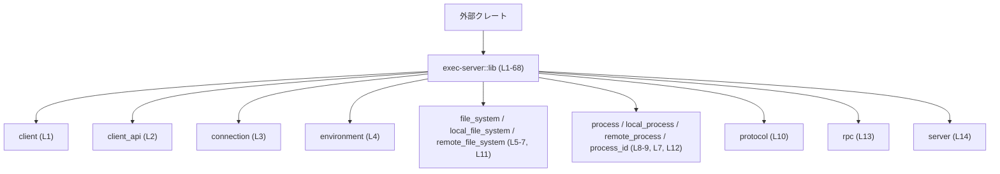

exec-server/src/lib.rs

---

## 0. ざっくり一言

このファイルは `exec-server` クレートのルート（`lib.rs`）であり、クライアント、サーバ、ファイルシステム、プロセス実行、プロトコルなどのサブモジュールで定義されたアイテムを、クレート外から利用しやすいように一括で再エクスポートする「窓口」として機能しています（`lib.rs:L1-14, L16-68`）。

---

## 1. このモジュールの役割

### 1.1 概要

- このモジュールは、`client`・`server`・`file_system`・`process`・`protocol` などのサブモジュールで定義されたアイテムを `pub use` でまとめて公開するために存在します（`lib.rs:L1-14, L16-68`）。
- 外部クレートからは、ほぼすべての主要な API を `exec_server::ExecServerClient` のようなトップレベルパスで利用できるようになっています（`lib.rs:L16-68`）。
- 実際のビジネスロジックや並行処理、エラーハンドリングの詳細は、ここで宣言されている各サブモジュール側に実装されており、このチャンクには含まれていません（`lib.rs:L1-14`）。

### 1.2 アーキテクチャ内での位置づけ

このファイルはクレート全体の「ファサード（表口）」として、内部モジュールの詳細を隠蔽しつつ、必要な型・関数・定数だけをまとめて公開しています。

- サブモジュール宣言: `mod client;`, `mod server;` などで内部モジュールを宣言（`lib.rs:L1-14`）。
- 再エクスポート: `pub use client::ExecServerClient;` のように、サブモジュール内のアイテムをクレートルートに再エクスポート（`lib.rs:L16-68`）。
- モジュール自体（`client`, `server` 等）は `pub mod` ではなく単なる `mod` のため、モジュール階層はクレート外から直接参照できず、公開経路はこの `lib.rs` に依存します（`lib.rs:L1-14`）。

モジュールレベルの依存関係を示すと、次のようになります。



この図は、「外部クレートは `exec-server::lib` を経由して各モジュール由来の公開アイテムにアクセスする」という構造のみを表しています。モジュール間の実行時の呼び出し関係やデータフローは、このチャンクのコードだけからは分かりません。

### 1.3 設計上のポイント（このチャンクから読み取れる範囲）

- **ファサード的な API 集約**  
  - `pub use` を多数用いて、クレートルートからのフラットな API を提供しています（`lib.rs:L16-68`）。
- **内部構造のカプセル化**  
  - サブモジュールはすべて `mod` で宣言されており、モジュール名自体は外部には公開されていません（`lib.rs:L1-14`）。
  - そのため、外部クレートは `exec_server::client::ExecServerClient` のようなパスではなく、`exec_server::ExecServerClient` のみを利用する設計になっています。
- **分野ごとの分割**（役割の詳細は不明だが、名前から分野が分かる）
  - `environment`, `file_system`, `process`, `protocol`, `server` など、関心事ごとにモジュールを分割しています（`lib.rs:L1-14`）。
- **共通エラー型の存在**  
  - `ExecServerError` というエラーらしきアイテムがクライアント関連と一緒に再エクスポートされており（`lib.rs:L17`）、クライアント側で共通のエラー表現を用いる構造であることが示唆されますが、具体的な内容やエラー分類はこのチャンクからは分かりません。

---

## 2. コンポーネント一覧（インベントリー）

### 2.1 モジュール一覧

このファイル内で宣言されているサブモジュールと、その位置づけ（分かる範囲）です。

| モジュール名 | 行範囲 | 公開範囲 | 役割 / 備考 |
|--------------|--------|----------|------------|
| `client` | `lib.rs:L1` | クレート内部のみ | クライアント関連のアイテムを提供（`ExecServerClient`, `ExecServerError` を再エクスポートしていることから分かるが、中身は不明: `lib.rs:L16-17`） |
| `client_api` | `lib.rs:L2` | クレート内部のみ | クライアント接続オプション等の API を提供していると推測されるが、実装はこのチャンクにないため不明（`ExecServerClientConnectOptions`, `RemoteExecServerConnectArgs` を再エクスポート: `lib.rs:L18-19`） |
| `connection` | `lib.rs:L3` | クレート内部のみ | 接続関連のロジックを扱うモジュールと考えられるが、このチャンクではアイテムは再エクスポートされておらず、詳細不明 |
| `environment` | `lib.rs:L4` | クレート内部のみ | 実行環境関連のアイテムを提供（`Environment`, `EnvironmentManager`, `CODEX_EXEC_SERVER_URL_ENV_VAR` を再エクスポート: `lib.rs:L20-22`） |
| `file_system` | `lib.rs:L5` | クレート内部のみ | ファイルシステム抽象を定義するモジュール（`ExecutorFileSystem` や各種オプション/結果型を再エクスポート: `lib.rs:L23-29`） |
| `local_file_system` | `lib.rs:L6` | クレート内部のみ | ローカルファイルシステム関連。`LOCAL_FS` を再エクスポート（`lib.rs:L30`）。 |
| `local_process` | `lib.rs:L7` | クレート内部のみ | ローカルプロセス関連。再エクスポートされているアイテムはこのチャンクでは確認できません。 |
| `process` | `lib.rs:L8` | クレート内部のみ | プロセス実行抽象を提供するモジュールと思われ、そのアイテムとして `ExecBackend`, `ExecProcess`, `StartedExecProcess` が再エクスポートされています（`lib.rs:L31-33`）。 |
| `process_id` | `lib.rs:L9` | クレート内部のみ | プロセス ID に関するアイテムを提供（`ProcessId` を再エクスポート: `lib.rs:L34`）。 |
| `protocol` | `lib.rs:L10` | クレート内部のみ | 通信プロトコル（リクエスト/レスポンス、通知、ファイルシステム操作など）の型を定義するモジュールと考えられます。多くの `*Params`, `*Response`, `*Notification` がここから再エクスポートされています（`lib.rs:L35-64`）。 |
| `remote_file_system` | `lib.rs:L11` | クレート内部のみ | リモートファイルシステムに関する実装を持つと推測されますが、このチャンクではアイテムの再エクスポートはありません。 |
| `remote_process` | `lib.rs:L12` | クレート内部のみ | リモートプロセス制御に関する実装を持つと推測されますが、このチャンクではアイテムの再エクスポートはありません。 |
| `rpc` | `lib.rs:L13` | クレート内部のみ | RPC（リモートプロシージャコール）関連のロジックを扱うと推測されますが、このチャンクでは再エクスポートがなく詳細不明。 |
| `server` | `lib.rs:L14` | クレート内部のみ | サーバ側のメインロジックやエントリポイントを持つモジュール。`DEFAULT_LISTEN_URL`, `ExecServerListenUrlParseError`, `run_main`, `run_main_with_listen_url` を再エクスポートしています（`lib.rs:L65-68`）。 |

> 「役割」列での説明のうち、名前からの推測に基づく部分については、その旨を明示しています。実際の挙動は対応するモジュールのソースコードを確認する必要があります。

### 2.2 再エクスポートされている公開アイテム一覧

このファイル経由で外部に公開されるアイテムと、その元モジュール・行番号です。アイテムの「種別」（構造体／列挙体／関数など）は、このチャンクからは判別できないため「不明」としています。

| 名前 | 種別（lib.rs から判別できる範囲） | 元モジュール | 行 |
|------|----------------------------------|--------------|----|
| `ExecServerClient` | 不明（型 or 関数など） | `client` | `lib.rs:L16` |
| `ExecServerError` | 不明 | `client` | `lib.rs:L17` |
| `ExecServerClientConnectOptions` | 不明 | `client_api` | `lib.rs:L18` |
| `RemoteExecServerConnectArgs` | 不明 | `client_api` | `lib.rs:L19` |
| `CODEX_EXEC_SERVER_URL_ENV_VAR` | 不明（定数らしき名前だが未確認） | `environment` | `lib.rs:L20` |
| `Environment` | 不明 | `environment` | `lib.rs:L21` |
| `EnvironmentManager` | 不明 | `environment` | `lib.rs:L22` |
| `CopyOptions` | 不明 | `file_system` | `lib.rs:L23` |
| `CreateDirectoryOptions` | 不明 | `file_system` | `lib.rs:L24` |
| `ExecutorFileSystem` | 不明 | `file_system` | `lib.rs:L25` |
| `FileMetadata` | 不明 | `file_system` | `lib.rs:L26` |
| `FileSystemResult` | 不明 | `file_system` | `lib.rs:L27` |
| `ReadDirectoryEntry` | 不明 | `file_system` | `lib.rs:L28` |
| `RemoveOptions` | 不明 | `file_system` | `lib.rs:L29` |
| `LOCAL_FS` | 不明 | `local_file_system` | `lib.rs:L30` |
| `ExecBackend` | 不明 | `process` | `lib.rs:L31` |
| `ExecProcess` | 不明 | `process` | `lib.rs:L32` |
| `StartedExecProcess` | 不明 | `process` | `lib.rs:L33` |
| `ProcessId` | 不明 | `process_id` | `lib.rs:L34` |
| `ExecClosedNotification` | 不明 | `protocol` | `lib.rs:L35` |
| `ExecExitedNotification` | 不明 | `protocol` | `lib.rs:L36` |
| `ExecOutputDeltaNotification` | 不明 | `protocol` | `lib.rs:L37` |
| `ExecOutputStream` | 不明 | `protocol` | `lib.rs:L38` |
| `ExecParams` | 不明 | `protocol` | `lib.rs:L39` |
| `ExecResponse` | 不明 | `protocol` | `lib.rs:L40` |
| `FsCopyParams` | 不明 | `protocol` | `lib.rs:L41` |
| `FsCopyResponse` | 不明 | `protocol` | `lib.rs:L42` |
| `FsCreateDirectoryParams` | 不明 | `protocol` | `lib.rs:L43` |
| `FsCreateDirectoryResponse` | 不明 | `protocol` | `lib.rs:L44` |
| `FsGetMetadataParams` | 不明 | `protocol` | `lib.rs:L45` |
| `FsGetMetadataResponse` | 不明 | `protocol` | `lib.rs:L46` |
| `FsReadDirectoryEntry` | 不明 | `protocol` | `lib.rs:L47` |
| `FsReadDirectoryParams` | 不明 | `protocol` | `lib.rs:L48` |
| `FsReadDirectoryResponse` | 不明 | `protocol` | `lib.rs:L49` |
| `FsReadFileParams` | 不明 | `protocol` | `lib.rs:L50` |
| `FsReadFileResponse` | 不明 | `protocol` | `lib.rs:L51` |
| `FsRemoveParams` | 不明 | `protocol` | `lib.rs:L52` |
| `FsRemoveResponse` | 不明 | `protocol` | `lib.rs:L53` |
| `FsWriteFileParams` | 不明 | `protocol` | `lib.rs:L54` |
| `FsWriteFileResponse` | 不明 | `protocol` | `lib.rs:L55` |
| `InitializeParams` | 不明 | `protocol` | `lib.rs:L56` |
| `InitializeResponse` | 不明 | `protocol` | `lib.rs:L57` |
| `ReadParams` | 不明 | `protocol` | `lib.rs:L58` |
| `ReadResponse` | 不明 | `protocol` | `lib.rs:L59` |
| `TerminateParams` | 不明 | `protocol` | `lib.rs:L60` |
| `TerminateResponse` | 不明 | `protocol` | `lib.rs:L61` |
| `WriteParams` | 不明 | `protocol` | `lib.rs:L62` |
| `WriteResponse` | 不明 | `protocol` | `lib.rs:L63` |
| `WriteStatus` | 不明 | `protocol` | `lib.rs:L64` |
| `DEFAULT_LISTEN_URL` | 不明 | `server` | `lib.rs:L65` |
| `ExecServerListenUrlParseError` | 不明 | `server` | `lib.rs:L66` |
| `run_main` | 不明（関数名らしいが種別は未確認） | `server` | `lib.rs:L67` |
| `run_main_with_listen_url` | 不明（同上） | `server` | `lib.rs:L68` |

---

## 3. 公開 API と詳細解説

### 3.1 型・アイテム一覧（概要）

上記 2.2 の表が、このファイル経由で公開されているアイテムの一覧です。  
このチャンクには各アイテムの定義本体が含まれていないため、

- フィールド構成
- メソッド一覧
- エラー型の詳細
- 所有権・ライフタイムの設計
- 非同期/同期の別

などは、このファイルからは読み取れません。

### 3.2 関数詳細（最大 7 件）

この `lib.rs` には関数定義が存在しません（`lib.rs:L1-68` はモジュール宣言と `pub use` のみ）。  
また、`run_main` 等の名前から関数であることが強く示唆されるアイテムがありますが、**型（関数かどうか）をコンパイラレベルで判別できる情報はこのチャンクには含まれていません**。

そのため、テンプレートに沿った「引数」「戻り値」「内部処理」「エラー条件」などの詳細な関数解説は、このファイル単体からは記述できません。

本セクションの要点:

- `lib.rs` は関数ロジックを持たないファイルであり、実行時の挙動の分析対象にはなりません。
- 関数の仕様を把握するには、`server` や `client` など各モジュールの実装ファイルを確認する必要があります。

### 3.3 その他の関数

- このチャンクには、関数定義・メソッド定義・非同期関数などの実装が存在しません。
- したがって、「補助的な関数一覧」も、このファイルだけを根拠としては作成できません。

---

## 4. データフロー（公開経路ベース）

### 4.1 概要

`lib.rs` 自体はデータを処理するコードを持たないため、実行時のデータフローは分かりません。  
ここでは、その代わりに「外部クレートから見た API 参照の流れ（名前解決の経路）」をシーケンス図として示します。

### 4.2 API 参照のシーケンス

外部クレートが `ExecServerClient` を利用する際の名前解決経路は次のようになります。

```mermaid
sequenceDiagram
    %% 図は lib.rs のコード範囲を対象とする
    %% 対象: exec-server/src/lib.rs (L1-68)
    participant App as "外部クレートのコード"
    participant Lib as "exec_server クレートルート (lib.rs)"
    participant ModClient as "client モジュール"

    App->>Lib: use exec_server::ExecServerClient;
    Note over App,Lib: App はクレートルートから名前をインポート

    Lib->>ModClient: pub use client::ExecServerClient; (L16)
    Note over Lib,ModClient: lib は client モジュール内のアイテムを再エクスポート

    Note over App,ModClient: App は client モジュール自体にはアクセスせず、\nlib.rs の再エクスポートを経由して ExecServerClient を利用する
```

同様に、`ExecProcess` など他のアイテムも

- `exec_server::ExecProcess` のようにクレートルートから参照され（`lib.rs:L31-33`）、
- 内部的には `process` モジュールに定義されたアイテムが `pub use` によって公開される

という構造になっています。

---

## 5. 使い方（How to Use）

### 5.1 基本的な使用方法（lib.rs の視点）

このファイルが担っている役割は「API をクレートルートに集約して公開すること」です。  
したがって、利用側のコードでは、内部モジュール名ではなくクレートルートパスを使う形になります。

以下は、**型名のみをインポートする例**であり、各型の具体的なメソッドや挙動はこのチャンクからは分かりません。

```rust
// 外部クレート側のコード例（lib.rs の公開 API 経由で利用する）
use exec_server::{
    ExecServerClient,              // client モジュール由来（lib.rs:L16）
    ExecServerError,               // client モジュール由来（lib.rs:L17）
    ExecServerClientConnectOptions,// client_api モジュール由来（lib.rs:L18）
    Environment,                   // environment モジュール由来（lib.rs:L21）
    ExecutorFileSystem,            // file_system モジュール由来（lib.rs:L25）
    ExecProcess,                   // process モジュール由来（lib.rs:L32）
    ProcessId,                     // process_id モジュール由来（lib.rs:L34）
    ExecParams, ExecResponse,      // protocol モジュール由来（lib.rs:L39-40）
    DEFAULT_LISTEN_URL,            // server モジュール由来（lib.rs:L65）
};
```

この例で示しているのは、「外部クレートは `exec_server::` 直下の名前だけを意識すればよい」という点です。  
実際の使用方法（コンストラクタ、メソッド呼び出しなど）は、各モジュールの実装に依存するため、このチャンクからは示せません。

### 5.2 よくある使用パターン（lib.rs に関するもの）

`lib.rs` の設計上のパターンとして、次のような使い方が想定されます（いずれも Rust の一般的な再エクスポートパターンに基づくもので、このファイルのコードから言えることです）。

- **クレートルートからまとめてインポートする**  
  - 例のように、`use exec_server::{ExecServerClient, ExecProcess, ExecutorFileSystem};` と複数のアイテムを同時にインポートする（`lib.rs:L16-33`）。
- **内部モジュールパスを意識しない**  
  - `mod client;` などは `pub` ではないため、外部から `exec_server::client::ExecServerClient` のようにアクセスすることはできません（`lib.rs:L1-2, L16`）。
  - したがって、**常に `exec_server::ExecServerClient` のようなルートパスを使う**ことになります。

### 5.3 よくある間違い（予防的な注意）

このファイルの構造から、次のような間違いが起こり得ます。

```rust
// 誤り例: 内部モジュールに直接アクセスしようとしている（コンパイルエラーになる可能性が高い）
use exec_server::client::ExecServerClient; // client モジュールは pub ではない（lib.rs:L1）

// 正しい例: lib.rs の再エクスポートを経由してアクセスする
use exec_server::ExecServerClient;        // lib.rs が pub use している（lib.rs:L16）
```

理由:

- `client` モジュールは `mod client;` として宣言されており `pub` ではないため、モジュール自体はクレート外から見えません（`lib.rs:L1`）。
- 代わりに、`lib.rs` が `pub use client::ExecServerClient;` で再エクスポートしているため、外部コードは `exec_server::ExecServerClient` としてのみ参照できます（`lib.rs:L16`）。

### 5.4 使用上の注意点（このファイルに関するもの）

- **公開経路は lib.rs に集約されている**  
  - クレート外から利用したいアイテムは、このファイルに `pub use` を追加しない限り外部に公開されません（`lib.rs:L16-68`）。
- **内部モジュールは非公開**  
  - `mod` で宣言されたサブモジュール（`client`, `server` など）は、クレート外から直接参照できません（`lib.rs:L1-14`）。
- **エラーや並行性の詳細は他ファイル依存**  
  - `ExecServerError` や `ExecOutputStream` など、エラー・ストリーム・並行処理に関わりそうな名前のアイテムがありますが、実際にどのようなエラーモデル・非同期モデルを採用しているかは、このチャンクからは分かりません。
  - それらを正しく扱うには、対応するモジュールの実装とドキュメントを確認する必要があります。

---

## 6. 変更の仕方（How to Modify）

### 6.1 新しい機能を追加する場合（lib.rs 視点）

このファイルに対して行う変更は主に「新しいモジュールやアイテムを公開する」ことになります。

1. **新しいモジュールを追加する場合**
   - 例: `src/new_feature.rs` を追加した場合
   - 手順:
     1. `lib.rs` に `mod new_feature;` を追加する（`lib.rs:L1-14` のいずれかに追記）。
     2. 外部から利用させたいアイテムがあれば、`pub use new_feature::NewItem;` のように再エクスポートを追加する。

2. **既存モジュール内の新しいアイテムを公開する場合**
   - 例: `process` モジュールに `NewProcessType` を追加した場合
   - 手順:
     1. `lib.rs` に `pub use process::NewProcessType;` を追加する（`ExecProcess` などと同じブロック: `lib.rs:L31-33` 付近）。
   - これにより、外部クレートは `exec_server::NewProcessType` というフラットなパスで利用できるようになります。

### 6.2 既存の機能を変更する場合（API 互換性の観点）

`lib.rs` の変更は、クレートの公開 API に直接影響します。

- **再エクスポートの削除**
  - 例: `pub use protocol::ExecParams;` を削除した場合（`lib.rs:L39`）
  - 影響:
    - これまで `exec_server::ExecParams` を使っていた外部クレートはコンパイルエラーになります。
    - 互換性を保つには、代替 API を用意し、移行期間を設けるなどの配慮が必要です。
- **アイテム名の変更**
  - lib.rs 側の `pub use` の名前を変更（`pub use protocol::ExecParams as Params;` のような `as` 付き再エクスポート）すると、公開 API の名前が変わります。
  - 元の名前への `pub use` を残しつつ、新しい名前も併存させることで、段階的な移行が可能です。
- **エラー型の差し替え**
  - `ExecServerError` の再エクスポートを別のエラー型に差し替えた場合（`lib.rs:L17`）、外部クレートの `use exec_server::ExecServerError;` やマッチングロジックに影響します。
  - エラー型の互換性や変換（`From`/`Into` 実装）などを通じて、移行戦略を設計する必要がありますが、それは `client` モジュール側の実装に関わるため、このチャンクだけでは詳細を述べられません。

---

## 7. 関連ファイル

この `lib.rs` と密接に関係するファイル・ディレクトリは、ここで宣言されているサブモジュール群です。

| パス（推定） | 役割 / 関係 |
|-------------|------------|
| `exec-server/src/client.rs` | `ExecServerClient`, `ExecServerError` などクライアント関連アイテムの定義元（`lib.rs:L1, L16-17`）。実際の接続処理やエラー処理はここに実装されていると考えられますが、このチャンクには含まれていません。 |
| `exec-server/src/client_api.rs` | `ExecServerClientConnectOptions`, `RemoteExecServerConnectArgs` の定義元（`lib.rs:L2, L18-19`）。クライアント側 API の設定・接続パラメータなどを扱うと推測されます。 |
| `exec-server/src/connection.rs` | 接続管理関連のロジックを持つモジュール（`lib.rs:L3`）。`lib.rs` からは再エクスポートされていないため、外部には直接公開されていない可能性があります。 |
| `exec-server/src/environment.rs` | 実行環境や環境変数関連のアイテム（`Environment`, `EnvironmentManager`, `CODEX_EXEC_SERVER_URL_ENV_VAR` など）の定義元（`lib.rs:L4, L20-22`）。 |
| `exec-server/src/file_system.rs` | ファイルシステム抽象と各種オプション・結果型（`ExecutorFileSystem`, `FileSystemResult` 等）の定義元（`lib.rs:L5, L23-29`）。 |
| `exec-server/src/local_file_system.rs` | ローカルファイルシステム実装に関するモジュールで、`LOCAL_FS` を提供（`lib.rs:L6, L30`）。 |
| `exec-server/src/local_process.rs` | ローカルプロセス制御に関するモジュール（`lib.rs:L7`）。このチャンクにはそのアイテムの再エクスポートはありません。 |
| `exec-server/src/process.rs` | プロセス実行抽象や関連アイテム（`ExecBackend`, `ExecProcess`, `StartedExecProcess`）の定義元（`lib.rs:L8, L31-33`）。 |
| `exec-server/src/process_id.rs` | `ProcessId` の定義元（`lib.rs:L9, L34`）。 |
| `exec-server/src/protocol.rs` | `ExecParams`, `ExecResponse`, 各種 `Fs*Params/Response`, `*Notification` など通信プロトコル関連の型定義を集約したモジュール（`lib.rs:L10, L35-64`）。 |
| `exec-server/src/remote_file_system.rs` | リモートファイルシステム関連の実装を持つと推測されるモジュール（`lib.rs:L11`）。このチャンクからは公開アイテムは分かりません。 |
| `exec-server/src/remote_process.rs` | リモートプロセス制御に関する実装を持つと推測されるモジュール（`lib.rs:L12`）。 |
| `exec-server/src/rpc.rs` | RPC レイヤーの実装を持つと推測されるモジュール（`lib.rs:L13`）。 |
| `exec-server/src/server.rs` | サーバ側のエントリポイントや設定関連（`DEFAULT_LISTEN_URL`, `ExecServerListenUrlParseError`, `run_main`, `run_main_with_listen_url`）の定義元（`lib.rs:L14, L65-68`）。 |

> 各ファイルの具体的な関数・構造体の詳細、エラーハンドリングや並行性の扱い、テスト状況などは、この `lib.rs` からは分かりません。  
> 実際の挙動を理解するには、ここで挙げた各モジュールのソースコードを別途確認する必要があります。

---

### このチャンクから分かる Bugs/Security / Contracts / Edge Cases / Tests / Performance について

- **Bugs/Security**  
  - `lib.rs` は再エクスポートのみを行っており、処理ロジックを持ちません（`lib.rs:L1-68`）。  
    したがって、このファイル固有のバグやセキュリティホールは、通常は存在しません。
- **Contracts / Edge Cases**  
  - 各 API の前提条件・不変条件・エッジケースへの対応は、対応するモジュール（`client`, `server`, `protocol` など）の実装に依存します。  
    `lib.rs` からは、それらの仕様を読み取ることはできません。
- **Tests**  
  - テストコードへの参照や `#[cfg(test)]` などはこのチャンクには存在しません。
- **Performance / Scalability / Concurrency**  
  - 性能やスケーラビリティ、並行性の扱い（同期 vs 非同期、スレッド安全性など）についても、このファイルからは一切判断できません。
  - これらは `process`, `protocol`, `rpc`, `server` などでの実装に依存すると考えられますが、詳細は各モジュール側のコードを確認する必要があります。
