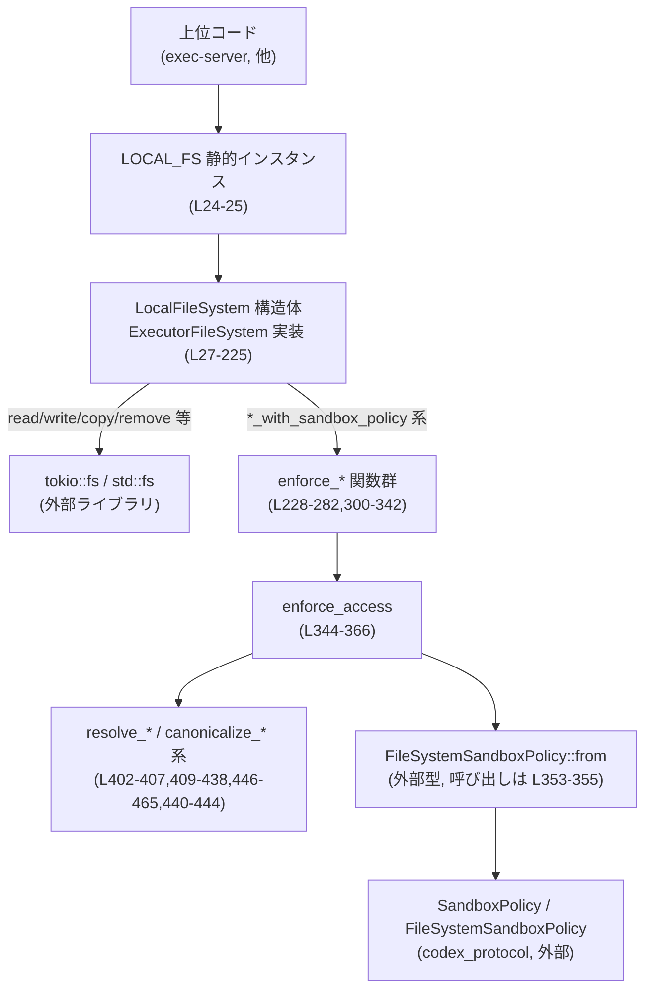
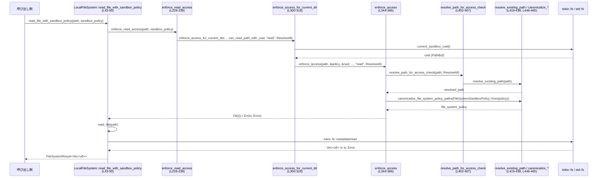

# exec-server/src/local_file_system.rs コード解説

## 0. ざっくり一言

- Tokio ベースでローカルファイルシステムにアクセスする `ExecutorFileSystem` 実装と、そのアクセスを `SandboxPolicy` に従って制限するためのユーティリティ群を定義しているファイルです。  
- 読み書き・ディレクトリ操作・コピー・削除などの基本操作を提供しつつ、パスの正規化とポリシー評価によりサンドボックス境界外へのアクセスを制限します。

---

## 1. このモジュールの役割

### 1.1 概要

- このモジュールは、exec-server の実行環境からローカルファイルシステムへアクセスする際の **実体実装** と **サンドボックスによる制限** を提供します。
- 上位コードは `ExecutorFileSystem` トレイト（`crate::ExecutorFileSystem`, L16）を介して抽象的にファイル操作を行い、その具体実装として本ファイルの `LocalFileSystem` が利用されます（L27-31）。
- すべての I/O は Tokio の非同期 API と `spawn_blocking` を用いて行われ、エラーは `FileSystemResult<T>`（`io::Error` 互換）として呼び出し側に返却されます（例: L32-41, L172-213）。

### 1.2 アーキテクチャ内での位置づけ

`ExecutorFileSystem` を実装するローカル FS 実装と、SandboxPolicy ベースのアクセス制御処理、および OS ファイルシステムとの関係を図示します。



- `LOCAL_FS` は `LazyLock<Arc<dyn ExecutorFileSystem>>` として 1 回だけ初期化され、どこからでも共有して使うエントリポイントです（L24-25）。
- サンドボックス付きメソッド（`*_with_sandbox_policy`）は `enforce_*` 系関数（L228-282）でアクセス可否を判定してから、該当の生ファイル操作メソッドを呼びます。
- アクセス判定では、`SandboxPolicy` → `FileSystemSandboxPolicy` への変換と、パスの正規化を行った上で `FileSystemSandboxPolicy::can_{read,write}_path_with_cwd` を使用します（L345-355）。

### 1.3 設計上のポイント

- **責務分割**
  - `LocalFileSystem` は「実際の I/O 操作」と「ポリシー付き変種の用意」に集中しています（L31-225）。
  - サンドボックスの判定ロジックは `enforce_*` / `enforce_access` / パス正規化関数群に切り出されています（L228-282, L300-366, L402-438, L446-465）。
- **状態**
  - `LocalFileSystem` はフィールドを持たないユニット構造体で、`Clone`・`Default` 可能です（L27-28）。  
    内部状態を持たないため、スレッド間で自由に共有可能です。
- **エラーハンドリング**
  - すべての公開的なファイル操作は `FileSystemResult<T>` を返し、`?` を通じて `io::Error` をそのまま伝搬します（例: L32-41, L134-152, L164-213）。
  - ポリシー違反や入力不正時には `io::ErrorKind::InvalidInput` を用いてエラー内容を明示します（例: L34-38, L178-181, L187-190, L206-209, L358-364）。
- **非同期 / 並行性**
  - 読み書き・メタデータ取得・ディレクトリ読みは `tokio::fs` の非同期 API で実装されています（L32-41, L52-54, L66-76, L89-96, L108-123, L134-151）。
  - ディレクトリやシンボリックリンクを含むコピー処理は `tokio::task::spawn_blocking` で別スレッドにオフロードし、Tokio ランタイムのイベントループをブロックしない設計です（L170-213）。
- **パス正規化とセキュリティ**
  - サンドボックス判定前に `resolve_path_for_access_check` / `resolve_existing_path` により、シンボリックリンクや存在しない階層を考慮した安全なパス解決を行います（L344-353, L402-407, L419-438）。
  - テストで、シンボリックリンク＋`..` によるサンドボックス脱出を防いでいることが確認されています（L532-555）。

---

## 2. 主要な機能一覧

### 2.1 機能の概要

- ローカルファイルの読み込み (`read_file`, `read_file_with_sandbox_policy`)
- ローカルファイルへの書き込み (`write_file`, `write_file_with_sandbox_policy`)
- ディレクトリ作成（再帰的 / 非再帰的） (`create_directory`, `create_directory_with_sandbox_policy`)
- ファイル/ディレクトリのメタデータ取得 (`get_metadata`, `get_metadata_with_sandbox_policy`)
- ディレクトリ内のエントリ一覧取得 (`read_directory`, `read_directory_with_sandbox_policy`)
- ファイル/ディレクトリ/シンボリックリンクの削除 (`remove`, `remove_with_sandbox_policy`)
- ファイル/ディレクトリ/シンボリックリンクのコピー（ディレクトリはオプションにより再帰） (`copy`, `copy_with_sandbox_policy`)
- SandboxPolicy に基づく読み書き権限の検査（`enforce_*` 系）
- パスの正規化・カノニカル化（`resolve_*`, `canonicalize_*` 系）
- シンボリックリンクのコピー（OS ごとの実装分岐, `copy_symlink`）
- 時刻を Unix 時刻ミリ秒に変換（`system_time_to_unix_ms`）

### 2.2 コンポーネントインベントリー（本番コード）

| 名前 | 種別 | 公開範囲 | 役割 / 用途 | 根拠 |
|------|------|----------|-------------|------|
| `MAX_READ_FILE_BYTES` | 定数 `u64` | モジュール内 | `read_file` の最大読み取りサイズ (512MiB) を定義 | `exec-server\src\local_file_system.rs:L22` |
| `LOCAL_FS` | `LazyLock<Arc<dyn ExecutorFileSystem>>` | `pub` | グローバルに共有される `ExecutorFileSystem` 実装のシングルトン | L24-25 |
| `LocalFileSystem` | 構造体（ユニット） | `pub(crate)` | `ExecutorFileSystem` のローカル FS 実装。状態を持たない | L27-28 |
| `impl ExecutorFileSystem for LocalFileSystem` | impl ブロック | crate 内 | 各種ファイル操作の非同期メソッド群を実装 | L30-225 |
| `LocalFileSystem::read_file` | async メソッド | トレイト経由 | ファイルサイズ上限つきでファイル全体を読み込み | L32-41 |
| `LocalFileSystem::read_file_with_sandbox_policy` | async メソッド | トレイト経由 | サンドボックスで読取権限を検査してからファイルを読み込み | L43-50 |
| `LocalFileSystem::write_file` | async メソッド | トレイト経由 | ファイルにバイト列を書き込み（既存ファイルは上書き） | L52-54 |
| `LocalFileSystem::write_file_with_sandbox_policy` | async メソッド | トレイト経由 | 書込権限を検査してからファイルを書き込み | L56-64 |
| `LocalFileSystem::create_directory` | async メソッド | トレイト経由 | ディレクトリを作成（`options.recursive` に応じて `create_dir_all` / `create_dir`） | L66-77 |
| `LocalFileSystem::create_directory_with_sandbox_policy` | async メソッド | トレイト経由 | 書込権限を検査してからディレクトリ作成 | L79-87 |
| `LocalFileSystem::get_metadata` | async メソッド | トレイト経由 | ファイル/ディレクトリの種類と作成/更新時刻（ミリ秒）を返す | L89-97 |
| `LocalFileSystem::get_metadata_with_sandbox_policy` | async メソッド | トレイト経由 | 読取権限を検査してからメタデータ取得 | L99-106 |
| `LocalFileSystem::read_directory` | async メソッド | トレイト経由 | ディレクトリ内のエントリを列挙し、名前と種別を返す | L108-123 |
| `LocalFileSystem::read_directory_with_sandbox_policy` | async メソッド | トレイト経由 | 読取権限を検査してからディレクトリ一覧取得 | L125-132 |
| `LocalFileSystem::remove` | async メソッド | トレイト経由 | ファイル/ディレクトリ/シンボリックリンクを削除。`recursive`・`force` を考慮 | L134-152 |
| `LocalFileSystem::remove_with_sandbox_policy` | async メソッド | トレイト経由 | 「リーフを保持する」書込権限検査後に削除を実行 | L154-162 |
| `LocalFileSystem::copy` | async メソッド | トレイト経由 | ファイル/ディレクトリ/シンボリックリンクのコピー。ディレクトリは再帰＆ループ防止チェック付き | L164-213 |
| `LocalFileSystem::copy_with_sandbox_policy` | async メソッド | トレイト経由 | コピー元の読取・コピー先の書込を検査してからコピー処理を実行 | L215-225 |
| `enforce_read_access` | 関数 | モジュール内 | カレントディレクトリ基準で読み取りアクセスを検査 | L228-239 |
| `enforce_write_access` | 関数 | モジュール内 | カレントディレクトリ基準で書き込みアクセスを検査（パス全体解決） | L241-252 |
| `enforce_write_access_preserving_leaf` | 関数 | モジュール内 | リーフ名を解決せずに書き込みアクセスを検査（削除などに使用） | L254-265 |
| `enforce_copy_source_read_access` | 関数 | モジュール内 | コピー元がシンボリックリンクかどうかでパス解決モードを切替えて読取権限を検査 | L267-282 |
| `enforce_access_for_current_dir` | 関数 | モジュール内 | カレントディレクトリをサンドボックス CWD として `enforce_access` を呼び出す | L300-319 |
| `enforce_access` | 関数 | モジュール内 | パス解決とポリシーのカノニカル化を行い、`FileSystemSandboxPolicy::can_*` で最終判定 | L344-366 |
| `AccessPathMode` | enum | モジュール内 | パス解決方法（全て解決 / リーフを保持）を指定 | L368-372 |
| `copy_dir_recursive` | 関数 | モジュール内 | ディレクトリツリーを再帰コピーし、ファイルとシンボリックリンクを適切に複製 | L374-391 |
| `destination_is_same_or_descendant_of_source` | 関数 | モジュール内 | コピー先がコピー元と同一またはその子孫パスかどうかを判定 | L393-400 |
| `resolve_path_for_access_check` | 関数 | モジュール内 | `AccessPathMode` に応じてパス解決戦略を切替 | L402-407 |
| `preserve_leaf_path_for_access_check` | 関数 | モジュール内 | 親のみを正規化し、リーフ（ファイル名）はそのまま維持したパスを作成 | L409-417 |
| `resolve_existing_path` | 関数 | モジュール内 | 既存の最長パスまで遡って正規化し、存在しないサフィックスを付け直す | L419-438 |
| `current_sandbox_cwd` | 関数 | モジュール内 | プロセスのカレントディレクトリを取得し、`resolve_existing_path` で正規化 | L440-444 |
| `canonicalize_file_system_policy_paths` | 関数 | モジュール内 | `FileSystemSandboxPolicy.entries` 内の `FileSystemPath::Path` を全てカノニカル化 | L446-455 |
| `canonicalize_absolute_path` | 関数 | モジュール内 | `AbsolutePathBuf` を `resolve_existing_path` で正規化し、絶対パスであることを再確認 | L457-465 |
| `copy_symlink` | 関数 | モジュール内 | シンボリックリンクのターゲットを読み出し、プラットフォームに応じた symlink API で複製 | L467-490 |
| `symlink_points_to_directory` | 関数 (Windows 限定) | `cfg(windows)` | Windows 上で symlink がディレクトリを指すかどうかを判定 | L492-499 |
| `system_time_to_unix_ms` | 関数 | モジュール内 | `SystemTime` を Unix エポックからのミリ秒に変換（失敗時は 0） | L501-505 |

### 2.3 コンポーネントインベントリー（テストコード）

| 名前 | 種別 | 用途 | 根拠 |
|------|------|------|------|
| `absolute_path` | 関数 | `PathBuf` から `AbsolutePathBuf` を生成するテスト用ヘルパ | L515-520 |
| `read_only_sandbox_policy` | 関数 | 読み取り専用 SandboxPolicy を構築するテスト用ヘルパ | L522-530 |
| `resolve_path_for_access_check_rejects_symlink_parent_dotdot_escape` | テスト | symlink + `..` によるサンドボックス脱出を防げているか検証 | L532-555 |
| `enforce_read_access_uses_explicit_sandbox_cwd` | テスト | 明示的 CWD を用いるアクセスチェックが意図通り動作するか検証 | L557-578 |
| `symlink_points_to_directory_handles_dangling_directory_symlinks` | テスト (Windows) | 宛先が存在しないディレクトリ symlink でも正しく判定できるか検証 | L587-603 |

---

## 3. 公開 API と詳細解説

### 3.1 型一覧（構造体・列挙体・定数）

| 名前 | 種別 | 役割 / 用途 | 主なフィールド・バリアント | 根拠 |
|------|------|-------------|-----------------------------|------|
| `LocalFileSystem` | 構造体（ユニット） | ローカル FS 操作用の `ExecutorFileSystem` 実装本体 | フィールドなし。`Clone`, `Default` を derive | L27-28 |
| `AccessPathMode` | enum | サンドボックス判定時のパス解決戦略を表す | `ResolveAll`, `PreserveLeaf` | L368-372 |
| `MAX_READ_FILE_BYTES` | 定数 | `read_file` で許可される最大バイト数 (512 MiB) | `512 * 1024 * 1024` | L22 |
| `LOCAL_FS` | `LazyLock<Arc<dyn ExecutorFileSystem>>` | グローバルに共有されるローカル FS インスタンス | 初期値は `Arc::new(LocalFileSystem)` | L24-25 |

※ `CopyOptions`, `CreateDirectoryOptions`, `RemoveOptions`, `FileMetadata`, `ReadDirectoryEntry`, `FileSystemResult`, `ExecutorFileSystem`, `SandboxPolicy`, `FileSystemSandboxPolicy`, `FileSystemPath` などは他ファイル / 外部クレートで定義されており、本ファイルからはフィールドの全容は分かりません。ただし使用箇所から一部のフィールド・役割が推測できます（例: `RemoveOptions.recursive`, `.force` など, L139, L149）。

---

### 3.2 主要関数・メソッド詳細（7 件）

#### 1. `LocalFileSystem::read_file(&self, path: &AbsolutePathBuf) -> FileSystemResult<Vec<u8>>`

**概要**

- 指定された絶対パスのファイルを読み込み、内容を `Vec<u8>` として返します。
- 読み込める最大サイズは `MAX_READ_FILE_BYTES`（512MiB）であり、それを超えるファイルはエラーとなります。

**根拠**

- ファイルメタデータ取得とサイズチェック、`tokio::fs::read` による読み込みを行っている（L32-41）。

**引数**

| 引数名 | 型 | 説明 |
|--------|----|------|
| `self` | `&LocalFileSystem` | 実装インスタンス（状態は持たない） |
| `path` | `&AbsolutePathBuf` | 読み込むファイルへの絶対パス |

**戻り値**

- `FileSystemResult<Vec<u8>>`  
  - 成功時: ファイル内容を格納した `Vec<u8>`  
  - 失敗時: `io::Error` を格納した `Err`

**内部処理の流れ**

1. `tokio::fs::metadata(path.as_path()).await?` でファイルメタデータを取得（L33）。
2. `metadata.len()` が `MAX_READ_FILE_BYTES` より大きければ `io::ErrorKind::InvalidInput` のエラーを返す（L34-38）。
3. 制限内であれば `tokio::fs::read(path.as_path()).await` の結果をそのまま返す（L40）。

**Examples（使用例）**

```rust
use std::path::PathBuf;
use codex_utils_absolute_path::AbsolutePathBuf;
use exec_server::local_file_system::LOCAL_FS; // 実際のパスはプロジェクト構成に依存

#[tokio::main]
async fn main() -> Result<(), tokio::io::Error> {
    // 絶対パスを AbsolutePathBuf に変換（具体的なエラー型はこのファイルからは不明）
    let abs: AbsolutePathBuf = AbsolutePathBuf::try_from(PathBuf::from("/tmp/data.bin"))
        .expect("absolute path");

    // SandboxPolicy なしで単純に読み込む
    let bytes = LOCAL_FS.read_file(&abs).await?; // L32-41 に対応

    println!("read {} bytes", bytes.len());
    Ok(())
}
```

※ `LOCAL_FS` は `Arc<dyn ExecutorFileSystem>` なので、実際には `LOCAL_FS.read_file(&abs)` のようにトレイトメソッドとして呼び出します（L24-25, L30-31）。

**Errors / Panics**

- サイズ制限超過  
  - 条件: `metadata.len() > MAX_READ_FILE_BYTES`（L34-35）  
  - エラー種別: `io::ErrorKind::InvalidInput`（L36）。
- OS / ファイルシステムエラー  
  - `metadata` 取得時 (`tokio::fs::metadata`) や `tokio::fs::read` が失敗した場合、その `io::Error` がそのまま伝搬します（L33, L40）。
- この関数自体に panic はありません。

**Edge cases（エッジケース）**

- ファイルが存在しない: `tokio::fs::metadata` が `NotFound` を返し、`Err(io::ErrorKind::NotFound)` になります（L33）。
- パーミッション不足: OS によって `PermissionDenied` などのエラーが返され、それがそのまま `Err` になります。
- `MAX_READ_FILE_BYTES` ぴったりの場合: `>` 判定のためエラーにはならず読み込みが行われます（L34）。
- シンボリックリンク: `metadata` はリンク先のメタデータになりますが、その挙動は OS 依存です（`tokio::fs::metadata` の仕様）。

**使用上の注意点**

- 大きなファイルを扱う場合、512MiB を超えるとエラーになります。段階的にストリーミングして読みたい場合は、別の API が必要です（このファイルには存在しません）。
- 戻り値はファイル丸ごとの `Vec<u8>` なので、大きなファイルを多量に並行読み込みするとメモリ使用量が増加します。
- サンドボックス判定を行いたい場合は、`read_file_with_sandbox_policy` を使う方が安全です（L43-50）。

---

#### 2. `LocalFileSystem::copy(&self, source_path: &AbsolutePathBuf, destination_path: &AbsolutePathBuf, options: CopyOptions) -> FileSystemResult<()>`

**概要**

- ファイル / ディレクトリ / シンボリックリンクをコピーする高機能なコピー処理です。
- ディレクトリコピー時は再帰オプション必須であり、コピー先がコピー元と同一またはその子ディレクトリである場合はエラーになります。

**根拠**

- タイプごとの処理分岐（ディレクトリ / symlink / ファイル / それ以外）とエラーメッセージから解釈できます（L172-210）。

**引数**

| 引数名 | 型 | 説明 |
|--------|----|------|
| `source_path` | `&AbsolutePathBuf` | コピー元の絶対パス |
| `destination_path` | `&AbsolutePathBuf` | コピー先の絶対パス |
| `options` | `CopyOptions` | ディレクトリ再帰の可否などを含むオプション（少なくとも `options.recursive` フィールドが存在, L177） |

**戻り値**

- `FileSystemResult<()>`  
  成功時は `Ok(())`。失敗時は `io::Error` を返します。

**内部処理の流れ**

1. `source_path` と `destination_path` を `PathBuf` に clone して、`spawn_blocking` 内で所有します（L170-172）。
2. `std::fs::symlink_metadata(source_path.as_path())?` でファイル種別（ディレクトリ、ファイル、symlink その他）を取得（L173-175）。
3. ディレクトリの場合（`file_type.is_dir()`, L176）:
   - `options.recursive` が `false` なら `InvalidInput` エラー（L177-181）。
   - `destination_is_same_or_descendant_of_source` でコピー先がコピー元自身またはその子孫でないかチェックし、該当する場合は `InvalidInput` エラー（L183-190）。
   - 問題なければ `copy_dir_recursive(source_path.as_path(), destination_path.as_path())?` を実行（L192-193）。
4. シンボリックリンクの場合（`file_type.is_symlink()`, L196-199）:
   - `copy_symlink` で symlink 自体をコピー（ターゲットは read_link で取得）します（L196-199, L467-490）。
5. 通常ファイルの場合（`file_type.is_file()`, L201-203）:
   - `std::fs::copy` で内容をコピーします（L201-203）。
6. いずれにも当てはまらない場合（デバイスなど）は `InvalidInput` エラーを返します（L206-209）。
7. `spawn_blocking` の JoinError が発生した場合は、`io::Error::other` に変換して返します（L211-212）。

**Examples（使用例）**

※ `CopyOptions` のフィールド構成はこのファイルからすべては分からないため、以下は概念的な例です。実際のコードでは定義に合わせて調整する必要があります（根拠: `options.recursive` のみ参照されている, L177）。

```rust
use std::path::PathBuf;
use codex_utils_absolute_path::AbsolutePathBuf;
use exec_server::local_file_system::LOCAL_FS;

async fn copy_dir_example() -> Result<(), tokio::io::Error> {
    let src = AbsolutePathBuf::try_from(PathBuf::from("/tmp/source")).unwrap();
    let dst = AbsolutePathBuf::try_from(PathBuf::from("/tmp/dest")).unwrap();

    // 仮の構造体イニシャライザ。実際の CopyOptions に合わせて定義する必要がある。
    let options = CopyOptions {
        recursive: true, // ディレクトリをコピーするには true が必須（L176-183）
        // 他にフィールドがあればここに設定
    };

    LOCAL_FS.copy(&src, &dst, options).await?;
    Ok(())
}
```

**Errors / Panics**

- ディレクトリなのに `options.recursive == false` の場合:
  - エラー: `io::ErrorKind::InvalidInput`（メッセージ `"fs/copy requires recursive: true when sourcePath is a directory"`, L178-181）。
- コピー先がコピー元と同じ、またはその子孫ディレクトリの場合:
  - エラー: `io::ErrorKind::InvalidInput`（メッセージ `"fs/copy cannot copy a directory to itself or one of its descendants"`, L187-190）。
- ファイル種別がサポート外（通常ファイル・ディレクトリ・symlink 以外）の場合:
  - エラー: `io::ErrorKind::InvalidInput`（メッセージ `"fs/copy only supports regular files, directories, and symlinks"`, L206-209）。
- OS 由来の I/O エラー:
  - `symlink_metadata`, `std::fs::copy`, `copy_dir_recursive`, `copy_symlink` 内の I/O 失敗がそのまま伝搬します（L173, L192, L197, L201）。
- `spawn_blocking` 自体の失敗（パニックなど）:
  - エラー: `io::Error::other("filesystem task failed: {err}")` に変換されます（L211-212）。
- パニック:
  - この関数内で明示的な `panic!` 呼び出しはありません。

**Edge cases（エッジケース）**

- シンボリックリンク:
  - `symlink_metadata` によってリンクそのものの情報が取得され、`file_type.is_symlink()` で symlink 判定されます（L173-175, L196-199）。
  - コピー時には、ターゲットのパス文字列をそのままコピー先 symlink のリンク先として使用します（L467-490）。
- コピー先パスが存在しない場合:
  - `copy_dir_recursive` は `create_dir_all` によりディレクトリを作成します（L374-376）。
  - ファイルコピーの場合、`std::fs::copy` は親ディレクトリが存在しないと失敗します（L201-203）。
- パスの正規化:
  - この関数自体はパスの正規化を行いませんが、`copy_with_sandbox_policy` 経由で呼ばれる場合、パス解決と SandboxPolicy による検査が行われます（L215-225, L267-282, L344-366）。

**セキュリティ関連の挙動**

- ディレクトリをその配下にコピーすることによる無限再帰や自己コピーを、`destination_is_same_or_descendant_of_source` で防いでいます（L393-400, L183-190）。
- symlink コピーはリンクそのものを複製し、リンク先を解決して中身をコピーするわけではないため、「symlink traversal」的な挙動は発生しません（L467-490）。

**使用上の注意点**

- 大きなディレクトリツリーを再帰コピーする場合、`spawn_blocking` 内で多くの同期 I/O が発生し、スレッドプールが占有される可能性があります。
- サンドボックスを必ず有効にしたい場合は、必ず `copy_with_sandbox_policy` を使用する必要があります（L215-225）。

---

#### 3. `enforce_access(path: &AbsolutePathBuf, sandbox_policy: &SandboxPolicy, sandbox_cwd: &Path, is_allowed: fn(&FileSystemSandboxPolicy, &Path, &Path) -> bool, access_kind: &str, path_mode: AccessPathMode) -> FileSystemResult<()>`

**概要**

- パスの正規化と `FileSystemSandboxPolicy` への変換を行った上で、指定された `is_allowed` 関数（`can_read_path_with_cwd` または `can_write_path_with_cwd`）を用いてアクセス許可を判定します。
- 許可されない場合は `io::ErrorKind::InvalidInput` エラーを返します。

**根拠**

- `resolve_path_for_access_check` → `canonicalize_file_system_policy_paths` → `is_allowed` 呼び出し → エラー生成、という流れがコードに現れています（L352-365）。

**引数**

| 引数名 | 型 | 説明 |
|--------|----|------|
| `path` | `&AbsolutePathBuf` | 検査対象のパス |
| `sandbox_policy` | `&SandboxPolicy` | 論理的な Sandbox 設定（外部型） |
| `sandbox_cwd` | `&Path` | Sandbox 内のカレントディレクトリ |
| `is_allowed` | `fn(&FileSystemSandboxPolicy, &Path, &Path) -> bool` | `FileSystemSandboxPolicy` に対する許可判定関数ポインタ（read/write 用） |
| `access_kind` | `&str` | エラーメッセージに埋め込むアクセス種別文字列（例 `"read"`, `"write"`, L235, L248, L262, L279） |
| `path_mode` | `AccessPathMode` | パス解決戦略（`ResolveAll` / `PreserveLeaf`） |

**戻り値**

- `FileSystemResult<()>`  
  - 許可される場合: `Ok(())`  
  - 許可されない場合: `Err(io::ErrorKind::InvalidInput)`  

**内部処理の流れ**

1. `resolve_path_for_access_check(path.as_path(), path_mode)?` でパスを正規化（L352）。
2. `FileSystemSandboxPolicy::from(sandbox_policy)` でプロトコルレベルの `SandboxPolicy` をローカル FS 用ポリシー形式に変換し（L353-354）、さらに `canonicalize_file_system_policy_paths` でその中のパスを全てカノニカル化（L353-355）。
3. `is_allowed(&file_system_policy, resolved_path.as_path(), sandbox_cwd)` が `true` なら `Ok(())` を返す（L355-356）。
4. `false` の場合、`io::ErrorKind::InvalidInput` で `"fs/{access_kind} is not permitted for path {path}"` というメッセージのエラーを返す（L358-364）。

**Examples（使用例）**

通常は直接呼び出すのではなく、`enforce_read_access` / `enforce_write_access` などのラッパ経由で使われます（L228-265, L300-319）。概念的な例:

```rust
// 擬似コード: 実際には FileSystemSandboxPolicy::can_read_path_with_cwd を使用
enforce_access(
    &abs_path,
    &sandbox_policy,
    sandbox_cwd.as_path(),
    FileSystemSandboxPolicy::can_read_path_with_cwd,
    "read",
    AccessPathMode::ResolveAll,
)?;
```

**Errors / Panics**

- パス解決中のエラー:
  - `resolve_path_for_access_check` が `io::Error` を返すと、そのまま伝搬します（L352）。
- ポリシーパスのカノニカル化中のエラー:
  - `canonicalize_file_system_policy_paths` が失敗した場合の `io::Error` がそのまま伝搬します（L353-355）。
- SandboxPolicy による拒否:
  - `is_allowed` が `false` を返す場合、`io::ErrorKind::InvalidInput` エラーが生成されます（L355-365）。
- パニック:
  - この関数自体には `panic!` はありません。

**Edge cases（エッジケース）**

- `path_mode` に `PreserveLeaf` を指定した場合:
  - 最終コンポーネント（ファイル名など）は存在確認されず、親ディレクトリのみ正規化されます（L402-407, L409-417）。
  - これにより、「まだ存在しないファイルの書き込み先」を検査するケースなどに対応可能です（削除やコピー先の検査で使用, L254-265, L267-282）。
- サンドボックスポリシーに登録されているパスがシンボリックリンクを含む場合:
  - `canonicalize_file_system_policy_paths` でエントリごとに `canonicalize_absolute_path` が呼ばれ、`resolve_existing_path` により安全な形に正規化されます（L446-455, L457-465, L419-438）。

**セキュリティ関連の挙動**

- パス解決に `resolve_path_for_access_check` を用いることで、シンボリックリンクや存在しないパスを含む複雑なパスでも一貫した基準で判定が行われます（L352, L402-407）。
- テスト `resolve_path_for_access_check_rejects_symlink_parent_dotdot_escape` で、`symlink` の親に対する `".."` を含むパスであっても意図せぬ「外側」パスに解決されないことが確認されています（L532-555）。
- ただし、一般的なファイルシステムアクセスと同様に、**アクセスチェックと実際の I/O 操作の間の時間差による TOCTOU レース** の可能性は理論的には存在します（チェック後に symlink の中身が差し替えられるなど）。この点は OS レベルの制約に依存し、本ファイルからは追加の対策は確認できません。

**使用上の注意点**

- 呼び出し側は通常 `enforce_access_for_current_dir` などのラッパを用いるべきで、直接 `enforce_access` を呼ぶのは特殊なケースに限られます。
- `access_kind` に渡す文字列はエラーメッセージにそのまま埋め込まれるため、一貫した値（"read" / "write" / "copy" など）を使用することでデバッグが容易になります（L358-364）。

---

#### 4. `resolve_path_for_access_check(path: &Path, path_mode: AccessPathMode) -> io::Result<PathBuf>`

**概要**

- `AccessPathMode` に応じて、パスをアクセスチェック用に正規化します。
- `ResolveAll` の場合は、できる限り全体を既存のパスとして解決し、存在しない部分も含めて安全なパスを生成します。
- `PreserveLeaf` の場合は、最終コンポーネントはそのままに、親ディレクトリのみを正規化します。

**根拠**

- `match path_mode { ResolveAll => resolve_existing_path(path), PreserveLeaf => preserve_leaf_path_for_access_check(path) }`（L402-407）。

**引数**

| 引数名 | 型 | 説明 |
|--------|----|------|
| `path` | `&Path` | 正規化対象のパス |
| `path_mode` | `AccessPathMode` | 解決戦略。`ResolveAll` or `PreserveLeaf` |

**戻り値**

- `io::Result<PathBuf>`  
  正規化された `PathBuf`、もしくは I/O エラー。

**内部処理の流れ**

1. `path_mode` を `match` で分岐（L403-406）。
2. `ResolveAll` の場合は `resolve_existing_path(path)` を呼び、最長既存プレフィックスのカノニカル化＋サフィックス再付加を行う（L404, L419-438）。
3. `PreserveLeaf` の場合は `preserve_leaf_path_for_access_check(path)` を呼ぶ（L405, L409-417）。

**Errors / Panics**

- 内部で `resolve_existing_path` / `preserve_leaf_path_for_access_check` が返す `io::Error` がそのまま伝搬します。
- パニックはありません。

**Edge cases**

- パスが完全に存在しない場合でも、最長既存プレフィックスまで遡って解決されます（`resolve_existing_path`, L419-431）。
- ルート（`/`）まで遡っても存在しないケースは通常想定されませんが、その場合は `std::fs::canonicalize` のエラーに依存します（L433）。

**使用上の注意点**

- サンドボックス判定において「まだ存在しないファイルの検査」を行いたいケースでは、`PreserveLeaf` を選択することが適切です（削除やコピー先の書き込み許可などに利用, L254-265, L267-282）。
- 「実際に存在するリソースへのアクセス」を制限したい場合（読取元、コピー元など）は、`ResolveAll` を使用して実際のリソース位置に基づいて検査します。

---

#### 5. `resolve_existing_path(path: &Path) -> io::Result<PathBuf>`

**概要**

- 指定パスが存在しない場合でも、**存在する最長の親パス** を特定してカノニカル化し、そこに元のサフィックスを再度付けることで、一貫した形のパスを構成します。
- シンボリックリンクと `..` を含むようなパスに対しても、意図しないサンドボックス脱出を防ぐための基盤となる関数です。

**根拠**

- `while !existing_path.exists()` で存在する親パスを探索し、`std::fs::canonicalize(existing_path)?` で正規化したのち、`unresolved_suffix` を逆順に push している処理から読み取れます（L419-438）。

**引数**

| 引数名 | 型 | 説明 |
|--------|----|------|
| `path` | `&Path` | 解決対象のパス |

**戻り値**

- `io::Result<PathBuf>`  
  カノニカル化された `PathBuf`（ただし、もともと存在しなかったサフィックスはそのまま付加される）。

**内部処理の流れ**

1. `unresolved_suffix` を空ベクタで初期化し、`existing_path` を引数の `path` にセット（L420-421）。
2. `while !existing_path.exists()` ループで、「存在しない」パスを末尾から取り除きつつ、そのコンポーネントを `unresolved_suffix` に保存（L422-427）。
   - `file_name` が取得できない or 親が存在しない場合はループを break（L423-425, L427-429）。
3. `std::fs::canonicalize(existing_path)?` で、存在する部分をカノニカル化（L433）。
4. ループで保存した `unresolved_suffix` を逆順に辿りながら `resolved.push(file_name)` して完全なパスを再構成（L434-436）。
5. 完成した `resolved` を返す（L437）。

**Errors / Panics**

- `std::fs::canonicalize(existing_path)` のエラーがそのまま返されます（L433）。
- `exists()` や `parent()` の呼び出しでパニックはありません。
- パニックは明示的にはありません。

**Edge cases**

- パスがすべて存在しない場合でも、存在する最上位の親（通常はルート）まで遡って canonicalize し、その後にサフィックスを付加します（L422-431, L433-437）。
- `..` や symlink を含む場合:
  - まず `canonicalize(existing_path)` により symlink と `..` が解決されます。
  - テストでは、symlink の親に対する `..` を含むパスがサンドボックス外に解決されないことが確認されています（L532-555）。
- 既に存在する完全なパスであれば、`unresolved_suffix` は空で、単純に `canonicalize(path)` の結果が返ります。

**使用上の注意点**

- この関数は「パスを完全に existing なパスにする」ものではなく、「**最大限 existing な部分のみ canonicalize** する」点に注意が必要です。
- サンドボックス境界のチェックに利用されるため、ファイルシステムの状態が頻繁に変わる環境では TOCTOU による微妙な差異が生じる可能性があります。

---

#### 6. `canonicalize_file_system_policy_paths(mut file_system_policy: FileSystemSandboxPolicy) -> io::Result<FileSystemSandboxPolicy>`

**概要**

- `FileSystemSandboxPolicy` 内の全ての `FileSystemPath::Path { path }` を `canonicalize_absolute_path` で正規化します。
- これにより、SandboxPolicy に基づくパス判定が、実際のファイルシステム上のパス表現と整合するようになります。

**根拠**

- `for entry in &mut file_system_policy.entries` のループで `FileSystemPath::Path { path }` に対して `canonicalize_absolute_path(path)?` を適用している（L446-453）。

**引数**

| 引数名 | 型 | 説明 |
|--------|----|------|
| `file_system_policy` | `FileSystemSandboxPolicy` | ローカル FS 用のポリシーオブジェクト（パスリストを含む） |

**戻り値**

- `io::Result<FileSystemSandboxPolicy>`  
  すべてのパスをカノニカル化した新しい `FileSystemSandboxPolicy`。

**内部処理の流れ**

1. `for entry in &mut file_system_policy.entries` でポリシー内の各エントリを反復（L449）。
2. `if let FileSystemPath::Path { path } = &mut entry.path` で、パス型エントリのみを対象とする（L450）。
3. `*path = canonicalize_absolute_path(path)?;` で各パスをカノニカル化し、結果を上書き（L451-452）。
4. 変更済みの `file_system_policy` を返す（L454）。

**Errors / Panics**

- 個々の `canonicalize_absolute_path` が返す `io::Error` が、そのまま伝搬します（L451-452, L457-465）。
- パニックはありません。

**セキュリティ関連の挙動**

- ポリシー内のすべてのパスが `resolve_existing_path` ベースで正規化されるため、ポリシー定義時に symlink や `..` が含まれていても、実際の判定時には OS による canonicalize 後のパスが使われます（L457-465, L419-438）。
- これにより、ポリシー側の「想定パス」と実際のファイルシステムのパス表現のずれを減らします。

---

#### 7. `copy_dir_recursive(source: &Path, target: &Path) -> io::Result<()>`

**概要**

- ディレクトリの中身を再帰的にたどりながら、ディレクトリ、ファイル、シンボリックリンクをそれぞれ適切にコピーするヘルパ関数です。
- `LocalFileSystem::copy` から、ディレクトリコピーのために使用されます。

**根拠**

- `std::fs::read_dir(source)` でエントリを列挙し、`file_type.is_dir()` / `.is_file()` / `.is_symlink()` で分岐している（L374-391）。

**引数**

| 引数名 | 型 | 説明 |
|--------|----|------|
| `source` | `&Path` | コピー元ディレクトリのパス |
| `target` | `&Path` | コピー先ディレクトリのパス |

**戻り値**

- `io::Result<()>`  
  成功時 `Ok(())`。失敗時は OS 由来の `io::Error`。

**内部処理の流れ**

1. `std::fs::create_dir_all(target)?` でターゲットディレクトリを作成（L375）。
2. `for entry in std::fs::read_dir(source)?` でソースディレクトリのエントリを列挙（L376）。
3. 各 `entry` について:
   - `let source_path = entry.path();`（L378）
   - `let target_path = target.join(entry.file_name());`（L379）
   - `let file_type = entry.file_type()?;`（L380）
4. `file_type.is_dir()` の場合:
   - `copy_dir_recursive(&source_path, &target_path)?;` で再帰コピー（L382-383）。
5. `file_type.is_file()` の場合:
   - `std::fs::copy(&source_path, &target_path)?;` でファイルコピー（L384-385）。
6. `file_type.is_symlink()` の場合:
   - `copy_symlink(&source_path, &target_path)?;` で symlink コピー（L386-387）。
7. すべてのエントリ処理後、`Ok(())` を返す（L390）。

**Errors / Panics**

- ディレクトリ作成、ディレクトリ読み、ファイル種別取得、ファイル/ディレクトリ作成、symlink コピーなど、各種 `std::fs` 操作でのエラーがそのまま伝搬します（L375-387）。
- パニックはありません。

**Edge cases**

- シンボリックリンク:
  - symlink 自体がコピーされ、リンク先の内容はコピーされません（L386-387, L467-490）。
- 巨大なディレクトリツリー:
  - 再帰呼び出しにより深いコールスタックが発生し得ますが、Rust の通常の再帰と同様、極端な深さではスタックオーバーフローの可能性があります。

**使用上の注意点**

- 上位の `LocalFileSystem::copy` 内でのみ使用されており、直接使用する想定ではありません。
- メタデータ（パーミッション、タイムスタンプなど）のコピーは行っていません。必要な場合は別途考慮が必要です。

---

### 3.3 その他の関数（一覧）

| 関数名 | 役割（1 行） | 根拠 |
|--------|--------------|------|
| `read_file_with_sandbox_policy` | `enforce_read_access` で読取許可を検査してから `read_file` を呼ぶラッパ | L43-50 |
| `write_file` | パスに対してバイト列を書き込む単純なラッパ (`tokio::fs::write`) | L52-54 |
| `write_file_with_sandbox_policy` | 書込許可検査後に `write_file` を呼ぶラッパ | L56-64 |
| `create_directory` | `CreateDirectoryOptions.recursive` に応じてディレクトリ作成 | L66-77 |
| `create_directory_with_sandbox_policy` | 書込許可検査後に `create_directory` を呼ぶラッパ | L79-87 |
| `get_metadata` | `tokio::fs::metadata` を用いて `FileMetadata` を構築 | L89-97 |
| `get_metadata_with_sandbox_policy` | 読取許可検査後に `get_metadata` を呼ぶラッパ | L99-106 |
| `read_directory` | ディレクトリ内のエントリを列挙し `ReadDirectoryEntry` のベクタを返す | L108-123 |
| `read_directory_with_sandbox_policy` | 読取許可検査後に `read_directory` を呼ぶラッパ | L125-132 |
| `remove` | symlink を含むファイル/ディレクトリ削除。`recursive` / `force` を考慮 | L134-152 |
| `remove_with_sandbox_policy` | `enforce_write_access_preserving_leaf` で検査後に `remove` を呼ぶラッパ | L154-162 |
| `copy_with_sandbox_policy` | コピー元/先それぞれの権限を検査してから `copy` を呼ぶラッパ | L215-225 |
| `enforce_read_access` | 読取アクセス判定のための `enforce_access_for_current_dir` ラッパ | L228-239 |
| `enforce_write_access` | 書込アクセス判定（パス全体解決）用ラッパ | L241-252 |
| `enforce_write_access_preserving_leaf` | リーフを保持する書込アクセス判定用ラッパ | L254-265 |
| `enforce_copy_source_read_access` | コピー元（symlink か否か）に応じてパス解決モードを選ぶ読取アクセス判定 | L267-282 |
| `enforce_access_for_current_dir` | 現在のプロセス CWD をサンドボックス CWD として `enforce_access` を呼ぶ補助関数 | L300-319 |
| `preserve_leaf_path_for_access_check` | 親ディレクトリのみ `resolve_existing_path` し、リーフ名を付加したパスを返す | L409-417 |
| `current_sandbox_cwd` | `std::env::current_dir` を取得し、`resolve_existing_path` で正規化 | L440-444 |
| `canonicalize_absolute_path` | `AbsolutePathBuf` を `resolve_existing_path` で正規化し、絶対パスであることを保証 | L457-465 |
| `copy_symlink` | symlink のターゲットを読み出し、Unix/Windows/その他プラットフォームごとに適切な symlink API でコピー | L467-490 |
| `symlink_points_to_directory` | Windows 上で symlink がディレクトリを指すかどうかを判定 | L492-499 |
| `system_time_to_unix_ms` | `SystemTime` を Unix エポックからのミリ秒に変換し、オーバーフローや逆転時には 0 を返す | L501-505 |

---

## 4. データフロー

### 4.1 読み込み（サンドボックス付き）のフロー

`read_file_with_sandbox_policy` を例に、呼び出しから OS までの流れを示します。



- サンドボックス判定に成功すると、`read_file` が呼ばれます（L48-50）。
- 判定に失敗した場合、`enforce_access` 内で `InvalidInput` エラーが返され、ファイル I/O は実行されません（L355-365）。

### 4.2 コピー（サンドボックス付き）のフロー（概要）

`copy_with_sandbox_policy` の場合:

1. `enforce_copy_source_read_access` でコピー元の読取権限をチェックし、symlink かどうかに応じて `AccessPathMode` を切り替え（L267-282）。
2. `enforce_write_access` でコピー先への書込権限をチェック（L241-252）。
3. 両方成功したら `copy` を呼び出し、`spawn_blocking` 内で同期コピー処理を実行（L215-225, L170-213）。

この流れにより、「symlink 自体をコピー」するケースでも、アクセス判定の際に symlink の扱いが適切に調整されます。

---

## 5. 使い方（How to Use）

### 5.1 基本的な使用方法

#### ファイルの単純な読み書き（サンドボックスなし）

```rust
use std::path::PathBuf;
use codex_utils_absolute_path::AbsolutePathBuf;
use exec_server::local_file_system::LOCAL_FS; // 実際のモジュールパスはプロジェクト依存

#[tokio::main]
async fn main() -> Result<(), tokio::io::Error> {
    // 絶対パスを AbsolutePathBuf に変換
    let path = AbsolutePathBuf::try_from(PathBuf::from("/tmp/hello.txt"))
        .expect("absolute path");

    // ファイルを書き込み
    LOCAL_FS.write_file(&path, b"hello world".to_vec()).await?; // L52-54

    // ファイルを読み込み
    let bytes = LOCAL_FS.read_file(&path).await?; // L32-41

    println!("{}", String::from_utf8_lossy(&bytes));
    Ok(())
}
```

※ `ExecutorFileSystem` トレイトの定義や `LOCAL_FS` の実際の import パスは、このファイルだけでは分からないため、実プロジェクトの構成に合わせて調整が必要です。

#### SandboxPolicy を使用した読み取り

テストコードから読み取れる SandboxPolicy の一例を利用します（L522-530）。

```rust
use std::path::PathBuf;
use codex_utils_absolute_path::AbsolutePathBuf;
use codex_protocol::protocol::{SandboxPolicy, ReadOnlyAccess};
use exec_server::local_file_system::LOCAL_FS;

fn absolute_path(path: PathBuf) -> AbsolutePathBuf {
    AbsolutePathBuf::try_from(path).expect("absolute path")
}

fn read_only_sandbox_policy(readable_roots: Vec<PathBuf>) -> SandboxPolicy {
    SandboxPolicy::ReadOnly {
        access: ReadOnlyAccess::Restricted {
            include_platform_defaults: false,
            readable_roots: readable_roots.into_iter().map(absolute_path).collect(),
        },
        network_access: false,
    }
}

#[tokio::main]
async fn main() -> Result<(), tokio::io::Error> {
    let file_path = PathBuf::from("/workspace/note.txt");
    let abs_file = absolute_path(file_path.clone());

    // /workspace 配下のみ読み取り可能とする
    let policy = read_only_sandbox_policy(vec![PathBuf::from("/workspace")]);

    let bytes = LOCAL_FS
        .read_file_with_sandbox_policy(&abs_file, Some(&policy)) // L43-50
        .await?;

    println!("{}", String::from_utf8_lossy(&bytes));
    Ok(())
}
```

### 5.2 よくある使用パターン

#### ディレクトリ作成（再帰 / 非再帰）

```rust
// 注意: CreateDirectoryOptions の全フィールドはこのファイルから不明なため擬似コードです。
use exec_server::local_file_system::LOCAL_FS;
use crate::CreateDirectoryOptions; // 実際のパスはプロジェクト依存

async fn create_dirs(abs: &AbsolutePathBuf) -> FileSystemResult<()> {
    let recursive = CreateDirectoryOptions { recursive: true /* ... */ }; // L71
    let non_recursive = CreateDirectoryOptions { recursive: false /* ... */ };

    // /tmp/a/b/c など、途中階層もまとめて作る
    LOCAL_FS.create_directory(abs, recursive).await?;

    // 既存ディレクトリ直下に 1 階層だけ作る
    LOCAL_FS.create_directory(abs, non_recursive).await?;
    Ok(())
}
```

#### 再帰削除と強制削除

```rust
// RemoveOptions のフィールドもこのファイルからは recursive, force しか分かりません（L139, L149）。
async fn remove_tree(abs: &AbsolutePathBuf) -> FileSystemResult<()> {
    let options = RemoveOptions {
        recursive: true,
        force: true,
        // 他のフィールドがあれば適宜設定
    };

    LOCAL_FS.remove(abs, options).await?; // L134-152
    Ok(())
}
```

#### ディレクトリコピー（サンドボックス付き）

```rust
async fn copy_dir_with_policy(
    src: &AbsolutePathBuf,
    dst: &AbsolutePathBuf,
    options: CopyOptions,
    policy: &SandboxPolicy,
) -> FileSystemResult<()> {
    LOCAL_FS
        .copy_with_sandbox_policy(src, dst, options, Some(policy)) // L215-225
        .await
}
```

### 5.3 よくある間違い

```rust
// 間違い例: ディレクトリを recursive=false でコピーしようとする
async fn wrong_copy_dir(
    src: &AbsolutePathBuf,
    dst: &AbsolutePathBuf,
    options: &mut CopyOptions,
) -> FileSystemResult<()> {
    options.recursive = false; // L177 でチェックされる
    // ディレクトリ src をこのオプションでコピーすると InvalidInput エラー
    LOCAL_FS.copy(src, dst, options.clone()).await
}

// 正しい例: ディレクトリをコピーするときは recursive=true にする
async fn correct_copy_dir(
    src: &AbsolutePathBuf,
    dst: &AbsolutePathBuf,
    options: &mut CopyOptions,
) -> FileSystemResult<()> {
    options.recursive = true;
    LOCAL_FS.copy(src, dst, options.clone()).await // L176-183
}
```

```rust
// 間違い例: サンドボックス付き API なのに SandboxPolicy を Some にし忘れる
async fn wrong_read(abs: &AbsolutePathBuf) -> FileSystemResult<Vec<u8>> {
    // None だとサンドボックス検査がスキップされる（L307-308）
    LOCAL_FS.read_file_with_sandbox_policy(abs, None).await
}

// 正しい例: 必要なルートを含んだ SandboxPolicy を渡す
async fn correct_read(
    abs: &AbsolutePathBuf,
    policy: &SandboxPolicy,
) -> FileSystemResult<Vec<u8>> {
    LOCAL_FS
        .read_file_with_sandbox_policy(abs, Some(policy))
        .await
}
```

### 5.4 使用上の注意点（まとめ）

- **サンドボックスを確実に効かせるには、`*_with_sandbox_policy` を使用し、`sandbox_policy: Some(&policy)` を渡す必要があります**。`None` を渡すと検査は行われません（L307-308）。
- ファイルサイズ制限（512MiB）を超えるファイルは `read_file` で読み取れません（L22, L34-38）。
- ディレクトリコピーには `CopyOptions.recursive = true` が必須です（L176-183）。
- `LocalFileSystem` 自体はステートレスで `Clone` 可能なため、複数タスクから同時に使用しても内部的な競合はありません（L27-28）。ただし、同じファイルに対する並行操作は OS のルールに従います。
- このモジュール内にはログ出力やメトリクス送信などの観測用コードは存在しないため、必要に応じて呼び出し側でラップしてログ記録を行う必要があります。

---

## 6. 変更の仕方（How to Modify）

### 6.1 新しい機能を追加する場合

例: 「ファイルの追記（append）機能」を追加したい場合の流れです。

1. **トレイトの確認**
   - `crate::ExecutorFileSystem`（L16）に、追加したい機能（例: `append_file`）のシグネチャがあるかを確認します。
   - なければ、トレイト定義側（別ファイル）にメソッドを追加する必要があります（このファイルには定義がないため不明）。

2. **`LocalFileSystem` の impl にメソッド追加**
   - 既存の `write_file` を参考に、Tokio 非同期 API を用いたメソッドを追加します（L52-54）。
   - サンドボックス付き変種（例: `append_file_with_sandbox_policy`）も、`*_with_sandbox_policy` パターンに合わせて実装します（L43-50, L56-64）。

3. **サンドボックス検査の組み込み**
   - 書き込み系であれば `enforce_write_access` または `enforce_write_access_preserving_leaf` を使用します（L241-252, L254-265）。
   - 読み込みを伴う場合は `enforce_read_access` / `enforce_copy_source_read_access` のようなラッパを新設することも検討できます（L228-239, L267-282）。

4. **パス解決戦略の選択**
   - 既存メソッドを参考に、`AccessPathMode::ResolveAll` / `PreserveLeaf` のどちらが適切かを判断します。
   - 例: 書き込み先ファイルがまだ存在しない場合は、`PreserveLeaf` を選ぶ方が自然です（L254-265）。

5. **テストの追加**
   - Unix / Windows 両方で挙動が変わり得る場合、`#[cfg(all(test, unix))]` / `#[cfg(all(test, windows))]` モジュールにテストを追加するのが既存コードと一貫しています（L508-579, L581-603）。

### 6.2 既存の機能を変更する場合

- **影響範囲の確認**
  - 変更対象メソッドが `ExecutorFileSystem` トレイトの一部である場合、他のファイルでの使用箇所にも影響します。
  - 例えば `remove` の挙動を変える場合、`remove_with_sandbox_policy`（L154-162）と `enforce_write_access_preserving_leaf`（L254-265）の組み合わせも考慮する必要があります。

- **契約の維持**
  - エラー条件や SandboxPolicy による拒否の挙動は、上位コードが依存している可能性があります。  
    例: `copy` の InvalidInput メッセージや条件（L178-181, L187-190, L206-209）。
  - `FileMetadata` の `created_at_ms` / `modified_at_ms` は、失敗時に 0 を設定しています（L94-95）。これを変更する場合は、0 の意味を利用している箇所がないか確認が必要です。

- **テストの更新**
  - パス解決やサンドボックス判定ロジックを変更した場合、`resolve_path_for_access_check` や `enforce_read_access_*` に関するテストが依存しているため、テストの期待値も見直す必要があります（L532-555, L557-578）。
  - Windows 向けの symlink 判定の変更は `symlink_points_to_directory_handles_dangling_directory_symlinks` テストに影響します（L587-603）。

---

## 7. 関連ファイル

このモジュールと密接に関係する型・モジュールは以下の通りです。

| パス / 型 | 役割 / 関係 | 根拠 |
|-----------|-------------|------|
| `crate::ExecutorFileSystem` | 本ファイルが実装するトレイト。ファイル操作の抽象インターフェース | インポートと impl 宣言から（L16, L30-31） |
| `crate::CopyOptions` | コピー動作のオプション。少なくとも `recursive: bool` フィールドを持つ | 使用箇所から（L168-169, L176-183） |
| `crate::CreateDirectoryOptions` | ディレクトリ作成オプション。`recursive: bool` フィールドを持つ | 使用箇所から（L66-77, L79-87, 特に L71） |
| `crate::RemoveOptions` | 削除オプション。`recursive: bool` と `force: bool` フィールドを持つ | 使用箇所から（L134-152, L139, L149） |
| `crate::FileMetadata` | `get_metadata` で返されるメタデータ構造体。`is_directory`, `is_file`, `created_at_ms`, `modified_at_ms` フィールドを持つ | フィールド初期化から（L91-96） |
| `crate::ReadDirectoryEntry` | ディレクトリエントリの DTO。`file_name`, `is_directory`, `is_file` を持つ | 初期化箇所から（L116-120） |
| `crate::FileSystemResult<T>` | ファイル操作の結果型。`io::Error` 互換のエラーを保持する `Result` エイリアスと推測される | `tokio::fs` や `io::Result` を `?` でそのまま返していることから（L32-41, L134-152, L164-213） |
| `codex_protocol::protocol::SandboxPolicy` | 高レベルなサンドボックス設定。`FileSystemSandboxPolicy::from` で FS 用ポリシーに変換 | インポートと `FileSystemSandboxPolicy::from` 呼び出しから（L4, L353-355） |
| `codex_protocol::permissions::FileSystemSandboxPolicy` | ファイルシステム用の詳細なサンドボックスポリシー。`entries` と `can_{read,write}_path_with_cwd` を持つ | フィールド・メソッド使用から（L3, L235, L248, L262, L279, L449-452） |
| `codex_protocol::permissions::FileSystemPath` | サンドボックスポリシー内のパス種別。`Path { path: AbsolutePathBuf }` などを持つ | `if let FileSystemPath::Path { path }` から（L450-452） |
| `codex_utils_absolute_path::AbsolutePathBuf` | 常に絶対パスであることを保証するラッパ型 | インポートと `from_absolute_path` 呼び出しから（L5, L457-465） |

---

以上が、`exec-server/src/local_file_system.rs` の公開 API、コアロジック、Rust 特有の安全性・エラー・並行性、コンポーネント一覧、およびデータフローの整理です。
