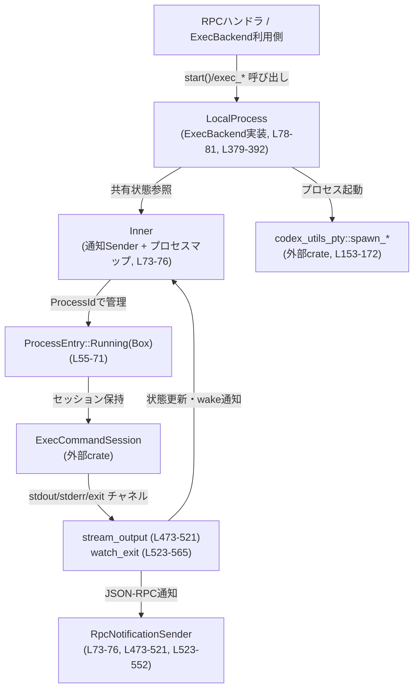
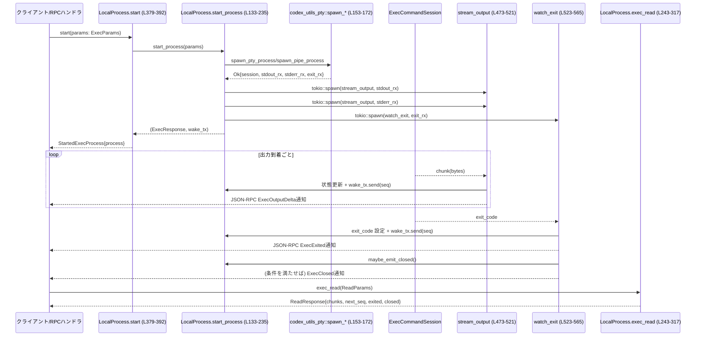

# exec-server/src/local_process.rs

## 0. ざっくり一言

ローカル環境で外部プロセスを起動し、その標準出力・標準エラーをバッファリングしつつ JSON-RPC 通知で配信し、読み書き・終了・クローズ状態を管理する非同期バックエンド実装です（`ExecBackend` / `ExecProcess` の実装）。（根拠: exec-server/src/local_process.rs:L15-18, L41, L55-71, L133-235, L379-423, L473-565）

---

## 1. このモジュールの役割

### 1.1 概要

- このモジュールは **ローカル OS プロセスのライフサイクル管理と入出力の仲介** を行います。
- プロセスの起動、標準出力/エラーの蓄積と配信、TTY 経由の標準入力書き込み、終了検知とクローズ通知、一定時間後のクリーンアップまでを一括して扱います。（L41-46, L55-66, L133-235, L243-375, L523-565）
- 上位レイヤからは `ExecBackend` / `ExecProcess` トレイトを通じて利用され、JSON-RPC ベースのリクエスト/レスポンスおよび通知にマッピングされます。（L15-19, L35-39, L379-423）

### 1.2 アーキテクチャ内での位置づけ

`LocalProcess` を中心に、RPC ハンドラ・プロセス管理・OS プロセスとの接続・通知が連携します。



- `Inner` が共有状態（通知 Sender とプロセスマップ）を保持し、`Arc<Inner>` を通じて全タスクから参照されます。（L73-76, L78-81）
- プロセスごとの状態は `RunningProcess` に集約され、`ProcessEntry` の `Running` 変種として `HashMap<ProcessId, ProcessEntry>` に格納されます。（L55-71, L73-76）
- `tokio::spawn` された `stream_output` / `watch_exit` タスクが、OS プロセスの出力と終了を監視し、内部状態更新と JSON-RPC 通知送信を行います。（L205-232, L473-521, L523-565）

### 1.3 設計上のポイント

- **責務の分割**
  - `LocalProcess`: 外部から呼ばれる高レベル API（exec/read/write/terminate、`ExecBackend` 実装）と、内部ラッパー API を提供します。（L98-122, L237-375, L379-392, L425-463）
  - `RunningProcess`: 個々のプロセスの状態とバッファされた出力を保持します。（L55-66）
  - `stream_output` / `watch_exit` / `maybe_emit_closed` などの自由関数が、出力ストリーム処理と終了処理を担当します。（L473-521, L523-565, L567-611）
- **状態管理**
  - `processes: Mutex<HashMap<ProcessId, ProcessEntry>>` により、プロセス集合を非同期に排他的に更新します。（L73-76）
  - 1プロセスの状態 (`RunningProcess`) は `ProcessEntry::Running(Box<RunningProcess>)` 経由でまとめて保護されます。（L55-71）
  - `watch::Sender<u64>` と `Notify` により、「新しい出力・状態変化があった」という wake 通知をクライアントに伝えます。（L62-64, L184-199, L243-317, L473-521, L523-541, L582-600）
- **エラーハンドリング**
  - JSON-RPC レイヤとは `JSONRPCErrorError` を介してやり取りし、内部では `invalid_params` / `invalid_request` / `internal_error` を用いてエラー種別を区別します。（L37-39, L133-181, L243-317, L319-353, L355-375）
  - `ExecBackend`/`ExecProcess` API に対しては `map_handler_error` で `ExecServerError` に変換します。（L466-471, L379-392, L425-463）
- **並行性**
  - プロセス起動・出力処理・終了処理はすべて `tokio` の非同期タスクとして並列に動作し、共有状態へのアクセスは `Mutex` / `RwLock` で同期されています。（L10-13, L73-76, L89-95, L133-235, L205-232, L473-521, L523-565）
  - `RwLock` の Poison（パニックによる汚染）は `unwrap_or_else(PoisonError::into_inner)` で回避し、通知 Sender を継続利用する設計になっています。（L124-131, L614-619）
- **出力バッファリングとメモリ上限**
  - 1プロセスあたり保持する出力を 1 MiB までに制限し、超過分は古いものから破棄します。（L41, L55-60, L493-503）

---

## 2. 主要な機能一覧

- プロセス起動: `ExecParams` に基づきローカルプロセスを起動し、管理対象として登録する。（L133-235, L237-241, L379-392）
- 出力読み取り: `after_seq` / `max_bytes` / `wait_ms` に基づき、バッファ済み出力と状態情報を返す。（L243-317）
- 入力書き込み（TTY のみ）: TTY プロセスに対して標準入力へバイト列を書き込む。（L319-353, L55-58）
- プロセス終了要求: 対象プロセスに終了シグナルを送る。（L355-375）
- JSON-RPC 通知:
  - 出力増分 `ExecOutputDeltaNotification` の送信。（L23, L473-521）
  - 終了 `ExecExitedNotification` の送信。（L22, L523-552）
  - 全ストリームクローズ `ExecClosedNotification` の送信。（L21, L582-611）
- wake 通知チャンネル:
  - 出力・終了・クローズ時に `watch::Sender<u64>` でシーケンス番号を配信し、クライアントがポーリングを最小化できるようにする。（L62, L185-186, L243-317, L473-521, L523-541, L582-600）
- プロセスのクリーンアップ:
  - 終了後一定期間（テスト時と本番で異なる）保持し、その後 `HashMap` から削除する。（L43-46, L523-565）

---

## 3. 公開 API と詳細解説

### 3.1 型一覧（構造体・列挙体など）

> コンポーネントインベントリー（型）

| 名前 | 種別 | 役割 / 用途 | 定義位置 |
|------|------|-------------|----------|
| `RetainedOutputChunk` | 構造体 | 1つの出力チャンク（シーケンス番号・ストリーム種別・バイト列）を保持し、`RunningProcess.output` の要素として使われます。 | exec-server/src/local_process.rs:L48-53 |
| `RunningProcess` | 構造体 | 実行中プロセスの状態（セッション、TTY有無、出力バッファ、次のシーケンス番号、終了コード、wake・Notify、開いているストリーム数、closed フラグ）をまとめて保持します。 | L55-66 |
| `ProcessEntry` | 列挙体 | プロセスマップ内の各値を `Starting`（起動中）または `Running(Box<RunningProcess>)` として表現します。 | L68-71 |
| `Inner` | 構造体 | 全体共有状態。通知 Sender（`RwLock<Option<RpcNotificationSender>>`）とプロセスマップ（`Mutex<HashMap<ProcessId, ProcessEntry>>`）を保持します。 | L73-76 |
| `LocalProcess` | 構造体 | このモジュールのメインエントリ。`ExecBackend` 実装としてプロセス管理 API を提供し、`Arc<Inner>` を内部に保持します。 | L78-81, L379-392 |
| `LocalExecProcess` | 構造体 | 1つの実行中プロセスを表すハンドル。`ExecProcess` トレイトを実装し、`process_id`・`backend`・`wake_tx` を保持します。 | L83-87, L395-423 |

---

### 3.2 関数詳細（主要 7 件）

> コンポーネントインベントリー（主要関数）

#### `LocalProcess::start_process(&self, params: ExecParams) -> Result<(ExecResponse, watch::Sender<u64>), JSONRPCErrorError>`  

（定義: exec-server/src/local_process.rs:L133-235）

**概要**

- `ExecParams` に従ってローカルプロセスを非同期に起動し、内部状態への登録・出力/終了監視タスクの起動までを行う内部ヘルパーです。
- 成功時には JSON-RPC 用の `ExecResponse` と、クライアントが wake 通知を購読するための `watch::Sender<u64>` を返します。（L133-135, L184-186, L234）

**引数**

| 引数名 | 型 | 説明 |
|--------|----|------|
| `self` | `&LocalProcess` | 共有状態 `Inner` を保持するバックエンド本体です。（L78-81） |
| `params` | `ExecParams` | プロセス ID・コマンドライン引数・カレントディレクトリ・環境変数・TTY フラグなどを含む起動パラメータです。（フィールド利用: L137-141, L153-172, L191-193, L199-201） |

**戻り値**

- `Ok((ExecResponse { process_id }, wake_tx))`:
  - `ExecResponse` は新しい `process_id` を返します。（L234）
  - `wake_tx` は出力/終了/クローズ時にシーケンス番号を通知する `watch::Sender<u64>` です。（L185-186, L62）
- `Err(JSONRPCErrorError)`:
  - `argv` が空の場合（パラメータ不正）。（L138-141）
  - 同じ `process_id` が既に存在する場合（リクエスト不正）。（L143-149）
  - プロセス起動自体が失敗した場合（内部エラー）。（L153-172, L173-181）

**内部処理の流れ**

1. `params.process_id` と `params.argv` から実行するプログラムと引数 (`program, args`) を決定し、`argv` が空なら `invalid_params` エラーにします。（L137-141）
2. `processes` マップに対して `Mutex` ロックを取得し、同じ `process_id` が既に存在しないか確認します。存在する場合は `invalid_request` を返します。（L143-149）
3. `process_id` を `ProcessEntry::Starting` として一旦登録し、ロックを解放します。（L150-151）
4. `params.tty` に応じて `codex_utils_pty::spawn_pty_process` または `spawn_pipe_process_no_stdin` を呼び出し、`ExecCommandSession` を含む構造体を非同期に生成します。（L153-172）
5. 起動が失敗した場合:
   - 再度マップをロックし、エントリが `Starting` なら削除してロールバックします。（L176-179）
   - `internal_error` でラップした JSON-RPC エラーを返します。（L180-181）
6. 起動成功時:
   - `Notify` と `watch::channel(0)` を作成し、`RunningProcess` を `ProcessEntry::Running` としてマップに登録します。`open_streams` は 2（stdout/stderr）で初期化されます。（L184-201）
7. 3 つのタスクを `tokio::spawn`:
   - `stream_output`（stdout 用）。（L205-215）
   - `stream_output`（stderr 用）。（L216-226）
   - `watch_exit`（終了コード監視用）。（L227-232）
8. `ExecResponse` と `wake_tx` を返します。（L234）

**Examples（使用例）**

`ExecBackend::start` から内部的に呼び出されるため、直接利用するよりトレイト経由で使うのが前提です。

```rust
// LocalProcess を ExecBackend として利用し、プロセスを起動する例（簡略化）
// 実際には ExecParams のフィールド定義に合わせて値を用意する必要があります。
use crate::{ExecBackend, StartedExecProcess};
use crate::local_process::LocalProcess;
use crate::protocol::ExecParams;

async fn start_example(params: ExecParams) -> Result<StartedExecProcess, crate::ExecServerError> {
    let backend = LocalProcess::default(); // 通知は捨てるデフォルト構成（L89-95）
    backend.start(params).await // 内部で start_process を呼び出す（L379-392）
}
```

**Errors / Panics**

- エラー条件（JSON-RPC レイヤ向け）:
  - `argv` が空: `invalid_params("argv must not be empty")`。（L138-141）
  - `process_id` の重複: `invalid_request("process {id} already exists")`。（L143-149）
  - OS プロセス起動失敗: `internal_error(err.to_string())`。（L173-181）
- パニック:
  - この関数内で `unwrap` は使用されておらず、明示的な panic リスクは見当たりません。
  - 通知 Sender の `RwLock` には触れておらず、PoisonError 回避は後述の関数に委ねられています。

**Edge cases（エッジケース）**

- `process_id` の衝突:
  - 既に存在する ID で再度起動要求が来た場合は即座にエラーとなり、既存プロセスには影響しません。（L143-149）
- TTY / 非TTY:
  - `params.tty == true` の場合、PTY セッションとして起動し、stdout/stderr の両方が同じ `ExecOutputStream::Pty` として扱われます。（L153-162, L205-223）
  - 非TTYの場合、stdout/stderr が別ストリーム `Stdout` / `Stderr` として扱われます。（L164-172, L205-223）
- 起動中に `shutdown()` が呼ばれた場合のレース:
  - `Starting` 状態は `shutdown()` の `drain()` で一度破棄されますが、その後 `start_process` が再度 `Running` として登録しうるため、「シャットダウン後に新プロセスが残る」レースは理論上ありえます。（L108-118, L143-151, L187-203）

**使用上の注意点**

- 外部からは直接呼ぶのではなく、`ExecBackend::start`（L379-392）や RPC ハンドラを通じて使う設計です。
- `process_id` を外部で一意に管理する必要があります。重複時はエラーになります。（L143-149）
- OS コマンドや環境変数の妥当性チェックや権限制御は、この関数では行っていません。上位レイヤで行う前提です。（L133-172 からはそのようなチェックは読み取れません）

---

#### `LocalProcess::exec_read(&self, params: ReadParams) -> Result<ReadResponse, JSONRPCErrorError>`  

（定義: exec-server/src/local_process.rs:L243-317）

**概要**

- JSON-RPC ベースの read リクエストを処理し、指定したプロセスの出力チャンクおよび状態（終了・クローズフラグ）を返すメインの読み取りハンドラです。
- `after_seq`、`max_bytes`、`wait_ms` に基づき、必要な量の出力を返すか、指定時間まで待機してから空応答を返します。（L247-252, L266-296, L299-316）

**引数**

| 引数名 | 型 | 説明 |
|--------|----|------|
| `self` | `&LocalProcess` | バックエンド本体。内部で `processes` マップを参照します。（L255-265） |
| `params` | `ReadParams` | `process_id`、`after_seq`、`max_bytes`、`wait_ms` を含む読み取り条件です。（L247-251, L269-283） |

**戻り値**

- `Ok(ReadResponse)`:
  - `chunks`: `after_seq` より大きいシーケンス番号の出力チャンクを、`max_bytes` を超えない範囲で格納。（L266-283, L287-294）
  - `next_seq`: 次に期待されるシーケンス番号。最後に返したチャンクの `seq + 1`、もしくはデータがない場合は `process.next_seq`。（L268-269, L280）
  - `exited`: プロセスが終了していれば `true`。（L290-291）
  - `exit_code`: 終了コード（終了前は `None`）。（L291-292）
  - `closed`: 全ストリームが閉じられ、`ExecClosedNotification` が出された状態かどうか。（L292-293）
- `Err(JSONRPCErrorError)`:
  - 不明なプロセス ID の場合。（L255-258）
  - プロセスがまだ `Starting` 状態の場合。（L259-263）

**内部処理の流れ**

1. `after_seq` / `max_bytes` / `wait_ms` をデフォルト値で補完し、締め切り時刻 `deadline` を計算します。（L247-252）
2. ループ開始。（L253）
3. `processes` マップをロックし、`params.process_id` からエントリを取得します。（L255-258）
   - エントリが存在しない場合: `invalid_request("unknown process id ...")` でエラー。（L255-258）
   - `ProcessEntry::Starting` の場合: `"process id ... is starting"` エラーを返します。（L259-263）
4. `RunningProcess` から `output` のうち `after_seq` より大きいチャンクを順にスキャンし、`max_bytes` を超えない範囲で `chunks` にコピーします。（L266-283）
5. `ReadResponse` を構築し、`process.output_notify` も一緒に返します。（L286-296）
6. 応答にチャンクが含まれる・プロセスが終了している・締め切りに達した、のいずれかであればそのまま返します。（L299-309）
7. まだ待つべき場合:
   - `deadline` までの残り時間を計算し、0 なら即座に応答。（L311-314）
   - 残り時間内で `output_notify.notified()` を `tokio::time::timeout` で待機し、再度ループに戻ります。（L315-316）

**Examples（使用例）**

`ExecProcess::read` から内部的に利用されます。

```rust
// ExecProcess トレイト経由で read を呼び出す例（簡略版）
use crate::{ExecBackend, ExecProcess};
use crate::local_process::LocalProcess;

async fn read_output_example(proc: Arc<dyn ExecProcess>) -> Result<(), crate::ExecServerError> {
    // 直前に受け取った seq を after_seq に指定（ここでは None = 最初から）
    let resp = proc.read(None, Some(4096), Some(1000)).await?; // wait_ms=1000ms（L405-414がバックエンドに委譲）

    for chunk in resp.chunks {
        // chunk.stream と chunk.chunk(バイト列)を処理
    }

    Ok(())
}
```

**Errors / Panics**

- エラー条件:
  - 存在しない `process_id`: `invalid_request("unknown process id ...")`。（L255-258）
  - プロセスがまだ `Starting`: `invalid_request("process id ... is starting")`。（L259-263）
- パニック:
  - `unwrap` を用いていないため、通常の動作で panic する箇所はありません。
  - `processes` 取得時の Mutex ロックが Poison される可能性はありますが、`tokio::sync::Mutex` は Poison の概念がないため、このコードからは panic 条件は読み取れません。

**Edge cases（エッジケース）**

- `after_seq` が現在の `next_seq` 以上:
  - `process.output.iter().filter(|chunk| chunk.seq > after_seq)` が空となり、空の `chunks` と `next_seq = process.next_seq` が返ります。（L268-269, L286-294）
- `max_bytes` が非常に小さい場合:
  - 最初のチャンクすら収まりきらない場合でも、`chunks.is_empty()` のときは `total_bytes + chunk_len > max_bytes` 条件が無視されるため、少なくとも1チャンクは返されます。（L271-272）
- プロセス終了後:
  - `exit_code.is_some()` により `exited = true` がセットされ、次回以降読み取り時も終了状態を知ることができます。（L290-292）
  - ただし、`EXITED_PROCESS_RETENTION` 経過後はプロセスエントリ自体が削除されるため、その時点以降の read は「unknown process」になります。（L43-46, L523-565）

**使用上の注意点**

- クライアント側で `next_seq` を保持し、次回 `after_seq` に渡すことで増分読み取りができます。（L268-269, L280, L287-294）
- 出力は 1 MiB を超えると古いものから破棄されるため、大量出力プロセスではすべてのログが保持されるとは限りません。（L41, L493-503）
- `wait_ms` を長くしすぎると RPC レスポンスまでのレイテンシが伸びます。`wake` チャンネルと組み合わせて待機を最適化することが想定されます。（L250-252, L62, L185-186, L243-317）

---

#### `LocalProcess::exec_write(&self, params: WriteParams) -> Result<WriteResponse, JSONRPCErrorError>`  

（定義: exec-server/src/local_process.rs:L319-353）

**概要**

- JSON-RPC ベースの write リクエストを処理し、TTY プロセスの標準入力にバイト列を書き込むハンドラです。
- プロセスの存在状態や TTY かどうかに応じて、`WriteStatus` を返します。（L323-343, L345-352）

**引数**

| 引数名 | 型 | 説明 |
|--------|----|------|
| `self` | `&LocalProcess` | バックエンド本体。プロセスマップから書き込み対象を特定します。（L326-343） |
| `params` | `WriteParams` | `process_id` と `chunk`（入力バイト列）を含む書き込みパラメータです。（L323-325, L345-347） |

**戻り値**

- `Ok(WriteResponse { status })`:
  - `WriteStatus::Accepted`: 書き込み成功。（L345-352）
  - `WriteStatus::UnknownProcess`: 該当プロセスが存在しない。（L326-331）
  - `WriteStatus::Starting`: プロセスがまだ `Starting` 状態。（L332-335）
  - `WriteStatus::StdinClosed`: プロセスが TTY ではなく、標準入力が閉じている扱い。（L337-341）
- `Err(JSONRPCErrorError)`:
  - 実際の書き込み操作（`writer_tx.send(...)`）でエラーになった場合、`internal_error("failed to write to process stdin")` を返します。（L345-348）

**内部処理の流れ**

1. `params.process_id` を元に `processes` マップからエントリを取得します。（L326-327）
2. エントリが存在しない場合は `UnknownProcess` を返します。（L328-330）
3. `ProcessEntry::Running` でなければ `Starting` を返します。（L332-335）
4. `RunningProcess.tty` が `false` の場合、標準入力はサポートされないため `StdinClosed` を返します。（L337-341）
5. 上記をすべて通過した場合は、`ExecCommandSession` から `writer_sender()` を取得し、ロックを解放してから非同期で `send` します。（L342-347）
6. `send` 成功で `WriteStatus::Accepted` を返します。（L345-352）

**Examples（使用例）**

```rust
// ExecProcess トレイト経由で TTY プロセスに書き込む例（簡略版）
async fn write_to_tty(proc: &dyn crate::ExecProcess) -> Result<(), crate::ExecServerError> {
    // 入力バイト列を用意
    let input = b"hello\n".to_vec();

    // ラッパー経由で exec_write が呼ばれる（L416-418, L443-454）
    let resp = proc.write(input).await?;

    if matches!(resp.status, crate::protocol::WriteStatus::Accepted) {
        // 書き込み成功
    }

    Ok(())
}
```

**Errors / Panics**

- エラー条件（JSON-RPC レイヤ向け）:
  - 書き込みチャネル側エラー（プロセス終了など）: `internal_error("failed to write to process stdin")`。（L345-348）
- パニック:
  - `writer_tx` 取得・送信で `unwrap` は使っておらず、ここで panic する可能性は確認できません。

**Edge cases（エッジケース）**

- プロセスが終了直後:
  - `writer_sender()` 取得後に終了すると、`send` がエラーとなり `internal_error` に変換されます。（L342-348）
- 非TTYプロセスへの write:
  - `tty == false` の場合は常に `StdinClosed` が返され、標準入力はサポートされません。（L337-341, L55-58）
- 起動中（Starting）プロセスへの write:
  - `WriteStatus::Starting` が返されるため、クライアント側でリトライするかどうかを判断できます。（L332-335）

**使用上の注意点**

- 書き込みが意味を持つのは TTY プロセスのみです。非TTYプロセスに対しては `StdinClosed` が返ることを前提とする必要があります。（L337-341）
- 書き込みエラーは JSON-RPC では内部エラーとして扱われるため、クライアント側で再接続やエラーログ出力などの処理を検討する必要があります。（L345-348）

---

#### `LocalProcess::terminate_process(&self, params: TerminateParams) -> Result<TerminateResponse, JSONRPCErrorError>`  

（定義: exec-server/src/local_process.rs:L355-375）

**概要**

- 指定されたプロセスに対して終了要求を送る JSON-RPC レベルの terminate ハンドラです。
- 実際に終了要求を送ったかどうかを `TerminateResponse { running }` で返します。（L359-375）

**引数**

| 引数名 | 型 | 説明 |
|--------|----|------|
| `self` | `&LocalProcess` | バックエンド本体。プロセスマップからプロセスを検索します。（L361-371） |
| `params` | `TerminateParams` | 終了対象の `process_id` を含みます。（L355-360） |

**戻り値**

- `Ok(TerminateResponse { running })`:
  - `running == true`: 実際に `ExecCommandSession::terminate()` を呼んだ場合。（L363-369）
  - `running == false`: プロセスが既に終了していた、`Starting` 状態、または存在しない場合。（L363-371）
- `Err(JSONRPCErrorError)`:
  - この関数内からは明示的に JSON-RPC エラーを返していません。

**内部処理の流れ**

1. `processes` マップをロックし、`params.process_id` からエントリを取得します。（L361-363）
2. `ProcessEntry::Running(process)` の場合:
   - `process.exit_code` が `Some(_)` なら既に終了しているため `running: false` を返します。（L363-366）
   - そうでなければ `process.session.terminate()` を呼び出し、`running: true` を返します。（L367-369）
3. `ProcessEntry::Starting` または `None` の場合:
   - 終了要求は送らず `running: false` を返します。（L370-371）

**Examples（使用例）**

```rust
// ExecProcess トレイトから terminate を呼ぶと、最終的に terminate_process が使われる（L420-422, L456-463）
async fn stop_process(proc: &dyn crate::ExecProcess) -> Result<(), crate::ExecServerError> {
    proc.terminate().await?;
    Ok(())
}
```

**Errors / Panics**

- この関数は `JSONRPCErrorError` を返さず、パニックを起こしうる `unwrap` も使用していません。
- `ExecCommandSession::terminate()` の失敗時の挙動は、このチャンクからは不明です（戻り値がないため、内部でログや OS エラー処理を行っているかどうかは分かりません）。 （L367-368）

**Edge cases（エッジケース）**

- すでに終了しているプロセス:
  - `exit_code.is_some()` の場合、`running: false` が返され、追加の terminate は送られません。（L363-366）
- `Starting` 状態:
  - 明示的に terminate は送られないため、「起動前に kill」をサポートしていません。（L370-371）

**使用上の注意点**

- 呼び出し後も、実際のプロセス終了とリソース解放は `watch_exit` および `EXITED_PROCESS_RETENTION` に依存します。即座に削除されるわけではありません。（L523-565）
- 既に終了しているプロセスに対しても安全に呼び出せますが、その場合 `running == false` であることに注意が必要です。（L363-366）

---

#### `ExecBackend for LocalProcess::start(&self, params: ExecParams) -> Result<StartedExecProcess, ExecServerError>`  

（定義: exec-server/src/local_process.rs:L379-392）

**概要**

- `ExecBackend` トレイトの実装として公開される、プロセス起動のエントリポイントです。
- 内部で `start_process` を呼び出し、`LocalExecProcess` を包んだ `StartedExecProcess` を返します。（L380-392）

**引数**

| 引数名 | 型 | 説明 |
|--------|----|------|
| `self` | `&LocalProcess` | バックエンド本体。`start_process` を呼び出します。（L381-383） |
| `params` | `ExecParams` | プロセス起動パラメータ。（L380-381） |

**戻り値**

- `Ok(StartedExecProcess { process })`:
  - `process` は `Arc<LocalExecProcess>` で、`ExecProcess` トレイトオブジェクトとして扱えることが想定されます。（L385-391）
- `Err(ExecServerError)`:
  - `start_process` から返された `JSONRPCErrorError` を `map_handler_error` で変換したもの。（L381-384, L466-471）

**内部処理の流れ**

1. `start_process(params)` を await し、`(ExecResponse, wake_tx)` を取得します。（L381-383）
2. エラー時は `map_handler_error` を適用し、`ExecServerError::Server { code, message }` として返します。（L381-384, L466-471）
3. 成功時は `LocalExecProcess` を構築し、`Arc` で包んで `StartedExecProcess` として返します。（L385-391）

**Examples（使用例）**

```rust
use crate::{ExecBackend, ExecProcess};
use crate::local_process::LocalProcess;

async fn spawn_and_use() -> Result<(), crate::ExecServerError> {
    let backend = LocalProcess::default();
    let params = /* ExecParams を構築 */;

    let started = backend.start(params).await?;
    let proc = started.process; // Arc<LocalExecProcess>（L385-391）

    // ExecProcess API を利用して read/write/terminate する
    let _id = proc.process_id();
    Ok(())
}
```

**Errors / Panics**

- エラーは `ExecServerError::Server` としてまとめられ、上位レイヤは JSON-RPC のエラーコード/メッセージにアクセスできます。（L466-471）
- panic 条件は特にありません。

**Edge cases（エッジケース）**

- `start_process` 内部のエッジケース（argv 空、ID 重複など）はすべてここで `ExecServerError` に変換されます。（L381-384, L133-181）

**使用上の注意点**

- `LocalProcess` を `ExecBackend` として利用する場合、通知 Sender の設定（デフォルトでは捨てる）を `set_notification_sender` で上書きすることができます。（L89-95, L124-131）

---

#### `stream_output(process_id, stream, receiver, inner, output_notify)`  

（定義: exec-server/src/local_process.rs:L473-521）

**概要**

- OS プロセスの stdout/stderr から流れてくるバイト列を受信し、`RunningProcess.output` に蓄積するとともに、`ExecOutputDeltaNotification` を JSON-RPC 経由で送信するバックグラウンドタスクです。
- 出力到着時には `wake_tx` と `Notify` を用いてクライアントに更新を知らせます。（L480-512）

**引数**

| 引数名 | 型 | 説明 |
|--------|----|------|
| `process_id` | `ProcessId` | 処理対象プロセス ID。（L474, L482-487） |
| `stream` | `ExecOutputStream` | このタスクが扱うストリーム種別（`Pty` / `Stdout` / `Stderr`）。（L475, L493-496, L505-509） |
| `receiver` | `mpsc::Receiver<Vec<u8>>` | `ExecCommandSession` から接続された出力チャネル。（L476, L480） |
| `inner` | `Arc<Inner>` | 共有状態への参照。（L477, L483-487） |
| `output_notify` | `Arc<Notify>` | 新しい出力が到着したことを `exec_read` に知らせるための Notify。（L478, L512） |

**戻り値**

- `async fn` であり、戻り値は `()` です。タスクは `receiver` がクローズされるまで動作し、その後 `finish_output_stream` を呼んで終了します。（L480, L519-520）

**内部処理の流れ**

1. `while let Some(chunk) = receiver.recv().await` でバイト列を受信。（L480-481）
2. `processes` マップをロックし、該当 `process_id` の `ProcessEntry::Running` を取得。存在しなければ break。（L483-489）
3. `RunningProcess` の `next_seq` をインクリメントし、そのシーケンス番号とともに `RetainedOutputChunk` を `output` 末尾に push します。（L490-497）
4. `retained_bytes` が上限 `RETAINED_OUTPUT_BYTES_PER_PROCESS` を超える場合、古いチャンクを pop_front しつつサイズを削減します。（L498-503）
5. `wake_tx.send(seq)` で wake 通知を送信します。（L504）
6. `ExecOutputDeltaNotification` を構築し、ロックを解放した後:
   - `output_notify.notify_waiters()` を呼び、`exec_read` の待機を解除。（L512）
   - `notification_sender` から Sender を取得し、`EXEC_OUTPUT_DELTA_METHOD` で JSON-RPC 通知を送信。（L513-517）
7. ループ終了時（チャネルクローズ・エントリ削除・状態変化など）には `finish_output_stream` を呼び出します。（L518-520）

**Examples（使用例）**

- 直接呼び出すことはなく、`start_process` から `tokio::spawn(stream_output(...))` として起動されます。（L205-215, L216-226）

**Errors / Panics**

- `wake_tx.send(seq)` の戻り値は破棄しており、購読者がいない場合も問題なく動作します。（L504）
- JSON-RPC 通知の `notify` エラーも無視されます（`let _ = ...`）。通知失敗のハンドリングはこのレベルでは行っていません。（L515-517）
- `notification_sender(inner)` 内の `RwLock` 読み取りで PoisonError を `into_inner` で解消しているため、この関数内からの panic は想定されていません。（L614-619, L513-517）

**Edge cases（エッジケース）**

- プロセスエントリが途中で削除された場合:
  - `processes.get_mut(&process_id)` が `None` となり `break` でループを抜け、`finish_output_stream` が呼ばれます。（L483-487, L519-520）
- `open_streams` のカウント:
  - 全ての出力ストリームタスクが終了した時点で `finish_output_stream` を通じて `open_streams` が 0 になり、`maybe_emit_closed` の条件が満たされれば `ExecClosedNotification` が送信されます。（L567-579, L582-600）

**使用上の注意点**

- 出力チャンクは `Vec<u8>` のクローンとして蓄積されるため、大量出力プロセスではメモリ負荷が増加します。ただし、1プロセスあたり 1 MiB 上限で制限されています。（L41, L493-503）
- 通知の信頼性（ネットワーク到達）は担保しておらず、クライアントは `exec_read` による pull ベースの取得を併用する設計です。（L243-317, L473-521）

---

#### `watch_exit(process_id, exit_rx, inner, output_notify)`  

（定義: exec-server/src/local_process.rs:L523-565）

**概要**

- OS プロセスの終了コードを表す `oneshot::Receiver<i32>` を待ち、`RunningProcess.exit_code` の設定・`ExecExitedNotification` 送信・クローズ通知・一定時間後のエントリ削除までを担当するバックグラウンドタスクです。（L529-565）

**引数**

| 引数名 | 型 | 説明 |
|--------|----|------|
| `process_id` | `ProcessId` | 対象プロセス ID。（L524, L531-539, L555-563） |
| `exit_rx` | `oneshot::Receiver<i32>` | `ExecCommandSession` から渡される終了コードチャネル。（L525, L529） |
| `inner` | `Arc<Inner>` | 共有状態への参照。（L526, L531-537, L555-563） |
| `output_notify` | `Arc<Notify>` | 終了を `exec_read` 側に知らせる Notify。（L527, L546） |

**戻り値**

- `async fn` で戻り値は `()` です。

**内部処理の流れ**

1. `exit_rx.await.unwrap_or(-1)` で終了コードを受信し、失敗時は `-1` とみなします。（L529）
2. `processes` をロックし、`ProcessEntry::Running` であれば:
   - `next_seq` をインクリメントし、`exit_code` をセット。
   - `wake_tx.send(seq)` で wake 通知。
   - `ExecExitedNotification` を構築します。（L531-541）
3. `output_notify.notify_waiters()` を呼び、`exec_read` の待機を解除します。（L546）
4. 通知を構築できていれば、`notification_sender` から Sender を取得し、`EXEC_EXITED_METHOD` で JSON-RPC 通知を送信します。（L547-552）
5. `maybe_emit_closed` を呼び、条件が合えば `ExecClosedNotification` を送信。（L555）
6. `EXITED_PROCESS_RETENTION` だけ `sleep` し、その後 `processes` を再度ロックして、まだ同じ `exit_code` で `Running` 状態ならエントリを削除します。（L557-565）

**Examples（使用例）**

- 直接呼び出されることはなく、`start_process` から `tokio::spawn(watch_exit(...))` で起動されます。（L227-232）

**Errors / Panics**

- `exit_rx.await` がキャンセルされた場合でも `unwrap_or(-1)` により `-1` として扱われ、panic にはなりません。（L529）
- `notification_sender(inner)` の PoisonError は無視されます。（L548-552, L614-619）

**Edge cases（エッジケース）**

- `exit_rx` チャネルが送信前にドロップされた場合:
  - `exit_code` として `-1` が設定され、クライアントからは異常終了として区別できます。（L529, L535-541）
- プロセスエントリがすでに削除されている場合:
  - `processes.get_mut(&process_id)` が `None` となり、通知は送られません。（L531-544）
- Retention 時間:
  - テスト時は 25ms、本番時は 30秒間、`exec_read` で終了状態を取得できるように保持されます。（L43-46, L557-565）

**使用上の注意点**

- 終了したプロセスの状態を参照したい場合、`EXITED_PROCESS_RETENTION` 以内に `exec_read` を行う必要があります。それ以降は「unknown process」となります。（L43-46, L243-258, L557-565）
- `exit_code` が `-1` の場合は、OS レベルの終了コードが取得できなかった可能性があることを前提に扱う必要があります。（L529-541）

---

### 3.3 その他の関数

> コンポーネントインベントリー（補助関数）

| 関数名 | 役割（1 行） | 定義位置 |
|--------|--------------|----------|
| `LocalProcess::default()` | 通知を捨てるための `RpcNotificationSender` を内部で生成し、`LocalProcess::new` で初期化します。 | L89-95 |
| `LocalProcess::new(notifications)` | 外部から渡された `RpcNotificationSender` を利用する `LocalProcess` を構築します。 | L98-106 |
| `LocalProcess::shutdown(&self)` | 管理中の `Running` プロセスに対して `session.terminate()` を呼び出し、起動中エントリをすべて `drain` します。 | L108-122 |
| `LocalProcess::set_notification_sender(&self, Option<RpcNotificationSender>)` | 通知 Sender を動的に差し替えます（`RwLock` 経由）。 | L124-131 |
| `LocalProcess::exec(&self, ExecParams)` | JSON-RPC の exec リクエストを処理する薄いラッパーで、`start_process` の結果から `ExecResponse` のみを返します。 | L237-241 |
| `LocalProcess::read(&self, &ProcessId, after_seq, max_bytes, wait_ms)` | `ExecProcess::read` から呼ばれる内部ラッパーで、`exec_read` を呼び出し `ExecServerError` に変換します。 | L425-441 |
| `LocalProcess::write(&self, &ProcessId, Vec<u8>)` | `ExecProcess::write` から呼ばれる内部ラッパーで、`exec_write` を呼び出し `ExecServerError` に変換します。 | L443-454 |
| `LocalProcess::terminate(&self, &ProcessId)` | `ExecProcess::terminate` から呼ばれる内部ラッパーで、`terminate_process` を呼び出し結果を無条件 `Ok(())` にします。 | L456-463 |
| `LocalExecProcess::process_id(&self)` | `ExecProcess` トレイト実装としてプロセス ID を返します。 | L397-399 |
| `LocalExecProcess::subscribe_wake(&self)` | `watch::Receiver<u64>` を返し、シーケンス番号更新（出力/終了/クローズ）の通知を購読できます。 | L401-403 |
| `LocalExecProcess::read(&self, after_seq, max_bytes, wait_ms)` | `ExecProcess` の read 実装で、`LocalProcess::read` に委譲します。 | L405-414 |
| `LocalExecProcess::write(&self, chunk)` | `ExecProcess` の write 実装で、`LocalProcess::write` に委譲します。 | L416-418 |
| `LocalExecProcess::terminate(&self)` | `ExecProcess` の terminate 実装で、`LocalProcess::terminate` に委譲します。 | L420-422 |
| `map_handler_error(JSONRPCErrorError)` | JSON-RPC エラーを `ExecServerError::Server{code,message}` に変換します。 | L466-471 |
| `finish_output_stream(process_id, inner)` | ストリーム数カウンタ `open_streams` をデクリメントし、0 になっていれば `maybe_emit_closed` を呼びます。 | L567-580 |
| `maybe_emit_closed(process_id, inner)` | `exit_code` がセット済みかつ `open_streams == 0` かつ未クローズのときに `ExecClosedNotification` を送信します。 | L582-611 |
| `notification_sender(inner)` | `Inner.notifications` の `RwLock` から現在の `RpcNotificationSender` をクローンして返します（無ければ `None`）。 | L614-620 |

---

## 4. データフロー

ここでは、「プロセスを起動し、出力を受け取り、終了を検知する」典型シナリオのデータフローを示します。

対象コード範囲:  

- 起動: `start_process` / `ExecBackend::start`（L133-235, L379-392）  
- 出力処理: `stream_output`（L473-521）  
- 終了処理: `watch_exit` / `maybe_emit_closed`（L523-565, L582-611）  
- 読み取り: `exec_read`（L243-317）



この図から分かる要点:

- クライアントは `ExecBackend::start` でプロセスを起動し、`StartedExecProcess.process` を通じて `ExecProcess` API を利用します。（L379-392, L385-391）
- 出力は push 型の JSON-RPC 通知 (`ExecOutputDeltaNotification`) と pull 型の `exec_read` の両方で取得可能です。（L243-317, L473-521）
- 終了は `watch_exit` により検知され、`ExecExitedNotification` と `exit_code` が `ReadResponse` に反映されます。（L523-552, L287-292）
- 全出力ストリーム終了後に `ExecClosedNotification` が送信され、その後一定時間経過でエントリ削除が行われます。（L567-611, L557-565）

---

## 5. 使い方（How to Use）

### 5.1 基本的な使用方法

`LocalProcess` を `ExecBackend` として用い、`ExecProcess` を通じてプロセスとやり取りする典型的なフローです。

```rust
use std::sync::Arc;
use crate::local_process::LocalProcess;
use crate::{ExecBackend, ExecProcess};                // トレイト（L15-17）
use crate::protocol::{ExecParams, ReadResponse};      // 実際の定義は別モジュール

#[tokio::main]
async fn main() -> Result<(), crate::ExecServerError> {
    // 1. バックエンドを初期化
    let backend = LocalProcess::default();            // 通知を捨てるデフォルト（L89-95）

    // 2. ExecParams を構築（フィールドは実際の型定義に合わせて補完が必要）
    let params = ExecParams {
        process_id: "example".into(),
        argv: vec!["/bin/echo".into(), "hello".into()],
        cwd: std::path::PathBuf::from("."),
        env: std::collections::HashMap::new(),
        arg0: None,
        tty: false,
    };

    // 3. プロセスを起動
    let started = backend.start(params).await?;       // 内部で start_process を利用（L379-392）
    let proc = started.process;                       // Arc<LocalExecProcess>（L385-391）

    // 4. wake チャンネルに購読を登録
    let mut wake_rx = proc.subscribe_wake();          // watch::Receiver<u64>（L401-403）

    // 5. 出力が来るたびに wake を待ち、read で取得
    loop {
        // 新しい seq を待つ（プロセス終了/クローズ含む）
        let _ = wake_rx.changed().await;

        // 直近までの出力を読み取る（after_seq・最大バイト数は適宜調整）
        let resp: ReadResponse = proc.read(None, Some(4096), Some(0)).await?; // L405-414

        for chunk in resp.chunks {
            println!(
                "[{:?}] {}",
                chunk.stream,
                String::from_utf8_lossy(&chunk.chunk.0)
            );
        }

        if resp.closed {
            break;                                     // 全ストリームクローズ
        }
    }

    Ok(())
}
```

### 5.2 よくある使用パターン

1. **ポーリング無しで wake を利用するパターン**
   - `subscribe_wake` で `watch::Receiver<u64>` を取得し、`changed().await` を利用してイベントドリブンに `read` を呼ぶ。（L401-403, L243-317）
   - 待ち時間 `wait_ms` は 0 でもよく、通知ベースで効率的に出力を取得できます。

2. **RPC ハンドラから直接 `exec_read` / `exec_write` を呼ぶパターン**
   - JSON-RPC サーバ実装側で `ExecParams` / `ReadParams` / `WriteParams` を構築し、`LocalProcess::exec_*` 系メソッドを直接利用する。（L237-241, L243-353）
   - その場合も内部で `processes` マップと wake/通知が利用されるため、`ExecProcess` をわざわざ持たない構成も可能です。

3. **TTY セッションで対話的に書き込むパターン**
   - 起動時に `tty: true` を指定し、クライアント側から `write` を連続送信して擬似ターミナルとして使用する。（L153-162, L319-353）
   - 出力は `ExecOutputStream::Pty` としてまとめて扱われます。（L205-223）

### 5.3 よくある間違い

```rust
// 間違い例: 非TTYプロセスに対して write を送ってしまう
// ExecParams で tty: false として起動した場合
let params = ExecParams { tty: false, /* ... */ };
let started = backend.start(params).await?;
let proc = started.process;
let resp = proc.write(b"input\n".to_vec()).await?;
// resp.status は StdinClosed になる（L337-341）

// 正しい例: TTY セッションとして起動してから write する
let params = ExecParams { tty: true, /* ... */ };
let started = backend.start(params).await?;
let proc = started.process;
let resp = proc.write(b"input\n".to_vec()).await?;
// resp.status は Accepted になりうる（L337-341, L345-352）
```

```rust
// 間違い例: EXITED_PROCESS_RETENTION 超過後に read して "unknown process" エラーになる
// （クライアント側で retention 時間を考慮していない）
let resp = local_process.exec_read(ReadParams {
    process_id: "old".into(),
    after_seq: None,
    max_bytes: None,
    wait_ms: Some(0),
}).await?;
// プロセスが削除済みなら invalid_request("unknown process id ...")（L255-258）

// 推奨: retention 時間内に終了状態を読み取る
// EXITED_PROCESS_RETENTION は本番では 30秒（L45-46）
```

### 5.4 使用上の注意点（まとめ）

- **プロセス ID の一意性**
  - `start_process` は重複 ID に対してエラーを返します。上位で UUID やセッション固有の ID を採用する必要があります。（L143-149）
- **出力の保持上限**
  - 1プロセスあたり 1 MiB を超える出力は古い方から破棄されるため、「すべてのログを永続保存する」用途には向きません。（L41, L493-503）
- **終了後の保持期間**
  - デフォルトでは 30 秒後にプロセスエントリが削除されます。長期的なメトリクスや履歴が必要な場合は別途保存が必要です。（L45-46, L557-565）
- **並行性とスレッド安全性**
  - `processes` は `tokio::sync::Mutex` で保護されており、複数のタスクからの同時アクセスも安全です。（L73-76）
  - 通知 Sender は `RwLock<Option<...>>` に包まれており、`set_notification_sender` で動的に変更できますが、PoisonError を無視する実装になっています。（L73-76, L124-131, L614-619）
- **セキュリティ**
  - 実行するコマンドやパラメータの検証・権限チェックは行っていません。外部入力から直接 ExecParams を組み立てる場合は、上位レイヤでのバリデーションが必須です。（L133-172）
- **テストとの違い**
  - `EXITED_PROCESS_RETENTION` がテスト時には 25ms と短くなっており、テストコードは短い待機でエントリ削除を確認できるようになっています。（L43-44）

---

## 6. 変更の仕方（How to Modify）

### 6.1 新しい機能を追加する場合

例: プロセスごとのメタデータを追加したい場合。

1. **状態の拡張**
   - `RunningProcess` に新しいフィールド（例: `metadata: HashMap<String, String>`）を追加します。（L55-66）
   - `start_process` 内の `RunningProcess` 初期化箇所に初期値を追加します。（L187-203）

2. **API からの受け渡し**
   - JSON-RPC レイヤの `ExecParams` / `ReadResponse` などにフィールドを追加し、このモジュール内で利用したい値を渡します。（このファイルには型定義がないため、別モジュールでの変更が必要です。）

3. **読み取り・通知への反映**
   - `exec_read` / `stream_output` / `watch_exit` の中で、新フィールドを考慮した挙動（例: メタ情報付き通知）を追加します。（L243-317, L473-521, L523-565）

4. **wake/Notify の契約維持**
   - 新しい状態変化をクライアントに通知したい場合は、適切なタイミングで `wake_tx.send(seq)` と `output_notify.notify_waiters()`（あるいは新たな Notify）を呼び出す必要があります。（L62, L185-186, L504, L536, L596）

### 6.2 既存の機能を変更する場合

- **影響範囲の確認**
  - `processes` の扱いを変更する際は、`start_process` / `exec_read` / `exec_write` / `terminate_process` / `stream_output` / `watch_exit` / `finish_output_stream` / `maybe_emit_closed` の全体を確認します。（L133-235, L243-375, L473-565, L567-611）
- **契約事項**
  - `seq` は単調増加であり、出力・終了・クローズなどのイベント順序の指標として利用されます。この性質を維持する必要があります。（L60, L190-201, L490-492, L533-535, L594-595）
  - `ExecClosedNotification` は「exit_code がセットされ、全ストリームが閉じたとき」に一度だけ送られる、という条件を崩さないようにします。（L589-600）
- **テスト・使用箇所の確認**
  - `ExecBackend` / `ExecProcess` トレイトの利用側（RPC サーバなど）とのインターフェースは変えないか、変える場合は全呼び出し箇所の修正が必要です。（このチャンクには呼び出し元コードは現れません）

---

## 7. 関連ファイル

> このモジュールと密接に関係する型・モジュール（ファイルパスはこのチャンクからは不明なものがあります）

| パス / モジュール | 役割 / 関係 |
|------------------|------------|
| `crate::protocol` | `ExecParams`, `ExecResponse`, `ReadParams`, `ReadResponse`, `WriteParams`, `WriteResponse`, `TerminateParams`, `TerminateResponse`、および各種通知型とメソッド定数を定義しており、本モジュールの RPC 入出力の型基盤となっています。（L20-34, L243-317, L319-353, L355-375, L473-521, L523-552, L582-611） |
| `crate::rpc` | `RpcNotificationSender`, `RpcServerOutboundMessage`, `internal_error`, `invalid_params`, `invalid_request` を提供し、JSON-RPC 通知チャネルとエラー生成を担います。（L35-39, L89-95, L133-181, L319-353, L473-521, L523-552, L614-620） |
| `codex_utils_pty` | `ExecCommandSession`, `TerminalSize`, `spawn_pty_process`, `spawn_pipe_process_no_stdin` を提供し、OS プロセスの実際の起動と I/O チャネル生成を行います。（L8-9, L153-172, L191-192, L342-343, L367-368） |
| `crate::ExecBackend` / `crate::ExecProcess` | 上位レイヤから利用されるトレイトであり、`LocalProcess` / `LocalExecProcess` がそれぞれの実装となります。（L15-17, L379-423） |
| `crate::ExecServerError` | バックエンド API レイヤで用いるエラー型で、`map_handler_error` により JSON-RPC エラーから変換されます。（L17, L379-392, L425-463, L466-471） |
| テストコード（不明） | `EXITED_PROCESS_RETENTION` のテスト用設定（25ms）から、本モジュールの終了後のクリーンアップ挙動に関するテストが存在することが推測されますが、実際のテストファイルはこのチャンクには現れません。（L43-44） |

以上が、このファイルに基づいて把握できるコンポーネント・データフロー・エッジケース・使用上の注意点の整理です。
