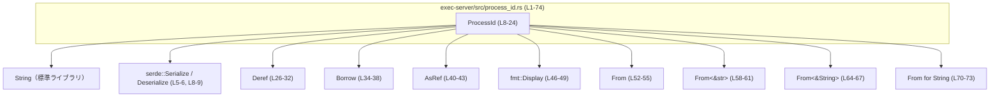
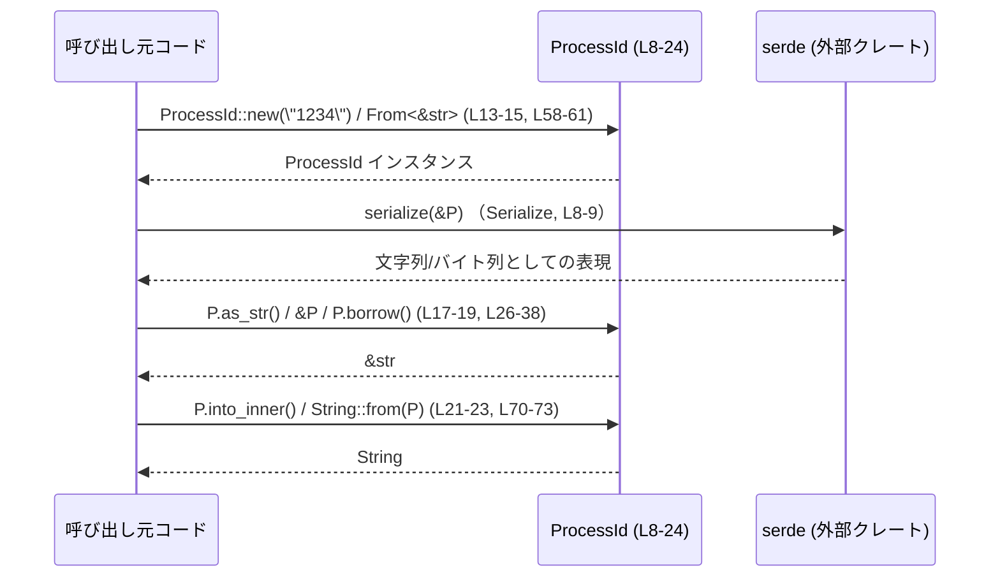

# exec-server/src/process_id.rs コード解説

## 0. ざっくり一言

`ProcessId` は `String` を内包する **プロセス ID 用の新しい型（newtype）** で、  
文字列との相互変換・シリアライズ／デシリアライズ・表示などの便利なトレイト実装を提供しています（`process_id.rs:L8-10`）。

---

## 1. このモジュールの役割

### 1.1 概要

- このモジュールは、プロセス ID を生の `String` ではなく **型付きで扱う** ためのラッパー `ProcessId` を定義しています（`process_id.rs:L8-10`）。
- 文字列との相互変換や、`&str` としての参照取得を標準トレイト（`Deref`, `Borrow`, `AsRef`, `From`, `Display`）経由で行えるようにしています（`process_id.rs:L26-73`）。
- `serde` の `Serialize` / `Deserialize` を derive することで、シリアライズ時は中身の文字列として扱われます（`process_id.rs:L5-6, L8-9`）。

### 1.2 アーキテクチャ内での位置づけ

このモジュール自身から分かる依存関係のみを示します。他モジュールが `ProcessId` をどう使っているかは、このチャンクには現れません。



- 依存先は標準ライブラリ（`String`, `Deref`, `Borrow`, `fmt::Display`）と `serde` のみです。
- `ProcessId` を利用する他ファイル・モジュールは、このチャンクには現れないため不明です。

### 1.3 設計上のポイント（コードから読み取れる範囲）

- **newtype パターン**  
  - `pub struct ProcessId(String);` というタプル構造体で、内部表現を `String` に固定しています（`process_id.rs:L8-10`）。
- **状態は単なる文字列**  
  - 検証ロジックやフォーマット制約は一切なく、どのような文字列でも保持可能です（`process_id.rs:L12-23`）。
- **所有権と参照の両方をサポート**  
  - 所有権を受け取る `From<String>` / `into_inner` と、借用する `&str` / `Borrow<str>` / `AsRef<str>` / `Deref` を揃え、所有権と借用を明確に使い分けられます（`process_id.rs:L17-23, L26-43, L52-67, L70-73`）。
- **エラー・パニック条件がない設計**  
  - 実装内で `unwrap` やインデックスアクセスなどのパニック要因は使用していません。標準ライブラリ側実装に依存する部分（`String::clone`, `String::fmt` など）を除き、この型自身からは新たなエラーは発生しません（`process_id.rs:L12-73`）。
- **並行性**  
  - 内部が `String` であり、ミュータブルな API が定義されていないため、`ProcessId` 自体は変更不能な値として扱われます。`String` は `Send` / `Sync` なため、`ProcessId` も自動的に `Send` / `Sync` になり、スレッド間共有が可能です（暗黙の auto trait。コード上では明示的には記述されていませんが、`String` の性質から導かれます）。

---

## 2. 主要な機能一覧

- `ProcessId` 型: プロセス ID を表す `String` のラッパー（`process_id.rs:L8-10`）
- `ProcessId::new`: 任意の `Into<String>` から `ProcessId` を構築する（`process_id.rs:L13-15`）
- `ProcessId::as_str`: 内部文字列を `&str` として借用する（`process_id.rs:L17-19`）
- `ProcessId::into_inner`: 内部の `String` の所有権を取り出す（`process_id.rs:L21-23`）
- `Deref<Target = str>` 実装: `&*process_id` や `&process_id[..]` などを可能にする（`process_id.rs:L26-32`）
- `Borrow<str>` / `AsRef<str>` 実装: コレクションのキーや API で `&str` として使えるようにする（`process_id.rs:L34-38, L40-43`）
- `fmt::Display` 実装: `{}` で内部文字列を表示可能にする（`process_id.rs:L46-49`）
- `From<String>`, `From<&str>`, `From<&String>` 実装: 文字列から `ProcessId` への変換（`process_id.rs:L52-55, L58-61, L64-67`）
- `From<ProcessId> for String` 実装: `ProcessId` から `String` への所有権移動（`process_id.rs:L70-73`）

---

## 3. 公開 API と詳細解説

### 3.1 型一覧（構造体・列挙体など）

| 名前       | 種別             | 役割 / 用途                                       | 主なトレイト                                                                                         | 定義位置                        |
|------------|------------------|--------------------------------------------------|------------------------------------------------------------------------------------------------------|---------------------------------|
| `ProcessId` | タプル構造体 (`String`) | プロセス ID を表す文字列のラッパー。型安全に扱うための新しい型 | `Debug`, `Clone`, `PartialEq`, `Eq`, `Hash`, `PartialOrd`, `Ord`, `Serialize`, `Deserialize`（derive） | `process_id.rs:L8-10`          |

### 3.2 関数詳細（主要 API）

#### `ProcessId::new(value: impl Into<String>) -> ProcessId`

**概要**

- 任意の `Into<String>`（例: `String`, `&str`）から `ProcessId` を生成するコンストラクタです（`process_id.rs:L13-15`）。

**定義位置**

- `process_id.rs:L13-15`

**引数**

| 引数名  | 型                    | 説明                                  |
|---------|------------------------|---------------------------------------|
| `value` | `impl Into<String>`    | 内部に保持する文字列に変換可能な値   |

**戻り値**

- `ProcessId`: 引数から生成した文字列を内部に保持する新しい `ProcessId` インスタンス。

**内部処理の流れ**

1. `value.into()` で `String` に変換する（`process_id.rs:L14`）。
2. 変換結果の `String` をタプル構造体 `ProcessId` に格納し、そのインスタンスを返す（`process_id.rs:L14`）。

**Examples（使用例）**

```rust
use exec_server::process_id::ProcessId;                  // ProcessId 型をインポート（モジュールパスは仮の例）

let id1 = ProcessId::new("1234");                        // &str から生成（&str は Into<String> を満たす）
let id2 = ProcessId::new(String::from("5678"));          // String から生成

println!("{}", id1);                                     // Display 実装経由で "1234" を表示
```

**Errors / Panics**

- この関数自身はエラーを返しません。
- 内部で `Into<String>` 実装を呼び出すのみであり、コード上からはパニック要因は見当たりません（`process_id.rs:L13-15`）。

**Edge cases（エッジケース）**

- 空文字列 (`""`) を渡した場合も、そのまま空文字を内部に保持します（特別な処理はありません）。
- 非 UTF-8 文字列は `String` に格納できないため、事前に UTF-8 である必要があります。これは `String` の仕様であり、このモジュールでは追加のチェックを行っていません。

**使用上の注意点**

- 文字列内容の検証（フォーマット・長さ・文字種など）は一切行っていないため、必要であれば呼び出し側で検証する必要があります（コードからは検証ロジックが確認できません）。

---

#### `ProcessId::as_str(&self) -> &str`

**概要**

- 内部の `String` を `&str` として借用して返します（`process_id.rs:L17-19`）。

**定義位置**

- `process_id.rs:L17-19`

**引数**

| 引数名 | 型          | 説明                      |
|--------|-------------|---------------------------|
| `&self` | `&ProcessId` | 借用したい `ProcessId` への参照 |

**戻り値**

- `&str`: 内部 `String` のスライス参照。

**内部処理の流れ**

1. `&self.0` でタプル構造体フィールドの `String` への参照から `&str` に自動参照解決される形で返します（`process_id.rs:L18`）。

**Examples（使用例）**

```rust
let id = ProcessId::new("1234");                         // 新しい ProcessId を作成
let s: &str = id.as_str();                               // &str として取得（所有権は移動しない）

assert_eq!(s, "1234");                                   // 同じ内容であることを確認
```

**Errors / Panics**

- 単にフィールドを参照するだけであり、パニック要因はありません（`process_id.rs:L17-19`）。

**Edge cases（エッジケース）**

- 空文字列の場合でも `""` の参照が返ります。
- 返された `&str` は `ProcessId` のライフタイムに依存し、`ProcessId` がスコープを抜けるまで有効です（一般的な借用ルール）。

**使用上の注意点**

- 所有権を維持したまま文字列を扱いたい場合はこちらを使うと、余分なコピーを避けられます（`to_string()` などによるヒープの再確保を防げます）。

---

#### `ProcessId::into_inner(self) -> String`

**概要**

- `ProcessId` を消費して、内部の `String` の所有権を取り出します（`process_id.rs:L21-23`）。

**定義位置**

- `process_id.rs:L21-23`

**引数**

| 引数名 | 型         | 説明                                     |
|--------|------------|------------------------------------------|
| `self` | `ProcessId` | 消費される `ProcessId` インスタンス |

**戻り値**

- `String`: 内部に保持していた文字列。新しい所有者として呼び出し元に移動します。

**内部処理の流れ**

1. タプルフィールド `self.0` の所有権をそのまま返します（`process_id.rs:L22`）。

**Examples（使用例）**

```rust
let id = ProcessId::new("1234");                         // ProcessId を作成
let s: String = id.into_inner();                         // 所有権ごと String を取り出す
// ここで id はムーブされており、以後使用できない

assert_eq!(s, "1234");                                   // 取り出した文字列を利用
```

**Errors / Panics**

- フィールドをムーブするだけのため、パニック要因はありません（`process_id.rs:L21-23`）。

**Edge cases（エッジケース）**

- 空文字列の場合も `String::new()` 相当の空の `String` が返ります。

**使用上の注意点**

- このメソッドを呼ぶと `ProcessId` はムーブされて使えなくなるため、同じ ID を引き続き使いたい場合は、`to_string()` で複製するか、`clone()` で `ProcessId` 自体を複製する必要があります。

---

#### `<ProcessId as Deref>::deref(&self) -> &str`

**概要**

- `*id` や `&id[..]` などの操作によって、`ProcessId` を `&str` として扱えるようにするための `Deref` 実装です（`process_id.rs:L26-32`）。

**定義位置**

- `process_id.rs:L26-32`

**引数**

| 引数名 | 型          | 説明                      |
|--------|-------------|---------------------------|
| `&self` | `&ProcessId` | デリファレンス対象の参照 |

**戻り値**

- `&str`（`Self::Target`）: `ProcessId` が指す文字列スライス。

**内部処理の流れ**

1. `type Target = str;` としてターゲット型を `str` に指定（`process_id.rs:L27`）。
2. `self.as_str()` を呼び出して、`&str` を返す（`process_id.rs:L29-31`）。

**Examples（使用例）**

```rust
let id = ProcessId::new("1234");                         // ProcessId を作成

let s1: &str = &id;                                      // Deref coercion により &ProcessId -> &str
let s2: &str = &*id;                                     // 明示的にデリファレンスしても同じ
let ch0 = id.chars().next();                             // &str としてメソッドチェーンが利用可能

assert_eq!(s1, "1234");
assert_eq!(s2, "1234");
```

**Errors / Panics**

- 内部で `as_str` を呼ぶのみであり、パニック要因はありません（`process_id.rs:L29-31`）。

**Edge cases（エッジケース）**

- 空文字列のときは空の `&str` を返します。
- UTF-8 境界を壊すような操作は提供されていないため、通常の `&str` と同じ扱いになります。

**使用上の注意点**

- 自動デリファレンスにより多くの場所で `&ProcessId` を `&str` として利用できますが、あくまで「文字列」であり、`ProcessId` 独自の振る舞いはありません。

---

#### `<ProcessId as fmt::Display>::fmt(&self, f: &mut fmt::Formatter<'_>) -> fmt::Result`

**概要**

- `println!("{}", id)` のように `ProcessId` を表示できるようにするための `Display` 実装です（`process_id.rs:L46-49`）。

**定義位置**

- `process_id.rs:L46-49`

**引数**

| 引数名 | 型                          | 説明                             |
|--------|-----------------------------|----------------------------------|
| `&self` | `&ProcessId`                 | 表示したい `ProcessId`          |
| `f`    | `&mut fmt::Formatter<'_>`   | 出力先を表すフォーマッタ        |

**戻り値**

- `fmt::Result`: フォーマット処理の成否を表す結果。

**内部処理の流れ**

1. 内部フィールド `self.0` の `fmt` メソッドにフォーマッタ `f` を渡して委譲します（`process_id.rs:L48`）。

**Examples（使用例）**

```rust
let id = ProcessId::new("1234");                         // ProcessId を作成
println!("pid = {}", id);                                // "pid = 1234" と出力される（内部 String の表示）
```

**Errors / Panics**

- 戻り値の `fmt::Result` は `Formatter` への書き込み結果に依存しますが、`ProcessId` 独自のエラー処理はありません。
- 一般には `println!` マクロ内部でのフォーマットエラーはほとんど発生しません。

**Edge cases（エッジケース）**

- 空文字列の場合、空の文字列として表示されます（例: `"pid = "` のような出力）。

**使用上の注意点**

- ID に機密情報が含まれる設計の場合、この `Display` 実装は内部文字列をそのまま出力するため、ログ出力などで扱う際には設計上の配慮が必要になる可能性があります（ただし、このファイルからは ID の意味や機密性は判断できません）。

---

#### `impl From<&str> for ProcessId { fn from(value: &str) -> Self }`

**概要**

- `ProcessId::from("1234")` のように、`&str` から `ProcessId` を生成するための変換実装です（`process_id.rs:L58-61`）。

**定義位置**

- `process_id.rs:L58-61`

**引数**

| 引数名 | 型    | 説明                       |
|--------|-------|----------------------------|
| `value` | `&str` | 変換元の文字列スライス |

**戻り値**

- `ProcessId`: `value` を元に新しく作られた ID。

**内部処理の流れ**

1. `value.to_string()` で新しい `String` を生成（`process_id.rs:L60`）。
2. `Self(value.to_string())` でタプル構造体に格納して返す（`process_id.rs:L60`）。

**Examples（使用例）**

```rust
let id: ProcessId = "1234".into();                       // From<&str> による自動変換
assert_eq!(id.as_str(), "1234");
```

**Errors / Panics**

- `to_string` による通常の `String` 生成のみで、パニック要因はありません。

**Edge cases（エッジケース）**

- 空文字列の場合でも新しい空の `String` が生成され、そのまま格納されます。

**使用上の注意点**

- 変換時に必ず `String` のヒープ確保とコピーが発生します。性能が問題になる箇所で大量に生成する場合は、所有権を移動できる `From<String>` や `ProcessId::new`（`String` 引数）を使うことでコピーを避けられる場合があります。

---

#### `impl From<ProcessId> for String { fn from(value: ProcessId) -> Self }`

**概要**

- `String::from(id)` のように `ProcessId` から `String` に変換するための実装で、所有権をムーブして中身の `String` を取り出します（`process_id.rs:L70-73`）。

**定義位置**

- `process_id.rs:L70-73`

**引数**

| 引数名 | 型         | 説明                         |
|--------|------------|------------------------------|
| `value` | `ProcessId` | 変換元の `ProcessId`（ムーブ） |

**戻り値**

- `String`: もともと `ProcessId` が保持していた文字列。

**内部処理の流れ**

1. `value.0` をそのまま返し、内部の `String` の所有権を移動させます（`process_id.rs:L72`）。

**Examples（使用例）**

```rust
let id = ProcessId::new("1234");                         // ProcessId を作成
let s: String = id.into();                               // From<ProcessId> による変換
// ここで id はムーブされており使用できない
assert_eq!(s, "1234");
```

**Errors / Panics**

- フィールドをムーブするだけであり、パニック要因はありません。

**Edge cases（エッジケース）**

- 空の `ProcessId` の場合、空の `String` が返ります。

**使用上の注意点**

- 変換後は元の `ProcessId` が使えなくなる点に注意が必要です。`ProcessId` を保持したまま `String` が必要な場合は `id.to_string()` を使うと複製が得られます（そのぶんコピーコストが発生します）。

---

### 3.3 その他の関数・メソッド

以下は比較的単純なラッパー関数です。

| 関数名 / メソッド名                            | 役割（1 行）                                            | 定義位置                 |
|-----------------------------------------------|---------------------------------------------------------|--------------------------|
| `<ProcessId as Borrow<str>>::borrow(&self)`   | `ProcessId` を `Borrow<str>` として `&str` 参照を返す  | `process_id.rs:L34-37`  |
| `<ProcessId as AsRef<str>>::as_ref(&self)`    | `AsRef<str>` 経由で `&str` 参照を返す                   | `process_id.rs:L40-43`  |
| `impl From<String> for ProcessId::from`       | 所有権付き `String` からコピーなしで `ProcessId` を生成 | `process_id.rs:L52-55`  |
| `impl From<&String> for ProcessId::from`      | `&String` から文字列を複製して `ProcessId` を生成       | `process_id.rs:L64-67`  |

---

## 4. データフロー

このモジュールにおける代表的なデータフローは、  
「外部の文字列 → `ProcessId` → `&str` / `String` → （シリアライズなど外部 API）」という流れです。



- 生成時は `new` / `From<...>` で `ProcessId` の内部に `String` が格納されます。
- 参照だけ必要な場合は `&ProcessId` を `&str` に自動変換（Deref）したり、`as_str`/`as_ref`/`borrow` を使います。
- 所有権が必要な場合は `into_inner` または `From<ProcessId> for String` を用いて `String` を再取得します。
- シリアライズ・デシリアライズ時は `serde` が内部文字列として扱います（`#[serde(transparent)]`, `process_id.rs:L8-9`）。

---

## 5. 使い方（How to Use）

### 5.1 基本的な使用方法

以下は `ProcessId` を生成し、表示・借用・変換を行う一連の流れの例です。

```rust
use serde::{Serialize, Deserialize};                      // シリアライズ用のトレイト
// use exec_server::process_id::ProcessId;                // 実際のモジュールパスはクレート構成に依存（このチャンクからは不明）

#[derive(Serialize, Deserialize)]
struct ProcessInfo {                                      // プロセス情報の構造体例
    id: ProcessId,                                       // ID フィールドとして ProcessId を利用
}

fn example() {
    let id = ProcessId::new("1234");                     // &str から ProcessId を生成（L13-15）

    println!("pid = {}", id);                            // Display で "pid = 1234" を表示（L46-49）

    let s: &str = id.as_str();                           // &str として借用（L17-19）
    assert_eq!(s, "1234");

    let copied: String = id.to_string();                 // Display 経由で String を複製
    assert_eq!(copied, "1234");

    let moved: String = id.into_inner();                 // 所有権ごと内部 String を取得（L21-23）
    // ここで id はムーブされており、以後使用できない
    assert_eq!(moved, "1234");
}
```

### 5.2 よくある使用パターン

#### 5.2.1 コレクションのキーとして利用する

`Eq` / `Hash` / `Ord` を実装しているため、`HashMap` のキーや `BTreeMap` のキーにできます（`process_id.rs:L8`）。

```rust
use std::collections::HashMap;

let mut map: HashMap<ProcessId, &'static str> = HashMap::new();  // HashMap のキーに ProcessId を使用
let pid = ProcessId::new("1234");

map.insert(pid.clone(), "running");                     // Clone で ProcessId を複製（L8 の derive）
assert_eq!(map.get(&pid), Some(&"running"));            // &pid（&ProcessId）は Borrow<str> にも利用可能（L34-37）
```

#### 5.2.2 シリアライズ／デシリアライズ

`serde` の `Serialize` / `Deserialize` + `#[serde(transparent)]` により、  
構造体のフィールドとして使うとシリアライズ時には純粋な文字列として扱われます（`process_id.rs:L5-6, L8-9`）。

```rust
use serde::{Serialize, Deserialize};
use serde_json;                                         // JSON シリアライザ（このクレート自体は別途依存が必要）

#[derive(Serialize, Deserialize)]
struct ProcessInfo {
    id: ProcessId,                                      // transparent により文字列として扱われる
}

let info = ProcessInfo { id: ProcessId::new("1234") };
let json = serde_json::to_string(&info).unwrap();       // 例: {"id":"1234"}
let de: ProcessInfo = serde_json::from_str(&json).unwrap();

assert_eq!(de.id.as_str(), "1234");
```

### 5.3 よくある間違い

#### 5.3.1 所有権を消費するかどうか

```rust
let id = ProcessId::new("1234");

// 間違い例: into_inner を呼んだあとも id を使おうとする
let s = id.into_inner();
// println!("{}", id);                                  // コンパイルエラー: id はムーブ済み

// 正しい例: 複数回使いたいなら複製する
let id = ProcessId::new("1234");
let s1 = id.to_string();                                // String を複製
let s2 = id.to_string();                                // もう一度複製
println!("{}", id);                                     // id 自体は引き続き使用可能
```

#### 5.3.2 フォーマット検証を `ProcessId` に期待する

```rust
// 間違い例: ProcessId::new が不正な ID を弾いてくれると想定する
let id = ProcessId::new("not-a-real-pid");              // このコードからは、フォーマット検証は行われていない

// 正しい扱い: 必要なら呼び出し側で検証する必要がある
fn is_valid_pid(s: &str) -> bool {
    s.chars().all(|c| c.is_ascii_digit())
}

let raw = "1234";
if is_valid_pid(raw) {
    let id = ProcessId::new(raw);                       // 検証済み文字列から生成
    // ...
}
```

このファイルには検証ロジックが存在しないため、内容の正当性は呼び出し側が担保する必要があります。

### 5.4 使用上の注意点（まとめ）

- **フォーマット・制約の不在**  
  - `ProcessId` 自体は「ただの `String` のラッパー」であり、フォーマット検証や値域チェックは行っていません（`process_id.rs:L12-23`）。
- **所有権とコピー**  
  - `into_inner` / `From<ProcessId> for String` は所有権をムーブし、`ProcessId` は使えなくなります（`process_id.rs:L21-23, L70-73`）。
  - `From<&str>` / `From<&String>` / `to_string` は `String` を新規に確保してコピーします（`process_id.rs:L58-61, L64-67`）。
- **並行性**  
  - ミュータブルなメソッドが存在せず、内部は `String` のみのため、スレッド間で共有してもデータ競合の心配はありません（通常の `String` と同等）。
- **バグ／セキュリティの観点**  
  - このコードにパニックにつながる明示的な処理はなく、直接的なバグ要因は見当たりません。
  - `Display` や `serde` シリアライズで内部文字列がそのまま露出するため、ID が機密情報を含むかどうかは設計全体で判断する必要があります（このファイルだけでは不明）。

---

## 6. 変更の仕方（How to Modify）

### 6.1 新しい機能を追加する場合

- **新しいコンストラクタやパーサを追加する**  
  - 例として「数値 PID からの生成」などを追加する場合は、`impl ProcessId { ... }` ブロック（`process_id.rs:L12-24`）に新しいメソッドを定義するのが自然です。
- **追加のトレイト実装**  
  - 他のライブラリとの連携や構造体の使い勝手を向上させるためには、このファイル内にトレイト実装ブロック（`impl ... for ProcessId { ... }`）を追加します（`process_id.rs:L26-73` と同種の場所）。
- **シリアライズ形式を保つ必要がある場合**  
  - `#[serde(transparent)]`（`process_id.rs:L9`）により外部フォーマットは「単なる文字列」として決まっているため、この挙動を変えたい場合は外部との互換性への影響を考慮する必要があります。

### 6.2 既存の機能を変更する場合

- **内部表現（`String`）の変更**  
  - `ProcessId(String)` を別の構造に変更すると、`Deref<Target = str>` や `Display`, `From` 実装など多数の箇所が影響を受けます（`process_id.rs:L26-73`）。内部表現を変える場合は、これらの実装が引き続き期待どおり動くかを確認する必要があります。
- **`new` に検証ロジックを追加する**  
  - `ProcessId::new` をエラーを返す形に変更する場合は、シグネチャを `Result<ProcessId, E>` に変えるなどの修正が必要になり、呼び出し側にも影響します（`process_id.rs:L13-15`）。
- **`Display`/`Serialize` の挙動変更**  
  - `Display` や `serde` の挙動を変更すると、ログや外部 API の期待値に影響します。現在は内部文字列そのものが使われています（`process_id.rs:L8-9, L46-49`）。

このチャンクからは `ProcessId` をどこで使っているか分からないため、変更時にはクレート全体で `ProcessId` の使用箇所を検索して影響範囲を把握する必要があります。

---

## 7. 関連ファイル

このチャンクには `mod` 宣言や他ファイルへの参照が無いため、直接の関連ファイルは特定できません。

| パス | 役割 / 関係 |
|------|------------|
| （不明） | このチャンクには `ProcessId` を利用するモジュールやテストコードへの参照が現れないため、不明です。 |

テストコード・呼び出し側モジュール・バイナリエントリポイント（例: `main.rs`）などは、リポジトリ全体を確認することで特定できますが、このファイル単体からは読み取れません。
