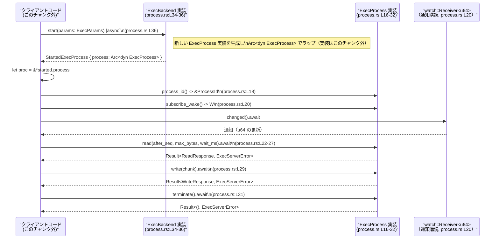

# exec-server/src/process.rs コード解説

## 0. ざっくり一言

`exec-server/src/process.rs` は、**「実行プロセス」相当のものを操作するための非同期インターフェース（トレイト）と、そのプロセスを開始するバックエンドのインターフェース** を定義しているモジュールです（process.rs:L12-36）。

---

## 1. このモジュールの役割

### 1.1 概要

- このモジュールは、実行中の処理（ここでは `ExecProcess` と呼ばれる）の
  - 識別
  - 入出力（読み取り・書き込み）
  - 終了要求
  を行うための **抽象トレイト** を提供します（process.rs:L16-32）。
- さらに、その `ExecProcess` を生成・起動するためのバックエンドインターフェース `ExecBackend` を定義します（process.rs:L34-36）。
- 実際の OS プロセスか、別種の「実行単位」かは、このファイルだけからは断定できません。型名・メソッド名から「何らかの実行単位」を扱う抽象化と解釈できますが、正確な性質は他モジュールに依存します。

### 1.2 アーキテクチャ内での位置づけ

このモジュールは、「上位レイヤ（RPC ハンドラやサービス層）」と、「実際にプロセスを実行・管理する実装」との間の **境界インターフェース** として位置づけられます。

```mermaid
graph TD
    A["上位レイヤ（例: RPC/HTTP ハンドラ）<br/>（このチャンク外）」]
    B["ExecBackend トレイト<br/>(process.rs:L34-36)"]
    C["StartedExecProcess 構造体<br/>(process.rs:L12-14)"]
    D["ExecProcess トレイト<br/>(process.rs:L16-32)"]
    E["実際の ExecBackend 実装<br/>（このチャンク外）"]
    F["実際の ExecProcess 実装<br/>（このチャンク外）"]
    G["ExecParams / ReadResponse / WriteResponse<br/>(crate::protocol, このチャンク外)"]
    H["ExecServerError / ProcessId<br/>(crate ルート, このチャンク外)"]

    A -->|start(params)| B
    B -->|start() 実装| E
    E -->|StartedExecProcess を構築| C
    C -->|process フィールド| D
    D --> F

    A -->|read/write/terminate| D

    B --> G
    D --> G
    B --> H
    D --> H
```

- 上位レイヤからは `ExecBackend` と `ExecProcess` のトレイトのみを意識すればよく、具体的な実装（OS プロセス起動、コンテナ起動、リモート実行など）は隠蔽されます。
- エラーはすべて `ExecServerError` 型に統一されており、呼び出し側はこの型だけを扱えばよい設計になっています（process.rs:L6,22-27,29,31,36）。

### 1.3 設計上のポイント（コードから読み取れる事実）

- **トレイトによる抽象化**  
  - 実行プロセスは `ExecProcess` トレイトで抽象化されます（process.rs:L16-32）。
  - 起動ロジックは `ExecBackend` トレイトで抽象化されます（process.rs:L34-36）。
- **非同期・並行性への配慮**
  - トレイトに `#[async_trait]` が付いており、`async fn` を定義できるようになっています（process.rs:L16,34）。
  - 両トレイトとも `Send + Sync` 制約付きで、**スレッド間で安全に共有できることが前提** です（process.rs:L17,35）。
  - `ExecProcess` への参照は `Arc<dyn ExecProcess>` 経由で共有されます（process.rs:L12-13）。
  - `subscribe_wake` は `tokio::sync::watch::Receiver<u64>` を返し、非同期通知の仕組みを使うようになっています（process.rs:L4,20）。
- **エラー処理の統一**
  - 非同期メソッド `read`, `write`, `terminate`, `start` はすべて `Result<..., ExecServerError>` を返し、エラー型を統一しています（process.rs:L6,22-27,29,31,36）。
- **状態は持たないインターフェース定義**
  - このファイル内には具体的なフィールドを持つのは `StartedExecProcess` のみで、その中身は trait object への `Arc` だけです（process.rs:L12-14）。
  - ロジックや状態管理は、実際の実装（このチャンク外）に委ねられています。

### 1.4 コンポーネント一覧（インベントリー）

#### このファイルで定義される型・トレイト

| 名前                | 種別       | 役割 / 用途                                                                 | 定義位置                     |
|---------------------|------------|----------------------------------------------------------------------------|------------------------------|
| `StartedExecProcess`| 構造体     | `Arc<dyn ExecProcess>` をラップし、`start` の戻り値として渡すコンテナ      | process.rs:L12-14           |
| `ExecProcess`       | トレイト   | 実行プロセス相当のものの識別・入力・出力・終了を行う非同期インターフェース | process.rs:L16-32           |
| `ExecBackend`       | トレイト   | 新しい `ExecProcess` を起動し `StartedExecProcess` を返す非同期バックエンド | process.rs:L34-36           |

#### このファイルが利用する外部コンポーネント

| 名前                          | 種別          | 役割 / 用途                                                         | 使用位置                    |
|-------------------------------|---------------|----------------------------------------------------------------------|-----------------------------|
| `std::sync::Arc`             | 標準ライブラリ| 参照カウントによる共有所有権（スレッド安全）                         | process.rs:L1,12-13        |
| `async_trait::async_trait`   | マクロ       | トレイト内で `async fn` を使用可能にするためのプロシージャルマクロ   | process.rs:L3,16,34        |
| `tokio::sync::watch::Receiver`| 非同期プリミティブ | 1 つの最新値の更新を購読する非同期チャンネルの受信側                 | process.rs:L4,20           |
| `ExecServerError`            | crate 内型    | エラーを表すアプリケーション固有の型                                 | process.rs:L6,22-27,29,31,36 |
| `ProcessId`                  | crate 内型    | プロセス識別子と思われる型（定義はこのチャンク外）                  | process.rs:L7,18           |
| `ExecParams`                 | crate::protocol| 起動パラメータ（詳細はこのチャンク外）                               | process.rs:L8,36           |
| `ReadResponse`               | crate::protocol| 読み取り結果（詳細はこのチャンク外）                                 | process.rs:L9,22-27        |
| `WriteResponse`              | crate::protocol| 書き込み結果（詳細はこのチャンク外）                                 | process.rs:L10,29          |

---

## 2. 主要な機能一覧

このモジュールが提供する主要な機能は次のとおりです。

- `ExecProcess` トレイト: 実行プロセス相当のものの **ID 取得・通知購読・読み取り・書き込み・終了** のための非同期 API を定義します（process.rs:L16-32）。
- `ExecBackend` トレイト: 起動パラメータ `ExecParams` を受け取り、新しい `ExecProcess` を開始して `StartedExecProcess` を返すための非同期 API を定義します（process.rs:L34-36）。
- `StartedExecProcess` 構造体: `Arc<dyn ExecProcess>` を保持し、バックエンドから上位レイヤへプロセスハンドルを渡すためのラッパーです（process.rs:L12-14）。

---

## 3. 公開 API と詳細解説

### 3.1 型一覧（構造体・列挙体など）

| 名前                | 種別     | フィールド / メソッド概要                                                                 | 定義位置         |
|---------------------|----------|------------------------------------------------------------------------------------------|------------------|
| `StartedExecProcess`| 構造体   | フィールド `process: Arc<dyn ExecProcess>` を持ち、プロセス操作の入り口となる            | process.rs:L12-14|
| `ExecProcess`       | トレイト | `process_id`, `subscribe_wake`, `read`, `write`, `terminate` メソッドを定義する          | process.rs:L16-32|
| `ExecBackend`       | トレイト | `start` メソッドのみを定義し、新しい `ExecProcess` を作成する                           | process.rs:L34-36|

`StartedExecProcess` のフィールド:

```rust
pub struct StartedExecProcess {                          // process.rs:L12
    pub process: Arc<dyn ExecProcess>,                   // process.rs:L13
}                                                        // process.rs:L14
```

- フィールドは `pub` であり、モジュール外から `StartedExecProcess.process` に直接アクセスできます（process.rs:L13）。
- `Arc<dyn ExecProcess>` により、**動的ディスパッチ** と **共有所有権** を組み合わせたプロセスハンドルになっています。

### 3.2 関数詳細（トレイトメソッド）

#### `ExecProcess::process_id(&self) -> &ProcessId`

**概要**

- このプロセスを識別するための ID への参照を返します（process.rs:L18）。
- `ProcessId` の具体的な定義はこのファイル外ですが、**識別子** として使われることが名前から推測されます。

**引数**

| 引数名 | 型         | 説明 |
|--------|------------|------|
| `&self`| `&Self`    | この `ExecProcess` インスタンスへの共有参照 |

**戻り値**

- 型: `&ProcessId`（process.rs:L18）
- 意味: このプロセスに対応する ID への参照。ライフタイムは `&self` に束縛されており、`ExecProcess` が生存している間のみ有効です。

**内部処理の流れ**

- このメソッドはトレイト宣言だけであり、実装は存在しません（process.rs:L16-32）。
- 具体的なアルゴリズムや ID の生成方法は、トレイトを実装する型に依存し、このファイルからは読み取れません。

**Examples（使用例）**

```rust
use std::sync::Arc;
use exec_server::process::{ExecProcess, StartedExecProcess}; // モジュールパスは仮の例です

fn log_process_id(started: &StartedExecProcess) {            // StartedExecProcess への参照を受け取る
    let proc: &Arc<dyn ExecProcess> = &started.process;      // Arc<dyn ExecProcess> への参照を取得
    let id = proc.process_id();                              // ProcessId への参照を取得
    // 実際の表示方法は ProcessId の実装に依存
    // println!("process id = {:?}", id);
}
```

**Errors / Panics**

- 戻り値が `Result` ではないため、**このメソッド自体はエラーを表現しません**。
- パニック条件もこのファイルからは分かりません。実装側でパニックを起こすことも技術的には可能ですが、契約は明示されていません。

**Edge cases（エッジケース）**

- `ProcessId` がどのような値を取りうるか、無効値が存在するかなどは、このチャンクには現れません。
- `ExecProcess` のライフタイム外で返された参照を保持することは、型システム上できません（Rust の所有権・ライフタイムによりコンパイルエラーになります）。

**使用上の注意点**

- `&ProcessId` への参照だけを返すため、所有権は `ExecProcess` 実装側に残ります。**長期間保持したい場合** は、必要に応じてクローンできる型かどうか（例: `Clone` 実装）を確認する必要があります（このファイルからは不明）。

---

#### `ExecProcess::subscribe_wake(&self) -> watch::Receiver<u64>`

**概要**

- `tokio::sync::watch` チャネルの受信側を返し、`u64` 値の更新通知を購読できるようにします（process.rs:L4,20）。
- `u64` の意味（例: 出力シーケンス番号など）はこのファイルには記載されていません。

**引数**

| 引数名 | 型      | 説明                    |
|--------|---------|-------------------------|
| `&self`| `&Self` | この `ExecProcess` への共有参照 |

**戻り値**

- 型: `watch::Receiver<u64>`（process.rs:L20）
- 意味: 非同期タスクから `changed().await` などを呼び出すことで、何らかの更新（`u64` 値の変化）を検知するための受信ハンドル。

**内部処理の流れ**

- トレイト宣言のみで、内部でどのような watch チャネルを使うかは実装によります。
- 一般に `watch::Receiver` は clonable であり、複数の購読者を持つことができますが、その利用方針はこのファイルからは分かりません。

**Examples（使用例）**

```rust
use tokio::sync::watch;
use exec_server::process::ExecProcess;

async fn wait_for_update(proc: &dyn ExecProcess) {          // ExecProcess トレイトオブジェクトを受け取る
    let mut rx: watch::Receiver<u64> = proc.subscribe_wake(); // watch::Receiver<u64> を取得
    // 最初の変更を待つ（エラー: 送信側がドロップ済みかどうかの扱いは実装に依存）
    if rx.changed().await.is_ok() {                         // 値が更新されるのを待機
        let current = *rx.borrow();                         // 最新の u64 値を参照
        // println!("updated value = {}", current);
    }
}
```

**Errors / Panics**

- このメソッド自体は `Result` を返さないため、**生成時点でのエラーは表現されていません**。
- `watch::Receiver::changed().await` は、送信側がすべてドロップされた場合に `Err` を返しますが、これはこのファイル外の挙動です。

**Edge cases**

- 送信側（`watch::Sender`）が先にドロップされた場合、`changed().await` はエラーになります。  
  この送信側がどこにあるかは、このファイルからは分かりません。
- 複数回 `subscribe_wake` を呼び出したとき、毎回新しい `Receiver` を返すかどうかも実装依存であり、このファイルには明記されていません。

**使用上の注意点**

- 非同期文脈（`async fn` 内）で `changed().await` を呼び出すことが前提です。
- watch チャネルの性質上、「最新値」だけが保持されるため、すべての更新イベントを厳密に追跡したい場合には適さない可能性があります（ただし、実際に何を表す値かはこのファイルからは不明）。

---

#### `ExecProcess::read(&self, after_seq: Option<u64>, max_bytes: Option<usize>, wait_ms: Option<u64>) -> Result<ReadResponse, ExecServerError>`

**概要**

- 実行プロセスから何らかのデータを読み取るための非同期メソッドです（process.rs:L22-27）。
- 引数名から、`after_seq` は読み取り位置、`max_bytes` は読み取り上限、`wait_ms` は待機時間を制御するパラメータと推測されますが、**具体的な意味はこのファイルだけでは断定できません**。

**引数**

| 引数名     | 型               | 説明（コードから分かる範囲）                                   |
|-----------|------------------|----------------------------------------------------------------|
| `&self`   | `&Self`          | この `ExecProcess` への共有参照                                 |
| `after_seq`| `Option<u64>`   | 読み取りの開始位置／シーケンスを指定する可能性のあるオプション（意味は不明） |
| `max_bytes`| `Option<usize>` | 読み取る最大バイト数を指定する可能性のあるオプション（意味は不明）       |
| `wait_ms` | `Option<u64>`    | 最大待機時間などをミリ秒指定する可能性のあるオプション（意味は不明）     |

**戻り値**

- 型: `Result<ReadResponse, ExecServerError>`（process.rs:L22-27）
- 意味:
  - `Ok(ReadResponse)`: 読み取りに成功した結果を表すレスポンス。内容は `ReadResponse` 型の定義に依存します（このチャンク外）。
  - `Err(ExecServerError)`: 読み取り失敗やタイムアウトなどのエラーを表す（具体的な内訳はこのチャンク外）。

**内部処理の流れ**

- トレイト宣言のため、内部処理は実装依存で、このファイルからは読み取れません。
- 非同期メソッドであるため、I/O 待ちなどブロッキング操作を避けることを意図していると考えられますが、確証はありません。

**Examples（使用例）**

```rust
use exec_server::process::ExecProcess;
use exec_server::ExecServerError;
use exec_server::protocol::ReadResponse;

async fn read_some(proc: &dyn ExecProcess) -> Result<ReadResponse, ExecServerError> {
    // after_seq, max_bytes, wait_ms の意味は実装依存のため仮の指定
    let after_seq = None;                                  // 先頭から読みたいイメージ
    let max_bytes = Some(4096);                           // 最大 4KB 読みたい
    let wait_ms   = Some(1000);                           // 最大 1 秒まで待つイメージ

    let resp = proc.read(after_seq, max_bytes, wait_ms).await?; // 非同期で読み取り
    Ok(resp)
}
```

**Errors / Panics**

- 失敗時は `ExecServerError` が返ります（process.rs:L22-27）。
- どのような条件で `Err` になるか（例: タイムアウト、接続切断、無効なパラメータ）は、このファイルには記載されていません。
- パニック条件も明示されておらず、このレベルでは不明です。

**Edge cases**

- `after_seq == None` / `Some(…)`、`max_bytes == None` / `Some(0)` などの境界値でどのように振る舞うかは、実装に依存し、このチャンクには現れません。
- 非常に大きな `max_bytes` を渡した場合の挙動（制限がかかるかどうか）も不明です。

**使用上の注意点**

- 非同期メソッドのため、**必ず `.await` が必要** です。同期コンテキストから直接呼び出すことはできません。
- `Option` 引数にどのような意味を持たせるかは、`ExecProcess` 実装の契約に依存します。利用側は、別途のドキュメントやコードを確認する必要があります。

---

#### `ExecProcess::write(&self, chunk: Vec<u8>) -> Result<WriteResponse, ExecServerError>`

**概要**

- 実行プロセスに対してデータを書き込むための非同期メソッドです（process.rs:L29）。
- `chunk` は生のバイト列であり、テキストかバイナリかはこのファイルからは分かりません。

**引数**

| 引数名 | 型         | 説明                                   |
|--------|------------|----------------------------------------|
| `&self`| `&Self`    | この `ExecProcess` への共有参照         |
| `chunk`| `Vec<u8>`  | プロセスに書き込むデータのバイト列。所有権がこのメソッドに移動します |

**戻り値**

- 型: `Result<WriteResponse, ExecServerError>`（process.rs:L29）
- 意味:
  - `Ok(WriteResponse)`: 書き込みに成功した結果。
  - `Err(ExecServerError)`: 書き込みエラー（接続断、容量オーバーなど）。具体的内容はこのチャンク外。

**内部処理の流れ**

- トレイト宣言のみであり、実装は不明です。
- 非同期メソッドであるため、I/O をブロッキングせずに書き込みを行う意図があると推測されますが、詳細は分かりません。

**Examples（使用例）**

```rust
use exec_server::process::ExecProcess;
use exec_server::ExecServerError;
use exec_server::protocol::WriteResponse;

async fn send_line(proc: &dyn ExecProcess) -> Result<WriteResponse, ExecServerError> {
    let data = b"hello\n".to_vec();                        // バイト列を Vec<u8> に変換
    let resp = proc.write(data).await?;                    // 非同期で書き込み
    Ok(resp)
}
```

**Errors / Panics**

- 失敗時は `ExecServerError` が返されます（process.rs:L29）。
- `chunk` のサイズが大きすぎる場合など、どのようなエラーが返るかはこのチャンクからは分かりません。

**Edge cases**

- 空の `chunk`（`Vec::new()`）を書き込んだときの挙動は不明です。
- 極端に大きな `chunk` の扱いも実装依存で、このファイルには現れません。

**使用上の注意点**

- `chunk` の所有権はメソッドに移動するため、呼び出し後に同じ `Vec<u8>` を再利用したい場合は、呼び出し前にクローンなどを行う必要があります。
- 大量データを書き込む場合、**バックプレッシャー**（処理能力に応じて書き込み速度を制御する仕組み）がどのように働くかは実装依存です。

---

#### `ExecProcess::terminate(&self) -> Result<(), ExecServerError>`

**概要**

- 実行プロセスの終了を要求する非同期メソッドです（process.rs:L31）。
- 強制終了か、優雅終了（graceful shutdown）かは、このファイルからは分かりません。

**引数**

| 引数名 | 型      | 説明                    |
|--------|---------|-------------------------|
| `&self`| `&Self` | この `ExecProcess` への共有参照 |

**戻り値**

- 型: `Result<(), ExecServerError>`（process.rs:L31）
- 意味:
  - `Ok(())`: 終了要求が成功したことを示します（実際に終了したかどうかの詳細は不明）。
  - `Err(ExecServerError)`: 終了要求に失敗したことを示します。

**内部処理の流れ**

- トレイト宣言のみで実装がないため、内部処理は不明です。
- 例えばシグナル送信、リソース解放などが行われる可能性がありますが、これは推測の域を出ません。

**Examples（使用例）**

```rust
use exec_server::process::ExecProcess;
use exec_server::ExecServerError;

async fn stop_process(proc: &dyn ExecProcess) -> Result<(), ExecServerError> {
    proc.terminate().await?;                               // 終了を要求
    Ok(())
}
```

**Errors / Panics**

- エラー時は `ExecServerError` が返されます（process.rs:L31）。
- どのような失敗ケースがあるか（すでに終了している、権限不足など）は、このチャンクからは分かりません。

**Edge cases**

- すでに終了済みのプロセスに対する `terminate` 呼び出しの挙動は不明です。
- 終了要求が即時完了するか、非同期に進行するか（完了まで待つかどうか）も、このファイルには明示されていません。

**使用上の注意点**

- 非同期メソッドであるため、**必ず `.await` で完了を待つ** 必要があります。
- `terminate` の契約（幂等かどうか、2 回以上呼んでも安全かどうか）はこのファイルから読み取れないため、実装またはドキュメントの確認が必要です。

---

#### `ExecBackend::start(&self, params: ExecParams) -> Result<StartedExecProcess, ExecServerError>`

**概要**

- 新しい `ExecProcess` を開始し、それを `StartedExecProcess` として返す非同期メソッドです（process.rs:L34-36）。
- 起動方法や実際に何を起動するかはこのファイルからは分かりません。

**引数**

| 引数名 | 型           | 説明 |
|--------|--------------|------|
| `&self`| `&Self`      | この `ExecBackend` 実装への共有参照 |
| `params`| `ExecParams`| 起動に必要なパラメータ。所有権が `start` に移動します（process.rs:L8,36）。内容はこのチャンク外です。 |

**戻り値**

- 型: `Result<StartedExecProcess, ExecServerError>`（process.rs:L36）
- 意味:
  - `Ok(StartedExecProcess)`: 新しいプロセスの起動に成功し、そのハンドルを返します。
  - `Err(ExecServerError)`: 起動に失敗したことを表します（パラメータ不正、リソース不足などの詳細はこのチャンク外）。

**内部処理の流れ**

- トレイト宣言のみであり、具体的な起動処理（例えば `std::process::Command` の利用、リモート呼び出しなど）は実装に依存します。
- 戻り値の `StartedExecProcess` は内部に `Arc<dyn ExecProcess>` を保持するため、`start` 実装では何らかの `ExecProcess` 実装を `Arc` に包んで返すことが想定されます（process.rs:L12-13,36）。

**Examples（使用例）**

```rust
use exec_server::process::{ExecBackend, ExecProcess, StartedExecProcess};
use exec_server::{ExecServerError, ProcessId};
use exec_server::protocol::ExecParams;

async fn run_one<B: ExecBackend>(backend: &B, params: ExecParams) -> Result<(), ExecServerError> {
    let started: StartedExecProcess = backend.start(params).await?; // プロセスを起動
    let proc: &dyn ExecProcess = &*started.process;                 // Arc からトレイトオブジェクトを取り出す

    let id: &ProcessId = proc.process_id();                         // ID を取得
    // println!("started process id = {:?}", id);

    // 必要に応じて read / write / terminate を呼ぶ…
    Ok(())
}
```

**Errors / Panics**

- 起動に失敗した場合は `ExecServerError` を返します（process.rs:L36）。
- どのようなエラー種別があるか、再試行可能かどうかなどは、このファイルからは分かりません。

**Edge cases**

- 無効な `ExecParams` を渡した場合の挙動は不明です。
- 同じ `ExecBackend` に対して多重に `start` を呼んだ場合のリソース管理ポリシーも、このファイルには記載されていません。

**使用上の注意点**

- `ExecParams` の所有権は `start` に移るため、呼び出し側で後から同じインスタンスを再利用することはできません。
- 非同期メソッドのため、`start(params)` を呼んだだけでは起動完了しておらず、`.await` して初めて結果が得られます。

---

### 3.3 その他の関数

- このモジュールには、上記以外の関数・メソッド定義はありません。

---

## 4. データフロー

ここでは、「バックエンドでプロセスを起動し、出力を待ち受けて、最後に終了させる」という代表的なシナリオのデータフローを示します。



ポイント（このチャンクから読み取れる範囲）:

- クライアントはまず `ExecBackend::start` に `ExecParams` を渡して、`StartedExecProcess` を受け取ります（process.rs:L34-36）。
- その中の `process: Arc<dyn ExecProcess>` を通じて、以後の read / write / terminate を行います（process.rs:L12-13）。
- `subscribe_wake` で `watch::Receiver<u64>` を取り出し、新しい出力などのトリガに応じて `read` を呼ぶ構成が想定されますが、この連携はファイルからは直接は書かれていません。

---

## 5. 使い方（How to Use）

### 5.1 基本的な使用方法

ここでは、「既にどこかに `ExecBackend` 実装があり、それを使って 1 つのプロセスを起動してやり取りする」ケースの例を示します。

```rust
use std::sync::Arc;
use tokio::sync::watch;
use exec_server::process::{ExecBackend, ExecProcess, StartedExecProcess}; // 実際のパスはプロジェクト構成に依存
use exec_server::{ExecServerError, ProcessId};
use exec_server::protocol::{ExecParams, ReadResponse, WriteResponse};

/// 1つのプロセスを起動し、少しやり取りして終了する高レベル処理の例
async fn run_one_process<B: ExecBackend>(
    backend: &B,                  // ExecBackend トレイトを実装したバックエンド
    params: ExecParams,           // 起動パラメータ（所有権はこの関数に移る）
) -> Result<(), ExecServerError> {
    // 1. プロセスを起動する
    let started: StartedExecProcess = backend.start(params).await?; // process.rs:L36
    let proc_arc: Arc<dyn ExecProcess> = started.process.clone();   // Arc をクローンして共有

    // 2. プロセス ID を取得する
    let id: &ProcessId = proc_arc.process_id();                     // process.rs:L18
    // println!("started process id = {:?}", id);

    // 3. 通知購読を開始する
    let mut wake_rx: watch::Receiver<u64> = proc_arc.subscribe_wake(); // process.rs:L20

    // 4. 何かを書き込む（例: コマンド入力など）
    let _write_resp: WriteResponse = proc_arc
        .write(b"input data\n".to_vec())                            // バイト列として入力
        .await?;                                                    // process.rs:L29

    // 5. 通知が来るまで待ち、来たら読み取る（実際のパラメータは実装依存）
    if wake_rx.changed().await.is_ok() {
        let _read_resp: ReadResponse = proc_arc
            .read(None, Some(4096), Some(1000))                     // process.rs:L22-27
            .await?;
    }

    // 6. 最後に終了を指示する
    proc_arc.terminate().await?;                                    // process.rs:L31

    Ok(())
}
```

### 5.2 よくある使用パターン（想定）

コードから想定されるパターン（ただし、このチャンク単体では確証はありません）を挙げます。

1. **イベントドリブンな読み取り**  
   - `subscribe_wake` で `watch::Receiver<u64>` を取得し、`changed().await` で「新しいデータがある」ことを検知してから `read` を呼ぶ。
   - これにより、ポーリングではなく通知ベースで効率良く出力を取り出せます。

2. **複数コンシューマによる監視**
   - `Arc<dyn ExecProcess>` と `watch::Receiver` はともにクローン可能であり、複数タスクで同じプロセスの状態を監視・読み取りする構成が可能です（クローン可能であること自体は型から推測でき、具体的契約は別途要確認）。

### 5.3 よくある間違い（起こりうる誤用例）

このモジュールのインターフェースから、Rust 初心者が陥りやすい誤用例を挙げます。

```rust
use exec_server::process::ExecProcess;

fn wrong(proc: &dyn ExecProcess) {
    // 間違い例: async 関数でない場所で .await しようとしている
    // let resp = proc.read(None, None, None).await; // コンパイルエラー

    // 正しい例: async fn 内で .await する
}
```

- `read`, `write`, `terminate`, `start` はすべて `async fn` なので、**必ず `async fn` 内で `.await` する必要** があります（process.rs:L22-27,29,31,36）。
- `ExecProcess` および `ExecBackend` はトレイトであり、**直接インスタンス化はできません**。実装型を用意するか、依存注入などでインスタンスを受け取る必要があります。

### 5.4 使用上の注意点（まとめ）

このモジュール全体に関する共通の注意点を整理します。

- **非同期前提**
  - 主要な操作はすべて `async fn` であり、Tokio などの非同期ランタイムのコンテキスト内で使う前提です（process.rs:L22-27,29,31,36）。
- **スレッド安全性の前提**
  - `ExecProcess` / `ExecBackend` は `Send + Sync` 制約付きです（process.rs:L17,35）。
  - これは「実装がマルチスレッド環境で安全に共有されるべき」というインターフェース上の契約を示しますが、実際にスレッド安全かどうかは実装側の責任です。
- **エラー処理**
  - I/O などの失敗は `ExecServerError` を通じて表現されます（process.rs:L22-27,29,31,36）。
  - エラーの種類や意味はこのファイルからは分からないため、呼び出し側は `ExecServerError` の定義を参照する必要があります。
- **パラメータの意味**
  - `ExecParams`, `ReadResponse`, `WriteResponse` の詳細、`read` 引数の `Option` の意味はこのチャンク外です。利用前にこれらの型の定義・ドキュメントを確認する必要があります。

---

## 6. 変更の仕方（How to Modify）

### 6.1 新しい機能を追加する場合

このモジュールに新しい機能（例えばプロセスの状態照会メソッドなど）を追加する場合の一般的な入り口を整理します。

1. **どこに追加するか**
   - 実行プロセスに関する操作であれば `ExecProcess` トレイトにメソッドを追加するのが自然です（process.rs:L16-32）。
   - 起動時パラメータや起動方法に関するものは、`ExecBackend::start` のパラメータ型 `ExecParams` を拡張するか、別のメソッドを `ExecBackend` に追加することになります（process.rs:L34-36）。
2. **依存関係**
   - トレイトを変更すると、そのトレイトを実装しているすべての型の実装を修正する必要があります（このファイルには実装はありませんが、他モジュールに存在することが想定されます）。
3. **エラー型の統一**
   - 既存メソッドがすべて `ExecServerError` を返しているため、新しい非同期メソッドも同じエラー型を返す設計に揃えると、呼び出し側の扱いが一貫します。

### 6.2 既存の機能を変更する場合

1. **影響範囲の確認**
   - `ExecProcess` / `ExecBackend` は、「実装」と「呼び出し側」の間のインターフェースです。  
     シグネチャ（引数・戻り値）を変更すると、**両側すべてに影響** します。
2. **契約の明確化**
   - 例えば `read` のパラメータ意味を変更する場合、`ReadResponse` の構造や、`ExecParams` の意味との整合性も確認する必要があります（process.rs:L8-10,22-27）。
3. **テスト・呼び出し箇所の再確認**
   - このファイルにはテストコードが含まれていませんが、変更に際しては、`ExecProcess` / `ExecBackend` を実装している型およびそれを呼び出している箇所のテストを再実行する必要があります。

---

## 7. 関連ファイル

このモジュールと密接に関係する型は、すべて別モジュールで定義されています。

| パス / モジュール          | 役割 / 関係                                                                 |
|---------------------------|------------------------------------------------------------------------------|
| `crate::protocol::ExecParams`   | プロセス起動時のパラメータ型。`ExecBackend::start` の引数として使用（process.rs:L8,36）。 |
| `crate::protocol::ReadResponse` | `ExecProcess::read` の成功時結果を表すレスポンス型（process.rs:L9,22-27）。              |
| `crate::protocol::WriteResponse`| `ExecProcess::write` の成功時結果を表すレスポンス型（process.rs:L10,29）。               |
| `crate::ExecServerError`       | すべての非同期メソッドで用いられるエラー型（process.rs:L6,22-27,29,31,36）。             |
| `crate::ProcessId`             | `ExecProcess::process_id` で返される識別子型（process.rs:L7,18）。                        |
| `tokio::sync::watch`           | `subscribe_wake` の通知メカニズムとなる非同期チャンネル（process.rs:L4,20）。            |

このチャンクには、これらの型の具体的な定義やフィールドは現れません。そのため、実際にどのようなデータがやり取りされるかを理解するには、上記モジュールのソースコードやドキュメントを参照する必要があります。

---

### Bugs / Security（このファイルから読み取れる範囲のコメント）

- このファイルには**具体的な実装が存在しないため、明確なバグや脆弱性は特定できません**。
- インターフェース設計上の一般的な注意点としては:
  - `write` が `Vec<u8>` を無制限に受け取れるため、実装側がサイズ制限や検証を行わない場合、メモリ消費や DoS に繋がる余地があります（process.rs:L29）。
  - `read` の `max_bytes` や `wait_ms` に対する検証が型レベルで強制されていないため、実装側で適切なバリデーションを行う必要があります（process.rs:L22-27）。
- これらは一般論であり、**実際にどう対策されているかは他チャンクの実装を確認しないと分かりません**。

### Contracts / Edge Cases（まとめ）

- このファイルはインターフェース宣言のみであり、**詳細な契約・エッジケースの扱いは記述されていません**。
- 重要な契約ポイントとしては次が挙げられます（型から読み取れる範囲）:
  - すべての重要操作は非同期 (`async fn`) で行われる。
  - エラーは `ExecServerError` によって表現される。
  - トレイト実装は `Send + Sync` であり、マルチスレッド環境で利用される前提で設計されている。

この先の詳細は、他ファイル（特に `protocol` モジュールおよび `ExecProcess` / `ExecBackend` の実装）を併せて読むことで補完されます。
