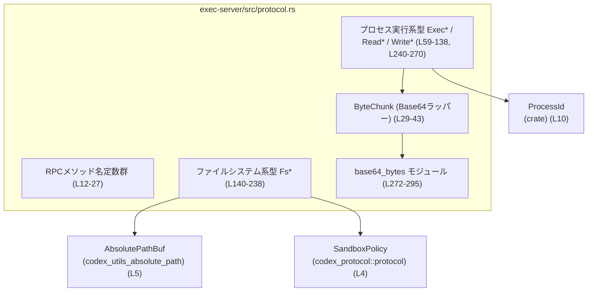
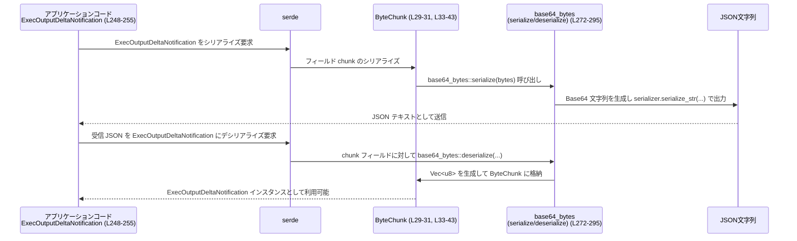

# exec-server/src/protocol.rs

## 0. ざっくり一言

このモジュールは、「リモートプロセス実行」と「リモートファイルシステム操作」のための **RPC プロトコル（メソッド名とメッセージ型）** を定義するファイルです。バイナリデータを JSON 経由で安全にやり取りするための `ByteChunk`（Base64 ラッパー）も含まれます。  
（根拠: 定数メソッド名定義 `INITIALIZE_METHOD` など `exec-server/src/protocol.rs:L12-27`、各種パラメータ構造体 `L45-212`）

---

## 1. このモジュールの役割

### 1.1 概要

- このモジュールは、exec-server が外部クライアントと通信する際の **リクエスト／レスポンス／通知メッセージの型** と、対応する **メソッド名文字列** を定義します。  
  （`ExecParams`, `ReadParams`, `FsReadFileParams` など: `L59-212`）
- バイナリデータは JSON そのままでは扱いにくいため、`ByteChunk` と内部モジュール `base64_bytes` を使って **Base64 文字列との変換** を行います。  
  （`ByteChunk` 定義と `#[serde(with = "base64_bytes")]`: `L29-31`, Base64 実装: `L272-295`）
- すべてのメッセージ型は `serde::Serialize` / `Deserialize` を derive しており、JSON-RPC のようなシリアライズ方式で使う前提になっています。  
  （各型の derive: `L29-31`, `L45-51`, `L59-70`, …, `L265-270`）

### 1.2 アーキテクチャ内での位置づけ

このファイル自身は純粋な「データ定義モジュール」であり、実際のプロセス起動やファイル操作のロジックは別モジュールに存在すると考えられます（このチャンクには登場しません）。ここから分かる依存関係は次のとおりです。

- 外部クレートへの依存:
  - `SandboxPolicy`（ファイル操作のサンドボックス方針）  
    `use codex_protocol::protocol::SandboxPolicy;`（`L4`）
  - `AbsolutePathBuf`（絶対パスのみを表現するパス型）  
    `use codex_utils_absolute_path::AbsolutePathBuf;`（`L5`）
- クレート内部型への依存:
  - `ProcessId`（論理的なプロセス ID）  
    `use crate::ProcessId;`（`L10`）

これを簡単な依存関係図で表すと、次のようになります。



### 1.3 設計上のポイント

コードから読み取れる設計上の特徴は次の通りです。

- **データ定義に特化**  
  - ロジックはほぼ `ByteChunk` と `base64_bytes` のみで、他はフィールドを持つ構造体・列挙体です。  
    （`ByteChunk` 実装: `L33-43`, `base64_bytes`: `L272-295`）
- **シリアライゼーション指向の設計**  
  - すべての公開メッセージ型が `Serialize` / `Deserialize` を derive。  
    （各 `#[derive(... Serialize, Deserialize)]`: `L29-31`, `L45-51`, …, `L265-270`）
  - `#[serde(rename_all = "camelCase")]` により、JSON のキー名が camelCase になります。  
    （例: `ExecParams`: `L59-61`）
  - `ByteChunk` は `#[serde(transparent)]` + `#[serde(with = "base64_bytes")]` で、内部の `Vec<u8>` を Base64 文字列としてシリアライズ／デシリアライズします。  
    （`L29-31`）
- **状態・エラー表現はフィールドで表現**  
  - プロセス終了や失敗情報は `ReadResponse` の `exited`, `exit_code`, `failure` フィールドなどで表現されます。  
    （`L95-104`）
  - 書き込みの状態は `WriteStatus` 列挙体で表現します。  
    （`L113-120`）
- **パスとサンドボックス**  
  - すべての FS 操作パラメータは `AbsolutePathBuf` を使い、`sandbox_policy: Option<SandboxPolicy>` を持ちます。  
    （`FsReadFileParams` ほか: `L140-145`, `L153-159`, `L165-171`, `L177-182`, `L193-198`, `L214-221`, `L227-234`）

---

## 2. 主要な機能一覧

このモジュールが提供する主な機能は次のとおりです。

- RPC メソッド名定数の提供:  
  プロセス実行 (`EXEC_METHOD` など) および FS 操作 (`FS_READ_FILE_METHOD` など) のメソッド名文字列。  
  （`L12-27`）
- バイト列の Base64 表現:  
  `ByteChunk` と `base64_bytes` モジュールにより、`Vec<u8>` と Base64 文字列の間を `serde` を通じて自動変換。  
  （`L29-43`, `L272-295`）
- プロセス実行プロトコルのメッセージ型:  
  - プロセス開始: `ExecParams` / `ExecResponse`（`L59-76`）  
  - 出力読み取り: `ReadParams` / `ReadResponse` / `ProcessOutputChunk`（`L78-104`）  
  - 入力書き込み: `WriteParams` / `WriteResponse` / `WriteStatus`（`L106-126`, `L113-120`）  
  - 終了要求: `TerminateParams` / `TerminateResponse`（`L128-138`）  
  - 通知: `ExecOutputDeltaNotification`, `ExecExitedNotification`, `ExecClosedNotification`（`L248-270`）
- ファイルシステム操作プロトコルのメッセージ型:  
  - 読み書き: `FsReadFileParams` / `FsReadFileResponse`,  
    `FsWriteFileParams` / `FsWriteFileResponse`（`L140-163`）  
  - ディレクトリ作成・列挙: `FsCreateDirectoryParams` / `FsCreateDirectoryResponse`,  
    `FsReadDirectoryParams` / `FsReadDirectoryResponse` / `FsReadDirectoryEntry`（`L165-175`, `L193-212`）  
  - メタデータ取得: `FsGetMetadataParams` / `FsGetMetadataResponse`（`L177-191`）  
  - 削除・コピー: `FsRemoveParams` / `FsRemoveResponse`,  
    `FsCopyParams` / `FsCopyResponse`（`L214-225`, `L227-238`）

---

## 3. 公開 API と詳細解説

### 3.1 コンポーネント（型・定数）一覧

#### 3.1.1 メソッド名定数

| 名前 | 種別 | 役割 / 用途 | 定義位置 |
|------|------|-------------|----------|
| `INITIALIZE_METHOD` | `pub const &str` | セッション初期化 RPC のメソッド名 `"initialize"` | `exec-server/src/protocol.rs:L12-12` |
| `INITIALIZED_METHOD` | `pub const &str` | 初期化完了通知のメソッド名 `"initialized"` | `L13-13` |
| `EXEC_METHOD` | `pub const &str` | プロセス開始 RPC のメソッド名 `"process/start"` | `L14-14` |
| `EXEC_READ_METHOD` | `pub const &str` | プロセス出力読み取りのメソッド名 `"process/read"` | `L15-15` |
| `EXEC_WRITE_METHOD` | `pub const &str` | プロセス標準入力書き込みのメソッド名 `"process/write"` | `L16-16` |
| `EXEC_TERMINATE_METHOD` | `pub const &str` | プロセス終了要求のメソッド名 `"process/terminate"` | `L17-17` |
| `EXEC_OUTPUT_DELTA_METHOD` | `pub const &str` | 出力差分通知のメソッド名 `"process/output"` | `L18-18` |
| `EXEC_EXITED_METHOD` | `pub const &str` | プロセス終了通知のメソッド名 `"process/exited"` | `L19-19` |
| `EXEC_CLOSED_METHOD` | `pub const &str` | プロセスクローズ通知のメソッド名 `"process/closed"` | `L20-20` |
| `FS_READ_FILE_METHOD` | `pub const &str` | ファイル読み取り RPC のメソッド名 `"fs/readFile"` | `L21-21` |
| `FS_WRITE_FILE_METHOD` | `pub const &str` | ファイル書き込み RPC のメソッド名 `"fs/writeFile"` | `L22-22` |
| `FS_CREATE_DIRECTORY_METHOD` | `pub const &str` | ディレクトリ作成 RPC のメソッド名 `"fs/createDirectory"` | `L23-23` |
| `FS_GET_METADATA_METHOD` | `pub const &str` | メタデータ取得 RPC のメソッド名 `"fs/getMetadata"` | `L24-24` |
| `FS_READ_DIRECTORY_METHOD` | `pub const &str` | ディレクトリ内容列挙 RPC のメソッド名 `"fs/readDirectory"` | `L25-25` |
| `FS_REMOVE_METHOD` | `pub const &str` | ファイル／ディレクトリ削除 RPC のメソッド名 `"fs/remove"` | `L26-26` |
| `FS_COPY_METHOD` | `pub const &str` | コピー RPC のメソッド名 `"fs/copy"` | `L27-27` |

#### 3.1.2 主要な型一覧（構造体・列挙体）

| 名前 | 種別 | 役割 / 用途 | 定義位置 |
|------|------|-------------|----------|
| `ByteChunk` | 構造体（透明ラッパー） | `Vec<u8>` を Base64 文字列としてシリアライズするためのラッパー | `L29-31` |
| `InitializeParams` | 構造体 | セッション初期化リクエストの入力（クライアント名と再開用セッション ID） | `L45-51` |
| `InitializeResponse` | 構造体 | 初期化レスポンス（新規 `session_id`） | `L53-57` |
| `ExecParams` | 構造体 | プロセス開始リクエストのパラメータ（`process_id`, `argv`, `cwd`, `env`, `tty`, `arg0`） | `L59-70` |
| `ExecResponse` | 構造体 | プロセス開始レスポンス（`process_id` のエコー） | `L72-76` |
| `ReadParams` | 構造体 | プロセス出力読み取りのパラメータ（シーケンス番号・最大バイト数・待ち時間） | `L78-85` |
| `ProcessOutputChunk` | 構造体 | 個々の出力チャンク（シーケンス番号・出力ストリーム種別・データ） | `L87-93` |
| `ReadResponse` | 構造体 | 出力読み取りレスポンス（チャンク列と次シーケンス、終了状態など） | `L95-104` |
| `WriteParams` | 構造体 | 標準入力への書き込みデータ | `L106-111` |
| `WriteStatus` | 列挙体 | 書き込みリクエストに対する状態（受理・未知プロセス・stdin クローズ・起動中） | `L113-120` |
| `WriteResponse` | 構造体 | 書き込みレスポンス（`WriteStatus`） | `L122-126` |
| `TerminateParams` | 構造体 | プロセス終了要求の対象 `process_id` | `L128-132` |
| `TerminateResponse` | 構造体 | 終了要求後にまだ `running` かどうか | `L134-138` |
| `FsReadFileParams` | 構造体 | ファイル読み取りパラメータ（絶対パス＋サンドボックス方針） | `L140-145` |
| `FsReadFileResponse` | 構造体 | ファイル内容の Base64 文字列 `data_base64` | `L147-151` |
| `FsWriteFileParams` | 構造体 | ファイル書き込みパラメータ（絶対パス＋ Base64 データ＋サンドボックス方針） | `L153-159` |
| `FsWriteFileResponse` | 構造体（空） | ファイル書き込みのレスポンス（成功時は空） | `L161-163` |
| `FsCreateDirectoryParams` | 構造体 | ディレクトリ作成パラメータ（絶対パス・再帰フラグ・サンドボックス方針） | `L165-171` |
| `FsCreateDirectoryResponse` | 構造体（空） | ディレクトリ作成レスポンス | `L173-175` |
| `FsGetMetadataParams` | 構造体 | メタデータ取得の対象パスとサンドボックス方針 | `L177-182` |
| `FsGetMetadataResponse` | 構造体 | ファイル種別と作成／更新時刻（ミリ秒） | `L184-191` |
| `FsReadDirectoryParams` | 構造体 | ディレクトリ列挙の対象パスとサンドボックス方針 | `L193-198` |
| `FsReadDirectoryEntry` | 構造体 | 1エントリのファイル名と種別フラグ | `L200-206` |
| `FsReadDirectoryResponse` | 構造体 | ディレクトリエントリの配列 | `L208-212` |
| `FsRemoveParams` | 構造体 | 削除対象パスと `recursive` / `force` / サンドボックス方針 | `L214-221` |
| `FsRemoveResponse` | 構造体（空） | 削除レスポンス | `L223-225` |
| `FsCopyParams` | 構造体 | コピー元／先パスと再帰フラグ・サンドボックス方針 | `L227-234` |
| `FsCopyResponse` | 構造体（空） | コピーレスポンス | `L236-238` |
| `ExecOutputStream` | 列挙体 | 出力ストリーム種別（`Stdout`, `Stderr`, `Pty`） | `L240-246` |
| `ExecOutputDeltaNotification` | 構造体 | 出力差分通知（`process_id`, `seq`, `stream`, `chunk`） | `L248-255` |
| `ExecExitedNotification` | 構造体 | プロセス終了通知（`exit_code` を含む） | `L257-263` |
| `ExecClosedNotification` | 構造体 | プロセスが完全にクローズされたことの通知 | `L265-270` |

### 3.2 関数詳細（4件）

このファイルには合計 4 つの関数が定義されています（メソッドを含む）。すべて純粋関数であり、`unsafe` は一切使用されていません（`L33-43`, `L279-294`）。

#### `ByteChunk::into_inner(self) -> Vec<u8>`

**概要**

`ByteChunk` に包まれた内部の `Vec<u8>` を取り出し、所有権を呼び出し元に移動して返します。  
（実装: `exec-server/src/protocol.rs:L33-37`）

**引数**

| 引数名 | 型 | 説明 |
|--------|----|------|
| `self` | `ByteChunk` | 取り出したいバイト列を保持するラッパー。メソッド呼び出し後は消費されます（所有権が移動）。 |

**戻り値**

- `Vec<u8>`: `ByteChunk` が保持していたバイト列本体です。

**内部処理の流れ**

1. 構造体の唯一のフィールド `self.0` をそのまま返します。  
   （`self.0`: `L35`）
2. 他の処理や検証は行いません。

**Examples（使用例）**

```rust
use crate::protocol::ByteChunk; // 実際のモジュールパスはプロジェクト構成に依存

fn consume_bytes(chunk: ByteChunk) {
    // ByteChunk から Vec<u8> の所有権を取り出す
    let bytes: Vec<u8> = chunk.into_inner(); // L33-37 に対応

    // bytes を任意の用途に使用できる（例: ファイル書き込みなど）
    println!("length = {}", bytes.len());
}
```

**Errors / Panics**

- エラーも panic も発生しません。単純なフィールド移動のみです。  
  （条件分岐や `unwrap` などが存在しない: `L33-37`）

**Edge cases（エッジケース）**

- 空の `Vec<u8>` を含む `ByteChunk` でも問題なく空ベクタを返します。  
  （ベクタ内容に関する分岐がないため）

**使用上の注意点**

- `self` を消費するため、`into_inner` を呼び出した後は同じ `ByteChunk` を再利用することはできません（Rust の所有権ルール）。  

#### `impl From<Vec<u8>> for ByteChunk::from(value: Vec<u8>) -> ByteChunk`

**概要**

`Vec<u8>` から `ByteChunk` を生成するための `From` 実装です。`ByteChunk` コンストラクタ的な役割を持ちます。  
（実装: `exec-server/src/protocol.rs:L39-43`）

**引数**

| 引数名 | 型 | 説明 |
|--------|----|------|
| `value` | `Vec<u8>` | `ByteChunk` に包みたいバイト列。所有権は `ByteChunk` に移動します。 |

**戻り値**

- `ByteChunk`: 引数のベクタを内部フィールドに格納したラッパー。

**内部処理の流れ**

1. `Self(value)` でフィールドにそのまま格納します。  
   （`Self(value)`: `L41`）

**Examples（使用例）**

```rust
use crate::protocol::ByteChunk;

fn make_chunk() -> ByteChunk {
    let data: Vec<u8> = vec![1, 2, 3]; // 元データ
    let chunk: ByteChunk = data.into(); // From<Vec<u8>> 実装を利用 (L39-43)
    chunk
}
```

**Errors / Panics**

- エラーも panic も発生しません。単純なラップのみです。

**Edge cases**

- 空の `Vec<u8>` もそのまま保持されます。
- 非 UTF-8 のデータも問題なく扱えます（`Vec<u8>` はバイト列としてのみ扱われるため）。

**使用上の注意点**

- この変換は `serde` には関与しません。シリアライズ時には `ByteChunk` に付与された `#[serde(with = "base64_bytes")]` が効きます。  
  （`L29-31`）

#### `base64_bytes::serialize<S>(bytes: &[u8], serializer: S) -> Result<S::Ok, S::Error>`

**概要**

`serde` のカスタムシリアライザとして、`&[u8]` を Base64 文字列にエンコードし、文字列としてシリアライズします。`ByteChunk` のシリアライズ時に利用されます。  
（実装: `exec-server/src/protocol.rs:L279-284`）

**引数**

| 引数名 | 型 | 説明 |
|--------|----|------|
| `bytes` | `&[u8]` | シリアライズ対象のバイト列スライス。 |
| `serializer` | `S`（`serde::Serializer` を実装） | 文字列を出力するためのシリアライザ。 |

**戻り値**

- `Result<S::Ok, S::Error>`:  
  - 成功時: `serializer.serialize_str(...)` の結果  
  - 失敗時: シリアライザ側のエラー

**内部処理の流れ**

1. `BASE64_STANDARD.encode(bytes)` でバイト列を Base64 文字列に変換します。  
   （`BASE64_STANDARD.encode(bytes)`: `L283`）
2. `serializer.serialize_str` でその文字列をシリアライズします。  
   （`serializer.serialize_str(...)`: `L283-284`）

**Examples（使用例）**

`ByteChunk` を JSON 文字列にシリアライズする流れの一部として利用されます。

```rust
use serde::Serialize;
use crate::protocol::ByteChunk;

#[derive(Serialize)]
struct Wrapper {
    chunk: ByteChunk, // ByteChunk は #[serde(with = "base64_bytes")] (L29-31)
}

fn to_json() -> serde_json::Result<String> {
    let data: Vec<u8> = vec![0, 1, 2, 3];
    let w = Wrapper { chunk: data.into() };
    serde_json::to_string(&w) // 内部で base64_bytes::serialize が呼ばれる
}
```

**Errors / Panics**

- `BASE64_STANDARD.encode` 自体は失敗しません（標準的な Base64 エンコードはエラー無し）。  
- `serializer.serialize_str` がエラーを返した場合、そのまま `Err(S::Error)` が返されます。  
  （`L283-284` に `?` や `unwrap` はなく、直接戻り値として返している）

**Edge cases**

- `bytes` が空のとき、空文字列ではなく Base64 の空表現 `""` がシリアライズされます。
- 非 UTF-8 データも Base64 化されるため、JSON 文字列として安全に表現できます。

**使用上の注意点**

- 非常に大きな `bytes` を渡すと、その長さに比例した Base64 文字列がメモリに生成されます。サイズ制限はこの関数単体では行っていません。  

#### `base64_bytes::deserialize<'de, D>(deserializer: D) -> Result<Vec<u8>, D::Error>`

**概要**

`serde` 用のカスタムデシリアライザとして、Base64 文字列を取り出し、それをデコードして `Vec<u8>` に変換します。`ByteChunk` のデシリアライズ時に利用されます。  
（実装: `exec-server/src/protocol.rs:L286-294`）

**引数**

| 引数名 | 型 | 説明 |
|--------|----|------|
| `deserializer` | `D`（`serde::Deserializer<'de>` を実装） | Base64 文字列を取り出すためのデシリアライザ。 |

**戻り値**

- `Result<Vec<u8>, D::Error>`:  
  - 成功時: Base64 デコードされた `Vec<u8>`  
  - 失敗時: `serde::de::Error::custom` でラップされたデコードエラー

**内部処理の流れ**

1. `String::deserialize(deserializer)?` で、まず入力を `String` としてデシリアライズします。  
   （`L290`）
2. `BASE64_STANDARD.decode(encoded)` により、Base64 文字列を `Vec<u8>` へデコードします。  
   （`L291-293`）
3. デコードに失敗した場合、`serde::de::Error::custom` で `D::Error` に変換して返します。  
   （`.map_err(serde::de::Error::custom)`: `L291-293`）

**Examples（使用例）**

```rust
use serde::Deserialize;
use crate::protocol::ByteChunk;

#[derive(Deserialize)]
struct Wrapper {
    chunk: ByteChunk, // Base64 文字列から Vec<u8> へデコード (L29-31, L286-294)
}

fn from_json(s: &str) -> serde_json::Result<Wrapper> {
    serde_json::from_str(s) // 内部で base64_bytes::deserialize が呼ばれる
}
```

**Errors / Panics**

- 入力が文字列でない場合（JSON 側で数値やオブジェクトになっているなど）、`String::deserialize` の段階で `Err(D::Error)` になります。  
  （`L290`）
- 入力文字列が Base64 として無効な場合、`BASE64_STANDARD.decode` がエラーとなり、`serde::de::Error::custom` で包んだ `Err(D::Error)` を返します。  
  （`L291-293`）
- panic を引き起こすコードはありません（`unwrap` などが無い）。

**Edge cases**

- 空文字列 `""` は長さ 0 の `Vec<u8>` として解釈されます（`base64` クレートの標準挙動）。この点は Rust 言語仕様ではなく `base64` クレート仕様ですが、通常の Base64 実装と整合的です。
- 非 Base64 文字（空白など）が混入するとデシリアライズ時点でエラーになります。

**使用上の注意点**

- 入力が外部から来る場合（ネットワーク越しなど）、この関数単体ではサイズ上限を設けていないため、非常に長い Base64 文字列はメモリ消費が大きくなります。上位レイヤでサイズ制限を行う必要があるかどうかは、このチャンクからは分かりません。  

### 3.3 その他の関数

- 上記 4 つ以外の関数は、このファイルには定義されていません。  
  （`exec-server/src/protocol.rs:L33-43`, `L279-294` 以外に `fn` が存在しないことから確認可能）

---

## 4. データフロー

このファイル内で明確に読み取れる代表的なデータフローは、**プロセス出力バイト列が JSON を介して送受信される流れ** です。`ByteChunk` と `base64_bytes` を中心にしたシリアライズ経路を図示します。

### プロセス出力通知のシリアライズ／デシリアライズ

- `ExecOutputDeltaNotification` は `chunk: ByteChunk` を含みます（`L248-255`）。
- `ByteChunk` は `#[serde(with = "base64_bytes")]` を持つため、シリアライズ時に `base64_bytes::serialize`、デシリアライズ時に `base64_bytes::deserialize` が自動的に呼ばれます。  
  （`L29-31`, `L272-295`）



この図は、**バイト列が JSON 上では Base64 文字列として表現される** こと、そしてその変換が `serde` と `base64_bytes` によって自動的に行われることを示しています。

> このチャンクには、実際に JSON を送受信する通信層やハンドラー関数は登場しないため、それらとの具体的な呼び出し関係は「不明」です。

---

## 5. 使い方（How to Use）

### 5.1 基本的な使用方法

ここでは、プロセスを開始し、出力を読み取るリクエスト／レスポンスを構築する典型的なイメージを示します。実際の送信処理（ソケットや JSON-RPC ライブラリ）は、このチャンクには含まれていません。

#### プロセス開始リクエストの構築例

```rust
use std::collections::HashMap;
use std::path::PathBuf;
use serde_json::json;

use crate::protocol::{
    EXEC_METHOD,              // "process/start" (L14)
    ExecParams, ExecResponse, // (L59-76)
};
use crate::ProcessId;         // (L10)

// プロセス開始リクエストを JSON オブジェクトとして構築する例
fn build_exec_request() -> serde_json::Value {
    let process_id = ProcessId::new(); // 実際のコンストラクタはこのチャンクには登場しないため不明
    let params = ExecParams {
        process_id,                    // クライアントが決める論理的 ID (L62-64)
        argv: vec!["bash".into(), "-c".into(), "echo hello".into()],
        cwd: PathBuf::from("/workspace"),
        env: HashMap::new(),
        tty: false,
        arg0: None,
    };

    json!({
        "jsonrpc": "2.0",
        "id": 1,
        "method": EXEC_METHOD,
        "params": params,             // serde::Serialize により camelCase でシリアライズ (L59-61)
    })
}
```

### 5.2 よくある使用パターン

#### パターン1: 出力のポーリング読み取り

`ReadParams` と `ReadResponse` を組み合わせ、`after_seq` と `next_seq` を利用した **追尾読み取り** を構成できます。  
（フィールド: `L78-85`, `L95-104`）

```rust
use crate::protocol::{ReadParams, ReadResponse};
use crate::ProcessId;

fn make_read_params(pid: ProcessId, after_seq: u64) -> ReadParams {
    ReadParams {
        process_id: pid,
        after_seq: Some(after_seq),
        max_bytes: Some(4096),
        wait_ms: Some(1000), // サーバ側で 1 秒程度ブロックしてから応答させる用途など
    }
}

// ReadResponse の各フィールドを見て状態を判断する
fn handle_read_response(res: ReadResponse) {
    for chunk in res.chunks {
        // chunk.stream (Stdout/Stderr/Pty; L240-246)
        // chunk.chunk (ByteChunk; L87-93)
    }

    if res.exited {
        // exit_code や failure で終了理由を判断 (L97-104)
    }
}
```

#### パターン2: ファイル読み書き

`FsReadFileParams` / `FsReadFileResponse` では、Base64 文字列を直接扱います（`ByteChunk` は使用していません）。  
（`L140-151`, `L153-159`）

```rust
use crate::protocol::{FsReadFileParams, FsReadFileResponse, FsWriteFileParams};
use codex_utils_absolute_path::AbsolutePathBuf;
use codex_protocol::protocol::SandboxPolicy;

fn read_file_params(path: AbsolutePathBuf) -> FsReadFileParams {
    FsReadFileParams {
        path,
        sandbox_policy: None, // サンドボックス方針を使うかはこのチャンクからは不明
    }
}

fn write_file_params(path: AbsolutePathBuf, data_base64: String) -> FsWriteFileParams {
    FsWriteFileParams {
        path,
        data_base64,
        sandbox_policy: None,
    }
}

// FsReadFileResponse.data_base64 を Base64 としてデコードするのは利用側の責務 (L147-151)
fn decode_file_contents(res: FsReadFileResponse) -> Vec<u8> {
    base64::decode(&res.data_base64).expect("invalid base64 data")
}
```

### 5.3 よくある間違い（起こり得る誤用）

このチャンクの情報から推測できる、典型的な誤用と正しい利用の例です。

#### 誤用1: `process_id` の扱い

コメントによると、`process_id` は「クライアントが選ぶ論理的ハンドル」であり、OS の PID ではありません。  
（コメント: `L62-64`）

```rust
// 誤り例: OS の PID をそのまま process_id として使う（コメント上は意図されていない）
let pid = get_os_pid_somehow();
let params = ExecParams {
    process_id: ProcessId::from(pid), // ProcessId の実際の API は本チャンクには登場しない
    // ...
};

// 正しい例（コメントの意図に沿う）: クライアント側で一意な論理IDを管理
let logical_id = generate_logical_id();
let params = ExecParams {
    process_id: logical_id,
    // ...
};
```

#### 誤用2: `ByteChunk` と `data_base64` の混同

- `ByteChunk` は `Vec<u8>` を保持し、`serde` によって Base64 変換されます（`L29-31`）。
- 一方 `FsReadFileResponse.data_base64` や `FsWriteFileParams.data_base64` は、既に Base64 文字列として扱われるフィールドです（`L147-151`, `L153-159`）。

```rust
// 誤り例: すでに Base64 な文字列を ByteChunk に包んで二重エンコードしてしまう
let base64_str = "SGVsbG8="; // "Hello"
let chunk = ByteChunk::from(base64_str.as_bytes().to_vec());
// → シリアライズ時にさらに Base64 化される

// 正しい例: 生のバイト列を ByteChunk に包む
let raw_bytes = b"Hello".to_vec();
let chunk = ByteChunk::from(raw_bytes);
```

### 5.4 使用上の注意点（まとめ）

**安全性・エラー・並行性の観点から、このモジュールに関するポイントを整理します。**

- **メモリ・サイズ制御**
  - `ByteChunk` や `data_base64` は、入力サイズに対する制限を持ちません。このファイルだけでは、上位層でどのような制限があるかは「不明」です。
- **Base64 デコードエラー**
  - `base64_bytes::deserialize` は無効な Base64 文字列に対して `Deserialize` エラーを返します（`L286-294`）。  
    その結果、`ByteChunk` を含むメッセージ全体のデシリアライズが失敗します。
- **ファイルパスとサンドボックス**
  - FS 系パラメータは `AbsolutePathBuf` + `sandbox_policy` を受け取りますが、どのようなサンドボックス検証が行われるかは他モジュール依存であり、このチャンクには現れません。
- **並行性**
  - このファイルにはスレッドや async/await といった並行処理のコードは登場しません。  
  - ただし、ほとんどの型は `Clone` と `Eq` を実装しているため、スレッド間でコピーして使うパターンは構造上可能です（実際に `Send` / `Sync` として使用されているかどうかは、このチャンクからは不明です）。
- **プロトコル互換性**
  - すべての型が `#[serde(rename_all = "camelCase")]` かつフィールド名がそのまま JSON キーになります。フィールド追加／削除はクライアント／サーバ全体の互換性に影響するため、変更時は注意が必要です。  

---

## 6. 変更の仕方（How to Modify）

### 6.1 新しい機能を追加する場合

例えば、新しい RPC メソッド `process/signal` を追加したい場合の手順イメージです。

1. **メソッド名定数の追加**  
   - `pub const EXEC_SIGNAL_METHOD: &str = "process/signal";` のような定数を追加します。  
     （既存の定数群: `L12-27`）
2. **パラメータ・レスポンス型の追加**
   - 既存のパターンに倣って構造体を定義します。
   - `#[derive(Debug, Clone, PartialEq, Eq, Serialize, Deserialize)]` と `#[serde(rename_all = "camelCase")]` を付与し、他の型とスタイルを揃えます。  
     （例: `ExecParams`: `L59-61`）
3. **Binary データを扱う場合の検討**
   - シグナル番号などの小さい値なら単純な整数フィールドで十分です。
   - バイナリペイロードを含めたい場合は、`ByteChunk` をフィールドに利用することで Base64 変換を再利用できます。  
     （`ByteChunk` 定義: `L29-31`）
4. **ハンドラー側の実装**
   - 実際の処理は別ファイルに追加する必要がありますが、そのファイルはこのチャンクには登場しないため具体的な場所は「不明」です。

### 6.2 既存の機能を変更する場合

- **フィールド追加**
  - 新しく Optional なフィールドを追加する場合は、`Option<T>` にして `#[serde(default)]` を付けると後方互換性を維持しやすくなります。  
    このファイルには `#[serde(default)]` が `InitializeParams.resume_session_id` のみに付与されています（`L49-50`）。
- **フィールド名変更**
  - `#[serde(rename_all = "camelCase")]` を利用しているため、フィールド名変更は JSON のキー名変更に直結し、プロトコル互換性を失います。旧名を残したまま新フィールドを追加するパターンなどを検討する必要がありますが、具体的な戦略はこのチャンクからは「不明」です。
- **メソッド名定数の変更**
  - `EXEC_METHOD` などの定数文字列を変更すると、クライアント側も同時に変更が必要です。  
  - 互換性を保つには、旧メソッド名を残した別ハンドラーを用意するなどの設計が考えられますが、その実装は別モジュールになります。

---

## 7. 関連ファイル

このモジュールと関連が深いと思われる型やモジュールは、`use` 宣言から次のように読み取れます。

| パス / 型 | 役割 / 関係 |
|----------|------------|
| `crate::ProcessId` | プロセス関連メッセージが利用する論理的プロセス ID 型。実装はこのチャンクには現れません（`L10`, `L62-65`, `L70`, `L95`, `L109`, `L128`, `L248`, `L257`, `L265`）。 |
| `codex_protocol::protocol::SandboxPolicy` | FS 操作で利用されるサンドボックス方針を表す型。具体的な内容はこのチャンクには現れません（`L4`, `L140-145`, `L153-159`, `L165-171`, `L177-182`, `L193-198`, `L214-221`, `L227-234`）。 |
| `codex_utils_absolute_path::AbsolutePathBuf` | 必ず絶対パスであることを保証するパス表現。FS 系パラメータで使用（`L5`, `L140-145`, `L153-159`, `L165-171`, `L177-182`, `L193-198`, `L214-221`, `L227-234`）。 |
| 通信層・サーバ実装ファイル | JSON-RPC リクエストを受信し、ここで定義された型にデシリアライズして処理する層が存在するはずですが、このチャンクにはパスやコードは登場せず、「不明」です。 |
| テストコード | このファイルとは別にテストファイルが存在する可能性がありますが、このチャンクには一切含まれていません。 |

---

### Bugs / Security / Contracts / Edge Cases についての補足

- **Bugs（バグになり得る点）**
  - このファイル内には `unwrap` や `unsafe` は無く、明確なバグ要因は見当たりません。
  - ただし Base64 文字列の扱いを誤り（例: `Fs*` 系の `data_base64` に `ByteChunk` をそのまま渡してしまうなど）、二重エンコード・二重デコードを行うと、上位ロジックでバグを生む可能性があります。
- **Security（セキュリティ）**
  - Path traversal やサンドボックス違反への対策は、`SandboxPolicy` やファイル操作ロジック側の責務であり、このチャンク単体からは分かりません。
  - Base64 デコードは `base64` クレートに委譲しており、この関数自体に明示的な安全性問題は見当たりません（`L291-293`）。
- **Contracts / Edge Cases**
  - `ReadResponse.failure: Option<String>` により、失敗時のメッセージが入る契約がありますが、どんな文字列が入るかは「不明」です（`L95-104`）。
  - タイムスタンプ `created_at_ms` / `modified_at_ms` は `i64` でミリ秒表現です（エポック基準などの詳細はこのチャンクには記述がありません: `L186-191`）。
- **Tests**
  - このファイル内にはテスト関数や `#[cfg(test)]` モジュールは存在しません。テストは別ファイルに定義されているか、まだ存在しない可能性があります（このチャンクからは判別不能）。

このレポートは、あくまで `exec-server/src/protocol.rs` 内に現れる情報のみを根拠に記述しています。それ以外の挙動や設計意図については「不明」としています。
