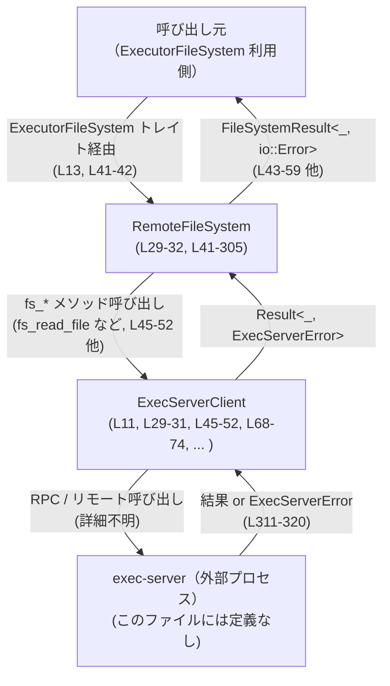
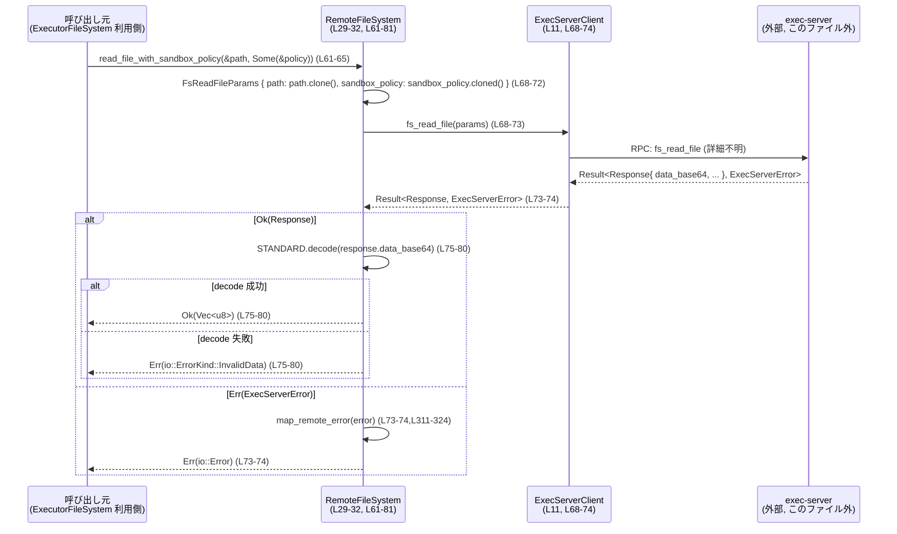

# exec-server/src/remote_file_system.rs

## 0. ざっくり一言

`ExecServerClient` を使ってリモートの実行サーバーにファイルシステム操作を委譲し、`ExecutorFileSystem` トレイトを満たす非同期ファイルシステム実装を提供するモジュールです（`exec-server/src/remote_file_system.rs:L11,L13,L29-32,L41-42`）。  
ファイルの読み書きやディレクトリ操作結果のエラーは、`ExecServerError` から `std::io::Error` に変換されて呼び出し元に返されます（`L12,L311-324`）。

---

## 1. このモジュールの役割

### 1.1 概要

- このモジュールは、**「exec-server」側で実行されるファイル操作 API** を `ExecServerClient` 経由で呼び出し、ローカルからは通常のファイルシステムインターフェース（`ExecutorFileSystem`）として扱えるようにするアダプタです（`L11,L13,L29-32,L41-42`）。
- ファイル読み書き、ディレクトリ作成・削除、コピー、メタデータ取得といった操作を非同期メソッドとして提供し、それぞれに sandbox ポリシーあり/なしの変種を用意しています（`L43-305`）。
- すべてのメソッドは `FileSystemResult<T>` を返し、内部で `ExecServerError` を `io::Error` にマップすることで、標準的な I/O エラーとして扱えるようにしています（`L15,L311-324`）。

### 1.2 アーキテクチャ内での位置づけ

このモジュールはおおまかに次のコンポーネントを仲介します。

- 呼び出し元（上位レイヤ。例えば「実行エンジン」）: `ExecutorFileSystem` トレイトに依存（`L13,L41-42`）
- `RemoteFileSystem`: `ExecutorFileSystem` の実装として、各操作を `ExecServerClient` に委譲（`L29-32,L41-305`）
- `ExecServerClient`: 実際にリモートの exec-server に対して `fs_read_file` などの RPC を行うクライアント（`L11,L45-52,L68-74,L85-92` など）
- exec-server 側の実装: このファイルには現れませんが、`ExecServerError::Server { code, message, .. }` という形でエラーを返すことが読み取れます（`L12,L311-320`）

Mermaid 図（このファイルの範囲のみを反映）:



### 1.3 設計上のポイント

コードから読み取れる設計上の特徴は次の通りです。

- **薄いアダプタ構造**
  - `RemoteFileSystem` は単に `ExecServerClient` を 1 フィールドとして持つだけの構造体で、独自の状態を持ちません（`L29-32`）。
  - 各メソッドは `path` やオプションを `Fs*Params` 型に詰めて `ExecServerClient` の `fs_*` メソッドにそのまま委譲する構造です（例: `read_file` での `fs_read_file` 呼び出し `L45-52`）。

- **非同期 API と async_trait**
  - `ExecutorFileSystem` トレイトの実装は `#[async_trait]` を使っており（`L41-42`）、すべての操作が `async fn` として実装されています（`L43-305`）。
  - メソッドはすべて `&self` を取り、内部状態を変更していないため、このファイルの範囲では「ステートレスな非同期ラッパー」として振る舞います（`L43,L61,L83,L96,L114, ...`）。

- **Base64 を用いたファイル内容のシリアライズ**
  - 読み取り側では、サーバーから `data_base64` という Base64 文字列を受け取り（`L53`）、`STANDARD.decode` で `Vec<u8>` に復号しています（`L53-58`）。
  - 書き込み側では、送信する `contents: Vec<u8>` を `STANDARD.encode(contents)` で Base64 文字列に変換して送っています（`L85-89,L105-107`）。

- **sandbox_policy の有無を明示的に分けた API**
  - すべての操作について「デフォルトの sandbox 設定を使う版」と「明示的に `SandboxPolicy` を渡す版」を分けて実装しており、後者では `Option<&SandboxPolicy>` を `.cloned()` して `Option<SandboxPolicy>` として送信しています（`L61-72,L96-107,L131-142,L167-178,L213-224,L252-265,L290-303`）。
  - sandbox なし版では常に `sandbox_policy: None` を送っています（例: `read_file` の `sandbox_policy: None` `L48-50`）。

- **エラーハンドリングの方針**
  - ネットワーク／サーバー側のエラーは `ExecServerError` として返され、それを `map_remote_error` で `io::Error` にマッピングします（`L52,L74,L91,L110,L126,L145,L158,L180,L201,L226,L247,L267,L285,L305,L311-324`）。
  - JSON-RPC 風のエラーコード `-32004` と `-32600` を特別扱いして `NotFound` と `InvalidInput` にマップし、それ以外は `io::Error::other` で一般的な I/O エラーとして扱っています（`L26-27,L313-320,L323-324`）。

---

## 2. 主要な機能一覧

このモジュールが提供する主要なファイルシステム機能（`ExecutorFileSystem` 実装）は次の通りです（`L41-305`）。

- ファイル読み取り: `read_file` / `read_file_with_sandbox_policy` – Base64 エンコードされたデータを受信して `Vec<u8>` に復号（`L43-59,L61-81`）
- ファイル書き込み: `write_file` / `write_file_with_sandbox_policy` – `Vec<u8>` を Base64 文字列にエンコードして送信（`L83-112`）
- ディレクトリ作成: `create_directory` / `create_directory_with_sandbox_policy` – 再帰フラグ付きでディレクトリ作成をリクエスト（`L114-147`）
- メタデータ取得: `get_metadata` / `get_metadata_with_sandbox_policy` – サーバーのレスポンスを `FileMetadata` にマッピング（`L149-187`）
- ディレクトリ読み取り: `read_directory` / `read_directory_with_sandbox_policy` – サーバーのエントリ列を `ReadDirectoryEntry` ベクタに変換（`L189-236`）
- ファイル・ディレクトリ削除: `remove` / `remove_with_sandbox_policy` – 再帰・強制削除フラグ付きで削除をリクエスト（`L238-269`）
- コピー: `copy` / `copy_with_sandbox_policy` – 再帰コピーをリクエスト（`L271-305`）
- エラー変換ユーティリティ: `map_remote_error` – `ExecServerError` から `io::Error` への一元的変換（`L311-324`）
- コンストラクタ: `RemoteFileSystem::new` – `ExecServerClient` を受け取って `RemoteFileSystem` を生成（`L34-38`）

---

## 3. 公開 API と詳細解説

### 3.1 型一覧（構造体・列挙体など）

このファイルに現れる主な型のインベントリです。

| 名前 | 種別 | 役割 / 用途 | 根拠 |
|------|------|-------------|------|
| `RemoteFileSystem` | 構造体 | `ExecServerClient` を 1 フィールドとして保持し、`ExecutorFileSystem` トレイトを実装するリモートファイルシステム実装 | 構造体定義（`L29-32`）、トレイト実装（`L41-305`） |
| `ExecutorFileSystem` | トレイト（外部定義） | ファイル読み書きやディレクトリ操作などの抽象インターフェース。このファイルでは `RemoteFileSystem` が実装している | `use crate::ExecutorFileSystem;`（`L13`）、`impl ExecutorFileSystem for RemoteFileSystem`（`L41-42`） |
| `ExecServerClient` | 構造体（外部定義） | `fs_read_file` などの `fs_*` メソッドを提供し、実際のリモート呼び出しを行うクライアント | `use crate::ExecServerClient;`（`L11`）、`RemoteFileSystem { client: ExecServerClient }`（`L29-32`）、`self.client.fs_read_file(...)` など（`L45-52,L68-74,L85-92` 他） |
| `ExecServerError` | 列挙体（外部定義） | `ExecServerClient` のエラー型。`map_remote_error` で `io::Error` に変換される | `use crate::ExecServerError;`（`L12`）、`fn map_remote_error(error: ExecServerError)`（`L311-324`） |
| `FileSystemResult<T>` | 型エイリアス（外部定義） | このファイルのすべての API の戻り値。内部で `io::Error` を用いていることが `map_err(map_remote_error)` から推測できる | `use crate::FileSystemResult;`（`L15`）、`map_err(map_remote_error)` で `io::Error` をエラー型としている（`L52,L74,L91,...,L305`） |
| `FileMetadata` | 構造体（外部定義） | `get_metadata*` が返すメタデータ。ディレクトリ/ファイル判定と作成・更新時刻を保持 | `use crate::FileMetadata;`（`L14`）、`FileMetadata { is_directory: response.is_directory, ... }`（`L159-164,L181-186`） |
| `ReadDirectoryEntry` | 構造体（外部定義） | `read_directory*` の各エントリ。ファイル名とディレクトリ/ファイルフラグを保持 | `use crate::ReadDirectoryEntry;`（`L16`）、`ReadDirectoryEntry { file_name: entry.file_name, ... }`（`L205-209,L230-234`） |
| `CopyOptions` | 構造体（外部定義） | コピー操作のオプション。少なくとも `recursive` フィールドを持つ | `use crate::CopyOptions;`（`L9`）、`options.recursive` の使用（`L275-283,L293-303`） |
| `CreateDirectoryOptions` | 構造体（外部定義） | ディレクトリ作成のオプション。少なくとも `recursive` フィールドを持つ | `use crate::CreateDirectoryOptions;`（`L10`）、`options.recursive`・`create_directory_options.recursive` の使用（`L117-124,L134-142`） |
| `RemoveOptions` | 構造体（外部定義） | 削除操作のオプション。少なくとも `recursive` と `force` フィールドを持つ | `use crate::RemoveOptions;`（`L17`）、`options.recursive` と `options.force` の使用（`L238-245,L255-263`） |
| `SandboxPolicy` | 構造体/列挙体など（外部定義） | sandbox のポリシー。`Option<&SandboxPolicy>` として受け取り、リクエストに埋め込まれる | `use codex_protocol::protocol::SandboxPolicy;`（`L4`）、`sandbox_policy: Option<&SandboxPolicy>` 引数（`L64,L100,L135,L170,L216,L256,L295`） |
| `Fs*Params` 群 | 構造体（外部定義） | 各 RPC 呼び出しのパラメータ。パス、sandbox ポリシー、オプションフラグなどを含む | `use crate::protocol::FsReadFileParams;` 等（`L18-24`）、対応するメソッド内での初期化（例: `FsReadFileParams { path: path.clone(), sandbox_policy: None }` `L47-50`） |

> ※ `ExecServerClient` や各種 `*Options` / `Fs*Params` 型の詳細なフィールドは、このファイル内には現れません。

---

### 3.2 関数詳細（7 件）

ここでは代表的な操作と、エラーハンドリングの要となる関数を選んで詳しく説明します。

#### `RemoteFileSystem::read_file(&self, path: &AbsolutePathBuf) -> FileSystemResult<Vec<u8>>`（`L43-59`）

**概要**

- リモートファイルシステム上の `path` にあるファイルを読み込み、その内容をバイナリ列 (`Vec<u8>`) として返します（`L43`）。
- 内部的には `ExecServerClient::fs_read_file` を呼び出し、そのレスポンスの `data_base64` フィールドを Base64 デコードして返しています（`L45-53`）。

**引数**

| 引数名 | 型 | 説明 | 根拠 |
|--------|----|------|------|
| `self` | `&RemoteFileSystem` | このリモートファイルシステムインスタンスへの参照。内部の `ExecServerClient` を使用する | メソッドシグネチャ（`L43`）、構造体定義（`L29-32`） |
| `path` | `&AbsolutePathBuf` | 読み取るファイルの絶対パス | シグネチャ（`L43`）、`FsReadFileParams { path: path.clone(), ... }`（`L47-49`） |

**戻り値**

- `FileSystemResult<Vec<u8>>` – 正常時はファイル内容のバイト列を返し、エラー時は `io::Error` を含む Err を返します。
  - `map_err(map_remote_error)` が `ExecServerError` を `io::Error` に変換していることから、`FileSystemResult` のエラー型は `io::Error` 互換であると分かります（`L52,L311-324`）。

**内部処理の流れ（アルゴリズム）**

1. トレースログ `"remote fs read_file"` を出力します（`trace!` マクロ、`L44`）。
2. `FsReadFileParams { path: path.clone(), sandbox_policy: None }` を構築し、`self.client.fs_read_file` を非同期で呼び出します（`L45-50`）。
3. `await` の結果として `Result<_, ExecServerError>` が返る前提で、`map_err(map_remote_error)?` を適用し、`ExecServerError` を `io::Error` に変換しつつ `?` で早期 return します（`L51-52,L311-324`）。
4. 成功時のレスポンスから `response.data_base64` を取り出し、`STANDARD.decode` で `Vec<u8>` にデコードします（`L53`）。
5. Base64 デコードに失敗した場合は `io::ErrorKind::InvalidData` の `io::Error` を生成して Err として返します（`L53-58`）。
6. デコードに成功した `Vec<u8>` を `Ok` でラップして返します（`L53-58`）。

**Examples（使用例）**

以下は、`ExecServerClient` と `AbsolutePathBuf` がすでに用意されていると仮定した最小例です。

```rust
use exec_server::RemoteFileSystem;                  // このファイルで定義されている構造体
use exec_server::ExecServerClient;                  // 外部定義（L11）
use codex_utils_absolute_path::AbsolutePathBuf;     // 外部定義（L5）

async fn example_read_file(
    client: ExecServerClient,
    path: AbsolutePathBuf,
) -> Result<Vec<u8>, std::io::Error> {
    // RemoteFileSystem を生成する（L34-38）
    let fs = RemoteFileSystem::new(client);         // コンストラクタ（L35-38）

    // ファイルを読み込む（L43-59）
    let data = fs.read_file(&path).await?;          // FileSystemResult<Vec<u8>> を ? で展開
    Ok(data)
}
```

このコードでは、`RemoteFileSystem::new` と `read_file` 以外の API は使用していません（`L34-38,L43-59`）。

**Errors / Panics**

- **リモート側エラー**
  - `ExecServerClient::fs_read_file` が `Err(ExecServerError)` を返した場合、`map_remote_error` で以下のようにマッピングされます（`L51-52,L311-324`）。
    - `ExecServerError::Server { code: NOT_FOUND_ERROR_CODE (-32004), message }`  
      → `io::ErrorKind::NotFound` の `io::Error`（`L26-27,L313-315`）
    - `ExecServerError::Server { code: INVALID_REQUEST_ERROR_CODE (-32600), message }`  
      → `io::ErrorKind::InvalidInput` の `io::Error`（`L26,L316-318`）
    - その他の `ExecServerError::Server { .. }`  
      → `io::Error::other(message)`（`L319-320`）
    - `ExecServerError::Closed`  
      → `io::ErrorKind::BrokenPipe` とメッセージ `"exec-server transport closed"`（`L321-322`）
    - その他のバリアント  
      → `io::Error::other(error.to_string())`（`L323-324`）
- **Base64 デコードエラー**
  - `response.data_base64` が不正な Base64 だった場合、`STANDARD.decode` がエラーを返し、それを `io::ErrorKind::InvalidData` の `io::Error` に変換します（`L53-58`）。
  - この場合のメッセージは `"remote fs/readFile returned invalid base64 dataBase64: {err}"` です（`L56`）。
- **Panics**
  - この関数内に `unwrap`/`expect` や明示的な `panic!` 呼び出しは存在せず、直接的なパニック要因はありません（`L43-59`）。

**Edge cases（エッジケース）**

- 対象ファイルが存在しない  
  - サーバーが `NOT_FOUND_ERROR_CODE (-32004)` で `ExecServerError::Server` を返す設計であれば、呼び出し側には `io::ErrorKind::NotFound` が返ります（`L26-27,L313-315`）。
- 無効なパスやリクエストフォーマット  
  - サーバーが `INVALID_REQUEST_ERROR_CODE (-32600)` を返した場合、`io::ErrorKind::InvalidInput` として扱われます（`L26,L316-318`）。
- サーバー側の異常終了や接続断  
  - `ExecServerError::Closed` → `BrokenPipe` として返るため、「接続が閉じられた」ことを区別できます（`L321-322`）。
- サーバーが不正な Base64 を返す  
  - `io::ErrorKind::InvalidData` として扱われます（`L53-58`）。

**使用上の注意点**

- この関数は I/O とネットワーク（もしくは別プロセスとの通信）に依存していると考えられるため、呼び出しごとに失敗しうることを前提に `io::Error` をハンドリングする必要があります（`ExecServerClient` の役割名と `ExecServerError` の存在からの推測、`L11-12,L311-324`）。
- 返り値は生の `Vec<u8>` であり、テキストファイルなどではエンコーディングに注意する必要があります（このファイルではエンコーディング変換は行っていません、`L53-58`）。
- 所有権的には `path` は参照で受け取り、`clone` して送信しているため（`L47-49`）、呼び出し元の `AbsolutePathBuf` の所有権は維持されます。

---

#### `RemoteFileSystem::write_file(&self, path: &AbsolutePathBuf, contents: Vec<u8>) -> FileSystemResult<()>`（`L83-94`）

**概要**

- バイト列 `contents` を Base64 エンコードし、リモートファイルシステム上の `path` に書き込みます（`L83-89`）。
- sandbox ポリシーなし版であり、サーバーのデフォルト sandbox 設定に従う挙動になります（`sandbox_policy: None`、`L88-90`）。

**引数**

| 引数名 | 型 | 説明 | 根拠 |
|--------|----|------|------|
| `self` | `&RemoteFileSystem` | リモートファイルシステムインスタンス | シグネチャ（`L83`） |
| `path` | `&AbsolutePathBuf` | 書き込み先ファイルの絶対パス | `FsWriteFileParams { path: path.clone(), ... }`（`L86-88`） |
| `contents` | `Vec<u8>` | 書き込むファイル内容のバイト列。所有権はこの関数に移動する | シグネチャ（`L83`）、`STANDARD.encode(contents)`（`L88`） |

**戻り値**

- `FileSystemResult<()>` – 成功時は `Ok(())`、失敗時は `io::Error` を含む Err を返します（`L83-94`）。

**内部処理の流れ**

1. トレースログ `"remote fs write_file"` を出力（`L84`）。
2. `FsWriteFileParams` を構築し、その中で `contents` を `STANDARD.encode(contents)` で Base64 文字列に変換（`L85-89`）。
3. `sandbox_policy: None` を指定して `self.client.fs_write_file` を `await`（`L85-91`）。
4. `map_err(map_remote_error)?` で `ExecServerError` を `io::Error` に変換して伝播（`L91,L311-324`）。
5. 成功時は `Ok(())` を返却（`L93-94`）。

**Examples（使用例）**

```rust
async fn example_write_file(
    client: ExecServerClient,
    path: AbsolutePathBuf,
) -> Result<(), std::io::Error> {
    let fs = RemoteFileSystem::new(client);                 // L34-38

    // UTF-8 文字列をバイト列にして書き込む（L83-94）
    let contents = b"hello, world".to_vec();
    fs.write_file(&path, contents).await?;                  // FileSystemResult<()> を ? で展開

    Ok(())
}
```

**Errors / Panics**

- リモート側エラーのマッピングは `read_file` と同じく `map_remote_error` に委譲されています（`L91,L311-324`）。
- Base64 エンコードはエラーを返さない API として使われており、この関数内でのエンコード失敗の取り扱いはありません（`STANDARD.encode(contents)` の戻り値が直接 `FsWriteFileParams` に渡されていることから、`Result` ではないと判断できます、`L88`）。
- 明示的なパニックはありません（`L83-94`）。

**Edge cases**

- 書き込み先ディレクトリが存在しない / アクセス権がない場合など、サーバー側がどのエラーコードを返すかはこのファイルからは分かりません。返ってきた `ExecServerError` は `map_remote_error` で上記の規則に従って `io::Error` になります（`L311-324`）。
- 非常に大きな `contents` を渡した場合、Base64 文字列の生成によるメモリ使用量が増加しますが、本ファイルでは特別な制御は行っていません（`L88`）。

**使用上の注意点**

- `contents` の所有権は関数に移動するため、呼び出し後に同じバッファを利用したい場合は事前に `clone` する必要があります（`L83,L88`）。
- 書き込み成功/失敗に応じて `io::Error` を必ず扱う必要があります。無視するとエラーが握りつぶされます。

---

#### `RemoteFileSystem::create_directory(&self, path: &AbsolutePathBuf, options: CreateDirectoryOptions) -> FileSystemResult<()>`（`L114-129`）

**概要**

- リモートファイルシステム上にディレクトリを作成します（`L114-118`）。
- `options.recursive` フラグを `Some(...)` として渡し、再帰的なディレクトリ作成の可否をリモートに通知します（`L121-124`）。

**引数**

| 引数名 | 型 | 説明 | 根拠 |
|--------|----|------|------|
| `self` | `&RemoteFileSystem` | リモートファイルシステムインスタンス | シグネチャ（`L114`） |
| `path` | `&AbsolutePathBuf` | 作成するディレクトリの絶対パス | `FsCreateDirectoryParams { path: path.clone(), ... }`（`L121-123`） |
| `options` | `CreateDirectoryOptions` | 再帰作成などのオプション。少なくとも `recursive` フィールドを持つ | シグネチャ（`L116-118`）、`Some(options.recursive)`（`L123`） |

**戻り値**

- `FileSystemResult<()>` – 成功時は `Ok(())`、失敗時は `io::Error` を返します（`L114-129`）。

**内部処理の流れ**

1. トレースログ `"remote fs create_directory"` を出力（`L119`）。
2. `FsCreateDirectoryParams { path: path.clone(), recursive: Some(options.recursive), sandbox_policy: None }` を構築（`L121-124`）。
3. `self.client.fs_create_directory` を `await`（`L120-127`）。
4. エラーを `map_remote_error` で変換しつつ `?` で伝播（`L126,L311-324`）。
5. 成功時は `Ok(())` を返す（`L128-129`）。

**Examples（使用例）**

```rust
async fn example_create_directory(
    client: ExecServerClient,
    dir: AbsolutePathBuf,
) -> Result<(), std::io::Error> {
    let fs = RemoteFileSystem::new(client);              // L34-38

    // 再帰的にディレクトリを作成する例（L114-129）
    let opts = CreateDirectoryOptions { recursive: true };
    fs.create_directory(&dir, opts).await?;

    Ok(())
}
```

> `CreateDirectoryOptions` の構造体リテラルは、このファイルには定義がないため、実際のフィールド名・追加フィールドについては元定義を確認する必要があります（`L10,L117-124`）。

**Errors / Edge cases**

- 存在するパスに対して作成を行った場合などにどのようなエラーが返るかはサーバー実装次第で、このファイルからは分かりませんが、`ExecServerError` はすべて `map_remote_error` を通じて `io::Error` に変換されます（`L126,L311-324`）。
- `options.recursive` を `false` にした場合、存在しない親ディレクトリがあればエラーになると考えられますが、この挙動もサーバー側実装に依存するため、このファイルからは断定できません。

**使用上の注意点**

- `options` の所有権は移動するため、同じオプションを複数回使いたい場合は `clone` などが必要です（`L116-118`）。
- 再帰作成の挙動（親ディレクトリの自動作成有無）はサーバー実装に依存するため、サーバー側の仕様を合わせて確認する必要があります。

---

#### `RemoteFileSystem::get_metadata(&self, path: &AbsolutePathBuf) -> FileSystemResult<FileMetadata>`（`L149-165`）

**概要**

- リモートパス `path` のファイルまたはディレクトリに関するメタデータを取得し、`FileMetadata` 構造体として返します（`L149-165`）。

**引数**

| 引数名 | 型 | 説明 | 根拠 |
|--------|----|------|------|
| `self` | `&RemoteFileSystem` | リモートファイルシステムインスタンス | シグネチャ（`L149`） |
| `path` | `&AbsolutePathBuf` | メタデータを取得したいパス | `FsGetMetadataParams { path: path.clone(), ... }`（`L153-155`） |

**戻り値**

- `FileSystemResult<FileMetadata>` – 成功時は `FileMetadata` を返し、失敗時は `io::Error` を返します（`L149-165`）。

**内部処理の流れ**

1. トレースログ `"remote fs get_metadata"` を出力（`L150`）。
2. `FsGetMetadataParams { path: path.clone(), sandbox_policy: None }` を構築（`L153-156`）。
3. `self.client.fs_get_metadata` を `await`（`L151-158`）。
4. `map_err(map_remote_error)?` でエラー変換（`L157-158,L311-324`）。
5. 正常レスポンスから `FileMetadata` を構築し、`is_directory` / `is_file` / `created_at_ms` / `modified_at_ms` をコピーして返す（`L159-164`）。

**Examples（使用例）**

```rust
async fn example_get_metadata(
    client: ExecServerClient,
    path: AbsolutePathBuf,
) -> Result<exec_server::FileMetadata, std::io::Error> {
    let fs = RemoteFileSystem::new(client);           // L34-38

    // メタデータを取得（L149-165）
    let meta = fs.get_metadata(&path).await?;

    if meta.is_directory {
        println!("ディレクトリです");
    } else if meta.is_file {
        println!("ファイルです");
    }

    Ok(meta)
}
```

**Errors / Edge cases**

- パスが存在しない場合、サーバーが `NOT_FOUND_ERROR_CODE` を返せば `io::ErrorKind::NotFound` になります（`L26-27,L313-315`）。
- ファイル/ディレクトリどちらにも該当しないケース（特殊ファイルなど）がどう扱われるかは、このファイルからは分かりません。`response.is_directory` と `response.is_file` の値次第です（`L160-161`）。

**使用上の注意点**

- `FileMetadata` の各フィールドの単位 (`*_ms` はミリ秒であることが名前から示唆されますが、詳細は元定義を確認する必要があります)（`L162-163`）。
- `is_directory` と `is_file` の両方が `false` の場合も理論上ありえますが、その場合の意味づけは不明です。

---

#### `RemoteFileSystem::read_directory(&self, path: &AbsolutePathBuf) -> FileSystemResult<Vec<ReadDirectoryEntry>>`（`L189-211`）

**概要**

- 指定ディレクトリ `path` の内容を読み取り、`ReadDirectoryEntry` のベクタとして返します（`L189-211`）。
- サーバーからの `entries` 配列を `ReadDirectoryEntry` にマッピングする以外の追加ロジックはありません（`L202-210`）。

**引数**

| 引数名 | 型 | 説明 | 根拠 |
|--------|----|------|------|
| `self` | `&RemoteFileSystem` | リモートファイルシステムインスタンス | シグネチャ（`L189`） |
| `path` | `&AbsolutePathBuf` | 読み取るディレクトリの絶対パス | `FsReadDirectoryParams { path: path.clone(), ... }`（`L196-198`） |

**戻り値**

- `FileSystemResult<Vec<ReadDirectoryEntry>>` – 成功時には各エントリを表す構造体のリストを返します（`L189-211`）。

**内部処理の流れ**

1. トレースログ `"remote fs read_directory"` を出力（`L193`）。
2. `FsReadDirectoryParams` を構築し、`self.client.fs_read_directory` を `await`（`L195-201`）。
3. エラーを `map_remote_error` で変換して伝播（`L201,L311-324`）。
4. 正常レスポンスの `response.entries` を `into_iter()` し、各 `entry` から `ReadDirectoryEntry { file_name, is_directory, is_file }` を構築（`L202-209`）。
5. イテレータを `collect()` して `Vec<ReadDirectoryEntry>` として返却（`L203-210`）。

**Examples（使用例）**

```rust
async fn example_read_directory(
    client: ExecServerClient,
    dir: AbsolutePathBuf,
) -> Result<Vec<exec_server::ReadDirectoryEntry>, std::io::Error> {
    let fs = RemoteFileSystem::new(client);            // L34-38
    let entries = fs.read_directory(&dir).await?;      // L189-211

    for e in &entries {
        println!("{} (dir: {}, file: {})", e.file_name, e.is_directory, e.is_file);
    }
    Ok(entries)
}
```

**Errors / Edge cases**

- `path` がディレクトリでない場合にどう扱われるか（例: エラーか、空リストか）はサーバー実装次第で、このファイルからは分かりません。
- サーバーから返るエントリ列に対して、この側では追加フィルタリングやソートは行っていません（`L202-210`）。

**使用上の注意点**

- `file_name` はディレクトリ名ではなくエントリ名であると推測できますが、絶対パスか相対名かはこのファイルからは断定できません（`L205`）。
- `is_directory` と `is_file` のフラグの組み合わせの意味（両方 false など）は、上位レイヤで決める必要があります。

---

#### `RemoteFileSystem::remove(&self, path: &AbsolutePathBuf, options: RemoveOptions) -> FileSystemResult<()>`（`L238-250`）

**概要**

- 指定パス `path` のファイルまたはディレクトリを削除します（`L238-250`）。
- `options.recursive` と `options.force` を `Some(...)` としてリモートに伝えます（`L242-244`）。

**引数**

| 引数名 | 型 | 説明 | 根拠 |
|--------|----|------|------|
| `self` | `&RemoteFileSystem` | リモートファイルシステムインスタンス | シグネチャ（`L238`） |
| `path` | `&AbsolutePathBuf` | 削除対象のパス | `FsRemoveParams { path: path.clone(), ... }`（`L241-243`） |
| `options` | `RemoveOptions` | 再帰削除 (`recursive`)、強制削除 (`force`) 等のオプション | `Some(options.recursive)` / `Some(options.force)`（`L243-244`） |

**戻り値**

- `FileSystemResult<()>` – 成功時は `Ok(())`、失敗時には `io::Error` を返します（`L238-250`）。

**内部処理の流れ**

1. `"remote fs remove"` をログ出力（`L239`）。
2. `FsRemoveParams { path: path.clone(), recursive: Some(options.recursive), force: Some(options.force), sandbox_policy: None }` を構築（`L241-245`）。
3. `self.client.fs_remove` を `await`（`L240-247`）。
4. エラーを `map_remote_error` で変換しつつ伝播（`L247,L311-324`）。
5. 成功時は `Ok(())`（`L249-250`）。

**Examples（使用例）**

```rust
async fn example_remove(
    client: ExecServerClient,
    path: AbsolutePathBuf,
) -> Result<(), std::io::Error> {
    let fs = RemoteFileSystem::new(client);        // L34-38

    let opts = RemoveOptions {
        recursive: true,
        force: true,
    };
    fs.remove(&path, opts).await?;                 // L238-250

    Ok(())
}
```

**Errors / Edge cases**

- 存在しないファイルを削除した場合、サーバーが `NOT_FOUND_ERROR_CODE` を返せば `io::ErrorKind::NotFound` になります（`L26-27,L313-315`）。
- ディレクトリ削除時の `recursive` フラグの扱い（非再帰で非空ディレクトリを指定した場合など）は、このファイルからは分かりません。サーバー実装依存です。

**使用上の注意点**

- 強制削除 (`force = true`) にした場合、サーバー側で権限チェックや警告なしに削除が行われる可能性があります。安全性の観点から、必要最小限のパスに限定する必要があります（挙動はサーバー実装依存で、このファイルからは推測です）。
- `options` の所有権が移動するため、同じオプションを複数回再利用する場合は `clone` が必要です（`L238-244`）。

---

#### `RemoteFileSystem::copy(&self, source_path: &AbsolutePathBuf, destination_path: &AbsolutePathBuf, options: CopyOptions) -> FileSystemResult<()>`（`L271-288`）

**概要**

- `source_path` から `destination_path` へ、ファイルまたはディレクトリをコピーします（`L271-276`）。
- `options.recursive` フラグを用いて、ディレクトリの再帰コピーを制御します（`L282`）。

**引数**

| 引数名 | 型 | 説明 | 根拠 |
|--------|----|------|------|
| `self` | `&RemoteFileSystem` | リモートファイルシステムインスタンス | シグネチャ（`L271`） |
| `source_path` | `&AbsolutePathBuf` | コピー元の絶対パス | `source_path: source_path.clone()`（`L280-281`） |
| `destination_path` | `&AbsolutePathBuf` | コピー先の絶対パス | `destination_path: destination_path.clone()`（`L281-282`） |
| `options` | `CopyOptions` | 再帰コピーなどのオプション。少なくとも `recursive` を持つ | `recursive: options.recursive`（`L282`） |

**戻り値**

- `FileSystemResult<()>` – 成功時は `Ok(())`、失敗時は `io::Error` を返します（`L271-288`）。

**内部処理の流れ**

1. `"remote fs copy"` をトレース出力（`L277`）。
2. `FsCopyParams` を構築し、`source_path` と `destination_path` をそれぞれ `clone` して格納（`L279-283`）。
3. `recursive: options.recursive` を設定（`L282`）。
4. `self.client.fs_copy` を `await`（`L278-285`）。
5. `map_err(map_remote_error)?` でエラー変換（`L285,L311-324`）。
6. `Ok(())` を返す（`L287-288`）。

**Examples（使用例）**

```rust
async fn example_copy(
    client: ExecServerClient,
    src: AbsolutePathBuf,
    dst: AbsolutePathBuf,
) -> Result<(), std::io::Error> {
    let fs = RemoteFileSystem::new(client);           // L34-38

    let opts = CopyOptions { recursive: true };
    fs.copy(&src, &dst, opts).await?;                 // L271-288

    Ok(())
}
```

**Errors / Edge cases**

- コピー元が存在しない場合や、コピー先に同名ファイルがある場合の挙動はサーバー実装依存で、このファイルだけからは分かりません。
- ディレクトリコピー時に `recursive = false` を指定した場合、サーバーがどう扱うかも不明です。

**使用上の注意点**

- コピーは潜在的に重い I/O 操作であるため、多数のコピーを同時に発行するとサーバー側負荷が高まる可能性があります。ここではレート制御などは行っていません（`L271-288`）。

---

#### `fn map_remote_error(error: ExecServerError) -> io::Error`（`L311-324`）

**概要**

- `ExecServerError` を、呼び出し側が扱いやすい `std::io::Error` に変換する集中ハンドラです（`L311-324`）。
- 特定のサーバーエラーコードを `io::ErrorKind::NotFound` / `InvalidInput` / `BrokenPipe` にマップし、それ以外は `io::Error::other` として返します（`L313-324`）。

**引数**

| 引数名 | 型 | 説明 | 根拠 |
|--------|----|------|------|
| `error` | `ExecServerError` | リモート呼び出しで返されるエラー | シグネチャ（`L311`）、`ExecServerError::Server` などのパターン（`L312-323`） |

**戻り値**

- `io::Error` – 標準ライブラリの I/O エラー型。`ErrorKind` やメッセージで分類されます（`L313-324`）。

**内部処理の流れ**

`match error` でパターンマッチし、順に次の分岐を評価します（`L312-323`）。

1. `ExecServerError::Server { code, message } if code == NOT_FOUND_ERROR_CODE`  
   → `io::ErrorKind::NotFound` で `io::Error` を生成（`L313-315`）。
2. `ExecServerError::Server { code, message } if code == INVALID_REQUEST_ERROR_CODE`  
   → `io::ErrorKind::InvalidInput` で `io::Error` を生成（`L316-318`）。
3. その他の `ExecServerError::Server { message, .. }`  
   → `io::Error::other(message)`（`L319-320`）。
4. `ExecServerError::Closed`  
   → `io::ErrorKind::BrokenPipe` と具体的なメッセージ `"exec-server transport closed"`（`L321-322`）。
5. 上記以外のすべて（`_`）  
   → `io::Error::other(error.to_string())`（`L323-324`）。

**Examples（使用例）**

この関数は直接公開されておらず、各メソッド内で `map_err(map_remote_error)` として使われます（例: `read_file` `L51-52`）。

```rust
// 実際の使用箇所（read_file 内, L51-52）
let response = self
    .client
    .fs_read_file(...)
    .await
    .map_err(map_remote_error)?;  // ExecServerError -> io::Error 変換
```

**Edge cases / Security**

- サーバーエラーコードが `NOT_FOUND_ERROR_CODE` / `INVALID_REQUEST_ERROR_CODE` 以外の場合、`io::Error::other` として扱われ、具体的なコード情報は失われます（`L26-27,L316-320,L323-324`）。
- `message` 文字列は `io::Error` にそのまま取り込まれるため、サーバー側が機密情報を含んだメッセージを返すと、そのままログなどに出力される可能性があります。これは設計上の注意点であり、このファイルではメッセージのフィルタリングは行っていません（`L313-320`）。

**使用上の注意点**

- すべての `ExecServerError` が `io::Error` に変換されるため、上位層からは exec-server 固有のエラーコードを直接参照できません。必要な場合はこの関数の挙動を拡張する必要があります。
- 例外的なケース（たとえば認証エラーなど）を特別扱いしたい場合も、`map_remote_error` に新しい分岐を追加することになります。

---

### 3.3 その他の関数

詳細解説を省いた補助的/バリエーションの関数一覧です。

| 関数名 | シグネチャ（抜粋） | 役割（1 行） | 根拠 |
|--------|---------------------|--------------|------|
| `RemoteFileSystem::new` | `pub(crate) fn new(client: ExecServerClient) -> Self` | `ExecServerClient` を受け取り、`RemoteFileSystem { client }` を生成するコンストラクタ | `L34-38` |
| `read_file_with_sandbox_policy` | `async fn read_file_with_sandbox_policy(&self, path: &AbsolutePathBuf, sandbox_policy: Option<&SandboxPolicy>)` | `read_file` と同様だが、`sandbox_policy` を `sandbox_policy.cloned()` でリクエストに埋め込む | `L61-81` |
| `write_file_with_sandbox_policy` | `async fn write_file_with_sandbox_policy(&self, path: &AbsolutePathBuf, contents: Vec<u8>, sandbox_policy: Option<&SandboxPolicy>)` | `write_file` に sandbox ポリシー引数を加えた版 | `L96-112` |
| `create_directory_with_sandbox_policy` | `async fn create_directory_with_sandbox_policy(&self, path: &AbsolutePathBuf, create_directory_options: CreateDirectoryOptions, sandbox_policy: Option<&SandboxPolicy>)` | `create_directory` に sandbox ポリシーを追加した版 | `L131-147` |
| `get_metadata_with_sandbox_policy` | `async fn get_metadata_with_sandbox_policy(&self, path: &AbsolutePathBuf, sandbox_policy: Option<&SandboxPolicy>)` | `get_metadata` に sandbox ポリシーを追加した版 | `L167-187` |
| `read_directory_with_sandbox_policy` | `async fn read_directory_with_sandbox_policy(&self, path: &AbsolutePathBuf, sandbox_policy: Option<&SandboxPolicy>)` | `read_directory` に sandbox ポリシーを追加した版 | `L213-236` |
| `remove_with_sandbox_policy` | `async fn remove_with_sandbox_policy(&self, path: &AbsolutePathBuf, remove_options: RemoveOptions, sandbox_policy: Option<&SandboxPolicy>)` | `remove` に sandbox ポリシーを追加した版 | `L252-269` |
| `copy_with_sandbox_policy` | `async fn copy_with_sandbox_policy(&self, source_path: &AbsolutePathBuf, destination_path: &AbsolutePathBuf, copy_options: CopyOptions, sandbox_policy: Option<&SandboxPolicy>)` | `copy` に sandbox ポリシーを追加した版 | `L290-305` |

---

## 4. データフロー

代表的なシナリオとして、sandbox ポリシー付きのファイル読み込み (`read_file_with_sandbox_policy`) のデータフローを示します。

- 呼び出し元は `ExecutorFileSystem` を通じてファイル読み込みを要求します（`L13,L41-42,L61-65`）。
- `RemoteFileSystem` は `FsReadFileParams { path, sandbox_policy: sandbox_policy.cloned() }` を構築し、`ExecServerClient::fs_read_file` を呼び出します（`L68-72`）。
- `ExecServerClient` は外部の exec-server と通信し、成功時には `data_base64` を含むレスポンスを返し、失敗時には `ExecServerError` を返します（後者は `map_remote_error` で処理、`L73-74,L311-324`）。
- Base64 デコードに成功すれば `Vec<u8>` が返り、失敗すれば `io::ErrorKind::InvalidData` のエラーになります（`L75-80`）。



このパターンは、他の `fs_*` メソッド（`write_file`, `create_directory` など）でも同様で、差分は使用する `Fs*Params` とレスポンス構造だけです（`L83-94,L114-129,L149-165,L189-211` など）。

---

## 5. 使い方（How to Use）

### 5.1 基本的な使用方法

このモジュールだけからは `ExecServerClient` や `AbsolutePathBuf` の生成方法は分からないため、それらはすでに用意されていると仮定して例を示します。

```rust
use exec_server::RemoteFileSystem;                     // L29-32, L34-38
use exec_server::{ExecServerClient, FileSystemResult}; // L11,L15
use codex_utils_absolute_path::AbsolutePathBuf;        // L5

async fn basic_usage(
    client: ExecServerClient,
    path: AbsolutePathBuf,
) -> FileSystemResult<()> {
    // RemoteFileSystem を初期化（L34-38）
    let fs = RemoteFileSystem::new(client);

    // ファイルを読み込む（L43-59）
    let data: Vec<u8> = fs.read_file(&path).await?;

    // 別のパスに書き戻す（L83-94）
    let target: AbsolutePathBuf = /* ここで別パスを用意する */;
    fs.write_file(&target, data).await?;

    Ok(())
}
```

ポイント:

- すべてのメソッドは `async fn` であり、`await` が必要です（`L43,L61,L83,...`）。
- 戻り値は `FileSystemResult<T>` で、`?` を使うことで `io::Error` を自然に呼び出し元へ伝播できます（`L51-52,L74,L91,...`）。

### 5.2 よくある使用パターン

#### sandbox ポリシーあり/なしの使い分け

sandbox ポリシーを使いたい場合は、`*_with_sandbox_policy` 系のメソッドを利用します（`L61-81,L96-112,L131-147,...`）。

```rust
async fn read_with_policy(
    client: ExecServerClient,
    path: AbsolutePathBuf,
    policy: codex_protocol::protocol::SandboxPolicy, // L4
) -> FileSystemResult<Vec<u8>> {
    let fs = RemoteFileSystem::new(client);        // L34-38

    // SandboxPolicy は &SandboxPolicy として渡し、内部で cloned される（L64-72）
    fs.read_file_with_sandbox_policy(&path, Some(&policy)).await
}
```

- sandbox なし版を使うと `sandbox_policy: None` が送られるため、サーバーのデフォルト sandbox 設定に従います（例: `read_file` `L48-50`）。
- sandbox あり版では `Option<&SandboxPolicy>` が `.cloned()` されるため、`SandboxPolicy` は `Clone` を実装している必要があります（`L71-72`）。

### 5.3 よくある間違い

このファイルから直接読み取れる、起こり得る誤用例とその修正例です。

```rust
// 誤り例: async 関数を await せずに使おうとする
// let data = fs.read_file(&path);   // コンパイルエラー: Future を返す

// 正しい例: 非同期コンテキスト内で .await を付ける
let data = fs.read_file(&path).await?;
```

```rust
// 誤り例: エラーを無視する
let _ = fs.remove(&path, opts).await;               // Result をチェックしていない（L238-250）

// 正しい例: エラーをハンドリングする
match fs.remove(&path, opts).await {
    Ok(()) => { /* 成功時処理 */ }
    Err(e) => eprintln!("削除に失敗しました: {e}"),
}
```

### 5.4 使用上の注意点（まとめ）

- **エラー処理の徹底**  
  - すべての操作が `FileSystemResult` を返し、内部では `io::Error` にマップされています（`L15,L43-59,L311-324`）。エラーを無視すると、ファイル操作の失敗を検知できません。
- **非同期コンテキスト**  
  - メソッドは `async fn` なので、Tokio などの非同期ランタイム内で `await` する必要があります（`L43,L61,L83,...`）。同期コンテキストから直接呼び出すことはできません。
- **所有権とコピー**  
  - `path` は参照で渡され、内部で `clone` されるため（`L47-49,L86-88,L121-123,L153-154,L196-197,L241,L280-281`）、呼び出し元のパスの所有権は影響を受けません。
  - `contents` や `*Options` は所有権がムーブされるため、再利用する場合は `clone` が必要です（`L83,L96,L114,L131,L238,L252,L271,L290`）。
- **並行性**  
  - このファイルの範囲では、すべてのメソッドが `&self` を取り、内部状態を変更していません（`L43,L61,L83,...`）。したがって、基盤の `ExecServerClient` がスレッドセーフであれば、同一 `RemoteFileSystem` インスタンスを複数タスクから同時に呼び出す設計であると考えられます。ただし、`Send`/`Sync` 実装の有無はこのファイルからは分かりません。
- **ログと観測性**  
  - 各操作の冒頭で `trace!` によるログ出力を行っているため（`L36,L44,L66,L84,L102,L119,L137,L150,L172,L193,L218,L239,L258,L277,L297`）、トレースレベルのログを有効にすれば呼び出し状況を追跡しやすくなります。

---

## 6. 変更の仕方（How to Modify）

### 6.1 新しい機能を追加する場合

たとえば「ファイルのリネーム」操作を追加したい場合、おおよそ次のステップになります。

1. **プロトコル定義の追加**  
   - `crate::protocol` 配下に `FsRenameParams` のような新しいパラメータ型と、対応する RPC メソッドを `ExecServerClient` に追加します（`Fs*Params` がこのパターンを示しています、`L18-24,L45-52`）。
2. **ExecutorFileSystem トレイトの拡張**  
   - `ExecutorFileSystem` に `async fn rename(...)` などのシグネチャを追加します（トレイト定義はこのファイルにはありませんが、`L13,L41-42` より推測）。
3. **RemoteFileSystem での実装**  
   - 本ファイルに `async fn rename(&self, ... ) -> FileSystemResult<()>` を追加し、他のメソッド同様に `self.client.fs_rename(FsRenameParams { ... }).await.map_err(map_remote_error)?;` のパターンで実装します（`read_file` や `copy` の実装をテンプレートとして使えます、`L43-59,L271-288`）。
4. **エラーのマッピング**  
   - 特別扱いしたいエラーコードがある場合は、`map_remote_error` に新しい分岐を追加します（`L311-324`）。

### 6.2 既存の機能を変更する場合

- **エラー分類の変更**
  - たとえば「あるエラーコードを `PermissionDenied` として扱いたい」などの場合、`map_remote_error` の `match` 式に該当コード用の条件分岐を追加するのが自然です（`L312-320`）。
- **sandbox ポリシーのデフォルト変更**
  - 現在は sandbox なし版で常に `sandbox_policy: None` を送っています（`L48-50,L88-90,L123-124,L155-156,L197-198,L245-246,L283-284`）。ここを変更すると 全 API に影響するため、呼び出し元との契約（どのメソッドがどの sandbox 設定で動くか）を確認する必要があります。
- **型の変更時の影響範囲**
  - `CopyOptions` / `CreateDirectoryOptions` / `RemoveOptions` にフィールドを追加・削除する場合、このファイルで直接使っているフィールド（`recursive`, `force`）との互換性を確認する必要があります（`L117-124,L134-142,L242-244,L255-263,L275-283,L293-303`）。
- **テスト**
  - このファイル内にはテストコードは含まれていません（`mod tests` 等が存在しない、`L1-325`）。変更を行った場合は、別のテストモジュールや上位レイヤのテストを追加・更新する必要があります。

---

## 7. 関連ファイル

このモジュールと密接に関係する型・モジュール（ファイルパスはこのファイルからは分からないため、モジュールパスで記載します）。

| パス / モジュール | 役割 / 関係 | 根拠 |
|------------------|------------|------|
| `crate::ExecServerClient` | exec-server とのファイル操作 RPC (`fs_read_file`, `fs_write_file`, `fs_create_directory` 等) を提供するクライアント。`RemoteFileSystem` がこれに処理を委譲する | `use crate::ExecServerClient;`（`L11`）、`self.client.fs_*` 呼び出し（`L45-52,L68-74,L85-92,L120-127,L151-158,L195-201,L240-247,L278-285,L298-305`） |
| `crate::ExecServerError` | `ExecServerClient` のエラー型。`map_remote_error` で `io::Error` に変換される | `L12,L311-324` |
| `crate::ExecutorFileSystem` | ファイルシステムの抽象トレイト。`RemoteFileSystem` がこれを実装し、上位レイヤはこのトレイトに依存する | `L13,L41-42` |
| `crate::FileSystemResult` | 本モジュールのすべての API の戻り値型。`io::Error` をエラー型としていると推測される | `L15,L43,L61,L83,L96,L114,L131,L149,L167,L189,L213,L238,L252,L271,L290` |
| `crate::FileMetadata` | メタデータ取得の結果を表す型 | `L14,L149-165,L181-186` |
| `crate::ReadDirectoryEntry` | ディレクトリ読み取り結果の各要素を表す型 | `L16,L189-211,L218-236` |
| `crate::CopyOptions` / `CreateDirectoryOptions` / `RemoveOptions` | 各操作のオプション | `L9-10,L17,L114-118,L131-135,L238-244,L252-263,L271-276,L290-295` |
| `crate::protocol::*` (`FsReadFileParams`, `FsWriteFileParams`, など) | exec-server との RPC に使われるパラメータ型群 | `L18-24` および各メソッド内の初期化（`L47-50,L86-90,L121-124,L153-156,L196-198,L241-246,L279-284,L300-303`） |
| `codex_protocol::protocol::SandboxPolicy` | sandbox 設定。`*_with_sandbox_policy` 系メソッドで利用され、`cloned()` されてリクエストに含まれる | `L4,L64-72,L100-107,L135-142,L170-178,L216-224,L256-265,L295-303` |
| テストコード | 不明。このファイルには `#[cfg(test)]` や `mod tests` は存在しません | `L1-325` 全体を確認 |

このレポートは、このファイルに書かれている事実とシグネチャから読み取れる範囲に限定して説明しています。それ以上の詳細（たとえばサーバー側のエラーコードの意味や、各 `*Options` 型の完全な定義）は、対応するモジュールやプロトコル定義を参照する必要があります。
