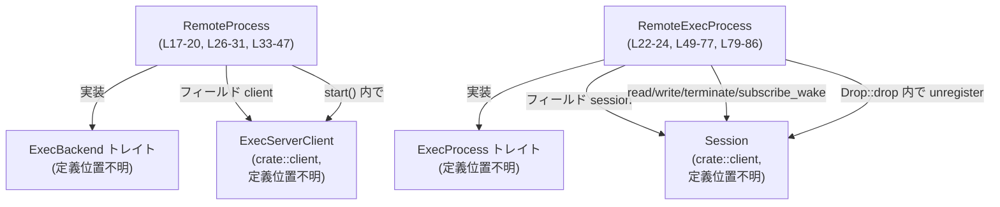
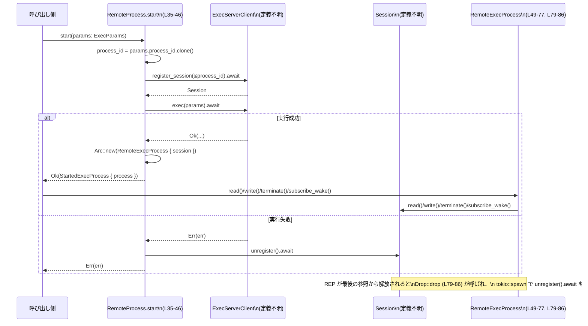

# exec-server/src/remote_process.rs コード解説

## 0. ざっくり一言

リモート実行サーバーに対してプロセスを開始し、その入出力や終了処理を `Session` 経由で操作するための「リモート実行バックエンド」の実装です（`ExecBackend` / `ExecProcess` の実装）。  
`tokio` の非同期処理上で、セッションの登録・実行・読み書き・終了・自動的な unregister を担当します。

---

## 1. このモジュールの役割

### 1.1 概要

- このモジュールは、リモートでコマンドやプロセスを実行するためのバックエンドを実装します。
- `ExecBackend` トレイトを `RemoteProcess` で実装し、`ExecParams` を受け取ってリモート側にプロセスを起動します（`start`）（根拠: `exec-server/src/remote_process.rs:L33-47`）。
- 実行中プロセスを表す `RemoteExecProcess` は `ExecProcess` を実装し、`Session` を通じて I/O（read/write）、通知購読（subscribe_wake）、終了（terminate）、および Drop 時の unregister を行います（根拠: `L22-24`, `L49-77`, `L79-86`）。

### 1.2 アーキテクチャ内での位置づけ

このファイルで確認できる依存関係を図示します。



- `RemoteProcess` は `ExecServerClient` を 1 つ保持し、`ExecBackend::start` でリモートセッション登録と実際の実行要求を行います（`L18-20`, `L35-41`）。
- `RemoteExecProcess` は `Session` を 1 つ保持し、それを通じて全ての I/O とライフサイクル制御を委譲します（`L22-24`, `L51-57`, `L59-76`, `L79-84`）。
- `StartedExecProcess` の内部フィールド `process` に `Arc<RemoteExecProcess>` を詰めて返すことで、呼び出し側が `ExecProcess` として操作できるようにしています（`L43-45`）。

### 1.3 設計上のポイント

コードから読み取れる設計上の特徴です。

- **責務の分離**  
  - `RemoteProcess`: 「プロセス開始（start）」専用。セッション登録と実行要求のみ担当（`L33-47`）。
  - `RemoteExecProcess`: 「開始後のプロセスインスタンス」の I/O と終了処理を担当（`L49-77`）。
- **非同期トレイト実装**  
  - `async_trait` を利用して非同期メソッドを含むトレイト (`ExecBackend`, `ExecProcess`) を実装しています（`L3`, `L33`, `L49`）。  
    これにより `async fn` をトレイトメソッドとして扱えるようにしています。
- **状態と共有**  
  - 実際のリモートプロセス状態は `Session` に閉じ込め、`RemoteExecProcess` はそれを 1 フィールドとして保持するだけの薄いラッパーになっています（`L22-24`）。
  - 呼び出し側には `Arc<RemoteExecProcess>` が渡されるため、複数タスクから同じプロセスを共有して操作できる前提になっています（`L43-45`）。
- **クリーンアップ戦略**  
  - `start` 内で実行要求が失敗した場合は、明示的に `session.unregister().await` を呼び出してからエラーを返しており、セッションリークを避けています（`L38-40`）。
  - `RemoteExecProcess` の `Drop` 実装で `tokio::spawn` を使い、最後の参照が破棄されたときにバックグラウンドで `unregister` を呼び出す仕組みを持っています（`L79-84`）。  
    Drop では同期的に待てないため、非同期タスクとして切り離す構造になっています。
- **エラーハンドリング方針**  
  - セッション登録と実行要求のエラーは `ExecServerError` として `Result` で呼び出し元に返します（`L35`, `L37`, `L38`, `L41`）。
  - unregister に関しては戻り値（エラーの有無）をこのファイル内では一切確認していません（`L39`, `L83`）。

---

## 2. 主要な機能一覧

このモジュールが提供する主な機能です。

- リモート実行バックエンドの生成: `RemoteProcess::new` で `ExecServerClient` をラップしたバックエンドを生成（`L26-31`）。
- リモートプロセスの開始: `ExecBackend::start` 実装で、セッション登録と実行要求を行い、`StartedExecProcess` を返す（`L35-46`）。
- プロセス ID の取得: `ExecProcess::process_id` 経由で、`Session` に紐づく `ProcessId` を参照（`L51-53`）。
- 実行状態通知の購読: `ExecProcess::subscribe_wake` で `watch::Receiver<u64>` を返し、状態変化の通知を購読（`L55-57`）。
- 標準入出力等の読み取り: `ExecProcess::read` で `ReadResponse` を `Session` から取得（`L59-66`）。
- 標準入力等の書き込み: `ExecProcess::write` でバイト列を `Session` に書き込み、`WriteResponse` を受け取る（`L68-71`）。
- プロセスの終了要求: `ExecProcess::terminate` でリモートプロセスの終了を要求（`L73-76`）。
- プロセス破棄時のセッション解放: `Drop` 実装で非同期に `Session::unregister` を呼び出す（`L79-84`）。

---

## 3. 公開 API と詳細解説

### 3.1 型一覧（構造体など）

このファイル内で定義される主な型の一覧です。

| 名前 | 種別 | 役割 / 用途 | 根拠 |
|------|------|-------------|------|
| `RemoteProcess` | 構造体 | リモート実行サーバー用のバックエンド。`ExecServerClient` を保持し、`ExecBackend::start` を実装する | `exec-server/src/remote_process.rs:L17-20, L26-31, L33-47` |
| `RemoteExecProcess` | 構造体 | 実行中のリモートプロセスを表現する。`Session` を保持し、`ExecProcess` および `Drop` を実装する | `exec-server/src/remote_process.rs:L22-24, L49-77, L79-86` |

実装しているトレイト（定義場所はこのチャンクには現れません）:

- `ExecBackend for RemoteProcess`（`L33-47`）
- `ExecProcess for RemoteExecProcess`（`L49-77`）
- `Drop for RemoteExecProcess`（`L79-86`）

`ExecBackend` と `ExecProcess` トレイトがどのようなメソッドを要求しているかの完全な一覧は、このファイルからは分かりませんが、少なくともここで実装されているメソッドは以下の通りです（`L35`, `L51`, `L55`, `L59`, `L68`, `L73`）。

### 3.2 関数詳細（主要 7 件）

#### `RemoteProcess::new(client: ExecServerClient) -> Self`  

（根拠: `exec-server/src/remote_process.rs:L26-31`）

**概要**

- リモート実行バックエンド `RemoteProcess` のコンストラクタです。
- 引数として与えられた `ExecServerClient` を内部に保持します。
- 呼び出し時にトレースログを 1 行出力します。

**引数**

| 引数名 | 型 | 説明 |
|--------|----|------|
| `client` | `ExecServerClient` | リモート側との通信を行うクライアント。詳細な型定義はこのチャンクには現れませんが、セッション登録や実行要求を行う責務を持つと読めます（`L11`, `L35-41`）。 |

**戻り値**

- `RemoteProcess` インスタンス。`client` フィールドに引数がそのまま格納されます（`L29-30`）。

**内部処理の流れ**

1. `trace!("remote process new");` でトレースログを出力（`L28`）。
2. フィールド `client` に引数をセットした構造体を返します（`L29-30`）。

**Examples（使用例）**

```rust
// 既にどこかで用意されている ExecServerClient インスタンスを前提とします。
let client: ExecServerClient = /* 省略: 生成方法はこのチャンクには現れません */;

// RemoteProcess バックエンドを構築する
let backend = RemoteProcess::new(client);
```

**Errors / Panics**

- この関数自体は `Result` を返さず、`panic!` を直接呼び出すコードも含まれていません。
- `trace!` マクロ内部の挙動でパニックが起こる可能性は通常ありませんが、その詳細は `tracing` クレートの設定に依存します。

**Edge cases（エッジケース）**

- `client` がどのような内部状態であっても、この関数は単純な所有権の移動しか行わないため、ここでの失敗条件は見当たりません。

**使用上の注意点**

- `RemoteProcess` は `#[derive(Clone)]` されており、内部の `ExecServerClient` も `Clone` であることが前提になっています（`L17-20`）。  
  同じクライアントを使い回したい場合、`RemoteProcess` をクローンして利用できます。

---

#### `ExecBackend::start(&self, params: ExecParams) -> Result<StartedExecProcess, ExecServerError>`  

（根拠: `exec-server/src/remote_process.rs:L33-47`）

**概要**

- 与えられた `ExecParams` をもとにリモート実行サーバー上でプロセスを開始し、そのプロセスを操作するための `StartedExecProcess` を返します。
- セッション登録（`register_session`）と実行要求（`exec`）を行い、成功時には `RemoteExecProcess` を `Arc` に包んで返します。

**引数**

| 引数名 | 型 | 説明 |
|--------|----|------|
| `params` | `ExecParams` | 実行するプロセスのパラメータ。少なくとも `process_id` フィールドを持つことがコードから分かります（`L35-37`）。その他のフィールドはこのチャンクには現れません。 |

**戻り値**

- `Result<StartedExecProcess, ExecServerError>`  
  - `Ok(StartedExecProcess { process: Arc<RemoteExecProcess> })` : セッション登録と実行要求が成功した場合（`L43-45`）。
  - `Err(ExecServerError)` : セッション登録または実行要求のいずれかで失敗した場合（`L35`, `L37-41`）。

**内部処理の流れ**

1. `params.process_id.clone()` でプロセス ID を取り出し、クローンをローカル変数 `process_id` に保存します（`L36`）。
2. `self.client.register_session(&process_id).await?` を呼び出し、`Session` を取得します（`L37`）。
   - `?` により、ここで `Err` が返された場合は、そのまま `ExecServerError` を呼び出し元に返して終了します。
3. `self.client.exec(params).await` を実行します（`L38`）。
   - `Err(err)` の場合:
     - `session.unregister().await;` を呼び出して、登録済みセッションを解除しようとします（戻り値は無視）（`L39`）。
     - その後 `Err(err)` を戻り値として返します（`L40-41`）。
   - `Ok(_)` の場合:
     - `StartedExecProcess { process: Arc::new(RemoteExecProcess { session }) }` を構築して返します（`L43-45`）。

**Examples（使用例）**

```rust
// 既に RemoteProcess バックエンドがある前提
async fn run_process(backend: &RemoteProcess, params: ExecParams)
    -> Result<(), ExecServerError>
{
    // プロセスを開始
    let started: StartedExecProcess = backend.start(params).await?;

    // StartedExecProcess の中から ExecProcess を取り出す
    let process = started.process; // フィールド名 process はこのファイルから分かります（L43-45）

    // ここで process.read(), process.write(), process.terminate() などを呼び出せます
    // （具体的なメソッドは ExecProcess トレイト定義の全体に依存します）
    Ok(())
}
```

**Errors / Panics**

- `register_session` が `Err(e)` を返した場合、その `e` が `ExecServerError` としてそのまま返されます（`L37`）。
- `exec` が `Err(err)` を返した場合、`session.unregister().await` の結果に関わらず `Err(err)` が返されます（`L38-41`）。
- `panic!` を呼び出すコードは含まれていません。
- `ExecServerClient` や `Session` の実装に依存するランタイムエラーの可能性については、このチャンクには情報がありません。

**Edge cases（エッジケース）**

- **セッション登録失敗**: `register_session` が失敗した場合、`exec` は呼び出されず、セッションも生成されないので、クリーンアップは不要です（`L37`）。
- **実行要求のみ失敗**: `exec` が失敗した場合は、すでに生成された `Session` に対して `unregister().await` が呼び出されます（`L38-40`）。  
  unregister のエラーは無視されます。
- **成功時のみ RemoteExecProcess の生成**: `RemoteExecProcess` は `exec` 成功後にしか生成されないため、失敗時に `RemoteExecProcess` の `Drop` が呼ばれることはありません（`L43-45`）。

**使用上の注意点**

- このメソッドは `async` であり、`tokio` などの非同期ランタイム上で `.await` される必要があります。同期コンテキストで直接呼ぶことはできません（`L33-35`）。
- 戻り値 `StartedExecProcess` を破棄すると、内部の `Arc<RemoteExecProcess>` の参照カウントが減り、最終的には `Drop` によりセッションが自動的に unregister されます（`L43-45`, `L79-84`）。
- 実行が失敗した場合、`session.unregister()` のエラーが無視されるため、セッションリークを完全に防げているかどうかは `Session` の実装に依存します。この点はコードからは判断できません。

---

#### `ExecProcess::subscribe_wake(&self) -> watch::Receiver<u64>`  

（根拠: `exec-server/src/remote_process.rs:L55-57`）

**概要**

- プロセスの状態変化などに応じた「ウェイク通知」を購読するために、`tokio::sync::watch::Receiver<u64>` を返します。
- 内部的には `Session::subscribe_wake` をそのまま委譲しています。

**引数**

- なし（`&self` のみ）。

**戻り値**

- `watch::Receiver<u64>`  
  - トークナンバー `u64` がどのような意味を持つか（例えばシーケンス番号なのか）は、このファイルからは分かりません。

**内部処理の流れ**

1. `self.session.subscribe_wake()` を呼び出して、その結果をそのまま返します（`L56`）。

**Examples（使用例）**

```rust
// process は Arc<RemoteExecProcess> など ExecProcess 実装を満たす値とします
fn setup_wake_subscription<P: ExecProcess>(process: &P) {
    let rx = process.subscribe_wake(); // watch::Receiver<u64> を取得

    // 取得した Receiver は、呼び出し側のタスクで
    // 非同期に recv() / changed() などを使って監視することができます。
    // 具体的な利用方法は tokio::sync::watch の API に依存します。
}
```

**Errors / Panics**

- このメソッド自体は `Result` を返さず、`panic!` を直接呼んでいません。
- `Session::subscribe_wake` がパニックを起こすかどうかは、このチャンクからは分かりません。

**Edge cases**

- `watch::Receiver` の初期値や「まだ通知が一度も来ていない」状態での挙動は、`tokio::sync::watch` の仕様に依存します。ここでは単にそれを返すだけです。

**使用上の注意点**

- `watch::Receiver` は `Send` かつ `Sync` であることが多く、複数タスクから共有されることが想定されますが、その保証は tokio の仕様と `Session` の実装に依存します。
- このメソッド自体は同期（非 async）で、軽量な操作であると想定されます（委譲のみ、`L56`）。

---

#### `ExecProcess::read(&self, after_seq, max_bytes, wait_ms) -> Result<ReadResponse, ExecServerError>`  

（根拠: `exec-server/src/remote_process.rs:L59-66`）

**概要**

- リモートプロセスからの出力（標準出力・標準エラーなど）を読み取るためのメソッドです。
- 各種オプションを指定して `Session::read` にそのまま委譲します。

**引数**

| 引数名 | 型 | 説明 |
|--------|----|------|
| `after_seq` | `Option<u64>` | どのシーケンス番号以降の出力を読み取るかを指定する可能性がありますが、意味は `Session::read` の仕様に依存し、このファイルからは断定できません（`L61`）。 |
| `max_bytes` | `Option<usize>` | 一度に読み取る最大バイト数を表すと推測できますが、確証はありません（`L62`）。 |
| `wait_ms` | `Option<u64>` | データがなければどれくらい待つか（ミリ秒単位）を表す可能性がありますが、詳細は不明です（`L63`）。 |

（上記 3 つの意味は名前からの推測であり、厳密な仕様は `Session::read` の実装やドキュメントを参照する必要があります。）

**戻り値**

- `Result<ReadResponse, ExecServerError>`  
  - 成功時は `ReadResponse`（内容はこのチャンクからは不明）を返します。
  - 失敗時は `ExecServerError` を返します（`L64-65`）。

**内部処理の流れ**

1. `self.session.read(after_seq, max_bytes, wait_ms).await` をそのまま呼び出し、その `Result` を返します（`L65`）。

**Examples（使用例）**

```rust
async fn read_some_output<P: ExecProcess>(process: &P)
    -> Result<ReadResponse, ExecServerError>
{
    // 例: シーケンス 0 以降を、最大 4096 バイト、最大 5 秒待つ
    let resp = process
        .read(Some(0), Some(4096), Some(5_000))
        .await?;
    Ok(resp)
}
```

**Errors / Panics**

- エラーはすべて `Session::read` からの `ExecServerError` として伝播します（`L65`）。
- `panic!` を直接起こすコードは含まれていません。

**Edge cases**

- 各オプションに `None` を渡した場合の挙動（無制限になるのか、デフォルト値が使われるのか）は、このファイルからは分かりません。
- 出力がまったくない場合に即座に返るか、`wait_ms` 分待つかといった挙動も、`Session::read` の実装に依存します。

**使用上の注意点**

- 非同期メソッドのため、必ず `.await` する必要があります（`L59`）。
- 読み取り側が遅い場合のバッファリングやバックプレッシャーの挙動は `Session` の実装次第であり、ここでは制御していません。

---

#### `ExecProcess::write(&self, chunk: Vec<u8>) -> Result<WriteResponse, ExecServerError>`  

（根拠: `exec-server/src/remote_process.rs:L68-71`）

**概要**

- リモートプロセスに対してバイト列を送信（標準入力への書き込み等）するメソッドです。
- 引数 `chunk` を `Session::write` に渡し、その結果を返します。実行前にトレースログを出力します。

**引数**

| 引数名 | 型 | 説明 |
|--------|----|------|
| `chunk` | `Vec<u8>` | リモートプロセスへ送信するデータ。所有権はこのメソッドにムーブされます（`L68-70`）。 |

**戻り値**

- `Result<WriteResponse, ExecServerError>`  
  - 成功時は `WriteResponse`（内容不明）を返します。
  - 失敗時は `ExecServerError` を返します（`L68-71`）。

**内部処理の流れ**

1. `trace!("exec process write");` で書き込み操作であることをログ出力（`L69`）。
2. `self.session.write(chunk).await` を呼び、その結果をそのまま返却（`L70`）。

**Examples（使用例）**

```rust
async fn send_input<P: ExecProcess>(process: &P)
    -> Result<WriteResponse, ExecServerError>
{
    // 文字列を UTF-8 バイト列に変換して送信
    let data = b"hello\n".to_vec();
    let resp = process.write(data).await?;
    Ok(resp)
}
```

**Errors / Panics**

- 書き込み中に起きたエラーは `ExecServerError` として戻り値に含まれます（`L70`）。
- `panic!` を直接呼ぶコードは含まれていません。

**Edge cases**

- `chunk` が空ベクタの場合の扱い（接続確認扱いか無視されるかなど）は、`Session::write` の仕様に依存します。
- 大きな `chunk` を渡した場合の分割送信やブロッキング挙動も、このファイルからは分かりません。

**使用上の注意点**

- 書き込みが頻繁な場合、`trace!` ログが大量に出る可能性があります（`L69`）。トレースレベルのロギング設定に注意が必要です。
- このメソッドは非同期であり、ネットワーク I/O を含むと考えられるため、ループ内で多数回呼ぶ場合はパフォーマンスへの影響を考慮する必要があります（ただし具体的な I/O 形態はこのチャンクには現れません）。

---

#### `ExecProcess::terminate(&self) -> Result<(), ExecServerError>`  

（根拠: `exec-server/src/remote_process.rs:L73-76`）

**概要**

- リモートプロセスに対して終了要求を送るメソッドです。
- 内部的には `Session::terminate` に処理を委譲し、実行前にトレースログを出力します。

**引数**

- なし（`&self` のみ）。

**戻り値**

- `Result<(), ExecServerError>`  
  - 成功時は `Ok(())`（`Session::terminate` の戻り値に依存）。
  - 失敗時は `ExecServerError`。

**内部処理の流れ**

1. `trace!("exec process terminate");` をログ出力（`L74`）。
2. `self.session.terminate().await` の結果をそのまま返します（`L75`）。

**Examples（使用例）**

```rust
async fn stop_process<P: ExecProcess>(process: &P)
    -> Result<(), ExecServerError>
{
    // 正常な終了を要求
    process.terminate().await?;
    Ok(())
}
```

**Errors / Panics**

- 終了要求が失敗した場合は `ExecServerError` が返されます（`L75`）。
- このメソッド自体は `panic!` を呼びません。

**Edge cases**

- すでに終了済みのプロセスに対して呼んだ場合の挙動は、`Session::terminate` の仕様に依存します（再度 OK と見なす、`Err` を返す、何もしない等）。

**使用上の注意点**

- `terminate` を呼ばずに `StartedExecProcess` を破棄した場合でも、`Drop` により `unregister` が呼ばれますが、プロセスの終了をどのタイミングで保証するかは `Session` 側の仕様次第です（`L79-84`）。
- プロセス終了の成否を確実に検知したい場合は、`terminate` の戻り値の `Result` を確認する必要があります。

---

#### `Drop::drop(&mut self)` for `RemoteExecProcess`  

（根拠: `exec-server/src/remote_process.rs:L79-86`）

**概要**

- `RemoteExecProcess` が最後の参照から解放されるときに呼ばれるデストラクタです。
- 非同期タスクを `tokio::spawn` で起動し、その中で `Session::unregister().await` を実行することで、セッションのクリーンアップを行います。

**引数**

- （暗黙）`&mut self` — Drop トレイトの標準シグネチャ。

**戻り値**

- なし。

**内部処理の流れ**

1. `let session = self.session.clone();`  
   - `self` が持つ `Session` をクローンしてローカル変数に移します（`L81`）。
   - これにより、`self` のライフタイム終了後も非同期タスク内で `Session` を使用できるようにします。
2. `tokio::spawn(async move { session.unregister().await; });` を呼び出します（`L82-83`）。
   - 非同期タスク内で `session.unregister().await` を呼び、戻り値は無視されます。
   - `Drop` 本体はタスクの完了を待機せず直ちに復帰します。

**Examples（使用例）**

`Drop` は直接呼び出さず、`RemoteExecProcess`（もしくはそれを内包した `Arc`）がスコープを抜けるときに自動的に実行されます。

```rust
async fn scope_example(backend: &RemoteProcess, params: ExecParams)
    -> Result<(), ExecServerError>
{
    let started = backend.start(params).await?;
    let process = started.process; // Arc<RemoteExecProcess> と仮定（L43-45）

    // ここで process を使って read / write / terminate...

    // このスコープを抜けると process の Arc 参照カウントが減り、
    // 最後の 1 個であれば RemoteExecProcess::drop が実行され、
    // tokio::spawn で unregister が送られます。
    Ok(())
}
```

**Errors / Panics**

- `session.unregister().await` の結果は無視されるため、unregister の失敗は検出されません（`L83`）。
- `tokio::spawn` は有効な Tokio ランタイムのコンテキストで呼ばれることを前提としており、ランタイム外で呼び出すとパニックを起こすことがあると一般に知られています。  
  Drop がどのスレッド・どのコンテキストで呼ばれるかは呼び出し側に依存するため、アプリケーションの終了時やテストでランタイムが停止した後に Drop が走ると、`tokio::spawn` が失敗する可能性があります。

**Edge cases**

- **ランタイム終了後の Drop**: プロセス終了直前に `RemoteExecProcess` が Drop されると、バックグラウンドタスクの `unregister` が実行される前にプロセスが終了してしまう可能性があります。`unregister` の完了保証はありません。
- **大量のプロセス破棄**: 多数の `RemoteExecProcess` が同時に Drop される場合、`tokio::spawn` によって同時に多数のタスクが起動します。タスク数や `unregister` の負荷がどの程度かは `Session` の実装次第です。

**使用上の注意点**

- `Drop` 内で非同期タスクを起動しているため、「unregister が完了する前にアプリケーションが終了する」ケースがあり得ます。確実なクリーンアップを行いたい場合は、呼び出し側で明示的に `terminate` や（もしあれば）同期的なクローズ関数を呼び、完了を待機する必要があります。
- `RemoteExecProcess` が `Arc` でラップされている前提から、`Drop` は最後の `Arc` が解放される時点で 1 回だけ呼ばれます（`L43-45`, 標準的な `Arc` の挙動に基づく）。  
  したがって `unregister` が重複して呼ばれることはありません（ただし `Session` 側で別途 `terminate` や `unregister` を呼んだ場合の重複処理は、このファイルからは不明です）。

---

### 3.3 その他の関数

このファイル内で比較的単純な委譲のみを行っている関数です。

| 関数名 | シグネチャ | 役割（1 行） | 根拠 |
|--------|-----------|--------------|------|
| `process_id` | `fn process_id(&self) -> &crate::ProcessId` | `Session` に紐づく `ProcessId` を返す単純なゲッター。実装は完全にセッションに委譲されます。 | `exec-server/src/remote_process.rs:L51-53` |

---

## 4. データフロー

ここでは、`RemoteProcess::start` からリモートプロセスの利用までの代表的なフローを示します。

### 4.1 概要

- 呼び出し側は `RemoteProcess` を通じて `ExecBackend::start` を呼び、`StartedExecProcess` を受け取ります（`L35-46`）。
- 内部で `ExecServerClient` によるセッション登録・実行要求が行われます（`L37-38`）。
- 成功すると `StartedExecProcess` の中に `Arc<RemoteExecProcess>` が格納され、以降の read/write/terminate は `Session` 経由で行われます（`L43-45`, `L49-76`）。
- `RemoteExecProcess` が破棄されると、非同期に `Session::unregister` が呼ばれます（`L79-84`）。

### 4.2 シーケンス図



この図における `RemoteProcess.start`, `RemoteExecProcess`, `Drop::drop` はすべて本チャンク `exec-server/src/remote_process.rs:L35-46, L49-77, L79-86` に含まれています。

---

## 5. 使い方（How to Use）

### 5.1 基本的な使用方法

`ExecServerClient` や `ExecParams` の具体的な生成方法はこのチャンクには現れませんが、「すでに用意されている」という前提で、典型的な利用フローを示します。

```rust
use std::sync::Arc;
use crate::{ExecBackend, ExecProcess, ExecServerError, StartedExecProcess};
use crate::client::ExecServerClient;
use crate::protocol::ExecParams;

// リモートプロセスを開始して、簡単な I/O を行う例
async fn run_remote(client: ExecServerClient, params: ExecParams)
    -> Result<(), ExecServerError>
{
    // RemoteProcess バックエンドを構築する（L26-31）
    let backend = RemoteProcess::new(client);

    // プロセスを開始し、StartedExecProcess を取得する（L35-46）
    let started: StartedExecProcess = backend.start(params).await?;

    // StartedExecProcess から ExecProcess 実装を取り出す（L43-45）
    let process = started.process; // 型は Arc<RemoteExecProcess> と推測できますが、厳密な型は定義側に依存します

    // 例: 何か入力を書き込む（L68-71）
    process.write(b"hello\n".to_vec()).await?;

    // 例: 出力を 1 回読む（L59-66）
    let _output = process.read(None, Some(1024), Some(5_000)).await?;

    // 例: 正常終了を要求（L73-76）
    process.terminate().await?;

    // process がスコープを抜けて Arc の最後の参照が解放されると、
    // Drop により tokio::spawn で unregister が実行されます（L79-84）
    Ok(())
}
```

### 5.2 よくある使用パターン

1. **バックグラウンドでの出力監視（subscribe_wake の利用）**

```rust
use tokio::sync::watch;
use crate::ExecProcess;

async fn monitor_output<P: ExecProcess + Send + Sync + 'static>(process: Arc<P>) {
    // ウェイク通知用の Receiver を取得（L55-57）
    let mut rx: watch::Receiver<u64> = process.subscribe_wake();

    tokio::spawn(async move {
        // watch::Receiver の具体的な API は tokio に依存します
        loop {
            // 例: changed().await で変更を待つ
            if rx.changed().await.is_err() {
                // 送信側が閉じたなど
                break;
            }
            let seq = *rx.borrow();
            // seq に応じて read() などを呼び出す処理を行う、など
        }
    });
}
```

1. **終了処理を任せる（Drop による unregister の利用）**

```rust
async fn fire_and_forget(backend: &RemoteProcess, params: ExecParams)
    -> Result<(), ExecServerError>
{
    let started = backend.start(params).await?;
    let process = started.process;

    // 何らかの処理の後、明示的に terminate を呼ばずにスコープを抜ける
    // → 最後の Arc がドロップされると、自動的に unregister が送られる（L79-84）
    Ok(())
}
```

### 5.3 よくある間違いとその修正例（想定されるもの）

コードから起こりうる誤用を推測できる範囲で挙げます。

```rust
// 誤りの例: 非同期コンテキスト外で start を呼ぼうとする
// let started = backend.start(params); // コンパイルエラー: `.await` が必要

// 正しい例: tokio ランタイム内の async fn で await する
let started = backend.start(params).await?;
```

```rust
// 誤りの例: StartedExecProcess / process をすぐに破棄してしまう
let started = backend.start(params).await?;
let process = started.process;
// process を使う前にスコープを抜ける → Drop による unregister は行われるが、
// 実際の入出力処理が実行されない

// 正しい例: 必要な I/O を行ってからスコープを抜ける
let started = backend.start(params).await?;
let process = started.process;
process.write(b"hello\n".to_vec()).await?;
let _output = process.read(None, Some(1024), Some(5_000)).await?;
// 処理が完了したらスコープを抜ける
```

### 5.4 使用上の注意点（まとめ）

- **非同期ランタイム依存**  
  - `start`, `read`, `write`, `terminate` はすべて `async fn` であり、Tokio などのランタイム上で `.await` する必要があります（`L35`, `L59`, `L68`, `L73`）。
  - `Drop` でも `tokio::spawn` を使用しているため、`RemoteExecProcess` の Drop が必ずランタイム内のコンテキストで呼ばれるよう、アプリケーション全体のライフタイム設計に注意が必要です（`L79-84`）。
- **エラー処理**  
  - すべての主要操作は `Result<_, ExecServerError>` を返すため、`?` などで適切にエラーを伝播させるか、明示的に `match` で処理する必要があります（`L35`, `L59`, `L68`, `L73`）。
- **クリーンアップの保証範囲**  
  - `start` の失敗時には明示的に `unregister` が呼ばれますが、その戻り値は無視されるため、完全なクリーンアップ保証には `Session` 側の実装確認が必要です（`L38-40`）。
  - Drop による `unregister` も非同期タスクであり、アプリケーション終了直前などでは完了しない可能性があります（`L79-84`）。
- **ログ出力**  
  - `RemoteProcess::new`, `write`, `terminate` で `trace!` ログが出力されます（`L28`, `L69`, `L74`）。  
    トラブルシュート時にトレースログを有効化すると、操作の呼び出しタイミングを把握しやすくなります。

---

## 6. 変更の仕方（How to Modify）

### 6.1 新しい機能を追加する場合

例として、「リモートプロセスの状態を問い合わせる新しいメソッド」を追加したい場合を考えます。

1. **トレイト側の変更**  
   - `ExecProcess` トレイトに新メソッド（例: `async fn get_status(...)`) を追加する必要があります。  
     ただし、`ExecProcess` の定義位置はこのチャンクには現れないため、該当ファイルを別途確認する必要があります。
2. **このモジュールでの実装**  
   - `impl ExecProcess for RemoteExecProcess` ブロック（`L49-77`）に新しいメソッド実装を追加します。
   - 実装内容としては、既存メソッドと同様に `self.session` へ委譲する形が自然です（`read`, `write`, `terminate` と同様、`L65`, `L70`, `L75` を参照）。
3. **セッションレイヤーの対応**  
   - `Session` 型に対応するメソッド（例: `Session::get_status`）を追加し、リモートサーバーとのプロトコルを拡張します。  
     `Session` の定義や実装位置については、このファイルからは分かりませんが、`crate::client` モジュール内にあることが推測されます（`L12`）。
4. **クライアント・プロトコルレイヤーの拡張**  
   - `ExecServerClient` や `crate::protocol` にも対応する RPC / メッセージを追加する必要があります（`L11`, `L13-15`）。
5. **テストの追加**  
   - 新メソッドの動作を確認するためのテストを、既存のテストコードと同じ場所に追加します。  
     テストコードの所在はこのチャンクには現れないため、別途プロジェクト全体を確認する必要があります。

### 6.2 既存の機能を変更する場合

例: `start` のエラーハンドリングを変更したい場合。

- **影響範囲の確認**
  - `start` は `ExecBackend` の実装であり、プロジェクト内の「プロセス開始」のエントリポイントである可能性が高いです（根拠: `L33-47`）。  
    そのため、`ExecBackend::start` を呼び出している箇所をすべて検索し、影響範囲を把握する必要があります。
- **契約（前提条件・返り値の意味）の確認**
  - 現状は「成功時には常に `StartedExecProcess` と有効な `RemoteExecProcess` が返る」「失敗時にはセッションが unregister 済みであることを試みる」という契約が暗黙的に存在します（`L37-41`）。  
    これを変更する場合、呼び出し側がこの前提に依存していないかを確認する必要があります。
- **Drop の挙動との整合性**
  - `Drop` でも `unregister` が呼ばれるため、`start` 内のエラーハンドリングと合わせて「どのケースで `unregister` が呼ばれるのか」を整理した上で変更する必要があります（`L38-40`, `L79-84`）。
- **テストの見直し**
  - 既存テストの期待する挙動と変更後の挙動が一致しているか確認し、必要に応じてテストを更新します。  
    テストコードの位置はこのチャンクでは確認できませんが、`start` と `ExecProcess` メソッドを直接または間接的に呼び出すテストを特に確認する必要があります。

---

## 7. 関連ファイル

このモジュールと密接に関係する型・モジュールです。具体的なファイルパスは、このチャンクだけからは分からない場合があります。

| パス / モジュール | 役割 / 関係 |
|-------------------|------------|
| `crate::client`（`ExecServerClient`, `Session`） | リモートサーバーとの通信ロジックとセッション管理を提供します。`RemoteProcess` / `RemoteExecProcess` はここに定義された `ExecServerClient` と `Session` にほぼすべての処理を委譲しています（`L11-12`, `L37-40`, `L51-57`, `L59-66`, `L68-71`, `L73-75`, `L81-83`）。 |
| `crate::protocol`（`ExecParams`, `ReadResponse`, `WriteResponse`） | リモート実行に関するプロトコル定義を提供します。`start` の引数や、`read` / `write` の戻り値として使用されています（`L13-15`, `L35`, `L59-64`, `L68`）。 |
| `ExecBackend` トレイト | 実行バックエンドの共通インターフェース。`RemoteProcess` がこれを実装します（`L7`, `L33-47`）。定義位置はこのチャンクには現れません。 |
| `ExecProcess` トレイト | 実行中プロセスの共通インターフェース。`RemoteExecProcess` がこれを実装します（`L8`, `L49-77`）。定義位置はこのチャンクには現れません。 |
| `ExecServerError` | すべての主要メソッドのエラー型として使われているエラー型です（`L9`, `L35`, `L59`, `L68`, `L73`）。どのようなバリアントを持つかは、このファイルからは分かりません。 |
| `StartedExecProcess` | `start` の正常系戻り値として使用される構造体で、少なくとも `process` フィールドを持ち `Arc<RemoteExecProcess>` が格納されます（`L10`, `L43-45`）。定義場所や他のフィールドは不明です。 |
| （テストモジュール） | このファイル内にはテストコード（`#[cfg(test)]` モジュールなど）は存在しません（`exec-server/src/remote_process.rs:全体`）。テストは別ファイルにある可能性がありますが、このチャンクからは位置を特定できません。 |

以上が、このファイルに基づいて客観的に読み取れる情報と、その利用・変更のための実用的なガイドになります。
