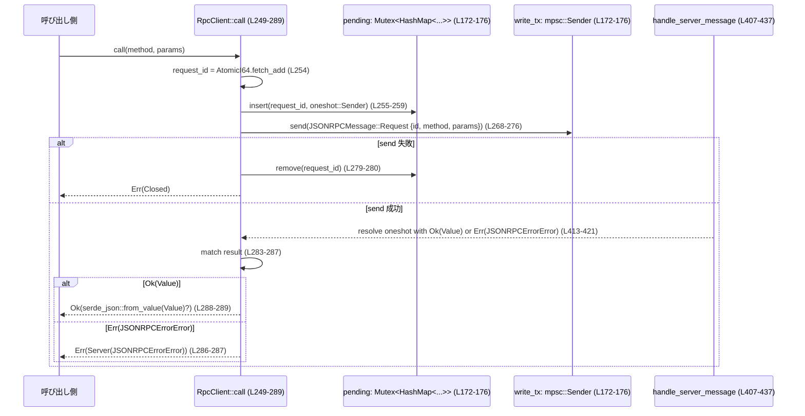
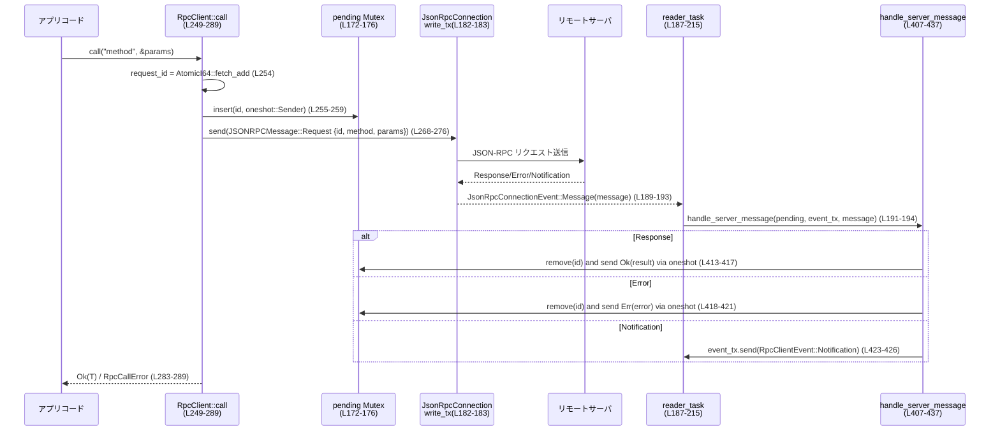

# exec-server/src/rpc.rs コード解説

## 0. ざっくり一言

JSON-RPC 2.0 形式のメッセージを扱う **クライアント側 RPC 実装** と、サーバ側でメソッド名に応じてハンドラを呼び分ける **簡易ルータ** を提供するモジュールです（`exec-server/src/rpc.rs` 全体）。

---

## 1. このモジュールの役割

### 1.1 概要

- このモジュールは、JSON-RPC ベースのアプリケーションで
  - クライアントからの **非同期 RPC 呼び出し・通知** を送信し、レスポンスを **request id でマッチング** する機能（`RpcClient`）
  - サーバ側で JSON-RPC の **method 名に基づいてハンドラ関数をルーティング** する機能（`RpcRouter`）
  - サーバからクライアントへの **通知送信**（`RpcNotificationSender`）
  を提供します。

### 1.2 アーキテクチャ内での位置づけ

主なコンポーネントと依存関係を簡略化した図です。

```mermaid
graph LR
    subgraph Connection層
        A[JsonRpcConnection<br/>(外部モジュール使用, L23-24)]
    end

    subgraph RPCクライアント
        B[RpcClient (L172-296)]
        C[handle_server_message (L407-437)]
        D[drain_pending (L439-454)]
    end

    subgraph RPCサーバ補助
        E[RpcRouter&lt;S&gt; (L83-170)]
        F[RpcNotificationSender (L53-81)]
        G[encode_server_message (L314-334)]
    end

    A -->|into_parts()| B
    B -->|JSONRPCMessage::Request/Notification| A
    A -->|JsonRpcConnectionEvent| C
    C -->|PendingRequest 解決| B
    C -->|Notification| B
    C -->|エラー/切断| D

    %% サーバ側は別モジュールから利用される想定
    H[サーバ実装(別ファイル)] --> E
    H --> F
    H --> G
```

- `RpcClient` は `JsonRpcConnection`（別モジュール）を通じてサーバと通信します（`RpcClient::new` 内 `into_parts` 呼び出し, `exec-server/src/rpc.rs:L181-185`）。
- 受信メッセージは `handle_server_message` で pending マップやイベントストリームへと分配されます（L407-437）。
- サーバ側では、このファイルの `RpcRouter` / `RpcNotificationSender` / `encode_server_message` が利用される形になっていますが、実際のサーバ本体はこのチャンクには現れません。

### 1.3 設計上のポイント

コードから読み取れる特徴です。

- **関心の分離**  
  - ルーティング (`RpcRouter`) とクライアント (`RpcClient`) は完全に分離されています（L83-170 と L172-296）。
- **非同期・並行処理前提**  
  - ハンドラはすべて `Future` を返す非同期関数として扱われ、Tokio の `mpsc` / `Mutex` / `JoinHandle` などを利用しています（L18-21, L26-31, L105-111, L141-146, L172-178）。
- **エラー表現の統一**  
  - JSON-RPC の標準エラーコードに対応するコンストラクタ（`invalid_request`, `method_not_found` 等）を提供して統一的に扱っています（L336-374）。
- **スレッドセーフな共有状態**  
  - サーバ側状態 `S` は `Arc<S>` でハンドラに共有され、`S: Send + Sync + 'static` 制約があります（L97-100, L105-110, L141-145）。
- **request id ベースのレスポンス対応付け**  
  - クライアントは `AtomicI64` で request id を生成し（L175, L254）、レスポンスは `HashMap<RequestId, PendingRequest>` で解決します（L172-176, L254-260, L413-421）。

---

## 2. 主要な機能一覧

- RPC クライアント:
  - `RpcClient::new`: JSON-RPC 接続からクライアントを構築し、受信ループを起動する（L180-227）。
  - `RpcClient::call`: 非同期に request を送り、レスポンスを指定型へデコードする（L249-289）。
  - `RpcClient::notify`: レスポンス不要の通知を送信する（L229-247）。
  - `RpcClientEvent`: 通知および切断イベントのストリーム型（L33-37）。
- サーバ側ルーティング:
  - `RpcRouter::request`: request メソッド名に対応するハンドラを登録する（L105-139）。
  - `RpcRouter::notification`: notification メソッドのハンドラを登録する（L141-161）。
  - `RpcRouter::{request_route, notification_route}`: method から登録済みルートを取得する（L163-169）。
- サーバ側送信:
  - `RpcNotificationSender::notify`: サーバから通知をクライアントへ送る（L64-80）。
  - `encode_server_message`: サーバ側の `RpcServerOutboundMessage` を JSON-RPC ワイヤフォーマットに変換する（L314-334）。
- 共通ヘルパ:
  - JSON-RPC エラーオブジェクトの生成（`invalid_request`, `method_not_found`, `invalid_params`, `not_found`, `internal_error`, L336-374）。
  - パラメータのデコードとエラー整形（`decode_*`, L376-405）。
  - レスポンス/エラー/通知の受信処理（`handle_server_message`, L407-437）。
  - 切断時の pending リクエスト一括失敗（`drain_pending`, L439-454）。
- テスト:
  - out-of-order なレスポンスでも request id により適切に対応付けされることの検証（`rpc_client_matches_out_of_order_responses_by_request_id`, L507-573）。

---

## 3. 公開 API と詳細解説

### 3.1 型一覧（構造体・列挙体・型エイリアス）

| 名前 | 種別 | 役割 / 用途 | 定義位置 |
|------|------|-------------|----------|
| `PendingRequest` | 型エイリアス | 1 件の pending RPC を解決する `oneshot::Sender<Result<Value, JSONRPCErrorError>>` | `exec-server/src/rpc.rs:L26` |
| `BoxFuture<T>` | 型エイリアス | `Send + 'static` な `Future<Output = T>` の boxed 版 | L27 |
| `RequestRoute<S>` | 型エイリアス | サーバ側で request を処理するハンドラ型 | L28-29 |
| `NotificationRoute<S>` | 型エイリアス | サーバ側で notification を処理するハンドラ型 | L30-31 |
| `RpcClientEvent` | enum | クライアントが受け取るイベント（通知 / 切断） | L33-37 |
| `RpcServerOutboundMessage` | enum | サーバ側からクライアントへの送信メッセージ（レスポンス / エラー / 通知） | L39-51 |
| `RpcNotificationSender` | struct | サーバから通知を送るための軽量ラッパ | L53-57 |
| `RpcRouter<S>` | generic struct | method 名から非同期ハンドラへのルーティングテーブル | L83-86 |
| `RpcClient` | struct | JSON-RPC クライアント本体（送信・pending 管理・受信タスク） | L172-178 |
| `RpcCallError` | enum | クライアント call 時のエラー種別 | L307-312 |

### 3.2 関数詳細（主要なもの）

以下では特に重要な関数/メソッドについてテンプレート形式で説明します。

#### `RpcRouter::request<P, R, F, Fut>(&mut self, method: &'static str, handler: F)`

**概要**

- JSON-RPC **request** に対応するハンドラを登録します（L105-139）。
- ハンドラは `Arc<S>` とデコード済みパラメータ `P` を受け取り、`Result<R, JSONRPCErrorError>` を返す非同期関数です。

**シグネチャと制約**

```rust
pub(crate) fn request<P, R, F, Fut>(&mut self, method: &'static str, handler: F)
where
    P: DeserializeOwned + Send + 'static,
    R: Serialize + Send + 'static,
    F: Fn(Arc<S>, P) -> Fut + Send + Sync + 'static,
    Fut: Future<Output = Result<R, JSONRPCErrorError>> + Send + 'static,
```

（`exec-server/src/rpc.rs:L105-111`）

**引数**

| 引数名 | 型 | 説明 |
|--------|----|------|
| `method` | `&'static str` | JSON-RPC のメソッド名。`'static` なのでリテラルなど静的文字列が前提（L105）。 |
| `handler` | `F` | `Arc<S>` とパラメータ `P` を取り、非同期に `Result<R, JSONRPCErrorError>` を返す関数（L109-111）。 |

**戻り値**

- 戻り値なし。内部で `self.request_routes` にハンドラを登録します（L112-138）。

**内部処理の流れ**

1. `self.request_routes.insert(method, ...)` でメソッド名に対応するクロージャを登録（L112-138）。
2. 登録されるクロージャは `Arc<S>` と `JSONRPCRequest` を受け取る（L114-115）。
3. `request.id` を `request_id` として控え、`request.params` を取り出す（L115-116）。
4. `decode_request_params::<P>(params)` でパラメータを `P` にデコード（L117-118）。ここで失敗した場合は即座に `RpcServerOutboundMessage::Error` を返す（L120-125）。
5. デコード成功時は `handler(state, params)` を呼び出す future を得て、`await` する（L120-121）。
6. ハンドラ結果 `Result<R, JSONRPCErrorError>` をマッチ:
   - `Ok(result)` → `serde_json::to_value(result)` で `Value` に変換し、`Response` を返す（L126-133）。
   - シリアライズ失敗 → `internal_error` で包んだ `Error` を返す（L129-132）。
   - `Err(error)` → そのまま `Error` を返す（L134-135）。

**Examples（使用例）**

サーバ状態 `AppState` を持つ `add` メソッドを定義する例です。

```rust
use std::sync::Arc;
use serde::{Serialize, Deserialize};
use codex_app_server_protocol::JSONRPCRequest;

#[derive(Clone)]
struct AppState {
    // サーバ側の共有状態
}

#[derive(Deserialize)]
struct AddParams {
    a: i64,
    b: i64,
}

#[derive(Serialize)]
struct AddResult {
    sum: i64,
}

async fn add_handler(state: Arc<AppState>, params: AddParams)
    -> Result<AddResult, JSONRPCErrorError>
{
    // state は必要に応じて利用
    Ok(AddResult { sum: params.a + params.b })
}

fn build_router() -> RpcRouter<AppState> {
    let mut router = RpcRouter::new(); // L101-103
    router.request("add", add_handler); // L105-139
    router
}
```

このあと別モジュールで `router.request_route("add")` を使い、`JSONRPCRequest` から `RpcServerOutboundMessage` を得て送信する形が想定されます。

**Errors / Panics**

- パラメータデコード失敗時:
  - `decode_request_params` が `invalid_params`（コード -32602）を返し、`RpcServerOutboundMessage::Error` になります（L117-118, L376-381）。
- ハンドラ自身が `Err(JSONRPCErrorError)` を返した場合、そのままクライアントへエラーとして返されます（L126, L134-135）。
- ハンドラの返した `R` のシリアライズが失敗すると `internal_error`（コード -32603）で返されます（L127-133, L368-374）。
- panic を起こすコードは含まれていません（この関数内では `unwrap` 等不使用）。

**Edge cases（エッジケース）**

- `JSONRPCRequest.params` が `None` または空オブジェクト `{}` の場合  
  → `decode_params` が `Value::Null` として再デコードを試みる実装になっており（L390-405）、`P` が `()` や `Option<T>` のような型であれば受け入れ可能です。
- 未登録メソッドに対する挙動  
  → `RpcRouter::request` は登録のみを担当し、未登録メソッド時のレスポンス生成はこのファイル外のサーバ実装に依存します。このチャンクには現れません。

**使用上の注意点**

- `method` は `'static` なので、リテラルや `lazy_static` 的な静的文字列を使用する必要があります（L105）。
- `P` と `R` は `Send + 'static` である必要があり、Tokio のスレッドプールで安全に扱える値である前提です（L107-110）。
- ハンドラが重い処理を行う場合でも、この設計ではそのまま非同期で実行されますが、必要であれば別スレッドプールやジョブキューにオフロードすることを検討できます（コードからはその部分は読み取れません）。

---

#### `RpcRouter::notification<P, F, Fut>(&mut self, method: &'static str, handler: F)`

**概要**

- JSON-RPC **notification**（レスポンス不要の呼び出し）のハンドラ登録用メソッドです（L141-161）。

**引数 / 戻り値 / 制約**

```rust
pub(crate) fn notification<P, F, Fut>(&mut self, method: &'static str, handler: F)
where
    P: DeserializeOwned + Send + 'static,
    F: Fn(Arc<S>, P) -> Fut + Send + Sync + 'static,
    Fut: Future<Output = Result<(), String>> + Send + 'static,
```

（L141-146）

- `handler` は成功時 `Ok(())`、失敗時 `Err(String)` を返します（L145-146）。

**内部処理**

1. `self.notification_routes.insert(method, ...)` でハンドラ登録（L147-160）。
2. 登録クロージャは `Arc<S>` と `JSONRPCNotification` を受け取る（L149）。
3. `decode_notification_params::<P>` でパラメータデコード（L150）。
4. デコード失敗時 → `Err(String)` としてそのまま返す（L153-156）。
5. 成功時 → `handler(state, params)` を `await` し、その `Result<(), String>` を返す（L153, L157-158）。

**Errors / Panics**

- 失敗時は常に `Err(String)` で表現されます。
  - パースエラー → エラーメッセージに `serde_json::Error` の `to_string()` を含む（L383-388）。
  - ハンドラエラー → ハンドラが返した文字列。
- panic なし（この関数内に `unwrap` 等はありません）。

**Edge cases / 注意点**

- request と同様に `params` が `None` または `{}` の場合、`decode_params` の挙動に従います（L390-405）。
- notification はレスポンスが不要なため、ハンドラ側でエラーをどうログし・どう扱うかは呼び出し側サーバ実装が決める必要があります（このファイルにはその処理はありません）。

---

#### `RpcClient::new(connection: JsonRpcConnection) -> (Self, mpsc::Receiver<RpcClientEvent>)`

**概要**

- JSON-RPC 接続から `RpcClient` を構築し、受信ループを別タスクで起動します（L180-227）。
- 呼び出し側は `RpcClient` 本体と、通知/切断イベントを受け取る `mpsc::Receiver<RpcClientEvent>` を受け取ります。

**引数**

| 引数名 | 型 | 説明 |
|--------|----|------|
| `connection` | `JsonRpcConnection` | 別モジュール定義の JSON-RPC 接続オブジェクト（L181-183）。 |

**戻り値**

- `(RpcClient, mpsc::Receiver<RpcClientEvent>)`
  - `RpcClient`: 後続の `call` / `notify` で利用。
  - `Receiver<RpcClientEvent>`: 通知や切断イベントを非同期に受け取るためのチャネル（L185）。

**内部処理の流れ**

1. `connection.into_parts()` により:
   - `write_tx: mpsc::Sender<JSONRPCMessage>`
   - `incoming_rx: mpsc::Receiver<JsonRpcConnectionEvent>`
   - `_disconnected_rx`（未使用）
   - `transport_tasks: Vec<JoinHandle<()>>`  
   を取得します（L182-183）。
2. `pending` マップを初期化（`Arc<Mutex<HashMap<RequestId, PendingRequest>>>`）（L184）。
3. イベント送信用 `event_tx` / `event_rx` チャネルを生成（L185）。
4. `pending_for_reader` と `event_tx` をクローニングし、`reader_task` を `tokio::spawn` で起動（L187-215）。
   - `incoming_rx.recv().await` ループで `JsonRpcConnectionEvent` を監視（L189-208）。
   - `Message` → `handle_server_message` を呼び出し（L191-194）。
   - `MalformedMessage` → 理由を捨てて `break`（L199-201）。
   - `Disconnected` → `RpcClientEvent::Disconnected` を送信し、`drain_pending` を呼んでから `return`（L203-207）。
5. 受信ループを抜けた後、理由なしの `Disconnected` イベントを送り、再度 `drain_pending` を呼び出す（L211-215）。
6. `RpcClient` 構造体を生成し、`event_rx` とともに返却（L217-226）。

**Errors / Panics**

- 内部で `unwrap` / `expect` は使用されておらず、エラーは基本的に:
  - `handle_server_message` の `Err(String)` → ループを `break` して切断扱い（L191-197）。
  - `JsonRpcConnectionEvent::MalformedMessage` → 理由を捨てて切断扱い（L199-201）。
- `event_tx.send(...)` の失敗は結果を捨てており、エラーは表に出ません（L204-205, L211-213, L424-426）。

**Edge cases / 注意点**

- **サーバから Request を受け取った場合**  
  `handle_server_message` が `Err("unexpected JSON-RPC request ...")` を返し（L428-432）、それにより受信ループが終了 → 切断扱いになります。クライアントは「サーバから Request が飛んできた」という事実は知りません。
- **MalformedMessage**  
  `reason` はログにもイベントにも反映されず捨てられます（L199-201）。観測性の観点で注意が必要です。

---

#### `RpcClient::call<P, T>(&self, method: &str, params: &P) -> Result<T, RpcCallError>`

**概要**

- JSON-RPC **request** を送り、対応するレスポンスを待って `T` にデコードします（L249-289）。
- レスポンスは request id により `pending` マップから対応付けされます。

**シグネチャ**

```rust
pub(crate) async fn call<P, T>(&self, method: &str, params: &P) -> Result<T, RpcCallError>
where
    P: Serialize,
    T: DeserializeOwned,
```

（L249-253）

**引数**

| 引数名 | 型 | 説明 |
|--------|----|------|
| `method` | `&str` | 呼び出す JSON-RPC メソッド名（L249-252）。 |
| `params` | `&P` | シリアライズ可能なパラメータ。`serde_json::to_value` により JSON 化されます（L261-263）。 |

**戻り値**

- `Ok(T)`:
  - サーバからレスポンス `result: Value` を受け取り、それを `T` に `from_value` したもの（L283-289）。
- `Err(RpcCallError)`:
  - 送信失敗 / パラメータの JSON 化失敗 / レスポンス待ち中の切断 / サーバエラー（後述）。

**内部処理の流れ**



**Errors / Panics**

- `RpcCallError::Json`:
  - `params` のシリアライズに失敗した場合（L261-266）。
  - サーバからの `result` のデコード（`serde_json::from_value::<T>`) が失敗した場合（L288-289）。
- `RpcCallError::Closed`:
  - `write_tx.send(...)` が `Err` を返す（チャネルクローズなど）場合（L268-281）。
  - `response_rx.await` が `Err`（`oneshot` の送信側がドロップ）になった場合（L283）。
  - 切断時に `drain_pending` により `oneshot` が `Err(JSONRPCErrorError)` で終了し、その `Sender` 側が先にドロップした場合など。
- `RpcCallError::Server(JSONRPCErrorError)`:
  - サーバの JSON-RPC Error レスポンスを受け取った場合（L284-287, L418-421）。
- panic はありません（この関数内で `unwrap` 等なし）。

**Edge cases（エッジケース）**

- **レスポンス順序が入れ替わる場合**  
  - テスト `rpc_client_matches_out_of_order_responses_by_request_id` が、`slow` / `fast` の 2 リクエストを投げてレスポンス順序が逆になっても request id で正しく対応付けられることを確認しています（L507-573）。
- **タイムアウト**  
  - この関数自身はタイムアウトを実装していません。呼び出し側で `tokio::time::timeout` などを組み合わせる必要があります（このファイルにはその例はありません）。
- **サーバからレスポンスが来ないまま切断**  
  - `RpcClient::new` の reader タスクが切断を検知すると `drain_pending` を呼び、すべての pending に JSON-RPC エラー（code -32000）を送ります（L439-454）。
  - それをこの関数が受け取ると `RpcCallError::Server` として見える点に注意が必要です（L283-287）。

**使用上の注意点**

- `call` は **単純な RPC 呼び出し**であり、ストリーミングや部分レスポンスなどには対応していません。
- 高頻度で大量の call を行うと `pending` マップが肥大し、また request id が増加し続けます（`AtomicI64::fetch_add`, L254）。`i64` の範囲内に収まる限り実害はありませんが、理論上は wrap-around します。
- エラー種別 `RpcCallError` から切断かサーバエラーか JSON エラーかを区別できるため、呼び出し側はそれに応じたリトライ戦略を実装できます。

---

#### `RpcClient::notify<P>(&self, method: &str, params: &P)`

**概要**

- JSON-RPC **通知** を送信します。レスポンスは待ちません（L229-247）。

**Errors**

- 送信側チャネルクローズなどにより `write_tx.send` が失敗すると、`serde_json::Error::io` でラップされた IO エラー（`BrokenPipe`）として返されます（L241-246）。

**注意点**

- `call` と異なり、`RpcCallError` ではなく純粋な `serde_json::Error` を返すため、エラー種別の扱いに注意が必要です（L233-247）。

---

#### `encode_server_message(message: RpcServerOutboundMessage) -> Result<JSONRPCMessage, serde_json::Error>`

**概要**

- サーバ側内部表現 `RpcServerOutboundMessage` を、プロトコル定義の `JSONRPCMessage` に変換します（L314-334）。

**内部処理**

- `match` で variant ごとに対応する JSON-RPC メッセージを組み立てるのみ（L317-333）。
- この関数自体でシリアライザを呼ばないため、`serde_json::Error` は現在のコードパスからは発生しません。

---

#### `handle_server_message(...) -> Result<(), String>`

**概要**

- クライアント側の受信タスクから呼ばれ、サーバからの JSON-RPC メッセージを:
  - `pending` マップで待っているリクエストに割り当てる
  - または `RpcClientEvent` としてイベントストリームへ送信する  
  役割を持ちます（L407-437）。

**シグネチャ**

```rust
async fn handle_server_message(
    pending: &Mutex<HashMap<RequestId, PendingRequest>>,
    event_tx: &mpsc::Sender<RpcClientEvent>,
    message: JSONRPCMessage,
) -> Result<(), String>
```

（L407-411）

**内部処理**

1. `match message` で分岐（L412-434）:

   - `JSONRPCMessage::Response { id, result }`  
     → `pending.lock().await.remove(&id)` により対応する `PendingRequest` を取り出し、`Ok(result)` を `oneshot::Sender` に送信（L413-417）。

   - `JSONRPCMessage::Error { id, error }`  
     → 同様に `Err(error)` を送信（L418-421）。

   - `JSONRPCMessage::Notification(notification)`  
     → `event_tx.send(RpcClientEvent::Notification(notification)).await` を実行（L423-426）。エラーは無視。

   - `JSONRPCMessage::Request(request)`  
     → クライアント側での受信は想定外として `Err(format!(...))` を返す（L428-432）。

2. 正常処理の最後に `Ok(())` を返す（L436）。

**Errors / Edge cases**

- `JSONRPCMessage::Request` を受け取ると `Err(String)` を返し、呼び出し側（reader タスク）で `break` されます（L191-197）。その後切断扱い。
- pending に対応する request id が見つからない場合、何もしません（`if let Some(...)` でガード, L414-415, L419-420）。
- `event_tx.send` の失敗は捨てており、通知が失われてもエラーにはなりません（L424-426）。

**安全性・セキュリティ観点**

- 不明な request id に対しては何もせず無視する設計で、クラッシュやパニックにつながることはありません。
- サーバからクライアントへの任意の JSON 値 `Value` をそのままクライアントに渡すため、アプリケーションレベルのバリデーションはクライアント側 `T` 型のデコードで行う前提です。

---

#### `drain_pending(pending: &Mutex<HashMap<RequestId, PendingRequest>>)`

**概要**

- 接続切断時に呼ばれ、すべての pending リクエストを
  `Err(JSONRPCErrorError{code: -32000, message: "JSON-RPC transport closed"})`
  で終了させます（L439-454）。

**内部処理**

1. `pending.lock().await.drain()` で全エントリを取り出し `Vec<PendingRequest>` に収集（L440-446）。
2. 各 `PendingRequest` に対して、上記の JSON-RPC エラーを `send`（L447-452）。
3. `send` の失敗（既に受信側がドロップ）は無視。

**契約**

- 呼び出し後、`pending` マップは空になります。
- これにより、`RpcClient::call` 側で `response_rx.await` が `Ok(Err(JSONRPCErrorError))` を受け取り、`RpcCallError::Server` として扱われます（L283-287）。

---

### 3.3 その他の関数・メソッド一覧

| 名前 | 種別 | 役割 / 一行説明 | 位置 |
|------|------|------------------|------|
| `RpcNotificationSender::new` | メソッド | 通知送信用の `mpsc::Sender` をラップした構造体を作成 | L59-62 |
| `RpcNotificationSender::notify` | async メソッド | サーバから JSON-RPC 通知を送信（エラーを `JSONRPCErrorError` で表現） | L64-80 |
| `RpcRouter::new` | 関数 | `Default` を利用したコンストラクタ | L101-103 |
| `RpcRouter::request_route` | メソッド | メソッド名から request ルートを取得 | L163-165 |
| `RpcRouter::notification_route` | メソッド | メソッド名から notification ルートを取得 | L167-169 |
| `RpcClient::pending_request_count` | テスト用 async メソッド | pending マップの要素数を返す | L291-295 |
| `invalid_request` | 関数 | JSON-RPC 標準エラーコード -32600 を生成 | L336-342 |
| `method_not_found` | 関数 | コード -32601 を生成 | L344-350 |
| `invalid_params` | 関数 | コード -32602 を生成 | L352-358 |
| `not_found` | 関数 | カスタムエラーコード -32004 を生成 | L360-366 |
| `internal_error` | 関数 | コード -32603 を生成 | L368-374 |
| `decode_request_params` | 関数 | request 用に `invalid_params` にマップするデコードヘルパ | L376-381 |
| `decode_notification_params` | 関数 | notification 用に String エラーへマップするデコードヘルパ | L383-388 |
| `decode_params` | 関数 | `Option<Value>` から `P` へデコード。空オブジェクト `{}` を `Null` として再解釈 | L390-405 |
| `Drop for RpcClient` | impl | Drop 時に transport タスクと reader タスクを `abort` | L298-305 |

---

## 4. データフロー

### 4.1 代表的なシナリオ: クライアントからの RPC 呼び出し

`RpcClient::call` による request 送信から、サーバレスポンスの受信・デコードまでの流れです。



- 並行に複数 `call` が呼ばれても、`request_id` と `pending` マップによりレスポンスが適切に対応付けされます。
- 切断時には `JsonRpcConnectionEvent::Disconnected` → `drain_pending` により pending が一括エラーになります（L203-207, L439-454）。

---

## 5. 使い方（How to Use）

### 5.1 基本的な使用方法（クライアント側）

テストコード `rpc_client_matches_out_of_order_responses_by_request_id` が、最小限の使い方を示しています（L507-573）。それを簡略化した例です。

```rust
use exec_server::connection::JsonRpcConnection; // 実際のパスは crate 構成に依存
use exec_server::rpc::RpcClient;                // このファイルの型（実際のモジュール名は推測）

#[tokio::main]
async fn main() -> Result<(), Box<dyn std::error::Error>> {
    // 例として標準入出力から接続を作る（テストでは from_stdio を使用, L511-515）
    let connection = JsonRpcConnection::from_stdio(
        tokio::io::stdin(),
        tokio::io::stdout(),
        "client-id".to_string(),
    );

    let (client, mut events_rx) = RpcClient::new(connection); // L180-227

    // 通知の送信（レスポンス不要）
    client.notify("ping", &serde_json::json!({ "n": 1 })).await?;

    // RPC 呼び出し
    let params = serde_json::json!({ "x": 1, "y": 2 });
    let result: serde_json::Value = client.call("add", &params).await
        .map_err(|err| format!("RPC failed: {err:?}"))?;

    println!("RPC結果: {result}");

    // 別タスクで通知や切断イベントを監視することも可能
    tokio::spawn(async move {
        while let Some(event) = events_rx.recv().await {
            match event {
                RpcClientEvent::Notification(notification) => {
                    println!("通知: {}", notification.method);
                }
                RpcClientEvent::Disconnected { reason } => {
                    println!("切断: {:?}", reason);
                    break;
                }
            }
        }
    });

    Ok(())
}
```

### 5.2 基本的な使用方法（サーバ側ルーティング）

このファイルにはサーバ本体は含まれていませんが、型シグネチャから想定される使い方は次の通りです。

```rust
use std::sync::Arc;
use codex_app_server_protocol::{JSONRPCRequest, RequestId};
use exec_server::rpc::{RpcRouter, RpcServerOutboundMessage, encode_server_message};

#[derive(Clone)]
struct AppState;

// パラメータ / 結果型はアプリ側で定義
#[derive(serde::Deserialize)]
struct EchoParams {
    msg: String,
}

#[derive(serde::Serialize)]
struct EchoResult {
    echoed: String,
}

async fn echo_handler(
    _state: Arc<AppState>,
    params: EchoParams,
) -> Result<EchoResult, JSONRPCErrorError> {
    Ok(EchoResult { echoed: params.msg })
}

fn build_router() -> RpcRouter<AppState> {
    let mut router = RpcRouter::new();
    router.request("echo", echo_handler); // L105-139
    router
}

async fn handle_incoming_request(
    state: Arc<AppState>,
    router: &RpcRouter<AppState>,
    request: JSONRPCRequest,
) -> JSONRPCMessage {
    if let Some(route) = router.request_route(&request.method) { // L163-165
        let outbound = route(state, request).await;              // RequestRoute<S> 呼び出し (L28-29)
        encode_server_message(outbound).expect("encode must succeed") // L314-334
    } else {
        // 未登録メソッド: エラーを返す実装を行う
        // （このファイル内では method_not_found は定義されているが、実際の適用は呼び出し側次第）
        todo!()
    }
}
```

### 5.3 よくある間違いと正しいパターン

**誤り例: `RpcClient::call` の結果型とサーバレスポンスの不整合**

```rust
// サーバ側: {"value": "fast"} のようなオブジェクトを返す
let result: String = client.call("fast", &params).await?; // 誤り
```

- サーバが返す JSON はオブジェクトなのに、クライアント側の型が `String` だと `RpcCallError::Json` になります（L288-289）。

**正しい例**

```rust
#[derive(serde::Deserialize)]
struct FastResult {
    value: String,
}

let result: FastResult = client.call("fast", &params).await?; // デコード可能
```

---

### 5.4 使用上の注意点（まとめ）

- **スレッド安全性**
  - すべての共有状態 `S` は `Arc` 経由、かつ `Send + Sync` 制約があるため、Tokio のスレッドプール上でも安全に共有されます（L97-100）。
  - `pending` マップは `tokio::sync::Mutex` で保護されており、非同期コンテキストでの競合を防ぎます（L18, L172-176）。
- **パフォーマンス**
  - `pending` へのアクセスは Mutex ロックを伴うため、極端に高負荷な環境では contention の可能性があります（L439-446）。
  - ただし、各リクエストあたり 2 回程度のロック（登録・解決）であり、多くのアプリケーションでは許容範囲と考えられます。
- **エラーの観測性**
  - `handle_server_message` の `Err(String)` や `MalformedMessage.reason` はログに出されず破棄されるため（L191-197, L199-201）、問題解析には上位レイヤでのログ追加が必要です。
- **プロトコル前提**
  - クライアント側は「サーバからは Response / Error / Notification のみが来る」前提で実装されており、サーバからの Request はプロトコル違反として接続切断扱いになります（L428-432）。

---

## 6. 変更の仕方（How to Modify）

### 6.1 新しい機能を追加する場合

1. **新しい RPC メソッドの追加（サーバ側）**
   - `RpcRouter<S>` を利用するファイルで:
     - パラメータ型 `P` とレスポンス型 `R` を定義。
     - `async fn handler(state: Arc<S>, params: P) -> Result<R, JSONRPCErrorError>` を実装。
     - `router.request("methodName", handler);` を呼び出して登録（L105-139）。
   - Notification でよい場合は `request` ではなく `notification` を使用（L141-161）。

2. **クライアントでのイベント拡張**
   - `RpcClientEvent` に新しい variant を追加し（L33-36）、`handle_server_message` で該当メッセージに応じて `event_tx.send(...)` を行う処理を追加する（L423-426）。

### 6.2 既存の機能を変更する場合の注意点

- `RpcClient::call` の契約を変更する場合:
  - `RpcCallError` の variant 追加・変更が必要であり（L307-312）、クレート内の呼び出し箇所すべてに影響します。
  - `drain_pending` との連携を考慮する必要があります（L439-454）。
- `decode_params` の挙動変更:
  - 現状、空オブジェクト `{}` を `Value::Null` として再デコードしている点（L398-399）は、多くの既存ハンドラの前提になっている可能性があります。
- `handle_server_message` のエラー処理:
  - 現在はエラー文字列を捨ててループを終了するだけですが（L193-197）、ここにログ出力や詳細な切断理由伝播を追加すると、上位レイヤでのデバッグ性が向上します。

---

## 7. 関連ファイル

| パス（推測含む） | 役割 / 関係 |
|------------------|------------|
| `exec-server/src/connection.rs` など | `JsonRpcConnection` と `JsonRpcConnectionEvent` の定義元。`RpcClient::new` で `into_parts` を通じて I/O とタスク群を取得します（L23-24, L181-183）。 |
| `codex_app_server_protocol` クレート内 | `JSONRPCMessage`, `JSONRPCRequest`, `JSONRPCResponse`, `JSONRPCNotification`, `JSONRPCError`, `JSONRPCErrorError`, `RequestId` など JSON-RPC プロトコル型の定義（L8-14）。 |
| テスト内 I/O ユーティリティ（このモジュール内 `tests`） | `read_jsonrpc_line` / `write_jsonrpc_line` により、JSON-RPC メッセージを 1 行 JSON として送受信するテストヘルパを提供（L471-505）。 |

---

## Bugs / Security / Contracts / Edge Cases / Tests / Performance まとめ

- **潜在バグ候補**
  - `AtomicI64::fetch_add` による request id の wrap-around（非常に長時間動作時）。wrap しても `RequestId::Integer` としては有効と考えられますが、サーバ側との整合性には注意が必要です（L254）。
  - `MalformedMessage` の `reason` および `handle_server_message` のエラー文字列が完全に捨てられており（L191-197, L199-201）、問題診断が困難です（機能的なバグではなく観測性の問題）。
- **セキュリティ**
  - このモジュールは JSON のパース／シリアライズに `serde_json` を利用し（L17, L261-263, L288-289, L390-405）、明示的な不安全コードはありません。
  - 入力 JSON の妥当性チェックは型 `P` / `T` のデコードに依存しており、アプリケーション側で妥当なスキーマ設計を行う必要があります。
- **Contracts / Edge Cases**
  - 切断時には必ず `RpcClientEvent::Disconnected` が送られ、その後 `pending` はすべて JSON-RPC エラー code -32000 で終了する契約（L203-207, L211-215, L439-454）。
  - サーバから Request が来た場合はプロトコル違反として接続を閉じる契約（L428-432）。
  - 空オブジェクト `{}` パラメータは `Value::Null` として再解釈される挙動（L398-399）。
- **Tests**
  - `rpc_client_matches_out_of_order_responses_by_request_id` テストにより、レスポンス順序に依存しない request id ベースのマッチングが保証されています（L507-573）。
- **Performance / Scalability**
  - `pending` 管理が単一の `Mutex` で行われており、並行リクエスト数が非常に多い場合に contention の可能性があります（L172-176, L439-446）。
  - 書き込みは `mpsc::Sender`、読み込みは `JsonRpcConnection` 内部に委譲されており、このモジュール単体では大きなボトルネックとなる処理は見当たりません。
- **Observability**
  - 上述の通り、エラー文字列の多くを無視しているため、運用時には上位レイヤでのログ出力と組み合わせて利用するのが望ましいです。
