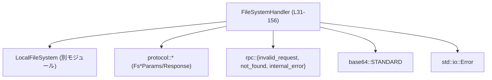
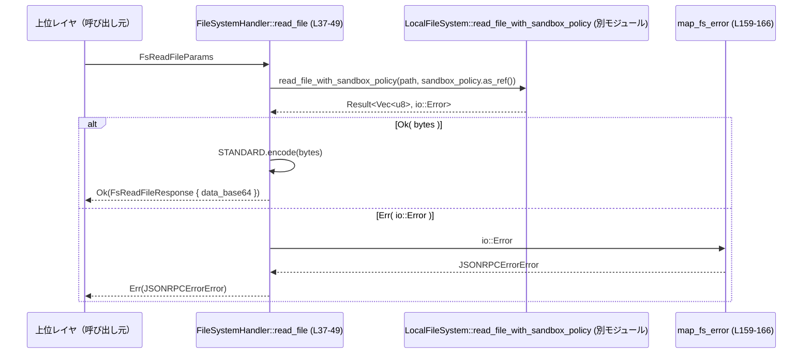

# exec-server/src/server/file_system_handler.rs

## 0. ざっくり一言

JSON-RPC 由来と思われるファイルシステム操作リクエスト（読み書き・ディレクトリ操作・コピー・削除など）を、内部の `LocalFileSystem` に委譲し、`io::Error` を JSON-RPC 用エラーに変換する非同期ハンドラです（根拠: `FileSystemHandler` と各メソッド定義 `file_system_handler.rs:L31-156`）。

---

## 1. このモジュールの役割

### 1.1 概要

- このモジュールは、ファイルシステム操作を行いたい上位レイヤからの要求を受け取り、内部の `LocalFileSystem` 実装に処理を委譲する役割を持ちます（`FileSystemHandler` のフィールド `file_system: LocalFileSystem` より、`file_system_handler.rs:L31-34`）。
- ファイルの内容はバイナリをそのまま扱わず、base64 文字列として送受信します（`STANDARD.encode` / `STANDARD.decode` の利用より、`file_system_handler.rs:L47-48, L55-59`）。
- すべてのファイルシステム操作は `*_with_sandbox_policy` メソッド経由で呼び出されており、サンドボックスポリシーに従ったアクセス制御が行われます（例: `read_file_with_sandbox_policy`, `file_system_handler.rs:L41-45`）。
- `io::Error` は `map_fs_error` を通じて `JSONRPCErrorError` にマッピングされ、`not_found` / `invalid_request` / `internal_error` として上位に返されます（`file_system_handler.rs:L159-166`）。

### 1.2 アーキテクチャ内での位置づけ

このモジュール内の主要依存関係は次の通りです。

- `FileSystemHandler` → `LocalFileSystem`: 実際のファイル操作を行う実装へ委譲（`file_system_handler.rs:L41-45, L60-63, L71-80, L88-92, L105-109, L126-135, L144-153`）。
- `FileSystemHandler` → `protocol::*`: 各操作のパラメータ・レスポンス型として利用（`FsReadFileParams` など、`file_system_handler.rs:L39-40, L53-54, L69-70, L86-87, L103-104, L124-125, L142-143`）。
- `FileSystemHandler` → `rpc::{invalid_request, not_found, internal_error}`: エラー構築に利用（`file_system_handler.rs:L55-59, L159-166`）。
- `FileSystemHandler` → `base64::STANDARD`: ファイル内容のエンコード／デコードに利用（`file_system_handler.rs:L47-48, L55-59`）。
- `FileSystemHandler` → `std::io::Error`: 低レベルエラーの判定に利用（`map_fs_error`, `file_system_handler.rs:L159-166`）。



この図は、このファイルに現れる依存関係だけを示しています。それ以外のモジュール（例えば JSON-RPC のディスパッチャなど）は、このチャンクには現れません。

### 1.3 設計上のポイント

- **薄いハンドラ層**  
  `FileSystemHandler` の各メソッドは、ほぼそのまま `LocalFileSystem` の対応メソッドに委譲する構造です（`file_system_handler.rs:L41-45, L60-63, L71-80, L88-92, L105-109, L126-135, L144-153`）。
- **サンドボックスポリシーの一貫利用**  
  すべての操作で `*_with_sandbox_policy` が呼ばれており、`params.sandbox_policy.as_ref()` を渡しています（例: `read_file_with_sandbox_policy`, `file_system_handler.rs:L41-45`）。サンドボックスポリシーが `None` のときの扱いは `LocalFileSystem` 実装に依存し、このチャンクからは分かりません。
- **エラー変換の集中管理**  
  `map_fs_error` が `io::Error` → `JSONRPCErrorError` の変換を一元管理し、呼び出し側は `map_err(map_fs_error)?` でエラー処理を共通化しています（`file_system_handler.rs:L45, L63, L80, L92, L109, L136, L154, L159-166`）。
- **デフォルト引数的な `unwrap_or(true)`**  
  `create_directory` と `remove` では `recursive` や `force` の `Option<bool>` に対し `unwrap_or(true)` を用い、指定がなければ「再帰的／強制」をデフォルトにしています（`file_system_handler.rs:L75, L130-131`）。
- **非公開 API**  
  すべてのメソッドと構造体は `pub(crate)` で宣言されており、このクレート内からのみ利用される内部ハンドラであることが分かります（`file_system_handler.rs:L31, L37, L51, L67, L84, L101, L122, L140`）。

---

## 2. 主要な機能一覧

このモジュールが提供する主な機能（`FileSystemHandler` のメソッド）を列挙します。

- ファイル読み込み: パスで指定されたファイルを読み込み、base64 文字列として返す（`read_file`, `file_system_handler.rs:L37-49`）。
- ファイル書き込み: base64 文字列をデコードしてファイルに書き込む（`write_file`, `file_system_handler.rs:L51-65`）。
- ディレクトリ作成: パスに対して（デフォルト再帰的に）ディレクトリを作成する（`create_directory`, `file_system_handler.rs:L67-82`）。
- メタデータ取得: ファイル／ディレクトリの種別や作成・更新時刻を取得する（`get_metadata`, `file_system_handler.rs:L84-99`）。
- ディレクトリ一覧取得: 指定ディレクトリ内のエントリ一覧を取得する（`read_directory`, `file_system_handler.rs:L101-120`）。
- 削除: ファイルまたはディレクトリを（デフォルト再帰的かつ強制的に）削除する（`remove`, `file_system_handler.rs:L122-138`）。
- コピー: ファイル／ディレクトリをコピーする（`copy`, `file_system_handler.rs:L140-156`）。
- `io::Error` → JSON-RPC エラー変換: ファイルシステムエラーを JSON-RPC 用エラー型にマッピングする（`map_fs_error`, `file_system_handler.rs:L159-166`）。

---

## 3. 公開 API と詳細解説

### 3.1 型一覧（構造体・列挙体など）

このファイルで定義されている公開（crate 内）型は `FileSystemHandler` のみです。

| 名前 | 種別 | フィールド | 役割 / 用途 | 根拠 |
|------|------|------------|-------------|------|
| `FileSystemHandler` | 構造体 | `file_system: LocalFileSystem` | `LocalFileSystem` をラップし、各種ファイル操作を非同期メソッドとして提供するハンドラ | `file_system_handler.rs:L31-34` |

`FileSystemHandler` は `#[derive(Clone, Default)]` が付与されており、クローン可能かつデフォルト構築可能です（`file_system_handler.rs:L31`）。これは、内部の `LocalFileSystem` も `Clone` と `Default` を実装していることを示唆しますが、実装の詳細はこのチャンクには現れません。

### 3.2 関数詳細（最大 7 件）

以下では、モジュール内の主要メソッド 7 件について詳細に説明します。

---

#### `FileSystemHandler::read_file(&self, params: FsReadFileParams) -> Result<FsReadFileResponse, JSONRPCErrorError>`  

（定義: `exec-server/src/server/file_system_handler.rs:L37-49`）

**概要**

- サンドボックスポリシー付きでファイルを読み込み、その内容を base64 文字列として `FsReadFileResponse` で返す非同期メソッドです。

**引数**

| 引数名 | 型 | 説明 |
|--------|----|------|
| `self` | `&FileSystemHandler` | 内部に保持している `LocalFileSystem` を通じて処理します。共有参照のため、メソッド自体は所有権を奪いません。 |
| `params` | `FsReadFileParams` | `path` と `sandbox_policy` などを含むパラメータ。ここでは `path` と `sandbox_policy` フィールドが利用されています（`file_system_handler.rs:L41-44`）。 |

**戻り値**

- `Result<FsReadFileResponse, JSONRPCErrorError>`  
  - `Ok(FsReadFileResponse)` の場合: `data_base64` フィールドにファイル内容を base64 エンコードした文字列が入ります（`file_system_handler.rs:L46-48`）。
  - `Err(JSONRPCErrorError)` の場合: ファイルシステムエラーが JSON-RPC 形式に変換されたものが返ります（`map_err(map_fs_error)`, `file_system_handler.rs:L45`）。

**内部処理の流れ**

1. `LocalFileSystem::read_file_with_sandbox_policy(&params.path, params.sandbox_policy.as_ref())` を呼び出し、`await` します（`file_system_handler.rs:L41-44`）。
2. その戻り値 `Result<Vec<u8>, io::Error>` に対して `map_err(map_fs_error)` を適用し、`io::Error` を `JSONRPCErrorError` に変換します（`file_system_handler.rs:L45, L159-166`）。
3. 成功時には得られたバイト列 `bytes` を `STANDARD.encode(bytes)` で base64 文字列に変換します（`file_system_handler.rs:L46-48`）。
4. `FsReadFileResponse { data_base64 }` を `Ok` で返します。

**Examples（使用例）**

> 注: `FsReadFileParams` の全フィールドはこのチャンクに現れないため、必要な他フィールドはコメントで示します。

```rust
use crate::server::file_system_handler::FileSystemHandler;
use crate::protocol::FsReadFileParams;

async fn example_read_file() -> Result<(), codex_app_server_protocol::JSONRPCErrorError> {
    // FileSystemHandler は Default で構築可能（L31）
    let handler = FileSystemHandler::default(); // LocalFileSystem も Default で初期化される

    // 読み込みパラメータの準備（実際の定義に応じて他フィールドも設定）
    let params = FsReadFileParams {
        path: "/tmp/example.txt".into(), // L41 に対応する path フィールド
        sandbox_policy: None,           // L43: as_ref() される Option である可能性が高い
        // 他に必須フィールドがあればここで設定
    };

    let resp = handler.read_file(params).await?; // L37-49
    println!("base64 data: {}", resp.data_base64); // L46-48

    Ok(())
}
```

**Errors / Panics**

- `LocalFileSystem::read_file_with_sandbox_policy` が `io::Error` を返した場合、`map_fs_error` によって以下のように変換されます（`file_system_handler.rs:L159-166`）。
  - `io::ErrorKind::NotFound` → `not_found(err.to_string())`
  - `io::ErrorKind::InvalidInput` → `invalid_request(err.to_string())`
  - その他 → `internal_error(err.to_string())`
- このメソッド内には `unwrap` や `expect` はなく、明示的な panic はありません。OOM などのランタイムレベルのパニックは通常の Rust と同様の前提です。

**Edge cases（エッジケース）**

- **存在しないパス**: `io::ErrorKind::NotFound` となり、`not_found` JSON-RPC エラーに変換されます（`file_system_handler.rs:L159-162`）。
- **サンドボックス違反などの無効な入力**: `LocalFileSystem` が `InvalidInput` を返した場合、`invalid_request` エラーになります（`file_system_handler.rs:L162-163`）。
- **非常に大きなファイル**: 全内容をメモリに読み込んだうえで base64 文字列に変換する構造のため、メモリ消費が大きくなります（`bytes` → `STANDARD.encode(bytes)`, `file_system_handler.rs:L41-48`）。

**使用上の注意点**

- このメソッドはファイル全体をメモリに展開してから返すため、大きなファイルを扱うときはメモリ使用量に注意が必要です。
- `sandbox_policy` が `None` のときの振る舞い（サンドボックスが無効化されるのか、デフォルトポリシーが適用されるのか）は `LocalFileSystem` の実装に依存し、このチャンクからは分かりません。
- 非同期メソッドであり、`await` できるコンテキスト（例えば `tokio` のランタイム）から呼ぶ必要があります。

---

#### `FileSystemHandler::write_file(&self, params: FsWriteFileParams) -> Result<FsWriteFileResponse, JSONRPCErrorError>`  

（定義: `exec-server/src/server/file_system_handler.rs:L51-65`）

**概要**

- base64 エンコードされた文字列をデコードし、サンドボックスポリシー付きでファイルに書き込む非同期メソッドです。

**引数**

| 引数名 | 型 | 説明 |
|--------|----|------|
| `self` | `&FileSystemHandler` | 内部の `LocalFileSystem` を用いて書き込み処理を行います。 |
| `params` | `FsWriteFileParams` | `path`, `sandbox_policy`, `data_base64` などを含むとみられるパラメータ。ここでは `data_base64`, `path`, `sandbox_policy` が利用されます（`file_system_handler.rs:L55-56, L60-61`）。 |

**戻り値**

- `Result<FsWriteFileResponse, JSONRPCErrorError>`  
  成功時は空の構造体 `FsWriteFileResponse {}` が返されます（`file_system_handler.rs:L64`）。エラー時は JSON-RPC 用エラーです。

**内部処理の流れ**

1. `params.data_base64` を `STANDARD.decode` でデコードします（`file_system_handler.rs:L55`）。
2. base64 デコードエラーがあれば `invalid_request` を構築し、そのまま `Err` として返します（`file_system_handler.rs:L55-59`）。
3. デコードされた `bytes` を `LocalFileSystem::write_file_with_sandbox_policy(&params.path, bytes, params.sandbox_policy.as_ref())` に渡し、`await` します（`file_system_handler.rs:L60-62`）。
4. その結果の `io::Error` を `map_fs_error` で JSON-RPC エラーに変換します（`file_system_handler.rs:L63`）。
5. 成功時は `FsWriteFileResponse {}` を `Ok` で返します（`file_system_handler.rs:L64`）。

**Examples（使用例）**

```rust
use crate::server::file_system_handler::FileSystemHandler;
use crate::protocol::FsWriteFileParams;

async fn example_write_file() -> Result<(), codex_app_server_protocol::JSONRPCErrorError> {
    let handler = FileSystemHandler::default(); // L31

    let content = b"hello world";
    let data_base64 = base64::engine::general_purpose::STANDARD.encode(content); // L47 と同じエンジン

    let params = FsWriteFileParams {
        path: "/tmp/example.txt".into(), // L60
        data_base64,                     // L55
        sandbox_policy: None,           // L61
        // 他フィールドがあれば定義に合わせて設定
    };

    handler.write_file(params).await?; // L51-65
    Ok(())
}
```

**Errors / Panics**

- base64 デコード失敗時:
  - `invalid_request(format!("fs/writeFile requires valid base64 dataBase64: {err}"))` に変換され、`Err(JSONRPCErrorError)` として返されます（`file_system_handler.rs:L55-59`）。
- ファイルシステム書き込み時のエラーは `map_fs_error` を経由して `not_found` / `invalid_request` / `internal_error` に変換されます（`file_system_handler.rs:L60-63, L159-166`）。
- 明示的な panic はありません。

**Edge cases（エッジケース）**

- **不正な base64 文字列**: `STANDARD.decode` がエラーを返し、その場で `invalid_request` エラーになります（`file_system_handler.rs:L55-59`）。ファイルシステムには一切アクセスしません。
- **書き込み先パスが存在しない / 不正**: `LocalFileSystem` 側で `io::Error` が発生し、`map_fs_error` によって変換されます（`file_system_handler.rs:L60-63`）。
- **非常に大きな書き込み**: base64 文字列 → `Vec<u8>` へのデコード時にメモリを確保します。入力サイズに比例したメモリが必要になります。

**使用上の注意点**

- クライアントから渡される base64 文字列に対し、このメソッド自身はサイズ制限を設けていません。大きすぎる入力はメモリ使用量増大や DoS リスクにつながる可能性があります。
- 書き込みモード（追記か上書きか）は `LocalFileSystem::write_file_with_sandbox_policy` の仕様に依存し、このチャンクからは分かりません。
- 失敗時に部分的に書き込まれたデータの扱いも `LocalFileSystem` 実装に依存します。

---

#### `FileSystemHandler::create_directory(&self, params: FsCreateDirectoryParams) -> Result<FsCreateDirectoryResponse, JSONRPCErrorError>`  

（定義: `exec-server/src/server/file_system_handler.rs:L67-82`）

**概要**

- 指定されたパスに対し、（デフォルトでは）再帰的にディレクトリを作成する非同期メソッドです。

**引数**

| 引数名 | 型 | 説明 |
|--------|----|------|
| `self` | `&FileSystemHandler` | 内部 `LocalFileSystem` を用いてディレクトリ作成を行います。 |
| `params` | `FsCreateDirectoryParams` | `path`, `recursive`, `sandbox_policy` を含むとみられるパラメータ。ここでは `path`, `recursive`, `sandbox_policy` が利用されています（`file_system_handler.rs:L72-77`）。 |

**戻り値**

- `Result<FsCreateDirectoryResponse, JSONRPCErrorError>`  
  成功時は空の構造体 `FsCreateDirectoryResponse {}` を返します（`file_system_handler.rs:L81`）。

**内部処理の流れ**

1. `CreateDirectoryOptions { recursive: params.recursive.unwrap_or(true) }` を構築します（`file_system_handler.rs:L74-76`）。
2. `LocalFileSystem::create_directory_with_sandbox_policy(&params.path, options, params.sandbox_policy.as_ref())` を呼び、`await` します（`file_system_handler.rs:L71-78`）。
3. `io::Error` が返った場合は `map_fs_error` で変換し、`Err` として返します（`file_system_handler.rs:L79-80`）。
4. 成功時は `FsCreateDirectoryResponse {}` を `Ok` で返します（`file_system_handler.rs:L81`）。

**Examples（使用例）**

```rust
use crate::server::file_system_handler::FileSystemHandler;
use crate::protocol::FsCreateDirectoryParams;

async fn example_create_directory() -> Result<(), codex_app_server_protocol::JSONRPCErrorError> {
    let handler = FileSystemHandler::default();

    let params = FsCreateDirectoryParams {
        path: "/tmp/new_dir/sub".into(),  // L72-73
        recursive: Some(true),            // L75: unwrap_or(true)
        sandbox_policy: None,             // L77
        // 他フィールドがあれば設定
    };

    handler.create_directory(params).await?; // L67-82
    Ok(())
}
```

**Errors / Panics**

- 既に存在する・権限がないなどのエラーは `LocalFileSystem` から `io::Error` として返され、それが `map_fs_error` で変換されます（`file_system_handler.rs:L79-80, L159-166`）。
- 明示的な panic はありません。

**Edge cases（エッジケース）**

- `params.recursive` が `None` の場合: `unwrap_or(true)` により `recursive: true` が用いられます（`file_system_handler.rs:L75`）。
- 権限不足やサンドボックス外のパス: `InvalidInput` などの `io::Error` によって `invalid_request` か `internal_error` になると考えられますが、具体的なエラー種別は `LocalFileSystem` に依存します。
- パスが空文字や不正フォーマットの場合の挙動も、`LocalFileSystem` に委ねられています。

**使用上の注意点**

- `recursive` のデフォルトが `true` であるため、親ディレクトリを含めてまとめて作成されます。非再帰的な動作を求める場合は `Some(false)` を明示的に指定する必要があります。
- ディレクトリ作成はファイルシステムの状態を変化させる操作なので、エラー時のロールバックなどが必要な場合は上位レイヤで適切な制御が必要です。

---

#### `FileSystemHandler::get_metadata(&self, params: FsGetMetadataParams) -> Result<FsGetMetadataResponse, JSONRPCErrorError>`  

（定義: `exec-server/src/server/file_system_handler.rs:L84-99`）

**概要**

- 指定パスのメタデータ（ディレクトリかどうか、ファイルかどうか、作成日時、更新日時）を取得する非同期メソッドです。

**引数**

| 引数名 | 型 | 説明 |
|--------|----|------|
| `self` | `&FileSystemHandler` | 内部の `LocalFileSystem` を用いてメタデータを取得します。 |
| `params` | `FsGetMetadataParams` | `path`, `sandbox_policy` を含むとみられるパラメータ（`file_system_handler.rs:L90`）。 |

**戻り値**

- `Result<FsGetMetadataResponse, JSONRPCErrorError>`  
  `FsGetMetadataResponse` のフィールドとして `is_directory`, `is_file`, `created_at_ms`, `modified_at_ms` を返します（`file_system_handler.rs:L93-98`）。

**内部処理の流れ**

1. `LocalFileSystem::get_metadata_with_sandbox_policy(&params.path, params.sandbox_policy.as_ref())` を呼び、`await` します（`file_system_handler.rs:L88-91`）。
2. `io::Error` の場合は `map_fs_error` で JSON-RPC エラーに変換します（`file_system_handler.rs:L92`）。
3. 成功時は得られた `metadata` から値をコピーして `FsGetMetadataResponse` を構築し、`Ok` として返します（`file_system_handler.rs:L93-98`）。

**Examples（使用例）**

```rust
use crate::server::file_system_handler::FileSystemHandler;
use crate::protocol::FsGetMetadataParams;

async fn example_get_metadata() -> Result<(), codex_app_server_protocol::JSONRPCErrorError> {
    let handler = FileSystemHandler::default();

    let params = FsGetMetadataParams {
        path: "/tmp/example.txt".into(), // L90
        sandbox_policy: None,            // L90
        // 他フィールドがあれば設定
    };

    let meta = handler.get_metadata(params).await?; // L84-99

    println!(
        "is_file={}, is_directory={}, created={}, modified={}",
        meta.is_file, meta.is_directory, meta.created_at_ms, meta.modified_at_ms
    );

    Ok(())
}
```

**Errors / Panics**

- パスが存在しない場合などは `LocalFileSystem` の `io::Error` を `map_fs_error` が変換します（`file_system_handler.rs:L88-92, L159-166`）。
- 明示的な panic はありません。

**Edge cases（エッジケース）**

- シンボリックリンク等の扱いは `LocalFileSystem` 側のメタデータ実装に依存し、このチャンクからは分かりません。
- `metadata.is_directory` と `metadata.is_file` の両方が `false` であるような特殊なファイルタイプ（ソケットなど）の扱いについても、このコード単体からは判断できません。

**使用上の注意点**

- メタデータの時間単位はフィールド名から `ms`（ミリ秒）であると推測されますが、正確な起点（UNIX エポックなど）はこのチャンクからは分かりません。利用側で意味を決め打ちしない方が安全です。

---

#### `FileSystemHandler::read_directory(&self, params: FsReadDirectoryParams) -> Result<FsReadDirectoryResponse, JSONRPCErrorError>`  

（定義: `exec-server/src/server/file_system_handler.rs:L101-120`）

**概要**

- 指定ディレクトリ内のエントリ一覧を取得し、`FsReadDirectoryEntry` のベクタとして返す非同期メソッドです。

**引数**

| 引数名 | 型 | 説明 |
|--------|----|------|
| `self` | `&FileSystemHandler` | 内部の `LocalFileSystem` を用います。 |
| `params` | `FsReadDirectoryParams` | `path`, `sandbox_policy` を含むとみられます（`file_system_handler.rs:L107`）。 |

**戻り値**

- `Result<FsReadDirectoryResponse, JSONRPCErrorError>`  
  `FsReadDirectoryResponse { entries: Vec<FsReadDirectoryEntry> }` を返します（`file_system_handler.rs:L110-119`）。

**内部処理の流れ**

1. `LocalFileSystem::read_directory_with_sandbox_policy(&params.path, params.sandbox_policy.as_ref())` を呼び、`await` します（`file_system_handler.rs:L105-108`）。
2. 結果の `entries`（おそらく `Vec<LocalFsDirectoryEntry>` のようなもの）に対して `into_iter()` を行い、各エントリを `FsReadDirectoryEntry` にマッピングします（`file_system_handler.rs:L111-117`）。
3. 変換後の `Vec<FsReadDirectoryEntry>` を `FsReadDirectoryResponse { entries }` として `Ok` で返します（`file_system_handler.rs:L110-119`）。

**Examples（使用例）**

```rust
use crate::server::file_system_handler::FileSystemHandler;
use crate::protocol::FsReadDirectoryParams;

async fn example_read_directory() -> Result<(), codex_app_server_protocol::JSONRPCErrorError> {
    let handler = FileSystemHandler::default();

    let params = FsReadDirectoryParams {
        path: "/tmp".into(),     // L107
        sandbox_policy: None,    // L107
        // 他フィールドがあれば設定
    };

    let resp = handler.read_directory(params).await?; // L101-120
    for entry in resp.entries {
        println!(
            "{} (file: {}, dir: {})",
            entry.file_name, entry.is_file, entry.is_directory
        );
    }

    Ok(())
}
```

**Errors / Panics**

- ディレクトリが存在しない、ディレクトリでない、権限がない等のエラーは `LocalFileSystem` 経由で `io::Error` として返され、それを `map_fs_error` が JSON-RPC エラーに変換します（`file_system_handler.rs:L105-109, L159-166`）。
- 明示的な panic はありません。

**Edge cases（エッジケース）**

- エントリ数が非常に多いディレクトリ: 全エントリを `Vec` に保持するため、メモリ使用量が増えます（`collect()`, `file_system_handler.rs:L118`）。
- 隠しファイルや特殊ファイルの扱いは `LocalFileSystem` の戻り値仕様に依存します。

**使用上の注意点**

- ページングやフィルタリングはこのレイヤでは行われていません。大規模ディレクトリを扱う場合は、上位レイヤでの対策（分割取得など）が必要になります。

---

#### `FileSystemHandler::remove(&self, params: FsRemoveParams) -> Result<FsRemoveResponse, JSONRPCErrorError>`  

（定義: `exec-server/src/server/file_system_handler.rs:L122-138`）

**概要**

- 指定されたパスのファイルまたはディレクトリを削除する非同期メソッドです。`recursive` と `force` は指定がない場合に `true` がデフォルトとなります。

**引数**

| 引数名 | 型 | 説明 |
|--------|----|------|
| `self` | `&FileSystemHandler` | 内部 `LocalFileSystem` を用います。 |
| `params` | `FsRemoveParams` | `path`, `recursive`, `force`, `sandbox_policy` を含むとみられます（`file_system_handler.rs:L128-133`）。 |

**戻り値**

- `Result<FsRemoveResponse, JSONRPCErrorError>`  
  成功時は空の `FsRemoveResponse {}` を返します（`file_system_handler.rs:L137`）。

**内部処理の流れ**

1. `RemoveOptions { recursive: params.recursive.unwrap_or(true), force: params.force.unwrap_or(true) }` を構築します（`file_system_handler.rs:L129-131`）。
2. `LocalFileSystem::remove_with_sandbox_policy(&params.path, options, params.sandbox_policy.as_ref())` を呼び、`await` します（`file_system_handler.rs:L126-134`）。
3. `io::Error` を `map_fs_error` で JSON-RPC エラーに変換します（`file_system_handler.rs:L135-136`）。
4. 成功時に `FsRemoveResponse {}` を `Ok` で返します（`file_system_handler.rs:L137`）。

**Examples（使用例）**

```rust
use crate::server::file_system_handler::FileSystemHandler;
use crate::protocol::FsRemoveParams;

async fn example_remove_recursive() -> Result<(), codex_app_server_protocol::JSONRPCErrorError> {
    let handler = FileSystemHandler::default();

    let params = FsRemoveParams {
        path: "/tmp/old_dir".into(), // L128
        recursive: None,             // L130: unwrap_or(true) → true（デフォルト再帰）
        force: None,                 // L131: unwrap_or(true) → true（デフォルト強制）
        sandbox_policy: None,        // L133
        // 他フィールドがあれば設定
    };

    handler.remove(params).await?; // L122-138
    Ok(())
}
```

**Errors / Panics**

- 権限不足やサンドボックス違反などは、`LocalFileSystem` の `io::Error` として報告され、それを `map_fs_error` が変換します（`file_system_handler.rs:L126-136, L159-166`）。
- 明示的な panic はありません。

**Edge cases（エッジケース）**

- `recursive` / `force` が `None`: 両方とも `true` として扱われ、再帰かつ強制削除になります（`file_system_handler.rs:L129-131`）。
- `recursive: Some(false)` でディレクトリを削除しようとした場合の挙動は `LocalFileSystem` に依存します（通常はエラーや `InvalidInput` が想定されますが、このチャンクからは断定できません）。
- 削除対象が存在しない場合は `NotFound` となり、`not_found` エラーになります（`file_system_handler.rs:L159-162`）。

**使用上の注意点**

- デフォルトで再帰かつ強制削除を行う構造のため、クライアントが `recursive` / `force` を明示しない場合でも強い削除操作になる点に注意が必要です。
- 誤ったパスを指定すると、大きなディレクトリツリーを一度に削除する危険性があります。上位レイヤでの検証や確認ステップが重要になります。

---

#### `FileSystemHandler::copy(&self, params: FsCopyParams) -> Result<FsCopyResponse, JSONRPCErrorError>`  

（定義: `exec-server/src/server/file_system_handler.rs:L140-156`）

**概要**

- `source_path` から `destination_path` へファイルまたはディレクトリをコピーする非同期メソッドです。

**引数**

| 引数名 | 型 | 説明 |
|--------|----|------|
| `self` | `&FileSystemHandler` | 内部 `LocalFileSystem` を用います。 |
| `params` | `FsCopyParams` | `source_path`, `destination_path`, `recursive`, `sandbox_policy` を含むとみられます（`file_system_handler.rs:L145-151`）。 |

**戻り値**

- `Result<FsCopyResponse, JSONRPCErrorError>`  
  成功時は空の `FsCopyResponse {}` を返します（`file_system_handler.rs:L155`）。

**内部処理の流れ**

1. `CopyOptions { recursive: params.recursive }` を構築します（`file_system_handler.rs:L148-150`）。
2. `LocalFileSystem::copy_with_sandbox_policy(&params.source_path, &params.destination_path, options, params.sandbox_policy.as_ref())` を呼び、`await` します（`file_system_handler.rs:L144-152`）。
3. `io::Error` が発生した場合は `map_fs_error` で JSON-RPC エラーに変換します（`file_system_handler.rs:L153-154`）。
4. 成功時に `FsCopyResponse {}` を返します（`file_system_handler.rs:L155`）。

**Examples（使用例）**

```rust
use crate::server::file_system_handler::FileSystemHandler;
use crate::protocol::FsCopyParams;

async fn example_copy() -> Result<(), codex_app_server_protocol::JSONRPCErrorError> {
    let handler = FileSystemHandler::default();

    let params = FsCopyParams {
        source_path: "/tmp/src.txt".into(),       // L146
        destination_path: "/tmp/dst.txt".into(),  // L147
        recursive: false,                         // L149
        sandbox_policy: None,                     // L151
        // 他フィールドがあれば設定
    };

    handler.copy(params).await?; // L140-156
    Ok(())
}
```

**Errors / Panics**

- 不存在・権限不足・サンドボックス違反などのファイルシステムエラーは `map_fs_error` によって JSON-RPC エラーに変換されます（`file_system_handler.rs:L144-154, L159-166`）。
- 明示的な panic はありません。

**Edge cases（エッジケース）**

- `recursive` が `false` の状態でディレクトリをコピーしようとした際の振る舞いは `LocalFileSystem` 実装に依存します。
- コピー先ファイルが既に存在する場合の上書き／エラーなどの挙動も、このチャンクには書かれていません。

**使用上の注意点**

- ディレクトリコピーの挙動（上書きポリシーやシンボリックリンクの扱いなど）は `LocalFileSystem` の仕様に依存するため、利用時に確認する必要があります。
- 大規模なディレクトリツリーを再帰コピーする場合、時間と I/O のコストが大きくなる可能性があります。

---

#### `FileSystemHandler::read_file` 以外のメソッド共通の並行性・安全性

これらのメソッドはすべて

- `&self` を取り（所有権を奪わない）、
- `async fn` として定義されている

という点で共通です（`file_system_handler.rs:L37, L51, L67, L84, L101, L122, L140`）。

Rust の所有権・借用システムにより、コンパイル時にデータ競合は防止されますが、`LocalFileSystem` が `Send + Sync` であるかどうかはこのチャンクからは分かりません。`FileSystemHandler` が `Clone` 可能であるため、複数タスク間でクローンを共有して同時に呼び出す構成が想定されますが、同時呼び出し時の内部動作は `LocalFileSystem` の実装に依存します。

---

### 3.3 その他の関数

ヘルパー関数の一覧です。

| 関数名 | 役割（1 行） | 根拠 |
|--------|--------------|------|
| `map_fs_error(err: io::Error) -> JSONRPCErrorError` | `io::Error` を `ErrorKind` に応じて `not_found` / `invalid_request` / `internal_error` のいずれかに変換する | `file_system_handler.rs:L159-166` |

`map_fs_error` の詳細:

- `err.kind() == io::ErrorKind::NotFound` → `not_found(err.to_string())`（`file_system_handler.rs:L160-162`）
- `err.kind() == io::ErrorKind::InvalidInput` → `invalid_request(err.to_string())`（`file_system_handler.rs:L162-163`）
- それ以外 → `internal_error(err.to_string())`（`file_system_handler.rs:L163-165`）

これにより、ファイルシステムエラーがクライアントに対して一貫した JSON-RPC エラー形式で返されます。

---

## 4. データフロー

ここでは代表的なシナリオとして、`read_file` 呼び出し時のデータフローを説明します。

### 4.1 処理の要点

- 上位レイヤ（例えば JSON-RPC ハンドラ）が `FsReadFileParams` を構築し、`FileSystemHandler::read_file` を呼び出します。
- `read_file` は `LocalFileSystem::read_file_with_sandbox_policy` を呼び出し、バイト列を取得します。
- 正常時はそれを base64 文字列に変換して `FsReadFileResponse` として返します。
- エラー時は `io::Error` を `map_fs_error` へ渡して JSON-RPC エラーに変換し、`Err` として返します。

### 4.2 シーケンス図



この図には、このチャンクに現れない上位レイヤ（`Caller`）や `LocalFileSystem` のメソッドも登場しますが、名称と呼び出し関係は実際のコードから読み取れる範囲にとどめています（`file_system_handler.rs:L41-45, L45, L159-166`）。

他のメソッド（`write_file`, `create_directory`, `remove`, `copy` など）も同様に、

1. パラメータから `Options` 構造体を組み立てる（必要な場合）。
2. 対応する `LocalFileSystem::*_with_sandbox_policy` メソッドを `await` する。
3. `io::Error` を `map_fs_error` で変換して `Err` にするか、レスポンス構造体を `Ok` で返す。

という同じパターンで動作します。

---

## 5. 使い方（How to Use）

### 5.1 基本的な使用方法

典型的な利用フローは以下のようになります。

1. `FileSystemHandler` を初期化する（`Default` 実装を利用）。
2. 上位レイヤで受け取ったリクエストから `Fs*Params` を構築する。
3. 対応するメソッド（`read_file`, `write_file`, …）を `await` し、`Result` を処理する。

```rust
use crate::server::file_system_handler::FileSystemHandler;
use crate::protocol::{FsReadFileParams, FsReadFileResponse};

async fn handle_read_file_request(path: String)
    -> Result<FsReadFileResponse, codex_app_server_protocol::JSONRPCErrorError>
{
    // 1. ハンドラの用意（L31）
    let handler = FileSystemHandler::default();

    // 2. パラメータの構築（L41-44）
    let params = FsReadFileParams {
        path,
        sandbox_policy: None,
        // プロトコル定義に他フィールドがあれば設定
    };

    // 3. メイン処理呼び出し（L37-49）
    handler.read_file(params).await
}
```

### 5.2 よくある使用パターン

1. **ファイルのアップロード／ダウンロード**

   - アップロード: クライアント → base64 文字列 → `write_file` → サーバ側ファイル。
   - ダウンロード: `read_file` → base64 文字列 → クライアントでデコード。

2. **ディレクトリ操作（一覧・作成・削除）**

   - `read_directory` で一覧を取得し、`create_directory` や `remove` で構造を変更。
   - `recursive` フラグを使って、一括削除やツリー作成を行う。

3. **バックアップやテンポラリコピー**

   - `copy` を使って同一サンドボックス内でファイルやディレクトリを複製。

### 5.3 よくある間違い

```rust
// 間違い例: base64 でないデータをそのまま FsWriteFileParams::data_base64 に詰める
let params = FsWriteFileParams {
    path: "/tmp/file.txt".into(),
    data_base64: "plain text, not base64".into(),
    sandbox_policy: None,
};
let result = handler.write_file(params).await;
// → L55-59 により invalid_request エラーになる

// 正しい例: 事前に base64 エンコードする
let raw = b"plain text, but encoded";
let data_base64 = base64::engine::general_purpose::STANDARD.encode(raw);
let params = FsWriteFileParams {
    path: "/tmp/file.txt".into(),
    data_base64,
    sandbox_policy: None,
};
let result = handler.write_file(params).await; // OK
```

```rust
// 間違い例: recursive / force を false にしたいのに None のままにする
let params = FsRemoveParams {
    path: "/tmp/important_dir".into(),
    recursive: None, // L130: unwrap_or(true) → true になる
    force: None,     // L131: unwrap_or(true) → true になる
    sandbox_policy: None,
};

// 正しい例: 非再帰・非強制で削除したい場合
let params = FsRemoveParams {
    path: "/tmp/important_dir".into(),
    recursive: Some(false), // L130
    force: Some(false),     // L131
    sandbox_policy: None,
};
```

### 5.4 使用上の注意点（まとめ）

- **安全性（サンドボックス）**
  - すべての操作が `*_with_sandbox_policy` を通るため、サンドボックスポリシーに依存した安全性が担保されます（`file_system_handler.rs:L41, L60, L71, L88, L105, L126, L144`）。
  - `sandbox_policy: None` の場合の挙動は `LocalFileSystem` に依存し、このチャンクだけでは判断できません。

- **エラー処理契約**
  - 低レベルの `io::ErrorKind` に応じて `not_found` / `invalid_request` / `internal_error` のいずれかが返るため、クライアントはこれらのエラー種別を前提として処理を実装できます（`file_system_handler.rs:L159-166`）。

- **データサイズと性能**
  - `read_file` と `write_file` はファイル内容全体をメモリに保持する設計であり、大きなファイルではメモリと CPU（base64 変換）の負荷が高くなります（`file_system_handler.rs:L41-48, L55-59`）。
  - `read_directory` も `collect()` によって全エントリを `Vec` に格納するため、巨大なディレクトリではメモリ使用量が増えます（`file_system_handler.rs:L111-118`）。

- **並行性**
  - メソッドは `&self` を受け取る非同期関数であり、Rust の型システムによりデータ競合は防がれています。
  - ただし、`LocalFileSystem` が内部でブロッキング I/O を使用しているか、`Send + Sync` かどうかはこのチャンクからは分からないため、実際の並行性能はその実装に依存します。

- **セキュリティ／DoS 考慮**
  - 入力サイズ制限はこのレイヤにはなく、悪意あるクライアントが極端に大きな base64 データや大量の操作を送ると、メモリや I/O を消費する可能性があります。

---

## 6. 変更の仕方（How to Modify）

### 6.1 新しい機能を追加する場合

ファイルシステム関連の新しい RPC 操作を追加したい場合、次のような流れが自然です。

1. **protocol 側の型を追加**
   - `Fs*Params`, `Fs*Response` に倣い、新しいリクエスト／レスポンス型を `crate::protocol` モジュールに追加します（このチャンクには定義はありませんが、`use crate::protocol::*` が示唆, `file_system_handler.rs:L12-26`）。

2. **LocalFileSystem に対応メソッドを追加**
   - 既存の `*_with_sandbox_policy` に倣って、新機能に対応するメソッドを `LocalFileSystem` に実装します（例: `read_file_with_sandbox_policy`, `file_system_handler.rs:L41-45`）。

3. **FileSystemHandler にラッパーメソッドを追加**
   - 本ファイルの `impl FileSystemHandler` ブロック（`file_system_handler.rs:L36-156`）に新たな `pub(crate) async fn` を追加し、他のメソッドと同様に:
     - `*_with_sandbox_policy` を呼び出す。
     - 必要であれば base64 変換などを行う。
     - `map_err(map_fs_error)` でエラーを変換する。
   - エラー変換パターンが `map_fs_error` で足りない場合は、`io::ErrorKind` の条件分岐を拡張することも検討できます。

4. **上位レイヤ（RPC ルータ等）から新メソッドを呼び出す**
   - このチャンクには上位レイヤのコードは含まれていないため、実際のルーティング箇所を参照し、新しい RPC メソッド名と `FileSystemHandler` メソッドを対応づけます。

### 6.2 既存の機能を変更する場合

変更時の注意点を列挙します。

- **影響範囲の確認**
  - すべてのメソッドが共通して `LocalFileSystem` と `map_fs_error` に依存しているため、これらのシグネチャを変更すると、本ファイルだけでなく `LocalFileSystem` 実装・他モジュールにも影響します（`file_system_handler.rs:L41-45, L60-63, L71-80, L88-92, L105-109, L126-135, L144-153, L159-166`）。
  - `Fs*Params` / `Fs*Response` 型のフィールドを変更する場合は、プロトコル全体との整合性を確認する必要があります。

- **契約（前提条件・返り値の意味）**
  - `recursive` / `force` のデフォルト値（`unwrap_or(true)`）など、クライアントが期待している振る舞いを変えると互換性に影響します（`file_system_handler.rs:L75, L130-131`）。
  - エラーのマッピングルール（`NotFound` → `not_found` など）を変更する場合、既存クライアントのエラー処理ロジックに影響します（`file_system_handler.rs:L159-166`）。

- **テストと検証**
  - このチャンクにはテストコードは含まれていません。変更後は、少なくとも以下の観点でテストを追加・更新することが望ましいです。
    - 正常系: 各メソッドが `LocalFileSystem` の結果を正しくラップして返すか。
    - エラー系: `NotFound` / `InvalidInput` / その他に対して適切な JSON-RPC エラーが返るか。
    - 特殊フラグ（`recursive`, `force`）のデフォルト挙動。
  - ファイルシステムを直接操作するテストは環境依存になりやすいため、`LocalFileSystem` をモック化して `io::ErrorKind` の違いを確認するテストが有用です。

---

## 7. 関連ファイル

このモジュールと密接に関係するファイル・ディレクトリを、コード中の `use` 宣言を根拠に列挙します。

| パス | 役割 / 関係 | 根拠 |
|------|------------|------|
| `crate::local_file_system::LocalFileSystem` | 実際のファイルシステム操作（`*_with_sandbox_policy` メソッド群）を提供し、`FileSystemHandler` がそれをラップしている | `file_system_handler.rs:L11, L41-45, L60-63, L71-80, L88-92, L105-109, L126-135, L144-153` |
| `crate::protocol` モジュール | `FsReadFileParams`, `FsReadFileResponse` など、各操作のパラメータ／レスポンス型を定義するプロトコル層 | `file_system_handler.rs:L12-26` |
| `crate::rpc` モジュール | `internal_error`, `invalid_request`, `not_found` 関数を通じて、`JSONRPCErrorError` の具体的なインスタンスを生成する | `file_system_handler.rs:L27-29, L55-59, L159-166` |
| `crate::CopyOptions`, `CreateDirectoryOptions`, `RemoveOptions` | ファイルシステム操作のオプションを表現する構造体群。`LocalFileSystem` 呼び出しの第 2 引数として渡される | `file_system_handler.rs:L7-10, L74-76, L129-131, L148-150` |
| `codex_app_server_protocol::JSONRPCErrorError` | このサーバがクライアントへ返す JSON-RPC エラー型。すべてのメソッドのエラー型として用いられる | `file_system_handler.rs:L5, L40, L54, L70, L87, L104, L125, L143, L159` |

これらのファイル／モジュールの中身はこのチャンクには含まれていないため、詳細な挙動や追加の制約は、それぞれの定義を参照する必要があります。
