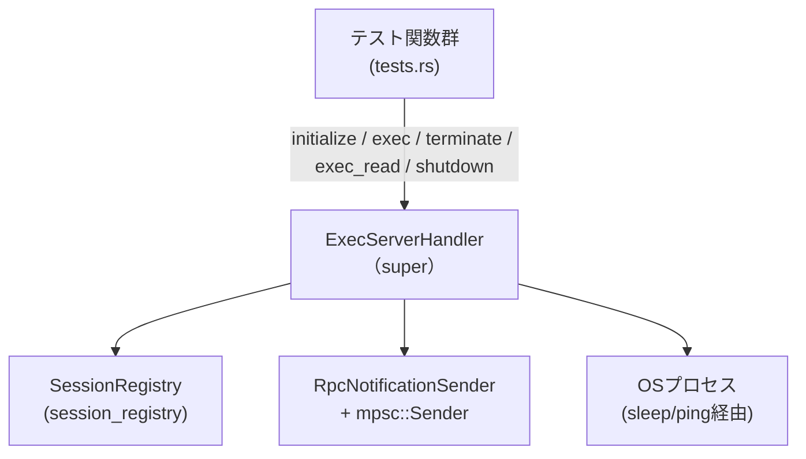
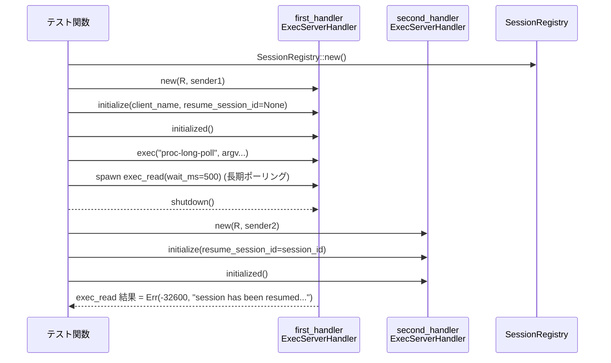
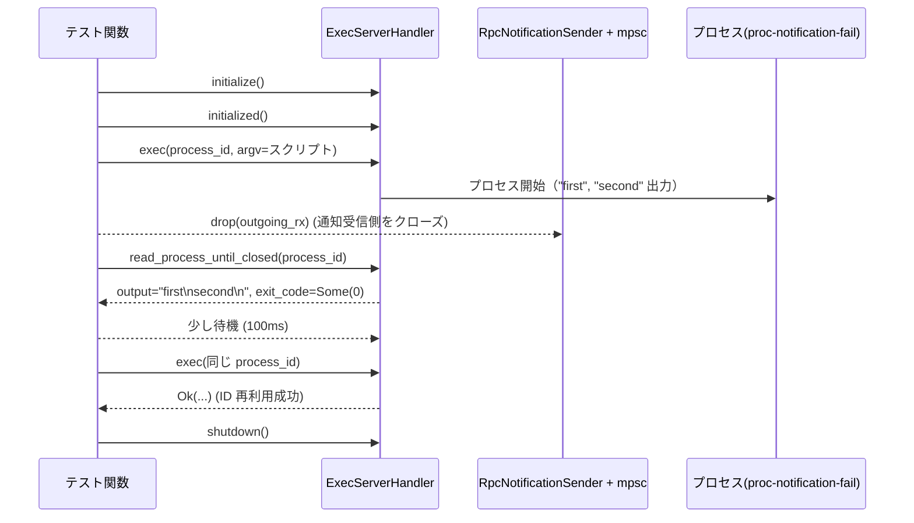

# exec-server/src/server/handler/tests.rs コード解説

## 0. ざっくり一言

このファイルは、`ExecServerHandler` の **プロセス実行・セッション管理・出力読み取り** に関する振る舞いを、非同期テストで検証するモジュールです。  
特に、**重複 `process_id` の扱い、セッション再接続、長期ポーリング中のエラー、通知チャネル切断時の挙動** など、外部 API の契約をテスト経由で明示しています。  
（exec-server/src/server/handler/tests.rs:L20-336）

---

## 1. このモジュールの役割

### 1.1 概要

- `ExecServerHandler` が提供する以下のような機能の外部的な契約をテストで検証しています。  
  - プロセスの開始 (`exec`) と `process_id` の一意性（重複時のエラー）  
  - プロセス終了後の `terminate` の戻り値（`running: false` の報告）  
  - セッションの再接続（`resume_session_id`）と、再接続中の/後のリクエストの扱い  
  - 通知チャネル（`RpcNotificationSender` の受信側）が閉じられた後も、出力と終了コードが保持されること  
  - `exec_read` による長期ポーリング読み取り (`wait_ms`) の終了条件とエラー条件  
  （exec-server/src/server/handler/tests.rs:L67-213, L256-336）

### 1.2 アーキテクチャ内での位置づけ

このテストモジュールは、次のコンポーネントを組み合わせて `ExecServerHandler` の動作を検証しています。

- `ExecServerHandler`（このモジュールの `super` からインポート）  
- セッションを管理する `SessionRegistry`  
- 通知送信用の `RpcNotificationSender<mpsc::Sender<_>>`  
- 非同期ランタイムとしての `tokio`（`#[tokio::test]`, `join!`, `spawn`）  
- 実プロセスを起動するための `ExecParams` / `ProcessId` などのプロトコル型  
（exec-server/src/server/handler/tests.rs:L9-18, L67-73, L145-190, L258-262）

関係を簡略化した図は次のとおりです（モジュール全体の関係）:



この図は、本ファイル全体 (L20-336) に現れる主なコンポーネントと依存関係を表現しています。  
（exec-server/src/server/handler/tests.rs:L9-18, L67-73, L145-150, L258-262）

### 1.3 設計上のポイント

コードから読み取れる設計上の特徴は次のとおりです。

- **ヘルパー関数による共通化**  
  - `exec_params` / `exec_params_with_argv` によって、テストで使う `ExecParams` の生成ロジックを共通化しています。  
  - `shell_argv` / `sleep_argv` / `windows_command_processor` により、Unix / Windows 両対応のコマンドラインを組み立てます。  
  （exec-server/src/server/handler/tests.rs:L20-33, L43-65）

- **状態を持たないユーティリティと状態を持つハンドラの分離**  
  - ヘルパー関数群は純粋関数であり、グローバル状態を持ちません。  
  - 実際の状態（セッション、プロセス）は `ExecServerHandler` + `SessionRegistry` 内部で管理され、テストからはメソッド呼び出しのみが見えています。  
  （exec-server/src/server/handler/tests.rs:L20-65, L67-84）

- **非同期並行性のテスト**  
  - `tokio::join!` や `tokio::spawn` と `Arc<ExecServerHandler>` を組み合わせて、同一ハンドラへの並行リクエスト（同時 `exec`、長期ポーリング中の `shutdown` 等）をテストしています。  
  （exec-server/src/server/handler/tests.rs:L86-99, L171-181）

- **エラーハンドリング契約の明示**  
  - JSON-RPC 風のエラーオブジェクト（`code`, `message` フィールドを持つ型）が返るケースを明示的にテストしています（エラーコード `-32600` と各メッセージ）。  
  （exec-server/src/server/handler/tests.rs:L102-108, L202-210, L236-247）

- **時間制約による安全装置**  
  - 各種ループで `Instant::now()` と `Duration` を用いてタイムアウトを設け、プロセス終了やストリームクローズを待つテストがハングしないようにしています。  
  （exec-server/src/server/handler/tests.rs:L122-137, L304-335）

---

## 2. 主要な機能一覧（このテストモジュールが検証する挙動）

このファイルは「テスト」であり業務ロジックは含みませんが、テストを通して `ExecServerHandler` の主要な契約が読み取れます。

- 重複プロセス ID の扱い: 同じ `process_id` への同時 `exec` では、**片方だけが成功し、もう片方はエラー** になる（エラーコード `-32600` と特定メッセージ）。  
  （exec-server/src/server/handler/tests.rs:L86-112）

- プロセス終了後の `terminate`: プロセスが終了した後、`terminate` は `running: false` を返すようになる。一定時間内にこの状態になることを保証。  
  （exec-server/src/server/handler/tests.rs:L114-141）

- セッション再接続と長期ポーリングの排他: セッションが別接続に `resume` された場合、旧接続上の長期ポーリング `exec_read` はエラー（code `-32600`）で終了する。  
  （exec-server/src/server/handler/tests.rs:L143-213）

- アクティブセッションの二重接続防止: すでに他の接続に紐づいているセッション ID で `initialize` / `resume` を試みると、エラー（code `-32600`）になる。  
  （exec-server/src/server/handler/tests.rs:L215-253）

- 通知チャネル切断後の出力保持: `RpcNotificationSender` の **受信側が閉じても**、プロセス出力と終了コードは `exec_read` から取得でき、完了後は同一 `process_id` を再利用できる。  
  （exec-server/src/server/handler/tests.rs:L256-298, L300-335）

- 出力の読み取りユーティリティ: `read_process_until_closed` で `exec_read` を繰り返し呼び、`ReadResponse` の `chunks` / `exited` / `closed` / `next_seq` を用いて最後まで読み切るパターンを示している。  
  （exec-server/src/server/handler/tests.rs:L300-335）

---

## 3. 公開 API と詳細解説

### 3.1 型一覧（このファイルで利用している主な型）

このファイル自体は新しい型を定義していませんが、テスト対象として複数の外部型を利用しています。

| 名前 | 種別 | 定義元 | 役割 / 用途 | 根拠 |
|------|------|--------|-------------|------|
| `ExecServerHandler` | 型（具体的な種別は不明） | `super` | プロセス実行・セッション管理・読み取り・終了処理などを行うサーバ側ハンドラ。`new`, `initialize`, `initialized`, `exec`, `exec_read`, `terminate`, `shutdown` を提供。 | exec-server/src/server/handler/tests.rs:L9, L67-83, L86-141, L143-213, L256-335 |
| `SessionRegistry` | 型 | `crate::server::session_registry` | セッションの登録・検索・状態管理を行うためのレジストリ。複数の `ExecServerHandler` 間で共有される。 | exec-server/src/server/handler/tests.rs:L18, L69, L146-147, L218-219, L259-260 |
| `RpcNotificationSender` | 型 | `crate::rpc` | `tokio::sync::mpsc::Sender` をラップし、通知（サーバからクライアントへの非同期メッセージ）を送信するために使用。 | exec-server/src/server/handler/tests.rs:L17, L70-73, L147-150, L219-222, L259-262 |
| `ProcessId` | 型 | `crate` | プロセス ID を表現するドメイン型。`from(&str)` と `as_str()` を提供。 | exec-server/src/server/handler/tests.rs:L10, L26, L126, L175-176, L272-275, L300-303, L311-313 |
| `ExecParams` | 構造体想定 | `crate::protocol` | プロセス開始に必要なパラメータ（`process_id`, `argv`, `cwd`, `env`, `tty`, `arg0`）。テストではヘルパー経由で生成。 | exec-server/src/server/handler/tests.rs:L11, L24-32, L20-22, L161-167, L274-282, L293-295 |
| `InitializeParams` | 構造体想定 | `crate::protocol` | `ExecServerHandler::initialize` の入力。`client_name`, `resume_session_id` を含む。 | exec-server/src/server/handler/tests.rs:L12, L74-78, L152-155, L192-195, L224-227, L237-240, L264-267 |
| （名前不明・initializeの戻り値） | 構造体想定 | `crate::protocol` | `initialize` の戻り値。`session_id: String` を持つ。UUID 形式であることがテストされる。 | exec-server/src/server/handler/tests.rs:L74-81, L151-157, L223-229 |
| `TerminateParams` | 構造体想定 | `crate::protocol` | `terminate` の入力。最低限 `process_id` を持つ。 | exec-server/src/server/handler/tests.rs:L15, L125-127 |
| `TerminateResponse` | 構造体想定 | `crate::protocol` | `terminate` の戻り値。`running: bool` を持ち、`PartialEq` 実装がある。 | exec-server/src/server/handler/tests.rs:L16, L130-131 |
| `ReadParams` | 構造体想定 | `crate::protocol` | `exec_read` の入力。`process_id`, `after_seq`, `max_bytes`, `wait_ms` フィールドがある。 | exec-server/src/server/handler/tests.rs:L13, L174-179, L311-315 |
| `ReadResponse` | 構造体想定 | `crate::protocol` | プロセス出力の読み取り結果。`chunks`, `exited`, `exit_code`, `closed`, `next_seq` を持つ。 | exec-server/src/server/handler/tests.rs:L14, L300-335 |
| （エラー型） | 構造体想定 | 不明 | `.code` と `.message` フィールドを持つエラー。JSON-RPC 互換のエラーオブジェクトと思われるが、型名はこのファイルには出てこない。 | exec-server/src/server/handler/tests.rs:L102-108, L202-210, L236-247 |

※ 「構造体想定」としているものは、フィールドアクセスから構造体らしいことは分かりますが、実際に struct かどうかはこのファイルだけでは断定できません。

---

### 3.2 関数詳細（7件）

ここでは、本ファイルで重要と思われる 7 関数について詳しく説明します。

#### `async fn initialized_handler() -> Arc<ExecServerHandler>`

**概要**

テストで共通して利用する「初期化済みの `ExecServerHandler`」を生成するヘルパー関数です。  
`initialize` と `initialized` を実行し、`session_id` が UUID 形式であることも検証したうえで `Arc<ExecServerHandler>` を返します。  
（exec-server/src/server/handler/tests.rs:L67-84）

**引数**

なし。

**戻り値**

- `Arc<ExecServerHandler>`  
  - `initialize` 済みかつ `initialized()` が呼ばれている、利用可能なハンドラ。

**内部処理の流れ**

1. `mpsc::channel(16)` で通知用チャネルを生成し、送信側 `outgoing_tx` を取得する。  
   （L68）
2. `SessionRegistry::new()` で新しいセッションレジストリを生成する。  
   （L69）
3. `ExecServerHandler::new(registry, RpcNotificationSender::new(outgoing_tx))` でハンドラを作成し、`Arc` で包む。  
   （L70-73）
4. `handler.initialize(InitializeParams { client_name, resume_session_id: None })` を `await` し、`Result` を `expect("initialize")` で成功前提にする。  
   （L74-80）
5. 戻り値 `initialize_response.session_id` を `Uuid::parse_str` に通し、UUID としてパース可能であることを確認する。  
   （L81）
6. `handler.initialized().expect("initialized")` を呼び、その呼び出しが成功することを確認する。  
   （L82）
7. `handler`（`Arc<ExecServerHandler>`）を返す。  
   （L83）

**Examples（使用例）**

テスト内での利用例:

```rust
// 初期化済みハンドラを取得
let handler = initialized_handler().await;

// この handler に対して exec/terminate/exec_read/shutdown を呼び出す
handler
    .exec(exec_params("proc-1"))
    .await
    .expect("start process");
```

（exec-server/src/server/handler/tests.rs:L86-120）

**Errors / Panics**

- `SessionRegistry::new()` や `ExecServerHandler::new` が返すエラーは、ここでは扱っていません（コンパイル上は返していないと推測されますが、このファイルには現れません）。
- `handler.initialize(..)` が `Err` を返した場合、`expect("initialize")` によりパニックします。  
  （L79-80）
- `initialize_response.session_id` が UUID 形式でない場合、`Uuid::parse_str(..).expect(..)` によりパニックします。  
  （L81）
- `handler.initialized()` が `Err` を返した場合もパニックします。  
  （L82）

**Edge cases（エッジケース）**

- `resume_session_id` は常に `None` で新規セッションだけを対象にしているため、セッション再接続のエッジケースはここでは扱いません。  
  （L74-78）

**使用上の注意点**

- テスト用ヘルパーであり、本番コードから直接呼び出す前提ではありません。
- `ExecServerHandler` の `initialize` が失敗しうる環境（設定ミスなど）では、ここでテスト全体がパニックするため、原因切り分けの際には注意が必要です。

---

#### `#[tokio::test] async fn duplicate_process_ids_allow_only_one_successful_start()`

**概要**

同じ `process_id` を持つプロセスを並行に 2 回 `exec` した場合、**1つだけが成功し、もう 1つは「既に存在する」という内容のエラーになる**ことを検証するテストです。  
（exec-server/src/server/handler/tests.rs:L86-112）

**引数 / 戻り値**

- テスト関数なので引数・戻り値はありません。

**内部処理の流れ**

1. `initialized_handler().await` で初期化済みハンドラを取得。  
   （L88）
2. `Arc::clone` で同じハンドラを 2 つの変数 (`first_handler`, `second_handler`) に共有。  
   （L89-90）
3. `tokio::join!` を用いて、2 つの `exec(exec_params("proc-1"))` を同時に実行。  
   （L92-95）
4. 戻り値 2 つを `partition(Result::is_ok)` で成功と失敗に分割し、成功と失敗がそれぞれ 1 件ずつであることを `assert_eq!` で確認。  
   （L97-100）
5. 失敗側からエラーオブジェクトを取り出し、`code == -32600` と `message == "process proc-1 already exists"` を検証。  
   （L102-108）
6. プロセスが終了する時間を確保するために 150ms スリープ後、`handler.shutdown().await` でハンドラをシャットダウン。  
   （L110-111）

**Examples（使用例）**

このテスト自体が「同一 `process_id` での同時 `exec`」の典型例です。

```rust
let (first, second) = tokio::join!(
    handler.exec(exec_params("proc-1")),
    handler.exec(exec_params("proc-1")),
);

// どちらか一方しか成功しないことを期待
let (successes, failures): (Vec<_>, Vec<_>) =
    [first, second].into_iter().partition(Result::is_ok);
assert_eq!(successes.len(), 1);
assert_eq!(failures.len(), 1);
```

（exec-server/src/server/handler/tests.rs:L92-100）

**Errors / Panics**

- 少なくとも一方の `exec` が `Ok` を返すことを前提としており、両方が `Err` の場合は `successes.len() == 1` が失敗してパニックします。  
  （L99-100）
- `failures` が空（両方成功）だった場合、`next().expect("one failed request")` でパニックします。  
  （L104-105）
- エラーコードやメッセージが期待と異なる場合も `assert_eq!` でパニックします。  
  （L107-108）

**Edge cases（エッジケース）**

- テストは「完全に同時」にリクエストが到達することを保証してはいませんが、`tokio::join!` を使うことで現実的な競合状態を再現しています。  
  （L92-95）
- `process_id` は固定文字列 `"proc-1"` を使用しており、文字列のフォーマットや長さなどのエッジケースは対象外です。  
  （L93-94）

**使用上の注意点**

- `ExecServerHandler::exec` 呼び出し側は、「同じ `process_id` を同時に使うと片方がエラーになる」という契約を前提に設計する必要があります。
- エラーコード `-32600` とメッセージ `"process proc-1 already exists"` は、このテストにより契約として固定されていると解釈できます。

---

#### `#[tokio::test] async fn terminate_reports_false_after_process_exit()`

**概要**

`exec` で開始したプロセスに対して、`terminate` を繰り返し呼び出すと、**プロセス終了後には `TerminateResponse { running: false }` が返るようになる**ことを検証するテストです。  
（exec-server/src/server/handler/tests.rs:L114-141）

**内部処理の流れ**

1. `initialized_handler().await` でハンドラを生成。  
   （L116）
2. `handler.exec(exec_params("proc-1")).await` でプロセスを開始。  
   （L117-120）
3. `deadline = now + 1s` を設定。  
   （L122）
4. ループで `handler.terminate(TerminateParams { process_id })` を呼び続け、`response == TerminateResponse { running: false }` になるまで待つ。  
   （L123-132）
5. 1秒経過を超えた場合には `assert!(now < deadline, ..)` によりテストを失敗させる。  
   （L133-137）
6. 終了後、`handler.shutdown().await` を呼び出す。  
   （L140）

**Errors / Panics**

- `exec` が失敗した場合は `.expect("start process")` でパニックします。  
  （L119-120）
- `terminate` が `Err` を返した場合も `.expect("terminate response")` でパニックします。  
  （L128-129）
- プロセスが 1 秒以内に終了しなかった場合、`assert!` によりパニックします。  
  （L133-136）

**Edge cases（エッジケース）**

- プロセスが非常に速く終了する場合も、`running: false` が返るまでループするため、整合性が保たれます。
- プロセスが終了した後も `terminate` を呼び続けることが想定されており、このケースでエラーにならないことも間接的に確認しています（常に `Ok` で `running: false` が返る前提）。  
  （L123-132）

**使用上の注意点**

- 呼び出し側は「プロセスが既に終了している場合の `terminate` はエラーではなく、`running: false` を返す」という振る舞いを前提に設計できます。
- 長時間終了しないプロセスに対しては、テスト同様にタイムアウト制御を行うことが推奨されます。

---

#### `#[tokio::test] async fn long_poll_read_fails_after_session_resume()`

**概要**

1つ目の接続で長期ポーリング `exec_read` を実行中にセッションを `shutdown` → 2つ目の接続で `resume_session_id` を使ってセッションを再接続した場合、**もともとの `exec_read` がエラー `-32600` で終了する**ことを検証するテストです。  
（exec-server/src/server/handler/tests.rs:L143-213）

**内部処理の流れ**

1. `SessionRegistry::new()` と最初の `ExecServerHandler` (`first_handler`) を作成。  
   （L145-150）
2. `first_handler.initialize(..)` と `first_handler.initialized()` を呼び、新規セッションを開始。戻り値には `session_id` が含まれる。  
   （L151-158）
3. `first_handler.exec(..)` で `"proc-long-poll"` プロセスを開始。プロセスは短時間待って `"resumed"` を出力するシェルスクリプトを実行。  
   （L160-169, L161-167）
4. `Arc::clone` で `first_read_handler` を作り、`tokio::spawn` で `exec_read(ReadParams { .., wait_ms: Some(500) })` を実行するタスクを起動。これは長期ポーリング読み取りを模しています。  
   （L171-181）
5. 50ms 待ってから `first_handler.shutdown().await` を呼び、最初の接続をシャットダウン。  
   （L183-184）
6. 同じ `SessionRegistry` を共有する 2つ目の `ExecServerHandler` (`second_handler`) を作成。  
   （L186-190）
7. `second_handler.initialize(..)` に `resume_session_id: Some(initialize_response.session_id)` を渡し、セッションを再接続。続いて `second_handler.initialized()` を呼び、2つ目の接続でセッションを利用可能な状態にする。  
   （L191-200）
8. 1で起動した `read_task` を `await` し、その結果が `Err` であることを確認、さらに `code == -32600` かつ `message == "session has been resumed by another connection"` であることを検証。  
   （L202-210）
9. 最後に `second_handler.shutdown().await` を呼び出す。  
   （L212）

**Mermaid 図（long_poll_read_fails_after_session_resume, L143-213）**



**Errors / Panics**

- 1回目の `initialize` や `exec` が失敗した場合、`expect("initialize")` / `expect("start process")` でパニック。  
  （L151-157, L168-169）
- 2回目の `initialize` / `initialized` も `expect(..)` でチェックされています。  
  （L191-200）
- `read_task` が join に失敗した場合（パニックやタスクキャンセル）は `expect("read task should join")` によりパニック。  
  （L203-204）
- `read_task` が `Ok` を返した場合（エラーではない）は `expect_err("...")` でパニック。  
  （L205）

**Edge cases（エッジケース）**

- `wait_ms: Some(500)` の長期ポーリングリクエストが、セッション再接続のタイミングでどのように扱われるかをテストしています。  
- 古い接続にぶら下がっているリクエストが、「セッションが他の接続に移ったこと」を理由にエラー終了することが保証されます。

**使用上の注意点**

- クライアントは「セッションを他の接続で `resume` すると、古い接続に対する保留中リクエストはエラーで終了する」という前提でエラー処理を書く必要があります。
- エラーコードとメッセージは、このテストによって契約として固定されています。

---

#### `#[tokio::test] async fn active_session_resume_is_rejected()`

**概要**

すでにアクティブ（他接続にアタッチ）なセッションに対して、別の接続から `resume_session_id` を指定して `initialize` しようとすると、**エラーとなる**ことを確認するテストです。  
（exec-server/src/server/handler/tests.rs:L215-253）

**内部処理の流れ**

1. `SessionRegistry::new()` と 1つ目の `ExecServerHandler` (`first_handler`) を作成。  
   （L217-222）
2. `first_handler.initialize(..)` を `resume_session_id: None` で呼び、セッションを開始。戻り値から `session_id` を取得。  
   （L223-229）
3. 同じレジストリを用いて 2つ目の `ExecServerHandler` (`second_handler`) を作成。  
   （L231-235）
4. `second_handler.initialize(..)` に `resume_session_id: Some(initialize_response.session_id.clone())` を渡し、再接続を試みるが、`expect_err("active session resume should fail")` により **必ずエラーであること** を要求。  
   （L236-242）
5. 返ってきたエラーの `code == -32600` と、メッセージが `"session {id} is already attached to another connection"` であることを検証。  
   （L244-251）
6. 最後に `first_handler.shutdown().await` を呼び出す。  
   （L253）

**使用上の注意点**

- クライアントは「すでに別接続にアタッチされているセッションに対して `resume` するとエラーになる」ことを前提に、セッション管理ロジックを組む必要があります。
- 「どちらが勝つか」ではなく「後から来た側が明示的に拒否される」という契約が確認できます。

---

#### `#[tokio::test] async fn output_and_exit_are_retained_after_notification_receiver_closes()`

**概要**

通知チャネル（サーバ → クライアントの非同期通知）の **受信側が閉じても、プロセス出力と終了コードがサーバ側に保持され、`exec_read` 経由で取得できる** こと、さらにその後同じ `process_id` を再利用できることを検証します。  
（exec-server/src/server/handler/tests.rs:L256-298）

**内部処理の流れ**

1. `mpsc::channel(16)` で `outgoing_tx`, `outgoing_rx` を作成し、`outgoing_tx` から `RpcNotificationSender` を生成。  
   （L258-262）
2. 新しい `ExecServerHandler` を作成し、`initialize` / `initialized` を行う。  
   （L259-270）
3. `process_id = "proc-notification-fail"` のプロセスを、2 行の出力（`"first\n"` と `"second\n"`）を間に `sleep` を挟んで行うスクリプトで起動。  
   （L272-283）
4. `drop(outgoing_rx);` で通知受信側を明示的に破棄し、以降の通知送信が失敗する状況を作る。  
   （L285）
5. `read_process_until_closed(&handler, process_id.clone()).await` を呼び、プロセスの出力を最後まで読み切る。戻り値 `(output, exit_code)` を検証。  
   - 改行コード差異（`"\r\n"` vs `"\n"`) を吸収したうえで `"first\nsecond\n"` になること。  
   - `exit_code == Some(0)` で正常終了であること。  
   （L287-289）
6. 100ms 待ってから、**同じ `process_id`** で再度 `exec(exec_params(process_id.as_str()))` を実行し、成功することを検証。これにより「出力保持完了後は ID が再利用可能」であることを確認。  
   （L291-295）
7. 最後に `handler.shutdown().await` を呼ぶ。  
   （L297）

**Mermaid 図（output_and_exit_are_retained_after_notification_receiver_closes, L256-298）**



**Errors / Panics**

- プロセス起動 (`exec`)・読み取り (`exec_read`) のいずれかが `Err` を返した場合は `.expect("...")` でパニックします。  
  （L282-283, L300-318）
- 読み取った `output` や `exit_code` が期待と異なる場合も `assert_eq!` でパニックします。  
  （L287-289）
- 2回目の `exec` が失敗した場合は `expect("process id should be reusable after exit retention")` でパニックします。  
  （L293-295）

**Edge cases（エッジケース）**

- 通知チャネルの送信側ではなく、受信側 (`outgoing_rx`) が閉じられるケースが対象です。送信時にエラーになることが予想されますが、テストではそのエラーを直接チェックせず、**結果としての出力保持と再利用可否** に注目しています。  
  （L258-262, L285-289）
- 出力が UTF-8 でない場合や非常に大きい場合の挙動は、このテストからは分かりません。

**使用上の注意点**

- クライアント側が通知ストリームを閉じてしまっても、`exec_read` による明示的な読み取りで結果を取得できることが期待できます。
- プロセス完了後もしばらくは出力と終了コードが保持されるため、クライアントは後から `exec_read` で取りに行く設計が可能です。

---

#### `async fn read_process_until_closed(handler: &ExecServerHandler, process_id: ProcessId) -> (String, Option<i32>)`

**概要**

`ExecServerHandler::exec_read` を繰り返し呼び出し、対象プロセスの出力をすべて読み切って `closed` 状態になるまで待つユーティリティ関数です。  
結果として、出力を 1 つの `String` に結合し、最終的な `exit_code` を返します。  
（exec-server/src/server/handler/tests.rs:L300-335）

**引数**

| 引数名 | 型 | 説明 |
|--------|----|------|
| `handler` | `&ExecServerHandler` | 読み取り対象プロセスを管理しているハンドラへの参照。 |
| `process_id` | `ProcessId` | 読み取り対象のプロセス ID。内部で `clone()` される。 |

**戻り値**

- `(String, Option<i32>)`  
  - `String`: プロセス標準出力/標準エラー（少なくとも `ReadResponse.chunks` で返されるバイト列）をすべて結合した文字列。UTF-8 でない場合はロス変換含み。  
  - `Option<i32>`: プロセスの終了コード。`None` は不明・未設定を表す。

**内部処理の流れ**

1. `deadline = now + 2s` を設定。2秒以上ループしないようにする。  
   （L304）
2. `output = String::new()`, `exit_code = None`, `after_seq = None` を初期化。  
   （L305-307）
3. `loop` 開始。  
   （L309）
4. 毎回 `handler.exec_read(ReadParams { process_id.clone(), after_seq, max_bytes: None, wait_ms: Some(500) })` を `await` し、`expect("read process")` で成功を要求。  
   （L310-318）
5. `response.chunks` を順に処理し、`chunk.chunk.into_inner()` のバイト列を `String::from_utf8_lossy` で文字列にして `output` に追加。各チャンクの `seq` を `after_seq` に保存。  
   （L320-323）
6. `response.exited` が `true` の場合、`exit_code = response.exit_code` で終了コードを記録。  
   （L324-326）
7. `response.closed` が `true` の場合、`(output, exit_code)` を返して終了。  
   （L327-328）
8. それ以外の場合、`after_seq = response.next_seq.checked_sub(1).or(after_seq)` として次回読み取り開始位置を調整し、`now < deadline` を `assert!` で確認（超過していればパニック）。  
   （L330-334）
9. ループ先頭に戻る。  
   （L309-335）

**Examples（使用例）**

`output_and_exit_are_retained_after_notification_receiver_closes` テスト内での利用:

```rust
let (output, exit_code) = read_process_until_closed(&handler, process_id.clone()).await;
assert_eq!(output.replace("\r\n", "\n"), "first\nsecond\n");
assert_eq!(exit_code, Some(0));
```

（exec-server/src/server/handler/tests.rs:L287-289）

**Errors / Panics**

- `exec_read` が `Err` を返すと `.expect("read process")` により即座にパニックします。  
  （L317-318）
- プロセスが 2 秒以内に `closed` 状態にならない場合、`assert!(now < deadline, "process should close within 2s")` が失敗してパニックします。  
  （L331-334）
- `response.next_seq.checked_sub(1)` が `None`（例えば 0 のとき）でも `.or(after_seq)` により `after_seq` は変更されないため、この点でのパニックは発生しません。  
  （L330）

**Edge cases（エッジケース）**

- `ReadResponse.chunks` が空でも `closed == false` の場合、`after_seq` は `response.next_seq` ベースで更新されます。これにより「データはないがストリームは継続」という状況にも対応できます。  
  （L320-323, L330）
- 出力が UTF-8 でない場合は `from_utf8_lossy` により置換文字が挿入されますが、この挙動はテストでは特に検証されていません。  
  （L321）

**使用上の注意点**

- 実行時間が最大 2 秒に制限されているため、長時間走り続けるプロセスには不向きです（テストが失敗します）。
- `after_seq` の更新ロジックは `next_seq - 1` を使っているため、サーバ側の `exec_read` 実装とシーケンス番号の意味付けが変わると、正しく動かなくなる可能性があります。

---

### 3.3 その他の関数

そのほかのヘルパー関数とテスト関数を一覧で示します。

| 関数名 | 役割（1行） | 定義位置 |
|--------|-------------|----------|
| `fn exec_params(process_id: &str) -> ExecParams` | デフォルトの `argv`（短い sleep コマンド）を用いて `ExecParams` を生成するヘルパー。 | exec-server/src/server/handler/tests.rs:L20-22 |
| `fn exec_params_with_argv(process_id: &str, argv: Vec<String>) -> ExecParams` | 任意の `argv` とともに `ExecParams` を構築する。`cwd`, `env`, `tty`, `arg0` を初期化。 | exec-server/src/server/handler/tests.rs:L24-33 |
| `fn inherited_path_env() -> HashMap<String, String>` | 現在のプロセスの `PATH` 環境変数を継承した `env` マップを構築する。 | exec-server/src/server/handler/tests.rs:L35-41 |
| `fn sleep_argv() -> Vec<String>` | 短時間スリープするためのシェルスクリプトを `argv` 形式で返す。 | exec-server/src/server/handler/tests.rs:L43-45 |
| `fn shell_argv(unix_script: &str, windows_script: &str) -> Vec<String>` | Unix / Windows で異なるスクリプト文字列から、シェル呼び出し用の `argv` を組み立てる。 | exec-server/src/server/handler/tests.rs:L47-61 |
| `fn windows_command_processor() -> String` | `COMSPEC` 環境変数、または `"cmd.exe"` をコマンドプロセッサとして返す。 | exec-server/src/server/handler/tests.rs:L63-65 |
| `#[tokio::test] async fn ...` （他2件） | それぞれ `terminate_reports_false_after_process_exit`, `active_session_resume_is_rejected` については上で詳細説明済み。 | exec-server/src/server/handler/tests.rs:L114-141, L215-253 |

---

## 4. データフロー

ここでは代表的なシナリオとして、**セッション再接続時の長期ポーリング中断** のデータフローを整理します。

### 4.1 長期ポーリング読み取りとセッション再接続の流れ

前述の `long_poll_read_fails_after_session_resume` (L143-213) のシナリオでは、以下のデータフローとなります。

1. 最初の接続 (`first_handler`) が `initialize` してセッションを作成し、`session_id` を取得。  
2. `exec` で `"proc-long-poll"` プロセスを開始。  
3. 同じ接続から `exec_read(wait_ms=500)` を呼び出し、サーバ側で長期ポーリングが開始される。  
4. クライアント側が `shutdown` を呼び、接続が閉じられるが、セッション自体は `SessionRegistry` 上に残っている。  
5. 2つ目の接続 (`second_handler`) が同じ `SessionRegistry` を共有し、`resume_session_id` を指定して `initialize` → `initialized`。  
6. サーバ側はセッション所有者を `second_handler` に切り替え、それに伴い古い接続に対する未完了の `exec_read` をエラーコード `-32600` で終了させる。  
7. 新しい接続はセッションを継続して利用できる。

この一連の流れは、前掲のシーケンス図に対応しています。  
（exec-server/src/server/handler/tests.rs:L145-150, L151-169, L171-181, L183-200, L202-210）

---

## 5. 使い方（How to Use）

### 5.1 基本的な使用方法（テストコードを利用したパターン）

このモジュールはテスト専用ですが、`ExecServerHandler` をどのように初期化し、プロセスを実行・読み取り・終了させるかの「利用例」としても読めます。

```rust
// 1. 通知チャネルとセッションレジストリを用意
let (outgoing_tx, _outgoing_rx) = mpsc::channel(16);                   // exec-server/src/server/handler/tests.rs:L68
let registry = SessionRegistry::new();                                 // L69

// 2. ハンドラを生成
let handler = Arc::new(ExecServerHandler::new(
    registry,
    RpcNotificationSender::new(outgoing_tx),
));                                                                     // L70-73

// 3. セッションを初期化
let init_resp = handler
    .initialize(InitializeParams {
        client_name: "exec-server-test".to_string(),
        resume_session_id: None,
    })
    .await
    .expect("initialize");                                              // L74-80

handler.initialized().expect("initialized");                            // L82

// 4. プロセスを起動
handler
    .exec(exec_params("proc-1"))
    .await
    .expect("start process");                                           // L117-120

// 5. 出力を読み取る（ヘルパー関数経由）
let (output, exit_code) = read_process_until_closed(&handler, ProcessId::from("proc-1")).await;
println!("output = {}, exit_code = {:?}", output, exit_code);           // L300-335

// 6. 終了処理
handler.shutdown().await;                                               // L140, L212, L253, L297
```

### 5.2 よくある使用パターン

- **同時実行と排他制御**  
  - 同じ `process_id` で複数の `exec` を行うと競合が発生し、片方がエラーになることがテストで確認されています。並列に起動したい場合は `process_id` をユニークにする必要があります。  
    （exec-server/src/server/handler/tests.rs:L86-112）

- **セッションの再接続**  
  - サーバ再起動やクライアント再接続時は、`resume_session_id` を使って `initialize` するパターンが示されています。ただし、既存接続がアクティブな間は拒否されることに注意が必要です。  
    （exec-server/src/server/handler/tests.rs:L143-213, L215-253）

- **バッファ読み取りと通知の併用**  
  - 通知チャネルを使ったイベント駆動（ここでは受信側を破棄するだけ）と、`exec_read` による明示的なポーリング読み取りを組み合わせる例が示されています。  
    （exec-server/src/server/handler/tests.rs:L256-298）

### 5.3 よくある間違い（テストから読み取れる注意点）

コードから推測される誤用パターンと、その回避方法です。

```rust
// 誤りの例: 同じ process_id を並列に使ってしまう
let (r1, r2) = tokio::join!(
    handler.exec(exec_params("same-id")),
    handler.exec(exec_params("same-id")),
);
// 片方が Err(-32600) "process same-id already exists" になる契約（テストで確認）
// exec-server/src/server/handler/tests.rs:L92-108

// 正しい例: process_id をユニークにする
let (r1, r2) = tokio::join!(
    handler.exec(exec_params("proc-1")),
    handler.exec(exec_params("proc-2")),
);
```

```rust
// 誤りの例: すでに他接続にアタッチされているセッションを再利用しようとする
let err = handler2
    .initialize(InitializeParams {
        client_name: "exec-server-test".to_string(),
        resume_session_id: Some(existing_session_id),
    })
    .await
    .expect_err("active session resume should fail");
// -> code == -32600, message "session ... is already attached to another connection"
// exec-server/src/server/handler/tests.rs:L236-247
```

### 5.4 使用上の共通注意点（安全性・エラー・並行性）

- **安全性（Rust 言語機能）**
  - 共有はすべて `Arc<ExecServerHandler>` を介して行われており、所有権・ライフタイムはコンパイル時にチェックされています。  
    （exec-server/src/server/handler/tests.rs:L67-73, L88-90, L147-150, L171-181, L219-222, L259-262）

- **エラー処理**
  - `ExecServerHandler` API は基本的に `Result` を返し、このファイルでは `.expect` や `expect_err` で扱っています。  
  - エラーは JSON-RPC 風の `{ code, message }` 構造で表現され、コード `-32600` が複数のケースで使われています（重複プロセス ID・セッション再接続の衝突・セッション移管後のリクエストなど）。  
    （exec-server/src/server/handler/tests.rs:L102-108, L202-210, L236-247）

- **並行性**
  - `tokio::join!` による並列 `exec`、`tokio::spawn` による長期ポーリングタスクなど、1つの `ExecServerHandler` インスタンスに対する多重リクエストが明示的にテストされています。  
    （exec-server/src/server/handler/tests.rs:L92-95, L171-181）
  - これにより、内部実装が適切に排他制御していることが期待されます（実装詳細はこのファイルには現れません）。

- **タイムアウト**
  - 1秒～2秒といった明示的なタイムアウトが設定されており、プロセスやストリームが無限に開きっぱなしになることを防いでいます。  
    （exec-server/src/server/handler/tests.rs:L122-137, L304-335）

---

## 6. 変更の仕方（How to Modify）

### 6.1 新しい機能をテストする場合

`ExecServerHandler` に新たな機能を追加した際、このファイルにテストを追加する場合の典型的な手順です。

1. **必要ならヘルパー関数を追加**  
   - 新たなコマンドラインや環境変数が必要なら、`exec_params_with_argv` や `shell_argv` を参考にヘルパーを追加します。  
     （exec-server/src/server/handler/tests.rs:L24-33, L47-61）

2. **`initialized_handler` を利用してハンドラを準備**  
   - 基本的には `initialized_handler().await` で初期化済みハンドラを取得し、新しいテスト関数の中で利用します。  
     （exec-server/src/server/handler/tests.rs:L67-84）

3. **非同期テスト関数の追加**  
   - 既存と同様に `#[tokio::test] async fn new_behavior_is_tested() { .. }` の形で追加します。  
   - 必要に応じて `tokio::join!` や `tokio::spawn` を利用して並行動作をテストします。

4. **期待されるエラーコード・メッセージの検証**  
   - エラーが仕様の一部であれば、既存テスト同様に `assert_eq!(err.code, ...)` / `assert_eq!(err.message, ...)` を追加します。  
     （exec-server/src/server/handler/tests.rs:L102-108, L206-210, L244-251）

### 6.2 既存のテストを変更する場合の注意点

- **契約（前提条件・戻り値）への影響**  
  - メッセージ文言やエラーコードを変更すると、このファイルの多数の `assert_eq!` が失敗します。API の互換性ポリシーに応じて慎重に扱う必要があります。  
    （exec-server/src/server/handler/tests.rs:L102-108, L206-210, L244-251）

- **時間関連のパラメータ**  
  - `sleep` やタイムアウト (`Duration::from_secs`, `from_millis`) を変更すると、テストの安定性（フレーク）が変わる可能性があります。  
    （exec-server/src/server/handler/tests.rs:L43-45, L122-137, L183, L291, L304-335）

- **セッション共有の方法**  
  - `SessionRegistry` の共有の仕方（`Arc::clone(&registry)` vs move）を変えると、セッション再接続関連の挙動に影響する可能性があります。  
    （exec-server/src/server/handler/tests.rs:L146-150, L186-190, L218-222, L231-235）

---

## 7. 関連ファイル

このモジュールと密接に関係するファイル・ディレクトリは、`use` 行から次のように推測できます。

| パス | 役割 / 関係 | 根拠 |
|------|------------|------|
| `exec-server/src/server/handler/mod.rs` など（`super::ExecServerHandler` を定義しているモジュール） | テスト対象である `ExecServerHandler` の本体。`new`, `initialize`, `initialized`, `exec`, `exec_read`, `terminate`, `shutdown` を提供。 | exec-server/src/server/handler/tests.rs:L9, L67-73, L86-141, L143-213, L256-335 |
| `exec-server/src/server/session_registry.rs` | `SessionRegistry` の実装。セッションの作成・取得・再接続状態の管理などを行うと考えられます。 | exec-server/src/server/handler/tests.rs:L18, L69, L146, L186, L218, L231, L260 |
| `exec-server/src/rpc/mod.rs` など | `RpcNotificationSender` の実装。`mpsc::Sender` をラップして JSON-RPC 形式の通知送信を行うモジュール。 | exec-server/src/server/handler/tests.rs:L17, L70-73, L147-150, L219-222, L259-262 |
| `exec-server/src/protocol/mod.rs` など | `ExecParams`, `InitializeParams`, `ReadParams`, `ReadResponse`, `TerminateParams`, `TerminateResponse` など、RPC プロトコルの型定義。 | exec-server/src/server/handler/tests.rs:L11-16, L24-32, L74-78, L125-131, L174-179, L192-195, L224-227, L237-240, L264-267, L311-315 |

（具体的なファイル名はインポートパスからの推測であり、このチャンクには定義が現れません。）

---

以上が、`exec-server/src/server/handler/tests.rs` の構造と、そこから読み取れる `ExecServerHandler` のAPI契約・データフロー・エッジケースの整理です。
