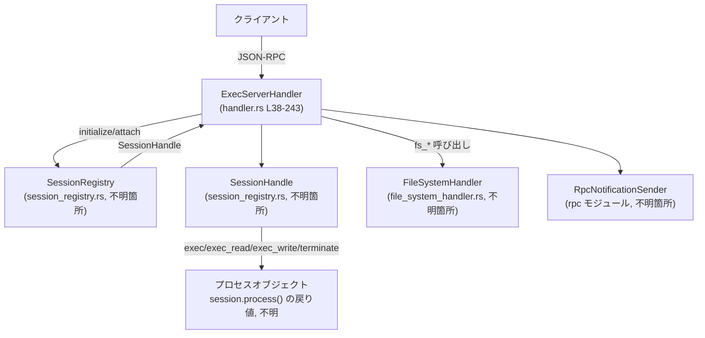
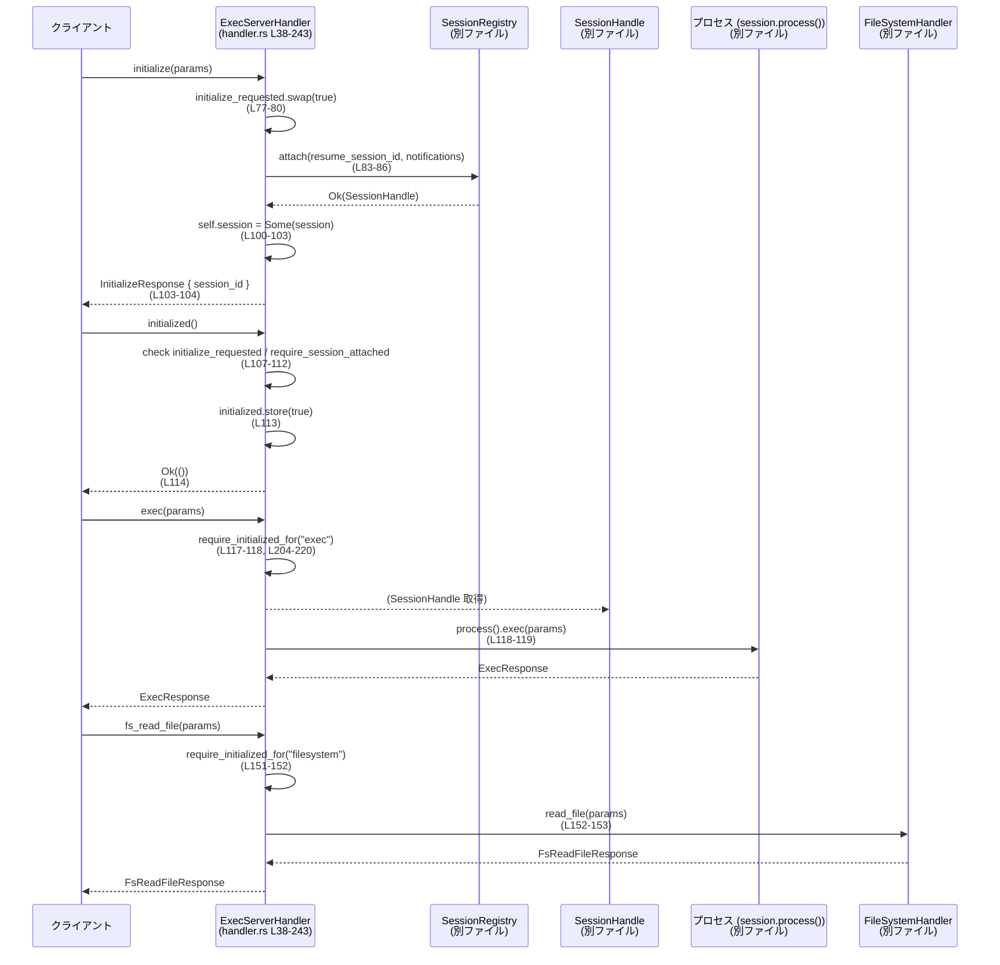

# exec-server/src/server/handler.rs コード解説

## 0. ざっくり一言

このファイルは、実行セッションとファイルシステム操作の JSON-RPC リクエストを受け取り、  
セッションのアタッチ状態・初期化状態を管理しながら、`SessionRegistry` と `FileSystemHandler` に処理を委譲するハンドラを定義しています（`ExecServerHandler`、`exec-server/src/server/handler.rs:L38-45`）。

---

## 1. このモジュールの役割

### 1.1 概要

- このモジュールは **Exec サーバープロセス**への RPC 呼び出しを扱うために存在し、次の機能を提供します。
  - クライアントとの間で `initialize` / `initialized` のハンドシェイク状態を管理する（`initialize_requested` / `initialized` の 2 つの `AtomicBool`、`L43-44`）。
  - `SessionRegistry` を使ってセッションをアタッチし、`SessionHandle` を通じて `exec` 系処理を委譲する（`L83-86`, `L117-120`）。
  - `FileSystemHandler` を介してファイルシステム関連 RPC (`fs_read_file` など) を実装し、同じ初期化前提を共有する（`L42`, `L148-201`）。
  - セッションが他の接続に引き継がれた（再アタッチされた）場合に、その状態を検出しエラー応答を返す（`require_session_attached`, `L222-235`）。

### 1.2 アーキテクチャ内での位置づけ

`ExecServerHandler` はサーバー側の「1 接続あたりのハンドラ」として振る舞い、  
セッション管理とファイルシステム処理の間を仲介します。

主な依存関係は以下です（すべて `use` から読み取れる範囲です）。

- `SessionRegistry` / `SessionHandle`（`L35-36`）  
  セッションのアタッチ・デタッチ、`process()` 経由の実行処理委譲に使われます（`L83-86`, `L117-120` など）。
- `FileSystemHandler`（`L34`, `L42`）  
  ファイルの読み書きなど FS RPC の実装をカプセル化しています（`L148-201`）。
- `RpcNotificationSender`（`L32`, `L40`）  
  セッションアタッチ時などに通知を送るために保持されます（実際の送信箇所はこのファイルには現れません）。
- `JSONRPCErrorError` / `invalid_request`（`L6`, `L33`）  
  プロトコルレベルのエラー型と、無効リクエスト用ヘルパです。前提条件違反時に利用されます（`L77-80`, `L208-216`, `L223-225`, `L230-233`）。

依存関係の概要を Mermaid 図で示します（この図はこのファイルのコード範囲 `L38-243` を対象にしています）。



### 1.3 設計上のポイント

コードから読み取れる設計上の特徴を列挙します。

- **ステートフルな接続ハンドラ**
  - `ExecServerHandler` は 1 接続に対応する構造体で、セッションと初期化状態を内部に保持します（`L38-45`）。
  - `session: StdMutex<Option<SessionHandle>>` により、セッションハンドルを可変状態として共有します（`L41`）。

- **初期化プロトコルの明示的な管理**
  - `initialize_requested: AtomicBool`… `initialize` がすでに呼ばれたかどうかを記録（`L43`, `L77`）。
  - `initialized: AtomicBool`… `initialized` 通知が正常に処理されたかを記録（`L44`, `L113`）。
  - いずれも `Ordering::SeqCst` を使用し、スレッド間での順序を強く保証しています（`L77-78`, `L107-108`, `L113`, `L208-209`, `L214-215`）。

- **前提条件違反を JSON-RPC エラーで返す**
  - 未初期化の状態で `exec` や `fs_*` が呼ばれた場合、`invalid_request(...)` を使って JSON-RPC エラーを返します（`L208-211`, `L214-217`, `L223-225`, `L230-233`）。
  - `initialized()` のみは内部 API らしく `Result<(), String>` を返し、`JSONRPCErrorError` の `message` フィールドを文字列に変換しています（`L107-115`）。

- **セッションの再アタッチ検出**
  - `SessionHandle::is_session_attached()` を用いて、セッションがこの接続から他の接続へ移っていないか検査します（`L69-71`, `L227-231`）。
  - これにより「セッションが他の接続に引き継がれた後の誤使用」を検出し、エラーで防ぎます。

- **同期・並行性制御**
  - `Arc` による `SessionRegistry` 共有（`L39`, `L48-50`）。
  - `StdMutex` による `SessionHandle` の同期アクセス（`L41`, `L100-103`, `L237-242`）。
  - `AtomicBool` による軽量な状態フラグ（`L43-44`）。
  - `Mutex` の Poison を `unwrap_or_else(PoisonError::into_inner)` で握りつぶしているため、パニック後も内部状態を使い続ける設計です（`L102-103`, `L239-241`）。

---

## 2. 主要な機能一覧

このモジュールが提供する主な機能は次の通りです。

- セッション管理
  - セッションのアタッチ（再開）: `initialize` – `SessionRegistry::attach` を呼び出して `SessionHandle` を取得（`L83-86`）。
  - セッションのデタッチ: `shutdown` – セッションがあれば `SessionHandle::detach().await` を呼び出す（`L62-66`）。
  - セッションがこの接続にまだ紐づいているかの検査: `is_session_attached`, `require_session_attached`（`L68-71`, `L222-235`）。

- 初期化プロトコル
  - `initialize`: 一度だけ許可される初期化リクエストの処理（`L73-105`）。
  - `initialized`: 初期化完了通知の処理とフラグ設定（`L107-115`）。
  - これらを前提に、`exec` や `fs_*` メソッドがガードされます（`L117-120`, `L148-201`, `L204-220`）。

- 実行プロセスへの委譲
  - `exec`: 一般的なコマンド実行処理の委譲（`L117-120`）。
  - `exec_read`: 読み取り型の exec 処理（`L122-130`）。
  - `exec_write`: 書き込み型の exec 処理（`L132-137`）。
  - `terminate`: 実行プロセスの終了要求（`L140-145`）。

- ファイルシステム操作
  - `fs_read_file`, `fs_write_file`, `fs_create_directory`, `fs_get_metadata`, `fs_read_directory`, `fs_remove`, `fs_copy`  
    いずれも `FileSystemHandler` に処理を委譲し、その前に初期化済みかを検査します（`L148-201`）。

- 内部ユーティリティ
  - `require_initialized_for`: 任意の「メソッドファミリ」（`exec` / `filesystem` など）について、`initialize` / `initialized` / セッションアタッチが済んでいるか検査（`L204-220`）。
  - `session`: 内部に保持している `Option<SessionHandle>` を取得するためのヘルパ（`L237-242`）。

---

## 3. 公開 API と詳細解説

### 3.1 型一覧（構造体・列挙体など）

| 名前 | 種別 | 定義位置 | 役割 / 用途 |
|------|------|----------|-------------|
| `ExecServerHandler` | 構造体 | `handler.rs:L38-45` | Exec サーバー用の接続ハンドラ。セッション・通知送信・ファイルシステムハンドラ・初期化状態フラグを保持します。 |
| `SessionRegistry` | 構造体（別モジュール） | `use crate::server::session_registry::SessionRegistry;` (`L36`) | セッションの attach/detach を提供すると解釈できますが、詳細はこのチャンクには現れません。 |
| `SessionHandle` | 構造体（別モジュール） | `use crate::server::session_registry::SessionHandle;` (`L35`) | 個々のセッションへのハンドル。`session_id`, `connection_id`, `process`, `is_session_attached`, `detach` などのメソッドが使われていますが実装はこのチャンクにはありません。 |
| `FileSystemHandler` | 構造体（別モジュール） | `use crate::server::file_system_handler::FileSystemHandler;` (`L34`) | ファイルシステム RPC 処理をまとめるハンドラ。`read_file` などのメソッドを提供します（`L148-201`）。 |
| `RpcNotificationSender` | 型（別モジュール） | `use crate::rpc::RpcNotificationSender;` (`L32`) | JSON-RPC の通知送信用ハンドラ。ExecServerHandler に保存され、`SessionRegistry::attach` に渡されています（`L83-86`）。 |

プロトコル用の型（`ExecParams`, `ExecResponse`, `FsReadFileParams` など）は、このファイル内では型名のみ参照されており、定義は `crate::protocol` 以下にあります（`L8-31`）。用途はそれぞれのメソッドの引数・戻り値から推定できます。

### 3.2 関数詳細（主要 7 件）

#### `ExecServerHandler::new(session_registry: Arc<SessionRegistry>, notifications: RpcNotificationSender) -> ExecServerHandler`

**概要**

- `ExecServerHandler` のインスタンスを生成するコンストラクタです（`handler.rs:L48-60`）。
- セッションレジストリと通知送信ハンドラを外部から受け取り、その他のフィールドを初期化します。

**引数**

| 引数名 | 型 | 説明 |
|--------|----|------|
| `session_registry` | `Arc<SessionRegistry>` | セッションの attach/detach を行うレジストリ。複数スレッドから共有されるため `Arc` で受け取ります（`L48-50`）。 |
| `notifications` | `RpcNotificationSender` | クライアントへの通知送信に使用するオブジェクト（`L50`）。 |

**戻り値**

- `ExecServerHandler` の新しいインスタンス。
  - `session` は `None` で開始（`L55`）。
  - `file_system` は `FileSystemHandler::default()` で初期化（`L56`）。
  - `initialize_requested` / `initialized` はともに `false`（`L57-58`）。

**内部処理の流れ**

1. `Self { ... }` リテラルを使って各フィールドを初期化（`L52-59`）。
2. `session` に新しい `StdMutex::new(None)` を設定（`L55`）。
3. `file_system` に `FileSystemHandler::default()` を設定（`L56`）。
4. 2 つの `AtomicBool` を `false` で初期化（`L57-58`）。

**Examples（使用例）**

```rust
use std::sync::Arc;
use crate::server::session_registry::SessionRegistry;
use crate::rpc::RpcNotificationSender;
use crate::server::handler::ExecServerHandler;

// SessionRegistry と RpcNotificationSender の具体的な構築方法は、このチャンクからは分かりません。
fn create_handler(
    registry: Arc<SessionRegistry>,
    notifications: RpcNotificationSender,
) -> ExecServerHandler {
    ExecServerHandler::new(registry, notifications) // 新しいハンドラを生成する
}
```

**Errors / Panics**

- この関数内に明示的なエラーや panic を発生させるコードはありません（`L48-60`）。
- 渡された引数が不正であった場合の挙動は、各型のコンストラクタ/実装に依存し、このチャンクからは分かりません。

**Edge cases**

- `session_registry` や `notifications` が未初期化または `None` であるケースは、型定義的に想定されていません（`Arc` と具体型であり、`Option` ではないため）。

**使用上の注意点**

- この関数はあくまでハンドラの生成のみを行い、セッションのアタッチや初期化は行いません。`initialize` / `initialized` を別途呼び出す必要があります（`L73-115`）。

---

#### `ExecServerHandler::initialize(&self, params: InitializeParams) -> Result<InitializeResponse, JSONRPCErrorError>`

**概要**

- クライアントからの `initialize` リクエストを処理し、セッションを `SessionRegistry` に対してアタッチします（`L73-105`）。
- 一度成功すると、同じ接続での再度の `initialize` 呼び出しはエラーになります。

**引数**

| 引数名 | 型 | 説明 |
|--------|----|------|
| `params` | `InitializeParams` | 初期化パラメータ。少なくとも `resume_session_id` を持ち、既存セッションの再開に利用されます（`L83-86`）。 |

**戻り値**

- `Ok(InitializeResponse { session_id })`  
  - `session_id`: アタッチされたセッションの ID 文字列（`L93-104`）。
- `Err(JSONRPCErrorError)`  
  - 二重 `initialize` の場合や、`SessionRegistry::attach` が失敗した場合などに返されます（`L77-80`, `L87-92`）。

**内部処理の流れ**

1. `initialize_requested.swap(true, Ordering::SeqCst)` で、初回かどうかを判定（`L77-80`）。
   - すでに `true` だった場合、`invalid_request` を使ってエラーを返す。
2. `SessionRegistry::attach` を呼び出して、セッションのアタッチ/再開を試みる（`L83-86`）。
   - 成功時: `SessionHandle` を受け取る（`L88`）。
   - 失敗時: `initialize_requested` を `false` に戻してから、そのままエラーを返す（`L88-92`）。
3. 成功した `SessionHandle` から `session_id` と `connection_id` を取得し、`tracing::debug!` でログを出力（`L93-99`）。
4. `self.session` の `Mutex` をロックし、内部の `Option<SessionHandle>` に `Some(session)` を設定（`L100-103`）。
5. `InitializeResponse { session_id }` を返す（`L103-104`）。

**Examples（使用例）**

```rust
use crate::protocol::InitializeParams;
use crate::server::handler::ExecServerHandler;
use codex_app_server_protocol::JSONRPCErrorError;

// 非同期コンテキスト内での使用例（async ランタイムの詳細はこのチャンクからは分かりません）
async fn handle_initialize(
    handler: &ExecServerHandler,
    params: InitializeParams,
) -> Result<(), JSONRPCErrorError> {
    let resp = handler.initialize(params).await?; // セッションをアタッチ
    println!("attached session: {}", resp.session_id);
    Ok(())
}
```

**Errors / Panics**

- `initialize_requested.swap(true, ...)` が `true` を返した場合、`invalid_request("initialize may only be sent once per connection")` でエラー終了します（`L77-80`）。
- `SessionRegistry::attach` が `Err` を返した場合、`initialize_requested` を `false` に戻し、そのエラーを透過的に返します（`L87-92`）。
- `self.session.lock().unwrap_or_else(...)` は `Mutex` の Poison を無視して内部値を取得するため、この箇所では panic しません（`L100-103`）。

**Edge cases**

- 初回の `initialize` 呼び出し中にエラーが起きた場合は、`initialize_requested` フラグが `false` に戻されるので、再度 `initialize` を試みることが可能です（`L87-92`）。
- `SessionRegistry::attach` が返すエラーの詳細は、このチャンクには現れません。

**使用上の注意点**

- 成功・失敗に関わらず、呼び出し側は `Result` を必ずチェックする必要があります。`Err` を無視すると、その後の `exec` や `fs_*` 呼び出しが意図せず `invalid_request` で失敗する可能性があります（`L204-220`）。

---

#### `ExecServerHandler::initialized(&self) -> Result<(), String>`

**概要**

- クライアントからの `initialized` 通知を処理し、「初期化完了」状態を記録するメソッドです（`L107-115`）。
- `initialize` と `session` のアタッチが完了していることを前提とします。

**戻り値**

- 成功時: `Ok(())`（`L114`）。
- 失敗時: `Err(String)` – エラーメッセージを文字列で返します（`L107-115`）。

**内部処理の流れ**

1. `initialize_requested` が `true` かどうかをチェック。`false` であれば `"received`initialized` notification before `initialize`"` というメッセージで `Err` を返す（`L107-110`）。
2. `require_session_attached()` を呼び出し、セッションがこの接続にアタッチされていることを確認（`L111-112`）。
   - 失敗時は `JSONRPCErrorError` の `message` フィールドを取り出して `Err(String)` に変換。
3. `initialized.store(true, Ordering::SeqCst)` で初期化完了フラグを立てる（`L113`）。
4. `Ok(())` を返す（`L114`）。

**Examples（使用例）**

```rust
use crate::server::handler::ExecServerHandler;

// RPC レイヤから呼び出されることを想定した例
fn handle_initialized(handler: &ExecServerHandler) -> Result<(), String> {
    handler.initialized() // 初期化フラグを立てる
}
```

**Errors / Panics**

- `initialize` が一度も成功していない状態で呼び出すと、`Err("received`initialized` notification before `initialize`")` が返ります（`L107-110`）。
- セッションが存在しない、または他の接続に再アタッチされている場合、`require_session_attached()` が返す `JSONRPCErrorError` から `message` を取り出して `Err(String)` を返します（`L111-112`, `L222-235`）。

**Edge cases**

- `initialize` がまだ処理中で `self.session` が `Some` にセットされていないタイミングで `initialized` が先に来た場合、`require_session_attached()` は `"client must call initialize before using methods"` のようなエラーメッセージを返すことになります（`L223-225`）。  
  これは RPC レイヤのシリアライズやクライアント実装に依存する並行ケースです。

**使用上の注意点**

- このメソッドは JSON-RPC 用のエラー型ではなく `Result<(), String>` を返すため、呼び出し側で JSON-RPC エラーへの変換が必要となることがあります。
- `initialized` を呼ばないまま `exec` や `fs_*` を呼び出すと、`require_initialized_for` がエラーを返します（`L214-217`）。

---

#### `ExecServerHandler::exec(&self, params: ExecParams) -> Result<ExecResponse, JSONRPCErrorError>`

**概要**

- `exec` メソッドファミリの代表的な RPC 処理です（`L117-120`）。
- クライアントコマンドを実行プロセスに委譲します。

**引数**

| 引数名 | 型 | 説明 |
|--------|----|------|
| `params` | `ExecParams` | 実行するコマンドやオプションなどを含むパラメータ（詳細は `protocol` モジュール側で定義）。 |

**戻り値**

- `Ok(ExecResponse)` – 実行結果（標準出力・終了コードなどを含むと推測されますが、このチャンクには現れません）。
- `Err(JSONRPCErrorError)` – 初期化プロトコル違反または内部エラー。

**内部処理の流れ**

1. `require_initialized_for("exec")` を呼び出し、`initialize` / `initialized` とセッションアタッチが完了していることを確認し、`SessionHandle` を取得（`L117-118`, `L204-220`）。
2. `session.process().exec(params).await` を呼び出して、実行プロセスへ処理を委譲（`L118-119`）。

**Examples（使用例）**

```rust
use crate::protocol::{ExecParams, ExecResponse};
use crate::server::handler::ExecServerHandler;
use codex_app_server_protocol::JSONRPCErrorError;

async fn run_command(
    handler: &ExecServerHandler,
    params: ExecParams,
) -> Result<ExecResponse, JSONRPCErrorError> {
    handler.exec(params).await
}
```

**Errors / Panics**

- `require_initialized_for("exec")` によるエラー:
  - `initialize` が未実行: `"client must call initialize before using exec methods"`（`L208-211`）。
  - `initialized` が未実行: `"client must send initialized before using exec methods"`（`L214-217`）。
  - セッション未アタッチ or 他接続に再アタッチ: `require_session_attached` のエラーメッセージ（`L222-235`）。
- `session.process().exec(...)` が返すエラーは、そのまま呼び出し元へ伝播します（`L118-119`）。内容はこのチャンクには現れません。

**Edge cases**

- 実行中にセッションが別接続へ移動した場合の挙動は、この関数単体では分かりません。`require_initialized_for` に成功した時点では、セッションはこの接続にアタッチされていますが、その後の状態変化は `SessionHandle` 側の実装に依存します。

**使用上の注意点**

- `exec` を呼ぶ前に必ず `initialize` と `initialized` を完了させる必要があります。
- `exec_read` や `exec_write` など、他の `exec` 系メソッドも同じ `require_initialized_for("exec")` を利用しているため、初期化前に呼ぶと同様にエラーになります（`L122-137`）。

---

#### `ExecServerHandler::fs_read_file(&self, params: FsReadFileParams) -> Result<FsReadFileResponse, JSONRPCErrorError>`

**概要**

- ファイル内容を読み取る RPC を処理し、`FileSystemHandler` に処理を委譲します（`L148-154`）。
- 初期化プロトコル（`initialize` / `initialized`）とセッションアタッチが済んでいることを前提とします。

**引数**

| 引数名 | 型 | 説明 |
|--------|----|------|
| `params` | `FsReadFileParams` | 読み取り対象のパスやオプションを含むパラメータ。詳細は `protocol` モジュール側に定義がありますが、このチャンクには現れません。 |

**戻り値**

- `Ok(FsReadFileResponse)` – ファイル内容やメタ情報を含むレスポンス（`L151-153`）。
- `Err(JSONRPCErrorError)` – 初期化プロトコル違反または FS 処理のエラー。

**内部処理の流れ**

1. `require_initialized_for("filesystem")` を呼び出し、初期化状態とセッションアタッチを検証（`L151-152`, `L204-220`）。
   - 戻り値の `SessionHandle` は、この関数では使用していません（初期化状態の検証だけに利用）。
2. `self.file_system.read_file(params).await` を呼び出し、`FileSystemHandler` に処理を委譲（`L152-153`）。

**Examples（使用例）**

```rust
use crate::protocol::{FsReadFileParams, FsReadFileResponse};
use crate::server::handler::ExecServerHandler;
use codex_app_server_protocol::JSONRPCErrorError;

async fn read_remote_file(
    handler: &ExecServerHandler,
    params: FsReadFileParams,
) -> Result<FsReadFileResponse, JSONRPCErrorError> {
    handler.fs_read_file(params).await
}
```

**Errors / Panics**

- `require_initialized_for("filesystem")` によるエラー:
  - `initialize` 未実行: `"client must call initialize before using filesystem methods"`（`L208-211`）。
  - `initialized` 未実行: `"client must send initialized before using filesystem methods"`（`L214-217`）。
  - セッション未アタッチ or 再アタッチ: `require_session_attached` が返すエラー（`L222-235`）。
- `file_system.read_file` が返すエラーはそのまま呼び出し元に伝播します。詳細は `FileSystemHandler` の実装に依存します（このチャンクには現れません）。

**Edge cases**

- 実行セッションが存在しない場合でも、`require_initialized_for` はセッションを必須とするため、ファイルシステム操作だけを単独で行うことはできません（`L204-220`）。

**使用上の注意点**

- この関数はファイルシステムの状態を変更しない読み取り処理に限定されますが、`FileSystemHandler` の実装によってはディスク I/O を伴うため、呼び出し頻度には注意が必要です。

---

#### `ExecServerHandler::require_initialized_for(&self, method_family: &str) -> Result<SessionHandle, JSONRPCErrorError>`

**概要**

- 任意のメソッドファミリ（例: `"exec"`, `"filesystem"`）に対して、接続が正しく初期化されているか検証する内部ユーティリティです（`L204-220`）。
- `SessionHandle` を返し、後続処理がセッションにアクセスできるようにします。

**引数**

| 引数名 | 型 | 説明 |
|--------|----|------|
| `method_family` | `&str` | エラーメッセージに埋め込まれるメソッドファミリ名 (`"exec"`, `"filesystem"` など)。 |

**戻り値**

- `Ok(SessionHandle)` – 前提条件をすべて満たしている場合に、クローンされた `SessionHandle` を返します（`L212-219`）。
- `Err(JSONRPCErrorError)` – 初期化フラグ、`initialized` フラグ、またはセッションアタッチ状態のいずれかが満たされていない場合。

**内部処理の流れ**

1. `initialize_requested` が `true` かを確認。`false` の場合、`invalid_request("client must call initialize before using {method_family} methods")` でエラーを返す（`L208-211`）。
2. `require_session_attached()` を呼び出して `SessionHandle` を取得（`L212`）。
3. `initialized` が `true` かを確認。`false` の場合、`invalid_request("client must send initialized before using {method_family} methods")` でエラーを返す（`L213-217`）。
4. すべての条件を満たしていれば、`SessionHandle` を `Ok(session)` で返す（`L218-219`）。

**Examples（使用例）**

内部メソッドとして `exec`, `fs_*` などから呼び出されています。

```rust
// 例: exec メソッド内での使用
pub(crate) async fn exec(&self, params: ExecParams) -> Result<ExecResponse, JSONRPCErrorError> {
    let session = self.require_initialized_for("exec")?; // 前提条件を検証して SessionHandle を取得
    session.process().exec(params).await
}
```

**Errors / Panics**

- 主に 3 つの条件で `invalid_request` によるエラーが返ります（`L208-217`）。
- 明示的な panic 呼び出しはありません。

**Edge cases**

- `initialize_requested` は `initialize` の呼び出し開始時点で `true` にセットされるため、`initialize` の処理が完了していなくても `require_initialized_for` の最初のチェックは通る可能性があります（`L77`, `L208-209`）。  
  ただし、後続の `require_session_attached()` で `self.session` が `None` の場合はエラーになります（`L222-225`）。

**使用上の注意点**

- メソッドファミリ名はエラーメッセージにそのまま埋め込まれるため、一貫した名前付けを行う必要があります（`"exec"`, `"filesystem"` のように実際の利用例があります: `L117`, `L148-201`）。

---

#### `ExecServerHandler::require_session_attached(&self) -> Result<SessionHandle, JSONRPCErrorError>`

**概要**

- 内部に保持している `SessionHandle` が存在し、かつ現在この接続にアタッチされていることを検証するユーティリティです（`L222-235`）。
- セッションが別の接続に再アタッチされた場合には、エラーで拒否します。

**戻り値**

- `Ok(SessionHandle)` – セッションが存在し、`is_session_attached()` が `true` の場合に返されます（`L227-229`）。
- `Err(JSONRPCErrorError)` – セッションが存在しない、または他の接続に再アタッチされている場合。

**内部処理の流れ**

1. `self.session()` を呼び出し、`Option<SessionHandle>` を取得（`L222-223`, `L237-242`）。
2. `None` の場合、`invalid_request("client must call initialize before using methods")` を返す（`L223-225`）。
3. `Some(session)` の場合、`session.is_session_attached()` をチェック（`L227-228`）。
   - `true` の場合: `Ok(session)` を返す（`L227-229`）。
   - `false` の場合: `invalid_request("session has been resumed by another connection")` を返す（`L230-233`）。

**Examples（使用例）**

```rust
fn some_internal_use(&self) -> Result<SessionHandle, JSONRPCErrorError> {
    self.require_session_attached()
}
```

**Errors / Panics**

- セッション未設定時: `"client must call initialize before using methods"` （`L223-225`）。
- セッションが他の接続に再アタッチされた時: `"session has been resumed by another connection"` （`L230-233`）。

**Edge cases**

- `self.session()` は `Mutex` の Poison を無視して内部値を取り出すため、過去にパニックが発生しても `Option<SessionHandle>` の値は取得されます（`L239-241`）。
- `SessionHandle::is_session_attached()` の実装に依存しており、その定義はこのチャンクには現れません。

**使用上の注意点**

- この関数の返り値を無視すると、セッション不在・再アタッチ状態でも処理を続行してしまうため、必ず `Result` をチェックする必要があります。
- エラーは JSON-RPC のエラー型で返されるため、RPC レイヤからそのままクライアントに返す設計が前提になっています。

---

### 3.3 その他の関数

主要 7 関数以外の補助的な関数・エンドポイントを一覧にします。

| 関数名 | シグネチャ | 定義位置 | 役割（1 行） |
|--------|------------|----------|--------------|
| `shutdown` | `pub(crate) async fn shutdown(&self)` | `L62-66` | セッションが存在すれば `detach().await` を呼び、セッションと接続の紐付けを解除します。 |
| `is_session_attached` | `pub(crate) fn is_session_attached(&self) -> bool` | `L68-71` | `self.session()` が `None` または `is_session_attached() == true` のときに `true` を返します。 |
| `exec_read` | `pub(crate) async fn exec_read(&self, params: ReadParams) -> Result<ReadResponse, JSONRPCErrorError>` | `L122-130` | `exec` 系読み取り RPC。完了後に再度 `require_session_attached()` を呼び、途中でセッションが再アタッチされていないかを確認します。 |
| `exec_write` | `pub(crate) async fn exec_write(&self, params: WriteParams) -> Result<WriteResponse, JSONRPCErrorError>` | `L132-137` | 書き込み系 `exec` RPC。`require_initialized_for("exec")` 後に `session.process().exec_write` を呼び出します。 |
| `terminate` | `pub(crate) async fn terminate(&self, params: TerminateParams) -> Result<TerminateResponse, JSONRPCErrorError>` | `L140-145` | 実行プロセスの終了を要求する RPC。`session.process().terminate` に委譲します。 |
| `fs_write_file` | `pub(crate) async fn fs_write_file(&self, params: FsWriteFileParams) -> Result<FsWriteFileResponse, JSONRPCErrorError>` | `L156-162` | ファイルの書き込み RPC。`require_initialized_for("filesystem")` を通過後、`file_system.write_file` に委譲します。 |
| `fs_create_directory` | `pub(crate) async fn fs_create_directory(&self, params: FsCreateDirectoryParams) -> Result<FsCreateDirectoryResponse, JSONRPCErrorError>` | `L164-170` | ディレクトリ作成 RPC。 |
| `fs_get_metadata` | `pub(crate) async fn fs_get_metadata(&self, params: FsGetMetadataParams) -> Result<FsGetMetadataResponse, JSONRPCErrorError>` | `L172-178` | ファイル・ディレクトリのメタデータ取得 RPC。 |
| `fs_read_directory` | `pub(crate) async fn fs_read_directory(&self, params: FsReadDirectoryParams) -> Result<FsReadDirectoryResponse, JSONRPCErrorError>` | `L180-186` | ディレクトリ内容の一覧取得 RPC。 |
| `fs_remove` | `pub(crate) async fn fs_remove(&self, params: FsRemoveParams) -> Result<FsRemoveResponse, JSONRPCErrorError>` | `L188-194` | ファイルやディレクトリの削除 RPC。 |
| `fs_copy` | `pub(crate) async fn fs_copy(&self, params: FsCopyParams) -> Result<FsCopyResponse, JSONRPCErrorError>` | `L196-201` | ファイル/ディレクトリのコピー RPC。 |
| `session` | `fn session(&self) -> Option<SessionHandle>` | `L237-242` | `Mutex` で保護された内部の `Option<SessionHandle>` をクローンして返すユーティリティ。 |

---

## 4. データフロー

ここでは、典型的な「初期化 → コマンド実行 → ファイル読み取り」の流れを例に、データの流れを説明します。

1. クライアントが `initialize` を送信。
2. サーバ側で `ExecServerHandler::initialize` が呼ばれ、`SessionRegistry::attach` によりセッションがアタッチされます（`L73-105`）。
3. クライアントが `initialized` 通知を送信し、`ExecServerHandler::initialized` が初期化完了フラグを立てます（`L107-115`）。
4. クライアントが `exec` を送信すると、`require_initialized_for("exec")` で前提条件をチェックし、`SessionHandle::process().exec` に委譲します（`L117-120`, `L204-220`）。
5. 続いて `fs_read_file` などのファイル操作を送ると、`require_initialized_for("filesystem")` で同様のチェックを行った後、`FileSystemHandler` に処理を委譲します（`L148-154`）。

これをシーケンス図で表すと次のようになります。



---

## 5. 使い方（How to Use）

### 5.1 基本的な使用方法

典型的な使用手順は次の通りです。

1. `SessionRegistry` と `RpcNotificationSender` を用意し、`ExecServerHandler::new` でハンドラを作成。
2. クライアントからの `initialize` リクエストを `initialize` メソッドに渡す。
3. `initialized` 通知を受けたら `initialized` メソッドを呼び、初期化完了フラグを立てる。
4. 以降、`exec` や `fs_*` メソッドを安全に呼び出せる。

サンプルコード（実行プロセスや RPC との結合部分は抽象化しています）:

```rust
use std::sync::Arc;
use crate::server::session_registry::SessionRegistry;
use crate::rpc::RpcNotificationSender;
use crate::server::handler::ExecServerHandler;
use crate::protocol::{InitializeParams, ExecParams, FsReadFileParams};
use codex_app_server_protocol::JSONRPCErrorError;

// 非同期コンテキスト（具体的なランタイムはこのチャンクには現れません）
async fn example_flow(
    registry: Arc<SessionRegistry>,
    notifications: RpcNotificationSender,
    init_params: InitializeParams,
    exec_params: ExecParams,
    fs_params: FsReadFileParams,
) -> Result<(), JSONRPCErrorError> {
    let handler = ExecServerHandler::new(registry, notifications);          // L48-60

    // 1. initialize リクエストの処理
    let init_resp = handler.initialize(init_params).await?;                // L73-105
    println!("session attached: {}", init_resp.session_id);

    // 2. initialized 通知の処理
    handler.initialized().map_err(|msg| {
        // String -> JSONRPCErrorError への変換は呼び出し側の責務
        JSONRPCErrorError { message: msg, ..Default::default() }
    })?;                                                                   // L107-115

    // 3. exec 呼び出し
    let exec_resp = handler.exec(exec_params).await?;                      // L117-120
    println!("exec response: {:?}", exec_resp);

    // 4. ファイル読み取り
    let fs_resp = handler.fs_read_file(fs_params).await?;                  // L148-154
    println!("file content: {:?}", fs_resp);

    Ok(())
}
```

### 5.2 よくある使用パターン

- **exec 系と FS 系の組み合わせ**
  - コマンド実行 (`exec` / `exec_read` / `exec_write`) と、その結果を元にファイル操作 (`fs_*`) を行うパターン。
  - すべて同じ初期化前提 (`initialize` + `initialized`) を共有します（`L204-220`）。

- **セッション再開**
  - `InitializeParams::resume_session_id` を指定して `SessionRegistry::attach` を呼び出すことで、既存セッションを再開できます（`L83-86`）。
  - セッションが他の接続に再アタッチされた場合、`require_session_attached` がエラーを返すため、誤ったセッション共有を防げます（`L230-233`）。

### 5.3 よくある間違い

```rust
// 間違い例: initialize や initialized を呼ばずに exec を呼ぶ
async fn wrong_usage(handler: &ExecServerHandler, params: ExecParams) {
    let _ = handler.exec(params).await; // 失敗: require_initialized_for が invalid_request を返す (L208-217)
}

// 正しい例: initialize -> initialized -> exec の順序を守る
async fn correct_usage(
    handler: &ExecServerHandler,
    init_params: InitializeParams,
    exec_params: ExecParams,
) -> Result<(), JSONRPCErrorError> {
    handler.initialize(init_params).await?;
    handler.initialized().map_err(|msg| {
        JSONRPCErrorError { message: msg, ..Default::default() }
    })?;
    let _resp = handler.exec(exec_params).await?;
    Ok(())
}
```

別の典型的な誤り:

- **`initialized()` のエラーを無視する**
  - 初期化フラグが立たず、後続の `exec` / `fs_*` がすべて `"client must send initialized before using ... methods"` で失敗します（`L214-217`）。

### 5.4 使用上の注意点（まとめ）

- **前提条件**
  - すべての `exec` / `fs_*` メソッドは `initialize` と `initialized` の完了、および有効なセッションアタッチを前提としています（`L204-220`）。
  - `initialized` は `initialize_requested` が `true` であり、かつ `require_session_attached()` に成功する場合にのみ成功します（`L107-115`）。

- **セッションの再アタッチ**
  - `SessionHandle::is_session_attached()` により、「セッションが他の接続に再アタッチされた」状態を検出し、`invalid_request("session has been resumed by another connection")` で拒否します（`L227-233`）。

- **並行性とスレッド安全性**
  - `session` フィールドは `StdMutex` で保護されているため、多数の非同期タスクから同時にアクセスしてもデータ競合を避けられます（`L41`, `L100-103`, `L237-242`）。
  - `AtomicBool` は `SeqCst` でアクセスされており、最も強い順序保証が与えられています（`L77-78`, `L107-108`, `L113`, `L208-209`, `L214-215`）。
  - `Mutex` の Poison 状態は無視されているため、パニック後の状態で処理を継続する設計になっています（`L102-103`, `L239-241`）。

- **セマンティクス上の注意点**
  - `is_session_attached(&self)` は内部的に `Option::is_none_or` を使っており、「セッションが存在しない場合にも `true` を返す」という挙動になります（`L69-71`）。  
    呼び出し側は「セッションが存在してかつアタッチされているか」ではなく、「セッションが存在しないか、存在していてアタッチ済みか」を判定している点に注意が必要です。

---

## 6. 変更の仕方（How to Modify）

### 6.1 新しい機能を追加する場合

たとえば `exec` 系に新しいメソッド `exec_status` を追加したい場合の手順を考えます。

1. **プロトコルの拡張**
   - `crate::protocol` に `ExecStatusParams`, `ExecStatusResponse` など新しい型を定義する必要があります（このチャンクには定義はありませんが、既存の `ExecParams` / `ExecResponse` に倣う形になります）。

2. **プロセス側の実装**
   - `SessionHandle::process()` が返す型に `exec_status` メソッドを追加し、実際の処理ロジックを実装します（`L117-120` の `exec` 同様）。

3. **ハンドラの追加**
   - 本ファイルに以下のようなメソッドを追加します（例）:

   ```rust
   pub(crate) async fn exec_status(
       &self,
       params: ExecStatusParams,
   ) -> Result<ExecStatusResponse, JSONRPCErrorError> {
       let session = self.require_initialized_for("exec")?;
       session.process().exec_status(params).await
   }
   ```

   - `require_initialized_for("exec")` を使うことで、既存の `exec` 系メソッドと同じ初期化前提を共有できます（`L204-220`）。

4. **テストの追加**
   - `#[cfg(test)] mod tests;` で宣言されているテストモジュールに、新メソッド用のテストケースを追加します（`L245-246`）。  
     実際のテストファイルの場所はこのチャンクには現れませんが、一般的には `handler/tests.rs` などの形です。

### 6.2 既存の機能を変更する場合

- **影響範囲の確認**
  - `ExecServerHandler` のメソッドは crate 内の他モジュールから広く呼ばれている可能性がありますが、このチャンクには使用箇所は現れません。  
    変更時は、`grep` などで `exec(` や `fs_read_file(` の呼び出し箇所を検索する必要があります。
- **契約（前提条件・返り値）の維持**
  - `require_initialized_for` / `require_session_attached` のエラーメッセージや条件は、クライアント側とのプロトコル契約に近いため、変更する際はクライアント実装への影響を確認する必要があります（`L208-217`, `L223-233`）。
  - `initialized()` の戻り値が `Result<(), String>` である点も契約の一部であり、`JSONRPCErrorError` に変える場合は上位レイヤのハンドリングも合わせて変更する必要があります（`L107-115`）。

- **テスト・使用箇所の再確認**
  - 変更後は、テストモジュール（`mod tests;`, `L245-246`）と、`SessionRegistry` / `FileSystemHandler` と連携する高レベルテストを再実行し、初期化プロトコルが壊れていないことを確認する必要があります。

---

## 7. 関連ファイル

このモジュールと密接に関係するファイル・ディレクトリは、`use` の情報から次のように読み取れます。

| パス | 役割 / 関係 |
|------|------------|
| `exec-server/src/server/file_system_handler.rs` | `FileSystemHandler` の定義ファイルと推測されます。`fs_read_file` などの具体的なファイルシステム処理の実装が存在すると考えられます（`L34`, `L42`, `L148-201`）。 |
| `exec-server/src/server/session_registry.rs` | `SessionRegistry` と `SessionHandle` の定義ファイルと推測されます。セッションの attach/detach や `is_session_attached`, `process`, `detach`, `session_id`, `connection_id` などのメソッドが実装されていると考えられます（`L35-36`, `L83-86`, `L93-98`, `L117-120`, `L222-235`）。 |
| `exec-server/src/rpc/mod.rs` など | `RpcNotificationSender` と `invalid_request` の定義ファイルと推測されます。JSON-RPC の通知送信とエラー生成ロジックを提供します（`L32-33`）。実際のファイル名・レイアウトはこのチャンクには現れません。 |
| `exec-server/src/protocol/*.rs` | `ExecParams`, `ExecResponse`, `FsReadFileParams`, `InitializeParams` 等のプロトコル用型の定義ファイル群と推測されます（`L8-31`）。 |
| `exec-server/src/server/handler/tests.rs` または `exec-server/src/server/handler/tests/mod.rs` | `#[cfg(test)] mod tests;` に対応するテストコードファイルと推測されますが、具体的なパスはこのチャンクには現れません（`L245-246`）。 |

> 上記のうち、「推測されます」と記載している部分は、`use` のパスと型名からの推測であり、実際のファイル構成はリポジトリ全体を参照する必要があります。
