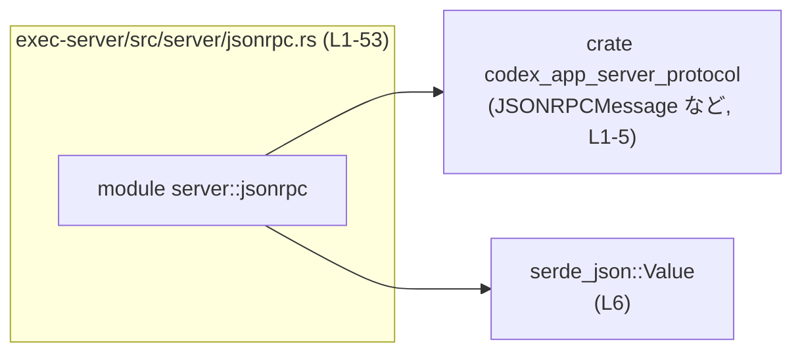
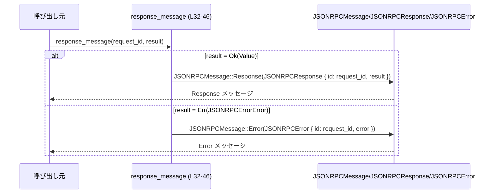
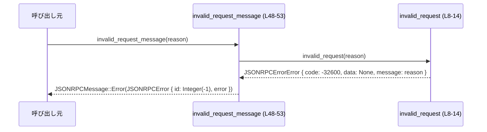

# exec-server/src/server/jsonrpc.rs コード解説

## 0. ざっくり一言

このファイルは、JSON-RPC 2.0 形式のエラー・レスポンスメッセージを組み立てるための、小さなヘルパー関数群を提供します（クレート内部専用）。  
標準的なエラーコードを持つ `JSONRPCErrorError` と、それを含む `JSONRPCMessage` を生成する役割です。

※ 行番号は、このチャンク内の先頭を `L1` とした通し番号（空行も含む）です。

---

## 1. このモジュールの役割

### 1.1 概要

- このモジュールは **JSON-RPC プロトコルのエラーメッセージとレスポンスの組み立て** を行うために存在し、次の機能を提供します。
  - `invalid_*` 系関数で標準エラーコード付きの `JSONRPCErrorError` を生成
  - `response_message` で `Result<Value, JSONRPCErrorError>` から `JSONRPCMessage` を生成
  - `invalid_request_message` で「不正なリクエスト」用の `JSONRPCMessage::Error` を生成  

  （根拠: `exec-server/src/server/jsonrpc.rs:L8-53`）

### 1.2 アーキテクチャ内での位置づけ

このモジュールは、外部クレート `codex_app_server_protocol` の JSON-RPC 型群と `serde_json::Value` に依存し、それらを組み合わせてメッセージを構築します。  
呼び出し元（サーバ本体など）はこのチャンクには現れません。



### 1.3 設計上のポイント

- **責務の分割**
  - エラー種別ごとに関数を分けて定数コードを集中管理（`invalid_request` / `invalid_params` / `method_not_found`）  
    （根拠: `L8-14`, `L16-22`, `L24-30`）
  - レスポンス全体の組み立ては `response_message` / `invalid_request_message` に集約  
    （根拠: `L32-46`, `L48-53`）
- **状態レス（ステートレス）**
  - グローバル状態やフィールドを持たない純粋関数のみで構成されており、副作用がありません。  
    （根拠: ファイル内に `static` やフィールド定義が存在しない: `L1-53`）
- **エラーハンドリング**
  - Rust の `Result` 型を用いて、成功値 `Value` とエラー値 `JSONRPCErrorError` を明示的に扱い、`response_message` 内で JSON-RPC レスポンス／エラーへマッピングしています。  
    （根拠: `L32-45`）
- **並行性**
  - 共有可変状態が一切無く、すべての関数は引数と戻り値のみで完結しているため、並行に呼び出してもデータ競合は発生しません。

---

## 2. コンポーネント一覧と主要な機能

### 2.1 コンポーネント一覧（インベントリー）

| 種別 | 名前 | 概要 | 定義位置 / 根拠 |
|------|------|------|-----------------|
| 関数 | `invalid_request` | JSON-RPC の「Invalid Request」エラー本体を生成し、コード `-32600` を設定する。 | `exec-server/src/server/jsonrpc.rs:L8-14` |
| 関数 | `invalid_params` | 「Invalid params」エラー本体を生成し、コード `-32602` を設定する。 | `L16-22` |
| 関数 | `method_not_found` | 「Method not found」エラー本体を生成し、コード `-32601` を設定する。 | `L24-30` |
| 関数 | `response_message` | `Result<Value, JSONRPCErrorError>` を JSON-RPC の `JSONRPCMessage`（成功/エラー）に変換する。 | `L32-46` |
| 関数 | `invalid_request_message` | 固定 ID（`RequestId::Integer(-1)`）と `invalid_request` を使って JSON-RPC エラーメッセージを生成する。 | `L48-53` |
| 型（外部） | `JSONRPCErrorError` | エラーコード・メッセージ・追加データを保持する構造体。`code`, `data`, `message` フィールドが使用されている。 | 利用箇所: `L8-13`, `L16-21`, `L24-29`, `L34`, `L41-44`, `L51` |
| 型（外部） | `JSONRPCError` | JSON-RPC のエラーメッセージ（`id` と `error`）を束ねる構造体。 | 利用箇所: `L41-44`, `L49-52` |
| 型（外部） | `JSONRPCResponse` | JSON-RPC 成功レスポンス（`id`, `result`）を表現する構造体。 | 利用箇所: `L37-40` |
| 型（外部） | `JSONRPCMessage` | JSON-RPC メッセージ全体を表現する列挙体で、`Response` / `Error` 変種が存在する。 | 利用箇所: `L3`, `L32`, `L37`, `L41`, `L48-49` |
| 型（外部） | `RequestId` | JSON-RPC リクエスト ID を表す型。`Integer(-1)` 変種が使用されている。 | 利用箇所: `L5`, `L33`, `L38`, `L42`, `L50` |
| 型（外部） | `Value` | `serde_json::Value`。任意の JSON 値を表す。 | 利用箇所: `L6`, `L34` |

### 2.2 主要な機能一覧（機能の観点）

- 不正リクエストエラー生成: `invalid_request` により code `-32600` の `JSONRPCErrorError` を作成
- パラメータ不正エラー生成: `invalid_params` により code `-32602` の `JSONRPCErrorError` を作成
- メソッド未定義エラー生成: `method_not_found` により code `-32601` の `JSONRPCErrorError` を作成
- レスポンス／エラー変換: `response_message` が `Result<Value, JSONRPCErrorError>` を `JSONRPCMessage::Response` または `JSONRPCMessage::Error` に変換
- 不正リクエスト用エラーメッセージ生成: `invalid_request_message` が固定 ID (`Integer(-1)`) 付きの `JSONRPCMessage::Error` を生成

---

## 3. 公開 API と詳細解説

ここでは、モジュール内の5つの関数すべてを「公開 API（クレート内向け）」として詳細に説明します。

### 3.1 型一覧（このモジュールから見える主要型）

| 名前 | 種別 | 定義元 | 役割 / 用途 |
|------|------|--------|-------------|
| `JSONRPCErrorError` | 構造体 | `codex_app_server_protocol` | JSON-RPC の `error` フィールド（コード、メッセージ、追加データ）を表す。`code`, `data`, `message` フィールドが使用されている（`L8-13` 等）。 |
| `JSONRPCError` | 構造体 | `codex_app_server_protocol` | `id` と `JSONRPCErrorError` を束ねる JSON-RPC エラーメッセージ本体（`L41-44`, `L49-52`）。 |
| `JSONRPCResponse` | 構造体 | `codex_app_server_protocol` | JSON-RPC 成功レスポンスとして、`id` と `result` を保持（`L37-40`）。 |
| `JSONRPCMessage` | 列挙体 | `codex_app_server_protocol` | JSON-RPC メッセージ全体。`Response` / `Error` 変種が存在する（`L37`, `L41`, `L48-49`）。 |
| `RequestId` | 列挙体 / 型 | `codex_app_server_protocol` | JSON-RPC の request ID。ここでは `RequestId::Integer(-1)` が使用されている（`L50`）。 |
| `Value` | 列挙体 | `serde_json` | 任意の JSON 値。レスポンスの `result` に使用（`L34`）。 |

※ これらの型の具体的な定義はこのチャンクには存在しないため、詳細な構造は不明ですが、フィールド名とコンストラクタから上記のように解釈できます。

---

### 3.2 関数詳細

#### `invalid_request(message: String) -> JSONRPCErrorError`

**概要**

- JSON-RPC の標準エラー「Invalid Request」（コード `-32600`）を表す `JSONRPCErrorError` を生成します。  
  （根拠: `L8-13`）

**引数**

| 引数名 | 型 | 説明 |
|--------|----|------|
| `message` | `String` | エラー詳細メッセージ。呼び出し側で組み立てたテキストをそのまま格納します。 |

**戻り値**

- `JSONRPCErrorError`: `code = -32600`, `data = None`, `message = 引数 message` を持つエラーオブジェクト。  
  （根拠: `L9-13`）

**内部処理の流れ**

1. `JSONRPCErrorError` 構造体リテラルを生成
2. `code` フィールドに `-32600` を設定
3. `data` に `None` を設定（追加データ無し）
4. `message` に引数 `message` をそのまま格納
5. 構造体を返却

**Examples（使用例）**

```rust
use codex_app_server_protocol::JSONRPCErrorError;                // エラー型をインポート
use exec_server::server::jsonrpc::invalid_request;               // このモジュールの関数（パスは例）

fn build_invalid_request_error() -> JSONRPCErrorError {          // 不正リクエストエラーを構築する関数
    let msg = "リクエストの JSON が不正です".to_string();        // エラーメッセージ文字列を用意
    invalid_request(msg)                                         // code = -32600 の JSONRPCErrorError を生成して返す
}
```

**Errors / Panics**

- この関数自体は `Result` を返さず、内部でも `panic!` 等を呼び出していないため、通常の使用でランタイムエラーやパニックは発生しません。

**Edge cases（エッジケース）**

- `message` が空文字列でも、そのまま `message` フィールドに格納されます（特別な処理は無し）。
- `message` に長大な文字列や機密情報を含めても、この関数では制限・マスクを行いません。

**使用上の注意点**

- `message` にユーザ入力や内部情報をそのまま渡した場合、その内容がクライアントに返される可能性があります。機密情報を含めないようにする必要があります（セキュリティ観点）。
- 所有権の観点では、`message: String` を **ムーブ** して受け取るため、呼び出し元の同じ `String` をこの後で再利用することはできません。

---

#### `invalid_params(message: String) -> JSONRPCErrorError`

**概要**

- JSON-RPC の標準エラー「Invalid params」（コード `-32602`）を表す `JSONRPCErrorError` を生成します。  
  （根拠: `L16-21`）

**引数 / 戻り値**

- 引数・戻り値は `invalid_request` と同様で、`code` フィールドのみ `-32602` になります。  
  （根拠: `L18`）

**内部処理**

- `code: -32602`, `data: None`, `message` に引数を格納するだけの単純な構造体生成です。  
  （根拠: `L17-21`）

**使用上の注意点**

- 所有権・エラーメッセージの扱い（機密情報を含めない）が `invalid_request` と同様に重要です。

---

#### `method_not_found(message: String) -> JSONRPCErrorError`

**概要**

- JSON-RPC の標準エラー「Method not found」（コード `-32601`）を表す `JSONRPCErrorError` を生成します。  
  （根拠: `L24-29`）

**引数 / 戻り値**

- 引数・戻り値は前二つの関数と同じで、`code` は `-32601` です。  
  （根拠: `L26`）

**内部処理**

- `code: -32601`, `data: None`, `message` に引数を格納して返すだけです。  
  （根拠: `L25-29`）

---

#### `response_message(request_id: RequestId, result: Result<Value, JSONRPCErrorError>) -> JSONRPCMessage`

**概要**

- JSON-RPC のレスポンス共通関数です。処理結果 `Result<Value, JSONRPCErrorError>` を `JSONRPCMessage`（成功レスポンスまたはエラー）のいずれかに変換します。  
  （根拠: `L32-45`）

**引数**

| 引数名 | 型 | 説明 |
|--------|----|------|
| `request_id` | `RequestId` | 対応するリクエストの ID。成功・失敗どちらの場合もそのままレスポンスにコピーされます（`L37-38`, `L41-42`）。 |
| `result` | `Result<Value, JSONRPCErrorError>` | 成功時は JSON 値、失敗時は `JSONRPCErrorError` を持つ結果。 |

**戻り値**

- `JSONRPCMessage`:  
  - `result` が `Ok(value)` の場合: `JSONRPCMessage::Response(JSONRPCResponse { id: request_id, result: value })`  
  - `result` が `Err(error)` の場合: `JSONRPCMessage::Error(JSONRPCError { id: request_id, error })`  
  （根拠: `L36-45`）

**内部処理の流れ**

1. `match result` で `Ok(result)` / `Err(error)` に分岐（`L36`）
2. `Ok(result)` の場合:
   - `JSONRPCResponse { id: request_id, result }` を組み立て（`L37-40`）
   - それを `JSONRPCMessage::Response(...)` に包んで返却（`L37`）
3. `Err(error)` の場合:
   - `JSONRPCError { id: request_id, error }` を組み立て（`L41-44`）
   - それを `JSONRPCMessage::Error(...)` に包んで返却（`L41`）

**Examples（使用例）**

```rust
use codex_app_server_protocol::{JSONRPCErrorError, JSONRPCMessage, RequestId};  // 必要な型をインポート
use serde_json::json;                                                          // JSON値を簡単に作るためのマクロ
use exec_server::server::jsonrpc::response_message;                            // このモジュールの関数（パスは例）

fn example_ok() -> JSONRPCMessage {                                            // 正常系レスポンス生成の例
    let id = RequestId::Integer(1);                                            // 何らかのリクエスト ID
    let value = json!({ "result": "ok" });                                     // 成功結果となる JSON 値
    let result: Result<_, JSONRPCErrorError> = Ok(value);                      // Result 型に包む
    response_message(id, result)                                               // JSONRPCMessage::Response(...) が返る
}

fn example_err() -> JSONRPCMessage {                                           // エラー系レスポンス生成の例
    let id = RequestId::Integer(2);                                            // 2番のリクエスト ID
    let error = JSONRPCErrorError {                                            // 何らかのエラーを手動で構築
        code: -32000,                                                          // アプリケーション定義のエラーコード（例）
        data: None,                                                            // 追加データなし
        message: "内部エラー".to_string(),                                      // エラーメッセージ
    };
    let result: Result<serde_json::Value, JSONRPCErrorError> = Err(error);     // 失敗として Result に格納
    response_message(id, result)                                               // JSONRPCMessage::Error(...) が返る
}
```

**Errors / Panics**

- 関数自身は `Result` を返さず、`match` で列挙を分解して構造体を組み立てるだけのため、通常の入力に対してパニックを起こす要素はありません。
- `Result` の両方のバリアントを網羅しているため、`match` の網羅性に関する問題もありません（`L36-45`）。

**Edge cases（エッジケース）**

- `result` が `Ok(Value::Null)` の場合でも、成功レスポンスとして `JSONRPCMessage::Response` が返されます。
- `result` が `Err(error)` であり、その `error.code` がどのような値であっても、この関数は検証や変換を行わず、そのまま `JSONRPCError` に埋め込みます。

**使用上の注意点**

- `RequestId` の所有権がこの関数に移動し、その後レスポンスに格納されます。呼び出し元が同じ ID を別用途で再利用する場合は、クローン等が必要になる可能性があります（`RequestId` の実装次第）。
- 成功と失敗のどちらのケースでも同じ `id` が返されるため、呼び出し側はクライアントとの対応付けを容易に行えますが、仕様上「ID が無い／不明なエラー」を表す場合は別途 `invalid_request_message` などを使う必要があります。

---

#### `invalid_request_message(reason: String) -> JSONRPCMessage`

**概要**

- JSON-RPC の「Invalid Request」用の `JSONRPCMessage::Error` をまとめて構築するヘルパーです。
- `RequestId::Integer(-1)` をエラーの `id` として使用し、エラー本体は `invalid_request(reason)` で生成します。  
  （根拠: `L48-52`）

**引数**

| 引数名 | 型 | 説明 |
|--------|----|------|
| `reason` | `String` | 不正リクエストである理由の説明メッセージ。 |

**戻り値**

- `JSONRPCMessage::Error(JSONRPCError { id: RequestId::Integer(-1), error: invalid_request(reason) })` を返します。  
  （根拠: `L49-52`）

**内部処理の流れ**

1. `invalid_request(reason)` を呼び出して `JSONRPCErrorError` を生成（`L51`）
2. `RequestId::Integer(-1)` を `id` に設定し、`JSONRPCError { id, error }` を生成（`L49-51`）
3. それを `JSONRPCMessage::Error(...)` で包んで返却（`L49`）

**Examples（使用例）**

```rust
use codex_app_server_protocol::JSONRPCMessage;                    // 返り値の型
use exec_server::server::jsonrpc::invalid_request_message;        // このモジュールの関数（パスは例）

fn build_parse_error_response() -> JSONRPCMessage {               // パースエラー用のレスポンスを作る例
    let reason = "JSONのパースに失敗しました".to_string();      // 不正である理由を組み立て
    invalid_request_message(reason)                               // JSONRPCMessage::Error(...) を返す
}
```

**Errors / Panics**

- 内部で呼び出す `invalid_request` も単なる構造体生成であり、パニック要素はありません。

**Edge cases（エッジケース）**

- `reason` が空文字列でも、そのままメッセージとして利用されます。
- `RequestId` に常に `Integer(-1)` を使用するため、「ID が存在しない／不明」という状態を特殊な値で表現している実装と考えられます。  
  JSON-RPC 2.0 の仕様では、パースエラーなどでは `id` に `null` を用いる例がありますが、このコードが仕様とどう整合するかは、このチャンクだけからは判断できません。

**使用上の注意点**

- クライアント側で `id = -1` を特別扱いしている可能性があります。呼び出し側/クライアントの実装と合意した上で使用する必要があります。
- この関数は常に「Invalid Request」エラーコード `-32600` を使用します。他の種類のエラーに使うと意味が変わってしまいます。

---

### 3.3 その他の関数

- このファイル内の関数はすべて上記で詳細に説明済みであり、補助的な小さなラッパー関数のみです。
- 追加の非公開ヘルパー関数などは、このチャンクには存在しません。  

（根拠: 関数定義は `L8-14`, `L16-22`, `L24-30`, `L32-46`, `L48-53` の5つのみ）

---

## 4. データフロー

ここでは、このモジュールがどのように `Result` を JSON-RPC メッセージに変換するか、および不正リクエスト用メッセージを構築するかを図示します。

### 4.1 `response_message` のデータフロー



- 呼び出し元は `request_id` と `Result<Value, JSONRPCErrorError>` を渡します。
- 関数内で `match` して、成功なら `Response`、失敗なら `Error` を構築し、そのまま返します。

### 4.2 `invalid_request_message` のデータフロー



- 呼び出し元は「なぜ不正なのか」という `reason` を渡します。
- `invalid_request_message` は内部で `invalid_request` を呼び出し、エラーオブジェクトを組み立てた上で `JSONRPCMessage::Error` に包んで返します。

---

## 5. 使い方（How to Use）

### 5.1 基本的な使用方法

典型的なフローは、アプリケーション側で処理結果を `Result<Value, JSONRPCErrorError>` にまとめ、それを `response_message` でラップする形です。

```rust
use codex_app_server_protocol::{JSONRPCErrorError, JSONRPCMessage, RequestId}; // プロトコル定義をインポート
use serde_json::{json, Value};                                                // JSON値を扱う
use exec_server::server::jsonrpc::{                                           // このモジュールの関数群（パスは例）
    response_message,
    invalid_params,
};

fn handle_request(params: Value, id: RequestId) -> JSONRPCMessage {           // 1リクエスト分を処理する関数
    // アプリケーション固有のバリデーション                                 
    let result: Result<Value, JSONRPCErrorError> = if params.get("x").is_none() {
        // パラメータ不足の場合はエラーを作る                                
        Err(invalid_params("`x` パラメータが必要です".to_string()))           // code = -32602 のエラー生成
    } else {
        // 正常に処理できた場合の結果を返す                                  
        Ok(json!({ "ok": true }))                                             // 任意の JSON 値を Result::Ok で包む
    };

    response_message(id, result)                                              // Result から JSONRPCMessage を生成して返す
}
```

### 5.2 よくある使用パターン

- **成功/失敗を一箇所で分岐**  
  ビジネスロジック側は `Result<Value, JSONRPCErrorError>` までを担当し、最終的なプロトコルレベルの形式（`JSONRPCMessage`）への変換は常に `response_message` に任せる、というパターンが想定できます。

- **特定エラーの定型生成**  
  パラメータ不正やメソッド未定義などのよくあるエラーは、`invalid_params` / `method_not_found` を通して生成すると、コード値の打ち間違いを防げます。

> 上記の使用パターンは、関数名とエラーコードの固定化から合理的に想定できるものであり、実際の呼び出し箇所はこのチャンクには現れません。

### 5.3 よくある間違い（想定される誤用）

実装から推測される誤用例と、その対策です（実際に発生しているかはコードからは分かりません）。

```rust
// 誤りの例: Result の Err 側に別のエラー型を使おうとする
// let result: Result<Value, SomeOtherError> = ...;
// let msg = response_message(id, result); // コンパイルエラー: 型が合わない

// 正しい例: Err 側は JSONRPCErrorError を使う
use codex_app_server_protocol::JSONRPCErrorError;

// ...
let result: Result<Value, JSONRPCErrorError> = /* ... */; // 型を揃える
let msg = response_message(id, result);                   // OK: JSONRPCMessage を得られる
```

### 5.4 使用上の注意点（まとめ）

- **セキュリティ（情報露出）**
  - `message: String` に含めた内容は、そのまま JSON-RPC エラーのメッセージとしてクライアントに返る可能性があります。
  - 内部スタックトレースや機密情報を直接入れないようにする必要があります。

- **所有権 / ライフタイム**
  - すべての関数は `String` や `RequestId` を値で受け取り、所有権を取得します。呼び出し元で再利用する場合は、クローンや参照の利用を検討する必要があります。
  - 参照 (`&str` 等) を受け取る関数は無いため、ライフタイムに関する複雑さはありません。

- **並行性**
  - グローバル状態を保持していないため、複数スレッドから同じ関数を同時に呼んでもデータ競合は発生しません。
  - スレッド安全性に影響するのは、あくまで呼び出し側の `Value` や `JSONRPCErrorError` の生成・共有方法です。

- **テスト**
  - このファイル内には `#[cfg(test)]` やテスト関数は存在せず（`L1-53`）、テストの有無はほかのファイルからは不明です。

---

## 6. 変更の仕方（How to Modify）

### 6.1 新しいエラー種別を追加する場合

1. **エラー本体のヘルパー追加**
   - このファイルに `pub(crate) fn some_new_error(message: String) -> JSONRPCErrorError` のような関数を追加し、新しい `code` を設定します。
   - 例: `JSONRPCErrorError { code: -32001, data: None, message }` など。

2. **レスポンスへの反映**
   - 呼び出し側で `Result<Value, JSONRPCErrorError>` を返す際に、必要に応じて新しいヘルパー関数を利用します。
   - `response_message` 自体の変更は不要です（`Result` をそのままマッピングしているだけのため）。

3. **不正リクエストのような定型メッセージが必要な場合**
   - `invalid_request_message` と同様に、`JSONRPCMessage` まで組み立てる関数を追加することもできます。

### 6.2 既存の機能を変更する場合の注意点

- **エラーコードの変更**
  - `invalid_request` / `invalid_params` / `method_not_found` の `code` を変更すると、クライアント側のエラー処理ロジックに影響します。
  - クライアントがコード値に依存している場合、互換性が失われる可能性があります。

- **`RequestId::Integer(-1)` の扱い**
  - `invalid_request_message` で使用している特別な ID の意味付けは、プロトコル全体と整合させる必要があります。
  - JSON-RPC 2.0 仕様との整合を確認した上で変更するのが望ましく、このファイルだけからは影響範囲を判断できません。

- **フィールド構造の前提**
  - `JSONRPCErrorError` 等の外部型のフィールド名（`code`, `data`, `message`）に依存しているため、これらの型定義を変更する場合は、このファイルを含め利用箇所全体の修正が必要になります。

---

## 7. 関連ファイル

このモジュールと密接に関係しそうなファイル・型を一覧します（このチャンクから把握できる範囲）。

| パス / 型 | 役割 / 関係 |
|----------|------------|
| `codex_app_server_protocol::JSONRPCMessage` | JSON-RPC メッセージの本体。`Response` / `Error` 変種を通じて、このモジュールから構築される。 |
| `codex_app_server_protocol::JSONRPCResponse` | 成功レスポンス構造体。`response_message` の成功パスで使用される（`L37-40`）。 |
| `codex_app_server_protocol::JSONRPCError` | エラーメッセージ構造体。`response_message` および `invalid_request_message` で使用される（`L41-44`, `L49-52`）。 |
| `codex_app_server_protocol::JSONRPCErrorError` | エラー本体構造体。`invalid_*` 関数群が生成し、`response_message` などから利用される（`L8-13` ほか）。 |
| `codex_app_server_protocol::RequestId` | リクエスト ID。レスポンス/エラーメッセージの `id` として利用される（`L33`, `L38`, `L42`, `L50`）。 |
| `serde_json::Value` | レスポンスの `result` およびエラーの `data` に利用される JSON 値（`L6`, `L34`）。 |

このチャンクには、実際にこれらのヘルパーを呼び出しているサーバ本体のコードやテストコードは含まれていないため、より広い依存関係や運用時の振る舞いについては他ファイルの確認が必要です。
