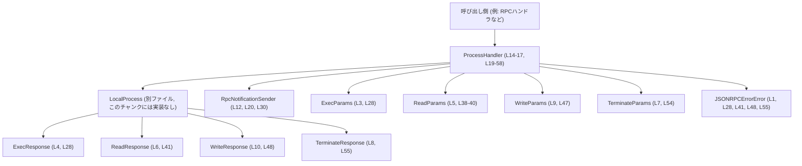
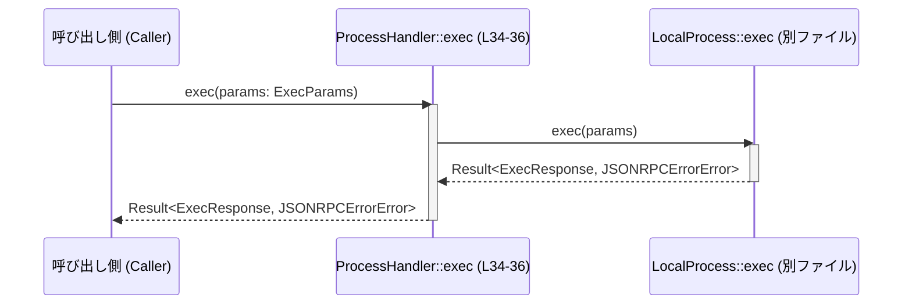

exec-server\src\server\process_handler.rs

---

## 0. ざっくり一言

`ProcessHandler` は、`LocalProcess` に対する実行・読み取り・書き込み・終了などの操作をまとめて提供する、非公開（crate 内限定）のラッパー構造体です（exec-server\src\server\process_handler.rs:L14-17, L19-58）。

---

## 1. このモジュールの役割

### 1.1 概要

- このモジュールは、**外部からの要求（おそらく JSON-RPC 経由のリクエスト）** を、内部の `LocalProcess` による実プロセス操作へ橋渡しするために存在しています。
- 実行・標準入力書き込み・標準出力読み取り・プロセス終了などの操作を、統一した API (`ProcessHandler`) として提供します（exec-server\src\server\process_handler.rs:L19-58）。
- エラーは `JSONRPCErrorError` としてそのまま呼び出し元に返し、このモジュール自身ではエラー内容の加工やロギングを行いません（L28-36, L38-43, L45-50, L52-57）。

### 1.2 アーキテクチャ内での位置づけ

このファイルから読み取れる依存関係は次の通りです。

- `ProcessHandler` は内部に `LocalProcess` を保持します（L15-17）。
- 各メソッドは `ExecParams` / `ReadParams` / `WriteParams` / `TerminateParams` を受け取り、それぞれのレスポンス型を返します（L28-36, L38-43, L45-50, L52-57）。
- `LocalProcess` の初期化や通知送信には `RpcNotificationSender` が使われます（L20-22, L30-31）。

これを Mermaid の依存関係図にすると次のようになります。



※ `LocalProcess` や各 `*Params` / `*Response` 型の中身は、このチャンクには現れません。

### 1.3 設計上のポイント

コードから読み取れる設計上の特徴は次の通りです。

- **薄いラッパー**  
  - すべてのメソッドは、引数をそのまま `LocalProcess` の対応するメソッドに渡し、戻り値をそのまま返しています（L27, L31, L35, L42, L49, L56）。
- **非公開 API（crate 内限定）**  
  - 構造体とメソッドはすべて `pub(crate)` で定義されており、クレート外からは利用できません（L15, L17, L22, L25, L28, L31, L37, L43）。
- **非同期処理と共有参照**  
  - `shutdown`/`exec`/`exec_read`/`exec_write`/`terminate` はすべて `async fn` かつ `&self` を受け取るシグネチャになっています（L22, L28, L31-33, L37-39, L43-45）。  
    これにより、同一の `ProcessHandler` インスタンスに対して複数の非同期タスクから同時にメソッドを呼び出すことが可能なインターフェースになっています（内部の同期制御の有無は `LocalProcess` 側の実装に依存し、このチャンクからは不明です）。
- **Clone 可能**  
  - `ProcessHandler` は `#[derive(Clone)]` により `Clone` トレイトを実装しており（L14）、`LocalProcess` も `Clone` であることが分かります（フィールドに含まれているため）。クローン間で何を共有するかは `LocalProcess` の実装に依存し、このチャンクには現れません。
- **エラー伝播**  
  - すべての操作は `Result<..., JSONRPCErrorError>` を返し、内部でエラーを握りつぶしたり変換したりしていません（L28, L34-36, L41, L48, L55-56）。
- **通知送信の差し替え**  
  - コンストラクタで `RpcNotificationSender` を受け取り（L20-22）、後から `set_notification_sender` で `Some`/`None` を設定し直せる設計です（L30-31）。通知の具体的な挙動は `LocalProcess` と `RpcNotificationSender` の実装に依存します。

---

## 2. 主要な機能一覧

このモジュールの `ProcessHandler` が提供する主要な機能は次の通りです。

- プロセスハンドラ生成: `new` による `LocalProcess` の初期化（L20-24）。
- 通知送信者の設定／変更: `set_notification_sender` による `RpcNotificationSender` の設定・解除（L30-32）。
- プロセスのシャットダウン要求: `shutdown` による内部プロセスの終了処理指示（L26-28）。
- コマンド実行: `exec` によるプロセス実行要求（L34-36）。
- 標準出力等の読み取り実行: `exec_read` による読み取り操作（L38-43）。
- 標準入力の書き込み実行: `exec_write` による書き込み操作（L45-50）。
- プロセス終了: `terminate` による対象プロセスの終了要求（L52-57）。

---

## 3. 公開 API と詳細解説

### 3.1 型一覧（構造体・列挙体など）― コンポーネント一覧

| 名前 | 種別 | 役割 / 用途 | 定義位置 |
|------|------|-------------|----------|
| `ProcessHandler` | 構造体 | `LocalProcess` への操作をまとめたハンドラ。実行・読み取り・書き込み・終了などのメソッドを提供する。 | exec-server\src\server\process_handler.rs:L14-17 |
| `LocalProcess` | 構造体（別ファイル） | 実際のローカルプロセス操作を行うコンポーネント。`ProcessHandler` のフィールドとして保持される。中身はこのチャンクには現れません。 | フィールド参照: exec-server\src\server\process_handler.rs:L16 |
| `RpcNotificationSender` | 型（詳細不明） | `LocalProcess::new`・`set_notification_sender` に渡される通知送信用オブジェクト。JSON-RPC の通知送信に使われると推測できますが、実装はこのチャンクには現れません。 | 利用箇所: exec-server\src\server\process_handler.rs:L12, L20, L30 |

`ExecParams` / `ExecResponse` / `ReadParams` / `ReadResponse` / `WriteParams` / `WriteResponse` / `TerminateParams` / `TerminateResponse` はすべて `crate::protocol` からインポートされる型ですが（L3-10）、定義は別ファイルで、このチャンクには現れません。

#### 関数（メソッド）インベントリー

| メソッド名 | シグネチャ概要 | 主な役割 | 定義位置 |
|-----------|----------------|----------|----------|
| `ProcessHandler::new` | `fn new(notifications: RpcNotificationSender) -> Self` | `LocalProcess` を初期化して `ProcessHandler` を生成する。 | exec-server\src\server\process_handler.rs:L20-24 |
| `ProcessHandler::shutdown` | `async fn shutdown(&self)` | 内部の `LocalProcess` にシャットダウンを依頼する。 | exec-server\src\server\process_handler.rs:L26-28 |
| `ProcessHandler::set_notification_sender` | `fn set_notification_sender(&self, Option<RpcNotificationSender>)` | 通知送信者を設定または解除する。 | exec-server\src\server\process_handler.rs:L30-32 |
| `ProcessHandler::exec` | `async fn exec(&self, ExecParams) -> Result<ExecResponse, JSONRPCErrorError>` | コマンド実行要求を `LocalProcess` に委譲する。 | exec-server\src\server\process_handler.rs:L34-36 |
| `ProcessHandler::exec_read` | `async fn exec_read(&self, ReadParams) -> Result<ReadResponse, JSONRPCErrorError>` | 読み取り系の操作を `LocalProcess` に委譲する。 | exec-server\src\server\process_handler.rs:L38-43 |
| `ProcessHandler::exec_write` | `async fn exec_write(&self, WriteParams) -> Result<WriteResponse, JSONRPCErrorError>` | 書き込み系の操作を `LocalProcess` に委譲する。 | exec-server\src\server\process_handler.rs:L45-50 |
| `ProcessHandler::terminate` | `async fn terminate(&self, TerminateParams) -> Result<TerminateResponse, JSONRPCErrorError>` | 対象プロセスの終了を `LocalProcess` に依頼する。 | exec-server\src\server\process_handler.rs:L52-57 |

---

### 3.2 関数詳細

#### `ProcessHandler::new(notifications: RpcNotificationSender) -> Self`

**概要**

- `RpcNotificationSender` を受け取り、それを使って `LocalProcess` を初期化し、そのインスタンスを `process` フィールドに保持した `ProcessHandler` を生成するコンストラクタです（L20-22）。

**引数**

| 引数名 | 型 | 説明 |
|--------|----|------|
| `notifications` | `RpcNotificationSender` | `LocalProcess::new` に渡される通知送信オブジェクト。JSON-RPC の通知などを送るために使用されると推測されますが、詳細はこのチャンクには現れません。 |

**戻り値**

- `Self` (`ProcessHandler`)  
  `LocalProcess` を 1 つフィールドとして持つ新しい `ProcessHandler` のインスタンスです（L21-22）。

**内部処理の流れ**

1. `LocalProcess::new(notifications)` を呼び出して `LocalProcess` のインスタンスを作成します（exec-server\src\server\process_handler.rs:L21-22）。
2. その `LocalProcess` を `process` フィールドとして持つ `ProcessHandler` を構築し、返します（L21-22）。

`LocalProcess::new` の実装や挙動はこのチャンクには現れません。

**Examples（使用例）**

```rust
// RpcNotificationSender の実際の生成方法はこのチャンクからは不明なため、仮の記述とします。
let notifications: RpcNotificationSender = /* 通知送信者の初期化処理 */;

// ProcessHandler を生成する
let handler = ProcessHandler::new(notifications);

// 生成した handler を使って後続の操作 (exec / exec_read / ...) を行う
```

**Errors / Panics**

- この関数自体は `Result` を返さず、`LocalProcess::new` の戻り値をそのままフィールドに格納しています（L21-22）。
- `LocalProcess::new` が panic するかどうかは、このチャンクには現れません。

**Edge cases（エッジケース）**

- `notifications` にどのような値（内部状態）を渡した場合に問題が起こるかは、`RpcNotificationSender` と `LocalProcess` の仕様に依存し、このチャンクからは分かりません。

**使用上の注意点**

- `ProcessHandler` の生成時点で通知送信者を必ず渡す設計になっており、`None` を直接渡すことはできません（L20）。
  - 通知を無効化したい場合は、生成後に `set_notification_sender(None)` を呼び出す必要があります（L30-32）。

---

#### `ProcessHandler::shutdown(&self)`

**概要**

- 内部の `LocalProcess` に対して非同期の `shutdown` 操作を委譲します（L26-27）。
- 戻り値は `()` で、エラー情報は返されません。

**引数**

| 引数名 | 型 | 説明 |
|--------|----|------|
| `&self` | `&ProcessHandler` | 操作対象となる `ProcessHandler` インスタンスへの共有参照です。 |

**戻り値**

- `()`  
  `LocalProcess::shutdown` の完了を待機するだけで、結果やエラーは返しません（L26-28）。

**内部処理の流れ**

1. `self.process.shutdown().await;` を実行し（L27）、`LocalProcess` の `shutdown` が完了するまで待ちます。
2. 何も返さずに終了します（L26-28）。

**Examples（使用例）**

```rust
// `handler` は既に ProcessHandler::new で初期化されているとする
async fn stop_process(handler: &ProcessHandler) {
    // プロセスをシャットダウンする
    handler.shutdown().await;

    // この時点で LocalProcess 側の shutdown 処理が完了している前提で、
    // 後続の後片付け処理を行うことができます（詳細は LocalProcess の仕様によります）
}
```

**Errors / Panics**

- このメソッドは `Result` を返しておらず、`LocalProcess::shutdown` のエラーを呼び出し元に伝播しません（L26-28）。
- `LocalProcess::shutdown` が panic するかどうか、このメソッドが panic する可能性があるかどうかは、このチャンクからは判断できません。

**Edge cases**

- 既に終了済みのプロセスに対して `shutdown` を呼んだ場合の挙動は `LocalProcess` の仕様に依存し、このチャンクからは不明です。
- 複数タスクから同時に `shutdown` が呼び出された場合の扱いも、`LocalProcess` の内部実装次第です。

**使用上の注意点**

- エラー情報を取得したい場合は、`LocalProcess::shutdown` がどのような契約を持っているかを別ファイルで確認する必要があります。
- `&self` を受け取る設計のため、同じインスタンスに対して並行に `shutdown` と他のメソッド（`exec` など）を呼び出すことが可能です。このような並行呼び出し時の挙動は、`LocalProcess` のスレッド安全性・状態管理の仕様に依存します。

---

#### `ProcessHandler::set_notification_sender(&self, notifications: Option<RpcNotificationSender>)`

**概要**

- `LocalProcess` に対して、通知送信者を設定または解除するための同期メソッドです（L30-31）。

**引数**

| 引数名 | 型 | 説明 |
|--------|----|------|
| `&self` | `&ProcessHandler` | 操作対象ハンドラへの共有参照です。 |
| `notifications` | `Option<RpcNotificationSender>` | 新しく設定する通知送信者。`Some(sender)` でセット、`None` で解除を意味します。 |

**戻り値**

- `()`  
  設定操作の完了を示すだけで、結果やエラーは返しません（L30-32）。

**内部処理の流れ**

1. `self.process.set_notification_sender(notifications);` をそのまま呼び出します（L31）。
2. 結果を返さずに終了します（L30-32）。

**Examples（使用例）**

```rust
fn toggle_notifications(handler: &ProcessHandler, enable: bool, sender: RpcNotificationSender) {
    if enable {
        // 通知を有効化
        handler.set_notification_sender(Some(sender));
    } else {
        // 通知を無効化
        handler.set_notification_sender(None);
    }
}
```

**Errors / Panics**

- `Result` を返さないため、設定に失敗した場合のエラーは呼び出し側では検知できません（L30-32）。
- 実際に失敗しうるかどうか、あるいは panic の可能性があるかどうかは `LocalProcess::set_notification_sender` の実装次第で、このチャンクからは分かりません。

**Edge cases**

- `Some` と `None` を頻繁に切り替えることによる影響（例えば未送信の通知がどう扱われるか）は、`LocalProcess` と `RpcNotificationSender` の仕様に依存します。

**使用上の注意点**

- このメソッド自体は同期メソッドであり、非同期コンテキストであっても `await` は不要です（L30）。
- どのタイミングで通知送信者を変更してよいか（実行中のリクエストへの影響など）は、このチャンクからは分からないため、関連コンポーネントの仕様を確認する必要があります。

---

#### `ProcessHandler::exec(&self, params: ExecParams) -> Result<ExecResponse, JSONRPCErrorError>`

**概要**

- `ExecParams` を受け取り、`LocalProcess::exec` に委譲してコマンド実行等を行う非同期メソッドです（L34-36）。
- 成功時は `ExecResponse`、失敗時は `JSONRPCErrorError` を返します。

**引数**

| 引数名 | 型 | 説明 |
|--------|----|------|
| `&self` | `&ProcessHandler` | 操作対象ハンドラへの共有参照です。 |
| `params` | `ExecParams` | 実行するコマンドやオプションなどを表すパラメータ。具体的な内容はこのチャンクには現れませんが、`crate::protocol` 内で定義されています（L3, L28）。 |

**戻り値**

- `Result<ExecResponse, JSONRPCErrorError>`  
  - `Ok(ExecResponse)` : 実行が成功した場合のレスポンス。内容は別ファイルの定義に依存します（L4, L28）。
  - `Err(JSONRPCErrorError)` : JSON-RPC 形式のエラー情報（L1, L28）。

**内部処理の流れ**

1. `self.process.exec(params).await` をそのまま実行します（L35）。
2. `LocalProcess::exec` の返した `Result` を、何も変更せずそのまま呼び出し元に返します（L34-36）。

**Examples（使用例）**

```rust
async fn run_exec(handler: &ProcessHandler, params: ExecParams)
    -> Result<ExecResponse, JSONRPCErrorError>
{
    // ProcessHandler 経由でコマンド実行
    let response = handler.exec(params).await?;
    // response の扱い方は ExecResponse の仕様に依存する
    Ok(response)
}
```

**Errors / Panics**

- `Err(JSONRPCErrorError)` は `LocalProcess::exec` からそのまま伝播されます（L35）。
- このメソッド自身には追加のエラーハンドリングはありません。
- panic の可能性は `LocalProcess::exec` の実装に依存し、このチャンクからは不明です。

**Edge cases**

- `params` に不正な値が含まれている場合の動作（エラーになるのか、デフォルト値にフォールバックするのか等）は、`ExecParams` と `LocalProcess::exec` の契約に依存し、このチャンクからは分かりません。
- 同じ `ProcessHandler` に対して複数の `exec` を同時に投げた場合の扱いも、`LocalProcess` の内部実装次第です。

**使用上の注意点**

- `async fn` なので、必ず `.await` で待機する必要があります（L34-35）。
- エラーは JSON-RPC 形式の `JSONRPCErrorError` として返ってくるため、上位の JSON-RPC レイヤーから扱いやすい設計になっていますが、その詳細フィールドはこのチャンクには現れません。

---

#### `ProcessHandler::exec_read(&self, params: ReadParams) -> Result<ReadResponse, JSONRPCErrorError>`

**概要**

- 読み取り系の操作（標準出力の読み込み等）を `LocalProcess::exec_read` に委譲する非同期メソッドです（L38-43）。

**引数**

| 引数名 | 型 | 説明 |
|--------|----|------|
| `&self` | `&ProcessHandler` | 操作対象ハンドラへの共有参照です。 |
| `params` | `ReadParams` | 読み取りに関するパラメータ。詳細は別ファイルに定義されています（L5, L38-40）。 |

**戻り値**

- `Result<ReadResponse, JSONRPCErrorError>`  
  成功時には `ReadResponse`、失敗時には `JSONRPCErrorError` を返します（L41）。

**内部処理の流れ**

1. `self.process.exec_read(params).await` を実行します（L42）。
2. 結果の `Result` を変更せずに返します（L38-43）。

**Examples（使用例）**

```rust
async fn read_output(handler: &ProcessHandler, params: ReadParams)
    -> Result<ReadResponse, JSONRPCErrorError>
{
    // 読み取り操作を実行
    let response = handler.exec_read(params).await?;
    Ok(response)
}
```

**Errors / Panics**

- エラーは `LocalProcess::exec_read` からの `JSONRPCErrorError` がそのまま返されます（L41-42）。
- panic の可能性については `LocalProcess::exec_read` の実装に依存します。

**Edge cases**

- 読み取り対象が存在しない、すでに EOF である等のケースの挙動は、`ReadParams` と `LocalProcess::exec_read` の仕様に依存します。

**使用上の注意点**

- `exec` と同様、`.await` を忘れないことが必要です（L42）。
- 読み取り回数や頻度が高い場合、`LocalProcess` の内部でどの程度バッファリングされているか・ブロッキング I/O を行うかなど、性能に関する詳細は別ファイルを参照する必要があります。

---

#### `ProcessHandler::exec_write(&self, params: WriteParams) -> Result<WriteResponse, JSONRPCErrorError>`

**概要**

- 書き込み系の操作（標準入力への送信等）を `LocalProcess::exec_write` に委譲する非同期メソッドです（L45-50）。

**引数**

| 引数名 | 型 | 説明 |
|--------|----|------|
| `&self` | `&ProcessHandler` | 操作対象ハンドラへの共有参照です。 |
| `params` | `WriteParams` | 書き込み内容やターゲットを表すパラメータ（L9, L47）。 |

**戻り値**

- `Result<WriteResponse, JSONRPCErrorError>`  
  成功時には `WriteResponse`、失敗時には `JSONRPCErrorError` を返します（L48）。

**内部処理の流れ**

1. `self.process.exec_write(params).await` を呼び出します（L49）。
2. `LocalProcess::exec_write` の戻り値をそのまま返します（L45-50）。

**Examples（使用例）**

```rust
async fn write_input(handler: &ProcessHandler, params: WriteParams)
    -> Result<WriteResponse, JSONRPCErrorError>
{
    // 書き込み操作を実行
    let response = handler.exec_write(params).await?;
    Ok(response)
}
```

**Errors / Panics**

- 書き込み先が閉じている等のエラーは `LocalProcess::exec_write` からの `JSONRPCErrorError` として返されます（L48-49）。
- panic の可能性は不明です。

**Edge cases**

- 非同期に大量の書き込みを行ったときのバックプレッシャーやバッファあふれの扱いなど、詳細な挙動は `LocalProcess` の実装に依存します。

**使用上の注意点**

- 書き込み操作は、読み取りや実行と並行に行われる可能性があるため、`LocalProcess` の並行性制御がどうなっているかを確認する必要があります（このチャンクには現れません）。

---

#### `ProcessHandler::terminate(&self, params: TerminateParams) -> Result<TerminateResponse, JSONRPCErrorError>`

**概要**

- 実行中または対象のプロセスを終了させるために `LocalProcess::terminate_process` を呼び出す非同期メソッドです（L52-57）。

**引数**

| 引数名 | 型 | 説明 |
|--------|----|------|
| `&self` | `&ProcessHandler` | 操作対象ハンドラへの共有参照です。 |
| `params` | `TerminateParams` | 終了対象プロセスの識別情報などを含むパラメータ（L7, L54）。 |

**戻り値**

- `Result<TerminateResponse, JSONRPCErrorError>`  
  成功時には `TerminateResponse`、失敗時には `JSONRPCErrorError` を返します（L55）。

**内部処理の流れ**

1. `self.process.terminate_process(params).await` を実行します（L56）。
2. 返された `Result` をそのまま返します（L52-57）。

**Examples（使用例）**

```rust
async fn kill_process(handler: &ProcessHandler, params: TerminateParams)
    -> Result<TerminateResponse, JSONRPCErrorError>
{
    // プロセス終了を要求
    let response = handler.terminate(params).await?;
    Ok(response)
}
```

**Errors / Panics**

- 終了対象が存在しない、権限が足りないなどのエラーは `LocalProcess::terminate_process` により `JSONRPCErrorError` として表現されると考えられますが、実際の条件はこのチャンクには現れません。

**Edge cases**

- すでに終了しているプロセスに対する terminate の挙動は `LocalProcess::terminate_process` に依存します。
- `shutdown` と `terminate` を同時に呼び出した場合の挙動も不明です。

**使用上の注意点**

- プロセス終了は副作用が大きいため、どの識別子を持つプロセスが終了の対象になるか（`TerminateParams` の仕様）は別途確認する必要があります。
- セキュリティ上、どの呼び出し元が `terminate` を呼べるようになっているかは、上位レイヤー（認可ロジック）側の責務であり、このモジュールではチェックしていません。

---

### 3.3 その他の関数

- このファイルには、上記以外の補助的な関数やラッパー関数は定義されていません（exec-server\src\server\process_handler.rs 全体参照）。

---

## 4. データフロー

このモジュールにおける代表的な処理シナリオとして、「コマンド実行 (`exec`) → 結果取得」という流れを例に説明します。

### 4.1 処理の要点

- 呼び出し側は `ExecParams` を構築し、`ProcessHandler::exec` を `await` します（L34-35）。
- `ProcessHandler::exec` は、そのまま `LocalProcess::exec` に処理を委譲し、結果の `Result<ExecResponse, JSONRPCErrorError>` を返します（L35）。
- このレイヤーでのパラメータ加工や結果の変換は行われません。

### 4.2 シーケンス図



同様に、`exec_read` / `exec_write` / `terminate` も、呼び出し側 → `ProcessHandler` → `LocalProcess` → 呼び出し側という同じパターンでデータが流れます（L38-43, L45-50, L52-57）。

---

## 5. 使い方（How to Use）

### 5.1 基本的な使用方法

`ProcessHandler` を用いた典型的なフロー（生成 → 実行 → 終了）は次のようになります。

```rust
// RpcNotificationSender の具体的な生成方法は別ファイルに依存するため、ここでは省略します。
async fn example_flow(notifications: RpcNotificationSender,
                      exec_params: ExecParams)
    -> Result<(), JSONRPCErrorError>
{
    // 1. ProcessHandler を生成する
    let handler = ProcessHandler::new(notifications);        // L20-24

    // 2. コマンドを実行する
    let exec_response = handler.exec(exec_params).await?;    // L34-36
    // exec_response の内容は ExecResponse の仕様に依存

    // 3. 必要に応じて読み取りや書き込みを行う
    // let read_resp = handler.exec_read(read_params).await?;
    // let write_resp = handler.exec_write(write_params).await?;

    // 4. 処理が完了したらシャットダウンを呼ぶ
    handler.shutdown().await;                                // L26-28

    Ok(())
}
```

### 5.2 よくある使用パターン

1. **通知の一時的な無効化**

```rust
fn temporarily_disable_notifications(handler: &ProcessHandler,
                                     sender: RpcNotificationSender) {
    // 通知を有効にする
    handler.set_notification_sender(Some(sender.clone()));   // L30-31

    // ... ここで何らかの処理を行う ...

    // 通知を一時的に無効化する
    handler.set_notification_sender(None);                   // L30-31
}
```

1. **複数タスクからの共有**

`ProcessHandler` のメソッドはすべて `&self` を受け取り `async` であるため（L22, L28, L31-33, L37-39, L43-45）、`Arc<ProcessHandler>` を使って複数タスクから共有するパターンが考えられます。

```rust
use std::sync::Arc;

async fn parallel_execs(handler: Arc<ProcessHandler>,
                        p1: ExecParams,
                        p2: ExecParams)
    -> Result<(ExecResponse, ExecResponse), JSONRPCErrorError>
{
    let h1 = handler.clone();
    let h2 = handler.clone();

    let t1 = tokio::spawn(async move { h1.exec(p1).await }); // L34-36
    let t2 = tokio::spawn(async move { h2.exec(p2).await }); // L34-36

    let r1 = t1.await.unwrap()?; // spawn の Result と exec の Result を解包
    let r2 = t2.await.unwrap()?;

    Ok((r1, r2))
}
```

※ 実際にこのような並行呼び出しが安全かどうかは `LocalProcess` のスレッド安全性に依存します。このチャンクでは不明です。

### 5.3 よくある間違い

Rust の非同期メソッド共通ですが、`.await` を忘れる誤用に注意が必要です。

```rust
async fn wrong_usage(handler: &ProcessHandler, params: ExecParams) {
    // 間違い例: Future を生成しただけで待機していない
    let _future = handler.exec(params);      // コンパイルは通るが、実行されない

    // 正しい例: .await で実際に実行する
    // let response = handler.exec(params).await.unwrap();
}
```

また、`Result` のエラーを無視すると、JSON-RPC エラーが握りつぶされ、問題の診断が難しくなります。

```rust
async fn ignore_error(handler: &ProcessHandler, params: ExecParams) {
    // 間違い例: 結果を無視している
    let _ = handler.exec(params).await;      // エラーをログにも表示しない

    // より良い扱い方の例: エラー内容をログに出すなど
    // match handler.exec(params).await {
    //     Ok(resp) => { /* 正常処理 */ }
    //     Err(err) => eprintln!("exec failed: {:?}", err),
    // }
}
```

### 5.4 使用上の注意点（まとめ）

- **エラー処理**  
  - `exec` / `exec_read` / `exec_write` / `terminate` はすべて `Result<_, JSONRPCErrorError>` を返し（L28, L41, L48, L55）、このレイヤーでエラーは変換されません。呼び出し側で適切にハンドリングする必要があります。
- **並行実行**  
  - すべてのメソッドが `&self` であり、`ProcessHandler` 自体が `Clone` 可能であるため（L14, L22-23, L28-29, L31, L35, L42, L49, L56）、同一インスタンスへの並行呼び出しがインターフェース上可能です。実際の安全性・排他制御は `LocalProcess` に依存します。
- **セキュリティ**  
  - このモジュールはパラメータの検証やアクセス制御を行っていません。危険な操作（プロセス終了など）に対する認可は、上位レイヤー（RPC ハンドラ等）で行う必要があります（コード中にセキュリティチェックは存在しません: L19-58）。

---

## 6. 変更の仕方（How to Modify）

### 6.1 新しい機能を追加する場合

例えば、`LocalProcess` に新しい操作 `restart_process` を追加し、それを `ProcessHandler` からも呼び出せるようにしたい場合、典型的なステップは次のようになります。

1. **LocalProcess にメソッド追加**  
   - 別ファイルの `LocalProcess` 実装に `async fn restart_process(&self, params: RestartParams) -> Result<RestartResponse, JSONRPCErrorError>` のようなメソッドを追加します（このチャンクには存在しません）。
2. **protocol にパラメータ／レスポンス型を追加**  
   - `crate::protocol` に `RestartParams` / `RestartResponse` を定義し、ここからインポートできるようにします。
3. **ProcessHandler にラッパーメソッド追加**  
   - 本ファイルに次のようなメソッドを追加します（既存メソッドと同じパターンに従う）。

```rust
// use crate::protocol::{RestartParams, RestartResponse}; を追記

impl ProcessHandler {
    pub(crate) async fn restart(
        &self,
        params: RestartParams,
    ) -> Result<RestartResponse, JSONRPCErrorError> {
        self.process.restart_process(params).await
    }
}
```

1. **上位レイヤーでの呼び出しを追加・更新**  
   - JSON-RPC のメソッドテーブルなど、`ProcessHandler` を使う側のコードに `restart` を組み込みます。

### 6.2 既存の機能を変更する場合

- **影響範囲の確認**
  - `ProcessHandler` は薄いラッパーであり、ロジックの大半は `LocalProcess` にあります（L16, L27, L31, L35, L42, L49, L56）。  
    実際の振る舞いを変更したい場合、多くは `LocalProcess` 側の修正になります。
- **契約（前提条件・戻り値）の維持**
  - `exec` などのシグネチャ（引数の型・戻り値の型）を変えると、`ProcessHandler` を利用している上位レイヤー（RPC ハンドラなど）のコードにも影響が及びます。
  - 特に `Result<_, JSONRPCErrorError>` という形は JSON-RPC プロトコルとの整合性に関わるため、変更する際はプロトコル全体の設計を確認する必要があります。
- **テストとの関係**
  - このモジュールは `LocalProcess` を直接フィールドとして持っているため（L16）、単体テストで `LocalProcess` をモックに差し替えることはそのままではできません。
  - もし容易にテストできるようにしたい場合は、`LocalProcess` 用のトレイトを導入し、`ProcessHandler` がそのトレイトをジェネリックまたはトレイトオブジェクトとして保持する、といった設計変更が別途必要になります（これはこのチャンクには実装されていません）。

---

## 7. 関連ファイル

このモジュールと密接に関係するファイル・ディレクトリ（名前はコードから判明するもののみ）を列挙します。

| パス | 役割 / 関係 |
|------|------------|
| `exec-server\src\local_process.rs` または類似パス | `LocalProcess` の実装が置かれていると推測されます。`ProcessHandler` の実際の振る舞いはこの型に依存します（フィールド参照: exec-server\src\server\process_handler.rs:L16）。実際のファイル名・パスはこのチャンクには明示されていません。 |
| `exec-server\src\protocol\mod.rs` など | `ExecParams` / `ExecResponse` / `ReadParams` / `ReadResponse` / `WriteParams` / `WriteResponse` / `TerminateParams` / `TerminateResponse` の定義があるモジュールです（インポート: exec-server\src\server\process_handler.rs:L3-10）。具体的なファイル構成はこのチャンクには現れません。 |
| `exec-server\src\rpc\mod.rs` など | `RpcNotificationSender` の定義が置かれているモジュールです（インポート: exec-server\src\server\process_handler.rs:L11-12）。 |
| `codex_app_server_protocol` クレート | `JSONRPCErrorError` を提供する外部クレートです（インポート: exec-server\src\server\process_handler.rs:L1）。JSON-RPC のエラーフォーマットに関する仕様が含まれます。 |

※ 具体的なファイルパスや実装内容はこのチャンクには現れないため、上記のうち「〜と推測されます」と記載しているものは厳密な場所までは断定できません。
