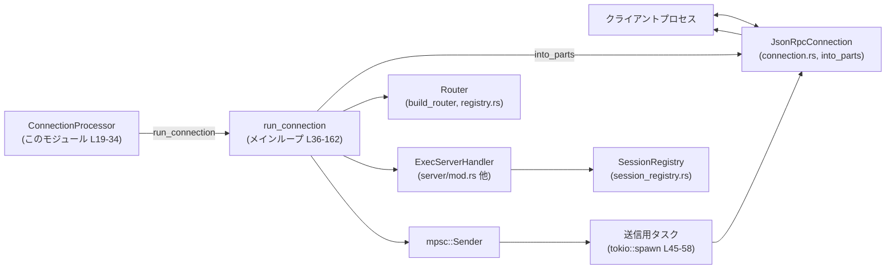
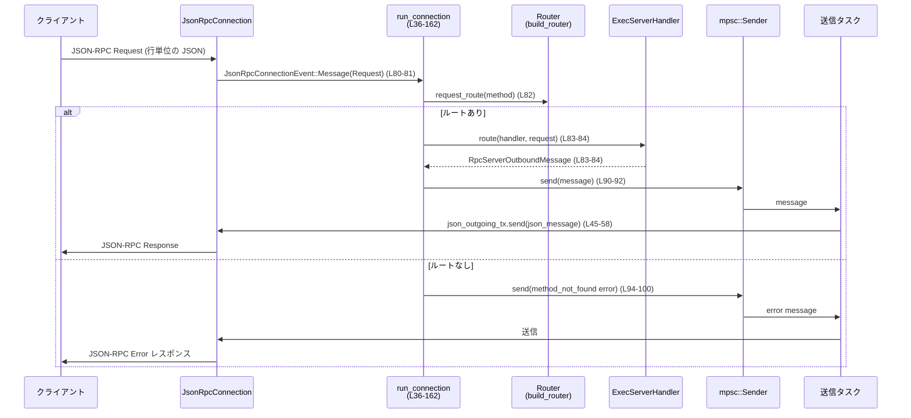

# exec-server/src/server/processor.rs コード解説

## 0. ざっくり一言

このモジュールは、exec-server とクライアントの間の **JSON-RPC コネクションを処理するイベントループ**と、その挙動を検証するテスト群を提供します（`processor.rs:L19-162, L164-388`）。  
JSON-RPC メッセージをルータ経由で `ExecServerHandler` に渡し、レスポンスを非同期に送り返す役割を持ちます。

---

## 1. このモジュールの役割

### 1.1 概要

- このモジュールは **1 本の exec-server 接続に対する JSON-RPC プロトコル処理**を担当します（`processor.rs:L36-162`）。
- 受信したメッセージをパース済みのイベントとして受け取り、  
  ルーティング・ハンドラ実行・エラー処理・切断処理までを一括して行います。
- セッション管理 (`SessionRegistry`) と実処理 (`ExecServerHandler`) を結び付け、**セッション再接続時に古い接続を安全に切り離す**挙動をテストで保証しています（`processor.rs:L203-291`）。

### 1.2 アーキテクチャ内での位置づけ

このモジュールは、低レベルの I/O を扱う `JsonRpcConnection` と、  
アプリケーションロジックを持つ `ExecServerHandler` / ルータの間を仲介します。



※ Router・ExecServerHandler・SessionRegistry の実装はこのチャンクには現れません。

### 1.3 設計上のポイント

コードから読み取れる設計上の特徴は次の通りです。

- **責務の分割**（`processor.rs:L36-58`）
  - 受信処理（メインループ）と送信処理（別タスク）を分離。
  - 送信側は `tokio::spawn` したタスク内で `mpsc::Receiver` を読み続けます。
- **セッション管理との連携**（`processor.rs:L37-43, L61-65, L154-160`）
  - 1 つの `SessionRegistry` を複数接続で共有（`Arc<SessionRegistry>`）。
  - 各ループの先頭で `handler.is_session_attached()` をチェックし、セッションが他の接続に移ったらイベント処理を終了。
- **順序保証**（`processor.rs:L60-61`）
  - コメントにある通り、「initialize / initialized」の順序を保つため、イベントを **逐次処理**しています。
- **エラーハンドリング方針**
  - 不正なリクエスト・未知のメソッドには JSON-RPC エラーを返す（`processor.rs:L67-79, L94-105`）。
  - 想定外の通知・レスポンス・エラーを受けた場合は **接続をクローズ**する（`processor.rs:L107-143`）。
  - シリアライズエラーやチャネルクローズも、ログを出した上でループ終了に繋げます（`processor.rs:L45-58, L90-92, L94-105`）。
- **安全性**
  - このファイル内に `unsafe` ブロックはありません。
  - 共有状態は `Arc` 経由で参照され、内部の排他制御は `SessionRegistry` や `ExecServerHandler` 側に委ねられています（実装はこのチャンクには現れません）。

---

## 2. 主要な機能一覧

このモジュールが提供する主な機能は次の通りです。

- ConnectionProcessor: exec-server の JSON-RPC コネクション処理を統括するエントリポイント（`processor.rs:L19-34`）
- run_connection: 1 コネクション分の JSON-RPC イベントループ本体（`processor.rs:L36-162`）
- テスト用ユーティリティ:
  - in-memory デュプレクスストリームでコネクションを疑似生成する `spawn_test_connection`（`processor.rs:L293-303`）
  - JSON-RPC メッセージ送受信のヘルパ（`send_request`, `send_notification`, `read_response` など `processor.rs:L305-356`）
- 統合テスト:
  - セッション再接続と「古い接続の切り離し」を保証するテスト（`transport_disconnect_detaches_session_during_in_flight_read` `processor.rs:L203-291`）

### 2.1 コンポーネントインベントリー（構造体・関数一覧）

| 名称 | 種別 | 役割 / 用途 | 公開範囲 | 定義位置 |
|------|------|-------------|----------|----------|
| `ConnectionProcessor` | 構造体 | セッションレジストリを保持し、コネクション処理を起動するエントリポイント | `pub(crate)` | `processor.rs:L19-22` |
| `ConnectionProcessor::new` | 関数（関連関数） | 新しい `SessionRegistry` を作成して `ConnectionProcessor` を構築 | `pub(crate)` | `processor.rs:L25-29` |
| `ConnectionProcessor::run_connection` | 非同期メソッド | `JsonRpcConnection` を受け取り、内部の `run_connection` を起動 | `pub(crate)` | `processor.rs:L31-33` |
| `run_connection` | 非同期関数（自由関数） | ルータ・ハンドラ・チャネル・タスクを組み立て、JSON-RPC イベントループを実行 | モジュール内 | `processor.rs:L36-162` |
| `tests::transport_disconnect_detaches_session_during_in_flight_read` | 非同期テスト関数 | セッション再接続時に古い接続が切り離されることを検証 | テストのみ | `processor.rs:L203-291` |
| `tests::spawn_test_connection` | 関数 | in-memory デュプレクスストリームから `JsonRpcConnection` を生成し `run_connection` をスレッドで起動 | テストのみ | `processor.rs:L293-303` |
| `tests::send_request` | 非同期関数 | JSON-RPC Request を 1 行の JSON として書き込むテストヘルパ | テストのみ | `processor.rs:L305-321` |
| `tests::send_notification` | 非同期関数 | JSON-RPC Notification を書き込むテストヘルパ | テストのみ | `processor.rs:L323-331` |
| `tests::write_message` | 非同期関数 | 任意の `JSONRPCMessage` をエンコード・送信する共通処理 | テストのみ | `processor.rs:L334-338` |
| `tests::read_response` | 非同期関数 | 1 行 JSON を読み JSON-RPC Response としてデコード・検証する | テストのみ | `processor.rs:L340-356` |
| `tests::exec_params` | 関数 | 実行プロセス用のパラメータ（PATH など）を組み立てる | テストのみ | `processor.rs:L359-372` |
| `tests::sleep_then_print_argv` | 関数 | OS ごとに異なる「遅延して出力する」コマンドラインを組み立てる | テストのみ | `processor.rs:L374-388` |

---

## 3. 公開 API と詳細解説

### 3.1 型一覧（構造体）

| 名前 | 種別 | 役割 / 用途 | 定義位置 |
|------|------|-------------|----------|
| `ConnectionProcessor` | 構造体 | `SessionRegistry` への共有参照を保持し、コネクションごとに処理を開始するための薄いラッパです。内部で `run_connection` を呼び出します。 | `processor.rs:L19-22` |

`SessionRegistry` 自体のフィールドや振る舞いはこのチャンクには現れません。

### 3.2 関数詳細（重要なもの）

#### `ConnectionProcessor::new() -> Self`

**概要**

新しい `SessionRegistry` を生成し、それを保持する `ConnectionProcessor` を作るコンストラクタです（`processor.rs:L25-29`）。

**引数**

なし。

**戻り値**

- `Self`（`ConnectionProcessor`）  
  - 内部に `Arc<SessionRegistry>` を持ったインスタンスが返ります（`processor.rs:L21, L27`）。

**内部処理の流れ**

1. `SessionRegistry::new()` で新しいレジストリを作成（`processor.rs:L27`）。
2. それを `session_registry` フィールドにセットして `Self` を返します（`processor.rs:L26-28`）。

`SessionRegistry::new` の具体的な実装内容はこのチャンクには現れません。

**Examples（使用例）**

```rust
use std::io;
use std::sync::Arc;
use crate::connection::JsonRpcConnection;
use crate::server::processor::ConnectionProcessor;

async fn run_exec_server() -> io::Result<()> {
    // exec-server 全体で 1 つの ConnectionProcessor を作成する
    let processor = ConnectionProcessor::new(); // processor.rs:L25-29

    // ここでは例として 1 つの接続を処理
    let connection = JsonRpcConnection::from_stdio(
        tokio::io::stdin(),
        tokio::io::stdout(),
        "exec-server".to_string(),
    );

    // 接続ごとに run_connection を起動
    processor.run_connection(connection).await; // processor.rs:L31-33
    Ok(())
}
```

**Errors / Panics**

- この関数自体はエラーや panic を発生させるコードを含んでいません（`processor.rs:L25-29`）。
- `SessionRegistry::new` 内部での挙動はこのチャンクでは不明です。

**Edge cases（エッジケース）**

- 特に入力を取らないため、エッジケースはありません。

**使用上の注意点**

- `ConnectionProcessor` は `Clone` ではありませんが、内部の `SessionRegistry` は `Arc` で共有されるため、  
  「1 プロセスに 1 つの `ConnectionProcessor`」を作り、接続ごとに `run_connection` を呼ぶ構成が自然です（`processor.rs:L19-22, L31-33`）。

---

#### `ConnectionProcessor::run_connection(&self, connection: JsonRpcConnection)`

**概要**

`JsonRpcConnection` を受け取り、このモジュール内の自由関数 `run_connection` を使って非同期のメインループを実行します（`processor.rs:L31-33`）。  
`SessionRegistry` は `Arc::clone` により共有されます。

**引数**

| 引数名 | 型 | 説明 |
|--------|----|------|
| `&self` | `&ConnectionProcessor` | セッションレジストリを含むプロセッサ本体。 |
| `connection` | `JsonRpcConnection` | I/O を伴う JSON-RPC 接続オブジェクト。`into_parts` によって分解されます。 |

**戻り値**

- `()`（暗黙のユニット値）  
  - 非同期処理の完了を待った後に何も返しません。

**内部処理の流れ**

1. `Arc::clone(&self.session_registry)` により `SessionRegistry` を共有する `Arc` を作成（`processor.rs:L32`）。
2. 自由関数 `run_connection(connection, cloned_registry).await` を呼び出し、1 接続の処理を委譲（`processor.rs:L32`）。

**Examples（使用例）**

テストでは自由関数 `run_connection` を直接呼んでいますが（`processor.rs:L186, L293-303`）、  
通常は `ConnectionProcessor` を経由して次のように呼び出すと、`SessionRegistry` が一元管理できます。

```rust
use crate::connection::JsonRpcConnection;
use crate::server::processor::ConnectionProcessor;

async fn handle_new_connection(connection: JsonRpcConnection) {
    // アプリケーションで共有している ConnectionProcessor
    static PROCESSOR: once_cell::sync::Lazy<ConnectionProcessor> =
        once_cell::sync::Lazy::new(ConnectionProcessor::new);

    PROCESSOR.run_connection(connection).await;
}
```

（`once_cell` の使用は例示であり、このファイル内には登場しません。）

**Errors / Panics**

- 本メソッド自体は `Result` を返さず、`run_connection` による接続終了をそのまま待つだけです（`processor.rs:L31-33`）。
- エラー処理・ログ出力・切断の扱いは自由関数 `run_connection` に委ねられています。

**Edge cases**

- `connection` が既にクローズ済みでも、`run_connection` 側で `Disconnected` イベント等を通じて正常に終了することが期待されますが、  
  具体的な `JsonRpcConnection` の挙動はこのチャンクには現れません。

**使用上の注意点**

- 同じ `JsonRpcConnection` を複数回渡すことはできません。`into_parts()` で所有権を消費するためです（`processor.rs:L38-39`）。
- `run_connection` は接続終了まで戻らないため、複数接続を扱う場合は `tokio::spawn` などで並行実行する必要があります。

---

#### `run_connection(connection: JsonRpcConnection, session_registry: Arc<SessionRegistry>)`

**概要**

1 本の exec-server コネクションに対して、JSON-RPC メッセージの受信・ルーティング・送信・切断処理を行う **メインイベントループ**です（`processor.rs:L36-162`）。  
新旧セッションの切り替え、`initialize/initialized` の順序維持、切断検知などのコアロジックがここに含まれます。

**引数**

| 引数名 | 型 | 説明 |
|--------|----|------|
| `connection` | `JsonRpcConnection` | I/O レイヤの JSON-RPC 接続。`into_parts` でチャネル・タスクに分解されます（`processor.rs:L38-39`）。 |
| `session_registry` | `Arc<SessionRegistry>` | セッションライフサイクル管理用の共有レジストリ（`processor.rs:L36-37, L43`）。 |

**戻り値**

- `()`  
  - 接続が閉じられ、関連タスク・チャネルがクリーンアップされた時点で完了します。

**内部処理の流れ（アルゴリズム）**

1. **初期化**（`processor.rs:L37-43`）
   - ルータ構築: `build_router()` からルータを生成し `Arc` 包装（`processor.rs:L37`）。
   - `JsonRpcConnection::into_parts()` で:
     - サーバからクライアントへの JSON 文字列送信用 `json_outgoing_tx`
     - 受信イベント用 `incoming_rx`
     - 切断通知用 `disconnected_rx`
     - バックグラウンド I/O タスク群 `connection_tasks`
     に分解（`processor.rs:L38-39`）。
   - サーバ内部で使う `mpsc::channel::<RpcServerOutboundMessage>` を生成（`processor.rs:L40-41`）。
   - `RpcNotificationSender` と `ExecServerHandler` を初期化（`processor.rs:L42-43`）。

2. **送信タスクの起動**（`processor.rs:L45-58`）
   - 別タスク `outbound_task` を `tokio::spawn` し、`outgoing_rx` から `RpcServerOutboundMessage` を受信。
   - 各メッセージを `encode_server_message` で JSON 文字列にシリアライズ（`processor.rs:L47-53`）。
     - エラー時は warn ログを出し、送信ループを終了。
   - `json_outgoing_tx.send(json_message).await` でクライアントに送信（`processor.rs:L54-55`）。
     - 送信エラー（チャネルクローズ）でループを終了。

3. **受信ループ**（`processor.rs:L60-151`）
   - コメントにある通り、「initialize/initialized の順序を守る」ため `while let Some(event) = incoming_rx.recv().await` で **逐次**処理（`processor.rs:L60-61`）。
   - ループ先頭で `handler.is_session_attached()` をチェックし、セッションが別接続に移っていればループを終了（`processor.rs:L61-65`）。  
     - これがテストで検証される「セッションの切り離し」挙動の基盤です（`processor.rs:L203-291`）。

   各イベント種別ごとの処理:

   1. **MalformedMessage**（不正メッセージ）（`processor.rs:L67-79`）
      - warn ログを出力。
      - `RpcServerOutboundMessage::Error` を組み立て、`invalid_request(reason)` を返す JSON-RPC エラーを送信。
      - 送信に失敗した場合（送信タスク終了など）は受信ループを終了。

   2. **Message(JSONRPCMessage)**（`processor.rs:L80-144`）
      - `JSONRPCMessage::Request(request)`（`processor.rs:L81-106`）
        - `router.request_route(request.method.as_str())` でメソッド名に対応するルートを取得（`processor.rs:L82`）。
        - ルートが存在する場合:
          - `tokio::select!` で
            - ルート（ハンドラ）実行 `route(Arc::clone(&handler), request)` と
            - 切断通知 `disconnected_rx.changed()`
            を競合させる（`processor.rs:L83-89`）。
          - 切断側が先に完了した場合は debug ログを出力してループを終了（`processor.rs:L85-88`）。
          - ハンドラが返した `RpcServerOutboundMessage` を `outgoing_tx.send` で送信（`processor.rs:L90-92`）。
            - 送信失敗でループ終了。
        - ルートが存在しない場合:
          - `method_not_found(...)` エラーを作成し送信（`processor.rs:L94-100`）。
          - 送信失敗でループ終了（`processor.rs:L101-105`）。

      - `JSONRPCMessage::Notification(notification)`（`processor.rs:L107-129`）
        - `router.notification_route(...)` を用いて通知用ルートを検索（`processor.rs:L108`）。
        - 見つからない場合: warn ログを出して **接続を閉じる**（`processor.rs:L110-115`）。
        - 見つかった場合:
          - 再び `tokio::select!` でハンドラ実行と切断通知を競合させる（`processor.rs:L116-124`）。
          - ハンドラが `Err` を返した場合、プロトコルエラーとして warn ログを出し接続を閉じる（`processor.rs:L125-128`）。

      - `JSONRPCMessage::Response` / `JSONRPCMessage::Error`（`processor.rs:L130-143`）
        - クライアントからのレスポンスやエラーは想定外とみなされ、warn ログ出力の後、接続を閉じます。

   3. **Disconnected**（`processor.rs:L145-150`）
      - 切断理由があれば debug ログに出力し、ループを終了。

4. **クリーンアップ**（`processor.rs:L154-161`）
   - `handler.shutdown().await` でハンドラ側の終了処理を待機（`processor.rs:L154`）。
   - `handler` と `outgoing_tx` を明示的に drop（`processor.rs:L155-156`）  
     → これにより `outgoing_rx.recv().await` が `None` を返し、送信タスクが終了。
   - `connection_tasks` の各タスクを `abort()` し、`await` して終了を確認（`processor.rs:L157-160`）。
   - 最後に `outbound_task.await` で送信タスクの終了を待つ（`processor.rs:L161`）。

**Examples（使用例）**

テストでは、in-memory のデュプレクスストリームから `JsonRpcConnection` を構成し `run_connection` を直接起動しています（`processor.rs:L293-303`）。

```rust
use std::sync::Arc;
use tokio::io::{BufReader, duplex};
use tokio::io::AsyncBufReadExt;
use crate::connection::JsonRpcConnection;
use crate::server::session_registry::SessionRegistry;
use crate::server::processor::run_connection;

// テストコードと同様の使用例 (processor.rs:L293-303)
async fn example() {
    let registry = Arc::new(SessionRegistry::new());
    let (client_writer, server_reader) = duplex(1 << 20);
    let (server_writer, client_reader) = duplex(1 << 20);

    let connection = JsonRpcConnection::from_stdio(
        server_reader,
        server_writer,
        "label".to_string(),
    );

    // 1 接続分の処理を別タスクに載せる
    tokio::spawn(run_connection(connection, Arc::clone(&registry)));

    // client_writer / client_reader 側で JSON-RPC メッセージをやりとりする…
}
```

**Errors / Panics**

- 本関数内で意図的に `panic!` を発生させている箇所はありません（`processor.rs:L36-162`）。
- エラーは基本的に **ログ出力とループ終了** で扱われます。
  - シリアライズエラー: warn ログ後、送信タスク終了（`processor.rs:L47-53`）。
  - チャネル送信エラー: 受信ループ側で `send(...).await.is_err()` を検出してループ終了（`processor.rs:L69-77, L90-92, L94-105`）。
  - 想定外のメッセージ種別や通知: warn ログ後、受信ループを終了（`processor.rs:L110-115, L130-143`）。
  - ハンドラからのエラー: 通知ハンドラの場合は warn ログを出して接続を閉じます（`processor.rs:L125-128`）。
- 実行時に panic が起きる可能性があるのは、主に依存先のモジュール（`build_router`, `ExecServerHandler`, `JsonRpcConnection` など）の実装に依存し、このチャンクからは判断できません。

**Edge cases（エッジケース）**

- **不正な JSON / メッセージ形式**  
  - `JsonRpcConnectionEvent::MalformedMessage` として送られ、`invalid_request` エラーを返します（`processor.rs:L67-79`）。  
    接続は継続されます（送信に失敗しない限り）。
- **未知のリクエストメソッド**  
  - `method_not_found` エラーを返し、接続は継続されます（`processor.rs:L82-105`）。
- **未知の Notification メソッド**  
  - warn ログの後、**接続が閉じられます**（`processor.rs:L107-115`）。
- **クライアントが Response / Error を送ってくる**  
  - サーバ側が発行したものではないクライアント発の `Response` / `Error` は想定外として接続を閉じます（`processor.rs:L130-143`）。
- **リクエスト処理中にトランスポートが切断される**  
  - `tokio::select!` によって `disconnected_rx.changed()` が先に完了した場合、  
    debug ログを出力し、受信ループを終了します（`processor.rs:L83-89`）。  
  - テストでは、この挙動により **古い接続がセッションから切り離され、新しい接続がすぐに resume できる**ことを確認しています（`processor.rs:L203-291`）。
- **Notification 処理中にトランスポートが切断される**  
  - 同様に `tokio::select!` で切断を検知し、接続をクローズします（`processor.rs:L116-124`）。

**使用上の注意点**

- **逐次処理による順序保証**  
  - 受信イベントは 1 つずつ処理されるため、`initialize` → `initialized` のような順序に依存するプロトコル処理を安全に行えます（`processor.rs:L60-61`）。
- **セッション再接続と接続の破棄**  
  - `handler.is_session_attached()` が `false` を返すようになった時点で、旧接続のループは終了します（`processor.rs:L61-65`）。  
    テストでは、長時間ブロックするような `EXEC_READ` 中でも、トランスポート切断→再接続で新しい接続がスムーズに利用できることが確認されています（`processor.rs:L233-291`）。
- **スレッド安全性・並行性**  
  - 共通リソース（`SessionRegistry`, `ExecServerHandler`）は `Arc` で共有されます（`processor.rs:L37, L43`）。
  - 受信ループは 1 本のみで、同じハンドラに対する複数同時呼び出しはルータ・ハンドラ側の実装に依存します（このチャンクからは不明）。
- **チャネル・タスクのライフタイム**  
  - 関数末尾で `connection_tasks` を `abort()` するため、長時間ブロックする I/O タスクも確実に終了します（`processor.rs:L157-160`）。
  - `outgoing_tx` を drop してから送信タスクを `await` しているので、送信タスクはチャネルの EOF を検知して自然に終了します（`processor.rs:L155-156, L45-58, L161`）。

---

### 3.3 その他の関数（テスト用）

テスト専用のヘルパ関数の役割を簡単にまとめます。

| 関数名 | 役割（1 行） | 定義位置 |
|--------|--------------|----------|
| `transport_disconnect_detaches_session_during_in_flight_read` | 長時間ブロックする `EXEC_READ` 中にトランスポートを切断しても、新しい接続でセッション再開できることを検証 | `processor.rs:L203-291` |
| `spawn_test_connection` | `JsonRpcConnection::from_stdio` と `duplex` を使い、in-memory なテスト接続を生成して `run_connection` を起動 | `processor.rs:L293-303` |
| `send_request` | `JSONRPCMessage::Request` を JSON 文字列にシリアライズして書き込む | `processor.rs:L305-321` |
| `send_notification` | `JSONRPCMessage::Notification` を送信する | `processor.rs:L323-331` |
| `write_message` | 任意の `JSONRPCMessage` をバイト列に変換し、改行付きで書き込む | `processor.rs:L334-338` |
| `read_response` | 1 行読み出し → `JSONRPCMessage` にデコード → `Response` であることを検証し `result` を型 T にデコード | `processor.rs:L340-356` |
| `exec_params` | PATH などの環境変数を含む `ExecParams` を構築する | `processor.rs:L359-372` |
| `sleep_then_print_argv` | OS ごとのシェルコマンド列を返し、「少し待ってから出力する」挙動を作る | `processor.rs:L374-388` |

---

## 4. データフロー

ここでは、典型的な **Request → Handler → Response** の流れを示します。  
対象は `run_connection` のメインループ部分です（`processor.rs:L60-105`）。



**ポイント**

- 受信側（`JsonRpcConnection` → `run_connection`）と送信側（`OutChan` → `OutTask` → `JsonRpcConnection`）が **別タスク** で分離されています（`processor.rs:L45-58, L60-61`）。
- 切断が発生した場合、`disconnected_rx.changed()` により **ハンドラ実行と並行して監視**され、切断検知時にはリクエスト処理を中断してループを終了します（`processor.rs:L83-89, L116-124`）。
- セッションの状態は `ExecServerHandler` / `SessionRegistry` に隠蔽され、ここでは `handler.is_session_attached()` のブール値のみを監視します（`processor.rs:L61-65`）。

---

## 5. 使い方（How to Use）

### 5.1 基本的な使用方法

実運用では、`ConnectionProcessor` を 1 つ生成し、受け付けた各 `JsonRpcConnection` ごとに `run_connection` を非同期で起動する使い方が想定されます。

```rust
use std::sync::Arc;
use tokio::net::TcpListener;
use crate::connection::JsonRpcConnection;
use crate::server::processor::ConnectionProcessor;

#[tokio::main]
async fn main() -> anyhow::Result<()> {
    let listener = TcpListener::bind("127.0.0.1:12345").await?;
    let processor = ConnectionProcessor::new(); // processor.rs:L25-29

    loop {
        let (stream, addr) = listener.accept().await?;
        let label = format!("exec-conn-{addr}");
        let connection = JsonRpcConnection::from_tcp(stream, label); // 実際のシグネチャはこのチャンクには現れません

        // 各接続を別タスクで処理
        let processor_cloned = processor.clone(); // ConnectionProcessor が Clone かどうかはこのチャンクからは不明
        tokio::spawn(async move {
            processor_cloned.run_connection(connection).await; // processor.rs:L31-33
        });
    }
}
```

※ `from_tcp` などの具象コンストラクタは、このファイルには登場しないため、ここでは疑似コードです。  
テストでは `from_stdio` が使用されています（`processor.rs:L299-300`）。

### 5.2 よくある使用パターン（テストに現れるもの）

テストでは、次のようなパターンで利用されています。

1. **セッション初期化と再接続（resume）**（`processor.rs:L209-222, L248-269`）
   - 最初の接続:
     1. `INITIALIZE` リクエストを送信し、`session_id` を受け取る。
     2. `INITIALIZED` Notification を送信。
   - 2 本目の接続（resume）:
     1. `INITIALIZE` に `resume_session_id` として以前の `session_id` を渡す。
     2. すぐに応答が返ること、同じ `session_id` が返ることを確認。

2. **長時間ブロックする read と切断**（`processor.rs:L233-247`）
   - `EXEC_READ` に大きな `wait_ms` を指定してロングポーリングを行った直後に、クライアント側の writer を drop。
   - サーバ側では `disconnected_rx` で切断を検知し、古い接続の `run_connection` タスクが終了することを `timeout` で確認。

3. **プロセスの起動と終了**（`processor.rs:L223-231, L276-283`）
   - `EXEC_METHOD` によって外部プロセスを起動 (`ExecParams` は `exec_params` で生成)。
   - 再接続後に `EXEC_TERMINATE_METHOD` を使ってプロセスを終了。

これらのパターンから、**セッション ID をキーにした接続の引き継ぎ**と、**切断時の古い接続の整理**が重要な契約になっていることが読み取れます。

### 5.3 よくある間違い（起こり得る誤用）

コードとテストから推測できる、起こりそうな誤用例を挙げます。

```rust
// 誤り例: 未知の Notification を送っても接続は維持されると期待する
// -> 実際には接続が閉じられる (processor.rs:L107-115)

// 正しい前提: Router で定義されている Notification のみを送る
send_notification(&mut writer, INITIALIZED_METHOD, &()).await;
```

```rust
// 誤り例: クライアントが Response を送ってくるプロトコルを設計する
// -> サーバ側は想定外として接続をクローズする (processor.rs:L130-143)

// 正しい前提: Response/Error はサーバからクライアントへの方向にのみ流れる
```

### 5.4 使用上の注意点（まとめ）

- **プロトコル契約**
  - クライアントは、ルータで定義されたメソッドだけを Request/Notification として送る必要があります。未知の Notification は接続終了のトリガになります（`processor.rs:L107-115`）。
  - クライアントからサーバへの JSON-RPC Response/Error はサポートされていません（`processor.rs:L130-143`）。
- **切断と再接続**
  - 長時間ブロックするリクエスト（例: `EXEC_READ`）中にトランスポートが切断されても、  
    セッション ID を使って再接続できるよう設計されています（`processor.rs:L203-291`）。
- **パフォーマンス**
  - 受信処理は 1 本のループで逐次処理されるため、重いハンドラを実装すると他のリクエストの待ち時間が増えます（`processor.rs:L60-61`）。
  - 実際のハンドラがどの程度非同期で並列化されるかは `ExecServerHandler` / ルータの実装に依存し、このチャンクからは分かりません。

---

## 6. 変更の仕方（How to Modify）

### 6.1 新しい機能を追加する場合

**例: 新しい JSON-RPC メソッドを追加したい場合**

このファイルから分かる範囲では、メソッド名 → ハンドラの対応は **ルータ (`build_router`)** に委譲されています（`processor.rs:L37, L82, L108`）。

1. `crate::server::registry::build_router` の実装を確認する  
   - `request_route` / `notification_route` に新しいメソッド名がどのように紐づけられているかを確認します（このチャンクには実装なし）。
2. 新しいメソッドに対応するハンドラ関数を `ExecServerHandler` か関連モジュールに追加する  
   - ハンドラは `Arc<ExecServerHandler>` と JSON-RPC メッセージを受け取り、  
     - Request の場合: `RpcServerOutboundMessage` を返す（`processor.rs:L83-84`）
     - Notification の場合: `Result<_, _>` を返す（`processor.rs:L116-117, L125-128`）
     というインターフェースであることが読み取れます。
3. ルータにメソッド名 → ハンドラのルートを追加する  
   - `request_route("yourMethod")` または `notification_route("yourMethod")` から新ハンドラが返るように実装します（`processor.rs:L82, L108`）。
4. 必要に応じてテスト追加  
   - `tests` モジュールのように in-memory 接続を使って、プロトコル全体の挙動を検証できます（`processor.rs:L293-356`）。

`run_connection` 自体を変更せずに、機能追加の大部分はルータとハンドラ側で完結させる構造になっていると解釈できます。

### 6.2 既存の機能を変更する場合

既存の挙動を変える際に注意すべき点を列挙します。

- **セッション切り離しの契約**
  - `handler.is_session_attached()` のチェック位置を変えると、テストで保証されている  
    「長時間ブロック中でも、古い接続が適切に終了し、新しい接続が resume できる」性質が崩れる可能性があります（`processor.rs:L61-65, L203-291`）。
- **エラー時に接続を閉じるかどうか**
  - 現在の実装では、未知の Notification や想定外のメッセージ種別で接続を閉じています（`processor.rs:L107-115, L130-143`）。  
    これを変更すると、クライアント側のエラー耐性や安全性のバランスが変化します。
- **逐次処理 vs 並列処理**
  - `while let Some(event)` による逐次処理（`processor.rs:L60-61`）を変更して並列化すると、  
    `initialize/initialized` の順序保証が失われる可能性があります。  
    コメントで明示されている設計意図なので、変更時は関連プロトコルロジックも含めて検討する必要があります。
- **チャネルとタスクのクリーンアップ**
  - `drop(outgoing_tx)` → `for task in connection_tasks` → `outbound_task.await` の順序（`processor.rs:L155-161`）は、  
    タスクの自然な終了を促すためのものと解釈できます。順序を変えると終了待ちの挙動が変わる可能性があります。

---

## 7. 関連ファイル

このモジュールと密接に関係するファイル・モジュールは、`use` 文から次のように読み取れます。

| パス | 役割 / 関係 |
|------|------------|
| `crate::connection::JsonRpcConnection` | JSON-RPC 接続の低レベル I/O と、`into_parts` によるチャネル・タスクの分解を提供します（`processor.rs:L8-9, L38-39`）。実装はこのチャンクには現れません。 |
| `crate::connection::JsonRpcConnectionEvent` | `MalformedMessage`, `Message`, `Disconnected` などの受信イベント種別を表す列挙体です（`processor.rs:L9, L67-80, L145-150`）。 |
| `crate::connection::CHANNEL_CAPACITY` | サーバ内部の `mpsc::channel` 容量として使用される定数です（`processor.rs:L7, L40-41`）。 |
| `crate::rpc::{RpcServerOutboundMessage, RpcNotificationSender, encode_server_message, invalid_request, method_not_found}` | サーバからクライアントへの JSON-RPC メッセージ表現、通知用ラッパ、シリアライズ関数、および標準エラー応答生成を提供します（`processor.rs:L10-14, L40-43, L47-53, L69-73, L94-100`）。 |
| `crate::server::ExecServerHandler` | 実際の exec 処理（プロセス起動・入出力管理など）をカプセル化したハンドラで、`run_connection` から呼び出されます（`processor.rs:L15, L43, L83-84, L116-117, L154`）。実装はこのチャンクには現れません。 |
| `crate::server::registry::build_router` | メソッド名 → ハンドラ関数のルータを構築する関数です（`processor.rs:L16-17, L37, L82, L108`）。 |
| `crate::server::session_registry::SessionRegistry` | セッション ID と接続の紐付けや再接続の管理を行うと推測される型ですが、詳細はこのチャンクには現れません。`ConnectionProcessor` と `run_connection` がこれを共有して利用します（`processor.rs:L17, L21, L27, L36-37, L43`）。 |
| `crate::protocol::*` | `INITIALIZE_METHOD`, `EXEC_METHOD` など、JSON-RPC メソッド名やパラメータ・レスポンス型を定義していると推測されるモジュールです。テストで使用されています（`processor.rs:L189-200`）。 |

以上が、このファイルの構造と役割、および周辺コンポーネントとの関係です。  
この情報を基に、`run_connection` の挙動やセッション再接続まわりを安全に活用・変更できるようになります。
