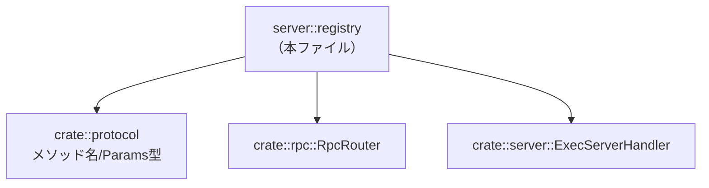
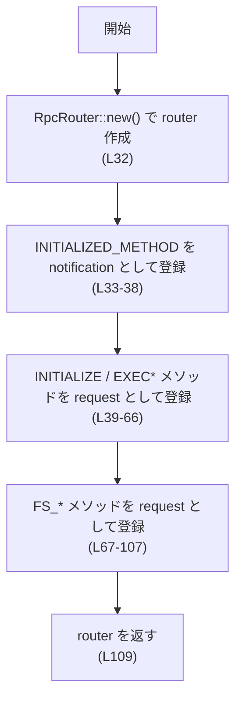
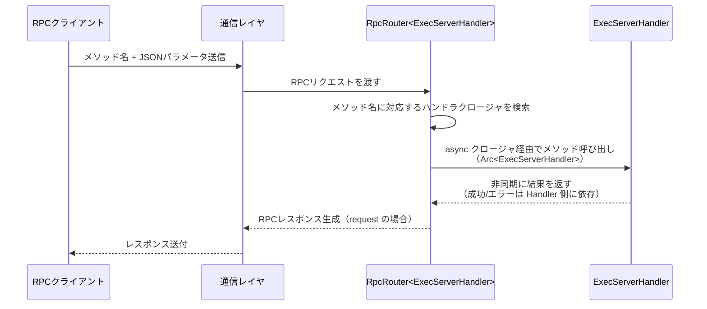

# exec-server/src/server/registry.rs

## 0. ざっくり一言

`ExecServerHandler` に対する RPC ルータ（メソッド名 → ハンドラ関数）の登録を一括で行うモジュールです。どの RPC メソッド名がどのハンドラメソッドに対応するかをここで定義しています（registry.rs:L31-110）。

---

## 1. このモジュールの役割

### 1.1 概要

- このモジュールは、RPC レイヤーで受信したリクエストを `ExecServerHandler` の各メソッドに振り分けるためのルーティング設定を集中管理します（registry.rs:L31-110）。
- `RpcRouter<ExecServerHandler>` を構築し、プロトコルモジュールで定義されたメソッド名・パラメータ型と、`ExecServerHandler` のメソッド呼び出しを紐づけます（registry.rs:L3-27, L28-29, L31-110）。

### 1.2 アーキテクチャ内での位置づけ

このファイルは、プロトコル定義・サーバハンドラ・汎用 RPC ルータを結びつける「橋渡し」の役割を持ちます。



- `crate::protocol::*` からメソッド名定数とパラメータ型を利用します（registry.rs:L3-27）。
- `crate::rpc::RpcRouter` を使ってメソッド名とハンドラクロージャを登録します（registry.rs:L28, L31-110）。
- `crate::server::ExecServerHandler` の各メソッドを実際の処理として呼び出します（registry.rs:L29, L35-37, L41-43, L47, L51-53, L57-59, L63-65, L69-71, L75-77, L81-83, L87-89, L93-95, L99-101, L105-107）。

### 1.3 設計上のポイント

- **ルーティング定義の一元化**  
  すべての RPC メソッド名とハンドラの対応付けが `build_router` 一つの関数内にまとまっています（registry.rs:L31-110）。

- **型安全なパラメータ受け渡し**  
  各 `request` 登録クロージャは、`FsReadFileParams` などの具体的なパラメータ型を受け取り、そのままハンドラに渡します。これにより、メソッドごとのパラメータがコンパイル時にチェックされます（registry.rs:L41, L47, L51, L57, L63, L69, L75, L81, L87, L93, L99, L105）。

- **通知 vs 要求の区別**  
  `INITIALIZED_METHOD` のみ `notification` として登録されており（レスポンス不要の通知）、その他はすべて `request` として登録されています（registry.rs:L33-38, L39-107）。

- **非同期処理と共有ハンドラ**  
  すべてのハンドラは `async move` クロージャで登録され、`Arc<ExecServerHandler>` を受け取ります。これにより、同一 `ExecServerHandler` インスタンスを複数のリクエストから共有しつつ、非同期に処理する前提になっています（registry.rs:L35, L41, L47, L51, L57, L63, L69, L75, L81, L87, L93, L99, L105）。

- **エラーハンドリングの委譲**  
  ルータ側では `handler.xxx(params).await` の結果をそのまま返しており、エラーの変換・ログ出力などは行っていません。エラー時の挙動は `ExecServerHandler` 側の実装に完全に委ねられています（registry.rs:L41-43, L47, L51-53, L57-59, L63-65, L69-71, L75-77, L81-83, L87-89, L93-95, L99-101, L105-107）。

---

## 2. 主要な機能一覧

このモジュールが提供する機能は単一ですが、内部では複数の RPC メソッドを登録しています。

- `build_router`: `ExecServerHandler` 用の `RpcRouter` を構築し、以下の RPC メソッドを登録する（registry.rs:L31-110）
  - 初期化関連: `INITIALIZED_METHOD`（通知）、`INITIALIZE_METHOD`（要求）
  - プロセス実行関連: `EXEC_METHOD`, `EXEC_READ_METHOD`, `EXEC_WRITE_METHOD`, `EXEC_TERMINATE_METHOD`
  - ファイルシステム関連:  
    `FS_READ_FILE_METHOD`, `FS_WRITE_FILE_METHOD`, `FS_CREATE_DIRECTORY_METHOD`,  
    `FS_GET_METADATA_METHOD`, `FS_READ_DIRECTORY_METHOD`, `FS_REMOVE_METHOD`, `FS_COPY_METHOD`

---

## 3. 公開 API と詳細解説

### 3.1 このファイルに定義される要素一覧（コンポーネントインベントリー）

| 名前 | 種別 | 役割 / 用途 | 定義位置 |
|------|------|------------|----------|
| `build_router` | 関数 | `ExecServerHandler` に対応する全 RPC メソッドを登録した `RpcRouter` を構築する | registry.rs:L31-110 |

※ このファイル内で新たに定義される構造体・列挙体はありません。すべて外部モジュール（`crate::protocol`, `crate::server`, `crate::rpc`）から利用しています（registry.rs:L3-29）。

### 3.2 関数詳細

#### `build_router() -> RpcRouter<ExecServerHandler>`

**概要**

- `ExecServerHandler` をターゲットとする `RpcRouter` を生成し、プロトコルで定義された各メソッド名に対して適切なハンドラクロージャを登録して返します（registry.rs:L31-110）。
- この関数は crate 内からのみ利用可能な `pub(crate)` であり、外部クレートからは直接呼び出せません（registry.rs:L31）。

**引数**

- 引数はありません（registry.rs:L31）。

**戻り値**

- 型: `RpcRouter<ExecServerHandler>`（registry.rs:L31）
- 意味: `ExecServerHandler` 型のハンドラを保持し、受信した RPC メソッド名に応じて適切な非同期処理を呼び出すためのルータです。  
  ここでは構築済みのルータインスタンスを返すだけで、まだ具体的なハンドラインスタンス（`Arc<ExecServerHandler>`）とはバインドされていません。

**内部処理の流れ（アルゴリズム）**

1. **ルータの作成**  
   `RpcRouter::new()` を呼び出して空のルータを生成し、`router` という可変変数に格納します（registry.rs:L32）。

2. **通知メソッドの登録**  
   - `INITIALIZED_METHOD` 用の通知ハンドラを登録します（registry.rs:L33-38）。
   - ハンドラクロージャは `Arc<ExecServerHandler>` と `serde_json::Value` を受け取りますが、パラメータは `_params` として未使用です（registry.rs:L35）。
   - クロージャ内部では `handler.initialized()` を呼び出し、その戻り値を async ブロックの評価値として返します（registry.rs:L35-37）。`await` は付いていないため、この地点では戻り値をそのまま返しています。

3. **要求メソッドの登録（初期化系・実行系）**  
   - `INITIALIZE_METHOD` 用に、`InitializeParams` を受け取るリクエストハンドラを登録し、`handler.initialize(params).await` を呼び出します（registry.rs:L39-43）。
   - `EXEC_METHOD` 用に、`ExecParams` を受け取り `handler.exec(params).await` を呼び出します（registry.rs:L45-47）。
   - `EXEC_READ_METHOD` / `EXEC_WRITE_METHOD` / `EXEC_TERMINATE_METHOD` についても同様に、それぞれ `ReadParams` / `WriteParams` / `TerminateParams` を受け取り対応するメソッドを `await` します（registry.rs:L49-60, L61-65）。

4. **要求メソッドの登録（ファイルシステム操作系）**  
   - ファイル読み書きやディレクトリ操作など、ファイルシステム関連のメソッドについて、それぞれの `Fs*Params` 型を受け取るリクエストハンドラを登録します（registry.rs:L67-107）。
   - 各クロージャは `handler.fs_read_file(params).await` など、対応する `ExecServerHandler` のメソッドを `await` しています（registry.rs:L69-71, L75-77, L81-83, L87-89, L93-95, L99-101, L105-107）。

5. **ルータの返却**  
   最後に、登録が完了した `router` を返します（registry.rs:L109）。



**Examples（使用例）**

このファイルからは周辺コードが見えないため、抽象的な例になりますが、「ルータを構築して RPC サーバの初期化に渡す」という典型的な使い方は次のようになります。

```rust
use std::sync::Arc;
use crate::server::ExecServerHandler;
use crate::server::registry::build_router;

fn setup_rpc_server() {
    // ExecServerHandler インスタンス（どこか別の場所で構築）
    let handler: Arc<ExecServerHandler> = /* 既存のハンドラ */;

    // このファイルの関数でルータを構築
    let router = build_router(); // registry.rs:L31-110

    // ここで router と handler を RPC サーバ実装に渡す
    // 具体的な API（例: サーバ起動関数など）は、このチャンクには現れないため不明です。
    // 例:
    // rpc_runtime.run(router, handler);
}
```

この例では、`build_router` が「メソッド名 → ハンドラ関数」の対応関係だけを持ち、実際の `ExecServerHandler` インスタンス（`Arc<...>`）は別途用意される構造であることを示しています。

**Errors / Panics**

- `build_router` 自体は `Result` ではなく `RpcRouter<ExecServerHandler>` を直接返すため、この関数の戻り値としてはエラーが表現されません（registry.rs:L31）。
- 関数内に `panic!` や `unwrap` などの明示的なパニック要因は存在しません（registry.rs:L31-110）。
- ただし、`RpcRouter::new` や `router.request` / `router.notification` の内部実装においてパニックが起こりうるかどうかは、このチャンクには現れないため不明です（registry.rs:L28, L32-38, L39-107）。
- リクエスト処理時のエラー（例えば、ファイル読み込みに失敗した場合など）の扱いは `ExecServerHandler` の各メソッドに委ねられており、このファイルからは判断できません（registry.rs:L41-43, L47, L51-53, L57-59, L63-65, L69-71, L75-77, L81-83, L87-89, L93-95, L99-101, L105-107）。

**Edge cases（エッジケース）**

- **未知のメソッド名**  
  `build_router` で登録されていないメソッド名に対するリクエストが来た場合にどう扱うか（エラーにするのか無視するのか）は、`RpcRouter` の実装に依存し、このチャンクからは分かりません。

- **`INITIALIZED_METHOD` のパラメータ**  
  `INITIALIZED_METHOD` のハンドラは `_params: serde_json::Value` を受け取りますが、値を一切参照しません（registry.rs:L35-37）。  
  そのため、クライアントがどのような JSON を送信しても、このハンドラから見れば結果は同じです（ただし、前段のデシリアライズやバリデーションの挙動は不明）。

- **複数回の `build_router` 呼び出し**  
  関数は毎回新しい `RpcRouter` を作成しているため、複数回呼び出しても互いに影響し合いません（registry.rs:L32, L109）。  
  ただし、ルータ内部でどの程度のリソースを確保しているかは不明なため、必要以上に多く生成するとメモリ使用量が増える可能性はあります。

**使用上の注意点**

- **スレッドセーフティ / 並行性**  
  - すべてのハンドラクロージャは `Arc<ExecServerHandler>` を受け取り、`async move` として登録されています（registry.rs:L35, L41, L47, L51, L57, L63, L69, L75, L81, L87, L93, L99, L105）。  
  - これは同一 `ExecServerHandler` インスタンスを複数の非同期タスクから共有する設計であることを示しています。  
  - `Arc` 自体は参照カウントの共有を提供しますが、内部状態のスレッドセーフティは `ExecServerHandler` の実装に依存します。共有状態を持つ場合は、`Mutex` 等で保護されているかを別モジュール側で確認する必要があります（このチャンクからは不明）。

- **メソッド登録の整合性**  
  - 各 `router.request` の第1引数のメソッド名定数と、第2引数クロージャで呼び出している `handler.xxx` の対応が契約になっています（registry.rs:L39-43, L45-47, L49-53, L55-59, L61-65, L67-71, L73-77, L79-83, L85-89, L91-95, L97-101, L103-107）。
  - この対応を変更・追加する際は、プロトコル定義 (`crate::protocol` 内のメソッド名 / Params 型) と `ExecServerHandler` のメソッド定義がすべて一致していることを確認する必要があります。

- **セキュリティ面の注意**  
  - このルータは「プロセス実行 (`EXEC_METHOD` 等)」や「ファイルシステム操作 (`FS_*_METHOD`)」を RPC 経由で呼び出すための入り口になります（registry.rs:L3-21, L45-47, L49-53, L55-59, L61-65, L67-71, L73-77, L79-83, L85-89, L91-95, L97-101, L103-107）。
  - 認証や認可、パス検証などのセキュリティチェックはこのファイルでは行っていません。これらは `ExecServerHandler` やその内部の処理で行われている可能性がありますが、このチャンクには現れません。  
  - したがって、このルーティングを外部から利用できるように公開する場合は、上位レイヤーで適切なアクセス制御がなされていることが前提になります。

### 3.3 その他の関数

- このファイルには `build_router` 以外の関数は定義されていません（registry.rs:L31-110）。

---

## 4. データフロー

ここでは、「RPC リクエストがどのように `ExecServerHandler` のメソッド呼び出しにつながるか」を概念的に示します。



- `build_router` で登録された各クロージャは、`Arc<ExecServerHandler>` と型付きパラメータ (`InitializeParams`, `FsReadFileParams` など) を受け取り、対応するメソッドを `await` します（registry.rs:L41-43, L47, L51-53, L57-59, L63-65, L69-71, L75-77, L81-83, L87-89, L93-95, L99-101, L105-107）。
- 型付きパラメータへの変換（JSON → `*Params`）や、未知メソッドの扱いは `RpcRouter` およびその前段の通信レイヤの実装に依存し、このチャンクには現れません（registry.rs:L28, L31-110）。

---

## 5. 使い方（How to Use）

### 5.1 基本的な使用方法

典型的な利用パターンは、「サーバ初期化時に一度だけ `build_router` を呼び、`ExecServerHandler` と組み合わせて RPC サーバを立ち上げる」という形です。

```rust
use std::sync::Arc;
use crate::server::ExecServerHandler;
use crate::server::registry::build_router;

fn main() {
    // どこかで ExecServerHandler を構築しておく
    let handler: Arc<ExecServerHandler> = /* 既存のハンドラ */;

    // ルータを構築
    let router = build_router(); // registry.rs:L31-110

    // 以降、router と handler を用いて RPC サーバを起動する
    // 実際の起動APIはこのチャンクには現れないため、
    // 利用側のコードや crate::rpc モジュールの実装を参照する必要があります。
}
```

### 5.2 よくある使用パターン

このファイルから直接読み取れる範囲では、次のようなパターンが自然です。

- **本番サーバ**  
  - プロセス起動時に一度だけ `build_router` を呼び出し、そのルータをサーバライフタイム全体で使い回す。  
    → ルーティングテーブルは静的であり、起動後に変更されることは想定されていません（registry.rs:L31-110）。

- **テストコード**  
  - ユニットテストや統合テストで `build_router` を呼び、テスト用の `ExecServerHandler` 実装（モックなど）を `Arc` で渡してリクエストフローを検証する。  
    → `build_router` はハンドラインスタンスを受け取らず、純粋にルータ構造だけを返すため、テスト環境でも同じ関数を再利用しやすい構成です（registry.rs:L31-110）。

### 5.3 よくある間違い（起こりうる誤用）

このファイルの構造から想定される注意点を挙げます。

```rust
// 誤りになりうる変更例（メソッド名とハンドラの不整合）

router.request(
    FS_READ_FILE_METHOD,                           // メソッド名は「ファイル読み込み」
    |handler: Arc<ExecServerHandler>, params: FsWriteFileParams| async move {
        handler.fs_write_file(params).await        // 実際には「ファイル書き込み」を呼んでいる
    },
);
```

- 上記のように、プロトコル上のメソッド名と呼び出すハンドラメソッド/Params 型を取り違えると、クライアント側の期待とサーバ側の処理が不一致になります。  
  このような不整合を防ぐためには、メソッド名定数・Params 型・`ExecServerHandler` のメソッド名をセットで確認する必要があります（registry.rs:L3-21, L41-43, L69-71 など）。

### 5.4 使用上の注意点（まとめ）

- `build_router` は副作用の少ない構築関数ですが、登録されるメソッドはプロセス実行やファイルシステム操作など、危険度の高い処理を含む可能性があります（registry.rs:L3-21, L45-47, L67-71 など）。
- 認証・認可・ログ出力・監査といった横断的な関心事はこのファイルでは扱っていないため、上位レイヤや `ExecServerHandler` 側で実装されているかを確認する必要があります（registry.rs:L31-110）。
- 非同期・並行実行されることを前提として、`ExecServerHandler` の内部実装がスレッドセーフであるかどうかを別途検証する必要があります（registry.rs:L35, L41, L47, L51, L57, L63, L69, L75, L81, L87, L93, L99, L105）。

---

## 6. 変更の仕方（How to Modify）

### 6.1 新しい機能を追加する場合

新しい RPC メソッドを追加したい場合の典型的なステップは次の通りです。

1. **プロトコル定義の追加**  
   - `crate::protocol` に新しいメソッド名定数とパラメータ型（`NewMethodParams` など）を追加します（このチャンクには定義は現れませんが、既存の `Fs*Params` などと同様のパターンになります）。

2. **`ExecServerHandler` のメソッド追加**  
   - `ExecServerHandler` に対応するメソッド（例: `async fn new_method(&self, params: NewMethodParams) -> ...`）を追加します。  
     既存の `exec` や `fs_read_file` と同様に非同期メソッドとなる可能性が高いですが、このチャンクからは詳細は分かりません。

3. **`build_router` への登録**  
   - 本ファイルの `build_router` に新しい `router.request` または `router.notification` のエントリを追加します。例:

     ```rust
     router.request(
         NEW_METHOD,
         |handler: Arc<ExecServerHandler>, params: NewMethodParams| async move {
             handler.new_method(params).await
         },
     );
     ```

   - ここで、メソッド名定数・パラメータ型・`ExecServerHandler` のメソッド名を一致させることが重要です（registry.rs:L39-107 の既存エントリを参考）。

4. **テストの追加**  
   - 新メソッドが意図どおりにルーティングされるか、`ExecServerHandler` のメソッドが呼ばれるかを確認するテストを追加します。  
     このファイルにはテストコードは含まれていないため（registry.rs:L1-110）、テスト場所は別ディレクトリになります。

### 6.2 既存の機能を変更する場合

- **パラメータ型や戻り値の変更**  
  - あるメソッドの `Params` 型を変更する場合は、`crate::protocol` の型定義、`ExecServerHandler` のメソッドシグネチャ、およびこのファイル内のクロージャ引数の型がすべて一致している必要があります（registry.rs:L3-21, L41, L69 など）。
  - どこか一箇所だけを変更すると、コンパイルエラーやランタイム時のデシリアライズエラーにつながる可能性があります。

- **メソッド名の変更**  
  - プロトコルレベルでメソッド名常数（例: `FS_READ_FILE_METHOD`）を変更する場合は、このファイル内の対応箇所もすべて変更する必要があります（registry.rs:L68, L74, L80, L86, L92, L98, L104）。
  - クライアント側の実装も合わせて更新する必要がある点に注意します（クライアントコードはこのチャンクには現れません）。

- **監視・ログの追加**  
  - このファイル内ではログ出力やメトリクス収集は行っていません（registry.rs:L31-110）。  
  - ルーティングレベルでログを追加したい場合は、各クロージャ内部で `handler.xxx` を呼び出す前後にログ処理を挿入する形になりますが、その場合もビジネスロジックは `ExecServerHandler` に留める方が責務の分離という観点で明確です。

---

## 7. 関連ファイル

このモジュールと密接に関係するモジュールは次の通りです。ファイルパスはこのチャンクからは特定できないため、モジュールパスで示します。

| モジュール / パス | 役割 / 関係 |
|------------------|------------|
| `crate::protocol` | メソッド名定数（`EXEC_METHOD`, `FS_READ_FILE_METHOD` など）と各種 `*Params` 型（`ExecParams`, `FsReadFileParams` など）を定義し、本モジュールから参照されています（registry.rs:L3-27）。 |
| `crate::rpc::RpcRouter` | 汎用 RPC ルータの実装を提供し、本モジュールは `RpcRouter<ExecServerHandler>` を構築するために使用しています（registry.rs:L28, L31-32, L33-38, L39-107）。 |
| `crate::server::ExecServerHandler` | 実際の処理ロジック（プロセス実行やファイルシステム操作など）を実装するサーバ側ハンドラであり、本モジュールはそのメソッドをルータに登録します（registry.rs:L29, L35-37, L41-43, L47, L51-53, L57-59, L63-65, L69-71, L75-77, L81-83, L87-89, L93-95, L99-101, L105-107）。 |

このチャンク内にテストコード（`tests` モジュールや `#[cfg(test)]` 等）は存在しません（registry.rs:L1-110）。
