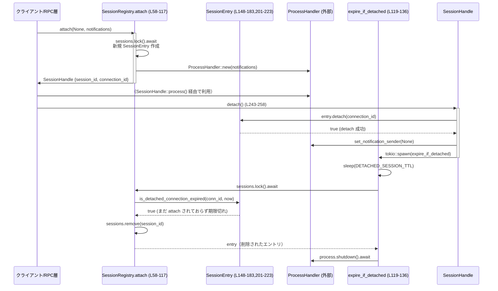

# exec-server/src/server/session_registry.rs コード解説

---

## 0. ざっくり一言

JSON-RPC 接続ごとの「セッション」と、その背後で動く `ProcessHandler` を管理し、接続の attach/detach と一定時間後のセッション破棄を行うレジストリ実装です（`session_registry.rs:L14-17,L19-21,L51-56,L58-117,L119-136`）。

---

## 1. このモジュールの役割

### 1.1 概要

- このモジュールは、**クライアント接続とバックエンドプロセス (`ProcessHandler`) を 1:1 に結びつけるセッション管理**を行います。
- セッションは UUID 文字列の `session_id` で識別され、`SessionRegistry` がハッシュマップで管理します（`session_registry.rs:L19-21,L73-77,L94-100`）。
- クライアントは `SessionHandle` を通じてプロセスにアクセスし、接続解除 (`detach`) すると一定時間後にセッションが自動的に破棄されます（`session_registry.rs:L170-183,L243-258`）。

### 1.2 アーキテクチャ内での位置づけ

このモジュール内の主要コンポーネントと、外部モジュールとの関係です。

```mermaid
graph TD
    RPC["RPC 層 / ハンドラ (外部)"]
    SR["SessionRegistry (L19-21,51-145)"]
    SH["SessionHandle (L44-49,226-259)"]
    SE["SessionEntry (L23-27,147-223)"]
    PH["ProcessHandler (外部型, process_handler.rs)"]
    RNS["RpcNotificationSender (外部型, rpc モジュール)"]

    RPC -->|new/attach を呼び出し| SR
    SR -->|SessionHandle を返す| RPC
    SR -->|セッション作成/検索| SE
    SH -->|process() 経由でアクセス| PH
    SR -->|ProcessHandler::new / set_notification_sender| PH
    SH -->|detach() で TTL タイマ開始| SR
```

- RPC 層（JSON-RPC リクエストハンドラなど）が `SessionRegistry::attach` を呼んで `SessionHandle` を取得し、クライアントとの対話中に利用する構造になっています（`session_registry.rs:L58-62,L112-116,L226-241`）。
- `ProcessHandler` はセッションごとに 1 つ存在し、通知送信 (`RpcNotificationSender`) とシャットダウンを担います（`session_registry.rs:L25,L89-90,L95-99,L107-108,L134-135`）。

### 1.3 設計上のポイント

- **セッションのライフサイクル管理**
  - attach で生成／再利用、detach 後はタイムアウト付きで保持し、一定時間後に破棄します（`DETACHED_SESSION_TTL`, `expire_if_detached`。`session_registry.rs:L14-17,L119-136,L170-183`）。
- **接続の排他制御**
  - 1 セッションは同時に 1 接続にしか割り当てられません。すでに接続中のセッションに再度 attach しようとするとエラーになります（`session_registry.rs:L84-87,L185-191`）。
- **非同期＋同期ロックの組み合わせ**
  - 全体のセッションマップは `tokio::sync::Mutex<HashMap<...>>` で保護（非同期コンテキスト用）（`session_registry.rs:L19-21,L51-56,L72-77,L122-131`）。
  - 各セッション内の「どの接続に紐付いているか」の状態は `std::sync::Mutex<AttachmentState>` で保護（`session_registry.rs:L23-27,L29-33,L152-156,L160-168`）。
- **非同期安全性**
  - `attach`・`expire_if_detached` とも、`tokio::Mutex` をロックしている間には `.await` を呼ばず、ロック解放後に `ProcessHandler::shutdown().await` しています（`session_registry.rs:L72-103,L104-110,L122-131,L133-135`）。
- **エラー処理**
  - 不正なセッション ID や「すでに別接続が attach 済み」などの異常系は JSON-RPC プロトコルのエラー型 `JSONRPCErrorError` を返す形で扱っています（`session_registry.rs:L58-62,L75-82,L84-88,L104-110`）。

---

## 2. 主要な機能一覧（コンポーネントインベントリー）

### 2.1 型一覧

| 名前 | 種別 | 役割 / 用途 | 定義位置 |
|------|------|-------------|----------|
| `SessionRegistry` | 構造体 | セッション ID → `SessionEntry` のマップを保持し、attach / detach 後の期限切れ処理を行うレジストリ | `session_registry.rs:L19-21,L51-145` |
| `SessionEntry` | 構造体 | 1 セッション分の情報（`session_id`・`ProcessHandler`・接続状態）を保持する内部エントリ | `session_registry.rs:L23-27,L147-223` |
| `AttachmentState` | 構造体 | 現在接続中の `ConnectionId` と、detach 済みの接続 ID・期限をまとめた状態 | `session_registry.rs:L29-33,L152-156` |
| `ConnectionId` | 構造体（タプル） | UUID で表現される接続 ID。`Display` 実装あり | `session_registry.rs:L35-41` |
| `SessionHandle` | 構造体 | 呼び出し側（RPC 層など）が利用する、特定セッションへのハンドル。`ProcessHandler` へのアクセスや detach を提供 | `session_registry.rs:L44-49,L226-259` |
| `AttachOutcome` | ローカル enum | `attach` 内だけで使われる、attach 処理の分岐結果（新規 attach / 期限切れ） | `session_registry.rs:L63-69` |

### 2.2 関数・メソッド一覧

| 関数 / メソッド | 所属 | 役割（1 行） | 位置 |
|----------------|------|--------------|------|
| `fmt` | `impl Display for ConnectionId` | `ConnectionId` を内部 UUID の文字列表現として出力 | `session_registry.rs:L38-41` |
| `new` | `SessionRegistry` | 空のレジストリを `Arc` で生成 | `session_registry.rs:L52-56` |
| `attach` | `SessionRegistry` | 新規セッションを生成 or 既存セッションに接続を割り当てる | `session_registry.rs:L58-117` |
| `expire_if_detached` | `SessionRegistry` | detach 済みセッションを一定時間後に削除し、プロセスを停止する | `session_registry.rs:L119-136` |
| `default` | `impl Default for SessionRegistry` | フィールド初期化を行うデフォルト実装 | `session_registry.rs:L139-145` |
| `new` | `SessionEntry` | セッション ID・`ProcessHandler`・初回接続 ID からエントリを構築 | `session_registry.rs:L148-158` |
| `attach` | `SessionEntry` | 指定接続 ID を「現在接続中」として登録し、detach 状態をクリア | `session_registry.rs:L160-168` |
| `detach` | `SessionEntry` | 接続 ID が一致する場合に detach し、期限を設定 | `session_registry.rs:L170-183` |
| `has_active_connection` | `SessionEntry` | 現在接続中の接続があるかを判定 | `session_registry.rs:L185-191` |
| `is_attached_to` | `SessionEntry` | 指定接続 ID が現在接続中かどうかを判定 | `session_registry.rs:L193-199` |
| `is_expired` | `SessionEntry` | detach 期限が過ぎているかどうかを判定 | `session_registry.rs:L201-207` |
| `is_detached_connection_expired` | `SessionEntry` | 「現在未接続かつ detach 済みの接続 ID が一致し、期限切れか」を判定 | `session_registry.rs:L209-223` |
| `session_id` | `SessionHandle` | セッション ID を文字列スライスで返す | `session_registry.rs:L227-229` |
| `connection_id` | `SessionHandle` | このハンドルが表す `ConnectionId` を文字列にして返す | `session_registry.rs:L231-233` |
| `is_session_attached` | `SessionHandle` | セッションがこのハンドルの接続 ID に紐付いた状態か判定 | `session_registry.rs:L235-237` |
| `process` | `SessionHandle` | 対応する `ProcessHandler` への参照を返す | `session_registry.rs:L239-241` |
| `detach` | `SessionHandle` | セッションを detach し、TTL 後に削除するタスクを起動 | `session_registry.rs:L243-258` |

---

## 3. 公開 API と詳細解説

### 3.1 公開される主要な型

| 名前 | 種別 | 役割 / 用途 | 定義位置 |
|------|------|-------------|----------|
| `SessionRegistry` | 構造体（`pub(crate)`） | クレート内でセッションを管理する中心オブジェクト | `session_registry.rs:L19-21,L51-145` |
| `SessionHandle` | 構造体（`pub(crate)`） | 呼び出し側からセッションを操作するためのハンドル | `session_registry.rs:L44-49,L226-259` |

`SessionEntry`, `AttachmentState`, `ConnectionId` はモジュール内の内部実装用です。

---

### 3.2 重要な関数・メソッドの詳細

#### `SessionRegistry::new() -> Arc<Self>`

**概要**

- 空のセッションレジストリを生成し、`Arc` で包んで返します（`session_registry.rs:L52-56`）。
- 生成されたレジストリは複数タスクから共有されることを前提としています。

**引数**

- なし。

**戻り値**

- `Arc<SessionRegistry>`  
  新しく生成されたレジストリへの共有ポインタです。

**内部処理の流れ**

1. `Mutex::new(HashMap::new())` で空のセッションマップを生成（`session_registry.rs:L53-55`）。
2. それをフィールドに持つ `SessionRegistry` を作成し、`Arc::new` で包んで返します（`session_registry.rs:L52-56`）。

**Examples（使用例）**

```rust
use std::sync::Arc;
use crate::server::session_registry::SessionRegistry;

fn create_registry() -> Arc<SessionRegistry> {
    // 空のレジストリを生成
    SessionRegistry::new() // session_registry.rs:L52-56
}
```

**使用上の注意点**

- `SessionRegistry` は `Arc` 経由で共有する前提のため、`new` の戻り値をそのまま複数タスクにクローンして使うことが想定されます（`session_registry.rs:L52-56`）。

---

#### `SessionRegistry::attach(&Arc<Self>, Option<String>, RpcNotificationSender) -> Result<SessionHandle, JSONRPCErrorError>`

（`session_registry.rs:L58-117`）

**概要**

- 新規セッションを作成する、または既存セッション ID に対して現在の接続を「attach」します。
- 既存セッションが期限切れ、またはすでに他接続に attach 済みの場合は JSON-RPC エラーを返します。

**引数**

| 引数名 | 型 | 説明 |
|--------|----|------|
| `self` | `&Arc<Self>` | セッションレジストリへの共有参照。`Arc` 自体を受け取ることで後続で `Arc::clone(self)` を行うことができます。 |
| `resume_session_id` | `Option<String>` | 再接続したい既存セッション ID。`None` の場合は新規セッションを作成します。 |
| `notifications` | `RpcNotificationSender` | このセッションに紐付く通知送信用オブジェクト。`ProcessHandler` に渡されます。 |

**戻り値**

- `Ok(SessionHandle)`  
  セッションに紐付いたハンドル。`process()` や `detach()` に利用します（`session_registry.rs:L112-116,L226-259`）。
- `Err(JSONRPCErrorError)`  
  - 対象セッション ID が存在しない、あるいは期限切れだった場合（`unknown session id ...`）（`session_registry.rs:L75-82,L104-110`）。
  - すでに他の接続が attach 済みのセッションに再接続しようとした場合（`session_registry.rs:L84-88`）。

**内部処理の流れ**

1. 新しい `ConnectionId` を UUID v4 で生成（`session_registry.rs:L71`）。
2. `self.sessions.lock().await` で非同期ロックを取得し、処理ブロックに入る（`session_registry.rs:L72-73`）。
3. `resume_session_id` が `Some(session_id)` の場合:
   1. ハッシュマップから `session_id` をキーに `SessionEntry` を取得。なければ `invalid_request("unknown session id ...")` でエラー（`session_registry.rs:L75-79`）。
   2. `entry.is_expired(Instant::now())` で期限切れか判定（`session_registry.rs:L79-80,L201-207`）。
      - 期限切れなら、`sessions.remove(&session_id)` でエントリを削除し、`AttachOutcome::Expired { session_id, entry }` を返す（`session_registry.rs:L80-83`）。
   3. まだ期限切れでない場合、`entry.has_active_connection()` を確認（`session_registry.rs:L84-85,L185-191`）。
      - `true` なら「すでに別接続が attach 済み」として `invalid_request` エラー（`session_registry.rs:L84-88`）。
   4. それ以外は再接続成功として、`entry.process.set_notification_sender(Some(notifications))` で通知送信者をセットし、`entry.attach(connection_id)` で接続状態を更新し、`AttachOutcome::Attached(entry)`（`session_registry.rs:L89-91,L160-168`）。
4. `resume_session_id` が `None` の場合（新規セッション）:
   1. 新しい UUID 文字列を `session_id` として生成（`session_registry.rs:L94`）。
   2. `ProcessHandler::new(notifications)` で新しいプロセスハンドラを作成し、`SessionEntry::new` でエントリを構成（`session_registry.rs:L95-99,L148-158`）。
   3. ハッシュマップに挿入し、`AttachOutcome::Attached(entry)` を返す（`session_registry.rs:L100-101`）。
5. ブロック終了により `sessions` ロックが解放されたあと、`match outcome?` で結果を解釈（`session_registry.rs:L103-110`）。
   - `Attached(entry)` の場合はそのまま `entry` を採用。
   - `Expired { session_id, entry }` の場合は `entry.process.shutdown().await` でプロセスを終了させた上で、`unknown session id` エラーを返す（`session_registry.rs:L106-110`）。
6. 最終的に `SessionHandle { registry: Arc::clone(self), entry, connection_id }` を返す（`session_registry.rs:L112-116`）。

**並行性・ロック戦略**

- セッションマップ `sessions` のロックは、`AttachOutcome` を構築するブロック内でのみ保持され、`shutdown().await` を呼ぶ際にはすでに解放済みです（`session_registry.rs:L72-103,L104-110`）。
- `SessionEntry` 内の接続状態 (`AttachmentState`) は `SessionEntry::attach` や `SessionEntry::is_expired` 内で別の `StdMutex` によって保護されます（`session_registry.rs:L160-168,L201-207`）。

**Errors / Panics**

- `invalid_request` が返す `JSONRPCErrorError` で、以下のケースをエラーとします。
  - セッション ID 不明：`"unknown session id {session_id}"`（`session_registry.rs:L78-79,L80-82,L104-110`）。
  - すでに別接続が attach 中：`"session {session_id} is already attached to another connection"`（`session_registry.rs:L84-88`）。
- パニックの可能性:
  - この関数自体では `unwrap` を使用していないため、直接のパニック要因はありません。

**Edge cases（代表例）**

- `resume_session_id = None`：毎回新しいセッションが作られます（`session_registry.rs:L93-102`）。
- `resume_session_id` が存在するが TTL が過ぎている：プロセスが shutdown され、同じ ID に対して「unknown」として扱われます（`session_registry.rs:L79-83,L104-110`）。
- `resume_session_id` が存在し、まだ TTL 内だが他接続に attach 済み：エラー `"already attached"` が返ります（`session_registry.rs:L84-88`）。

**使用上の注意点**

- `attach` の戻り値 `SessionHandle` は `Clone` 可能であり、複数箇所で共有できますが、`detach` は 1 回目しか実際に状態を変更しません（`session_registry.rs:L44-49,L170-183,L243-247`）。
- エラー時にはセッションの状態がどうなっているか（削除されるか、そのまま残るか）を呼び出し側で把握しておく必要があります。

---

#### `SessionRegistry::expire_if_detached(&self, session_id: String, connection_id: ConnectionId)`

（`session_registry.rs:L119-136`）

**概要**

- 指定されたセッションが「detach 済み」かつ「期限切れ」であれば、セッションを破棄し、プロセスを shutdown します。
- `SessionHandle::detach` から非同期タスクとして呼び出されます（`session_registry.rs:L243-258`）。

**引数**

| 引数名 | 型 | 説明 |
|--------|----|------|
| `session_id` | `String` | 対象セッション ID。`SessionHandle::detach` がクローンして渡します。 |
| `connection_id` | `ConnectionId` | detach を行った接続 ID。古い接続からのタイマだけが有効かどうか判定するために使います。 |

**戻り値**

- なし（`async fn` ですが `()` を返す）。

**内部処理の流れ**

1. `tokio::time::sleep(DETACHED_SESSION_TTL).await` で TTL 時間だけ待機（`session_registry.rs:L119-121`）。
2. `self.sessions.lock().await` でセッションマップをロック（`session_registry.rs:L122-123`）。
3. `session_id` に対応する `SessionEntry` が存在しなければ何もせず return（`session_registry.rs:L124-126`）。
4. `entry.is_detached_connection_expired(connection_id, now)` を呼び出し、以下を確認（`session_registry.rs:L127,L209-223`）:
   - 現在接続中の接続が存在しない（`current_connection_id.is_none()`）。
   - `detached_connection_id == Some(connection_id)`。
   - `detached_expires_at` が `now` 以前。
5. 条件を満たさなければ return。条件を満たす場合のみ `sessions.remove(&session_id)` でエントリを削除（`session_registry.rs:L127-131`）。
6. ブロックを抜けてロックを解放後、削除されたエントリがあれば `entry.process.shutdown().await` を実行（`session_registry.rs:L132-135`）。

**並行性・安全性**

- `SessionHandle::detach` から `tokio::spawn` 経由で呼ばれるため、レジストリ本体とは非同期タスクとして並行実行されます（`session_registry.rs:L252-257`）。
- 新しい接続が `attach` された場合、`current_connection_id` が `Some` に更新されるため、古い接続のタイマは `is_detached_connection_expired` の条件により「無効化」され、セッションは削除されません（`session_registry.rs:L160-168,L209-223`）。

**使用上の注意点**

- `SessionHandle::detach` を呼び出さない限り、この関数は起動されないため、セッションは TTL 無しで保持され続けます（`session_registry.rs:L243-258`）。
- TTL はテスト時と本番時で異なります（200ms vs 10s）（`session_registry.rs:L14-17`）。

---

#### `SessionEntry::detach(&self, connection_id: ConnectionId) -> bool`

（`session_registry.rs:L170-183`）

**概要**

- 指定された接続 ID が「現在接続中」であれば detach を行い、期限 (`detached_expires_at`) を設定します。
- 接続 ID が一致しない場合は何もせず `false` を返します。

**引数**

| 引数名 | 型 | 説明 |
|--------|----|------|
| `connection_id` | `ConnectionId` | detach しようとする接続 ID。`SessionHandle` が自身の ID を渡します。 |

**戻り値**

- `true`：実際に detach を行った場合。
- `false`：`current_connection_id` が `Some(connection_id)` でなかった場合（他接続または既に detach 済みなど）。

**内部処理の流れ**

1. `self.attachment.lock().unwrap_or_else(...)` で同期 Mutex をロック（`session_registry.rs:L171-174`）。
2. `attachment.current_connection_id != Some(connection_id)` なら `false` を返して終了（`session_registry.rs:L175-177`）。
3. 一致している場合:
   - `current_connection_id = None` にする（`session_registry.rs:L179`）。
   - `detached_connection_id = Some(connection_id)` を設定（`session_registry.rs:L180`）。
   - `detached_expires_at = Some(now + DETACHED_SESSION_TTL)` を設定（`session_registry.rs:L181`）。
4. 最後に `true` を返却（`session_registry.rs:L182`）。

**Errors / Panics**

- `StdMutex::lock()` が `PoisonError` を返した場合でも `into_inner` を使って中身を取り出しているため、パニックにはなりません（`session_registry.rs:L171-174`）。
- ただし、**Poison 状態でも処理を続ける**ため、内部状態が整合している前提で動きます（これは「実装上の前提」であり、コード中では特に検証していません）。

**Edge cases**

- すでに別接続に attach し直した後に、古い接続で `detach` が呼ばれた場合：
  - `current_connection_id` が古い接続 ID と一致しないため `false` を返し、状態は変化しません（`session_registry.rs:L175-177`）。
- すでに detach 済み（`current_connection_id` が `None`）の場合：
  - 同様に `false` を返します。

**使用上の注意点**

- 呼び出し側（`SessionHandle::detach`）は戻り値 `false` のとき、後続処理を行わないように実装されています（`session_registry.rs:L243-247`）。

---

#### `SessionEntry::is_detached_connection_expired(&self, connection_id: ConnectionId, now: tokio::time::Instant) -> bool`

（`session_registry.rs:L209-223`）

**概要**

- 指定された接続 ID について、「現在未接続であり、かつその接続 ID の detach 期限が過ぎているか」を判定します。
- `SessionRegistry::expire_if_detached` からのみ呼び出されます（`session_registry.rs:L127`）。

**内部処理の流れ**

1. `attachment` をロック（`session_registry.rs:L214-217`）。
2. 以下の条件をすべて満たすかどうかを返却（`session_registry.rs:L218-222`）:
   - `attachment.current_connection_id.is_none()`（現在接続中の接続が存在しない）。
   - `attachment.detached_connection_id == Some(connection_id)`（detach した接続 ID が一致）。
   - `attachment.detached_expires_at.is_some_and(|deadline| now >= deadline)`（期限が経過）。

**使用上の注意点**

- 新しい接続が attach された場合、`current_connection_id` が `Some` になるため、古い接続 ID のタイマからの削除は抑止されます（`session_registry.rs:L160-168,L218-219`）。

---

#### `SessionHandle::detach(&self)`

（`session_registry.rs:L243-258`）

**概要**

- 自身が持つ接続 ID に対してセッションを detach し、通知送信者を解除し、TTL 後にセッションを削除する非同期タスクを起動します。

**内部処理の流れ**

1. `self.entry.detach(self.connection_id)` を呼び出し、実際に detach されたかどうかを確認（`session_registry.rs:L243-245`）。
   - `false` の場合（他接続からの detach など）は何もせず return（`session_registry.rs:L244-246`）。
2. detach に成功したら、`ProcessHandler` から通知送信者を外すため `set_notification_sender(None)` を呼びます（`session_registry.rs:L248-250`）。
3. `registry`, `session_id`, `connection_id` をクローン／コピーし、`tokio::spawn` で非同期タスクを起動（`session_registry.rs:L252-256`）。
   - タスク内で `registry.expire_if_detached(session_id, connection_id).await` を呼び、TTL 後のセッション削除とプロセス shutdown を行います（`session_registry.rs:L255-257`）。

**並行性**

- `detach` は `async fn` ですが、内部で `.await` するのは `tokio::spawn` によるタスク起動だけであり、自身はすぐに戻ります（`session_registry.rs:L252-257`）。
- 実際の削除・shutdown はバックグラウンドタスクで行われるため、detach 後すぐに `SessionHandle` が破棄されても影響はありません。

**使用上の注意点**

- 同じ `SessionHandle`（またはそのクローン）から `detach` を複数回呼んでも、2 回目以降は何も起こりません（`SessionEntry::detach` の戻り値に依存。`session_registry.rs:L170-183,L243-247`）。
- `detach` を呼んでも即座にセッション・プロセスが消えるわけではなく、`DETACHED_SESSION_TTL` 経過後に削除されます（`session_registry.rs:L14-17,L119-121`）。

---

#### `SessionHandle::session_id(&self) -> &str`

（`session_registry.rs:L227-229`）

**概要**

- このハンドルに対応するセッションの ID（UUID 文字列）を返します。

**使用上の注意点**

- 返される `&str` は内部 `String` の借用であり、所有権を移しません（Rust の借用の基本）。`SessionHandle` が生きている間だけ有効です（`session_registry.rs:L227-229`）。

---

#### `SessionHandle::process(&self) -> &ProcessHandler`

（`session_registry.rs:L239-241`）

**概要**

- このセッションに紐付いた `ProcessHandler` への参照を返します。
- 実際の RPC ハンドラなどはここからコマンド送信などを行うと推測されますが、詳細はこのファイルからは分かりません。

**使用上の注意点**

- 返り値は不変参照 `&ProcessHandler` であり、`ProcessHandler` 自体の所有権を奪うことはありません（`session_registry.rs:L239-241`）。

---

### 3.3 その他の関数（一覧）

| 関数名 | 所属 | 役割（1 行） | 位置 |
|--------|------|--------------|------|
| `ConnectionId::fmt` | `impl Display` | UUID をそのまま表示文字列として出力する | `session_registry.rs:L38-41` |
| `SessionRegistry::default` | `impl Default` | `sessions` を空の `Mutex<HashMap<...>>` で初期化 | `session_registry.rs:L139-145` |
| `SessionEntry::new` | `SessionEntry` | 初期状態を「指定接続に attach 済み」としてエントリを生成 | `session_registry.rs:L148-158` |
| `SessionEntry::attach` | `SessionEntry` | 現在接続 ID を更新し、detach 状態をリセットする | `session_registry.rs:L160-168` |
| `SessionEntry::has_active_connection` | `SessionEntry` | 現在接続 ID が `Some` かどうかを返す | `session_registry.rs:L185-191` |
| `SessionEntry::is_attached_to` | `SessionEntry` | 指定接続 ID が現在接続 ID と一致するか判定 | `session_registry.rs:L193-199` |
| `SessionEntry::is_expired` | `SessionEntry` | `detached_expires_at` が現在時刻以前かどうかを判定 | `session_registry.rs:L201-207` |
| `SessionHandle::connection_id` | `SessionHandle` | `ConnectionId` を文字列にして返す | `session_registry.rs:L231-233` |
| `SessionHandle::is_session_attached` | `SessionHandle` | セッションがこのハンドルの接続 ID に attach されているかどうかを返す | `session_registry.rs:L235-237` |

---

## 4. データフロー

### 4.1 attach → detach → expire の流れ

典型的なシナリオとして、「新規セッションを attach → detach → TTL 経過後に削除される」までの流れを示します。



- 再接続の際は、同じ `session_id` と新しい `connection_id` で `attach(Some(id))` が呼ばれ、`SessionEntry::attach` により `current_connection_id` が更新されます（`session_registry.rs:L74-92,L160-168`）。
- このとき、古い接続から起動していた `expire_if_detached` は「現在接続中である」という条件で削除を行わず終了します（`session_registry.rs:L209-223`）。

### 4.2 ロックと並行性のまとめ

- **非同期ロック (`tokio::Mutex`)**
  - `SessionRegistry.sessions` の読み書きに利用し、`attach` / `expire_if_detached` の間で整合性を保ちます（`session_registry.rs:L19-21,L72-77,L122-131`）。
- **同期ロック (`StdMutex`)**
  - `SessionEntry.attachment` に利用し、同一セッション内の接続状態を保護します（`session_registry.rs:L23-27,L29-33,L152-156,L160-168,L170-183,L185-191,L193-199,L201-207,L214-222`）。
- **tokio タスク**
  - `SessionHandle::detach` が `expire_if_detached` をバックグラウンドタスクとして起動することで、detach 呼び出しをブロッキングしません（`session_registry.rs:L252-257`）。

---

## 5. 使い方（How to Use）

### 5.1 基本的な使用方法（新規セッション）

```rust
use std::sync::Arc;
use crate::server::session_registry::SessionRegistry;
use crate::rpc::RpcNotificationSender;

async fn example_new_session(registry: Arc<SessionRegistry>, notifications: RpcNotificationSender) {
    // 新規セッションを開始（resume_session_id = None）
    let handle = registry
        .attach(None, notifications) // session_registry.rs:L93-102
        .await
        .expect("attach should succeed");

    // セッション ID を取得
    println!("session_id = {}", handle.session_id()); // L227-229

    // バックエンドプロセスにアクセス
    let process = handle.process(); // L239-241
    // process を通じてコマンド送信などを行う（詳細は process_handler 側の実装次第）

    // 接続終了時に detach
    handle.detach().await; // L243-258
}
```

### 5.2 既存セッションへの再接続

```rust
async fn example_resume_session(
    registry: Arc<SessionRegistry>,
    existing_session_id: String,
    notifications: RpcNotificationSender,
) {
    // 既存セッションへ再接続
    match registry.attach(Some(existing_session_id.clone()), notifications).await {
        Ok(handle) => {
            assert_eq!(handle.session_id(), existing_session_id);
            // ここからは新しい接続として利用
        }
        Err(err) => {
            // "unknown session id ..." または "already attached" の可能性
            eprintln!("failed to resume session: {:?}", err);
        }
    }
}
```

### 5.3 よくある誤りと正しい例

```rust
use std::sync::Arc;

// 誤り例: SessionRegistry を値として持ってしまう
fn wrong() {
    let registry = SessionRegistry::default(); // L139-145
    // 他タスクへは &registry を渡してしまい、ライフタイム管理が複雑になる可能性
}

// 正しい例: Arc<SessionRegistry> を共有
fn correct() {
    let registry = SessionRegistry::new(); // Arc<SessionRegistry> (L52-56)
    let registry2 = Arc::clone(&registry);
    // registry, registry2 を別タスクに渡して使う
}
```

```rust
// 誤り例: detach を呼び忘れる
async fn wrong_detach(handle: SessionHandle) {
    // 接続終了時に detach を呼ばないと、セッションは TTL による削除対象にならない
    drop(handle); // セッションとプロセスが残り続ける可能性がある
}

// 正しい例: detach を明示的に呼ぶ
async fn correct_detach(handle: SessionHandle) {
    handle.detach().await; // L243-258
}
```

---

## 6. 変更の仕方（How to Modify）

### 6.1 新しい機能を追加する場合の入口

- **セッションにメタ情報を持たせたい場合**
  - `SessionEntry` にフィールドを追加し（`session_registry.rs:L23-27,L147-158`）、必要に応じて `SessionHandle` から読み出すメソッドを追加するのが自然です。
- **TTL の制御を外部から行いたい場合**
  - 現在は `DETACHED_SESSION_TTL` が定数としてハードコードされています（`session_registry.rs:L14-17`）。
  - これを設定値として渡す設計にする場合は、`SessionRegistry` のフィールドとして TTL を保持し、`expire_if_detached` / `SessionEntry::detach` で利用するように変更することになります。

### 6.2 既存の機能を変更する際の注意点

- **attach の契約**
  - 既存コードは「1 セッションに同時 attach は 1 接続まで」という前提で動いています（`session_registry.rs:L84-88,L185-191`）。
  - ここを変える場合は、`AttachmentState` の構造から見直す必要があります。
- **期限切れ判定ロジック**
  - 期限切れ判定は `is_expired` および `is_detached_connection_expired` に集約されています（`session_registry.rs:L201-207,L209-223`）。
  - TTL や条件を変更するときはこれら 2 箇所を一貫して変更する必要があります。

---

## 7. 関連ファイル

| パス | 役割 / 関係 |
|------|------------|
| `crate::server::process_handler::ProcessHandler` | セッションごとに紐付くバックエンドプロセス。`SessionEntry` が保持し、通知送信・shutdown を行います（`session_registry.rs:L25,L89-90,L95-99,L107-108,L134-135`）。 |
| `crate::rpc::RpcNotificationSender` | プロセスからクライアントへ JSON-RPC 通知を送るためのオブジェクト。`attach` 時に渡され、`ProcessHandler` にセットされます（`session_registry.rs:L10,L61,L89-90,L95-99`）。 |
| `crate::rpc::invalid_request` | JSON-RPC プロトコルにおける「不正リクエスト」エラーを構築するヘルパー。未知のセッション ID や多重 attach を表現するのに使われます（`session_registry.rs:L11,L78-82,L84-88,L104-110`）。 |
| `codex_app_server_protocol::JSONRPCErrorError` | `attach` が返すエラー型。JSON-RPC エラーを表現します（`session_registry.rs:L6,L62`）。 |

---

## 付録: 安全性・エラー・エッジケースのまとめ

### エラー処理のポイント

- 不正なセッション ID：`invalid_request("unknown session id ...")` を返し、場合によってはプロセスも shutdown します（`session_registry.rs:L75-82,L104-110`）。
- 多重 attach：`invalid_request("session {session_id} is already attached to another connection")` を返します（`session_registry.rs:L84-88`）。

### 並行性上の注意

- `StdMutex` の `PoisonError` を握りつぶして処理を続ける実装になっているため、複数スレッドからの不正なパニックが発生した場合でも状態の整合性が保たれていることが前提になっています（`session_registry.rs:L161-165,L171-174,L186-188,L194-196,L202-204,L215-217`）。
- 非同期ロック (`tokio::Mutex`) を保持したまま `.await` しないように注意深く実装されています（`session_registry.rs:L72-103,L122-131,L133-135`）。

### セキュリティ観点（コードから読み取れる範囲）

- セッション ID と接続 ID はどちらも UUID v4 によって生成されており（`session_registry.rs:L71,L94`）、推測困難な識別子を利用していると考えられます（UUID v4 の仕様による）。
- 不正なセッション ID に対するレスポンスは「unknown session id ...」に統一されており、存在するかどうかに応じた余計な情報は返していません（`session_registry.rs:L78-82,L104-110`）。

### 主なエッジケース

- detach を呼ばないと、セッションは TTL によるクリーンアップ対象になりません（`session_registry.rs:L119-121,L170-183,L243-258`）。
- 同じセッション ID に対して並行して `attach` が呼ばれた場合の詳細な挙動は、このファイルだけでは完全には分かりませんが、`has_active_connection` による排他チェックで「同時に 2 つの接続が attach される」ことは防いでいます（`session_registry.rs:L84-88,L185-191`）。
