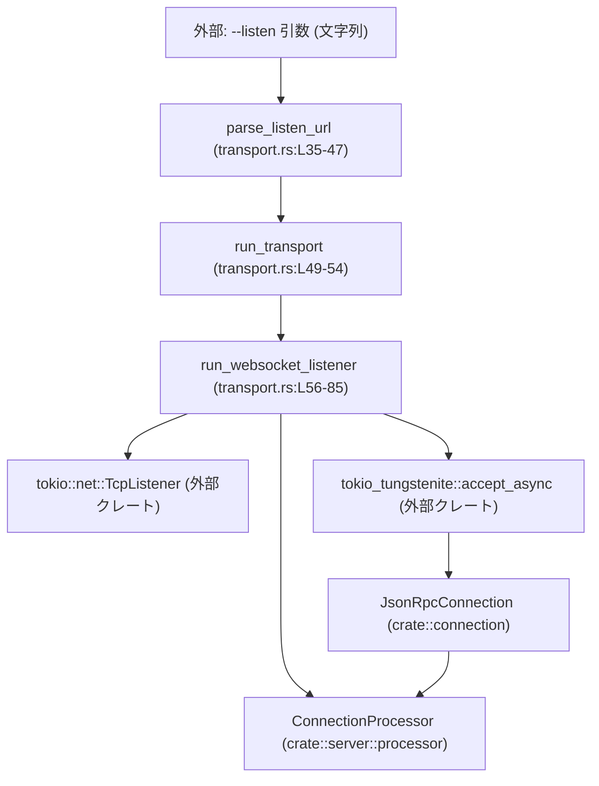
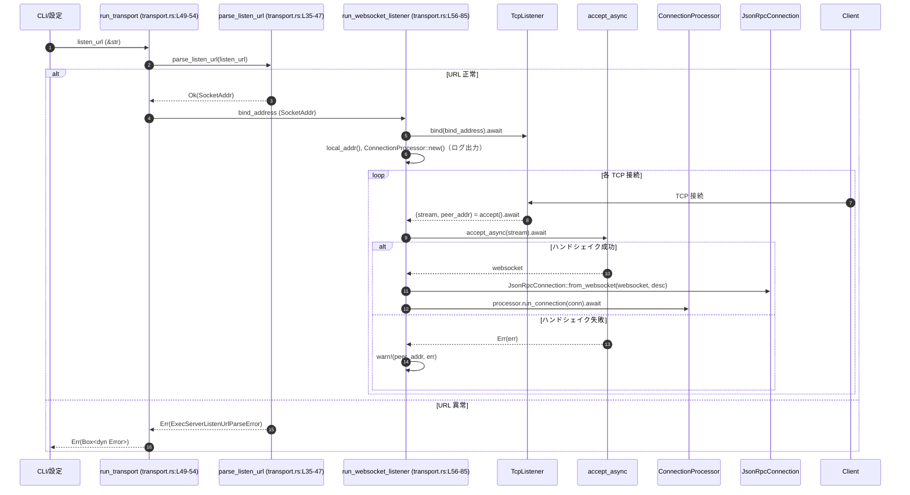

# exec-server/src/server/transport.rs コード解説

## 0. ざっくり一言

`exec-server` の WebSocket トランスポート層を担当し、`--listen` URL のパースと WebSocket サーバの起動・接続受付・接続ごとの処理タスク起動を行うモジュールです（`transport.rs:L10-L11, L35-L54, L56-L85`）。

---

## 1. このモジュールの役割

### 1.1 概要

- このモジュールは **exec-server の WebSocket ベースの外部インターフェース**を提供するために存在し、次の機能を提供します。
  - `ws://IP:PORT` 形式の `--listen` URL を `SocketAddr` に変換する（`parse_listen_url`、`transport.rs:L35-L47`）。
  - 指定されたアドレスで `TcpListener` を起動し、WebSocket 接続を受け付ける（`run_websocket_listener`、`transport.rs:L56-L85`）。
  - 受け付けた各接続に対して JSON-RPC ベースと思われる処理を `ConnectionProcessor` に委譲する（`transport.rs:L61, L71-L76`）。

### 1.2 アーキテクチャ内での位置づけ

このモジュールは「サーバのトランスポート層」として、ネットワーク（TCP/WebSocket）とアプリケーションロジック（`ConnectionProcessor`）の間をつなぎます。



- CLI や設定から渡される `listen_url: &str` を `parse_listen_url` が解析します（`transport.rs:L35-L42`）。
- `run_transport` は解析結果の `SocketAddr` を `run_websocket_listener` に渡します（`transport.rs:L52-L53`）。
- `run_websocket_listener` は `TcpListener` で接続を受け付け、`tokio::spawn` されたタスクごとに WebSocket ハンドシェイクと `ConnectionProcessor::run_connection` を実行します（`transport.rs:L59-L61, L65-L76`）。

### 1.3 設計上のポイント

- **URL パース専用のエラー型**  
  `ExecServerListenUrlParseError` が URL の不正を「サポートされない形式」と「WebSocket として不正」に分けて表現します（`transport.rs:L12-L16, L35-L47`）。
- **非同期 & 多接続対応**  
  - Tokio の `TcpListener` と `tokio::spawn` により、各接続を独立した非同期タスクとして処理します（`transport.rs:L56-L59, L65-L68`）。
  - WebSocket ハンドシェイクは `tokio_tungstenite::accept_async` に委譲されています（`transport.rs:L69-L70`）。
- **エラー伝播の方針**  
  - URL パースエラーは型付きの `ExecServerListenUrlParseError` として表現され、`run_transport` では `Box<dyn Error + Send + Sync>` に自動変換されて呼び出し元に返されます（`transport.rs:L35-L47, L49-L53`）。
  - WebSocket ハンドシェイク失敗はタスク内で `warn!` ログのみを出し、サーバ全体は継続します（`transport.rs:L69-L82`）。
- **デフォルトのリッスンアドレス**  
  - `ws://127.0.0.1:0` をデフォルトとし、ローカルホストのみ・ポートは OS 任せ（エフェメラルポート）という挙動になります（`DEFAULT_LISTEN_URL`、`transport.rs:L10`）。

### 1.4 シンボル一覧（コンポーネントインベントリー）

| 名前 | 種別 | 可視性 | 役割 / 用途 | 定義位置 |
|------|------|--------|-------------|----------|
| `DEFAULT_LISTEN_URL` | 定数 `&'static str` | `pub` | デフォルトの WebSocket リッスン URL（`ws://127.0.0.1:0`） | `transport.rs:L10` |
| `ExecServerListenUrlParseError` | `enum` | `pub` | `--listen` URL パースエラーの区別（未対応形式 / 不正形式） | `transport.rs:L12-L16` |
| `parse_listen_url` | 関数 | `pub(crate)` | `ws://IP:PORT` 形式の文字列を `SocketAddr` に変換 | `transport.rs:L35-L47` |
| `run_transport` | `async fn` | `pub(crate)` | URL パースと WebSocket リスナー起動の統合エントリポイント | `transport.rs:L49-L54` |
| `run_websocket_listener` | `async fn` | モジュール内のみ | `SocketAddr` にバインドし、接続ごとにタスクを spawn して処理 | `transport.rs:L56-L85` |
| `transport_tests` | `mod` | テスト時のみ | このモジュールのテスト群（内容はこのチャンクには現れません） | `transport.rs:L88-L90` |

---

## 2. 主要な機能一覧

- **デフォルト listen URL 定義**: `DEFAULT_LISTEN_URL` により、CLI 等で明示されない場合のデフォルトを提供します（`transport.rs:L10`）。
- **listen URL のパース**: `parse_listen_url` が `ws://IP:PORT` 文字列を `SocketAddr` に変換し、異常を `ExecServerListenUrlParseError` で通知します（`transport.rs:L35-L47`）。
- **トランスポート起動 API**: `run_transport` が URL パースと WebSocket リスナー起動をひとまとめにした crate 内公開 API を提供します（`transport.rs:L49-L54`）。
- **WebSocket リスナーと接続処理**: `run_websocket_listener` が `TcpListener` で接続待ちし、WebSocket ハンドシェイクと `ConnectionProcessor::run_connection` を各タスクで実行します（`transport.rs:L56-L85`）。

---

## 3. 公開 API と詳細解説

### 3.1 型一覧（構造体・列挙体・定数）

| 名前 | 種別 | 役割 / 用途 | 関連機能 | 定義位置 |
|------|------|-------------|----------|----------|
| `DEFAULT_LISTEN_URL` | `&'static str` 定数 | デフォルトの WebSocket リッスン URL（`ws://127.0.0.1:0`）を表します。127.0.0.1（ローカルホスト）かつポート 0（OS による割当）です。 | `run_transport` などの起動時に利用される想定ですが、このチャンクでは直接の使用箇所は現れません。 | `transport.rs:L10` |
| `ExecServerListenUrlParseError` | 列挙体 `enum` | listen URL のパース失敗を、「サポート外のスキーム/形式」と「WebSocket として不正」の 2 種類に区別して表現します。 | `parse_listen_url` の `Err` 型として使用されます。`Display` と `Error` を実装しています。 | `transport.rs:L12-L16, L18-L33` |

#### `ExecServerListenUrlParseError` のバリアント

- `UnsupportedListenUrl(String)`  
  `ws://` で始まらない URL に対して使われます（`transport.rs:L38, L44-L46`）。
- `InvalidWebSocketListenUrl(String)`  
  `ws://` ではあるが、残り部分が `SocketAddr` としてパースできない場合に使われます（`transport.rs:L38-L41`）。

### 3.2 関数詳細

#### `parse_listen_url(listen_url: &str) -> Result<SocketAddr, ExecServerListenUrlParseError>`

**概要**

- `ws://IP:PORT` 形式の listen URL をパースして `SocketAddr` に変換する関数です（`transport.rs:L35-L47`）。
- サポートされない形式やパース不能な文字列に対しては `ExecServerListenUrlParseError` を返します。

**引数**

| 引数名 | 型 | 説明 |
|--------|----|------|
| `listen_url` | `&str` | 解析対象の URL。`ws://` で始まり、その後ろに `IP:PORT` 形式のアドレスが続くことを期待します（`transport.rs:L35-L38`）。 |

**戻り値**

- `Ok(SocketAddr)`  
  - URL が `ws://IP:PORT` 形式であり、`IP:PORT` 部分が `SocketAddr` として正しくパースできた場合（`transport.rs:L38-L41`）。
- `Err(ExecServerListenUrlParseError)`  
  - `UnsupportedListenUrl(listen_url.to_string())`  
    - `ws://` で始まらない場合（`transport.rs:L38, L44-L46`）。
  - `InvalidWebSocketListenUrl(listen_url.to_string())`  
    - `ws://` で始まるが、残り部分が `SocketAddr` としてパースできない場合（`transport.rs:L38-L41`）。

**内部処理の流れ**

1. `listen_url.strip_prefix("ws://")` で `ws://` 接頭辞の有無をチェックし、あればその後ろの文字列（`socket_addr`）を得ます（`transport.rs:L38`）。
2. 接頭辞があった場合は `socket_addr.parse::<SocketAddr>()` で `SocketAddr` に変換を試みます（`transport.rs:L39`）。
   - 失敗時 (`Err(_)`) には `ExecServerListenUrlParseError::InvalidWebSocketListenUrl(listen_url.to_string())` を返します（`transport.rs:L39-L41`）。
3. 接頭辞がなかった場合は、`ExecServerListenUrlParseError::UnsupportedListenUrl(listen_url.to_string())` を返します（`transport.rs:L44-L46`）。

**Examples（使用例）**

```rust
use std::net::SocketAddr;
use exec_server::server::transport::ExecServerListenUrlParseError;
// 実際のパスは crate 構成によります。このチャンクからはパスは確定しません。

fn demo() {
    // 正常系: IP アドレス + ポート
    let addr: SocketAddr = parse_listen_url("ws://127.0.0.1:8080")
        .expect("有効な listen URL のはずです");
    // addr は 127.0.0.1:8080 になります。

    // 異常系: 接頭辞がない
    match parse_listen_url("127.0.0.1:8080") {
        Err(ExecServerListenUrlParseError::UnsupportedListenUrl(s)) => {
            eprintln!("Unsupported: {s}");
        }
        other => eprintln!("予期しない結果: {other:?}"),
    }

    // 異常系: IP:PORT 部分が不正
    match parse_listen_url("ws://not-an-ip") {
        Err(ExecServerListenUrlParseError::InvalidWebSocketListenUrl(s)) => {
            eprintln!("Invalid WebSocket URL: {s}");
        }
        other => eprintln!("予期しない結果: {other:?}"),
    }
}
```

**Errors / Panics**

- `Err(ExecServerListenUrlParseError::UnsupportedListenUrl(_))`  
  - `listen_url` が `ws://` で始まらない場合（`transport.rs:L38, L44-L46`）。
- `Err(ExecServerListenUrlParseError::InvalidWebSocketListenUrl(_))`  
  - `ws://` で始まるが、その後ろが `SocketAddr` としてパースできない場合（`transport.rs:L39-L41`）。
- この関数内で panic を起こす処理はありません（`unwrap` や `expect` が存在しないことから確認できます）。

**Edge cases（エッジケース）**

- 空文字列 `""`  
  - `strip_prefix("ws://")` が `None` を返し、`UnsupportedListenUrl("")` になります（`transport.rs:L38, L44-L46`）。
- `ws://` のみ（`"ws://"`）  
  - 接頭辞は認識されますが、残りが空文字列なので `SocketAddr` のパースが失敗し、`InvalidWebSocketListenUrl("ws://")` になります（`transport.rs:L38-L41`）。
- `ws://127.0.0.1:0`  
  - 有効な `SocketAddr` です。ポート 0 は OS が動的に割り当てることを意味し、このモジュールでも特別扱いはされていません（`transport.rs:L10` と `L38-L41`）。
- ホスト名（例: `ws://localhost:8080`）  
  - `SocketAddr` の仕様上 IP 文字列を要求するため、パースは失敗し `InvalidWebSocketListenUrl` になります（`transport.rs:L39-L41`）。

**使用上の注意点**

- `ws://` 以外のスキーム（例: `wss://` や `http://`）はすべて `UnsupportedListenUrl` になります（`transport.rs:L38, L44-L46`）。
- エラーメッセージでは `expected ws://IP:PORT` と案内しており、実際のパースも `IP:PORT` 形式のみサポートします（`transport.rs:L21-L28, L38-L41`）。
- エラー variant には元の `listen_url` 全体が格納されます。ログやユーザ表示に使えますが、非常に長い文字列が渡された場合にはそのぶんメモリを消費します（`listen_url.to_string()`、`transport.rs:L40, L45`）。

---

#### `run_transport(listen_url: &str) -> Result<(), Box<dyn std::error::Error + Send + Sync>>`

**概要**

- モジュール外（crate 内）から利用される、トランスポート起動用のエントリポイントです（`transport.rs:L49-L54`）。
- `listen_url` をパースして `SocketAddr` に変換したうえで、`run_websocket_listener` を呼び出します。

**引数**

| 引数名 | 型 | 説明 |
|--------|----|------|
| `listen_url` | `&str` | WebSocket リッスン URL（`ws://IP:PORT` 形式を期待）。そのまま `parse_listen_url` に渡されます（`transport.rs:L49-L52`）。 |

**戻り値**

- `Ok(())`  
  - `parse_listen_url` と `run_websocket_listener` がエラーなく実行された場合（`transport.rs:L52-L53`）。
  - ただし `run_websocket_listener` は通常無限ループで動作するため、通常はサーバ終了時か致命的エラー時のみ戻ります（`transport.rs:L65-L85`）。
- `Err(Box<dyn Error + Send + Sync>)`  
  - `parse_listen_url` が `ExecServerListenUrlParseError` を返した場合、それが `Box<dyn Error + Send + Sync>` に変換されて伝播します（`?` 演算子、`transport.rs:L52`）。
  - `run_websocket_listener` が I/O エラーなどで `Err` を返した場合も同様に伝播します（`transport.rs:L53`）。

**内部処理の流れ**

1. `parse_listen_url(listen_url)?` を呼び出して URL を `SocketAddr` に変換します（`transport.rs:L52`）。
   - ここで `?` 演算子が使われており、エラーは即座に呼び出し元に返されます。
2. 正常に `bind_address` が得られたら、`run_websocket_listener(bind_address).await` を呼び出し、その結果をそのまま返します（`transport.rs:L52-L53`）。

**Examples（使用例）**

```rust
use exec_server::server::transport::{run_transport, DEFAULT_LISTEN_URL};
// 実際のモジュールパスはプロジェクト構成に依存します。

#[tokio::main] // Tokio ランタイムを起動するマクロ
async fn main() -> Result<(), Box<dyn std::error::Error + Send + Sync>> {
    // コマンドライン引数の 1 番目を listen URL として使い、
    // 指定がなければ DEFAULT_LISTEN_URL を用いる例
    let listen = std::env::args()
        .nth(1)
        .unwrap_or_else(|| DEFAULT_LISTEN_URL.to_string());

    // WebSocket トランスポートを起動する
    run_transport(&listen).await
}
```

**Errors / Panics**

- `Err(Box<dyn Error + Send + Sync>)` の条件:
  - `parse_listen_url` がエラーの場合（`transport.rs:L52`）。
  - `run_websocket_listener` が `TcpListener::bind` 失敗や `accept` 失敗などでエラーを返した場合（`transport.rs:L53, L59-L60, L66`）。
- 関数内で panic を起こすコード（`unwrap` や `expect` 等）は使われていません（`transport.rs:L49-L54`）。

**Edge cases（エッジケース）**

- `listen_url` が不正（例: `"127.0.0.1:8080"`）  
  - `parse_listen_url` 段階で `ExecServerListenUrlParseError` となり、`run_transport` からは `Box<dyn Error>` として返されます（`transport.rs:L35-L47, L52`）。
- ポート 0 を指定した URL（例: `"ws://127.0.0.1:0"`）  
  - 正常にパースされ、`run_websocket_listener` が OS にポート割り当てを任せる形でバインドします（`transport.rs:L10, L52-L53, L59-L60`）。

**使用上の注意点**

- `run_transport` 自体が `async fn` であるため、Tokio 等の非同期ランタイムの中で `.await` する必要があります（`transport.rs:L49-L51`）。
- 戻り値の `Err` は `Box<dyn Error + Send + Sync>` であり、エラーの具体型は `ExecServerListenUrlParseError` や I/O エラーなど複数になりえます。呼び出し側でダウンキャストする場合はその点を前提とする必要があります（`transport.rs:L35-L47, L49-L53`）。
- サーバとして通常動作している間は戻らない（無限ループ）ため、この関数を呼び出したスレッドは基本的にブロックされる構造です（`run_websocket_listener` の `loop`、`transport.rs:L65-L85`）。

---

#### `run_websocket_listener(bind_address: SocketAddr) -> Result<(), Box<dyn std::error::Error + Send + Sync>>`

**概要**

- 実際に WebSocket サーバを起動して接続を受け付ける非公開関数です（`transport.rs:L56-L85`）。
- `TcpListener` を指定アドレスにバインドし、無限ループで接続を受け付け、各接続を新しい Tokio タスクで処理します。

**引数**

| 引数名 | 型 | 説明 |
|--------|----|------|
| `bind_address` | `SocketAddr` | `TcpListener` をバインドするローカルアドレス。`parse_listen_url` から渡される想定です（`transport.rs:L56-L59`）。 |

**戻り値**

- `Ok(())`  
  - `TcpListener::bind`・`local_addr`・`accept` などがすべて成功し続け、かつサーバが正常終了した場合を表しますが、通常は無限ループなので終了するのは例外的な状況です（`transport.rs:L59-L60, L65-L85`）。
- `Err(Box<dyn Error + Send + Sync>)`  
  - `TcpListener::bind(bind_address).await?` が失敗した場合（アドレス使用中・権限不足など）（`transport.rs:L59`）。
  - `listener.local_addr()?` が失敗した場合（`transport.rs:L60`）。
  - ループ内の `listener.accept().await?` が I/O エラーを返した場合（`transport.rs:L66`）。

**内部処理の流れ**

1. `TcpListener::bind(bind_address).await?` で TCP ポートにバインドし、`listener` を取得します（`transport.rs:L59`）。
2. `listener.local_addr()?` で実際にバインドされたアドレス（特にポート）を取得します（`transport.rs:L60`）。
3. `ConnectionProcessor::new()` で接続処理用のオブジェクトを生成します（`transport.rs:L61`）。
4. ログ出力として
   - `tracing::info!("codex-exec-server listening on ws://{local_addr}")`（構造化ログ）（`transport.rs:L62`）
   - `println!("ws://{local_addr}")`（標準出力）（`transport.rs:L63`）
   を行います。
5. 無限ループ `loop { ... }` に入り、接続を待ち受けます（`transport.rs:L65-L85`）。
6. 各ループで
   - `let (stream, peer_addr) = listener.accept().await?;` で新規接続を受け付けます（`transport.rs:L66`）。
   - `let processor = processor.clone();` により `ConnectionProcessor` をクローンします（`transport.rs:L67`）。
   - `tokio::spawn(async move { ... })` で新しいタスクを起動し、`stream` と `processor` を move でキャプチャします（`transport.rs:L68`）。
7. spawn されたタスク内部では
   - `accept_async(stream).await` で WebSocket ハンドシェイクを行います（`transport.rs:L69-L70`）。
   - 成功 (`Ok(websocket)`) 場合:
     - `JsonRpcConnection::from_websocket(websocket, format!("exec-server websocket {peer_addr}"))` で接続オブジェクトを生成します（`transport.rs:L71-L75`）。
     - `processor.run_connection(...).await;` で接続処理を実行します（`transport.rs:L71-L76`）。
   - 失敗 (`Err(err)`) 場合:
     - `warn!("failed to accept ... {peer_addr}: {err}")` を出力します（`transport.rs:L78-L82`）。

**Examples（使用例）**

この関数はモジュール内非公開ですが、概念的な利用イメージは次のようになります。

```rust
use std::net::SocketAddr;

async fn start_on_port_9000() -> Result<(), Box<dyn std::error::Error + Send + Sync>> {
    // 127.0.0.1:9000 に直接バインドする例
    let addr: SocketAddr = "127.0.0.1:9000".parse()?; // SocketAddr は IP:PORT 形式をパースする
    run_websocket_listener(addr).await                 // transport.rs:L56-L58 で定義（モジュール外からは直接呼べない想定）
}
```

※ 実際には `run_websocket_listener` は `pub(crate)` ではないため、このような呼び出しはこのモジュール外からはできません。あくまで内部の振る舞いイメージです。

**Errors / Panics**

- `Err(Box<dyn Error + Send + Sync>)` の主な発生条件:
  - バインドアドレスが不正または既に使用中 (`TcpListener::bind` のエラー、`transport.rs:L59`)。
  - `local_addr()` 呼び出し時のエラー（`transport.rs:L60`）。
  - 接続待ち `listener.accept().await` の I/O エラー（`transport.rs:L66`）。
- spawn されたタスク内での WebSocket ハンドシェイク失敗 (`accept_async(stream).await` の `Err`) は、`warn!` ログで記録されるだけで関数の戻り値には影響しません（`transport.rs:L69-L70, L78-L82`）。
- 関数内で明示的な panic を引き起こすコードはありません。

**Edge cases（エッジケース）**

- バインドアドレスのポートが 0 の場合  
  - OS が任意の空きポートを割り当て、その実際のポートは `local_addr` に反映されてログに出力されます（`transport.rs:L59-L63`）。
- 非常に多くの同時接続  
  - 各接続ごとに `tokio::spawn` で新タスクが起動されるため、接続数に比例してタスク数が増えます。タスク数の制限や接続数制御はこの関数内にはありません（`transport.rs:L65-L68`）。
- WebSocket ハンドシェイクのみ失敗するケース  
  - TCP 接続は確立されていても、`accept_async` が失敗した場合には `warn!` ログを出した後、タスクは終了し、メインループは次の接続待ちに戻ります（`transport.rs:L69-L82`）。

**使用上の注意点**

- `tokio::spawn` によりタスクが起動されるため、キャプチャされる `processor` などは `Send + 'static` の制約を満たす必要があります（Tokio の API 仕様に基づく）。`ConnectionProcessor` がこの前提で設計されていることが読み取れます（`transport.rs:L61, L67-L68`）。
- 各タスクで `processor.run_connection(...).await` の戻り値は無視されており、ここでは成功・失敗はログ等に扱われていません。`run_connection` のエラーハンドリングはそちらの実装側に依存します（`transport.rs:L71-L76`）。
- リスナーの終了条件は、バインドや accept の I/O エラーなどです。外部からの「正常な終了シグナル」による停止処理はこの関数には含まれていません（`loop { ... listener.accept().await? ... }`、`transport.rs:L65-L66`）。

---

### 3.3 その他の関数・実装

| 名前 | 種別 | 役割（1 行） | 定義位置 |
|------|------|--------------|----------|
| `impl Display for ExecServerListenUrlParseError::fmt` | メソッド | エラー内容をユーザフレンドリなメッセージ（`unsupported --listen URL...` など）として整形します。 | `transport.rs:L18-L30` |
| `impl std::error::Error for ExecServerListenUrlParseError` | トレイト実装 | 標準の `Error` トレイトを実装し、`Box<dyn Error>` 等として扱えるようにします。 | `transport.rs:L33` |

---

## 4. データフロー

このモジュールにおける典型的な処理シナリオは「listen URL を受け取り、WebSocket 接続を受け付けて `ConnectionProcessor` に処理させる」という流れです。

### 4.1 起動から接続処理までのフロー



- この図は `transport.rs:L35-L85` の処理の流れを表現しています。
- エラーの扱い:
  - URL パースエラーは `run_transport` から `Err(Box<dyn Error>)` として CLI/上位層に返されます（`transport.rs:L35-L47, L52`）。
  - WebSocket ハンドシェイクエラーは `warn!` ログのみで、サーバ全体は影響を受けません（`transport.rs:L69-L82`）。
- 並行性:
  - 各 `(stream, peer_addr)` ごとに `tokio::spawn` で新たなタスクが生成され、`ConnectionProcessor::run_connection` が並行に走ります（`transport.rs:L65-L68, L71-L76`）。

---

## 5. 使い方（How to Use）

### 5.1 基本的な使用方法

もっとも典型的には、`main` 関数から `run_transport` を呼び出して WebSocket サーバを起動します。

```rust
use exec_server::server::transport::{run_transport, DEFAULT_LISTEN_URL}; // トランスポート API とデフォルト URL をインポートする

#[tokio::main] // Tokio ランタイムを起動するアトリビュートマクロ
async fn main() -> Result<(), Box<dyn std::error::Error + Send + Sync>> {
    // コマンドライン引数から --listen 相当を取得（簡略化）
    let listen_url = std::env::args()
        .nth(1)                                   // 1 番目の引数を取得（なければ None）
        .unwrap_or_else(|| DEFAULT_LISTEN_URL.to_string()); // なければデフォルト URL を使用する

    // WebSocket トランスポートを起動する
    // この呼び出しは通常、サーバが停止するまで戻りません
    run_transport(&listen_url).await
}
```

### 5.2 よくある使用パターン

1. **固定ポートでの起動**

```rust
// 例: 常に 127.0.0.1:8080 で待ち受ける
let listen_url = "ws://127.0.0.1:8080".to_string();
run_transport(&listen_url).await?;
```

1. **テスト時にエフェメラルポートを使う**

```rust
// listen URL を DEFAULT_LISTEN_URL (ws://127.0.0.1:0) にして起動し、
// 実際のポートは stdout の "ws://IP:PORT" から取得する、というテスト戦略が取り得ます。
// 実際のポート取得ロジックはテストコード側（transport_tests.rs 等）に依存します。
run_transport(DEFAULT_LISTEN_URL).await?;
```

※ 実際にどのようにテストしているかは `transport_tests.rs` の内容がこのチャンクには現れないため不明です。

### 5.3 よくある間違い

```rust
// 間違い例 1: 非 async コンテキストから直接呼ぶ
fn main() {
    // コンパイルエラー: async fn run_transport を .await できない
    // run_transport(DEFAULT_LISTEN_URL);
}

// 正しい例: Tokio ランタイム内で await する
#[tokio::main]
async fn main() -> Result<(), Box<dyn std::error::Error + Send + Sync>> {
    run_transport(DEFAULT_LISTEN_URL).await
}
```

```rust
// 間違い例 2: 接頭辞のない URL を渡す
let listen_url = "127.0.0.1:8080".to_string(); // ws:// が付いていない

// parse_listen_url / run_transport は UnsupportedListenUrl エラーを返す
match run_transport(&listen_url).await {
    Err(e) => eprintln!("listen URL エラー: {e}"), // "unsupported --listen URL ..." が出力される
    Ok(()) => {}
}
```

### 5.4 使用上の注意点（まとめ）

- **非同期ランタイム前提**  
  - `run_transport` / `run_websocket_listener` は Tokio ベースの `async` 関数であり、Tokio ランタイム（`#[tokio::main]` など）の中で `.await` する必要があります（`transport.rs:L49-L51, L56-L58`）。
- **URL の形式制約**  
  - `parse_listen_url` は `ws://IP:PORT` 形式のみをサポートし、それ以外はエラーになります（`transport.rs:L38-L41, L21-L28`）。
- **接続数とリソース**  
  - 各接続ごとに `tokio::spawn` でタスクが生成されるため、多数の同時接続がある環境ではタスク数が増加します（`transport.rs:L65-L68`）。
- **暗号化や認証について**  
  - このモジュールでは TLS や認証処理は行っておらず、`tokio_tungstenite::accept_async` を素の TCP 上で呼び出しています（`transport.rs:L69-L70`）。暗号化や認証が必要な場合は、別レイヤーで対処する設計であると読み取れます。
- **ログと可観測性**  
  - 起動時に `tracing::info!` と `println!` で実際の listen URL を出力し（`transport.rs:L62-L63`）、ハンドシェイク失敗は `warn!` で記録されます（`transport.rs:L78-L82`）。

---

## 6. 変更の仕方（How to Modify）

### 6.1 新しい機能を追加する場合の入口

このモジュール内での責務分割から、機能追加時に触れることが多い箇所は次のように整理できます。

- **URL 関連の拡張**  
  - URL 書式やスキーム（`ws://` 以外）の扱いを変えたい場合の入口は `parse_listen_url` です（`transport.rs:L35-L47`）。
  - エラー種別やメッセージも `ExecServerListenUrlParseError` と `Display` 実装で管理されています（`transport.rs:L12-L16, L18-L30`）。
- **接続処理フローの変更**  
  - 接続受け付けの方法やタスクの起動戦略を変える場合は `run_websocket_listener` の `loop` および `tokio::spawn` 部分が対象になります（`transport.rs:L65-L85`）。
  - WebSocket 以外のプロトコルを扱う場合も、この箇所がトランスポート層の処理入口です（`transport.rs:L69-L76`）。
- **ログ/可観測性の拡張**  
  - 起動時ログやエラー時ログは `tracing::info!` と `warn!` を使っているため、ログ構造を変更・拡張する際の着地点になります（`transport.rs:L62, L78-L82`）。

### 6.2 既存の機能を変更する際の注意

- **契約（Contract）の確認**
  - `parse_listen_url` は `ExecServerListenUrlParseError` を返す契約になっており、上位ではこれが `Box<dyn Error>` に変換されて利用されています（`transport.rs:L35-L47, L49-L53`）。エラー型を変える場合はその互換性を考慮する必要があります。
  - `run_websocket_listener` は「無限ループで接続をさばく」という前提で設計されています（`transport.rs:L65-L85`）。終了条件を追加する場合は、上位呼び出し側の期待値も確認する必要があります。
- **並行性への影響**
  - `ConnectionProcessor` は `clone()` されたうえで `tokio::spawn` によって複数タスクに渡されています（`transport.rs:L61, L67-L68`）。内部のスレッド安全性（`Send` / `Sync`）はここから推測される利用形態の前提となっています。
- **テストとの整合性**
  - このモジュールには `transport_tests` が存在しますが、その内容はこのチャンクには現れません（`transport.rs:L88-L90`）。変更時にはこのテストモジュールの期待する振る舞いを確認する必要があります。

---

## 7. 関連ファイル

| パス / モジュール | 役割 / 関係 | 根拠 |
|-------------------|------------|------|
| `crate::connection::JsonRpcConnection` | WebSocket ストリームから JSON-RPC 接続オブジェクトを生成する型。`run_websocket_listener` で各接続ごとにインスタンスが作られます。物理ファイルパスはこのチャンクには現れません。 | `use crate::connection::JsonRpcConnection;`（`transport.rs:L7`）、`JsonRpcConnection::from_websocket(...)`（`transport.rs:L71-L75`） |
| `crate::server::processor::ConnectionProcessor` | 各接続に対するビジネスロジック／JSON-RPC 処理を行うコンポーネント。`new()` で生成され、各接続タスクにクローンされます。物理ファイルパスはこのチャンクには現れません。 | `use crate::server::processor::ConnectionProcessor;`（`transport.rs:L8`）、`ConnectionProcessor::new()`（`transport.rs:L61`）、`processor.run_connection(...)`（`transport.rs:L71-L76`） |
| `exec-server/src/server/transport_tests.rs` | `transport` モジュールのテスト群。内容はこのチャンクには現れませんが、`#[cfg(test)]` で参照されています。 | `#[cfg(test)]`, `#[path = "transport_tests.rs"]`（`transport.rs:L88-L90`） |
| 外部クレート `tokio` | 非同期 I/O とタスクスケジューリング。`TcpListener` と `tokio::spawn` を提供します。 | `use tokio::net::TcpListener;`（`transport.rs:L3`）、`tokio::spawn(...)`（`transport.rs:L68`） |
| 外部クレート `tokio_tungstenite` | WebSocket ハンドシェイクとプロトコル処理。`accept_async` を提供します。 | `use tokio_tungstenite::accept_async;`（`transport.rs:L4`）、`accept_async(stream).await`（`transport.rs:L69-L70`） |
| 外部クレート `tracing` | 構造化ログ出力。起動時の情報ログとハンドシェイク失敗時の警告ログに使用されています。 | `use tracing::warn;`（`transport.rs:L5`）、`tracing::info!(...)`（`transport.rs:L62`）、`warn!(...)`（`transport.rs:L78-L82`） |

---

### 付記: 安全性・エラー・並行性・テストに関する観察

- **安全性（メモリ安全）**
  - このファイルには `unsafe` ブロックが一切含まれておらず（`transport.rs:L1-L90`）、Rust の所有権・借用システムに従った安全なコードで構成されています。
- **エラー処理**
  - 設定エラー（listen URL）は型付きエラー (`ExecServerListenUrlParseError`) で表現され、起動時に検出されます（`transport.rs:L35-L47`）。
  - ネットワーク I/O エラーは主に `?` 演算子を通じて上位に伝播します（`transport.rs:L59-L60, L66`）。
  - WebSocket ハンドシェイクエラーは警告ログにとどまり、他の接続には影響しない設計です（`transport.rs:L69-L82`）。
- **並行性**
  - 各接続の処理は `tokio::spawn` により独立したタスクとして実行されるため、多数の接続を同時にさばける構造になっています（`transport.rs:L65-L68`）。
  - `ConnectionProcessor` がクローンされ複数タスクから利用されるため、その内部はスレッド安全である前提の設計です（`transport.rs:L61, L67-L68`）。
- **テスト**
  - `transport_tests` モジュールが存在するため、このモジュールに対して何らかのテストが用意されていることが分かりますが、具体的なテスト内容はこのチャンクからは分かりません（`transport.rs:L88-L90`）。
