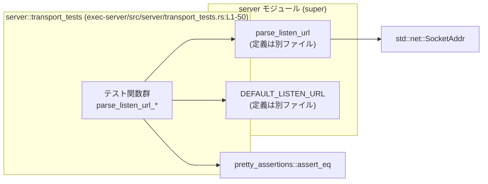
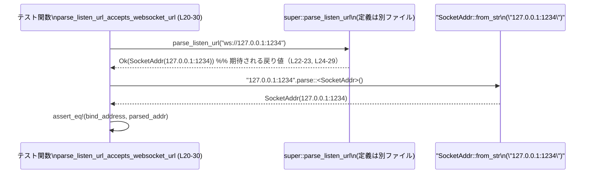

# exec-server/src/server/transport_tests.rs

## 0. ざっくり一言

`super::parse_listen_url` 関数と `super::DEFAULT_LISTEN_URL` 定数について、WebSocket 用の `--listen` URL が正しくパース・検証されることを確認する単体テスト群です（`exec-server/src/server/transport_tests.rs:L8-50`）。

---

## 1. このモジュールの役割

### 1.1 概要

- このモジュールは、サーバのリッスンアドレスを表す WebSocket URL を、`SocketAddr` に変換する関数 `parse_listen_url` の挙動を検証します（`exec-server/src/server/transport_tests.rs:L5-6`）。
- 具体的には、以下をテストしています。
  - デフォルトの WebSocket URL が受け入れられ、`127.0.0.1:0` に解決されること（`L8-18`）。
  - 明示的な `ws://IP:PORT` 形式の URL が受け入れられること（`L20-30`）。
  - ホスト名（`localhost`）を含む URL が「無効」として拒否されること（`L32-40`）。
  - `http://` など、`ws://` 以外のスキームが拒否されること（`L42-49`）。

### 1.2 アーキテクチャ内での位置づけ

このファイルは、親モジュール（`super`）にあるトランスポート関連のロジックに対するテスト専用モジュールです。

依存関係の概略は次のとおりです。



- `T1` はこのファイルで定義される 4 つのテスト関数です（`L8-49`）。
- `P` と `D` は親モジュール `super` からインポートされており、このチャンクには定義が現れません（`L5-6`）。
- `SocketAddr` は標準ライブラリのソケットアドレス型で、期待される戻り値として利用されています（`L1, L14-16, L26-28`）。

### 1.3 設計上のポイント

コードから読み取れる設計上の特徴は以下のとおりです。

- **結果型ベースのエラー処理**
  - `parse_listen_url(...)` に対して `expect` と `expect_err` の両方が呼び出されており、戻り値は `Result<SocketAddr, E>` 型であると読み取れます（`L10-11, L22-23, L34-35, L44-45`）。
- **仕様を文字列メッセージで明示**
  - エラー時の期待メッセージが文字列で厳密に検証されます。特に、「`expected 'ws://IP:PORT'`」というフォーマットが仕様として固定されています（`L37-39, L47-49`）。
- **入力検証の範囲**
  - スキーム（`ws://` かどうか）とホスト部が IP アドレスかどうか、の両方を検証していることがテストから分かります（`L33-39, L43-49`）。
- **状態や並行性は持たない**
  - このテストモジュール内には状態を持つグローバル変数や `unsafe` ブロック、非同期処理はありません（`L1-50`）。

### 1.4 コンポーネント一覧（このチャンク）

このチャンクに現れる関数・定数・型のインベントリーです。

| 名前 | 種別 | 定義/利用 | 役割 | 根拠行 |
|------|------|-----------|------|--------|
| `parse_listen_url_accepts_default_websocket_url` | 関数（テスト） | 定義 | `DEFAULT_LISTEN_URL` が正しく `SocketAddr` に変換されることを検証 | `exec-server/src/server/transport_tests.rs:L8-18` |
| `parse_listen_url_accepts_websocket_url` | 関数（テスト） | 定義 | 明示的な `ws://IP:PORT` URL を受け入れることを検証 | `exec-server/src/server/transport_tests.rs:L20-30` |
| `parse_listen_url_rejects_invalid_websocket_url` | 関数（テスト） | 定義 | ホスト名（`localhost`）を含む URL を「無効」と判定することを検証 | `exec-server/src/server/transport_tests.rs:L32-40` |
| `parse_listen_url_rejects_unsupported_url` | 関数（テスト） | 定義 | `http://` のような非 `ws://` スキームを拒否することを検証 | `exec-server/src/server/transport_tests.rs:L42-49` |
| `parse_listen_url` | 関数 | 利用のみ | `&str` の `--listen` URL をパースし、`SocketAddr` かエラーを返す関数 | `exec-server/src/server/transport_tests.rs:L5-6, L10-11, L22-23, L34-35, L44-45` |
| `DEFAULT_LISTEN_URL` | 定数 | 利用のみ | デフォルトの `--listen` WebSocket URL を表す文字列定数 | `exec-server/src/server/transport_tests.rs:L5, L10-11` |
| `SocketAddr` | 構造体（標準ライブラリ） | 利用のみ | IP アドレスとポート番号の組を表す。`parse_listen_url` の成功時の値と比較に使用 | `exec-server/src/server/transport_tests.rs:L1, L14-16, L26-28` |

---

## 2. 主要な機能一覧

このテストモジュールがカバーしている主要な仕様（機能）は次のとおりです。

- デフォルト URL の受理: `DEFAULT_LISTEN_URL` が `127.0.0.1:0` に対応することを検証（`L8-18`）。
- 明示的な `ws://IP:PORT` URL の受理: `ws://127.0.0.1:1234` が `127.0.0.1:1234` に変換されることを検証（`L20-30`）。
- ホスト名 URL の拒否: `ws://localhost:1234` を「無効な WebSocket URL」としてエラーにすることを検証（`L32-40`）。
- 非 `ws` スキームの拒否: `http://127.0.0.1:1234` を「サポートされない URL」としてエラーにすることを検証（`L42-49`）。

---

## 3. 公開 API と詳細解説

このファイル自身はテスト専用で公開 API を定義していませんが、テスト対象である `super::parse_listen_url` がサーバの公開 API（少なくとも内部 API）に該当すると考えられます。以下では、**テストコードから読み取れる契約（仕様）** に基づいて説明します。

### 3.1 型一覧（構造体・列挙体など）

このファイル内で新たに定義されている型はありません。利用している主要な型は以下のとおりです。

| 名前 | 種別 | 役割 / 用途 | 根拠行 |
|------|------|-------------|--------|
| `SocketAddr` | 構造体（`std::net`） | `IP:PORT` のペアを表す。`parse_listen_url` の成功時に返るアドレスと比較するために用いられています。 | `exec-server/src/server/transport_tests.rs:L1, L14-16, L26-28` |
| `Result<T, E>` | 列挙体（`std::result`） | 明示的には記載されていませんが、`expect` と `expect_err` を呼んでいることから、`parse_listen_url` の戻り値として使用されていると読み取れます。 | `exec-server/src/server/transport_tests.rs:L10-11, L22-23, L34-35, L44-45` |

### 3.2 関数詳細（parse_listen_url）

#### `parse_listen_url(listen_url: &str) -> Result<SocketAddr, E>`

> ※この関数の定義は別ファイルにあり、このチャンクには現れません。以下は**テストから読み取れる仕様**の整理です。

**概要**

- WebSocket 用の `--listen` URL 文字列を解析し、ローカルでバインド可能な `SocketAddr`（IP アドレスとポート）に変換する関数です（呼び出しと比較からの推定、`L10-11, L22-23, L14-16, L26-28`）。
- 正常時は `SocketAddr` を返し、異常時はエラー値を `Result::Err` として返します（`L10-11, L34-35, L44-45`）。

**引数**

| 引数名 | 型 | 説明 | 根拠 |
|--------|----|------|------|
| `listen_url` | `&str` と推定 | `ws://IP:PORT` 形式の WebSocket URL 文字列。テストでは文字列リテラルや `DEFAULT_LISTEN_URL`（おそらく `&'static str`）が渡されています。 | `exec-server/src/server/transport_tests.rs:L10-11, L22-23, L34-35, L44-45` |

**戻り値**

- 型: `Result<SocketAddr, E>` と推定されます。
  - `expect`（成功を前提）と `expect_err`（失敗を前提）の両方を呼び出していることから `Result` であると判断できます（`L10-11, L34-35, L44-45`）。
  - `let bind_address = ...` の型が `SocketAddr` と比較可能であるため、成功側は `SocketAddr` と一致します（`L12-17, L24-29`）。
  - エラー側の型 `E` はこのチャンクからは特定できませんが、`to_string()` が呼べることから `Display` トレイトを実装しているか、`Error` 型であると考えられます（`L37, L47`）。

**内部処理の流れ（テストから推測される仕様レベル）**

実装コードはこのチャンクには含まれていませんが、テストが前提とする挙動から、少なくとも次の仕様が満たされている必要があります。

1. 引数 `listen_url` をパースし、スキーム・ホスト・ポートに分解する。
   - 非 `ws` スキームの場合、`Err` を返す（`L42-49`）。
2. スキームが `ws` であることを検証する。
   - `http://127.0.0.1:1234` に対し `"unsupported --listen URL ...; expected 'ws://IP:PORT'"` というメッセージでエラーとなる（`L44-45, L47-49`）。
3. ホスト部が「IP アドレス」であることを検証する。
   - `ws://localhost:1234` の場合、`"invalid websocket --listen URL ...; expected 'ws://IP:PORT'"` というメッセージでエラーとなる（`L34-35, L37-39`）。
4. ホスト部が IPv4 の IP アドレスで、ポート部が数値として有効な場合には、それを `SocketAddr` に変換して `Ok` を返す。
   - `ws://127.0.0.1:1234` は `Ok("127.0.0.1:1234".parse())` と等価とみなされる（`L22-23, L24-29`）。
   - `DEFAULT_LISTEN_URL` は `Ok("127.0.0.1:0".parse())` と等価とみなされる（`L10-11, L12-17`）。

**Examples（使用例）**

テストコードを少し一般化した使用例です。

```rust
use std::net::SocketAddr;
// use crate::server::parse_listen_url; // 実際のパスはこのチャンクからは不明

fn example() -> Result<SocketAddr, Box<dyn std::error::Error>> {
    // WebSocket サーバを 127.0.0.1:1234 で待ち受けたいときの URL
    let url = "ws://127.0.0.1:1234";

    // URL をパースして SocketAddr を取得する
    // この行は、テストと同じ呼び出しパターンです（L22-23）
    let addr = parse_listen_url(url)?;

    // addr は 127.0.0.1:1234 を表す SocketAddr になることが期待されます（L24-29）
    Ok(addr)
}
```

エラー時の取り扱い例（テスト相当の確認）:

```rust
fn example_error() {
    // ホスト名を含む URL。テストではエラーになることが確認されています（L34-39）
    let url = "ws://localhost:1234";

    match parse_listen_url(url) {
        Ok(addr) => {
            // このケースはテスト上は発生しない想定
            eprintln!("Unexpected success: {}", addr);
        }
        Err(err) => {
            // エラーメッセージはテストで固定されています（L37-39）
            assert_eq!(
                err.to_string(),
                "invalid websocket --listen URL `ws://localhost:1234`; expected `ws://IP:PORT`"
            );
        }
    }
}
```

**Errors / Panics**

テストから読み取れる `Err` の条件とメッセージは以下のとおりです。

- ホスト名を含む `ws://HOST:PORT`（例: `ws://localhost:1234`）:
  - `Err` が返ることを `expect_err` で検証しています（`L34-35`）。
  - エラーメッセージは  
    `"invalid websocket --listen URL \`ws://localhost:1234\`; expected \`ws://IP:PORT\`"`である必要があります（`L37-39`）。
- 非 `ws` スキームの URL（例: `http://127.0.0.1:1234`）:
  - `Err` が返ることを `expect_err` で検証しています（`L44-45`）。
  - エラーメッセージは  
    `"unsupported --listen URL \`<http://127.0.0.1:1234\`>; expected \`ws://IP:PORT\`"`である必要があります（`L47-49`）。

panic について:

- テストコードは `expect` / `expect_err` を利用しており、ここで期待に反する結果を返した場合にはテストが panic します（`L11, L23, L35, L45`）。
- `parse_listen_url` 自体が panic するかどうかはこのチャンクからは分かりません。

**Edge cases（エッジケース）**

テストで明示的にカバーされている/いないケースを整理します。

- カバーされているエッジケース
  - `DEFAULT_LISTEN_URL`（おそらく `ws://127.0.0.1:0`）: ローカルホストへのバインドに使われるデフォルト URL（`L10-11, L12-17`）。
  - 「ホスト名」: `localhost` のようなホスト名を含む URL は無効（`L34-39`）。
  - 「スキーム違い」: `http://` などの非 `ws://` はサポート外（`L44-49`）。
- カバーされていない（このチャンクからは不明）ケース
  - IPv6 アドレス（例: `ws://[::1]:1234`）。
  - ポート番号が存在しない、または範囲外の値（例: `ws://127.0.0.1`, `ws://127.0.0.1:99999`）。
  - ユーザー情報やパス、クエリが含まれる URL（例: `ws://user@127.0.0.1:1234/path`）。
  - 空文字列や `ws://` だけの URL など。

**使用上の注意点**

- `--listen` の URL は必ず `ws://IP:PORT` 形式にする必要があります。ホスト名は使えません（`L37-39`）。
- テストがエラーメッセージ文字列に依存しているため、エラーメッセージを変更するとテストが失敗します（`L37-39, L47-49`）。
- 戻り値は `Result` 型であり、呼び出し側で `?` や `match` によるエラー処理が必要です（`L10-11, L34-35, L44-45`）。
- 並行性に関する制約（`Send`/`Sync` など）は、このチャンクからは読み取れません。

### 3.3 その他の関数（テスト関数）

このファイル内で定義されているテスト関数はすべて単純なラッパーであり、`parse_listen_url` の挙動を個々のケースで検証しています。

| 関数名 | 役割（1 行） | 根拠行 |
|--------|--------------|--------|
| `parse_listen_url_accepts_default_websocket_url` | `DEFAULT_LISTEN_URL` が `127.0.0.1:0` に変換されることを確認するテスト | `exec-server/src/server/transport_tests.rs:L8-18` |
| `parse_listen_url_accepts_websocket_url` | `ws://127.0.0.1:1234` が `127.0.0.1:1234` に変換されることを確認するテスト | `exec-server/src/server/transport_tests.rs:L20-30` |
| `parse_listen_url_rejects_invalid_websocket_url` | `ws://localhost:1234` が「無効な WebSocket URL」として拒否されることを確認するテスト | `exec-server/src/server/transport_tests.rs:L32-40` |
| `parse_listen_url_rejects_unsupported_url` | `http://127.0.0.1:1234` が「サポートされない URL」として拒否されることを確認するテスト | `exec-server/src/server/transport_tests.rs:L42-49` |

---

## 4. データフロー

ここでは、代表的な正常系と異常系のテストにおけるデータフローを示します。

### 4.1 正常系: `parse_listen_url_accepts_websocket_url`

`ws://127.0.0.1:1234` を入力に `SocketAddr` を得るまでの流れです（`L20-30`）。



- テスト関数は URL 文字列を `parse_listen_url` に渡し、`Result` から `SocketAddr` を取り出します（`L22-23`）。
- 同時に `"127.0.0.1:1234".parse::<SocketAddr>()` で期待値を構築し、`assert_eq!` で比較します（`L24-29`）。

### 4.2 異常系: `parse_listen_url_rejects_invalid_websocket_url`

`ws://localhost:1234` を入力にエラー文字列を確認する流れです（`L32-40`）。

```mermaid
sequenceDiagram
    participant Test as テスト関数\nparse_listen_url_rejects_invalid_websocket_url (L32-40)
    participant Func as super::parse_listen_url

    Test->>Func: parse_listen_url("ws://localhost:1234")
    Func-->>Test: Err(err)
    Test->>Test: err.to_string()
    Test->>Test: assert_eq!(err_str,\n \"invalid websocket --listen URL `ws://localhost:1234`; expected `ws://IP:PORT`\")
```

- `expect_err` で `Err` であることを確認し（`L34-35`）、その文字列表現が仕様通りであるか検証します（`L37-39`）。

---

## 5. 使い方（How to Use）

このファイル自体はテストですが、`parse_listen_url` の典型的な使い方を示すサンプルとして利用できます。

### 5.1 基本的な使用方法

テストと同様に、URL を文字列として渡し `Result` を扱うコードになります。

```rust
use std::net::SocketAddr;
// use crate::server::parse_listen_url; // 実際のパスはこのチャンクからは不明

fn configure_listen_addr(url: &str) -> Result<SocketAddr, Box<dyn std::error::Error>> {
    // URL をパースして SocketAddr を取得する（テストと同じ呼び出しパターン、L10-11, L22-23）
    let addr = parse_listen_url(url)?;

    // この addr を使ってサーバのリッスンアドレスとして利用できる
    Ok(addr)
}
```

- 正常系では `Ok(SocketAddr)` が返り、呼び出し元で `?` によって伝播できます。
- 異常系では `Err(e)` が返り、呼び出し元の文脈でログ出力や終了処理に利用できます。

### 5.2 よくある使用パターン

- **デフォルト値の利用**（`DEFAULT_LISTEN_URL`）
  - CLI オプションが指定されなかった場合などに、`DEFAULT_LISTEN_URL` を渡して `SocketAddr` を得るパターンが考えられます（`L10-11`）。
- **ユーザ入力の検証**
  - CLI 引数や設定ファイルから受け取った文字列を、そのまま `parse_listen_url` に渡して妥当性を検証するパターンです（テストの `ws://...` 文字列利用と同様、`L22-23, L34-35, L44-45`）。

### 5.3 よくある間違い

テストから推測できる誤用例と、その修正版を示します。

```rust
// 誤りの可能性がある例: ホスト名を指定してしまう
let url = "ws://localhost:1234"; // テストではエラーになるケース（L34-39）
let addr = parse_listen_url(url)?; // ここで Err が返り、? によって呼び出し元にエラーが伝播

// 修正例: IP アドレスに変更する
let url = "ws://127.0.0.1:1234"; // テストで許可されるケース（L22-29）
let addr = parse_listen_url(url)?; // Ok(SocketAddr) が返ることが期待される
```

```rust
// 誤りの可能性がある例: スキームを http にしてしまう
let url = "http://127.0.0.1:1234"; // テストでは "unsupported" エラー（L44-49）
let addr = parse_listen_url(url)?; // 想定外のエラー

// 修正例: ws スキームを使う
let url = "ws://127.0.0.1:1234"; // テストで許可されるケース（L22-29）
let addr = parse_listen_url(url)?; // 成功する
```

### 5.4 使用上の注意点（まとめ）

- URL は必ず `ws://IP:PORT` の形式にする必要があります。ホスト名や `http://` などはエラーになります（`L34-39, L44-49`）。
- エラーメッセージはテストで固定されているため、ライブラリ利用者がその文字列に依存している可能性があります（このファイル内ではテストのみが依存、`L37-39, L47-49`）。
- 並行性に関する制約やスレッド安全性 (`Send` / `Sync`) については、このチャンクには情報がありません。

---

## 6. 変更の仕方（How to Modify）

### 6.1 新しい機能を追加する場合（このテストファイルの観点）

例えば、`parse_listen_url` が新たに IPv6 をサポートするようになった場合、このファイルに以下のようなテストを追加するのが自然です。

1. 親モジュールの `parse_listen_url` 実装を拡張する（実装は別ファイルで、このチャンクには現れません）。
2. このファイルに、`ws://[::1]:1234` のような IPv6 URL が `Ok(SocketAddr)` になることを確認するテスト関数を追加する。
3. 必要であれば、エラーメッセージに関するテストも追加/調整する。

### 6.2 既存の機能を変更する場合

- **エラーメッセージを変更する場合**
  - このファイルのテストはエラーメッセージ文字列に対して `assert_eq!` を行っています（`L37-39, L47-49`）。
  - メッセージフォーマットを変更する場合は、テストの期待値も合わせて変更する必要があります。
- **ホスト名を許可する仕様に変える場合**
  - `parse_listen_url_rejects_invalid_websocket_url` テストは `localhost` を拒否する仕様を前提としています（`L32-40`）。
  - 仕様を変更する場合は、このテストを削除するか、期待を「成功」に変更する必要があります。
- **スキームのサポート範囲を変える場合**
  - `parse_listen_url_rejects_unsupported_url` は `http://` をサポート外とする仕様を固定しています（`L42-49`）。
  - 追加のスキーム（例: `wss://`）をサポートする場合は、同様のテストを追加することが考えられます。

影響範囲としては、`parse_listen_url` を呼び出している他のモジュール（このチャンクには現れません）や、本テストファイル内の全テストが該当します。

---

## 7. 関連ファイル

このチャンクから直接わかる関連モジュール・要素は以下のとおりです。

| パス / モジュール | 役割 / 関係 | 根拠 |
|------------------|------------|------|
| `super` モジュール内の `parse_listen_url` | WebSocket `--listen` URL を `SocketAddr` に変換するロジックの本体。このテストファイルの主なテスト対象です。定義ファイル名はこのチャンクからは分かりません。 | `exec-server/src/server/transport_tests.rs:L5-6, L10-11, L22-23, L34-35, L44-45` |
| `super` モジュール内の `DEFAULT_LISTEN_URL` | デフォルトの WebSocket リッスン URL。`parse_listen_url` が正しく受け入れるべき値としてテストされています。 | `exec-server/src/server/transport_tests.rs:L5, L10-11` |
| `std::net::SocketAddr` | パース結果として期待されるソケットアドレス型。テストの期待値構築と比較に使われます。 | `exec-server/src/server/transport_tests.rs:L1, L14-16, L26-28` |
| `pretty_assertions::assert_eq` | テストにおける比較用アサーションマクロ。`std::assert_eq!` と互換ですが、差分表示が見やすくなります。 | `exec-server/src/server/transport_tests.rs:L3, L12-17, L24-29, L36-39, L46-49` |

このファイルは、`parse_listen_url` の仕様（特に URL フォーマットとエラーメッセージ）を固定する重要なテストとして機能しており、**API の契約（Contract）をドキュメント化する役割**も兼ねていると解釈できます。
