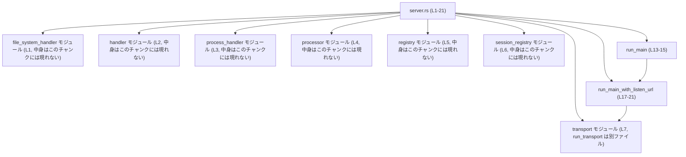
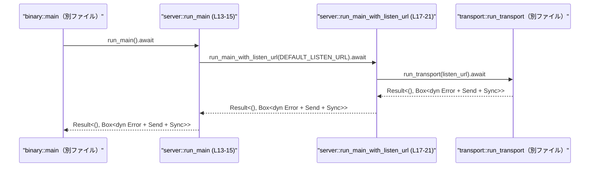

# exec-server/src/server.rs コード解説

## 0. ざっくり一言

このファイルは、`exec-server` のサーバー部分の「公開エントリポイント」をまとめるモジュールです。サブモジュールを束ねつつ、非同期エントリ関数 `run_main` / `run_main_with_listen_url` を提供し、`transport` モジュールに処理を委譲してサーバーを起動します（`server.rs:L1-21`）。

---

## 1. このモジュールの役割

### 1.1 概要

- このモジュールは、Exec サーバーを起動するための **高レベルなエントリ API** を提供します。
- 具体的には、内部の `transport` モジュールに処理を委譲する `run_main` / `run_main_with_listen_url` を公開し、呼び出し側からは URL 文字列を渡すだけでサーバーを起動できるようにしています（`server.rs:L13-21`）。
- また、ハンドラやデフォルトのリッスン URL、URL パースエラー型などを再エクスポートし、外部からの利用を簡潔にしています（`server.rs:L9-11`）。

### 1.2 アーキテクチャ内での位置づけ

このファイルは、複数のサブモジュールを `mod` 宣言で読み込み、起動用 API を通して `transport` モジュールに処理を橋渡しする役割を持ちます（`server.rs:L1-7, L17-21`）。



※ 各サブモジュール (`file_system_handler` など) の中身は **このチャンクには現れない** ため、役割はここからは特定できません。

### 1.3 設計上のポイント

- **ファサード的役割**  
  - 複数のサブモジュールを `mod` で取り込み、起動に必要な最低限のエントリ API だけを公開する構造になっています（`server.rs:L1-7, L9-11, L13-21`）。
- **非同期エントリポイント**  
  - `run_main` / `run_main_with_listen_url` は `async fn` として定義されており、非同期ランタイム（Tokio 等）の中で `.await` されることを前提とした設計です（`server.rs:L13, L17`）。
- **汎用的なエラー型**  
  - 戻り値は `Result<(), Box<dyn std::error::Error + Send + Sync>>` で統一され、様々なエラーをボックス化して一括で返す方針です（`server.rs:L13, L17`）。
  - `Send + Sync` 制約により、エラーをスレッド間で安全に移動・共有できる設計になっています。
- **責務の分離**  
  - 起動フロー自体は `transport::run_transport(listen_url)` に完全に委譲しており、このファイルは主に「公開 API の整形」と「デフォルト値の適用」に集中しています（`server.rs:L14, L20`）。
- **URL パースエラー型の再エクスポート**  
  - `ExecServerListenUrlParseError` を再エクスポートしており（`server.rs:L11`）、リッスン URL のパースに関するエラーが存在することを示唆しています（実際の利用箇所はこのチャンクには現れません）。

---

## 2. 主要な機能一覧

このモジュールが提供する主要な機能は、コードから次のように整理できます。

- サーバー起動（デフォルト URL）: `run_main` で `DEFAULT_LISTEN_URL` を用いてサーバーを起動する（`server.rs:L13-15`）。
- サーバー起動（任意の URL）: `run_main_with_listen_url` で任意の `listen_url: &str` を指定してサーバーを起動する（`server.rs:L17-21`）。
- ハンドラ型の公開: `ExecServerHandler` をクレート内に再エクスポートする（`server.rs:L9`）。
- デフォルトリッスン URL の公開: `DEFAULT_LISTEN_URL` を外部に再エクスポートする（`server.rs:L10`）。
- リッスン URL パースエラー型の公開: `ExecServerListenUrlParseError` を外部に再エクスポートする（`server.rs:L11`）。

---

## 3. 公開 API と詳細解説

### 3.1 型・定数一覧（構造体・列挙体など）

```text
※ このファイル内で新しく定義されている型はありません。
  すべて他モジュールからの再エクスポートです。
```

| 名前 | 種別 | 定義元 | 役割 / 用途 | 根拠 |
|------|------|--------|-------------|------|
| `ExecServerHandler` | 型（詳細不明） | `handler` モジュール | Exec サーバーのハンドラ（と命名からは推測されます）がクレート内から利用できるように再エクスポートされます。型の中身やメソッドはこのチャンクには現れません。 | 再エクスポート宣言 `pub(crate) use handler::ExecServerHandler;`（`server.rs:L9`） |
| `DEFAULT_LISTEN_URL` | 定数（型不明） | `transport` モジュール | サーバーのデフォルトリッスン URL を表す定数です。このファイルでは `run_main` で利用されます。型はコードからは読み取れませんが、`&str` 互換のものと推測されます（`listen_url: &str` に渡されるため）。 | `pub use transport::DEFAULT_LISTEN_URL;`（`server.rs:L10`）、`run_main_with_listen_url(DEFAULT_LISTEN_URL)`（`server.rs:L14`） |
| `ExecServerListenUrlParseError` | エラー型（詳細不明） | `transport` モジュール | リッスン URL のパースに関連するエラー型（と命名からは推測されます）。どこでどのように使われるかは、このチャンクには現れません。 | `pub use transport::ExecServerListenUrlParseError;`（`server.rs:L11`） |

> 型の詳細（フィールド、メソッド、エラーメッセージなど）はいずれも **このチャンクには現れない** ため、ここでは再エクスポートの事実までを記載しています。

### 3.2 関数詳細

このファイルで定義されている関数は 2 つです。

#### `run_main() -> Result<(), Box<dyn std::error::Error + Send + Sync>>`

**概要**

- デフォルトのリッスン URL (`DEFAULT_LISTEN_URL`) を用いて Exec サーバーを起動する非同期エントリ関数です。
- 内部的には `run_main_with_listen_url(DEFAULT_LISTEN_URL)` を呼び出すだけの薄いラッパーになっています（`server.rs:L13-15`）。

**定義**

```rust
pub async fn run_main() -> Result<(), Box<dyn std::error::Error + Send + Sync>> {
    run_main_with_listen_url(DEFAULT_LISTEN_URL).await
}
```

（`server.rs:L13-15`）

**引数**

- なし

**戻り値**

- `Result<(), Box<dyn std::error::Error + Send + Sync>>`  
  - 成功時: `Ok(())`  
  - 失敗時: 任意のエラー型を `Box<dyn Error + Send + Sync>` に包んだ `Err` を返します。
  - エラーの具体的な種類は `run_main_with_listen_url` → `transport::run_transport` に依存し、このチャンクからは特定できません。

**内部処理の流れ**

1. コンパイル時にバインドされた `DEFAULT_LISTEN_URL` 定数を取得する（`server.rs:L14`）。
2. `run_main_with_listen_url(DEFAULT_LISTEN_URL)` を `.await` し、その結果の `Result` をそのまま呼び出し元に返します（`server.rs:L14`）。

**非同期・並行性の観点**

- `async fn` であり、呼び出しには **非同期ランタイム**（Tokio など）が必要です（`server.rs:L13`）。
- 自身はタスク生成やスレッド操作を行わず、単に別の `async fn` を `.await` します。
- 戻り値のエラー型に `Send + Sync` 制約が付いているため、エラーはスレッド間で安全に移動・共有可能です。これは、上位レイヤーがマルチスレッドな実行コンテキストでもエラーをそのまま扱えるための配慮と考えられます。

**使用例**

最も単純な「バイナリのエントリポイント」としての利用例です。

```rust
// src/main.rs など （ファイル名は例）
// 非同期ランタイムとして tokio を利用する例です。
#[tokio::main] // Tokio ランタイムを起動
async fn main() {
    // server モジュールは同じクレート内にある想定
    if let Err(e) = crate::server::run_main().await {
        // エラーは Box<dyn Error + Send + Sync> なので Display/Debug 実装次第で出力
        eprintln!("exec-server failed: {e}");
    }
}
```

**Errors / Panics**

- `run_main` 本体には `?` 演算子や明示的な `panic!` はなく、単に別関数を `.await` して返しているだけです（`server.rs:L14`）。
- したがって:
  - **エラー**: `run_main_with_listen_url(DEFAULT_LISTEN_URL)` が返した `Err` を、そのまま呼び出し元に返します。
  - **パニック**: この関数自体にパニック要因は確認できませんが、依存する下位関数がパニックする可能性は、このチャンクからは不明です。

**Edge cases（エッジケース）**

コード上、`run_main` 自体は分岐を持たないため、典型的なエッジケースはすべて下位関数に委ねられます。

- `DEFAULT_LISTEN_URL` が無効なフォーマットだった場合  
  - 推測ですが、`transport` 側で URL パースエラー（おそらく `ExecServerListenUrlParseError`）を返す可能性があります。  
  - 実際にどう扱われるかは、`transport` モジュールの実装がこのチャンクには現れないため不明です。
- 非同期ランタイム外で呼んだ場合  
  - Rust の言語仕様上、`async fn` を直接呼び出すだけでは実行されません。`.await` 可能なコンテキストか、`block_on` 等で実行する必要があります。

**使用上の注意点**

- **非同期コンテキスト必須**  
  - `run_main` は `async fn` なので、必ず `.await` するか、非同期ランタイムの中で実行する必要があります。
- **エラー型は非常に汎用的**  
  - 戻り値のエラーが `Box<dyn Error + Send + Sync>` であるため、上位でエラーの詳細な型に応じた処理を行いたい場合は、`downcast_ref` などで型ごとの分岐を書く必要が生じます。
- **デフォルト URL の前提**  
  - デフォルト URL がどのような値かは `transport` モジュール側に定義されており、このチャンクからは確認できません。そのため、ポート番号やプロトコルなどの詳細を前提としたロジックを書く場合は注意が必要です。

---

#### `run_main_with_listen_url(listen_url: &str) -> Result<(), Box<dyn std::error::Error + Send + Sync>>`

**概要**

- 呼び出し側で指定した `listen_url: &str` を用いて Exec サーバーを起動する非同期関数です（`server.rs:L17-21`）。
- 実際の起動処理は `transport::run_transport(listen_url)` に完全に委譲されています。

**定義**

```rust
pub async fn run_main_with_listen_url(
    listen_url: &str,
) -> Result<(), Box<dyn std::error::Error + Send + Sync>> {
    transport::run_transport(listen_url).await
}
```

（`server.rs:L17-21`）

**引数**

| 引数名 | 型 | 説明 | 根拠 |
|--------|----|------|------|
| `listen_url` | `&str` | サーバーがリッスンする URL / アドレスを表す文字列スライスです。形式やプロトコルはこのチャンクからは不明です。 | 関数シグネチャ（`server.rs:L17-19`） |

**戻り値**

- `Result<(), Box<dyn std::error::Error + Send + Sync>>`
  - 成功時: `Ok(())`
  - 失敗時: `transport::run_transport(listen_url)` が返したエラーを `Box<dyn Error + Send + Sync>` として返します（`server.rs:L20`）。
  - エラーの具体的な種類（例: `ExecServerListenUrlParseError` かどうか）は `transport` 内部に依存し、このチャンクからは分かりません。

**内部処理の流れ**

1. 受け取った `listen_url: &str` を、そのまま `transport::run_transport(listen_url)` に渡します（`server.rs:L20`）。
2. `run_transport` の `Future` を `.await` し、返ってきた `Result` をそのまま呼び出し元に返します。

**非同期・並行性の観点**

- `async fn` であり、`run_main` と同様に非同期ランタイム内で実行されることを前提にしています（`server.rs:L17`）。
- 並行性の実装（スレッドプール、接続ごとのタスク生成など）はすべて `transport::run_transport` 側にあり、このチャンクには現れません。
- エラー型は `Send + Sync` 制約付きでボックス化されているため、マルチスレッド実行環境でもエラーを安全に扱えます。

**使用例**

カスタム URL でサーバーを起動するコード例です。

```rust
#[tokio::main]
async fn main() {
    // 例: TCP のローカルホストでポート 9000 をリッスンする URL だと仮定
    // 実際のフォーマット（"tcp://..." など）は transport モジュールの仕様次第で、
    // このチャンクからは分かりません。
    let url = "tcp://127.0.0.1:9000";

    if let Err(e) = crate::server::run_main_with_listen_url(url).await {
        eprintln!("failed to run exec-server on {url}: {e}");
    }
}
```

`?` 演算子を使って上位にエラーを伝播するパターン:

```rust
pub async fn run_server_on(url: &str) -> Result<(), Box<dyn std::error::Error + Send + Sync>> {
    crate::server::run_main_with_listen_url(url).await?; // エラーはそのまま呼び出し元に伝播
    Ok(())
}
```

**Errors / Panics**

- 本関数は `transport::run_transport(listen_url).await` の戻り値を、そのまま返します（`server.rs:L20`）。
- したがって:
  - **エラー**:  
    - URL フォーマットが不正な場合や、バインドに失敗した場合など、ネットワーク / I/O に起因するエラーが考えられますが、具体的にどのような条件でどのエラー型が返るかは `transport` の実装がこのチャンクには現れないため不明です。
  - **パニック**:  
    - この関数自体にはパニック要因はなく、パニックが起こるとすれば `transport::run_transport` 側の実装によります。

**Edge cases（エッジケース）**

この関数自身はエッジケース処理（バリデーション等）を行っていません（`server.rs:L17-21`）。想定される注意点は次の通りです。

- `listen_url` が空文字列 `""` の場合  
  - その扱いは `transport::run_transport` に委ねられており、このチャンクからは不明です。
- `listen_url` のフォーマットが不正な場合  
  - 命名から推測すると、`ExecServerListenUrlParseError` がどこかで利用される可能性がありますが、どのようにこの関数の戻り値に影響するかは不明です。
- 同じポートを既に別プロセス / 別タスクが使用している場合  
  - 典型的には OS レベルでバインドエラーが発生しますが、その扱い（再試行するのか、即座にエラーで落ちるのか）は `transport` 側の実装に依存します。

**使用上の注意点**

- **入力バリデーションは行われない**  
  - `listen_url` に対するチェックはこの関数では行わず、すべて下位レイヤーに委譲しています。そのため、呼び出し側で最低限のフォーマットチェックや構成管理を行う必要がある場合があります。
- **非同期ランタイムが必要**  
  - `run_main` と同様、必ず `.await` される非同期環境で使用する必要があります。
- **エラーの型情報が失われやすい**  
  - 戻り値が `Box<dyn Error + Send + Sync>` であるため、特定のエラー型に対して分岐したい場合は、型のダウンキャストなどを行う必要があります。  
  - 例えば、URL パースエラーとバインドエラーを区別したい場合には注意が必要です（ただし、どのエラー型が実際に返ってくるかはこのチャンクからは不明です）。

---

### 3.3 その他の関数

このファイルには、補助的な関数やラッパー関数は **他に存在しません**（`server.rs:L1-21` 全体を確認）。

---

## 4. データフロー

代表的なシナリオとして、「バイナリの `main` 関数から `run_main` を呼び出してサーバーを起動する」場合のデータフローを示します。

### 処理の要点

1. バイナリの `main` 関数（別ファイル）が `server::run_main().await` を呼び出します。
2. `run_main` は内部で `DEFAULT_LISTEN_URL` を引数に `run_main_with_listen_url` を `.await` します（`server.rs:L14`）。
3. `run_main_with_listen_url` は `transport::run_transport(listen_url).await` に処理を委譲します（`server.rs:L20`）。
4. `transport::run_transport` がサーバーの起動処理を行い、その結果を `Result<(), Error>` の形で返します（実装はこのチャンクには現れません）。
5. エラーはすべて呼び出し元に伝播します。

### シーケンス図



- すべての非同期処理は `.await` により直列に接続され、`Result` がそのまま伝播します。

---

## 5. 使い方（How to Use）

### 5.1 基本的な使用方法

最も基本的な利用方法は、`run_main` をバイナリの `main` から呼び出す形です。

```rust
// src/main.rs （例）

#[tokio::main] // Tokio ランタイムを起動
async fn main() {
    // デフォルトの URL で Exec サーバーを起動する
    if let Err(e) = crate::server::run_main().await {
        eprintln!("exec-server exited with error: {e}");
        // 必要に応じてプロセスを異常終了させるなど
        std::process::exit(1);
    }
}
```

ポイント:

- `#[tokio::main]` などで非同期ランタイムを準備する必要があります。
- エラーは `Box<dyn Error + Send + Sync>` なので、簡易的な CLI ツールであれば `Display` 出力だけで十分な場合が多いです。

### 5.2 よくある使用パターン

#### 1. 環境変数でリッスン URL を切り替える

```rust
use std::env;

#[tokio::main]
async fn main() -> Result<(), Box<dyn std::error::Error + Send + Sync>> {
    // 環境変数から URL を取得し、なければ DEFAULT_LISTEN_URL を使う
    let url = env::var("EXEC_SERVER_LISTEN_URL")
        .unwrap_or_else(|_| crate::server::DEFAULT_LISTEN_URL.to_string());

    // run_main_with_listen_url で起動
    crate::server::run_main_with_listen_url(&url).await
}
```

- ここでは、`DEFAULT_LISTEN_URL` の型が `&'static str` であると仮定して `to_string()` を呼んでいますが、実際の型はこのチャンクからは不明です。  
  必要に応じて実際の定義を確認する必要があります。

#### 2. テスト用に一時的なポートで起動する（概念的な例）

```rust
pub async fn run_server_for_tests() -> Result<(), Box<dyn std::error::Error + Send + Sync>> {
    // 実際の URL 形式は transport の仕様に依存するため、ここでは仮の文字列を使用
    let test_url = "tcp://127.0.0.1:0"; // 0 ポートで OS 任せに割り当て（仮定）

    crate::server::run_main_with_listen_url(test_url).await
}
```

※ 実際にポート 0 を受け付けるかどうか、URL 形式がどうなっているかは `transport` の実装次第であり、このチャンクには現れません。

### 5.3 よくある間違い

このファイルの設計と Rust の非同期仕様から、起こりやすい誤用と正しい例を示します。

```rust
// 間違い例: async 関数を呼ぶだけで実行したつもりになっている
fn main() {
    // これは Future を生成するだけで、実際には何も実行されない
    let _fut = crate::server::run_main();
}

// 正しい例: 非同期ランタイムで Future を実行する
#[tokio::main]
async fn main() {
    if let Err(e) = crate::server::run_main().await {
        eprintln!("{e}");
    }
}
```

```rust
// 間違い例: listen_url の形式が transport 側の想定と合っていない（仮の例）
#[tokio::main]
async fn main() {
    // 実際の URL 形式が "tcp://..." か "http://..." か不明なまま適当に書いてしまう
    let url = "localhost:8080"; // フォーマットが正しいか不明

    // transport 側がこの形式を受け付けない場合、起動に失敗しエラーを返す可能性がある
    let _ = crate::server::run_main_with_listen_url(url).await;
}
```

- この問題は、このファイルでは解決されておらず、`transport` の仕様を確認する必要があります。

### 5.4 使用上の注意点（まとめ）

- **非同期ランタイムが必須**  
  - `run_main` / `run_main_with_listen_url` は `async fn` なので、Tokio 等の非同期ランタイム上で `.await` する必要があります。
- **エラー型は抽象化されている**  
  - 戻り値が `Box<dyn Error + Send + Sync>` で統一されているため、詳細なエラー分類を行いたい場合は、`downcast_ref` などで型ごとに識別する必要があります。
- **URL 形式の仕様は別モジュール依存**  
  - `listen_url` の形式（プロトコル、ポート指定方法など）は `transport` モジュールに依存しており、このファイルからは読み取れません。利用時には `transport` 側のドキュメントやコードを確認する必要があります。
- **セキュリティ的観点**  
  - このファイル自体には入力検証や認証・認可処理は含まれていません。ネットワークレベルのセキュリティ（ポート公開範囲、認証方式など）はすべて下位モジュールの設計に依存します。

---

## 6. 変更の仕方（How to Modify）

### 6.1 新しい機能を追加する場合

このファイルの責務は「公開エントリ API の整形」と「サブモジュールの束ね」にあります。そのため、新機能の追加は主に次のような方向になります。

1. **新しい起動モードの追加**  
   - 例: 「デバッグ用 URL で起動する関数」を追加する場合
   - 手順:
     1. `server.rs` に新しい `pub async fn` を追加し、`run_main_with_listen_url` または `transport::run_transport` を適切な URL で呼ぶ。
     2. 戻り値の型を既存と揃える場合は `Result<(), Box<dyn Error + Send + Sync>>` を維持する。
2. **エラー型の再エクスポート追加**  
   - `transport` や他モジュールで定義された新しいエラー型を、外部から利用しやすくするために `pub use` で再エクスポートする。
3. **設定値に応じて URL を切り替えるラッパー関数**  
   - 環境変数や設定ファイルから URL を決定し、`run_main_with_listen_url` を呼ぶ関数を追加することも、このファイルで行うのが自然です。

### 6.2 既存の機能を変更する場合

既存 API の変更には、以下の点に注意が必要です。

- **公開関数シグネチャの変更**  
  - `run_main` / `run_main_with_listen_url` は `pub` であり、外部から直接呼ばれている可能性があります（`server.rs:L13-21`）。
  - 引数や戻り値の型を変える場合は、呼び出し側すべてへの影響を確認する必要があります。
- **エラー型の契約**  
  - 現状、戻り値は `Box<dyn Error + Send + Sync>` で抽象化されています。これを例えば独自のエラー enum に変える場合、呼び出し側が downcast 前提で書いていたコードが壊れる可能性があります。
- **デフォルト URL の扱い**  
  - `run_main` は `DEFAULT_LISTEN_URL` をそのまま渡しているだけです（`server.rs:L14`）。
  - デフォルト URL を変更する場合は、`transport` モジュール側の `DEFAULT_LISTEN_URL` 定義を参照し、互換性への影響（既存のデプロイ環境のポート変更など）を確認する必要があります。
- **テストと検証**  
  - このファイルにはテストコードは現れません（`server.rs:L1-21` の範囲にテストはない）が、`run_main` はアプリ全体の起動に直結するため、変更時は結合テストや手動検証が重要です。

---

## 7. 関連ファイル

このモジュールと密接に関係するファイル・ディレクトリは、`mod` 宣言および `use` 宣言から次のように読み取れます。

| パス（推定） | 役割 / 関係 | 根拠 |
|-------------|------------|------|
| `exec-server/src/file_system_handler.rs` | `mod file_system_handler;` により読み込まれるサブモジュールです。ファイルシステム関連のハンドリングを行うモジュールであると命名からは推測されますが、実装はこのチャンクには現れません。 | `server.rs:L1` |
| `exec-server/src/handler.rs` | `ExecServerHandler` 型を定義しているモジュールです。サーバーのリクエスト処理やコマンド実行に関するハンドラロジックが含まれている可能性があります。 | `mod handler;`（`server.rs:L2`）、`pub(crate) use handler::ExecServerHandler;`（`server.rs:L9`） |
| `exec-server/src/process_handler.rs` | プロセスハンドリングに関する機能を提供するモジュールと推測されます。`server.rs` からは `mod process_handler;` で読み込まれていますが、中身は不明です。 | `server.rs:L3` |
| `exec-server/src/processor.rs` | 何らかの処理パイプラインやコマンド処理を行うモジュールと推測されます。詳細はこのチャンクには現れません。 | `server.rs:L4` |
| `exec-server/src/registry.rs` | 登録情報（コマンド、ハンドラ、セッション等）を管理するモジュールと推測されます。 | `server.rs:L5` |
| `exec-server/src/session_registry.rs` | セッションの登録・管理に関するモジュールと推測されます。 | `server.rs:L6` |
| `exec-server/src/transport.rs` | サーバーのネットワーク層を担当するモジュールです。`DEFAULT_LISTEN_URL` と `ExecServerListenUrlParseError` を定義し、`run_transport(listen_url)` を提供していることが分かりますが、実装詳細はこのチャンクには現れません。 | `mod transport;`（`server.rs:L7`）、`pub use transport::DEFAULT_LISTEN_URL;`（`server.rs:L10`）、`pub use transport::ExecServerListenUrlParseError;`（`server.rs:L11`）、`transport::run_transport(listen_url).await`（`server.rs:L20`） |

> これらのモジュールの実装はすべて **このチャンクには現れない** ため、実際の処理内容やデータ構造については、それぞれのファイルを直接参照する必要があります。
