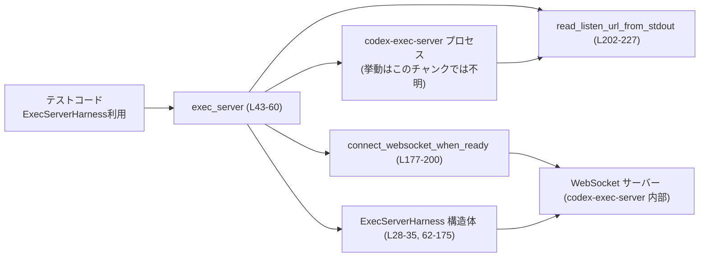
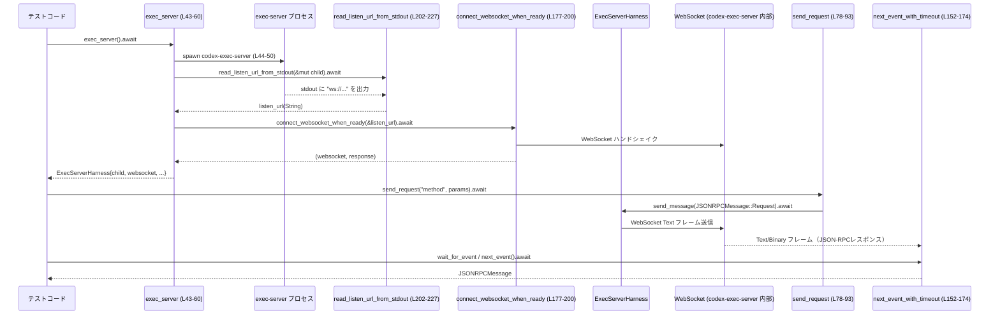

exec-server/tests/common/exec_server.rs

---

## 0. ざっくり一言

`codex-exec-server` バイナリをテストから起動し、WebSocket(JSON-RPC) 経由で安全にリクエスト送受信するための **非同期テスト用ハーネス**を提供するモジュールです。  
プロセス起動〜接続待ち〜JSON-RPC 送受信〜タイムアウト管理までを一括で扱います。

---

## 1. このモジュールの役割

### 1.1 概要

- このモジュールは、`codex-exec-server` プロセスをテストコードから起動し、WebSocket 経由で JSON-RPC メッセージをやり取りする問題を解決するために存在します。  
- 主な機能は次の通りです。
  - `codex-exec-server` の起動と待ち受け URL（WebSocket URL）の取得（`exec_server`）  
  - WebSocket 接続の確立・再接続（`connect_websocket_when_ready`, `reconnect_websocket`）  
  - JSON-RPC リクエスト／通知の送信とイベント受信（`send_request`, `send_notification`, `next_event_with_timeout`, `wait_for_event`）  
  - テストタイムアウト（接続／イベント待ち）を一元管理する定数とロジック  

（根拠: `exec-server/tests/common/exec_server.rs:L24-26, L28-35, L43-60, L62-175, L177-227`）

### 1.2 アーキテクチャ内での位置づけ

下図は、このファイル内コンポーネントと外部要素（実行サーバープロセスや WebSocket）との関係を示します。



- テストコードは `exec_server()` を呼び、`ExecServerHarness` を受け取ります（`exec-server/tests/common/exec_server.rs:L43-60`）。
- `exec_server()` は `codex-exec-server` をサブプロセスとして起動し、その標準出力から WebSocket の listen URL を読み取ります（`read_listen_url_from_stdout`、`L202-227`）。
- 取得した URL に対して WebSocket 接続を確立するまで `connect_websocket_when_ready` でリトライします（`L177-200`）。
- `ExecServerHarness` は WebSocket と子プロセスのハンドルを保持し、JSON-RPC 送受信・再接続・シャットダウンを提供します（`L28-35, L62-175`）。

### 1.3 設計上のポイント

- **責務の分割**（根拠付き）
  - プロセス起動と初期接続は `exec_server` が担当（`L43-60`）。
  - WebSocket 接続のリトライは `connect_websocket_when_ready` に分離（`L177-200`）。
  - listen URL の読み取りは `read_listen_url_from_stdout` に分離（`L202-227`）。
  - 実際のテスト操作（送信・受信・再接続）は `ExecServerHarness` メソッドが担当（`L62-175`）。
- **状態管理**
  - `ExecServerHarness` は子プロセス(`Child`)、WebSocket ストリーム、URL、次の JSON-RPC リクエスト ID を内部状態として保持します（`L28-35`）。
  - メソッドはすべて `&mut self` を受け取るため、1 つのハーネスを同時に複数タスクから使用しない設計になっています（Rust の可変参照により排他的アクセスが保証されます）。
- **クリーンアップ**
  - `Drop` 実装で `child.start_kill()` を呼び、テスト終了時にサーバープロセスが残らないようにしています（`L37-40`）。
- **エラーハンドリング**
  - すべての非同期操作は `anyhow::Result` でラップされ、`?` 演算子で詳細エラーを伝播します（`L43-60, L67-76, L78-105, L107-116, L118-144, L146-174, L177-227`）。
  - 接続タイムアウト・イベント待ちタイムアウト・標準出力のクローズなど、代表的な失敗ケースごとにエラーメッセージが定義されています（`L129-131, L159-160, L169, L188-197, L213-215, L219-221`）。
- **並行性**
  - すべての I/O は Tokio ベースの非同期処理 (`tokio::process::Child`, `tokio_tungstenite`, `tokio::time::timeout`) を用いており、テスト中でもスレッドをブロックしません（`L16-22, L18-20, L157-160, L185-196, L218-220`）。
  - タイムアウト値（接続 5 秒、イベント待ち 5 秒）が定数として定義されており、テストがハングしないようにしています（`L24-26`）。

---

## 2. 主要な機能一覧

- `exec_server`: `codex-exec-server` を起動し、WebSocket 接続済みの `ExecServerHarness` を返します。
- `ExecServerHarness::send_request`: JSON-RPC リクエストを送信し、その `RequestId` を返します。
- `ExecServerHarness::send_notification`: JSON-RPC 通知（レスポンス不要）を送信します。
- `ExecServerHarness::send_raw_text`: 任意のテキストを WebSocket フレームとして送信します。
- `ExecServerHarness::next_event`: 次の JSON-RPC メッセージを 5 秒以内に待ち、返します。
- `ExecServerHarness::wait_for_event`: 条件に一致する JSON-RPC メッセージが届くまで、最大 5 秒間待ちます。
- `ExecServerHarness::disconnect_websocket`: 現在の WebSocket セッションをクローズします。
- `ExecServerHarness::reconnect_websocket`: 保持している URL に再度接続し直します。
- `ExecServerHarness::shutdown`: 子プロセスに kill を開始します。
- `connect_websocket_when_ready`: 一時的な接続拒否(`ConnectionRefused`)をリトライしつつ、WebSocket 接続を確立します。
- `read_listen_url_from_stdout`: サーバープロセスの標準出力から `ws://` で始まる listen URL を、タイムアウトつきで取得します。

（根拠: `exec-server/tests/common/exec_server.rs:L24-26, L43-60, L62-175, L177-227`）

---

## 3. 公開 API と詳細解説

### 3.0 コンポーネントインベントリー

このチャンクに現れる構造体・関数の一覧です。

| 名前 | 種別 | 非同期 | 公開性 | 概要 | 根拠 |
|------|------|--------|--------|------|------|
| `CONNECT_TIMEOUT` | 定数 | - | `const` | 接続・URL 読み取りの総タイムアウト（5 秒） | `exec-server/tests/common/exec_server.rs:L24` |
| `CONNECT_RETRY_INTERVAL` | 定数 | - | `const` | WebSocket 接続リトライ間隔（25 ミリ秒） | `exec-server/tests/common/exec_server.rs:L25` |
| `EVENT_TIMEOUT` | 定数 | - | `const` | イベント待ちタイムアウト（5 秒） | `exec-server/tests/common/exec_server.rs:L26` |
| `ExecServerHarness` | 構造体 | - | `pub(crate)` | 子プロセスと WebSocket をまとめたテスト用ハーネス | `exec-server/tests/common/exec_server.rs:L28-35` |
| `impl Drop for ExecServerHarness` | Drop 実装 | - | - | Drop 時に子プロセスを kill 開始 | `exec-server/tests/common/exec_server.rs:L37-40` |
| `exec_server` | 関数 | async | `pub(crate)` | プロセス起動＋URL 取得＋接続＋ハーネス作成 | `exec-server/tests/common/exec_server.rs:L43-60` |
| `ExecServerHarness::websocket_url` | メソッド | sync | `pub(crate)` | 現在の WebSocket URL を返す | `exec-server/tests/common/exec_server.rs:L62-65` |
| `ExecServerHarness::disconnect_websocket` | メソッド | async | `pub(crate)` | WebSocket をクローズ | `exec-server/tests/common/exec_server.rs:L67-70` |
| `ExecServerHarness::reconnect_websocket` | メソッド | async | `pub(crate)` | URL に再接続し `websocket` を差し替え | `exec-server/tests/common/exec_server.rs:L72-76` |
| `ExecServerHarness::send_request` | メソッド | async | `pub(crate)` | JSON-RPC リクエスト送信＋ID 採番 | `exec-server/tests/common/exec_server.rs:L78-93` |
| `ExecServerHarness::send_notification` | メソッド | async | `pub(crate)` | JSON-RPC 通知送信 | `exec-server/tests/common/exec_server.rs:L95-105` |
| `ExecServerHarness::send_raw_text` | メソッド | async | `pub(crate)` | 任意テキストを WebSocket Text フレームで送信 | `exec-server/tests/common/exec_server.rs:L107-112` |
| `ExecServerHarness::next_event` | メソッド | async | `pub(crate)` | 次の JSON-RPC メッセージを 5 秒以内に取得 | `exec-server/tests/common/exec_server.rs:L114-116` |
| `ExecServerHarness::wait_for_event` | メソッド | async | `pub(crate)` | 条件に合うイベントを 5 秒以内に待つ | `exec-server/tests/common/exec_server.rs:L118-139` |
| `ExecServerHarness::shutdown` | メソッド | async | `pub(crate)` | 子プロセスに kill 開始を指示 | `exec-server/tests/common/exec_server.rs:L141-144` |
| `ExecServerHarness::send_message` | メソッド | async | 非公開 | JSON-RPC メッセージを JSON 文字列化して送信 | `exec-server/tests/common/exec_server.rs:L146-150` |
| `ExecServerHarness::next_event_with_timeout` | メソッド | async | 非公開 | 指定タイムアウト内で JSON-RPC メッセージを 1 件取得 | `exec-server/tests/common/exec_server.rs:L152-174` |
| `connect_websocket_when_ready` | 関数 | async | 非公開 | `ConnectionRefused` をリトライしつつ WebSocket 接続 | `exec-server/tests/common/exec_server.rs:L177-200` |
| `read_listen_url_from_stdout` | 関数 | async | 非公開 | 子プロセス stdout から `ws://` URL を取得 | `exec-server/tests/common/exec_server.rs:L202-227` |

---

### 3.1 型一覧（構造体）

| 名前 | 種別 | フィールド | 役割 / 用途 | 根拠 |
|------|------|------------|-------------|------|
| `ExecServerHarness` | 構造体 | `child: Child`, `websocket_url: String`, `websocket: WebSocketStream<...>`, `next_request_id: i64` | テスト中に利用する exec-server プロセスと WebSocket のハンドル、および JSON-RPC リクエスト ID カウンタを保持します。 | `exec-server/tests/common/exec_server.rs:L28-35` |

- `Drop` 実装により、インスタンス破棄時に `child.start_kill()` が呼ばれます（`exec-server/tests/common/exec_server.rs:L37-40`）。  
  これにより、テスト終了時にプロセスが孤立して残り続けることを防ぎます。

---

### 3.2 関数詳細（重要な 7 件）

#### `exec_server() -> anyhow::Result<ExecServerHarness>`

**定義**: `exec-server/tests/common/exec_server.rs:L43-60`

**概要**

- `codex-exec-server` バイナリを起動し、その標準出力から WebSocket の listen URL を取得した上で、WebSocket 接続を確立し、`ExecServerHarness` を返すファクトリ関数です。  
- すべて非同期で行われ、失敗時は `anyhow::Error` で理由を返します。

**引数**

- なし。

**戻り値**

- `Ok(ExecServerHarness)`: 正常にプロセスを起動し、WebSocket 接続を確立できた場合のハーネス。
- `Err(anyhow::Error)`: バイナリ未検出、プロセス起動失敗、URL 取得失敗、WebSocket 接続失敗など、いずれかの段階でエラーが発生した場合。

**内部処理の流れ**

1. `cargo_bin("codex-exec-server")` でテストビルド済みバイナリのパスを取得（`L44`）。
2. `tokio::process::Command` で子プロセスを生成し、`--listen ws://127.0.0.1:0` を指定してランダムポートで WebSocket 待ち受けするように起動設定（`L45-49`）。
3. 標準入力を `null`、標準出力を `piped`、標準エラーを `inherit` に設定（`L47-49`）。
4. `child.spawn()?` で非同期子プロセスを起動（`L50`）。
5. `read_listen_url_from_stdout(&mut child).await?` で stdout から `ws://` で始まる listen URL を取得（`L52`）。
6. `connect_websocket_when_ready(&websocket_url).await?` で WebSocket 接続を確立（`L53`）。
7. `ExecServerHarness` インスタンスを生成し、`next_request_id: 1` で初期化して返す（`L54-59`）。

**Examples（使用例）**

```rust
// テスト内での基本的な利用例
#[tokio::test]
async fn test_something() -> anyhow::Result<()> {
    // exec-server を起動してハーネスを取得する
    let mut harness = exec_server().await?; // プロセス起動 + 接続

    // harnessを使ってJSON-RPCリクエスト送信等を行う
    // ...

    Ok(())
}
```

**Errors / Panics**

- `cargo_bin("codex-exec-server")` が失敗した場合（バイナリ未ビルド等）、`?` により `Err` が返されます（`L44`）。
- `child.spawn()?` で OS レベルのプロセス起動に失敗すると `Err` になります（`L50`）。
- `read_listen_url_from_stdout` が以下のいずれかで失敗すると `Err` になります（詳細は同関数の節を参照）。
  - 標準出力を取得できない。
  - タイムアウトまでに URL が出力されない。
  - stdout が URL 出力前に閉じられる。
- `connect_websocket_when_ready` が接続確立に失敗した場合も `Err` を返します（`L53`）。
- panic を起こすコードは含まれていません（`expect` や `unwrap` 等は使用していません）。

**Edge cases（エッジケース）**

- exec-server が listen URL を出力しない／形式が `ws://` で始まらない場合:
  - `read_listen_url_from_stdout` 内でタイムアウトエラーになります（`L211-215`）。
- バイナリが存在しない場合:
  - `cargo_bin` がエラーを返し、そのまま `Err` として伝播します（`L44`）。
- サーバープロセスが起動直後に異常終了した場合:
  - URL が取得できず、`read_listen_url_from_stdout` で stdout クローズとして検出され、エラーになります（`L219-221`）。

**使用上の注意点**

- Tokio ランタイム内（`#[tokio::test]` や `#[tokio::main]`）で利用する必要があります。
- 戻り値の `ExecServerHarness` は `Drop` 実装によりプロセス kill を試みるため、テスト中に意図せず早くスコープを抜けると exec-server が停止します。
- 長時間の接続が必要な場合でも、初期接続完了までは `CONNECT_TIMEOUT`（5 秒）を超えて待つことはありません（`L24, L183`）。

---

#### `ExecServerHarness::send_request(&mut self, method: &str, params: serde_json::Value) -> anyhow::Result<RequestId>`

**定義**: `exec-server/tests/common/exec_server.rs:L78-93`

**概要**

- JSON-RPC リクエストメッセージを生成し、WebSocket 経由で送信します。  
- 内部カウンタから `RequestId` を採番し、それを返します。レスポンスとの対応付けに利用できます。

**引数**

| 引数名 | 型 | 説明 |
|--------|----|------|
| `&mut self` | `&mut ExecServerHarness` | ハーネス本体への可変参照。送信時に内部状態 (`next_request_id`) を更新します。 |
| `method` | `&str` | JSON-RPC メソッド名。`String` にクローンされます（`L81, L87`）。 |
| `params` | `serde_json::Value` | JSON-RPC パラメータ。`Some(params)` としてそのまま使用されます（`L88`）。 |

**戻り値**

- `Ok(RequestId)`: 送信に成功した場合、割り当て済みの `RequestId::Integer` を返します（`L83-84, L92`）。
- `Err(anyhow::Error)`: シリアライズ／送信いずれかの段階でエラーが発生した場合。

**内部処理の流れ**

1. 現在の `next_request_id` から `RequestId::Integer` を作成（`L83`）。
2. `next_request_id` を 1 増やす（`L84`）。
3. `JSONRPCRequest` 構造体を作成し、`JSONRPCMessage::Request` でラップ（`L85-90`）。
4. `send_message` で JSON にシリアライズして WebSocket 送信（`L85, L146-150`）。
5. エラーがなければ採番した `id` を返す（`L92`）。

**Examples（使用例）**

```rust
use serde_json::json;
use codex_app_server_protocol::JSONRPCMessage;

async fn send_example(harness: &mut ExecServerHarness) -> anyhow::Result<()> {
    // "exec.run" メソッドでコマンドを実行するリクエストを送信
    let id = harness
        .send_request(
            "exec.run",
            json!({ "cmd": "echo", "args": ["hello"] }),
        )
        .await?;

    // あとは wait_for_event などで、この id に対応するレスポンスを待つ
    // ...

    Ok(())
}
```

**Errors / Panics**

- `serde_json::to_string(&message)?` がエラーを返す場合（非シリアライズ可能な値など）、`Err` が返ります（`L146-148`）。
- `self.websocket.send(...).await?` が WebSocket の送信エラーを返す場合（接続切断など）、`Err` となります（`L148`）。
- panic するコードは含まれていません。

**Edge cases（エッジケース）**

- `params` に巨大な JSON を渡した場合:
  - 送信自体は試みられますが、シリアライズ・ネットワーク送信のコストが増大します（パフォーマンス上の注意）。
- WebSocket がすでにクローズされている場合:
  - `send` 呼び出しでエラーになり、`Err` が返ります（`L148`）。

**使用上の注意点**

- `&mut self` を要求するため、同じハーネスを複数タスクから同時に送信に使うことはできません（所有権／借用ルールによりコンパイルエラーになります）。
- `RequestId` を使ってレスポンスを紐づけたい場合は、呼び出し側で ID を保存し、`wait_for_event` などでフィルタする必要があります（レスポンスの処理はこのモジュール内には実装がありません）。

---

#### `ExecServerHarness::send_notification(&mut self, method: &str, params: serde_json::Value) -> anyhow::Result<()>`

**定義**: `exec-server/tests/common/exec_server.rs:L95-105`

**概要**

- JSON-RPC 通知メッセージ（`id` を持たないメッセージ）を生成し、WebSocket 経由で送信します。  
- レスポンスを期待しない片方向メッセージ送信に利用します。

**引数**

| 引数名 | 型 | 説明 |
|--------|----|------|
| `&mut self` | `&mut ExecServerHarness` | ハーネス本体 |
| `method` | `&str` | 通知メソッド名 |
| `params` | `serde_json::Value` | 通知パラメータ |

**戻り値**

- `Ok(())`: 正常に送信できた場合。
- `Err(anyhow::Error)`: シリアライズまたは WebSocket 送信に失敗した場合。

**内部処理の流れ**

1. `JSONRPCNotification` 構造体を作成し、`JSONRPCMessage::Notification` に変換（`L100-103`）。
2. `send_message` を呼び出して JSON 文字列化し、送信（`L100-105, L146-150`）。

**Examples（使用例）**

```rust
use serde_json::json;

async fn notify_example(harness: &mut ExecServerHarness) -> anyhow::Result<()> {
    harness
        .send_notification(
            "exec.cancel",
            json!({ "request_id": 42 }),
        )
        .await?;
    Ok(())
}
```

**Errors / Panics**

- `send_message` と同様、シリアライズ／送信の失敗はすべて `Err` で返されます。
- このメソッド自体に panic 要素はありません。

**Edge cases**

- サーバー側が通知をサポートしていない場合:
  - 送信自体は成功しますが、サーバー側の挙動はこのチャンクからは不明です（プロトコルの詳細は `codex_app_server_protocol` クレート側で定義されており、このチャンクには現れません）。

**使用上の注意点**

- 通知には `RequestId` が無いので、後続の処理で特定のレスポンスを待つといったことはできません。
- 多数の通知を高速に連続送信する場合、サーバー側のキュー処理能力に注意する必要があります（テスト環境での負荷に留意）。

---

#### `ExecServerHarness::wait_for_event<F>(&mut self, mut predicate: F) -> anyhow::Result<JSONRPCMessage> where F: FnMut(&JSONRPCMessage) -> bool`

**定義**: `exec-server/tests/common/exec_server.rs:L118-139`

**概要**

- WebSocket 上の JSON-RPC メッセージを順に受信し、与えられた条件関数 `predicate` を満たす最初のメッセージを返します。  
- 全体の待ち時間は `EVENT_TIMEOUT`（5 秒）に制限されます。

**引数**

| 引数名 | 型 | 説明 |
|--------|----|------|
| `&mut self` | `&mut ExecServerHarness` | ハーネス本体 |
| `predicate` | `F` where `F: FnMut(&JSONRPCMessage) -> bool` | 目的のイベントかどうかを判定する述語関数 |

**戻り値**

- `Ok(JSONRPCMessage)`: タイムアウト前に `predicate` を満たしたイベントを受信した場合の、そのメッセージ。
- `Err(anyhow::Error)`: タイムアウト、WebSocket エラー、JSON パースエラーなど。

**内部処理の流れ**

1. `deadline = Instant::now() + EVENT_TIMEOUT` を計算（`L125`）。
2. 無限ループ内で現在時刻 `now` を取得し、`now >= deadline` ならタイムアウトエラーを返す（`L127-132`）。
3. `remaining = deadline.duration_since(now)` を計算し、その残り時間で `next_event_with_timeout(remaining)` を呼び出す（`L133-134`）。
4. 取得した `event` に対して `predicate(&event)` を実行し、`true` なら `Ok(event)` で返す（`L135-137`）。
5. `false` の場合は再びループして次のイベントを待ちます（タイムアウトまで繰り返し）。

**Examples（使用例）**

```rust
use codex_app_server_protocol::JSONRPCMessage;

async fn wait_for_response_with_id(
    harness: &mut ExecServerHarness,
    expected_id: RequestId,
) -> anyhow::Result<JSONRPCMessage> {
    harness
        .wait_for_event(|msg| matches!(msg, JSONRPCMessage::Response(resp) if resp.id == expected_id))
        .await
}
```

**Errors / Panics**

- タイムアウト:
  - `EVENT_TIMEOUT` 内に `predicate` を満たすイベントが来なかった場合、  
    `"timed out waiting for matching exec-server event after {EVENT_TIMEOUT:?}"` というメッセージで `Err` を返します（`L129-131`）。
- `next_event_with_timeout` が返すエラーはすべてそのまま伝播します。
  - WebSocket 側のタイムアウト（`L157-160`）。
  - WebSocket クローズ（`L160, L169`）。
  - JSON パースエラー（`L164-167`）。
- 自身は panic しません。

**Edge cases**

- 目的のイベントより先に他のイベントが届く場合:
  - それらも `next_event_with_timeout` で読み出されますが、`predicate` が `false` を返したイベントは破棄されます（`L133-138`）。  
    テスト設計上、イベントの順序を意識する必要があります。
- WebSocket がクローズされた後に呼び出した場合:
  - `next_event_with_timeout` 内の `ok_or_else(|| anyhow!("exec-server websocket closed"))??` により、即座にエラーになります（`L160`）。

**使用上の注意点**

- 述語 `predicate` は軽量であることが望ましいです。重い処理を行うと受信ループ全体がブロックされます。
- タイムアウト後に再度呼び出す場合、前回までに消費されたイベントは復元されません。テスト側で必要なイベントを取り逃がさないよう、述語条件を慎重に設計する必要があります。

---

#### `ExecServerHarness::next_event_with_timeout(&mut self, timeout_duration: Duration) -> anyhow::Result<JSONRPCMessage>`

**定義**: `exec-server/tests/common/exec_server.rs:L152-174`

**概要**

- 指定された `timeout_duration` の間 WebSocket からフレームを読み取り、最初に得られた JSON-RPC メッセージ（Text/Binary）をデコードして返します。  
- Ping/Pong フレームなど JSON-RPC メッセージでないものはスキップします。

**引数**

| 引数名 | 型 | 説明 |
|--------|----|------|
| `&mut self` | `&mut ExecServerHarness` | ハーネス本体 |
| `timeout_duration` | `Duration` | この一回の受信処理に許容される最大時間 |

**戻り値**

- `Ok(JSONRPCMessage)`: タイムアウト前に JSON-RPC メッセージを受信できた場合。
- `Err(anyhow::Error)`: タイムアウト、接続クローズ、JSON パースエラーなど。

**内部処理の流れ**

1. 無限ループに入る（`L156`）。
2. `timeout(timeout_duration, self.websocket.next())` で、次の WebSocket フレームを指定時間内に取得（`L157-159`）。
   - タイムアウトした場合は `"timed out waiting for exec-server websocket event"` メッセージで `Err`（`L159`）。
   - `self.websocket.next()` が `None` を返した場合は `"exec-server websocket closed"` で `Err`（`L160`）。
3. 得られた `frame` を `match`（`L162`以降）。
   - `Message::Text(text)`: `serde_json::from_str(text.as_ref())?` で JSON-RPC メッセージにデコードして返す（`L163-165`）。
   - `Message::Binary(bytes)`: `serde_json::from_slice(bytes.as_ref())?` でデコードして返す（`L166-167`）。
   - `Message::Close(_)`: `"exec-server websocket closed"` として `Err`（`L169`）。
   - `Message::Ping(_)` / `Message::Pong(_)`: 何もせずループ継続（`L170`）。
   - その他は無視してループ継続（`L171-172`）。

**Examples（使用例）**

通常は `next_event` や `wait_for_event` 経由で使われるので、直接利用する場合はタイムアウト値を指定します。

```rust
use std::time::Duration;

async fn read_one(harness: &mut ExecServerHarness) -> anyhow::Result<JSONRPCMessage> {
    // 1秒だけ待ってイベントをひとつ読む
    harness.next_event_with_timeout(Duration::from_secs(1)).await
}
```

**Errors / Panics**

- タイムアウト (`tokio::time::timeout` が `Err` を返すケース):
  - `"timed out waiting for exec-server websocket event"` で `Err`（`L159`）。
- WebSocket クローズ:
  - `self.websocket.next()` が `None` → `"exec-server websocket closed"`（`L160`）。
  - `Message::Close(_)` を受信 → 同じく `"exec-server websocket closed"`（`L169`）。
- JSON パースエラー:
  - `serde_json::from_str` / `from_slice` がエラーを返すと `anyhow::Error` として伝播（`L164-167`）。
- panic を起こすコードは含まれていません。

**Edge cases**

- サーバーが Text ではなく Binary で JSON を送ってくる場合:
  - `Message::Binary` 分岐で問題なく処理されます（`L166-167`）。
- サーバーが Ping/Pong のみ送ってくる場合:
  - それらはスキップされるため、タイムアウトまで JSON-RPC メッセージを待ち続けます（`L170`）。

**使用上の注意点**

- `timeout_duration` はこの呼び出し 1 回分のタイムアウトです。`wait_for_event` など、複数回呼び出す場合は外側で総時間を管理しています（`L125-134`）。
- JSON-RPC メッセージ以外のフレームも読むため、「メッセージが来ていないように見えても、実際には Ping/Pong や Close フレームが来ている」という状況があり得ます。

---

#### `connect_websocket_when_ready(websocket_url: &str) -> anyhow::Result<(WebSocketStream<...>, Response)>`

**定義**: `exec-server/tests/common/exec_server.rs:L177-200`

**概要**

- 指定された `websocket_url` への WebSocket 接続を試み、一時的な接続拒否（`ConnectionRefused`）の場合は短時間ディレイを挟んでリトライします。  
- 総待ち時間は `CONNECT_TIMEOUT`（5 秒）で制限されます。

**引数**

| 引数名 | 型 | 説明 |
|--------|----|------|
| `websocket_url` | `&str` | `ws://` 形式の WebSocket URL |

**戻り値**

- `Ok((WebSocketStream<...>, Response))`: 接続確立に成功した場合の WebSocket ストリームとハンドシェイクレスポンス。
- `Err(anyhow::Error)`: タイムアウトまでに接続できなかった、もしくは `ConnectionRefused` 以外のエラーが発生した場合。

**内部処理の流れ**

1. `deadline = Instant::now() + CONNECT_TIMEOUT` を計算（`L183`）。
2. 無限ループで `connect_async(websocket_url).await` を試みる（`L185`）。
3. 成功した場合はそのまま `Ok(websocket)` を返す（`L186`）。
4. `Err(err)` の場合:
   - `err` が `tungstenite::Error::Io(io_err)` で、`io_err.kind() == ErrorKind::ConnectionRefused` かつ `Instant::now() < deadline` なら、`sleep(CONNECT_RETRY_INTERVAL).await` してリトライ（`L187-196`）。
   - それ以外の場合（タイムオーバーまたは別種のエラー）は、`Err(err.into())` として返す（`L197`）。

**Examples（使用例）**

通常は `exec_server` の中から使われますが、直接使うとすれば次のような形です。

```rust
async fn reconnect_example(url: &str) -> anyhow::Result<()> {
    let (ws, _response) = connect_websocket_when_ready(url).await?;
    // ws を使って通信する...
    Ok(())
}
```

**Errors / Panics**

- `connect_async` が永続的に `ConnectionRefused` を返し、`CONNECT_TIMEOUT` を超えたタイミングで再度エラーとなると、そのエラーをそのまま `Err` として返します（`L187-197`）。
- `ConnectionRefused` 以外のエラー（DNS 解決失敗など）は即座に `Err` で返します（`L187-193, L197`）。
- panic 要素はありません。

**Edge cases**

- サーバーが listen を開始する前にこの関数を呼んだ場合:
  - 接続が拒否され続けますが、`CONNECT_TIMEOUT` の範囲でリトライを行います（`L187-196`）。
- URL が不正で `connect_async` が別種のエラーを返す場合:
  - リトライせず、すぐにエラーとして返します（`L187-193, L197`）。

**使用上の注意点**

- あくまで `ConnectionRefused` のみを「起動待ち」とみなしてリトライしています。それ以外のエラーは環境設定ミスなどを示す可能性が高いため、即座に失敗させる設計です。
- `CONNECT_TIMEOUT` を超えてリトライを続けることはありません。

---

#### `read_listen_url_from_stdout(child: &mut Child) -> anyhow::Result<String>`

**定義**: `exec-server/tests/common/exec_server.rs:L202-227`

**概要**

- exec-server 子プロセスの標準出力を、行単位で非同期に読み取り、最初に現れた `ws://` で始まる文字列を listen URL として返します。  
- 読み取り全体には `CONNECT_TIMEOUT`（5 秒）の制限があり、時間内に URL を検出できない場合はエラーを返します。

**引数**

| 引数名 | 型 | 説明 |
|--------|----|------|
| `child` | `&mut Child` | exec-server 子プロセス。`stdout` を `take()` するため、以降 stdout はこの関数が専有します。 |

**戻り値**

- `Ok(String)`: `ws://` で始まる URL を検出できた場合、その文字列。
- `Err(anyhow::Error)`: stdout が取得できない、タイムアウト、stdout クローズなどの失敗。

**内部処理の流れ**

1. `child.stdout.take()` で標準出力を取得。`None` の場合は `"failed to capture exec-server stdout"` エラー（`L203-207`）。
2. `BufReader::new(stdout).lines()` から非同期行ストリームを生成（`L207`）。
3. `deadline = Instant::now() + CONNECT_TIMEOUT` を計算（`L208`）。
4. 無限ループで以下を繰り返し（`L210`）:
   - 現在時刻を取得し、`now >= deadline` なら `"timed out waiting for exec-server listen URL on stdout after {CONNECT_TIMEOUT:?}"` エラー（`L211-215`）。
   - 残り時間 `remaining` を計算（`L217`）。
   - `timeout(remaining, lines.next_line()).await` で 1 行読み取り（`L218-220`）。
     - タイムアウトなら `"timed out waiting for exec-server stdout"` エラー（`L219-220`）。
     - `next_line()` が `Ok(None)`（EOF）なら `"exec-server stdout closed before emitting listen URL"` エラー（`L221`）。
   - 読み取った行を `trim()` して `listen_url` とし、`starts_with("ws://")` なら `Ok(listen_url.to_string())` で返す（`L222-225`）。
   - そうでなければ次の行へ（ログなどを読み飛ばす）。

**Examples（使用例）**

通常は `exec_server` 内から呼ばれるため、テストコードで直接使うことは想定されていませんが、概念的には以下のように振る舞います。

```rust
async fn read_url_example(child: &mut Child) -> anyhow::Result<String> {
    let url = read_listen_url_from_stdout(child).await?;
    assert!(url.starts_with("ws://"));
    Ok(url)
}
```

**Errors / Panics**

- stdout 取得失敗:
  - `child.stdout.take()` が `None` の場合、 `"failed to capture exec-server stdout"` としてエラー（`L203-207`）。
- URL 読み取りタイムアウト:
  - 総時間が `CONNECT_TIMEOUT` を超えた場合、 `"timed out waiting for exec-server listen URL on stdout after {CONNECT_TIMEOUT:?}"`（`L211-215`）。
- 行読み取りの 1 回ごとのタイムアウト:
  - `timeout(remaining, lines.next_line())` がタイムアウトで `"timed out waiting for exec-server stdout"`（`L219-220`）。
- stdout クローズ:
  - `next_line()` が `Ok(None)` の場合、 `"exec-server stdout closed before emitting listen URL"`（`L221`）。
- panic は含まれていません。

**Edge cases**

- サーバーが複数行のログを出力してから URL を出す場合:
  - `starts_with("ws://")` に一致する行が出るまでログを読み飛ばします（`L222-225`）。
- URL が `wss://` など別スキームで出力される場合:
  - `starts_with("ws://")` のチェックに引っかからず、最終的にタイムアウトエラーになる可能性があります。

**使用上の注意点**

- 一度 `stdout.take()` した後は、他の場所では stdout を読めません。この関数が stdout を独占します。
- exec-server バイナリが URL 出力フォーマットを変更した場合（例えば JSON ログ形式にするなど）、この関数も合わせて修正する必要があります。

---

### 3.3 その他の関数・メソッド一覧

主要なもの以外のメソッド・関数の役割を簡単にまとめます。

| 名前 | 役割（1 行） | 根拠 |
|------|--------------|------|
| `ExecServerHarness::websocket_url(&self)` | 現在接続している WebSocket の URL を返すアクセサです。 | `exec-server/tests/common/exec_server.rs:L62-65` |
| `ExecServerHarness::disconnect_websocket(&mut self)` | WebSocket にクローズフレームを送り、切断します。 | `exec-server/tests/common/exec_server.rs:L67-70` |
| `ExecServerHarness::reconnect_websocket(&mut self)` | 記録済み URL に対し `connect_websocket_when_ready` を呼び直し、`self.websocket` を差し替えます。 | `exec-server/tests/common/exec_server.rs:L72-76` |
| `ExecServerHarness::send_raw_text(&mut self, text: &str)` | JSON 以外の任意テキストを WebSocket の Text フレームとして送信します。 | `exec-server/tests/common/exec_server.rs:L107-112` |
| `ExecServerHarness::next_event(&mut self)` | `next_event_with_timeout(EVENT_TIMEOUT)` を呼ぶ便利メソッドです。 | `exec-server/tests/common/exec_server.rs:L114-116` |
| `ExecServerHarness::shutdown(&mut self)` | 明示的に子プロセスに `start_kill()` を発行します。 | `exec-server/tests/common/exec_server.rs:L141-144` |
| `ExecServerHarness::send_message(&mut self, message: JSONRPCMessage)` | JSONRPCMessage を JSON 文字列にエンコードして WebSocket 経由で送信する内部ヘルパーです。 | `exec-server/tests/common/exec_server.rs:L146-150` |

---

## 4. データフロー

ここでは、典型的なテストシナリオ（exec-server 起動→リクエスト送信→レスポンス受信）のデータフローを示します。

### 4.1 シーケンス概要

1. テストコードが `exec_server()` を呼び、ハーネスを取得します（`L43-60`）。
2. `exec_server()` は `read_listen_url_from_stdout` で WebSocket URL を取得し（`L52, L202-227`）、`connect_websocket_when_ready` で接続します（`L53, L177-200`）。
3. テストコードは `send_request` を使って JSON-RPC リクエストを送信します（`L78-93`）。
4. `ExecServerHarness` は内部で `send_message` → WebSocket に JSON テキストフレーム送信を行います（`L146-150`）。
5. サーバーからのレスポンスは WebSocket フレームとして届き、`next_event_with_timeout` / `wait_for_event` で JSON-RPC メッセージに復元されます（`L152-174, L118-139`）。

### 4.2 Sequence diagram



---

## 5. 使い方（How to Use）

### 5.1 基本的な使用方法

典型的なテストコードの流れを示します。

```rust
use anyhow::Result;
use serde_json::json;
use codex_app_server_protocol::JSONRPCMessage;

#[tokio::test]
async fn integration_exec_server() -> Result<()> {
    // 1. exec-server を起動し、WebSocket に接続したハーネスを取得する
    let mut harness = exec_server().await?; // L43-60

    // 2. JSON-RPC リクエストを送信する
    let request_id = harness
        .send_request(
            "exec.run",                         // 呼びたいメソッド名
            json!({ "cmd": "echo", "args": ["hi"] }), // パラメータ
        )
        .await?;                               // L78-93

    // 3. レスポンスを待つ（例: 指定IDのレスポンスを待機）
    let response_msg = harness
        .wait_for_event(|msg| match msg {      // L118-139
            JSONRPCMessage::Response(resp) => resp.id == request_id,
            _ => false,
        })
        .await?;

    // 4. レスポンス内容を検証する（詳細はプロトコル仕様に依存し、このチャンクには現れません）

    // 5. 明示的にシャットダウンしてもよいし、スコープを抜けて Drop に任せてもよい
    harness.shutdown().await?;                 // L141-144

    Ok(())
}
```

### 5.2 よくある使用パターン

1. **通知で状態変更を要求し、イベントで確認する**

```rust
use serde_json::json;
use codex_app_server_protocol::JSONRPCMessage;

async fn notify_and_wait(harness: &mut ExecServerHarness) -> anyhow::Result<()> {
    // 状態変更の通知を送る
    harness
        .send_notification("exec.set_mode", json!({ "mode": "verbose" })) // L95-105
        .await?;

    // 状態変更完了を示すイベントを 5 秒以内に待つ
    let _event = harness
        .wait_for_event(|msg| matches!(msg, JSONRPCMessage::Notification(n) if n.method == "exec.mode_changed"))
        .await?;

    Ok(())
}
```

1. **WebSocket を一度切断し、再接続する**

```rust
async fn reconnect_example(mut harness: ExecServerHarness) -> anyhow::Result<()> {
    // 接続を一旦切断
    harness.disconnect_websocket().await?;           // L67-70

    // 再接続
    harness.reconnect_websocket().await?;            // L72-76

    // 再接続後も通常通り send_request 等を利用できる
    Ok(())
}
```

1. **生の JSON テキストを送って挙動を確認する**

```rust
async fn send_raw_json(harness: &mut ExecServerHarness) -> anyhow::Result<()> {
    let raw = r#"{"jsonrpc":"2.0","method":"exec.ping","params":null}"#;
    harness.send_raw_text(raw).await?;               // L107-112
    Ok(())
}
```

### 5.3 よくある間違い

```rust
// 間違い例: Tokio ランタイム外で async 関数を呼ぶ
// fn test_invalid() {
//     let mut harness = exec_server().await.unwrap(); // コンパイルエラー or ランタイムエラー
// }

// 正しい例: #[tokio::test] などの非同期コンテキストで await する
#[tokio::test]
async fn test_valid() -> anyhow::Result<()> {
    let mut harness = exec_server().await?;
    Ok(())
}
```

```rust
// 間違い例: &self ではなく &mut self が必要なメソッドを共有参照で使おうとする
async fn wrong_usage(h1: &ExecServerHarness) {
    // h1.send_request("x", serde_json::Value::Null).await.unwrap();
    // ^ コンパイルエラー: &mut self が必要
}

// 正しい例: &mut self を取得し、競合しないように1つのタスクでハーネスを扱う
async fn correct_usage(h1: &mut ExecServerHarness) -> anyhow::Result<()> {
    let _ = h1.next_event().await?;
    Ok(())
}
```

### 5.4 使用上の注意点（まとめ）

- **非同期コンテキスト必須**
  - すべての主要関数・メソッド（`exec_server`, `send_request`, `wait_for_event` など）は `async` です。Tokio ランタイム内で `.await` する必要があります（`L16-20, L43-60, L67-76, L78-105, L107-116, L118-144, L177-227`）。
- **タイムアウトの挙動**
  - WebSocket 接続: `CONNECT_TIMEOUT`（5 秒）以内に成功しないとエラー（`L24, L183-197`）。
  - listen URL 読み取り: 同じく 5 秒以内に `ws://` 行が出ないとエラー（`L24, L208-215`）。
  - イベント待ち: `EVENT_TIMEOUT`（5 秒）を超えて目的のイベントが来ないとエラー（`L26, L125-132, L157-160`）。
- **所有権／借用と並行性**
  - `ExecServerHarness` のメソッドは `&mut self` を取るため、単一タスク（または排他的に管理されたタスク）からの利用が前提です。
  - 複数タスクから共有したい場合は、`Mutex<ExecServerHarness>` 等で明示的に同期を取る必要があります（このファイル内にはそのような構造は含まれていません）。
- **プロセスライフサイクル**
  - `Drop` で `start_kill()` を呼ぶのみで、`wait` はしていません（`L37-40`）。テスト終了時にプロセスが残り続けることは避けられますが、「いつ終了したか」を厳密に待つ設計ではありません。
- **セキュリティ／安全性**
  - 起動するバイナリ名は固定文字列 `"codex-exec-server"` であり、外部から与えられるものではありません（`L44`）。  
    ただし、exec-server 自体がどのようなコマンドを実行するかは別のコンポーネントで定義されており、このチャンクからは分かりません。
- **Bugs の可能性に関する注意**
  - listen URL と WebSocket 接続のタイムアウトは分かりやすいエラーメッセージが付与されていますが（`L129-131, L159, L213-215, L219-221`）、`connect_websocket_when_ready` のタイムアウトは `ConnectionRefused` のまま返るため、呼び出し側でタイムアウトかどうかを直接判定することはできません。

---

## 6. 変更の仕方（How to Modify）

### 6.1 新しい機能を追加する場合

- **新たな送信パターンを追加したい場合**
  1. 既存の `send_request` / `send_notification` / `send_raw_text` を参考に、`ExecServerHarness` の `impl` ブロック内（`L62-175`）にメソッドを追加します。
  2. JSON-RPC 特有の構造が必要な場合は、`codex_app_server_protocol::JSONRPCMessage` のバリアントを利用します（`L7-10`）。
  3. WebSocket 送信には、`send_message`（JSON-RPC）または `self.websocket.send(Message::Text(...))`（生テキスト）を再利用します（`L107-112, L146-150`）。

- **より詳細なイベント待ちロジックを追加したい場合**
  1. `wait_for_event` を参考に、新たなメソッドを `ExecServerHarness` に追加します（`L118-139`）。
  2. 複数条件での待ち合わせや、特定イベントをスキップせず保持したい場合は、`next_event_with_timeout` を直接利用しつつ、テスト側でキューを管理する構造を検討します（`L152-174`）。

### 6.2 既存の機能を変更する場合

- **タイムアウト値を変更したい場合**
  - `CONNECT_TIMEOUT` と `EVENT_TIMEOUT` の値を変更することで全体に影響します（`L24-26`）。
  - その際、エラーメッセージ内の `{CONNECT_TIMEOUT:?}` や `{EVENT_TIMEOUT:?}` は自動的に新しい値を使用します（`L129-131, L213-215`）。

- **listen URL のフォーマットが変わった場合**
  - `read_listen_url_from_stdout` の `starts_with("ws://")` 条件を変更し、新フォーマットに対応させます（`L222-225`）。
  - 変更に伴い、誤った行を URL と扱わないよう、追加の検証（正規表現等）を入れることも検討できます。

- **影響範囲の確認**
  - `exec_server` が `read_listen_url_from_stdout` と `connect_websocket_when_ready` に依存しているため（`L52-53`）、これらを変更すると `exec_server` の挙動全体に影響します。
  - `ExecServerHarness` を利用しているテストコード（このチャンクの外）も合わせて確認する必要があります。

---

## 7. 関連ファイル・クレート

このモジュールと密接に関係する外部コンポーネントをまとめます。

| パス / クレート | 役割 / 関係 |
|-----------------|------------|
| `codex-exec-server` バイナリ | `cargo_bin("codex-exec-server")` で起動される対象バイナリです。具体的なファイルパスや挙動はこのチャンクからは分かりません（`exec-server/tests/common/exec_server.rs:L44`）。 |
| `codex_app_server_protocol` クレート | `JSONRPCMessage`, `JSONRPCRequest`, `JSONRPCNotification`, `RequestId` 型を提供し、本モジュールで JSON-RPC メッセージの表現に利用されています（`L7-10`）。具体的な型定義はこのチャンクには現れません。 |
| `codex_utils_cargo_bin` クレート | `cargo_bin` 関数を提供し、テスト用バイナリのパス解決に使われています（`L11, L44`）。 |
| `tokio`, `tokio_tungstenite`, `futures`, `anyhow` | 非同期 I/O、WebSocket 実装、ストリーム／シンク操作、エラーラップに利用されています（`L12-22, L157-160, L185-196`）。 |

このチャンクは `exec-server/tests/common/exec_server.rs` のみであり、実際のテストケースや exec-server 本体の処理は別ファイルに存在します。それらの詳細は、このチャンクからは分かりません。
