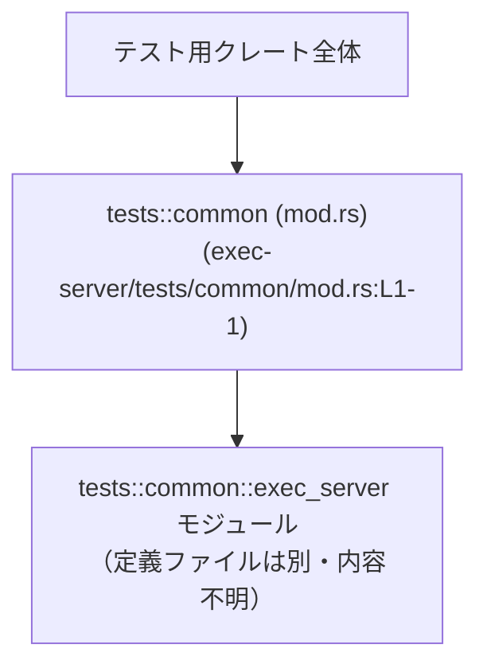

exec-server/tests/common/mod.rs

---

## 0. ざっくり一言

このファイルは、テスト用の共通モジュール `exec_server` をクレート内に公開する、1 行だけのモジュール定義ファイルです（exec-server/tests/common/mod.rs:L1-1）。

---

## 1. このモジュールの役割

### 1.1 概要

- このファイルは、`exec_server` というサブモジュールを宣言し、テスト用クレート内から利用できるようにするための入口になっています（`pub(crate) mod exec_server;`、exec-server/tests/common/mod.rs:L1-1）。
- `exec_server` モジュールの具体的な中身（関数・構造体など）は、このチャンクには含まれていないため不明です。

### 1.2 アーキテクチャ内での位置づけ

このファイルは `tests/common` ディレクトリ配下のモジュールルートとして機能し、その配下の `exec_server` モジュールを参照可能にします。



- `CommonMod` ノードがこのファイルに対応します。
- `ExecServerMod` は `mod exec_server;` 宣言によって読み込まれる別ファイルのモジュールを表しますが、そのファイルは提示されていないため、実装内容は分かりません。

### 1.3 設計上のポイント

- **モジュール分割**  
  - `exec_server` を独立したサブモジュールとして切り出し、`tests/common` 配下からまとめてアクセスできる構造になっています（exec-server/tests/common/mod.rs:L1-1）。
- **可視性制御**  
  - `pub(crate)` を指定することで、このモジュール（正確には `exec_server` サブモジュール）が「同じクレート内からは公開されるが、外部クレートには公開されない」というスコープになっています（exec-server/tests/common/mod.rs:L1-1）。
- **状態・エラー・並行性**  
  - このファイル自身はモジュール宣言のみを含み、関数やデータ構造・非同期処理・スレッドなどのコードは存在しないため、実行時の状態管理・エラーハンドリング・並行性に関する挙動はここからは読み取れません。

---

## 2. 主要な機能一覧

このファイル単体が提供する「機能」は、1 行のモジュール宣言のみです。

- `exec_server` モジュールのクレート内公開: `exec_server` サブモジュールをクレート内から参照できるようにする（exec-server/tests/common/mod.rs:L1-1）

`exec_server` モジュール内部の具体的な機能（テスト用のサーバ起動ヘルパなどが想定されますが、コードがないため断定できません）は、このチャンクには現れません。

---

## 3. 公開 API と詳細解説

### 3.1 型一覧（構造体・列挙体・モジュールなど）

このファイル自身には構造体・列挙体などの型定義はありません（exec-server/tests/common/mod.rs:L1-1）。  
ここではコンポーネントインベントリーとして、モジュールを含めた一覧を示します。

| 名前 | 種別 | 可視性 | 役割 / 用途 | 根拠 |
|------|------|--------|-------------|------|
| `exec_server` | モジュール | `pub(crate)` | テストで共有される `exec_server` 関連の機能をまとめたサブモジュールへの入り口。具体的な中身は別ファイルに定義され、このファイルの宣言により読み込まれる。 | `pub(crate) mod exec_server;`（exec-server/tests/common/mod.rs:L1-1） |

### 3.2 関数詳細（最大 7 件）

- このファイルには関数定義が 1 つも含まれていません（exec-server/tests/common/mod.rs:L1-1）。
- したがって、詳細解説すべき関数 API は存在しません。
- 実際のテスト用関数やヘルパーは、`exec_server` モジュールの定義ファイル側にあると考えられますが、そのコードは提示されていません。

### 3.3 その他の関数

- このファイルには補助関数・ラッパー関数も含まれていません（exec-server/tests/common/mod.rs:L1-1）。

---

## 4. データフロー

このファイルは実行時ロジックを持たないため、「データフロー」はコンパイル時のモジュール読み込みフローに限られます。

### コンパイル時のモジュール読み込みフロー

Rust コンパイラがこのファイルを処理する際の流れを示します。

```mermaid
sequenceDiagram
    participant C as コンパイラ
    participant M as common::mod.rs\n(exec-server/tests/common/mod.rs:L1-1)
    participant E as common::exec_server\n（別ファイル・内容不明）

    C->>M: ファイルを読み込む
    M-->>C: `pub(crate) mod exec_server;` を確認（L1）
    C->>E: exec_server モジュール定義ファイルを探索・読み込み
    E-->>C: exec_server 内の関数・型などを提供
```

- このフローはコンパイル時の静的な処理であり、実行時の入力データやスレッド間通信は関与しません。
- エラーハンドリング・並行性・メモリ安全性などの言語固有の要素について、このファイルが直接関与する部分はありません（あくまでモジュールを公開するだけのため）。

---

## 5. 使い方（How to Use）

### 5.1 基本的な使用方法

このファイルにより、同じテストクレート内の他のモジュールから `exec_server` モジュールを利用できます。  
以下は **仮想的な例** です（`TestServer` などの型・関数名は説明用であり、このリポジトリに実在するかどうかはこのチャンクからは分かりません）。

```rust
// tests/my_test.rs など、同じテストクレート内のファイルを想定

mod common;                                    // tests/common/mod.rs をモジュールとして読み込む

use common::exec_server::TestServer;           // 仮の型: exec_server モジュール内のテスト用サーバ型を参照

#[test]
fn it_works_with_server() {                    // 通常のテスト関数
    let server = TestServer::new();            // 仮のコンストラクタ: テスト用サーバを起動
    let resp = server.request("/health");      // 仮のメソッド: ヘルスチェックエンドポイントにアクセス
    assert_eq!(resp.status(), 200);           // 応答ステータスを検証
}
```

この例で重要なのは、`mod common;` によって `tests/common/mod.rs` が読み込まれ、その中の `pub(crate) mod exec_server;` 宣言を経由して `common::exec_server` というパスでサブモジュールにアクセスできる点です（mod 宣言: exec-server/tests/common/mod.rs:L1-1）。

### 5.2 よくある使用パターン

このファイルの役割から考えられる一般的なパターンを挙げます（いずれも具体的な中身は不明であり、パターン例としての記述です）。

- **複数テストから共通ヘルパを利用する**  
  - それぞれのテストファイルで `mod common;` を宣言し、`common::exec_server::...` を使う。
- **テスト用サーバのセットアップ／ティアダウン**  
  - `exec_server` 内に「サーバ起動」「後処理」を行う関数や構造体を定義し、テストごとにそれを呼び出す（具体的な API はこのチャンクには現れません）。

### 5.3 よくある間違い

この種のモジュール構成で起こりがちな誤りと、その観点を示します（本リポジトリで実際に起きているかどうかは、このファイルだけからは分かりません）。

```rust
// 間違い例: tests/my_test.rs にて

// use common::exec_server::TestServer;       // これだけでは common モジュールが見つからずに失敗する可能性がある

// 正しい例（一般的な構成の場合）
mod common;                                   // まず tests/common/mod.rs を読み込む
use common::exec_server::TestServer;          // その後でサブモジュールを use する
```

- `mod common;` を書かずに `use common::...` だけを書くと、モジュールが解決されずコンパイルエラーになることがあります。
- このファイルは `exec_server` を `pub(crate)` として公開していますが（exec-server/tests/common/mod.rs:L1-1）、**そもそも `common` モジュールを読み込んでいない** 場合には意味を持ちません。

### 5.4 使用上の注意点（まとめ）

- **可視性の範囲**  
  - `exec_server` は `pub(crate)` なので「同じクレート内」からのみアクセスできます（exec-server/tests/common/mod.rs:L1-1）。テスト構成次第では、別クレートから直接利用することはできません。
- **依存関係の明示**  
  - 他のテストファイルから使う場合、`mod common;` のように `tests/common/mod.rs` を読み込む宣言が必要になるのが一般的です。
- **安全性 / エラー / 並行性**  
  - このファイル自身は実行時コードを含まず、所有権・借用・エラーハンドリング・非同期処理やスレッドといった Rust 特有の要素を直接扱っていません。そのような要素が関わるのは、`exec_server` モジュールの実装側になります（内容不明）。

---

## 6. 変更の仕方（How to Modify）

### 6.1 新しい機能を追加する場合

このファイルに新しい機能（正確には「新しい共通テストモジュール」）を追加する場合の一般的な手順です。

1. **新しいモジュールファイルを作成する**  
   - 例: `tests/common/client.rs` もしくは `tests/common/client/mod.rs` といったファイルを追加し、その中に共通のテストヘルパを定義する。
2. **`mod.rs` にサブモジュールを追加する**  
   - このファイルに 1 行追加する例（仮想的なコード）:

     ```rust
     pub(crate) mod exec_server;               // 既存（L1）
     pub(crate) mod client;                    // 新規に client サブモジュールを追加
     ```

3. **テストコードから利用する**  
   - 他のテストファイルで `mod common;` を宣言し、`common::client::...` というパスで新モジュール内の機能を参照する。

このファイルの役割は「サブモジュールを公開するだけ」なので、新機能を追加する際の主な変更点は「新しい `pub(crate) mod ...;` 行を追加すること」になります。

### 6.2 既存の機能を変更する場合

このファイル内で考えられる変更は限定的です。

- **モジュール名を変更する場合**  
  - 例: `exec_server` から別の名前に変えると、すべての `common::exec_server::...` を使っているテストコードに影響します。
  - 変更時は、`exec_server` の定義ファイル名（`exec_server.rs` など）と、すべての呼び出し元のパスを整合させる必要があります。
- **可視性を変更する場合**  
  - `pub(crate)` を `pub` に変更すると、クレート外からも参照できるようになりますが、`tests` ディレクトリの場合は構成次第で意味が変わるため、どのクレートから見えるようにしたいのかを明確にする必要があります。
  - `pub(crate)` を外して単なる `mod exec_server;` にすると、モジュールの可視性が制限され、期待したテストコードから見えなくなる可能性があります。

変更時は、**コンパイルエラーが出ていないか** を確認することが主なチェックポイントになります。このファイルは実行時処理を持たないため、ランタイムでのエラーや並行性バグの直接的な原因になることは通常ありません。

---

## 7. 関連ファイル

このモジュールと密接に関係していると考えられるファイルです。  
実際の存在パスは Rust のモジュール規則に基づく一般形であり、このチャンクだけからは正確なファイル名は確定できません。

| パス（推定例） | 役割 / 関係 |
|----------------|------------|
| `exec-server/tests/common/exec_server.rs` または `exec-server/tests/common/exec_server/mod.rs` | このファイルの `pub(crate) mod exec_server;` 宣言（exec-server/tests/common/mod.rs:L1-1）が参照する具体的なモジュール定義ファイル。`exec_server` 内の関数・構造体・非同期処理・エラーハンドリングなどはここに実装されていると考えられますが、このチャンクには現れません。 |
| `exec-server/tests/*.rs`（一般的なテストファイル） | `mod common;` → `common::exec_server::...` のような形で、このモジュールを利用している可能性があるテストコード。どのファイルが実際に依存しているかは、このチャンクだけからは分かりません。 |

---

### まとめ

- このファイルは **テスト用の共通モジュール `exec_server` をクレート内に公開するための、1 行のモジュール宣言ファイル** です（exec-server/tests/common/mod.rs:L1-1）。
- 実行時のロジック・エラー処理・並行性に関するコードは含まれておらず、そうした要素はすべて `exec_server` モジュールの実装側（別ファイル）に委ねられています。
- コンポーネントインベントリーとしては、`exec_server` モジュール（`pub(crate)`）のみがこのファイルで定義されており、他の型や関数は存在しません。
