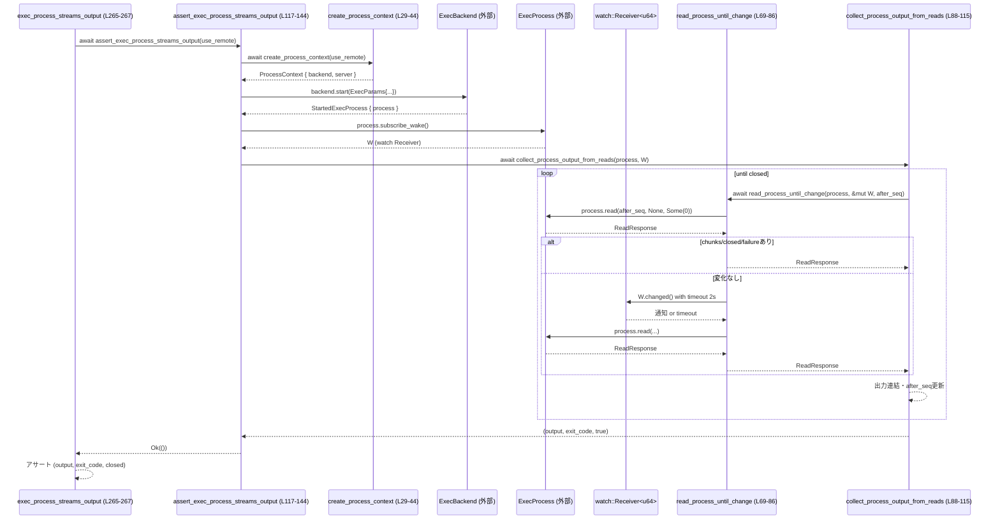

# exec-server/tests/exec_process.rs コード解説

## 0. ざっくり一言

このテストモジュールは、`codex_exec_server` の `ExecBackend` / `ExecProcess` を使ってローカル・リモート両方の実行プロセスが正しく起動・入出力・終了・切断検知できるかを、非同期（Tokio）環境で検証するためのコードです。

---

## 1. このモジュールの役割

### 1.1 概要

- ローカル実行（直接 `ExecBackend`）と、WebSocket 経由のリモート実行サーバを通した実行の両方をテストします（`use_remote` フラグ, `create_process_context`）。  
  根拠: `create_process_context` が `use_remote` に応じて `Environment::create(Some(url))` / `None` を呼び分けるため（exec_process.rs:L29-L43）。
- プロセス起動後に `ExecProcess::read` と `watch` チャネルを組み合わせ、標準出力／終了コード／セッション終了状態を読み取るヘルパーを提供しています（`read_process_until_change` / `collect_process_output_from_reads`）。  
  根拠: exec_process.rs:L69-L86, L88-L115。
- 標準出力のストリーミング、標準入力からの読み書き、subscribe 前に溜まったイベントの取得、リモート側のトランスポート切断時のエラー表現をテストします。  
  根拠: 各 `assert_exec_*` 関数および `remote_exec_process_reports_transport_disconnect`（exec_process.rs:L46-L67, L117-L144, L146-L179, L181-L210, L212-L253）。

### 1.2 アーキテクチャ内での位置づけ

このモジュールは「テスト側」から `codex_exec_server` クレートとテスト用ハーネス `common::exec_server` を呼び出す役割です。実装詳細（`Environment`, `ExecBackend`, `ExecProcess` など）は外部クレート／別モジュールにあります。

- `create_process_context` が `Environment::create` と `common::exec_server::exec_server` を呼び出して `ExecBackend` と（リモート時のみ）`ExecServerHarness` を構築（exec_process.rs:L29-L43）。
- 各 `assert_exec_*` 関数が `ExecBackend::start` で `StartedExecProcess` を取得し、`ExecProcess` を通じてプロセスを操作（exec_process.rs:L46-L58, L120-L134, L149-L163, L186-L199, L215-L229）。
- 出力取得は `ExecProcess::read` と `ExecProcess::subscribe_wake`（Tokio の `watch::Receiver`）を利用（exec_process.rs:L60-L61, L69-L86, L88-L115）。

依存関係を簡略化した図です（テストモジュール視点）:

```mermaid
graph TD
  subgraph Tests["exec_process.rs (このファイル)"]
    C["create_process_context (L29-44)"]
    A1["assert_exec_process_* (L46-67,117-144,146-179,181-210)"]
    T1["exec_process_* テスト (L258-281)"]
    D["remote_exec_process_reports_transport_disconnect (L212-253)"]
  end

  subgraph Common["common::exec_server (別モジュール)"]
    ES["exec_server() (定義位置: このチャンク外)"]
    H["ExecServerHarness (型定義: このチャンク外)"]
  end

  subgraph ExecServerCrate["codex_exec_server クレート"]
    Env["Environment (型定義: このチャンク外)"]
    BE["ExecBackend (trait)"]
    EP["ExecProcess (trait)"]
    SEP["StartedExecProcess { process }"]
  end

  T1 --> A1
  A1 --> C
  D --> C

  C -->|Environment::create| Env
  Env -->|get_exec_backend| BE
  C -->|exec_server()| ES
  ES --> H

  A1 -->|start(...)| BE
  D -->|start(...)| BE
  BE --> SEP
  SEP --> EP

  A1 -->|subscribe_wake()| EP
  D -->|subscribe_wake()| EP
  A1 -->|read(), write()| EP
  D -->|read()| EP

  D -->|shutdown()| H
```

> `Environment`, `ExecBackend`, `ExecProcess`, `ExecServerHarness`, `exec_server()` の具体的な実装はこのチャンクには現れません。

### 1.3 設計上のポイント

- **ローカル／リモートの切替**  
  - `ProcessContext` が `backend: Arc<dyn ExecBackend>` と `server: Option<ExecServerHarness>` をまとめて保持し、テストからは共通のインターフェースで利用できるようにしています（exec_process.rs:L24-L27, L29-L43）。
- **非同期・並行性**  
  - すべての実行処理は `async fn` として Tokio ランタイムで実行されます（テスト関数の `#[tokio::test(flavor = "multi_thread", worker_threads = 2)]` 属性, exec_process.rs:L212, L257, L264, L271, L278）。
  - プロセスの出力・状態更新は `tokio::sync::watch::Receiver<u64>` で通知され、`read_process_until_change` で `timeout` を用いてブロックし過ぎないようにしています（exec_process.rs:L69-L86）。
- **エラーハンドリング**  
  - すべての非同期ヘルパーは `anyhow::Result` を返し、`?` 演算子で外部のエラーを伝播します（exec_process.rs:L29, L46, L69, L88, L117 等）。
  - プロセス側の `failure` フィールドがセットされた場合は `anyhow::bail!` でテストを失敗させています（exec_process.rs:L98-L100）。
  - 期待する状態と異なるときは `assert_eq!` / `assert!` / `expect` による panic でテスト失敗としています（exec_process.rs:L59, L64-L65, L140-L142, L172-L177, L234, L242-L249）。

---

## 2. 主要な機能一覧

このテストモジュールが提供する主要な機能を列挙します。

- プロセス実行コンテキストの生成: ローカル／リモートの `ExecBackend` と、必要に応じてリモートサーバハーネスを構成（`create_process_context`）。
- プロセスの起動と正常終了確認: `true` コマンドを使って正常終了（exit code 0）することを検証（`assert_exec_process_starts_and_exits`）。
- プロセス出力のストリーミング取得: シェルスクリプトからの標準出力が順次取得できることを確認（`assert_exec_process_streams_output`）。
- 標準入力からの読み書き: Python スクリプトに stdin を書き込み、その内容が stdout に反映されるかを確認（`assert_exec_process_write_then_read`）。
- subscribe 前のイベントの保持: `subscribe_wake` を呼ぶ前に出力された標準出力が失われず取得できるかを確認（`assert_exec_process_preserves_queued_events_before_subscribe`）。
- リモート切断時のエラー報告: リモート exec-server のトランスポート切断が `ReadResponse.failure` として表現され、セッションが `closed` になることを確認（`remote_exec_process_reports_transport_disconnect`）。
- 出力収集共通ロジック: `ExecProcess::read` と `watch::Receiver` を用いた「変化まで待ってから読む」ユーティリティ（`read_process_until_change`, `collect_process_output_from_reads`）。

---

## 3. 公開 API と詳細解説

### 3.1 型一覧（構造体・列挙体など）

このファイル内で定義されている型は 1 つです。

| 名前             | 種別   | 役割 / 用途                                                                 | 定義位置 |
|------------------|--------|-------------------------------------------------------------------------------|----------|
| `ProcessContext` | 構造体 | ローカル／リモートいずれの場合でも共通に使える `ExecBackend` と、リモート時のみ存在する `ExecServerHarness` をまとめて保持するテスト用コンテキストです。 | exec_process.rs:L24-L27 |

フィールドの概要:

- `backend: Arc<dyn ExecBackend>`  
  - プロセスの起動・操作を行うバックエンドへの共有ポインタ（スレッド間共有可能な参照カウント付きポインタ）です（exec_process.rs:L25）。
- `server: Option<ExecServerHarness>`  
  - リモートテスト時に起動される exec-server ハーネス。ローカル実行時は `None` です（exec_process.rs:L26）。

### 3.2 関数詳細

#### 3.2.1 コンポーネントインベントリー（構造体・関数一覧）

このファイルで定義されている構造体と関数を一覧にします。

| 名前                                                         | 種別       | 役割 / 用途                                                                                                     | 定義位置 |
|--------------------------------------------------------------|------------|------------------------------------------------------------------------------------------------------------------|----------|
| `ProcessContext`                                             | 構造体     | 実行バックエンドと（リモート用の）サーバハーネスをまとめるテスト用コンテキスト。                               | L24-L27  |
| `create_process_context(use_remote: bool)`                   | 非公開関数 | ローカル／リモート設定に応じて `Environment` と `ExecBackend`、必要なら `ExecServerHarness` を初期化。         | L29-L44  |
| `assert_exec_process_starts_and_exits(use_remote: bool)`     | 非公開関数 | プロセスが起動し、exit code 0 で終了し、セッションが closed になることを検証。                                  | L46-L67  |
| `read_process_until_change(session, wake_rx, after_seq)`     | 非公開関数 | `ExecProcess::read` を呼び、変化がなければ `watch::Receiver` の通知かタイムアウトまで待機してから再読込。      | L69-L86  |
| `collect_process_output_from_reads(session, wake_rx)`        | 非公開関数 | `read_process_until_change` をループして標準出力をすべて連結し、exit code と closed 状態を収集。              | L88-L115 |
| `assert_exec_process_streams_output(use_remote: bool)`       | 非公開関数 | シェルスクリプトからの標準出力が正しく取得できるか検証。                                                        | L117-L144|
| `assert_exec_process_write_then_read(use_remote: bool)`      | 非公開関数 | Python スクリプトに stdin を送り、その内容が stdout に反映されるか検証。                                       | L146-L179|
| `assert_exec_process_preserves_queued_events_before_subscribe(use_remote: bool)` | 非公開関数 | `subscribe_wake` 呼び出し前に生成された出力が失われず取得できるか検証。                                        | L181-L210|
| `remote_exec_process_reports_transport_disconnect()`         | テスト関数 | リモート exec-server の切断が `ReadResponse.failure` として報告され、セッションが closed になるか検証。        | L212-L253|
| `exec_process_starts_and_exits(use_remote: bool)`            | テスト関数 | テストケースとして `assert_exec_process_starts_and_exits` を呼び出すラッパー。                                  | L258-L260|
| `exec_process_streams_output(use_remote: bool)`              | テスト関数 | テストケースとして `assert_exec_process_streams_output` を呼び出すラッパー。                                    | L265-L267|
| `exec_process_write_then_read(use_remote: bool)`             | テスト関数 | テストケースとして `assert_exec_process_write_then_read` を呼び出すラッパー。                                   | L272-L274|
| `exec_process_preserves_queued_events_before_subscribe(use_remote: bool)` | テスト関数 | テストケースとして `assert_exec_process_preserves_queued_events_before_subscribe` を呼び出すラッパー。          | L279-L281|

> 行番号はこのチャンク内の位置を示します。

#### 3.2.2 重要な関数の詳細（テンプレート形式）

以下では特にコアロジックを含む関数を選び、詳細に説明します。

---

#### `create_process_context(use_remote: bool) -> Result<ProcessContext>`

**概要**

- ローカル／リモートのどちらの `ExecBackend` を使うかを `use_remote` で切り替え、実行に必要なコンテキストを組み立てます（exec_process.rs:L29-L43）。

**引数**

| 引数名      | 型      | 説明                                                                 |
|-------------|---------|----------------------------------------------------------------------|
| `use_remote`| `bool`  | `true` の場合はリモートの exec-server を起動し、`Environment` をその URL で生成する。それ以外はローカルモード。 |

**戻り値**

- `Result<ProcessContext>`  
  - 成功時: `ProcessContext`（`backend` と `server` を含む）  
  - 失敗時: 外部呼び出し（`exec_server()`, `Environment::create` 等）から伝播した `anyhow::Error`。

**内部処理の流れ**

1. `use_remote` が `true` かを判定（exec_process.rs:L29-L30）。
2. リモート時:
   - `exec_server().await?` でテスト用 exec-server を起動（exec_process.rs:L31）。
   - `server.websocket_url().to_string()` を `Environment::create(Some(...))` に渡して環境を生成（exec_process.rs:L32）。
   - `environment.get_exec_backend()` で `ExecBackend` を取得し、`ProcessContext { backend, server: Some(server) }` を返す（exec_process.rs:L33-L36）。
3. ローカル時:
   - `Environment::create(/*exec_server_url*/ None).await?` を呼び、ローカルモードの環境を生成（exec_process.rs:L38）。
   - `ProcessContext { backend, server: None }` を返す（exec_process.rs:L39-L42）。

**Examples（使用例）**

```rust
// ローカルバックエンド用のコンテキストを生成する例
let context = create_process_context(/*use_remote*/ false).await?; // exec_process.rs:L29-L43

// リモート exec-server を使うコンテキストを生成する例
let remote_context = create_process_context(true).await?;
```

**Errors / Panics**

- `exec_server().await?` からのエラー（リモート時のみ）。エラー型は `exec_server` の実装に依存し、このチャンクからは不明です（exec_process.rs:L31）。
- `Environment::create(...).await?` からのエラー（ローカル・リモート両方）。`Environment` の実装に依存（exec_process.rs:L32, L38）。
- いずれのエラーも `?` 演算子により `anyhow::Error` に変換されて返されます。

**Edge cases（エッジケース）**

- `use_remote == true` なのに `exec_server()` が失敗した場合: `ProcessContext` は作られず、エラーで早期終了します（exec_process.rs:L31）。
- `Environment::create(Some(url))` / `Environment::create(None)` がエラーとなる場合も同様に早期終了します。

**使用上の注意点**

- この関数はテスト用のヘルパーであり、`ExecServerHarness` のライフサイクルもカプセル化しています。リモートコンテキストを利用するテストでは `ProcessContext.server` に `Some` が入っていることを前提に `expect` で取り出しています（exec_process.rs:L231-L235）。

---

#### `read_process_until_change(session: Arc<dyn ExecProcess>, wake_rx: &mut watch::Receiver<u64>, after_seq: Option<u64>) -> Result<ReadResponse>`

**概要**

- `ExecProcess::read` でプロセスの状態・出力を取得し、すぐに変化がない場合は `watch::Receiver` で通知を待機してから再度読み直すヘルパーです（exec_process.rs:L69-L86）。

**引数**

| 引数名    | 型                                | 説明 |
|-----------|-----------------------------------|------|
| `session` | `Arc<dyn ExecProcess>`            | 実行中のプロセスセッションを表すオブジェクト。共有所有権（`Arc`）で複数タスクから利用可能。 |
| `wake_rx` | `&mut watch::Receiver<u64>`       | プロセスからの「更新通知」を受け取る `watch` チャネルの受信側。`subscribe_wake` で取得されたもの。 |
| `after_seq` | `Option<u64>`                   | どのシーケンス番号以降の出力を読みたいかを表す位置情報。`None` の場合の意味は `ExecProcess::read` の仕様に依存し、このチャンクからは不明です。 |

**戻り値**

- `Result<ReadResponse>`  
  - 成功時: `ReadResponse`（`chunks`, `closed`, `failure` などを含む）  
  - 失敗時: `timeout` や `wake_rx.changed()`、あるいは `session.read` から発生したエラー。

**内部処理の流れ**

1. `session.read(after_seq, None, Some(0)).await?` で非ブロッキング（wait_ms = 0）で一度読み取り（exec_process.rs:L74-L76）。
2. もし `response.chunks` が非空、`response.closed` が `true`、または `response.failure` が `Some` であれば、そのまま `Ok(response)` を返す（exec_process.rs:L77-L78）。  
   → 何らかの変化があったので待たずに返す。
3. 上記のどれでもない場合、`timeout(Duration::from_secs(2), wake_rx.changed()).await??;` で  
   - 最大 2 秒まで `wake_rx` の変更（`u64` の値が更新される）を待つ（exec_process.rs:L81）。  
   - タイムアウト (`Elapsed`) または `changed()` のエラー (`RecvError`) が発生した場合は `?` によりエラーとして戻り値に反映。
4. 通知を受けた後、再度 `session.read(after_seq, None, Some(0)).await` を呼び出し、その結果を `Into::into` で `anyhow::Error` に変換して返す（exec_process.rs:L82-L85）。

**Examples（使用例）**

```rust
// ExecProcess からの wake 通知を利用して、変化があるまで待ちながら ReadResponse を取得する
let mut wake_rx = process.subscribe_wake(); // process: Arc<dyn ExecProcess>
let response = read_process_until_change(Arc::clone(&process), &mut wake_rx, /*after_seq*/ None).await?;
```

**Errors / Panics**

- `session.read(...)` がエラーを返した場合（2 回の呼び出しのどちらか）。エラー型は `ExecProcess::read` の実装に依存し、このチャンクからは不明です（exec_process.rs:L74-L76, L82-L85）。
- `timeout(...)` がタイムアウトした場合: `Elapsed` エラーが `?` によって `anyhow::Error` に変換されます（exec_process.rs:L81）。
- `wake_rx.changed()` がエラー（送信側がクローズされたなど）を返した場合も `?` で伝播します（exec_process.rs:L81）。
- panic を直接起こすコードはこの関数内にはありません。

**Edge cases（エッジケース）**

- プロセスに全く出力も状態変化もないまま 2 秒以上経過する場合: `timeout` によりエラーとして返されます（exec_process.rs:L81）。
- `wake_rx` の送り側（`ExecProcess` 内部）がすでにドロップされている場合: `wake_rx.changed()` がエラーとなり、結果として `read_process_until_change` もエラーを返します。

**使用上の注意点**

- この関数は `wake_rx` をミューテーブル参照で受け取り、内部で `.changed().await` を呼び出すため、同じ `Receiver` を複数タスクで同時に使う設計にはなっていません。
- `after_seq` は単純に呼び出し元から渡されるだけで、この関数内では更新されません。シーケンス管理は呼び出し側（`collect_process_output_from_reads`）の責務です。

---

#### `collect_process_output_from_reads(session: Arc<dyn ExecProcess>, wake_rx: watch::Receiver<u64>) -> Result<(String, Option<i32>, bool)>`

**概要**

- `read_process_until_change` をループ呼び出しし、プロセスの出力（標準出力など）をすべて文字列として連結しつつ、終了コードと閉塞状態を収集するヘルパーです（exec_process.rs:L88-L115）。

**引数**

| 引数名    | 型                           | 説明 |
|-----------|------------------------------|------|
| `session` | `Arc<dyn ExecProcess>`       | 対象プロセスセッション。`Arc` によりこの関数内でクローンされながら利用されます。 |
| `wake_rx` | `watch::Receiver<u64>`       | `subscribe_wake` によって生成された `watch` 受信側。ここでは所有権ごと受け取り、内部でミューテブルに扱います。 |

**戻り値**

- `Result<(String, Option<i32>, bool)>`  
  タプルの意味:
  - `0`: `String` — プロセスから受信したすべての出力を UTF-8 として連結したもの（`from_utf8_lossy` を利用）。
  - `1`: `Option<i32>` — プロセスの終了コード。`ReadResponse.exit_code` を `Some` の場合に保存（exec_process.rs:L105-L107）。
  - `2`: `bool` — テストでは常に `true` を返しています。コード上は `closed` フラグを明示的に返しており、現状は固定値 `true` です（exec_process.rs:L114-L115）。

**内部処理の流れ**

1. `output`（空文字列）、`exit_code`（`None`）、`after_seq`（`None`）を初期化（exec_process.rs:L92-L94）。
2. ループ開始（`loop { ... }`）（exec_process.rs:L95）。
3. `read_process_until_change(Arc::clone(&session), &mut wake_rx, after_seq).await?` を呼び出し、`ReadResponse` を取得（exec_process.rs:L96-L97）。
4. `response.failure` が `Some` の場合、`anyhow::bail!("process failed before closed state: {message}")` でエラーとして終了（exec_process.rs:L98-L100）。
5. `response.chunks` を順に処理し、各 `chunk.chunk` のバイト列を `String::from_utf8_lossy` で文字列に変換して `output` に追加し、`after_seq = Some(chunk.seq)` を更新（exec_process.rs:L101-L103）。
6. `response.exited` が `true` の場合、`exit_code = response.exit_code` を設定（exec_process.rs:L105-L107）。
7. `response.closed` が `true` の場合、ループを `break` して終了（exec_process.rs:L108-L110）。
8. それ以外の場合、`after_seq = response.next_seq.checked_sub(1).or(after_seq);` で次回読み出しのためのシーケンスを更新（exec_process.rs:L111）。  
   - `checked_sub(1)` により `next_seq` が 0 の場合にオーバーフローを防止し、その場合は前回の `after_seq` を引き継ぎます。
9. ループ終了後、`drop(session);` で `Arc<dyn ExecProcess>` の参照を明示的にドロップし、最後に `(output, exit_code, true)` を返す（exec_process.rs:L113-L115）。

**Examples（使用例）**

```rust
// プロセス実行後に、全出力と終了コードを収集するパターン
let wake_rx = process.subscribe_wake(); // process: Arc<dyn ExecProcess>
let (output, exit_code, closed) =
    collect_process_output_from_reads(process, wake_rx).await?; // exec_process.rs:L88-L115
assert!(closed);
println!("output: {output}, exit_code: {:?}", exit_code);
```

**Errors / Panics**

- `read_process_until_change` からのエラーがそのまま伝播します（内部で `?` を使用, exec_process.rs:L96-L97）。
- `response.failure` が `Some` の場合、`anyhow::bail!` により `anyhow::Error` を返します（exec_process.rs:L98-L100）。
- UTF-8 変換には `String::from_utf8_lossy` を使用しているため、非 UTF-8 バイト列でも panic は発生せず、代替文字に置き換えられます（exec_process.rs:L102）。
- panic を起こすコードはこの関数内にはありません。

**Edge cases（エッジケース）**

- プロセスが `closed` になる前に `failure` を返す場合: 「process failed before closed state: {message}」というエラーメッセージでテストが失敗します（exec_process.rs:L98-L100）。
- 出力チャンクが全くないまま `closed` になる場合: `output` は空文字列のままですが、エラーにはなりません。
- `response.next_seq` が 0 の場合は `checked_sub(1)` により `None` となり、その場合 `or(after_seq)` によって前回の `after_seq` が維持されます（exec_process.rs:L111）。

**使用上の注意点**

- この関数は出力を全て `String` に連結するため、大きな出力を行うプロセスをテストする場合はメモリ使用量が増える可能性があります。
- 戻り値の `closed` フラグは、現在の実装では常に `true` で固定されています（exec_process.rs:L114-L115）。呼び出し側では `closed` を期待値の検証に使っていますが、`collect_process_output_from_reads` 側で `response.closed` を利用していることが前提です（exec_process.rs:L108-L110）。

---

#### `assert_exec_process_starts_and_exits(use_remote: bool) -> Result<()>`

**概要**

- `true` コマンドを実行して、プロセスが起動し、exit code 0 で終了し、セッションがクローズされたことを検証するヘルパーテストです（exec_process.rs:L46-L67）。

**引数**

| 引数名      | 型    | 説明 |
|-------------|-------|------|
| `use_remote`| `bool`| ローカル／リモートバックエンドのどちらを使うかのフラグ。 |

**戻り値**

- `Result<()>`  
  - テストが期待通り通過した場合は `Ok(())`。  
  - バックエンド初期化やプロセス起動・読み取りでエラーが発生した場合は `anyhow::Error`。

**内部処理の流れ**

1. `create_process_context(use_remote).await?` で `ProcessContext` を取得（exec_process.rs:L47）。
2. `context.backend.start(ExecParams { ... }).await?` で `process_id: "proc-1"`, `argv: ["true"]`, `cwd` をカレントディレクトリ、`tty: false` でプロセスを起動（exec_process.rs:L48-L58）。
3. `session.process.process_id().as_str()` が `"proc-1"` であることを `assert_eq!` で確認（exec_process.rs:L59）。
4. `session.process.subscribe_wake()` で `wake_rx` を取得（exec_process.rs:L60）。
5. `collect_process_output_from_reads(session.process, wake_rx).await?` で出力・終了コード・クローズ状態を取得（exec_process.rs:L61-L62）。
6. `exit_code == Some(0)` と `closed == true` を `assert_eq!` / `assert!` で検証し、`Ok(())` を返す（exec_process.rs:L64-L66）。

**Examples（使用例）**

テストラッパーからの呼び出し例:

```rust
#[test_case(false ; "local")]
#[test_case(true ; "remote")]
#[tokio::test(flavor = "multi_thread", worker_threads = 2)]
async fn exec_process_starts_and_exits(use_remote: bool) -> Result<()> {
    // 実際の検証ロジックはヘルパー関数に委譲
    assert_exec_process_starts_and_exits(use_remote).await
}
```

**Errors / Panics**

- `create_process_context` や `backend.start`, `collect_process_output_from_reads` からのエラーが `?` により伝播します（exec_process.rs:L47-L48, L61-L62）。
- 期待しているプロセス ID が一致しない場合、`assert_eq!` により panic（テスト失敗）します（exec_process.rs:L59）。
- `exit_code != Some(0)` または `closed == false` の場合、`assert_eq!` / `assert!` により panic します（exec_process.rs:L64-L65）。

**Edge cases（エッジケース）**

- プロセスが起動に失敗した場合: `start` からのエラーとして返されます（exec_process.rs:L48-L58）。
- プロセスが終了せず `collect_process_output_from_reads` 内でタイムアウトまたは `failure` となった場合: `Result::Err` としてテストが失敗します。

**使用上の注意点**

- 実行コマンドは固定で `"true"` のため、Unix 環境前提のテストです（`#![cfg(unix)]`, exec_process.rs:L1）。
- リモートバックエンド (`use_remote == true`) の場合は exec-server ハーネスが正しく起動できることが前提です（`create_process_context` 参照）。

---

#### `assert_exec_process_streams_output(use_remote: bool) -> Result<()>`

**概要**

- シェルで `sleep 0.05; printf 'session output\n'` を実行させ、その標準出力が `collect_process_output_from_reads` 経由で正しく取得できるかを検証します（exec_process.rs:L117-L144）。

**引数**

| 引数名      | 型    | 説明 |
|-------------|-------|------|
| `use_remote`| `bool`| ローカル／リモートバックエンド切替フラグ。 |

**戻り値**

- `Result<()>` — 成功時は `Ok(())`、エラーはバックエンド・出力収集からのもの。

**内部処理の流れ**

1. `create_process_context(use_remote).await?` でコンテキスト生成（exec_process.rs:L118）。
2. `process_id = "proc-stream".to_string()` を生成（exec_process.rs:L119）。
3. `backend.start(ExecParams { ... }).await?` で `/bin/sh -c "sleep 0.05; printf 'session output\n'"` を起動（exec_process.rs:L120-L133）。
4. プロセス ID が `process_id` と一致することを `assert_eq!` で確認（exec_process.rs:L135）。
5. `let StartedExecProcess { process } = session;` で `process` を取り出し（exec_process.rs:L137）。
6. `process.subscribe_wake()` で `wake_rx` を取得し、`collect_process_output_from_reads(process, wake_rx).await?` で出力／終了コード／クローズ状態を取得（exec_process.rs:L138-L139）。
7. 出力が `"session output\n"`, `exit_code == Some(0)`, `closed == true` であることを検証（exec_process.rs:L140-L142）。

**Examples（使用例）**

```rust
let context = create_process_context(use_remote).await?;
let session = context.backend.start(ExecParams {
    process_id: "proc-stream".into(),
    argv: vec![
        "/bin/sh".to_string(),
        "-c".to_string(),
        "sleep 0.05; printf 'session output\\n'".to_string(),
    ],
    cwd: std::env::current_dir()?,
    env: Default::default(),
    tty: false,
    arg0: None,
}).await?;

let StartedExecProcess { process } = session;
let wake_rx = process.subscribe_wake();
let (output, exit_code, closed) =
    collect_process_output_from_reads(process, wake_rx).await?;
```

**Errors / Panics**

- コンテキスト生成、プロセス起動、出力収集のいずれかでエラーが発生した場合、`?` で伝播します（exec_process.rs:L118, L120-L134, L139）。
- プロセス ID が一致しない／出力文字列が異なる／exit code が 0 でない／`closed == false` のいずれかの場合、`assert_eq!` / `assert!` により panic します（exec_process.rs:L135, L140-L142）。

**Edge cases（エッジケース）**

- プロセスが標準出力を出さない場合: `output` は空文字列となり、`assert_eq!(output, "session output\n")` でテストが失敗します。
- `sleep 0.05` の遅延よりも短い間隔で `read` が呼ばれても、`collect_process_output_from_reads` 内のループと `read_process_until_change` が `wake_rx` を待機するため、最終的には出力取得が試みられます。

**使用上の注意点**

- `/bin/sh` のパスや挙動に依存するテストです。非 Unix 環境では `#![cfg(unix)]` によりコンパイルされません（exec_process.rs:L1）。

---

#### `assert_exec_process_write_then_read(use_remote: bool) -> Result<()>`

**概要**

- Python スクリプトに対して標準入力 `"hello\n"` を送信し、`sys.stdout` に `from-stdin:hello` が含まれることを確認します。TTY モードを有効 (`tty: true`) にしている点も特徴です（exec_process.rs:L146-L179）。

**引数**

| 引数名      | 型    | 説明 |
|-------------|-------|------|
| `use_remote`| `bool`| ローカル／リモートバックエンド切替フラグ。 |

**戻り値**

- `Result<()>` — 成功時 `Ok(())`、途中のエラーは `anyhow::Error`。

**内部処理の流れ**

1. `create_process_context(use_remote).await?` でコンテキストを生成（exec_process.rs:L147）。
2. `process_id = "proc-stdin".to_string()` を作成（exec_process.rs:L148）。
3. `backend.start(ExecParams { ... }).await?` で Python を起動:
   - `argv`: `["/usr/bin/python3", "-c", "import sys; line = sys.stdin.readline(); sys.stdout.write(f'from-stdin:{line}'); sys.stdout.flush()"]`（exec_process.rs:L153-L157）。
   - `tty: true`（exec_process.rs:L160）。
4. プロセス ID が期待通りかを確認（exec_process.rs:L164）。
5. `tokio::time::sleep(Duration::from_millis(200)).await;` で 200ms 待機し、プロセスが入力を受け付けられる状態になることを想定（exec_process.rs:L166）。
6. `session.process.write(b"hello\n".to_vec()).await?;` で標準入力に書き込み（exec_process.rs:L167）。
7. `let StartedExecProcess { process } = session;` でプロセスハンドルを取り出し（exec_process.rs:L168）。
8. `process.subscribe_wake()` → `collect_process_output_from_reads` の流れで出力を取得（exec_process.rs:L169-L170）。
9. `output.contains("from-stdin:hello")` を `assert!` で確認し、その後 `exit_code == Some(0)`, `closed == true` を検証（exec_process.rs:L172-L177）。

**Examples（使用例）**

```rust
// stdin に書き込んで stdout にエコーされることを検証するテストパターン
let context = create_process_context(use_remote).await?;
let session = context.backend.start(ExecParams { /* Python スクリプト */ }).await?;
tokio::time::sleep(Duration::from_millis(200)).await; // 準備待ち
session.process.write(b"hello\n".to_vec()).await?;
let StartedExecProcess { process } = session;
let wake_rx = process.subscribe_wake();
let (output, exit_code, closed) =
    collect_process_output_from_reads(process, wake_rx).await?;
```

**Errors / Panics**

- コンテキスト生成、プロセス起動、`write`, 出力収集のいずれかでエラーが起きれば、`?` で伝播します（exec_process.rs:L147-L148, L149-L163, L167, L170）。
- `output.contains("from-stdin:hello")` が `false` の場合、`assert!` により panic（exec_process.rs:L172-L175）。
- `exit_code != Some(0)` や `closed == false` の場合も `assert_eq!` / `assert!` により panic（exec_process.rs:L176-L177）。

**Edge cases（エッジケース）**

- Python 実行ファイルが `/usr/bin/python3` に存在しない環境では `start` がエラーになる可能性がありますが、このチャンクからは具体的挙動は分かりません。
- 標準入力に書き込む前にプロセスが終了している場合、`write` がエラーを返すことが考えられますが、詳細は `ExecProcess::write` の仕様に依存し、このチャンクには現れません。

**使用上の注意点**

- 200ms の `sleep` は、プロセスの起動完了や Python インタプリタの準備完了を暗黙的に待っています（exec_process.rs:L166）。非常に遅い環境では、これでも足りずにテストが不安定になる可能性があります。
- TTY モード (`tty: true`) に依存した挙動を確認しているため、`ExecBackend` の TTY 実装が前提通りであることが必要です（exec_process.rs:L160）。

---

#### `assert_exec_process_preserves_queued_events_before_subscribe(use_remote: bool) -> Result<()>`

**概要**

- プロセスの出力が `subscribe_wake` を呼ぶ前に発生しても、`collect_process_output_from_reads` で取得できる（失われない）ことを確認するテストです（exec_process.rs:L181-L210）。

**引数**

| 引数名      | 型    | 説明 |
|-------------|-------|------|
| `use_remote`| `bool`| ローカル／リモートバックエンド切替フラグ。 |

**戻り値**

- `Result<()>` — 成功時 `Ok(())`。

**内部処理の流れ**

1. `create_process_context(use_remote).await?`（exec_process.rs:L184）。
2. `/bin/sh -c "printf 'queued output\n'"` を実行するプロセスを起動（exec_process.rs:L185-L199）。
3. プロセスを起動したまま `tokio::time::sleep(Duration::from_millis(200)).await;` で 200ms 待機（exec_process.rs:L201）。
   - この間にプロセスは出力・終了している可能性が高い。
4. その後で `process.subscribe_wake()` を初めて呼び、`collect_process_output_from_reads` で出力を取得（exec_process.rs:L203-L205）。
5. 出力が `"queued output\n"`, `exit_code == Some(0)`, `closed == true` であることを検証（exec_process.rs:L206-L208）。

**Errors / Panics**

- コンテキスト生成・プロセス起動・出力収集でのエラーは `?` により伝播（exec_process.rs:L184-L185, L205）。
- 出力文字列・終了コード・クローズ状態が期待と異なると `assert_eq!` / `assert!` により panic（exec_process.rs:L206-L208）。

**Edge cases（エッジケース）**

- `sleep` 時間が短すぎてプロセスがまだ出力していない場合、`collect_process_output_from_reads` 内のループと `read_process_until_change` により、wake 通知を待って最終的に出力を取得しようとします。
- 逆に非常に遅い環境で、`read_process_until_change` の 2 秒タイムアウト（exec_process.rs:L81）が先に発火すると、エラーでテストが失敗する可能性があります。

**使用上の注意点**

- このテストは「出力が生成されてから subscribe しても、既存の出力が失われない」という契約を間接的に確認していますが、その実装詳細（バッファリング戦略）は `ExecProcess` の実装に依存し、このチャンクには現れません。

---

#### `remote_exec_process_reports_transport_disconnect() -> Result<()>`

**概要**

- リモート exec-server のトランスポート接続を意図的に切断し、その結果が `ReadResponse.failure` と `closed == true` として観測できることを検証するテストです（exec_process.rs:L212-L253）。

**引数**

- なし（Tokio テスト関数として直接呼び出されます）。

**戻り値**

- `Result<()>` — 成功時 `Ok(())`。

**内部処理の流れ**

1. `create_process_context(/*use_remote*/ true).await?` でリモートモードのコンテキストを取得（exec_process.rs:L214）。
2. `/bin/sh -c "sleep 10"` の長時間実行プロセスを起動（exec_process.rs:L215-L229）。
3. `context.server.as_mut().expect("remote context should include exec-server harness")` で `ExecServerHarness` へのミュータブル参照を取り出し（exec_process.rs:L231-L234）。
4. `server.shutdown().await?;` でリモート exec-server をシャットダウン（exec_process.rs:L235）。
5. `let mut wake_rx = session.process.subscribe_wake();` で wake 受信側を取得（exec_process.rs:L237）。
6. `read_process_until_change(session.process, &mut wake_rx, /*after_seq*/ None).await?;` で、切断に伴う `ReadResponse` を取得（exec_process.rs:L238-L239）。
7. `response.failure` が `Some` であることを `expect("disconnect should surface as a failure")` で確認し（exec_process.rs:L240-L242）、さらにメッセージが `"exec-server transport disconnected"` で始まることを `assert!` で検証（exec_process.rs:L243-L245）。
8. 最後に `response.closed` が `true` であることを `assert!`（exec_process.rs:L247-L249）。

**Examples（使用例）**

```rust
#[tokio::test(flavor = "multi_thread", worker_threads = 2)]
async fn remote_exec_process_reports_transport_disconnect() -> Result<()> {
    let mut context = create_process_context(/*use_remote*/ true).await?;
    // ... 上記の手順通りに shutdown と read を実施 ...
    Ok(())
}
```

**Errors / Panics**

- `create_process_context`, `backend.start`, `server.shutdown`, `read_process_until_change` のいずれかがエラーとなった場合、`?` により `anyhow::Error` として返されます（exec_process.rs:L214-L215, L235, L238-L239）。
- `context.server` が `None` の場合、`expect("remote context should include exec-server harness")` により panic（exec_process.rs:L231-L234）。
- `response.failure` が `None` の場合、`expect("disconnect should surface as a failure")` により panic（exec_process.rs:L240-L242）。
- `failure` メッセージが期待の文字列で始まらない／`response.closed` が `false` の場合も `assert!` により panic（exec_process.rs:L243-L249）。

**Edge cases（エッジケース）**

- `server.shutdown()` がエラーになる場合、`read_process_until_change` は呼ばれずにテストがエラー終了します。
- exec-server の実装が、切断時に `"exec-server transport disconnected"` 以外のメッセージを返すよう変更された場合、このテストは失敗します。

**使用上の注意点**

- このテストはリモートモード専用であり、`use_remote` が `true` の `ProcessContext` に `server: Some(...)` がセットされているという契約に依存しています（exec_process.rs:L29-L36, L231-L234）。
- 切断検知の具体的なタイミングやメッセージフォーマットは `codex_exec_server` クレートの実装に依存しており、このチャンクには現れません。

### 3.3 その他の関数

ヘルパーを呼び出すだけのテストラッパー関数は次の通りです。

| 関数名                                                        | 役割（1 行）                                                                                           | 定義位置 |
|---------------------------------------------------------------|--------------------------------------------------------------------------------------------------------|----------|
| `exec_process_starts_and_exits(use_remote: bool)`             | `#[test_case(false)]` / `#[test_case(true)]` でローカル・リモート双方に対して `assert_exec_process_starts_and_exits` を実行する。 | L258-L260|
| `exec_process_streams_output(use_remote: bool)`               | 同様に、`assert_exec_process_streams_output` をローカル・リモート双方で検証する。                      | L265-L267|
| `exec_process_write_then_read(use_remote: bool)`              | 同様に、`assert_exec_process_write_then_read` をローカル・リモート双方で検証する。                     | L272-L274|
| `exec_process_preserves_queued_events_before_subscribe(use_remote: bool)` | 同様に、`assert_exec_process_preserves_queued_events_before_subscribe` をローカル・リモート双方で検証する。 | L279-L281|

これらはいずれも `#[tokio::test(flavor = "multi_thread", worker_threads = 2)]` と `#[test_case]` 属性を持ち、Tokio ランタイム上で複数の構成（ローカル／リモート）を繰り返しテストするために用いられています（exec_process.rs:L255-L257, L262-L264, L269-L271, L276-L278）。

---

## 4. データフロー

ここでは、代表的な「出力をストリーミングして収集する」シナリオ（`assert_exec_process_streams_output`）におけるデータフローを示します。

### 4.1 処理の要点

- テストラッパー（`exec_process_streams_output`）がヘルパー `assert_exec_process_streams_output` を呼びます（exec_process.rs:L265-L267, L117-L144）。
- `create_process_context` が `Environment` と `ExecBackend` を準備し、`backend.start` が `StartedExecProcess { process }` を返します（exec_process.rs:L118-L134）。
- `process.subscribe_wake` により `watch::Receiver<u64>` を取得し、`collect_process_output_from_reads` が `read_process_until_change` を介して `ExecProcess::read` を繰り返し呼び出します（exec_process.rs:L137-L139, L69-L86, L88-L115）。
- 最後に `collect_process_output_from_reads` が出力文字列・終了コード・クローズ状態を返し、それをテストが検証します。

### 4.2 シーケンス図



この図は、プロセス出力が `ExecProcess::read` → `ReadResponse` → `collect_process_output_from_reads` → テストのアサーションへと流れる様子と、`watch::Receiver` による更新通知を示しています。

---

## 5. 使い方（How to Use）

このファイルはテスト用ですが、`ExecBackend` / `ExecProcess` の基本的な使い方のサンプルとしても利用できます。

### 5.1 基本的な使用方法

ローカルバックエンドを使ってコマンドを実行し、出力と終了コードを取得する手順の例です。

```rust
use std::sync::Arc;
use anyhow::Result;
use codex_exec_server::{Environment, ExecBackend, ExecParams, ExecProcess, StartedExecProcess};
use tokio::sync::watch;
use tokio::time::Duration;

// テストファイル内のヘルパーを簡略化した例
async fn run_and_collect() -> Result<(String, Option<i32>)> {
    // 1. Environment から ExecBackend を取得する（ローカルモード）
    let environment = Environment::create(/*exec_server_url*/ None).await?; // exec_process.rs:L38
    let backend: Arc<dyn ExecBackend> = environment.get_exec_backend();

    // 2. プロセスを起動
    let session: StartedExecProcess = backend
        .start(ExecParams {
            process_id: "example-proc".into(),
            argv: vec!["/bin/echo".to_string(), "hello".to_string()],
            cwd: std::env::current_dir()?,
            env: Default::default(),
            tty: false,
            arg0: None,
        })
        .await?;

    // 3. wake 通知を購読
    let process = session.process;                            // exec_process.rs:L137 と同様
    let wake_rx: watch::Receiver<u64> = process.subscribe_wake();

    // 4. 出力と終了コードを収集
    let (output, exit_code, _closed) =
        collect_process_output_from_reads(process, wake_rx).await?; // exec_process.rs:L88-L115

    Ok((output, exit_code))
}
```

> 上記はこのファイル内のパターン（`create_process_context` → `backend.start` → `subscribe_wake` → `collect_process_output_from_reads`）を単体利用向けに書き直した例です。

### 5.2 よくある使用パターン

1. **ローカル／リモートの切替**

```rust
// ローカル実行
let local_context = create_process_context(false).await?;

// リモート exec-server 経由での実行
let remote_context = create_process_context(true).await?;
```

1. **ストリーミング出力の取得**

```rust
let session = context.backend.start(/* ExecParams */).await?;
let StartedExecProcess { process } = session;
let wake_rx = process.subscribe_wake();
let (output, exit_code, closed) =
    collect_process_output_from_reads(process, wake_rx).await?;
```

1. **標準入力との対話**

```rust
let session = context.backend.start(/* Python スクリプトの ExecParams */).await?;
tokio::time::sleep(Duration::from_millis(200)).await; // 準備待ち
session.process.write(b"hello\n".to_vec()).await?;
let StartedExecProcess { process } = session;
let wake_rx = process.subscribe_wake();
let (output, exit_code, closed) =
    collect_process_output_from_reads(process, wake_rx).await?;
```

### 5.3 よくある間違い

このファイルから推測できる「誤用しやすいパターン」と、その正しい使い方です。

```rust
// 間違い例: wake 通知を使わずに read をポーリングし続ける
// （このチャンクにはそのようなコードはありませんが、read は wait_ms=0 で呼ばれているため、
//  応答がなければ高頻度ループになりうる）
async fn bad_pattern(process: Arc<dyn ExecProcess>) {
    loop {
        let response = process.read(None, None, Some(0)).await.unwrap();
        if response.closed {
            break;
        }
        // データがなければ何もせずループ -> 多数の空読み取り
    }
}

// 正しい例: wake 通知と timeout を使って、変化があるまで待つ
async fn good_pattern(process: Arc<dyn ExecProcess>) -> Result<()> {
    let mut wake_rx = process.subscribe_wake();
    loop {
        let response =
            read_process_until_change(Arc::clone(&process), &mut wake_rx, None).await?; // exec_process.rs:L69-L86
        if response.closed {
            break;
        }
    }
    Ok(())
}
```

> 上記「間違い例」はこのチャンクには登場しませんが、本ファイルが `read_process_until_change` で `wake_rx` と `timeout` を利用していること（exec_process.rs:L69-L86）から、単純なポーリングは避けたい意図があると解釈できます。ただし、`ExecProcess::read` の詳細な挙動はこのチャンクからは分かりません。

### 5.4 使用上の注意点（まとめ）

- **Tokio ランタイム前提**  
  すべての非同期関数は Tokio に依存しており、テストも `#[tokio::test(flavor = "multi_thread", worker_threads = 2)]` で実行されます（exec_process.rs:L212, L257, L264, L271, L278）。
- **Unix 前提のコマンド**  
  `true`, `/bin/sh`, `/usr/bin/python3` を使用しており、`#![cfg(unix)]` により Unix 環境のみでコンパイルされるようになっています（exec_process.rs:L1, L52, L124-L127, L153-L157）。
- **タイミング依存**  
  `tokio::time::sleep(Duration::from_millis(200))` など、プロセス準備完了を一定時間待つ前提の箇所があります（exec_process.rs:L166, L201）。非常に遅い環境では調整が必要になる可能性があります。
- **タイムアウト設定**  
  `read_process_until_change` では 2 秒のタイムアウトが固定値として使われています（exec_process.rs:L81）。これによりテストのハングは防げますが、プロセスや通信が極端に遅い環境ではタイムアウトに達してテストが失敗する可能性があります。

---

## 6. 変更の仕方（How to Modify）

### 6.1 新しい機能を追加する場合

新しいプロセス振る舞いをテストしたい場合の大まかな手順です。

1. **新しいヘルパー関数の追加**  
   - `assert_exec_process_*` 系の関数（exec_process.rs:L46-L67, L117-L144, L146-L179, L181-L210）にならい、`async fn assert_exec_process_new_scenario(use_remote: bool) -> Result<()>` のようなヘルパーを追加します。
   - 中で `create_process_context(use_remote)` → `backend.start(ExecParams { ... })` → `subscribe_wake` → `collect_process_output_from_reads` の流れを用いると、一貫したパターンになります。
2. **テストラッパーの追加**  
   - ファイル末尾の `exec_process_*` と同様に、`#[test_case(false ; "local")]`, `#[test_case(true ; "remote")]`, `#[tokio::test(...)]` を付けたテスト関数を追加し、ヘルパーを呼び出します（exec_process.rs:L255-L257, L262-L264, L269-L271, L276-L278）。
3. **必要に応じて ExecParams を拡張**  
   - 新しいテストで追加の環境変数や引数が必要であれば、`ExecParams` の `argv` や `env` を適宜設定します（既存コード参照: exec_process.rs:L50-L57, L122-L133, L151-L162, L187-L198）。

### 6.2 既存の機能を変更する場合

- **影響範囲の確認**
  - ヘルパー関数を変更すると、それを呼び出すテストラッパー（`exec_process_*`）すべてに影響があります（exec_process.rs:L258-L281）。
  - `create_process_context` を変更すると、このファイル内のすべてのテストに加え、他ファイルからも呼ばれている場合はそちらにも影響が及ぶ可能性がありますが、このチャンクには他ファイルからの呼び出しは現れません。
- **契約の確認**
  - `collect_process_output_from_reads` は `(String, Option<i32>, bool)` を返す契約であり、呼び出し側は `bool` が `true` であることを前提にアサーションしています（exec_process.rs:L61-L65, L139-L142, L170-L177, L205-L208）。この戻り値の意味を変える場合は、呼び出し側のロジックも合わせて更新する必要があります。
  - `read_process_until_change` のタイムアウト値（2 秒）や `after_seq` の扱いを変更する場合は、長時間実行系のテスト（例: `remote_exec_process_reports_transport_disconnect`, exec_process.rs:L212-L253）への影響も考慮する必要があります。
- **テストの再確認**
  - いずれの変更でも、このファイル内の全テストケース（5 個: `remote_exec_process_reports_transport_disconnect` と 4 つの `exec_process_*`）が通ることを確認する必要があります。

---

## 7. 関連ファイル

このモジュールと密接に関係する外部モジュール・クレートを一覧にします。

| パス / モジュール名           | 役割 / 関係 |
|------------------------------|-------------|
| `common::exec_server`        | テスト用の exec-server ハーネス (`ExecServerHarness`) と起動関数 `exec_server()` を提供します。実際のファイルパスはこのチャンクからは分かりませんが、`mod common;` によりテストモジュールとして読み込まれています（exec_process.rs:L3, L21-L22）。 |
| `codex_exec_server::Environment` | 実行環境を構築し、`get_exec_backend()` により `ExecBackend` を提供します（exec_process.rs:L8, L29-L43）。 |
| `codex_exec_server::ExecBackend` | プロセスを起動するためのバックエンドインターフェース。`start(ExecParams)` で `StartedExecProcess` を返します（exec_process.rs:L9, L48-L58, L120-L134, L149-L163, L187-L199, L217-L229）。 |
| `codex_exec_server::ExecProcess` | 実行中のプロセスセッションを表すインターフェース。`read`, `write`, `subscribe_wake`, `process_id` などが利用されています（exec_process.rs:L11, L60-L61, L69-L76, L82-L84, L167, L237）。 |
| `codex_exec_server::ReadResponse` | `ExecProcess::read` の戻り値として、出力チャンク・終了状態・失敗情報などを保持する型です（exec_process.rs:L13, L69-L86, L88-L115, L238-L245）。 |
| `codex_exec_server::StartedExecProcess` | `ExecBackend::start` の戻り値。内部に `process: Arc<dyn ExecProcess>` を持ちます（exec_process.rs:L14, L137, L168, L203）。 |

> これらの型・関数の実装はすべて別モジュールに定義されており、このチャンクには出現しません。そのため、詳細な挙動（例: `ExecProcess::read` の戻り条件）は不明です。
