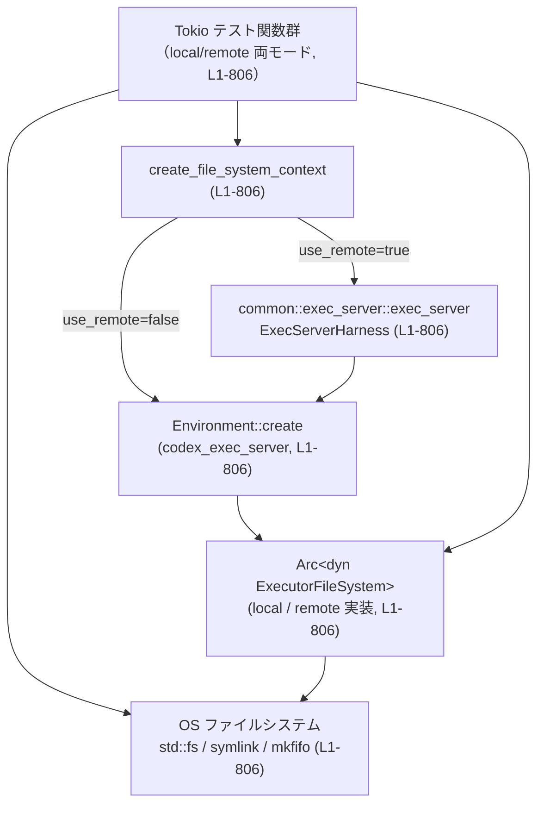

# exec-server/tests/file_system.rs

## 0. ざっくり一言

Unix 環境向けに、`codex_exec_server::ExecutorFileSystem` のローカル実装とリモート実装が、サンドボックス付きファイル操作・シンボリックリンク・FIFO などを含む契約どおりに動作するかを検証する統合テスト群です（`exec-server/tests/file_system.rs:L1-806` 全体）。

> 行番号について: このコンテキストではファイル全体の範囲（L1-806）しか取得できないため、各コンポーネントの「開始〜終了行」はすべて `exec-server/tests/file_system.rs:L1-806` と記載します。

---

## 1. このモジュールの役割

### 1.1 概要

- このテストモジュールは、`ExecutorFileSystem` 抽象が提供する各種ファイル操作 API が、**ローカル実行**と**リモート exec-server 経由の実行**の両方で同一の振る舞いをすることを検証します（`create_file_system_context` と各テスト関数、L1-806）。
- サンドボックス (`SandboxPolicy`) の読み取り専用モード／ワークスペース書き込みモードの挙動、シンボリックリンク経由のエスケープ防止、FIFO などの特殊ファイルの扱いといった **セキュリティ関連の契約** を重点的にテストしています（各 `*_with_sandbox_policy_*` テスト、L1-806）。

### 1.2 アーキテクチャ内での位置づけ

このファイルは「テストコード」であり、本体側コンポーネントの振る舞いを外側から検証します。

- テストは `common::exec_server::exec_server` を通じてリモート exec-server を起動します（`create_file_system_context`, L1-806）。
- `codex_exec_server::Environment` から `Arc<dyn ExecutorFileSystem>` を取得し、ローカル／リモートのどちらも同じインターフェースで扱います（L1-806）。
- OS の実ファイルシステムへの準備・検証（`std::fs`, `tempfile::TempDir`, `std::os::unix::fs::symlink`, `mkfifo`）と、`ExecutorFileSystem` 経由の操作結果を比較することで、契約どおりの動作を確認します（各テスト関数, L1-806）。



### 1.3 設計上のポイント

コードから読み取れる設計上の特徴は次のとおりです（すべて `exec-server/tests/file_system.rs:L1-806`）。

- **ローカル／リモートの二重実行**
  - 各テストは `#[test_case(false; "local")]` / `#[test_case(true; "remote")]` を付け、ローカル実装とリモート実装の両方に対して同じテストを行います。
  - これにより、`ExecutorFileSystem` の全メソッドについて「透過的に同じ挙動」を保証する契約が暗黙に定義されています。

- **Tokio マルチスレッドランタイム**
  - すべてのテストは `#[tokio::test(flavor = "multi_thread", worker_threads = 2)]` で実行されます。
  - `Arc<dyn ExecutorFileSystem>` を複数スレッドで扱える（`Send + Sync`）ことが前提になっています（コンパイル上の制約）。

- **絶対パスの強制**
  - `absolute_path(PathBuf) -> AbsolutePathBuf` ヘルパーで `path.is_absolute()` を assert し、`AbsolutePathBuf::try_from` で型レベルでも絶対パスを保証しています。
  - これにより、サンドボックス判定やパス正規化の前提条件をテスト側で満たしています。

- **サンドボックスポリシー生成ヘルパー**
  - 読み取り専用ポリシー (`read_only_sandbox_policy`) とワークスペース書き込みポリシー (`workspace_write_sandbox_policy`) を共通化し、各テストで一貫したルールを適用しています。

- **セキュリティ指向のテストケース**
  - シンボリックリンクを利用したエスケープ（`allowed/link -> outside`）に対して、すべての API でブロックされることを確認しています。
  - FIFO などの未知の特殊ファイルについて、ディレクトリコピー内では無視、トップレベルコピーではエラーとする契約がテストされています。

### 1.4 コンポーネント一覧（インベントリー）

ローカルに定義されている主なコンポーネント一覧です（定義はすべて `exec-server/tests/file_system.rs:L1-806`）。

| 名前 | 種別 | 役割 / 用途 | 定義範囲 |
|------|------|-------------|----------|
| `FileSystemContext` | 構造体 | `ExecutorFileSystem` と、必要に応じてリモート `ExecServerHarness` を束ねるテスト用コンテキスト | file_system.rs:L1-806 |
| `create_file_system_context` | `async fn` | `use_remote` フラグに応じてローカル／リモート環境を初期化し、`FileSystemContext` を構築する | file_system.rs:L1-806 |
| `absolute_path` | `fn` | `PathBuf` が絶対パスであることを検証し、`AbsolutePathBuf` に変換する | file_system.rs:L1-806 |
| `read_only_sandbox_policy` | `fn` | 指定されたルート以下のみ読み取りを許可する `SandboxPolicy::ReadOnly` を構築する | file_system.rs:L1-806 |
| `workspace_write_sandbox_policy` | `fn` | 指定されたルート以下のみ書き込みを許可する `SandboxPolicy::WorkspaceWrite` を構築する | file_system.rs:L1-806 |
| `file_system_get_metadata_returns_expected_fields` | 非同期テスト関数 | `get_metadata` の基本フィールド（`is_directory`, `is_file`, `modified_at_ms`）の妥当性を検証 | file_system.rs:L1-806 |
| `file_system_methods_cover_surface_area` | 非同期テスト関数 | `create_directory`, `write_file`, `read_file`, `read_file_text`, `copy`, `read_directory`, `remove` など基本メソッドの正常系を網羅的にテスト | file_system.rs:L1-806 |
| `file_system_copy_rejects_directory_without_recursive` | 非同期テスト関数 | ディレクトリを `recursive: false` でコピーしようとすると `InvalidInput` エラーになる契約を検証 | file_system.rs:L1-806 |
| `file_system_read_with_sandbox_policy_allows_readable_root` | 非同期テスト関数 | 読み取り専用サンドボックスで許可されたルート配下の読み取りが成功することを確認 | file_system.rs:L1-806 |
| `file_system_write_with_sandbox_policy_rejects_unwritable_path` | 非同期テスト関数 | 読み取り専用サンドボックスで書き込みが拒否されることを、エラー種別・メッセージまで含めて検証 | file_system.rs:L1-806 |
| その他 `*_with_sandbox_policy_*` テスト群 | 非同期テスト関数 | シンボリックリンクエスケープ、`. .` を含むパス、コピー・削除・メタデータ取得・ディレクトリ列挙など、各操作のサンドボックス挙動を詳細に検証 | file_system.rs:L1-806 |
| `file_system_copy_preserves_symlinks_in_recursive_copy` | 非同期テスト関数 | ディレクトリの再帰コピー時にシンボリックリンクを解決せず、そのままシンボリックリンクとしてコピーする契約を検証 | file_system.rs:L1-806 |
| `file_system_copy_ignores_unknown_special_files_in_recursive_copy` | 非同期テスト関数 | ディレクトリ再帰コピー時に FIFO（named pipe）など未知の特殊ファイルを無視する契約を検証 | file_system.rs:L1-806 |
| `file_system_copy_rejects_standalone_fifo_source` | 非同期テスト関数 | FIFO を単体でコピーしようとすると `InvalidInput` エラーになる契約を検証 | file_system.rs:L1-806 |

（他のテスト関数も同様に、特定のシナリオにおける `ExecutorFileSystem` の契約を定義しています。）

---

## 2. 主要な機能一覧

このテストモジュールがカバーしている主な機能は次のとおりです（すべて file_system.rs:L1-806）。

- **ローカル／リモート共通のファイル操作 API の正常系**
  - メタデータ取得: `get_metadata`
  - ディレクトリ作成: `create_directory`
  - ファイル書き込み／読み取り: `write_file`, `read_file`, `read_file_text`
  - コピー（非再帰／再帰）: `copy`
  - ディレクトリ一覧: `read_directory`
  - 削除: `remove`
  - → `file_system_methods_cover_surface_area` で一括検証。

- **コピー API のエラー契約**
  - ディレクトリを `recursive: false` でコピーした場合にエラーとする。
  - ディレクトリを自分自身またはその子孫ディレクトリにコピーしようとした場合にエラーとする。
  - FIFO などサポート外のトップレベルソースをコピーしようとした場合にエラーとする。
  - → `file_system_copy_rejects_*` 系テストで検証。

- **サンドボックス付き読み書きの契約**
  - 読み取り専用ポリシー下での読み取り許可／拒否。
  - ワークスペース書き込みポリシー下での書き込み許可／拒否。
  - シンボリックリンクを介したエスケープの防止。
  - `..` を含むパスの正規化と、その結果としてのエラー種別（`NotFound` vs `InvalidInput`）。
  - → `*_with_sandbox_policy_*` テスト群で検証。

- **シンボリックリンクの扱い**
  - `copy_with_sandbox_policy` および `copy` がシンボリックリンクの「リンクそのもの」を保持してコピーすること。
  - `remove_with_sandbox_policy` で、シンボリックリンク自身だけを削除し、リンク先は削除しないこと。
  - シンボリックリンクを含むパスでのサンドボックス抜けを禁止すること。

- **特殊ファイル（FIFO）の扱い**
  - ディレクトリ再帰コピー中に遭遇した FIFO を無視すること。
  - FIFO をトップレベルソースとしてコピーすることを禁止すること。

これらはすべて、具体的なアサーションを通じて「期待されるエラー種別 (`io::ErrorKind`) とエラーメッセージ」まで含めた契約としてテストされています（各テスト関数, file_system.rs:L1-806）。

---

## 3. 公開 API と詳細解説

このファイル自体はテストモジュールであり、外部から再利用される「公開 API」を直接提供してはいません。ただし、テストヘルパーやサンドボックスポリシー生成関数が**実質的な API 使用例／契約定義**として重要です。

### 3.1 型一覧（構造体・列挙体など）

ローカル定義の型は `FileSystemContext` のみです（file_system.rs:L1-806）。

| 名前 | 種別 | 役割 / 用途 | 主なフィールド |
|------|------|-------------|----------------|
| `FileSystemContext` | 構造体 | ローカル／リモートどちらの場合でも `Arc<dyn ExecutorFileSystem>` を取得し、リモートの場合は `ExecServerHarness` のライフタイムも管理するテスト用のコンテキスト | `file_system: Arc<dyn ExecutorFileSystem>`（テスト対象のファイルシステム） / `_server: Option<ExecServerHarness>`（リモート exec-server のハンドル。ローカル時は `None`） |

### 3.2 関数詳細（重要な 7 件）

#### `create_file_system_context(use_remote: bool) -> Result<FileSystemContext>`

**概要**

- ローカル／リモートいずれかの `ExecutorFileSystem` 実装を初期化して `FileSystemContext` を返す非同期ヘルパーです（file_system.rs:L1-806）。
- すべてのテスト関数はこのヘルパーを通じてファイルシステムを取得し、同一のテストロジックをローカル／リモート両方に対して実行しています。

**引数**

| 引数名 | 型 | 説明 |
|--------|----|------|
| `use_remote` | `bool` | `true` の場合はリモート exec-server を起動して接続し、`false` の場合はローカル実装を用いる |

**戻り値**

- `anyhow::Result<FileSystemContext>`  
  - 成功時: 初期化済みの `FileSystemContext`。
  - 失敗時: exec-server 起動失敗、`Environment::create` 失敗などに由来するエラーを `anyhow` 経由で返します。

**内部処理の流れ**

1. `use_remote` を判定（L1-806）。
2. `use_remote == true` の場合:
   - `exec_server().await?` で `ExecServerHarness` を起動。
   - `Environment::create(Some(server.websocket_url().to_string())).await?` でリモート接続用の環境を生成。
   - `environment.get_filesystem()` で `Arc<dyn ExecutorFileSystem>` を取得。
   - `FileSystemContext { file_system, _server: Some(server) }` を構築して返す。
3. `use_remote == false` の場合:
   - `Environment::create(None).await?` でローカル環境を生成。
   - 同様に `get_filesystem()` でファイルシステムを取得。
   - `_server: None` として `FileSystemContext` を返す。

（いずれも file_system.rs:L1-806）

**Examples（使用例）**

```rust
// ローカル実装を用いる場合
let context = create_file_system_context(false).await?; // file_system.rs:L1-806
let fs = context.file_system;                          // Arc<dyn ExecutorFileSystem>

// リモート exec-server 実装を用いる場合
let remote_context = create_file_system_context(true).await?;
let remote_fs = remote_context.file_system;
```

**Errors / Panics**

- `exec_server().await?` が失敗した場合、リモートモードでエラーになります。
- `Environment::create(..).await?` が失敗した場合も、そのまま `Err` として伝播します。
- パニックは内部では発生させていません。

**Edge cases（エッジケース）**

- `use_remote` の真偽以外に分岐はありません。
- テスト側では、`with_context(|| format!("mode={use_remote}"))` を多用しているため、失敗時に「local/remote どちらのモードか」がログに残るようになっています（例: `file_system_get_metadata_returns_expected_fields`, file_system.rs:L1-806）。

**使用上の注意点**

- この関数はテスト用ヘルパーであり、本番コードから直接呼び出すことは想定されていません。
- ローカル／リモート両実装間の一貫性を検証したい場合は、**必ず両モードでテストする**（`test_case` マクロとの組み合わせ）というパターンが示されています。

---

#### `absolute_path(path: std::path::PathBuf) -> AbsolutePathBuf`

**概要**

- 与えられた `PathBuf` が絶対パスであることを検証し、`AbsolutePathBuf`（絶対パスだけを表現する型）に変換します（file_system.rs:L1-806）。
- `ExecutorFileSystem` の各メソッドに渡すパスはすべてこのヘルパーを経由しており、**テスト側の前提として「絶対パスのみを扱う」**ことを保証しています。

**引数**

| 引数名 | 型 | 説明 |
|--------|----|------|
| `path` | `std::path::PathBuf` | 絶対パスであることが期待されるパス |

**戻り値**

- `AbsolutePathBuf`  
  - 絶対パスであることが保証されたパス表現です。

**内部処理の流れ**

1. `assert!(path.is_absolute(), "path must be absolute: {}", path.display());`
   - 絶対パスでない場合、パニックします（file_system.rs:L1-806）。
2. `AbsolutePathBuf::try_from(path)` を呼び出し:
   - `Ok(path)` の場合はそのまま返す。
   - `Err(err)` の場合は `panic!("path should be absolute: {err}")` でパニック。

**Examples（使用例）**

```rust
let tmp = tempfile::TempDir::new()?;
let file_path = tmp.path().join("note.txt");             // ここではまだ &Path

let abs = absolute_path(file_path.to_path_buf());        // 絶対パスでなければ panic
file_system.write_file(&abs, b"hello".to_vec()).await?;
```

**Errors / Panics**

- `path.is_absolute()` が `false` の場合に `panic!` します。
- `AbsolutePathBuf::try_from` が `Err` を返した場合にも `panic!` します。
  - `file_system_read_with_sandbox_policy_rejects_symlink_parent_dotdot_escape` では `..` を含むパスに対して `absolute_path` を呼んでいますが、そこでパニックしていないことから、少なくともそのケースは `try_from` が許容していると分かります（file_system.rs:L1-806）。

**Edge cases（エッジケース）**

- 相対パスを誤って渡した場合、テストは即座に panic します。
- `..` を含むパスでも `AbsolutePathBuf::try_from` が受け入れることがあるため、「正規化」の有無は `AbsolutePathBuf` 実装側に委ねられています（このファイルからは詳細不明）。

**使用上の注意点**

- 本番コードで似た変換を行う場合も、**相対パスを許容しない設計であれば同様のヘルパーを通す**と安全です。
- サンドボックス判定は絶対パス前提で書かれているため、このようなヘルパーを通してテストと同じ前提を維持することが重要です。

---

#### `read_only_sandbox_policy(readable_root: std::path::PathBuf) -> SandboxPolicy`

**概要**

- 指定したルートディレクトリ以下のみを読み取り可能とする `SandboxPolicy::ReadOnly` を構築するヘルパーです（file_system.rs:L1-806）。
- ネットワークアクセスや「プラットフォームデフォルトの読み取り許可」は無効化されています。

**引数**

| 引数名 | 型 | 説明 |
|--------|----|------|
| `readable_root` | `std::path::PathBuf` | 読み取りを許可するルートディレクトリ |

**戻り値**

- `SandboxPolicy` (`SandboxPolicy::ReadOnly`)  
  - `ReadOnlyAccess::Restricted { include_platform_defaults: false, readable_roots: vec![absolute_path(readable_root)] }`
  - `network_access: false`

**内部処理の流れ**

1. `absolute_path(readable_root)` を呼び、絶対パスに変換（file_system.rs:L1-806）。
2. `SandboxPolicy::ReadOnly { ... }` を構築。
   - `include_platform_defaults: false` にすることで、プラットフォーム依存のデフォルト読み取り許可（例: `/etc` など）が無効化されます。
   - `readable_roots` に単一の絶対パスを設定。
   - `network_access: false` でネットワークアクセスも禁止。

**Examples（使用例）**

```rust
let allowed_dir = tmp.path().join("allowed");
std::fs::create_dir_all(&allowed_dir)?;
std::fs::write(allowed_dir.join("note.txt"), "sandboxed hello")?;

let sandbox_policy = read_only_sandbox_policy(allowed_dir.clone());

let contents = file_system
    .read_file_with_sandbox_policy(
        &absolute_path(allowed_dir.join("note.txt")),
        Some(&sandbox_policy),
    )
    .await?;
assert_eq!(contents, b"sandboxed hello");
```

（`file_system_read_with_sandbox_policy_allows_readable_root`, file_system.rs:L1-806 より）

**Errors / Panics**

- `readable_root` が絶対パスでない場合、`absolute_path` でパニックします。
- サンドボックス自体の生成ではエラーは発生しません。

**Edge cases（エッジケース）**

- `allowed/link -> outside` のようなシンボリックリンクを経由する場合、`read_file_with_sandbox_policy` は `InvalidInput` で拒否されます（`file_system_read_with_sandbox_policy_rejects_symlink_escape`, file_system.rs:L1-806）。
- `allowed/link/../secret.txt` のように `..` を含むパスでは、実際には `allowed/secret.txt` へのアクセスと解釈され、ファイルが存在しないため `ErrorKind::NotFound` になるケースがテストされています（`file_system_read_with_sandbox_policy_rejects_symlink_parent_dotdot_escape`, file_system.rs:L1-806）。  
  → これは「`..` が適切に正規化される」ことと、「単なる存在しないファイルはサンドボックスエラーではなく NotFound になる」ことを示唆しています。

**使用上の注意点**

- 読み取り専用ポリシーは「書き込み禁止」も含意しており、`write_file_with_sandbox_policy` などの書き込み系 API は `InvalidInput` エラーになります（`file_system_write_with_sandbox_policy_rejects_unwritable_path`, file_system.rs:L1-806）。
- 読み取り許可は **シンボリックリンク解決後の実パス** が `readable_roots` 以下にあるかどうかで判定されていることが、エスケープ系テストから読み取れます。

---

#### `workspace_write_sandbox_policy(writable_root: std::path::PathBuf) -> SandboxPolicy`

**概要**

- 指定したルートディレクトリ以下のみ書き込みを許可する `SandboxPolicy::WorkspaceWrite` を構築するヘルパーです（file_system.rs:L1-806）。
- `TMPDIR` 環境変数や `/tmp` といったデフォルト一時ディレクトリへの書き込みを明示的に除外している点が特徴です。

**引数**

| 引数名 | 型 | 説明 |
|--------|----|------|
| `writable_root` | `std::path::PathBuf` | 書き込みを許可するワークスペースルートディレクトリ |

**戻り値**

- `SandboxPolicy` (`SandboxPolicy::WorkspaceWrite`)  
  - `writable_roots: vec![absolute_path(writable_root)]`
  - `read_only_access: ReadOnlyAccess::Restricted { include_platform_defaults: false, readable_roots: vec![] }`
  - `network_access: false`
  - `exclude_tmpdir_env_var: true`
  - `exclude_slash_tmp: true`

**内部処理の流れ**

1. `absolute_path(writable_root)` で絶対パス化。
2. 上記フィールドを持つ `SandboxPolicy::WorkspaceWrite` を構築。

**Examples（使用例）**

```rust
let allowed_dir = tmp.path().join("allowed");
std::fs::create_dir_all(&allowed_dir)?;

let sandbox_policy = workspace_write_sandbox_policy(allowed_dir.clone());

// 許可されたルート配下への書き込みは成功するはず
file_system.write_file_with_sandbox_policy(
    &absolute_path(allowed_dir.join("note.txt")),
    b"ok".to_vec(),
    Some(&sandbox_policy),
).await?;
```

（この具体パターンはファイル内に直接はありませんが、`workspace_write_sandbox_policy` + `*_with_sandbox_policy` テストの組合せから容易に構成できます。ヘルパーの使用は各テスト（L1-806）で確認できます。）

**Errors / Panics**

- `writable_root` が絶対パスでない場合は `absolute_path` でパニックします。
- サンドボックス生成自体でエラーは発生しません。

**Edge cases（エッジケース）**

- `allowed/link -> outside` のようなシンボリックリンクを経由する書き込み（`write_file_with_sandbox_policy`, `create_directory_with_sandbox_policy`, `copy_with_sandbox_policy`, `remove_with_sandbox_policy` で、宛先またはソースがエスケープするパターン）は、いずれも `ErrorKind::InvalidInput` と `"fs/write is not permitted for path ..."` メッセージで拒否されることが、複数のテストから分かります（file_system.rs:L1-806）。
- 一方で、「シンボリックリンクそのもの」を削除する操作は許可されます（`file_system_remove_with_sandbox_policy_removes_symlink_not_target`, file_system.rs:L1-806）。

**使用上の注意点**

- ワークスペース外への書き込みが **エラー** になる（`PermissionDenied` ではなく `InvalidInput`）という契約は、API 利用側にとって重要です。`io::ErrorKind` で挙動分岐する場合、テストと同じ前提を置く必要があります。
- `/tmp` や `TMPDIR` が既定許可されないようにしているため、既存のコードが「一時ディレクトリへの書き込み」を期待している場合は、このポリシーと整合を取る必要があります。

---

#### `file_system_methods_cover_surface_area(use_remote: bool) -> Result<()>`

**概要**

- `ExecutorFileSystem` が提供する基本的なメソッド群の「正常系」を一括して検証する非同期テストです（file_system.rs:L1-806）。
- ローカル／リモート両方に対して実行されるため、実装ごとの差異が出ないことを確認する役割があります。

**引数**

| 引数名 | 型 | 説明 |
|--------|----|------|
| `use_remote` | `bool` | `create_file_system_context` 用のフラグ。`false` でローカル、`true` でリモートをテスト |

**戻り値**

- `anyhow::Result<()>`  
  - すべての操作が成功した場合 `Ok(())`。
  - いずれかの操作が失敗した場合、`with_context(|| format!("mode={use_remote}"))` 付きでエラー伝播。

**内部処理の流れ（アルゴリズム）**

1. `create_file_system_context(use_remote).await?` でファイルシステムを取得。
2. `TempDir::new()?` で一時ディレクトリを作成。
3. 階層構造を構築:
   - `source_dir`, `nested_dir`, `source_file`, `nested_file`, `copied_dir`, `copied_file` を `tmp` 配下に定義。
4. ディレクトリ作成:
   - `file_system.create_directory(&absolute_path(nested_dir.clone()), CreateDirectoryOptions { recursive: true })` で `source/nested` を生成。
5. ファイル書き込み:
   - `write_file` で `nested_file` と `source_file` に別の内容を書き込む。
6. ファイル読み取り:
   - `read_file` で `nested_file` のバイト列を取得し `"hello from trait"` に一致することを確認。
   - `read_file_text` で同じ内容を文字列として読み出し、同値を確認。
7. コピー（ファイル単体）:
   - `copy`（`recursive: false`）で `nested_file` を `copied_file` にコピーし、`std::fs::read_to_string` で内容を検証。
8. コピー（ディレクトリ再帰）:
   - `copy`（`recursive: true`）で `source_dir` を `copied_dir` にコピーし、`copied_dir/nested/note.txt` の内容を検証。
9. ディレクトリ一覧:
   - `read_directory` で `source_dir` を列挙し、ソートした上で `nested` ディレクトリと `root.txt` ファイルだけが存在することを確認。
10. 削除:
    - `remove`（`recursive: true, force: true`）で `copied_dir` を削除し、`exists()` が `false` であることを確認。

**Examples（使用例）**

このテスト関数全体が、そのまま `ExecutorFileSystem` の基本的な使い方のサンプルになっています。簡略版を示します。

```rust
let context = create_file_system_context(false).await?;
let fs = context.file_system;

let tmp = tempfile::TempDir::new()?;
let source_dir = tmp.path().join("source");
let nested_dir = source_dir.join("nested");

// ディレクトリ作成
fs.create_directory(
    &absolute_path(nested_dir.clone()),
    CreateDirectoryOptions { recursive: true },
).await?;

// ファイル書き込み
let nested_file = nested_dir.join("note.txt");
fs.write_file(&absolute_path(nested_file.clone()), b"hello".to_vec()).await?;

// ファイル読み取り
let contents = fs.read_file(&absolute_path(nested_file)).await?;
assert_eq!(contents, b"hello");
```

**Errors / Panics**

- 正常系テストであり、ここではエラーが起きないことを期待しています。
- 失敗した場合は `with_context(|| format!("mode={use_remote}"))` により、「local/remote どちらのモードか」を含んだエラーとなります。
- panic を明示的に発生させている箇所はありません。

**Edge cases（エッジケース）**

- `read_directory` の結果はソートされていない前提で `entries.sort_by` を呼んでいるため、「返される順序に意味はない」という契約が読み取れます（file_system.rs:L1-806）。
- `remove` に `force: true` を渡しているため、「存在しないパスを渡したときの挙動」はこのテストからは分かりません（このチャンクには現れません）。

**使用上の注意点**

- ここで使われているメソッド群は、すべてサンドボックス無し（`*_with_sandbox_policy` ではない）バージョンです。サンドボックス付き API では追加のエラー条件があることに注意が必要です。
- テストは `TempDir` を使っており、パスは毎回異なる一時パスになります。この前提が本番環境とは異なる可能性があります。

---

#### `file_system_copy_with_sandbox_policy_preserves_symlink_source(use_remote: bool) -> Result<()>`

**概要**

- サンドボックス付きコピー (`copy_with_sandbox_policy`) が、**シンボリックリンクのターゲットではなくシンボリックリンクそのもの** をコピーする契約を検証するテストです（file_system.rs:L1-806）。
- コピー先が同じサンドボックスルート内であれば、リンク先がサンドボックス外であっても許可されることを確認します。

**引数**

| 引数名 | 型 | 説明 |
|--------|----|------|
| `use_remote` | `bool` | ローカル／リモートの切り替えフラグ |

**戻り値**

- `anyhow::Result<()>`（成功時 `Ok(())`）

**内部処理の流れ**

1. `create_file_system_context(use_remote)` で `file_system` を取得。
2. `TempDir` を生成し、`allowed_dir` と `outside_dir` を作成。
3. `outside_file`（`outside/outside.txt`）を作成して `"outside"` と書き込む。
4. `source_symlink = allowed_dir.join("link")` として、`symlink(&outside_file, &source_symlink)` を作成。
5. `copied_symlink = allowed_dir.join("copied-link")` をコピー先として定義。
6. `workspace_write_sandbox_policy(allowed_dir.clone())` でサンドボックスポリシーを生成。
7. `file_system.copy_with_sandbox_policy(&absolute_path(source_symlink), &absolute_path(copied_symlink.clone()), CopyOptions { recursive: false }, Some(&sandbox_policy))` を実行。
8. 結果の `copied_symlink` に対して:
   - `std::fs::symlink_metadata` で `is_symlink()` が `true` であることを確認。
   - `std::fs::read_link(copied_symlink)` が `outside_file` と一致することを確認。

**Examples（使用例）**

```rust
let sandbox_policy = workspace_write_sandbox_policy(allowed_dir.clone());

file_system.copy_with_sandbox_policy(
    &absolute_path(source_symlink.clone()), // allowed_dir/link (symlink)
    &absolute_path(copied_symlink.clone()), // allowed_dir/copied-link
    CopyOptions { recursive: false },
    Some(&sandbox_policy),
).await?;

// コピー結果が symlink であり、リンク先も同じであることを確認
let copied_metadata = std::fs::symlink_metadata(&copied_symlink)?;
assert!(copied_metadata.file_type().is_symlink());
assert_eq!(std::fs::read_link(copied_symlink)?, outside_file);
```

（file_system.rs:L1-806）

**Errors / Panics**

- このテストケースではエラーが発生しないことを期待しています。
- シンボリックリンクをコピーする操作そのものは、サンドボックス外への I/O を伴わないため許可される設計になっていることが、このテストから読み取れます。

**Edge cases（エッジケース）**

- 直前の `file_system_copy_with_sandbox_policy_rejects_symlink_escape_destination` では、**コピー先** パスが `allowed/link -> outside` を経由して outside に抜けようとすると `InvalidInput` で拒否されます（file_system.rs:L1-806）。  
  → 同じシンボリックリンクでも、「コピー先」として使う場合はエスケープ検知が働き、「コピー元」として使う場合はリンクそのものをコピーするため許可される、という対照を示しています。
- コピー元がディレクトリや通常ファイルの場合の挙動は他のテスト（例: `file_system_copy_preserves_symlinks_in_recursive_copy`, file_system.rs:L1-806）で検証されています。

**使用上の注意点**

- `copy_with_sandbox_policy` を利用する側は、「シンボリックリンクが解決されるかどうか」を意識しておく必要があります。  
  少なくともこのテストに基づく限り、**コピー操作はシンボリックリンクを解決せずにコピーする**契約になっています。
- セキュリティ的には、シンボリックリンクのコピー自体はサンドボックス境界を越えないため許可されていますが、その後の利用者がコピーされたリンクをどう扱うかによっては、外部のファイルにアクセスし得ることに注意が必要です（この点は本ファイルの外側の責務です）。

---

#### `file_system_copy_ignores_unknown_special_files_in_recursive_copy(use_remote: bool) -> Result<()>`

**概要**

- ディレクトリ再帰コピー時に、FIFO（named pipe）などサポート外の特殊ファイルに遭遇した場合、**エラーにせず単にコピー対象から除外する**契約を検証するテストです（file_system.rs:L1-806）。

**引数**

| 引数名 | 型 | 説明 |
|--------|----|------|
| `use_remote` | `bool` | ローカル／リモート切り替えフラグ |

**戻り値**

- `anyhow::Result<()>`（成功時 `Ok(())`）

**内部処理の流れ**

1. `create_file_system_context(use_remote)` で `file_system` を取得。
2. `TempDir` を作成し、`source_dir` と `copied_dir` を定義。
3. `std::fs::create_dir_all(&source_dir)` でディレクトリ作成。
4. `std::fs::write(source_dir.join("note.txt"), "hello")` で通常ファイルを作成。
5. `fifo_path = source_dir.join("named-pipe")` を定義。
6. `Command::new("mkfifo").arg(&fifo_path).output()?` で FIFO（named pipe）を作成。
   - `!output.status.success()` の場合は `anyhow::bail!` でテスト自体を中断（mkfifo コマンドが利用できない環境対策）。
7. `file_system.copy(&absolute_path(source_dir), &absolute_path(copied_dir.clone()), CopyOptions { recursive: true })` を実行。
8. 結果として:
   - `copied_dir/note.txt` が `"hello"` という内容で存在すること。
   - `copied_dir/named-pipe` が存在しないこと (`exists() == false`) を確認。

**Examples（使用例）**

```rust
file_system.copy(
    &absolute_path(source_dir.clone()),  // note.txt と named-pipe を含むディレクトリ
    &absolute_path(copied_dir.clone()),
    CopyOptions { recursive: true },
).await?;

// 通常ファイルはコピーされる
assert_eq!(
    std::fs::read_to_string(copied_dir.join("note.txt"))?,
    "hello"
);
// FIFO はコピーされない
assert!(!copied_dir.join("named-pipe").exists());
```

（file_system.rs:L1-806）

**Errors / Panics**

- ディレクトリ再帰コピー処理自体はエラーなく完了することを期待しています。
- `mkfifo` コマンドが失敗した場合のみ、テストが `bail!` で早期終了します。
- FIFO に対するコピー処理をトップレベルで行った場合は別のテスト `file_system_copy_rejects_standalone_fifo_source` で `InvalidInput` エラーになることが検証されています（file_system.rs:L1-806）。

**Edge cases（エッジケース）**

- ディレクトリ再帰コピー中に「サポート外のファイル種別（FIFO, ソケットなど）」を見つけた場合、**エラーにせず無視する**契約がこのテストから読み取れます。
- 一方、`file_system_copy_rejects_standalone_fifo_source` では、FIFO 単体をコピーしようとすると `"fs/copy only supports regular files, directories, and symlinks"` という `InvalidInput` エラーが期待されています。  
  → 「ディレクトリ内に混じっている分には黙ってスキップ」「トップレベルソースとして指定された場合はエラー」という二段構えの扱いです。

**使用上の注意点**

- 再帰コピーを利用する側は、「ディレクトリ内の特殊ファイルが silently 無視される」ことを前提にすべきです。  
  重要なデータを FIFO/ソケットなどで表現している場合、それらはコピーされません。
- 一方で、特殊ファイルの存在によってコピー全体が失敗しないため、「できる限りコピーを成功させる」設計が取られています。

---

### 3.3 その他の関数

ここまで詳細に扱っていないテスト関数の一覧です（すべて file_system.rs:L1-806）。

| 関数名 | 役割（1 行） |
|--------|--------------|
| `file_system_get_metadata_returns_expected_fields` | `get_metadata` で `is_directory`, `is_file`, `modified_at_ms` が期待どおり設定されていることを検証する。 |
| `file_system_copy_rejects_directory_without_recursive` | ディレクトリを `recursive: false` で `copy` した場合、`InvalidInput` と `"fs/copy requires recursive: true when sourcePath is a directory"` で失敗する契約を検証する。 |
| `file_system_read_with_sandbox_policy_allows_readable_root` | 読み取り専用サンドボックスで許可されたルート配下の `read_file_with_sandbox_policy` が成功することを確認する。 |
| `file_system_write_with_sandbox_policy_rejects_unwritable_path` | 読み取り専用サンドボックスでの `write_file_with_sandbox_policy` が `InvalidInput` と `"fs/write is not permitted for path ..."` で失敗することを検証する。 |
| `file_system_read_with_sandbox_policy_rejects_symlink_escape` | `allowed/link -> outside` 経由の読み取りが `InvalidInput` と `"fs/read is not permitted for path ..."` で拒否されることを検証する。 |
| `file_system_read_with_sandbox_policy_rejects_symlink_parent_dotdot_escape` | `allowed/link/../secret.txt` というパスが、サンドボックスエラーではなく `ErrorKind::NotFound` になる（適切に正規化される）ことを検証する。 |
| `file_system_write_with_sandbox_policy_rejects_symlink_escape` | 書き込み先パスに `allowed/link -> outside` を含む場合に `InvalidInput` で拒否されることを検証する。 |
| `file_system_create_directory_with_sandbox_policy_rejects_symlink_escape` | ディレクトリ作成先パスにシンボリックリンクエスケープが含まれる場合に `InvalidInput` で拒否されることを検証する。 |
| `file_system_get_metadata_with_sandbox_policy_rejects_symlink_escape` | メタデータ取得パスにシンボリックリンクエスケープが含まれる場合に `InvalidInput` で拒否されることを検証する。 |
| `file_system_read_directory_with_sandbox_policy_rejects_symlink_escape` | ディレクトリ列挙パスにシンボリックリンクエスケープが含まれる場合に `InvalidInput` で拒否されることを検証する。 |
| `file_system_copy_with_sandbox_policy_rejects_symlink_escape_destination` | コピー先パスがシンボリックリンク経由でサンドボックス外に出る場合に `InvalidInput` で拒否されることを検証する。 |
| `file_system_remove_with_sandbox_policy_removes_symlink_not_target` | シンボリックリンク自身の削除が許可され、リンク先ファイルはそのまま残ることを検証する。 |
| `file_system_remove_with_sandbox_policy_rejects_symlink_escape` | `allowed/link/secret.txt` のようなパスでリンク先 outside を削除しようとすると `InvalidInput` で拒否されることを検証する。 |
| `file_system_copy_with_sandbox_policy_rejects_symlink_escape_source` | コピー元パスが `allowed/link/secret.txt` のように outside を指す場合に `InvalidInput` と `"fs/read is not permitted for path ..."` で拒否されることを検証する。 |
| `file_system_copy_rejects_copying_directory_into_descendant` | ディレクトリを自分自身の子孫ディレクトリにコピーしようとすると `InvalidInput` と `"fs/copy cannot copy a directory to itself or one of its descendants"` で拒否されることを検証する。 |
| `file_system_copy_preserves_symlinks_in_recursive_copy` | ディレクトリ再帰コピー時に、ディレクトリ内のシンボリックリンクがリンクとして保持されることを検証する。 |
| `file_system_copy_rejects_standalone_fifo_source` | FIFO をトップレベルソースとして `copy` すると `InvalidInput` と `"fs/copy only supports regular files, directories, and symlinks"` でエラーになることを検証する。 |

---

## 4. データフロー

ここでは代表的なシナリオとして、「シンボリックリンクをサンドボックス付きコピーで複製する」ケース（`file_system_copy_with_sandbox_policy_preserves_symlink_source`, file_system.rs:L1-806）を取り上げます。

### 処理の要点

- テスト関数は `create_file_system_context` を通じてローカルまたはリモートの `ExecutorFileSystem` を取得します。
- OS レベルで一時ディレクトリ・通常ファイル・シンボリックリンクを作成します。
- サンドボックスポリシーを生成し、`copy_with_sandbox_policy` を呼び出して、シンボリックリンクを別名でコピーします。
- その後、OS レベルでコピー結果が「シンボリックリンクであり、リンク先が元と同一」であることを確認します。

```mermaid
sequenceDiagram
  participant T as テスト関数<br/>file_system_copy_with_sandbox_policy_preserves_symlink_source<br/>(L1-806)
  participant C as create_file_system_context<br/>(L1-806)
  participant Env as Environment::create<br/>(codex_exec_server)
  participant FS as Arc&lt;dyn ExecutorFileSystem&gt;
  participant OS as OSファイルシステム<br/>std::fs/symlink

  T->>C: create_file_system_context(use_remote)
  C->>Env: Environment::create(exec_server_url?)
  Env-->>C: Arc&lt;dyn ExecutorFileSystem&gt;
  C-->>T: FileSystemContext { file_system: FS }

  T->>OS: TempDir::new(), create_dir_all, write(outside_file)
  T->>OS: symlink(outside_file, source_symlink)

  T->>T: workspace_write_sandbox_policy(allowed_dir)

  T->>FS: copy_with_sandbox_policy(source_symlink, copied_symlink,<br/>CopyOptions{recursive:false}, sandbox)

  FS->>OS: シンボリックリンクの複製処理
  OS-->>FS: 成功

  FS-->>T: Ok(())

  T->>OS: symlink_metadata(copied_symlink), read_link(copied_symlink)
  OS-->>T: is_symlink == true, target == outside_file
```

この図から分かるように、テストは **OS ファイルシステムと `ExecutorFileSystem` の両方を使って同じ状態を観測**することで、期待される挙動（シンボリックリンクの保持）を検証しています（file_system.rs:L1-806）。

---

## 5. 使い方（How to Use）

このファイルはテスト用ですが、`ExecutorFileSystem` とサンドボックスポリシーの「典型的な使い方」をそのまま示しています。

### 5.1 基本的な使用方法

ローカル実装を使ってファイルを書き込み・読み込みする最小例を、テストコードに倣って示します（file_system.rs:L1-806 を簡略化）。

```rust
use std::sync::Arc;
use codex_exec_server::{Environment, ExecutorFileSystem, CreateDirectoryOptions, CopyOptions};
use codex_utils_absolute_path::AbsolutePathBuf;
use tempfile::TempDir;

// テストヘルパーと同じ absolute_path 関数
fn absolute_path(path: std::path::PathBuf) -> AbsolutePathBuf {
    assert!(path.is_absolute(), "path must be absolute: {}", path.display());
    AbsolutePathBuf::try_from(path).expect("path should be absolute")
}

#[tokio::main]
async fn main() -> anyhow::Result<()> {
    // 1. 環境を初期化してファイルシステムを取得する
    let environment = Environment::create(None).await?;       // ローカル実装
    let fs: Arc<dyn ExecutorFileSystem> = environment.get_filesystem();

    // 2. 作業用ディレクトリを準備する
    let tmp = TempDir::new()?;                                // 一時ディレクトリ
    let file_path = tmp.path().join("note.txt");              // &Path でファイル名を組み立てる

    // 3. ファイルにデータを書き込む
    fs.write_file(
        &absolute_path(file_path.clone()),                    // AbsolutePathBuf に変換
        b"hello from example".to_vec(),                       // バイト列として書き込む内容
    ).await?;

    // 4. ファイルからデータを読み取る
    let contents = fs.read_file_text(
        &absolute_path(file_path.clone()),
    ).await?;
    println!("read back: {}", contents);                      // "hello from example" が表示されることを期待

    Ok(())
}
```

この例は `file_system_methods_cover_surface_area` の一部を取り出したものです（file_system.rs:L1-806）。

### 5.2 よくある使用パターン

1. **ローカル vs リモートの切り替え**

```rust
// ローカル
let env = Environment::create(None).await?;
let fs_local = env.get_filesystem();

// リモート（exec_server() の実装は tests/common にある）
let server = common::exec_server::exec_server().await?;
let env_remote = Environment::create(Some(server.websocket_url().to_string())).await?;
let fs_remote = env_remote.get_filesystem();
```

- テストでは `create_file_system_context(use_remote)` によってこの切り替えを隠蔽し、`#[test_case(false)]` / `#[test_case(true)]` で同じテストを両方に適用しています（file_system.rs:L1-806）。

1. **読み取り専用サンドボックスでの安全な読み取り**

```rust
let allowed_dir = tmp.path().join("allowed");
std::fs::create_dir_all(&allowed_dir)?;
std::fs::write(allowed_dir.join("note.txt"), "sandboxed")?;

let sandbox = read_only_sandbox_policy(allowed_dir.clone());

let contents = fs.read_file_with_sandbox_policy(
    &absolute_path(allowed_dir.join("note.txt")),
    Some(&sandbox),
).await?;
assert_eq!(contents, b"sandboxed");
```

（`file_system_read_with_sandbox_policy_allows_readable_root`, file_system.rs:L1-806）

1. **ワークスペース書き込みサンドボックスでの安全な書き込み**

```rust
let workspace = tmp.path().join("workspace");
std::fs::create_dir_all(&workspace)?;

let sandbox = workspace_write_sandbox_policy(workspace.clone());

fs.write_file_with_sandbox_policy(
    &absolute_path(workspace.join("note.txt")),
    b"workspace data".to_vec(),
    Some(&sandbox),
).await?;
```

1. **再帰コピーとサンドボックス**

```rust
let sandbox = workspace_write_sandbox_policy(allowed_dir.clone());

fs.copy_with_sandbox_policy(
    &absolute_path(allowed_dir.join("source.txt")),     // ソース
    &absolute_path(allowed_dir.join("copy.txt")),       // コピー先（同じルート内）
    CopyOptions { recursive: false },
    Some(&sandbox),
).await?;
```

- シンボリックリンクが絡む場合の挙動は前述のテストケースに準じます（file_system.rs:L1-806）。

### 5.3 よくある間違い

テストコードは、意図的な誤用を行い、その結果をアサートすることで契約を定義しています。代表的な誤用と正しい使い方を対比します（file_system.rs:L1-806）。

```rust
// 間違い例1: ディレクトリを recursive: false でコピーする
let err = fs.copy(
    &absolute_path(source_dir.clone()),
    &absolute_path(dest_dir.clone()),
    CopyOptions { recursive: false },  // ディレクトリには不適切
).await.unwrap_err();
assert_eq!(err.kind(), std::io::ErrorKind::InvalidInput);

// 正しい例: ディレクトリには recursive: true を指定する
fs.copy(
    &absolute_path(source_dir.clone()),
    &absolute_path(dest_dir.clone()),
    CopyOptions { recursive: true },
).await?;

// 間違い例2: サンドボックス外のパスに書き込む
let sandbox = read_only_sandbox_policy(allowed_dir.clone());
let err = fs.write_file_with_sandbox_policy(
    &absolute_path(tmp.path().join("blocked.txt")),     // allowed_dir の外
    b"nope".to_vec(),
    Some(&sandbox),
).await.unwrap_err();
assert_eq!(err.kind(), std::io::ErrorKind::InvalidInput);

// 正しい例: サンドボックスルート配下に書き込む
let sandbox = workspace_write_sandbox_policy(allowed_dir.clone());
fs.write_file_with_sandbox_policy(
    &absolute_path(allowed_dir.join("ok.txt")),         // allowed_dir の中
    b"ok".to_vec(),
    Some(&sandbox),
).await?;
```

### 5.4 使用上の注意点（まとめ）

テストから読み取れる、`ExecutorFileSystem` とサンドボックス使用時の注意点を整理します（根拠はいずれも file_system.rs:L1-806）。

- **絶対パス前提**
  - すべての API 呼び出しは `AbsolutePathBuf` を受け取っています。相対パスを渡すとテスト側の `absolute_path` で panic するため、本番コードでも可能な限り絶対パスを使うことが推奨されます。

- **エラー種別 (`io::ErrorKind`) とメッセージは契約の一部**
  - 例: ディレクトリを `recursive: false` でコピー → `InvalidInput` + `"fs/copy requires recursive: true when sourcePath is a directory"`。
  - サンドボックス外への書き込み → `InvalidInput` + `"fs/write is not permitted for path ..."`。
  - サンドボックス外への読み取り → `InvalidInput` + `"fs/read is not permitted for path ..."`。
  - ディレクトリを自身または子孫へコピー → `InvalidInput` + `"fs/copy cannot copy a directory to itself or one of its descendants"`。
  - FIFO 単体のコピー → `InvalidInput` + `"fs/copy only supports regular files, directories, and symlinks"`。
  - これらは複数のテストで文字列一致まで検証されており、**API の契約として固定されている**と見なせます。

- **シンボリックリンクの扱い**
  - 読み取り・書き込み・メタデータ取得・ディレクトリ一覧・コピーなどにおいて、シンボリックリンクを介してサンドボックス外に出ようとする操作はすべて拒否されます。
  - ただし「シンボリックリンクそのものを削除／コピーする」操作（リンク先には触れない）は許可されます。

- **特殊ファイル（FIFO）の扱い**
  - ディレクトリ再帰コピー中に遭遇した FIFO は無視されます（コピーされない）。
  - FIFO をトップレベルソースとしてコピーしようとするとエラーになります。

- **並行性とテスト環境**
  - テストは Tokio マルチスレッドランタイム上で動作していますが、個々のテスト内では同時並行な `ExecutorFileSystem` 呼び出しは行っていません。
  - したがって、「API がスレッドセーフであること」はコンパイルレベルで `Arc<dyn ExecutorFileSystem + Send + Sync>` を満たすことを通じてのみ確認されており、実ランタイムでの高負荷シナリオはこのファイルではカバーされていません（このチャンクには現れません）。

---

## 6. 変更の仕方（How to Modify）

このモジュールは「契約を定義する統合テスト」としての役割が強いため、変更する場合は契約への影響を慎重に考える必要があります。

### 6.1 新しい機能を追加する場合

`ExecutorFileSystem` に新しいメソッドやオプションが追加された場合のテスト拡張の流れです（file_system.rs:L1-806 を前提）。

1. **ヘルパーの再利用**
   - 既存の `create_file_system_context`, `absolute_path`, `read_only_sandbox_policy`, `workspace_write_sandbox_policy` を再利用し、新しいテスト関数を実装します。
2. **ローカル／リモート両モードに対応**
   - 新しいテスト関数にも `#[test_case(false; "local")]` と `#[test_case(true; "remote")]` を付け、ローカルとリモートの挙動が一致することを確認します。
3. **サンドボックスが絡む場合**
   - 読み取り専用／書き込みサンドボックスの双方で、シンボリックリンクエスケープや特殊ファイルを含むエッジケースを検討し、必要なテストを追加します。
4. **エラー契約の明示**
   - 新しいメソッドが失敗する条件について、`io::ErrorKind` と `to_string()` の内容を明示的にアサートすることで、契約をテストに刻みます。

### 6.2 既存の機能を変更する場合

`ExecutorFileSystem` の挙動を変更する際に注意すべき点です。

- **エラー種別・メッセージの互換性**
  - このファイルは多くのテストで `error.kind()` と `error.to_string()` の両方を検証しています（file_system.rs:L1-806）。  
    既存の挙動を変えるとテストが落ちるため、「挙動変更」と「テスト更新」が必ずペアになります。
- **サンドボックスのセキュリティ境界**
  - シンボリックリンクエスケープや FIFO の扱いなど、安全性に関わる仕様はこのテストで定義されています。  
    セキュリティポリシーを変更する場合は、**どのケースで許可／拒否するのか** をテストに反映させる必要があります。
- **影響範囲の確認**
  - テストは統合的なシナリオに焦点を当てているため、ユニットテストや他のモジュールのテストと合わせて、変更の影響範囲を確認することが重要です（このファイル単体からは他テストの存在は分かりません）。

---

## 7. 関連ファイル

このモジュールと密接に関係する外部コンポーネントを列挙します（パスはコード中のモジュール指定から読み取れる範囲にとどめます）。

| パス / モジュール | 役割 / 関係 |
|-------------------|------------|
| `common::exec_server` | `exec_server()` および `ExecServerHarness` を提供し、リモート exec-server の起動と接続 URL 取得を行います。`create_file_system_context` から利用されています（file_system.rs:L1-806）。 |
| `codex_exec_server::Environment` | `Environment::create` と `get_filesystem` により `Arc<dyn ExecutorFileSystem>` を提供します。ローカル／リモート双方の実装を隠蔽するファクトリとして機能しています（file_system.rs:L1-806）。 |
| `codex_exec_server::ExecutorFileSystem` | このテストの主対象となるファイルシステム抽象です。メタデータ取得・コピー・削除・サンドボックス付き操作などのメソッドを提供します（file_system.rs:L1-806）。 |
| `codex_exec_server::{CopyOptions, CreateDirectoryOptions, RemoveOptions}` | 各ファイル操作メソッドに渡されるオプション構造体です（再帰フラグや force フラグなど）。 |
| `codex_protocol::protocol::{SandboxPolicy, ReadOnlyAccess}` | サンドボックスの読み取り／書き込みポリシーを表す型で、テスト内の `read_only_sandbox_policy`, `workspace_write_sandbox_policy` から利用されています。 |
| `codex_utils_absolute_path::AbsolutePathBuf` | 絶対パスのみを表現するユーティリティ型で、`absolute_path` ヘルパーを通じて使用されています。 |
| `tempfile::TempDir` | 各テストで孤立した一時ディレクトリを提供し、ファイル操作の副作用をテストプロセス終了時に自動的にクリーンアップします。 |
| `std::os::unix::fs::symlink` | シンボリックリンク作成のために使用されています。サンドボックスエスケープやリンクコピーの挙動をテストするための基盤です（Unix 限定）。 |
| `std::process::Command` (`mkfifo`) | FIFO（named pipe）を作成するために利用され、特殊ファイルの扱いをテストする際の基盤となっています。 |

このファイルは、これらコンポーネントの「期待される振る舞い」を具体的なテストケースとして定義しているため、`ExecutorFileSystem` の仕様を理解する上で重要なリファレンスとなります。
