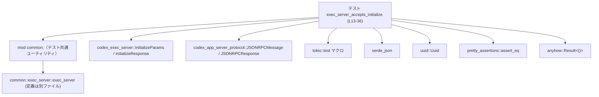
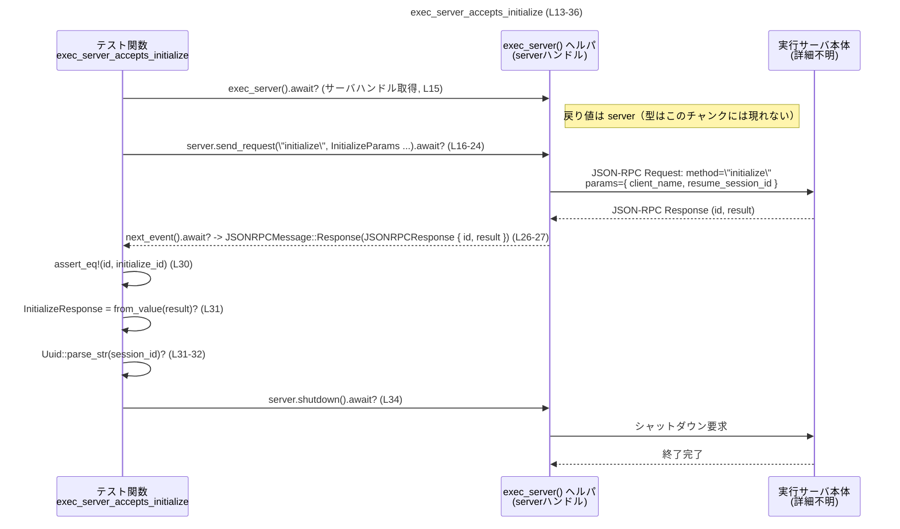

# exec-server/tests/initialize.rs コード解説

---

## 0. ざっくり一言

このファイルは、`exec_server` が JSON-RPC の `"initialize"` リクエストを正しく受け付け、期待どおりの `InitializeResponse` を返し、その中の `session_id` が UUID 形式であることを検証する **非同期テスト** を定義しています（`exec-server/tests/initialize.rs:L13-36`）。

---

## 1. このモジュールの役割

### 1.1 概要

- Unix 環境でのみ有効なテストモジュールです（`#![cfg(unix)]`、`exec-server/tests/initialize.rs:L1-1`）。
- `exec_server`（共通テストヘルパ）を起動し、JSON-RPC `"initialize"` リクエストを送り、レスポンスの内容を検証します（`L15-32`）。
- これにより、実行サーバ側の初期化プロトコルが最低限動作していることを確認します。

### 1.2 アーキテクチャ内での位置づけ

このテストは、以下のような依存関係を持ちます。



- `mod common;` により別モジュール `common` に依存しますが、その実体（ファイルパスや内容）はこのチャンクには現れません（`L3-3`）。
- `exec_server()` は `common::exec_server` モジュール内に定義されたヘルパ関数であり、実行サーバへのハンドルを返していると解釈できますが、型や内部構造は不明です（`L9`, `L15`）。
- プロトコル関連の型 (`JSONRPCMessage`, `JSONRPCResponse`, `InitializeParams`, `InitializeResponse`) は外部クレートから提供されています（`L5-8`）。

### 1.3 設計上のポイント

コードから読み取れる設計上の特徴は次のとおりです。

- **非同期テスト + マルチスレッドランタイム**  
  - `#[tokio::test(flavor = "multi_thread", worker_threads = 2)]` により、Tokio のマルチスレッドランタイム（ワーカ 2 スレッド）上でテストが実行されます（`L13-13`）。
  - これにより、サーバ側の処理がマルチスレッド環境でも正しく動作するかを間接的に検証しています。

- **エラー処理に `anyhow::Result` を使用**  
  - テスト関数は `anyhow::Result<()>` を返し、`?` 演算子で様々な失敗ケースをまとめて伝播します（`L14`, `L15-24`, `L26`, `L31-32`, `L34`）。
  - パニックすべき「プロトコル違反」（レスポンスの種類が違う）と、「環境や I/O などに起因する失敗」を区別しています（`L27-28`）。

- **JSON-RPC プロトコルと JSON シリアライズ**  
  - `send_request` には `serde_json::to_value` で JSON 値に変換した `InitializeParams` を渡しています（`L17-22`）。
  - レスポンスの `result` は `serde_json::from_value` で `InitializeResponse` 型にデシリアライズされます（`L31`）。

- **セッション ID のフォーマット検証**  
  - `Uuid::parse_str` を用いて `initialize_response.session_id` が UUID 形式として妥当であることを検証します（`L31-32`）。

---

## 2. 主要な機能一覧（コンポーネントインベントリー）

このファイルに **定義されている**・**使用されている**主なコンポーネントを整理します。

### 2.1 このファイル内で定義されている関数

| 名前 | 種別 | 役割 / 用途 | 根拠 |
|------|------|-------------|------|
| `exec_server_accepts_initialize` | 非同期テスト関数 | `exec_server` が `"initialize"` リクエストを受け付け、妥当な `InitializeResponse` を返すことを検証する | `exec-server/tests/initialize.rs:L13-36` |

### 2.2 外部からインポートしている主な型・関数

| 名前 | 出所 | 種別 | このファイルでの役割 | 根拠 |
|------|------|------|----------------------|------|
| `JSONRPCMessage` | `codex_app_server_protocol` | 列挙体（と推測） | `next_event` の戻り値をパターンマッチし、JSON-RPC レスポンスかどうかを判定 | `L5`, `L27` |
| `JSONRPCResponse` | `codex_app_server_protocol` | 構造体（と推測） | `JSONRPCMessage::Response` の中身として `id`, `result` を取り出す | `L6`, `L27` |
| `InitializeParams` | `codex_exec_server` | 構造体 | `"initialize"` リクエストのパラメータを表現 | `L7`, `L19-21` |
| `InitializeResponse` | `codex_exec_server` | 構造体 | 初期化レスポンスのペイロード（`session_id` を含む）を表現 | `L8`, `L31-32` |
| `exec_server` | `common::exec_server` | 関数 | 実行サーバと接続するためのハンドルを生成 | `L9`, `L15` |
| `assert_eq` | `pretty_assertions` | マクロ | `id` と `initialize_id` の一致を検証し、差分を見やすく表示 | `L10`, `L30` |
| `Uuid` | `uuid` | 構造体 | 文字列から UUID をパースし、`session_id` の妥当性を検証 | `L11`, `L31-32` |

> `JSONRPCMessage` / `JSONRPCResponse` / `InitializeParams` / `InitializeResponse` / `exec_server` などの内部定義は、このチャンクには現れません。

---

## 3. 公開 API と詳細解説

### 3.1 型一覧（このファイルで直接定義されるもの）

このファイルには新たな構造体・列挙体などの型定義はありません（`exec-server/tests/initialize.rs:L1-36` を見る限り）。

利用している主な型（外部定義）は以下です。

| 名前 | 種別 | 役割 / 用途 | 定義場所（推測含む） |
|------|------|-------------|----------------------|
| `JSONRPCMessage` | 列挙体（と推測） | JSON-RPC のメッセージ種類を表現し、`Response` バリアントからレスポンス情報を取り出す | `codex_app_server_protocol` クレート（`L5`, `L27`） |
| `JSONRPCResponse` | 構造体（と推測） | JSON-RPC レスポンスの `id` と `result` などを保持 | 同上（`L6`, `L27`） |
| `InitializeParams` | 構造体 | `"initialize"` リクエストのパラメータ (`client_name`, `resume_session_id`) を表現 | `codex_exec_server` クレート（`L7`, `L19-21`） |
| `InitializeResponse` | 構造体 | 初期化時に返される情報（少なくとも `session_id` フィールドを持つ）を表現 | `codex_exec_server` クレート（`L8`, `L31-32`） |

> `InitializeResponse` に `session_id` フィールドが存在することは、`initialize_response.session_id` へのアクセスから読み取れます（`L32`）。

### 3.2 関数詳細

#### `exec_server_accepts_initialize() -> anyhow::Result<()>`

**概要**

- Tokio のマルチスレッドランタイム上で実行される非同期テストです（`L13-14`）。
- 共通ヘルパ `exec_server()` を使って実行サーバを起動し、JSON-RPC `"initialize"` リクエストを送信して、レスポンスの ID 一致と `session_id` の UUID 形式を検証します（`L15-32`）。

**引数**

- 引数はありません（`L14`）。

**戻り値**

- `anyhow::Result<()>`  
  - テストとしては値を返さず、副作用（アサーション・パニック）によって成否を表現します（`L14`, `L35`）。
  - `Err` が返された場合は、Tokio のテストランナーによってテスト失敗と扱われる想定です。

**内部処理の流れ（アルゴリズム）**

1. **サーバハンドルの取得**  
   - `let mut server = exec_server().await?;` により、共通ヘルパ `exec_server()` を呼び出し、実行サーバと通信するためのハンドルを取得します（`L15`）。  
   - `await?` なので、非同期初期化に失敗すると即座に `Err` を返し、テストが失敗します。

2. **initialize リクエストの送信**  
   - `"initialize"` というメソッド名と、`InitializeParams` を JSON Value に変換したものを `send_request` に渡します（`L16-23`）。
   - パラメータは以下の通りです（`L19-21`）。
     - `client_name: "exec-server-test".to_string()`
     - `resume_session_id: None`
   - 送信後、`send_request(...).await?` の戻り値としてリクエスト ID（`initialize_id`）を受け取ります（`L16-24`）。

3. **レスポンスイベントの受信**  
   - `let response = server.next_event().await?;` で次のイベントを受信します（`L26`）。
   - このイベントが JSON-RPC メッセージである前提で処理を進めます。

4. **レスポンス種別と内容の検証**  
   - `let JSONRPCMessage::Response(JSONRPCResponse { id, result }) = response else { ... };` により、受信したメッセージが `Response` であることをパターンマッチしています（`L27`）。
   - もし `Response` 以外であれば `panic!("expected initialize response");` でテストを即失敗させます（`L27-28`）。
   - `assert_eq!(id, initialize_id);` で、レスポンスの `id` が送信時に得た `initialize_id` と一致することを検証します（`L30`）。

5. **InitializeResponse のデシリアライズと UUID 検証**  
   - `result`（JSON 値）を `serde_json::from_value` で `InitializeResponse` にデシリアライズします（`L31`）。
   - `Uuid::parse_str(&initialize_response.session_id)?;` によって、`session_id` が UUID として正しい形式であることを検証します（`L31-32`）。  
     - 正しくない場合、`parse_str` が `Err` を返し、テストは `Err` 経由で失敗します。

6. **サーバのシャットダウン**  
   - `server.shutdown().await?;` を呼び出し、サーバハンドルをクリーンに終了させます（`L34`）。
   - シャットダウン処理の失敗も `Err` としてテスト失敗になります。

7. **正常終了**  
   - `Ok(())` を返し、テストを成功として終了します（`L35`）。

**Examples（使用例）**

このテスト関数自体はテストランナーから自動的に呼び出されるため、通常コードから直接呼び出すことは想定されていません。ただし、「別のメソッドをテストする」ためのテンプレートとしては次のように利用できます。

```rust
// 別の JSON-RPC メソッド "someMethod" をテストするイメージコード
#[tokio::test(flavor = "multi_thread", worker_threads = 2)]
async fn exec_server_accepts_some_method() -> anyhow::Result<()> {
    // サーバハンドルを取得する（initialize.rs:L15 と同様）
    let mut server = exec_server().await?;

    // 任意のメソッド用のパラメータ構造体（仮）を JSON に変換して送信する
    let request_id = server
        .send_request(
            "someMethod",
            serde_json::to_value(/* SomeMethodParams 構造体 */)?,
        )
        .await?;

    // レスポンスイベントを受信する（initialize.rs:L26 と同様）
    let response = server.next_event().await?;

    // JSONRPCMessage::Response を期待してパターンマッチする
    let JSONRPCMessage::Response(JSONRPCResponse { id, result }) = response else {
        panic!("expected someMethod response");
    };

    // ID が一致していることを検証する
    assert_eq!(id, request_id);

    // 期待するレスポンス型にデシリアライズして内容を検証する
    let some_response: SomeMethodResponse = serde_json::from_value(result)?;
    // some_response の各フィールドを検証する …

    // サーバを終了
    server.shutdown().await?;
    Ok(())
}
```

> 上記例の `SomeMethodParams` / `SomeMethodResponse` は、このチャンクには現れない仮の型です。

**Errors / Panics**

このテスト関数が失敗しうる条件を整理します。

- **`Err` を返して失敗するケース**
  - `exec_server().await` がエラーを返す（サーバ起動や接続に失敗）（`L15`）。
  - `serde_json::to_value(InitializeParams { ... })` がシリアライズエラーを返す（`L19-22`）。
  - `server.send_request(...).await` がエラーを返す（I/O などの問題）（`L16-24`）。
  - `server.next_event().await` がエラーを返す（接続切断など）（`L26`）。
  - `serde_json::from_value(result)` が `InitializeResponse` へのデシリアライズに失敗する（`L31`）。
  - `Uuid::parse_str(&initialize_response.session_id)` が UUID 文字列として不正であるため `Err` を返す（`L31-32`）。
  - `server.shutdown().await` がシャットダウン時にエラーを返す（`L34`）。

- **`panic!` によって異常終了するケース**
  - `response` が `JSONRPCMessage::Response` ではない場合、  
    `panic!("expected initialize response");` が実行されます（`L27-28`）。
    - 例: `JSONRPCMessage::Notification` 等が返ってきた場合（実際のバリアント名はこのチャンクには現れません）。

**Edge cases（エッジケース）**

- **レスポンスが別のメッセージ種別だった場合**  
  - `JSONRPCMessage::Response(_)` 以外のバリアントであれば即座に panic します（`L27-28`）。
  - これは「initialize には必ずレスポンスが来る」というプロトコル前提をテストで強制していると言えます。

- **`id` が一致しない場合**  
  - `assert_eq!(id, initialize_id);` が失敗し、テストは panic します（`L30`）。
  - これにより、サーバが別リクエストのレスポンスを返している、あるいは `id` を正しくエコーバックしていない場合を検出できます。

- **`result` が期待形式の JSON でない場合**  
  - `serde_json::from_value(result)` が `Err` を返し、テストが `Err` で失敗します（`L31`）。
  - たとえば、`session_id` フィールドが欠けている、型が違うなどのケースです。

- **`session_id` が UUID 形式でない場合**  
  - `Uuid::parse_str(&initialize_response.session_id)` が `Err` を返し、テストが失敗します（`L32`）。

**使用上の注意点**

- この関数は **テスト用** であり、プロダクションコードから直接利用することは想定されていません（`L13-14`）。
- `exec_server` の戻り値型や内部処理はこのチャンクには現れないため、`send_request` / `next_event` / `shutdown` の振る舞い詳細は不明です（`L15-16`, `L26`, `L34`）。
- **並行性**:  
  - テスト自体は 1 つの async 関数ですが、Tokio のマルチスレッドランタイム下で動作するため、`exec_server` 内部やサーバ側でマルチスレッドな処理が行われている可能性があります（`L13`）。  
  - このテストはその環境下で少なくとも 1 回の `"initialize"` 往復が正常に行えることを検証しています。
- **セキュリティ観点**:  
  - `session_id` の形式チェック以外に、認証・認可や暗号化などのセキュリティ機構に関する情報はこのチャンクには現れません。
  - テストコードであるため、この関数自体が外部から直接攻撃されるような経路は想定しにくいですが、本番サーバのセキュリティ水準については別のコードの確認が必要です。

### 3.3 その他の関数

このファイル内には、補助関数やラッパー関数は定義されていません（`L1-36`）。

---

## 4. データフロー

このテストにおける典型的な処理シナリオは、「テスト → サーバハンドル → JSON-RPC リクエスト送信 → レスポンス受信 → 検証 → シャットダウン」という流れです。

### 4.1 シーケンス図



> `S`（実行サーバ本体）の具体的実装・プロセス構成などは、このチャンクには現れません。

---

## 5. 使い方（How to Use）

### 5.1 基本的な使用方法

このファイルはテスト専用であり、主な「使い方」は **`exec_server` を使った統合テストを書くときのパターン** として参照することです。

基本フローは次のとおりです（`L15-35` を簡略化）。

```rust
#[tokio::test(flavor = "multi_thread", worker_threads = 2)]
async fn some_test() -> anyhow::Result<()> {
    // 実行サーバとの接続ハンドルを取得
    let mut server = exec_server().await?;

    // JSON-RPC リクエストを送信し、リクエスト ID を受け取る
    let request_id = server
        .send_request("methodName", serde_json::to_value(/* params */)?)
        .await?;

    // サーバから次のイベント（メッセージ）を取得
    let response = server.next_event().await?;

    // レスポンスであることを確認し、中身を取り出す
    let JSONRPCMessage::Response(JSONRPCResponse { id, result }) = response else {
        panic!("expected methodName response");
    };
    assert_eq!(id, request_id); // ID が一致することを検証

    // result を期待するレスポンス型にデシリアライズ
    let typed_response: SomeResponseType = serde_json::from_value(result)?;

    // typed_response の内容を検証 ...

    // テスト終了前にサーバをシャットダウン
    server.shutdown().await?;
    Ok(())
}
```

### 5.2 よくある使用パターン

- **初期化メソッド（`"initialize"`）のテスト**  
  - 本ファイルがその具体例です（`L16-23`, `L31-32`）。
  - パラメータとして `InitializeParams` を渡し、`InitializeResponse` にデシリアライズします。

- **他メソッドのテスト**  
  - メソッド名とパラメータ型・レスポンス型を差し替えるだけで、同様のパターンでテストを増やすことができます。
  - `send_request` → `next_event` → `JSONRPCMessage::Response` という流れは共通です（`L16-27`）。

### 5.3 よくある間違い

このファイルから推測できる、起こりそうな誤用例を挙げます。

```rust
// 間違い例: next_event() の結果を Response としてマッチしていない
let response = server.next_event().await?;
// ここで型に応じたパターンマッチをせずに result を直接使おうとすると、
// JSONRPCMessage の他のバリアントの場合にエラーとなる可能性がある

// 正しい例: 必ず JSONRPCMessage::Response を期待してパターンマッチする
let JSONRPCMessage::Response(JSONRPCResponse { id, result }) = response else {
    panic!("expected initialize response"); // initialize.rs:L27-28 に準拠
};
```

```rust
// 間違い例: サーバシャットダウンを呼ばない
let mut server = exec_server().await?;
let _id = server
    .send_request("initialize", serde_json::to_value(InitializeParams { /* ... */ })?)
    .await?;
// server.shutdown() を呼ばずにテストを終了すると、
// リソースリークや以降のテストへの影響が発生する可能性がある（詳細はこのチャンクには現れない）

// 正しい例: テスト終了前に shutdown を呼ぶ
server.shutdown().await?; // initialize.rs:L34
```

### 5.4 使用上の注意点（まとめ）

- **Tokio ランタイムの設定**  
  - `#[tokio::test(flavor = "multi_thread", worker_threads = 2)]` を付与することで、テストごとにランタイムが生成されます（`L13`）。  
  - ランタイムの設定を変更したい場合は、この属性を編集する必要があります。

- **JSON-RPC メッセージの取り扱い**  
  - `next_event` の戻り値は `JSONRPCMessage` であり、必ずパターンマッチでバリアントを確認する必要があります（`L26-27`）。

- **UUID 検証**  
  - `Uuid::parse_str` を利用した形式検証は、`session_id` が単なる文字列でなく UUID であることを保証しますが、  
    意味的な検証（有効なセッションであるかどうか）はこのテストでは行っていません（`L31-32`）。

- **エラー伝播とパニックの区別**  
  - I/O やシリアライズ失敗は `Err` で伝播し、プロトコル違反（レスポンスタイプ不一致）は `panic!` で即座に失敗させる構造になっています（`L15-16`, `L26-28`, `L31-32`）。

---

## 6. 変更の仕方（How to Modify）

### 6.1 新しい機能（テストケース）を追加する場合

1. **新しいテスト関数を追加**  
   - 同じファイル、または別テストファイルに `#[tokio::test(...)]` を付けた `async fn` を追加します（`L13-14` を参考）。

2. **`exec_server` を利用したセットアップ**  
   - 必要に応じて `let mut server = exec_server().await?;` を使ってサーバハンドルを取得します（`L15`）。

3. **特定のメソッドを呼び出すためのパラメータ型を決定**  
   - `InitializeParams` 相当の型（メソッドごとのパラメータ型）を外部クレートから利用します（このチャンクには他の型は現れません）。

4. **`send_request` → `next_event` → パターンマッチ**  
   - `"methodName"` と適切なパラメータを `send_request` に渡し、`next_event` でレスポンスを受け取る流れを実装します（`L16-27`）。

5. **レスポンスの検証ロジックを追加**  
   - `JSONRPCResponse { id, result }` の `id` を検証し、`result` を期待するレスポンス型にデシリアライズして内容を確認します（`L30-31`）。

6. **クリーンアップのために `shutdown` 呼び出し**  
   - テストの最後で `server.shutdown().await?;` を呼び出し、リソースを解放します（`L34`）。

### 6.2 既存の機能を変更する場合

- **`InitializeParams` や `InitializeResponse` の構造が変わる場合**
  - `serde_json::to_value` に渡すフィールド（`client_name`, `resume_session_id`）を新しい構造に合わせて修正する必要があります（`L19-21`）。
  - `InitializeResponse` のフィールド名や型が変わる場合は、`initialize_response.session_id` へのアクセス部分を更新し、必要なら追加の検証を行います（`L31-32`）。

- **プロトコル仕様変更（例: initialize が通知になる）**
  - `JSONRPCMessage::Response` 以外の形で結果が返る仕様に変わる場合、`response` のパターンマッチ部分（`L27-28`）を新仕様に合わせて修正する必要があります。

- **影響範囲の確認**
  - `exec_server` ヘルパや `InitializeParams` / `InitializeResponse` の変更は、他のテストファイルにも影響する可能性があります。  
    そのため、`mod common;` 以下のモジュールや、`codex_exec_server` / `codex_app_server_protocol` を利用している他のテストの確認が必要です（このチャンクにはそれらは現れません）。

---

## 7. 関連ファイル

このモジュールと密接に関係すると思われるファイル・ディレクトリを整理します。

| パス / モジュール名 | 役割 / 関係 |
|---------------------|------------|
| `common` モジュール | `mod common;` によりインポートされるテスト共通ユーティリティ集。ここから `exec_server` が提供されます（`L3`, `L9`, `L15`）。ファイルパス（`tests/common.rs` など）はこのチャンクには現れません。 |
| `common::exec_server` モジュール | `exec_server()` 関数を定義し、実行サーバとの通信ハンドルを作成します（`L9`, `L15`）。内部実装はこのチャンクには現れません。 |
| `codex_exec_server` クレート | `InitializeParams`, `InitializeResponse` 型を提供し、実行サーバの JSON-RPC API と密接に関係します（`L7-8`, `L19-21`, `L31-32`）。 |
| `codex_app_server_protocol` クレート | JSON-RPC メッセージの表現として `JSONRPCMessage`, `JSONRPCResponse` を提供します（`L5-6`, `L27`）。 |
| `uuid` クレート | `Uuid` 型を提供し、`InitializeResponse` の `session_id` の形式検証に使用されます（`L11`, `L31-32`）。 |
| `pretty_assertions` クレート | `assert_eq` マクロを提供し、ID の一致検証時に見やすい差分表示を行います（`L10`, `L30`）。 |

> これらの関連ファイル・クレートの内部実装は、このチャンクには現れないため、詳細は各クレートのソースコードまたはドキュメントを参照する必要があります。
