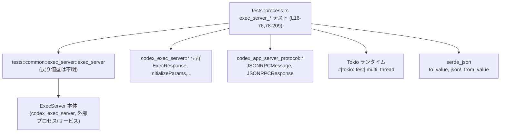
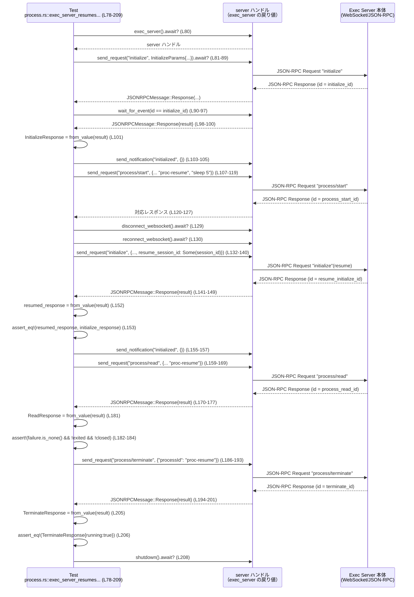

# exec-server/tests/process.rs コード解説

## 0. ざっくり一言

Unix 環境で `codex_exec_server` のプロセス起動・セッション再接続まわりを WebSocket 経由の JSON-RPC で検証する統合テストです（2 本の Tokio 非同期テスト関数）。  
（根拠: `#![cfg(unix)]`, 2 つの `#[tokio::test]` 関数 `exec_server_starts_process_over_websocket`, `exec_server_resumes_detached_session_without_killing_processes`  
`exec-server/tests/process.rs:L1-2,L16-76,L78-209`）

---

## 1. このモジュールの役割

### 1.1 概要

- このテストモジュールは、**Exec Server が JSON-RPC over WebSocket でプロセスを起動・操作できるか** を検証するために存在します。
- 具体的には、
  - WebSocket 経由で `initialize` → `initialized` → `process/start` を行いプロセスが起動できること
  - セッションを切断してもサーバー側プロセスは継続し、`resume_session_id` を指定した再 `initialize` によってセッションが復元できること
  - 復元後に `process/read` でプロセスが生きていることを確認し、`process/terminate` が期待どおりのレスポンスを返すこと  
をテストしています。  
（根拠: メソッド名と JSON-RPC メッセージ内容  
`exec-server/tests/process.rs:L18-75,L80-208`）

### 1.2 アーキテクチャ内での位置づけ

このファイル単体から分かる依存関係を図示します。



- テスト関数は `exec_server()`（`common::exec_server` モジュール）から **テスト用サーバーハンドル**を取得し、`send_request` / `send_notification` / `wait_for_event` などのメソッドで JSON-RPC レベルのやり取りを行います。  
  （根拠: `let mut server = exec_server().await?;` とその後のメソッド呼び出し  
  `exec-server/tests/process.rs:L18,L41-53,L55-61,L37-39,L80,L107-119,L120-127,L132-140,L159-169,L170-177,L186-193,L194-201`）
- JSON-RPC のメッセージ表現には `codex_app_server_protocol` の `JSONRPCMessage`, `JSONRPCResponse` を使用し、ペイロードは `serde_json` でシリアライズ/デシリアライズしています。  
  （根拠: `use codex_app_server_protocol::*;`, `serde_json::to_value`, `serde_json::from_value`, `serde_json::json!`  
  `exec-server/tests/process.rs:L5-6,L22,L41-52,L66,L83-88,L101,L107-118,L135-138,L159-167,L181,L187-191`）

### 1.3 設計上のポイント

- **Unix 限定テスト**  
  `#![cfg(unix)]` により、このテストは Unix 系 OS でのみコンパイル・実行されます。  
  （根拠: `exec-server/tests/process.rs:L1`）
- **非同期・マルチスレッド実行**  
  両テストは `#[tokio::test(flavor = "multi_thread", worker_threads = 2)]` で Tokio のマルチスレッドランタイム上で実行されます。  
  （根拠: `exec-server/tests/process.rs:L16,L78`）
- **ID 駆動の JSON-RPC レスポンス待ち**  
  `send_request` が返す `id` を保持し、`wait_for_event` にクロージャを渡して  
  `JSONRPCMessage::Response(JSONRPCResponse { id, .. }) if id == &<期待ID>`  
  を満たすメッセージが来るまで待機する設計です。  
  （根拠: `initialize_id`, `process_start_id`, `process_read_id`, `terminate_id` 利用箇所  
  `exec-server/tests/process.rs:L19-27,L28-35,L41-53,L55-61,L81-89,L90-97,L107-119,L120-127,L132-140,L141-148,L159-169,L170-177,L186-193,L194-201`）
- **レスポンス種別の強制チェック**  
  `let JSONRPCMessage::Response(JSONRPCResponse { ... }) = response else { panic!(...) };`  
  というパターンで、`wait_for_event` から返るメッセージが必ず `Response` であることを強制し、そうでなければ `panic!` します。  
  （根拠: `exec-server/tests/process.rs:L62-64,L98-100,L149-151,L178-180,L202-204`）
- **型安全な JSON デコード**  
  JSON-RPC の `result` フィールドは一度 `serde_json::Value` として受け取り、目的の型 (`InitializeResponse`, `ExecResponse`, `ReadResponse`, `TerminateResponse`) に `serde_json::from_value` で変換しています。  
  （根拠: `serde_json::from_value(result)?` 呼び出し  
  `exec-server/tests/process.rs:L66,L101,L152,L181,L205`）
- **エラー処理の方針**  
  戻り値を `anyhow::Result<()>` とし、`?` 演算子で発生したエラーをテスト失敗としてそのまま伝播させます。ロジック的な不整合は `assert_eq!` や `panic!` で検出します。  
  （根拠: 関数シグネチャと `?`, `assert_eq!`, `panic!` の使用  
  `exec-server/tests/process.rs:L17,L79,L18,L27,L37-39,L41-53,L66,L74,L80,L89,L103-105,L107-119,L120-127,L129-130,L132-140,L159-169,L170-177,L186-193,L208`）

---

## 2. 主要な機能・コンポーネント一覧

### 2.1 コンポーネントインベントリー

| 名称 | 種別 | 定義位置 / 出典 | 役割 / 用途 |
|------|------|-----------------|-------------|
| `exec_server_starts_process_over_websocket` | 非公開テスト関数 (`async fn`) | `exec-server/tests/process.rs:L16-76` | WebSocket 経由で Exec Server を初期化し、`process/start` でプロセスが起動できることを検証する統合テスト。 |
| `exec_server_resumes_detached_session_without_killing_processes` | 非公開テスト関数 (`async fn`) | `exec-server/tests/process.rs:L78-209` | セッション切断後に `resume_session_id` を指定して再接続し、プロセスが継続していること、`process/terminate` の応答が期待どおりであることを検証する統合テスト。 |
| `exec_server` | 関数（戻り値型不明） | `use common::exec_server::exec_server;` `exec-server/tests/process.rs:L13,L18,L80` | テスト用 Exec Server を起動し、`send_request` などのメソッドを備えたハンドルを返す初期化関数。戻り値型はこのチャンクには現れません。 |
| `JSONRPCMessage` | 列挙体 | `use codex_app_server_protocol::JSONRPCMessage;` `exec-server/tests/process.rs:L5,L30-33,L56-59,L62,L92-95,L98,L123-126,L142-147,L149,L172-175,L178,L196-199,L202` | JSON-RPC メッセージ全体を表す enum。ここでは `Response(JSONRPCResponse)` バリアントのみ使用。 |
| `JSONRPCResponse` | 構造体 | `use codex_app_server_protocol::JSONRPCResponse;` `exec-server/tests/process.rs:L6,L30-33,L56-59,L62,L92-95,L98,L123-126,L142-147,L149,L172-175,L178,L196-199,L202` | JSON-RPC レスポンスの型。少なくとも `id` と `result` フィールドを持つことがコードから分かります。 |
| `InitializeParams` | 構造体 | `use codex_exec_server::InitializeParams;` `exec-server/tests/process.rs:L8,L22-25,L83-87,L135-138` | `initialize` リクエストのパラメータ。`client_name: String` と `resume_session_id` フィールド（`Option<...>` 型）が存在。 |
| `InitializeResponse` | 構造体 | `use codex_exec_server::InitializeResponse;` `exec-server/tests/process.rs:L9,L101,L152-153` | `initialize` レスポンスの `result`。少なくとも `session_id` フィールドを持ち、`Clone`・`PartialEq` 相当の比較が可能です。 |
| `ExecResponse` | 構造体 | `use codex_exec_server::ExecResponse;` `exec-server/tests/process.rs:L7,L66-72` | `process/start` レスポンスの `result`。`process_id: ProcessId` フィールドを持つ。 |
| `ProcessId` | 構造体 or 新しい型 | `use codex_exec_server::ProcessId;` `exec-server/tests/process.rs:L10,L70` | プロセス ID を表す型。`ProcessId::from(&str)` 形式の `From` 実装があることが分かります。 |
| `ReadResponse` | 構造体 | `use codex_exec_server::ReadResponse;` `exec-server/tests/process.rs:L11,L181-184` | `process/read` の `result`。`failure` フィールド（`Option<_>`）、`exited: bool`, `closed: bool` を持ちます。 |
| `TerminateResponse` | 構造体 | `use codex_exec_server::TerminateResponse;` `exec-server/tests/process.rs:L12,L205-206` | `process/terminate` の `result`。`running: bool` フィールドを持つ。 |
| `server.send_request` ほか | メソッド群（型は不明） | `server` 変数のメソッド呼び出しとして出現 | JSON-RPC リクエスト送信・イベント待機・通知送信・WebSocket 切断/再接続・シャットダウンを行う API。実装はこのチャンクには現れません。 |

### 2.2 主要な機能一覧（テストが検証する振る舞い）

- プロセス起動: `process/start` に `"argv": ["true"]` を渡すと `ExecResponse { process_id: "proc-1" }` が返る。  
  （根拠: `ExecResponse` のデコードと `assert_eq!`  
  `exec-server/tests/process.rs:L41-53,L55-72`）
- セッション復元: 1 回目の `initialize` の `InitializeResponse` と、`resume_session_id` を指定した再 `initialize` のレスポンスが等しい。  
  （根拠: `initialize_response` と `resumed_response` の比較  
  `exec-server/tests/process.rs:L81-101,L132-153`）
- 再接続後のプロセス状態確認: `process/read` の結果で `failure.is_none()`, `exited == false`, `closed == false` が成り立つ（プロセスが生きていて、I/O チャネルもクローズされていないことの確認）。  
  （根拠: `process_read_response` へのアサーション  
  `exec-server/tests/process.rs:L159-167,L170-177,L181-184`）
- 終了要求の挙動: `process/terminate` の結果が `TerminateResponse { running: true }`。テストとしては「終了要求を送った直後でも `running` が `true` である」という挙動を期待しています。  
  （根拠: `terminate_response` の比較  
  `exec-server/tests/process.rs:L186-193,L194-206`）

---

## 3. 公開 API と詳細解説

このファイル自身はテストモジュールであり `pub` な関数や型は定義していませんが、**テスト関数は Exec Server API の代表的な使い方**になっているため、それらを詳細に解説します。

### 3.1 型一覧（このファイルから分かる範囲）

| 名前 | 種別 | 役割 / 用途 | フィールド / 特徴（このチャンクから分かる範囲） |
|------|------|-------------|--------------------------------------------|
| `JSONRPCMessage` | 列挙体 | JSON-RPC メッセージ全体。`wait_for_event` から受信。 | バリアント `Response(JSONRPCResponse)` が存在。その他のバリアントはこのチャンクには現れません。 |
| `JSONRPCResponse` | 構造体 | JSON-RPC レスポンス。 | 少なくとも `id`, `result` フィールドを持つ。`id == &initialize_id` などの比較に利用。 |
| `InitializeParams` | 構造体 | `initialize` リクエストパラメータ。 | `client_name: String`, `resume_session_id: Option<_>` フィールドが存在し、`serde_json::to_value` でシリアライズ可能。 |
| `InitializeResponse` | 構造体 | `initialize` レスポンス結果。 | `session_id` フィールドを持ち、その型は `Clone` 実装を持つ。構造体全体が `PartialEq` 相当で比較可能。 |
| `ExecResponse` | 構造体 | `process/start` レスポンス結果。 | `process_id: ProcessId` フィールドを持つ。`PartialEq` 相当で比較可能。 |
| `ProcessId` | 新しい型 or 構造体 | プロセス ID。 | `ProcessId::from(&str)` 系の関連関数があり、`ExecResponse` のフィールド型として使用。 |
| `ReadResponse` | 構造体 | `process/read` レスポンス結果。 | `failure: Option<_>`, `exited: bool`, `closed: bool` フィールドを持つ。 |
| `TerminateResponse` | 構造体 | `process/terminate` レスポンス結果。 | `running: bool` フィールドを持つ。 |

※ これらの型の定義そのものは `codex_exec_server` や `codex_app_server_protocol` クレート側にあり、このチャンクには現れません。

### 3.2 テスト関数詳細

#### `exec_server_starts_process_over_websocket() -> anyhow::Result<()>`

**概要**

Exec Server を WebSocket 経由で初期化し、`process/start` リクエストで `"argv": ["true"]` を実行した結果、`ExecResponse` の `process_id` が期待どおりであることを確認するテストです。  
（根拠: テスト本体の処理内容  
`exec-server/tests/process.rs:L16-76`）

**引数**

- 引数はありません（テスト関数のため）。

**戻り値**

- `anyhow::Result<()>`  
  - `Ok(())`: テストがすべてのアサーションを満たし、エラーなく完了した場合。  
  - `Err(anyhow::Error)`: `exec_server()` や JSON シリアライズ/デシリアライズなどでエラーが発生した場合。テストは失敗として扱われます。  
  （根拠: 関数シグネチャと `?` の利用  
  `exec-server/tests/process.rs:L17-18,L22,L27,L37-39,L41-53,L66,L74-75`）

**内部処理の流れ**

1. **テスト用 Exec Server の起動**  
   `let mut server = exec_server().await?;`  
   非同期に Exec Server を起動し、操作用ハンドル（`server`）を取得します。  
   （根拠: `exec-server/tests/process.rs:L18`）
2. **`initialize` リクエスト送信とレスポンス待ち**  
   - `server.send_request("initialize", serde_json::to_value(InitializeParams { ... })?).await?;` で初期化リクエストを送信し、対応する `id` を保持します。  
   - `server.wait_for_event(...)` にクロージャを渡し、`JSONRPCMessage::Response(JSONRPCResponse { id, .. }) if id == &initialize_id` を満たすイベントを待ちます。  
   （根拠: `exec-server/tests/process.rs:L19-27,L28-35`）
3. **`initialized` 通知の送信**  
   `server.send_notification("initialized", serde_json::json!({})).await?;`  
   サーバー側が `initialize` 完了後の状態であることを示します。  
   （根拠: `exec-server/tests/process.rs:L37-39`）
4. **`process/start` リクエスト送信**  
   `processId: "proc-1"`, `argv: ["true"]`, `cwd: current_dir()`, `env: {}`, `tty: false`, `arg0: null` を含む JSON を送信し、その `id` を `process_start_id` として保持します。  
   （根拠: `exec-server/tests/process.rs:L41-53`）
5. **起動レスポンスの受信と検証**  
   - `wait_for_event` で `process_start_id` に対応するレスポンスを待ち、`JSONRPCMessage::Response(JSONRPCResponse { id, result })` としてパターンマッチします。  
   - `assert_eq!(id, process_start_id);` で ID が一致していることを確認します。  
   - `result` を `ExecResponse` にデコードし、`ExecResponse { process_id: ProcessId::from("proc-1") }` と一致することを検証します。  
   （根拠: `exec-server/tests/process.rs:L55-72`）
6. **サーバーのシャットダウン**  
   `server.shutdown().await?;` を呼び、テスト用サーバーを終了します。  
   （根拠: `exec-server/tests/process.rs:L74`）

**使用例（パターンの参考コード）**

この関数はテスト自体なので、利用例 = 実装そのものになりますが、Exec Server を使った最小構成として次のようにまとめられます。

```rust
// テスト用 Exec Server を起動する
let mut server = exec_server().await?; // exec-server/tests/process.rs:L18

// initialize を送信する
let initialize_id = server
    .send_request(
        "initialize",
        serde_json::to_value(InitializeParams {
            client_name: "exec-server-test".to_string(),
            resume_session_id: None,
        })?,
    )
    .await?;

// initialize のレスポンスを待つ
let _ = server
    .wait_for_event(|event| {
        matches!(
            event,
            JSONRPCMessage::Response(JSONRPCResponse { id, .. }) if id == &initialize_id
        )
    })
    .await?;

// initialized 通知を送る
server
    .send_notification("initialized", serde_json::json!({}))
    .await?;

// process/start を送る
let process_start_id = server
    .send_request(
        "process/start",
        serde_json::json!({
            "processId": "proc-1",
            "argv": ["true"],
            "cwd": std::env::current_dir()?,
            "env": {},
            "tty": false,
            "arg0": null
        }),
    )
    .await?;

// 対応するレスポンスを受信し ExecResponse を確認
let response = server
    .wait_for_event(|event| {
        matches!(
            event,
            JSONRPCMessage::Response(JSONRPCResponse { id, .. }) if id == &process_start_id
        )
    })
    .await?;
let JSONRPCMessage::Response(JSONRPCResponse { id, result }) = response else {
    panic!("expected process/start response");
};
assert_eq!(id, process_start_id);
let process_start_response: ExecResponse = serde_json::from_value(result)?;
assert_eq!(
    process_start_response,
    ExecResponse {
        process_id: ProcessId::from("proc-1")
    }
);
```

**Errors / Panics**

- `Err` になる条件（`anyhow::Error` として包まれる）
  - `exec_server().await` が失敗した場合。  
    （根拠: `exec-server/tests/process.rs:L18`）
  - `serde_json::to_value` / `serde_json::from_value` が失敗した場合。  
    （根拠: `exec-server/tests/process.rs:L22,L66`）
  - `server.send_request` / `send_notification` / `wait_for_event` / `shutdown` がエラーを返した場合。  
    （根拠: これらを `?` で伝播  
    `exec-server/tests/process.rs:L19-27,L28-35,L37-39,L41-53,L55-61,L74`）
- `panic!` する条件
  - `wait_for_event` から返された `response` が `JSONRPCMessage::Response` でない場合。  
    `let JSONRPCMessage::Response(...) = response else { panic!(...) };` によりパニックします。  
    （根拠: `exec-server/tests/process.rs:L62-64`）

**Edge cases（エッジケース）**

- インフラ依存
  - `"argv": ["true"]` のコマンドが利用可能でない環境では、サーバー側でプロセス起動が失敗する可能性があります。この場合の具体的なレスポンス内容はこのチャンクからは分かりません。
- JSON-RPC レベル
  - `wait_for_event` はクロージャで ID を絞り込んでいますが、**同じ ID を持つレスポンスが複数回飛んでくる**ようなケースは想定していません。プロトコル側が ID の一意性を保証している前提とみなせます（ただし保証内容はこのチャンクには現れません）。
- 並行性
  - テスト内で同時に複数リクエストを飛ばすことはしていないため、レスポンスの順序や割り込みに関するエッジケースは検証していません。

**使用上の注意点**

- `initialize` → `initialized` → `process/start` の順序を守る前提になっています。順序を変えた場合の挙動はこのテストからは分かりません。
- `cwd` に `std::env::current_dir()?` を渡しているため、カレントディレクトリの存在やアクセス権の問題で失敗する可能性があります（失敗時は `?` によりテストが `Err` で終了します）。

---

#### `exec_server_resumes_detached_session_without_killing_processes() -> anyhow::Result<()>`

**概要**

`initialize` で受け取った `session_id` を用いて、WebSocket 切断 → 再接続後に `resume_session_id` を指定してセッションを復元し、プロセスが継続していること・`process/terminate` のレスポンス内容を検証するテストです。  
（根拠: `resume_session_id: Some(initialize_response.session_id.clone())`, その後の `process/read`, `process/terminate`  
`exec-server/tests/process.rs:L78-209`）

**引数**

- 引数はありません（テスト関数のため）。

**戻り値**

- `anyhow::Result<()>`  
  - `Ok(())`: すべてのアサーションが通過した場合。  
  - `Err(anyhow::Error)`: `exec_server()` など非同期処理や JSON 処理が失敗した場合。  
  （根拠: 関数シグネチャと `?` の利用  
  `exec-server/tests/process.rs:L79-80,L83-89,L90-97,L101,L103-105,L107-119,L120-127,L129-130,L132-140,L141-148,L159-169,L170-177,L181,L186-193,L194-201,L205,L208-209`）

**内部処理の流れ（アルゴリズム）**

1. **初回 initialize**  
   - `exec_server()` でサーバーを起動（`server` を取得）。  
   - `initialize` リクエストを送り、そのレスポンスから `InitializeResponse` を取り出して `initialize_response` として保持。  
   （根拠: `exec-server/tests/process.rs:L80-101`）
2. **`initialized` 通知とプロセス起動**  
   - `initialized` 通知を送る。  
   - `"processId": "proc-resume"`, `"argv": ["/bin/sh", "-c", "sleep 5"]` などを指定して `process/start` を送り、レスポンスを受信（詳細内容はこのテストでは利用していません）。  
   （根拠: `exec-server/tests/process.rs:L103-105,L107-119,L120-127`）
3. **WebSocket の切断と再接続**  
   `server.disconnect_websocket().await?;` → `server.reconnect_websocket().await?;`  
   これによりクライアント側の WebSocket 接続が一度切断されますが、サーバー側プロセスは継続していることを期待しています。  
   （根拠: `exec-server/tests/process.rs:L129-130`）
4. **セッションの再 initialize（再接続）**  
   - 再び `initialize` を送り、今度は `resume_session_id: Some(initialize_response.session_id.clone())` を指定します。  
   - レスポンスを `InitializeResponse` としてデコードし、初回の `initialize_response` と `assert_eq!` で比較（同一セッションであることの確認）。  
   （根拠: `exec-server/tests/process.rs:L132-153`）
5. **再度 `initialized` 通知を送信**  
   再接続後も同様に `initialized` 通知を送っています。  
   （根拠: `exec-server/tests/process.rs:L155-157`）
6. **`process/read` による状態確認**  
   - `"afterSeq": null`, `"maxBytes": null`, `"waitMs": 0` として `process/read` を送り、レスポンスを `ReadResponse` にデコードします。  
   - `failure.is_none()`, `!exited`, `!closed` を確認することで、プロセスがまだ走っており、チャネルもクローズされていないことを検証します。  
   （根拠: `exec-server/tests/process.rs:L159-169,L170-177,L181-184`）
7. **`process/terminate` の実行と検証**  
   - `"processId": "proc-resume"` として `process/terminate` を送信。  
   - レスポンスを `TerminateResponse` としてデコードし、`TerminateResponse { running: true }` であることを確認します。  
   （根拠: `exec-server/tests/process.rs:L186-193,L194-201,L205-206`）
8. **サーバーのシャットダウン**  
   `server.shutdown().await?;` によってサーバーを終了します。  
   （根拠: `exec-server/tests/process.rs:L208`）

**Mermaid 処理フロー図（exec_server_resumes_detached_session_without_killing_processes, L78-209）**



**Errors / Panics**

- `Err` になる条件（`anyhow::Error`）
  - `exec_server().await`、`disconnect_websocket().await`、`reconnect_websocket().await`、`shutdown().await` が失敗した場合。  
    （根拠: それぞれ `?` による伝播  
    `exec-server/tests/process.rs:L80,L129-130,L208`）
  - すべての `send_request` / `send_notification` / `wait_for_event` / `serde_json::to_value` / `serde_json::from_value` の失敗。  
    （根拠: `?` の利用  
    `exec-server/tests/process.rs:L81-89,L90-97,L101,L103-105,L107-119,L120-127,L132-140,L141-148,L152,L155-157,L159-169,L170-177,L181,L186-193,L194-201,L205`）
- `panic!` する条件
  - `wait_for_event` の戻り値 `response` が `JSONRPCMessage::Response` でない場合、それぞれ `panic!("expected ... response")` となります。  
    （根拠: `let JSONRPCMessage::Response(...) = response else { panic!(...) };`  
    `exec-server/tests/process.rs:L98-100,L149-151,L178-180,L202-204`）

**Edge cases（エッジケース）**

- プロセスの寿命に関するテストの前提  
  - `"argv": ["/bin/sh", "-c", "sleep 5"]` を実行しているため、「**テスト全体が 5 秒以内に `process/read` まで到達する**」ことを前提としているように見えます。非常に遅い環境では、`sleep 5` が終了して `exited == true` となり、アサーションに失敗する可能性があります（ただし、実際のタイミング保証はこのチャンクには現れません）。  
    （根拠: `exec-server/tests/process.rs:L111-113,L159-167,L181-184`）
- セッション ID の扱い  
  - `InitializeResponse.session_id` は `Clone` 可能である前提で `resume_session_id` に再利用されています。`session_id` の実体型や形式（文字列か UUID かなど）はこのチャンクからは分かりません。  
    （根拠: `initialize_response.session_id.clone()`  
    `exec-server/tests/process.rs:L135-138`）
- WebSocket 再接続の挙動  
  - `disconnect_websocket` と `reconnect_websocket` の間でプロセスがどう扱われるか（自動で再登録されるのか等）はテストからは分かりませんが、少なくとも再 `initialize` まではプロセスが kill されていないことを前提としています。

**使用上の注意点**

- `resume_session_id` の指定を誤ると、再 `initialize` 時の `InitializeResponse` が初回と一致せず、`assert_eq!` が失敗します。
- `/bin/sh` が存在しない環境では `process/start` が失敗する可能性があります。Unix 限定のテスト (`cfg(unix)`) になっているのは、この前提条件と整合的です。
- `process/terminate` 後に `TerminateResponse { running: true }` を期待しているため、このテストは「terminate が即座にプロセスを停止させる API」ではなく、「停止要求を送信した直後でも running が true であり得る API」であることを暗黙に前提としていると解釈できます（ただし、プロトコル仕様自体はこのチャンクには現れません）。

### 3.3 その他の関数・メソッド

このファイルにはテスト関数以外の自前関数はありませんが、外部コンポーネントとして以下のメソッドが利用されています（定義は他ファイル）。

| 名称 | 役割（このチャンクから分かる範囲） |
|------|------------------------------------|
| `exec_server()` | テスト用 Exec Server を起動して制御用ハンドルを返す非同期関数。`await?` 可能。`exec-server/tests/process.rs:L18,L80` |
| `server.send_request(method, params)` | JSON-RPC リクエストを送り、そのリクエスト ID を返す非同期メソッド。`anyhow::Result<Id>` 風の戻り値で `await?` されています。`exec-server/tests/process.rs:L19-27,L41-53,L81-89,L107-119,L132-140,L159-169,L186-193` |
| `server.wait_for_event(predicate)` | イベントストリームから `predicate` が true を返すまで待機し、そのイベントを返す非同期メソッド。`JSONRPCMessage` を返すことがコードから分かります。`exec-server/tests/process.rs:L28-35,L55-61,L90-97,L120-127,L141-148,L170-177,L194-201` |
| `server.send_notification(method, params)` | JSON-RPC 通知を送信する非同期メソッド。`await?` されており、送信失敗時はエラー。`exec-server/tests/process.rs:L37-39,L103-105,L155-157` |
| `server.disconnect_websocket()` / `server.reconnect_websocket()` | WebSocket 接続の切断・再接続を行う非同期メソッド。`exec-server/tests/process.rs:L129-130` |
| `server.shutdown()` | テスト終了時にサーバーを停止するための非同期メソッド。`exec-server/tests/process.rs:L74,L208` |

---

## 4. データフロー（代表シナリオ）

### 4.1 概要

代表的なシナリオとして、「セッションをまたいでプロセスが継続すること」を検証する 2 本目のテストのデータフローを説明します。  
主なデータフローは以下です。

1. テストコード → Exec Server へ JSON-RPC `initialize` / `process/start`
2. WebSocket 切断・再接続
3. 再 `initialize`（`resume_session_id` 指定）でセッション ID を復元
4. `process/read` でプロセス状態を確認
5. `process/terminate` で終了要求を送信

（詳細なシーケンス図は 3.2 に記載の Mermaid 図を参照ください。）

### 4.2 要点

- **ID ベースのレスポンス照合**  
  すべてのリクエストは `send_request` から ID を受け取り、その ID と一致する `JSONRPCResponse.id` を持つレスポンスのみを `wait_for_event` で拾っています。これにより、複数のリクエストが混在しても意図したレスポンスを確実に取り出せる設計になっています。  
  （根拠: `id == &initialize_id` 等のパターン  
  `exec-server/tests/process.rs:L28-35,L55-61,L90-97,L120-127,L141-148,L170-177,L194-201`）
- **再接続とセッション情報**  
  `InitializeResponse.session_id` を保持しておき、再 `initialize` 時に `resume_session_id` として渡しています。このセッション ID を Exec Server が解釈することで、「再接続前と同じセッションである」とみなしていることになります。  
  （根拠: `initialize_response.session_id.clone()` → `resume_session_id: Some(...)`  
  `exec-server/tests/process.rs:L101,L135-138`）
- **プロセスの存続確認**  
  `process/read` の `ReadResponse` で `failure.is_none()`, `!exited`, `!closed` をチェックすることで、「プロセスがまだ生きている」「I/O チャネルも閉じられていない」ことの確認として利用しています。  

---

## 5. 使い方（How to Use）

### 5.1 基本的な使用方法（Exec Server API のテストから読み取れるパターン）

このモジュールはテストですが、Exec Server を JSON-RPC で操作する典型的なパターンを示しています。

```rust
// 1. テスト用 Exec Server を起動する
let mut server = exec_server().await?;

// 2. initialize を送る
let init_id = server
    .send_request(
        "initialize",
        serde_json::to_value(InitializeParams {
            client_name: "my-client".to_string(),
            resume_session_id: None,
        })?,
    )
    .await?;

// 3. initialize レスポンスを待つ
let response = server
    .wait_for_event(|event| {
        matches!(
            event,
            JSONRPCMessage::Response(JSONRPCResponse { id, .. }) if id == &init_id
        )
    })
    .await?;
let JSONRPCMessage::Response(JSONRPCResponse { result, .. }) = response else {
    panic!("expected initialize response");
};
let init_res: InitializeResponse = serde_json::from_value(result)?;

// 4. initialized 通知を送る
server
    .send_notification("initialized", serde_json::json!({}))
    .await?;

// 5. 任意の process/* リクエストを送る（例: process/start）
let start_id = server
    .send_request(
        "process/start",
        serde_json::json!({
            "processId": "proc-1",
            "argv": ["true"],
            "cwd": std::env::current_dir()?,
            "env": {},
            "tty": false,
            "arg0": null
        }),
    )
    .await?;
let response = server
    .wait_for_event(|event| {
        matches!(
            event,
            JSONRPCMessage::Response(JSONRPCResponse { id, .. }) if id == &start_id
        )
    })
    .await?;
let JSONRPCMessage::Response(JSONRPCResponse { id, result }) = response else {
    panic!("expected process/start response");
};
assert_eq!(id, start_id);
let exec_res: ExecResponse = serde_json::from_value(result)?;

// 6. 終了時にサーバーをシャットダウンする
server.shutdown().await?;
```

**ポイント**

- すべてのリクエストは **ID を保存 → `wait_for_event` で対応レスポンスを待つ** というパターンになっています。
- `initialize` の後には必ず `initialized` 通知を送ってから `process/*` 系 API を呼んでいます。

### 5.2 よくある使用パターン

- **再接続によるセッション復元**  
  - 初回 `initialize` の `InitializeResponse` から `session_id` を保持。
  - WebSocket 切断・再接続後に、`resume_session_id: Some(session_id)` を指定して再度 `initialize`。  
  - `InitializeResponse` が初回と同じであることを確認してセッション復元の正当性を検証。  
  （根拠: `exec-server/tests/process.rs:L101,L132-153`）
- **プロセス状態のポーリング**  
  - `process/read` を用いて、`exited` や `closed` フラグを確認しプロセス状態をポーリングするパターンを示しています。  
  （根拠: `exec-server/tests/process.rs:L159-169,L170-177,L181-184`）

### 5.3 よくある間違い（想定される誤用と正しい使い方）

このテストから推測される典型的な誤用と、その修正版です。

```rust
// 誤った例: initialize を待たずに process/start を呼ぶ
let mut server = exec_server().await?;
server
    .send_notification("initialized", serde_json::json!({}))
    .await?;
// initialize を送らずに process/start
let _id = server
    .send_request("process/start", serde_json::json!({ /* ... */ }))
    .await?;
// サーバー側が initialize 前の呼び出しを拒否する可能性あり（挙動はこのチャンクには現れません）

// 正しい例: 必ず initialize → initialized の順で行う
let init_id = server
    .send_request(
        "initialize",
        serde_json::to_value(InitializeParams {
            client_name: "exec-server-test".to_string(),
            resume_session_id: None,
        })?,
    )
    .await?;
let _ = server
    .wait_for_event(|event| {
        matches!(
            event,
            JSONRPCMessage::Response(JSONRPCResponse { id, .. }) if id == &init_id
        )
    })
    .await?;
server
    .send_notification("initialized", serde_json::json!({}))
    .await?;
// ここから process/start を呼ぶ
```

### 5.4 使用上の注意点（まとめ）

- このテストモジュールは **Unix 専用** です。Windows などで同様のテストを実行したい場合は、別モジュールや条件コンパイルの変更が必要です。
- Exec Server とのやりとりはすべて **非同期** であり、Tokio ランタイム上で実行されます。同期コードから利用する場合は、適切にランタイムをポーリングする必要があります（このファイルには同期利用の例は現れません）。
- `anyhow::Result<()>` と `?` によるエラー伝播のため、**I/O や JSON 処理の失敗はすべてテスト失敗**として扱われます。エラー内容を細かく分類したい場合は、`anyhow` ではなく具体的なエラー型を用いたテストが別途必要になります。

---

## 6. 変更の仕方（How to Modify）

### 6.1 新しい機能を追加する場合（テストケースの追加）

1. **新しいテスト関数を追加**  
   - 本ファイルと同様に `#[tokio::test(flavor = "multi_thread", worker_threads = 2)]` を付与した `async fn` を追加します。
2. **Exec Server との基本ハンドシェイクを流用**  
   - `exec_server()` でサーバーを起動し、`initialize` → `initialized` のシーケンスは既存テストからコピーして再利用できます。  
     （根拠: 両テストでこのパターンが共通  
     `exec-server/tests/process.rs:L18-39,L80-105`）
3. **新しい JSON-RPC メソッドの呼び出し**  
   - たとえば `process/resize`, `process/write` などをテストしたい場合は、`send_request` / `send_notification` を利用し、既存の ID 照合パターンに従ってレスポンスを検証します。
4. **アサーションの追加**  
   - 新たな API が返す型を `serde_json::from_value` でデコードし、期待される構造体との `assert_eq!` や、フィールドごとの `assert!` を追加します。

### 6.2 既存の機能を変更する場合（このファイルに関して）

- **影響範囲の確認**
  - `initialize` や `process/start` の JSON 形式を変更する場合、このテストが期待しているフィールド (`client_name`, `resume_session_id`, `processId`, `argv`, など) に影響します。  
    （根拠: JSON オブジェクトリテラル  
    `exec-server/tests/process.rs:L22-25,L45-51,L85-87,L111-117,L135-138,L163-167,L190-191`）
- **契約（前提・返り値）**
  - `InitializeResponse` の `session_id` が変わる場合、2 本目のテストの `assert_eq!(resumed_response, initialize_response)` の意味が変わるため、セッション復元契約をどう表現するかを再検討する必要があります。
  - `TerminateResponse` の `running` フラグの意味が変わる場合、`TerminateResponse { running: true }` という期待値も合わせて更新する必要があります。  
    （根拠: `exec-server/tests/process.rs:L205-206`）
- **関連箇所の再確認**
  - `common::exec_server` や Exec Server 本体の JSON-RPC 実装を変更した場合は、このテストだけでなく、他のテストファイルやドキュメント化された API 契約も合わせて確認する必要があります（ただし他ファイルの内容はこのチャンクには現れません）。

---

## 7. 関連ファイル

このチャンクから直接参照されているモジュール・クレートを列挙します。実際のファイルパスはプロジェクト構成に依存し、このチャンクだけでは正確には分かりません。

| パス / モジュール | 役割 / 関係 |
|-------------------|------------|
| `common::exec_server` | `exec_server()` 関数を提供し、テストで使用する Exec Server の起動およびハンドル生成ロジックを持つモジュール。`exec-server/tests/process.rs:L3,L13,L18,L80` |
| `codex_exec_server` | `ExecResponse`, `InitializeParams`, `InitializeResponse`, `ProcessId`, `ReadResponse`, `TerminateResponse` など Exec Server プロトコルに関する型を提供するクレート。`exec-server/tests/process.rs:L7-12` |
| `codex_app_server_protocol` | `JSONRPCMessage`, `JSONRPCResponse` を提供する JSON-RPC プロトコル表現クレート。`exec-server/tests/process.rs:L5-6` |
| `serde_json` | JSON シリアライズ/デシリアライズ (`to_value`, `from_value`, `json!`) を提供するクレート。テストのリクエスト・レスポンス変換に使用。`exec-server/tests/process.rs:L22,L41-52,L66,L83-88,L101,L107-118,L135-138,L159-167,L181,L187-191` |
| `tokio` | 非同期ランタイムと `#[tokio::test]` 属性マクロを提供。テストを非同期・マルチスレッドで実行する基盤。`exec-server/tests/process.rs:L16,L78` |
| `pretty_assertions` | `assert_eq!` を色付き diff など見やすい形式で提供するクレート。テストの比較に利用。`exec-server/tests/process.rs:L14,L65,L153,L206` |

---

### Bugs / Security / パフォーマンス・観察性に関する補足（このファイルから分かる範囲）

- **潜在的なフレークテスト要因**  
  - `"sleep 5"` に依存してプロセスの存続を確認しているため、非常に遅い CI 環境では、再接続完了・`process/read` 呼び出しまでに 5 秒以上かかるとテストが失敗する可能性があります。  
    （根拠: `sleep 5` と `waitMs: 0` の指定  
    `exec-server/tests/process.rs:L111-113,L163-167`）
- **安全性（Rust の観点）**  
  - このファイルには `unsafe` ブロックは存在せず、Tokio の非同期機能と `anyhow` / `serde_json` を用いた **完全に安全な Rust** コードで書かれています。
- **セキュリティ**  
  - テストに登場するコマンドライン引数はハードコードされており、ユーザー入力を直接外部プロセスに渡すようなコードは含まれていません。このファイル単体からはコマンドインジェクション等のリスクは見受けられません（Exec Server 本体側の実装についてはこのチャンクには現れません）。
- **観察性**  
  - ログ出力などは行っておらず、失敗時の情報は主に `assert_eq!` の diff と `anyhow::Error` のメッセージ、および `panic!` の文字列 (`"expected ... response"`) に依存しています。より詳細なトラブルシュートには、Exec Server 側のログや `common::exec_server` 内のログが重要になりますが、このチャンクには現れません。
