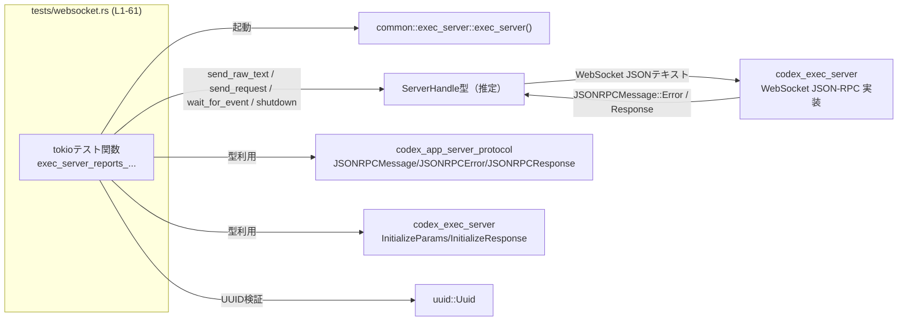
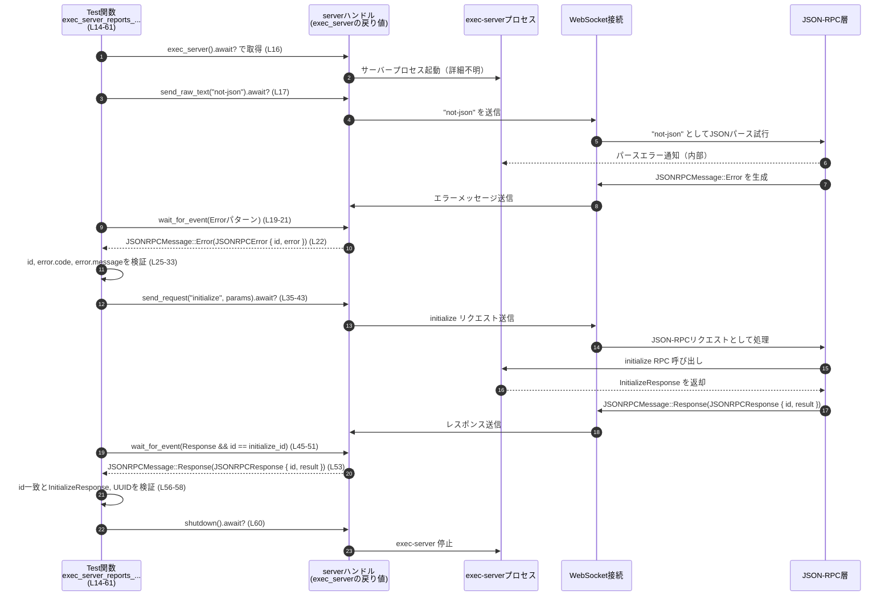

# exec-server/tests/websocket.rs コード解説

## 0. ざっくり一言

Unix 環境でのみ実行される Tokio ベースの非同期テストで、exec-server の WebSocket JSON-RPC 実装が「不正な JSON テキストを受け取ったときに適切な JSON-RPC エラーを返しつつ、その後も正常に動作し続ける」ことを検証するファイルです（`websocket.rs:L1-2, L14-61`）。

---

## コンポーネントインベントリー（このファイル内）

このファイルに現れる関数・主要型・外部コンポーネントを一覧にします。

| 種別 | 名前 / モジュール | 役割 / 用途 | コード範囲 |
|------|-------------------|------------|------------|
| モジュール属性 | `#![cfg(unix)]` | Unix 系 OS 上でのみこのテストモジュールを有効にする条件コンパイル（`cfg` 属性） | `websocket.rs:L1` |
| モジュール | `mod common;` | テスト用共通ユーティリティ（exec_server ヘルパなど）を読み込むモジュール宣言。実体ファイルはこのチャンクからは不明 | `websocket.rs:L3` |
| 関数 | `exec_server_reports_malformed_websocket_json_and_keeps_running` | 本ファイル唯一の非同期テスト。WebSocket で不正 JSON を送った後も initialize リクエストが成功することを検証 | `websocket.rs:L14-61` |
| 外部関数 | `common::exec_server::exec_server` | exec-server を起動し、テスト用のクライアントハンドルを返すヘルパ関数（詳細実装はこのチャンクには現れません） | `websocket.rs:L10, L16` |
| 型 | `JSONRPCMessage` | JSON-RPC メッセージ全体（エラー/レスポンスなど）を表す列挙体。パターンマッチで利用 | `websocket.rs:L6, L20, L22, L49, L53` |
| 型 | `JSONRPCError` | JSON-RPC エラーメッセージの構造体。`id` と `error` フィールドにアクセス | `websocket.rs:L5, L22-27` |
| 型 | `JSONRPCResponse` | JSON-RPC レスポンスメッセージの構造体。`id` と `result` にアクセス | `websocket.rs:L7, L49-50, L53` |
| 型 | `InitializeParams` | exec-server の `initialize` JSON-RPC リクエストパラメータ | `websocket.rs:L8, L35-41` |
| 型 | `InitializeResponse` | `initialize` レスポンスの JSON をデシリアライズするための型 | `websocket.rs:L9, L57` |
| 型 | `Uuid` | セッション ID が UUID 形式であることを検証するために使用 | `websocket.rs:L12, L58` |
| マクロ | `#[tokio::test(...)]` | Tokio ランタイム上で非同期テストを実行するための属性。マルチスレッド・2 ワーカースレッド指定 | `websocket.rs:L14` |
| マクロ | `assert_eq!` | 期待値と実際の値の等価性を検証 | `websocket.rs:L11, L25-26, L56` |
| マクロ | `panic!` | 想定外のメッセージ種別を受信したときにテストを明示的に失敗させる | `websocket.rs:L23-24, L54-55` |

---

## 1. このモジュールの役割

### 1.1 概要

このテストモジュールは、exec-server が WebSocket 経由で受け取る JSON-RPC メッセージに対して次の 2 点を満たしているかを検証します。

1. 不正な JSON テキスト（例: `"not-json"`）が届いた場合、特定の JSON-RPC エラー（`id = -1`, `code = -32600` かつエラーメッセージのプレフィックス）を返すこと（`websocket.rs:L16-33`）。
2. その後もプロセスが停止せず、通常の JSON-RPC リクエスト `initialize` に正しく応答すること（`websocket.rs:L35-58`）。

### 1.2 アーキテクチャ内での位置づけ

このテストは、実際の exec-server プロセスと WebSocket 経由で通信する「外部クライアント」の振る舞いをシミュレートする統合テストとして機能しています。

- exec-server 起動と接続確立: `common::exec_server::exec_server()` が担当（`websocket.rs:L10, L16`）。
- クライアント操作:
  - WebSocket に生のテキストを送信 (`send_raw_text`)（`websocket.rs:L17`）。
  - JSON-RPC リクエストを送信 (`send_request`)（`websocket.rs:L35-43`）。
  - サーバーからのイベントを待機 (`wait_for_event`)（`websocket.rs:L19-21, L45-52`）。
  - サーバーの明示的な停止 (`shutdown`)（`websocket.rs:L60`）。

これを簡略化した依存関係図は次のとおりです。



※ `ServerHandle` は、このファイルからは型名が読めないため便宜上の名称です（`exec_server().await?` の戻り値型はこのチャンクには現れません）。

### 1.3 設計上のポイント

コードから読み取れる設計上の特徴は次のとおりです。

- **Unix 限定のテスト**  
  `#![cfg(unix)]` により、Unix 系 OS でのみこのテストモジュールがコンパイル・実行されます（`websocket.rs:L1`）。

- **Tokio のマルチスレッドランタイム上で実行**  
  `#[tokio::test(flavor = "multi_thread", worker_threads = 2)]` により、このテストは 2 ワーカースレッドのマルチスレッドランタイム上で非同期に実行されます（`websocket.rs:L14`）。  
  テスト内の処理は逐次的な `await` ですが、サーバー側処理は並行に動作する前提です。

- **外部プロセス／サーバーを抽象化するヘルパ**  
  `exec_server().await?` が返す `server` オブジェクトを通じて、WebSocket メッセージ送信やイベント待機を行っています（`websocket.rs:L16-21, L35-43, L45-52, L60`）。  
  サーバープロセスの起動方法・接続方法の詳細は `common` モジュール側に隠蔽されています。

- **JSON-RPC プロトコルレベルの検証**  
  不正 JSON への応答として、`JSONRPCMessage::Error(JSONRPCError { id, error })` を期待し、`id = Integer(-1)` と `code = -32600` およびエラー文言の先頭を検証しています（`websocket.rs:L22-33`）。

- **エラー処理の方針**  
  - 通信やデシリアライズの失敗など IO / パース由来のエラーは `anyhow::Result` と `?` 演算子で伝播させ、テスト全体を失敗させます（`websocket.rs:L15-16, L35-43, L57-58, L60-61`）。
  - プロトコルレベルの期待が満たされない場合は `panic!` によってテストを失敗させます（`websocket.rs:L23-24, L54-55`）。

---

## 2. 主要な機能一覧

このファイルが提供する主要な「テスト機能」は次の 1 点に集約されます（すべて `exec_server_reports_malformed_websocket_json_and_keeps_running` 内に含まれます）。

- **不正 WebSocket JSON のハンドリング検証**  
  - `"not-json"` という JSON でないテキストを WebSocket に送信し（`websocket.rs:L17`）、  
  - `JSONRPCMessage::Error` メッセージを受信することを確認（`websocket.rs:L19-27`）、  
  - エラー ID が `RequestId::Integer(-1)`、コードが `-32600`、メッセージが特定のプレフィックスで始まることを検証（`websocket.rs:L25-33`）。
- **エラー後もサーバーが生存し続けることの検証**  
  - 続けて `initialize` JSON-RPC リクエストを送信し（`websocket.rs:L35-43`）、  
  - 対応する `JSONRPCMessage::Response` を正常に受信し（`websocket.rs:L45-53`）、  
  - 返ってきた `InitializeResponse` の `session_id` が UUID としてパース可能であることを確認する（`websocket.rs:L57-58`）。
- **サーバーのクリーンなシャットダウン**  
  - テスト終了時に `server.shutdown().await?` を呼び出し、サーバーを明示的に停止させる（`websocket.rs:L60`）。

---

## 3. 公開 API と詳細解説

このファイル自体はテスト用であり、外部に対して再利用される API を直接エクスポートしてはいません。ただし、テストパターンとして再利用されうるため、ここではその観点から整理します。

### 3.1 型一覧（構造体・列挙体など）

このファイル内で重要な役割を持つ型を整理します（いずれも他クレート・他モジュールからインポートされています）。

| 名前 | 種別 | 役割 / 用途 | 使用箇所 (根拠) |
|------|------|-------------|------------------|
| `JSONRPCMessage` | 列挙体（推定） | JSON-RPC メッセージ全体のバリアント（`Error`, `Response` など）を表す。パターンマッチで特定の種別を検知 | `matches!(event, JSONRPCMessage::Error(_))`（`websocket.rs:L20`）、`JSONRPCMessage::Error(...)` への解体（`websocket.rs:L22`）、`JSONRPCMessage::Response(JSONRPCResponse { .. })` への解体（`websocket.rs:L49-50, L53`） |
| `JSONRPCError` | 構造体 | JSON-RPC エラーメッセージ本体。`id` と `error` フィールド（後者はさらに `code` と `message` を持つ）にアクセスするために利用 | `JSONRPCError { id, error }` のパターンマッチ（`websocket.rs:L22`）、`error.code` と `error.message` へのアクセス（`websocket.rs:L26-27, L28-33`） |
| `JSONRPCResponse` | 構造体 | JSON-RPC レスポンスを表す。`id` と `result` を持ち、対応するリクエスト ID のマッチングと結果 JSON の取得に用いる | `JSONRPCResponse { id, .. }` で ID を抽出（`websocket.rs:L49-50`）、`JSONRPCResponse { id, result }` で結果も抽出（`websocket.rs:L53`） |
| `InitializeParams` | 構造体 | `initialize` リクエスト用の JSON パラメータ。`client_name` と `resume_session_id` を含む | 構造体リテラル `{ client_name: ..., resume_session_id: None }`（`websocket.rs:L38-41`） |
| `InitializeResponse` | 構造体 | `initialize` レスポンスの JSON をデシリアライズするための型。`session_id` フィールド（文字列）を持つと推定される | `serde_json::from_value(result)?` の型注釈として使用（`websocket.rs:L57`）、直後に `initialize_response.session_id` を参照（`websocket.rs:L58`） |
| `Uuid` | 構造体 | UUID 値を表現し、`session_id` が UUID 形式であることを検証するために使用 | `Uuid::parse_str(&initialize_response.session_id)?`（`websocket.rs:L58`） |
| `RequestId` | 列挙体（推定） | JSON-RPC リクエスト／レスポンスの ID 型。ここでは `Integer(-1)` というバリアント値を期待値として使用 | `codex_app_server_protocol::RequestId::Integer(-1)`（`websocket.rs:L25`） |

※ これらの型の定義自体はこのチャンクには現れません。表に記載した役割は、フィールドアクセスやパターンマッチの使い方からの推測です。その点は明示的に留意してください。

### 3.2 関数詳細

このファイルで定義されている関数は 1 つだけです。

#### `exec_server_reports_malformed_websocket_json_and_keeps_running() -> anyhow::Result<()>`

**概要**

- Tokio の非同期テスト関数で、exec-server の WebSocket JSON-RPC 実装の耐障害性を検証します（`websocket.rs:L14-15`）。
- 不正な JSON テキストを送った後でも、`initialize` リクエストに正しく応答し、セッション ID が UUID 形式で返されることを確認します（`websocket.rs:L16-33, L35-58`）。

**属性・並行性**

- `#[tokio::test(flavor = "multi_thread", worker_threads = 2)]` により、Tokio のマルチスレッドランタイム上で実行されます（`websocket.rs:L14`）。
  - worker_threads = 2 なので、exec-server 側の処理や `wait_for_event` 内部での処理が別スレッドで実行される可能性があります。
  - テスト本体は `await` を順番に呼び出すため、ロジック自体は逐次ですが、裏側での並行実行を前提とした統合テストになっています。

**引数**

- 引数はありません。`cargo test` から自動的に呼び出されるユニット／統合テストです。

**戻り値**

- 戻り値の型: `anyhow::Result<()>`（`websocket.rs:L15`）。
  - `Ok(())` の場合: テストが成功し、期待したエラー応答および `initialize` レスポンスが確認できたことを意味します（`websocket.rs:L61`）。
  - `Err(anyhow::Error)` の場合: IO エラー、JSON のシリアライズ／デシリアライズエラー、UUID パースエラー、サーバー起動失敗などが発生し、テストが失敗したことを意味します（`?` 演算子を多用しているため、詳細はラップされて伝播します）。

**内部処理の流れ（アルゴリズム）**

1. **exec-server の起動とハンドル取得**  
   - `let mut server = exec_server().await?;` でテスト用 exec-server を起動し、操作用ハンドルを取得します（`websocket.rs:L16`）。  
   - ここでエラーが発生した場合、`?` によってテストは `Err` を返し終了します。

2. **不正な JSON テキストの送信**  
   - `server.send_raw_text("not-json").await?;` で JSON ではない文字列 `"not-json"` を WebSocket 経由でサーバーに送信します（`websocket.rs:L17`）。  
   - この操作自体の送信失敗も `?` でテスト失敗となります。

3. **エラーメッセージの受信と検証**  
   - `server.wait_for_event(...)` にクロージャを渡し、`JSONRPCMessage::Error(_)` 型のイベントを待ちます（`websocket.rs:L19-21`）。  
   - 返ってきた `response` を `JSONRPCMessage::Error(JSONRPCError { id, error })` としてパターンマッチし、それ以外のバリアントであれば `panic!("expected malformed-message error response");` でテストを失敗させます（`websocket.rs:L22-24`）。
   - その後、以下を検証します（`websocket.rs:L25-33`）。
     - `id == RequestId::Integer(-1)` であること（`assert_eq!`、`websocket.rs:L25`）。
     - `error.code == -32600` であること（`assert_eq!`、`websocket.rs:L26`）。
     - `error.message` が `"failed to parse websocket JSON-RPC message from exec-server websocket"` で始まること（`starts_with`, `websocket.rs:L27-33`）。

4. **`initialize` リクエストの送信**  
   - `InitializeParams { client_name, resume_session_id }` を JSON に変換し（`serde_json::to_value(...)`、`websocket.rs:L38-41`）、`server.send_request("initialize", ...)` で JSON-RPC リクエストとして送信します（`websocket.rs:L35-43`）。
   - 戻り値 `initialize_id` は、後続のレスポンスと紐付けるためのリクエスト ID です（`websocket.rs:L35`）。

5. **`initialize` レスポンスの受信と検証**  
   - 再度 `wait_for_event` を呼び出し、`JSONRPCMessage::Response(JSONRPCResponse { id, .. })` かつ `id == &initialize_id` であるイベントを待ちます（`websocket.rs:L45-51`）。
   - 受信した `response` を `JSONRPCMessage::Response(JSONRPCResponse { id, result })` としてパターンマッチし、それ以外であれば `panic!("expected initialize response after malformed input");` でテストを失敗させます（`websocket.rs:L53-55`）。
   - `assert_eq!(id, initialize_id);` でレスポンス ID と期待 ID の一致を確認します（`websocket.rs:L56`）。
   - `result` を `InitializeResponse` 型へデシリアライズし（`serde_json::from_value(result)?`、`websocket.rs:L57`）、さらに `Uuid::parse_str(&initialize_response.session_id)?` によって `session_id` が UUID として妥当であることを検証します（`websocket.rs:L58`）。

6. **サーバーのシャットダウンとテスト終了**  
   - `server.shutdown().await?;` を呼び出して、exec-server を明示的に停止します（`websocket.rs:L60`）。
   - 最後に `Ok(())` を返し、テスト成功として終了します（`websocket.rs:L61`）。

**Examples（使用例）**

この関数はテストエントリポイントであるため、通常は直接呼び出さず、`cargo test` によって自動的に実行されます。

テストを単体で実行する例:

```bash
# 関数名の一部を指定して、このテストだけを実行
cargo test exec_server_reports_malformed_websocket_json_and_keeps_running
```

同様のパターンのテストを新規に作成する場合の雛形:

```rust
#[tokio::test(flavor = "multi_thread", worker_threads = 2)]  // マルチスレッドTokioランタイム上のテスト
async fn new_scenario_test() -> anyhow::Result<()> {         // anyhow::Resultで?演算子を利用
    let mut server = exec_server().await?;                   // 共通ヘルパでexec-server起動

    // ここで send_raw_text / send_request / wait_for_event を組み合わせてシナリオを記述する

    server.shutdown().await?;                                // 終了時にクリーンにシャットダウン
    Ok(())
}
```

**Errors / Panics**

- `Err` を返しうる箇所（`?` が付いている箇所）（`websocket.rs:L15-17, L35-43, L57-58, L60-61`）:
  - `exec_server().await?` でのサーバー起動失敗。
  - `send_raw_text` / `send_request` / `wait_for_event` の内部での通信エラー・タイムアウトなど（詳細はこのチャンクには現れません）。
  - `serde_json::to_value` / `from_value` のシリアライズ／デシリアライズエラー。
  - `Uuid::parse_str` による UUID パースエラー。
- `panic!` を発生させうる箇所:
  - 最初の `wait_for_event` の結果が `JSONRPCMessage::Error(JSONRPCError { .. })` でない場合（`websocket.rs:L22-24`）。
  - 2 回目の `wait_for_event` の結果が `JSONRPCMessage::Response(JSONRPCResponse { .. })` でない場合（`websocket.rs:L53-55`）。
  - `assert_eq!` が失敗した場合（エラー ID・コード・レスポンス ID の不一致）（`websocket.rs:L25-26, L56`）や `assert!(error.message.starts_with(...))` の失敗（`websocket.rs:L27-33`）。

**Edge cases（エッジケース）**

このテスト関数自体のエッジケースという観点で、コードから読み取れるものを列挙します。

- **WebSocket 側がエラーで応答しない**  
  - `wait_for_event` がエラーを返した場合には `?` によりテスト全体が `Err` で終了します（`websocket.rs:L19-21, L45-52`）。
  - 具体的にどのような場合にエラーになるかは `wait_for_event` の実装がこのチャンクには現れないため不明です。

- **不正 JSON に対するエラー形式が異なる**  
  - 例: `id` が `Integer(-1)` 以外、`error.code` が `-32600` 以外、エラーメッセージのプレフィックスが変わった場合などは、`assert_eq!` / `assert!` によりテストが失敗します（`websocket.rs:L25-33`）。

- **二つのメッセージの順序**  
  - テストは「不正 JSON に対するエラーメッセージ → initialize レスポンス」の順序を前提としています。  
    `wait_for_event` の条件から、この順序が満たされない場合にはテストが失敗するか、終了しない可能性があります。ただし、`wait_for_event` の内部挙動はこのチャンクには現れません。

- **`initialize` レスポンスの JSON 形式の変更**  
  - `InitializeResponse` のフィールド構成や `session_id` の型が変わると、`serde_json::from_value` や `Uuid::parse_str` がエラーになり、テストが `Err` で終わる可能性があります（`websocket.rs:L57-58`）。

**使用上の注意点**

- **Tokio ランタイム前提**  
  - `#[tokio::test]` を付けずに手動で呼び出すと、内部の `.await` を使用できずコンパイルエラーとなります。必ず Tokio などの非同期ランタイム上で実行される必要があります（`websocket.rs:L14-15`）。

- **`exec_server()` の対となる `shutdown()` の呼び出し**  
  - このテストでは明示的に `server.shutdown().await?;` を呼び出しています（`websocket.rs:L60`）。  
    同様のテストを追加する場合にも、サーバーリソースのリークや他テストへの影響を避けるため、起動したサーバーを確実にシャットダウンすることが推奨されます（この点は一般的な注意であり、コード上の強制ではありません）。

- **プロトコル契約に依存したアサーション**  
  - エラーコード `-32600` や `RequestId::Integer(-1)` など、プロトコル仕様に紐づいた数値に依存したテストです（`websocket.rs:L25-26`）。  
    仕様変更があった場合にはこのテストも合わせて更新する必要があります。

### 3.3 その他の関数

このファイル内でユーザー定義されている関数は 1 つのみであり、補助的な関数やラッパー関数は定義されていません。

---

## 4. データフロー

### WebSocket メッセージの送受信フロー（exec_server_reports_malformed_websocket_json_and_keeps_running, L14-61）

このテストにおける典型的なデータの流れは以下の通りです。

1. テスト関数が `exec_server()` を呼び出して exec-server を起動し、`server` ハンドルを受け取る（`websocket.rs:L16`）。
2. `server.send_raw_text("not-json")` によって、JSON ではないテキストが WebSocket 経由で exec-server に送られる（`websocket.rs:L17`）。
3. exec-server はこのテキストのパースに失敗し、JSON-RPC 形式のエラーメッセージ（`JSONRPCMessage::Error(JSONRPCError { .. })`）を WebSocket でクライアント側に返す（テスト側では `wait_for_event` 経由で受信、`websocket.rs:L19-22`）。
4. テストはこのエラーメッセージの内容を検証し、サーバーが正常にエラーを報告していることを確認する（`websocket.rs:L25-33`）。
5. 続けて `server.send_request("initialize", params)` により、今度は正しい JSON-RPC リクエストが送信される（`websocket.rs:L35-43`）。
6. exec-server は通常の `initialize` 処理を行い、レスポンス（`JSONRPCMessage::Response(JSONRPCResponse { id, result })`）を返す（これも `wait_for_event` で受信、`websocket.rs:L45-53`）。
7. テストはレスポンス ID と中身の JSON を検証し、セッション ID が UUID であることを確認した後、サーバーを `shutdown()` で停止する（`websocket.rs:L56-60`）。

これをシーケンス図で表すと、次のようになります。



---

## 5. 使い方（How to Use）

このファイル自体はテスト専用ですが、同様のテストパターンを作成したり、exec-server との WebSocket JSON-RPC 通信を検証する際の参考になります。

### 5.1 基本的な使用方法

テストを実行する標準的な方法は次のとおりです。

```bash
# プロジェクト全体のテストを実行
cargo test

# このファイルのテストのみを名前で絞り込んで実行
cargo test exec_server_reports_malformed_websocket_json_and_keeps_running
```

exec-server を利用したテストコードの基本フローは、本ファイルの関数を一般化すると以下のように整理できます。

```rust
#[tokio::test(flavor = "multi_thread", worker_threads = 2)] // マルチスレッドのTokioランタイムで実行
async fn example_scenario() -> anyhow::Result<()> {         // anyhow::Resultでエラーを?で伝播
    let mut server = exec_server().await?;                  // 共通ヘルパでサーバー起動 (L16)

    // 1. 必要に応じて不正な入力や通常のリクエストを送信
    server.send_raw_text("some-text").await?;               // 例: 生テキスト送信 (L17 相当)
    // または:
    // let id = server.send_request("method", serde_json::json!({ "param": 1 })).await?;

    // 2. wait_for_eventで特定のJSONRPCMessageを待ち受ける
    let event = server
        .wait_for_event(|event| matches!(event, JSONRPCMessage::Error(_))) // 条件はシナリオに応じて変更
        .await?;

    // 3. eventの内容をパターンマッチで検証
    // ...

    server.shutdown().await?;                               // サーバー終了 (L60)
    Ok(())
}
```

### 5.2 よくある使用パターン

コードから読み取れる代表的な使用パターンは次のとおりです。

1. **生テキスト送信＋エラー受信パターン**（`websocket.rs:L16-33`）  
   - `send_raw_text` で JSON として不正なテキストを送信し、`wait_for_event` で `JSONRPCMessage::Error` を待ち、その内容をアサートする。

2. **JSON-RPC リクエスト送信＋レスポンス ID マッチングパターン**（`websocket.rs:L35-56`）  
   - `send_request("initialize", params)` でリクエストを送信し、その戻り値の ID を `wait_for_event` のフィルタ条件に使用して、対応するレスポンスのみを受信・検証する。

3. **レスポンス JSON のデシリアライズ＋構造検証パターン**（`websocket.rs:L57-58`）  
   - `serde_json::from_value(result)?` で型付きデシリアライズを行い、そのフィールドに対して追加検証（ここでは `Uuid::parse_str`）を行う。

### 5.3 よくある間違い（このパターンを真似する際の注意）

コードから直接読み取れる／一般的に起こりやすい誤りを、正しい例と併せて示します。

```rust
// 誤り例（推測に基づく一般的な注意）:
// initialize リクエストを送った直後に単に最初のイベントだけを読むと、
// 複数のイベントが飛んでくる場合に別のメッセージを誤って検証してしまう可能性があります。
let response = server.wait_for_event(|_| true).await?; // 何でも最初のイベントを取ってしまう

// 正しい例（本ファイルと同様のパターン）:
let initialize_id = server
    .send_request("initialize", params)
    .await?;
let response = server
    .wait_for_event(|event| {
        matches!(
            event,
            JSONRPCMessage::Response(JSONRPCResponse { id, .. }) if id == &initialize_id
        )
    })
    .await?;
```

```rust
// 誤り例:
// exec_server()で起動したサーバーのshutdownを呼ばずにテストを終了する。
// 実害の有無はテストランナーや環境に依存し、このチャンクからは断定できませんが、
// リソースリークやポート競合の原因になりうる一般的なパターンです。
async fn bad_test() -> anyhow::Result<()> {
    let mut server = exec_server().await?;
    // ... いくつかの操作 ...
    Ok(())    // shutdown() を呼んでいない
}

// 正しい例（本ファイル）:
async fn good_test() -> anyhow::Result<()> {
    let mut server = exec_server().await?;
    // ... いくつかの操作 ...
    server.shutdown().await?; // 明示的に停止 (websocket.rs:L60)
    Ok(())
}
```

### 5.4 使用上の注意点（まとめ）

- **非同期テストとしての前提**  
  - `#[tokio::test]` による非同期テストであり、`await` を使用するため、同期関数から直接呼び出すことはできません（`websocket.rs:L14-15`）。

- **プロトコル仕様との結合度**  
  - エラー ID, エラーコード, メッセージ内容など、JSON-RPC レベルの仕様に密に依存したアサーションを行っています（`websocket.rs:L25-33`）。  
    プロトコル仕様の変更があればテストの更新も必要です。

- **テストの安定性と待機条件**  
  - `wait_for_event` に渡すクロージャが十分に絞り込まれていないと、意図しないイベントをマッチさせてしまう可能性があります。  
    本ファイルではエラーメッセージ種別（`JSONRPCMessage::Error(_)`）とレスポンス ID で明確に条件を指定しています（`websocket.rs:L20, L45-51`）。

---

## 6. 変更の仕方（How to Modify）

### 6.1 新しい機能（テストケース）を追加する場合

このファイルのパターンを踏襲して新しい WebSocket/JSON-RPC テストを追加する場合、次のステップが自然です。

1. **新しいテスト関数の追加**  
   - 同一ファイル、または同じ `tests` ディレクトリ内に、`#[tokio::test(flavor = "multi_thread", worker_threads = 2)]` を付けた非同期関数を追加します（`websocket.rs:L14` を参考）。

2. **exec-server の起動とハンドルの取得**  
   - `let mut server = exec_server().await?;` を用いてサーバーを起動し、ハンドルを取得します（`websocket.rs:L16`）。

3. **シナリオに応じたメッセージ送受信の記述**  
   - 生テキスト送信が必要なら `send_raw_text`（`websocket.rs:L17`）、JSON-RPC リクエストなら `send_request`（`websocket.rs:L35-43`）を使用します。
   - レスポンスやイベントは `wait_for_event` に条件クロージャを渡して待機します（`websocket.rs:L19-21, L45-51`）。

4. **パターンマッチによる検証コードの記述**  
   - `JSONRPCMessage` をパターンマッチで分解し、`JSONRPCError` や `JSONRPCResponse` のフィールドを検証します（`websocket.rs:L22-27, L53-57`）。

5. **サーバーのシャットダウンコードの追加**  
   - テスト末尾で `server.shutdown().await?;` を呼び出し、サーバーを停止させてから `Ok(())` を返します（`websocket.rs:L60-61`）。

### 6.2 既存の機能（このテスト）を変更する場合

このテストの期待値や挙動を変更する際に注意すべき点を挙げます。

- **エラーコードや ID の変更**  
  - プロトコル仕様の変更等で、エラー ID やコードが変わる場合、`assert_eq!` の箇所（`websocket.rs:L25-26`）を整合的に更新する必要があります。
  - 仕様変更によって `JSONRPCMessage` のバリアント構成が変わる場合には、パターンマッチの部分（`websocket.rs:L22, L53`）も合わせて修正が必要です。

- **エラーメッセージプレフィックスの変更**  
  - `error.message.starts_with(...)` の文字列リテラルを変更する際には、テストの意図（完全一致ではなく「prefix マッチ」であること）が保たれているか確認します（`websocket.rs:L27-33`）。

- **`InitializeResponse` 型の変更**  
  - `InitializeResponse` の構造や `session_id` の型が変わる場合、`serde_json::from_value(result)?` と `Uuid::parse_str` の部分（`websocket.rs:L57-58`）の型および検証ロジックを対応させる必要があります。

- **影響範囲の確認**  
  - `common::exec_server::exec_server` のインターフェースを変更する場合、このテストだけでなく、同じヘルパーを使っている他のテストファイルへの影響も確認する必要があります。  
    ただし、このチャンク内には他テストとの関係は示されていないため、実際の影響範囲はリポジトリ全体の構造を参照して判断する必要があります。

---

## 7. 関連ファイル

このモジュールと密接に関係するコンポーネントを、コードから読み取れる範囲で列挙します。

| パス / モジュール | 役割 / 関係 |
|-------------------|------------|
| `tests/websocket.rs` | 本ファイル。exec-server の WebSocket JSON-RPC 振る舞いを検証するテストモジュール（`websocket.rs:L1-61`）。 |
| `mod common;`（実体パス不明） | `exec_server()` ヘルパーを提供するテスト用共通モジュール（`websocket.rs:L3, L10, L16`）。Rust の慣例から `tests/common/mod.rs` または `tests/common.rs` である可能性がありますが、このチャンクからは断定できません。 |
| `codex_app_server_protocol` クレート | `JSONRPCMessage` / `JSONRPCError` / `JSONRPCResponse` / `RequestId` などの JSON-RPC プロトコル型を提供（`websocket.rs:L5-7, L25`）。 |
| `codex_exec_server` クレート | exec-server 本体の API 型（`InitializeParams`, `InitializeResponse`）を提供し、このテストで対象となるサーバー実装（`websocket.rs:L8-9, L35-43, L57`）。 |
| `uuid` クレート | セッション ID の UUID 形式検証に利用（`websocket.rs:L12, L58`）。 |
| `serde_json` クレート | JSON 値との相互変換に利用（`websocket.rs:L37-41, L57`）。 |
| `tokio` クレート | 非同期ランタイムと `#[tokio::test]` マクロを提供（`websocket.rs:L14`）。 |

このチャンクにはテストヘルパーの具体実装や exec-server の本体コードは含まれていないため、それらの詳細な挙動やエッジケースは「不明」となります。
