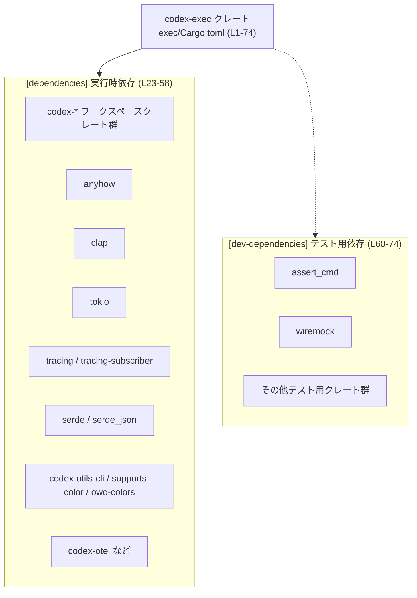

# exec/Cargo.toml コード解説

## 0. ざっくり一言

- `exec/Cargo.toml` は、`codex-exec` クレートの **パッケージ情報・バイナリ/ライブラリ/テストターゲット・依存クレート** を定義する Cargo マニフェストファイルです（`exec/Cargo.toml:L1-74`）。
- 実際のロジックや公開 API はこのファイルには含まれず、ビルドやテストの挙動・依存関係構成を決める設定ファイルとして機能します。

---

## 1. このモジュールの役割

### 1.1 概要

- このファイルは **`codex-exec` クレートのビルド単位を定義し、必要な依存クレートを宣言する** ために存在します。
- 具体的には次を定義しています（いずれも `exec/Cargo.toml`）:
  - パッケージメタデータ（名前、版、エディション、ライセンス、テスト設定など）（`[package]`、`L1-6`）
  - バイナリターゲット `codex-exec`（`[[bin]]`、`L8-10`）
  - ライブラリターゲット `codex_exec`（`[lib]`、`L12-14`）
  - テストターゲット `all`（`[[test]]`、`L16-18`）
  - 共通 Lint 設定の参照（`[lints]`、`L20-21`）
  - 実行時依存クレート（`[dependencies]`、`L23-58`）
  - テスト専用の依存クレート（`[dev-dependencies]`、`L60-74`）

### 1.2 アーキテクチャ内での位置づけ

このファイルから読み取れる範囲では、`codex-exec` は **ワークスペースに属する 1 つのクレート** であり、多数の内部クレート（`codex-*` 系）および外部クレートに依存しています。

- ワークスペース管理の項目  
  - `version.workspace = true`（`L3`）
  - `edition.workspace = true`（`L4`）
  - `license.workspace = true`（`L5`）
  - `anyhow = { workspace = true }` などの依存クレート宣言（`L24-58`）
  - `[dev-dependencies]` もすべて `workspace = true`（`L61-74`）

これにより、バージョンや依存バージョンはワークスペースルートの `Cargo.toml` などで一括管理されていることが分かります（ワークスペースルートファイル自体はこのチャンクには現れません）。

主要な依存関係構造を図示すると、次のようになります。



※ 矢印は「このクレートが依存として利用できる」という **ビルド時依存関係** を表します。どの依存が実際にどのコードから呼ばれるかは、このファイルからは分かりません。

### 1.3 設計上のポイント

コード（マニフェスト）から読み取れる設計上の特徴は次の通りです。

- **ワークスペース統合管理**（`L3-5, L24-58, L61-74`）  
  - 版・エディション・ライセンス・依存クレートのバージョンをワークスペースに委譲しています。  
  - これにより、複数クレート間でバージョンを揃える方針になっていると解釈できます。

- **バイナリ + ライブラリ構成**（`L8-14`）  
  - 同一クレート内にバイナリ `codex-exec` とライブラリ `codex_exec` を定義しています。
  - バイナリがライブラリを利用しているかどうかは、このファイルからは分かりません。

- **テスト構成**（`L6, L16-18, L60-74`）  
  - `autotests = false` により自動テスト検出を無効化し（`L6`）、明示的に `[[test]] name = "all"` を定義しています（`L16-18`）。
  - テスト用の依存クレートが `[dev-dependencies]` にまとめられています（`L60-74`）。

- **Lint 設定の共有**（`L20-21`）  
  - `[lints] workspace = true` により、Lint（警告/エラー検出）設定もワークスペース側で一元管理されていることが分かります。

- **非同期実行・ログ・テレメトリの前提**（`L44-52, L53-57, L35, L66-67, L71`）  
  - `tokio`、`tracing`、`tracing-subscriber`、`codex-otel`、`opentelemetry`、`opentelemetry_sdk`、`tracing-opentelemetry` といったクレートへの依存が宣言されています。  
  - これらのクレートは一般的に非同期実行や構造化ログ、トレーシングに利用されますが、**具体的な使い方や並行性の扱いはこのファイルからは分かりません**。

---

## 2. 主要な機能一覧

このファイル自体はロジックを持ちませんが、ここで定義されている「コンポーネント」とそこから推測できる機能を整理します。

- バイナリ `codex-exec`: エントリポイント `src/main.rs` を持つ実行ファイルターゲット（`L8-10`）。
- ライブラリ `codex_exec`: ライブラリコード `src/lib.rs` を公開するライブラリターゲット（`L12-14`）。
- テストターゲット `all`: `tests/all.rs` を実行するテストターゲット（`L16-18`）。
- 実行時依存クレート群: コマンドライン処理、エラー処理、ロギング、非同期実行などをサポートすると考えられる外部・内部クレート群（`L23-58`）。
- テスト用依存クレート群: CLI バイナリの結合テスト・HTTP モック・一時ファイル操作などを行うためのクレート群（`L60-74`）。

### コンポーネントインベントリー（ターゲット & 依存クレート）

**ビルドターゲット**

| コンポーネント名 | 種別 | 役割 / 用途 | 定義箇所 |
|------------------|------|-------------|----------|
| `codex-exec`     | バイナリ (`[[bin]]`) | 実行可能な CLI ツールのエントリポイントを持つターゲット | `exec/Cargo.toml:L8-10` |
| `codex_exec`     | ライブラリ (`[lib]`) | 共通ロジックを提供するライブラリターゲット | `exec/Cargo.toml:L12-14` |
| `all`           | テスト (`[[test]]`) | `tests/all.rs` を実行するカスタムテストターゲット | `exec/Cargo.toml:L16-18` |

**依存クレート（runtime / dev）**

> 用途欄で「一般的には〜」と書かれているものは、Rust エコシステムでの典型的用途に基づく説明であり、**この Cargo.toml から直接分かる情報ではありません**。

| 名前 | 種別 | 用途（概要） | 定義箇所 |
|------|------|--------------|----------|
| `anyhow` | runtime | 一般的にはエラーをまとめて扱うためのライブラリ | `exec/Cargo.toml:L24` |
| `clap` | runtime | 一般的には CLI 引数パーサ | `L25` |
| `codex-arg0` | runtime | コードからの用途は不明（名前から arg0 処理関連と推測可能だが断定不可） | `L26` |
| `codex-app-server-client` | runtime | 用途不明（アプリケーションサーバクライアント関連と推測可能） | `L27` |
| `codex-app-server-protocol` | runtime | 用途不明（アプリサーバとのプロトコル定義と推測可能） | `L28` |
| `codex-cloud-requirements` | runtime | 用途不明（クラウド要件関連と推測可能） | `L29` |
| `codex-core` | runtime | 用途不明（ワークスペースのコアロジックと推測可能） | `L30` |
| `codex-feedback` | runtime | 用途不明（フィードバック処理と推測可能） | `L31` |
| `codex-git-utils` | runtime | 用途不明（Git 操作用ユーティリティと推測可能） | `L32` |
| `codex-login` | runtime | 用途不明（ログイン処理と推測可能） | `L33` |
| `codex-model-provider-info` | runtime | 用途不明（モデルプロバイダ情報管理と推測可能） | `L34` |
| `codex-otel` | runtime | 用途不明（OpenTelemetry 統合と推測可能） | `L35` |
| `codex-protocol` | runtime | 用途不明（内部プロトコル定義と推測可能） | `L36` |
| `codex-utils-absolute-path` | runtime | 用途不明（絶対パス処理ユーティリティと推測可能） | `L37` |
| `codex-utils-cli` | runtime | 用途不明（CLI 向けユーティリティと推測可能） | `L38` |
| `codex-utils-oss` | runtime | 用途不明（OSS 関連ユーティリティと推測可能） | `L39` |
| `owo-colors` | runtime | 一般的にはカラー付きターミナル出力 | `L40` |
| `serde` | runtime | 一般的にはシリアライズ/デシリアライズ | `L41` |
| `serde_json` | runtime | 一般的には JSON シリアライズ/デシリアライズ | `L42` |
| `supports-color` | runtime | 一般的にはターミナルがカラー表示対応か判定 | `L43` |
| `tokio` | runtime | 一般的には非同期ランタイム（`io-std`, `macros`, `process`, `rt-multi-thread`, `signal` 機能を利用） | `L44-50` |
| `tracing` | runtime | 一般的には構造化ログ/トレースの記録 | `L51` |
| `tracing-subscriber` | runtime | 一般的には `tracing` のログ出力・フィルタリング | `L52` |
| `ts-rs` | runtime | 一般的には Rust 型から TypeScript 型を生成 | `L53-57` |
| `uuid` | runtime | 一般的には UUID 生成・操作 | `L58` |
| `assert_cmd` | dev | 一般的には CLI バイナリのテスト支援 | `L61` |
| `codex-apply-patch` | dev | 用途不明（パッチ適用テスト用と推測可能） | `L62` |
| `codex-utils-cargo-bin` | dev | 用途不明（`cargo` バイナリ補助と推測可能） | `L63` |
| `core_test_support` | dev | 用途不明（テスト支援クレートと推測可能） | `L64` |
| `libc` | dev | 一般的には OS の C ランタイムへの低レベルバインディング | `L65` |
| `opentelemetry` | dev | 一般的には OpenTelemetry API | `L66` |
| `opentelemetry_sdk` | dev | 一般的には OpenTelemetry SDK 実装 | `L67` |
| `predicates` | dev | 一般的にはテスト用の柔軟な条件記述 | `L68` |
| `pretty_assertions` | dev | 一般的には差分付きの見やすい assert 出力 | `L69` |
| `tempfile` | dev | 一般的には一時ファイル/ディレクトリ作成 | `L70` |
| `tracing-opentelemetry` | dev | 一般的には `tracing` と OpenTelemetry のブリッジ | `L71` |
| `uuid` | dev | 実行時と同じ UUID クレートのテスト側利用 | `L72` |
| `walkdir` | dev | 一般的にはディレクトリの再帰走査 | `L73` |
| `wiremock` | dev | 一般的には HTTP モックサーバ実装 | `L74` |

---

## 3. 公開 API と詳細解説

このファイルは **Rust のソースコードではなく Cargo の設定ファイル** であり、関数や構造体などのプログラム要素は定義していません。

### 3.1 型一覧（構造体・列挙体など）

- このファイルには Rust の型定義は存在しません。  
- 代わりに、ビルドターゲットを「コンポーネント」とみなした一覧を 2 章で示しました。

### 3.2 関数詳細（最大 7 件）

- このファイルには関数・メソッド・モジュールなどの実装は含まれていないため、**詳細解説対象の関数はありません**。
- 実際の公開 API やコアロジックは `src/main.rs` や `src/lib.rs` などの Rust ソースファイル側に存在すると考えられますが、これらの内容はこのチャンクには現れていません。

### 3.3 その他の関数

- 同様に、補助関数やラッパー関数などもこのファイルには登場しません。

---

## 4. データフロー

このファイルからは **実行時の関数コールやデータの流れ** は分かりませんが、Cargo による **ビルド・テスト時の情報フロー** は次のように整理できます。

- 開発者が `cargo run -p codex-exec` や `cargo test -p codex-exec` を実行すると、Cargo は `exec/Cargo.toml` を読み込みます（`L1-74`）。
- Cargo は `[dependencies]` を元に実行時依存の解決・ビルドを行います（`L23-58`）。
- `cargo test` の場合は、追加で `[dev-dependencies]` を解決・ビルドし、`[[test]] name = "all"` に従って `tests/all.rs` をテストターゲットとして実行します（`L16-18, L60-74`）。

これを sequence diagram で示します。

```mermaid
sequenceDiagram
    participant Dev as 開発者
    participant Cargo as cargo（ビルドツール）
    participant Crate as codex-exec クレート<br/>exec/Cargo.toml (L1-74)
    participant Deps as 実行時依存クレート群<br/>[dependencies] (L23-58)
    participant DevDeps as テスト用依存クレート群<br/>[dev-dependencies] (L60-74)

    Dev->>Cargo: cargo run / cargo test -p codex-exec
    Cargo->>Crate: exec/Cargo.toml を読み込む
    Cargo->>Deps: 依存クレートを解決・ビルド
    alt cargo test の場合
        Cargo->>DevDeps: dev-dependencies を解決・ビルド
        Cargo->>Crate: [[test]] all（tests/all.rs）をビルド・実行
    else cargo run の場合
        Cargo->>Crate: バイナリ codex-exec（src/main.rs）をビルド・実行
    end
    Dev<<--Cargo: 実行結果 / テスト結果
```

※ `src/main.rs` や `tests/all.rs` の中身はこのチャンクには含まれていないため、そこでの具体的なデータフローは不明です。

---

## 5. 使い方（How to Use）

### 5.1 基本的な使用方法

この `Cargo.toml` によって定義されたクレートを利用する典型的なフローは次の通りです。

#### バイナリのビルド・実行

```bash
# ワークスペースルートで、codex-exec バイナリをビルドして実行
cargo run -p codex-exec
```

- Cargo は `exec/Cargo.toml` の `[[bin]] name = "codex-exec"`（`L8-10`）を見て、`src/main.rs` をエントリポイントとしてビルドします。

#### テストの実行

```bash
# codex-exec クレートに対するテスト（テストターゲット all）を実行
cargo test -p codex-exec
```

- Cargo は `autotests = false`（`L6`）により自動検出を行わず、明示的に定義された `[[test]] name = "all"`（`L16-18`）をテストターゲットとして実行します。
- テストには `[dev-dependencies]`（`L60-74`）に列挙されたクレートが利用可能です。

### 5.2 よくある使用パターン

このファイル自体はあまり直接編集されませんが、想定される利用パターンをいくつか挙げます。

1. **依存クレートの追加**

   ```toml
   [dependencies]
   # 既存
   anyhow = { workspace = true }
   # 新規クレートを追加する場合（例）
   # new-crate = { workspace = true }
   ```

   - 実際にどのようなクレートを追加するかはワークスペースの方針によります。
   - このチャンクには追加例は含まれていないため、あくまで一般的な書式の例です。

2. **テスト専用依存の追加**

   ```toml
   [dev-dependencies]
   assert_cmd = { workspace = true }
   # 追加のテスト支援クレート（例）
   # rstest = { workspace = true }
   ```

   - テストコードが新しいライブラリに依存する場合、`[dev-dependencies]` に追加する形になります。

### 5.3 よくある間違い

このファイルから推測できる、起こりそうな誤用と正しい形を示します。

```toml
# 間違い例: テストコードで利用するクレートを [dependencies] に入れてしまう
[dependencies]
wiremock = { workspace = true }  # 本来テスト専用

# 正しい例: テスト専用は [dev-dependencies] に置く
[dev-dependencies]
wiremock = { workspace = true }  # 実ファイルでは L74 に定義
```

- テストでしか使わないクレートを `[dependencies]` に入れると、本番バイナリのビルドにもリンクされ、ビルド時間やバイナリサイズに影響します。
- 実際のファイルでは、`wiremock` は `[dev-dependencies]` に置かれています（`L74`）。

### 5.4 使用上の注意点（まとめ）

- **ワークスペース管理の前提**  
  - `version.workspace = true` など、重要な設定はワークスペースルート側にあります（`L3-5, L24-58, L61-74`）。  
  - 個別クレート側で勝手に `version` などを追加すると、ワークスペース方針と矛盾する可能性があります。

- **テスト構成に関する注意**  
  - `autotests = false`（`L6`）のため、ファイルを新しく `tests/` に追加しても、自動でテストターゲットが作成されるとは限りません。  
  - `[[test]]` セクションを増やす/変更する場合は、この設定との整合性に注意が必要です。

- **非同期・トレース関連の依存**  
  - `tokio` や `tracing`、OpenTelemetry 関連クレートが多数依存として定義されているため（`L44-52, L66-67, L71`）、クレート全体として非同期処理やトレーシングを前提とした設計になっている可能性があります。  
  - ただし、これらの実際の利用方法やスレッド安全性は `src/*.rs` 側のコードを確認しないと判断できません。

- **セキュリティ・バグに関して**  
  - このファイルはあくまで依存関係とターゲットを宣言するだけであり、ロジック上のバグやセキュリティホールの有無は判断できません。  
  - 依存バージョンはワークスペース側で管理されているため、脆弱性対応もワークスペースルートの `Cargo.toml` や `Cargo.lock` を通じて行われると考えられます（ただし、このチャンクにはそれらのファイルは現れません）。

---

## 6. 変更の仕方（How to Modify）

### 6.1 新しい機能を追加する場合

新しい機能（例: 新しいコマンドやサブコマンド）の追加に伴って `Cargo.toml` を変更する場合、一般的には次のステップになります。

1. **新しいコードをどこに書くか決める**  
   - バイナリとしてのみ必要なら `src/main.rs` 側（このチャンクには内容はありません）。
   - 他のクレートからも再利用したいロジックなら `src/lib.rs` 側。

2. **依存クレートが必要か検討する**  
   - 既存の依存（`[dependencies]`、`L23-58`）で足りるか確認します。
   - 不足している場合は、ワークスペースの方針に従って `Cargo.toml` の `[dependencies]` に追加します。

3. **テストが新しい依存を必要とするか**  
   - テストコードのみで利用する依存は `[dev-dependencies]`（`L60-74`）に追加します。

4. **新しいテストターゲットが必要か確認**  
   - 別のテストバイナリが必要な場合は、`[[test]]` セクションを追加します（`L16-18` を参考にする）。  
   - ただし、`autotests = false`（`L6`）との関係に注意が必要です。

### 6.2 既存の機能を変更する場合

既存設定を変更する際の注意点を整理します。

- **ターゲット名の変更**  
  - `[[bin]] name = "codex-exec"`（`L8`）や `[lib] name = "codex_exec"`（`L13`）を変更すると、他のクレートからの参照（例: `codex_exec` を依存として使っているクレート）が影響を受けます。  
  - これらの参照はこのチャンクには現れないため、ワークスペース全体を `rg` などで検索して確認する必要があります。

- **テスト構成の変更**  
  - `[[test]]` セクション（`L16-18`）を変更・削除すると、`cargo test -p codex-exec` で実行されるテストセットが変わります。  
  - `autotests = false` があるため、`[[test]]` を削除するとテストが一切実行されない状態になる可能性があります。

- **依存クレートの削除・変更**  
  - `[dependencies]` からエントリを削除すると（`L23-58`）、それを使用しているコードのコンパイルが失敗します。  
  - 実際にどの依存がどのコードから使われているかは、このファイルだけでは分からないため、削除前に使用箇所の洗い出しが必要です。

- **ワークスペース設定の直接上書き**  
  - `version.workspace = true` などを個別の値で上書きすることも技術的には可能ですが、ワークスペース全体の整合性が崩れる可能性があります。  
  - このような変更は、ワークスペースルートの設計方針と整合を取ったうえで行う必要があります。

---

## 7. 関連ファイル

この `Cargo.toml` から、直接的に関連が分かるファイル・クレートは次の通りです。

| パス / クレート名 | 役割 / 関係 | 根拠 |
|-------------------|------------|------|
| `exec/src/main.rs` | バイナリターゲット `codex-exec` のエントリポイント | `[[bin]] path = "src/main.rs"`（`exec/Cargo.toml:L10`） |
| `exec/src/lib.rs` | ライブラリターゲット `codex_exec` の実装 | `[lib] path = "src/lib.rs"`（`L14`） |
| `exec/tests/all.rs` | テストターゲット `all` の実装 | `[[test]] path = "tests/all.rs"`（`L18`） |
| ワークスペースルートの `Cargo.toml`（推測） | `version.workspace = true` などの設定を実際に定義するファイル。パスはこのチャンクには現れない | `version.workspace = true`（`L3`）などから存在が推測されるが、具体的な位置は不明 |
| `codex-*` クレート群 | 同じワークスペース内の内部クレートと思われるが、具体的なパスはこのチャンクには現れない | `codex-core` などが `{ workspace = true }` で依存として宣言されていること（`L26-39`） |

- これらの関連ファイルの中身（特に `src/main.rs` と `src/lib.rs`）に、実際の **公開 API・エラー処理・並行性の詳細** が記述されていると考えられますが、このチャンクには含まれていないため、ここでは説明できません。
