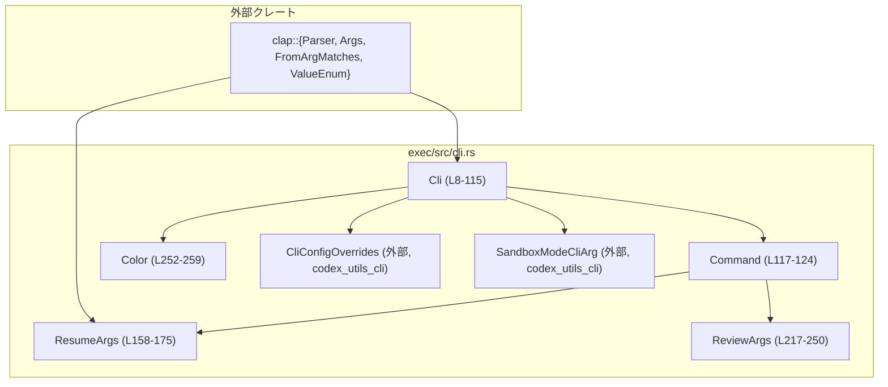
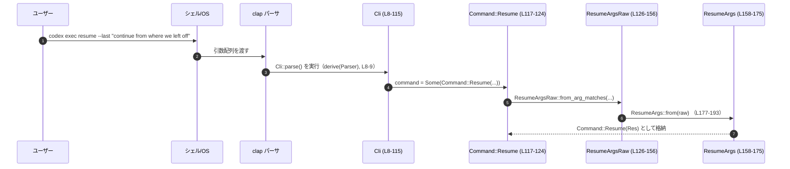

# exec/src/cli.rs コード解説

## 0. ざっくり一言

`exec/src/cli.rs` は、`codex exec` サブコマンドのコマンドライン引数を定義し、`clap` によるパース結果を内部用の構造体に変換するモジュールです。再開用 (`resume`) とコードレビュー用 (`review`) のサブコマンドと、各種グローバルオプションをまとめています。

---

## 1. このモジュールの役割

### 1.1 概要

このモジュールは、**codex exec の CLI インターフェース**を定義するために存在し、次の機能を提供します。

- `codex exec` のトップレベル引数と動作モード（新規セッション／サブコマンド）を定義する `Cli` 構造体（`exec/src/cli.rs:L8-115`）。
- `resume`／`review` サブコマンドの引数セットを表す型と、そのパース・変換ロジック（`Command`, `ResumeArgs`, `ReviewArgs`）。
- 危険度の高い動作（サンドボックス無効化など）を明示するフラグを含めた安全性関連の設定。
- 端末のカラー出力設定を表す `Color` 列挙体。

### 1.2 アーキテクチャ内での位置づけ

このファイル内の型どうし、および外部モジュールとの依存関係は概ね次の通りです。



- `Cli` はこのモジュールのエントリーポイントであり、`clap::Parser` 派生により `Cli::parse()` などのパース用メソッド（clap の仕様による）が利用できます（`exec/src/cli.rs:L8-12`）。
- `command: Option<Command>` フィールド（`exec/src/cli.rs:L14-16`）によって、トップレベルの動作（サブコマンドの有無）を切り替えます。
- `Command` は `Resume(ResumeArgs)`／`Review(ReviewArgs)` の 2 つのサブコマンドを持ちます（`exec/src/cli.rs:L117-124`）。
- `ResumeArgs` は内部表現であり、`clap` 用の生の形 `ResumeArgsRaw` から `impl From<ResumeArgsRaw> for ResumeArgs` で変換されます（`exec/src/cli.rs:L126-156`, `L177-193`）。

#### コンポーネントインベントリー（型）

| 名前              | 種別    | 公開 | 行範囲                              | 役割 / 用途 |
|-------------------|---------|------|--------------------------------------|-------------|
| `Cli`             | 構造体  | 公開 | `exec/src/cli.rs:L8-115`             | `codex exec` コマンドのトップレベル引数セット。グローバルオプションと `Command` サブコマンドを保持する。 |
| `Command`         | enum    | 公開 | `exec/src/cli.rs:L117-124`           | `resume` / `review` サブコマンドのどちらを実行するかを表す。 |
| `ResumeArgsRaw`   | 構造体  | 非公開 | `exec/src/cli.rs:L126-156`         | `clap` が直接パースするための生の引数形。`SESSION_ID` と `PROMPT` の位置関係をそのまま反映。 |
| `ResumeArgs`      | 構造体  | 公開 | `exec/src/cli.rs:L158-175`           | 内部ロジックで使いやすい形に整えた `resume` サブコマンドの引数。`--last` の扱いなどを解釈済み。 |
| `ReviewArgs`      | 構造体  | 公開 | `exec/src/cli.rs:L217-250`           | `review` サブコマンドの引数。`uncommitted` / `base` / `commit` モードを排他的に選択させる。 |
| `Color`           | enum    | 公開 | `exec/src/cli.rs:L252-259`           | 出力のカラー設定（always / never / auto）を表す。`clap::ValueEnum` として CLI から指定可能。 |
| `tests` モジュール| モジュール | 非公開 | `exec/src/cli.rs:L261-263`        | `cli_tests.rs` にあるテストコードを取り込む。内容はこのチャンクには現れない。 |

#### コンポーネントインベントリー（主な impl / 関数）

| 関数 / impl                                         | 種別          | 行範囲                              | 役割 / 用途 |
|-----------------------------------------------------|---------------|--------------------------------------|-------------|
| `impl From<ResumeArgsRaw> for ResumeArgs`           | 変換 impl     | `exec/src/cli.rs:L177-194`           | `ResumeArgsRaw` から内部表現 `ResumeArgs` への変換。`--last` 指定時に位置引数の意味を再解釈する。 |
| `impl Args for ResumeArgs::augment_args`            | メソッド      | `exec/src/cli.rs:L196-199`           | `ResumeArgs` を `clap::Args` として登録するための設定。実際には `ResumeArgsRaw` の定義に委譲。 |
| `impl Args for ResumeArgs::augment_args_for_update` | メソッド      | `exec/src/cli.rs:L201-203`           | 既存のコマンドに引数を追加するための設定。こちらも `ResumeArgsRaw` に委譲。 |
| `impl FromArgMatches for ResumeArgs::from_arg_matches` | メソッド   | `exec/src/cli.rs:L206-209`           | `clap::ArgMatches` から `ResumeArgs` を構築する。`ResumeArgsRaw` のパース結果を `From` で変換。 |
| `impl FromArgMatches for ResumeArgs::update_from_arg_matches` | メソッド | `exec/src/cli.rs:L211-214` | 既存の `ResumeArgs` インスタンスを引数に基づいて更新する（内容を丸ごと置き換える）。 |

### 1.3 設計上のポイント

- **clap による自動パース前提**  
  `Cli`, `ReviewArgs` は `#[derive(Parser)]` により `clap::Parser` を実装し（`exec/src/cli.rs:L8-9`, `L217-218`）、`Color` は `ValueEnum` を derive しています（`exec/src/cli.rs:L252-254`）。これにより CLI 定義を宣言的に記述しています。
- **内部表現と外部表現の分離**  
  `ResumeArgs` と `ResumeArgsRaw` を分離し、`ResumeArgs::from` で `--last` 指定時の「位置引数の意味が変わる」という特殊ルールを実装しています（`exec/src/cli.rs:L177-193`）。  
  `clap` 自体ではこの条件付き意味変更を素直に表現しづらい、というコメントが添えられています（`exec/src/cli.rs:L179-180`）。
- **安全な組み合わせ制約の明示**  
  `ReviewArgs` では `conflicts_with_all` や `requires` を使い、相互排他的なオプションと依存関係を CLI レベルで強制しています（`exec/src/cli.rs:L219-245`）。  
  同様に、`dangerously_bypass_approvals_and_sandbox` は `full_auto` と `conflicts_with` になっており（`exec/src/cli.rs:L54-62`）、危険な組み合わせを防いでいます。
- **状態を持たないデータコンテナ**  
  いずれの構造体・列挙体も単なる設定値のコンテナであり、外部リソースやミューテーションを持ちません。唯一の処理ロジックは `ResumeArgs::from` におけるフィールドの再解釈です。
- **Rust の安全性 / エラー / 並行性の観点**  
  - このファイルでは `unsafe` は一切使用していません。
  - エラーは `clap` の `Result<_, clap::Error>` を通じて扱われ、パース時の失敗を明示的に表現します（`exec/src/cli.rs:L207-214`）。
  - 並行実行（`async` / スレッド）は登場せず、このモジュール単体では並行性に関する特別な配慮はありません。

---

## 2. 主要な機能一覧

このモジュールが提供する主な機能は次の通りです。

- `codex exec` トップレベル CLI の定義（`Cli`）:
  - モデル指定 (`--model`)、OSS 利用 (`--oss` / `--local-provider`)、サンドボックスモード (`--sandbox` / `--full-auto` / 危険バイパスフラグ) など（`exec/src/cli.rs:L28-63`）。
  - 作業ディレクトリ (`--cd`)、Git チェックの有無 (`--skip-git-repo-check`)、追加書き込みディレクトリ (`--add-dir`) 等の環境系オプション（`exec/src/cli.rs:L65-75`）。
  - エフェメラルモード (`--ephemeral`)、JSONL 出力 (`--json`)、カラー設定 (`--color`)、最後のメッセージ保存先 (`--output-last-message`) などの出力・保存設定（`exec/src/cli.rs:L77-108`）。
  - 画像添付 (`--image`)、初期プロンプト (`PROMPT`) の指定（`exec/src/cli.rs:L18-26`, `L110-114`）。
- `Command` enum によるサブコマンド切り替え（`exec/src/cli.rs:L117-124`）:
  - `Resume(ResumeArgs)`：過去セッションの再開。
  - `Review(ReviewArgs)`：リポジトリのコードレビュー。
- `resume` サブコマンド用引数の解釈（`ResumeArgs`）:
  - `SESSION_ID` と `PROMPT` の解釈を `--last` の有無で切り替え（`exec/src/cli.rs:L177-193`）。
- `review` サブコマンド用引数の定義（`ReviewArgs`）:
  - `--uncommitted` / `--base` / `--commit` 等を互いに排他的に扱うことでモードを明確化（`exec/src/cli.rs:L219-245`）。
- 出力カラー設定を表す `Color` enum と、その `clap` 連携（`exec/src/cli.rs:L252-259`）。

---

## 3. 公開 API と詳細解説

### 3.1 型一覧（構造体・列挙体など）

| 名前        | 種別   | 公開 | 行範囲                              | 役割 / 用途 |
|-------------|--------|------|--------------------------------------|-------------|
| `Cli`       | 構造体 | 公開 | `exec/src/cli.rs:L8-115`             | `codex exec` のトップレベル引数。サブコマンドと各種グローバルオプションを保持する。`clap::Parser` を derive。 |
| `Command`   | enum   | 公開 | `exec/src/cli.rs:L117-124`           | `Resume(ResumeArgs)` / `Review(ReviewArgs)` のいずれか、またはサブコマンド未指定（`Cli.command: Option<Command>`）を表す。 |
| `ResumeArgsRaw` | 構造体 | 非公開 | `exec/src/cli.rs:L126-156`   | `clap` が直接パースする raw な引数表現。位置引数 `SESSION_ID` と `PROMPT` を別フィールドとして受け取る。 |
| `ResumeArgs`    | 構造体 | 公開 | `exec/src/cli.rs:L158-175`   | 内部ロジック向けに解釈済みの `resume` 引数。`session_id` と `prompt` の意味付けを `--last` との関係で正規化。 |
| `ReviewArgs`    | 構造体 | 公開 | `exec/src/cli.rs:L217-250`   | コードレビュー用サブコマンドの引数。レビュー対象 (`uncommitted` / `base` / `commit`) とプロンプトを管理。 |
| `Color`     | enum   | 公開 | `exec/src/cli.rs:L252-259`           | 出力のカラー設定。`Always` / `Never` / `Auto` の 3 値で、`ValueEnum` により CLI 引数として指定可能。 |

> 補足: `Cli.config_overrides: CliConfigOverrides` の具体的な中身は、別クレート `codex_utils_cli` に定義されており、このチャンクには現れません（`exec/src/cli.rs:L85-86`）。

### 3.2 関数詳細（5 件）

#### `ResumeArgs::from(raw: ResumeArgsRaw) -> ResumeArgs`（`impl From<ResumeArgsRaw> for ResumeArgs`）

**定義位置**

- `exec/src/cli.rs:L177-193`

**概要**

`ResumeArgsRaw`（clap が直接パースした形）から、内部で利用する `ResumeArgs` へ変換します。  
特に、`--last` が指定され、かつ明示的なプロンプトがない場合に、位置引数 `SESSION_ID` をプロンプトとして扱うという特殊ルールを実装しています。

**引数**

| 引数名 | 型               | 説明 |
|--------|------------------|------|
| `raw`  | `ResumeArgsRaw`  | clap によって構築された `resume` サブコマンド生引数。 |

**戻り値**

- `ResumeArgs`  
  `session_id` / `prompt` / `last` / `all` / `images` を内部利用しやすい形に整えた構造体。

**内部処理の流れ**

1. コメントにある通り、`--last` かつ明示的なプロンプトが無い場合には位置引数をプロンプトとして扱います（`exec/src/cli.rs:L179-182`）。
2. それ以外の場合は raw の `session_id` と `prompt` をそのまま利用します（`exec/src/cli.rs:L183-185`）。
3. `last` / `all` / `images` は raw からコピーし、`ResumeArgs` を構築して返します（`exec/src/cli.rs:L186-192`）。

**擬似コード**

```rust
// exec/src/cli.rs:L177-193 より簡略化
let (session_id, prompt) = if raw.last && raw.prompt.is_none() {
    (None, raw.session_id)
} else {
    (raw.session_id, raw.prompt)
};

ResumeArgs {
    session_id,
    last: raw.last,
    all: raw.all,
    images: raw.images,
    prompt,
}
```

**Examples（使用例）**

この関数自体は `From` 実装として内部で使われる想定ですが、挙動の理解のための例を示します。

```rust
// `--last` かつプロンプト未指定の場合の挙動イメージ
// （ResumeArgsRaw はこのモジュール内でのみ利用可能な非公開型です）
let raw = ResumeArgsRaw {
    session_id: Some("please continue reviewing".to_string()),
    last: true,
    all: false,
    images: Vec::new(),
    prompt: None,
};

let args = ResumeArgs::from(raw);
// --last なので session_id は None になり、元の SESSION_ID は prompt として扱われる
assert!(args.session_id.is_none());
assert_eq!(args.prompt.as_deref(), Some("please continue reviewing"));
assert!(args.last);
```

**Errors / Panics**

- 本関数内で `Result` や `panic!` は使用しておらず、エラーは発生しません。
- すべての値はムーブ／コピーのみで扱われ、所有権の問題でパニックになることもありません。

**Edge cases（エッジケース）**

- `raw.last == true` かつ `raw.prompt.is_none()` の場合のみ、`session_id` が `None` に書き換わり、元の `session_id` は `prompt` に移動します（`exec/src/cli.rs:L181-182`）。
- `raw.last == true` でも `raw.prompt` が `Some` の場合は、`session_id` と `prompt` は元の意味のままです。
- `raw.session_id` / `raw.prompt` いずれも `None` であっても、そのまま `ResumeArgs` に反映されます。

**使用上の注意点**

- `ResumeArgs` を使う側は、「`last == true` かつ `session_id == None`」というケースを特別扱いする必要があります。  
  例えば、「直近のセッションを使い、プロンプトのみが指定された再開」というシナリオに対応する際に有効です。
- 「ID とプロンプトを両方受け取りたい」場合は、`--last` の意味と矛盾するため、CLI 設計自体を見直す必要があります。この変換ロジックはその前提に依存しています。

---

#### `ResumeArgs::augment_args(cmd: clap::Command) -> clap::Command`

**定義位置**

- `exec/src/cli.rs:L196-199`

**概要**

`ResumeArgs` を `clap::Args` として CLI コマンドに組み込むためのメソッドです。  
実体は `ResumeArgsRaw::augment_args` に委譲しており、`ResumeArgs` 自身では CLI 定義を持たず、変換専用のレイヤーとして振る舞います。

**引数**

| 引数名 | 型               | 説明 |
|--------|------------------|------|
| `cmd`  | `clap::Command`  | clap のコマンド定義ビルダー。 |

**戻り値**

- `clap::Command`  
  `resume` サブコマンド用の引数が追加された新しい `Command`。

**内部処理の流れ**

1. `ResumeArgsRaw::augment_args(cmd)` を呼び出し、その結果をそのまま返します（`exec/src/cli.rs:L197-199`）。
2. `ResumeArgsRaw` 側には、このチャンクには現れない `Args` 実装が存在し、そこで各種 `#[arg(...)]` 属性に基づく CLI 定義が行われます。

**Examples（使用例）**

通常このメソッドを直接呼び出す必要はなく、`clap` が内部で利用します。  
概念的には次のようなイメージです。

```rust
// 擬似コード: clap が内部で行う処理イメージ
let cmd = clap::Command::new("resume");
let cmd = ResumeArgs::augment_args(cmd);
// cmd に --last / --all / SESSION_ID / PROMPT 等の引数が登録される
```

**Errors / Panics**

- この関数自体はエラーもパニックも発生させません。
- `ResumeArgsRaw::augment_args` 内部でのパニックの可能性は、このチャンクからは読み取れませんが、通常の `clap` の利用ではパニックは想定されません。

**Edge cases**

- 引数定義の重複や矛盾は `ResumeArgsRaw` 側で管理されます。この関数は単純な委譲のみを行います。

**使用上の注意点**

- CLI 引数の定義を変更したい場合は、`ResumeArgsRaw` のフィールドと属性（`exec/src/cli.rs:L126-156`）を編集するのが自然であり、このメソッドを直接変更する必要はありません。

---

#### `ResumeArgs::augment_args_for_update(cmd: clap::Command) -> clap::Command`

**定義位置**

- `exec/src/cli.rs:L201-203`

**概要**

既存の `clap::Command` に対して、`ResumeArgs` 用の引数を「更新用」として追加するためのメソッドです。  
こちらも `ResumeArgsRaw::augment_args_for_update` に委譲しています。

**引数 / 戻り値**

`augment_args` と同様です。

**内部処理の流れ**

1. `ResumeArgsRaw::augment_args_for_update(cmd)` を呼び出し、そのまま返します（`exec/src/cli.rs:L201-203`）。

**Examples / Errors / Edge cases / 使用上の注意点**

- 役割は `augment_args` とほぼ同様であり、`clap` が内部で利用することを前提とした API です。
- ふだんアプリケーションコードから直接呼ぶ必要はありません。

---

#### `ResumeArgs::from_arg_matches(matches: &clap::ArgMatches) -> Result<ResumeArgs, clap::Error>`

**定義位置**

- `exec/src/cli.rs:L207-209`

**概要**

`clap` のパース結果 `ArgMatches` から `ResumeArgs` を生成します。  
内部的には、まず `ResumeArgsRaw::from_arg_matches(matches)` で raw な値を得てから、`From<ResumeArgsRaw> for ResumeArgs` を使って変換します。

**引数**

| 引数名    | 型                    | 説明 |
|-----------|-----------------------|------|
| `matches` | `&clap::ArgMatches`   | `resume` サブコマンドに対応する CLI 引数のマッチ結果。 |

**戻り値**

- `Result<ResumeArgs, clap::Error>`  
  成功時は正規化された `ResumeArgs`、失敗時は `clap::Error`。

**内部処理の流れ**

1. `ResumeArgsRaw::from_arg_matches(matches)` を呼び出し、`Result<ResumeArgsRaw, clap::Error>` を得ます（`exec/src/cli.rs:L208`）。
2. `map(Self::from)` により、`Ok(raw)` を `Ok(ResumeArgs::from(raw))` に変換します（同じく `L208-209`）。

**Examples（使用例）**

通常は `clap` 内部で利用されますが、イメージとしては次のようになります。

```rust
// 擬似コード: resume サブコマンドの ArgMatches から ResumeArgs を構築
fn build_resume_args(matches: &clap::ArgMatches) -> Result<ResumeArgs, clap::Error> {
    ResumeArgs::from_arg_matches(matches)
}
```

**Errors / Panics**

- `ResumeArgsRaw::from_arg_matches` が失敗した場合、`clap::Error` が返されます。  
  エラー条件は `ResumeArgsRaw` 側の `#[arg]` 定義（必須引数の不足、不正なデータ型など）に依存し、このチャンクから詳細は読み取れません。
- 本メソッド内にパニック要因はありません。

**Edge cases**

- `matches` に `resume` 用の引数が正しく含まれていない場合（他サブコマンドのマッチを誤って渡した場合など）、`clap::Error` となる可能性があります。

**使用上の注意点**

- 通常は `clap` の derive 機能を通じて自動で呼び出されます。  
  手動で呼ぶ場合は、`matches` が `resume` サブコマンドに対応するものであることを保証する必要があります。

---

#### `ResumeArgs::update_from_arg_matches(&mut self, matches: &clap::ArgMatches) -> Result<(), clap::Error>`

**定義位置**

- `exec/src/cli.rs:L211-214`

**概要**

既存の `ResumeArgs` インスタンスに対して、新しい `ArgMatches` に基づいて内容を更新します。  
実際には「更新」というより、「新たにパースした `ResumeArgs` で `*self` を丸ごと置き換える」実装になっています。

**引数**

| 引数名    | 型                    | 説明 |
|-----------|-----------------------|------|
| `self`    | `&mut ResumeArgs`     | 更新対象のインスタンス。 |
| `matches` | `&clap::ArgMatches`   | 新たに適用する CLI 引数のマッチ結果。 |

**戻り値**

- `Result<(), clap::Error>`  
  成功時は `Ok(())`、パースエラー時は `clap::Error`。

**内部処理の流れ**

1. `ResumeArgsRaw::from_arg_matches(matches)` で raw 値を取得します（`exec/src/cli.rs:L212`）。
2. `map(Self::from)` で `ResumeArgs` に変換し、その結果で `*self` を上書きします（同じく `L212`）。
3. 成功時には `Ok(())` を返します（`exec/src/cli.rs:L213-214`）。

**Examples（使用例）**

```rust
fn refresh_resume_args(
    current: &mut ResumeArgs,
    matches: &clap::ArgMatches,
) -> Result<(), clap::Error> {
    current.update_from_arg_matches(matches)?;
    Ok(())
}
```

**Errors / Panics**

- `from_arg_matches` と同様、`ResumeArgsRaw::from_arg_matches` がエラーを返した場合に `Err(clap::Error)` になります。
- パニック要因はありません。

**Edge cases**

- 「更新」と言いつつ、現状のフィールドを部分的に保持することはありません。  
  すべてのフィールドは新版のパース結果で上書きされます。

**使用上の注意点**

- 差分反映ではなく全置き換えである点に注意が必要です。  
  一部のフィールドを残したい場合は、`update_from_arg_matches` の使用ではなく、`from_arg_matches` で新しいインスタンスを構築し、必要なフィールドを手動でマージする必要があります。

---

### 3.3 その他の関数

- このファイルには、上記以外の明示的な関数やメソッド定義はありません。
- `Cli` や `ReviewArgs`、`Color` は `#[derive(Parser)]` や `#[derive(ValueEnum)]` により、`clap` 経由で `parse` / `try_parse` 等のメソッドが自動生成されますが、それらはこのソースには直接現れていません（`exec/src/cli.rs:L8-12`, `L217-218`, `L252-254`）。

---

## 4. データフロー

ここでは代表的なシナリオとして、`resume` サブコマンドの実行時に引数がどのように流れるかを説明します。

### 4.1 `codex exec resume --last <prompt>` のパースフロー

ユーザーが次のようなコマンドを実行するとします。

```bash
codex exec resume --last "continue from where we left off"
```

このときのデータフローは概ね以下のようになります。



- `Cli` にはトップレベルオプションと `command: Option<Command>` が入り、サブコマンドが指定されていなければ `None` になります（`exec/src/cli.rs:L14-16`）。
- `resume` サブコマンドが指定されている場合、`Command::Resume(ResumeArgs)` が格納されます（`exec/src/cli.rs:L119-121`）。
- `ResumeArgsRaw` では `SESSION_ID` と `PROMPT` が別々の位置引数として取得されますが（`exec/src/cli.rs:L130-155`）、`ResumeArgs::from` で `--last` の有無に応じて意味が変換されます（`exec/src/cli.rs:L177-193`）。

---

## 5. 使い方（How to Use）

### 5.1 基本的な使用方法

`Cli` は `clap::Parser` を derive しているので、典型的には次のように利用します（clap の標準的な使い方に基づく説明です）。

```rust
use clap::Parser;                  // Parser トレイトをスコープに導入
use exec::cli::{Cli, Command};     // モジュールパスは実際のクレート構成に依存します

fn main() -> anyhow::Result<()> {
    // コマンドライン引数をパースして Cli 構造体を構築
    let mut cli = Cli::parse();    // derive(Parser) により自動生成されるメソッド

    // 必要なら作業ディレクトリを変更
    if let Some(dir) = &cli.cwd {
        std::env::set_current_dir(dir)?; // PathBuf の参照を借用して使用
    }

    // サブコマンドの分岐
    match cli.command {
        Some(Command::Resume(resume_args)) => {
            // resume_args: ResumeArgs
            // resume モードの処理を行う
            if resume_args.last {
                // 直近のセッションを自動選択
            } else if let Some(id) = &resume_args.session_id {
                // 明示的なセッション ID を利用
            }
        }
        Some(Command::Review(review_args)) => {
            // review_args: ReviewArgs
            if review_args.uncommitted {
                // 未コミットの変更をレビュー
            } else if let Some(base) = &review_args.base {
                // base ブランチとの diff をレビュー
            } else if let Some(commit) = &review_args.commit {
                // 指定コミットの変更をレビュー
            }
        }
        None => {
            // サブコマンドが無い場合の通常モード
            // cli.prompt などを利用して新規セッションを開始する想定
        }
    }

    Ok(())
}
```

- `cli.config_overrides` は `#[clap(skip)]` なので、パース後に別途初期化する必要があります（`exec/src/cli.rs:L85-86`）。
- `Option` / `Vec` / `PathBuf` といった型は所有権と借用のルールに従って扱われ、コンパイル時にライフタイムやメモリ安全性が保証されます。

### 5.2 よくある使用パターン

#### 5.2.1 `resume` サブコマンドのモード分岐

`ResumeArgs` のフィールドを使って、どのように再開するかを決めるパターンです。

```rust
fn handle_resume(args: ResumeArgs) {
    match (args.last, &args.session_id) {
        (true, None) => {
            // --last だけ指定された: 最新セッション + prompt（あれば）で再開
        }
        (_, Some(id)) => {
            // セッション ID またはスレッド名が指定されている
            // id は &String ではなく &str にして使うこともできる
            let id: &str = id;
        }
        (false, None) => {
            // last も session_id もない: 実装方針に応じてエラー扱いなど
        }
    }

    if let Some(prompt) = &args.prompt {
        // 再開後に送る追加プロンプト
    }
}
```

`ResumeArgs::from` により、`--last` + 位置引数の特殊な組み合わせがすでに正規化されている点が重要です。

#### 5.2.2 `review` サブコマンドのモード分岐

`ReviewArgs` に含まれる排他的オプションを利用し、レビュー対象を決定します。

```rust
fn handle_review(args: ReviewArgs) {
    if args.uncommitted {
        // ステージング済み・未ステージング・未追跡を含む未コミットの変更をレビュー
    } else if let Some(base) = &args.base {
        // base ブランチとの diff をレビュー
    } else if let Some(commit) = &args.commit {
        // 単一のコミットをレビュー
        if let Some(title) = &args.commit_title {
            // レビューサマリに表示するタイトル
        }
    } else {
        // 上記のいずれでもない場合、prompt のみが指定されている可能性がある
        if let Some(prompt) = &args.prompt {
            // カスタムレビュー指示に基づいて処理
        }
    }
}
```

`conflicts_with_all` により、`uncommitted` / `base` / `commit` / `prompt` の排他性は CLI レベルで保証されています（`exec/src/cli.rs:L219-245`）。

### 5.3 よくある間違い

```rust
// 間違い例: --last + 位置引数を「セッション ID」として扱ってしまう
fn wrong_handle_resume(args: ResumeArgs) {
    if args.last {
        // ここで session_id を使おうとすると、Some とは限らない
        println!("Resuming session {}", args.session_id.unwrap()); // パニックの可能性
    }
}

// 正しい例: --last の場合は session_id が None になりうることを考慮する
fn correct_handle_resume(args: ResumeArgs) {
    if args.last {
        match &args.session_id {
            Some(id) => {
                // "codex resume --last -- <session-id>" など特殊な形を許容するなら別途考慮
                println!("Resuming explicit session id {id}");
            }
            None => {
                // 最新セッション + prompt
                println!("Resuming most recent session");
            }
        }
    }
}
```

- `ResumeArgs::from` のロジックにより、`--last` 単独の場合 `session_id` は `None` になります（`exec/src/cli.rs:L181-182`）。
- その前提を考慮せず `unwrap()` すると、`panic!` による異常終了の原因となる可能性があります。

### 5.4 使用上の注意点（まとめ）

- **危険なフラグの扱い**  
  - `dangerously_bypass_approvals_and_sandbox` は名前やコメント通り、外部のサンドボックスに依存した非常に危険なモードであることが明示されています（`exec/src/cli.rs:L54-63`）。  
    下流のコードでは、このフラグが `true` の場合にのみ制限を解除するなど、十分な検討が必要です。
  - 同フラグは `full_auto` と `conflicts_with` になっており、ユーザーが両方を同時に指定することは CLI レベルで禁止されています（`exec/src/cli.rs:L56-62`）。
- **`config_overrides` の初期化**  
  `#[clap(skip)]` により CLI からは設定されないため、パース後に必ずコード側で初期化する必要があります（`exec/src/cli.rs:L85-86`）。
- **パースエラーの取り扱い**  
  `ResumeArgs::from_arg_matches` 等は `Result` で `clap::Error` を返し、エラー時には通常 `clap` が usage を表示して終了します。  
  アプリケーション側でこの挙動をカスタマイズしたい場合は、`try_parse` 等を利用する設計が必要ですが、そのコードはこのチャンクには現れません。
- **並行性**  
  このモジュールは純粋なデータ定義と軽量な変換のみを行っており、`async`／スレッドを使った並行処理は行っていません。  
  並行性に関わる設計は、これ以外のモジュール（例えば実行エンジン側）で考慮されることになります。

---

## 6. 変更の仕方（How to Modify）

### 6.1 新しい機能を追加する場合

1. **新しい CLI オプションを追加する**
   - トップレベルオプションの場合は `Cli` にフィールドを追加し、`#[arg(...)]` でオプション名や型を指定します（`exec/src/cli.rs:L18-114` を参考）。
   - サブコマンド固有のオプションの場合は、対応する構造体（`ResumeArgsRaw` / `ReviewArgs`）にフィールドを追加します。
   - `ReviewArgs` のように相互排他的なオプションが必要な場合は、`conflicts_with_all` / `requires` などの属性を用いて契約を CLI レベルで表現します（`exec/src/cli.rs:L219-245`）。

2. **新しいサブコマンドを追加する**
   - `Command` enum に新しいバリアントを追加します（`exec/src/cli.rs:L117-124`）。
   - 対応する引数構造体を新規に定義し、`#[derive(Parser)]` または `#[derive(Args)]` を付与します。
   - `Cli` の `command: Option<Command>` を利用する側（おそらく別ファイル）で、新バリアントを `match` の分岐に追加します。

3. **`resume` の解釈ルールを拡張する**
   - `--last` まわりのルールを変えたい場合は、`ResumeArgs::from` のロジック（`exec/src/cli.rs:L177-193`）を変更します。
   - その際、`ResumeArgsRaw` の定義やテスト（`cli_tests.rs`）との整合性を確認する必要があります。

### 6.2 既存の機能を変更する場合

- **影響範囲の確認**
  - トップレベルオプションの変更は `Cli` を利用している全ての箇所に影響します（`exec/src/cli.rs:L8-115`）。
  - `ResumeArgs` / `ReviewArgs` の変更は、`Command` を `match` している実行側ロジックに影響します（`exec/src/cli.rs:L117-124`）。
- **契約の維持**
  - `ReviewArgs` の `conflicts_with_all` / `requires` により保証されている排他性や依存関係は、変更時にも維持するかどうか明示的に検討する必要があります（`exec/src/cli.rs:L219-245`）。
  - `ResumeArgs::from` が提供する「`--last` の意味付け」の契約は、呼び出し側の前提となっている可能性が高いため、安易に変更すると挙動が破綻します。
- **テストの確認**
  - このファイルには `cli_tests.rs` にあるテストが紐づいているため（`exec/src/cli.rs:L261-263`）、変更後は該当テストを実行して挙動が維持されているか確認する必要があります。
- **使用上の注意点への反映**
  - 危険フラグや新しいモードを追加する場合は、doc コメントや help メッセージ（`#[arg(...)]` の `help` 相当）に十分な説明を付けて、ユーザーにリスクと前提条件を伝えることが重要です。

---

## 7. 関連ファイル

| パス / 識別子                            | 役割 / 関係 |
|------------------------------------------|-------------|
| `exec/src/cli_tests.rs`                  | `#[cfg(test)]` でインポートされるテストモジュール。`Cli` / `ResumeArgs` / `ReviewArgs` などのパース挙動を検証していると考えられますが、内容はこのチャンクには現れません（`exec/src/cli.rs:L261-263`）。 |
| `codex_utils_cli::CliConfigOverrides`    | `Cli` のフィールドとして利用される設定上書き用の型。構造や挙動は別モジュールに定義されており、このチャンクには現れません（`exec/src/cli.rs:L85-86`）。 |
| `codex_utils_cli::SandboxModeCliArg`     | `Cli.sandbox_mode` の型として利用されるサンドボックスポリシー指定用の CLI 引数型（`exec/src/cli.rs:L41-44`）。詳細はこのチャンクには現れません。 |
| `clap` クレート                          | `Parser` / `Args` / `FromArgMatches` / `ValueEnum` などのトレイトと属性マクロを提供し、本モジュールの CLI 定義・パース処理を支えています（`exec/src/cli.rs:L1-4`, `L126-127`, `L217-218`, `L252-254`）。 |

このモジュールは、これらの外部コンポーネントと連携しつつ、`codex exec` の CLI を宣言的かつ型安全な形で提供しています。
