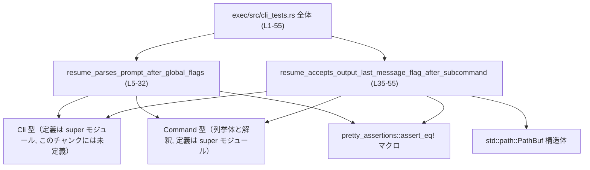
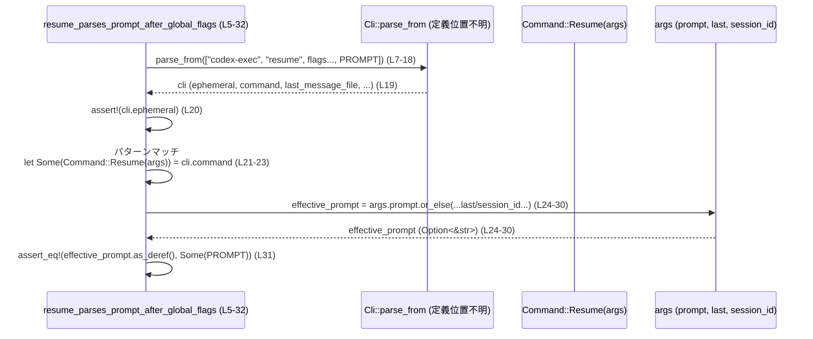

# exec/src/cli_tests.rs コード解説

## 0. ざっくり一言

`Cli` 型の `resume` サブコマンドに対して、コマンドライン引数の並びとフラグ解釈が期待どおりになるかを検証するテスト関数を集めたファイルです（`Cli` と `Command` 自体の定義はこのチャンクにはありません）。

---

## 1. このモジュールの役割

### 1.1 概要

- このモジュールは、`Cli` 型によるコマンドライン引数パースが正しく行われるかをテストします（`use super::*` により親モジュールから `Cli` などを利用しています）【exec/src/cli_tests.rs:L1-2, L7-18, L37-44】。
- 特に `resume` サブコマンドに対して、
  - グローバルフラグ（`--last` など）の後に書いたプロンプト文字列が正しく保持されること【exec/src/cli_tests.rs:L5-32】
  - サブコマンド名の後に `-o <PATH>` フラグとセッションIDを与えた場合に、出力先ファイルパスとセッションID／プロンプトが期待どおり格納されること【exec/src/cli_tests.rs:L35-55】
  を確認します。

### 1.2 アーキテクチャ内での位置づけ

このファイルは、親モジュールで定義されている CLI 構造（`Cli`, `Command` など）に対するユニットテストです。外部入出力は行わず、`Cli::parse_from` に引数配列を渡すことで CLI 実行を模擬しています【exec/src/cli_tests.rs:L7-18, L37-44】。



### 1.3 設計上のポイント

- **高レベル API を用いたテスト**  
  テストでは、実行時の `argv` に相当する文字列スライスを `Cli::parse_from` に渡してテストしており、低レベルなパーサではなく公開 CLI API の挙動を直接検証する構造になっています【exec/src/cli_tests.rs:L7-18, L37-44】。
- **サブコマンドごとのパターンの検証**  
  `Cli` の `command` フィールドから `Command::Resume(args)` 変数を取り出すことで、`resume` サブコマンドに特化した引数解釈を検証しています【exec/src/cli_tests.rs:L21-23, L50-52】。
- **プロンプト決定ロジックのローカル再現**  
  1 つ目のテストでは、`args.prompt` と `args.last`／`args.session_id` から「有効なプロンプト」を計算するロジックをテスト側で構築し、その結果を検証しています【exec/src/cli_tests.rs:L24-31】。
- **失敗時は panic による明示的なテスト失敗**  
  期待したサブコマンドでなかった場合は `panic!("expected resume command")` を発生させ、さらに複数の `assert!` / `assert_eq!` によりテスト失敗を明示します【exec/src/cli_tests.rs:L20-23, L31, L46-48, L53-54】。
- **並行性・安全性**  
  ファイルシステム操作やグローバル可変状態へのアクセスを行っておらず、ローカル変数のみを扱うため、Rust テストランナーがデフォルトで行う並列実行に対しても安全な構造になっています【exec/src/cli_tests.rs:L5-55】。

---

## 2. 主要な機能一覧

このファイルはテスト専用であり、外部から直接呼び出される API はありませんが、テストがカバーする振る舞いを機能として整理すると次のとおりです。

- `resume` サブコマンドのグローバルフラグ後のプロンプト解釈: `--last` などのフラグを指定した状態で末尾に書いたプロンプトが `args.prompt` 経由で取得できることを検証します【exec/src/cli_tests.rs:L5-32】。
- `resume` サブコマンドにおける `-o` フラグとセッション ID・プロンプトの位置関係の検証: サブコマンドの後にセッション ID → `-o` → パス → プロンプトと続く引数列が、`last_message_file`, `session_id`, `prompt` に正しく反映されることを確認します【exec/src/cli_tests.rs:L35-55】.

---

## 3. 公開 API と詳細解説

このファイル自体はテストモジュールであり、`pub` な型や関数は定義していません。ここでは理解に重要な「登場コンポーネント」と「テスト関数」を整理します。

### 3.1 型一覧（構造体・列挙体など）

| 名前 | 種別 | 役割 / 用途 | 根拠（利用位置） |
|------|------|------------|------------------|
| `Cli` | 外部型（種別はこのチャンクでは不明） | コマンドライン引数からパースされた結果全体を保持する型として利用されています。`Cli::parse_from([...])` により引数配列からインスタンスが生成されます【exec/src/cli_tests.rs:L7-18, L37-44】。 | 利用: `exec/src/cli_tests.rs:L7, L37` |
| `Command` | 列挙体と解釈できる外部型 | `Command::Resume(args)` というパターンマッチにより、サブコマンド種別を表す列挙体と解釈できます【exec/src/cli_tests.rs:L21-23, L50-52】。`cli.command` が `Option<Command>` のような型である可能性がありますが、このチャンクだけでは確定できません。 | 利用: `exec/src/cli_tests.rs:L21, L50` |
| `PathBuf` | 構造体（`std::path::PathBuf`） | 出力ファイルのパスを表すために使用され、`PathBuf::from("/tmp/resume-output.md")` として `Cli` の `last_message_file` フィールドと比較されます【exec/src/cli_tests.rs:L46-48】。 | 利用: `exec/src/cli_tests.rs:L46-48` |

※ これらの型の定義そのものは、このファイルには含まれていないため、詳細なフィールド構造は分かりません。

### 3.2 関数詳細

このファイルには 2 つのテスト関数が定義されています。

#### `resume_parses_prompt_after_global_flags()`

**概要**

- `codex-exec resume` コマンドに対して、多数のグローバルフラグ（`--last`, `--json`, `--model`, `--dangerously-bypass-approvals-and-sandbox`, `--skip-git-repo-check`, `--ephemeral`）の後に書かれたプロンプト文字列が、期待どおりに解釈されることを確認するテストです【exec/src/cli_tests.rs:L5-18】。
- また、`args.prompt` と `args.last`／`args.session_id` から「有効なプロンプト」を計算し、その結果が末尾に与えたプロンプト文字列と一致することを検証します【exec/src/cli_tests.rs:L24-31】。

**引数**

- テスト関数であり、引数は取りません【exec/src/cli_tests.rs:L5】。

**戻り値**

- 戻り値の型は `()` です。Rust のテスト関数と同様、全ての `assert!`／`assert_eq!`／`panic!` を通過した場合に成功とみなされます【exec/src/cli_tests.rs:L5-32】。

**内部処理の流れ（アルゴリズム）**

1. プロンプト文字列 `PROMPT` を定数として定義します【exec/src/cli_tests.rs:L6】。
2. `Cli::parse_from` に対して、以下の配列を渡して `cli` インスタンスを生成します【exec/src/cli_tests.rs:L7-18】。
   - プログラム名: `"codex-exec"`
   - サブコマンド: `"resume"`
   - フラグ類: `"--last"`, `"--json"`, `"--model"`, `"gpt-5.2-codex"`, `"--dangerously-bypass-approvals-and-sandbox"`, `"--skip-git-repo-check"`, `"--ephemeral"`
   - 最後の引数として `PROMPT`
3. `cli.ephemeral` が `true` であることを `assert!` で確認します。`--ephemeral` フラグが適切に解釈されていることを期待するテストになります【exec/src/cli_tests.rs:L20】。
4. `cli.command` から `Command::Resume(args)` を取り出すパターンマッチを行い、それ以外の場合は `panic!("expected resume command")` でテストを失敗させます【exec/src/cli_tests.rs:L21-23】。
5. 以下のように `effective_prompt` を計算します【exec/src/cli_tests.rs:L24-30】。
   - `args.prompt.clone().or_else(|| { if args.last { args.session_id.clone() } else { None } })`
   - つまり、`args.prompt` が `Some` ならそれを採用し、`None` の場合には `args.last` が真であれば `args.session_id` を採用し、それ以外は `None` とします。
6. `effective_prompt.as_deref()` が `Some(PROMPT)` であることを `pretty_assertions::assert_eq!` で検証します【exec/src/cli_tests.rs:L31】。

**Examples（使用例）**

この関数自体はテストとして `cargo test` から実行されます。特定のテストだけを実行したい場合は、テスト名を指定して実行できます。

```bash
# このテストのみを実行する例
cargo test resume_parses_prompt_after_global_flags
```

このコマンドにより、`Cli::parse_from` が与えられた引数配列をどのようにパースするかが検証されます。

**Errors / Panics**

- 以下の条件で panic が発生し、テストは失敗します。
  - `cli.ephemeral` が `false` の場合【exec/src/cli_tests.rs:L20】。
  - `cli.command` が `Some(Command::Resume(..))` でない場合（`None` または他のバリアントの場合）【exec/src/cli_tests.rs:L21-23】。
  - `effective_prompt.as_deref()` が `Some(PROMPT)` と一致しない場合【exec/src/cli_tests.rs:L31】。
- それ以外の I/O エラーなどは発生しません（ファイルやネットワークにはアクセスしていません）。

**Edge cases（エッジケース）**

- このテストがカバーしているのは、「`--last` が指定されているが、同時に明示的なプロンプトも与えられている」というケースです【exec/src/cli_tests.rs:L7-18】。
  - テストのロジック上、`args.prompt` が `Some` なら `args.last` が `true` であってもプロンプトが優先されることを期待しています【exec/src/cli_tests.rs:L24-31】。
- プロンプトが省略された場合や、`--last` が指定されない場合の挙動はこのファイルからは分かりません（テストされていません）。

**使用上の注意点**

- このテストは `Cli` 型および `Command::Resume` バリアントの具体的な定義に依存しており、それらの構造が変わるとテストの更新が必要になります（例: フィールド名の変更など）【exec/src/cli_tests.rs:L21-27】。
- 「有効なプロンプト」の計算ロジックはテスト側にローカルに書かれているため、実際の本番コード側のロジックと乖離しないよう注意する必要があります（本番コードがどうなっているかはこのチャンクには現れません）。
- セキュリティ面では、このテストは固定の文字列リストのみを扱い、外部入力やファイル操作は行わないため、このファイル単体で新たな脆弱性を生む要素は見当たりません。

---

#### `resume_accepts_output_last_message_flag_after_subcommand()`

**概要**

- `codex-exec resume` サブコマンドで、サブコマンドの直後にセッション ID、続けて `-o` フラグと出力ファイルパス、その後にプロンプトを渡した場合の引数解釈が期待どおりであることを確認するテストです【exec/src/cli_tests.rs:L35-44】。
- `Cli` の `last_message_file` フィールドと、`Command::Resume(args)` に含まれる `session_id`／`prompt` フィールドの値を検証します【exec/src/cli_tests.rs:L46-48, L53-54】。

**引数**

- テスト関数であり、引数は取りません【exec/src/cli_tests.rs:L35】。

**戻り値**

- 戻り値は `()` です。全ての `assert_eq!` とパターンマッチが通過すればテスト成功となります【exec/src/cli_tests.rs:L35-55】。

**内部処理の流れ（アルゴリズム）**

1. プロンプト文字列 `PROMPT` を定数として定義します【exec/src/cli_tests.rs:L36】。
2. `Cli::parse_from` に対して、以下の配列を渡して `cli` インスタンスを生成します【exec/src/cli_tests.rs:L37-44】。
   - `"codex-exec"`
   - `"resume"`
   - `"session-123"` （おそらくセッション ID として解釈されることを期待）
   - `"-o"`
   - `"/tmp/resume-output.md"` （出力ファイルパス）
   - `PROMPT` （プロンプト）
3. `cli.last_message_file` が `Some(PathBuf::from("/tmp/resume-output.md"))` であることを `assert_eq!` で確認します【exec/src/cli_tests.rs:L46-48】。
4. `cli.command` から `Command::Resume(args)` を取り出し、期待したバリアントでなければ `panic!("expected resume command")` でテスト失敗とします【exec/src/cli_tests.rs:L50-52】。
5. `args.session_id.as_deref()` が `Some("session-123")` であることを `assert_eq!` で確認します【exec/src/cli_tests.rs:L53】。
6. `args.prompt.as_deref()` が `Some(PROMPT)` であることを `assert_eq!` で確認します【exec/src/cli_tests.rs:L54】。

**Examples（使用例）**

このテストも同様に `cargo test` で実行されます。単体で実行する場合は次のようになります。

```bash
cargo test resume_accepts_output_last_message_flag_after_subcommand
```

これにより、`resume` サブコマンドにおける `-o` フラグと位置引数の解釈が検証されます。

**Errors / Panics**

- 以下の条件で panic が発生し、テストは失敗します。
  - `cli.last_message_file` が `Some(PathBuf::from("/tmp/resume-output.md"))` と一致しない場合【exec/src/cli_tests.rs:L46-48】。
  - `cli.command` が `Some(Command::Resume(..))` でない場合【exec/src/cli_tests.rs:L50-52】。
  - `args.session_id` が `"session-123"` でない、もしくは `None` の場合【exec/src/cli_tests.rs:L53】。
  - `args.prompt` が `PROMPT` でない、もしくは `None` の場合【exec/src/cli_tests.rs:L54】。

**Edge cases（エッジケース）**

- このテストは、「サブコマンドの直後にセッション ID、その後に `-o` フラグとパス、およびプロンプトを渡す」という特定順序のみに焦点を当てています【exec/src/cli_tests.rs:L37-44】。
- `-o` フラグの有無や位置が異なるケース、セッション ID を省略したケースなどは、このファイルではテストされていません。

**使用上の注意点**

- `"/tmp/resume-output.md"` はパス文字列としてのみ利用され、実際にファイルを作成・削除したりする処理は含まれていません【exec/src/cli_tests.rs:L46-48】。そのため、テスト実行時のファイルシステムへの副作用はありません。
- 並列テスト実行時にも、このテストはファイルアクセスを行わないため、相互干渉の心配はありません。
- `last_message_file` の型が `Option<PathBuf>` であることを前提に `Some(PathBuf::from(...))` と比較しているため、型が変更された場合にはテストの修正が必要になります【exec/src/cli_tests.rs:L46-48】。

### 3.3 その他の関数

- このファイルには、上記 2 つのテスト関数以外にトップレベル関数は定義されていません【exec/src/cli_tests.rs:L1-55】。
- 無名クロージャ（`or_else(|| { ... })`）は存在しますが、補助的であり、別名の関数として切り出されてはいません【exec/src/cli_tests.rs:L24-30】。

---

## 4. データフロー

ここでは、1 つ目のテスト `resume_parses_prompt_after_global_flags` を例に、データの流れを整理します。

### 4.1 処理の要点

- テストコードは固定の文字列配列を `Cli::parse_from` に渡し、実行時の `argv` を模擬します【exec/src/cli_tests.rs:L7-18】。
- `Cli` のパース結果から `cli.ephemeral` と `cli.command`（`Command::Resume(args)`）を取得し、`args` からプロンプトとセッション ID、`last` フラグを利用して「有効なプロンプト」を決定します【exec/src/cli_tests.rs:L20-31】。
- 最終的に、その有効プロンプトが末尾に渡した文字列 `PROMPT` と一致することを検証します【exec/src/cli_tests.rs:L31】。

### 4.2 シーケンス図



このシーケンス図は、テスト関数内でどのように `Cli` のパース結果から `args` を取り出し、プロンプト文字列を導出して検証しているかを表しています。

---

## 5. 使い方（How to Use）

### 5.1 基本的な使用方法

このモジュールはテスト専用であり、通常は次のように `cargo test` から実行されます。

```bash
# プロジェクト全体のテストを実行
cargo test

# このファイル内のテストだけを名前で絞り込む例
cargo test resume_parses_prompt_after_global_flags
cargo test resume_accepts_output_last_message_flag_after_subcommand
```

CLI 定義を変更した際に、このテストが想定どおりに通るかどうかで、`resume` サブコマンドに関する振る舞いの退行がないかを確認できます。

### 5.2 よくある使用パターン

`Cli` に新しいオプションやサブコマンドを追加した場合、このファイルのスタイルを参考にテストを追加できます。

```rust
// 新しいフラグ --dry-run を追加した場合のテストイメージ（例示コード）
#[test]
fn resume_accepts_dry_run_flag() {
    // プロンプトの定義
    const PROMPT: &str = "echo dry-run";

    // 実際のコマンドラインを模した配列を Cli::parse_from に渡す
    let cli = Cli::parse_from([
        "codex-exec",  // プログラム名
        "resume",      // サブコマンド
        "--dry-run",   // 追加されたフラグ
        PROMPT,        // プロンプト
    ]);

    // コマンドのバリアントとフラグの値を検証する
    let Some(Command::Resume(args)) = cli.command else {
        panic!("expected resume command");
    };

    // 仮に args.dry_run というフィールドが追加されている場合の検証例
    // assert!(args.dry_run);
    assert_eq!(args.prompt.as_deref(), Some(PROMPT));
}
```

※ `args.dry_run` フィールドなどはこのチャンクには存在しないため、上記はパターンの例示にとどまります。

### 5.3 よくある間違い

このファイルの構造から、テストを拡張する際に起こりうる典型的なミスを挙げます。

```rust
// 間違い例: #[test] 属性を付け忘れている
fn resume_new_flag_test() {
    // ... テスト本体 ...
}

// 正しい例: #[test] 属性を付けることでテストとして認識される
#[test]
fn resume_new_flag_test() {
    // ... テスト本体 ...
}
```

```rust
// 間違い例: サブコマンドのバリアントを検証していないため、
// 期待しないコマンドでもテストが通ってしまう可能性がある
#[test]
fn resume_without_variant_check() {
    let cli = Cli::parse_from(["codex-exec", "resume"]);
    // cli.command の中身を確認していない
    // ...
}

// 正しい例: Command::Resume(args) を明示的にパターンマッチする
#[test]
fn resume_with_variant_check() {
    let cli = Cli::parse_from(["codex-exec", "resume"]);
    let Some(Command::Resume(_args)) = cli.command else {
        panic!("expected resume command");
    };
}
```

### 5.4 使用上の注意点（まとめ）

- **前提条件**  
  - このファイルのテストは、親モジュールで `Cli` 型と `Command` 型が正しく定義されていることを前提としています【exec/src/cli_tests.rs:L1, L7, L21, L37, L50】。
- **副作用の有無**  
  - ファイルシステムやネットワークへのアクセスは行っていないため、テスト実行による副作用はありません【exec/src/cli_tests.rs:L5-55】。
- **並行実行**  
  - グローバルな可変状態に依存せず、テストごとに独立したローカル変数だけを扱っているため、Rust のテストランナーによる並列実行においても安全に動作する構造になっています【exec/src/cli_tests.rs:L5-55】。
- **ロジックの重複**  
  - 「有効なプロンプト」のようなロジックをテスト側でも再現している箇所があり、本番コード側の仕様変更時に両者の整合性が取れているか注意が必要です【exec/src/cli_tests.rs:L24-31】。

---

## 6. 変更の仕方（How to Modify）

### 6.1 新しい機能を追加する場合

`Cli` に新しいフラグやサブコマンドを追加した場合の、このファイルの拡張の基本的な流れです。

1. **想定するコマンドラインを決める**  
   - 実際にユーザーが入力するであろうコマンドラインを文字列配列に落とし込みます（`Cli::parse_from([...])` の引数として利用）【exec/src/cli_tests.rs:L7-18, L37-44】。
2. **テスト関数を追加する**  
   - `#[test]` 属性を付けた関数を定義し、上記の配列を `Cli::parse_from` に渡します【exec/src/cli_tests.rs:L4-5, L34-35】。
3. **`Cli` のフィールドを検証する**  
   - 新しいフラグに対応するフィールドや、サブコマンドのバリアントが期待どおりであることを `assert!`／`assert_eq!` で検証します【exec/src/cli_tests.rs:L20-23, L46-48, L53-54】。
4. **エッジケースを追加検証する**  
   - フラグの有無や順序、位置引数の有無など、仕様上重要な組み合わせごとにテストを追加することが考えられます（このチャンクにはその具体例はありませんが、現行の 2 ケースがひとつの指標になります）。

### 6.2 既存の機能を変更する場合

例えば `resume` サブコマンドの引数仕様を変更する場合、以下の点に注意する必要があります。

- **影響範囲の確認**
  - `Cli` 型および `Command::Resume` バリアントのフィールド構造を変更すると、このファイルで行っているパターンマッチやフィールド参照がコンパイルエラーになる、もしくは意味が変わる可能性があります【exec/src/cli_tests.rs:L21-27, L50-54】。
- **契約（前提条件・返り値の意味）の維持**
  - 例えば、「`--ephemeral` が指定されたら `cli.ephemeral` が `true` になる」「`-o` の後のパスが `last_message_file` に入る」といった仕様を変更する場合、このテストが前提としている契約をどこまで維持するか、仕様として明確にする必要があります【exec/src/cli_tests.rs:L20, L46-48】。
- **テストケースの更新**
  - 仕様変更に合わせて、期待値（`assert_eq!` の右辺）や引数配列の構造を更新する必要があります【exec/src/cli_tests.rs:L7-18, L37-44, L31, L46-48, L53-54】。
- **並行性・安全性**
  - このファイルのテストは現在、副作用がない前提で安全に並行実行されています。仕様変更に伴いテスト側にファイル操作や環境変数操作などを追加する場合は、テスト同士の干渉について注意が必要です。

---

## 7. 関連ファイル

このチャンクから直接分かる範囲で、関連するコンポーネントを整理します。

| パス / モジュール | 役割 / 関係 |
|-------------------|------------|
| `super`（親モジュール, 実際のファイルパスはこのチャンクには現れない） | `use super::*;` によりインポートされるモジュールで、`Cli` 型や `Command` 型、およびそのフィールド（`ephemeral`, `command`, `last_message_file`, `session_id`, `prompt`, `last` など）の定義を提供していると考えられます【exec/src/cli_tests.rs:L1, L7, L21, L37, L46, L50】。 |
| `pretty_assertions` クレート | `assert_eq!` マクロの拡張版を提供し、このテストファイルでデバッグしやすい差分表示のために利用されています【exec/src/cli_tests.rs:L2, L31, L46-48, L53-54】。 |
| `std::path::PathBuf` | Rust 標準ライブラリのパス型であり、`Cli` の `last_message_file` フィールドの期待値との比較に使用されています【exec/src/cli_tests.rs:L46-48】。 |

このファイルは、CLI の仕様変更による挙動の変化を検出するためのテストハーネスとして位置づけられます。CLI のコアロジックや型の定義そのものは親モジュール側にあり、このチャンクからは詳細は分かりませんが、ここで示した情報により、現行テストがどのような契約を前提にしているかを把握できます。
