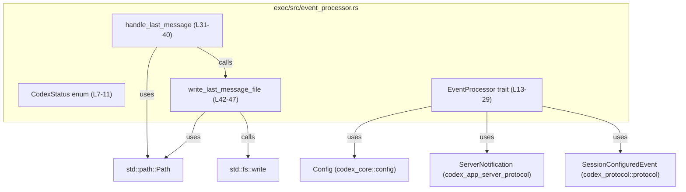
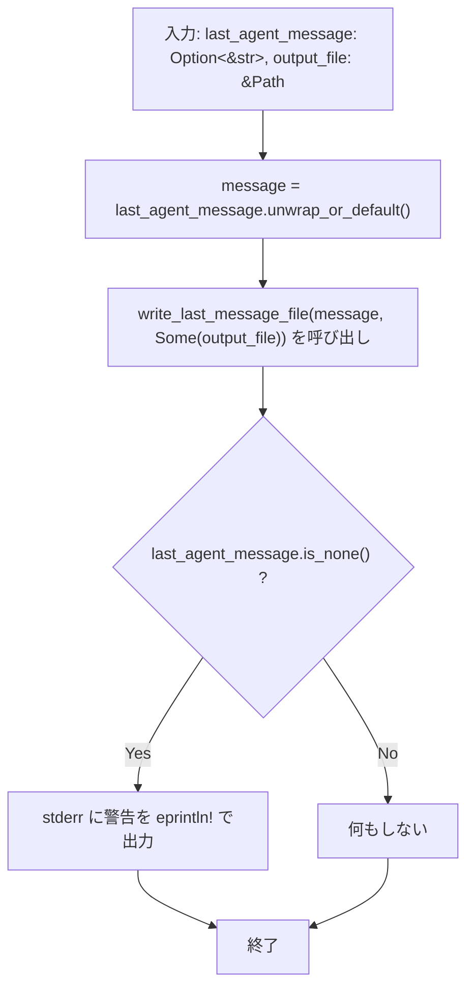
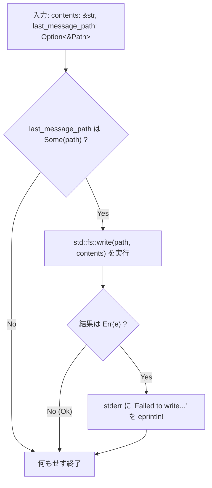
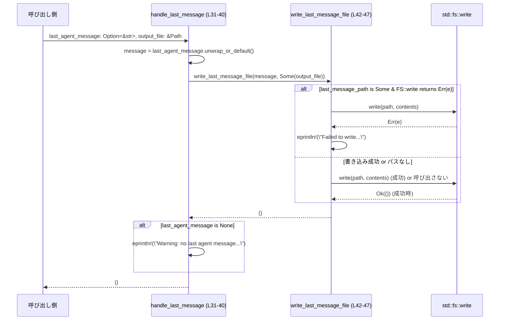
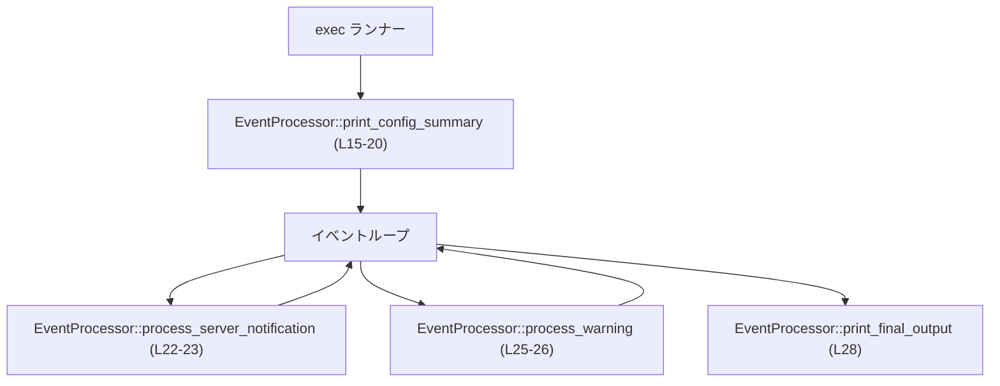

# exec/src/event_processor.rs

## 0. ざっくり一言

Codex 実行系で使う **イベント処理インターフェース**（`EventProcessor`）とその状態を表す `CodexStatus` を定義し、最後のエージェントメッセージをファイルに書き出すユーティリティ関数を提供するモジュールです（`event_processor.rs:L7-11, L13-29, L31-47`）。

---

## 1. このモジュールの役割

### 1.1 概要

- このモジュールは、Codex の実行プロセス内で発生するイベント（設定完了通知、サーバ通知、ローカル警告など）を処理するための **抽象インターフェース `EventProcessor`** を定義します（`event_processor.rs:L13-29`）。
- また、イベント処理の結果としての実行状態（継続／終了要求）を表現する `CodexStatus` を定義します（`event_processor.rs:L7-11`）。
- 実行の最後にエージェントからの最終メッセージをファイルに保存する `handle_last_message` と、その内部実装 `write_last_message_file` を提供します（`event_processor.rs:L31-47`）。

### 1.2 アーキテクチャ内での位置づけ

このモジュールは「exec」コンポーネント内で、外部プロトコル層から受け取ったイベントを処理する層と、ローカルな出力（標準エラーやファイル）を扱う層の境界に位置します。

- `EventProcessor` は、以下の型に依存することで周辺モジュールと接続しています（`event_processor.rs:L3-5, L15-20, L23`）:
  - `Config`（`codex_core::config::Config`）: 実行設定
  - `ServerNotification`（`codex_app_server_protocol::ServerNotification`）: エージェント／アプリサーバからの通知
  - `SessionConfiguredEvent`（`codex_protocol::protocol::SessionConfiguredEvent`）: セッション設定完了イベント
- `handle_last_message` は `std::path::Path` と `std::fs::write` を使い、ファイルシステムへの書き込みという I/O 境界を担います（`event_processor.rs:L1, L42-45`）。

依存関係を簡易的に示すと次のようになります:



※ `Config` / `ServerNotification` / `SessionConfiguredEvent` の定義はこのチャンクには現れません。

### 1.3 設計上のポイント

- **状態表現の単純化**  
  - 実行状態は `CodexStatus` の 2 値（`Running` / `InitiateShutdown`）のみで表現されます（`event_processor.rs:L7-11`）。
- **抽象化されたイベント処理**  
  - 実処理は `EventProcessor` trait によって抽象化され、具体的なロジックは別実装に委ねられる設計です（`event_processor.rs:L13-29`）。
- **所有権と排他制御**  
  - trait メソッドはすべて `&mut self` を引数に取り、コンパイル時に「同時に 1 つの可変参照しか存在しない」ことを保証することで、スレッドセーフではないが **単一スレッドでの排他アクセス** を前提にした安全性を確保しています（`event_processor.rs:L15, L23, L26, L28`）。
- **エラーハンドリング方針**  
  - 設定サマリや通知処理のエラーハンドリング方針は trait 実装側に委ねられています（このファイルには実装がありません）。
  - ローカルファイル書き込み (`write_last_message_file`) では、書き込み失敗時に標準エラーへのログ出力のみを行い、エラーを呼び出し元に伝播しません（`event_processor.rs:L42-47`）。
- **I/O の同期性**  
  - `std::fs::write` による同期的ファイル書き込みを行っており、非同期 I/O や並行性の制御はこのモジュールには現れません（`event_processor.rs:L42-45`）。

---

## 2. 主要な機能一覧

- `CodexStatus`: イベント処理後の実行状態（継続 or シャットダウン開始）を表現する列挙体です（`event_processor.rs:L7-11`）。
- `EventProcessor` trait:
  - `print_config_summary`: 有効な設定とユーザープロンプトの要約を出力するためのインターフェースです（`event_processor.rs:L15-20`）。
  - `process_server_notification`: エージェントが発行するサーバ通知を処理し、次の実行状態を返すインターフェースです（`event_processor.rs:L22-23`）。
  - `process_warning`: ローカル exec 側の警告メッセージを処理し、次の実行状態を返すインターフェースです（`event_processor.rs:L25-26`）。
  - `print_final_output`: 最終的な出力を行うための拡張ポイントで、デフォルトでは空実装です（`event_processor.rs:L28`）。
- `handle_last_message`: 最後のエージェントメッセージを指定されたファイルに書き出し、メッセージが存在しない場合は警告を標準エラーに出力する関数です（`event_processor.rs:L31-40`）。
- `write_last_message_file`: 任意のパスに文字列を書き込む内部ユーティリティ関数で、書き込み失敗時には標準エラーにログを出力します（`event_processor.rs:L42-47`）。

---

## 3. 公開 API と詳細解説

### 3.1 型一覧（構造体・列挙体・トレイトなど）

| 名前 | 種別 | 公開範囲 | 行範囲 | 役割 / 用途 |
|------|------|----------|--------|-------------|
| `CodexStatus` | 列挙体 (`enum`) | `pub` | `event_processor.rs:L7-11` | イベント処理ループの状態を「実行継続 (`Running`)」か「シャットダウン開始 (`InitiateShutdown`)」かで表す。 |
| `EventProcessor` | トレイト | `pub(crate)` | `event_processor.rs:L13-29` | 設定サマリ出力、サーバ通知処理、ローカル警告処理、最終出力を行うための抽象インターフェース。具体的な処理は別実装が担当。 |

※ このモジュールで参照される外部型（定義はこのチャンクには現れません）:

| 名前 | 種別 | 定義モジュール（import より） | 行範囲 | 役割 / 用途（コードから読み取れる範囲） |
|------|------|-----------------------------|--------|----------------------------------|
| `Config` | 構造体（と推定） | `codex_core::config::Config` | `event_processor.rs:L4, L17` | 実行時設定を表す型。設定サマリ出力に使用される。 |
| `ServerNotification` | 列挙体または構造体（と推定） | `codex_app_server_protocol::ServerNotification` | `event_processor.rs:L3, L23` | エージェント／アプリサーバからの通知イベントを表す型として使用される。 |
| `SessionConfiguredEvent` | 構造体またはイベント型（と推定） | `codex_protocol::protocol::SessionConfiguredEvent` | `event_processor.rs:L5, L19` | セッション設定完了に関する情報を表すイベント。設定サマリ出力に使用される。 |

### 3.2 関数詳細

#### `EventProcessor::print_config_summary(&mut self, config: &Config, prompt: &str, session_configured: &SessionConfiguredEvent)`

**概要**

- 有効な実行設定 (`Config`)、ユーザープロンプト文字列 (`&str`)、セッション設定イベント (`SessionConfiguredEvent`) を受け取り、そのサマリを出力するための抽象メソッドです（`event_processor.rs:L15-20`）。
- 実際の出力先（標準出力、ログ、UI 等）やフォーマットは、この trait を実装する側に委ねられます。

**引数**

| 引数名 | 型 | 説明 |
|--------|----|------|
| `&mut self` | 可変参照 | イベント処理器自身への可変参照。内部状態を更新できることを意味します。 |
| `config` | `&Config` | 有効な実行設定を参照します（`event_processor.rs:L17`）。 |
| `prompt` | `&str` | ユーザーに提示するプロンプト文字列です（`event_processor.rs:L18`）。 |
| `session_configured` | `&SessionConfiguredEvent` | セッション設定完了時の詳細情報です（`event_processor.rs:L19`）。 |

**戻り値**

- なし（`()`）。  
  出力処理の成功／失敗やシャットダウン指示などは、実装側の内部状態やログで扱うことになります。このメソッドの戻り値には現れません。

**内部処理の流れ（アルゴリズム）**

- このファイルには実装が存在しないため、具体的な処理内容は不明です。  
  処理の役割はドキュメンテーションコメントからのみ読み取れます（`event_processor.rs:L14`）。

**Examples（使用例）**

`EventProcessor` を実装して設定サマリを出力する簡単な例です（`Config`/`SessionConfiguredEvent` の中身はこのチャンクには現れないためダミー参照のみとしています）。

```rust
use codex_core::config::Config;                              // Config 型をインポートする
use codex_protocol::protocol::SessionConfiguredEvent;        // SessionConfiguredEvent 型をインポートする
use exec::event_processor::{EventProcessor, CodexStatus};    // このモジュールの型をインポートする（パスは例）

// シンプルなイベントプロセッサを定義する
struct SimpleProcessor;                                      // 状態を持たない実装例

impl EventProcessor for SimpleProcessor {                    // EventProcessor を実装する
    fn print_config_summary(
        &mut self,
        config: &Config,                                     // 設定を参照する
        prompt: &str,                                        // プロンプト文字列
        session_configured: &SessionConfiguredEvent,         // セッション設定情報
    ) {
        // ここでは単純にデバッグ的に表示する例を示す
        eprintln!("Config: {:?}, prompt: {}", config, prompt);
        eprintln!("Session configured: {:?}", session_configured);
    }

    fn process_server_notification(
        &mut self,
        _notification: codex_app_server_protocol::ServerNotification,
    ) -> CodexStatus {
        CodexStatus::Running                                 // ここでは常に継続とする
    }

    fn process_warning(&mut self, message: String) -> CodexStatus {
        eprintln!("Warning: {}", message);
        CodexStatus::Running
    }

    fn print_final_output(&mut self) {}
}
```

**Errors / Panics**

- このメソッド自体は抽象メソッドであり、このファイル内にエラー処理や panic は記述されていません。
- 実際のエラー条件や panic の可能性は、trait を実装するコード側に依存します。

**Edge cases（エッジケース）**

- `prompt` が空文字列の場合の扱いなどは、このファイルからは分かりません。
- `Config` や `SessionConfiguredEvent` が「不完全」な状態で渡される可能性についても、このチャンクには情報がありません。

**使用上の注意点**

- 呼び出し側は、`Config` と `SessionConfiguredEvent` が妥当な状態であることを前提としてこのメソッドを呼び出す必要があります（妥当性チェックの責務がどちらにあるかはこのチャンクからは不明です）。
- `&mut self` を要求するため、同じ `EventProcessor` インスタンスに対して並行にこのメソッドを呼び出すことは Rust の所有権ルール上できません（コンパイラが防ぎます）。

---

#### `EventProcessor::process_server_notification(&mut self, notification: ServerNotification) -> CodexStatus`

**概要**

- エージェント／アプリサーバからの通知 (`ServerNotification`) を 1 件受け取り、その処理結果として次にとるべき `CodexStatus`（継続／シャットダウン）を返すインターフェースです（`event_processor.rs:L22-23`）。

**引数**

| 引数名 | 型 | 説明 |
|--------|----|------|
| `&mut self` | 可変参照 | イベント処理器自身への可変参照。通知処理に応じて内部状態を更新できることを示します。 |
| `notification` | `ServerNotification` | アプリサーバからの単一通知イベントです（`event_processor.rs:L23`）。所有権がこのメソッドに移動します。 |

**戻り値**

- `CodexStatus`  
  - `CodexStatus::Running`: 実行を継続すべきであることを示す（と解釈できます）。
  - `CodexStatus::InitiateShutdown`: シャットダウン処理を開始すべきことを示す（と解釈できます）。
- 具体的にどの通知でどの値を返すかは、このチャンクには現れません。

**内部処理の流れ**

- 本ファイルには実装がないため、通知内容と `CodexStatus` の対応関係など、内部ロジックは不明です。

**Examples（使用例）**

以下は通知をループ処理するイメージです。`ServerNotification` の生成方法や列挙値はこのチャンクには現れないため、抽象的な例となります。

```rust
use codex_app_server_protocol::ServerNotification;          // 通知型をインポート
use exec::event_processor::{EventProcessor, CodexStatus};   // trait とステータスをインポート

fn run_loop(processor: &mut impl EventProcessor,            // EventProcessor を実装した任意の型を受け取る
            notifications: impl Iterator<Item = ServerNotification>) {
    for notif in notifications {                            // 通知を順に処理する
        let status = processor.process_server_notification(notif); // 通知を処理しステータスを得る
        if status == CodexStatus::InitiateShutdown {        // シャットダウン要求を検出
            break;                                          // ループを抜ける
        }
    }
}
```

**Errors / Panics**

- メソッドのシグネチャにはエラー型が含まれておらず、`Result` ではありません（`event_processor.rs:L23`）。
- エラー処理は trait 実装側の内部で行われる設計と推測できますが、具体的な挙動はこのチャンクには現れません。
- 呼び出し側から見て panic の可能性は、このファイルからは判断できません。

**Edge cases**

- 未知の通知種別などが渡された場合の扱いは不明です（無視する、警告を出す、シャットダウンする等）。
- 連続して大量の通知が来た場合のパフォーマンスやバッファリング戦略についても、このチャンクからは読み取れません。

**使用上の注意点**

- 戻り値の `CodexStatus` に基づき、呼び出し側が適切にループ制御やシャットダウン処理を行うことが前提となる設計です。
- `notification` の所有権はこのメソッド内で消費されるため、呼び出し後に同じ通知オブジェクトを再利用することはできません。

---

#### `EventProcessor::process_warning(&mut self, message: String) -> CodexStatus`

**概要**

- ローカル exec 側で発生した警告メッセージ（サーバ通知にはならないもの）を処理し、その結果として `CodexStatus` を返すためのメソッドです（`event_processor.rs:L25-26`）。

**引数**

| 引数名 | 型 | 説明 |
|--------|----|------|
| `&mut self` | 可変参照 | イベント処理器自身。ログの蓄積や警告カウントなど、内部状態の更新を許可します。 |
| `message` | `String` | 警告メッセージ本文。所有権がメソッドに移動します（`event_processor.rs:L26`）。 |

**戻り値**

- `CodexStatus`  
  - 警告の重さに応じて、実行継続かシャットダウン開始かを示すことが想定されますが、具体的条件はこのチャンクには現れません。

**内部処理の流れ**

- 実装はこのファイルには存在しないため、例えば「一定回数以上警告が続いたらシャットダウンする」のようなポリシーがあるかどうかは分かりません。

**Examples（使用例）**

```rust
use exec::event_processor::{EventProcessor, CodexStatus};   // trait とステータスをインポート

fn handle_local_issue(processor: &mut impl EventProcessor) {
    // ローカルで検出された警告をメッセージとして渡す
    let status = processor.process_warning("local disk is almost full".to_string());
    if status == CodexStatus::InitiateShutdown {
        // 必要ならここでクリーンアップやシャットダウン処理を行う
    }
}
```

**Errors / Panics**

- シグネチャにエラー型は含まれず、`Result` ではありません（`event_processor.rs:L26`）。
- 実装側がどのように失敗を扱うか（内部ログのみ、panic など）は、このチャンクには現れません。

**Edge cases**

- 極端に長いメッセージ（大きな `String`）が渡された場合のメモリ使用量や処理時間は、実装依存です。
- 空文字列が渡された場合の扱いについて、このファイルからは情報がありません。

**使用上の注意点**

- `message` の所有権は渡した時点で失われるため、同じメッセージを別の場所でも使用したい場合は clone 等が必要です。
- ローカル警告をどの程度でシャットダウン条件とするかは、trait 実装側のポリシーに依存します。

---

#### `EventProcessor::print_final_output(&mut self)`

**概要**

- イベント処理の最後に実行される「最終出力」のためのメソッドです（`event_processor.rs:L28`）。
- このファイルではデフォルト実装が空（何もしない）として定義されています。

**引数**

| 引数名 | 型 | 説明 |
|--------|----|------|
| `&mut self` | 可変参照 | 最終出力時に内部状態を参照／更新できることを示します。 |

**戻り値**

- なし（`()`）。

**内部処理の流れ**

- デフォルト実装は空のブロック `{}` のみで、何も行いません（`event_processor.rs:L28`）。
- 実際に出力を行いたい場合は、このメソッドを trait 実装側でオーバーライドする必要があります。

**Examples（使用例）**

```rust
use exec::event_processor::EventProcessor;                  // trait をインポート

struct ReportingProcessor {                                 // 何らかの結果集計を持つ構造体
    report: String,                                         // 最終的に出力したいレポート
}

impl EventProcessor for ReportingProcessor {
    // 他メソッドは省略

    fn print_final_output(&mut self) {
        println!("Final report:\n{}", self.report);         // 最終レポートを表示する
    }
}
```

**Errors / Panics**

- デフォルト実装ではエラーも panic も発生しません。
- オーバーライドした実装におけるエラー／panic の可能性は、その実装に依存します。

**Edge cases**

- オーバーライドしない場合、このメソッドを呼び出しても何も起こりません。

**使用上の注意点**

- 「必ず行いたいクリーンアップや出力」がある場合は、trait 実装側でこのメソッドをオーバーライドする必要があります。
- `&mut self` 要求により、イベント処理ループの最後で 1 回だけ呼ぶ（再入しない）ことが自然な設計です。

---

#### `handle_last_message(last_agent_message: Option<&str>, output_file: &Path)`

**概要**

- 最後のエージェントメッセージ（`Option<&str>`）を指定されたパス (`&Path`) に書き出す関数です（`event_processor.rs:L31-40`）。
- メッセージが `None` の場合は空文字列を書き出し、その事実を標準エラーに警告として出力します。

**引数**

| 引数名 | 型 | 説明 |
|--------|----|------|
| `last_agent_message` | `Option<&str>` | 最後のエージェントメッセージ。`Some` の場合はその内容、`None` の場合は「メッセージなし」。 |
| `output_file` | `&Path` | メッセージを書き出すファイルパス（`std::path::Path` への参照）。`event_processor.rs:L31` |

**戻り値**

- なし（`()`）。  
  書き込み成功／失敗は戻り値では示されません。

**内部処理の流れ（アルゴリズム）**

1. `last_agent_message.unwrap_or_default()` でメッセージを決定します（`event_processor.rs:L32`）。
   - `Some(s)` の場合は `s`（`&str`）を使用。
   - `None` の場合は `&str` のデフォルト値である空文字列 `""` を使用。
2. 決定した `message` を `write_last_message_file(message, Some(output_file))` に渡してファイル書き込みを行います（`event_processor.rs:L33`）。
3. もし `last_agent_message` が `None` だった場合、標準エラーに警告メッセージを出力します（`event_processor.rs:L34-39`）。
   - メッセージ中には `output_file.display()` によるパスの表示が含まれます。

**処理フロー図（handle_last_message (L31-40)）**



**Examples（使用例）**

```rust
use std::path::Path;                                        // Path 型をインポート
use exec::event_processor::handle_last_message;             // 関数をインポート（パスは例）

fn finish_session(last_msg: Option<&str>) {                  // 最後のメッセージを引数で受け取る
    let path = Path::new("last_message.txt");               // 出力先ファイルパスを決める
    handle_last_message(last_msg, path);                    // ファイルに書き出し、必要なら警告を出す
}

// 使用例:
// finish_session(Some("Session completed successfully."));
// -> ファイルにその文字列を書き込み、警告は出さない
//
// finish_session(None);
// -> 空文字列を書き込み、stderr に警告を出す
```

**Errors / Panics**

- `unwrap_or_default` はパニックしません  
  - `Option::unwrap_or_default` は `None` の場合でも `Default` 実装を利用するため、`None` で panic する `unwrap` とは異なります（`event_processor.rs:L32`）。
- ファイル書き込みに失敗した場合の挙動:
  - 実際のエラー処理は `write_last_message_file` に委譲されます（`event_processor.rs:L33`）。
  - `write_last_message_file` 内では `std::fs::write` の `Err` を検出し、標準エラーにログを出力するのみで、呼び出し元にエラーを返しません（`event_processor.rs:L42-47`）。
- `handle_last_message` 自体は panic を引き起こす処理を含みません（`event_processor.rs:L31-40`）。

**Edge cases（エッジケース）**

- `last_agent_message == None`:
  - 空文字列がファイルに書き込まれ、警告が stderr に出力されます（`event_processor.rs:L32-39`）。
- `last_agent_message == Some("")`（空文字列を明示的に指定）:
  - ファイルには空文字列が書き込まれますが、警告は出ません。  
    `is_none()` を条件にしているためです（`event_processor.rs:L34`）。
- `output_file` が存在しないディレクトリ配下を指している場合:
  - `std::fs::write` が `Err` を返し、`write_last_message_file` 内でエラー内容を stderr に出力します（`event_processor.rs:L42-47`）。
  - `handle_last_message` の呼び出し元にはエラーは伝播しません。
- パスが読み取り専用ファイルや権限のない場所を指す場合も同様に、エラーはログに出力されますが、戻り値では検知できません。

**使用上の注意点**

- **エラー検知**: 書き込み失敗を呼び出し元で検知することはできないため、「必ずファイルに残したい」という要件がある場合は、`write_last_message_file` のエラー処理を変更するか、ラップする追加の関数が必要になる可能性があります。
- **I/O ブロッキング**: `std::fs::write` は同期 I/O であり、大きなメッセージや遅いファイルシステムに書き込む場合はブロッキング時間に注意が必要です（`event_processor.rs:L42-45`）。
- **セキュリティ**: この関数は渡されたパスにそのまま書き込みを行います。パスの妥当性検証やアクセス制御は、呼び出し側の責務です。

---

#### `write_last_message_file(contents: &str, last_message_path: Option<&Path>)`

**概要**

- 与えられた文字列 `contents` を、`last_message_path` が `Some(path)` の場合に限り `path` に書き込む内部ユーティリティ関数です（`event_processor.rs:L42-47`）。
- 書き込みに失敗した場合は、そのエラーを標準エラーに出力し、呼び出し元には伝播しません。

**引数**

| 引数名 | 型 | 説明 |
|--------|----|------|
| `contents` | `&str` | 書き込む文字列データ（UTF-8）。 |
| `last_message_path` | `Option<&Path>` | 書き込み先のファイルパス。`None` の場合は書き込みを行いません。 |

**戻り値**

- なし（`()`）。  
  書き込み成功／失敗を戻り値では表現しません。

**内部処理の流れ（アルゴリズム）**

1. `if let Some(path) = last_message_path && let Err(e) = std::fs::write(path, contents)` という **let-chain** を持つ `if` 文で、2 つの条件を同時に評価します（`event_processor.rs:L42-45`）。
   - `last_message_path` が `Some(path)` である。
   - かつ `std::fs::write(path, contents)` が `Err(e)` を返す。
2. 上記 2 条件がともに成立した場合にのみ、`eprintln!("Failed to write last message file {path:?}: {e}");` で標準エラーにエラーメッセージを出力します（`event_processor.rs:L46`）。
3. `last_message_path` が `None` の場合、または `std::fs::write` が成功した場合は、何も出力せずに終了します。

**処理フロー図（write_last_message_file (L42-47)）**



**Examples（使用例）**

通常は `handle_last_message` から呼び出されますが、単体で使うイメージを示します。

```rust
use std::path::Path;                                        // Path 型をインポート

fn example_use() {
    let path = Path::new("output.txt");                     // 出力先パスを作成
    write_last_message_file("hello world", Some(path));     // 正常ケース: 書き込みを試みる

    write_last_message_file("ignored", None);               // パスが None のため何も起こらない
}
```

**Errors / Panics**

- `std::fs::write` で発生する I/O エラーは `Err(e)` として検出され、標準エラーへのログ出力に使われます（`event_processor.rs:L42-47`）。
- エラーが発生しても panic は起こさず、エラーは呼び出し元に伝播されません。
- `contents: &str` は既に有効な参照であることが前提であり、ここで panic を起こす要素はありません。

**Edge cases**

- `last_message_path == None`:
  - 何も書き込まず、エラーログも出力しません（`event_processor.rs:L42-47`）。
- `contents` が空文字列:
  - ファイルへの書き込み処理は実行され、結果として空ファイル（またはファイル内容の完全な上書き）になります。  
    この挙動は `std::fs::write` と同じです。
- パスが存在しないディレクトリや書き込み禁止の場所を指す:
  - `std::fs::write` が `Err` を返し、`eprintln!` でエラーメッセージが出力されます。

**使用上の注意点**

- この関数は「**ベストエフォート**」で書き込みを試み、失敗した場合でも呼び出し元には返さずログ出力に留めます。  
  書き込みの成功を保証したい場合は、この設計が適切かどうかを検討する必要があります。
- 同じファイルに対して複数スレッドからこの関数を並行に呼び出した場合の動作は、ファイルシステムと OS に依存します。このモジュール自身は並行アクセスの制御を行っていません。

---

### 3.3 その他の関数

- このチャンクに定義されている関数は、上記 3.2 で全て解説済みです。補助的な未解説関数はありません（`event_processor.rs:L31-47`）。

---

## 4. データフロー

ここでは代表的なシナリオとして、**最後のエージェントメッセージを書き出す処理**のデータフローを説明します。

### 4.1 最終メッセージ書き出しフロー

- 入力: `last_agent_message: Option<&str>` と `output_file: &Path`（`event_processor.rs:L31`）
- 手順:
  1. メッセージの有無に応じて `&str` を決定（`unwrap_or_default`）します（`event_processor.rs:L32`）。
  2. `write_last_message_file` を通じてファイル書き込みを試みます（`event_processor.rs:L33`）。
  3. メッセージが `None` だった場合は警告を stderr に出力します（`event_processor.rs:L34-39`）。
  4. `write_last_message_file` は、パスが存在し、かつ `std::fs::write` が失敗した場合にのみエラーを stderr に出力します（`event_processor.rs:L42-47`）。

シーケンス図（このチャンク内の関数に限定）:



### 4.2 EventProcessor を介したイベント処理フロー（概念図）

`EventProcessor` 実装がどのように呼び出されるかはこのチャンクには現れませんが、trait シグネチャから想定される概念的なフローを示します。



- 実際の制御フロー（どのタイミングでどのメソッドが呼ばれるか）は、このチャンクには実装がないため「想定レベル」の説明に留まります。

---

## 5. 使い方（How to Use）

### 5.1 基本的な使用方法

#### EventProcessor を実装してイベントループで利用する

```rust
use codex_core::config::Config;                              // 設定型
use codex_protocol::protocol::SessionConfiguredEvent;        // セッション設定イベント型
use codex_app_server_protocol::ServerNotification;           // 通知型
use exec::event_processor::{EventProcessor, CodexStatus};    // このモジュールの型（パスは例）

// イベント処理用の構造体を定義する
struct MyProcessor {                                          // 独自の状態を持つこともできる
    warnings: Vec<String>,                                   // 例えば警告の履歴など
}

impl EventProcessor for MyProcessor {
    fn print_config_summary(
        &mut self,
        config: &Config,                                     // 設定情報への参照
        prompt: &str,                                        // プロンプト文字列
        _session_configured: &SessionConfiguredEvent,        // セッション設定情報
    ) {
        println!("Config summary: {:?}\nPrompt: {}", config, prompt);
    }

    fn process_server_notification(
        &mut self,
        notification: ServerNotification,                    // 通知の所有権を受け取る
    ) -> CodexStatus {
        println!("Notification: {:?}", notification);
        CodexStatus::Running                                 // ここでは常に継続とする
    }

    fn process_warning(&mut self, message: String) -> CodexStatus {
        self.warnings.push(message);                         // 警告を内部に蓄える
        CodexStatus::Running                                 // 警告では終了しない方針
    }

    fn print_final_output(&mut self) {
        println!("Warnings: {:?}", self.warnings);           // 最後に警告一覧を出力
    }
}

// ランナー側のイメージ
fn run_exec(processor: &mut MyProcessor,
            config: &Config,
            prompt: &str,
            session_event: &SessionConfiguredEvent,
            notifications: impl Iterator<Item = ServerNotification>) {
    processor.print_config_summary(config, prompt, session_event); // 設定サマリ出力

    for notif in notifications {
        let status = processor.process_server_notification(notif); // 通知を処理
        if status == CodexStatus::InitiateShutdown {               // シャットダウン要求なら終了
            break;
        }
    }

    processor.print_final_output();                                // 最終出力
}
```

### 5.2 よくある使用パターン

1. **最後のメッセージを書き出す**

```rust
use std::path::Path;                                        // Path 型をインポート
use exec::event_processor::handle_last_message;             // 関数をインポート（パスは例）

fn on_session_end(last_msg: Option<&str>) {
    let path = Path::new("/tmp/codex_last_message.txt");    // 出力先パスを決める
    handle_last_message(last_msg, path);                    // メッセージをファイルに書き出す
}
```

1. **警告を処理して場合によっては終了する**

```rust
use exec::event_processor::{EventProcessor, CodexStatus};

fn report_warning(processor: &mut impl EventProcessor, msg: String) -> bool {
    let status = processor.process_warning(msg);            // 警告を送る
    status == CodexStatus::InitiateShutdown                 // 終了要求かどうかを返す
}
```

### 5.3 よくある間違い

```rust
use std::path::Path;
use exec::event_processor::handle_last_message;

// 間違い例: 出力先パスが不正（書き込み不可な場所）
// これでもコンパイルは通るが、実行時に書き込みエラーとなり stderr にログが出るだけで、
// 呼び出し側では失敗に気づけない。
fn bad_example(last_msg: Option<&str>) {
    let path = Path::new("/root/protected.txt");            // 権限がないパスを指定
    handle_last_message(last_msg, path);                    // エラーを検知しない
}

// 正しい例: 呼び出し側でパスの妥当性や権限を検証してから呼び出す
fn better_example(last_msg: Option<&str>) -> std::io::Result<()> {
    let path = Path::new("/tmp/codex_last_message.txt");    // 妥当なパスを選ぶ
    // 必要であれば事前にディレクトリの存在やアクセス権を確認するなどを行う（このチャンクには記述なし）
    handle_last_message(last_msg, path);                    // 書き込みを試みる
    Ok(())
}
```

### 5.4 使用上の注意点（まとめ）

- **EventProcessor**
  - 全てのメソッドが `&mut self` を取るため、同一インスタンスを複数スレッドから同時に使用することは所有権ルール上許可されません。並行利用したい場合は、`Mutex` や `Arc` などの同期プリミティブを別途用意する必要があります（このチャンクには登場しません）。
  - エラーを `Result` として返さない設計のため、エラー処理は実装側の責務になっています。
- **handle_last_message / write_last_message_file**
  - 書き込み失敗は標準エラーにのみ出力され、戻り値では検知できません。
  - 同期的なファイル書き込みであるため、高頻度で呼び出す用途には向きません。
  - パス検証やアクセス制御は呼び出し側で行う必要があります。

---

## 6. 変更の仕方（How to Modify）

### 6.1 新しい機能を追加する場合

- **新しい種類のイベントを処理したい場合**
  - このモジュール内ではイベント処理の抽象化を `EventProcessor` trait に集約しているため（`event_processor.rs:L13-29`）、多くの場合は **trait の実装側** にロジックを追加するのが自然です。
  - 既存のメソッド（`process_server_notification` や `process_warning`）で扱える場合は、その分岐を実装に追加することで対応できます。
  - trait に新しいメソッドを追加する必要があるかどうかは、既存の引数・戻り値で表現できるかどうかに依存します。

- **最終メッセージの書き出し動作を拡張したい場合**
  - 例えば、JSON 形式でメタデータを含めたい場合、`handle_last_message` 内で組み立てる文字列を変更するか、別のラッパー関数を追加して `write_last_message_file` を再利用する構成が考えられます（`event_processor.rs:L31-40`）。

### 6.2 既存の機能を変更する場合

- **`CodexStatus` に値を追加する場合**
  - このファイルでは `Running` / `InitiateShutdown` の 2 つだけが定義されています（`event_processor.rs:L8-10`）。
  - 新しい状態を追加する場合、`EventProcessor` を実装している全てのコードで新しいステータスを扱えることが前提条件となります。影響範囲はこのチャンクからは分かりませんが、`CodexStatus` を参照する箇所を全て確認する必要があります。

- **`handle_last_message` のエラー処理ポリシーを変えたい場合**
  - 現在は書き込み失敗をログ出力のみで扱っていますが（`event_processor.rs:L42-47`）、これを呼び出し元に伝播したい場合は:
    - `write_last_message_file` を `Result<(), std::io::Error>` を返す関数に変更し、
    - `handle_last_message` もそれを返すようにシグネチャを変更する、
    といった設計変更が考えられます。
  - ただし、戻り値の型を変更すると呼び出し側すべてに影響するため、影響範囲の確認が必要です。

- **ログメッセージの文言を変更する場合**
  - `eprintln!` の文字列は `event_processor.rs:L35-37, L46` にハードコードされています。
  - ローカライズやログレベルの制御が必要な場合は、ここを抽象化する設計に変更する必要があります（このチャンクにはそのための仕組みはありません）。

---

## 7. 関連ファイル

このモジュールと密接に関連する型・モジュール（import から読み取れる範囲）は次の通りです。

| パス / モジュール | 役割 / 関係 |
|-------------------|------------|
| `codex_core::config::Config` | 実行設定を表す型。`EventProcessor::print_config_summary` の引数として使用され、設定サマリ出力に関与します（`event_processor.rs:L4, L17`）。 |
| `codex_app_server_protocol::ServerNotification` | アプリサーバ／エージェントからの通知イベント型。`EventProcessor::process_server_notification` の入力となります（`event_processor.rs:L3, L23`）。 |
| `codex_protocol::protocol::SessionConfiguredEvent` | セッション設定完了イベントを表す型。`print_config_summary` の引数として使用されます（`event_processor.rs:L5, L19`）。 |
| `std::path::Path` | ファイルパスを表す標準ライブラリ型。`handle_last_message` と `write_last_message_file` の引数に使われます（`event_processor.rs:L1, L31, L42`）。 |
| `std::fs::write` | ファイルへの書き込みを行う標準ライブラリ関数。`write_last_message_file` 内で使用されます（`event_processor.rs:L42-45`）。 |

※ このチャンクにはテストコードや、`EventProcessor` の具体的な実装を含むファイルは現れていません。そのため、これらがどのファイルに存在するかは不明です。
